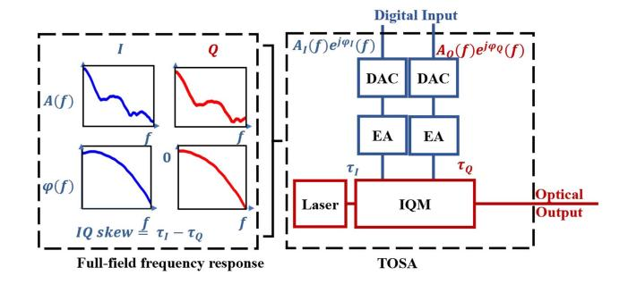
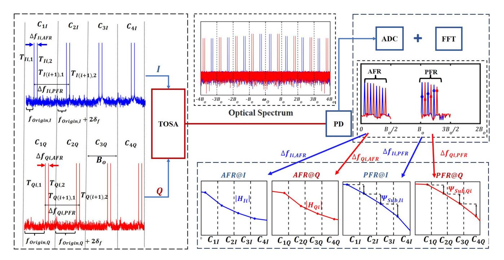
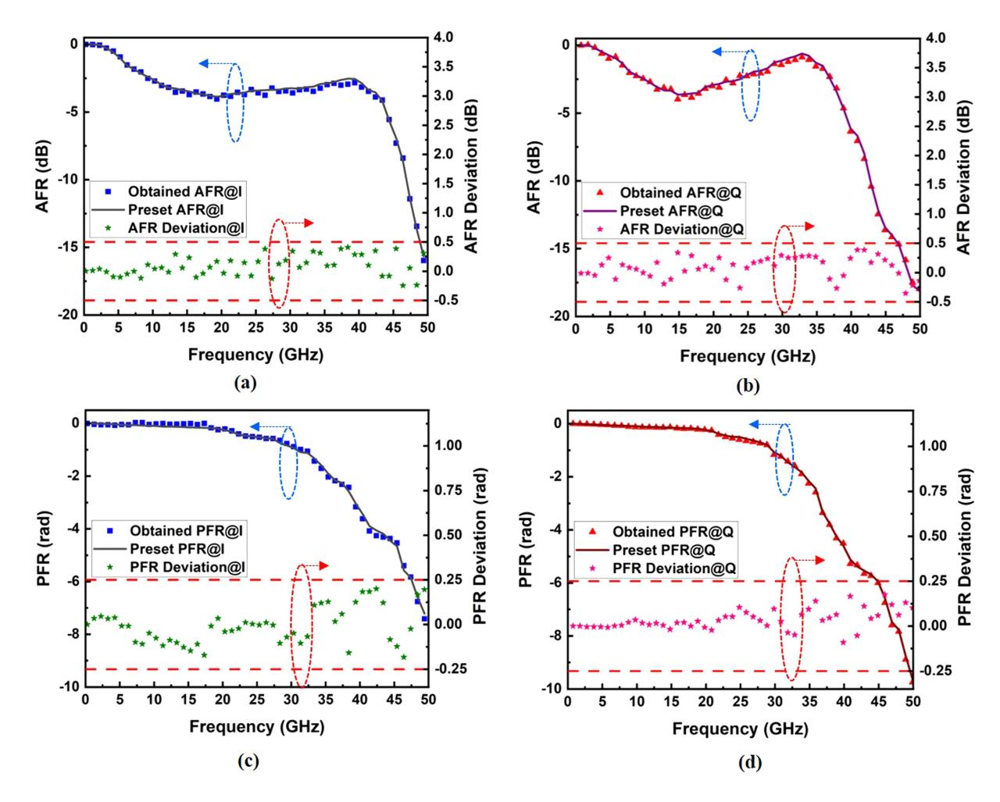
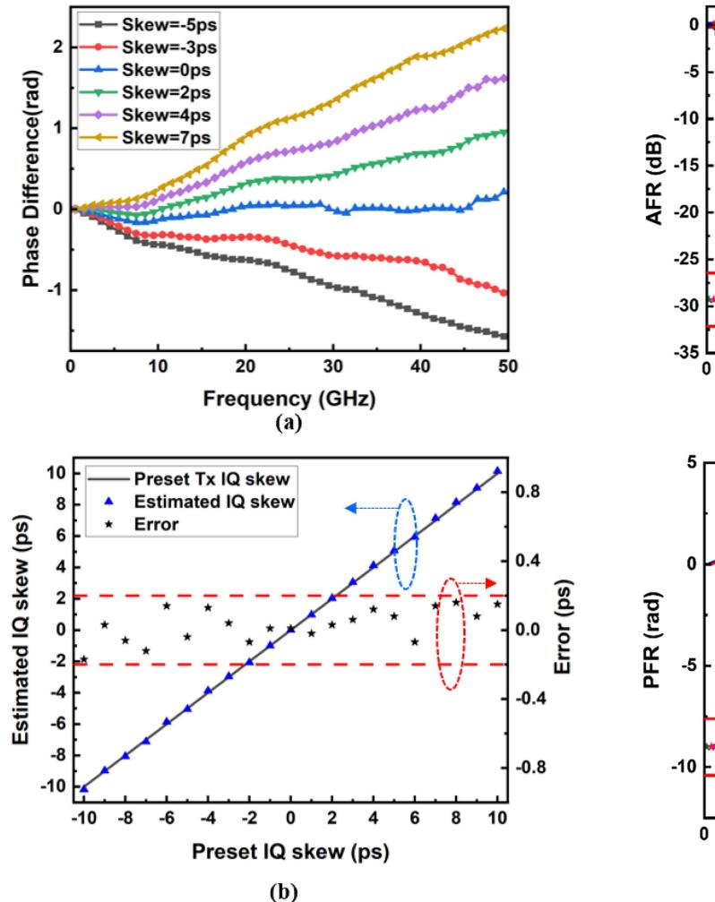
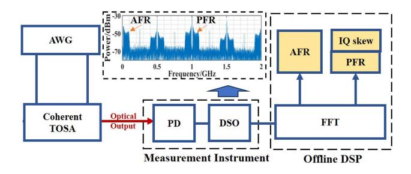
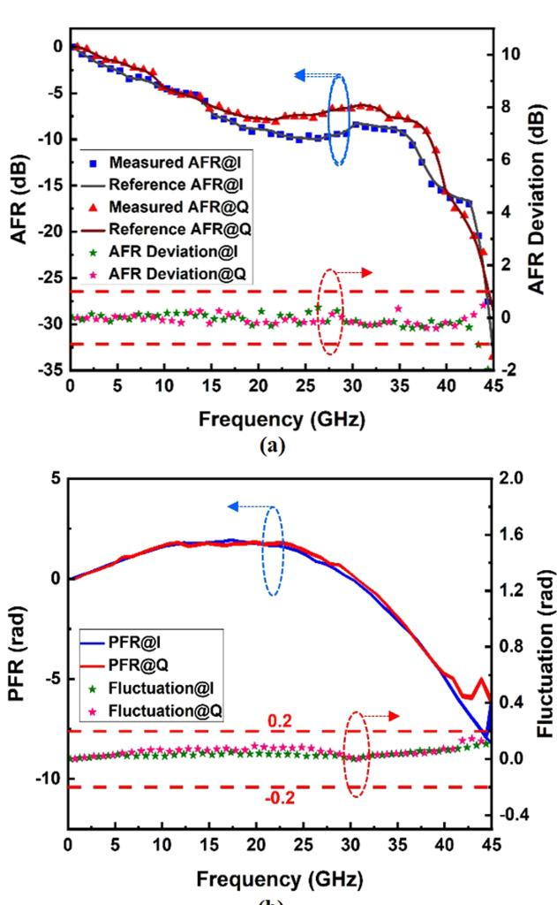
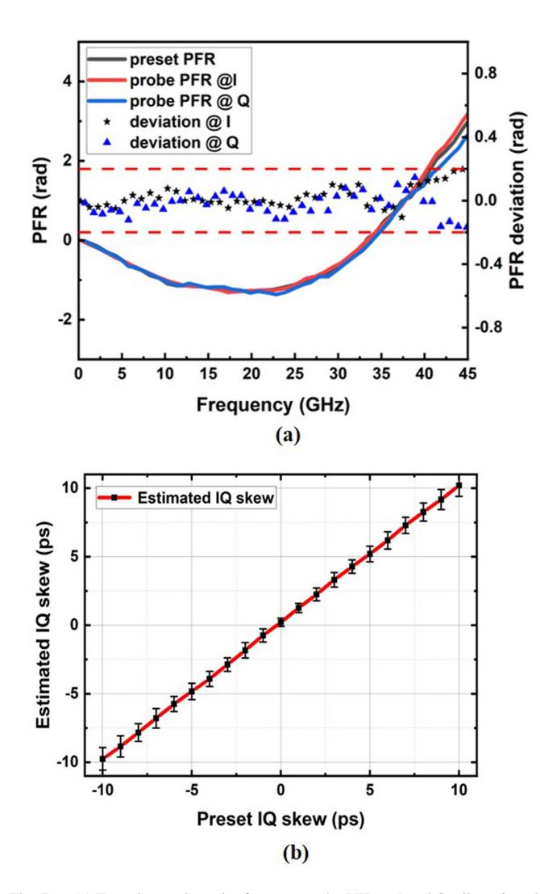
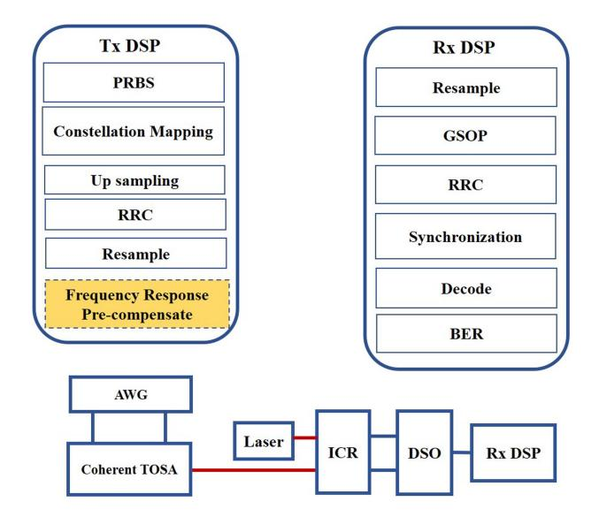
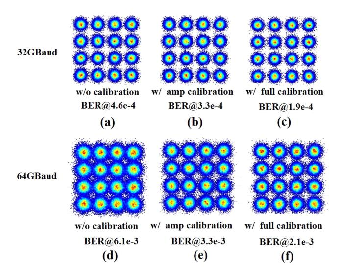

# Simple and Precise Characterization of Full-Field Frequency Response for Coherent TOSA

Ruitao Wu [,](https://orcid.org/0009-0008-0973-0807) Jilong Li [,](https://orcid.org/0000-0002-3189-8971) Gai Zhou [,](https://orcid.org/0000-0001-6278-5964) Meng Xiang [,](https://orcid.org/0000-0002-3052-2251) Li Zhang [,](https://orcid.org/0000-0002-3493-1124) Yuwen Qin [,](https://orcid.org/0000-0001-9879-1514) and Songnian Fu *[,](https://orcid.org/0000-0003-3330-9170) Senior Member, IEEE*

*Abstract***—The performance of high baud-rate fiber optical transmission with the use of advanced modulation formats is sensitive to the imperfection arising in transmitter optical sub-assembly (TOSA), and thus the effective calibration of the TOSA full-field response is essential. However, traditional TOSA frequency response characterization solutions are either inconvenient for the on-field measurement or unable to obtain the phase frequency response (PFR). Here, we report a simple and precise scheme to characterize the full-field frequency response of broadband TOSA, including both amplitude frequency response (AFR) and PFR, when only a single photodetector (PD) with narrow bandwidth is employed. A multiple dual-tone signals with specially designed frequency positions are implemented for electrical-to-optical modulation. Then, a few beat signals after direct detection occur at unique frequencies without the spectral overlapping. Thus, it is feasible to extract the full-field frequency response of broadband TOSA, under the single-shot measurement. Moreover, the in-phase and quadrature (IQ) skew can be obtained by comparing PFRs between I and Q tributaries. In the experiment, we successfully characterize a coherent TOSA with a 10 dB bandwidth of 40 GHz, when a single PD with a 3 dB bandwidth of 2 GHz is used. In comparison with the optical spectrum analyzer (OSA) based scheme, the measured AFR deviation is less than 1 dB over the 10 dB bandwidth. When multiple single-shot measurements are implemented within 1 minute, the fluctuation of measured PFR and IQ skew are less than 0.2 rad and 1 ps, respectively. With the help of the measured full-field frequency response, the coherent TOSA can be calibrated to realize 64 GBaud 16-quadrature amplitude modulation (QAM) back-to-back**

Manuscript received 7 September 2023; revised 16 December 2023; accepted 8 January 2024. Date of publication 10 January 2024; date of current version 2 May 2024. This work was supported in part by the National Key R&D Program of China under Grant 2021YFB2900702, in part by the National Natural Science Foundation of China under Grants 62025502 and U21A20506, in part by the Guangdong Introducing Innovative and Entrepreneurial Teams of "The Pearl River Talent Recruitment Program" under Grant 2021ZT09X044, and in part by The Project of Jiangsu Engineering Research Center of Novel Optical Fiber Technology and Communication Network, Soochow University. *(Corresponding author: Songnian Fu.)*

Ruitao Wu is with the School of Physics and Optoelectronic Engineering, Guangdong University of Technology, Guangzhou 510006, China (e-mail: [2112115129@mail2.gdut.edu.cn\)](mailto:2112115129@mail2.gdut.edu.cn).

Jilong Li, Gai Zhou, Meng Xiang, Yuwen Qin, and Songnian Fu are with the Institute of Advanced Photonics Technology, School of Information Engineering, and Key Laboratory of Photonic Techniques for Integrated Sensing and Communication, Ministry of Education, Guangdong University of Technology, Guangzhou 510006, China (e-mail: [jilongli@gdut.edu.cn;](mailto:jilongli@gdut.edu.cn) [gaizer3085@gdut.](mailto:gaizer3085@gdut.edu.cn) [edu.cn;](mailto:gaizer3085@gdut.edu.cn) [meng.xiang@gdut.edu.cn;](mailto:meng.xiang@gdut.edu.cn) [qinyw@gdut.edu.cn;](mailto:qinyw@gdut.edu.cn) [songnian@gdut.edu.](mailto:songnian@gdut.edu.cn) [cn\)](mailto:songnian@gdut.edu.cn).

Li Zhang is with the High Speed and High Frequency Lab, Huawei Technologies Company Ltd., Dongguan 523808, China (e-mail: [zhangli161@huawei.com\)](mailto:zhangli161@huawei.com).

Color versions of one or more figures in this article are available at [https://doi.org/10.1109/JLT.2024.3352493.](https://doi.org/10.1109/JLT.2024.3352493)

Digital Object Identifier 10.1109/JLT.2024.3352493

**transmission, when the threshold of 7% hard-decision forward error correction (HD-FEC) is set.**

*Index Terms***—Coherent fiber optical transmission, direct detection, frequency response, IQ skew.**

# I. INTRODUCTION

**I** N RECENT years, due to the rapid development of the Internet of Things and Artificial Intelligence (AI), the amount of data traffic is skyrocketing, leading to the urgent demand for transmission capacity [\[1\],\[2\],\[3\].](#page-7-0) Currently, the use of advanced modulation format along with high baud-rate is indispensable to achieve 800G and even higher transmission rate per wavelength. However, non-negligible frequency dependent imperfection (FDI) arising in broadband optical transceiver occurs [\[4\],](#page-7-0) [\[5\].](#page-7-0) Generally, optical transceiver includes a transmitter optical sub-assembly (TOSA) and a receiver optical sub-assembly (ROSA). The FDI of TOSA and ROSA is determined by the amplitude frequency response (AFR), the phase frequency response (PFR), and the time skew between different tributaries. Therefore, it is vital to de-couple the full-field frequency response of TOSA and ROSA, for the ease of calibration at the transmitter-side (Tx) and equalization at the receiver side (Rx), respectively [\[5\].](#page-7-0) It has been identified that, the signal to noise ratio (SNR) penalty induced by AFR, PFR and in-phase and quadrature (IQ) skew becomes more stringent, when both the order of advanced modulation format and the baud-rate are enhanced. From 16-quadrature amplitude modulation (QAM) to 256-QAM at the bit error ratio (BER) threshold of 1 × 10−2, without the calibration at the Tx, the tolerance of AFR and PFR varies from 1.6 dB to 0.2 dB and from 10.5° to 1.4°, respectively. In particular, the tolerance of IQ skew is reduced from 11% to 2.5% of the symbol period [\[6\].](#page-7-0) Therefore, characterizing and calibrating the FDI of TOSA are essential for the application of broadband optical transceiver. Lots of works have been done to characterize and mitigate the FDI of ROSA. For example, timing recovery algorithms [\[7\],](#page-7-0) [\[8\],](#page-7-0) [\[9\]](#page-7-0) and multi-input multi-output (MIMO) [\[10\],](#page-7-0) [\[11\],](#page-7-0) [\[12\]](#page-7-0) can estimate the IQ skew of RSOA. Both AFR and PFR can be estimated and calibrated by either the number of taps of digital equalizer [\[13\],](#page-7-0) [\[14\],](#page-7-0) [\[15\]](#page-7-0) or the sweeping frequency method [\[16\],](#page-7-0) [\[17\],](#page-7-0) [\[18\].](#page-7-0) However, only a few efforts have been devoted to characterize the FDI of TOSA. Current schemes to characterize the frequency response of TOSA mainly involve the use of an optical spectrum analyzer (OSA) or vector network analyzer (VNA). The OSA can obtain

0733-8724 © 2024 IEEE. Personal use is permitted, but republication/redistribution requires IEEE permission. See https://www.ieee.org/publications/rights/index.html for more information.

| Reference    | TOSA Bandwidth | Monitor Device Bandwidth | Amplitude Frequency Response(AFR) | AFR Deviation | Phase Frequency Response(PFR) | PFR Deviation | IQ skew | IQ skew Estimation Error | Monitor Device      |                       |
|--------------|-------------------|--------------------------------|-----------------------------------------|------------------|----------------------------------|------------------|------------|--------------------------------|---------------------|-----------------------|
|              |                   |                                |                                         |                  |                                  |                  |            |                                | Direct Detection | Coherent Detection |
| [20][21]     | 43GHz             | 50GHz                          | ✓                                       | 2dB              | -                                | -                | ✓          | 0.2ps                          |                     | ✓                     |
| [22]         | 25GHz             | <1GHz                          | ✓                                       | 1.5dB            | -                                | -                | -          | -                              | ✓                   |                       |
| [23][24]     | 23GHz             | 1GHz                           | ✓                                       | 0.5dB            | -                                | -                | ✓          | 0.2ps                          | ✓                   |                       |
| [25]         | 32GHz             | 6GHz                           | -                                       | -                | ✓                                | 0.3rad           | -          | -                              | √M                  |                       |
| This work | 50GHz             | 2GHz                           | ✓                                       | 0.5dB            | ✓                                | 0.25rad          | ✓          | 0.2ps                          | ✓                   |                       |

TABLE I

RECENT PROGRESS OF TOSA FREQUENCY RESPONSE MEASUREMENT UNDER NUMERICAL SIMULATION

the overall AFR. However, the PFR information is lost. VNA can characterize the full-field frequency response. However, it is inconvenient to online characterize the FDI of TOSA, which severely hinders the calibration of TOSA with high-cost performance.

Therefore, a new characterization scheme that can acquire the full-filed frequency response of TOSA is urgently required. In [19], an ultrafine optical frequency comb is generated as a frequency ruler for the characterization, where each tone provides one sampling point and the full-field spectrum can be captured at the same time by the coherent detection. However, the used coherent receiver must have a bandwidth larger than that of the TOSA under test. In [20], [21], a precise calibration scheme for optical coherent transceivers based on specially designed interleaved IQ multi-tone signals is reported, to characterize the frequency response after the single-shot measurement. However, it cannot discriminate the frequency response between the TOSA and the ROSA. In [22], when the IQ responses are assumed to be the same, the frequency response is possible to be acquired by multi-tone signals, together with a low bandwidth PD. In [23], [24], [25], the IQ multiple dual-tone signals are generated when additional frequency components are inserted near the origin frequency comb, leading to the occurrence of beat signals after the direct detection by a low-bandwidth PD. Assuming that the frequency response of PD is flat, the AFR can be obtained by the beat signals. However, the PFR is impossible to obtain, and the IQ skew needs to be estimated by the use of additional coherent receiver. In [26], it is experimentally verified that, both the PFR and the delay of the fiber optics link can be obtained when the data originating from dual-tone signals are constantly processed after the direction detection. However, it needs multi-shot measurements to characterize the PFR of a single tributary for a coherent TOSA.

In the current submission, we propose a new scheme to simultaneously characterize the AFR, PFR and IQ skew of a coherent TOSA after the direct detection, under the condition of the single-shot measurement. When the multiple dual-tone signals with unequal frequency spacing are used, the full-field frequency response can be divided into multiple channels, and each channel contains two frequency components with a small frequency interval. After direct detection, the AFR can be extracted from the beat signal within the channel, and the PFR and IQ skew can be extracted from the beat signals between

Fig. 1. Schematic of a coherent TOSA.  $A_{I/Q}e^{j\varphi_{I/Q}}(f)$  represents the full-field frequency response of the I or Q tributary,  $\tau_{I/Q}$  is the delay of I and Q tributaries, respectively. DAC: Digital to analog converter, EA: Electrical amplifier, IQM: IQ modulator.

two adjacent channels. To the best of our knowledge, it is the first demonstration of the TOSA full-field frequency response characterization via a single low-bandwidth PD. As shown in Table I, we review the recent numerical results to achieve both the full-field frequency response and the estimated IQ skew of TOSA. In the experiment, a PD with a 3 dB bandwidth of 2 GHz is used to characterize a coherent TOSA with a 10 dB bandwidth of 40 GHz. In comparison with the traditional OSA-based scheme, the AFR deviation is less than 1 dB over the 10 dB bandwidth. When multiple single-shot measurements are implemented within 1 minute, the fluctuation values of both PFR and IQ skew are less than 0.2 rad and 1 ps, respectively. With the help of the measured full-field frequency response, we can calibrate the coherent TOSA, in order to successfully realize 64 GBaud 16-QAM back-to-back (B2B) transmission, when the threshold of 7% hard decision forward error correction (HD-FEC) is set.

# II. OPERATION PRINCIPLE

#### A. Measurement Principle

Currently, the commonly-used TOSA includes digital to analog converter (DAC), electrical amplifier (EA), electro-optical modulator (EOM), and interconnection wires. As for the coherent TOSA, there occur AFR, PFR, and delay of I and Q tributaries to be precisely characterized. Fig. 1 is the schematic representation of a coherent TOSA, where  $A(\omega)$  represents AFR,  $\varphi(\omega)$  denotes PFR, and  $\tau$  represents the delay of a single

✓ M means this scheme is operated under the multiple-shot direct detections.

Fig. 2. Simulation setup. C denotes the specific channel with a width of  $B_o$ . T denotes the multiple dual-tone signals in the frequency domain, and all tones in a single tributary have the same amplitude and a fixed initial phase.

tributary. In our scheme, the frequency response to be characterized is divided into N channels with a spacing of  $B_o$ , as shown in Fig. 2. We assume that, the frequency response at a specific frequency of each channel can approximately represent the frequency response of each channel. Thus, the frequency span to be characterized is

$$BW = N \times B_o \tag{1}$$

When the multiple dual-tone signals are introduced to I or Q tributary, the frequency interval between the dual-tone is increased from the first channel to the last channel. The specially designed dual-tone signals satisfy the condition of unequal frequency interval of dual-tone signals for different channels, and the frequency position at the ith channel is

$$f_{Ii,1} = f_{I,Origin} + (i-1) \times (B_o + 2\delta_f)$$

$$f_{Ii,2} = f_{I,Origin} + f_{I,Basic} + (i-1) \times (B_o + 4\delta_f)$$

$$f_{Qi,1} = f_{Q,Origin} + (i-1) \times (B_o + 2\delta_f)$$

$$f_{Oi,2} = f_{Q,Origin} + f_{Q,Basic} + (i-1) \times (B_o + 4\delta_f) \quad (2)$$

where  $f_{(I/Q),Origin}$  is the frequency position of the first channel at I or Q tributary. It is set far less than  $B_o$ , in order to separate I and Q tributaries and avoid the second harmonic interference. The third harmonic interference of the modulator is small enough that could be ignored when keeping the voltage level of the driver signal below  $0.5V_{\pi}$ .  $f_{(I/Q),Basic}$  is the basic frequency interval between the dual-tone signals at the first channel. As the channel number N increases, the frequency interval between dual-tone signals increases with a step of  $2\delta_f$ .  $\delta_f$  is the incremental frequency interval, and  $F_o = B_o + 2\delta_f$ 

is the frequency gap between adjacent dual-tone signals. The multiple dual-tone electrical signals in the frequency domain can be described as

$$S_{I} = A_{O} \sum_{i=1}^{N} \left[ \cos(2\pi f_{Ii,1}t + \varphi_{Ii,1}) + \cos(2\pi f_{Ii,2}t + \varphi_{Ii,2}) \right]$$

$$S_Q = A_O \sum_{i=1}^{N} \left[ \cos(2\pi f_{Qi,1}t + \varphi_{Qi,1}) + \cos(2\pi f_{Qi,2}t + \varphi_{Qi,2}) \right]. \tag{3}$$

where  $\cos(2\pi f_{Ii,1}t + \varphi_{Ii,1})$  is the temporal expression of  $T_{Ii,1}$ ,  $A_O$  represents the amplitude,  $f_{(\cdot)}$  represents the frequency at the ith channel, and t represents the time variable.  $\varphi_{(\cdot)}$  is the default initial phase to reduce the peak-to-average power ratio (PAPR), and conditions of  $\varphi_{Ii,1} = \varphi_{I(i+1),2}$  and  $\varphi_{Qi,1} = \varphi_{Q(i+1),2}$  are satisfied for the ease of acquiring the phase variation.

After the carrier-suppressed modulation, under the smallsignal model, the corresponding optical signals are expressed as

$$S_{OI} = e^{j\omega_o t} \sum_{i=1}^{N} \left[ A_{Ii,1} \cos(2\pi f_{Ii,1} t + \varphi_{Ii,1} + \Delta \varphi_{Ii,1}) + A_{Ii,2} \cos(2\pi f_{Ii,2} t + \varphi_{Ii,2} + \Delta \varphi_{Ii,2}) \right]$$

$$S_{OQ} = e^{j\omega_o t} \sum_{i=1}^{N} \frac{\left[ A_{Qi,1} \cos(2\pi f_{Qi,1} t + \varphi_{Qi,1} + \Delta \varphi_{Qi,1}) + A_{Qi,2} \cos(2\pi f_{Qi,2} t + \varphi_{Qi,2} + \Delta \varphi_{Qi,2}) \right]}{2\pi i \pi i}$$

$$S_O = S_{OI} + jS_{OO} \tag{4}$$

where  $A_{(\cdot)}$  represents the amplitude proportional to the AFR of the TOSA,  $\omega_O$  represents the carrier frequency of the laser,  $\Delta\varphi_{(\cdot)}$  represents the phase variation arising in the TOSA, and  $S_O$  represents the output optical signal.

After the direct detection, beat frequencies of  $\Delta f_{Ii,AFR}$  between  $T_{Ii,1}$  and  $T_{Ii,2}$  and  $\Delta f_{Qi,AFR}$  between  $T_{Qi,1}$  and  $T_{Qi,2}$  at the range  $(0, B_o/2)$ , respectively, are used to extract the AFR,

$$\Delta f_{Ii,AFR} = f_{Ii,2} - f_{Ii,1} = f_{I,Basic} + 2(i-1)\delta_f$$

$$\Delta f_{Qi,AFR} = f_{Qi,2} - f_{Qi,1} = f_{Q,Basic} + 2(i-1)\delta_f$$
 (5)

where  $T_{(\cdot)}$  represents the first or second tone in the I or Q tributary of ith channel. Meanwhile, beat frequencies of  $\Delta f_{Ii,PFR}$  between  $T_{Ii,1}$  and  $T_{I(i+1),2}$ , and  $\Delta f_{Qi,PFR}$  between  $T_{Qi,1}$  and  $T_{Q(i+1),2}$  at the range  $(B_o, 3B_o/2)$  are used to extract the PFR,

$$\Delta f_{Ii,PFR} = f_{I(i+1),2} - f_{Ii,1} = f_{I,Basic} + B_o + 2(i+1)\delta_f$$
  
$$\Delta f_{Qi,PFR} = f_{Q(i+1),2} - f_{Qi,1} = f_{Q,Basic} + B_o + 2(i+1)\delta_f$$
  
(6

Therefore, a PD whose 3 dB bandwidth is equal to  $2B_o$  is enough to characterize the full-field frequency response of coherent TOSA. Please note that, the multiple dual tone signals lead to the occurrence of many other beat frequencies in addition to those shown in (5) and (6), but they do not overlap with each other, thanks to our unique frequency design according to (2). The dual-tone signal at each channel leads to the generation of beat signals, which can be expressed as

$$S_{PD} = R \sum_{i=1}^{N} \begin{cases} A_{Ii,1} A_{Ii,2} \cos \left[ 2\pi \Delta f_{Ii,AFR} t \right. \\ + \left( \varphi_{Ii,2} + \Delta \varphi_{Ii,2} - \varphi_{Ii,1} - \Delta \varphi_{Ii,1} \right) \right] \\ + A_{Qi,1} A_{Qi,2} \cos \left[ 2\pi \Delta f_{Qi,AFR} t \right. \\ + \left( \varphi_{Qi,2} + \Delta \varphi_{Qi,2} - \varphi_{Qi,1} - \Delta \varphi_{Qi,1} \right) \right] \end{cases}$$

$$+ R \sum_{i=1}^{N-1} \begin{cases} A_{Ii,1} A_{I(i+1),2} \cos \left[ 2\pi \Delta f_{Ii,PFR} t \right. \\ + \left( \Delta \varphi_{I(i+1),2} - \Delta \varphi_{Ii,1} \right) \right] \\ + A_{Qi,1} A_{Q(i+1),2} \cos \left[ 2\pi \Delta f_{Qi,PFR} t \right. \\ + \left( \Delta \varphi_{Q(i+1),2} - \Delta \varphi_{Qi,1} \right) \right] \end{cases}$$

where R denotes the PD responsivity.

Since the frequency interval of the dual-tone signal at each channel is far less than the channel spacing, we can reasonably assume that  $A_{Ii,1} \approx A_{Ii,2}$  and  $A_{Qi,1} \approx A_{Qi,2}$ . Therefore, the amplitude of the beat frequency  $\Delta f_{Ii,AFR}$  and  $\Delta f_{Qi,AFR}$ , which can be obtained simply by Fourier transform, represents the AFR at frequencies  $(f_{Ii,1}+f_{Ii,2})/2$  and  $(f_{Qi,1}+f_{Qi,2})/2$ , respectively. Taking the I tributary as an example, we can obtain the AFR by

$$|H_{Ii}| = \sqrt{A_{Ii,1}A_{Ii,2}} \approx \sqrt{|A_{Ii,1}|^2}$$
 (8)

where  $H_{(\cdot)}$  represents the AFR.

The PD outputs at frequencies of  $\Delta f_{Ii,PFR}$  and  $\Delta f_{Qi,PFR}$  contain the PFR difference between two adjacent channels, which is expressed as

$$\Psi_{Sub,Ii} = \Delta \varphi_{I(i+1),2} - \Delta \varphi_{Ii,1} \tag{9}$$

According to the relationship between the group delay and the phase variation of  $\tau = \Delta \varphi/2\pi \Delta f$ , the delay of one tributary, taking the I tributary as an example, can be obtained by

$$Delay_{I} = \frac{1}{2\pi(M_{I} - 1)} \sum_{i=1}^{M_{I} - 1} \frac{\Psi_{Sub,Ii}}{\Delta f_{Ii,PFR}}$$
(10)

where  $Delay_I$  indicates the delay of I tributary, and  $M_I$  represents the channel number over the 10 dB bandwidth, where the PFR is mostly contributed by the delay [26]. In case the PFR deviation caused by the noise of the characterization system is dE, the precision of the obtainable skew is estimated by  $dE/(M_IB_0)$ .

After eliminating the delay in the phase information, the phase-frequency response difference between two adjacent channels can be obtained, as shown in (11),

$$\Phi_{Changed,Ii} = \Psi_{Sub,Ii} - Delay_I \times 2\pi \times \Delta f_{Ii,PFR} \quad (11)$$

Taking the phase of the first channel as a reference, the PFR can be obtained by

$$\Phi_{Final,IN} = \sum_{i=1}^{N-1} \Phi_{Changed,Ii}$$
 (12)

Then the AFR  $|H_{\rm QN}|$ , the PFR  $\Phi_{Final,\ QN}$ , and the delay  $Delay_Q$  of Q tributary can be obtain by the same method. Finally, the IQ skew is the delay difference between I and Q tributaries, as shown in (13),

$$Skew = Delay_I - Delay_O \tag{13}$$

# B. Numerical Simulation

Fig. 2 is the schematic of the characterization system for numerical simulation. The coherent TOSA under test consists of two EAs, an IQ modulator, and a continuous wave (CW) semiconductor laser with a linewidth of 10 kHz. We load the full-field frequency response of the TOSA with a 10 dB bandwidth of 50 GHz from the vendor, used as the benchmark for the ease of comparison. Meanwhile, the IQ skew can be intentionally varied from -10 ps to 10 ps. The output optical signal is detected by a PD with a 3 dB bandwidth of 2 GHz, and then recorded by an analog to digital converter (ADC) operated at 5 GSa/s. Since the 10 dB bandwidth of the TOSA under test is 50 GHz, we divided the frequency span into 50 channels with a spacing Bo of 1 GHz, indicating a frequency resolution of 1 GHz for the full-field frequency response characterization. In order to balance the FFT size and the measurement range of frequency response, the incremental value  $\delta_f$  is set to 1 MHz,  $f_{I,Origin}$  is 245 MHz,  $f_{Q,Origin}$  is 746 MHz,  $f_{I,Basic}$  is 11 MHz,  $f_{Q,Basic}$ is 12 MHz.

After the direct detection, the beat signals within  $0\sim0.5$  GHz are used to extract the AFR. The beat signals within  $1\sim1.5$  GHz are used to extract the PFR. Since the channel spacing  $B_o$  is 1 GHz, the PD with 3 dB bandwidth of 2 GHz is good enough.

Fig. 3 shows the simulation results of the full-field frequency response of the coherent TOSA. As shown in Fig. 3(a) and (b), in comparison with the vendor data, the maximum AFR deviation within the 10 dB bandwidth is smaller than 0.5 dB. Meanwhile, the maximum PFR deviation within the 10 dB bandwidth is less than 0.25 rad, as shown in Fig. 3(c) and (d). Fig. 4 shows the simulation results of IQ skew for the coherent TOSA. Since variable IQ skews from -10 ps to 10 ps are used during the simulation, Fig. 4(a) is the phase difference between I and Q tributaries, where the slope can be used for the IQ

Fig. 3. Numerical simulation results. (a) and (b) The obtained AFR for I (a) and Q (b) tributaries, along with the estimated AFR deviation within the bandwidth of 50 GHz. (c) and (d) The obtained PFR of I (c) and Q (d) tributaries, along with the estimated PFR deviation.

skew estimation. The estimated IQ skew values agree well with the preset values, with an estimation error of less than 0.2 ps, as shown in Fig. 4(b). In summary, we numerically verify the full-field frequency response characterization and the estimation of IQ skew. As for the externally modulated laser (EML) based TOSA, which can be treated as a single tributary of the coherent TOSA, our proposed characterization scheme is still valid.

#### III. EXPERIMENTAL RESULTS AND DISCUSSIONS

#### A. TOSA Measurement Results

We initially carry out a proof-of-concept experiment to characterize the full-filed response of a coherent TOSA. The channel spacing  $B_o$  of the frequency span to be characterized is 1 GHz, while the incremental value  $\delta_f$  of the frequency interval is 1 MHz. The first frequency  $f_{I,Origin}$  and  $f_{Q,Origin}$  of the first channel of I and Q tributaries are 245 MHz and 746 MHz, respectively. The basic frequency intervals  $f_{I,Basic}$  and  $f_{Q,Basic}$  between the dual-tone signals at the first channel are set to 11 MHz and 12 MHz, respectively. The experimental setup is shown in Fig. 5. The multiple dual-tone signals are generated by an arbitrary waveform generator (AWG, Keysight 8194A),

whose sampling rate is 120 GSa/s. The amplitude of AWG output is 300 mV. Then, the generated multiple dual-tone electrical signals are loaded into the coherent TOSA operated at 1550 nm. The output optical signal of coherent TOSA is directly detected by a PD with a 3 dB bandwidth of 2 GHz, and then received by a digital storage oscilloscope (DSO) with a sampling rate of 5 GSa/s. Note that the frequency response of the PD and the oscilloscope are firstly calibrated with the help of a microwave oscillator and a wide-bandwidth MZM. Afterward, the digital signal processing (DSP) at the Rx, containing FFT and the extraction of both the amplitude and phase information of the beat signals according to (7), (8) and (9), is performed to obtain the full-field frequency response and IQ skew of coherent TOSA.

The full-field frequency response characterization results of I and Q tributaries over a frequency range of  $0{\sim}45$  GHz are shown in Fig. 6(a). The measured AFR results acquired by the proposed method are compared with those acquired by the OSA (APEX AP2081A), whose the frequency resolution is 5 MHz. It can be seen that, the measured AFR results keep consistent with the reference, and the AFR deviation is less than 1 dB over the 10 dB bandwidth of the coherent TOSA. Since we cannot obtain the standard PFR, multiple single-shot measurements are

Fig. 4. Numerical simulations results. (a) Phase difference between I and Q tributaries to obtain the skew induced phase difference. (b) Measured IQ skew and the estimation error.

Fig. 5. Experimental setup for characterizing the full-filed response of coherent TOSA and the exemplary spectrum captured by the real-time oscilloscope.

implemented over 1 minute and the PFR results are summarized in Fig. 6(b). The PFR fluctuation of multiple experimental results is within 0.2 rad. Furthermore, we introduce a preset probe PFR at I and Q tributaries and measure the PFR with and without the probe PFR, respectively. As shown in Fig. [7\(a\),](#page-6-0) the measured PFR results keep consistent with the preset PFR, and the PFR deviation is less than 0.2 rad. Then we intentionally vary the

Fig. 6. Experimental results of the full-field frequency response of coherent TOSA. (a) The measured AFR of I and Q tributaries and the estimated AFR deviation within the bandwidth of 45 GHz. (b) The measured PFR of I and Q tributaries and the fluctuation of 20 single-shot measurements within the bandwidth of 45 GHz.

IQ skew within the range from −10 ps to 10 ps by adding a linear phase frequency response. The capability of our proposed scheme to precisely estimate the IQ skew is successfully verified. The IQ skew can be obtained, as shown in the Fig. [7\(b\).](#page-6-0) With the use of our proposed scheme, the estimated IQ skew results fluctuate within ±1 ps on the average value.

# *B. TOSA Calibration and Transmission Results*

Based on the characterized full-field frequency response, we carry out a B2B transmission by the use of the coherent TOSA under test. The experimental setup is presented in Fig. [8.](#page-6-0) The pseudo-random bit sequence (PRBS) with a length of 217 is offline generated. The baud rates of 16-QAM signal are 32 GBaud and 64 GBaud, respectively. After up-sampling and raised root cosine (RRC) filtering, the signal is resampled to 120 GSa/s. Then, we carry out experimental verifications in the following three situations, without frequency response calibration, with

Fig. 7. (a) Experimental result of pre-set probe PFR at I and Q tributaries. (b) Experimentally measured IQ skew of coherent TOSA with respect to the preset IQ skew.

Fig. 8. Experimental setup of coherent transmission system.

Fig. 9. Experimental result of coherent TOSA calibration. (a)–(c) Results of 32 GBaud 16-QAM B2B transmission without calibration (a), with the AFR calibration (b), and with the AFR, PFR and IQ skew calibration (c). (d)–(f) Results of 64 GBaud 16-QAM B2B transmission without the calibration (d), with the AFR calibration (e), and with the AFR, PFR, and IQ skew calibration (f).

only AFR calibration, and with full-field frequency response calibration. The AWG output is introduced to the coherent TOSA, in order to generate the 32 or 64 GBaud 16-OAM optical signal. The operation wavelength of optical carrier is 1550 nm, and another wavelength tunable laser operated at 1550 nm acts as the local oscillator (LO) at the Rx. Then, the Rx, including the tunable wavelength laser and an integrated coherent receiver (ICR) whose 3 dB bandwidth is 50 GHz, is used to complete the coherent detection. Therefore, even when the 64 GBaud 16-QAM is coherently detected, the B2B transmission is free of Rx bandwidth constraint. The DSO operated at 160 GSa/s is performed to record the receiver data. After the offline DSP, we are able to obtain various 16-QAM constellations. As shown in Fig. 9, after the full-field frequency response calibration of coherent TOSA, the BER of 32 GBaud 16-QAM signal is improved from  $4.6 \times 10^{-4}$  to  $1.9 \times 10^{-4}$ . Meanwhile, the BER of 64 Gbaud 16-QAM signals is improved from  $6.1 \times 10^{-3}$ to  $2.1 \times 10^{-3}$ , which can reach the threshold of 7% HD-FEC threshold at  $3.8 \times 10^{-3}$ . Moreover, the calibrated 16-QAM constellation based on the full-field frequency response becomes clearer than that without the TOSA calibration and with only AFR calibration.

# IV. CONCLUSION

We have reported a simple and precise scheme to characterize the full-field frequency response of coherent TOSA, including both AFR and PFR, when only one single PD with narrow bandwidth is employed. By the use of a test signal with a specially designed frequency interval, for the electrical-to-optical modulation, a few beat signals after direct detection occur at unique frequencies without spectral overlapping, which makes it feasible to extract the full-field frequency response of coherent TOSA, under the single-shot measurement. Furthermore, the IQ skew can be obtained by the comparison of two PFRs between I and Q tributaries. Experimentally, a coherent TOSA with a 10 dB bandwidth of 40 GHz is successfully characterized by the use of a single PD with a 3 dB bandwidth of 2 GHz. The measured AFR deviation is less than 1 dB over the 10 dB bandwidth, by taking the OSA-based scheme as a reference. When multiple single-shot measurements are implemented within 1 minute, the fluctuation values of measured PFR and IQ skew are less than 0.2 rad and 1 ps, respectively. After the full-field frequency response calibration, the B2B transmission of 64 GBaud 16-QAM can reach the threshold of 7% HD-FEC.

# REFERENCES

- [1] K. Kikuchi, "Fundamentals of coherent optical fiber communications," *J. Lightw. Technol.*, vol. 34, no. 1, pp. 157–179, Jan. 2016.
- [2] C. Cisco, "Annual internet report (2018–2023) white paper," San Jose, CA, USA, White Paper 2020. [Online]. Available: [https://www.cisco.](https://www.cisco.com/c/en/us/solutions/collateral/executive-perspectives/annual-internet-report/white-paper-c11-741490.html) [com/c/en/us/solutions/collateral/executive-perspectives/annual-internet](https://www.cisco.com/c/en/us/solutions/collateral/executive-perspectives/annual-internet-report/white-paper-c11-741490.html)[report/white-paper-c11-741490.html](https://www.cisco.com/c/en/us/solutions/collateral/executive-perspectives/annual-internet-report/white-paper-c11-741490.html)
- [3] A. Ferrari et al., "Assessment on the achievable throughput of multi-band ITU-T G.652.D fiber transmission systems," *J. Lightw. Technol.*, vol. 38, no. 16, pp. 4279–4291, Aug. 2020.
- [4] Z. Tao et al., "Characterization, measurement and specification of device imperfections in optical coherent transceivers," *J. Lightw. Technol.*, vol. 40, no. 10, pp. 3163–3172, May 2022.
- [5] J. Liang, Y. Fan, Z. Tao, X. Su, and H. Nakashima, "Transceiver imbalances compensation and monitoring by receiver DSP," *J. Lightw. Technol.*, vol. 39, no. 17, pp. 5397–5404, Sep. 2021.
- [6] M. S. Faruk and S. J. Savory, "Digital signal processing for coherent transceivers employing multilevel formats," *J. Lightw. Technol.*, vol. 35, no. 5, pp. 1125–1141, Mar. 2017.
- [7] Q. Zhang, Y. Yang, C. Gu, Y. Yao, A. P. T. Lau, and C. Lu, "Multidimensional, wide-range, and modulation-format-transparent transceiver imbalance monitoring," *J. Lightw. Technol.*, vol. 39, no. 7, pp. 2033–2045, Apr. 2021.
- [8] N. Stojanovic, T. Rahman, S. Calabrò, J. Wei, and C. Xie, "Baud-rate timing phase detector for systems with severe bandwidth limitations," in *Proc. Opt. Fiber Commun. Conf. Exhib.*, 2020, pp. 1–3.
- [9] N. Stojanovic et al., "Modified Gardner phase detector for Nyquist coherent optical transmission systems," in *Proc. Opt. Fiber Commun. Conf. Expo. Nat. Fiber Optic Engineers Conf.*, 2013, pp. 1–3.
- [10] R. Rios-Müller, J. Renaudier, and G. Charlet, "Blind receiver skew compensation for long-haul non-dispersion managed systems," in *Proc. Eur. Conf. Opt. Commun.*, 2014, pp. 1–3.
- [11] Y. Yang et al., "Cost-effective and robust DSP scheme for a short-reach coherent system in the presence of transmitter IQ skew and chromatic dispersion," *Opt. Lett.*, vol. 46, no. 18, pp. 4606–4609, 2021.

- [12] R. Rios-Müller, J. Renaudier, and G. Charlet, "Blind receiver skew compensation and estimation for long-haul non-dispersion managed systems using adaptive equalizer," *J. Lightw. Technol.*, vol. 33, no. 7, pp. 1315–1318, Apr. 2015.
- [13] M. Nakamura et al., "High baud rate signal transmission with coded multi-dimensional modulation," in *Proc. Eur. Conf. Opt. Commun.*, 2017, pp. 1–3.
- [14] M. Arikawa, M. Sato, and K. Hayashi, "Compensation and monitoring of transmitter and receiver impairments in 10,000-km single-mode fiber transmission by adaptive multi-layer filters with augmented inputs," *Opt. Exp.*, vol. 30, no. 12, pp. 20333–20359, 2022.
- [15] K. Ku, Y. Yu, S. Chi, and C. Wei, "Nonlinear pre-distortion in DML-based OFDM transmission enabled by low-complexity sparse volterra filtering," in *Proc. Opt. Fiber Commun. Conf. Exhib.*, 2022, pp. 1–3.
- [16] C. Ju et al., "Calibration of in-phase/quadrature amplitude and phase response imbalance for coherent receiver," in *Proc. Opt. Fiber Commun. Conf.*, 2017, pp. 1–3.
- [17] Y. Y. Fan et al., "Experimental verification of IQ imbalance monitor for high-order modulated transceivers," in *Proc. IEEE Euro. Conf. Opt. Commun.*, 2018, pp. 1–3.
- [18] S. Zhang, W. Li, W. Chen, Y. Zhang, and N. Zhu, "Accurate calibration and measurement of optoelectronic devices," *J. Lightw. Technol.*, vol. 39, no. 12, pp. 3687–3698, Jun. 2021.
- [19] Y. Bao et al., "A digitally generated ultrafine optical frequency comb for spectral measurements with 0.01-pm resolution and 0.7-µs response time," *Light: Sci. Appl.*, vol. 4, no. 6, 2015, Art. no. e300.
- [20] D. Li et al., "Simultaneously precise calibration of frequency response and IQ skew for 100Gbaud optical transceiver," in *Proc. Opt. Fiber Commun. Conf. Exhib.*, 2021, pp. 1–3.
- [21] L. Dai et al., "Experimental demonstration of simultaneously precise Tx and Rx skew calibration for coherent optical transceiver," *J. Lightw. Technol.*, vol. 40, no. 4, pp. 1043–1054, Feb. 2022.
- [22] C. R. S. Fludger, T. Duthel, P. Hermann, and T. Kupfer, "Low cost transmitter self-calibration of time delay and frequency response for high baud-rate QAM transceivers," in *Proc. Opt. Fiber Commun. Conf. Exhib.*, 2017, pp. 1–3.
- [23] L. Dai et al., "Simultaneously calibration of Tx/Rx frequency response and IQ skew for coherent optical transceiver," in *Proc. Opt. Fiber Commun. Conf. Exhib.*, 2022, pp. 1–3.
- [24] H. Li et al., "Real-time in-field automatic bias control and self-calibration module for high-baud coherent driver modulator," in *Proc. Opt. Fiber Commun. Conf. Exhib.*, 2022, pp. 1–3.
- [25] H. Y. Li et al., "Fast and simple calibration of frequency response and IQ skew for a coherent optical transmitter using a low-bandwidth photodetector," *Opt. Lett.*, vol. 47, no. 1, pp. 118–121, Jan. 2022.
- [26] Y. Y. Fan, Z. N. Tao, H. Nakashima, and T. Hoshida, "In-field calibration of phase response of optical transmitter using built-in monitor photodiode," in *Proc. Opt. Fiber Commun. Conf. Exhib.*, 2021, pp. 1–3.