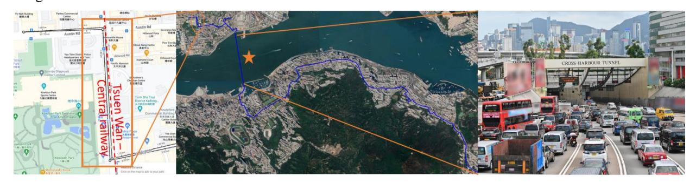

{0}------------------------------------------------

## **Integrated Sensing and Communications for Metropolitan Environments**

**Yaxi Yan, Jingming Zhang, Yinghuan Li, Liwang Lu, Jingchuan Wang, Kausthubh Chandramouli, Chao Lu and Alan Pak Tao Lau**

*Photonics Research Institute, Department of Electrical and Electronic Engineering, The Hong Kong Polytechnic University, Hong Kong SAR, China*

*Email: eeaptlau@polyu.edu.hk*

**Abstract:** We review our recent works on integrated sensing and communications and highlight smart city applications in metropolitan environments through deployed fibers across Hong Kong. © 2025 The Author(s)

## **1. Introduction**

In recent years, distributed optical fiber vibration sensing (DOFVS) is gaining attention as a low-cost, ubiquitous sensing systems in metropolitan environments by leveraging the vast networks of optical fibers already deployed across a city for telecommunications. Applications ranging from real-time traffic monitoring, security and intrusion detection are seen as emerging valuable technologies future smart cities. In this paper, we review the advances in the field of integrated sensing and communications and discuss advances in signal processing such as wavelet denoising [1], frequency filtering [2] or machine learning [3] as well as our recent works in using fiber interferometry to add vibration sensing to unidirectional coherent transmissions [4] , integrating sensing with coherent transmissions by inserting linear frequency modulation(LFM) probe into the training symbols of optical communication data frames[5], combining DAS and optical heterodyne radio over fiber by substituting traditional single-tone carrier with LFM carrier [6] and adding LFM DAS to WDM PON systems using dual optical frequency comb [7]. We will then discuss applications on traffic monitoring and other smart city applications [8] using multiple deployed fibers across Hong Kong.

Fig. 1. Example route of the deployed fiber (blue line) under study in Hong Kong, covering the cross-harbor tunnel (orange star) and the railway section in a busy area.

## **References**

- [1] H. Liu et al., IEEE Trans. Veh. Technol., 69, 1363–1374, 2020.
- [2] X. Wang et al., Commun. Earth Environ., 2, 160, 2021.
- [3] M. van den Ende, et al., IEEE Trans. Neural Netw. Learn. Syst., 34(7), 3371-3384, 2023.
- [4] Y. Yan et al, OFC 2023, paper W1J.4.
- [5] J. Wang et al, OFC 2024, paper Tu2J.3
- [6] J. Wang et al, CLEO 2024, paper SW4N.4
- [7] J. Wang et al, ECOC 2024, paper W3F.1
- [8] Y. Yan, et al. OFC 2024, M1K-4