{0}------------------------------------------------

# THz-Over-Fiber System With Orthogonal Chirp Division Multiplexing for Integrated Sensing and Communication

Lianyi Li®, Lu Zhang®, *Member, IEEE*, Hongqi Zhang®, Zhidong Lyu®, Zuomin Yang®, Xiaodan Pang®, *Senior Member, IEEE*, Vjaceslavs Bobrovs®, Oskars Ozolins®, *Senior Member, IEEE*, Hangbin Zhao®, Feng Li®, Changming Zhang®, and Xianbin Yu®, *Senior Member, IEEE* 

Abstract—To achieve integrated sensing and communication (ISAC) applications with high data rates and high resolution, the terahertz-over-fiber (ToF) system has been recognized as a promising solution. However, the frequency-selective fading would deteriorate the performance of the ToF-based ISAC systems. In this work, we propose the orthogonal chirp division multiplexing (OCDM) waveform-based ToF system for high-performance ISAC applications. The system encodes data with the phase of the sub-chirps and obtains radar images by processing echoes with the zero-padded matched filtering algorithm. We experimentally demonstrate a proof-of-concept OCDM-ToF system, which simultaneously achieves a 32 Gbit/s data rate and 1.875 cm range resolution after transmission over a 10 km optical fiber and a 3.14 m wireless link at the THz band, for the first time. The experimental results indicate that the OCDM-ToF system can enhance robustness against the frequency-selective fading issue, as a benefit improving

Manuscript received 13 February 2023; revised 19 June 2023 and 11 August 2023; accepted 30 August 2023. Date of publication 4 September 2023; date of current version 2 January 2024. This work was supported in part by the National Key Research and Development Program of China under Grant 2018YFB2201700, in part by the Pioneer and Leading Goose Research and Development Program of Zhejiang under Grant 2023C01139, in part by the National Natural Science Foundation of China under Grant 62101483, in part by the Natural Science Foundation of Zhejiang Province under Grant LQ21F010015, and in part by Vetenskapsrådet under Grant 2019-05197. (Corresponding authors: Xianbin Yu; Lu Zhang.)

This work did not involve human subjects or animals in its research.

Lianyi Li, Lu Zhang, Hongqi Zhang, Žhidong Lyu, and Zuomin Yang are with the College of Information Science and Electronic Engineering, Zhejiang University, Hangzhou 310027, China (e-mail: lilianyi@zju.edu.cn; zhanglu1993@zju.edu.cn; zhanghongqi@zju.edu.cn; zdlyu@zju.edu.cn; yangzuomin@zju.edu.cn).

Xiaodan Pang is with the Applied Physics Department, KTH Royal Institute of Technology, 164 40 Kista, Sweden, and also with the Institute of Telecommunications, Riga Technical University, LV-1048 Riga, Latvia (e-mail: xiaodan@kth.se).

Vjaceslavs Bobrovs is with the Institute of Telecommunications, Riga Technical University, LV-1048 Riga, Latvia (e-mail: vjaceslavs.bobrovs@rtu.lv).

Oskars Ozolins is with the Applied Physics Department, KTH Royal Institute of Technology, 164 40 Kista, Sweden, also with the Networks Unit, RISE Research Institutes of Sweden, 164 40 Kista, Sweden, and also with the Institute of Telecommunications, Riga Technical University, LV-1048 Riga, Latvia (e-mail: oskars.ozolins@ri.se).

Hangbin Zhao and Feng Li are with the China Mobile (Hangzhou) Information Technology Company, Ltd, Hangzhou 510100, China (e-mail: zhaohang-bin@cmhi.chinamobile.com; lifengyf@cmhi.chinamobile.com).

Changming Zhang and Xianbin Yu are with the Zhejiang Lab, Hangzhou 311121, China (e-mail: zhangcm@zhejianglab.com; xyu@zhejianglab.com).

Color versions of one or more figures in this article are available at https://doi.org/10.1109/JLT.2023.3311645.

Digital Object Identifier 10.1109/JLT.2023.3311645

communication performance with high data rates while preserving the high sensing resolution of OFDM in the THz ISAC applications.

Index Terms—Integrated sensing and communication, orthogonal chirp division multiplexing, terahertz-over-fiber.

#### I. INTRODUCTION

HE applications of integrated sensing and communication (ISAC), such as intelligent industry and the internet of vehicles, share the transceiver architectures and systems, which significantly saves hardware resources and improves system efficiency. Recently, the emergence of broadband and immersive services has driven the ISAC toward the targets of higher communication capacity [1], which requires a broadband ISAC system. In that sense, the terahertz frequency band (0.1 THz -10 THz) [2], identified as one of the key breakthroughs for developing broadband wireless technologies for 6G and beyond [3], is recognized as a promising candidate for high-performance ISAC development.

The realization schemes of the THz ISAC systems can be categorized into electronics- [4] and photonics-based [5] ones. Compared with the electrical schemes, the photonic THz ISAC systems provide benefits including broadband modulation bandwidth, high signal-to-noise ratio (SNR), and seamless convergence with the existing radio-over-fiber (RoF) based wireless access networks [6], i.e., the terahertz-over-fiber (ToF) system.

A competitive ISAC waveform is critical to the ToF ISAC systems for achieving high performance in the THz band. Compared with the single-carrier ISAC waveform [7], the multi-carrier signals can generally reduce the effects of waveform truncation and multipath fading at high data rates [8]. In that context, the orthogonal frequency division multiplexing (OFDM) waveform has been commonly used. However, the OFDM-ToF systems suffer from the frequency-selective fading issue caused by fiber dispersion, wireless links, and responses of the optoelectronic devices, which degrades the transmission performance of ISAC, such as the bit error rate (BER) and Q value fluctuation [9], [10], [11].

Alternatively, the orthogonal chirp division multiplexing (OCDM) waveform orthogonally multiplexes multiple subchirp waveforms with the same bandwidth and then spreads

0733-8724 © 2023 IEEE. Personal use is permitted, but republication/redistribution requires IEEE permission. See https://www.ieee.org/publications/rights/index.html for more information.

{1}------------------------------------------------

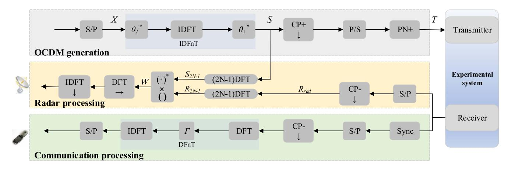

Fig. 1. OCDM waveform generation scheme and the receiving signal processing schemes of the communication and sensing applications.

the chirps in the frequency domain [12]. Owing to the spreading operation and convolution properties of the OCDM, the frequency-selective fading problem could be diluted, which could improve the ISAC performance. The authors in [13] have recently demonstrated a 16 Gbit/s OCDM communication system in the millimeter-wave region, suggesting that the OCDM can obtain a better communication performance than the OFDM. Nonetheless, further research on the OCDM-based sensing performance in an ISAC system are needed, particularly in the highly frequency-selective THz band.

In this article, we propose an OCDM waveform-based ToF system for ISAC applications and experimentally demonstrate a proof-of-concept ToF system at 0.14 THz to validate the OCDM ISAC performance. According to the research results, the OCDM waveform can perform robustly in the frequency-selective ISAC channels, thus improving communication performance with high data rates while preserving the high sensing resolution of OFDM.

## II. SYSTEM MODEL

The fundamental of the OCDM is Fresnel transform, just as the Fourier trans in OFDM. Fig. 1 depicts the generation and demodulation process schemes of the OCDM ISAC waveform. The modulation matrix *X* undergoes an inverse discrete Fresnel transform (IDFnT) to generate an OCDM frame *S* composed of *M* symbol blocks of length *N*, which can be expressed as:

$$S = \Phi^H X, \tag{1}$$

where  $\Phi$  is the discrete Fresnel transform (DFnT) matrix [14], and  $(\cdot)^H$  denotes conjugate transpose or Hermitian transpose.  $\Phi$  is defined as:

$$\Phi(m,n) = \frac{1}{\sqrt{N}} e^{-j\frac{\pi}{4}} \times \begin{cases} e^{j\frac{\pi}{N}(m-n)^2} & N \text{ mod } 2 \equiv 0\\ e^{j\frac{\pi}{N}(m-n+\frac{1}{2})^2} & N \text{ mod } 2 \equiv 1 \end{cases}, (2)$$

where *N* is an even integer in this study.

The cyclic prefix (CP), however, is inserted as the guard interval to the head of each column of *S* in the generation part.

Following the parallel-to-serial (P/S) conversion, a sequence of PN codes is added to the frame header to generate *T* as a complex signal input to the transmitter in the experimental system.

The compatibility of OCDM and OFDM ISAC waveforms is brought by the discrete Fourier transforms (DFT) and DFnT. The DFnT is composed of DFT and two *N*-length additional phase vector multiplications while retaining high-speed computing. The process can be expressed as:

$$\Phi^H = \theta_1^* F^H \theta_2^*, \tag{3}$$

where F is the DFT matrix and  $(\cdot)^*$  denotes complex conjugate. The length of the  $\theta_1$  and  $\theta_2$  vectors is identical to that of an OCDM symbol block.  $m^{th}$  refers to elements in  $\theta_1$  with  $m \in \{0,1,..., N-1\}$ , and  $n^{th}$ , elements in  $\theta_2$  with  $n \in \{0,1,..., N-1\}$ . The  $\theta_1$  and  $\theta_2$  are defined as [12]:

$$\theta_1(m) = e^{-j\frac{\pi}{4}} e^{j\frac{\pi}{N}m^2}.$$
 (4)

$$\theta_2(n) = e^{j\frac{\pi}{N}n^2}. (5)$$

The digital signal processing at the receiver is divided into communication demodulation and radar image generation.

#### A. Communication Receiver Processing

In the communication demodulation part, the echo is first synchronized by PN codes sliding correlation. Then, it will go through series-to-parallel (S/P) conversion, remove the CP, and finally perform DFnT. Two proposed implementation methods of DFnT operation [12] are represented by  $\Phi_1$  and  $\Phi_2$ . Likewise, the implementation of  $\Phi_1$  is symmetric with the transmitting, which can be expressed by three matrices multiplication as:

$$\Phi_1 = \theta_2 F \theta_1. \tag{6}$$

There are also two phase-multiplication operations in  $\Phi_1$ . In this study,  $\Phi_2$  is adopted. The chirp phase-cancellation operation ( $\Gamma_{\rm M}$ ) and an additional IDFT are added to the OFDM.  $\Phi_2$  can be expressed as:

$$\Phi_2 = F_N^H \Gamma_M^H F_N, \tag{7}$$

{2}------------------------------------------------

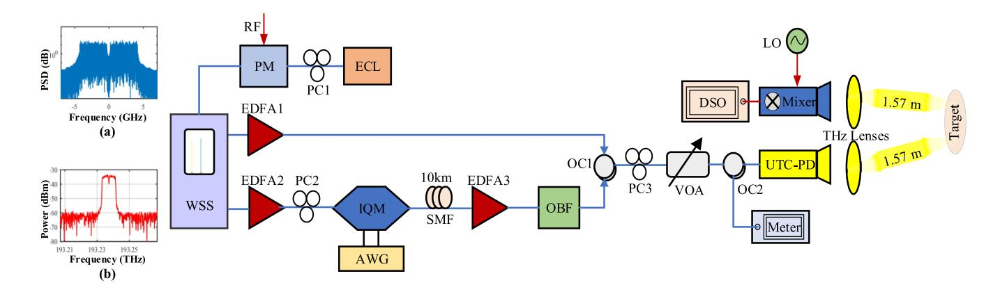

Fig. 2. Schematic experimental configuration for ToF-based ISAC systems. WSS: Wavelength selective switch; PM: Phase modulator; ECL: External cavity laser; EDFA: Erbium-doped fiber amplifier; IQM: In-phase and quadrature modulator; SMF: Single mode fiber; AWG: Arbitrary waveform generator; OBF: Optical band-pass filter; PC: Polarization controller; OC: Optical coupler; VOA: Variable optical attenuator; UTC-PD: Uni-traveling-carrier photodiode; DSO: Digital sampling oscilloscope; LO: Local oscillation. (a) The electrical spectrum of the baseband signal downloaded to AWG, and (b) the optical spectrum of the optical baseband signal from IQM output.

where *Г*M is the eigenvalue matrix of the DFnT matrix, a diagonal matrix of size *M* × *M* [\[12\],](#page-6-0) given by:

$$\Gamma_M(k,k) = e^{-j\frac{\pi}{N}k^2}.$$
 (8)

The frequency domain equalization is adopted in communication demodulation, and Φ2 can reduce the additional arithmetic complexity added to OFDM [\[12\].](#page-6-0)

## *B. Radar Receiver Processing*

In the radar processing part, echo delay carries range information. After the process of S/P conversing and removing CP for echo, the matrix *R*rad size of *N* × *M* is obtained. Besides, the generation of the Range-Doppler (RD) radar image is based on the pulse compression operation in the discrete frequency domain. Furthermore, the process is that the zero-padded DFT of size (2*N*-1) is performed for *S* and *R*rad respectively, and then obtained two frequency domain matrices *S2N-1* and *R2N-1*. After that, the conjugately multiply is performed to obtain the Hadamard product *W* size of 2*N-*1 × *M* [\[15\].](#page-6-0) *W* can be expressed as:

$$W = (S_{2N-1})^* \times R_{2N-1}.$$
 (9)

To obtain the RD radar image, the Hadamard product matrix is then performed by DFT in the frequency direction and followed by IDFT in the time direction.

# III. PHOTONIC THZ ISAC LINK

## *A. Experimental Setup*

Here we introduce the ISAC experimental system based on optical frequency comb technology. In the experiment, the optical frequency comb technology can considerably reduce the linewidth, i.e., the phase noise, of the generated THz signal [\[16\],](#page-6-0) eliminating the impacts of frequency and phase fluctuation of the laser. Moreover, the THz signal generation scheme based on optical frequency combs will not put a strict requirement on the seed laser linewidth. Fig. 2 illustrates the experimental

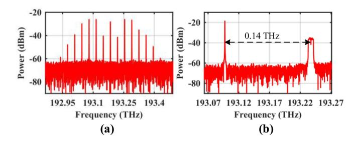

Fig. 3. Optical spectrum of (a) optical frequency combs with 35 GHz interval after the PM (b) OC output.

configuration of the ToF system for ISAC applications. The continuous wave light from ECL (NKT Photonics, 1552 nm, 16 dBm, 0.1 kHz linewidth) is injected into the PC1 and PM (40 GHz bandwidth), where the PM is driven by an RF signal (35 GHz, 1.37 dBm) generated from is generated from an analog signal generator (Keysight E8257D).

The PC1 is employed to adjust the polarization state of the light, thus maximizing the modulation efficiency of the polarization-dependent PM. Fig. 3(a) demonstrates the optical spectrum of the optical frequency comb after the PM, where the center wavelength and frequency interval of the optical comb lines are 1552 nm and 35 GHz. From Fig. 3(a), the carrier-tonoise ratio of the left 2th-line and right 2th-line are the largest. Thus, two optical comb lines (193.238 THz and 193.098 THz) with a power of −10 dBm are selected and filtered out by a programmable WSS (Finisar). It is noteworthy that the combination of the optical frequency comb and the NKT laser can reduce the frequency offset and phase noise of the generated THz signal, which decreases the difficulty of subsequent digital signal processing. For instance, it can eliminate the algorithm modules of frequency offset compensation and phase noise removal. After the amplification by EDFA1 and EDFA2, one optical carrier is launched into IQM (IDPhotonics) to implement digital baseband modulation, while another optical carrier is served as the LO light. The PC2 is used to optimize the polarization state before polarization-sensitive IQM.

{3}------------------------------------------------

The OCDM signal is modulated to 8 Gbaud 16-ary quadrature amplitude modulation (16QAM) and digital-to-analog converted by an AWG (Keysight M8194A, 120 GSa/s, 45 GHz bandwidth). After a 10 km standard SMF transmission, the optical baseband signal is amplified by an EDFA3. The 10 km SMF introduces some frequency-selective fading caused by fiber dispersion. Simultaneously, the ToF system will cause a common phase error (CPE) for the sub-chirps in OCDM or the sub-carriers in OFDM. It can be compensated with the channel estimation scheme based on lease square in our research. OBF filters out the output signal is to suppress the out-of-band amplified spontaneous emission noise, and the filtered optical signal is coupled with the LO light by an OC. The subsequent PC3 aligns the polarization to maximize the responsivity of UTC-PD. Fig. 3(b) shows the coupled optical spectrum. Finally, the coupled optical signals are sent into a UTC-PD for photo-mixing to generate a THz signal.

With a pair of THz lenses for collimating the THz beam, the THz signal is transmitted and received through a pair of horn antennas over a 3.14 m wireless backhaul link that introduces some frequency-selective fading. At the receiver, the THz carrier at 0.14 THz is received by the Schottky mixer (-2 dBm, 12x) for down-conversion, and the mixer is driven by an electrical LO signal (147 GHz, -2 dBm). The output IF signal (7 GHz frequency, 8 GHz bandwidth) is then analog-to-digital converted by a broadband real-time DSO (Keysight DSOZ594A, 80 GSa/s, 59 GHz bandwidth) for further communication and radar processing.

## B. Waveform Parameters Setting

In the waveform design, each frame of the OCDM ISAC waveform consists of 482 blocks. An OCDM symbol has 68 positive sub-chirps for data modulation. Each OCDM block is up-sampled to 1024 points in the time domain, of which 956 points are left zero. In that case, an oversampling rate of 15 (1024/68) is achieved [17]. For the OFDM ISAC waveform, each frame consists of 482 OFDM blocks, with 68 positive sub-carriers for modulation. The fast Fourier transform points are also 1024, resulting in the same oversampling rate as OCDM.

Furthermore, for both ISAC waveforms, the length of CP is 64 points; otherwise, the center 2 sample points in the frequency domain are left zero to reduce the impacts of insufficient carrier suppression on the spectrum quality. Since this operation does not occupy data sub-carriers or data sub-chirps, data rate will not be affected. According to Fig. 2(a), the center 2 zero sample points show a "groove" in the middle of the baseband signal electrical spectrum. As a result, the obtained baseband OCDM ISAC waveform and OFDM ISAC waveform both achieve a 32 Gbit/s maximum data rate and 1.875 cm range resolution with 8 GHz bandwidth.

For comparison between OFDM and OCDM ISAC waveforms, waveform parameters, experimental parameters, and experimental system are kept identical.

#### IV. EXPERIMENTAL RESULTS AND DISCUSSIONS

In this section, numerical, experimental and comparative results are provided to support the subsequent discussions.

#### A. Peak-to-Average Power Ratio

The peak-to-average power ratio (PAPR) of the OFDM and the OCDM ISAC waveforms are evaluated by complementary cumulative distribution function (CCDF), which is defined as the probability that the PAPR of the signal exceeds a threshold (PAPR0) [18]:

$$CCDF = Prob.(PAPR > PAPR_0).$$
 (10)

The CCDFs of PAPR of the OCDM and OFDM ISAC waveforms are demonstrated in Fig. 4(a). The results suggest that, under the same conditions, the OCDM ISAC waveform and OFDM ISAC waveform gain similar PAPR performance. The results can be explained by the implementation principle of OCDM and OFDM. The sub-carriers in OFDM and the subchirps in OCDM are orthogonally combined, but the OCDM introduces a chirp phase-shift on the OFDM signal. To reduce the PAPR of the OCDM ISAC waveform, the existing precoding methods for OFDM can be considered, such as DFT, Walsh Hadamard Transform (WHT) and Zadoff-Chu matrix Transform (ZCT) [19]. Fig. 4(b) and (c) show the PAPR performance. The results show that the DFT, ZCT, and WHT precoding methods can truly reduce the PAPR level, and each reaches similar effect for both OFDM and OCDM. Fig. 5 shows the simulated communication performance of the precoding-OFDM, and the precoding-OCDM, as well as the OFDM and OCDM in an ISAC system with frequency-selective fading. Our simulation results show that the OFDM has similar BER performance with the precoding-OFDM, and the OCDM is similar as the precoding-OCDM, while the OCDM and precoding-OCDM can achieve better BER than the OFDM over a certain range of SNR.

### B. Bit Error Ratio

Fig. 6 displays the transmission performance of OFDM and OCDM ISAC waveforms over the ToF link. Besides, the BERs are compared to evaluate the ability of OCDM against frequency-selective fading. The photocurrent range of UTC-PD is 1 mA $\sim$ 3.5 mA adjusted by a VOA, and as the photocurrent increases, the BER decreases. In contrast, the OCDM shows lower BER over a set range of photocurrents, and OCDM approximately saves 1 mA photocurrent when the BER of  $3.8 \times 10^{-3}$  (the hard-decision forward error correction (HD-FEC) threshold) is achieved [20]. When the photocurrent is 3.5 mA, the BER of  $2.11 \times 10^{-3}$  for OCDM is lower than that of  $5.48 \times 10^{-3}$  for OFDM.

Considering that proper equalization is beneficial to communication results, the equalization in communication processing combines zero force one [21] and Volterra non-linear one [22]. Fig. 7 exhibits, the constellation diagrams with/without equalization with a 3.5 mA photocurrent. From only one signal, the employed equalization significantly improves the demodulation. When comparing the constellations of two signals

{4}------------------------------------------------

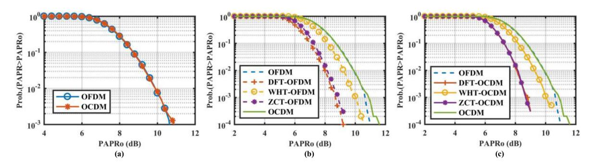

Fig. 4. CCDF curves of PAPR performance.

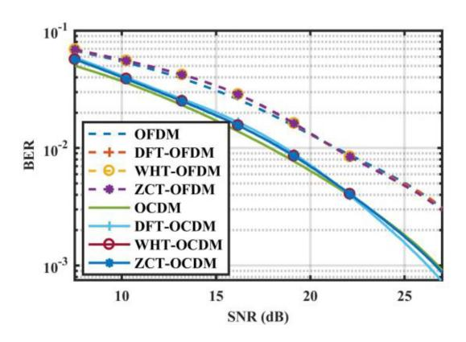

Fig. 5. Simulated transmission performance of the precoding-OFDM, precoding-OCDM OCDM and OFDM.

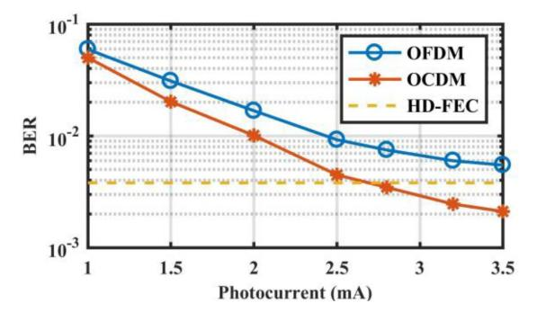

Fig. 6. Transmission performance of the OCDM and OFDM ISAC waveforms in the ToF system.

without equalization, the OCDM's rotate less and compact more, which demonstrates the enhanced robustness against frequencyselective fading. Notably, both phase noise and frequencyselective fading can lead to the rotation of constellations. The phase noise of the system will cause similar rules with more than 2π rotation of constellations in OFDM and OCDM, and the apparent extra rotation of OFDM is caused by frequencyselective fading. The spreading and convolutional properties of OCDM dilute the frequency-selective fading problem, and optical frequency comb technology reduces the phase noise of the system, which leads to a small rotation in OCDM. The phase rotation can be compensated with the channel estimation scheme based on the lease square in this research.

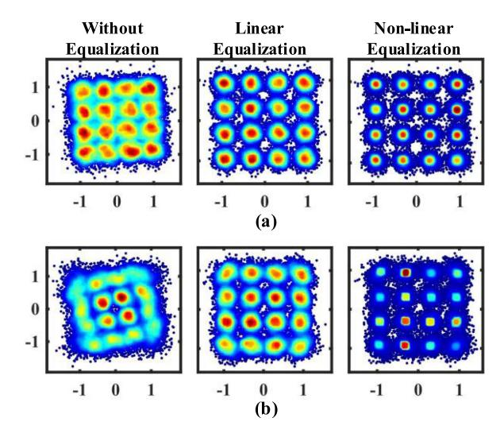

Fig. 7. Received constellation diagrams without equalization, with linear equalization, and with non-linear equalization at 3.5 mA photocurrent. (a) OCDM (b) OFDM.

Moreover, we compare the non-linear equalization constellations of the OCDM and OFDM. Given the same number of constellation points of two signals, the non-linear equalization constellation of OCDM has darker color around the standard constellation points, whereas the color of OFDM is dispersed and light. Besides, the constellation of OCDM have better aggregation and clearer spacing, which indicates that the OCDM has more consistent BER over the sub-chirps and lower BER in total with smaller error vector magnitude.

Frequency-selective fading can cause severe inter-symbol interference (ISI) in the edge sub-carriers and sub-chirps. The OCDM spreads the ISI over the entire symbol. In contrast, the OFDM generates unrecoverable and severe BER in the edge sub-carriers, thereby increasing the overall BER.

## *C. Signal-to-Noise Ratio*

The signal-to-noise ratio (SNR) can reflect the transmission performance. Higher SNR values can achieve better demodulation effects. We compare the SNR of all data sub-carriers and data sub-chirps of the received data, and obtain 2 × 68 SNR values. The results are displayed in Fig. [8.](#page-5-0) For the OFDM ISAC waveform, the SNR at the spectrum edge (center of sub-carriers

{5}------------------------------------------------

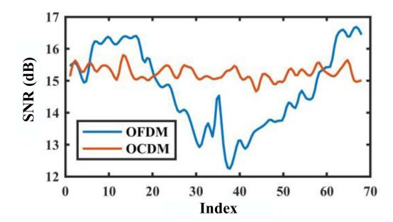

Fig. 8. SNR comparison of each data sub-chirp and sub-carrier.

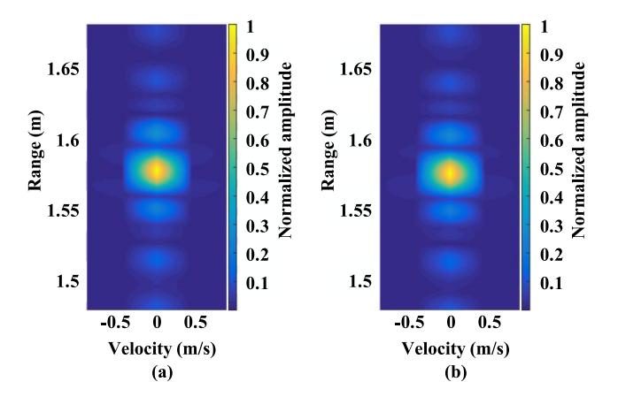

Fig. 9. RD images of the ISAC system at 0.2 m range. (a) OCDM (b) OFDM.

index) is poor, and that at the spectrum center (edge of subcarriers index) is good. For the OCDM ISAC waveform, the SNR of different sub-chirp is relatively average, which supports OCDM to spread ISI over the entire symbol and distribute the error rate throughout the full frequency range. The average SNR of each sub-chirp is adequate to achieve an ideal BER, which reduces the overall BER. Therefore, the results reveal that compared with traditional OFDM, OCDM enhances the robustness against frequency-selective fading.

$$PSLR = 20 \times \log_{10} \frac{Max\_sidelobe}{Max\_mainlobe} (dB).$$
 (11)  

$$ISLR = 10 \times \log_{10} \frac{E\_sidelobe}{E\_mainlobe} = 10$$
  

$$\times \log_{10} \frac{\sum_{i \neq 0} R_i}{\sum_{i} R_0} (dB).$$
 (12)

# *D. Radar Images*

Fig. 9 shows the normalized RD images of the OCDM and OFDM ISAC systems, observing the overall sidelobe level at a range of 0.2 m. The average sidelobe level outside the target area is nearly identical.

Fig. 10 exhibits the normalized range cuts of the radar images, and the measured distance results are obtained from the peaks. Compared with the actual target distance (1.57 m), the estimated errors of the two ISAC systems are less than 1 cm. Furthermore, we calculate the 3 dB width of the normalized range cuts to

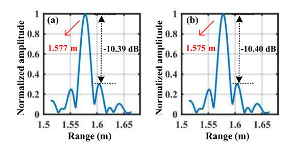

Fig. 10. Normalized range cuts at the velocity of 0 m/s. (a) OCDM (b) OFDM.

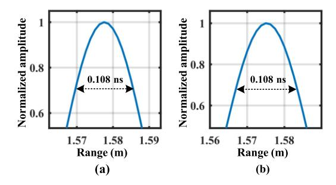

Fig. 11. Mainlobe width at 0 m/s normalized range cuts of (a) OCDM (b) OFDM.

obtain the mainlobe width. The two ISAC signals show the same results in Fig. 11.

To further evaluate the radar performance of the two ISAC waveforms, we obtain the mainlobe level and two highest sidelobe levels from Fig. 10. Additionally, we calculate the peak side lobe ratio (PSLR) by (11) and integrated-sidelobe level ratio (ISLR) by (12). *R*i represents the collections of all sidelobe energies, and *R*0 represents those of energies in the mainlobe range. Since the high sidelobe caused by matched filtering may not only mask the weak target reflection but also be detected as a target by mistake, the two metrics of PSLR and ISLR are suitable for evaluating radar performance.

The results suggest that the PSLRs of the OCDM and OFDM ISAC systems are approximately −10.4 dB, which are considered roughly equal within the reasonable error range. The ISLR of the OCDM is −6.71 dB, corresponding to the −6.60 dB ISLR of OFDM. Thus, the OCDM achieves slightly better ISLR results. Since the difference is small, their ISLRs can be viewed as basically equivalent.

Meanwhile, we traverse *N* sample points and calculate the Azimuth PSLR of each index position to compare the overall sidelobe level. According to Fig. [12,](#page-6-0) the results of OCDM and OFDM are roughly the same. However, further research on radar processing algorithms or waveform improvement methods is required for better radar performance from the OCDM ISAC waveform.

Table [I](#page-6-0) provides a summary of recent representative demonstrations on ISAC systems, which proves that the THz band is conducive to broadband ISAC systems. Generally, photonicsbased THz systems can achieve higher data rates and better sensing resolution than electronics-based ones. Here, our proposed OCDM-based THz-over-fiber scheme can support a data rate

{6}------------------------------------------------

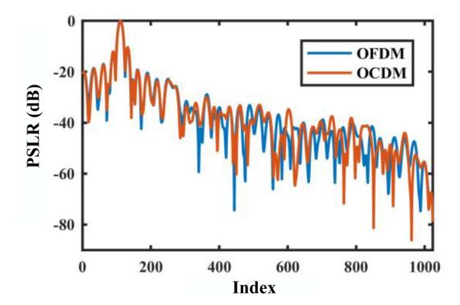

Fig. 12. Azimuth PSLR of sampling points in the range of 0 to *N*.

TABLE I REPRESENTATIVE DEMONSTRATIONS FOR ISAC SYSTEMS

| Ref.         | Waveform  | Data rate (Gbit/s) | Theoretical range resolution (cm) | Operation frequency (GHz) | Method      |
|--------------|-----------|--------------------------|--------------------------------------------|---------------------------------|-------------|
| [23]         | OFDM      | 1.44                     | 10                                         | 79                              | Electronics |
| [4]          | OFDM      | 15.6                     | 2.5                                        | 94                              | Electronics |
| [24]         | OFDM-LFM  | 8                        | 1.5                                        | 60                              | Photonics   |
| [25]         | OFDM-LFM  | 6                        | 1.76                                       | 61                              | Photonics   |
| [26]         | LFM       | 10                       | 0.94                                       | 92                              | Photonics   |
| [27]         | LFM+16QAM | 32                       | 3.8                                        | 324                             | Photonics   |
| [5]          | LFM+OFDM  | 38.1                     | 1.58                                       | 340                             | Photonics   |
| This work | OFDM/OCDM | 32                       | 1.875                                      | 140                             | Photonics   |

of up to 32 Gbit/s and range resolution of up to 1.875 cm in the 140 GHz band, featuring improved communication performance while preserving the benefits of high sensing resolution of OFDM.

## V. CONCLUSION

In conclusion, we propose and experimentally implement the OCDM waveform-based THz-over-Fiber system for ISAC applications at 0.14 THz. The transmission of the OCDM signals over a 10 km optical fiber and a 3.14 m wireless link, based on the optical frequency comb scheme with phase modulation and advanced demodulation equalization algorithm, realizes a 32 Gbit/s data rate and 1.875 cm range resolution.

Compared with the OFDM-based ToF system, the OCDMbased scheme demonstrates improved performance in the frequency-selective ISAC channels. We compare the PAPR, SNR, BER, and other communication performance indicators. From the comparisons, the advantages of OCDM lie in its spread and convolution characteristics, which dilute the error rate. In addition, the PSLR, mainlobe width, ISLR, and other radar performance indicators are further compared. Because of their resemblance, the implementation principles and the radar signal processing algorithm perform similar radar performances. Therefore, the proposed OCDM ISAC waveform provides an effective solution for ultrahigh frequency and high bandwidth ToFbased ISAC systems. With further research, the OCDM ISAC waveform design can be enhanced to improve the performance of ISAC applications, such as the PAPR reduction schemes and optimization schemes based on mutual information theory.

## REFERENCES

- [1] C. B. Barneto et al., "Full-duplex OFDM radar with LTE and 5G NR waveforms: Challenges, solutions, and measurements," *IEEE Trans. Microw. Theory Tech.*, vol. 67, no. 10, pp. 4042–4054, Oct. 2019, doi: [10.1109/TMTT.2019.2930510.](https://dx.doi.org/10.1109/TMTT.2019.2930510)
- [2] M. Tonouchi, "Cutting-edge terahertz technology," *Nature Photon.*, vol. 1, no. 2, pp. 97–105, Feb. 2007, doi: [10.1038/nphoton.2007.3.](https://dx.doi.org/10.1038/nphoton.2007.3)
- [3] A. S. Cacciapuoti, K. Sankhe, M. Caleffi, and K. R. Chowdhury, "Beyond 5G: THz-based medium access protocol for mobile heterogeneous networks," *IEEE Commun. Mag.*, vol. 56, no. 6, pp. 110–115, Jun. 2018, doi: [10.1109/MCOM.2018.1700924.](https://dx.doi.org/10.1109/MCOM.2018.1700924)
- [4] N. M. Idrees et al., "Improvement in sensing accuracy of an OFDMbased W-band system," *J. Commun. Inf. Netw.*, vol. 7, no. 1, pp. 37–47, Mar. 2022, doi: [10.23919/JCIN.2022.9745480.](https://dx.doi.org/10.23919/JCIN.2022.9745480)
- [5] Y.Wang et al., "Integrated high-resolution radar and long-distance communication based-on photonic in terahertz band," *J. Lightw. Technol.*, vol. 40, no. 9, pp. 2731–2738, May 2022, doi: [10.1109/JLT.2022.3143849.](https://dx.doi.org/10.1109/JLT.2022.3143849)
- [6] H. Zhang et al., "Tbit/s multi-dimensional multiplexing THz-over-fiber for 6G wireless communication," *J. Lightw. Technol.*, vol. 39, no. 18, pp. 5783–5790, Sep. 2021, doi: [10.1109/JLT.2021.3093628.](https://dx.doi.org/10.1109/JLT.2021.3093628)
- [7] X. Chen, Z. Liu, Y. Liu, and Z. Wang, "Energy leakage analysis of the radar and communication integrated waveform," *Inst. Eng. Technol. Signal Process.*, vol. 12, no. 3, pp. 375–382, May 2018, doi: [10.1049/iet-spr.2017.0248.](https://dx.doi.org/10.1049/iet-spr.2017.0248)
- [8] E. Saberinia and A. H. Tewfik, "Single and multi-carrier UWB communications," in *Proc. IEEE 7th Int. Symp. Signal Process. Appl.*, 2003, pp. 343–346.
- [9] X. Ouyang and J. Zhao, "Orthogonal chirp division multiplexing for coherent optical fiber communications," *J. Lightw. Technol.*, vol. 34, no. 18, pp. 4376–4386, Sep. 2016, doi: [10.1109/JLT.2016.2598575.](https://dx.doi.org/10.1109/JLT.2016.2598575)
- [10] K. Zhang, X. Wu, Y. Zeng, J. You, and Z. Dong, "60GHz optical millimeter wave OFDM-RoF system based on DFT spread spectrum," *Opt. Commun. Technol.*, vol. 43, no. 3, pp. 36–39, 2019, doi: [10.13921/j.cnki.issn1002-5561.2019.03.011.](https://dx.doi.org/10.13921/j.cnki.issn1002-5561.2019.03.011)
- [11] F. Lu, L. Cheng, M. Xu, J. Wang, S. Shen, and G.-K. Chang, "Orthogonal chirp division multiplexing in millimeter-wave fiber-wireless integrated systems for enhanced mobile broadband and ultra-reliable communications," in *Proc. Opt. Fiber Commun. Conf. Exhib.*, 2017, pp. 1–3.
- [12] X. Ouyang and J. Zhao, "Orthogonal chirp division multiplexing," *IEEE Trans. Commun.*, vol. 64, no. 9, pp. 3946–3957, Sep. 2016, doi: [10.1109/TCOMM.2016.2594792.](https://dx.doi.org/10.1109/TCOMM.2016.2594792)
- [13] C. Browning, D. Dass, P. Townsend, and X. Ouyang, "Orthogonal chirp-division multiplexing for future converged optical/millimeter-wave radio access networks," *IEEE Access*, vol. 10, pp. 3571–3579, 2022, doi: [10.1109/ACCESS.2021.3137716.](https://dx.doi.org/10.1109/ACCESS.2021.3137716)
- [14] X. Ouyang, C. Antony, F. Gunning, H. Zhang, and Y. L. Guan, "Discrete Fresnel transform and its circular convolution," *Physics*, 2015, doi: [10.48550/arXiv.1510.00574.](https://dx.doi.org/10.48550/arXiv.1510.00574)
- [15] F. Zhang, *The Schur Complement and its Applications*. Berlin, Germany: Springer, 2005, doi: [10.1007/b105056.](https://dx.doi.org/10.1007/b105056)
- [16] Z. Yang et al., "Robust photonic terahertz vector imaging scheme using an optical frequency comb," *J. Lightw. Technol.*, vol. 40, no. 9, pp. 2717–2723, May 2022, doi: [10.1109/JLT.2022.3146438.](https://dx.doi.org/10.1109/JLT.2022.3146438)
- [17] X. Ouyang, G. Talli, M. Power, and P. Townsend, "Orthogonal chirp-division multiplexing for IM/DD-based short-reach systems," *Opt. Exp.*, vol. 27, no. 16, pp. 23620–23632, Aug. 2019, doi: [10.1364/OE.27.023620.](https://dx.doi.org/10.1364/OE.27.023620)
- [18] T. Jiang and Y. Wu, "An overview: Peak-to-average power ratio reduction techniques for OFDM signals," *IEEE Trans. Broadcast.*, vol. 54, no. 2, pp. 257–268, Jun. 2008, doi: [10.1109/TBC.2008.915770.](https://dx.doi.org/10.1109/TBC.2008.915770)
- [19] M. Chen, L.Wang, D. Xi, L. Zhang, H. Zhou, and Q. Chen, "Comparison of different precoding techniques for unbalanced impairments compensation in short-reach DMT transmission systems," *J. Lightw. Technol.*, vol. 38, no. 22, pp. 6202–6213, Nov. 2020, doi: [10.1109/JLT.2020.3010002.](https://dx.doi.org/10.1109/JLT.2020.3010002)
- [20] J. Cho, L. Schmalen, and P. J. Winzer, "Normalized generalized mutual information as a forward error correction threshold for probabilistically shaped QAM," in *Proc. IEEE 43rd Eur. Conf. Opt. Commun.*, 2017, pp. 1–3.

{7}------------------------------------------------

- [21] F. S. Al-Kamali, M. I. Dessouky, B. M. Sallam, F. Shawki, W. Al-Hanafy, and F. E. A. El-Samie, "Joint low-complexity equalization and carrier frequency offsets compensation scheme for MIMO SC-FDMA systems," *IEEE Trans. Wireless Commun.*, vol. 11, no. 3, pp. 869–873, Mar. 2012, doi: [10.1109/TWC.2012.012412.100789.](https://dx.doi.org/10.1109/TWC.2012.012412.100789)
- [22] E. Giacoumidis et al., "Volterra-based reconfigurable nonlinear equalizer for coherent OFDM," *IEEE Photon. Technol. Lett.*, vol. 26, no. 14, pp. 1383–1386, Jul. 2014, doi: [10.1109/LPT.2014.2321434.](https://dx.doi.org/10.1109/LPT.2014.2321434)
- [23] C. D. Ozkaptan, E. Ekici, O. Altintas, and C.-H.Wang, "OFDM pilot-based radar for joint vehicular communication and radar systems," in *Proc. IEEE Veh. Netw. Conf.*, 2018, pp. 1–8, doi: [10.1109/VNC.2018.8628347.](https://dx.doi.org/10.1109/VNC.2018.8628347)
- [24] W. Bai et al., "Millimeter-wave joint radar and communication system based on photonic frequency-multiplying constant envelope LFM-OFDM," *Opt. Exp.*, vol. 30, no. 15, pp. 26407–26425, Jul. 2022, doi: [10.1364/OE.461508.](https://dx.doi.org/10.1364/OE.461508)
- [25] W. Bai et al., "Photonic super-resolution millimeter-wave joint radarcommunication system using self-coherent detection," *Opt. Lett.*, vol. 48, no. 3, pp. 608–611, Feb. 2023, doi: [10.1364/OL.472155.](https://dx.doi.org/10.1364/OL.472155)
- [26] Y. Wang, J. Ding, M. Wang, Z. Dong, F. Zhao, and J. Yu, "W-band simultaneous vector signal generation and radar detection based on photonic frequency quadrupling," *Opt. Lett.*, vol. 47, no. 3, pp. 537–540, Feb. 2022, doi: [10.1364/OL.447876.](https://dx.doi.org/10.1364/OL.447876)
- [27] Y. Wang et al., "Integrated terahertz high-speed data communication and high-resolution radar sensing system based-on photonics," in *Proc. IEEE Eur. Conf. Opt. Commun.*, 2021, pp. 1–4, doi: [10.1109/ECOC52684.2021.9606102.](https://dx.doi.org/10.1109/ECOC52684.2021.9606102)