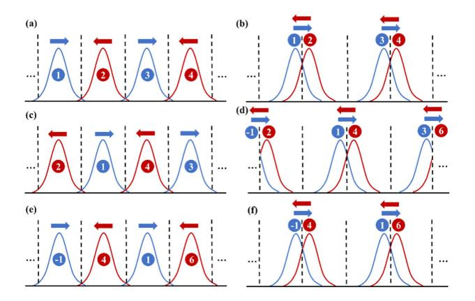
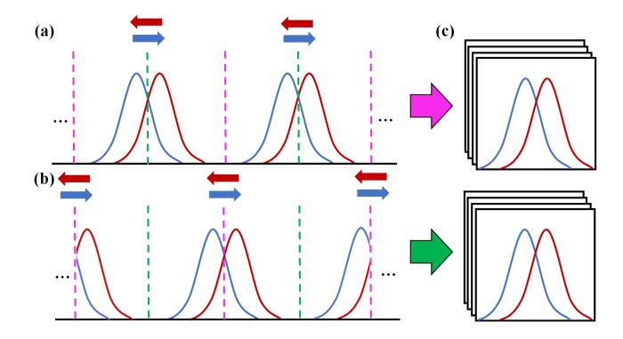
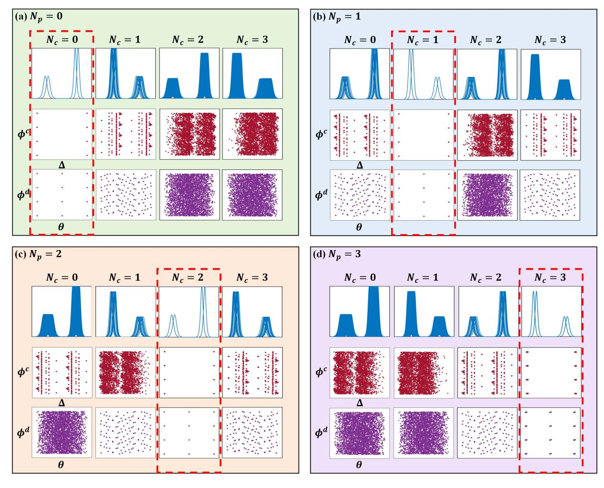
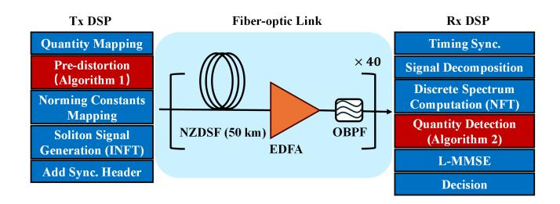
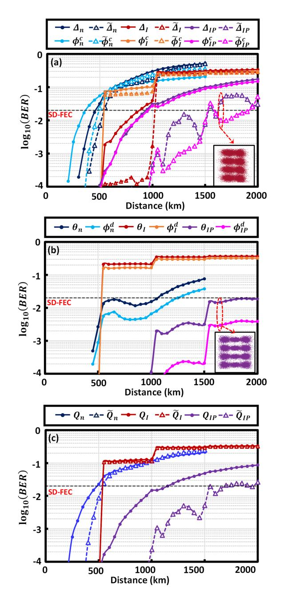

# Pre-Distortion of Soliton Collision in Dual-Polarization Interaction-Tolerant Soliton Transmission

Gai Zhou [,](https://orcid.org/0000-0001-6278-5964) Meng Xiang [,](https://orcid.org/0000-0002-3052-2251) Alan Pak Tao Lau *[,](https://orcid.org/0000-0003-0463-5057) Senior Member, IEEE*, Songnian Fu *[,](https://orcid.org/0000-0003-3330-9170) Senior Member, IEEE*, and Yuwen Qin

*Abstract***—Nonlinear frequency division multiplexing (NFDM) is an innovative strategy for communication over the nonlinear optical fiber channel. Utilizing the Nonlinear Fourier Transform (NFT) coupled with coherent detection techniques, NFDM encodes and decodes the information on the nonlinear spectrum of signal. For discrete-spectrum modulation, interaction-tolerant (IT) soliton signal has been proposed to enhance the transmission capacity by inducing a group velocity difference between adjacent solitons. Previous study has demonstrated the performance gain of the IT signal in scenario of single-polarization transmission. However, when the discrete spectrum is modulated in dual polarization, the transmission distance is limited by the soliton collisions inherent in the configuration of IT signal. To address this, we derive the explicit formula for the collision distortion on the soliton quantities, utilizing the asymptotic solutions of two-soliton model in the Manakov equation. The formula reveals that the distortion is determined by the polarization angle and polarization differential phase of two solitons. To mitigate the symbol-dependent distortion on the quantities, a pre-distortion scheme is proposed to cancel the collision distortion, incorporating with a detection scheme by using the asymptotic solution. Numerical results indicate the notable performance enhancement of the IT signals incorporating the proposed pre-distortion scheme, in comparison with the normal soliton signals.**

*Index Terms***—Nonlinear fiber optics, nonlinear frequency division multiplexing (NFDM), optical communication.**

Received 16 April 2024; revised 13 July 2024 and 9 October 2024; accepted 14 October 2024. Date of publication 17 October 2024; date of current version 3 February 2025. This work was supported in part by the National Natural Science Foundation of China under Grant 62331004 and Grant 62205068, in part by Guangdong Introducing Innovative and Entrepreneurial Teams of The Pearl River Talent Recruitment Program under Grant 2021ZT09X044, in part by The Hong Kong Government Research Grants Council General Research Fund (GRF) under Project PolyU 15220120, and in part by The project 1-CD8L of the Hong Kong Polytechnic University. *(Corresponding author: Meng Xiang.)*

Gai Zhou, Meng Xiang, Songnian Fu, and Yuwen Qin are with the Institute of Advanced Photonics Technology, School of Information Engineering, Guangdong University of Technology, Integrated Sensing and Communication, Ministry of Education of China, and Guangdong Provincial Key Laboratory of Information Photonics Technology, Guangdong University of Technology, Guangzhou 51006, China (e-mail: [gaizer3085@gdut.edu.cn;](mailto:gaizer3085@gdut.edu.cn) [meng.xiang@gdut.edu.cn;](mailto:meng.xiang@gdut.edu.cn) [songnian@gdut.edu.cn;](mailto:songnian@gdut.edu.cn) [qinyw@gdut.edu.cn\)](mailto:qinyw@gdut.edu.cn).

Alan Pak Tao Lau is with the Photonics Research Institute, Department of Electrical Engineering, The Hong Kong Polytechnic University, Kowloon, Hong Kong, and also with The Hong Kong Polytechnic University Shenzhen Research Institute, Shenzhen 518057, China (e-mail: [eeaptlau@polyu.edu.hk\)](mailto:eeaptlau@polyu.edu.hk).

Color versions of one or more figures in this article are available at [https://doi.org/10.1109/JLT.2024.3483289.](https://doi.org/10.1109/JLT.2024.3483289)

Digital Object Identifier 10.1109/JLT.2024.3483289

### I. INTRODUCTION

**I** N LONG-HAUL fiber optics communication, the enhancement of transmission capacity via increased signal power is intrinsically limited by the nonlinear noise, which is primarily induced by Kerr nonlinearity [\[1\].](#page-8-0) In recent years, nonlinear frequency division multiplexing (NFDM) is proposed as a new signaling strategy that mitigates the nonlinear noise by inherently incorporating Kerr nonlinearity arising in signal propagation over the optical fibers [\[2\],](#page-8-0) [\[3\].](#page-8-0) The signal travelling in nonlinear optical fiber can be decomposed under nonlinear Fourier transform (NFT) into nonlinear discrete and continuous spectra. These spectra evolve along the ideal lossless fiber without mutual interference, thereby potentially reducing the nonlinear noise impacts. Since the initial work of on-off keying eigenvalue transmission [\[4\],](#page-8-0) NFDM incorporating with advanced digital signal processing has been further explored and experimentally demonstrated in single polarization (SP) transmission, including the modulation on discrete [\[5\],](#page-8-0) [\[6\],](#page-8-0) [\[7\],](#page-8-0) [\[8\],](#page-8-0) [\[9\],](#page-8-0) [\[10\],](#page-9-0) [\[11\],](#page-9-0) continuous [\[12\],](#page-9-0) [\[13\],](#page-9-0) [\[14\],](#page-9-0) [\[15\]](#page-9-0) and full spectrum [\[16\],](#page-9-0) [\[17\].](#page-9-0) To further enhance spectral efficiency (SE), the NFDM framework has been extended to dual polarization (DP) transmission, based on the NFT theory of Manakov Equation [\[18\].](#page-9-0) NFDM with DP Modulation on different parts of nonlinear spectrum has also been demonstrated [\[19\],](#page-9-0) [\[20\],](#page-9-0) [\[21\],](#page-9-0) [\[22\],](#page-9-0) [\[23\],](#page-9-0) [\[24\],](#page-9-0) [\[25\].](#page-9-0)

As for discrete-spectrum modulation, it has been demonstrated that, inducing difference in the real parts of eigenvalue between adjacent solitons can significantly mitigate their mutual interaction. An interaction-tolerant (IT) soliton signal, with the real part of each soliton's eigenvalue is set opposite to that of its neighbors, has been proposed to improve the SP transmission capacity [\[10\],](#page-9-0) [\[26\].](#page-9-0) Such a symmetric-eigenvalue design has been first used to obtain a concentrate waveform at receiver [\[8\].](#page-8-0) In case of the IT signal, the solitons are allowed to walk off their initial temporal window and collide with neighboring solitons. Despite the occurrence of multiple soliton collisions in transmission, the distortion resulting from soliton interaction is effectively mitigated. It is because the difference of eigenvalue real part induces the frequency offset between the spectra of neighbor solitons, effectively suppressing the nonlinear interaction in real fiber transmission.

It is promising to enhance SE of the IT signal by incorporating with DP transmission. However, in this paper, we

0733-8724 © 2024 IEEE. Personal use is permitted, but republication/redistribution requires IEEE permission. See https://www.ieee.org/publications/rights/index.html for more information.

identify that the soliton collisions inherent to the IT signal induce substantial distortion on the encoded nonlinear spectra when modulated with DP, thus limiting the transmission distance of the IT signals. To examine and address the distortion, we derive the explicitly formula for the distortion on soliton quantities before and after collision, based on the asymptotic solution of two-soliton model in Manakov equation [27]. The formula reveals that the collision distortion on quantities is determined by the polarization angle and polarization differential phase of two solitons. Consequently, the polarization modulation results in symbol-dependent and significantly degrades the transmission performance of the IT signal. Based on the evolution of IT signal and the derived formula, we propose a pre-distortion scheme to cancel the distortions of soliton collisions. We verify the scheme by propagating the pre-distorted signal over the ideal channel in simulation. At the receiver, because the IT signal is decomposed into soliton pairs for processing via NFT, a detection scheme by using the asymptotic equation of two-soliton model is proposed to detect the quantities of the soliton pairs. With appropriate iterations of pre-distortion and the detection scheme, we can detect the encoded quantities without collision distortion at any target transmission distance. In the simulation, the necessity of pre-distortion is demonstrated, and the notable performance gain of IT signal is observed when compared with the normal soliton signal.

The rest of the paper is organized as follows: Section II reviews the NFT and nonlinear spectrum for the Manakov equation. In Section III, the IT soliton signal and soliton quantities from the precoding scheme are introduced. In Section IV, the formula of collision distortion on the soliton quantities is derived based on the asymptotic solutions of two-soliton model in Manakov equation. In Section V, we propose the pre-distortion scheme for the IT soliton signal based on the formula for collision distortion. Section VI shows the numerical transmission results of the IT soliton incorporating with the proposed pre-distortion scheme by comparing with the normal soliton signal.

# II. NONLINEAR FOURIER TRANSFORM FOR THE MANAKOV EQUATION

The propagation dynamics of optical signals propagating over the lossless optical fiber with fast-varying birefringence is governed by the Manakov equation [28], [29],

$$\frac{\partial A_1}{\partial z} = -\frac{i\beta_2}{2} \frac{\partial^2 A_1}{\partial t^2} + i\frac{8\gamma}{9} \left( |A_1|^2 + |A_2|^2 \right) A_1$$

$$\frac{\partial A_2}{\partial z} = -\frac{i\beta_2}{2} \frac{\partial^2 A_2}{\partial t^2} + i\frac{8\gamma}{9} \left( |A_1|^2 + |A_2|^2 \right) A_2 \tag{1}$$

where  $\{t,z,A_{1,2}\}$  are physical time, distance and slow-varying optical field at two orthogonal polarizations.  $\beta_2$  is the group velocity dispersion and  $\gamma$  is the nonlinear coefficient. The Manakov equation with anomalous dispersion  $(\beta_2 < 0)$  can be normalized as.

$$i\frac{\partial U_1}{\partial \ell} = \frac{\partial^2 U_1}{\partial \tau^2} + 2\left(|U_1|^2 + |U_2|^2\right)U_1$$

$$i\frac{\partial U_2}{\partial \ell} = \frac{\partial^2 U_2}{\partial \tau^2} + 2\left(|U_1|^2 + |U_2|^2\right)U_2$$
$$\ell = \frac{z}{L_0}, \ \tau = \frac{t}{T_0}, \ U_{1(2)} = \sqrt{P_0}A_{1(2)}$$
(2)

where  $\{\tau, \ell, U_{1,2}\}$  are physical time, distance and slow-varying optical field at two orthogonal polarizations.  $T_0, L_0$  and  $P_0$  are the normalized factors,

$$P_0 \cdot T_0^2 = \frac{9|\beta_2|}{8\gamma}, \ L_0 = \frac{2T_0^2}{|\beta_2|}$$
 (3)

One of the normalized factors can be free parameter for determining the scale of time, distance and power.

The nonlinear spectrum of dual-polarization optical signal  $U_{1,2}(\tau)$  supported in  $[T_1,T_2]$  can be obtained by solving the Manakov-Zakharov-Shabat spectral problem [18],

$$\frac{\partial v\left(\tau,\lambda\right)}{\partial \tau} = Pv\left(\tau,\lambda\right)$$

$$v\left(\tau,\lambda\right) = \begin{pmatrix} v_{1}\left(\tau,\lambda\right) \\ v_{2}\left(\tau,\lambda\right) \\ v_{3}\left(\tau,\lambda\right) \end{pmatrix}, \quad P = \begin{pmatrix} -i\lambda & U_{1}\left(\tau\right) & U_{2}\left(\tau\right) \\ -U_{1}^{*}\left(\tau\right) & i\lambda & 0 \\ -U_{2}^{*}\left(\tau\right) & 0 & i\lambda \end{pmatrix}$$

With the boundary condition

$$v(T_1, \lambda) = \begin{pmatrix} 1\\0\\0 \end{pmatrix} \exp(-j\lambda T_1)$$
 (5)

The nonlinear coefficients can be obtained as

$$a(\lambda) = v_1(T_2, \lambda) \exp(j\lambda T_2)$$

$$b(\lambda) = v_2(T_2, \lambda) \exp(-j\lambda T_2)$$

$$c(\lambda) = v_3(T_2, \lambda) \exp(-j\lambda T_2)$$
(6)

Consequently, nonlinear spectrum of the signal includes two parts, including 1) a continuous spectrum defined on  $\lambda \in \mathbb{R}$  with spectral coefficients  $q_1(\lambda) = b(\lambda)/a(\lambda)$  and  $q_2(\lambda) = c(\lambda)/a(\lambda)$ ; 2) a discrete spectrum consisting of discrete eigenvalues  $\{\lambda_n|a(\lambda_n)=0,\lambda_n\in\mathbb{C}^+\}$  and norming constants  $b_{1,2}(\lambda_n)$  where  $n\in[1,2,\ldots,N]$  and N is the number of soliton components in the signal. The discrete spectrum describes the properties of solitons in optical signal while the continuous spectrum corresponds to dispersive component. Hence, a signal with discrete-spectrum modulation is always a sequence of waveforms, each containing one or more soliton components. The transform from optical signal to nonlinear spectrum is known as NFT and the inverse transform is inverse NFT (INFT). The transfer function of optical fiber for  $q(\lambda)$ ,  $b(\lambda_n)$  and  $c(\lambda_n)$  are.

$$q_{1,2}(\lambda, \ell_0) = q_{1,2}(\lambda, 0) \exp(4j\lambda^2 \ell_0)$$

$$b(\lambda_n, \ell_0) = b(\lambda_n, 0) \exp(4j\lambda_n^2 \ell_0)$$

$$c(\lambda_n, \ell_0) = c(\lambda_n, 0) \exp(4j\lambda_n^2 \ell_0)$$
(7)

where  $\ell_0$  is the normalized transmission distance. According to (7), the evolution of nonlinear spectrum over the nonlinear optical fiber channel is explicit and without mutual interaction,

Fig. 1. (a) to (f) present the position evolution of the indexed solitons during propagation in optical fiber. (a), (c), (e) show the temporal positions at the transmitter and after the  $1^{st}$  and  $2^{nd}$  collision. (b), (d), (f) illustrate the states when solitons are collided. The direction arrows above solitons indicate the group velocity. The dashed lines are edges of temporal windows for solitons at the transmitter.

thus exhibiting robustness to distortions induced by nonlinearity. However, in real transmission, non-ideal effects such as the loss of optical fiber, the signal amplification and the phase noise of laser source still distort the nonlinear spectra of signals. Therefore, various digital signal processing techniques for NFDM are developed [9], [30], [31], [32], [33], [34], [35], [36], [37], [38], [39].

# III. INTERACTION-TOLERANT SOLITON SIGNAL AND PRECODING SCHEME

### A. Interaction-Tolerant Soliton Signal

In discrete-spectrum transmission, the IT soliton signal has been proposed to mitigate the interaction between adjacent solitons [10]. Fig. 1(a) illustrates the configuration of the IT signal wherein the real part of each soliton's eigenvalue is set opposite to that of its neighbors. The direction arrows above solitons represent the group velocity. During the transmission, adjacent solitons walk out their initial temporal window and converge, leading to collisions that result in an exchange of temporal positions, as depicted progressively in Fig. 1(a)–(f).

At the receiver, if the solitons are well separated as shown in Fig. 1(a), (c), (e), the signal can be straightforwardly decomposed into individual solitons for NFT processing. However, the received solitons are typically in a collided state as shown in Fig. 1(b), (d), (f). This requires decomposing the signal into pairs of solitons for effective detection [26]. As demonstrated in Fig. 2(a), (b), the initial temporal window edges at the transmitter, highlighted in purple and green, are segmented into two groups. The collision points of two solitons consistently align with one group of edges, facilitating the decomposition of the signal into soliton pairs along the edges of the alternate group. At the receiver, after frame synchronization, the amplitude of the signal sampled at these edges is obtained. By comparing the squared sums of the amplitudes at the edges of the two groups, it becomes straightforward to identify the group where collisions

Fig. 2. (a) And (b) present two possible states of the IT signal when solitons are collided. The edges of the soliton temporal windows (dashed lines) at the transmitter are decomposed into two groups respectively colored with purple and green. At the receiver, the IT signal can always be decomposed into soliton pairs along the green or purple dashed lines.

occur, based on the higher squared sum, allowing for signal decomposition along the other edges. Subsequently, the discrete spectrum of the soliton pair is extracted through the NFT process.

Compared to the normal soliton signal, where solitons remain fixed within the temporal window, solitons in IT signal undergo collisions. However, the distortion from the soliton interaction is effectively mitigated which has been demonstrated in SP transmission [10]. However, in the next section, we will present that the collisions among solitons with DP modulation causes symbol-depended distortion to the IT signal. In order to extend the IT signal scheme to DP transmission, the collision distortion should be equalized.

### B. Precoding Scheme for Norming Constants

For DP modulation on norming constants, a precoding scheme has been proposed to transform the norming constants to a set of soliton quantities  $\{\Delta, \phi^c, \theta, \phi^d\}$  [22], [40]. For a 1-soliton with eigenvalue  $\lambda_0 = \eta_0 + i\xi_0$  and norming constants  $\{\beta_0, \gamma_0\}$ , the quantities can be written as

$$\Delta_{0} = -\frac{1}{4\xi_{0}} \ln\left(\left|b_{0}\right|^{2} + \left|c_{0}\right|^{2}\right), \quad \theta_{0} = \operatorname{atan}\left\{\frac{\left|c_{0}\right|}{\left|b_{0}\right|}\right\}$$

$$\phi_{0}^{c} = \operatorname{arg}\left\{b_{0}^{*}\right\}, \quad \phi_{0}^{d} = \operatorname{arg}\left\{c_{0}^{*}b_{0}\right\}$$
(8)

 $\Delta$  and  $\phi^c$  are the common quantities corresponding to the soliton temporal location.  $\theta$  and  $\phi^d$  are differential quantities which are respectively related to the polarization angle and differential phase of two polarizations. In this paper, we incorporate the IT signal design with the precoding scheme because of the following advantages:

- For the symbol detection, the differential quantities  $\theta$  and  $\phi^d$  exhibit substantial robustness to noise after transmission, enabling their accurate detection even without intricate equalization processes [40]. Additionally, the magnitude of the norming constants may either exponentially increase or decrease as solitons approach the boundaries of the NFT temporal window.
- For the analysis of soliton collision, the asymptotic solution of the 2-soliton model provides the formulas of the

quantities before and after collision and thus the collision distortion on quantities can be solved by these formulas. The detail of the derivation is shown in the next section. In contrast, it is difficult to characterize the soliton collision by using the norming constants because the evolution of the constants is governed by the transfer function (7) which is only related to the eigenvalue and distance.

# IV. FORMULA FOR COLLISION DISTORTION ON THE QUANTITIES

In this section, we will study the collision distortion on the quantities in order to equalize the distortion in the IT signal. The formula for the quantities of two soliton before and after collision can be derived, by the use of the asymptotic solution of two-soliton model governed by Manakov equation (Eq. (51)–(58) in [27]). Assuming eigenvalues and norming constants of two components are  $\lambda_{1,2}=\eta_{1,2}+i\xi_{1,2}$  ( $\eta_1>\eta_2$ ) and  $\{b_{1,2},c_{1,2}\}$  and omitting the distance-dependent terms, we can write the asymptotic solution by the use of the soliton quantities as

$$\begin{split} u_{1,2}^{\pm} &= 2\xi_{1,2} \left| \cos \theta_{1,2}^{\pm} \right| \operatorname{sech} \left[ 2\xi_{1,2} \left( \tau - \Delta_{1,2}^{\pm} \right) \right] \\ &\times \exp \left( i\phi_{1,2}^{c\pm} - 2i\eta_{1,2}\tau \right) \\ v_{1,2}^{\pm} &= 2\xi_{1,2} \left| \sin \theta_{1,2}^{\pm} \right| \operatorname{sech} \left[ 2\xi_{1,2} \left( \tau - \Delta_{1,2}^{\pm} \right) \right] \\ &\times \exp \left( i\phi_{1,2}^{c\pm} + i\phi_{1,2}^{d\pm} - 2i\eta_{1,2}\tau \right) \end{split} \tag{9}$$

where  $\{u_{1,2}^\pm,v_{1,2}^\pm\}$  are two-polarization envelopes of two components with eigenvalues  $\lambda_{1,2}$  at  $z\to\pm\infty$ , and  $\{\Delta_{1,2}^\pm,\theta_{1,2}^\pm,\phi_{1,2}^{c\pm},\phi_{1,2}^{d\pm}\}$  are the corresponding quantities. Under the condition of  $z\to-\infty$ , the quantities for eigenvalue  $\lambda_1$  can be written by the discrete spectra as

$$\begin{split} \Delta_{1}^{-} &= \, -\frac{1}{2\xi_{1}} \ln \frac{|\lambda_{1} - \lambda_{2}|}{|\lambda_{1} - \lambda_{2}^{*}| \sqrt{|b_{1}|^{2} + |c_{1}|^{2}}}, \quad \theta_{1}^{-} = \operatorname{atan} \left\{ \frac{|c_{1}|}{|b_{1}|} \right\} \\ \phi_{1}^{c-} &= \, \operatorname{arg} \left\{ -b_{1}^{*} \left( \lambda_{1} - \lambda_{2} \right) \left( \lambda_{2} - \lambda_{1}^{*} \right) \right\}, \qquad \phi_{1}^{d-} = \operatorname{arg} \left\{ c_{1}^{*} b_{1} \right\} \end{split}$$

And the quantities of  $\lambda_2$  are,

$$\Delta_{2}^{-} = -\frac{1}{2\xi_{2}} \ln \frac{|\lambda_{1} - \lambda_{2}^{*}| \sqrt{|b_{1}|^{2} + |c_{1}|^{2}}}{\kappa_{0}}, \quad \theta_{2}^{-} = \operatorname{atan} \left\{ \frac{|\kappa_{2}|}{|\kappa_{1}|} \right\}$$

$$\phi_{2}^{c-} = \operatorname{arg} \left\{ -\kappa_{1} \left( \lambda_{2} - \lambda_{1}^{*} \right) \right\}, \qquad \qquad \phi_{2}^{d-} = \operatorname{arg} \left\{ \kappa_{2} \kappa_{1}^{*} \right\}$$
(11)

with

$$\kappa_{0} = \left[ (|b_{1}|^{2} + |c_{1}|^{2})(|b_{2}|^{2} + |c_{2}|^{2})|\lambda_{1} - \lambda_{2}^{*}|^{2} + |b_{1}b_{2}^{*} + c_{1}c_{2}^{*}|^{2} (\lambda_{1} - \lambda_{1}^{*})(\lambda_{2} - \lambda_{2}^{*}) \right]^{\frac{1}{2}} 
+ |b_{1}b_{2}^{*} + c_{1}c_{2}^{*}|^{2} (\lambda_{1} - \lambda_{1}^{*})(\lambda_{2} - \lambda_{2}^{*})]^{\frac{1}{2}} 
\kappa_{1} = c_{1}\lambda_{1}(b_{2}^{*}c_{1}^{*} - b_{1}^{*}c_{2}^{*}) + b_{1}^{*}\lambda_{1}^{*}(b_{1}b_{2}^{*} + c_{1}c_{2}^{*}) 
- b_{2}^{*}\lambda_{2}^{*} (|b_{1}|^{2} + |c_{1}|^{2}) 
\kappa_{2} = c_{1}^{*}\lambda_{1}^{*}(b_{1}b_{2}^{*} + \gamma_{1}\gamma_{2}^{*}) - b_{1}\lambda_{1}(b_{2}^{*}c_{1}^{*} - b_{1}^{*}c_{2}^{*}) 
- c_{2}^{*}\lambda_{2}^{*}(|b_{1}|^{2} + |c_{1}|^{2})$$
(12)

Similarly, the quantities for eigenvalue  $\lambda_1$  at  $z \to +\infty$  can be written as

$$\Delta_{1}^{+} = -\frac{1}{2\xi_{1}} \ln \frac{\left|\lambda_{2} - \lambda_{1}^{*}\right| \left(\left|b_{2}\right|^{2} + \left|c_{2}\right|^{2}\right)}{\kappa_{0}}, \quad \theta_{1}^{+} = \operatorname{atan}\left\{\frac{\left|\kappa_{4}\right|}{\left|\kappa_{3}\right|}\right\}$$

$$\phi_{1}^{c+} = \operatorname{arg}\left\{-\kappa_{3}\left(\lambda_{2}^{*} - \lambda_{1}\right)\right\}, \qquad \phi_{1}^{d+} = \operatorname{arg}\left\{\kappa_{4}\kappa_{3}^{*}\right\}$$
(13)

And the quantities of  $\lambda_2$  are,

$$\Delta_{2}^{+} = -\frac{1}{2\xi_{2}} \ln \frac{|\lambda_{1} - \lambda_{2}|}{|\lambda_{1} - \lambda_{2}^{*}| \sqrt{|b_{2}|^{2} + |c_{2}|^{2}}}, \quad \theta_{2}^{+} = \operatorname{atan} \left\{ \frac{|c_{2}|}{|b_{2}|} \right\}$$
$$\phi_{2}^{c+} = \operatorname{arg} \left\{ -b_{2}^{*} (\lambda_{1} - \lambda_{2}) (\lambda_{2}^{*} - \lambda_{1}) \right\}, \qquad \phi_{2}^{d+} = \operatorname{arg} \left\{ c_{2}^{*} b_{2} \right\}$$

With

$$\kappa_{3} = \gamma_{2}\lambda_{2} \left(b_{2}^{*}c_{1}^{*} - b_{1}^{*}c_{2}^{*}\right) + b_{1}^{*}\lambda_{1}^{*} \left(|b_{2}|^{2} + |c_{2}|^{2}\right) 
- b_{2}^{*}\lambda_{2}^{*} \left(b_{2}b_{1}^{*} + c_{2}c_{1}^{*}\right) 
\kappa_{4} = \gamma_{1}^{*}\lambda_{1}^{*} \left(|b_{2}|^{2} + |c_{2}|^{2}\right) - b_{2}\lambda_{2} \left(b_{2}^{*}c_{1}^{*} - b_{1}^{*}c_{2}^{*}\right) 
- c_{2}^{*}\lambda_{2}^{*} \left(b_{2}b_{1}^{*} + c_{2}c_{1}^{*}\right)$$
(15)

Equations (9)–(12) and (13)–(15) respectively describe the formula between norming constants and the soliton quantities for both asymptotic states. In IT signal transmission, the encoded quantities and the quantities after collision can be viewed as the asymptotic states at  $z \to \pm \infty$  respectively. Firstly, we need to obtained the formula of norming constants at  $z \to \pm \infty$ , utilizing (9)–(12). By assuming the encoded quantities as  $\{\bar{\Delta}_{1,2}, \bar{\phi}^c_{1,2}, \bar{\theta}_{1,2}, \bar{\phi}^c_{1,2}\}$  and substituting them into (13)–(15), the norming constants of  $\lambda_2$  can be explicitly obtained by (8) as

$$\bar{b}_{2} = \frac{|\lambda_{1} - \lambda_{2}|^{2}}{(\lambda_{1}^{*} - \lambda_{2}^{*})(\lambda_{2} - \lambda_{1}^{*})} \left| \cos \bar{\theta}_{2} \right| \exp \left[ 2\xi_{2}\bar{\Delta}_{2} - i\bar{\phi}_{2}^{c} \right]$$

$$\bar{c}_{2} = \frac{|\lambda_{1} - \lambda_{2}|^{2}}{(\lambda_{1}^{*} - \lambda_{2}^{*})(\lambda_{2} - \lambda_{1}^{*})} \left| \sin \bar{\theta}_{2} \right| \exp \left[ 2\xi_{2}\bar{\Delta}_{2} - i\bar{\phi}_{2}^{c} - i\bar{\phi}_{2}^{d} \right]$$
(16)

Meanwhile, the norming constants of  $\lambda_1$  can be obtained by solving the linear system constructed by (13), (15) as

$$\begin{pmatrix} M_1 & M_2 \\ M_3 & M_4 \end{pmatrix} \begin{pmatrix} \bar{b}_1^* \\ \bar{c}_1^* \end{pmatrix} = \begin{pmatrix} \bar{\kappa}_3 \\ \bar{\kappa}_4 \end{pmatrix}$$
 (17)

with

$$M_{1} = (\lambda_{1}^{*} - \lambda_{2}^{*}) |\bar{b}_{2}|^{2} + (\lambda_{1}^{*} - \lambda_{2}) |\bar{c}_{2}|^{2}$$

$$M_{2} = (\lambda_{2} - \lambda_{2}^{*}) \bar{b}_{2}^{*} \bar{c}_{2}, M_{3} = (\lambda_{2} - \lambda_{2}^{*}) \bar{b}_{2} \bar{c}_{2}^{*}$$

$$M_{4} = (\lambda_{1}^{*} - \lambda_{2}) |\bar{b}_{2}|^{2} + (\lambda_{1}^{*} - \lambda_{2}^{*}) |\bar{c}_{2}|^{2}$$

$$\bar{\kappa}_{3} = \frac{|\lambda_{1} - \lambda_{2}|^{2} \exp(2\xi_{1}\bar{\Delta}_{1} + 4\xi_{2}\bar{\Delta}_{2}) \cos\bar{\theta}_{1} \exp[i\bar{\phi}_{1}^{c}]}{\lambda_{1} - \lambda_{2}^{*}}$$

$$\bar{\kappa}_{4} = \frac{|\lambda_{1} - \lambda_{2}|^{2} \exp(2\xi_{1}\bar{\Delta}_{1} + 4\xi_{2}\bar{\Delta}_{2}) \sin\bar{\theta}_{1} \exp[i(\bar{\phi}_{1}^{c} + \bar{\phi}_{1}^{d})]}{\lambda_{1} - \lambda_{2}^{*}}$$
(18)

The corresponding solutions are,

$$\bar{b}_1 = \frac{B_1}{\lambda_2 - \lambda_1} \left| \cos \bar{\theta}_1 \right| \exp \left( 2\xi_1 \bar{\Delta}_1 - i\bar{\phi}_1^c \right)$$

$$\bar{c}_1 = \frac{C_1}{\lambda_2 - \lambda_1} \left| \sin \bar{\theta}_1 \right| \exp \left( 2\xi_1 \bar{\Delta}_1 - i\bar{\phi}_1^c - i\bar{\phi}_1^d \right) \tag{19}$$

with

$$B_{1} = (\lambda_{1} - \lambda_{2}^{*}) \cos^{2}\bar{\theta}_{2} + (\lambda_{1} - \lambda_{2}) \sin^{2}\bar{\theta}_{2}$$

$$+ (\lambda_{2} - \lambda_{2}^{*}) \tan\bar{\theta}_{1} \cos\bar{\theta}_{2} \sin\bar{\theta}_{2} \exp\left[-i\left(\bar{\phi}_{1}^{d} - \bar{\phi}_{2}^{d}\right)\right]$$

$$C_{1} = (\lambda_{1} - \lambda_{2}) \cos^{2}\bar{\theta}_{2} + (\lambda_{1} - \lambda_{2}^{*}) \sin^{2}\bar{\theta}_{2}$$

$$+ (\lambda_{2} - \lambda_{2}^{*}) \cot\bar{\theta}_{1} \cos\bar{\theta}_{2} \sin\bar{\theta}_{2} \exp\left[i\left(\bar{\phi}_{1}^{d} - \bar{\phi}_{2}^{d}\right)\right]$$
(20)

Norming constants  $\{\bar{b}_{1,2}, \bar{c}_{1,2}\}$  corresponds to the quantities after collision. According to (7), the norming constants after collision backpropagate to the states before collision only differ by a complex factor, which is independent to quantities. Since we are only interested in the quantity-depended distortion, we ignore the complex factor and straightforwardly substitute  $\{\bar{b}_{1,2}, \bar{c}_{1,2}\}$  into the asymptotic solution at  $z \to -\infty$ , in order to solve the corresponding quantities before collision. After some algebra, we obtain the formula between the quantities before and after collision as,

$$\hat{\Delta}_{1,2} = \bar{\Delta}_{1,2} \pm \frac{1}{2\xi_{1,2}} \ln \frac{|\lambda_1 - \lambda_2^*| \sqrt{|B_1 \cos \bar{\theta}_1|^2 + |C_1 \sin \bar{\theta}_1|^2}}{|\lambda_1 - \lambda_2|^2}$$

$$\hat{\phi}_1^c = \bar{\phi}_1^c + \arg \left\{ -B_1^* \left( \lambda_2 - \lambda_1^* \right) \left( \lambda_1 - \lambda_2 \right)^2 \right\}$$

$$\hat{\phi}_2^c = \bar{\phi}_2^c + \arg \left\{ -B_2 \left( \lambda_2 - \lambda_1^* \right) \left( \lambda_1^* - \lambda_2^* \right)^2 \right\}$$

$$\tan \hat{\theta}_1 = \frac{|C_1|}{|B_1|} \tan \bar{\theta}_1, \quad \tan \hat{\theta}_2 = \frac{|C_2|}{|B_2|} \tan \bar{\theta}_2$$

$$\hat{\phi}_1^d = \hat{\phi}_1^d + \arg \left\{ C_1^* B_1 \right\}, \quad \hat{\phi}_2^d = \bar{\phi}_2^d + \arg \left\{ C_2 B_2^* \right\}$$
with

$$B_{2} = (\lambda_{1}^{*} - \lambda_{2})\cos^{2}\bar{\theta}_{1} + (\lambda_{1} - \lambda_{2})\sin^{2}\bar{\theta}_{1}$$

$$+ (\lambda_{1}^{*} - \lambda_{1})\tan\bar{\theta}_{2}\cos\bar{\theta}_{1}\sin\bar{\theta}_{1}\exp\left[-i\left(\bar{\phi}_{1}^{d} - \bar{\phi}_{2}^{d}\right)\right]$$

$$C_{2} = (\lambda_{1} - \lambda_{2})\cos^{2}\bar{\theta}_{1} + (\lambda_{1}^{*} - \lambda_{2})\sin^{2}\bar{\theta}_{1}$$

$$+ (\lambda_{1}^{*} - \lambda_{1})\cot\bar{\theta}_{2}\cos\bar{\theta}_{1}\sin\bar{\theta}_{1}\exp\left[i\left(\bar{\phi}_{1}^{d} - \bar{\phi}_{2}^{d}\right)\right]$$
(22)

where  $\{\hat{\Delta}_{1,2},\hat{\phi}^c_{1,2},\hat{\theta}_{1,2},\hat{\phi}^d_{1,2}\}$  are the quantities of two soliton components before the collision. We can see that the quantities are determined by the eigenvalues  $\{\lambda_1,\lambda_2\}$ , the encoded polarization angles  $\{\bar{\theta}_1,\bar{\theta}_2\}$ , and the difference of encoded differential phase  $\bar{\phi}^d_1 - \bar{\phi}^d_2$ . Therefore, if solitons have the same state of polarization, collision distortions on the quantities remain consistent across all symbols, which can be easily compensated via training symbols. On the contrary, modulation on polarization angle and differential phase will cause a complicated symbol-depended distortion on quantities. For example, assuming  $\bar{\phi}^d_1 - \bar{\phi}^d_2 = 0$ ,  $\bar{\theta}_1 = 0$  and  $\bar{\theta}_2 = \pi/2$ , the distortions on  $\hat{\Delta}_{1,2}$ 

computed by (21) are  $(1/2\xi_{1,2}) \ln(|\lambda_1 - \lambda_2^*|/|\lambda_1 - \lambda_2|)$ . When the quantities changes to  $\bar{\theta}_1 = \bar{\theta}_2 = 0$ , the distortion is doubled to  $(1/\xi_{1,2}) \ln(|\lambda_1 - \lambda_2^*|/|\lambda_1 - \lambda_2|)$ . The symbol-depended collision distortion will rapidly degrade the transmission performance, limiting the transmission distance of IT signal. Increasing the difference of eigenvalue real parts can suppress the collision distortion because  $B_{1,2}$  and  $C_{1,2}$  are approximated to  $\Re(\lambda_1 - \lambda_2)$  when  $\Re(\lambda_1 - \lambda_2) \gg \Im(\lambda_1 - \lambda_2)$ . However, it will significantly decrease the spectral efficiency of the signal.

### V. PRE-DISTORTION SCHEME AND DETECTION FOR THE IT SIGNAL.

### A. Pre-Distortion Scheme for the IT Signal

To address the issue of collision-induced distortion, we propose a pre-distortion scheme that modifies the encoded quantities by the use of (21), (22). We consider a signal consisting of 2N pairs of solitons, indexed as [1, 2, ..., 4N] at the transmitter. Solitons with odd indices are assigned eigenvalue  $-\alpha + 1i$  while these with even indices are  $\alpha + 1i$  ( $\alpha > 0$ ). According to Fig. 1(b), (d), (f), the  $k^{th}$  collision occur between solitons in the pairs with indices  $\{2n-1, 2n+2k-2\}$ for  $n \in [1, 2, ..., 2N - k + 1]$ . It is noted that, we exclude some solitons at the beginning and the end of signals which do not participate in the  $k^{th}$  collision. Assuming the solitons are received after the  $k^{th}$  collision, it totally requires k iterations of pre-distortion on the encoded quantities. The ith iteration compensate for the distortion arising from the  $(k-i+1)^{th}$  collision involving the soliton pairs with indices  $\{2n-1, 2n+2k-2i\}$  for  $n \in [1, 2, ..., 2N-k+i]$ . We denote the initial encoded quantities of solitons indexed with n as  $\begin{aligned} Q_n^0 &= \{\Delta_n^0, \phi_n^{c,0}, \theta_n^0, \phi_n^{d,0}\} \text{ and the quantities after } i^{th} \text{ iteration} \\ \text{as } Q_n^i &= \{\Delta_n^i, \phi_n^{c,i}, \theta_n^i, \phi_n^{d,i}\}. \text{ The } i^{th} \text{ iteration is implemented} \end{aligned}$ by two steps. First, new quantities  $\{Q^i_{2n-1},Q^i_{2n+2k-2i}\}$  are calculated by substituting  $\{\lambda_{2n-1}, \lambda_{2n+2k-2i}, Q_{2n-1}^{i-1}, Q_{2n+2k-2i}^{i-1}\}$  with  $n \in [1, 2, \dots, 2$  N-k+i] into (21) where the  $\lambda_{1,2}$  corresponds to the eigenvalues  $\pm \alpha + 1i$ . Then, the quantities excluded in (1) keep unchanged as  $Q_n^i = Q_n^{i-1}$  because they do not involve in the collision. During each iteration, it is required to remove the mean value of  $\Delta_n^i$  of all solitons with even and odd indices, respectively, in order to keep the pre-distortion solitons near the center of temporal windows. Finally, the quantities  $\{Q_{-2N+1}^k, Q_{-2N+2}^k, \dots, Q_{2N}^k\}$  are used to generate pre-distortion solitons for the fiber optical transmission.

To verify the pre-distortion scheme on the encoded quantities, we conduct a numerical analysis of the IT soliton signal with different iterations of pre-distortion. The signals propagate over the ideal Manakov equation channel, which is solved by the split-step Fourier method. The solitons are generated by Darboux transformation [41] and discrete spectra are detected by bidirectional NFT algorithm [42]. In the simulation, each signal consists of  $2^{13}$  solitons, with the eigenvalues for solitons at odd and even indices set as -0.5+1.5i and 0.5+1i respectively. The quantities  $\{\Delta, \phi^c, \theta, \phi_d\}$  of each soliton are respectively modulated with alphabets  $\{-0.3, 0.3\}, \{0, \pi/2, \pi, 3\pi/2\}, \{\pi/8, \pi/4, 3\pi/8\}$  and  $\{0, \pi/2, \pi, 3\pi/2\}$ . Normalized temporal

Fig. 3. Eye diagrams and joint distributions of  $(\phi^c, \Delta)$  and  $(\phi^d, \theta)$  of the IT signals with 0 to 3 iterations of pre-distortion  $(N_D)$  after 0 to  $3^{rd}$  collisions  $(N_C)$ .

window of each soliton is set to 6, ensuring the negligible overlap perturbation from adjacent solitons. Fig. 3(a)-(d) respectively display the results of the signal with 0 to 3 iterations of predistortion. To intuitively present the effect of pre-distortion, we detect the signal at the transmitter and three specific distances where neighboring solitons are temporally separated after the  $1^{st}$  to  $3^{rd}$  collisions, as the states shown in Fig. 1(a), (c), (e). The received signal can be simply decomposed into individual solitons for NFT. The quantities of solitons are obtained by using (8). In Fig. 3, the insets in the first row show the eye diagrams of the solitons in pair. The joint quantity distributions  $(\Delta, \phi_c)$  and  $(\theta, \phi_d)$  of the soliton with eigenvalue -0.5 + 1.5iare exhibited in the second and third rows, respectively. Without the pre-distortion, the eye diagram and quantities are ideal at the transmitter, but significant distortions are observed after the 1st collision. On the contrary, the signal with pre-distortion appeared noisy at the transmitter but the noise progressively diminished from the  $1^{st}$  to  $3^{rd}$  collision as 1 to 3 iterations of pre-distortion are conducted. These results demonstrate that conducting k iterations of pre-distortion can effectively cancel the distortions induced by k times of collision distortions.

### B. Soliton-Pair Detection With the Asymptotic Solution

At the receiver, the IT signal is always decomposed into pairs of solitons for NFT processing. With appropriate iterations of pre-distortion, the quantities of soliton pairs can be detected by using the asymptotic equation based on the received discrete spectra. Given the transmission distance, we need to predict the collision state of received signal by the  $\alpha$  and temporal window width which determine the iterations of pre-distortion. If the signal is received in the state of the  $k^{th}$  collision, it requires k-1 iterations of pre-distortion on the transmitted signal. During the  $k^{th}$  collision, two solitons with indices 2n-1and 2n + 2k - 2,  $(n \in [1, 2, ..., 2N - k + 1])$ , are closed to each other so that the signals is decomposed into soliton pairs  $\{2n-1, 2n+2k-2\}$ . After NFT process, we calculate the asymptotic quantities of the soliton pair by substituting the eigenvalues and norming constants into the asymptotic solution at  $z \to -\infty$  ((10)–(12)) where the  $\lambda_{1,2}$  corresponds to the eigenvalues  $\pm \alpha + 1i$ . Because the asymptotic state at  $z \to -\infty$ of the soliton pair during the  $k^{th}$  collision is equivalent to the state after the  $(k-1)^{th}$  collision and before the  $k^{th}$  collision, the asymptotic quantities can be regarded as the quantities of

Fig. 4. The simulation setup. The fiber-optic link channel consists of multiple spans of NZDSF.

transmitted signal distorted by k-1 times of collision. All the distortions are exactly cancelled by the k-1 iterations of pre-distortion.

In Appendix A, we summarize our schemes into two pseudo codes. The Algorithm 1 describes the pre-distortion process with k iterations by used of (21) for the encoded soliton quantities of an IT signal. The Algorithm 2 describes the computation of asymptotic quantities of the decomposed soliton pair by used of (10)–(12). With the implementation of the proposed pre-distortion and detection scheme, the collision distortions on detected quantities can be eliminated at any target transmission distance. The transmission distance of IT signals in DP transmission is no longer limited by collisions.

### VI. NUMERICAL TESTS

By incorporating the pre-distortion and detection scheme, we numerically study the normal and IT soliton signals after transmitting over the non-ideal fiber channel. The simulation setup is illustrated in Fig. 4. At the transmitter, information is encoded on the quantities and the encoded quantities are mapped to norming constants by using (8). Pre-distortion is conducted on the encoded quantities in case of the IT signals. The details of pre-distortion process can refer to the Algorithm 1 in Appendix A. The norming constants and eigenvalues are transformed to soliton signal by using the Darboux transformation. Before transmission, the input optical signal to noise ratio (GHz) is set to 30 dB. The channel consists of multiple spans of non-zero dispersion shift fiber (NZDSF) with a span length of 50 km. The attenuation of fiber is 0.2 dB/km, and chromatic dispersion is 4 ps/km·nm. The fiber attenuation for each span is compensated by an erbium-doped fiber amplifier (EDFA) with the noise figure (NF) of 5.5 dB. Following each EDFA, a 100 GHz optical bandpass filter (OBPF) is employed to mitigate the out-band noise. At the receiver, the normal signal is decomposed into individual solitons for NFT, and the quantities are calculated by using (8). For the IT signal, it is decomposed into soliton pairs based on the state of collision and the discrete spectra of the soliton pair is computed by NFT. The asymptotic quantities are computed by substituting the discrete spectra into (10)–(12). The quantity detection of the soliton pair can refer to the Algorithm 2 in Appendix A.

The eigenvalue of the normal soliton signal is 1i, while the eigenvalues of the solitons in IT signal are 0.8+1i and -0.8+1i. For both signals, the quantities  $\{\Delta,\phi^c,\theta,\phi^d\}$  of each

soliton are respectively modulated with alphabets  $\{-0.3, 0.3\}$ ,  $\{0, \pi/2, \pi, 3\pi/2\}, \{\pi/8, \pi/4, 3\pi/8\}, \text{ and } \{0, \pi/2, \pi, 3\pi/2\}.$ Reducing the temporal window can effectively increase the signal baud-rate but intensifies soliton interactions. We shorten the temporal window to a small value of 2.64, where 98% of soliton energy is preserved in the window after modulation. The normalized factor  $T_0$  is 42.7 ps, and thus the signal baud-rate is 8.86 GBd (58.3 Gb/s). The launch powers of normal and IT signals are optimized to 10.25 dBm and 12.25 dBm, respectively. It can be predicted that the solitons will encounter the  $1^{st}$  to  $4^{th}$  collision within the transmission distances of 0 to 500 km, 500 to 1000 km, 1000 to 1500 km and 1500 to 2000 km respectively. Accordingly, 1 to 3 iterations of pre-distortion will be respectively conducted on the IT signal when the transmission distance exceeds 500 km, 1000 km, 1500 km. To highlight the necessity of the pre-distortion, we also present the results from scenarios where pre-distortion is not applied.

During propagation, the noise on eigenvalues will distort the norming constants through the exponential term  $\exp(4j\lambda_n^2\ell)$  of the transfer function (7). The linear minimum mean-square estimation (L-MMSE) has been proposed to suppress the noise on norming constants by the used of the eigenvalue noise [9]. According to the (8), (10)–(12), we find that the exponential term is absent in the definition of quantity  $\theta$  and  $\phi^d$  no matter in 1-soliton or asymptotic solutions of two-soliton. Therefore, after obtained the quantities at the receiver, the L-MMSE is used to reduce the noise on quantity  $\Delta$  and  $\phi_c$  by used of the noise on eigenvalues while  $\theta$  and  $\phi_d$  are detected directly.

The bit error ratios (BER) of both signals are computed over  $2^{16}$  pulses and the results are shown in Fig. 5. In case of the IT signal without pre-distortion, a pronounced increase of BER is noted on 550 km. This increase is attributed to the transition from the  $1^{st}$  to  $2^{nd}$  collision state at this distance. In state of the  $1^{st}$ collision, the quantities of the soliton pair, detected by using the asymptotic solution (10)–(12), are equivalent to the quantities before  $1^{1st}$  collision, hence there is no distortion due to the collision. For the  $2^{nd}$  collision, the detected quantities reflect the state after the  $1^{st}$  collision and before the  $2^{nd}$  collision. Thus, in the absence of pre-distortion, the first collision substantially distorts the soliton quantities. Similarly, marked increase of the BER are observed at 1050 km and 1550 km, coinciding with the begin of the  $3^{rd}$  and  $4^{th}$  collisions, respectively. By contrast, the BER of IT signals with appropriate pre-distortion exhibits significant improvement as the collision distortions are effectively mitigated by the pre-distortion scheme. Additionally, increments in BER are noted for the quantities  $\theta$  and  $\phi_d$  when the second and third iterations of pre-distortion are applied at 1050 km and 1550 km, respectively. This deterioration is attributed to increased soliton jitter at the transmitter.

As illustrated in Fig. 5(a), (b), BERs of all quantities in the case of the IT signals with the pre-distortion are obviously better than the normal signal. As shown in Fig. 5(c), the average BER of the normal signal after L-MMSE can reach the soft-decision forward error correction (SD-FEC) threshold of  $2 \times 10^{-2}$  at the distance of  $\sim$ 550 km. In contrast, the IT signals demonstrate a significant performance gain, with the SD-FEC reaching distance extending to  $\sim$ 1650 km.

Fig. 5. (a)–(c) respectively show the BERs of the received quantities  $\{\Delta,\phi^c,\theta,\phi^d\}$  and Q is the average BER over them. The subscript n represents the cases of normal signal while I and IP represent the IT signal without and with pre-distortion. The superscript tilde represents the cases after L-MMSE. The joint distributions of  $(\tilde{\phi}^c_I,\tilde{\Delta}_I)$  and  $(\tilde{\phi}^d_I,\tilde{\theta}_I)$  at 1650 km are respectively plotted in the insets of (a) and (b).

### VII. CONCLUSION

In this paper, we have developed a formulation for the encoded soliton quantities before and after collisions, based on the asymptotic solution of two-soliton model in Manakov equation. The formula presents that the soliton collision will distort the encoded quantities and thus limits the transmission distance of the IT soliton signal with DP modulation. To address the limitation, we proposed a pre-distortion scheme to modify the

encoded quantities, incorporating with an asymptotic-quantity detection scheme based on the received discrete spectra, in order to mitigate the collision distortion occurred in the IT signals. Numerical results indicates that, the IT signals with the proposed pre-distortion scheme exhibit substantial performance improvements in long-haul fiber optical transmission compared to the normal soliton signals, which show its potentials for the DP discrete-spectrum modulation transmission.

#### **APPENDIX**

A. Pseudo Codes of Pre-Distortion Process and Computation of Asymptotic Quantities

**Algorithm 1:** Pre-Distortion of the Soliton Quantities for the IT Signal by Use of (21)

Assuming the signal contain 4N solitons indexed as 1 to 4N. Eigenvalues of solitons indexed with odd and even number are respectively  $\mp \alpha + \beta i$ .

**Input:** Number of iteration k

Eigenvalues:

$$\lambda[n] \leftarrow -\alpha + \beta j,$$
  $n = 1, 3, \dots, 4N - 1$   
 $\lambda[n] \leftarrow \alpha + \beta i,$   $n = 2, 4, \dots, 4N$ 

Initial quantities:

$$\left\{ \Delta^{(0)}[n], \phi^{c,(0)}[n], \theta^{(0)}[n], \phi^{d,(0)}[n] \right\}$$

$$n = 1, 2, \dots, 4N$$

**Output:** Pre-distortion quantities after k iterations:

$$\left\{ \Delta^{(k)}[n], \phi^{c,(k)}[n], \theta^{(k)}[n], \phi^{d,(k)}[n] \right\}$$
  
 $n = 1, 2, \dots, 4N$ 

for  $i \leftarrow 1$  to k do

/\* Pre-distortion of the quantities which participate in the  $(k-i+1)^{th}$  collision /\* for  $n\leftarrow 1$  to 2N-k+i do

$$\begin{split} &\lambda_{1} \leftarrow \lambda \left[2n+2k-2i\right], &\lambda_{2} \leftarrow \lambda \left[2n-1\right] \\ &\Delta_{1} \leftarrow \Delta^{(i-1)} \left[2n+2k-2i\right], &\Delta_{2} \leftarrow \Delta^{(i-1)} \left[2n-1\right] \\ &\phi_{1}^{c} \leftarrow \phi^{c,(i-1)} \left[2n+2k-2i\right], &\phi_{2}^{c} \leftarrow \phi^{c,(i-1)} \left[2n-1\right] \\ &\theta_{1} \leftarrow \theta^{(i-1)} \left[2n+2k-2i\right], &\theta_{2} \leftarrow \theta^{(i-1)} \left[2n-1\right] \\ &\phi_{1}^{d} \leftarrow \phi^{d,(i-1)} \left[2n+2k-2i\right], &\phi_{2}^{d} \leftarrow \phi^{d,(i-1)} \left[2n-1\right] \end{split}$$

/\* Computation of the pre-distortion quantities /\*

$$B_{1} \leftarrow (\lambda_{1} - \lambda_{2}^{*}) \cos^{2}\theta_{2} + (\lambda_{1} - \lambda_{2}) \sin^{2}\theta_{2}$$

$$+ (\lambda_{2} - \lambda_{2}^{*}) \tan\theta_{1} \cos\theta_{2} \sin\theta_{2} \exp\left[-i\left(\phi_{1}^{d} - \phi_{2}^{d}\right)\right]$$

$$C_{1} \leftarrow (\lambda_{1} - \lambda_{2}) \cos^{2}\theta_{2} + (\lambda_{1} - \lambda_{2}^{*}) \sin^{2}\theta_{2}$$

$$+ (\lambda_{2} - \lambda_{2}^{*}) \cot\theta_{1} \cos\theta_{2} \sin\theta_{2} \exp\left[i\left(\phi_{1}^{d} - \phi_{2}^{d}\right)\right]$$

$$B_{2} \leftarrow (\lambda_{1}^{*} - \lambda_{2}) \cos^{2}\theta_{1} + (\lambda_{1} - \lambda_{2}) \sin^{2}\theta_{1}$$

$$+ (\lambda_{1}^{*} - \lambda_{1}) \tan \theta_{2} \cos \theta_{1} \sin \theta_{1} \exp \left[-i\left(\phi_{1}^{d} - \phi_{2}^{d}\right)\right]$$

$$C_{2} \leftarrow (\lambda_{1} - \lambda_{2}) \cos^{2}\theta_{1} + (\lambda_{1}^{*} - \lambda_{2}) \sin^{2}\theta_{1}$$

$$+ (\lambda_{1}^{*} - \lambda_{1}) \cot \theta_{2} \cos \theta_{1} \sin \theta_{1} \exp \left[i\left(\phi_{1}^{d} - \phi_{2}^{d}\right)\right]$$

$$\hat{\Delta}_{1,2} \leftarrow \Delta_{1,2} \pm \frac{1}{2\xi_{1,2}}$$

$$\times \ln \frac{|\lambda_{1} - \lambda_{2}^{*}| \sqrt{|B_{1} \cos \theta_{1}|^{2} + |C_{1} \sin \theta_{1}|^{2}}}{|\lambda_{1} - \lambda_{2}|^{2}}$$

$$\hat{\phi}_{1}^{c} \leftarrow \bar{\phi}_{1}^{c} + \arg \left\{-B_{1}^{*} (\lambda_{2} - \lambda_{1}^{*}) (\lambda_{1} - \lambda_{2})^{2}\right\}$$

$$\hat{\phi}_{2}^{c} \leftarrow \bar{\phi}_{2}^{c} + \arg \left\{-B_{2} (\lambda_{2} - \lambda_{1}^{*}) (\lambda_{1}^{*} - \lambda_{2}^{*})^{2}\right\}$$

$$\hat{\theta}_{1} \leftarrow \operatorname{atan} \left(\frac{|C_{1}|}{|B_{1}|} \tan \theta_{1}\right), \quad \hat{\theta}_{2} \leftarrow \operatorname{atan} \left(\frac{|C_{2}|}{|B_{2}|} \tan \theta_{2}\right)$$

$$\hat{\phi}_{1}^{d} \leftarrow \hat{\phi}_{1}^{d} + \arg \left\{C_{1}^{*}B_{1}\right\}, \quad \hat{\phi}_{2}^{d} \leftarrow \bar{\phi}_{2}^{d} + \arg \left\{C_{2}B_{2}^{*}\right\}$$

/\* Update the quantities /\*

$$\begin{split} & \Delta^{(i)} \left[ 2n + 2k - 2i \right] \leftarrow \hat{\Delta}_{1}, \ \, \Delta^{(i)} \left[ 2n - 1 \right] \leftarrow \hat{\Delta}_{2} \\ & \phi^{c,(i)} \left[ 2n + 2k - 2i \right] \leftarrow \hat{\phi}_{1}^{c}, \ \, \phi^{c,(i)} \left[ 2n - 1 \right] \leftarrow \hat{\phi}_{2}^{c} \\ & \theta^{(i)} \left[ 2n + 2k - 2i \right] \leftarrow \hat{\theta}_{1}, \quad \theta^{(i)} \left[ 2n - 1 \right] \leftarrow \hat{\theta}_{2} \\ & \phi^{d,(i)} \left[ 2n + 2k - 2i \right] \leftarrow \hat{\phi}_{1}^{d}, \ \, \phi^{d,(i)} \left[ 2n - 1 \right] \leftarrow \hat{\phi}_{2}^{d} \end{split}$$

end

/\* Quantities which do not participate in the collision are unchanged /\*

for 
$$n \leftarrow 1$$
 to  $k - i$  do

$$\Delta^{(i)} [2n] \leftarrow \Delta^{(i-1)} [2n]$$

$$\Delta^{(i)} [4N - 2n + 1] \leftarrow \Delta^{(i-1)} [4N - 2n + 1]$$

$$\phi^{c,(i)} [2n] \leftarrow \phi^{c,(i-1)} [2n]$$

$$\phi^{c,(i)} [4N - 2n + 1] \leftarrow \phi^{c,(i-1)} [4N - 2n + 1]$$

$$\theta^{(i)} [2n] \leftarrow \theta^{(i-1)} [2n]$$

$$\theta^{(i)} [4N - 2n + 1] \leftarrow \theta^{(i-1)} [4N - 2n + 1]$$

$$\phi^{d,(i)} [2n] \leftarrow \phi^{d,(i-1)} [2n]$$

$$\phi^{d,(i)} [4N - 2n + 1] \leftarrow \phi^{d,(i-1)} [4N - 2n + 1]$$

end

end

/\* Remove the mean of  $\Delta^{(k)}$ 

for the solitons with eigenvalues  $\mp \alpha + \beta j$  respectively /\*

$$\bar{\Delta}_{1} \leftarrow \sum_{n=1}^{2N} \Delta^{(k)} [2n] / 2N$$

$$\bar{\Delta}_{2} \leftarrow \sum_{n=1}^{2N} \Delta^{(k)} [2n-1] / 2N$$

$$\Delta^{(k)} [n] \leftarrow \Delta^{(k)} [n] - \bar{\Delta}_{1}, \quad n = 2, 4, \dots, 4N$$

$$\Delta^{(k)} [n] \leftarrow \Delta^{(k)} [n] - \bar{\Delta}_{2}, \quad n = 1, 3, \dots, 4N - 1$$

**Algorithm 2:** Computation of the Asymptotic Quantities of the Decomposed Soliton Pair by Use of (10)–(12)

Assuming the received signal is in the state of the  $k^{th}$  collision, the asymptotic quantities  $(z \to -\infty)$  of the decomposed soliton pair is equivalent to the quantities in the state after the  $(k-1)^{th}$  collision before the  $k^{th}$  collision. If k-1 iterations of pre-distortion are conducted on the transmitter signal, the collision distortion is eliminated in the received asymptotic quantities.

**Input:** Eigenvalues of the soliton pair  $\lambda_1$  and  $\lambda_2$  where  $\Re(\lambda_1) > \Re(\lambda_2)$ 

Norming constants of the soliton pair  $\{b_{1,2}, c_{1,2}\}$ 

**Output:** Asymptotic quantities  $\{\Delta_{1,2}^-, \phi_{1,2}^{c,-}, \theta_{1,2}^-, \phi_{1,2}^{d,-}\}$  /\* Computation of the asymptotic quantities /\*

$$\begin{split} \kappa_0 &\leftarrow \left[ \left( |b_1|^2 + |c_1|^2 \right) \left( |b_2|^2 + |c_2|^2 \right) |\lambda_1 - \lambda_2^*|^2 \\ &+ |b_1 b_2^* + c_1 c_2^*|^2 \left( \lambda_1 - \lambda_1^* \right) \left( \lambda_2 - \lambda_2^* \right) \right]^{\frac{1}{2}} \\ \kappa_1 &\leftarrow c_1 \lambda_1 \left( b_2^* c_1^* - b_1^* c_2^* \right) + b_1^* \lambda_1^* \left( b_1 b_2^* + c_1 c_2^* \right) \\ &- b_2^* \lambda_2^* \left( |b_1|^2 + |c_1|^2 \right) \\ \kappa_2 &\leftarrow c_1^* \lambda_1^* \left( b_1 b_2^* + \gamma_1 \gamma_2^* \right) - b_1 \lambda_1 \left( b_2^* c_1^* - b_1^* c_2^* \right) \\ &- c_2^* \lambda_2^* \left( |b_1|^2 + |c_1|^2 \right) \\ \Delta_1^- &\leftarrow \frac{1}{2\xi_1} \ln \frac{|\lambda_1 - \lambda_2|}{|\lambda_1 - \lambda_2^*| \sqrt{|b_1|^2 + |c_1|^2}}, \theta_1^- \leftarrow \operatorname{atan} \left\{ \frac{|c_1|}{|b_1|} \right\} \\ \phi_1^{c-} &\leftarrow \operatorname{arg} \left\{ -b_1^* \left( \lambda_1 - \lambda_2 \right) \left( \lambda_2 - \lambda_1^* \right) \right\}, \phi_1^{d-} \leftarrow \operatorname{arg} \left\{ c_1^* b_1 \right\} \\ \Delta_2^- &\leftarrow -\frac{1}{2\xi_2} \ln \frac{|\lambda_1 - \lambda_2^*| \sqrt{|b_1|^2 + |c_1|^2}}{\kappa_0}, \theta_2^- \leftarrow \operatorname{atan} \left\{ \frac{|\kappa_2|}{|\kappa_1|} \right\} \\ \phi_2^{c-} &\leftarrow \operatorname{arg} \left\{ -\kappa_1 \left( \lambda_2 - \lambda_1^* \right) \right\}, \phi_2^{d-} \leftarrow \operatorname{arg} \left\{ \kappa_2 \kappa_1^* \right\} \end{split}$$

### REFERENCES

- R.-J. Essiambre, G. Kramer, P. J. Winzer, G. J. Foschini, and B. Goebel, "Capacity limits of optical fiber networks," *J. Lightw. Technol.*, vol. 28, no. 4, pp. 662–701, Feb. 2010.
- [2] M. I. Yousefi and F. R. Kschischang, "Information transmission using the nonlinear Fourier transform, Part I-III," *IEEE Trans. Inf. Theory*, vol. 60, no. 7, pp. 4312–4328, Jul. 2014.
- [3] S. K. Turitsyn et al., "Nonlinear Fourier transform for optical data processing and transmission: Advances and perspectives," *Optica*, vol. 4, no. 3, pp. 307–322, 2017.
- [4] A. Hasegawa and T. Nyu, "Eigenvalue communication," J. Lightw. Technol., vol. 11, no. 3, pp. 395–399, Mar. 1993.
- [5] Z. Dong et al., "Nonlinear frequency division multiplexed transmissions based on NFT," *IEEE Photon. Technol. Lett.*, vol. 27, no. 15, pp. 1621–1623, Aug. 2015.
- [6] H. Bülow, V. Aref, and W. Idler, "Transmission of waveforms determined by 7 eigenvalues with PSK-modulated spectral amplitudes," in *Proc. IEEE* 42nd Eur. Conf. Opt. Commun., 2016, pp. 1–3.
- [7] H. Bülow, V. Aref, K. Schuh, and W. Idler, "Experimental nonlinear frequency domain equalization of QPSK modulated 2-eigenvalue soliton," in *Proc. IEEE Opt. Fiber Commun. Conf.*, 2016, pp. 1–3.
- [8] A. Geisler and C. G. Schaeffer, "Experimental nonlinear frequency division multiplexed transmission using eigenvalues with symmetric real part," in *Proc. IEEE 42nd Eur. Conf. Opt. Commun.*, 2016, pp. 1–3.
- [9] T. Gui, T. H. Chan, C. Lu, A. P. T. Lau, and P.-K. A. Wai, "Alternative decoding methods for optical communications based on nonlinear Fourier transform," *J. Lightw. Technol.*, vol. 35, no. 9, pp. 1542–1550, May 2017.

- [10] G. Zhou, T. Gui, C. Lu, A. P. T. Lau, and P.-K. A. Wai, "Improving soliton transmission systems through soliton interactions," *J. Lightw. Technol.*, vol. 38, no. 14, pp. 3563–3572, Jul. 2020.
- [11] A. Moscoso-Mártir et al., "Silicon photonic integrated circuits for soliton based long haul optical communication," *J. Lightw. Technol.*, vol. 40, no. 10, pp. 3210–3222, May 2022.
- [12] S. T. Le and H. Buelow, "64 × 0.5 Gbaud nonlinear frequency division multiplexed transmissions with high order modulation formats," *J. Lightw. Technol.*, vol. 35, no. 17, pp. 3692–3698, Sep. 2017.
- [13] S. T. Le, V. Aref, and H. Buelow, "High speed precompensated nonlinear frequency-division multiplexed transmissions," *J. Lightw. Technol.*, vol. 36, no. 6, pp. 1296–1303, Mar. 2018.
- [14] T. Gui, G. Zhou, C. Lu, A. P. T. Lau, and S. Wahls, "Nonlinear frequency division multiplexing with b-modulation: Shifting the energy barrier," *Opt. Exp.*, vol. 26, no. 21, pp. 27978–27990, 2018.
- [15] S. T. Le, K. Schuh, F. Buchali, and H. Bülow, "100 Gbps b-modulated nonlinear frequency division multiplexed transmission," in *Proc. IEEE Opt. Fiber Commun. Conf. Expo.*, 2018, pp. 1–3.
- [16] S. T. Le, V. Aref, and H. Buelow, "Nonlinear signal multiplexing for communication beyond the Kerr nonlinearity limit," *Nat. Photon.*, vol. 11, no. 9, pp. 570–576, 2017.
- [17] V. Aref, S. T. Le, and H. Buelow, "Modulation over nonlinear Fourier spectrum: Continuous and discrete spectrum," *J. Lightw. Technol.*, vol. 36, no. 6, pp. 1289–1295, Mar. 2018.
- [18] S. V. Manakov, "On the theory of two-dimensional stationary self-focusing of electromagnetic waves," *Sov. Phys.-JETP*, vol. 38, no. 2, pp. 248–253, 1974.
- [19] J.-W. Goossens,M. I. Yousefi, Y. Jaouën, and H. Hafermann, "Polarizationdivision multiplexing based on the nonlinear Fourier transform," *Opt. Exp.*, vol. 25, no. 22, pp. 26437–26452, 2017.
- [20] S. Gaiarin, A. M. Perego, E. P. da Silva, F. D. Ros, and D. Zibar, "Dualpolarization nonlinear Fourier transform-based optical communication system," *Optica*, vol. 5, no. 3, pp. 263–270, 2018.
- [21] S. Gaiarin, F. D. Ros, N. D. Renzis, E. P. da Silva, and D. Zibar, "Dualpolarization NFDM transmission using distributed Raman amplification and NFT-domain equalization," *IEEE Photon. Technol. Lett.*, vol. 30, no. 22, pp. 1983–1986, Nov. 2018.
- [22] K. Chan, A. Geisler, J. Leibrich, and C. G. Schaeffer, "Experimental demonstration of differential coding gain for dual polarization twoeigenvalue signals," *IEEE Photon. Technol. Lett.*, vol. 31, no. 24, pp. 1913–1916, Dec. 2019.
- [23] X. Yangzhang, S. T. Le, V. Aref, H. Buelow, D. Lavery, and P. Bayvel, "Experimental demonstration of dual-polarization NFDM transmission with b-modulation," in *Proc. IEEE Photon. Conf.*, 2019, pp. 1–4.
- [24] X. Chen, X. Fang, F. Yang, and F. Zhang, "10.83 Tb/s over 800 km nonlinear frequency division multiplexing WDM transmission," *J. Lightw. Technol.*, vol. 40, no. 16, pp. 5385–5394, Aug. 2022.
- [25] F. D. Ros et al., "Dual-polarization NFDM transmission with continuous and discrete spectral modulation," *J. Lightw. Technol.*, vol. 37, no. 10, pp. 2335–2343, May 2019.
- [26] G. Zhou, L. Sun, C. Lu, and A. P. T. Lau, "Multi-symbol digital signal processing techniques for discrete eigenvalue transmissions based on nonlinear Fourier transform," *J. Lightw. Technol.*, vol. 39, no. 17, pp. 5459–5467, Sep. 2021.

- [27] T. Xu and B. Tian, "Bright N-soliton solutions in terms of the triple Wronskian for the coupled nonlinear Schrödinger equations in optical fibers," *J. Phys. A: Math. Theor.*, vol. 43, no. 24,May 2010, Art. no. 245205.
- [28] P. K. A. Wai, C. R. Menyuk, and H. H. Chen, "Stability of solitons in randomly varying birefringent fibers," *Opt. Lett.*, vol. 16, no. 16, pp. 1231–1233, 1991.
- [29] C. R. Menyuk and B. S. Marks, "Interaction of polarization mode dispersion and nonlinearity in optical fiber transmission systems," *J. Lightw. Technol.*, vol. 24, no. 7, pp. 2806–2826, Jul. 2006.
- [30] V. Aref, H. Buelow., and K. Schuh, "On spectral phase estimation of noisy solitonic transmission," in *Proc. IEEE Opt. Fiber Commun. Conf. Exhib.*, 2016, pp. 1–3.
- [31] Q. Zhang and F. R. Kschischang, "Multistage soliton phase and amplitude estimation," *J. Lightw. Technol.*, vol. 40, no. 1, pp. 93–100, Jan. 2022.
- [32] J. Koch, K. Chan, C. G. Schaeffer, and S. Pachnicke, "Signal processing techniques for optical transmission based on eigenvalue communication," *IEEE J. Sel. Top. Quantum Electron.*, vol. 27, no. 3, May/Jun. 2021, Art. no. 5100214.
- [33] X. Zhang et al., "Nonlinear frequency domain PMD modeling and equalization for nonlinear frequency division multiplexing transmission," *Opt. Exp.*, vol. 29, no. 18, pp. 28190–28201, 2021.
- [34] J. Chen et al., "Blind SOP recovery of eigenvalue communication system based on a nonlinear Fourier transform," *Opt. Exp.*, vol. 31, no. 4, pp. 5155–5166, 2023.
- [35] V. Bajaj, R. Van de Plas, and S. Wahls, "Blind polarization demultiplexing of shaped QAM signals assisted by temporal correlations," *J. Lightw. Technol.*, vol. 42, no. 2, pp. 560–571, Jan. 2024.
- [36] J. He et al., "Blind frequency offset estimation method based on a minimum phase correction error for a full spectrum modulated NFDM system," *Opt. Lett.*, vol. 49, no. 9, pp. 2313–2316, 2024.
- [37] T. Maeda, D. Hisano, Y. Yoshida, A. Maruta, and K. Mishina, "Carrier frequency offset estimation in the eigenvalue domain," *J. Lightw. Technol.*, vol. 41, no. 21, pp. 6691–6699, Nov. 2023.
- [38] S. Gaiarin, F. D. Ros, N. D. Renzis, R. T. Jones, and D. Zibar, "Experimental demonstration of nonlinear frequency division multiplexing transmission with neural network receiver," *J. Lightw. Technol.*, vol. 38, no. 23, pp. 6465–6473, Dec. 2020.
- [39] O. Kotlyar, M. Kamalian-Kopae, M. Pankratova, A. Vasylchenkova, J. E. Prilepsky, and S. K. Turitsyn, "Convolutional long short-term memory neural network equalizer for nonlinear Fourier transform-based optical transmission systems," *Opt. Exp.*, vol. 29, no. 7, pp. 11254–11267, 2021.
- [40] A. Span, V. Aref, H. Bülow, and S. ten Brink, "Efficient precoding scheme for dual-polarization multi-soliton spectral amplitude modulation," *IEEE Trans. Commun.*, vol. 67, no. 11, pp. 7604–7615, Nov. 2019.
- [41] O. C. Wright, "The darboux transformation of some Manakov systems," *Appl. Math. Lett.*, vol. 16, no. 5, pp. 647–652, 2003.
- [42] G. Zhou, S. Fu, M. Xiang, A. P. T. Lau, and Y. Qin, "Accurate computation of b-coefficients in nonlinear Fourier transform for the Manakov equation," *J. Lightw. Technol.*, vol. 41, no. 16, pp. 5328–5339, Aug. 2023.