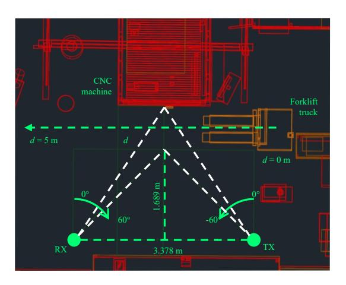
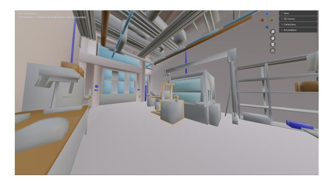
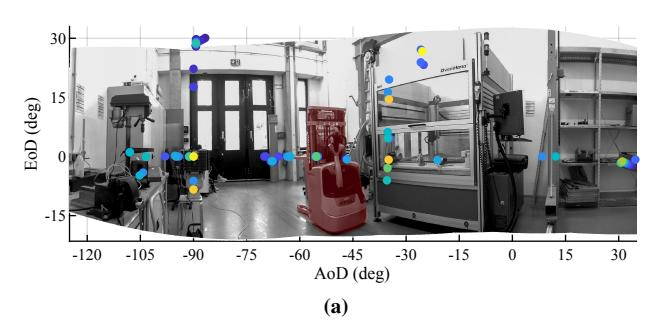
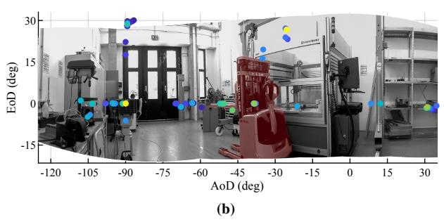
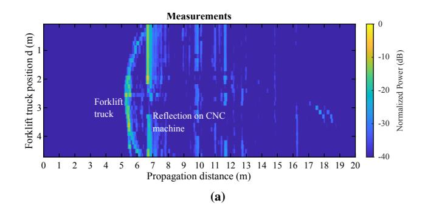
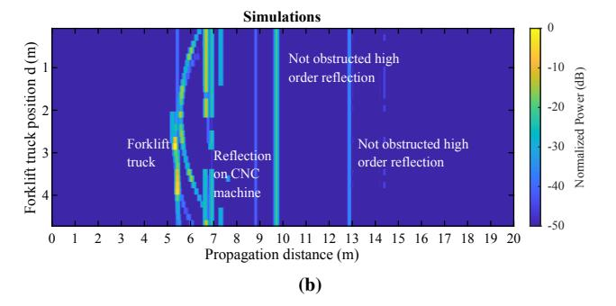
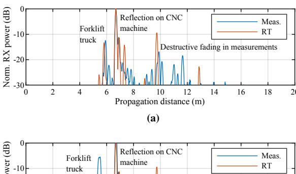
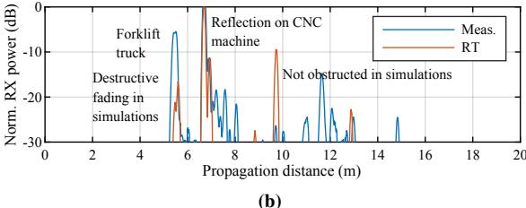
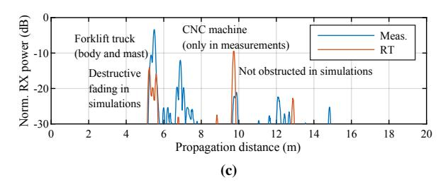
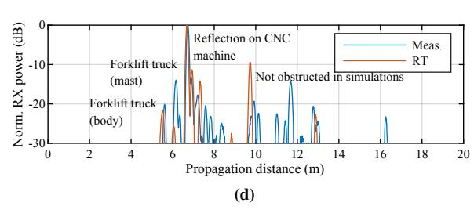

# Measurement-based Validation of Ray-tracing Model at sub-THz for ISAC Applications of Blockage in Industrial Scenario

Diego Dupleich\*(1)(2) , Damir Sitdikov(1) , Alexander Ebert(1)(2) , and Mate Boban(3) (1) Technische Universität Ilmenau, Ilmenau, 98684, Germany (2) Fraunhofer Institute for Integrated Circuits IIS, Ilmenau, 98684, Germany (3) Huawei Technologies Düsseldorf GmbH, Munich, Germany

## Abstract

The present paper compares double-directional ultrawideband measurements at 187*.*5 GHz with ray tracing (RT) simulations using the open-source tool Sionna. The objective is to validate a model obtained from precise light detection and ranging (LiDAR) scans. The measurements emulated a sensing system in a situation of blockage by a forklift truck in an industrial scenario. The results show, despite expected differences, a good agreement between the measurements and simulations, enabling this model for further investigations on machine learning (ML)-based integrated sensing and communication (ISAC) algorithms.

# 1 Introduction

The large blocks of free spectrum available in the (sub- )THz range makes these frequencies suitable for ISAC applications, specially in industrial applications [1].

The large instantaneous bandwidth and the need of implementing high gain antennas to compensate the isotropical free-space path-loss provide systems with high resolution in the time and angular domain. However, this also introduces an extremely large overhead on the angular scanning process due to the very narrow beam nature of the radio interfaces. This affects process as angular scanning for sensing, beam-discovery, alignment, and tracking, between others. Moreover, obstruction losses become more severe. Therefore, ML-based solutions to predict the channel and reduce the overhead on setting links enables intelligent radio communications towards seamless human interactions, [2].

However, the development of ML-based algorithms needs rich data-sets of channel samples, which is difficult to obtain since the current state of the art on measurements at (sub-)THz is still rudimentary. Because of the lack of antenna arrays, usually the angular information of the channel during the measurements is obtained from pointing high directive antennas in different angles, which requires that the channel is static. Hence, the simultaneous resolution of angle and time varying process in the channel is yet not possible. Therefore, specific measurement set-ups emulating movements must be designed to characterize the channel in these conditions. In [3], a forklift truck is manually moved on steps and a bi-static configuration is used to scan the environment at 187*.*5 GHz, repeating the measurements for each new position of the forklift truck. As expected, this is time consuming and limits the number of possible measurements and data collected. Therefore, alternative high precision simulations approach need to be considered, specially, for the generation of a rich data set of spatial channel samples for ML-based algorithms. In that regard, RT offers a good versatility between computing costs and accuracy of the predicted channel in the dimensions of interest, specially at these frequencies where previous experiments have shown that the channel is mostly dominated by specular components [4, 5].

Therefore, in the present paper, we use double-directional ultra-wideband measurements at 187*.*5 GHz to validate a RT model obtained from precise LiDAR scans by comparing the measured marginal power profiles with RT simulations carried out with the open-source tool Sionna™[6, 7].

## 2 Methodology

The ultimate objective is to validate from measurements at sub-THz the RT model and the open-source tool Sionna ™. Therefore, a controlled set-up is constructed with a defined geometry in the measurements which is expected to be recreated by the simulations. Of special interest is to capture key propagation aspects as the scattering properties (geometry and amplitude of the multipath components) of the target, which in this case is a moving forklift truck.

## 2.1 Scenario

The digital version of the overall scenario is shown in Fig. 2 and consists of a machine hall (6*.*48 m ⇥ 10*.*05 m ⇥6*.*33 m) with different tools typically found in industrial halls. The predominant constructive materials of the different items are iron, steel, aluminum, Plexiglass™, concrete, and steel sheet. The use case in this application is the identification, by means of sensing, of the forklift truck to predict a possible obstruction of a link between an access point (AP) and a unit inside of the computer numerically controlled (CNC) milling machine.

**Figure 1.** Top-view schematic of the measurement set-up showing the location of the TX, RX, and the forklift truck.

### 2.2 Measurement Set-up

The measurements were conducted using a M-sequence-based channel sounder [8] with a measurement bandwidth of  $B=7.5\,\mathrm{GHz}$  at 187.5 GHz. The TX and RX were located at 3.378 m distance to each other and at 1 m height. The forklift truck was displaced with 15 cm steps over the 5 m long track with a total of 33 measurement positions, as shown in Fig. 1. The TX and RX scanned with dual-polarized horn antennas with 15° half-power beam-width (HPBW) the azimuth from 0° to  $-60^\circ$  and from 0° to  $60^\circ$ , respectively, with  $\{\Delta\phi,\Delta\phi\}=15^\circ$  steps. More details on the measurement set-up and results can be found in [3].

The measurements in each position d of the forklift truck in the track are captured in a multi-dimensional array

$$h_{\text{meas}}^p(\tau_k, \phi_i, \theta_j) \in \mathbb{C}^{P \times K \times I \times J},$$
 (1)

where K = 4095 is the length of the channel impulse response (CIR),  $\{I,J\} = 5$  are the total number of scans in azimuth at the RX and TX, respectively.

#### 2.3 3D Model from Laser Scans

The scenario was digitized with the Leica BLK360 laser scanner that offers a 3D point accuracy of 6 cm at 10 m distance. The scanner was placed in several points in the room to capture more details. The software Leica CycloneTM was used to obtain a point-cloud including and AUTOCADTM with the package CloudWorxTM and LISP scripts were used to recreate the different objects from the point-cloud, where the geometric shapes as cubes and polygons were used for this purpose. Finally, the model of the room is exported to the 3D computer graphics software toolset BlenderTM 4.0 [9], where the electromagnetic properties (permeability and conductivity) of the constructive materials in accordance with ITU recommendations and measurements in the literature were assigned to the basic geometric shapes. A snapshot of the scenario in BlenderTM with the forklift truck in the middle is shown in Fig. 2.

**Figure 2.** View from the TX position of the RT model with the forklift truck in the middle of the track in BlenderTM.

**Figure 3.** Composite picture taken by the TX of the channel sounder with the isotropix RT simulations for two positions of the forklift.

### 2.4 Simulation Set-up

The simulations were carried out using the differentiable RT software SionnaTM(release v0.16.1), considering isotropic antennas, reflections, diffraction, edge diffraction, and scattering. The number of paths was set to 1e6 and maximum depth to 5.

The results of the RT simulations with isotropic antennas for two positions of the forklift truck are displayed together with two composite pictures taken by the channel sounder during the measurements in Fig. 3. A good agreement can be observed between the geometrical properties of the simulated path and the different objects in the environment, e.g., frames of the machine and doors/windows, tools, and different part of the forklift truck. The simulations show multiple paths that were not captured by the measurements since they were carried out with directive antennas scanning a small range of angles.

### 2.5 From RT to Sounding Emulation

The RT generates for each link up to  $l = \{1, \cdots, L\}$  paths with the parameters amplitude  $\gamma_l$  in the TX-RX polarization, delay  $\tau_l$ , azimuth of arrival (AoA)  $\phi_l$ , elevation of arrival (EoA)  $\theta_l$ , azimuth of departure (AoD)  $\phi_l$ , and EoA  $\vartheta_l$ . The baseband representation of the RT simulations considering isotropic antennas and a measurement bandwidth B can be represented as

$$H_{\rm RT} = \sum_{l} \gamma_l \cdot \exp(-j2\pi \tau_l f_n), \tag{2}$$

where the baseband frequency sampling points are  $f_n = \{-\frac{B}{2}, \cdots, n\frac{B}{N}, \cdots, \frac{B}{2}\}$  with  $n \in (-\frac{N-1}{2}, \frac{N-1}{2})$  and N = K is the total number of samples in the frequency domain. The delay samples (and resolution) are given by  $\tau_k = \frac{k}{B}$  with  $k \in (0, K-1)$ . For a fair comparison with the measurements, antenna patterns  $g_{\text{TX/RX}}(\cdot)$  similar to the ones used during the measurements are embedded in the simulations,

$$H_{\text{RT}}(f_n) = \sum_{l} \gamma_l \cdot g_{\text{RX}}(\phi_l, \theta_l) \cdot g_{\text{TX}}(\phi_l, \vartheta_l) \cdot \exp(-j2\pi\tau_l f_n). \tag{3}$$

The process of rotating the antennas to scan the channel in different azimuth angles at the TX and RX with  $\Delta \phi$  and  $\Delta \phi$  steps, respectively, is emulated by

$$H_{\text{RT}}(f_n, \phi_i, \varphi_j) = \sum_{l,i,j} \gamma_l \cdots$$

$$g_{\text{RX}}(\phi_l - i\Delta\phi, \theta_l) \cdot g_{\text{TX}}(\varphi_l - j\Delta\varphi, \vartheta_l) \cdots$$

$$\exp(-j2\pi\tau_l f_n). \tag{4}$$

Finally, the CIR is calculated as the inverse Fourier transform of the frequency transfer function (FTF) from (4),

$$h_{\text{RT}}(\tau_k, \phi_i, \varphi_i) \circ -\!\!\!\!\!\!\!\!\!\!\!\!\!\!\!\!\!\!\!\!\!\!\!\!\!\!\!\!\!\!\!\!\!\!\!$$

Yet, the measurements in (1) can be fairly compared to the RT simulations emulating the measurement set-up in (5).

The marginal power profile used for the comparison is the synthetic omni-directional power delay profile (PDP) for the different positions d of the forklift truck, calculated from the measurements and simulations as

$$P_{\text{meas/RT}}(\tau_k) = \sum_{i,j} |h_{\text{Meas/RT}}(\tau_k, \phi_i, \varphi_j)|^2.$$
 (6)

#### 3 Results

The synthetic omni-direction PDPs for the different positions of the forklift truck calculated from the measurements and simulations emulating the measurement set-up are displayed in Fig. 4a and Fig. 4b, respectively. A good match can be observed on the geometrical shape that the reflected paths described in the delay domain. It is worth noticing that the forklift track reflects multiple paths spanned in multiple delay taps that can be resolved due to the large bandwidth, showing that the target object (forklift truck) cannot

**Figure 4.** Synthetic omni-directional PDP for the different positions of the forklift truck on the track (a) measured, and (b) emulation of measurements from simulations.

be simulated as a point scatterer considering these systems properties in models for ISAC applications.

On the other hand, there are also significant differences in some paths between the measurements and simulations. Examples are two paths product of high order reflections that differently to the measurements, in the simulations are not obstructed by the arms of the forklift truck. This is due to differences on size (in the range of centimenters) and shape (round vs. edgy) between the real and modelled forklift truck.

### 4 Summary and Discussions

In some positions the amplitude of the estimated paths differed to the measurements. The reasons of the discrepancies are manifold:

- Reduce number of elements in the model: even if the model was obtained from preciese point-cloud data, there are multiple small objects that were not included to save modelling efforts, e.g., the simplified shape of the forklift truck. However, at high frequencies, the relative size of objects to wavelength makes that even small details and objects are relevant in terms of scattering.
- Simplification of digitized shapes: circular shapes are simplified by facets wich might create specular components in simulations while thay are not present in reality.

**Figure 5.** Measured and simulated synthetic omnidirectional PDP for different positions of the forklift truck at (a)  $d = 0.9 \,\mathrm{m}$ , (b)  $d = 1.8 \,\mathrm{m}$ , (c)  $d = 2.1 \,\mathrm{m}$ , and (d)  $d = 4.5 \,\mathrm{m}$ .

- Limited resolution of the measurement system: constructive/destructive fading occurs still with large measurement bandwidths and makes that the amplitude of taps from cluster of paths differ between the measurement and simulations, as shown in two examples in Fig. 5.
- Differences between measurement and emulated: similar to the previous point, differences between the real and simulated antenna patterns introduces discrepancies.

However, in general, the results showed a very good agreement between the amplitude and geometrical properties of the measured and simulated multipaths components. Therefore, we have validated the accuracy on the geometrical properties of the model and the propagation results from the calculations of the Sionna RT. The RT model will be will be further enriched with more details, and the RT tool

(SionnaTM) with propagation modelling aspects as surface roughness of different objects.

### 5 Acknowledgements

This work is an output of a bilateral project between TU Ilmenau and Huawei Technologies Duesseldorf GmbH. The authors acknowledge the fruitful discussions in COST Action CA20120 INTERACT and Mr. Yanneck Völker-Schöneberg for the development of the 3D model.

#### References

- [1] T. Kürner, "ISG THz Activity Report 2022," etsi.org, https://www.etsi.org/committee-activity/activity-report-thz (accessed Jun. 4, 2023).
- [2] European Cooperation in Science and Technology, "COST ACTION CA20120 The Intelligence-Enabling Radio Communications for Seamless Inclusive Interactions (INTERACT)," 2021, https://interactca20120.org.
- [3] D. Dupleich, A. Ebert, Y. Völker-Schöneberg, et al, "Characterization of Propagation from Measurements at sub-THz for ISAC Applications in an Emulated Dynamic Industrial Scenario," 18th European Conference on Antennas and Propagation (EuCAP 2024), Glasgow, March 2024.
- [4] A. Schultze, M. Schmieder, S. Wittig, et al., "Angle-Resolved THz Channel Measurements at 300 GHz in an Industrial Environment," *IEEE 95th Vehicular Technology Conference: (VTC2022-Spring)*, Helsinki, 2022.
- [5] D. Dupleich, A. Ebert, Y. Völker-Schöneberg, et al., "Characterization of Propagation in an Industrial Scenario from Sub-6 GHz to 300 GHz," 2023 IEEE Globecom Workshops: 2nd Workshop on Propagation Channel Models and Evaluation Methodologies for 6G, Kuala Lumpur, Malaysia, 2023.
- [6] J.Hoydis, S.Cammerer, et al., "Sionna: An open source library for next-generation physical layer research," arXiv preprint, March 2022.
- [7] S. Palke, T. Zugno, M. Boban, et al., "Ray Tracing and Measurement-Based Characterization of Inter/Intra-Machine THz Wireless Channels," 18th European Conference on Antennas and Propagation (EuCAP 2024), Glasgow, March 2024.
- [8] R. Müller, R. Herrmann, D. Dupleich, et al., "Ultrawideband multichannel sounding for mm-wave," 8th European Conference on Antennas and Propagation (EuCAP 2014), The Hague, March 2014.
- [9] Blender Online Community, "Blender a 3D modelling and rendering package," Blender Foundation, Stichting Blender Foundation, Amsterdam, 2018, http://www.blender.org.