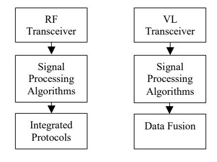
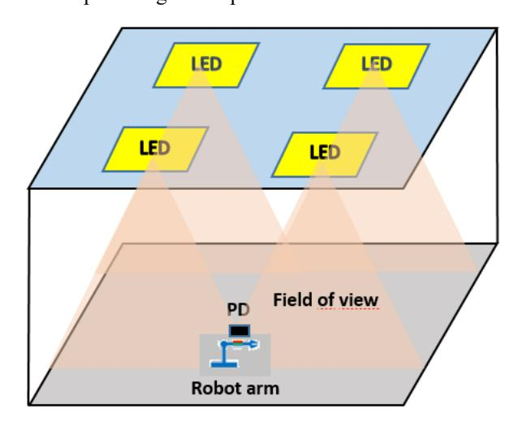

# Joint Communication and Sensing Prospects: Potential Through Visible Light

Ziad Salem *Institute of Sensors, Photonics and Manufacturing Technologies Joanneum Research Forschungsgesellschaft mbH* 7423 Pinkafeld, Austria ziad.salem@joanneum.at

Christian Krutzler *Institute of Sensors, Photonics and Manufacturing Technologies Joanneum Research Forschungsgesellschaft mbH* 7423 Pinkafeld, Austria christain.krutzler@joanneum.at

Andreas Peter Weiss *Institute of Sensors, Photonics and Manufacturing Technologies Joanneum Research Forschungsgesellschaft mbH* 7423 Pinkafeld, Austria andreas-peter.weiss@joanneum.at

*Abstract***—Joint Communication and Sensing (JCS) emerges as a crucial technology composed to revolutionize forthcoming wireless systems. Acknowledged as both a vital technology and a pivotal usage scenario for the anticipated 6th generation (6G) wireless networks, JCS takes advantages of the communication signals to detect and as well monitor the surrounding environment, facilitating sensing, target detection, and localization. However, current JCS technologies meet various challenges demanding comprehensive solutions. These challenges include standardization, privacy, security, interference, energy efficiency, complexity and cost. Advancements in technologies supporting JCS facilitate the seamless integration of sensing and communication capabilities. Key technologies contributing to JCS include visible light communication, millimeter-wave communication, radar systems, sensor fusion and machine learning. This manuscript discusses the fundamental elements of JCS, various approaches, current challenges and prospects for future contributions with particular focus on Radio Frequency RF-JCS, as well as the widely adopted innovative approach based on Visible Light technologies VL-JCS, which promises to contribute significantly to the future of JCS research.**

*Keywords—Joint communication, sensing technologies, visible light technology, light-based sensing.* 

### I. INTRODUCTION

Joint Communication and Sensing (JCS), also known as Integrated Sensing And Communication (ISAC), Sensing-Communication Integration (SCI) or Cooperative Sensing and Communication (CSC) is a key aspect within the broader context of the 6G concept. Such an integration holds significant promise for enabling smart applications that demand advanced communication capabilities and accurate and precise sensing functionalities [1]-[3]. In this manuscript, we explore the convergence of communication and sensing systems, with a focus on JCS.

The current landscape of communication and sensing systems is characterized by their independent design and operation, which compromises high data transmission rates and high-accurate sensing for the requirements of new applications such as autonomous driving and connected robots [4]. On the one hand, communication systems involve various technologies, including wireless such as Wireless Fidelity (Wi-Fi), Bluetooth, cellular, Visible Light Communication (VLC), satellite (e.g., Global Positioning System -GPS) or fiber-optic systems [5]. Another acronym for VLC commonly used is Light Fidelity (Li-Fi). On the other hand, sensing technologies also include many diverse technologies ranging from infrared, ultrasonic waves, image sensors, inertial measurement units, radar to Lidar [6]. Finally, while the traditional communication technologies provide limited capabilities for accurate sensing, modern technologies provide approaches with much higher accuracy.

Challenges that persist within current communication and sensing systems are due to bandwidth limitations, spectrum crowding, security and privacy concerns, energy efficiency, compatibility, cost, accuracy, precision, limited sensing range, power consumption, interference and environmental impacts [7].

For indoor environments, satellite systems fail to provide accurate positioning and navigation. In response to these challenges, the integration between communication and sensing systems emerges as a compelling solution. By utilizing the same frequency and hardware, integration promises cost reduction and the alleviation of associated challenges. The synergy can further enhance the sensing accuracy by leveraging communication signals and unlock diverse applications [8]. JCS envisions communication supporting sensing, thereby also enabling low latency, ultrahigh data transmission rates, superior reliability and improved energy efficiency [9].

The typical architecture of JCS systems in both RF and VL domains is illustrated in Fig. 1.

FIGURE 1. JCS SYSTEM'S ARCHITECTURE

For RF, the transceiver consists of antennas, a RF frontend (mixers, amplifiers), Analog-to-Digital Converters (ADCs) and Digital-to-Analog Converters (DACs). Signal processing algorithms include modulation methods such as Quadrature Amplitude Modulation (QAM) or Orthogonal Frequency Division Multiplexing (OFDM), Forward Error Correction (FEC), channel equalization and adaptive filtering. Examples of integrated protocols are Long-term Evolution (LTE), 5G New Radio (NR), Wi-Fi (IEEE 802.11) and Bluetooth.

For VL, the transceiver utilizes for example Light Emitting Diodes (LEDs) for transmission and photodiodes or image sensors for detection. Common signal processing algorithms include modulation schemes such as On-Off Keying (OOK), Variable Pulse Position Modulation (VPPM), Orthogonal Frequency Division Multiplexing (OFDM) and Discrete Multitoned Modulation (DMT), along with error correction and optical signal filtering. Data fusion combines data from multiple sensors (e.g., photodiodes, cameras) to improve accuracy and reliability of communication and sensing [10].

System architecture design can be supported by channel modelling. For example, RF uses statistical models or Kalman filtering, while VLC uses Line-of-Sight (LoS) configurations, diffuse reflections and considers ambient light interference. Further, both technologies can be supported by various machine-learning algorithms.

Building upon our previous works in the field of VLC and Visible Light Sensing (VLS) [11]-[12], where the determination of the rotation of a robotic arm under diverse conditions was demonstrated, we also introduced the concept of JCS solely based on visible light. More details about this work will be given later in the applications subsection. Before that, the advancements of JCS in the context of 6G in various domains including robot control, autonomous vehicle operation, smart street systems, smart manufacturing and human-computer interaction should be pointed out. Thereby, JCS not only promises innovation but also holds the key to unlocking substantial benefits in the dynamic landscape of 6G technology.

### II. APPROACHES OF JCS WITH RADIO FREQUENCY

JCS is an emerging paradigm that integrates communication and sensing functionalities within a unified framework, offering a transformative approach to wireless communication systems. Within the field of JCS, various approaches have been developed where each approach focuses on improving the capabilities of senders, receivers, and Intelligent Reflective Surfaces (IRSs) for enabling efficient and effective communication in RF environments. In the following subsections, we will focus on these key elements within the RF world, and subsequently, we will compare it with other advanced technologies that operate within the visible light spectrum.

# *A. Sender Approaches*

The sender approaches within JCS aim to enhance the transmission capabilities of wireless devices. This includes techniques such as cognitive radio, where the sender dynamically adjusts its transmission parameters based on sensed environmental conditions to optimize spectrum utilization and mitigate interference [13]. Additionally, waveform design techniques, such as adaptive modulation and coding, enable senders to adapt their transmission characteristics to suit the channel conditions, maximizing data rates and reliability [14]. Cognitive radio systems operate across a wide range of frequencies, including traditional RF bands such as those used for Wi-Fi (2.4 GHz and 5 GHz), cellular communications (e.g., LTE bands), and other licensed and unlicensed frequency bands [15].

## *B. Receiver Approaches*

Receiver approaches in JCS focus on enhancing the reception capabilities of wireless devices. Advanced signal processing algorithms, such as cooperative sensing and joint detection, enable receivers to effectively extract useful information from received signals, even in challenging RF environments with high levels of interference and noise [16]. Moreover, multi-antenna techniques, such as Multiple Input Multiple Output (MIMO), leverage spatial diversity to improve reception performance and increase data rates [17]. Massive MIMO operates in the microwave frequency range, commonly in the bands used for cellular communications (e.g., sub-6 GHz bands) as well as higher-frequency mmWave (millimeter wave) bands used in 5G networks [18].

### *C. Intelligent Reflective Surface (IRS) Approaches*

IRS approaches represent a novel paradigm within JCS, leveraging programmable metasurfaces to control and manipulate RF signals in the environment. This technology is also known as Large Intelligent Surfaces (LIS), or Software-Controlled Metasurfaces (SCM) [19]. By intelligently adjusting the phase and amplitude of reflected signals, IRS can enhance coverage, improve signal strength, and mitigate interference. This approach offers unprecedented flexibility and adaptability in shaping the RF environment to optimize communication performance [20]-[21]. IRSs operate in the same frequency bands as the wireless signals they reflect, which can include microwave frequencies (e.g., sub-6 GHz bands) and mmWave frequencies used in modern wireless communication systems [22].

### *D. IRS Approaches aided Backscatter Communication*

In the context of RF communication, materials with specific backscatter behaviour play a crucial role in enabling various functionalities, including sensing, communication, and localization [23]. Backscatter communication refers to the reflection of RF signals by materials or surfaces in the environment. As mentioned before, these materials exhibit unique electromagnetic properties that allow them to interact with incident RF waves in a manner that can be exploited for different purposes [24].

One well-known key application of materials with backscatter behaviour is in the development of passive Radio Frequency Identification (RFID) tags. These tags consist of a microchip and an antenna, but they lack an internal power source. Instead, they rely on RF energy from an external reader to power the chip and transmit data back to the reader through a backscattering process. Materials with specific backscatter characteristics are used in the design of RFID tags to ensure efficient energy harvesting and reliable communication with the reader [25].

Another application is in the field of smart surfaces or IRSs, where materials are engineered to manipulate RF signals for enhanced communication performance as mentioned earlier. By controlling the phase and amplitude of reflected RF waves, these surfaces can optimize signal strength, mitigate interference, and improve coverage in wireless communication systems. Materials with tailored backscatter properties are essential components of IRS, enabling dynamic control of the RF environment to adapt to changing communication requirements [26].

Additionally, materials with backscatter behaviour are used in radar systems for target detection and tracking. Radar relies on the detection of RF signals reflected off objects in the environment to determine their presence, location, and motion. Materials with specific backscatter characteristics can enhance the Radar Cross-Section (RCS) of objects, making them more detectable and distinguishable from background clutter [27].

### *E. Application Examples*

Here are few application examples for the JCS approaches mentioned before.

In a smart city environment, cognitive radio devices can adjust their transmission parameters to avoid interference from other wireless networks and optimize spectrum utilization. This allows more efficient and reliable communication in dynamically changing RF environments [28]. In wireless LANs or cellular networks applications, MIMO receivers use multiple antennas to receive signals from multiple transmit antennas simultaneously. By combining signals received through different paths, MIMO systems achieve higher data rates, increased coverage and improved reliability, particularly in environments with multipath fading or interference [29].

In smart buildings or shopping malls, IRS panels that are installed on walls or ceilings can dynamically adjust the phase and amplitude of reflected RF signals to steer beams towards specific locations or users. This improves signal strength, reduces interference, and enables seamless connectivity for IoT devices, mobile users and other wireless applications [30].

In Human Activity Recognition (HAR), the human's movement could accurately be identified through JCS systems thus, offering the possibility for remote healthcare monitoring for elderly, safety protection, security monitoring and contextual awareness, fall detection, presence detection, etc. [31]. [32] described a Proof-of-Concept (PoC) architecture for Integrated Sensing and Communication (JCS) using a 5G communication system with minimal additional hardware. The authors implemented an OFDM radar approach that utilizes the frequency domain transmit (TX) reference signal and frequency domain reflected signal. The system showed promising results in tracking human walking targets. In this work, a standard deviation of 5 mm for human targets at a 3 meter range and a calculated achievable sensing range of up to 60 meters based on the Signal-to-Noise Ratio (SNR) is reported. This provides a foundation for future developments in secure joint communication and sensing applications.

In autonomous vehicle driving, the wireless imaging technology in 6G can enhance visibility in challenging environments, like at night or in fog, benefiting transportation systems through improved pedestrian and vehicle safety [33].

## III. APPROACHE OF JCS WITH VISIBLE LIGHT

In recent years, there has been a growing interest in integrating communication and sensing functionalities within the visible light spectrum. JCS in the visible light spectrum combines VLC and VLS to enable a range of novel applications and improvements in existing systems. Investigating the integration between optical communications and sensing technologies reveals promising prospects for constructing high-performance and highly flexible communication systems with high transmission rates.

Fig. 2 illustrates an exemplary vision of VLC together with sensing the surrounding of an object (e.g. the robotic arm) within the field of view of the transmitter, which utilises several LEDs for illumination. The surrounding (dark or light) is predicted by the optical receiver (e.g. photodiode (PD)) placed on the robot arm. Essentially, with such an exemplary system it is possible to communicate with the robot arm, e.g. send commands, sense the position and movement of it, as well as still providing unhampered room illumination.

FIGURE 2. EXENMPLARY ILLUSTRATION OF A VLC-BASED SENSING SETUP

This chapter explores the approaches and benefits of JCS within the visible light (VL) domain, comparing it to the traditional RF world.

## *A. Definition of VLC and VLS and Benefits of JCS*

On one hand, VLC utilizes visible light for data transmission, offering advantages such as high bandwidth, low interference and enhanced security [34]. On the other hand, VLS involves using visible light for sensing applications, including object detection, localization, and environmental monitoring [35]. JCS in VL aims to combine these capabilities to enable simultaneous communication and sensing, leading to more efficient and versatile systems. By leveraging the same light source for both communication and sensing tasks, JCS systems can achieve seamless integration and improved resource utilization.

In the context of 6G, there is a vision for the seamless integration of sensing and communication functions within a unified system. This integration involves the shared utilization of resources across time, frequency, and space domains, encompassing key elements like waveform, signal processing, hardware, and more [36].

## *B. Approaches in the Visible Light World*

In the domain of VLC and VLS, the integration of communication and sensing functionalities has garnered significant interest due to its potential to revolutionize various applications ranging from indoor positioning to smart lighting systems. Understanding the key elements and approaches within the visible light world is essential for designing efficient and effective systems that leverage the unique characteristics of the visible light spectrum [37]-[38].

LED Transmitters: One of the fundamental elements in VLC systems is the LED transmitter. LEDs serve as light sources for VLC systems, emitting modulated light signals that carry data. Transmitters can vary in complexity and design encompassing single-color LEDs as well as multi-colour or Red Green Blue (RGB) LEDs. The selection of LEDs depends on factors such as modulation scheme, data rate requirements, and application-specific constraints. With ongoing advancements in LED technology, modulation techniques, and signal processing algorithms, the future of JCS in the visible light world looks promising, paving the way for innovative solutions in various domains.

Photodetectors: Photodetectors play a crucial role in VL applications. Photodetectors capture the modulated light signals emitted by LEDs and convert them into electrical signals for further processing. Various types of photodetectors, including photodiodes, phototransistors, and image sensors, are utilized based on the specific sensing requirements such as detection range, resolution and sensitivity. In the terms of resolution and sensitivity this mainly refers to the time domain (e.g. Samplerate) and spectral domain (e.g. only sensitive in certain wavelengths).

Modulation Techniques: Modulation techniques are essential for encoding data onto the optical carrier signal transmitted by LEDs. Common modulation schemes employed in VLC systems include OOK, Pulse Position Modulation (PPM) and Colour Shift Keying (CSK) [39]. These modulation techniques offer different trade-offs in terms of spectral efficiency, power efficiency and complexity, enabling the adaptation of VLC systems to diverse communication scenarios and application requirements.

Signal Processing Algorithms: Signal-processing algorithms play a critical role in extracting information from the received optical signals in both communication and sensing applications. These algorithms encompass various tasks such as demodulation, equalization, synchronization, and data decoding. Advanced signal processing techniques, including adaptive filtering, channel estimation and error correction coding that are employed to mitigate channel impairments, enhance system performance and improve reliability [40].

Integrated Protocols: The development of integrated protocols is essential for enabling seamless coordination between communication and sensing tasks within VL systems. These protocols define the procedures for data transmission, channel access, synchronization, and sensor data fusion. By integrating communication and sensing functionalities into a unified framework, these protocols facilitate efficient resource allocation, reduce overhead, and enhance overall system performance. By leveraging LED transmitters, photodetectors, modulation techniques, signal processing algorithms and integrated protocols, researchers and practitioners can develop innovative solutions that take advantages of the unique properties of the visible light spectrum for a wide range of applications.

# *C. VL Comparison to RF Approaches*

While RF communication and sensing systems have been widely deployed, they face challenges such as spectrum congestion, limited bandwidth, and susceptibility to interference. In contrast, VL systems offer a broader spectral range, lower interference and better security features since light, unlike RF signals, does not propagate through solid materials (e.g. walls), making them suitable for applications requiring high data rates and reliable communication. Additionally, VL sensing can leverage existing illumination infrastructure, reducing deployment costs and complexity compared to RF sensing systems [41]-[44]. Nevertheless also VL systems face limitations, which include lower data rates for non-Line of Sight (nLoS) between the transmitter and receiver, increased noise by ambient light disturbance, etc.

Table 1 summarizes the key features, advantages, and limitations of JCS systems in RF and VL domains [45]-[46].

TABLE I. COMPARISON OF RF AND VL TECHNOLOGIES FOR JCS

| Feature                    | RF JCS Systems                                                                                                                 | VL JCS Systems                                                                                                                    |
|----------------------------|--------------------------------------------------------------------------------------------------------------------------------|-----------------------------------------------------------------------------------------------------------------------------------|
| Communicat ion Range    | Longer communication range due to electromagnetic waves propagation Moderate to high data rates depending on | Limited communication range, typically suitable for indoor environments High data rates due to broader spectral |
| Data Rate                  | the frequency band and modulation scheme                                                                                 | range depending on modulation technique                                                                                        |
| Energy Consumption      | Relatively higher energy consumption due to the use of RF transceivers and amplifiers                              | Lower energy consumption due to energy-efficient LED components, which still provide illumination                  |
| Interference Resilience | Susceptible to electromagnetic interference from other wireless devices operating in the same frequency band    | Less susceptible to interference as VLC can be confined to defined areas and controlled by the optic design        |
| Deployment Flexibility  | Flexible deployment options, suitable for both indoor and outdoor environments                                        | Limited outdoor deployment flexibility, primarily suitable for indoor environments with lighting infrastructure    |

## *D. VL Approaches applications*

As described earlier, JCS in the visible light spectrum holds great promise for enabling a wide range of applications, from indoor positioning and localization to environmental monitoring and smart lighting. In the following, we will outline several examples from the literature presenting the broad variety of applicable use-cases.

[47] introduced Optical Joint Communication And Sensing (O-JCAS), a novel optical integrated sensing and communication system with two key phases. In the first phase, directionless O-JCAS employs optical Access Points (AP) to broadcast non-directed light for communication and environmental sensing via reflected light. The second phase, directional O-JCAS, enhances both communication and sensing by having optical APs transmit focused light to users. To achieve this, the authors proposed optical beamforming using a collimating lens. The simulation results demonstrated notable improvements: directionless O-JCAS boosts sensing accuracy and communication Bit Error Rate (BER) by 3.76 dB and 3.01 dB, respectively. In the second phase, optical beamforming significantly increases light intensity, improving sensing accuracy and communication BER by 62.06 dB and 65.52 dB, respectively.

In [48] another O-JCAS scheme for cooperative mobile robots, merging camera sensing and Screen-Camera Communication (SCC). Unlike prior throughput-centric SCC designs for stationary links, their real-time O-JCAS scheme addresses issues like image blur and prolonged image display delay. Focusing on the leader-follower formation control in cooperative mobile robotics, the scheme enables the follower robot to capture leader-shared information and sense relative poses using RGB images from its camera. A new control law leveraging this information achieves stable formations. Realworld experiments, including uniform and non-uniform motions, were conducted to evaluate this O-JCAS against a benchmark approach using extended Kalman filtering (EKF) for leader state estimation. The reported results demonstrate O-JCAS's superior performance in accuracy, stability, and robustness over the benchmark.

[11] highlighted the potential of VLS alongside VLC for future Industrial IoT (IIoT) applications, specifically in determining the rotation of a robotic arm using machine learning (ML) techniques. The authors demonstrated that the rotation of a robotic arm could be precisely monitored using VLS by simply outfitting the arm with sequences of coloured retroreflective foils. Additionally, they showed that the sensing technique is also compatible with light modulation for communication (VLC). This paves the way for simultaneous sensing and communication tasks to be performed using the same low-complex infrastructure, which can also fulfil the requirement of room lighting. The approach proved effective even under varying illumination conditions, highlighting VLS as a viable alternative for industrial robot monitoring combined with optical wireless communication. The experimental setup involved a PCB-mounted LED illuminating the robotic arm, which featured retroreflective foils of varying colours. The reflected light, sensed by a nearby RGB photodiode on the same PCB, demonstrated the dual capability of modulating light for VLC and sensing the arm's motion through VLS simultaneously. This integrated system proves advantageous in industrial applications with frequently used robotic arms, eliminating the need for active sensors on the arm for motion detection and control. The authors established a RF-free infrastructure, addressing predicted interferences and spectrum limitations for future RF communication. ML-assisted VLS demonstrated minimal training effort, ensuring high accuracy in determining the arm's rotation. The presented solution proved resilient against environmental changes, such as additional ambient light, without requiring repetitive training phases.

[12] introduced the idea of utilizing VLC and VLS for forming a closed control loop. This system is designed to accurately sense the rotational position of a cylinder affixed to a servomotor by VLS, achieving an average absolute deviation of approximately 1.2°. Additionally, it efficiently executes commands to the servomotor, equipped with a photodiode, to achieve specific rotational positions. Experimental validation confirms the viability of their implemented system, highlighting its relevance in the context of 6G technology. Moreover, they presented a straightforward yet efficient technique to mitigate the effects of ambient light interference on operational performance. In this work, the authors presented the first implementation of a closed-loop controller capable, as mentioned, of remotely sensing the cylinder's rotational position via backscattered VLS and communicating commands through VLC. This design eliminates the need for additional communication components like Wi-Fi. This approach combines energy efficiency and low-latency sensing with the advantages of VLC, offering immunity against RF signal interference and associated security threats such as spamming or spoofing.

[49] introduced a visible light communication and sensing system employing Binary Phase-Shift Keying (BPSK) modulation during the active part (ON-Time) of strobing light. Expanding upon this, the authors explored Dark Light Communication (DLC or darkVLC), utilizing the same LEDs for communication during the OFF Time of strobing light. The high switching frequency of LEDs enables DLC, operating at very high sample rates, imperceptible to the human eye. DLC filtered out by the low Frames Per Second (FPS) camera during sensing, forms the foundation for darkVLC in the VLCS system. This dual-use of ON- and OFF-time significantly enhances communication throughput, rendering the system applicable for industrial IoT applications.

[50] explored diverse data modalities for supporting the requirements of both localization and sensing. In their work, they introduced Li-Fi as a potential solution for integrating illumination and sensing with the existing indoor lighting infrastructure. They applied both multi and cross modal sensing through integrating Li-Fi with other sensors as a promising technology to adapt to environment conditions.

In summary, the combination of VLC and VLS present a compelling avenue for future JCS systems. The ongoing research in this domain aims to harness the benefits of visible light, paving the way for innovative and efficient solutions in various fields, including industrial IoT, robotics and smart environments.

# IV. OUTLOOK AND CONCLUSIONS

Joint Communication and Sensing (JCS) play a pivotal role in shaping the future of wireless communications and sensing within the 6G concept. Both in the radio frequency (RF) and visible light communication/sensing (VLC/VLS) domains, JCS offers unprecedented opportunities for seamless integration, resource optimization and intelligent decisionmaking in dynamic and heterogeneous wireless environments. However, several challenges, including spectrum scarcity, interference management and hardware limitations, need to be addressed to fully realize the potential of JCS in 6G networks. By leveraging recent advancements in RF and visible light technologies, as well as embracing interdisciplinary collaborations and innovative research approaches, JCS has the potential to revolutionize a wide range of applications, from smart cities and healthcare to industrial automation and beyond.

For future works, further investigations into novel spectrum sharing techniques and dynamic resource allocation strategies for maximizing the efficiency of RF JCS systems are necessary. In the VL based approaches, the exploration of advanced optical materials and device architectures for enhancing the performance and reliability of VL JCS systems in complex indoor environments is one of the major research directions in this field. Furthermore the integration of JCS functionalities into emerging network architectures, such as edge computing and distributed intelligence, to enable realtime decision-making and adaptive networking capabilities

will become a key element in future research. Finally, standardization efforts and regulatory frameworks for facilitating the deployment and interoperability of JCSenabled systems in commercial and industrial settings are necessary to enable the envisioned integrated networks.

### ACKNOWLEDGMENT

This work is supported by the Austrian Federal Ministry for Climate Action, Environment, Energy, Mobility, Innovation and Technology (BMK) within the project 3DLiDap (Disruptive Technologies for ultra-high-precision 3D Light Detection and Positioning in Indoor Location-based Services and Indoor Geofencing Applications).

## REFERENCES

- [1] H. Wymeersch et al., "Integration of Communication and Sensing in 6G: a Joint Industrial and Academic Perspective," *2021 IEEE 32nd Annual International Symposium on Personal, Indoor and Mobile Radio Communications (PIMRC)*, Helsinki, Finland, 2021, pp. 1-7, doi: 10.1109/PIMRC50174.2021.9569364.
- [2] Wei et al., "Integrated Sensing and Communication Signals Toward 5G-A and 6G: A Survey," *in IEEE Internet of Things Journal*, vol. 10, no. 13, pp. 11068-11092, 1 July 2023, doi: 10.1109/JIOT.2023.3235618.
- [3] I. F. Akyildiz, A. Kak and S. Nie, "6G and beyond: The future of wireless communications systems," *IEEE access*, 8, pp. 133995- 134030, 2020, doi: 10.1109/ACCESS.2020.3010896.
- [4] M. Mert Şahin and H. Arslan, "Multi-functional Coexistence of Radar-Sensing and Communication Waveforms," *2020 IEEE 92nd Vehicular Technology Conference (VTC2020-Fall)*, Victoria, BC, Canada, 2020, pp. 1-5, doi: 10.1109/VTC2020-Fall49728.2020.9348582.
- [5] T. Ramathulasi and M. Rajasekhara Babu, "Comprehensive Survey of IoT Communication Technologies. In: Venkata Krishna, P., Obaidat, M. (eds) Emerging Research in Data Engineering Systems and Computer Communications," Advances in Intelligent Systems and Computing, vol. 1054, 2020. Springer, Singapore. https://doi.org/10.1007/978-981-15-0135-7\_29.
- [6] W. Alsafery, O. Rana and C. Perera, C, "Sensing within smart buildings: A survey," *ACM Computing Surveys*, 55(13s), 1-35, 2023, https://doi.org/10.1145/3596600.
- [7] M. Z. Chowdhury, M. Shahjalal, S. Ahmed and Y. M. Jang, "6G Wireless Communication Systems: Applications, Requirements, Technologies, Challenges, and Research Directions," *in IEEE Open Journal of the Communications Society*, vol. 1, pp. 957-975, 2020, doi: 10.1109/OJCOMS.2020.3010270.
- [8] A. Liu et al., "A Survey on Fundamental Limits of Integrated Sensing and Communication," *in IEEE Communications Surveys & Tutorials*, vol. 24, no. 2, pp. 994-1034, Secondquarter 2022, doi: 10.1109/COMST.2022.3149272.
- [9] M. Pons, E. Valenzuela, B. Rodríguez, J. A. Nolazco-Flores & C. Del-Valle-Soto, "Utilization of 5G Technologies in IoT Applications: Current Limitations by Interference and Network Optimization Difficulties—A Review," *Sensors*, 23(8), 3876, 2023, https://doi.org/10.3390/s23083876.
- [10] A. J. Alqaraghuli, J. V. Siles and J. M. Jornet, "The Road to High Data Rates in Space: Terahertz Versus Optical Wireless Communication," *in IEEE Aerospace and Electronic Systems Magazine*, vol. 38, no. 6, pp. 4-13, 1 June 2023, doi: 10.1109/MAES.2023.3243584.
- [11] K. Madane, A. P. Weiss, S. Schantl, E. Leitgeb and F. P. Wenzl, "Machine Learning Assisted Visible Light Sensing of the Rotation of a Robotic Arm," *in IEEE Access*, vol. 9, pp. 130721-130736, 2021, doi: 10.1109/ACCESS.2021.3112297.
- [12] C. Fragner, A. P. Weiss, F. P. Wenzl and E. Leitgeb, "Integrated Sensing and Communication in the Visible Spectral Range: A Novel Closed Loop Controller," *2022 International Conference on Broadband Communications for Next Generation Networks and Multimedia Applications (CoBCom)*, Graz, Austria, 2022, pp. 1-7, doi: 10.1109/CoBCom55489.2022.9880677.

- [13] R. Zheng, X. Li & Y. Chen, "An overview of cognitive radio technology and its applications in civil aviation," *Sensors*, 23(13), 6125, 2023, https://doi.org/10.3390/s23136125.
- [14] Z. Sun, W. Shi, J. Wang and Q. Niu, "Adaptive Modulation and Coding Scheme Based on Multi-source Indicator Fusion," *2023 IEEE 6th International Conference on Electronic Information and Communication Technology (ICEICT)*, Qingdao, China, 2023, pp. 129- 134, doi: 10.1109/ICEICT57916.2023.10245368.
- [15] A. Nasser, H. Al Haj Hassan, J. Abou Chaaya, A. Mansour & K. C. Yao, "Spectrum sensing for cognitive radio: Recent advances and future challenge," *Sensors*, 21(7), 2408, 2021, https://doi.org/10.3390/s21072408.
- [16] Z. Zhang et al., "6G Wireless Networks: Vision, Requirements, Architecture, and Key Technologies," *in IEEE Vehicular Technology Magazine*, vol. 14, no. 3, pp. 28-41, Sept. 2019, doi: 10.1109/MVT.2019.2921208.
- [17] P. Ghasemzadeh, M. Hempel, S. Banerjee and H. Sharif, "A Spatial-Diversity MIMO Dataset for RF Signal Processing Research," *in IEEE Transactions on Instrumentation and Measurement*, vol. 70, pp. 1-10, 2021, Art no. 5502410, doi: 10.1109/TIM.2021.3073441.
- [18] F. A. Pereira de Figueiredo, "An Overview of Massive MIMO for 5G and 6G," *in IEEE Latin America Transactions*, vol. 20, no. 6, pp. 931- 940, June 2022, doi: 10.1109/TLA.2022.9757375.
- [19] Y. Cheng, K. H. Li, Y. Liu, K. C. Teh and H. V. Poor, "Downlink and uplink intelligent reflecting surface aided networks: NOMA and OMA," *IEEE Trans. Wireless Commun*., vol. 20, no. 6, pp. 3988-4000, June 2021, doi: 10.1109/TWC.2021.3054841.
- [20] M. Rihan, A. Zappone, S. Buzzi, G. Fodor and M. Debbah, "Passive vs. Active Reconfigurable Intelligent Surfaces for Integrated Sensing and Communication: Challenges and Opportunities," *in IEEE Network*, 2023, doi: 10.1109/MNET.2023.3321542.
- [21] Y.-C. Liang, R. Long, Q. Zhang, J. Chen, H. V. Cheng, and H. Guo, "Large intelligent surface/antennas (LISA): Making reflective radios smart," *in Journal of Communications and Information Networks*, vol. 4, no. 2, pp. 40–50, June 2019, doi: 10.23919/JCIN.2019.8917871.
- [22] E. Basar, M. Di Renzo, J. De Rosny, M. Debbah, M. S. Alouini & R. Zhang, "Wireless communications through reconfigurable intelligent surfaces," *IEEE access*, 7, 116753-116773, 2019, doi: 10.1109/ACCESS.2019.2935192.
- [23] Y. -C. Liang, Q. Zhang, J. Wang, R. Long, H. Zhou and G. Yang, "Backscatter Communication Assisted by Reconfigurable Intelligent Surfaces," *in Proceedings of the IEEE*, vol. 110, no. 9, pp. 1339-1357, Sept. 2022, doi: 10.1109/JPROC.2022.3169622.
- [24] F. Rezaei, D. Galappaththige, C. Tellambura and S. Herath, "Coding Techniques for Backscatter Communications—A Contemporary Survey," *in IEEE Communications Surveys & Tutorials*, vol. 25, no. 2, pp. 1020-1058, Secondquarter 2023, doi: 10.1109/COMST.2023.3259224.
- [25] E. Perret, "Chipless labels detection by backscattering for identification and sensing applications," *Comptes Rendus. Physique*, 22(S5), 51-71, 2021.
- [26] Q. Wu and R. Zhang, "Towards Smart and Reconfigurable Environment: Intelligent Reflecting Surface Aided Wireless Network," *in IEEE Communications Magazine*, vol. 58, no. 1, pp. 106-112, January 2020, doi: 10.1109/MCOM.001.1900107.
- [27] W. Jiang, Y. Wang, Y. Li, Y. Lin, W. Shen, "Radar Target Characterization and Deep Learning in Radar Automatic Target Recognition: A Review," *Remote Sensing*, 15(15), 3742, 2023, https://doi.org/10.3390/rs15153742.
- [28] M. Khasawneh, A. Azab, S. Alrabaee, H. Sakkal and H. H. Bakhit, "Convergence of IoT and Cognitive Radio Networks: A Survey of Applications, Techniques, and Challenges," *in IEEE Access*, vol. 11, pp. 71097-71112, 2023, doi: 10.1109/ACCESS.2023.3294091.
- [29] P. Yadav, S. Kumar & R. Kumar, R, "A review of transmission rate over wireless fading channels: Classifications, applications, and challenges" *Wireless Personal Communications*, 122, 1709-1765, 2022, https://doi.org/10.1007/s11277-021-08968-1.
- [30] S. A- H. Mohsan & Y. Li, Y, "IRS-assisted UAV communications: A comprehensive review," *arXiv preprint arXiv:2306.15838*, 2023, https://doi.org/10.48550/arXiv.2306.15838.
- [31] T. Wild, A. Grudnitsky, S. Mandelli, M. Henninger, J. Guan and F. Schaich, "6G Integrated Sensing and Communication: From Vision to

- Realization," 2023 20th European Radar Conference (EuRAD), Berlin, Germany, 2023, pp. 355-358, doi: 10.23919/EuRAD58043.2023.10289474.
- [32] X. Li., Y. Cui., J. A. Zhang., F. Liu., D. Zhang and L. Hanzo, "Integrated human activity sensing and communications," *in IEEE Communications Magazine*, vol. 61, no. 5, pp. 90-96, May 2023, doi: 10.1109/MCOM.002.2200391.
- [33] D. K. Pin Tan et al., "Integrated Sensing and Communication in 6G: Motivations, Use Cases, Requirements, Challenges and Future Directions," *2021 1st IEEE International Online Symposium on Joint Communications & Sensing (JC&S)*, Dresden, Germany, 2021, pp. 1- 6, doi: 10.1109/JCS52304.2021.9376324.
- [34] S. Zahiri-Rad, Z. Salem, A. P. Weiss and E. Leitgeb, "An Optimal Solution for a Human Wrist Rotation Recognition System by Utilizing Visible Light Communication," *2022 International Conference on Broadband Communications for Next Generation Networks and Multimedia Applications (CoBCom)*, Graz, Austria, 2022, pp. 1-8, doi: 10.1109/CoBCom55489.2022.9880745.
- [35] Z. Salem and A. P. Weiss, "Visible Light Sensing for Recognising Human Postural Transitions," *2022 International Conference on Broadband Communications for Next Generation Networks and Multimedia Applications (CoBCom)*, Graz, Austria, 2022, pp. 1-8, doi: 10.1109/CoBCom55489.2022.9880682.
- [36] X. You, CX, Wang, J. Huang, J. et al. "Towards 6G wireless communication networks: vision, enabling technologies, and new paradigm shifts," *Sci. China Inf. Sci.* 64, 110301 (2021). https://doi.org/10.1007/s11432-020-2955-6.
- [37] M. A. S. Sejan, M. H. Rahman, M. A. Aziz, D. S. Kim, Y. H. You & H. K. Song, "A Comprehensive Survey on MIMO Visible Light Communication: Current Research, Machine Learning and Future Trends," *Sensors*, 23(2), 739, 2023, https://doi.org/10.3390/s23020739.
- [38] Y. Almadani, D. Plets, S. Bastiaens, W. Joseph, M. Ijaz, Z. Ghassemlooy and S. Rajbhandari, "Visible light communications for industrial applications—Challenges and potentials," *Electronics*, 9(12), 2157, 2020, https://doi.org/10.3390/electronics9122157.
- [39] P. A. Loureiro, F. P. Guiomar, P. P. Monteiro, "Visible Light Communications: A Survey on Recent High-Capacity Demonstrations and Digital Modulation Techniques," *Photonics*, 10(9), 993, 2023, https://doi.org/10.3390/photonics10090993.
- [40] L. Mucchi, S. Shahabuddin, M. A. Albreem, S. Abdallah, S. Caputo, E. Panayirci & M. Juntti, "Signal processing techniques for 6G," *Journal of Signal Processing Systems*, 95(4), 435-457, 2023, https://doi.org/10.1007/s11265-022-01827-7.
- [41] L. Shi, B. Béchadergue, L. Chassagne and H. Guan, "Joint Visible Light Sensing and Communication Using m-CAP Modulation," *in IEEE Transactions on Broadcasting*, vol. 69, no. 1, pp. 276-288, March 2023, doi: 10.1109/TBC.2022.3201649.
- [42] C. Liang, J. Li, S. Liu, F. Yang, Y. Dong, J. Song, X-P. Zhang and W. Ding, "Integrated Sensing, Lighting and Communication Based on Visible Light Communication: A Review," *Digital Signal Processing*, 145, 104340, Feb. 2024.
- [43] I. Gokarn and A. Misra, "VibranSee: Enabling Simultaneous Visible Light Communication and Sensing," *2021 18th Annual IEEE International Conference on Sensing, Communication, and Networking (SECON)*, Rome, Italy, 2021, pp. 1-9, doi: 10.1109/SECON52354.2021.9491608.
- [44] A. Alraih, I. Shayea, M. Behjati, R. Nordin, N. F. Abdullah, A. Abu-Samah and D. Nandi, "Revolution or evolution? Technical requirements and considerations towards 6G mobile communications," *Sensors*, 22(3), 762, 2022, https://doi.org/10.3390/s22030762.
- [45] R. F. Miranda, C. H. Barriquello, V. A. Reguera, G. W. Denardin, D. H. Thomas, F. Loose & L. S. Amaral, "A Review of Cognitive Hybrid Radio Frequency/Visible Light Communication Systems for Wireless Sensor Networks," *Sensors*, 23(18), 7815, 2023, https://doi.org/10.3390/s23187815.
- [46] O. Günlü, M. Bloch, R. F. Schaefer and A. Yener, "Secure joint communication and sensing," *In 2022 IEEE International Symposium on Information Theory (ISIT)*, pp. 844-849, Espoo, Finland, June 2022, doi: 10.1109/ISIT50566.2022.9834748.
- [47] R. Zhang., Y. Shao., M. Li and L. Lu, "Optical Integrated Sensing and Communication," *arXiv preprint arXiv:2305.04395*, 2023.

- [48] S. Wang and H. Chen, "Optical Integrated Sensing and Communication for Cooperative Mobile Robotics Design and Experiments," *arXiv preprint arXiv:2306.10584*, 2023.
- [49] M. S. Amjad and F. Dressler, "Integrated Communications and NonInvasive Vibrations Sensing using Strobing Light," *in IEEE ICC 2020. Virtual Conference: IEEE*, Jun. 2020.
- [50] S. Naser, O. Alhussein and S. Muhaidat, "LiFi-based Integrated Sensing and Communication: From Single to Multi-modal and Crossmodal Integration," TechRxiv. January 10, 2024. DOI: 10.36227/techrxiv.170492211.13506967/v1