{0}------------------------------------------------

## Advanced Signal Processing in Distributed Acoustic Sensors Based on Submarine Cables for Seismology Applications

Shaoyi Chen, Jun Han, Qi Sui, Kun Zhu , Chao Lu, Fellow, IEEE, and Zhaohui Li

(Invited Paper)

Abstract—Photonic integrated sensing and communication technology based on optical fibers has recently attracted great research attention. In particular, distributed acoustic sensing (DAS) with telecommunication fibers is an emerging technology in the research areas of geology and seismology. With the massive deployment of telecommunication submarine cables, it provides an effective and low-cost approach for studying various oceanic geological and seismic activities. Though there have been some demonstrations of using DAS with submarine cables for the oceanic and geological analysis, no systematic analysis of the method has been presented, especially the signal processing techniques employed for the study. In this work, we discuss the signal processing procedure adopted to carry out seismic analysis using data obtained with the underwater DAS in detail, including the preprocessing of raw DAS data, the seismic recognition after feature extraction and event classification, and the seismic analysis of localization and magnitude estimations. Based on these signal processing methods, we successfully detect and analyze different seismic activities with our underwater DAS testbed, which utilizes the telecommunication submarine cable between two islands in the Pearl River estuary area of South

*Index Terms*—Distributed acoustic sensing, distributed fiberoptic sensing, earthquake detection, photonic integrated sensing and communication, signal processing.

Manuscript received 12 October 2022; revised 15 January 2023 and 15 March 2023; accepted 18 April 2023. Date of publication 5 May 2023; date of current version 14 July 2023. This work was supported in part by the Key-Area Research and Development Program of Guangdong Province under Grant 2020B0101080002, in part by the National Natural Science Foundation of China under Grant U2001601, in part by the Department of Natural Resources of Guangdong Province through the Program of Marine Economy Development Special Fund (Six Marine Industries) under Grant GDNRC [2021]33, and in part by the Innovation Group Project of Southern Marine Science and Engineering Guangdong Laboratory (Zhuhai) under Grant SML2022007. (Shaoyi Chen, Jun Han, and Qi Sui contributed equally to this work.) (Corresponding authors: Kun Zhu: Chao Lu.)

Shaoyi Chen, Jun Han, Chao Lu, and Zhaohui Li are with the School of Electronics and Information Technology/Guangdong Provincial Key Laboratory of Optoelectronic Information Processing Chips and Systems, Sun Yat-sen University, Guangzhou 510006, China, and also with the Southern Marine Science and Engineering Guangdong Laboratory (Zhuhai), Zhuhai 519000, China (e-mail: chenshy285@mail2.sysu.edu.cn; hanj56@mail2.sysu.edu.cn; lvchao @mail.sysu.edu.cn; lzhh88@mail.sysu.edu.cn).

Qi Sui is with the Southern Marine Science and Engineering Guangdong Laboratory (Zhuhai), Zhuhai 519000, China (e-mail: suiqi@sml-zhuhai.cn).

Kun Zhu is with the Photonics Research Institute, Department of Electronic and Information Engineering, The Hong Kong Polytechnic University, Hung Hom, Hong Kong (e-mail: zker@zju.edu.cn).

Color versions of one or more figures in this article are available at https://doi.org/10.1109/JLT.2023.3273268.

Digital Object Identifier 10.1109/JLT.2023.3273268

#### I. INTRODUCTION

EISMOLOGY is a scientific research area that is important to the study of Earth and to ensure human security. From ancient times to the present, researchers worldwide have proposed many schemes and built numerous facilities to detect and analyze earthquakes. However, results obtained up to now are still far from enough. The traditional way to detect earthquakes is using seismometer arrays to acquire the seismic wave information [1], [2], [3]. However, due to the high cost and harsh environment for both installation and maintenance, the coverage and density of the seismometer stations are not enough to monitor the global seismic activities, especially for the oceanic earthquakes and volcanoes. Besides, there are additional challenges for the traditional seismometer scheme when the number of stations in a seismic network grows. These include the power supply issue for all the seismometer stations, the difficulty for synchronization among different stations and real-time data acquisition.

Distributed acoustic sensing (DAS) is an emerging and promising technology in the research areas of geology and seismology due to its outstanding distributed sensing ability of vibration signals [4], [5], [6], [7], [8], [9], [10], [11], [12]. It uses the optical fiber as the sensing element, thus has the advantage of being light, low-loss, immune to electromagnetic interference (EMI), passive and robust for long-term monitoring. With the development of photonic integrated sensing and communication (ISAC) technology, the deployment of dense fiber-optic telecommunication networks further provides a more realistic and cost-effective platform for the DAS [13], [14], [15]. Besides dark fibers, the monitoring channel in an optical communication system can also be utilized for the DAS interrogator, since the wavelength of monitoring channel is separated from other data channels to avoid interference [15]. Compared with the traditional seismic detection scheme of using seismometer arrays, DAS based on telecommunication fibers has many advantages. It provides an inexpensively way to lay numerous connected seismic sensors over wide range (up to several tens of kilometers) with high spatial resolution (typical several meters), since every section along the fiber can be seen as a single sensor. Besides, the fiber itself can be used for both passive sensing and signal transmission, as a result, many challenging issues in the regular seismometer networks can be easily avoided, such as the

0733-8724 © 2023 IEEE. Personal use is permitted, but republication/redistribution requires IEEE permission. See https://www.ieee.org/publications/rights/index.html for more information.

{1}------------------------------------------------

difficulty for providing power supply, synchronization among stations, and real-time data acquisition and transmission, *etc*.

In the past few years, geological and seismological researchers began to notice that the submarine cable network could be leveraged for the deployment of DAS to acquire oceanic seismic information. Some experimental demonstrations of this kind of underwater DAS have been made for oceanic geological applications in different oceanic areas worldwide [4], [5], [6], [15]. The underwater DAS with submarine cables has some unique features compared with its onshore counterpart and also traditional discrete seismometers. As a result, novel advanced signal processing methods should be explored and developed for the seismic detection and analysis, which could greatly improve the performance of monitoring the seismic activities, *e.g.*, increasing the recognition and localization accuracies. However, very few works have been seen focusing on this important topic up to now.

In this paper, we discuss a systemic signal processing approach of using underwater DAS with submarine cables for seismology applications, including the preprocessing of raw DAS data, the seismic recognition after feature extraction and event classification, and the seismic analysis of localization and magnitude estimations. Though there are works of either qualitative geological analysis using DAS data or algorithm development for specific problem reported, a systematic work focusing on signal processing with DAS data for seismic analysis has not been seen yet. Based on our testbed with the telecommunication submarine cable between two islands in the Pearl River estuary area of South China Sea, we experimentally demonstrate the results of seismic activity detection using our advanced signal processing algorithms. The rest of this paper is organized as follows. In Section II, the signal processing using the data from underwater DAS is discussed in detail for seismology application. In this section, we describe the characteristics of underwater DAS with submarine cables, the overall signal processing architecture for seismology, the raw DAS data preprocessing, the seismic recognition scheme, and the seismic evaluation of magnitude and localization. In Section III, we draw our field test environment and show the experimental results of the signal processing methods discussed above. Finally, the conclusion is given in Section IV.

# II. ADVANCED SIGNAL PROCESSING OF UNDERWATER DISTRIBUTED ACOUSTIC SENSING FOR SEISMOLOGY APPLICATION

The massively deployed telecommunication fiber cables nowadays form a dense optical network all over the world, which potentially provides a great platform for various distributed fiber-optic sensing (DFOS) systems. For those DFOS schemes targeting geology and seismology, the underwater DAS with submarine cables is most attractive due to its distributed sensing and event locating abilities, compared with other schemes such as using interferometry and polarization sensing methods [4], [5], [6], [16], [17], [18], [19], [20]. In order to acquire the useful seismic information, how to process the DAS data is of great importance. Fig. 1 shows a general illustration of setting an

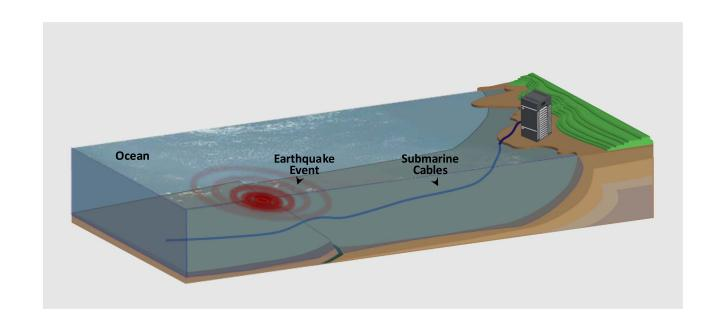

Fig. 1. Illustration of the DAS setup with submarine cables for seismic detection.

underwater DAS with submarine cables for seismic detection. It is worth noticing that we can fully utilize telecommunication facilities in this scenario, including both the submarine optical cables and some of the onshore facilities. As shown in Fig. 1, the DAS interrogator can be placed in the telecommunication control room onshore, and the submarine optical fiber is buried or directly laid on the seabed to feel the vibration or acoustic signals. It should be mentioned that although there are different deployment schemes for submarine cables, the DAS interrogator and the signal processing approach should be universal. The basic principle of DAS is from the technology called phase-sensitive optical time-domain reflectometry ( $\Phi$ -OTDR), which utilizes the Rayleigh backscattering light to detect the dynamic disturbance around the sensing fibers [21], [22], [23], [24], [25], [26], [27]. In the early days,  $\Phi$ -OTDR systems with direct detection scheme were developed to detect the vibration's position without knowing its amplitude or frequency, since such systems can only recover the intensity or amplitude of Rayleigh backscattering light whose change is not linear to external vibration. To achieve quantitative detection of the external vibration, advanced  $\Phi$ -OTDR systems are developed to extract the phase information from Rayleigh backscattering signals, such as the coherent  $\Phi$ -OTDR scheme with heterodyne detection, the coherent  $\Phi$ -OTDR scheme with homodyne detection using IQ demodulation, the  $\Phi$ -OTDR scheme using dual pulses with certain frequency difference, etc. [21], [22], [23], [24], [25], [26], [27]. In the field test of this work, we use a standard DAS interrogator (SILIXA iDAS) with the capability of phase demodulation of Rayleigh backscattering light for quantitative vibration signal analysis. Since this distributed sensing technology has been well developed, we will not discuss it in detail in this work. However, we can see that the underwater DAS for seismology is different from both the traditional ocean-bottom seismometer (OBS) scheme and the onshore DAS system. To better understand the underwater DAS system and investigate corresponding signal processing methods accordingly, here we list some important features of the underwater DAS for seismology as follows,

• For the underwater DAS, there are a large number of virtual sensing elements along the fiber for distributed optical sensing. This can be seen as an ideal equally-spaced sensor array to record the spatial distribution of the seismic waves in the direction along the fiber. Compared with the separated OBS scheme, the underwater DAS can acquire both

{2}------------------------------------------------

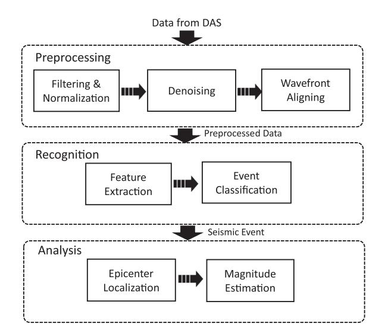

Fig. 2. Signal processing architecture of DAS for seismic applications.

frequency and wavelength of the seismic wave information more easily.

- - The traditional OBS describes seismic waves spatially in three dimensions, *i.e.*, in terms of *x*, *y* and *z* components. However, the optical fiber is only sensitive to the vibration in the direction along the fiber, since the Rayleigh backscattering signals are related to optical path changes, and can do nothing with the orthogonal waves in the direction that is perpendicular to the orientation of the fiber.
- - In the ocean, there are various background noise signals, generated by wind, tide, marine lives, ships, human activities, *etc*. These noise signals would deteriorate the underwater DAS's performance if no signal processing is carried out to mitigate their effects. Besides, due to the unknown complexity of the seabed geology, the transmission of the seismic waves may be distorted, resulting in different sensing outputs for different fiber sections. The seismic signals detected by DAS are mixed by the waveforms from different sources, such as seismic wave, ocean–solid earth interaction wave, and many scattering waves, *e.g.*, PP wave, SS wave, and Scholte wave that are generated from earthquake body wave. These waves can be generally characterized by different velocities and incidence angles.

As discussed above, we know that the measured seismic data of the underwater DAS is affected by many noise signals. In particular, the intensities of the ocean waves are sometimes larger than those of the microseisms. Thus, we can not use the raw DAS data to identify earthquakes directly. Besides, since the acquired data of underwater DAS is huge and different from the OBS, we need to investigate a novel and systematic signal processing procedure for the seismic recognition and analysis. Fig. 2 shows the architecture of our proposed DAS signal processing procedure for seismology applications. Three parts are included in general. In the preprocessing part, the raw data from the DAS firstly goes through the filtering and normalization module and the denoising module to remove the noise in different domains. After that, wavefront alignment algorithm is used to calibrate the arrival time difference of the seismic waves between the adjacent fiber sensors. In the recognition part, feature extraction and event classification algorithms are used to fast detect the seismic signals from the huge volume of DAS data. Unsupervised learning is introduced to the seismic recognition on the denoised data, which is based on the unique frequency and wavenumber feature clustering method. After an earthquake is identified, the seismic analysis part is used for acquiring the detailed seismic information, such as the epicenter and the magnitude. In this part, the arrival time differences from the wavefront aligning are used for estimating the distance from the epicenter, and the magnitude is evaluated based on the distance and historical seismic data measured by the DAS. In the following, we will discuss the three parts in detail, respectively.

### *A. Data Preprocessing*

*1) Filtering and Normalization:* Filtering operation is important for the raw DAS data to remove the noise outside the band that we are interested in. Researchers have tried to use different methods, including time averaging, band-pass filtering and spectral filtering to reduce noise and enhance signal quality [\[28\],](#page-10-0) [\[29\],](#page-10-0) [\[30\].](#page-10-0) Typically, the frequency range of the oceanic waves is below 2 Hz, while that of the seismic waves is below 20 Hz. Thus, a high-pass filter with certain cutoff frequency (*e.g.*, 2 Hz) can be used to filter out the strong noise from the oceanic waves, *e.g.*, by using the overlapped fast Fourier transform (FFT). With this filtering operation, most oceanic background noise will be filtered out and the sensing data with seismic information remains. After this, the data is normalized by the noise power for each channel when there is no earthquake. Then the normalized data can be used for further signal processing to suppress those channels with large noise.

*2) Denoising:* As the information acquired from DAS is based on Rayleigh backscattering, the raw data of DAS in nature shows a random noise-like feature. Occasionally for some positions during uncertain periods, the interference fading or polarization fading occurs in some basic DAS systems, as a result, the backscattering light might be small, and the phase signals recovered can be extremely large and uncredible [\[27\],](#page-10-0) [\[31\].](#page-10-0) Though there have been methods and commercial DAS facilities that can mitigate this issue, a small amount of fading noise still remains sometimes. Besides, other random and sudden factors may also contribute to noise and make some data with low signal-to-noise ratio (SNR). The noise also manifests as the ubiquitous spikes in the waterfall plots [\[27\].](#page-10-0) To cope with it, some denoising algorithms should be devised. Based on the FFT operation, the 2D temporal-frequency filtering can be used to increase the SNR. Some researchers utilized the coherence and beamforming capabilities of different segments of the fiber-optic cable to improve the SNR [\[5\],](#page-10-0) [\[32\].](#page-10-0) This method shows high efficiency by stacking signals of highly coherent channels of direct waves, but needs to identify these coherent channels automatically, which is not easy. Recently, some machine learning algorithms were also introduced to signal denoising for earthquake detection by DAS, such as the dictionary learning (DL) method [\[33\],](#page-10-0) the convolutional adversarial denoising network (CADN)

{3}------------------------------------------------

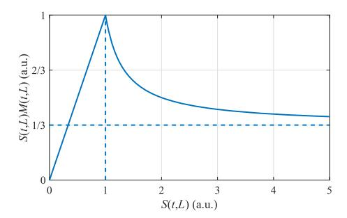

 $\mbox{Fig. 3.} \quad S\left(t,L\right) M(t,L) \mbox{ vs. } S(t,L) \mbox{ for } a=3, b=1 \mbox{ and } S_{mean}(t)=1.$ 

Sectional Mean Envelop

Sequential Correlation

Low-pass & Up-Sampling

Fig. 4. Wavefront alignment algorithm flowchart.

[34], the self-supervised deep learning method [35], *etc*. These reported deep learning schemes show good performance in seismic denoising, however, most of them need lots of training and should be further verified in different ocean environments.

According to the characteristics of marine seismic waveforms detected by DAS, in this work we propose a new filtering algorithm after filtering and normalization operations, which can further improve the SNR without distorting the signal, and with good versatility. In this denoising process, we first take the absolute value of the signal after normalization, followed by a time-domain low-pass filtering operation. Denoting the low-passed 2D DAS signal as S(t,L), where t and L represent the time and fiber position, respectively, the mean is taken over the length to obtain  $S_{mean}(t)$ . For each point of S(t,L), a masking coefficient M(t,L) is calculated as

$$M(t,L) = \left(1 + a \cdot \max\left(\frac{b \cdot S(t,L)}{S_{mean}^2(t)} - 1, 0\right)\right)^{-1}$$
 (1)

which can be multiplied on the original 2D signal to suppress the noise. This masking function can help provide a linear region for small inputs, followed by a suppression region for large inputs. In the equation, 1/b defines the extent of linear region and a defines the suppression strength, e.g., for infinite large input, the output after this masking function would be 1/a of the largest linear value. Here we empirically choose a=3 and b=1, and suppose  $S_{mean}(t)=1$ .  $S(t,L)M(t,L)\,{\rm vs.}\,S(t,L)\,{\rm is}$  plotted as in Fig. 3. In the denominator we use  $S^2_{mean}(t)$  instead of  $S_{mean}(t)$  because additional  $S_{mean}(t)$  in denominator can dynamically extend the linear region, and suppress the denoising effect in the present of earthquake.

as an optical fiber sensor array. However, these sensor elements are located at different positions and would get the same seismic wave with different time delays, which need to be analyzed and removed to align the wavefront. Our proposed wavefront alignment procedure is shown in Fig. 4. In this wavefront alignment algorithm, the fiber is virtually divided into several sections. The envelop of the possible seismic wave is firstly calculated within each section by averaging the absolute of the signal across all the channels (sensor elements). Then the envelops are sequentially correlated to determine the relative delay between neighboring sections. The cumulative sum of the neighboring delay yields the delay among all the sections. Finally, the sectional delay is

zero-meaned, low-pass filtered and up-sampled to the original number of channels to obtain the channel delay. This delay is essential for the following epicenter localization and seismic magnitude estimations. It should be noted that the number of sections does not have to be related with the length of fiber. Typically, an irregular fiber curve in the deployment would require more sections for curve fitting. In this work, the number of sections is chosen to be 16 to obtain a smooth delay curve.

### B. Seismic Recognition

1) Feature Extraction: Automatic seismic recognition is an important and hard task for massive DAS data. Typically, this process can be divided into two stages, i.e., feature extraction and event classification [36]. For the former, different characteristics of DAS data in different domains can be utilized for feature extraction. Due to its multi-channel measurement characteristic, the data of DAS can be recorded as a time-distance diagram (i.e., the waterfall plot), which shows the vibration information in the time domain [4]. For each channel (every single sensor element), the received data can be used for the seismic recognition. One traditional method for the seismic identification is called short-time-average over long-time-average (STA/LTA) algorithm [37], whose principle and operation are simple. It uses the data of two windows of different time lengths, and gets their averaged values respectively. By calculating the energy ratio, we can detect the seismic signal from the environmental noises. Since the background noise from the underwater surroundings is different and random for different DAS channels, it is necessary to select a channel with high SNR. Sometimes the SNR for the microseism detection by a certain sensing element of the underwater DAS is relatively low, which will result in a high false recognition rate.

The frequency domain analysis can also be used for the seismic feature extraction after the FFT operation. The power spectral density can clearly show the frequency components of the possible seismic waves. This frequency domain analysis for feature extraction can be further improved by using short-time Fourier transform (STFT) or wavelet analysis with limited temporal information [6], [28]. Based on the data of one channel over a certain period, the STFT method is efficient to distinguish different spectra for seismic signal identification.

Besides the time or frequency domain information, DAS is capable to get the wavenumber information of the seismic waves

{4}------------------------------------------------

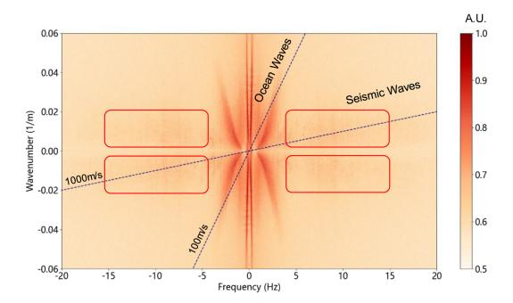

Fig. 5. Illustrated 2D frequency-wavenumber (*f-k*) spectrum calculated from the underwater DAS data for seismic feature extraction.

due to its multi-channel array sensing ability. By displaying the processed data from the underwater DAS in two dimensions of time and distance, we can get an efficient 2D spectrum after the 2D FFT operation for additional feature extraction. This will show a frequency-wavenumber (*f-k*) spectrum for the further seismic analysis[\[5\],](#page-10-0) [\[38\].](#page-10-0) Fig. 5 shows a calculated *f-k* spectrum when a nearby earthquake is recorded by our underwater DAS, as an example. As shown in the red boxes, we can identify the earthquake using the data with the frequency from 4 Hz to 15 Hz and the wavenumber from 0.005 m−1 to 0.018 m−1. Compared with using 1-D time or frequency information, the feature extraction from 2-D *f-k* spectrum can have better performance to distinguish seismic signals from other oceanic signals.

*2) Event Classification:* After feature extraction, the operation of event classification should be followed for seismic recognition. Recently, Various artificial intelligence algorithms were developed for DAS applications, especially for the pattern recognition [\[39\],](#page-10-0) [\[40\],](#page-10-0) [\[41\],](#page-10-0) [\[42\],](#page-10-0) [\[43\],](#page-10-0) [\[44\],](#page-10-0) [\[45\],](#page-10-0) [\[46\].](#page-10-0) Deep learning models trained with real seismic data, such as the convolutional neural network (CNN), are used to detect earthquakes in DAS measurements [\[45\],](#page-10-0) [\[46\].](#page-10-0) The accuracy of seismic recognition can reach up to 96.94% for the trained CNN [\[45\].](#page-10-0) However, the recognition accuracy of these models is high only for individual cases, which means that these models may not work for other DAS datasets. Moreover, for most of these schemes, sample labeling is necessary for the supervised learning, due to the model training requirement of a large number of labeled samples. While the unsupervised learning allows machines to automatically find data patterns and complete the task, which is often used for sample classification or labeling in data analysis. In this part, we describe the process of using the *f-k* spectrum for unsupervised machine learning to classify different events efficiently and accurately.

Fig. 6 shows the flowchart of the seismic *f-k* spectrum dataset generation for event classification. In general, the seismic events can be identified quickly by examining the earthquake's characteristic frequency between 2 Hz and 20 Hz. Based on the preprocessed data as discussed above, we first segment the data by a block of 10 s in time. The 2D FFT operation is followed for all the segmented blocks to get the *f-k* spectrum data. Each *f-k* dataset contains the characteristics of frequency and wavenumber within a period of time. Seismic events tend to exhibit similar features in the *f-k* spectrum domain, which

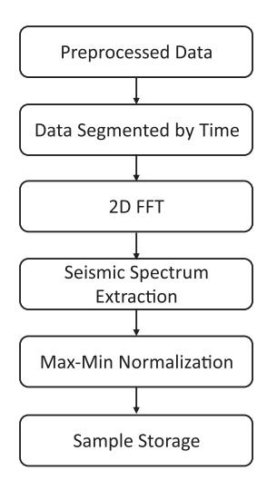

Fig. 6. Seismic *f-k* spectrum dataset generation flowchart for event classification.

is independent to submarine fiber deployments. Then the main spectrum features of earthquakes can be extracted from the *f-k* spectrum with reduced sample sizes. Finally, the samples are subjected to the maximum-minimum normalization. It should be noted that we need to take the absolute value of the extracted complex *f-k* spectral samples, and discard some samples (*e.g.*, 2%) with large noise, before the normalization operation.

For the event classification, we take the clustering scheme, which is a kind of unsupervised learning. It divides data samples into different groups according to a certain method so that the member objects in the same group all have some similar properties. Compared with other artificial intelligence alternatives, the clustering scheme can realize event classification and recognition by simply comparing feature differences and clustering the dataset without labeling, thus can be used in different scenarios with different fiber deployment schemes. It shows great efficiency in the seismic *f-k* spectrum classification, identifying the seismic events from huge data retrieved from DAS. Specifically, some commonly used clustering algorithms can be adopted for event classification of DAS, including K-means, DB-scan (*i.e.*, density-based spatial clustering), spectral clustering, etc. [\[47\],](#page-10-0) [\[48\],](#page-10-0) [\[49\].](#page-10-0)

### *C. Seismic Analysis*

*1) Epicenter Estimation:* Epicenter estimation is important for seismic activity monitoring based on DFOS platforms. Some researchers tried to use more than one fiber links to locate the seismic events [\[16\],](#page-10-0) [\[17\],](#page-10-0) [\[18\],](#page-10-0) [\[19\],](#page-10-0) [\[20\].](#page-10-0) For DAS platform using only one fiber cable, beamforming capabilities of multichannel sensing array of DAS can be utilized for epicenter estimation [\[30\],](#page-10-0) [\[32\].](#page-10-0) However, this method may fail in some scenarios, since sometimes the wave signals captured by DAS arrays are dominated by the shallow scattered waves other than the direct waves[\[32\].](#page-10-0) For methods of epicenter estimation based on DAS platform, the knowledge of the *P* and *S* waves' information is essential. Since earthquake swarms usually happened in some specific areas, it is possible to estimate the velocities

{5}------------------------------------------------

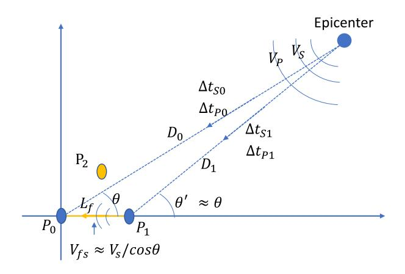

Fig. 7. Simplified 2D seismic propagation schematic.

of P and S waves from historical seismic records focusing on these areas and use them to locate the epicenter for the DAS platform, which can simplify the estimation model and reduce the computing complexity greatly. For example, in our field test, a large number of historical seismic records show that the transmission velocities of the P and S waves ( $V_P$  and  $V_S$ ) at the surface are about 5.95 km/s and 3.5 km/s, respectively, varying slightly in different geologies. It should be noted that the accurate evaluation of the epicenter is difficult for a single seismometer sensor. For traditional seismometer system, normally a large number of seismometers placed in different locations are used for epicenter localization. Though the DAS system has the advantage of a large number of equivalent sensors, here we propose to simply use at least two sensors to do the epicenter localization.

For the DAS system for seismic detection, we can assume a simplified schematic of the P wave and S wave transmission from an epicenter in a two-dimensional plane, as shown in Fig. 7.  $\Delta t_{s0}$  and  $\Delta t_{P0}$  describe the transmission periods of the S wave and the P wave from the epicenter to the sensing element  $P_0$ , respectively.  $D_0$  shows the distance between the sensing element  $P_0$  and the epicenter.  $\theta$  is the angle between the fiber direction and the epicenter orientation. Similarly,  $\Delta t_{s1}$ ,  $\Delta t_{P1}$ ,  $D_1$ , and  $\theta'$  are defined for the sensing elements  $P_1$ . As  $\Delta t_{s0}$ ,  $\Delta t_{P0}$ ,  $\Delta t_{s1}$  and  $\Delta t_{P1}$  cannot be directly measured, we can only calculate the values of the time differences (e.g.,  $\Delta t_{s0}$ - $\Delta t_{P0}$  and  $\Delta t_{s1}$ - $\Delta t_{P1}$ ) from the DAS results. Assuming that the seismic wave propagates in a homogeneous isotropic medium with  $V_S = 3.5$  km/s,  $D_0 \gg L_f$  and  $\theta \approx \theta'$ , we can calculate the orientation angle  $\theta$  and the distance  $D_0$  following the algorithm flowchart shown in Fig. 8. It should be noticed that we can only determine the distance from the epicenter and estimate the possible seismic orientation with the knowledge of two sensing elements' information. If a third sensing element with its exact position information is known, as  $P_2$  shown in Fig. 7, we can determine the exact epicenter position after cross estimation. For the selection of  $P_2$ , a sensing element off the  $P_0$ - $P_1$  line is preferred.

2) Magnitude Estimation: Besides epicenter, the information of magnitude is essential for seismic analysis. However, few works have been seen using DAS to estimate seismic

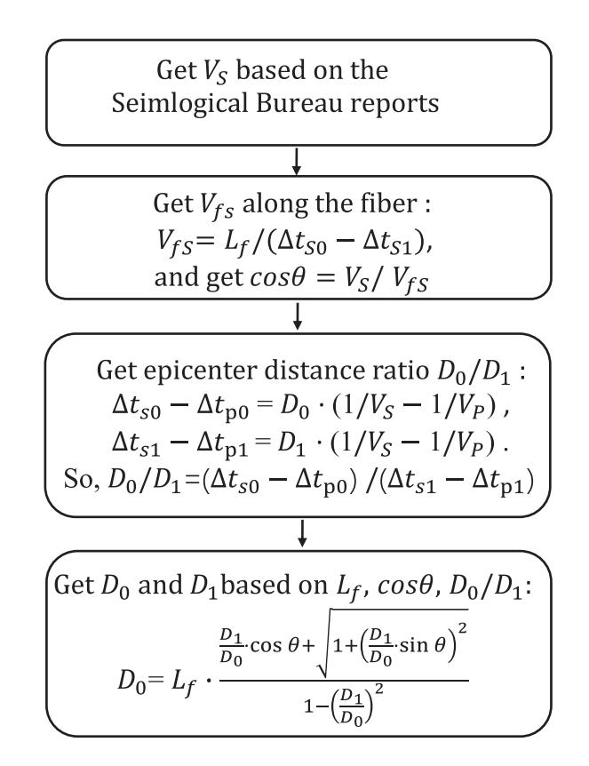

Fig. 8. Flowchart of earthquake epicenter distance and direction estimation.

magnitude. The intensity of the seismic signal received by the DAS is affected by the distance and angle from the epicenter to the fiber, and the seismic magnitude [32]. For studying the earthquake swarm that occurs at the same epicenter, the received signal's intensity is mainly determined by the magnitude. Thus, we can try to estimate the magnitude of earthquake swarm by analyzing the recovered seismic signals from DAS. However, due to the different surroundings for the sensing channels at different positions, the SNR of some sensing channels could be poor. Thus, it is necessary to further enhance the received signal and suppress the noise. Here we first get the average  $\sigma_{mean}$  of all the sensing channels' data as follows,

$$\sigma_{mean} = \frac{1}{N} \sum_{i=1}^{N} |\hat{s}_i(t) + \hat{n}_i(t)|$$
 (2)

where N is the number of sensing channels,  $\hat{s}_i(\cdot)$  and  $\hat{n}_i(\cdot)$  are the seismic signal and noise received from the i-th channel after wavefront alignment, respectively.

In seismology, researchers prefer to use Richter magnitude  $(M_L)$  to quantify an earthquake's strength, which is defined as  $M_L = lgA_{\rm max} - lgA_0$ , where  $A_{\rm max}$  is the maximum swing amplitude of the seismic signal at a distance of 100 km from the epicenter, and  $A_0$  is the maximum swing amplitude of the  $M_L0$  earthquake at a distance of 100 km from the epicenter [50]. In the scenario of the underwater DAS with submarine cables, it is difficult to place the fiber with the distance of exact 100 km away from the certain epicenter. In addition, the physical quantity of the signal measured by DAS is also different from that of the

{6}------------------------------------------------

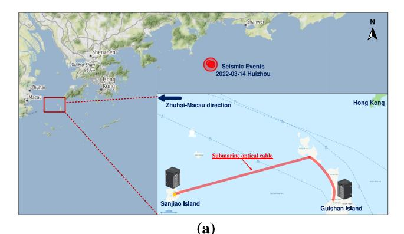

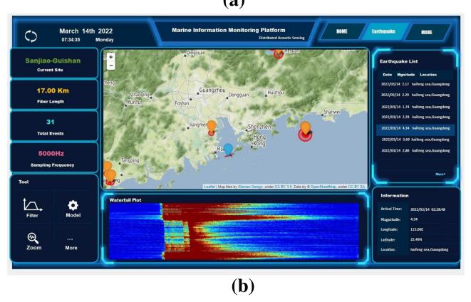

Fig. 9. (a) Map for our DAS testbed with submarine cable between Sanjiao Island and Guishan Island in Guangdong-Hong Kong-Macau greater bay area, China. (b) Software interface for real-time seismic activity monitoring.

seismometer. As a result, we can not directly use the optical fiber strain rate data measured by DAS to get  $A_{\rm max}$  and  $A_0$ . However, the relative magnitude can be estimated by comparing the seismic signals. With the knowledge of one earthquake's Richter magnitude in an earthquake swarm, we can estimate other earthquakes' Richter magnitude through the following formula.

$$M_L = \lg \sigma_{\max} + C \tag{3}$$

where C is a correction factor that can be obtained by comparing the earthquakes reported by an official seismograph.  $\sigma_{\max}$  is the maximum value of  $\sigma_{mean}$ . In order to reduce the environmental interference noise on the seismic signa, it is necessary to select channels with good SNR for calculating  $\sigma_{\max}$ .

### III. FIELD TEST OF UNDERWATER DAS FOR SEISMIC ACTIVITY DETECTION

In the field test, we use our underwater DAS testbed with a telecommunication submarine cable of 16.3 km between the two islands in the Pearl River estuary area of South China Sea, as shown in Fig. 9(a). Fig. 9(b) shows the home-made software interface for real-time seismic activity monitoring, which shows the map, the waterfall plot, and the information of the detected earthquakes, including time, location and magnitude. During the field test, the data communication service was running without disturbance, since we utilize the monitoring channel which is separated from data channels in wavelength. It should be

TABLE I RESULTS OF DENOISING

| Earthquake $(M_L)$                 | 2.8   | 3.5 & 4.6 | 2.5   | 2.0   | 2.3   | 2.2   |
|------------------------------------|-------|--------------|-------|-------|-------|-------|
| SNR before Denoising (dB)       | 4.05  | 25.60        | -0.07 | -7.61 | -1.98 | -0.37 |
| SNR after Denoising (dB)        | 10.20 | 32.38        | 2.95  | 0.81  | 5.25  | 4.51  |
| Performance improvement (dB) | 6.15  | 6.78         | 3.02  | 8.42  | 7.23  | 4.88  |

noticed that the red line in the inset of Fig. 9(a) only shows the approximate fiber path, since we don't have its exact deployment information. The entire fiber cable can be divided into three sections, *i.e.*, the first section of 2.3 km in Sanjiao Isalnd, the second section of 10.7 km buried undersea that we mainly used, and the third section of 3.3 km in Guishan Island. Our DAS interrogator is placed in the telecom control room in Saijiao Island at 22.138°N, 113.70°E, while the other end of the fiber is in the telecom control room in Guishan Island at 22.13°N, 113.82°E. With these two coordinates, we could estimate the epicenter location as discussed above.

During our field test, we measured seven continuous earth-quakes above  $M_L2.0$  within 12 minutes after UTC-8 2022-03-14 02:27:05, in the sea area near Huizhou City of Guangdong Province, China, as reported by the official Guangdong Earth-quake Bureau (GSB). The epicenters of these earthquakes were all located in the small area of 22.48°N - 22.49°N, 115.06°E - 115.07°E, which are shown in the red circle in Fig. 8. In this section, we will discuss the results of our field test based on the proposed signal processing method in details.

### A. Results of Data Preprocessing

Based on the proposed preprocessing algorithms, we first process the raw data from DAS for the earthquake swarm near Huizhou City. Fig. 10 shows the preprocessing results by the time-distance plots within 12 minutes for the seven continuous earthquakes. Fig. 10(a) is the output after filtering and normalization. Fig. 10(b) shows the residual noise data for the denoising process. Fig. 10(c) is the output after denoising. We can see that with the denoising algorithm, some of the spikes can be removed in the time-distance plot. For better illustrating its performance, we calculate the SNR of each earthquake to quantify the denoising improvement. Since the SNR varies for different sensing channels due to the fiber's unknown surroundings in the sea, we use the sensing channels of the fiber section with high SNR (from 11761 m to 12251 m) for SNR calculation. Taking half of the maximum signal output of an  $M_L 2.0$  earthquake as a threshold, we can roughly determine a seismic signal as its value is above this threshold. For the signal below this threshold, we consider it as noise. Based on this, we can estimate the seismic periods (shown as the blue dotted line in Fig. 10(a)), and calculate the SNR of all seismic signals as shown in Table I. We can see from Table I that the SNR improvement for all the seismic signals is from 3.02 dB to 8.42 dB, which proves that our denoising operation is effective to suppress the noise and enhance the

{7}------------------------------------------------

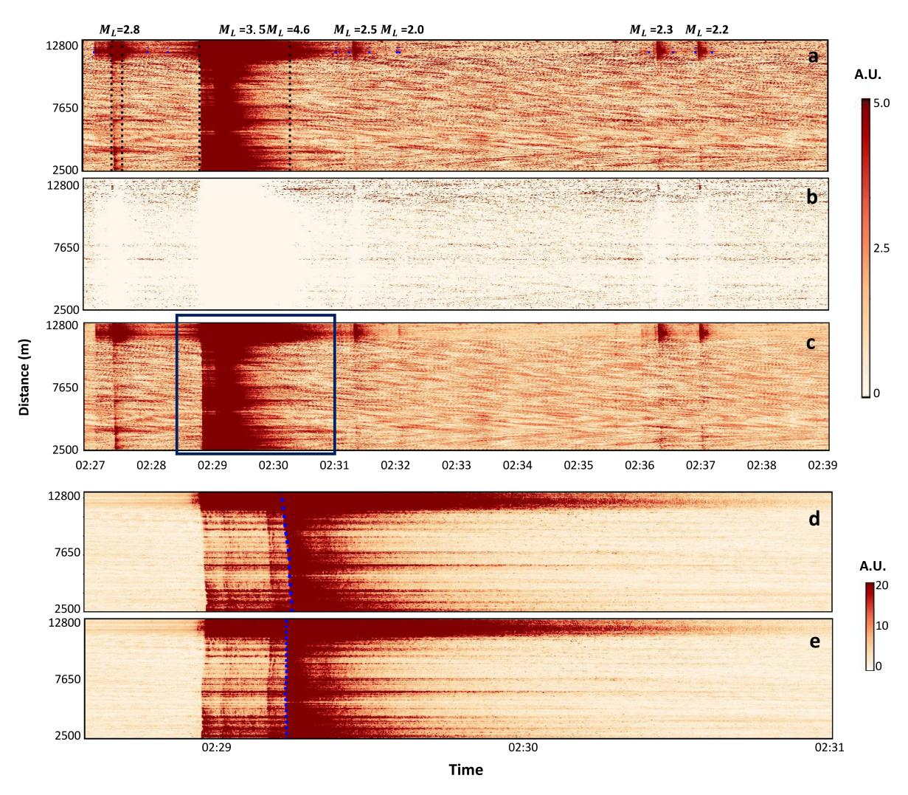

Fig. 10. Results of preprocessing for Huizhou earthquake swarm. (a) Signal output after filtering and normalization. (b) Residual noise signal for denoising. (c) Signal output after denoising. (d) Original wavefront illustration. (e) Calculated wavefront illustration with alignment algorithm.

seismic signals. It should be noticed that the two seismic signals of the M*L*3.5 and M*L*4.6 earthquakes are too close, as a result, we consider them as one signal for SNR calculation.

For the wavefront alignment process, we use the data shown in the blue box of Fig. 10(c). The blue dotted line in Fig. 10(d) shows the calculated original wavefront, which is obviously a sloping curve due to the time delay differences for all the sensing channels. The blue dotted line in Fig. 10(e) shows the calculated wavefront with the proposed wavefront alignment algorithm, which successfully compensates the time delay differences. The aligned wavefront is important for the seismic analysis of epicenter and magnitude evaluations.

### *B. Results of Seismic Recognition*

For the seismic recognition, we use the 12 min DAS data from the submarine fiber section. As discussed in Fig. [6,](#page-4-0) we first segment the denoised data into several 10 s blocks, with 5 s data overlap between the adjacent blocks. For the *f-k* domain dataset, we only use the data in the area of frequency range between 5 Hz to 20 Hz and wavenumber range from 0.005 m−1 to 0.025 m−1. In total, we have 142 *f-k* domain samples generated from the 12 min measurement. Then features can be extracted from these samples.

The extracted features can be used for classification by various clustering algorithms. Here we discuss three classical clustering algorithms, *i.e.*, spectral clustering, DB-scan and hierarchical clustering [\[47\],](#page-10-0) [\[48\],](#page-10-0) [\[49\],](#page-10-0) [\[51\].](#page-10-0) Due the paragraph limitation, we do not describe the detailed principles of the clustering algorithms in this paper. The optimized parameters for each algorithm are listed in Table [II.](#page-8-0) Table [II](#page-8-0) and Fig. [11](#page-8-0) show the classification and recognition results of the three clustering algorithms. Compared with the seismic report of the official GSB, the hierarchical clustering algorithm has the highest seismic recognition rate. It is the only algorithm that can identify the smallest M*L*2.0 earthquake. Both of the spectral clustering and DB-scan can identify six from the seven earthquakes. The speed of DB-scan is fastest. It only needs 0.02 s to fulfill the task. Besides, for the spectral clustering, there are three parameters to be optimized, while for the hierarchical clustering, the number is only one. This will be critical if the data scale becomes large.

{8}------------------------------------------------

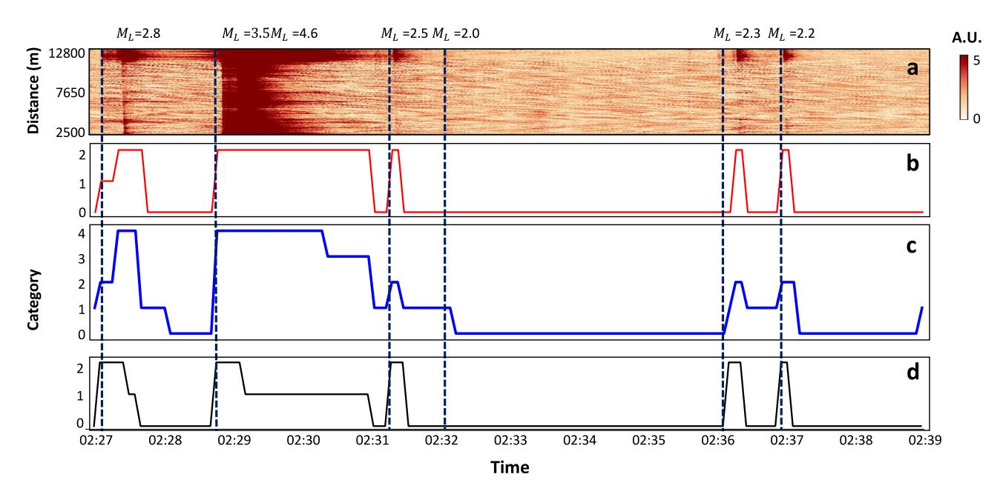

Fig. 11. Identification results of Huizhou earthquake swarm with different clustering algorithms. (a) DAS result displaying the timing of the earthquake occurrences. (b) Classification result of DB-scan. (c) Classification result of hierarchical clustering. (d) Classification results of spectral clustering. The blue dotted line displays the earthquake arrivals in time.

TABLE II RESULTS OF CLUSTERING ALGORITHMS

| Algorithms                   | Spectral Clustering                                | DB-scan             | Hierarchical Clustering |  |
|------------------------------|-------------------------------------------------------|---------------------|----------------------------|--|
| Identification Rate       | 6/7                                                   | 6/7                 | 7/7                        |  |
| Identification Capability | $M_L 2.2$                                             | $M_L 2.2$           | $M_{L}2.0$                 |  |
| Optimal Parameters        | $PCA_n30$ (Gaussian kernel) $\sigma:160,$ $Kmean_n:3$ | Eps:45, MinPts:2 | Cluster_n:5                |  |
| Calculating Time(s)       | 0.22                                                  | 0.02                | 0.17                       |  |

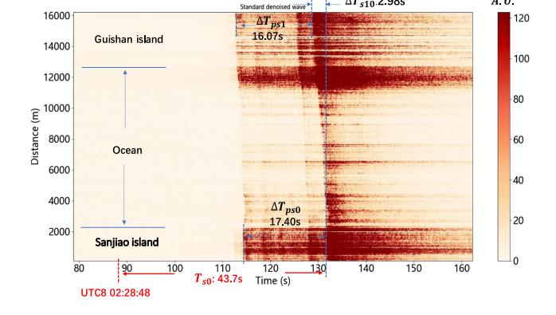

Fig. 12. Time-distance plot with the preprocessed DAS data for Huizhou *ML*4*.*6 earthquake analysis.

### *C. Results of Seismic Analysis*

As an example, we use the M*L*4.6 earthquake at UTC-8 2022- 03-14 02:28:48 for orientation estimation, because it shows clear *P* and *S* waveforms after preprocessing. According to the official GSB, its epicenter is located at 22.49°N, 115.06°E with a depth of 21 km, which is about 146.3 km away from the telecom control room in Sanjiao Island. Fig. 12 shows the detailed time-distance plot of this earthquake with the aligned wavefront. The propagation time of *S* wave from its epicenter to the first sensing channel near the DAS interrogator is 43.7 s as shown in Fig. 12.

For locating the accurate epicenter, we need to know the exact positions of two sensing elements on the map. Since we have no idea of the deployment information of the submarine cable, we can only use the first and the last sensing elements (*i.e.*, two ends of the telecommunication fiber cable) as P0 and P1, with knowing their exact coordinates of the telecom control rooms at Sanjiao Island and Guishan Island. The distance L*f*

between P0 and P1 is 11.3 km. From Fig. 12, we can measure the propagation time differences for *P* and *S* waves as follows,

$$\Delta T_{S10} = \Delta t_{s0} - \Delta t_{s1} \approx 2.98 \text{ s},$$

$$\Delta T_{PS1} = \Delta t_{s1} - \Delta t_{P1} \approx 16.07 \text{ s},$$

$$\Delta T_{PS0} = \Delta t_{s0} - \Delta t_{P0} \approx 17.40 \text{ s}$$
(4)

Following the steps and formulas shown in Fig. [8,](#page-5-0) we can get D0 = 147.1 km and D1 = 135 km. Assuming the propagation speed of *S* wave is about 3.5 km/s, we can calculate its propagation time to P0 to be 43.7 s. As a result, we estimate the earthquake occurring at UTC-8 2022-03-14 02:28:48. It can be seen that the estimated epicenter distance and the occurring time are consistent with the reported data by the official GSB, with accuracies of 0.5% and 4.0%, respectively. To further locate the epicenter, we have to investigate another sensing element P2 as

{9}------------------------------------------------

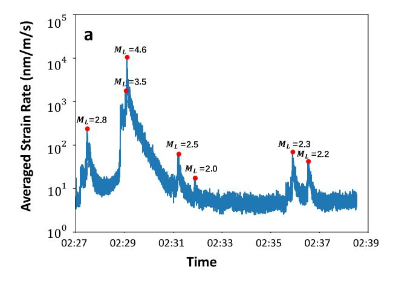

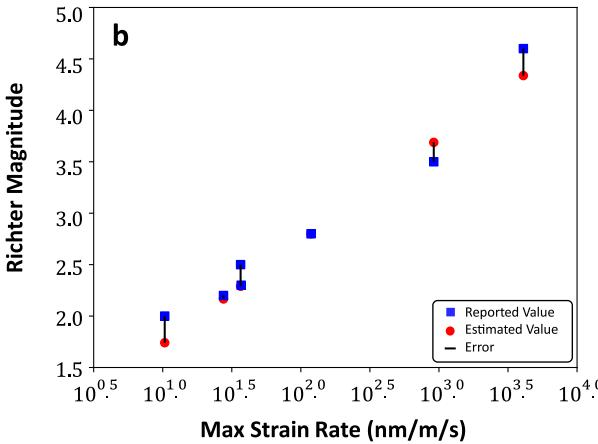

Fig. 13. Results of magnitude estimation. (a) Averaged fiber strain rate obtained using the data after wavefront alignment. Red dots show the maximum optical fiber strain rate for each earthquake. (b) Magnitude estimation using the maximum averaged fiber strain rate, where the red dots are the estimated values, and the blue dots are reported values by the GSB.

TABLE III RICHTER MAGNITUDE ESTIMATION RESULTS

| Seismic                               | #1   | #2    | #3    | #4     | #5    | #6    |
|---------------------------------------|------|-------|-------|--------|-------|-------|
| Reported Value (M L )      | 3.5  | 4.6   | 2.5   | 2.0    | 2.3   | 2.2   |
| Predictive Value (M L ) | 3.69 | 4.34  | 2.29  | 1.74   | 2.29  | 2.17  |
| Relative Error (%)                 | 5.43 | -5.65 | -8.40 | -13.00 | -0.43 | -1.36 |

shown in Fig. [8.](#page-5-0) Since the fiber's exact location is unknown, we will leave it for future work.

Based on the SNR evaluation of different fiber sections, we select the middle 60 undersea channels (*i.e.*, from 11761 m to 12251 m away from the DAS interrogator) for the seismic magnitude estimation. Fig. 13(a)shows the averaged fiber strain rate for Huizhou earthquake swarm measured by the underwater DAS. Fig. 13(b) shows the result of seismic magnitude estimation when the M*L*2.8 earthquake is used as a reference. In order to further quantify the magnitude estimation, we calculate the relative error as a performance evaluation index. The results are shown in Table III, with a minimum relative error of −0.43% and a maximum relative error of −13%. The results show that our propose method can successfully estimate the seismic magnitude based on the DAS platform. In the process of magnitude estimation, we only need to calculate the average strain rate that shows the strength of the seismic signal at the epicenter, avoiding complex calculations and parameter adjustment, thus achieving fast determination. Moreover, this method is independent of the sensing principle and deployment of DAS, so it can be used as a universal method for magnitude estimation based on DAS systems. However, this method is only suitable to estimate seismic magnitude from the same earthquake swarm, since the distance and angle from the epicenter to the fiber have to been considered. Thus, it is necessary to locate the identified earthquake before magnitude estimation.

### IV. CONCLUSION

In this paper, we present a systemic signal processing approach of using underwater DAS with submarine cables for seismology applications. Firstly, we need to preprocess the raw data from DAS, with the operations of filtering, normalization, denoising, and wavefront alignment. Secondly, we can extract features from the *f-k* domain, and identify earthquakes with various clustering algorithms. Thirdly, the seismic epicenter and magnitude can be estimated based on the processed data and simple calculations. Based on this signal processing approach, we detect and analyze an earthquake swarm with our underwater DAS testbed, which utilizes the telecommunication submarine cable between two islands in the Pearl River estuary area of South China Sea. It should be mentioned that all the signal processing operations in this work run in real-time, so adequate data acquisition and computer power issue should be considered. This work is a demonstration of a standard signal processing procedure for using underwater DAS to detect and measure earthquakes. More research works in this field are expected in the future, including but not limited to, 1) automatically adjusting parameters during the signal preprocessing; 2) accurately locating epicenters with multiple sensing fibers; 3) estimating absolute seismic magnitude by establishing the relationship between the DAS fiber strain rate and the seismic magnitude; 4) Automatically identifying seismic and other signal using various artificial intelligence algorithms. Moreover, based on the global telecommunication fiber-optic network with photonic ISAC technology, we expect more DAS implementations for seismology worldwide. This will help us create a database for sharing the seismic information and studying Earth sciences with this DFOS technology.

### REFERENCES

- [1] M. Shinohara et al., "Aftershock observation of the 2011 off the pacific coast of Tohoku earthquake by using ocean bottom seismometer network," *Earth Planets Space*, vol. 63, pp. 835–840, 2011.
- [2] N. Rawlinson, S. Pozgay, and S. Fishwick, "Seismic tomography: A window into deep Earth," *Phys. Earth Planet. Interiors*, vol. 178, no. 3-4, pp. 101–135, 2010.
- [3] D. Suetsugu and H. Shiobara, "Broadband ocean-bottom seismology," *Annu. Rev. Earth Planet. Sci.*, vol. 42, pp. 27–43, 2014.
- [4] N. J. Lindsey, T. C. Dawe, and J. B. Ajo-Franklin, "Illuminating seafloor faults and ocean dynamics with dark fiber distributed acoustic sensing," *Science*, vol. 366, pp. 1103–1107, 2019.

{10}------------------------------------------------

- [5] E. F. Williams et al., "Distributed sensing of microseisms and teleseisms with submarine dark fibers,"*Nature Commun.*, vol. 10, 2019, Art. no. 5778.
- [6] H. Matsumoto et al., "Detection of hydroacoustic signals on a fiber-optic submarine cable," *Sci. Rep.*, vol. 11, 2021, Art. no. 2797.
- [7] P. Jousset, "Dynamic strain determination using fibre-optic cables allows imaging of seismological and structural features,"*Nature Commun.*, vol. 9, 2018, Art. no. 2509.
- [8] C. Yu et al., "The potential of DAS in teleseismic studies: Insights from the goldstone experiment," *Geophysical Res. Lett.*, vol. 46, no. 3, pp. 1320–1328, 2019.
- [9] M. R. Fernandez-Ruiz et al., "Distributed acoustic sensing for seismic activity monitoring," *APL Photon.*, vol. 5, 2020, Art. no. 030901.
- [10] J. B. Ajo-Franklin et al., "Distributed acoustic sensing using dark fiber for near-surface characterization and broadband seismic event detection," *Sci. Rep.*, vol. 9, 2019, Art. no. 1328.
- [11] N. J. Lindsey et al., "Fiber-optic network observations of earthquake wavefields," *Geophysical Res. Lett.,* vol. 44, no. 23, pp. 11792–11799, 2017.
- [12] E. R. Martin et al., "A seismic shift in scalable acquisition demands new processing: Fiber-optic seismic signal retrieval in urban areas with unsupervised learning for coherent noise removal," *IEEE Signal Process. Mag.*, vol. 35, no. 2, pp. 31–40, Mar. 2018.
- [13] Y. You, "Harnessing telecoms cables for science," *Nature*, vol. 466, pp. 690–691, 2010.
- [14] Y. Yan, F. N. Khan, B. Zhou, A. P. T. Lau, C. Lu, and C. Guo, "Forward transmission based ultra-long distributed vibration sensing with wide frequency response," *J. Lightw. Technol.*, vol. 39, no. 7, pp. 2241–2249, Apr. 2021.
- [15] S. Chen, K. Zhu, J. Han, Q. Sui, and Z. Li, "Photonic integrated sensing and communication system harnessing submarine fiber-optic cables for coastal event monitoring," *IEEE Commun. Mag.*, vol. 60, no. 12, pp. 110–116, Dec. 2022.
- [16] G. Marra et al., "Ultrastable laser interferometry for earthquake detection with terrestrial and submarine cables," *Science,* vol. 361, pp. 486–490, 2018.
- [17] G. Marra et al., "Optical interferometry-based array of seafloor environmental sensors using a transoceanic submarine cable," *Science,* vol. 376, pp. 874–879, 2022.
- [18] Z. Zhan et al., "Optical polarization-based seismic and water wave sensing on transoceanic cables," *Science,* vol. 371, pp. 931–936, 2021.
- [19] A. Mecozzi, M. Cantono, J. C. Castellanos, V. Kamalov, and Z. Zhan, "Polarization sensing with transmission fibers in undersea cables," in *Proc. Opt. Fiber Commun. Conf. Exhib.*, 2022, pp. 1–3.
- [20] J. C. Castellanos et al., "Optical polarization-based sensing and localization of submarine earthquakes," in *Proc. Opt. Fiber Commun. Conf. Exhib.*, 2022, pp. 1–3.
- [21] Y. Lu, T. Zhu, L. Chen, and X. Bao, "Distributed vibration sensor based on coherent detection of phase-OTDR," *J. Lightw. Technol.*, vol. 28, no. 22, pp. 3243–3249, Nov. 2010.
- [22] A. Masoudi, M. Belal, and T. P. Newson, "A distributed optical fibre dynamic strain sensor based on phase-OTDR," *Meas. Sci. Technol.*, vol. 24, no. 8, 2013, Art. no. 085204.
- [23] Z. Wang et al., "Coherent Φ-OTDR based on I/Q demodulation and homodyne detection," *Opt. Exp.*, vol. 24, no. 2, pp. 853–858, 2016.
- [24] X. Fan, G. Yang, S. Wang, Q. Liu, and Z. He, "Distributed fiber-optic vibration sensing based on phase extraction from optical reflectometry," *J. Lightw. Technol.*, vol. 35, no. 16, pp. 3281–3288, Aug. 2017.
- [25] K. Zhu et al., "Multipath distributed acoustic sensing system based on phase-sensitive optical time-domain reflectometry with frequency division multiplexing technique," *Opt. Lasers Eng.*, vol. 142, 2021, Art. no. 106593.
- [26] L. B. Liokumovich, N. A. Ushakov, O. I. Kotov, M. A. Bisyarin, and A. H. Hartog, "Fundamentals of optical fiber sensing schemes based on coherent optical time domain reflectometry: Signal model under static fiber conditions," *J. Lightw. Technol.*, vol. 30, no. 17, pp. 3660–3671, Sep. 2015.
- [27] S. Liu et al., "Advances in phase-sensitive optical time-domain reflectometry," *Opto-Electron. Adv.*, vol. 5, no. 3, 2022, Art. no. 200078.
- [28] H. Yetik, M. Kavakli, U. Uluda ˘g, A. Ek¸sim, and S. Paker, "Earthquake detection using fiber optic distributed acoustic sensing," in *Proc. 13th Int. Conf. Elect. Electron. Eng.*, 2021, pp. 350–354.
- [29] M. P. Isken et al., "De-noising distributed acoustic sensing data using an adaptive frequency–wavenumber filter," *Geophysical J. Int.*, vol. 231, no. 2, pp. 944–949, 2022.
- [30] M. Landro et al., "Sensing whales, storms, ships and earthquakes using an arctic fibre optic cable," *Sci. Rep.,* vol. 12, 2022, Art. no. 19226.

- [31] Z. Zhao et al., "Interference fading suppression in Φ-OTDR using spacedivision multiplexed probes," *Opt. Exp.*, vol. 29, no. 10, pp. 15452–15462, 2021.
- [32] M. P. A. van den Ende and J.-P. Ampuero, "Evaluating seismic beamforming capabilities of distributed acoustic sensing arrays," *Solid Earth*, vol. 12, no. 4, pp. 915–934, 2021.
- [33] L. Kuruguntla, V. C. Dodda, and K. Elumalai, "Study of parameters in dictionary learning method for seismic denoising," *IEEE Trans. Geosci. Remote Sens.*, vol. 60, 2022, Art. no. 5906213.
- [34] X. Dong and Y. Li, "Denoising the optical fiber seismic data by using convolutional adversarial network based on loss balance," *IEEE Trans. Geosci. Remote Sens.*, vol. 59, no. 12, pp. 10544–10554, Dec. 2021.
- [35] M. van den Ende, I. Lior, J.-P. Ampuero, A. Sladen, A. Ferrari, and C. Richard, "A self-supervised deep learning approach for blind denoising and waveform coherence enhancement in distributed acoustic sensing data," *IEEE Trans. Neural Netw. Learn. Syst.*, early access, Dec. 17, 2021, doi: [10.1109/TNNLS.2021.3132832.](https://dx.doi.org/10.1109/TNNLS.2021.3132832)
- [36] Z. He and Q. Liu, "Optical fiber distributed acoustic sensors: A review," *J. Lightw. Technol.*, vol. 39, no. 12, pp. 3671–3686, Jun. 2021.
- [37] P. R. Stevenson, "Microearthquakes at Flathead Lake, Montana: A study using automatic earthquake processing," *Bull. Seismological Soc. Amer.*, vol. 66, no. 1, pp. 61–80, 1979.
- [38] A. Sladen et al., "Distributed sensing of earthquakes and ocean-solid Earth interactions on seafloor telecom cables," *Nature Commun.*, vol. 10, 2019, Art. no. 5777.
- [39] J. Tejedor et al., "Toward prevention of pipeline integrity threats using a smart fiber-optic surveillance system," *J. Lightw. Technol.*, vol. 34, no. 19, pp. 4445–4453, Oct. 2016.
- [40] J. Tejedor et al., "Real field deployment of a smart fiber-optic surveillance system for pipeline integrity threat detection: Architecture issues and blind field test results," *J. Lightw. Technol.*, vol. 36, no. 4, pp. 1052–1062, Feb. 2018.
- [41] H. Wu et al., "One-dimensional CNN-based intelligent recognition of vibrations in pipeline monitoring with DAS," *J. Lightw. Technol.*, vol. 37, no. 17, pp. 4359–4366, Sep. 2019.
- [42] M. Adeel et al., "Impact-based feature extraction utilizing differential signals of phase-sensitive OTDR," *J. Lightw. Technol.*, vol. 38, no. 8, pp. 2539–2546, Apr. 2020.
- [43] Z. Li et al., "Fiber distributed acoustic sensing using convolutional long short-term memory networks: A field test on high-speed railway intrusion detection," *Opt. Exp.*, vol. 28, no. 3, pp. 2925–2938, 2020.
- [44] H. Wu et al., "Pattern recognition in distributed fiber-optic acoustic sensor using an intensity and phase stacked convolutional neural network with data augmentation," *Opt. Exp.*, vol. 29, no. 3, pp. 3269–3283, 2021.
- [45] P. D. Hernández, J. A. Ramírez, and M. A. Soto, "Deep-learningbased earthquake detection for fiber-optic distributed acoustic sensing," *J. Lightw. Technol.*, vol. 40, no. 8, pp. 2639–2650, Apr. 2022.
- [46] A. L. Stork et al., "Application of machine learning to microseismic event detection in distributed acoustic sensing data," *Geophysics*, vol. 85, no. 5, 2020, Art. no. KS149.
- [47] S. Lloyd, "Least squares quantization in PCM," *IEEE Trans. Inf. Theory*, vol. 28, no. 2, pp. 129–137, Mar. 1982.
- [48] M. Ester et al., "A density-based algorithm for discovering clusters in large spatial databases with noise," in *Proc. 2nd Int. Conf. Knowl. Discov. Data Mining*, 1996, pp. 226–231.
- [49] A. Y. Ng, M. I. Jordan, and Y. Weiss, "On spectral clustering: Analysis and an algorithm," in *Proc. Neural Inf. Process. Syst.*, 2002, pp. 849–856.
- [50] C. Richter, "An instrumental earthquake magnitude scale," *Bull. Seismological Soc. Amer.*, vol. 25, no. 1, pp. 1–32, 1935.
- [51] K. Sasirekha and P. Baby, "Agglomerative hierarchical clustering algorithm - a review," *Int. J. Sci. Res. Pub.*, vol. 3, no. 3, pp. 1–3, 2013.

**Shaoyi Chen** received the B.S. degree from Beijing Normal University, Beijing, China, in 2008, and the M.Sc. degree from Beihang University, Beijing, China, in 2011. He is currently working toward the Ph.D. dergee with the School of Electronics and Information Technology, Sun Yat-sen University. His research interests include distributed fiber sensing systems, signal processing based on optical fiber devices.

{11}------------------------------------------------

**Jun Han** received the bachelor's degree from Shandong Normal University, Jinan, China, in 2021. He is currently working toward the graduation degree with Sun Yat-sen University, Guangzhou, China. His research interests include signal processing and data analysis based on optical fiber systems.

**Qi Sui** received the B.Eng. degree from Shanghai Jiaotong University, Shanghai, China, in 2007, and the Ph.D. degree from The Hong Kong Polytechnic University, Hong Kong, in 2015. He is currently with Southern Marine Science and Engineering Guangdong Laboratory (Zhuhai). His research interests include optical communications and optical performance monitoring.

**Chao Lu** (Fellow, Optica) received the B.Eng. degree in electronic engineering from Tsinghua University, Beijing, China, in 1985, and the M.Sc. and Ph.D. degrees from the University of Manchester, Manchester, U.K., in 1987 and 1990, respectively. From 1991 to 2006, he was with the School of Electrical and Electronic Engineering, Nanyang Technological University, Singapore as a Member of the Faculty. From 2002 to 2005, he was seconded to the Institute for Infocomm Research, Agency for Science, Technology and Research, Singapore, as a Program Director and DepartmentManager. Since 2006, he has been with the Department of Electronic and Information Engineering, The Hong Kong Polytechnic University, Hong Kong. He has recently joined the School of Electronics and Information Technology, Sun Yat-sen University, Guangzhou, China. His research interests include optical communication systems and networks, fiber devices for optical communication, and sensor systems.

**Kun Zhu** received the B.Eng. and Ph.D. degrees from Zhejiang University, Hangzhou, China, in 2007 and 2012, respectively. From 2012 to 2013, he was a Research Engineer with the Central Research Institute of Huawei Technologies Co. Ltd. He was a Senior Research Associate with the City University of Hong Kong, Hong Kong, from 2015 to 2016 and in 2020, and a Research Fellow with The Hong Kong Polytechnic University, Hong Kong, from 2017 and 2019. Since 2021, he has been with The Hong Kong Polytechnic University as a Research Fellow. His research interests include microwave photonics, distributed fiber sensing systems, signal processing based on optical fiber, and waveguide devices.

**Zhaohui Li** received the B.S. degree with the Department of Physics, Nankai University, Tianjin, China, in 1999, the M.Sc. degree from the Institute of Modern Optics, Nankai University, in 2002, and the Ph.D. degree from Nanyang Technological University, Singapore, in 2007. Since 2009, he has been a Professor with the School of Electronics and Information Technology, Sun Yat-sen University, Guangzhou, China. He is also with Southern Marine Science and Engineering Guangdong Laboratory (Zhuhai). His research interests include optical communication systems, optical signal processing technology, and ultrafine measurement systems.