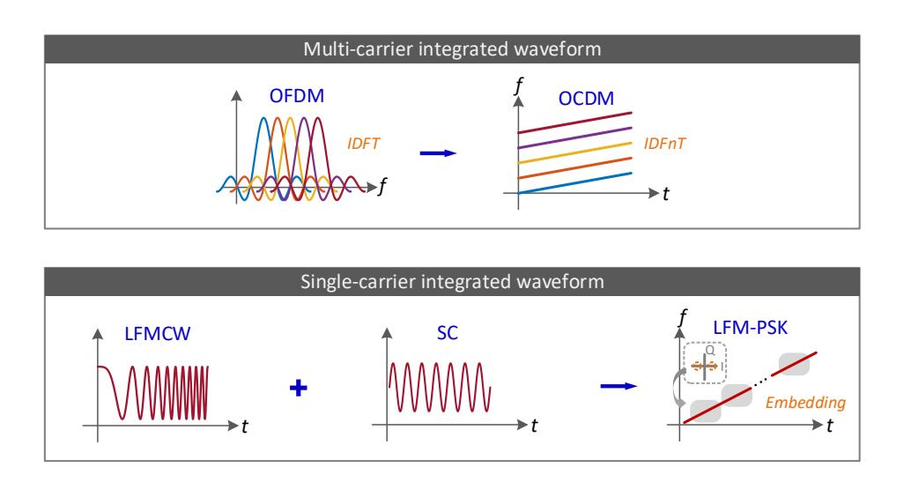
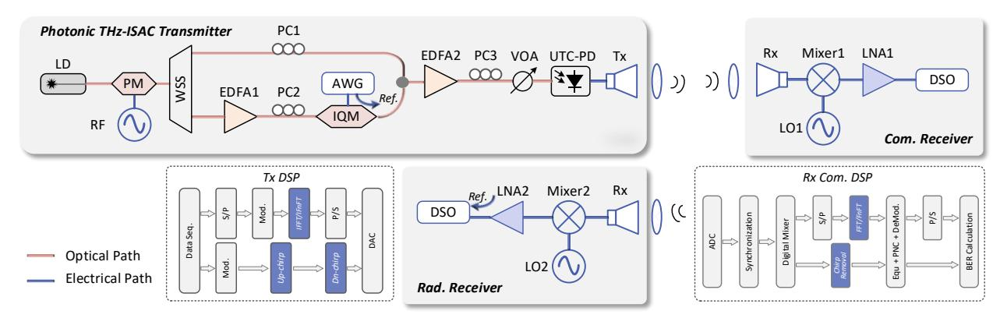
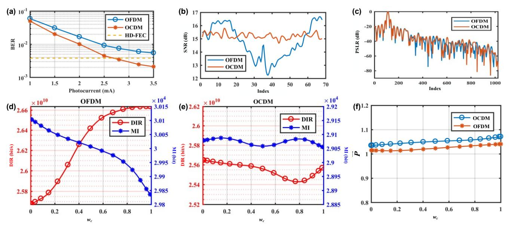
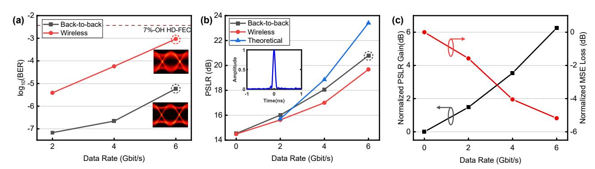
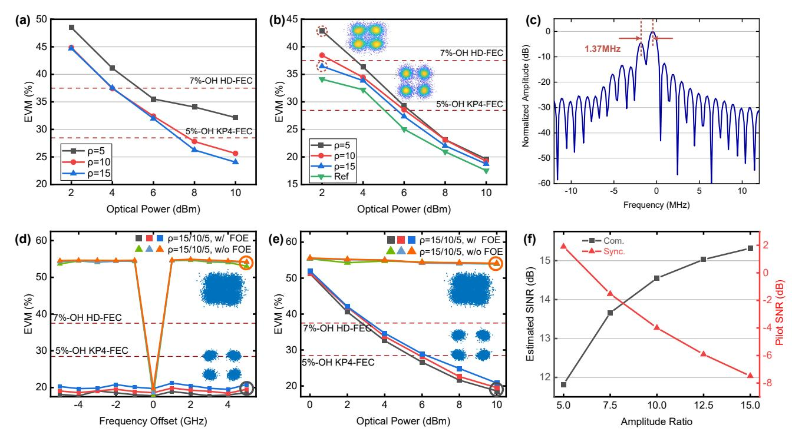
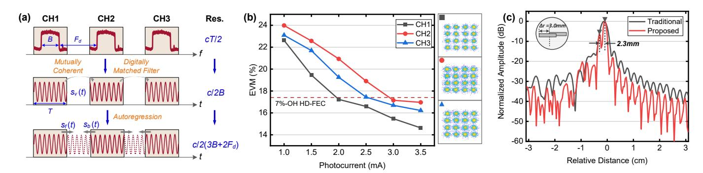

{0}------------------------------------------------

# Exploring Photonic THz-ISAC Systems with Integrated Waveforms

Zhidong Lyu, Lu Zhang, *Senior Member, IEEE*, Qiuzhuo Deng, Xing Fang, Liga Bai, Yan-Ting Sun, Oskars Ozolins, *Senior Member, IEEE*, Guangyi Liu, *Member, IEEE*, Xiaodan Pang, *Senior Member, IEEE*, Xianbin Yu, *Senior Member, IEEE*

*Abstract***—Integrated sensing and communication (ISAC) is a key pillar for future wireless networks, demanding solutions that simultaneously deliver high-capacity communication and highaccuracy sensing. The terahertz (THz) band, particularly when integrated with fiber-optic networks, emerges as a highly promising candidate, offering the potential for terabit-per-second communication data rates and millimeter-level sensing resolution. Crucially, the integrated waveform is paramount to efficiently and seamlessly combine these dual functionalities, enabling compact frontends design and streamlined baseband processing for photonic THz-ISAC systems. This article presents our recent system-level investigations into diverse integrated ISAC waveform designs. We further synthesize and discuss the latest global research and development progress in advancing this rapidly evolving field.**

*Index Terms***—terahertz photonics, integrated sensing and communication, integrated waveform design**

# I. INTRODUCTION

HE escalating complexity of the electromagnetic environment has intensified demands for ultra-reliable wireless connectivity, driving significant interest in T

This work is supported in part by the National Key Research and Development Program of China under Grant 2022YFB2903800, in part by the National Natural Science Foundation of China under Grant 62471433, in part by the China Scholarship Council under Grant 202406320060, in part by the ERDF-funded PANTHERS project (No. 1.1.1.3/1./24/A/013), in part by the Swedish Research Council (VR) projects 201905197 and 2022-04798, in part by the Sweden´s Innovation Agency (VINNOVA) funded project (2024- 02451), and in part by the strategic innovation program Smarter Electronic Systems - a joint venture by Vinnova, Formas and the Swedish Energy Agency A-FRONTAHUL project (2023-00659). (*Corresponding authors: Lu Zhang; Xianbin Yu; Xiaodan Pang*)

Zhidong Lyu, Lu Zhang, Qiuzhuo Deng, Xing Fang, Liga Bai, and Xianbin Yu are with the College of Information Science and Electronic Engineering, Zhejiang University, Hangzhou 310027, China (e-mail: zdlyu@zju.edu.cn; zhanglu1993@zju.edu.cn; qiuzhuodeng@zju.edu.cn; xingfang@zju.edu.cn; bayalig@zju.edu.cn; xyu@zju.edu.cn).

Yan-Ting Sun is with the Applied Physics Department, KTH Royal Institute of Technology, 106 91 Stockholm, Sweden (e-mail: yasun@kth.se).

Oskars Ozolins is with the Institute of Telecommunications, Riga Technical University, 1048 Riga, Latvia, and also with the RISE Research Institutes of Sweden, 164 40 Kista, Sweden (e-mail: oskars.ozolins@ri.se).

Guangyi Liu is with the China Mobile Communication Research Institute, Beijing 100032, China (e-mail: liuguangyi@chinamobile.com).

Xiaodan Pang is with the College of Information Science and Electronic Engineering, Zhejiang University, Hangzhou 310027, China, also with the Institute of Telecommunications, Riga Technical University, 1048 Riga, Latvia, and also with the RISE Research Institutes of Sweden, 164 40 Kista, Sweden (e-mail: xipa@zju.edu.cn).

Color versions of one or more of the figures in this article are available online at http://ieeexplore.ieee.org

integrated sensing and communication (ISAC) systems [\[1\].](#page-8-0) This integrated approach enables ultra-efficient spectrum utilization and significantly reduces hardware costs, and more importantly, establishes a foundational framework for achieving seamless connectivity for future wireless networks [\[2\].](#page-8-1) Numerous cutting-edge studies have established robust theoretical foundation for integrated systems [\[3\],](#page-8-2) [\[4\],](#page-8-3) [\[5\].](#page-8-4) Concurrently, the terahertz (THz, 0.1-10 THz) band has attracted considerable research attention as a candidate to access abundant spectral resources [\[6\].](#page-8-5) Operating in the THz band offers compelling advantages for ISAC applications, leveraging ultra-broad bandwidth to simultaneously deliver high-capacity data links and ultra-precision sensing [\[7\],](#page-8-6) [\[8\].](#page-8-7) Leveraging photonic technologies in this frequency range, researchers have achieved milestone demonstrations, including Tb/s capacity wireless communication and millimeter-level resolution, demonstrating significant potential for the next-generation networks [\[9\],](#page-8-8) [\[10\],](#page-8-9) [\[11\],](#page-8-10) [\[12\].](#page-8-11) Crucially, this convergence of fiber-optic and wireless transmission paradigms inherently aligns well with the motivation of ISAC [\[14\].](#page-8-12) Furthermore, the unique characteristics of photonic THz channels necessitate codesigned ISAC solutions to address inherent propagation challenges [\[15\].](#page-8-13)

1

Inspired by the concept of the integrated system and advances in discrete photonic THz wireless communication and radar sensing, initial demonstrations are conducted by stitching together the two system hardware architectures using time and frequency dimensions [\[16\],](#page-8-14) [\[17\].](#page-8-15) To further improve the resource utilization efficiency, more compact architectures have been proposed and implemented based on multidimensional photonic multiplexing schemes, such as time division multiplexing (TDM) [\[18\],](#page-8-16) [\[19\],](#page-8-17) frequency division multiplexing (FDM) [\[20\],](#page-8-18) [\[21\],](#page-8-19) and polarization division multiplexing (PDM) [\[22\].](#page-8-20) Consequently, conventional communication and sensing waveforms can be directly orthogonally multiplexed in the non-overlapping resource domain. These resources can be dynamically allocated to meet diverse application requirements within the fiber-wireless network architecture [\[23\],](#page-9-0) [\[24\].](#page-9-1) Nevertheless, the aforementioned multiplexing-based architectures suffer from additional resource costs and the absence of substantial integration gains [\[5\].](#page-8-4) Moreover, these architectures differ from existing photonic THz systems [\[25\],](#page-9-2) which might increase the

{1}------------------------------------------------

capital expenditure (CAPEX) of network deployment. Addressing these challenges necessitates a solution that maintains architectural compatibility while enabling co-design of frontends and baseband signal processing – a goal uniquely achievable through the emerging integrated waveform [\[26\].](#page-9-3)  Recent advances in integrated waveform theory demonstrate its significant capability and potential for dual-functional operation; however, for practical photonic THz-ISAC platforms, specific implementation issues still emerge and remain to be addressed.

In this paper, we extend our OFC invited contribution [\[27\]](#page-9-4) and provide a more detailed analysis and outlook on photonic THz-ISAC technologies, focusing on the latest achievements with integrated waveforms. Notably, we also elaborate our recent framework, which spans waveform design optimization, performance trade-offs, sensing-assisted communication compensation, and joint improvement of communication and sensing capabilities. This paper is organized as follows. In Section II, we summarize recent worldwide research efforts using integrated waveforms and extrapolate the technological evolution tendency. Section III shows the design considerations for integrated waveforms in our recent work, from the perspectives of multi-carrier waveforms and single-carrier waveforms. In Section IV, we

TABLE Ⅰ RECENT REPRESENTATIVE PHOTONIC MILLIMETER-WAVE/THZ ISAC DEMONSTRATIONS WITH INTEGRATED WAVEFORMS

| Category                      | Design Scheme   | Specific Waveform     | Central Frequency [GHz] | Data Rate [Gb/s] | Data Format | Sensing Resolution [cm] | Features                                     | Ref. |
|-------------------------------|--------------------|--------------------------|----------------------------|---------------------|----------------|----------------------------|----------------------------------------------|------|
| Multi-carrier Waveform     | OFDM based      | PTS-OFDM                 | 13.5                       | 1.56                | 16QAM          | 30                         | FDD architecture                             | [28] |
|                               |                    | OFDM                     | 87                         | 47.06               | 16QAM          | 0.96                       | FDF & BPS                                    | [29] |
|                               |                    | OFDM                     | 30                         | 4                   | 16QAM          | 10                         | DF-FD-VNLE & MUSIC                        | [30] |
|                               |                    | OFDM                     | 24                         | 6.4                 | 16QAM          | 7.5                        | OEO                                          | [31] |
|                               |                    | OFDM                     | 94.5                       | 47.54               | 16QAM          | 0.98                       | Two-stage CFR                                | [32] |
|                               |                    | OFDM                     | 100                        | 4.56                | 16QAM          | 1.88                       | Modulated-symbol domain matched filtering | [33] |
|                               |                    | OFDM                     | 94                         | 32                  | 64QAM          | 1.5                        | OEO                                          | [34] |
|                               |                    | Self-coherent OFDM    | 52.1                       | 16                  | 16QAM          | 4.8                        | KK receiver & Virtual carrier             | [35] |
|                               |                    | OFDM                     | 36                         | 6                   | 64QAM          | 2.94                       | PADC                                         | [36] |
|                               | OFDM variant    | OCDM                     | 140                        | 32                  | 16QAM          | 1.875                      | Multipath robustness                         | [37] |
| Single carrier Waveform | Chirp-based        | LFM-PSK                  | 330                        | 6                   | BPSK           | 1.3                        | PSLR@20.9dB                                  | [40] |
|                               |                    | Dual-chirp               | 300                        | 20                  | QPSK           | 1.5                        | Quai-orthogonal chirp pilot                  | [41] |
|                               |                    | Dual-chirp               | 275                        | 120                 | 32QAM          | 0.25                       | Multi-channel fusion                         | [42] |
|                               |                    | LFM-ASK                  | 22                         | 0.1                 | ASK            | 2                          | Envelope detection                           | [43] |
|                               |                    | LFM-PSK                  | 9                          | 0.21                | QPSK           | 3.25                       | Dpol-DPMZM                                   | [44] |
|                               |                    | DC-offset LFM PSK     | 28                         | 11.5                | QPSK           | 10.4                       | DC-offset                                    | [45] |
|                               |                    | CE-LFM-OFDM              | 60                         | 8                   | 16QAM          | 1.5                        | Frequency doubling                           | [46] |
|                               |                    | CE-LFM-OFDM              | 45                         | 16                  | 16QAM          | 0.86                       | Multi-channel fusion                         | [47] |
|                               |                    | Dual-band CE-LFM-OFDM | ~60                        | 6                   | 64QAM          | 1.76                       | Self-coherent detection                      | [48] |
|                               |                    | SFCW-ASK                 | 300                        | 2                   | ASK            | 0.75                       | Tunable laser array                          | [49] |
|                               |                    | CE-LFM-OFDM              | 94.5                       | 15.4                | 16QAM          | 1.5                        | Bandwidth ratio analysis                     | [50] |
|                               | Direct             | WH&M seq.                | 35                         | 1                   | PAM2           | 3.5                        | Spread gain                                  | [51] |
|                               | spread spectrum | M seq.                   | 24                         | 0.335               | QPSK           | 7.5                        | PSLR@20dB OEO                             | [52] |
|                               | based              | PN seq.                  | 28                         | 0.05                | BPSK           | 43                         | 50 km fiber trans.                           | [53] |
|                               | Chaos based     | ASK-Chaos                | 5                          | 0.125               | ASK            | 7                          | OEO                                          | [54] |

{2}------------------------------------------------

present our recent photonic THz-ISAC experimental demonstrations empowered by these waveforms, focusing on system-level performance. Finally, conclusions and challenges are given in Section V.

# II. ADVANCES IN PHOTONIC MMW/THZ WAVEFORMS AND SYSTEMS

Table I summarizes recent representative photonic ISAC demonstrations in the millimeter-wave (mmW) and THz bands enabled by integrated waveforms. Owing to the advancement of distinct orthogonal frequency division multiplexing (OFDM)-based photonic communication and radar systems, numerous pre-processing and post-processing techniques have been proposed and experimentally validated to enhance the performance of these individual systems. As a result, it is natural to incorporate these methods into OFDM ISAC systems, aiming to push the performance boundary in one direction without compromising the other [\[28\],](#page-9-5) [\[29\],](#page-9-6) [\[30\],](#page-9-7) [\[31\],](#page-9-8) [\[32\],](#page-9-9) [\[33\].](#page-9-10) For example, the authors in [\[28\],](#page-9-5) introduce the partial sequence segmentation (PTS) algorithm to improve the radar performance as well as the communication performance. In the experiment setup with the frequency division duplex (FDD) mode, with the PTS algorithm, the OFDM signals can achieve a lower peak-to-average power ratio (PAPR) and a higher peak sidelobe ratio (PSLR) value, thereby enhancing both communication and radar sensing performance. In addition, it is also promising to optimize the hardware architecture with typical photonic subsystems, such as optoelectronic oscillator (OEO) and photonic analog-to-digital converter (PADC) [\[34\],](#page-9-11) [\[35\],](#page-9-12) [\[36\].](#page-9-13) Moreover, it is highlighted that some variants of the OFDM waveform, such as orthogonal time frequency space (OTFS) and orthogonal chirp division multiplexing (OCDM), have been proposed to

overcome its inherent bottleneck [\[37\],](#page-9-14) [\[38\],](#page-9-30) [\[39\].](#page-9-31) Nevertheless, the most suitable variant for photonic THz-ISAC systems still requires further theoretical and experimental investigation. Additionally, due to the broadband transmission property, an optimal distribution of subcarrier power and modulation format must be determined. We explore subcarrier power optimization using OFDM and OCDM as examples. Detailed analysis is presented in Section IV A.

As for single-carrier integrated waveforms, the chirp-based integrated waveform, namely the linear frequency modulation (LFM)-based waveform, which encodes information symbols onto the chirp carrier via amplitude and phase modulation, plays a crucial role and achieves significant progress in the integrated systems [\[40\],](#page-9-15) [\[41\],](#page-9-16) [\[42\],](#page-9-17) [\[43\],](#page-9-18) [\[44\],](#page-9-19) [\[45\],](#page-9-20) [\[46\],](#page-9-21) [\[47\],](#page-9-22) [\[48\],](#page-9-23) [\[49\],](#page-9-24) [\[50\].](#page-9-25) Amongst them, the constant envelope (CE)- LFM-OFDM waveform represents an important component in integrated system demonstrations. For example, the OFDM waveform is modulated onto the chirp carrier through phase modulation, with photonic frequency doubling employed to enhance both the communication and radar performance [\[46\].](#page-9-21) The authors also discuss the performance trade-off resulting from variations in the phase modulation index. However, the limited spectrum resource efficiency remains a difficulty. In addition to the existing demonstrations based on the CE-LFM-OFDM waveform, our efforts are directed toward chirp-based integrated waveforms, with the aim of addressing issues such as carrier synchronization, multipath channel estimation, and limited overall system performance. The implementation details of our proposed approach are elaborated in Section IV B-D. Another promising method is to spread the communication symbols using the designed spread-spectrum sequence [\[51\],](#page-9-26) [\[52\],](#page-9-27) [\[53\].](#page-9-28) Such a method offers an ultra-high spread-spectrum gain, which is related to the sequence length,

**Fig. 1.** Principles of typical integrated sensing and communication waveform implementation in our recent work. OFDM: orthogonal frequency division multiplexing; OCDM: orthogonal chirp division multiplexing; LFMCW: linear frequency modulated continuous wave; SC: single carrier; LFM-PSK: linear frequency modulation and phase shift keying.

{3}------------------------------------------------

with a limited data rate, and holds the potential to trade bandwidth for improved signal-to-noise ratio (SNR).

#### III. DESIGN CONSIDERATIONS FOR INTEGRATED WAVEFORMS

#### A. Multi-carrier Integrated Waveforms

According to the underlying mechanism, as shown in Fig. 1, integrated waveforms can be primarily categorized into multicarrier and single-carrier formats. Amongst them, the multicarrier waveforms, that is, the OFDM waveform typically, play an important role in both existing wireless communication and radar sensing systems [28]. Therefore, it is a straightforward approach to leverage OFDM waveforms and their variants to photonic THz-ISAC systems, with the advantages of compact spectrum efficiency and multiple degrees of freedom [34]. The baseband OFDM integrated waveform can be mathematically expressed as:

$$s_{OFDM}(t) = \sum_{m=0}^{M-1} \sum_{n=0}^{N-1} d_{m,n} \exp\left[j2\pi f_n \left(t - mT_p\right)\right] \operatorname{rect}\left(\frac{t - mT_p}{T_p}\right)$$
 (1)

where M and N represent the number of OFDM symbols and subcarriers, respectively.  $d_{m,n}$  is the data symbol transmitted on the nth subcarrier,  $f_n$  is the subcarrier spacing, and  $T_p$  is the OFDM symbol duration.

After wireless transmission, at the communication receiver, the OFDM waveform can be equalized in the frequency domain, and the communication symbols, propagation delay, and the Doppler frequency shift can be estimated through the Fourier transform [29]. However, when it comes to the terahertz-over-fiber (ToF) system, OFDM waveforms suffer from severe frequency-selective fading caused by fiber dispersion, the optoelectronic devices, and the free-space transmission channel. Alternatively, the discrete-Fresnel-transform (DFnT)-based OCDM with spreading property presents a greater robustness to the frequency-selective fading, which can be written as [37]:

$$s_{OCDM}(t) = \sum_{m=0}^{M-1} \sum_{n=0}^{N-1} \left\{ d_{m,n} \operatorname{rect}\left(\frac{t - mT_p}{T_p}\right) \exp\left[j2\pi f_n \left(t - mT_p\right) + j\pi u \left(t - mT_p\right)^2\right] \right\}$$
(2)

where u denotes the chirp slope. The DFnT consists of the discrete Fourier transform (DFT) and two additional phase-vector multiplications, retaining the advantage of high-speed parallel processing.

# B. Single-carrier Integrated Waveforms

Multi-carrier integrated waveforms are typically susceptible to power backoff distortion from high PAPR, as well as sensitivity to phase noise and frequency offset impairments [55]. In contrast, single-carrier waveforms exhibit greater resilience to these effects. The chirp waveform, namely the LFM waveform, is widely used for photonic THz radar sensing, with distinct advantages such as large time-bandwidth product and ultra-high ranging resolution [56]. In the case of continuous wave, the chirp waveform is given by:

$$s_{LFM}(t) = \exp\left[j\pi\left(2f_0t + ut^2\right)\right] \tag{3}$$

where  $f_0$  is the initial frequency. To simultaneously perform target sensing and information transmission, as presented in Fig. 1, the communication symbol is embedded onto the chirp carrier [40]. The modulated chirp-based integrated waveform can be expressed as:

$$s_{LFM-OAM}(t) = a(t) \exp \left[ j\pi \left( 2f_0 t + ut^2 \right) + j\varphi(t) \right]$$
 (4)

where a(t) and  $\varphi(t)$  represent the amplitude and phase of the QAM communication symbol, respectively. The randomness of communication symbols reduces the sidelobe level at the expense of compromised positioning accuracy [40]. Moreover, an additional preamble is needed for time-frequency synchronization. To address this limitation, we leverage a chirp waveform with a bandwidth identical to the chirp carrier, but with a negative slope as the frame pilot [41]. Consequently, the proposed dual-chirp-based integrated waveform is formulated as:

$$s_{Dual-QAM}(t) = \sqrt{\beta_u} a(t) \exp\left[j\pi \left(2f_0 t + ut^2\right) + j\varphi(t)\right] + \sqrt{\beta_d} \exp\left[j\pi \left(2f_0 t + 2Bt - ut^2\right)\right]$$
(5)

where  $\beta_u$  and  $\beta_d$  are the normalized amplitudes of the up-chirp carrier and down-chirp pilot, respectively, which satisfy  $\beta_u + \beta_d = 1$ . The down-chirp pilot enables frame synchronization and adaptive frequency offset compensation through matched filtering and fractional Fourier transform processing [57]. More importantly, it can also perform multipath channel estimation and compensation by using a sparse frequency-domain equalizer [58].

Define the amplitude ratio  $\rho$  as  $\beta_u/\beta_d$ . In the proposed scheme, due to the processing gain of the chirp waveform, the amplitude ratio can be chosen to be 15 typically, resulting in less than 0.5% additional pilot power overhead [41]. After chirp removal using a least mean square (LMS) filter or a fractional-domain filter, the obtained baseband signal can be processed as a common communication signal.

# C. Metrics for Integrated Waveform Design

Theoretical performance analysis is crucial for evaluating and optimizing the applicability of integrated waveforms. For the communication function, the maximum achievable data information rate (DIR) is commonly used [59], and is given by:

$$C_{DIR} = B_w \log_2(1 + SNR_{com}) \tag{6}$$

where  $B_w$  is the occupied bandwidth of integrated waveforms, and  $SNR_{com}$  is the achievable communication SNR. In addition to the DIR, the PAPR is another important metric, particularly for the traditional OFDM waveform, which features a high PAPR value and thus incurs severe distortion [60].

For radar sensing, the Cramér-Rao lower bound (CRLB), which delimits the lower bound of parameter estimation error variance, is widely recognized as a key metric in radar statistical theory [7], which can be expressed as:

$$CRLB_{\theta} = -E_{x}^{-1} \left[ \frac{\partial^{2} p(y \mid x; \theta)}{\partial \theta^{2}} \right]$$
 (7)

where  $\theta$  is the parameter to be estimated. Similar to the

{4}------------------------------------------------

communication DIR, we can also define the mutual information (MI) for radar estimation, which serves as a universal lower bound for radar parameter estimation [61]. Moreover, the sensing MI shares similar physical and mathematical properties with the communication DIR, which may simplify the ISAC performance analysis. It is defined as follows:

$$MI_{rad} = \frac{1}{2T_{sip}} \log_2(1 + SNR_{rad})$$
 (8)

where  $T_{sig}$  is the signal period and  $SNR_{rad}$  is the achievable radar SNR. In addition to the radar sensing metrics mentioned above, the PSLR is a key metric for assessing sidelobe suppression [62]. Noted that in the previous discussion, we use SNR to characterize the signal. However, when interference caused by clutter or the system itself cannot be ignored, the signal-to-interference-plus-noise ratio (SINR) is more appropriate [7].

To achieve an optimal performance trade-off, an optimization problem is required to balance both the communication and radar sensing. For instance, the weighted sum of communication and radar metrics can be calculated, which is formulated as follows:

$$\arg\max_{R_b, P_t, \dots} w_c M_c + w_r M_r \tag{9}$$

where  $M_c$  and  $M_r$  represent the selected metrics for communication and radar sensing, respectively, while  $w_c$  and  $w_r$  are the corresponding weight coefficients. By solving the objective function, the optimal data rate  $R_b$  or transmitted power  $P_t$  can be estimated. Noted that when the selected metrics involve different physical quantities, they should be normalized before being added. Additionally, appropriate constraints can be imposed depending on the specific problem.

#### IV. TRANSMISSION SYSTEM DEMONSTRATIONS

# A. Experimental Architecture of Photonic THz-ISAC Systems

Figure 2 depicts the experimental architecture of photonic THz-ISAC systems. At the transmitter side, a continuous

optical carrier is emitted from a laser diode (LD), and then fed into an optical phase modulator (PM), which is driven by a radio frequency (RF) signal. By tuning the operating frequency and output power of the RF source, an optical frequency comb (OFC) with variable comb line spacing can be generated and employed as a coherent optical source. Subsequently, a wavelength-selective switch is used to separately filter out the optical carrier and local oscillator, with their central wavelength spacing corresponding to the central frequency of the THz signal, thereby enabling accurate heterodyne conversion. In the lower branch, the extracted optical carrier experiences amplification by an Erbium-doped fiber amplifier (EDFA) and is then modulated with baseband integrated waveforms through an in-phase and quadrature modulator (IQM). A polarization controller (PC) is inserted inbetween to align the polarization state. Here, the baseband ISAC signals are generated by a high-speed arbitrary waveform generator (AWG). In the digital domain, the pseudorandom bit sequence is mapped into the QAM constellation and subsequently subjected to specific waveform transformations to construct the desired integrated waveforms, as detailed in Section III. Following the signal modulation, the modulated signal is combined with the optical local oscillator in the upper branch. After being amplified by EDFA2, the combined signal passes through a PC and variable optical attenuator (VOA), for polarization and power optimization, respectively. The signal is then injected into a uni-traveling carrier photodiode (UTC-PD) to generate THz-ISAC signals. In the wireless link, the THz signals radiated from the horn antenna are collimated by THz lenses to compensate the wireless propagation loss.

After propagation over the wireless channel, the transmitted ISAC signals are intercepted by the communication receiving antenna, and then electrically down-converted to the intermediate frequency (IF) band. Following amplification by the low noise amplifier (LNA), the IF signals are sampled and digitized using a real-time digital storage oscilloscope (DSO). The obtained signals are then subjected to offline digital signal processing, as described in Section III. The inset of Fig. 2 illustrates the detailed digital signal processing (DSP) flow,

**Fig. 2.** Experimental architecture of photonic THz-ISAC systems. LD: laser diode, PM: phase modulator, RF: radio frequency, WSS: wavelength selective switch, PC: polarization controller, EDFA: Erbium-doped fiber amplifier, AWG: arbitrary waveform generator, IQM: in-phase and quadrature modulator, VOA: variable optical attenuator, UTC-PD: uni-traveling photodiode, LO: local oscillator, LNA: low noise amplifier, DSO: digital storage oscilloscope.

{5}------------------------------------------------

with the upper branch corresponding to the multi-carrier integrated waveform and the lower branch to the single-carrier waveform. As can be seen, the processing of integrated waveforms largely aligns with traditional signal processing workflows, with the addition of specific modules to enable ISAC functionalities. This underscores the superiority of integrated waveforms. At the radar receiver side, the echoes reflected by the targets are collected, down-converted, and amplified via an electrical heterodyne chain, in a manner similar to the communication receiver. The radar sensing function can be realized through various de-chirp receiver architectures, including photonic, electrical, and digital implementations [63]. In the following demonstrations, a digital de-chirp receiver is adopted for simplicity and ease of implementation.

# B. Multi-carrier Photonic THz-ISAC System Using OCDM

#### Waveform

Fig. 3 summarizes experimental results using the multicarrier OCDM waveform at the 140 GHz frequency band [37]. In the proof-of-concept experiment, the RF signal frequency is set as 35 GHz, resulting in the generation of two optical comb lines separated by 140 GHz. After transmission over a 10 km optical fiber and a 3.14 m wireless link, we evaluate the communication performance as a function of the operating photocurrent, with a comparison to the traditional OFDM waveform. Fig. 3(a) shows the measured bit error rate (BER) performance. It is clear that the OCDM waveform exhibits a lower BER level across a range of photocurrents, achieving approximately 1 mA photocurrent saving at the hard-decision forward error correction (HD-FEC) threshold, compared to the baseline OFDM waveform. We also compare the estimated SNR for each data sub-chirp and sub-carrier of the received

**Fig. 3.** System transmission results using the OCDM integrated waveform at 140 GHz frequency band. (a) Communication performance of the OCDM and OFDM waveforms versus the photocurrent. (b) SNR comparison of each data sub-chirp and subcarrier. (c) Ranging profile versus the sampling point index. (d) Communication DIR and radar MI for OFDM waveform as a function of communication weight. (e) Communication DIR and radar MI for OCDM waveform as a function of communication weight.

**Fig. 4.** System transmission results using the single-chirp integrated waveform at 330 GHz frequency band. (a) BER performance versus the data rates embedded into the chirp carriers. Insets: Selected eye diagram for 6 Gbit/s PSK in both cases of a back-to-back and 1 m wireless transmission. (b) PSLR performance versus the data rates. Inset: Autocorrelation result of the integrated waveform with data rate at 6 Gbit/s. (c) Normalized PSLR and range estimation MSE versus the data rates.

{6}------------------------------------------------

signal, as shown in Fig. 3(b). It can be seen that the SNR is poor at the spectrum edges (i.e., near the center of the OFDM sub-carrier index) and better at the spectrum center (i.e., near the edge of the sub-carrier index). In contrast, the OCDM waveform exhibits a relatively uniform SNR across all subchirps, indicating more robust performance against the frequency-selective fading channel. To evaluate the radar performance, we perform a matched filter to obtain the ranging profile. According to Fig. 3(c), both OCDM and OFDM waveforms produce comparable ranging resolution and sidelobe level, revealing similar capabilities under the tested conditions. Furthermore, under the constraint of total transmitted power, we formulate the optimization problem as a joint function of weighted radar MI and communication DIR according to (9), both of which depend on the subcarrier power allocation [3]. By solving the corresponding convex function optimization problem, the optimized subcarrier power distribution can be obtained. Fig. 3(d) and (e) show both performance metrics versus the communication weight for the OFDM and OCDM waveforms, respectively. As can be seen, the OFDM waveform shows a more noticeable variation with the communication weight. In contrast, the OCDM waveform remains largely unaffected, suggesting that OFDM offers greater flexibility for optimization based on specific requirements, whereas OCDM represents an optimized solution. In addition, as shown in Fig. 3(f), the weighted sums

of the two waveforms are comparable and fluctuate slightly, with the OCDM average power being slightly higher, indicating that the optimization process has almost no effect on the average power.

# C. Single-carrier Photonic THz-ISAC Systems Using Chirpbased Waveform

Fig. 4 shows the transmission results of the single-chirpbased integrated system, operating within the 330 GHz frequency band [40]. Herein, the central frequency of the RF signal is set to 33 GHz to investigate the feasibility of ISAC systems for higher frequency bands. Noted that due to the transparency of the photonic THz systems, all waveforms are capable across different frequency bands. We evaluate the communication performance of the integrated waveform by estimating the BER results through the Q-factor of the demodulated phase angle, where the UTC-PD photocurrent is set as 3 mA, as illustrated in Fig. 4(a). It can be seen that the measured BER results in all cases remain below the HD-FEC threshold with 7% coding overhead, confirming that the proposed waveform can support high-speed signal transmission. To analyze the sensing performance of the proposed waveform, we measure the PSLR performance as an indicator to reveal the sensing ability. Fig. 4(b) displays the PSLR results in cases of back-to-back, wireless transmission, and theoretical analysis, separately. We observe that as the

**Fig. 5.** System transmission results using the dual-chirp integrated waveform at 300 GHz frequency band. (a) EVM performance for 20 Gbit/s QPSK transmission without the chirp-removal process. (b) EVM performance with the chirp-removal process. Inset: Constellation diagrams for 2 dBm incident optical power to the UTC-PD at amplitude ratios of 5 and 15, respectively. (c) Measured ranging profile with a separated distance of 2.0 cm. (d) EVM performance versus the frequency offset. (e) EVM performance versus the optical power with a frequency offset of 5 GHz. (f) Estimated communication SINR and pilot SNR versus the amplitude ratio.

{7}------------------------------------------------

data rate increases from 0 to 6 Gbit/s, the PSLR of the singlechirp-based signals increases by more than 5 dB in both the back-to-back and wireless scenarios, which can be attributed to the increased randomness induced by higher data rates. Furthermore, theoretical analysis indicates that the data rate embedded onto the chirp carrier also affects the radar sensing accuracy. Specifically, the higher data rate results in better PSLR, with compromised sensing accuracy. Fig. 4(c) presents the measured PSLR and range estimation mean square error (MSE), and both normalized by the corresponding unmodulated chirp waveform. It can be observed that the range estimation error increases rapidly with the data rate, but starts to level off once it exceeds 4 Gbit/s. Additionally, the PSLR performance improved more quickly than the range estimation MSE. Therefore, the optimal data rate for the experiment should be 6 Gbit/s.

To further enhance the performance of the chirp-based integrated waveform, a quasi-orthogonal chirp pilot is introduced and inserted in each frame for time-frequency synchronization [41], [57]. In the proposed dual-chirp-based integrated waveform, it is clear that the amplitude of the chirp pilot affects the communication performance through the SINR. Fig. 5(a) shows the measured EVM results for 20 Gbit/s QPSK transmission without the chirp-removal process, at amplitude ratios of 5, 10, and 15, respectively. As observed, the EVM performance at an amplitude of 5 reaches the 7% overhead HD-FEC, while the other amplitude ratios achieve the KP4-FEC with a 5% FEC overhead. This trend is attributed to synchronization chirp pilot interference, particularly at high SNR levels. After the chirp-removal process, as shown in Fig. 5(b), all amplitude ratios can reach below the KP4-FEC threshold. It is worth noting that, when the optical power exceeds 8 dBm, the chirp-pilot interference could be almost eliminated. To verify the radar performance of the dual-chirp-based integrated waveform, a ranging experiment is also carried out. The measured ranging results for two stationary targets are shown in Fig. 5(c). Here, the two peaks are separated by 1.37 MHz, corresponding to a measured distance of 2.06 cm, which aligns well with the actual distance of 2.00 cm. Regarding frequency offset compensation, we evaluate the algorithm performance as a function of frequency offset values and incident optical power to the UTC-PD. The results are presented in Figs. 5(d) and (e), where the optical power and frequency offset are set as 10 dBm and 5 GHz, respectively. It is clear that after the frequency offset compensation, the EVM performance at all amplitude ratios stays below the KP4-FEC threshold with 5% FEC overhead, without performance penalty over different offsets ranging from -5 GHz to 5 GHz. According to Fig. 5(e), the EVM performance at 10 dBm optical power without compensation is comparable to that at 0 dBm with compensation, resulting in a 10 dB compensation gain of the proposed algorithm at 5 GHz offset. Fig. 5(f) also presents how the amplitude ratio causes a trade-off between the estimated communication SINR and the synchronization pilot SNR performance. Particularly, a higher amplitude ratio enables a higher pilot SNR, yet the communication achievable performance worsens. As a result, according to the specific application scene, an optimal amplitude should be chosen.

### D. Multi-channel Fusion Photonic THz-ISAC System

In photonic THz wireless systems, limited by the obtainable single-channel SNR after hybrid fiber-wireless transmission, it is necessary to effectively multiplex multiple dimensions within the existing framework. According to the architecture, it is a straightforward way to perform frequency division multiplexing by filtering out multiple comb lines for baseband integrated waveform modulation. Consequently, communication capacity could be increased exponentially, and the sensing resolution can also be improved by adopting the multi-channel fusion sensing algorithm shown in Fig. 6(a) [42]. In the experimental demonstration, a 25 GHz RF signal is employed to drive the PM. After optical filtering, the LO line and the 3 optical carriers, spaced at 250 GHz, 275 GHz, and 300 GHz, respectively, are extracted for photomixing. Fig. 6(b) shows the measured EVM performance of 10 Gbaud 16QAM per channel. The EVM results corresponding to 250 GHz, 275 GHz, and 300 GHz are named channel 1 (CH1), CH2, and

**Fig. 6.** System transmission results using the multi-channel chirp-based integrated waveform at 275 GHz frequency band. (a) Principle of multi-channel fusion sensing algorithm. (b) Measured EVM performance of 40 Gbit/s 16QAM versus the photocurrent. Inset: Constellation diagrams at 3.5 mA photocurrent. (c) Ranging profile with a separated distance of 3 mm. Inset: Schematic for two targets ranging.

{8}------------------------------------------------

CH3, respectively. We can find that when the photocurrent exceeds 3.0 mA, the overall 3 channels can reach the 7% overhead HD-FEC limit. To verify the efficiency of the proposed fusion sensing algorithm, we conduct the target sensing experiment. Fig. 6(c) shows the measured ranging profile for two targets separated by 3.0 mm after a digitally matched filter, but with and without the fusion sensing processing. As can be seen, the traditional approach with a range resolution of 15.0 mm fails to distinguish the two targets. However, after the multi-channel fusion sensing processing, there are two clear peaks separated by 2.3 mm, which is close to the setup, revealing advancement of the proposed approach.

# V. DISCUSSION AND CONCLUSION

In this article, we provide a systemic analysis of photonic THz-ISAC technologies, focusing on integrated waveform designs and system-level demonstrations. With the emerging integrated waveforms, these demonstrations have achieved remarkable performance based on THz photonics, underscoring their potential in emerging ISAC applications. Following the path towards future development, technical challenges exist in system architecture and key components. At the optical source, traditional schemes based on freerunning or external modulation combs struggle to balance the signal SNR and frequency stability. An optical source with high frequency stability, narrow linewidth, and high SNR level is a common requirement for both communication and sensing signals. Advanced optical sources such as the Kerr comb and injection-lock-in laser bank are very promising [64], [65]. In the THz frontend, narrow-beamwidth antenna designs are commonly used to overcome the limited output power and severe path loss, although this reduces the flexibility of both communication and sensing functions. Possible ways forward are to employ transmitter arrays, integrating large-scale photonics and electronics to reduce power loss, while achieving beam steering through the synergistic use of optical and electrical techniques [66]. Additionally, schemes based on mature optoelectronic conversion techniques present a promising solution for integrated waveform generation. It is highlighted that a tunable laser array (TLA) module is employed to generate stepped-frequency continuous-wave (SFCW) for THz-ISAC implementation, with communication symbols embedded through amplitude-shift keying (ASK) modulation via an electro-optical modulator (EOM) [49]. This demonstration paves the way to a novel and compact THz-ISAC architecture. Notably, photonic THz-ISAC systems face critical security challenges due to the susceptibility of open wireless channels to eavesdropping and spoofing. While cryptographic methods introduce high latency, physical-layer security, leveraging photonic chaotic signals, emerges as a promising solution [67], [68]. A proof-of-concept experiment is carried out in [54], where the integrated signal, generated through amplitude modulation of a photonic chaotic signal, is used to simultaneously perform both communication and sensing functions. However, the theoretical guideline for optimizing the trade-off between secure communication and sensing remains for further discussion. Considering all these aspects, further research efforts in this underexploited direction can be highly rewarding.

# REFERENCES

- [1] F. Liu et al., "Seventy years of radar and communications: The road from separation to integration," *IEEE Signal Process. Mag*., vol. 40, no. 5, pp. 106-121, July 2023.
- [2] J. A. Zhang et al., "An overview of signal processing techniques for joint communication and radar sensing," *IEEE J. Sel. Topics Signal Process*., vol. 15, no. 6, pp. 1295–1315, Nov. 2021.
- [3] A. R. Chiriyath, B. Paul, and D. W. Bliss, "Radar-communications convergence: Coexistence, cooperation, and co-design," *IEEE Trans. Cogn. Commun. Netw*., vol. 3, no. 1, pp. 1-12, Mar. 2017.
- [4] N. C. Luong, X. Lu, D. T. Hoang, D. Niyato, and D. I. Kim, "Radio resource management in joint radar and communication: A comprehensive survey," *IEEE Commun. Surv. Tut*., vol. 23, no. 2, pp. 780-814, Secondquarter 2021.
- [5] Y. Xiong, F. Liu, Y. Cui, W. Yuan, T. X. Han, and G. Caire, "On the fundamental tradeoff of integrated sensing and communications under Gaussian channels," *IEEE Trans. Inf. Theory*, vol. 69, no. 9, pp. 5723- 5751, Sept. 2023.
- [6] Y. Huang, Y. Shen, and J. Wang, "From terahertz imaging to terahertz wireless communications," *Eng*., vol. 22, pp. 106-124, Mar. 2023.
- [7] Z. Liu, C. Yang, and M. Peng, "Integrated sensing and communications in terahertz systems: A theoretical perspective," *IEEE Netw*., vol. 38, no. 3, pp. 194-201, May 2024.
- [8] J. M. Jornet et al., "Mobile terahertz communication and sensing systems: A future look," *IEEE Veh. Technol. Mag*., vol. 19, no. 4, pp. 20-35, Dec. 2024.
- [9] H. Zhang et al., "300 GHz photonic-wireless transmission with aggregated 1.034 Tbit/s data rate over 100 m wireless distance," in *Proc. Opt. Fiber Commun. Conf (OFC)*., 2024. Art no. M2F.1.
- [10]J. Zhang et al., "Real-time net 1-Tbit/s transparent photonic-THz link transmission with simultaneous multi-THz-band live traffic," in *Proc. Eur. Conf. Opt. Commun (ECOC)*., 2024, pp. 570-573.
- [11]Z. Yang, L. Zhang, H. Zhang, H. Yang, Z. Lyu, and X. Yu, "Photonic THz InISAR for 3D positioning with high resolution," *J. Lightw. Technol*., vol. 41, no. 10, pp. 2999-3006, May 2023.
- [12]L. Yi, Y. Li, and T. Nagatsuma, "Photonic radar for 3D imaging: From millimeter to terahertz waves," *IEEE J. Sel. Topics Quantum Electron*., vol. 29, no. 5: Terahertz Photonics, pp. 1-14, Sept.-Oct. 2023, Art no. 8500714.
- [13]I. F. Akyildiz, C. Han, Z. Hu, S. Nie, and J. M. Jornet, "Terahertz band communication: An old problem revisited and research directions for the next decade, *IEEE Trans. Commun*., vol. 70, no. 6, pp. 4250-4285, Jun. 2022.
- [14]L. Wang, X. Wang, and S. Pan, "Microwave photonics empowered integrated sensing and communication for 6G," *IEEE Trans. Microw. Theory Techn*., early access, 2025.
- [15]A. M. Elbir, K. V. Mishra, S. Chatzinotas, and M. Bennis, "Terahertzband integrated sensing and communications: Challenges and opportunities," *IEEE Aerosp. Electron. Syst. Mag*., vol. 39, no. 12, pp. 38- 49, Dec. 2024.
- [16]A. Kanno, N. Sekine, Y. Uzawa, I. Hosako, and T. Kawanishi, "300-GHz versatile transceiver front-end for both communication and imaging," in *Proc. IEEE 40th Int. Conf. Infrared, Millimeter, Terahertz Waves (IRMMW-THz)*, Aug. 2015, pp. 1-2.
- [17]S. Jia et al., "A unified system with integrated generation of high-speed communication and high-resolution sensing signals based on THz photonics," *J. Lightw. Technol*., vol. 36, no. 19, pp. 4549-4556, Oct. 2018.
- [18]Y. Wang et al., "Photonics-assisted joint high-speed communication and high-resolution radar detection system," *Opt. Lett*., vol. 46, no. 24, pp. 6103-6106, Dec. 2021.
- [19]J. Jia et al., "Demonstration of radar-aided flexible communication in a photonics-based W-band distributed integrated sensing and communication system for 6G," *Chin. Opt. Lett*., vol. 22, no. 4, pp. 043901, Apr. 2024.
- [20]M. Lei et al., "Integrated wireless communication and mmW radar sensing system for intelligent vehicle driving enabled by photonics," in *Proc. 19th Int. Conf. Opt. Commun. Netw. (ICOCN)*, Aug. 2021, pp. 1–3.
- [21]N. Zhong, P. Li, W. Bai, W. Pan, L. Yan, and X. Zou, "Spectral-efficient frequency-division photonic millimeter-wave integrated sensing and communication system using improved sparse LFM sub-bands fusion," *J. Lightw. Technol*., vol. 41, no. 23, pp. 7105–7114, Dec. 2023.
- [22]M. Lei et al., "Integration of sensing and communication in a W-band fiber-wireless link enabled by electromagnetic polarization multiplexing,"

{9}------------------------------------------------

- *J. Lightw. Technol*., vol. 41, no. 23, pp. 7128-7138, Dec. 2023.
- [23]B. Dong et al., "Demonstration of photonics-based flexible integration of sensing and communication with adaptive waveforms for a W-band fiberwireless integrated network," *Opt. Exp.*, vol. 30, no. 22, pp. 40936-40950, Oct. 2022.
- [24]B. Dong et al., "Photonic-based W-band integrated sensing and communication system with flexible time-frequency division multiplexed waveforms for fiber-wireless network," *J. Lightw. Technol*., vol. 42, no. 4, pp. 1281-1295, Feb. 2024.
- [25]W. Bai et al., "Microwave photonics promotes emerging integrated sensing and communication technology," *APL Photon*., vol. 10, pp. 031101, Mar. 2025.
- [26]L. Giroto de Oliveira, B. Nuss, M. B. Alabd, A. Diewald, M. Pauli, and T. Zwick, "Joint radar-communication systems: Modulation schemes and system design," *IEEE Trans. Microw. Theory Techn*., vol. 70, no. 3, pp. 1521-1551, Mar. 2022.
- [27]L. Zhang, Z. Lyu, O. Ozolins, X. Pang, and X. Yu, "Photonic terahertz integrated sensing and communication (ISAC) systems," in *Proc. Opt. Fiber Commun. Conf (OFC)*, 2025, Art no. W4F.6.
- [28]L. Huang, R. Li, S. Liu, P. Daim and X. Chen, "Centralized fiberdistributed data communication and sensing convergence system based on microwave photonics," *J. Lightw. Technol*., vol. 37, no. 21, pp. 5406- 5416, Nov. 2019.
- [29]J. Liu et al. "W-band photonics-aided OFDM system integrating sensing and communication with phase noise suppression scheme." *Opt. Laser Technol*., vol. 180, Jan. 2025, Art no. 111432.
- [30]L. Peng, M. Yin, D. Zou, N. Yang, Y. Xiao, and F. Li, "Photonics assisted integrated sensing and communication with ranging resolution improvement by multiple signal classification," *Opt. Exp*., vol. 32, no. 20, pp. 34796-34806, Sept. 2024.
- [31]F. Liu et al., "Millimeter-wave over fiber integrated sensing and communication system using self-coherent OFDM," *Opt. Exp*., vol. 32, no. 9, pp. 15493-15506, Apr. 2024.
- [32]H. Yan et al., "W-band photonic-aided mm-wave ISAC system enabled by a shared OFDM signal waveform and a two-stage carrier frequency recovery algorithm," *Opt. Lett*., vol. 49, no. 18, pp. 5280-5283, Sept. 2024.
- [33]L. Yin and J. He, "Modulated-symbol domain matched filtering scheme for photonic-assisted integrated sensing and communication system based on a single OFDM waveform," *Opt. Lett*., vol. 49, no. 8, pp. 2153-2156, Apr. 2024.
- [34]Z. Xue et al., "Tunable K/W-band OFDM integrated radar and communication system based on optoelectronic oscillator for intelligent transportation," *Opt. Exp.*, vol. 30, no. 20, pp. 35270-35281, Sept. 2022.
- [35]Z. Xue, S. Li, J. Li, X. Xue, X. Zheng, and B. Zhou, "OFDM radar and communication joint system using opto-electronic oscillator with phase noise degradation analysis and mitigation," *J. Lightw. Technol*., vol. 40, no. 13, pp. 4101–4109, Mar. 2022.
- [36]Y. Liu, A. Deng, S. Hua, S. Xu, and W. Zou, "Photonic ADC-based scheme for joint wireless communication and radar by adopting a broadband OFDM shared signal," *Opt. Lett*., vol. 47, no. 20, pp. 5421- 5424, Oct. 2022.
- [37]L. Li et al., "THz-over-fiber system with orthogonal chirp division multiplexing for integrated sensing and communication," *J. Lightw. Technol*., vol. 42, no. 1, pp. 176-183, Jan. 2024.
- [38]L. Bai et al., "Performance analysis of multicarrier modulation waveforms for terahertz wireless communication," in *Proc. 21th Int. Conf. Opt. Commun. Netw. (ICOCN)*, Sept. 2023, pp. 1–3.
- [39]M. Wang et al., "Research on orthogonal time frequency space in a 125- GHz mmWave indoor wireless communication system," *J. Lightw. Technol*., vol. 43, no. 12, pp. 5762-5772, Jun. 2025.
- [40]Z. Lyu et al., "Radar-centric photonic terahertz integrated sensing and communication system based on LFM-PSK waveform," *IEEE Trans. Microw. Theory Techn*., vol. 71, no. 11, pp. 5019-5027, Nov. 2023.
- [41]Z. Lyu et al., "Preamble-free synchronization based on dual-chirp waveforms for photonic THz-ISAC," *J. Lightw. Technol*., vol. 42, no. 8, pp. 2657-2665, Apr. 2024.
- [42]Z. Lyu et al., "Multi-channel photonic THz-ISAC system based on integrated LFM-QAM waveform," *J. Lightw. Technol*., vol. 42, no. 11, pp. 3981-3988, Jun. 2024
- [43]H. Nie, F. Zhang, Y. Yang, and S. Pan, "Photonics-based integrated communication and radar system," in *Proc. Int. Topical Meeting Microw. Photon. (MWP)*, Oct. 2019, pp. 1–4.
- [44]S. Wang, D. Liang, and Y. Chen, "Photonics-assisted joint communication-radar system based on a QPSK-sliced linearly frequency-

- modulated signal," *Appl. Opt*., vol. 61, no. 16, pp. 4752-4760, May 2022.
- [45]M. Lei et al., "Photonics-aided integrated sensing and communications in mmW bands based on a DC-offset QPSK-encoded LFMCW," *Opt. Exp*., vol. 30, no. 24, pp. 43088–43103, Nov. 2022.
- [46]W. Bai et al., "Millimeter-wave joint radar and communication system based on photonic frequency-multiplying constant envelope LFM OFDM," *Opt. Exp*., vol. 30, no. 15, pp. 26407–26425, Jul. 2022.
- [47]W. Bai et al., "Photonics-assisted millimeter-wave multiband integrated sensing and communication system using coherent receiving," *IEEE J. Sel. Topics Quantum Electron*., vol. 29, no. 6, pp. 1–11, Nov. 2023.
- [48]W. Bai et al., "Photonic super-resolution millimeter-wave joint radar communication system using self-coherent detection," *Opt. Lett*., vol. 48, no. 3, pp. 608–611, Feb. 2023.
- [49]M. Che et al., "Photonic generation of joint amplitude ‐ frequency modulated waveform for THz integrated sensing and communication," vol. 67, no. 5, May 2025, Art no. e70216.
- [50]F. Wu et al., "Photonic-assisted W-band flexible integrated sensing and communication system for fiber-wireless network based on CE-LFM-OFDM," *Opt. Lett*., vol. 49, no. 16, pp. 4605-4608, Aug. 2024.
- [51]W. Bai et al., "Photonic millimeter-wave joint radar communication system using spectrum-spreading phase-coding," *IEEE Trans. Microw. Theory Techn*., vol. 70, no. 3, pp. 1552–1561, Mar. 2022.
- [52]Z. Xue, S. Li, X. Xue, X. Zheng, and B. Zhou, "Photonics-assisted joint radar and communication system based on an optoelectronic oscillator," *Opt. Exp*., vol. 29, no. 14, pp. 22442–22454, Jul. 2021.
- [53]A. K. Alzamil, M. A. Sharawy, E. M. Almohimmah, A. M. Ragheb, A. Almaiman, and S. A. Alshebeili, "Development of an integrated communication and sensing system using spread spectrum and photonics technologies," *Photon*., vol. 11, no. 9, Sept. 2024, Art no. 861.
- [54]B. Yang et al., "Joint radar and communication system based on a chaotic optoelectronic oscillator," *Opt. Commun*., vol. 554, Mar. 2024, Art no. 130123.
- [55]Y. Wu, F. Lemic, C. Han, and Z. Chen, "Sensing integrated DFT-spread OFDM waveform and deep learning-powered receiver design for terahertz integrated sensing and communication systems," *IEEE Trans. Commun*., vol. 71, no. 1, pp. 595-610, Jan. 2023.
- [56]S. Wang et al., "Photonic generation and de-chirping of broadband THz linear-frequency-modulated signals," *IEEE Photon. Technol. Lett*., vol. 31, no. 11, pp. 881-884, Jun. 2019.
- [57]Z. Lyu et al., "Dual-chirp-based photonic THz-ISAC system with adaptive frequency synchronization," *Opt. Lett*., vol. 49, no. 16, pp. 4493- 4496, Aug. 2024.
- [58]Z. Lyu et al., "Photonic THz sensing-assisted multipath channel estimation for ISAC," in *Proc. Opt. Fiber Commun. Conf (OFC)*, 2025, Art no. Th2A.23.
- [59]Y. Liu, G. Liao, J. Xu, Z. Yang, and Y. Zhang, "Adaptive OFDM integrated radar and communications waveform design based on information theory," *IEEE Commun. Lett*., vol. 21, no. 10, pp. 2174-2177, Oct. 2017.
- [60]Z. Wei et al., "Integrated sensing and communication signals toward 5G-A and 6G: A survey," *IEEE Internet Things J*., vol. 10, no. 13, pp. 11068- 11092, Jul. 2023.
- [61]C. Ouyang, Y. Liu, H. Yang, and N. Al-Dhahir, "Integrated sensing and communications: A mutual information-based framework," *IEEE Commun. Mag*., vol. 61, no. 5, pp. 26-32, May 2023.
- [62]R. Xie, K. Luo, and T. Jiang, "Waveform design for LFM-MPSK-based integrated radar and communication toward IoT applications," *IEEE Internet Things J*., vol. 9, no. 7, pp. 5128–5141, Apr. 2022.
- [63]S. Pan and Y. Zhang, "Microwave photonic radars," *J. Lightw. Technol*., vol. 38, no. 19, pp. 5450-5484, May 2020.
- [64]S. Jia et al. "Integrated dual-laser photonic chip for high-purity carrier generation enabling ultrafast terahertz wireless communications," *Nat Commun*., vol. 13, Mar. 2022, Art no. 1388.
- [65]K. Jia et al. "Low-noise frequency synthesis and terahertz wireless communication driven by compact turnkey Kerr combs," *Nat Commun*., Vol. 16, Jul. 2025, Art no. 6253.
- [66]D. Headland et al., "Tutorial: Terahertz beamforming, from concepts to realizations". *APL Photon*., vol. 3, no. 5, Oct. 2018. Art. no. 051101.
- [67]Q. Deng et al., "Private communication with photonic terahertz chaos," Advanced Photon., vol. 6, no. 6, Nov. 2024, Art no. 066004.
- [68]Q. Deng et al., "Photonic terahertz chaos enabling high-precision and unambiguous ranging," vol. 19, no. 8, Apr. 2025, Art no. 2400667.