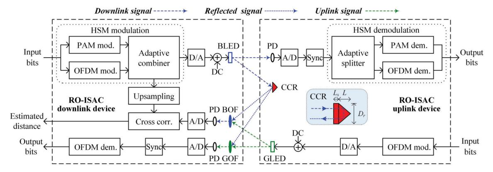
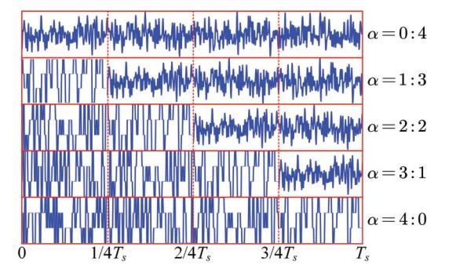
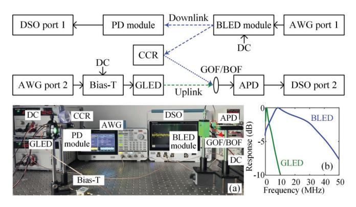
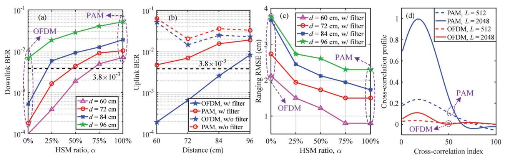
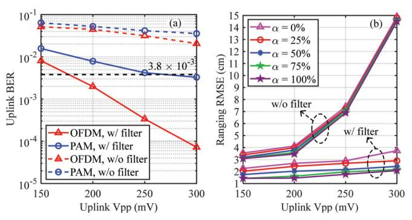

{0}------------------------------------------------

# Full-Duplex RO-ISAC System: Wavelength Division Duplexing and Hybrid Waveform Design

Shuhang Chen, Chen Chen [,](https://orcid.org/0000-0003-2541-6283) *Senior Member, IEEE*, Zhihong Zen[g](https://orcid.org/0000-0001-6735-811X) , Yanbing Yang [,](https://orcid.org/0000-0002-9266-8600) *Member, IEEE*, and Harald Haas [,](https://orcid.org/0000-0001-9705-2701) *Fellow, IEEE*

*Abstract*—Integrated sensing and communication (ISAC) using light has attracted attention recently, and retroreflective optical ISAC (RO-ISAC) realizes passive sensing by equipping the target with a corner cube reflector (CCR) to enhance light reflection. In this Letter, we propose and demonstrate a full-duplex RO-ISAC system based on wavelength division duplexing (WDD) with a hybrid waveform design. Specifically, WDD is enabled by adopting blue and green lights for downlink and uplink transmissions, respectively. To avoid the interference between the reflected downlink signal and the uplink signal, a pair of blue and green optical filters are employed. Moreover, a hybrid singlecarrier and multi-carrier (HSM) waveform consisting of both pulse amplitude modulation (PAM) and orthogonal frequency division multiplexing (OFDM) samples is further proposed to achieve flexible performance trade-off between communication and sensing in the full-duplex RO-ISAC system. Our experiments successfully demonstrate a RO-ISAC system supporting downlink 125 Mb/s and uplink 12.5 Mb/s full-duplex transmission with a ranging root mean square error less than 4 cm.

*Index Terms*—Retroreflective optical integrated sensing and communication, full-duplex transmission, wavelength division duplexing, hybrid single-carrier and multi-carrier waveform.

## I. INTRODUCTION

T HE sixth-generation (6G) mobile communication systems are expected to provide large-capacity communication and high-accuracy sensing services simultaneously for emerging applications such as the Internet of Things, intelligent transportation systems, human-computer interactions, and environmental monitoring. As a key enabling technology for 6G, integrated sensing and communication (ISAC) has been widely investigated in recent years [\[1\].](#page-3-0) In general, ISAC systems can be implemented using radio-frequency (RF) or light spectrum [\[2\].](#page-3-1) Compared with RF-based ISAC, optical ISAC can fully exploit the abundant bandwidth of light to

Received 18 March 2025; revised 6 May 2025; accepted 14 May 2025. Date of publication 19 May 2025; date of current version 23 May 2025. This work was supported in part by the National Natural Science Foundation of China under Grant 62271091 and in part by the Fundamental Research Funds for the Central Universities under Grant 2024CDJXY020. *(Corresponding author: Chen Chen.)*

Shuhang Chen, Chen Chen, and Zhihong Zeng are with the School of Microelectronics and Communication Engineering, Chongqing University, Chongqing 400044, China (e-mail: 202312021097t@stu.cqu.edu.cn; c.chen@cqu.edu.cn; zhihong.zeng@cqu.edu.cn).

Yanbing Yang is with the College of Computer Science and the Institute for Industrial Internet Research, Sichuan University, Chengdu 610065, China (e-mail: yangyanbing@scu.edu.cn).

Harald Haas is with the Department of Engineering, Electrical Engineering Division, Cambridge University, CB3 0FA Cambridge, U.K. (e-mail: huh21@cam.ac.uk).

Color versions of one or more figures in this letter are available at https://doi.org/10.1109/LPT.2025.3570997.

Digital Object Identifier 10.1109/LPT.2025.3570997

achieve both large transmission capacity and high sensing accuracy [\[3\].](#page-3-2) Since optical ISAC systems usually rely on the reflected light from the target to perform passive sensing, the concept of retroreflective optical ISAC (RO-ISAC) has been further proposed in [\[4\]](#page-3-3) and [\[5\],](#page-3-4) which equips the target with a corner cube reflector (CCR) to enhance light reflection [\[6\].](#page-3-5)

The implementation of RO-ISAC systems faces a few challenges, including bidirectional transmission, waveform design, etc. A practical RO-ISAC system usually needs to support bidirectional transmission between the downlink and uplink devices. Due to bidirectional transmission, there might be interference between the reflected downlink signal and the uplink signal in the RO-ISAC system. In our previous work, we have proposed a time division duplexing (TDD) scheme to avoid interference and hence enable bidirectional transmission in the RO-ISAC system [\[7\].](#page-3-6) However, the TDD-based RO-ISAC system can only support half-duplex transmission, which is not capable of providing full-duplex transmission. Moreover, since the RO-ISAC system needs to fulfill the dual-function of communication and sensing simultaneously, a suitable waveform design plays an important role to achieve satisfactory communication and sensing performance. So far, several waveform designs have been reported to situate the requirements of both communication and sensing, such as pulse sequence sensing and pulse position modulation (PSS-PPM) [\[8\],](#page-3-7) combined linear frequency modulation and continuous phase modulation (LFM-CPM) [\[9\],](#page-3-8) integrated pulse amplitude modulation (PAM) waveform [\[10\],](#page-3-9) and orthogonal frequency division multiplexing (OFDM) [\[11\],](#page-3-10) [\[12\].](#page-3-11) Nevertheless, an adaptive waveform that enables flexible communication and sensing performance trade-off has not yet been designed.

Aiming at address the full-duplex transmission and adaptive waveform design issues, in this Letter, we propose a full-duplex RO-ISAC system based on wavelength division duplexing (WDD) with a hybrid single-carrier and multicarrier (HSM) waveform. Experiments are conducted to study the performance of the proposed full-duplex RO-ISAC system.

## II. PRINCIPLE

Fig. [1](#page-1-0) depicts the schematic diagram of the proposed fullduplex RO-ISAC system based on WDD and HSM. In the RO-ISAC downlink device, the downlink input bits are first used to perform HSM modulation, where the information bits are split into two streams: one is modulated into a PAM signal via PAM modulation and the other is modulated into an OFDM signal via OFDM modulation. Subsequently, the two modulated signals are combined to generate the HSM signal

{1}------------------------------------------------

Fig. 1. Schematic diagram of the proposed full-duplex RO-ISAC system based on WDD and HSM. Inset in RO-ISAC uplink device shows the diagram of the CCR. mod.: modulation; corr.: correlation; dem.: demodulation.

via an adaptive combiner. The obtained digital HSM signal is then converted into an analog HSM signal via digital-to-analog (D/A) conversion and a direct current (DC) bias is added to ensure the non-negativity of the HSM signal. Finally, the resultant downlink HSM signal is used to drive a blue LED (BLED) to generate the blue light for downlink transmission. In the RO-ISAC uplink device, the downlink HSM signal is detected by a photo-detector (PD) and analog-to-digital (A/D) conversion is then conducted to obtain a digital HSM signal. After time synchronization, HSM demodulation is carried out accordingly. More specifically, the PAM part and the OFDM part in the digital HSM signal are first split via an adaptive splitter, and then PAM demodulation and OFDM demodulation are respectively executed to obtain the downlink output bits.

As shown in Fig. 1, the RO-ISAC uplink device is equipped with a CCR to reflect the blue light back to realize ranging at the RO-ISAC downlink device. The inset in the RO-ISAC uplink device illustrates the diagram of the CCR, where  $L_s$ , L, and  $D_r$  denote the recessed length, the length, and the diameter of the CCR, respectively [4]. Moreover, in the RO-ISAC uplink device, the uplink input bits are first modulated into a digital OFDM signal. After D/A conversion and DC bias addition, the obtained OFDM signal is used to drive a green LED (GLED) to generate the green light for uplink transmission. After free-space transmission, the reflected blue light and the green light are mixed together and a pair of optical filters are used to separate the blue and green lights in the RO-ISAC downlink device so as to avoid the bidirectional interference. Particularly, a blue optical filter (BOF) is adopted to filter out the blue light from the mixed light for further ranging procedures, while a green optical filter (GOF) is applied to filter out the green light from the mixed light for uplink demodulation. After blue filtering, the filtered blue light is detected by a PD and the resultant analog HSM signal is converted into a digital HSM signal via A/D conversion. Subsequently, timedomain cross-correlation between the reflected HSM signal and the upsampled downlink HSM signal is performed to calculate the time of flight and hence estimate the distance. The maximum likelihood estimation of the time of flight can be represented by  $\hat{\tau} = \arg \max_{n=0}^{L-1} y(n)x(n-\tau)$ , where x(n) and y(n) respectively denote the upsampled time-domain samples of the original HSM signal and the time-domain

Fig. 2. Illustration of HSM waveforms with different HSM ratios.

samples of the reflected HSM signal, and L is the length of the selected time-domain window for cross-correlation [4]. Hence, the distance d between the downlink and uplink devices can be estimated as  $\hat{d} = c\hat{\tau}/2$  with c being the speed of light. For an A/D sampling rate  $f_s$ , the ranging resolution is given by  $\Delta d = c/2f_s$ . In addition, the filtered green light is detected by another PD and the uplink output bits can be finally obtained via A/D conversion, time synchronization and OFDM demodulation.

To achieve flexible performance trade-off between communication and sensing, we design a HSM waveform for the full-duplex RO-ISAC system. As shown in Fig. 1, the HSM waveform consists of both single-carrier (i.e., PAM) and multicarrier (i.e., OFDM) parts, and flexible performance trade-off can be achieved by adaptively adjusting the proportions of the PAM/OFDM parts in the HSM waveform. By defining the HSM ratio  $\alpha$  as the ratio of the number of PAM samples to the number of OFDM samples, the HSM waveform becomes OFDM when  $\alpha = 0$ , while it becomes PAM when  $\alpha = \infty$ . To ensure that the HSM signal has a constant data rate when varying the HSM ratio  $\alpha$ , we assume that the time-domain upsampling rate  $R_t$  in PAM modulation and the frequencydomain upsampling rate  $R_f$  in OFDM modulation is the same, i.e.,  $R_t = R_f$ . Moreover, the PAM order  $M_{PAM}$  and the quadrature amplitude modulation (QAM) order  $M_{QAM}$  in OFDM modulation are also the same, i.e.,  $M_{PAM} = M_{OAM}$ . Since OFDM usually has a high peak-to-average-power ratio (PAPR), the OFDM samples are clipped to maintain the same peak values as the PAM samples in the HSM waveform. Fig. 2

{2}------------------------------------------------

Fig. 3. Experimental setup of the full-duplex RO-ISAC system. Insets: (a) photo of the experimental testbed and (b) measured frequency responses of BLED and GLED.

illustrates the HSM waveforms with different HSM ratios, where the time duration of the HSM frame is  $T_s$  and each HSM frame consists of four sub-frames. As we can see, the HSM waveform consists of more OFDM samples when  $\alpha < 1$ , while it has more PAM samples when  $\alpha > 1$ . Since OFDM has better communication performance while PAM has better sensing performance, it is feasible to achieve flexible performance trade-off between communication and sensing by adaptively adjusting the HSM ratio  $\alpha$ .

#### III. EXPERIMENTAL RESULTS

Fig. 3 depicts the experimental setup of the full-duplex RO-ISAC system, where a BLED module (HCCLS2021MOD01-TX) is employed in the downlink while a GLED is applied in the uplink. Both the downlink HSM signal and the uplink OFDM signal are generated offline using MATLAB, which are then loaded into the two ports of a two-channel arbitrary waveform generator (AWG, Tektronix AFG31102) with sampling rates of 250 and 25 MSa/s, respectively. The output HSM signal is used to drive the BLED module with a DC bias voltage of 12 V, while the output OFDM signal is first combined with a DC bias voltage of 2.7 V via a bias tee (Bias-T, Mini-Circuits ZFBT-6GW+) and then utilized to drive the GLED. The peak-to-peak voltage (Vpp) of the downlink HSM signal is fixed at 250 mV, while the Vpp of the uplink OFDM signal is in the range from 150 to 300 mV. In the downlink, a PD module (HCCLS2021MOD01-RX) is used to detect the blue light and the obtained HSM signal is recorded by a digital storage oscilloscope (DSO, LeCroy Wavesurfer432) with a sampling rate of 2.5 GSa/s for downlink demodulation. In the uplink, a BOF and a GOF are respectively adopted to filter the mixed light, and an avalanche photo-diode (APD, Hamamatsu C12702-12) is used to detect the filtered optical signal. The BOF filters out the reflected blue light and the detected HSM signal is recorded by the DSO with a sampling rates of 2.5 GSa/s for ranging, while GOF filters out the green light and the detected OFDM signal is recorded by the DSO with a sampling rates of 250 MSa/s for uplink demodulation. The photo of the experimental testbed is shown in Fig. 3(a). The measured frequency responses of the BLED and GLED are plotted in Fig. 3(b), where the -3dB bandwidths of the BLED and GLED are 3 and 34 MHz, respectively.

In the downlink HSM modulation, the inverse fast Fourier transform (IFFT) size is 256 and a total of 64 subcarriers are used to carry 4-QAM (i.e.,  $M_{QAM}=4$ ) symbols in OFDM, which is corresponding to a frequency-domain upsampling rate of  $R_f=4$ . Moreover, 4-PAM (i.e.,  $M_{PAM}=4$ ) modulation is considered with a time-domain upsampling rate of  $R_t=4$ . As a result, the data rate of downlink transmission is given by  $(\log_2 4) \times 250/4 = 125$  Mb/s. In the uplink OFDM modulation, the IFFT size, the number of data subcarriers and the QAM order are 256, 64 and 4, respectively. Hence, the data rate of uplink transmission is given by  $(\log_2 4) \times 25/4 = 12.5$  Mb/s. In addition, a clipping ratio of 11 dB is considered during OFDM modulation in both downlink and uplink transmissions. For the uplink ranging, the A/D sampling rate is  $f_s=2.5$  GSa/s and hence the ranging resolution is calculated by  $\Delta d=6$  cm.

We first evaluate the communication and ranging performance of the full-duplex RO-ISAC system, where the uplink Vpp is set to 150 mV. Fig. 4(a) shows the downlink communication bit error ratio (BER) versus HSM ratio  $\alpha$  for different distances. As we can see, the BER is gradually increased with the increase of  $\alpha$  for all the distances, which is mainly because OFDM using 4-QAM generally has a lower BER than 4-PAM and a larger HSM ratio  $\alpha$  indicates there are more 4-PAM samples in the HSM signal. Moreover, the overall BER performance is gradually degraded with the extension of distance as a larger distance results in a reduced received signal power. The uplink communication BER versus distance for PAM and OFDM without and with filter is shown in Fig. 4(b). It can be seen that the use of optical filter can substantially improve the uplink BER performance since the bidirectional interference can be efficiently canceled via optical filtering. For the case without optical filtering, it is interesting to observe that the BER first decreases and then increases when the distance is increased from 60 to 96 cm, which might be due to the fact that the reflected downlink blue light attenuates much faster than the uplink green light and hence the interference reduction plays the dominant role when the distance is increased from 60 to 72 cm. Besides, for the case without optical filtering, it is also verified that OFDM using 4-QAM can achieve much better BER than 4-PAM. More specifically, the maximum distances for OFDM using 4-QAM and 4-PAM to reach the 7% forward error correction (FEC) coding limit of  $3.8 \times 10^{-3}$  are about 60 and 88 cm, respectively. Fig. 4(c) shows the ranging root mean square error (RMSE) versus HSM ratio  $\alpha$  for different distances with filter. It is contrary to the communication BER shown in Fig. 4(a) that the ranging RMSE is gradually reduced with the increase of  $\alpha$  for all the distances with filter. The crosscorrelation performance comparison between PAM and OFDM is shown in Fig. 4(d). It is clear to see that the cross-correlation profile of 4-PAM has a much higher peak than OFDM using 4-QAM for a given cross-correlation window length L, indicating its superior cross-correlation performance, and the profile peak of OFDM becomes barely distinguishable for a relatively small L of 512. It can be concluded from Fig. 4 that flexible performance trade-off between communication and ranging can be achieved by adaptively selecting an appropriate HSM ratio  $\alpha$ .

{3}------------------------------------------------

Fig. 4. (a) Downlink BER vs. HSM ratio, (b) uplink BER vs. distance for PAM and OFDM without and with filter, (c) ranging RMSE vs. HSM ratio with filter, and (d) cross-correlation performance comparison between PAM and OFDM. The uplink Vpp is set to 150 mV. w/: with, w/o: without.

Fig. 5. (a) Uplink BER vs. uplink Vpp, and (b) ranging RMSE vs. uplink Vpp. The distance is set to 96 cm.

We further investigate the impact of uplink transmission on the communication and ranging performance of the fullduplex RO-ISAC system, where the distance is set to 96 cm. Fig. [5\(a\)](#page-3-13) shows the uplink BER versus uplink Vpp for PAM and OFDM without and with filter. As can be seen, the uplink BER is gradually reduced with the increase of uplink Vpp for both PAM and OFDM. Moreover, significant BER performance enhancement is obtained when optical filter is used to mitigate the interference from the reflected blue light. To reach the 7% FEC coding limit of 3.8 × 10−3 , the required uplink Vpps for 4-PAM and OFDM using 4- QAM with optical filtering are 260 and 178 mV, respectively, showing the superior BER performance of OFDM using 4- QAM over 4-PAM. The ranging RMSE versus uplink Vpp for different HSM ratios without and with filter is depicted in Fig. [5\(b\).](#page-3-13) For the case without optical filtering, the ranging RMSE becomes excessively high for a relatively large uplink Vpp. Specifically, a ranging RMSE as high as 15 cm is obtained when the uplink Vpp reaches 300 mV. For the case with optical filtering, the ranging RMSE is only slightly increased with the increase of uplink Vpp, which remains to be less than 4 cm even a large uplink Vpp of 300 mV is applied.

## IV. CONCLUSION

In this Letter, we have proposed and experimentally demonstrated a full-duplex RO-ISAC system employing WDD with an adaptive HSM waveform. By using blue and green lights with the corresponding blue and green optical filters, bidirectional interference can be mitigated and WDD-based full-duplex transmission can be established in the RO-ISAC system. To realize flexible trade-off between communication and sensing performance in the RO-ISAC system, we have further proposed an adaptive HSM waveform where the HSM ratio can be adaptively selected to adjust the proportions of PAM and OFDM samples in the HSM waveform. Experimental results successfully verify the feasibility of the proposed WDD-based full-duplex RO-ISAC system using the HSM waveform.

### REFERENCES

- [\[1\]](#page-0-0) F. Liu et al., "Integrated sensing and communications: Toward dualfunctional wireless networks for 6G and beyond," *IEEE J. Sel. Areas Commun.*, vol. 40, no. 6, pp. 1728–1767, Jun. 2022.
- [\[2\]](#page-0-1) N. Gonzalez-Prelcic et al., "The integrated sensing and communication ´ revolution for 6G: Vision, techniques, and applications," *Proc. IEEE*, vol. 112, no. 7, pp. 676–723, Jul. 2024.
- [\[3\]](#page-0-2) Y. Wen, F. Yang, J. Song, and Z. Han, "Optical integrated sensing and communication: Architectures, potentials and challenges," *IEEE Internet Things Mag.*, vol. 7, no. 4, pp. 68–74, Jul. 2024.
- [\[4\]](#page-0-3) Y. Cui et al., "Retroreflective optical ISAC using OFDM: Channel modeling and performance analysis," *Opt. Lett.*, vol. 49, no. 15, pp. 4214–4217, 2024.
- [\[5\]](#page-0-4) H. Wang, Z. Zeng, C. Chen, B. Zhu, S. Shao, and M. Liu, "Retroreflective optical ISAC sup{p}orting 3D positioning in indoor environments," in *Proc. Asia Commun. Photon. Conf. (ACP) Int. Conf. Inf. Photon. Opt. Commun. (IPOC)*, Nov. 2024, pp. 1–5.
- [\[6\]](#page-0-5) S. Shao, A. Salustri, A. Khreishah, C. Xu, and S. Ma, "R-VLCP: Channel modeling and simulation in retroreflective visible light communication and positioning systems," *IEEE Internet Things J.*, vol. 10, no. 13, pp. 11429–11439, Jul. 2023.
- [\[7\]](#page-0-6) H. Wang, C. Chen, Z. Zeng, S. Shao, and H. Haas, "Bidirectional retroreflective optical ISAC using time division duplexing and clipped OFDM," *IEEE Photon. Technol. Lett.*, vol. 37, no. 10, pp. 587–590, May 15, 2025.
- [\[8\]](#page-0-7) Y. Wen, F. Yang, J. Song, and Z. Han, "Pulse sequence sensing and pulse position modulation for optical integrated sensing and communication," *IEEE Commun. Lett.*, vol. 27, no. 6, pp. 1525–1529, Jun. 2023.
- [\[9\]](#page-0-8) Y. Wen, F. Yang, J. Song, and Z. Han, "Free space optical integrated sensing and communication based on LFM and CPM," *IEEE Commun. Lett.*, vol. 28, no. 1, pp. 43–47, Jan. 2024.
- [\[10\]](#page-0-9) J. Wang, N. Huang, C. Gong, W. Wang, and X. Li, "PAM waveform design for joint communication and sensing based on visible light," *IEEE Internet Things J.*, vol. 11, no. 11, pp. 20731–20742, Jun. 2024.
- [\[11\]](#page-0-10) E. B. Muller, V. N. H. Silva, P. P. Monteiro, and M. C. R. Medeiros, ¨ "Joint optical wireless communication and localization using OFDM," *IEEE Photon. Technol. Lett.*, vol. 34, no. 14, pp. 757–760, Jul. 15, 2022.
- [\[12\]](#page-0-11) Y. Wen, F. Yang, J. Song, and Z. Han, "Free-space optical integrated sensing and communication based on DCO-OFDM: Performance metrics and resource allocation," *IEEE Internet Things J.*, vol. 12, no. 2, pp. 2158–2173, Jan. 2025.