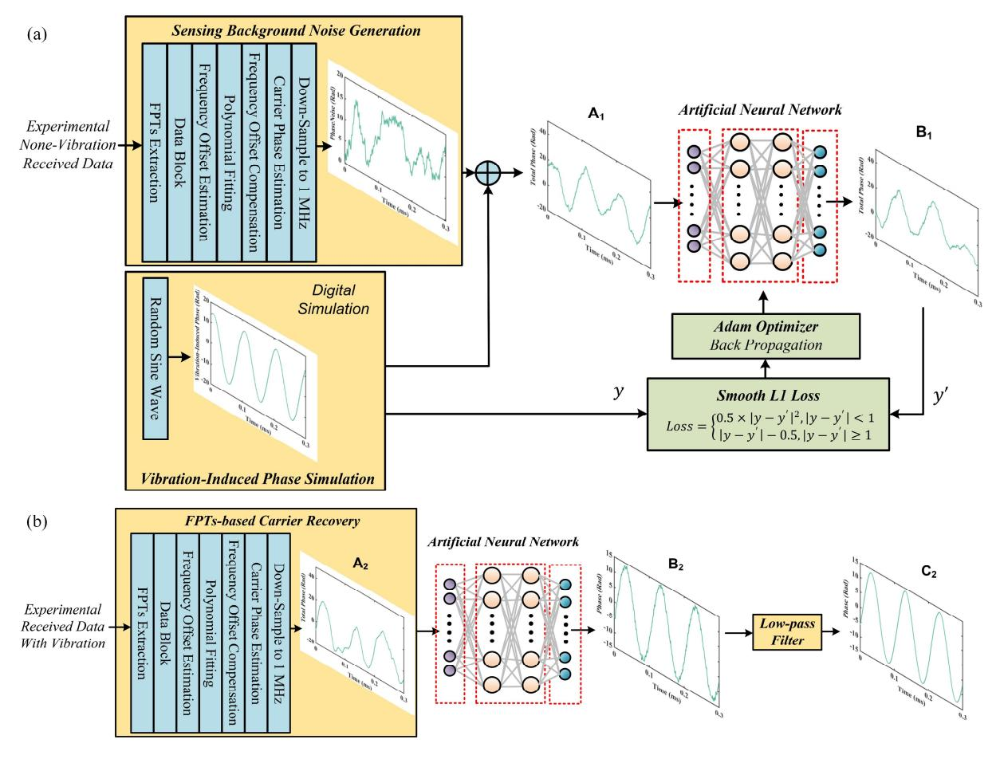
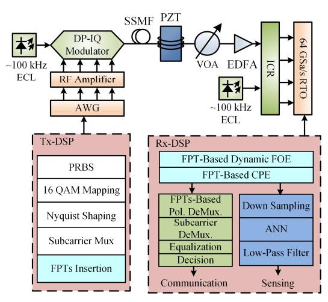
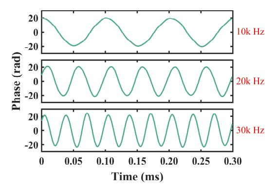
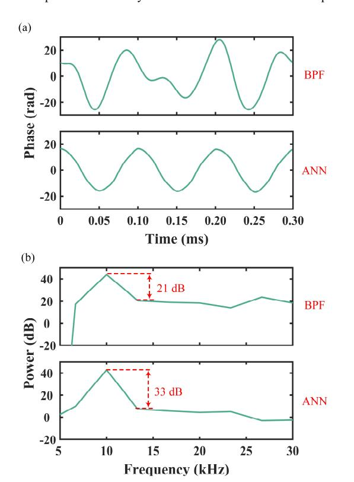

# Integrated Vibration Sensing in DSCM Systems Under ECLs Based on ANN and Digital Twin

Bang Yang, 1,2 Shangyi Wang, 1,2 Jianwei Tang, 1 and Yanfu Yang 1,\*

1School of Integrated Circuits, Harbin Institute of Technology, Shenzhen, China

2These authors contributed to this work equally

\*yangyanfu@hit.edu.cn

Abstract—This paper proposes an integrated vibration sensing and communication scheme for DSCM systems using commercial external cavity lasers (ECLs), enhanced by artificial neural networks (ANN) and digital twin technology. To overcome the limitations of conventional band-pass filtering (BPF) methods in broadband vibration detection, we develop an ANN-based vibration-induced phase extraction scheme. The ANN used for vibration-induced phase extraction is trained with the synthetically generated data from digital twin simulations. The digital twin framework combines experimental noise (captured from vibration-free scenarios) with digitally-added vibration-induced phases to generate training datasets for the ANN training. Experimental validation demonstrates a 12 dB improvement in sensing signal-to-noise ratio (SSNR) compared to traditional BPF-based schemes. This work provides a practical solution for intelligent optical network maintenance by enabling robust vibration sensing without requiring narrowlinewidth lasers or customized hardware.

Keywords—Integrated sensing and communication, optical communication, digital twin.

### I. INTRODUCTION

In recent years, fiber sensing technology based on telecommunication networks has become increasingly popular due to its ability to fully utilize existing optical fiber network infrastructure. Optical fiber communication-sensing integration holds tremendous potential in environmental sensing [1] and human activity monitoring [2].

There are two kinds of schemes for optical fiber communication and sensing integration. The first scheme detects vibrations based on backscattering [3, 4], which can achieve high spatial resolution. However, due to the presence of isolators in erbium-doped fiber amplifiers (EDFAs), it is challenging to achieve reflection over long transmission distances. The second scheme detects vibrations using forward optical information such as phase. This scheme can more effectively adapt to existing telecommunication networks but requires narrow linewidth lasers (NLLs) to avoid phase noise caused by the frequency drift of commercial external cavity lasers (ECLs) [5, 6]. Although dynamic frequency offset estimation (FOE) based on data block can partially mitigate the impact of frequency drift [7], the accuracy of dynamic FOE remains limited. As a result, residual frequency offset (FO) accumulation causes significant low-frequency phase noise, limiting the capability of low-frequency phase-based vibration sensing. In our previous work [8], we proposed a scheme for integrated communication and vibration sensing based on frequency domain pilot tones (FPTs), achieving vibration sensing down to 10 kHz using commercial ECLs. However, this scheme requires designing a band-pass filter (BPF) for vibration-

This work was supported partly by Shenzhen Municipal Science and Technology Innovation Council (JCYJ20240813104835048).

induced phase extraction, which is disadvantageous for broadband sensing.

In this paper, we propose a vibration-induced phase extraction method based on artificial neural network (ANN). To obtain sufficient data for ANN training, we introduce a phase sensing data generation method based on digital twin technology. Experimental data without vibration is used to generate sensing background sensing noise, and simulation is used to generate vibration-induced phases. The noise and simulated phases are then superimposed for ANN training. In the experiments, the proposed ANN-based method achieved a 12 dB sensing signal-to-noise ratio (SSNR) improvement compared to the BPF-based method.

#### II. PRINCIPLES

At the transmitter side, two FPTs of frequencies  $f_1$  and  $f_2$  are inserted at X and Y polarization components, as proposed in our previous work [8]. The phase of the received FPTs is primarily caused by laser phase noise, the accumulated phase resulting from laser frequency offset over time, and the phase induced by external vibrations, as expressed in the Eq. (1):

$$\phi(t) = \int_0^t 2\pi FO(\tau) d\tau + \phi_{\text{laser}}(t) + \phi_{\text{vibration}}(t). \tag{1}$$

Where  $\phi_{\text{laser}}(t)$  and  $\phi_{\text{vibration}}(t)$  represent the phase introduced by laser linewidth and external vibration, respectively, and  $FO(\tau)$  is the time-varying FO. At the receiver, the FPTs are first extracted, and then are divided into data blocks. For each block, FOE is performed based on the FPTs of the X and Y polarization states to avoid polarization fading. Subsequently, a polynomial fitting method is used to obtain the FO for all data. Afterward, carrier phase estimation (CPE) is carried out using the FPTs of the X and Y polarization states, and the phase is obtained as shown in Eq. (2):

$$\phi_{\text{CPE}}(t) = \int_0^t 2\pi \Delta FO(\tau) d\tau + \phi_{\text{laser}}(t) + \phi_{\text{vibration}}(t). \tag{2}$$

Where  $\Delta FO(\tau)$  is the residual FO. ( $\int_0^t 2\pi \Delta FO(\tau) d\tau + \phi_{laser}(t)$ ) is the background noise of phase-based sensing system, and the noise is difficult to be simulated. It can be seen that the vibration-induced phase and the background noise have an additive relationship.

The proposed ANN training method based on the digital twin is shown in Fig. 1(a). Considering that the sensing background noise is difficult to be simulated. Dynamic FOE and CPE are performed on experimental data without applied vibrations to obtain the sensing background noise. Then, random sinusoidal waves are used to simulate vibration-induced phases. The experimentally generated noises are superimposed with the digitally-generated sinusoidal waves, serving as the input to the ANN. The output of the ANN is

Fig. 1. (a) ANN training method based on the digital twin technology. (b) Vibration-induced phase extraction based on the well-trained ANN.

compared with the digitally-generated sinusoidal wave to calculate the smooth L1 loss, and a Adam optimizer is employed to update the ANN parameters, thus achieving ANN training.

After the ANN training is completed, it is deployed into the integrated communication and sensing system, as shown in Fig. 1(b). At the receiver, carrier recovery is first performed on the received signal with vibration-induced phase using FPTs. Subsequently, the phase after CPE is input into the ANN to extract vibration-induced phase. Finally, a low-pass filter (LPF) with a cutoff frequency of 50 kHz is applied to filter out high-frequency noise, enabling the recovery of the vibration-induced phase. For communication, the FPTs are used for polarization demultiplexing, and then subcarrier demultiplexing and equalization are performed, as our previous work [9].

# III. EXPERIMENTAL SETUP

The proposed integrated communication and sensing experiment is illustrated in Fig. 2. At the transmitter side, data was mapped based on dual-polarization 16QAM, followed by Nyquist shaping with a roll off factor of 0.1. The signal was then subjected to DSCM and up-sampled to the arbitrary waveform generator's (AWG's, Keysight 8199A) sampling rate of 128 GSa/s. The 100 kHz ECL (IDPhotonics CoBrite, LW ≤ 100 kHz) with a central wavelength of 1550 nm respectively was modulated. The signal was transmitted through single-mode fiber, with a communication transmission rate set to 4×8 GBaud/s. The signal was received by an integrated coherent receiver (ICR) and sampled by realtime oscilloscope (RTO, Keysight UXR0594AP). The sampling rate was set to be 64 GSa/s. As for vibration sensing, the vibration induced by a PZT was applied to the fiber link.

At the receiver side, dynamic frequency offset estimation and carrier phase estimation were firstly performed using FPTs as in our previous work [8]. For the communication signal, it was subjected to polarization demultiplexing based on FPTs [9]. Then, subcarrier demultiplexing was performed on the signal. Finally, equalization was done using the singlein-single-out filter. For the carrier phase, it was firstly downsampled to 1 MHz for complexity reducing. Then, vibration induced phase extraction wasfirstly performed using the welltrained ANN. Finally, a low-pass filter with a cut-off frequency of 50 kHz was used to cancel noise.

Fig. 2. Experimental setup and DSP procedure.

## IV. EXPERIMENTAL RESULTS

After training the ANN using the digital-twin-generated data, the ANN was deployed on the receiving-side DSP. Sinusoidal vibrations with frequencies from 10 kHz to 30 kHz were applied to the link respectively. Using the trained ANN, vibration-induced phase extraction was performed. The extracted phases are shown in Fig. 3. The extracted vibrationinduced phases demonstrate that the ANN can effectively achieve vibration-induced phase extraction within the frequency range of 10 kHz to 30 kHz.

Fig. 3. The phases extracted by ANN under different vibration frequencies.

Fig. 4. (a) The phases extracted by BPF and ANN under 10 kHz vibration. (b) The spectra of the extracted phases under 10 kHz vibration.

As a comparison, the passband of the BPF filter was set to 5 kHz to 50 kHz. Vibration-induced phase extraction was conducted using both BPF and ANN on the same dataset. The extracted phases are shown in Fig. 4(a). It can be observed that the phase extracted by the ANN exhibits more significant periodicity. The extracted vibration-induced phase spectra are shown in Fig. 4(b). It can be seen that the ANN-based approach effectively improves the SSNR by 12 dB.

## V. CONCLUSION

In conclusion, we propose a method for extracting vibration-induced phase using ANN and introduce an ANN training scheme based on digital twin technology. In this scheme, a digital twin system is used to generate data for ANN training. Then, the well-trained ANN is deployed in the receiver DSP for vibration-induced phase extraction. This solution is compatible with commercial ECLs, and in experiments, achieved a 12 dB improvement in SSNR compared to the BPF method. This high-SSNR scheme provides an effective solution for the intelligent operation and maintenance of future optical networks.

# REFERENCES

- [1] E. Ip *et al.*, "Vibration detection and localization using modified digital coherent telecom transponders," *J. Lightw. Technol.*, vol. 40, no. 5, pp. 1472–1482, Mar. 2022.
- [2] S. Han *et al.*, "Deep learning-based intrusion detection and impulsive event classification for distributed acoustic sensing across telecom networks," *J. Lightw. Technol.*, vol. 42, no. 12, pp. 4167–4176, Jun. 2024.
- [3] H. He *et al.*, "Integrated sensing and communication in an optical fibre," *Light: Sci. & Appl.*, vol. 12, no. 1, p. 25, Jan. 2023.
- [4] Z. Hu *et al.*, "Enabling endogenous DAS in P2MP digital subcarrier coherent transmission system with enhanced frequency response," in *Proc. Opt. Fiber Comm. Conf. 2024*, San Diego, CA, USA, Mar. 2024, pp. 1–3.
- [5] Y. Yan *et al.*, "Simultaneous communications and vibration sensing over a single 100-km deployed fiber link by fiber interferometry," in *Proc. Opt. Fiber Comm. Conf. 2023*, San Diego, CA, USA, Mar. 2023, pp. 1–3.
- [6] J. Tang *et al.*, "Distributed vibration sensing and simultaneous selfhomodyne transmission of single-carrier net 5.36 Tb/s signal using 7 core fiber," in *Proc. Opt. Fiber Comm. Conf. 2024*, San Diego, CA, USA, Mar. 2024, pp. 1–3.
- [7] W. Zuo *et al.*, "Investigation of co-cable identification based on ultrasonic sensing in coherent systems," *IEEE Photon. Technol. Lett.*, vol. 35, no. 21, pp. 1155–1158, Nov. 2023.
- [8] B. Yang *et al.*, "Integrated communication and enhanced forward phase-based sensing based on frequency-domain pilot tones in DSCM systems using 100 kHz ECLs," *J. Lightwave Technol.*, vol. 43, no. 6, pp. 2664–2671, Mar. 2025.
- [9] L. Fan *et al.*, "Hardware-efficient, ultra-fast and joint polarization and carrier phase tracking scheme based on frequency domain pilot tones for DSCM systems," *J. Lightw. Technol.*, vol. 41, no. 5, pp. 1454–1463, Mar. 2023.