{0}------------------------------------------------

# Clock and Carrier Synchronization Using Optical Frequency Combs in Radio Access Networks

Abdulrahman Alshehry, Amany Kassem, Zhixin Liu and Izzat Darwazeh Department of Electronic and Electrical Engineering,University College London,UK abdulrahman.alshehry.19@ucl.ac.uk

*Abstract*—The operation of wireless communication systems, particularly in next-generation networks like 6G, has become increasingly complex, driving a growing demand for precise synchronization, especially with the introduction of technologies such as massive MIMO, ultra-dense cell deployments and Integrated Sensing and Communications (ISAC). This paper proposes a novel method for achieving clock and carrier synchronization using optical frequency combs. By leveraging Wavelength Division Multiplexing (WDM) to combine clock and data signals, and transmitting them over a Single-Mode Fiber (SMF), the system ensures precise synchronization across extensive distances. A 2.5 GHz spaced optical frequency comb is combined with optical data streams, and transmitted through the fiber network. Upon reception, the signals are demultiplexed and converted into electrical form, with the carrier frequencies successfully synchronized at 2.5 GHz, 5 GHz, and 7.5 GHz. The paper presents simulation and experimental results to validate the proposed methodology, demonstrating its feasibility for highprecision synchronization in wireless communications. The results highlight the potential of optical frequency combs to enhance the performance of future communication networks, supporting high-speed data transmission with minimal latency and improved reliability.

*Index Terms*—Clock and carrier synchronization, Radio Access Network, Optical Frequency Comb, Data transmission

### I. INTRODUCTION

Clock and carrier synchronization are essential parts of modern wireless communication systems, playing a crucial role in ensuring reliable and efficient data transmission [1]. As wireless technologies continue to evolve, especially with the emergence of 5G and upcoming 6G networks, the demand for precise synchronization of clocks and radio frequency (RF) carriers has significantly increased. This need arises from the growing complexity of wireless systems, which include the integration of massive multiple-input multiple-output (MIMO) antenna arrays, distributed antenna systems, and ultra-dense cell deployments. All of these require accurate timing to facilitate seamless communication [2], [3]. Clock synchronization is vital for aligning the timing of data transmissions across different network components, such as base stations and user devices. This alignment helps to prevent signal overlap, mitigate interference, and maintain data integrity. Conversely, carrier synchronization ensures that signals transmitted across multiple frequency bands remain coherent, which is critical for achieving high data rates, optimizing spectrum usage, and supporting advanced modulation schemes [4]. Without precise synchronization, networks can experience performance degradation that includes higher latency, reduced throughput, and increased error rates.

In next-generation wireless networks, especially 6G with its proposed ISAC the need for synchronization goes beyond simple communication requirements. It now includes emerging applications like autonomous vehicles, industrial IoT, augmented and virtual reality, and high-speed mobile broadband. These applications demand not only low latency and high throughput but also extremely accurate synchronization, as even small timing errors can cause substantial service disruptions [5].

Integrated Sensing and Communications (ISAC) combines sensing (like radar and environmental sensors) with communication (wireless data transmission) in a single system [6]. This integration allows both functions to be performed simultaneously, improving efficiency, saving resources, and enabling advanced applications like autonomous vehicles, smart cities, and IoT. Frequency synchronization is crucial in ISAC systems because both sensing and communication share the same spectrum and equipment. Synchronization ensures that communication signals and sensing data do not interfere, allowing for accurate and efficient performance. It also optimizes spectrum use, reduces latency, and enhances overall system performance. Without synchronization, misalignment can lead to localization errors in addition to inefficiencies and system failures [7].

To address these challenges, emerging technologies, such as optical frequency combs and advanced synchronization techniques, are being explored to achieve high-precision clock and carrier synchronization. These methods facilitate the distribution of synchronized timing signals over long distances, thereby tackling the complexities of modern network infrastructure and the need for multi-band communication [8], [9].

Optical frequency combs are a series of evenly spaced spectral lines, often created by lasers or resonators, and are vital in fields like metrology, communications, and atomic clocks [10]. Though the concept dates back to the 1960s with the ruby laser, the development of mode-locked lasers and frequency combs followed quickly [11]. The invention of the frequency comb synthesizer, which precisely measures optical frequencies, earned Hall and Hansch the Nobel Prize [12], [13]. Today, electro-optic modulator-based frequency combs 

{1}------------------------------------------------

are being explored for next-gen wireless networks, showcasing their expanding applications. Fig. 1 depicts the optical frequency comb, with fr representing the pulse repetition frequency.

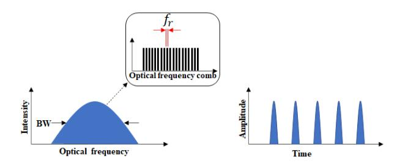

Fig. 1. Optical frequency comb.

This paper focuses on achieving frequency synchronization across multiple ISAC nodes to enhance localization accuracy. The objective is to generate an optical frequency comb with a 2.5 GHz spacing, which is then integrated with three distinct optical data streams through Wavelength Division Multiplexing (WDM). These combined signals are transmitted via Single-Mode Fiber (SMF) optical fiber. Upon reception, the signal undergoes Wavelength Division Demultiplexing (WDD) to separate each comb and its corresponding data [14], [15]. The signals are subsequently converted to electrical form, amplified, and processed using filtering and multiplexing techniques to align each comb signal with its respective data at frequencies of 2.5 GHz, 5 GHz, and 7.5 GHz z [16]. This paper introduces a proof of concept for clock and carriersynchronized wireless communication leveraging optical frequency combs, supported by both simulation and experimental findings.

## II. SYSTEM ARCHITECTURE

The objective of this system is to achieve frequency synchronization among different nodes in Integrated Sensing and Communications (ISAC) networks to enhance localization precision. By synchronizing frequencies, the system aims to improve the accuracy of positioning and sensing tasks, which is essential for applications such as autonomous navigation and asset tracking. Accurate synchronization minimizes timing errors, reduces signal interference, and ensures more reliable signal processing, ultimately leading to better localization performance. A simplified block diagram of the architecture as depicted in Fig. 2 is a modification of our recently reported architecture [17]. Here, four distinct signals, namely the comb signal and three data steams, can be individually modulated, combined and then sent, over a single mode fibre, to the RF units for modulation and then wireless transmission. The first signal, serving as a comb signal for system synchronization, is generated by using a continuous wave (CW) laser. This laser is used to seed an opto-electronic frequency comb generator. The generator includes a Mach-Zehnder modulator (MZM), which is driven by a 2.5 GHz RF signal to produce the required clock signal [18], [19].

The remaining three signals are baseband signals, which modulate different CW lasers operating at different wavelengths/frequencies, using Mach-Zehnder modulators (MZMs). The four signals, including the comb, are combined using Wavelength Division Multiplexer (WDM) and transmitted over a single-mode fibre (SMF).

Upon reaching the destination, the optical signals, which now contain both the comb tones and the data signals, are separated using Wavelength Division demultiplexer (WDDM). This process extracts each data signal corresponding to specific comb tones at one of the frequencies of 2.5 GHz, 5 GHz, and 7.5 GHz. The optical signals are then converted into electrical signals using photodiodes. These electrical signals are amplified, and the desired comb tones are separated using Band-Pass Filters (BPFs). Concurrently, the data is extracted using Low-Pass Filters (LPFs). The filtered baseband data is up-converted by combining it with each filtered comb line using a mixer. [20].

The signals are then transmitted via antennas operating at these specific frequencies. The block diagram in Fig. 2 clearly illustrates the fundamental structure of the optical-electrical system used for transmission via optical combs [21].

## III. SYSTEM SIMULATION

To validate our concept and effectively simulate the performance of the system, we utilize the VPI Photonic Design Suite. We have selected a variety of essential components, as listed in Table I. These components were chosen based on their relevance to the system's architecture and their ability to represent accurately the performance of key functions within the overall design. Using these building blocks, we can evaluate the interactions between optical devices and their electrical counterparts, identify potential optimization opportunities, and ensure that the system meets the desired specifications.

TABLE I COMPONENT LIST WITH VALUES

| NO | Components             | Value                         |
|----|------------------------|-------------------------------|
| 1  | Laser CW               | 193.1THz, 193.2THz            |
| 1  | Laser CW               | 193.3THz, 193.4THz            |
| 2  | Sine wave generator    | Amp 1V, Bias 1.3, Freq 2.5GHz |
| 3  | Pseudorandom data      | Random binary data            |
| 4  | Pulse generator        | NRZ (non-return-to-zero)      |
| 5  | Mach-Zehnder modulator | Extinction ratio 30dB         |
| 6  | Multiplexes            | WDM four optical channels     |
| 7  | Demultiplexes          | WDD four optical channels     |
| 8  | Photodiode             | multi mode optical signals    |

The system parameters utilized in this research are outlined in Table II. These parameters are essential for a comprehensive understanding of the configuration and performance of the optical components being tested.

The initial VPI Photonic simulate both the optical and electrical components of the system. The simulation includes three primary circuits: the comb generator, data1, data2, and data3 circuits. These circuits work together to generate key signals within the system. The comb generator circuit consists of a Mach-Zehnder Modulator (MZM) that takes two inputs: a

{2}------------------------------------------------

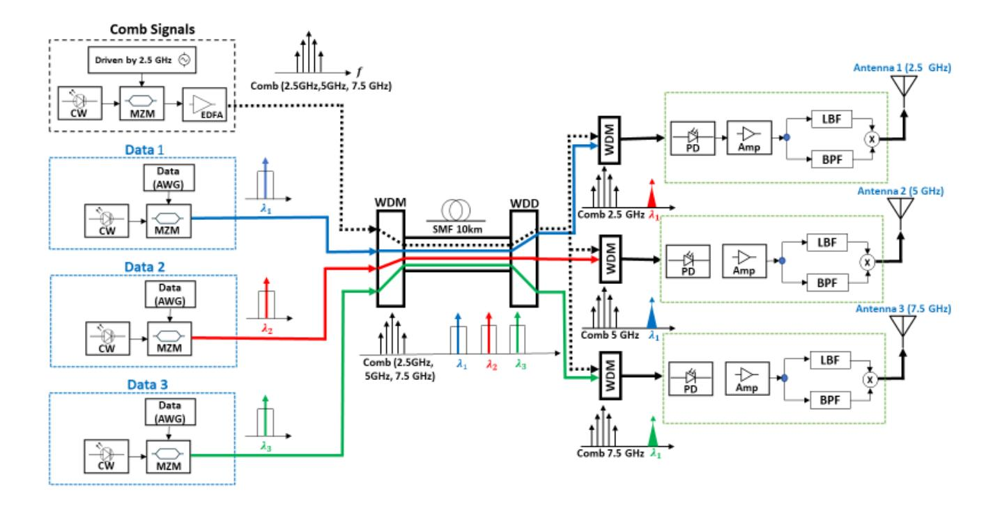

Fig. 2. Conceptual diagram of clock and carrier synchronized wireless communications with optical frequency comb.

TABLE II VPI SOFTWARE SYSTEM PARAMETERS

| NO | Parameters            | Value                            |
|----|-----------------------|----------------------------------|
| 1  | Symbol rate           | 1G                               |
| 2  | Number of Symbol      | 2048                             |
| 3  | Bits per symbol       | 1                                |
| 4  | Sample mode bandwidth | Symbol Rate × Samples Per Symbol |

continuous wave (CW) laser and a radio frequency (RF) signal. This combination generates an optical comb signal, where the channels are spaced by 2.5 GHz, functioning as the system's comb signal. The precise generation of this optical comb is critical for the synchronization of the various components in the system. The data circuits, consisting of data1, data2, and data3, each employ a Mach-Zehnder Modulator (MZM) with a continuous wave (CW) laser. These modulators are then driven by pseudorandom data sequences and processed by a non-return-to-zero (NRZ) coder, ensuring proper encoding for transmission. The pseudorandom sequences are essential for generating varied, realistic data patterns in the simulation. A crucial aspect of the MZM modulator's operation is its biasing. For comb generation, the modulator must be biased at its quadrature operating point to achieve optimal performance.

The initial phase of the simulation involves modeling the comb subsystem and obtaining electrical and optical results, as depicted in Fig. 3 and Fig. 4, respectively. The results reveal generated comb signals spaced 2.5 GHz apart, with 5 GHz and 7.5 GHz frequencies.

Once the generation of the comb signals is verified, we proceed with simulating the optical data across three channels.

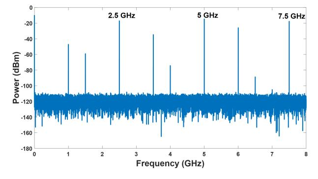

Fig. 3. Simulated Electrical comb signal.

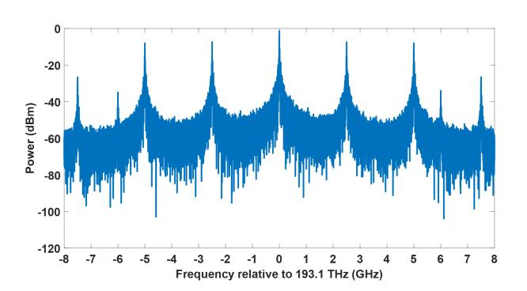

Fig. 4. Simulated Optical comb signals.

{3}------------------------------------------------

Fig. 5 shows the optical spectrum of one of these channels, and the remaining channels show identical patterns.

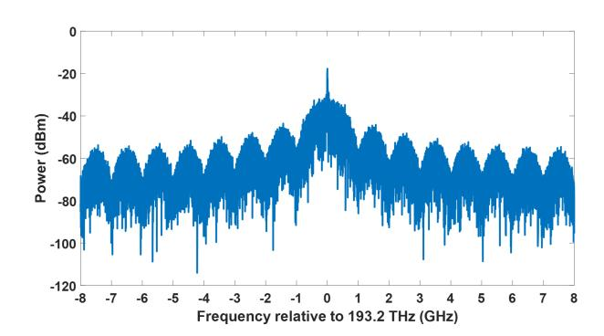

Fig. 5. Simulated Optical data signal.

The next stage of the simulation involves combining the optical comb and data using Wavelength Division Multiplexing (WDM), and transmitting them through a Single-Mode Fiber (SMF) optical fiber, as illustrated in Fig. 6.

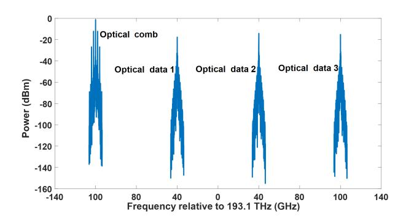

Fig. 6. Optical frequency comb and optical data 1,data 2 ,and data 3.

On the receiver side, the combined signal and data are demultiplexed, using the Wavelength Division De-multiplexing (WDD) component, into three separate channels: Data 1, Data 2, and Data 3. After that, the entire received optical comb is mixed individually with each received data stream, as illustrated in Fig 7, Fig. 8, and Fig. 9.

After obtaining the optical comb with each individual data component, we convert the signals from optical to electrical current using a photodiode. These electrical signals are then amplified. The composite signal, which contains the optical comb and the data, is subsequently separated into two distinct paths. One path is routed through a Band-Pass Filter (BPF) to filter the desired optical comb frequency, while the other path goes through a Low-Pass Filter (LPF) to extract the 1 GHz data. Finally, the extracted optical combs are mixed with their corresponding data signals: 2.5 GHz with Data 1, 5 GHz with Data 2, and 7.5 GHz with Data 3. These mixed signals are then transmitted using an antenna, operating at the chosen carrier frequency, as illustrated in Fig. 10, Fig. 11, and Fig. 12.

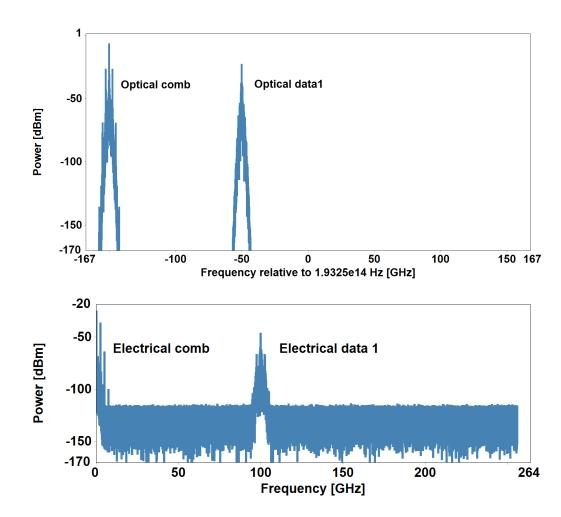

Fig. 7. Optical and electrical comb with data 1.

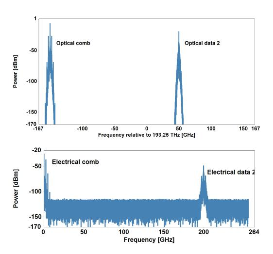

Fig. 8. Optical and electrical comb with data 2.

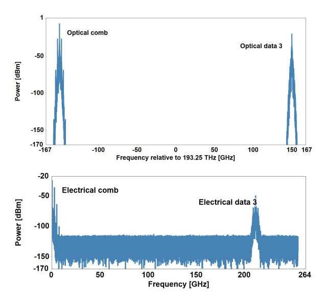

Fig. 9. Optical and electrical comb with data 3.

{4}------------------------------------------------

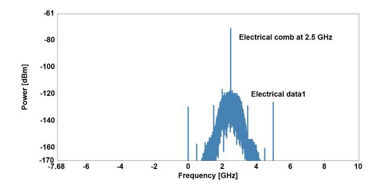

Fig. 10. Frequency comb at 2.5 GHz combine with Data 1.

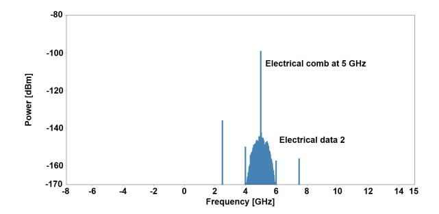

Fig. 11. Frequency comb at 5 GHZ combine with Data 2.

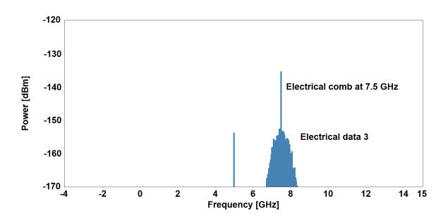

Fig. 12. Frequency comb at 7.5 GHz combine with Data 3.

## IV. EXPERIMENT

To verify the simulation, an experiment was conducted in our laboratory. The IDPHOTONIC CoBrite tunable narrow linewidth laser system served as the primary light source. This highly adaptable laser system has tunability across the C-band, making it an excellent and precise choice for various communication applications. The lasers were modulated using a pattern generator.In the experiment, the setup incorporated three Mach-Zehnder (MZ) modulators with 15 GHz bandwidth: one to generate comb signals and only two for optical data modulation. A 100 GHz Wavelength Division Multiplexer (WDM) was employed to combine the signals of different wavelengths, with its optical channels being spaced by 100GHz. The output signal was detected using a photodiode of 20 GHz bandwidth, to ensure accurate measurement of the modulated optical signal. Furthermore, a pattern generator was used to create and manage bit patterns, enabling the simulation of various transmission scenarios and the assessment of system performance under diverse conditions. Fig. 13 illustrates the experimental setup in the Communication Lab at University College London.

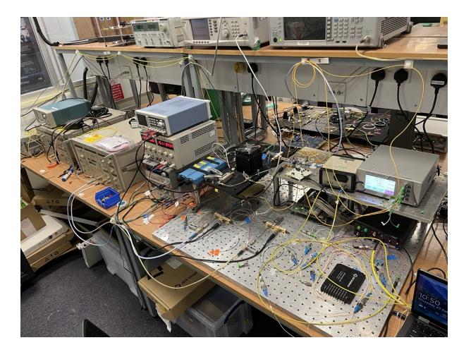

Fig. 13. Experiment set up at UCL communication lab.

The experimental results were obtained using optical and electrical spectrum analyzers to measure both the optical and electrical comb signals, as well as the data. As shown in Fig. 14, the optical spectrum analyzer successfully detected the optical frequency comb and two optical data channels, in good agreement with the simulation. Fig. 15 displays the signals after conversion from optical to electrical form, revealing comb signals at 2.5 GHz, 5 GHz, and 7.5 GHz, along with a 1 GHz data signal. These results can be processed using RF circuits to extract individual comb signals and combine each with its corresponding data channels. The measurements show good agreement with the simulation results, and efforts are ongoing to develop RF circuits to advance the experiment.

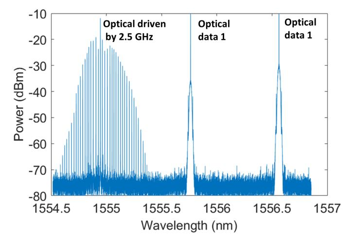

Fig. 14. Optical comb combine with data 1, data 2.

{5}------------------------------------------------

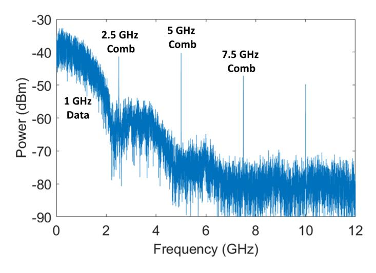

Fig. 15. Electrical comb combine with data.

#### V. CONCLUSION

This paper introduces an innovative approach for achieving precise clock and carrier synchronization in wireless communication systems, utilizing optical frequency combs. By leveraging Wavelength Division Multiplexing (WDM) to transmit multiple signals over optical fibers, the proposed method demonstrates how synchronized timing and frequency signals can be effectively distributed over extensive distances. This advancement significantly enhances the performance of modern wireless networks, including 5G and forthcoming 6G systems.

Through a combination of simulations and experimental validation, we establish the viability of optical frequency combs for synchronization. The results indicate successful generation, transmission, and reception of both clock and data signals. Additionally, the system's capacity to handle high-frequency bands, such as 2.5 GHz, 5 GHz, and 7.5 GHz, underscores its potential to support high-speed data transmission in nextgeneration communication networks.

The proposed methodology is vital for applications requiring ultra-precise synchronization. Future work will focus on further refining the system's performance and optimizing the RF circuits to selectively extract desired comb signals. These signals will be combined with data, transmitted, and received to establish communication links, ultimately allowing for the measurement of bit error rates and overall system noise performance.

#### VI. ACKNOWLEDGMENT

This work is funded in part by the Horizon Europe project 6G-Multiband Wireless and Optical Signalling 6G- MUSICAL [22]. Abdulrahman Alshehry PhD is funded by King Abdulaziz City for Science and Technology in KSA.

#### REFERENCES

[1] M. Shafi et al., "5G: A Tutorial Overview of Standards, Trials, Challenges, Deployment, and Practice," in IEEE Journal on Selected Areas in Communications, vol. 35, no. 6, pp. 1201-1221, June 2017, doi: 10.1109/JSAC.2017.2692307.

- [2] Zhou, Z., Wei, J., Luo, Y. et al. Communications with guaranteed bandwidth and low latency using frequency-referenced multiplexing. Nat Electron 6, 694–702 (2023). https://doi.org/10.1038/s41928-023-01022 x.
- [3] Mahmood, Aneeq, et al. "Clock synchronization over IEEE 802.11—A survey of methodologies and protocols." IEEE Transactions on Industrial Informatics 13.2 (2016): 907-922.
- [4] Nasir, Ali A., et al. "Timing and carrier synchronization in wireless communication systems: a survey and classification of research in the last 5 years." EURASIP Journal on Wireless Communications and Networking 2016 (2016): 1-38.
- [5] H. Li, L. Han, R. Duan and G. M. Garner, "Analysis of the Synchronization Requirements of 5g and Corresponding Solutions," in IEEE Communications Standards Magazine, vol. 1, no. 1, pp. 52-58, March 2017, doi: 10.1109/MCOMSTD.2017.1600768ST
- [6] Liu, An, et al. "A survey on fundamental limits of integrated sensing and communication." IEEE Communications Surveys and Tutorials 24.2 (2022): 994-1034.
- [7] Liu, Fan, et al. "Integrated sensing and communications: Toward dualfunctional wireless networks for 6G and beyond." IEEE journal on selected areas in communications 40.6 (2022): 1728-1767.
- [8] Mohammed Banafaa, Ibraheem Shayea, Jafri Din, Marwan Hadri Azmi, Abdulaziz Alashbi, Yousef Ibrahim Daradkeh, Abdulraqeb Alhammadi, 6G Mobile Communication Technology: Requirements, Targets, Applications, Challenges, Advantages, and Opportunities, Alexandria Engineering Journal,Volume 64,2023,ISSN 1110- 0168,doi.org/10.1016/j.aej.2022.08.017.
- [9] Z. Zhou, D. Nopchinda, M. -C. Lo, I. Darwazeh and Z. Liu, "Simultaneous Clock and RF Carrier Distribution for Beyond 5G Networks Using Optical Frequency Comb," 2022 European Conference on Optical Communication (ECOC), Basel, Switzerland, 2022, pp. 1-4.
- [10] J. Yao and J. Capmany, "Microwave photonics," Sci. China Inf. Sci., vol. 65, no. 12, pp. 4628–4641, 2022
- [11] R. Zhuang et al., "Electro-Optic Frequency Combs: Theory, Characteristics, and Applications," Laser Photonics Rev., vol. 2200353, no. 2, pp. 1–27, 2023
- [12] Maiman, Theodore H. "Stimulated optical radiation in ruby." (1960): 493-494.
- [13] T. W. Hansch, "Nobel lecture: Passion for precision," Rev. Mod. Phys., ¨ vol. 78, no. 4, pp. 1297–1309, 2006.
- [14] Ishio, Hideki, Junichiro Minowa, and Kiyoshi Nosu. "Review and status of wavelength-division-multiplexing technology and its application." Journal of lightwave technology 2.4 (1984): 448-463.
- [15] Leon-Saval, Sergio G., et al. "Multimode fiber devices with single-mode performance." Optics letters 30.19 (2005): 2545-2547.
- [16] Novak, Dalma, et al. "Radio-over-fiber technologies for emerging wireless systems." IEEE Journal of Quantum Electronics 52.1 (2015): 1-11.
- [17] Z. Zhou, D. Nopchinda, I. Darwazeh and Z. Liu, "Clock and Carrier Synchronized Multi-Band Wireless Communications Enabled by Frequency Comb Dissemination in Radio Access Networks," in Journal of Lightwave Technology, vol. 43, no. 2, pp. 419-428, 15 Jan.15, 2025, doi: 10.1109/JLT.2024.3455094
- [18] D. Nopchinda, Z. Zhou, Z. Liu and I. Darwazeh, "Multiband Comb-Enabled mm-Wave Transmission," in IEEE Transactions on Microwave Theory and Techniques, vol. 72, no. 1, pp. 787-796, Jan. 2024, doi: 10.1109/TMTT.2023.3326511.
- [19] Z. Zhou, D. Nopchinda, I. Darwazeh and Z. Liu, "Synchronising Clock and Carrier Frequencies with Low and Coherent Phase Noise for 6G," 2023 IEEE Radio and Wireless Symposium (RWS), Las Vegas, NV, USA, 2023, pp. 4-6, doi: 10.1109/RWS55624.2023.10046337.
- [20] Haffner, Christian, et al. "All-plasmonic Mach–Zehnder modulator enabling optical high-speed communication at the microscale." Nature Photonics 9.8 (2015): 525-528.
- [21] A. Alshehry and I. Darwazeh, "Harmonic Suppression for Electro-Optic Communication Systems," 2024 IEEE 30th International Conference on Telecommunications (ICT), Amman, Jordan, 2024, pp. 1-5, doi: 10.1109/ICT62760.2024.10606130.
- [22] https://6gmusical.eu/.