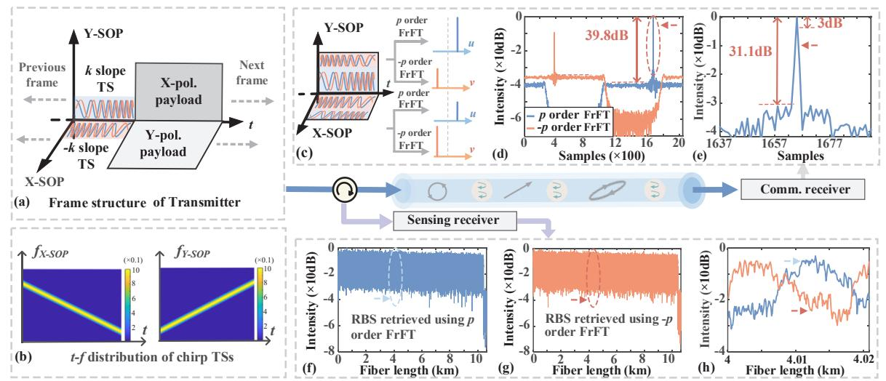
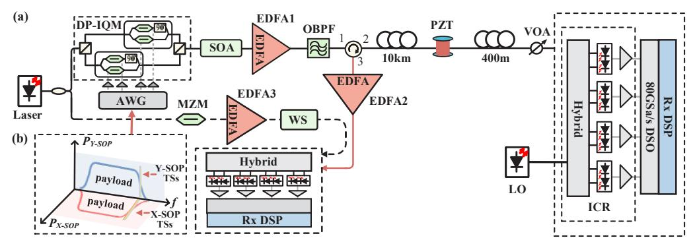
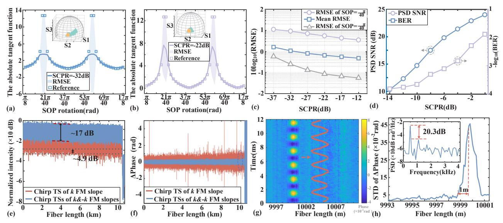

{0}------------------------------------------------

WC3-6 OECC/PSC 2025

# Endogenous ISAC Enabled Interference Fading Free Sensing via Telecom Training Sequence

Yue Wang, 1Li Wang, 1,\* Zhonghong Lin, 2 Chao Lu, 1 Ming Tang, 2 and Changyuan Yu1,\*

1 Department of Electrical and Electronic Engineering, The Hong Kong Polytechnic University, Hong Kong, China

2 Next Generation Internet Access National Engineering Lab, Huazhong University of Science and Technology, Wuhan, China Author e-mail address: li2wang@polyu.edu.hk; changyuan.yu@polyu.edu.hk

Abstract: Originally designed for polarization rotation estimation, the telecom training sequences have been repurposed to achieve interference-fading free sensing with 1m spatial resolution, experimentally demonstrating endogenous ISAC with 50 GBaud 16-QAM transmission over 10.4 km fiber.

Keywords: Fiber sensing application incl. environmental monitoring using optical network; Distributed fiber optical sensing, fibers and fiber devices for sensing

#### I. INTRODUCTION

Coherent optical communication approaching to single-wavelength 400G for backbone networks is now sinking in data center interconnects and access networks [1]. The widespread deployment of coherent systems and telecom fibers facilitates the potential applications such as distributed acoustic sensor (DAS) to efficiently monitor health of the network infrastructure, thereby achieving integrated sensing and communication (ISAC). By employing frequency multiplexing between telecom payload and sensing probe, DAS has been demonstrated over a bidirectional data center interconnect using self-homodyne detection [2, 3]. It has also been proposed that phase-sensitive optical time domain reflectometry ( $\varphi$ -OTDR) can be implemented through space division multiplexing in seven-core fiber cable [4]. However, in these methods, sensing and communication operate independently, sharing only the fiber resource. To enable cooperative function of sensing and communication, the optical pilot, carrier or information-bearing signal initially intended for communication can be repurposed for sensing to achieve endogenous ISAC [5-8]. There have been proposals to achieve ISAC through adaptive equalization or phase recovery of digital signal processing (DSP) [5, 6]. Nevertheless, the forward transmission-based sensing scheme imposes fundamental limitations on the localization accuracy and the handling of multiple vibration sources. An alternative approach involves proposing multi-frequency telecom pilots designed for synchronization as sensing probes to achieve enhanced frequency response [8]. However, the pilots need three spectral gaps to be located in, which is preferable in digital subcarrier multiplexing.

In this paper, we propose using telecom training sequences (TSs) originally designed for polarization rotation estimation to achieve interference fading-free DAS. The proposed chirp TSs characterized by identical spectrums but opposite frequency modulation (FM) slopes are deployed in dual polarizations. Through fractional Fourier transform (FrFT) processing, the chirp TSs are orthogonal to each other and can be distinguished in matched fraction domain, thereby realizing SOP rotation estimation for forward communication. For backward sensing, the Rayleigh backscattering (RBS) signals of different chirp TSs can be compressed and extracted via matched FrFT. Consequently, the RBS signals with distinct spectrum component can be used to suppress interference fading due to frequency selectivity of interference fluctuation. Endogenous ISAC is experimentally verified through 50GBaud 16-QAM transmission co-existing with vibration sensing at 1m spatial resolution, achieving the lowest intensity of synthesized trace 4.9 dB above noise floor.

#### II. OPERATING PRINCIPLES

To estimate state of polarization (SOP) rotation and achieve distributed sensing simultaneously, dual polarization (DP) chirp TSs (or sensing probes) are inserted prior to the telecom payload, as illustrated in Fig. 1(a). The initial frequency of X-SOP signal corresponds to the cut-off frequency of Y-SOP signal and vice versa, indicating that they have identical spectrum but opposite FM slopes. Fig. 1(b) shows time-frequency distribution of DP chirp TSs. The chirp TSs propagating in fiber is affected by SOP evolution, leading to overlap with each other. The received chirp TSs can be expressed as:

$$\begin{bmatrix} R_{x} \\ R_{y} \end{bmatrix} = \begin{bmatrix} S_{x} \cdot \cos\theta - S_{y} \cdot \sin\theta e^{-j\gamma} \\ S_{x} \cdot \sin\theta e^{j\gamma} + S_{y} \cdot \cos\theta \end{bmatrix}$$
(1)

where  $\gamma$  denotes the phase retarder, and  $\theta$  corresponds to the SOP rotation.  $S_x$  and  $S_y$  represent chirp TS deployed in X-SOP and Y-SOP, respectively. Despite temporal and spectral overlap,  $S_x$  or  $S_y$  can still be distinguished and extracted due to opposite FM slopes. For TS with FM slope k, the optimal fraction domain is determined under a rotation order p of FrFT according to the relationship of k=-cot( $\pi p/2$ ) [9]. In this optimal fraction domain, the time-frequency distribution of chirp squeezes to its minimum and the energy of chirp signal can be gathered to the utmost extent. When performing p

{1}------------------------------------------------

Fig. 1 (a) Frame structure. (b) *t-f* distribution of chirp TSs. (c) The converged peaks occur after matched FrFTs. (d) converged peaks after -cotα rotation FrFT. (e) zoom-in view of peak. (f) and (g) Intensity trace obtained using matched FrFTs (h) zoom-in view of intensity traces.

order FrFT, only converged peak of the chirp with k FM slope appears, but it does not generate converged peak for chirp TS with -k FM slope since chirp TSs with opposite FM slopes are orthogonal to each other in fractional domain. Fig. 1(c) demonstrates that the received DP chirp TSs are distinctly extracted through matched FrFT operations. To investigate the extraction performance of FrFT, the received Y-SOP undergoes p and -p order FrFT, which is shown in Fig. 1(d). The converged peak colored in blue (orange) appears in matched fraction domain by applying p (-p) order FrFT. Despite the impact of the -k FM slope chirp TS serving as background noise, the ratio of peaks to noise floor still achieves 39.8dB. For received X-SOP, FrFT operations with p and -p order are applied, resulting in emergence of converged peaks of  $X_p$  and  $X_{-p}$  respectively. Likewise, the converged peaks after operating p and -p order FrFTs on received Y-SOP are defined as  $Y_p$  and  $Y_{-p}$  respectively. Therefore, the SOP rotation  $\theta$ , which determines energy distribution between  $Y_p$  ( $Y_{-p}$ ) and  $Y_{-p}$  can be achieved by:  $\tan\theta \approx 0.5 \cdot [(Y_p/X_p)^{1/2} + (X_{-p}/Y_{-p})^{1/2}]$ . Due to space limitations, the derivation of the SOP rotation in the fractional domain is discussed in detail in our previous work [10] rather than this paper.

Owing to identical spectrum but different FM slopes of chirp TSs, there exist two RBS light-waves with distinct frequencies at each time, except when two RBS light-waves coincide. The spectrum component at same time for chirp TSs or probes can be regarded as having independent intensity fluctuation since the impulse response with homodyne detection of fiber is statistically independent on each frequency. To extract the RBS of chirp TS, the matched FrFT is applied. It is noteworthy that the FrFT can converge the chirp TS, which means that it can compress the amplitude envelope of the sensing probe. According to zoom-in figure Fig. 1(e), the peak attained after the matched FrFT exhibits high performance with high peak to side lobe ratio (PSLR) approximate to 31.1 dB. The ultra-narrow full width of peak for 3 dB is 1 sample. Fig. 1(f) shows the RBS signals from different received SOPs are aggregated utilizing the rotated vector sum method. The synthesized intensity trace depicted in blue (orange) color is recovered using p (-p) FrFT operations on dual SOPs of receiver. It is observed that many locations have very weak optical intensity due to interference fading. The zoom-in view of the traces from 4000m to 4020m are also investigated. The RBS traces obtained from different FM slopes vary, and the locations where interference fading occurs are also distinct. Therefore, the RBS light-waves from TSs originally designed for SOP rotation estimation can be used for eliminating interference fading.

#### III. EXPERIMENTAL RESULTS

To validate endogenous ISAC using DP chirp TSs, we implemented 50-GBaud 16QAM transmission system, as illustrated in Fig. 2 (a). In transmitter, a 1550.12-nm narrow-linewidth laser (NKT E15, ~100 Hz) is split divided into two branches. One branch serves as local oscillator for self-homodyne sensing detection, while the other is modulated by electrical signals generated via 90GSa/s arbitrary waveform generator (AWG, Keysight M8196A). The sweep bandwidth and probe width of chirp TSs are 200MHz and 182ns, respectively. The telecom payload shares bandwidth with chirp TSs through inserting them at spectrum edge to minimize the influence, which is shown in Fig. 2(b). A semiconductor optical amplifier (SOA) is utilized to cut off the ISAC signal at the period (120μs) of round trip time to avoid RBS lightwave superposition due to AWG memory constraints. After amplified and filtered, the ISAC signal is injected into two fibers (10km and 400m) which are connected through piezoelectric transducer (PZT). The fiber with length of 1m is wrapped on the PZT. At the coherent communication side, the signal for ISAC is detected by an coherent receiver which consists of hybrid and 43GHz balanced photodiode (BPD). After coherent detection, the received analog signal is digitized by a digital storage oscilloscope (DSO, Keysight DSAZ594A) with a sampling rate of 80 GSa/s per channel. Simultaneously, the sensing path employs an integrated coherent receiver (ICR, Neophotonic class 40) to acquire RBS signals, sampled at 1 GSa/s via DSO and processed offline in MATLAB.

{2}------------------------------------------------

Fig. 2(a) Experiment setup, VOA: variable optical attenuator. OBPF: optical bandpass filter. WS: wave-shaper. (b) data frame in frequency domain.

To investigate power allocation between chirp TSs and telecom payload sharing the transmitter, the sensing-tocommunication power ratio (SCPR) is defined. Fixing optical power launched into the fiber to 3 dBm, the SCPR is adjusted to explore the performance of SOP rotation estimation, which is shown in Fig. 3(a) and (b). The yellow circular and green triangle dots denote reference and measured SOPs. It can be observed that RMSEs degrade at SOP rotation corresponding to  $(2n+1)\pi/2$  due to incomplete energy transfer between chirp TSs of orthogonal SOPs. The mean root mean square error (RMSE) corresponding to SCPR from -37 to -12 dB improves from 1.62 to 0.48 owing to more powerful convergence peak, as shown in Fig. 3(c). Fig. 3(d) demonstrates the improvement of signal to noise ratio (SNR) of vibration power spectrum density (PSD) alongside bit rate ratio (BER) degradation with rising SCPR. The SCPR is selected as -6 dB to balance the effect of quantization noise and RBS intensity. To compress the RBS signal while reduce the measured noise, the FrFT combined with moving rotated vector-average (MRVA) is used [11, 12]. The sliding times and the differential distance are selected as 3 and 2 sampling points, resulting in an approximate final spatial resolution of 1 m. Fig. 3(e) compares RBS intensity traces retrieved using single chirp TSs (exceeding 38 dB fluctuations) versus dual chirp TSs (about 17 dB intensity fluctuation). Superior to result using only one chirp TSs, the lowest optical intensity of trace obtained by dual TSs is 4.9 dB higher than the noise floor, achieving interference fading free performance. Fig. 3(f) shows the demodulated differential phases obtained using single and dual chirp TSs, and contains 100 differential phase traces. As shown in Fig. 3(g) and (h), 500 Hz sinusoidal vibration is successfully demodulated with a resolution of 1 m, and the inset of (h) indicates that the SNR of demodulated vibration in PSD is about 20.3 dB.

Fig. 3. The SOP estimation performance of when SCPR=-32dB. (b) The SOP estimation performance when SCPR=-22dB. (c) RMSE of SOP estimation versus SCPR. (d) BER of comm. and PSD SNR of sensing performance versus SCPR. (e) Intensity trace obtained using single and dual FrFT orders. (f) The corresponding differential phases retrieved. (g) Temporal evolution of the phase. (h) Phase STD distribution along sensing fiber.

## IV. CONCLUSIONS

We demonstrate an endogenous ISAC system leveraging the chirp TSs originally designed for SOP rotation estimation to mitigate interference fading. Chirp TSs functioning as sensing probes coexist with telecom signals in the transmitter. By using matched FrFT, the RBS signals with independent fluctuations are extracted and complement to achieve fading free sensing. The Experimental validation shows 50 GBaud 16-QAM transmission and vibration sensing with 1m resolution over 10.4km fiber, reducing intensity fluctuations over 38 dB to 17 dB.

{3}------------------------------------------------

### **REFERENCES**

- [1] M. Nowell, E. Roberts. 400G, 800G, and Terabit Pluggable Optics: What You Need to Know. USA: Cisco Systems, Inc., 2024.
- [2] E. Ip, Y. K. Huang, M.-F. Huang, F. Yaman, G. Wellbrock, T. Xia, T. Wang, K. Asahi, and Y. Aono, "DAS over 1,007-km hybrid link with 10-Tb/s DP-16QAM co-propagation using frequency-diverse chirped pulses," J. Lightwave Technol. vol.41, no. 4, pp. 1077–1086, 2023.
- [3] M. F. Huang, P. Ji, T. Wang, Y. Aono, M. Salemi, Y. Chen, J. Zhao, T. J. Xia, G. A. Wellbrock, Y.-K. Huang, G. Milione, and E. Ip, "First field trial of distributed fiber optical sensing and high-speed communication over an operational telecom network," J. Lightwave Technol. vol. 38, no. 1, pp. 75–81, 2020.
- [4] Y. Chen, Y. Xiao, S. Chen, F. Xie, Z. Liu, D. Wang, X. Yi, C. Lu, and Z. Li, "Field Trials of Communication and Sensing System in Space Division Multiplexing Optical Fiber Cable," IEEE Commun. Mag. vol. 61, no. 8, pp. 182–188, 2023.
- [5] Z. Zhan, M. Cantono, V. Kamalov, A. Mecozzi, R. Müller, S. Yin, and J. C. Castellanos, "Optical polarization–based seismic and water wave sensing on transoceanic cables," Science 371, vol. 6532, pp. 931–936, 2021.
- [6] E. Ip, Y.-K. Huang, G. Wellbrock, T. Xia, M.-F. Huang, T. Wang, and Y. Aono, "Vibration Detection and Localization Using Modified Digital Coherent Telecom Transponders," J. Lightwave Technol. vol. 40, no. 5, pp. 1472–1482, 2022.
- [7] H. He, L. Jiang, Y. Pan, A. Yi, X. Zou, W. Pan, A. E. Willner, X. Fan, Z. He, and L. Yan, "Integrated sensing and communication in an optical fibre," Light Sci. Appl. Vol. 12, no. 1, 2023.
- [8] Z. Hu, M. Zhang, Y. Li, J. Chen, W. Li, Y. Xiong, L. Zhao, C. Zhao, and Ming Tang. "Enabling endogenous distributed acoustic sensing in a digital subcarrier coherent transmission system," Opt. Lett., vol. 49, no. 11, pp.3166-3169, 2024.
- [9] H. Zhou, X. Li, M. Tang, et al., "Joint timing/frequency offset estimation and correction based on FrFT encoded training symbols for PDM CO-OFDM systems," Opt. Express, vol. 24, no. 25, pp. 28256–28269, 2016.
- [10] L. Wang, Y. Wang, J. Wang, H. He, L. Lu, C. Yu, M. Tang. "Ultra-fast SOP rotation tracking and its enabled feedforward adaptive equalization based on superimposed chirp pilot,". Opt. Express, vol. 33, no. 4, pp. 7110-7125, 2025.
- [11] H. Qian, B. Luo, H. He, Y. Zhou, X. Zou, W. Pan and L. Yan, "Fading free *φ*-OTDR evaluation based on the statistical analysis of phase hopping," Applied Opt., vol. 61, no. 23, pp. 6729-6735, 2022.
- [12] L. Wang, J. Wang, L. Lu, Y. Wang, Z. Lin, C. Yu, and M. Tang, "Interference Fading Free φ-OTDR Using Dual Polarization Multi-subcarrier LFM Signals with MIMO in Fractional Domain" J. Lightwave Technol. vol.42, no. 18, pp. 6501–6510, 2024.