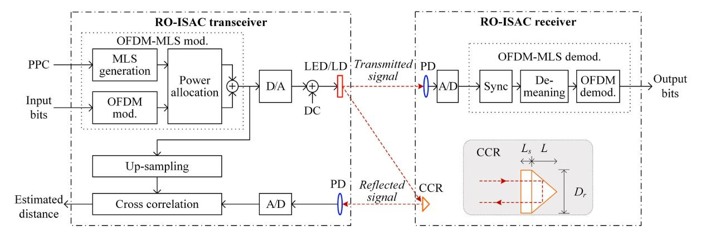
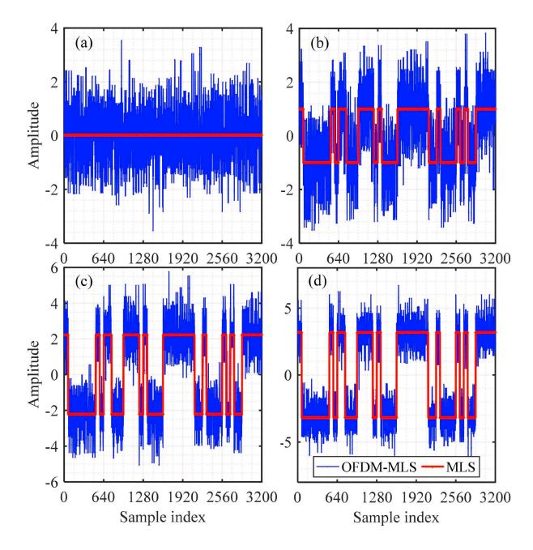
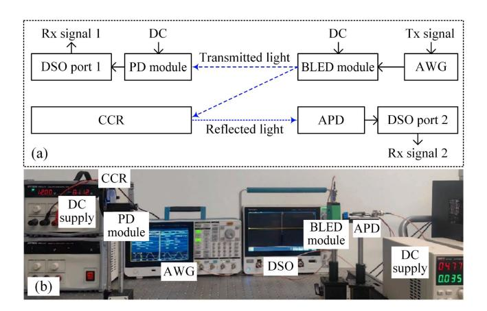
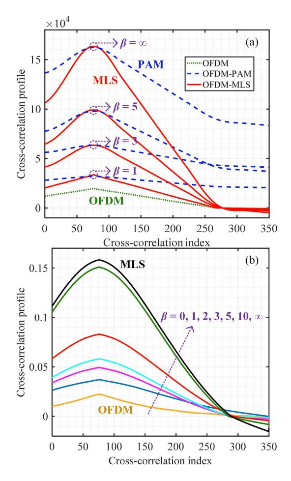
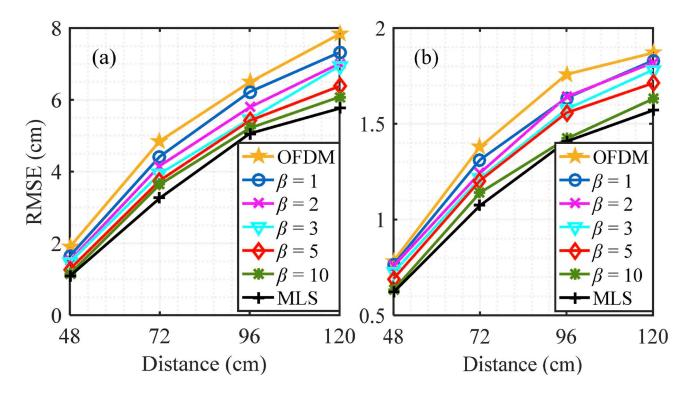
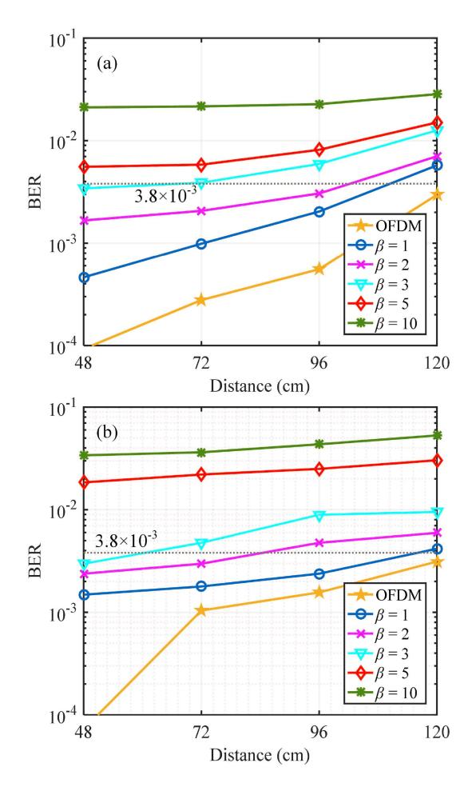
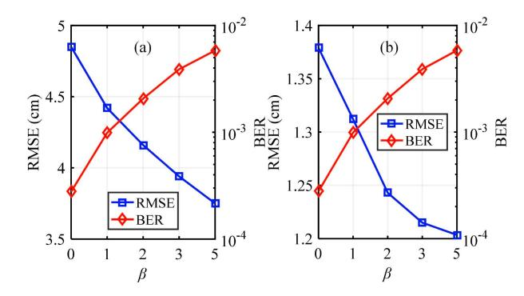

# Flexible Waveform Design for RO-ISAC Based on OFDM-Embedded Maximum Length Sequence

Jia Du, Chen Chen®, Senior Member, IEEE, Zhihong Zeng®, Dengke Wang, Jia Ye®, Member, IEEE, Jian Song®, Fellow, IEEE, and Harald Haas®, Fellow, IEEE

Abstract-Retroreflective optical integrated sensing and communication (RO-ISAC) has revealed great potential lately, due to its advantages of enhanced light reflection, large transmission capacity and high sensing accuracy. Since the overall performance of RO-ISAC systems largely depends on the integrated waveform design, in this letter, we propose a flexible waveform design based on orthogonal frequency division multiplexing-embedded maximum length sequence (OFDM-MLS) for RO-ISAC systems. The proposed OFDM-MLS waveform can benefit from both the superior sensing performance of MLS and the excellent communication performance of OFDM. Furthermore, flexible communication and sensing performance trade-off can be efficiently achieved by adaptively adjusting the power allocation ratio between the MLS signal and the OFDM signal in the flexible OFDM-MLS waveform design. Experimental results successfully verify the feasibility and superiority of the proposed OFDM-MLS waveform in RO-ISAC systems.

Index Terms—Retroreflective optical integrated sensing and communication, waveform design, orthogonal frequency division multiplexing, maximum length sequence.

#### I. Introduction

S A KEY enabling technology for the sixth-generation (6G) wireless systems, integrated sensing and communication (ISAC) has received extensive attention in recent years. Differing from conventional communication systems, ISAC systems can fulfill the dual-function of communication and sensing, which are capable of establishing intelligent connectivities in the 6G networks [1]. Although radio-frequency (RF)-based ISAC systems have been widely reported in the literature, their communication and sensing performance is significantly limited due to the shortage of available spectrum resources. In contrast, lightwave-based optical wireless ISAC

Received 16 July 2025; accepted 24 July 2025. Date of publication 28 July 2025; date of current version 9 October 2025. This work was supported in part by the National Natural Science Foundation of China under Grant 62271091, and in part by the Fundamental Research Funds for the Central Universities under Grant 2024CDJXY020. The associate editor coordinating the review of this article and approving it for publication was H. Guo. (Corresponding author: Chen Chen.)

Jia Du, Chen Chen, Zhihong Zeng, and Dengke Wang are with the School of Microelectronics and Communication Engineering, Chongqing University, Chongqing 400044, China (e-mail: 202312131164@stu.cqu.edu.cn; c.chen@cqu.edu.cn; zhihong.zeng@cqu.edu.cn; dengke.wang@cqu.edu.cn).

Jia Ye is with the School of Electrical Engineering, Chongqing University, Chongqing 400044, China (e-mail: jia.ye@cqu.edu.cn).

Jian Song is with the Shenzhen International Graduate School, Tsinghua University, Shenzhen 518055, China (e-mail: jsong@tsinghua.edu.cn).

Harald Haas is with the Department of Engineering, Electrical Engineering Division, Cambridge University, CB3 0FA Cambridge, U.K. (e-mail: huh21@cam.ac.uk).

Digital Object Identifier 10.1109/LWC.2025.3593253

systems exploiting infrared (IR), visible light (VL) or ultraviolet (UV) spectrum outperform existing RF-based ISAC systems in terms of larger transmission capacity and higher sensing accuracy [2]. More specifically, retroreflective optical ISAC (RO-ISAC) has been proposed recently by equipping the target with a retroreflective module, e.g., corner cube reflector (CCR), to substantially enhance light reflection [3]. Compared with traditional optical ISAC systems relying on active sensing, efficient passive sensing can be carried out in RO-ISAC systems, which not only avoids the consumption of modulation bandwidth for sensing but also adds no additional implementation complexity at the target side [4].

In RO-ISAC systems, the overall communication and sensing performance largely depends on the adopted ISAC waveform design. So far, a few waveform designs have already been proposed for RO-ISAC systems. On the one hand, pulse-based waveforms such as pulse sequence sensing and pulse position modulation (PSS-PPM) waveform and integrated pulse amplitude modulation (PAM) waveform have been proposed in [5], [6]. On the other hand, various orthogonal frequency division multiplexing (OFDM)-based waveforms have been further introduced in [7], [8], [9], [10]. In general, pulse-based waveforms are more advantageous for sensing, while OFDM-based waveforms are more beneficial for communication. Hence, single pulse-based or OFDMbased waveforms are not satisfactory enough to meet the general requirements for both communication and sensing. Lately, a hybrid waveform design consisting of both PAM and OFDM samples has been proposed in our previous work [11], which can provide certain performance tradeoff between communication and sensing. Nevertheless, the sensing capability of PAM waveform is relatively weak as PAM is still a communication-centric waveform.

Differing from communication-centric waveforms such as PAM and OFDM, sensing-centric waveforms usually need to have excellent cross-correlation performance. Specifically, various codes or sequences have been widely applied in related scenarios including zero cross-correlation code, spectral amplitude code, maximum length sequence (MLS) and so on [12], [13], [14]. Among them, MLS, which is also known as m-sequence, has been widely applied in various sensing systems due to its excellent correlation properties [15]. In this letter, we for the first time propose a flexible waveform design based on OFDM-embedded MLS (OFDM-MLS) for RO-ISAC systems. By embedding OFDM samples into a MLS sequence, the proposed flexible OFDM-MLS waveform design can efficiently balance the performance of both communication

Fig. 1. Schematic diagram of a RO-ISAC system using the proposed OFDM-MLS waveform. mod.: modulation, demod.: demodulation.

and sensing in RO-ISAC systems. Experiments are conducted to evaluate the performance of the RO-ISAC system using the proposed OFDM-MLS waveform.

#### II. PRINCIPLE

In this section, we first introduce the basic principle of a RO-ISAC system and then the proposed flexible OFDM-MLS waveform design is described in detail.

#### A. Principle of RO-ISAC

Fig. 1 depicts the schematic diagram of a RO-ISAC system using the proposed OFDM-MLS waveform. At the RO-ISAC transceiver, the OFDM-MLS modulation is first performed to generate a desired OFDM-MLS signal, which is then converted into an analog signal via digital-to-analog (D/A) conversion. After adding a direct current (DC) bias, the resultant real-valued non-negative OFDM-MLS signal is used to modulate the intensity of the light emitted by the LED or LD transmitter. At the RO-ISAC receiver, a photo-detector (PD) is employed to capture the light and convert it into an electrical signal. The detected electrical signal is further converted into a digital signal via analog-to-digital (A/D) conversion and OFDM-MLS demodulation is carried out subsequently to obtain the output bits. The detailed procedures of OFDM-MLS modulation and demodulation will be discussed in the next subsection.

Moreover, a corner cube reflector (CCR) is adopted at the RO-ISAC receiver to reflect the light back to the RO-ISAC transceiver for ranging. The inset in Fig. 1 shows the diagram of CCR, where  $L_s$ , L, and  $D_r$  denote the recessed length, the length, and the diameter of the CCR, respectively [3]. At the RO-ISAC transceiver, a PD is used to detect the reflected light and the obtained electrical signal is then converted into a digital signal through A/D conversion. In order to estimate the distance between the RO-ISAC transceiver and the RO-ISAC receiver, cross-correlation between the reflected OFDM-MLS signal and the up-sampled OFDM-MLS signal is calculated to realize ranging. Letting x(n) and y(n) respectively denote the up-sampled time-domain samples of the original OFDM-MLS signal and the time-domain samples of the reflected OFDM-MLS signal, the maximum likelihood estimation of the time of flight (ToF) can be expressed by

$$\hat{t} = \arg\max_{t} \sum_{n=0}^{W-1} y(n)x(n-t),$$
 (1)

where W is the length of the time-domain window for cross-correlation calculation. Consequently, the distance d between the RO-ISAC transceiver and the RO-ISAC receiver is given by  $\hat{d} = c\hat{t}/2$ , where c is the speed of light. Assuming the A/D sampling rate at the RO-ISAC transceiver is  $f_s$ , the ranging resolution is given by  $\Delta d = c/2f_s$ .

#### B. Flexible OFDM-MLS Waveform Design

In order to achieve flexible performance trade-off between communication and sensing, an integrated OFDM-MLS waveform is designed for the RO-ISAC system. In the OFDM-MLS modulator at the RO-ISAC transceiver, as shown in Fig. 1, the input bits are modulated into a real-valued bipolar OFDM signal via OFDM modulation, while a bipolar MLS signal with length  $2^n-1$  is generated by a linear feedback shift-register according to the primitive polynomial coefficients (PPC) with degree n [12]. After that, power allocation is performed between the OFDM signal and the MLS signal, and the desired OFDM-MLS signal is obtained by combining the resultant OFDM and MLS signals. Let  $\beta$  denote the power allocation ratio between the MLS signal and the OFDM signal, i.e.,

$$\beta = \frac{P_{MLS}}{P_{OFDM}},\tag{2}$$

where  $P_{MLS}$  and  $P_{OFDM}$  are the average electrical powers of the MLS signal and the OFDM signal, respectively. Moreover, the length of the OFDM signal should be consistent with the length of the MLS signal to realize successful combination after power allocation. Here, we assume that each MLS pulse has the same length as one OFDM symbol during the OFDM-MLS modulation. In the OFDM-MLS demodulator at the RO-ISAC receiver, time synchronization is first performed by using the transmitted training overhead. After that, time-domain de-meaning can be conducted to remove the mean value of each OFDM frame in the OFDM-MLS signal, and the resultant bipolar OFDM signal is finally demodulated.

Fig. 2 illustrates the designed OFDM-MLS waveforms with different  $\beta$  values, where both the length of the MLS pulse

Fig. 2. Illustration of OFDM-MLS waveforms with (a)  $\beta=0$ , (b)  $\beta=1$ , (c)  $\beta=5$ , and (d)  $\beta=10$ .

and the length of the OFDM symbol are set to 64. As we can see, the OFDM-MLS signal becomes the pure OFDM signal when  $\beta = 0$ . With the increase of the power allocation ratio  $\beta$ , more power is allocated to the MLS signal and the resultant OFDM-MLS signal becomes much more like the MLS signal. The OFDM-MLS signal will become the pure MLS signal when  $\beta = \infty$ . For the OFDM-MLS signal, a smaller  $\beta$  value indicates a better communication performance while a larger  $\beta$  value suggests a better sensing performance. Hence, the proposed flexible OFDM-MLS waveform design is able to realize a gradual transformation from one extreme case of pure OFDM to another extreme case of pure MLS by adaptively adjusting the  $\beta$  value. Therefore, flexible performance tradeoff between communication and sensing can be efficiently achieved in the RO-ISAC system via adaptive power allocation during the OFDM-MLS modulation.

#### III. RESULTS AND DISCUSSION

In this section, we conduct hardware experiments to evaluate the performance of the RO-ISAC system employing the proposed OFDM-MLS waveform. Fig. 3(a) depicts the experimental setup of the RO-ISAC system, where the transmitted OFDM-MLS signal is first generated offline by MATLAB and then loaded into an arbitrary waveform generator (AWG, Tektronix AFG31102) with a sampling rate of 250 MSa/s. The AWG output signal is further used to drive a blue LED (BLED) module (HCCLS2021MOD01-TX) with a DC bias voltage of 12 V. After free-space transmission, the optical signal is first captured by a PD module (HCCLS2021MOD01-RX) with a DC bias voltage of 12 V and the detected signal is then recorded by a digital storage oscilloscope (DSO, LeCroy Wavesurfer432) with a sampling rate of 2.5 GSa/s for OFDM-MLS demodulation. For more details about the BLED and PD modules, please refer to our previous work [16].

Fig. 3. Experimental setup of the RO-ISAC system: (a) hardware setup and (b) photo of hardware testbed.

The optical signal is also reflected back by using a CCR and the reflected optical signal is detected by an avalanche photo-diode (APD, Hamamatsu C12702-12). The resultant OFDM-MLS signal is recorded by the DSO with a sampling rates of 2.5 GSa/s for further offline ranging procedures. For communication, the inverse fast Fourier transform (IFFT) size in OFDM modulation is assumed to be  $N_{\rm IFFT} = 64$  and a total of  $N_{\text{data}}$  subcarriers are used to carry M-ary constellation symbols. Hence, the bandwidth of the OFDM signal is given by  $250N_{\rm data}/N_{\rm IFFT}$  MHz and the corresponding data rate is  $\log_2 M \times 250 N_{\rm data}/N_{\rm IFFT}$  Mbps. To realize efficient time synchronization at the RO-ISAC receiver, an upsampled 4th degree MLS with an upsampling ratio of 10 and a length of 150 is adopted as the training overhead in the experiments. For ranging, the up-sampling ratio is 10 and the ranging resolution is 6 cm. The experiments are conducted for two types of MLS signals with PPC degrees of n = 4 and 8. The photo of the hardware testbed is shown in Fig. 3(b). In addition, OFDMembedded PAM (OFDM-PAM) is considered as a benchmark waveform for performance comparison.

Fig. 4(a) compares the cross-correlation performance of transmitted OFDM-PAM and OFDM-MLS signals with different  $\beta$  values. As can be seen, both OFDM-PAM and OFDM-MLS signals have the same cross-correlation peak. However, the OFDM-MLS signal has a much reduced crosscorrelation sidelobe than the OFDM-PAM signal, which suggests that the OFDM-MLS signal can achieve superior cross-correlation performance than the OFDM-PAM signal under low signal-to-noise ratio (SNR) scenarios. Fig. 4(b) shows the cross-correlation performance of OFDM-MLS with different  $\beta$  values for n = 4 at a distance of 72 cm. As we can observe, MLS has the highest cross-correlation peak while OFDM has the lowest cross-correlation peak. Moreover, the larger the  $\beta$  value, the higher the cross-correlation peak. Hence, a much superior sensing performance can be achieved by using a larger  $\beta$  value.

Figs. 5(a) and (b) show the ranging root mean square error (RMSE) versus distance for different power allocation ratio  $\beta$  values with PPC degrees of n=4 and 8, respectively. It can be seen that the ranging RMSE gradually increases with the increase of transmission distance for both n=4 and 8. As

Fig. 4. Cross-correlation performance of (a) transmitted OFDM-PAM and OFDM-MLS signals with different  $\beta$  values and (b) received OFDM-MLS signal with different  $\beta$  values.

Fig. 5. Ranging RMSE vs. distance for (a) n = 4 and (b) n = 8.

expected, the lowest ranging RMSE is obtained by the MLS signal while the highest ranging RMSE is achieved by the OFDM signal, which is mainly due to the fact that MLS has a much better correlation performance than OFDM. Moreover, for a given distance, a lower ranging RMSE is obtained for a larger  $\beta$  value. For n=4, the ranging RMSE is lower than 8 cm at a distance of 120 cm. In contrast, when n is increased to 8, which indicates a longer cross-correlation window length for ranging, a ranging RMSE of less than 2 cm is achieved at a distance of 120 cm.

Fig. 6. BER vs. distance for different  $\beta$  values with (a) BPSK and  $N_{\rm data}=16$  and (b) 4QAM and  $N_{\rm data}=14$ .

Fig. 6 shows the communication bit error rate (BER) versus distance for different power allocation ratio  $\beta$  values with different constellations and  $N_{\mathrm{data}}$  values. For the case with binary phase-shift keying (BPSK) constellation and  $N_{\rm data} =$ 16, which indicates a bandwidth of 62.5 MHz and a data rate of 62.5 Mbps, as shown in Fig. 6(a), the BER is gradually increased with the increase of distance for all  $\beta$  values due to the reduction of received SNR. Moreover, for a given distance, a higher BER is obtained for a larger  $\beta$  value, and the lowest BER is achieved by OFDM with  $\beta = 0$ . It is also observed that the BER for  $\beta \geq 5$  cannot reach the 7% forward error correction (FEC) coding limit of  $3.8 \times 10^{-3}$  within the distance range from 48 to 120 cm. The reachable distances for  $\beta = 3, 2$ and 1 are about 68, 102 and 110 cm, respectively. For OFDM with  $\beta = 0$ , the reachable distance is longer than 120 cm. For the case with 4-ary quadrature amplitude modulation (4QAM) constellation and  $N_{\rm data} = 14$ , the bandwidth is 54.7 MHz and the corresponding data rate is 109.4 Mbps. As shown in Fig. 6(b), a similar trend can be found for the 4QAM case and the reachable distances for  $\beta = 3$ , 2 and 1 become 60, 85 and 116 cm, respectively.

Figs. 7(a) and (b) show the ranging RMSE and BER versus  $\beta$  with PPC degrees of n=4 and 8, respectively, at a distance of 72 cm. As we can see, with the increase of  $\beta$  from 0 to 5, the ranging RMSE is gradually decreased while the communication

Fig. 7. Ranging RMSE and BER vs. β with (a) *n* = 4 and (b) *n* = 8.

BER is gradually increased for both *n* = 4 and 8. In order to guarantee a satisfactory communication performance, the adopted β value during OFDM-MLS modulation cannot be too large. It can be generally concluded from Fig. [7](#page-4-16) that flexible performance trade-off between communication and sensing can be reasonably enabled by setting a proper β value during the OFDM-MLS modulation in the RO-ISAC system.

### IV. CONCLUSION

In this letter, we have proposed and experimentally demonstrated a flexible OFDM-MLS waveform design for RO-ISAC systems. By fully exploiting the superior sensing performance of MLS and the excellent communication performance of OFDM, a novel OFDM-MLS waveform which embeds OFDM samples into a MLS sequence has been designed to realize flexible performance trade-off between communication and sensing. The obtained experimental results demonstrate that flexible communication and sensing performance trade-off can be efficiently achieved by adaptively adjusting the power allocation ratio between the MLS signal and the OFDM signal in the flexible OFDM-MLS waveform design. Therefore, the proposed OFDM-MLS waveform can be a promising enabling technique for practical RO-ISAC systems.

## REFERENCES

[\[1\]](#page-0-0) F. Liu et al., "Integrated sensing and communications: Toward dualfunctional wireless networks for 6G and beyond," *IEEE J. Sel. Areas Commun.*, vol. 40, no. 6, pp. 1728–1767, Jun. 2022.

- [\[2\]](#page-0-1) Y. Wen, F. Yang, J. Song, and Z. Han, "Optical integrated sensing and communication: Architectures, potentials and challenges," *IEEE Internet Things Mag.*, vol. 7, no. 4, pp. 68–74, Jul. 2024.
- [\[3\]](#page-0-2) Y. Cui et al., "Retroreflective optical ISAC using OFDM: Channel modeling and performance analysis," *Opt. Lett.*, vol. 49, no. 15, pp. 4214–4217, 2024.
- [\[4\]](#page-0-3) H. Wang, Z. Zeng, C. Chen, B. Zhu, S. Shao, and M. Liu, "Retroreflective optical ISAC supporting 3D positioning in indoor environments," in *Proc. Asia Commun. Photon. Conf. (ACP)*, 2024, pp. 1–5.
- [\[5\]](#page-0-4) Y. Wen, F. Yang, J. Song, and Z. Han, "Pulse sequence sensing and pulse position modulation for optical integrated sensing and communication," *IEEE Commun. Lett.*, vol. 27, no. 6, pp. 1525–1529, Jun. 2023.
- [\[6\]](#page-0-4) J. Wang, N. Huang, C. Gong, W. Wang, and X. Li, "PAM waveform design for joint communication and sensing based on visible light," *IEEE Internet Things J.*, vol. 11, no. 11, pp. 20731–20742, Jun. 2024.
- [\[7\]](#page-0-5) E. B. Muller, V. N. Silva, P. P. Monteiro, and M. C. Medeiros, "Joint optical wireless communication and localization using OFDM," *IEEE Photon. Technol. Lett.*, vol. 34, no. 14, pp. 757–760, Jun. 2022.
- [\[8\]](#page-0-5) Y. Wen, F. Yang, J. Song, and Z. Han, "Free space optical integrated sensing and communication based on DCO-OFDM: Performance metrics and resource allocation," *IEEE Internet Things J.*, vol. 12, no. 2, pp. 2158–2173, Jan. 2025.
- [\[9\]](#page-0-5) H. Wang, C. Chen, Z. Zeng, S. Shao, and H. Haas, "Bidirectional retroreflective optical ISAC using time division duplexing and clipped OFDM," *IEEE Photon. Technol. Lett.*, vol. 37, no. 10, pp. 587–590, May 2025.
- [\[10\]](#page-0-5) Y. Wen, F. Yang, J. Song, and Z. Han, "Optical wireless integrated sensing and communication based on EADO-OFDM: A flexible resource allocation perspective," *IEEE Trans. Wireless Commun.*, early access, Apr. 10, 2025, doi: [10.1109/TWC.2025.3557061.](http://dx.doi.org/10.1109/TWC.2025.3557061)
- [\[11\]](#page-0-6) S. Chen, C. Chen, Z. Zeng, Y. Yang, and H. Haas, "Full-duplex RO-ISAC system: Wavelength division duplexing and hybrid waveform design," *IEEE Photon. Technol. Lett.*, vol. 37, no. 15, pp. 869–872, Aug. 2025.
- [\[12\]](#page-0-7) M. Cohn and A. Lempel, "On fast M-sequence transforms (Corresp.)," *IEEE Trans. Inf. Theory*, vol. 23, no. 1, pp. 135–137, Jan. 1977.
- [\[13\]](#page-0-7) A. M. Safar, S. A. Aljunid, A. R. Arief, J. Nordin, and N. Saad, "Minimizing correlation effect using zero cross correlation code in spectral amplitude coding optical code division multiple access," *Opt. Rev.*, vol. 19, no. 1, pp. 20–24, 2012.
- [\[14\]](#page-0-7) M. Singh, E. E. Elsayed, M. Alayedi, M. H. Aly, and S. A. Abd El-Mottaleb, "Performance analysis in spectral-amplitudecoding-optical-code-division-multiple-access using identity column shift matrix code in free space optical transmission systems," *Opt. Quantum Electron.*, vol. 56, no. 5, p. 795, 2024.
- [\[15\]](#page-0-8) D. Kocur, T. Porteleky, M. Švecová, M. Švingál, and J. Fortes, "A novel signal processing scheme for static person localization using M-sequence UWB radars," *IEEE Sensors J.*, vol. 21, no. 18, pp. 20296–20310, Sep. 2021.
- [\[16\]](#page-2-2) C. Chen, Y. Nie, X. Zhong, M. Liu, and B. Zhu, "Characterization of a practical 3-m VLC system using commercially available Tx/Rx modules," in *Proc. Asia Commun. Photon. Conf. (ACP)*, 2021, pp. 1–3.