# Integrated Communication and Enhanced Forward Phase-Based Sensing Based on Frequency-Domain Pilot Tones in DSCM Systems Using 100 kHz ECLs

Bang Yang *[,](https://orcid.org/0000-0002-0029-9511) Member, IEEE*, Jianwei Tang [,](https://orcid.org/0009-0007-6506-0046) Chen Cheng [,](https://orcid.org/0009-0000-6308-6946) Linsheng Fan [,](https://orcid.org/0000-0003-1083-6146) Pengxi Yang [,](https://orcid.org/0009-0009-5769-350X) Shangyi Wang, Tianfeng Zhao [,](https://orcid.org/0000-0002-5361-2540) Junpeng Liang [,](https://orcid.org/0000-0002-0594-9579) Shuang [Gao](https://orcid.org/0000-0003-3534-1166), Jinlong Wei *[,](https://orcid.org/0000-0001-7714-5003) Senior Member, IEEE*, Yong Yao [,](https://orcid.org/0000-0003-4229-955X) and Yanfu Yang *, Senior Member, IEEE*

*Abstract***—In this paper, integrated scheme of enhanced vibration-sensing and digital subcarrier multiplexing (DSCM) communication based on frequency-domain pilot tones (FPTs) is proposed and demonstrated experimentally. In the scheme, FPTs are employed for multiple receiver digital signal processing (DSP) modules including frequency offset estimation (FOE), carrier phase estimation (CPE) and polarization demultiplexing. Meanwhile, with the recovered phase after CPE, the vibration-induced phase is extracted for sensing with band-pass filter within a frequency range of 7 kHz to 50 kHz. Thanks to two FPTs, dynamic FOE performance is enhanced under the frequency drift of 100 kHz ECLs compared to the conventional FOE methods, such as Max-Fast Fourier Transform (Max-FFT) and Viterbi-Viterbi (VV) algorithm. This enhancement can effectively suppress the background noise of the recovered phase after CPE, which inherently can subsequently improve the vibration sensing ability at a low frequency. In the experiment, sensing signal-to-noise ratio (SSNR) at 10 kHz is improved by 10 dB with the aid of FPTs. As a result, the vibration of frequency down to 10 kHz is successfully detected based on forward phase-based sensing in integrated DSCM communication system using commercial 100 kHz ECLs. The proposed integrated solution is compatible with the existing optical networks employing commercial ECLs to support intelligent operation and maintenance.**

*Index Terms***—Co-cable identification, integrated sensing and communication, network operation and maintenance, optical fiber communication.**

Received 19 July 2024; revised 31 October 2024 and 26 November 2024; accepted 30 November 2024. Date of publication 3 December 2024; date of current version 17 March 2025. This work was supported in part by the Fundamental Research Funds for the Central Universities under Grant HIT.DZJJ.2023114, in part by Shenzhen Municipal Science and Technology Innovation Council under Grant JCYJ20210324131408023, and in part by National Talent Program. *(Bang Yang and Jianwei Tang contributed equally to this work.) (Corresponding author: Yanfu Yang.)*

Bang Yang, Chen Cheng, Pengxi Yang, Shangyi Wang, Shuang Gao, Yong Yao, and Yanfu Yang are with the School of Integrated Circuits, Harbin Institute of Technology, Shenzhen 518055, China (e-mail: [200210608@stu.hit.](mailto:200210608@stu.hit.edu.cn) [edu.cn;](mailto:200210608@stu.hit.edu.cn) [20b952015@stu.hit.edu.cn;](mailto:20b952015@stu.hit.edu.cn) [yangpengxi2022@163.com;](mailto:yangpengxi2022@163.com) [1051419866](mailto:1051419866@qq.com) [@qq.com;](mailto:1051419866@qq.com) [gaoshuang2021@hit.edu.cn;](mailto:gaoshuang2021@hit.edu.cn) [yaoyong@hit.edu.cn;](mailto:yaoyong@hit.edu.cn) [yangyanfu@](mailto:yangyanfu@hit.edu.cn) [hit.edu.cn\)](mailto:yangyanfu@hit.edu.cn).

Jianwei Tang, Linsheng Fan, Tianfeng Zhao, Junpeng Liang, and Jinlong Wei are with Peng Cheng Laboratory, Shenzhen 518000, China (e-mail: [tangjw@pcl.ac.cn;](mailto:tangjw@pcl.ac.cn) [fanlinsheng@stu.hit.edu.cn;](mailto:fanlinsheng@stu.hit.edu.cn) [m18242105581@163.com;](mailto:m18242105581@163.com) [liangjp@pcl.ac.cn;](mailto:liangjp@pcl.ac.cn) [weijl01@pcl.ac.cn\)](mailto:weijl01@pcl.ac.cn).

Color versions of one or more figures in this article are available at [https://doi.org/10.1109/JLT.2024.3510371.](https://doi.org/10.1109/JLT.2024.3510371)

Digital Object Identifier 10.1109/JLT.2024.3510371

#### I. INTRODUCTION

**I** N RECENT years, integrated fiber optical communication and sensing technology has received extensive attention from academic research and industry. By utilizing the existing fiber optic cables effectively, efficient monitoring of external disturbances [\[1\],](#page-6-0) environmental changes [\[2\],](#page-6-0) [\[3\]](#page-6-0) and natural disasters [\[4\],](#page-6-0) [\[5\]](#page-6-0) has been investigated. Meanwhile, along with the development of AI big models, the reliability of data centre optical interconnections is more important. The intelligent operation and maintenance of fiber optic cables has more significant significance, such as co-cable identification [\[6\],](#page-6-0) [\[7\],](#page-6-0) [\[8\],](#page-6-0) [\[9\].](#page-6-0) Integrated communication and sensing scheme can enhance the capability and efficiency of intelligent operation and maintenance of fiber optic cables.

Vibration sensing using optical phase usually has a high sensitivity to external vibrations[\[1\],](#page-6-0) and can be utilized for fiber link monitoring and maintenance [\[7\],](#page-6-0) [\[9\].](#page-6-0) In the phase-based vibration sensing scheme, the phase of the forward signals [\[1\],](#page-6-0) [\[7\],](#page-6-0) [\[10\],](#page-6-0) [\[11\]](#page-6-0) or the backward scattered light [\[9\],](#page-6-0) [\[12\],](#page-6-0) [\[13\],](#page-6-0) [\[14\]](#page-6-0) can be employed. The scheme based on backscatter light can achieve high spatial resolution [\[13\].](#page-6-0) However, due to the presence of isolators in erbium doped fiber amplifier (EDFA), it is difficult to detect the reflected signals over long distance. The scheme based on forward transmission is preferred in term of the better compatibility to existing telecom networks in an integrated manner. The first advantage is the same signals transceiver used for both communication and sensing [\[1\],](#page-6-0) and the second one is the longer sensing range over multi spans [\[10\].](#page-6-0) Currently, most of the forward-type phase-based sensing experiments employed 100 Hz ultra-narrow-linewidth lasers [\[1\],](#page-6-0) [\[10\],](#page-6-0) [\[11\].](#page-6-0) These expensive narrow linewidth lasers (NLLs) have very stable oscillating frequencies, which can effectively mitigate the time-varying frequency drift of the transmitter and the receiver. This will allow the realization of accurate frequency offset estimation (FOE) by Max-FFT with a larger time window. As a result, subsequent vibration-induced phase can be effectively extracted with less interference from residual frequency offset (FO).

However, current high-capacity coherent optical communication systems often use low-cost commercial external cavity

0733-8724 © 2024 IEEE. All rights reserved, including rights for text and data mining, and training of artificial intelligence and similar technologies. Personal use is permitted, but republication/redistribution requires IEEE permission. See https://www.ieee.org/publications/rights/index.html for more information. lasers (ECLs) with linewidths on the order of 100 kHz. These commercial ECLs have large dynamic frequency drift, making it difficult to estimate the time-varying FO accurately in a dynamic manner. The accumulated phase noise caused by residual FO will severely interfere with the phase variations induced by external vibrations[\[15\],](#page-6-0) [\[16\].](#page-7-0) Therefore, the accurate and dynamic FOE is essential for realizing vibration sensing in commercial coherent communication systems. Although data-block-based FOE schemes can improve dynamic estimation accuracy to some extent [\[7\],](#page-6-0) [\[8\],](#page-6-0) the performance is still limited and degraded by many imperfections including inter symbol interference (ISI). With this limitation regarding FOE, the residual FO will induce the accumulated phase fluctuation at a low frequency. Due to the above limitations, this solution is only demonstrated for detecting vibrations with frequencies down to 30 kHz in QPSK communication systems up to now.

In this work, an enhanced phase-based vibration sensing scheme in forward transmission scenario based on frequency domain pilot tones (FPTs) is proposed and demonstrated in digital subcarrier multiplexing (DSCM) system. In our previous works, the FPTs have been proposed for robust and low complexity DSP modules for signals demodulation [\[17\]](#page-7-0) and impairments monitoring [\[18\],](#page-7-0) [\[19\].](#page-7-0) Here in this scheme, the FPTs are further employed for both signals demodulation and vibration sensing simultaneously in an integrated manner. Both the simulation and experiment results reveal that the FPTs can help achieve accurate and dynamic FOE under laser frequency drift. The simulation results show that with this enhanced FOE the background noise of the recovered phase is suppressed by around 9 dB at 10 kHz in the spectra. Finally, in the experiment, with the help of FPTs, the detectable vibration frequency is effectively improved to as low as 10 kHz under 100 kHz ECLs used as carriers. With its compatibility with commercial optical networks and wide sensing range, the scheme can be a strong candidate for optical network operation and maintenance tasks such as co-cable identification.

The organization of this paper is as follows. In Section II, we discuss the principles of dynamic FOE, carrier phase estimation (CPE), polarization demultiplexing, and vibration sensing based on FPTs. In Section [III,](#page-3-0) we investigate the impact of the block size on dynamic FOE in simulations and the suppression of the background noise of the sensing scheme with FPTs. Section [IV](#page-4-0) describes the experimental setup for integrated DSCM communication and vibration sensing study. In Section [V,](#page-5-0) we experimentally sutdy the DSCM communication and vibration sensing from 10 kHz to 40 kHz. The sensing enhancement with aid of FPTs is verified in the experiments.

#### II. PRINCIPLES

The proposed scheme has potential application in co-cable identification as shown in Fig. 1. When the working fiber (red) and the protect fiber (blue) are in same cable, knocking the cable, both receivers have vibration signals output. However, when the working fiber and the protect fiber are in different cables, the vibration signals are output from only one receiver.

The proposed FPTs-based integrated sensing and DSCM communication scheme to detect the vibration is shown in

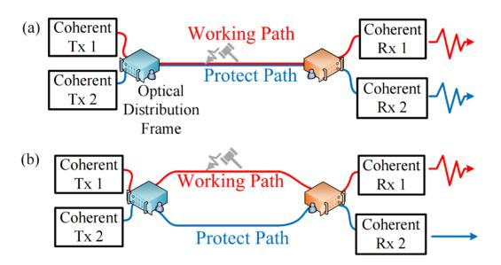

Fig. 1. Principles for co-cable identification using telecom signals. (a) fibers in same fiber-optic cable (co-cable). (b) fibers in different fiber-optic cables.

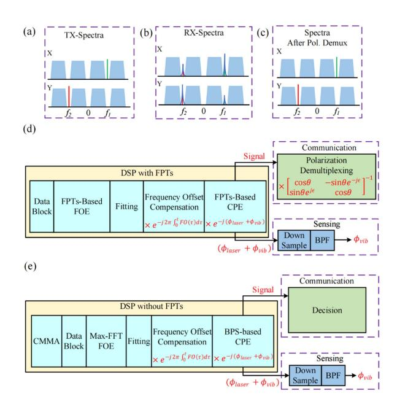

Fig. 2. Schematic diagram of the proposed integrated DSCM system based on FPTs. (a) TX signal spectra. (b) RX signal spectra. (c) Spectra after polarization demultiplexing. (d) DSP procedure for demodulation and sensing with FPTs. (e) DSP procedure for demodulation and sensing without FPTs.

Fig. 2. At the transmitter side, four subcarriers are multiplexed in electrical domain. At the interval between subcarriers, two FPTs at frequencies of f1 and f2 are inserted on X and Y polarizations respectively, as shown in Fig. 2(a). At the receiver side, the electrical spectrum after coherent detection is shown in Fig. 2(b). The FPTs components are present at both polarizations due to crosstalk induced by random birefringence along fiber link. Meanwhile, the FPTs' spectral widths are related to the inherent linewidth of Tx and Rx lasers and time-varying FO. After polarization demultiplexing, fiber birefringence effects are compensated and no FPTs crosstalk between polarization is present. After ideal FO and phase noise compensation, the FPTs will be recovered with zero linewidth fully, as shown in Fig. 2(c).

Fig. 2(d) presents the DSP flow of FPTs-based communication and sensing scheme. With the detected FPTs at the receiver, FOE is firstly implemented using block-based FFT. Utilizing the FPTs and fitting, the laser FO is accurately estimated and compensated, thereby suppressing the influence of FO on the extraction of the vibration-induced phase. The following CPE is employed to obtain the total phase including the laser linewidth and the external vibration. For sensing function, the vibration phase term is extracted from the down-sampled total phase via band pass filter. In the meanwhile, two polarization signals after CPE are demultiplexed based on FPTs. After the subsequent subcarrier demultiplexing and equalization, the communication signals are demodulated.

As a comparison to confirm that FPTs-based sensing enhancement, the communication and sensing scheme without FPTs is also shown in Fig. 2(e). Firstly, subcarrier demultiplexing is implemented, and any one of the multiple subcarriers can be selected for following processing. Then, the cascaded multi-mode algorithm (CMMA) is used for polarization demultiplexing. Next, Max-FFT based dynamic FOE and blind phase search (BPS) are employed for carrier recovery. Finally, the phase extracted by BPS is band-pass filtered for sensing, similar to the scheme with FPTs.

In the following the mathematical model of FPTs transmission and the DSP principles of FPTs-based dynamic FOE, CPE and polarization demultiplexing are introduced in details.

#### A. FPTs' Transmission Model

With two FPTs inserted at Tx in digital domain, the coherent detected FPTs are down-converted to the baseband respectively after fiber link. And the FPTs are expressed below, considering rotated state of polarization (RSOP), phase noise of laser, phase noise induced by FO, and phase noise induced by vibration.

$$\begin{bmatrix} F_{1X} & F_{2X} \\ F_{1Y} & F_{2Y} \end{bmatrix}_{RX} = e^{j(\phi_{laser} + \phi_{vib} + 2\pi \int_0^t FO(\tau)d\tau)} \times \begin{bmatrix} \cos \theta & -\sin \theta e^{j\epsilon} \\ \sin \theta e^{-j\epsilon} & \cos \theta \end{bmatrix} \times \begin{bmatrix} A & 0 \\ 0 & A \end{bmatrix}.$$
 (1)

Where  $F_{1X}$  and  $F_{1Y}$  represent the FPTs at  $f_1$  for X and Y polarizations respectively,  $F_{2X}$  and  $F_{2Y}$  represent the FPTs at  $f_2$  for X and Y polarizations respectively, and A represents the amplitude of the FPTs at the transmitter side.  $\phi_{laser}$  and  $\phi_{vib}$  represent the phase induced by laser linewidth and external vibration, respectively,  $FO(\tau)$  represents the time-varying FO,  $\theta$  and  $\epsilon$  represent the angle and phase parameters of RSOP effects. To achieve vibration sensing, the key task is to extract  $\phi_{vib}$  from the total phase consisting of multiple terms.

## B. FPTs-Based Dynamic and Accurate Frequency Offset Estimation

To achieve vibration-induced phase extraction, it is necessary to accurately compensate the laser FO term in order to suppress sensing background noise effectively. Considering the large laser frequency drift under the 100 kHz ECL, dynamic and accurate estimation is necessary to compensate the term of  $e^{j2\pi} \int_0^t FO(\tau) d\tau$ . It's difficult to achieve this task in the communication and sensing scheme without FPTs (Fig. 2(e)) [7].

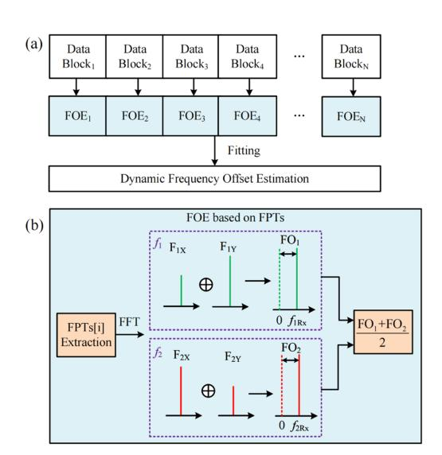

Fig. 3. Principles of dynamic FOE with FPTs. (a) Dynamic FOE process diagram. (b) FOE principle based on FPTs for each block.

With dynamic FOE without FPTs, the shorter block length is preferred for dynamic tracking. However, it will lead to poor estimation accuracy and less noise tolerance. The resultant residual frequency interferes with the following extraction of vibration-induced phase, especially at a low vibration frequency range.

In this work, the FPTs are employed for dynamic and accurate FOE simultaneously, as shown in Fig. 3(a). The block-based Max-FFT for dynamic FOE is used on the extracted FPTs instead of the communication data. The extracted FPTs of X and Y polarizations are combined together to avoid polarization fading, as shown in Fig. 3(b). The vibration-induced phase and laser-induced FO phase additively affect the overall phase, leading to additional total FO fluctuations. Theoretically, vibration-induced phase variations introduce a fast-varying FO component, while laser-induced FO drift varies relatively slowly [16]. Therefore, polynomial fitting is applied to eliminate the vibration-induced FO.

# C. FPTs-Based Carrier Phase Estimation and Vibration Sensing

With the compensation of the frequency offset  $FO(\tau)$ , the FPTs expression in (1) can be simplified as below.

$$\begin{bmatrix} F_{1X} & F_{2X} \\ F_{1Y} & F_{2Y} \end{bmatrix}_{FOE} = e^{j(\phi_{laser} + \phi_{vib})} \times \begin{bmatrix} \cos \theta & -\sin \theta e^{j\epsilon} \\ \sin \theta e^{-j\epsilon} & \cos \theta \end{bmatrix} \times \begin{bmatrix} A & 0 \\ 0 & A \end{bmatrix}.$$
 (2)

In the following, FPTs-based CPE are used to extract ( $\phi_{vib} + \phi_{laser}$ ). With the expression of FPTs components in (2),  $F_{1X}$ ,  $F_{1Y}$ ,  $F_{2X}$ ,  $F_{2Y}$  can be calculated to deal with polarization

fading, with the unitary feature of the RSOP matrix. With (3),  $(\phi_{laser} + \phi_{vib})$  can be extracted from  $(F_{1X}F_{2Y} - F_{2X}F_{1Y})$ .

$$(\phi_{laser} + \phi_{vib}) = \frac{\arg(F_{1X}F_{2Y} - F_{2X}F_{1Y})}{2}$$
$$= \frac{\arg(A^2 e^{2j(\phi_{laser} + \phi_{vib})})}{2}.$$
 (3)

Considering that the vibration frequency is as low as kHz, the phase is down-sampled to the MHz level in order to reduce the complexity. Considering the spectra difference between the laser phase noise and the vibration-induced phase, a band-pass filter (BPF) is used to separate  $\phi_{vib}$  from  $(\phi_{laser} + \phi_{vib})$ .

#### D. FPTs-Based Polarization Demultiplexing

For telecommunication signals, after FPT-based CPE, four FPTs have updated expression shown in (4).

$$\begin{bmatrix} F_{1X} & F_{2X} \\ F_{1Y} & F_{2Y} \end{bmatrix}_{CPE} = \begin{bmatrix} \cos \theta & -\sin \theta e^{j\epsilon} \\ \sin \theta e^{-j\epsilon} & \cos \theta \end{bmatrix} \times \begin{bmatrix} A & 0 \\ 0 & A \end{bmatrix}.$$
(4)

To avoid the influence of FPTs power fluctuation on demultiplexing performance, the FPTs are normalized as shown in (5).

$$\widetilde{H} = \begin{bmatrix} \cos \theta & -\sin \theta e^{j\epsilon} \\ \sin \theta e^{-j\epsilon} & \cos \theta \end{bmatrix}$$

$$= \frac{\begin{bmatrix} F_{1X} & F_{2X} \\ F_{1Y} & F_{2Y} \end{bmatrix}_{CPE}}{\sqrt{F_{1X}F_{2Y} - F_{2X}F_{1Y}}}.$$
(5)

H represents the estimated Jones matrix, and by using this matrix to process the dual-polarization signals, the polarization demultiplexing can be realized.

After polarization demultiplexing, subcarrier demultiplexing and single-in-single-out (SISO) adaptive equalization are implemented. Compared with the conventional polarization demultiplexing and equalization using CMMA without FPTs [20], our FPTs-based scheme has lower DSP complexity for frequency, phase and polarization recovery.

#### III. SIMULATIONS

In this section, dual-polarized DSCM system with four subcarriers were investigated via numerical simulation. For each subcarrier, 8 GBaud/s 16QAM signals were employed and the subcarrier interval was set to 2 GHz. The center frequencies of four carriers were  $\pm 15$  GHz and  $\pm 5$  GHz respectively. An FPT was inserted at 10 GHz in the X polarization state, and another FPT was inserted at -10 GHz in the Y polarization state. The optical signal-to-noise ratio (OSNR) was set to 25 dB. The static RSOP was considered. The Tx and Rx lasers had 3 dB linewidths of 100 kHz, and the laser FO drift followed sine curve, which had the amplitude of 50 MHz and the frequency of 1 kHz, as

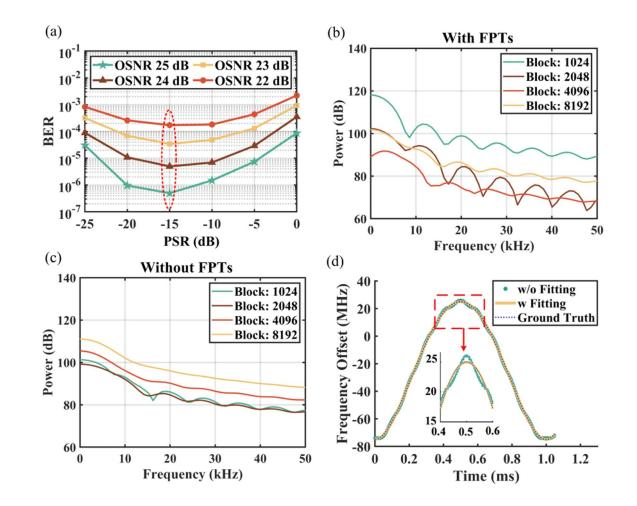

Fig. 4. Simulation results. (a) The BER under different PSR in simulation. (b) The sensing background noise under different block sizes using dynamic FOE based on FPTs with FO drift only. (c) The sensing background noise under different block sizes using dynamic FOE based on Max-FFT with FO drift only. (d) The dynamic FOE results and FO ground truth with 10 kHz vibration, FO drift and phase noise.

shown in (6). The t presents time.

$$FO(t) = (-50 \times \cos(2\pi 10^3 t) - 25) \times 10^6.$$
 (6)

In the following, regarding the communication, the effect of pilot signal power ratio (PSR) on bit error rate (BER) performance was studied and the optimal PSR of -15 dB was selected. Regarding sensing function, the background noise of phase-based sensing was compared for the scheme with FPTs and the scheme without FPTs. For comparison, the subcarrier with a center frequency of -5 GHz was processed by the scheme without FPTs.

Firstly, the impact of the PSR on the BER was investigated, as shown in Fig. 4(a). It is evident that a low PSR results in a low signal-to-noise ratio (SNR) for the extracted FPTs, which degrades communication performance. Conversely, an excessively high PSR leads to the reduced communication signals and introduces noise, thereby increasing the BER. Optimal performance across different OSNR is achieved with a PSR of –15 dB for the minimum BER.

The sensing background noise was tested under different dynamic FOE block sizes to optimize the block size with FO drift and no phase noise using the schemes with and without FPTs. The FOE has limited accuracy with a small block size, while the tracking ability for FO drift is poor with a large block size. Ten independent simulations were conducted and their average spectra of sensing background noise are shown in Fig. 4(b) and (c). The fluctuation of the curve is due to the picket-fence effect of the FFT. It can be seen that both schemes deteriorate when the block size is too large, indicating that static FOE [21] is difficult to track the FO drift, and it is necessary to use dynamic FOE with moderate block size. For dynamic FOE with FPTs, optimal performance is achieved with block size of 4096 for the minimum background noise. For dynamic FOE without FPTs, optimal performance is achieved with block size of 2048. All

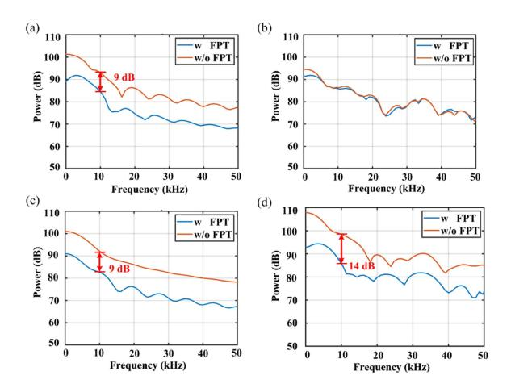

Fig. 5. The sensing background noise. (a) With FO drift only. (b) With phase noise only. (c) With phase noise and FO drift. (d) With phase noise, FO drift and 20 GHz low-pass filter at the Tx.

subsequent simulations were performed under optimized block size conditions.

Subsequently, the dynamic FOE performance was studied. The vibration-induced phase with a frequency of 10 kHz was applied along the fiber link. Dynamic FOE with block size of 4096 was performed at the receiver. The results, shown in Fig. [4\(d\),](#page-3-0) indicate that polynomial fitting (yellow curve) mitigates fluctuations (green points) in the dynamic FOE results, achieving a better estimation close to the laser FO.

Then, the sensing background noise was simulated under different cases to compare the performance of dynamic FOE with FPTs and without FPTs. Fig. 5(a) shows the results with FO drift only and no phase noise considered. Comparing with the scheme without FPTs, the scheme with FPTs achieved a background noise suppression effect of 9 dB at 10 kHz. These findings indicate that dynamic FOE with FPTs can significantly enhance sensing performance.

Later, the background noise was simulated with laser phase noise only and without FO to compare FPTs-based CPE and BPS-based CPE. Fig. 5(b) indicates no difference in sensing background noise between the two schemes, suggesting that FPTs-based CPE module has no contribution to sensing background noise suppression.

After that, the background noise was simulated with laser phase noise and FO drift to compare the sensing scheme with FPTs and the sensing scheme without FPTs. Ten independent replications were performed, and their average results are illustrated in Fig. 5(c). The results show that the scheme with FPTs achieved a 9 dB background noise suppression effect at 10 kHz. The results are similar to simulation results with FO drift only. This indicates that the improved noise suppression and sensing performance with FPTs mainly result from the increased accuracy of dynamic FOE.

Finally, the robustness of the scheme with FPTs and the scheme without FPTs in ISI condition was compared. The background noise was simulated with laser phase noise, FO drift. To introduce ISI, a low-pass filter with 3 dB bandwidth of 20 GHz was applied to the Tx signals. We used the scheme

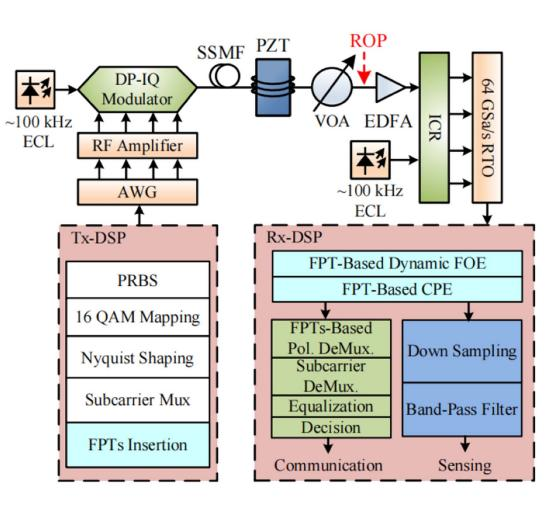

Fig. 6. Experimental setup and Tx & Rx DSP process diagram.

without FPTs to process the subcarrier with a center frequency of −15 GHz to demonstrate the impact of ISI. Fig. 5(d) indicates that the scheme with FPTs achieved a 14 dB background noise suppression effect at 10 kHz. This indicates that the sensing scheme with FPTs has better robustness under various practical limitations.

#### IV. EXPERIMENTAL SETUP

The proposed integrated communication and sensing experiment is shown in Fig. 6. At the transmitter side, data was mapped based on dual-polarization 16QAM, followed by Nyquist shaping with a roll off factor of 0.1. The signals were then subjected to DSCM and up-sampled to the arbitrary waveform generator (AWG, Keysight 8199 A) sampling rate of 128 GSa/s. Finally, FPTs were inserted at 10 GHz in X polarization and −10 GHz in Y polarization before transmission to the AWG. A 100 kHz linewidth ECL (IDPhotonics CoBrite, LW ≤ 100 kHz) with a center wavelength of 1550 nm was modulated. The signals were transmitted through single-mode fiber, with a communication transmission rate set to 4 × 8 GBaud/s. The subcarrier interval was set to 2 GHz and the center frequencies of four carriers were ±15 GHz and ±5 GHz.

After transmission through the single-mode fiber, a EDFA was used to compensate the loss of the link, and the received optical power (ROP) before the EDFA could be adjusted to control the OSNR at receiver. Subsequently, the signals were received by an integrated coherent receiver (ICR) and sampled by a real-time oscilloscope (RTO, Keysight UXR0594AP) at a sampling rate of 64 GSa/s. The local oscillation was a same ECL with 100 kHz linewidth and 1550 nm center wavelength. For vibration sensing, vibrations induced by a piezoelectric transducer (PZT) were applied to the standard single-mode fiber (SSMF).

At the receiver side, as described in the principles section, the FPTs were firstly down-converted to baseband, then extracted by low-pass filter, as proposed in our privious work [\[17\].](#page-7-0) After the FPTs were extracted, the four FPTs (F1X, F1Y , F2X, F2Y ) were used for FOE, CPE, and polarization demultiplexing. For sensing, the phase extracted by FPTs-based CPE was

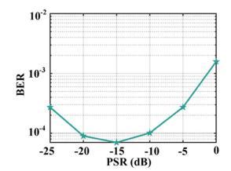

Fig. 7. The BER under different PSR in experiment.

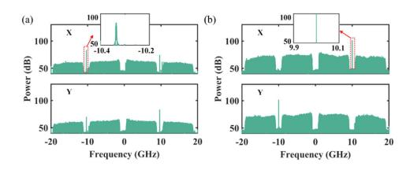

Fig. 8. The signals' spectra in experiment. (a)The received signals' spectra. (b) The signals' spectra after FPTs-based carrier recovery and polarization demultiplexing.

down-sampled to MHz-level to simplify the computational complexity. Then a BPF with a passband frequency of 7 kHz to 50 kHz was used to extract the vibration-induced phase variations. For communication signals, subcarrier demultiplexing was performed firstly, followed by equalization using SISO equalizer. Finally, the signals were subjected to decisionmaking.

#### V. EXPERIMENTAL RESULTS AND DISCUSSIONS

### *A. Communication Results*

Firstly, the BER was tested as a function of the PSR to determine the optimal PSR, as shown in Fig. 7. It can be observed that the BER is minimized when the PSR is −15 dB, which is basically consistent with the simulation results (Fig. [4\(a\)\)](#page-3-0). Therefore, a PSR of −15 dB was chosen for subsequent experiments.

Subsequently, the spectra of the signals at the receiver side and after polarization demultiplexing were tested to study the performance of carrier recovery based on FPTs. Fig. 8(a) shows the spectra of the detected signal, and Fig. 8(b) shows the spectra after polarization demultiplexing. It is observed that the FPTs are restored to their corresponding polarization states after carrier recovery and polarization demultiplexing based on FPTs, indicating effective RSOP compensation. Additionally, the FPTs become significantly narrower in the spectra, demonstrating that both FO and phase noise have been compensated effectively.

Finally, the BER was tested as a function of the ROP with and without a vibration to study the communication robustness under vibration [\[12\].](#page-6-0) The vibration frequency was set to 30 kHz and the voltage amplitude applied to the PZT was set to 20 V. The two BER curves in Fig. 9(a) are very close to each other. At 7% forward error correction (FEC), the communication of this scheme presents a power penalty of 0.1 dB related to external vibration. Then, the BER was tested as a function of the voltage applied to the PZT, as shown in Fig. 9(b). It can be seen that

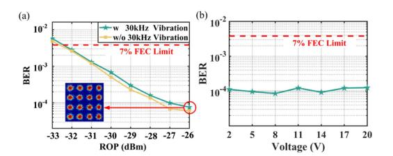

Fig. 9. Communication results in experiment. (a) The BER under different ROP with and without 30 kHz vibration. The amplitude of the voltage applied to the PZT is 20 V. (b) BER at different voltages applied to the PZT with a vibration frequency of 30 kHz and an ROP of −26 dBm.

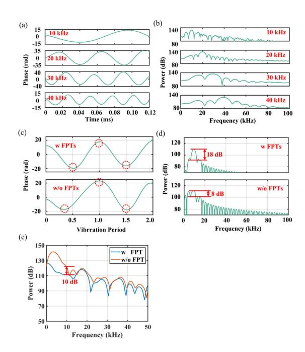

Fig. 10. Sensing results in experiment. (a) The extracted phase variations induced by vibrations. (b) The frequency spectra of the phase variations. (c)&(d) Extracted phase variations induced by 10 kHz vibration with two schemes (c) in time domain, (d) in frequency domain. (e) The spectra of background noise without any filter.

when the voltage increases from 2 V to 20 V, the BER keeps unchanged.

#### *B. Sensing Results*

As for the sensing capability, firstly, we investigated the extracted vibration-induced phases at different frequencies. The sinusoidal voltages with amplitude of 20 V at 10 kHz, 20 kHz, 30 kHz and 40 kHz were applied to the PZT separately. The recovered phases induced by these vibrations are recovered successfully, as shown in Fig. 10(a). The difference in sinusoidal phase amplitude values is caused by the frequency characteristics of PZT, considering that the resonant frequency of the PZT is around 30 kHz. The spectra of the extracted phase variations induced by vibration are depicted in Fig. 10(b), showing prominent peaks around the vibration frequencies. To improve the resolution of the FFT-based spectral analysis, zero padding was used during the FFT process, which can smooth out the peaks effectively.

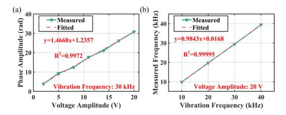

Fig. 11. The sensing capability in experiment. (a) Extracted phase amplitudes for different voltage amplitudes applied to the PZT. (b) Measured frequencies under different vibration frequencies.

Then, the extracted phase variations caused by 10 kHz sinusoidal vibration using two schemes (with FPTs and without FPTs) were tested to verify the enhanced ability of detecting vibration with a low frequency, as shown in Fig. [10\(c\)](#page-5-0) and [\(d\).](#page-5-0) The scheme without FPTs was studied using the subcarrier with a center frequency of −5 GHz. In order to focus on the sensing background noise around 10 kHz, a BPF from 7 kHz to 17 kHz was used to extract the vibration-induced phase variations. Both schemes used the same polynomial fitting order, the same pass-band frequency of the BPF, and dealt with the same experimental data. In the Fig. [10\(c\),](#page-5-0) from the peaks and troughs marked by red circles, it can be seen that the vibrational periodicity of the scheme with FPTs is more clear. In the Fig. [10\(d\),](#page-5-0) the scheme with FPTs provides a 10 dB improvement in sensing signal-to-noise ratio (SSNR) compared to the scheme without FPTs in the spectra. As analyzed in the principles and simulations sections, the accumulation of residual FO from dynamic FOE causes low-frequency phase noise. The FPTsbased dynamic FOE provides good robustness against amplified spontaneous emission (ASE) noise and bandwidth limitations. This FPTs-based high-accuracy dynamic FOE suppresses lowfrequency phase noise effectively, which significantly enhances the low-frequency vibration detection capability. The sensing background noise spectra of the two schemes are compared under the condition of no vibrations and no band-pass filter. Fig. [10\(e\)](#page-5-0) shows that the scheme with FPTs achieves sensing background noise suppression of 10 dB at 10 kHz.

Finally, the extracted phase amplitudes under for different voltage amplitudes with vibration frequency of 30 kHz were investigated, as shown in Fig. 11(a). The slope of the fitted line indicates that the sensor's responsivity was 1.47 rd/V. The obtained coefficient of determination (R2) of 0.9972 demonstrates the sensor's excellent linear response. Then, the voltage with an amplitude of 20 V was applied to the PZT, and the vibration frequency was varied from 10 kHz to 40 kHz, the measured frequencies are shown in Fig. 11(b). The R2 is greater than 0.999, and the slope is close to 1, which shows that the scheme has superior measurements of the vibration frequencies from 10 kHz to 40 kHz.

### VI. CONCLUSION

In conclusion, we have proposed an integrated communication and enhanced forward phase-based vibration sensing solution based on FPTs in DSCM systems using commercial 100 kHz ECLs. By inserting FPTs into the subcarrier intervals of the DSCM systems, we achieved dynamic FOE, CPE and polarization demultiplexing simultaneously. With the improved accuracy of the FPTs-based dynamic FOE, our scheme has a suppression effect on the sensing background noise, enabling detectable vibration frequency down to 10 kHz. Simulations indicate that our FPTs-based scheme provides a 9 dB phase sensing background noise suppression at 10 kHz, compared to the scheme without FPTs, attributable to the high-accuracy dynamic FOE. Experimentally, we demonstrated a 10 dB SSNR gain in vibration sensing at 10 kHz, showcasing a significant enhancement on low-frequency sensing capabilities with the FPTs. This scheme effectively extends the detectable frequency range of forward phase-based sensing in commercial coherent systems. The proposed FPTs-based solution with high SSNR and low frequency sensing enhancement can be integrated into a pluggable optical modules to enable powerful optical networks operation and maintenance including co-cable identification and event detection.

#### REFERENCES

- [1] E. Ip et al., "Vibration detection and localization using modified digital coherent telecom transponders," *J. Lightw. Technol.*, vol. 40, no. 5, pp. 1472–1482, Mar. 2022.
- [2] K. S. Y. Skarvang, S. Bjørnstad, E. Sæthre, and D. R. Hjelme, "Local wind impact sensing using state of polarization measurement on a live short-haul aerial fibre cable," in *Proc. Opt. Fiber Commun. Conf. 2024*, 2024, Art. no. Tu2J.5.
- [3] C. Zhang et al., "Field test of communication cable for environmental monitoring," in *Proc. Opt. Fiber Commun. Conf. 2024*, 2024, Art. no. Tu2J.7.
- [4] J. C. Castellanos et al., "Optical polarization-based sensing and localization of submarine earthquakes," in *Proc. Opt. Fiber Commun. Conf. 2022*, 2022, Art. no. M1H.4.
- [5] K. Hu, F. Tong, W. Lian, and W. Li, "Model and experimental verification of SOP transient in OPGW based on direct strike lightning," *Opt. Exp.*, vol. 31, no. 23, Nov. 2023, Art. no. 39102.
- [6] Y. Li et al., "Research and experiment on AI-based co-cable and co-trench optical fibre detection," in *Proc. Eur. Conf. Opt. Commun. 2022*, 2022, pp. 1–4.
- [7] W. Zuo, H. Zhou, Y. Qiao, Y. Zhao, and B. Ye, "Investigation of cocable identification based on ultrasonic sensing in coherent systems," *IEEE Photon. Technol. Lett.*, vol. 35, no. 21, pp. 1155–1158, Nov. 2023.
- [8] H. Zhou et al., "Ultrasonic phase extraction method for co-cable identification in coherent optical transmission systems," *Chin. Opt. Lett.*, vol. 22, no. 10, Oct. 2024, Art. no. 100601.
- [9] Z. Wang et al., "Co-route fiber recognition and status diagnosis based on integrated sensing and communication in 6G transport networks," *IEEE Internet Things J.*, vol. 11, no. 18, pp. 29348–29359, Sep. 2024.
- [10] Y. Yan et al., "Simultaneous communications and vibration sensing over a single 100-km deployed fiber link by fiber interferometry," in *Proc. 2023 Opt. Fiber Commun. Conf. Exhib.*, Mar. 2023, pp. 1–3.
- [11] J. Tang et al., "Distributed vibration sensing and simultaneous selfhomodyne transmission of single-carrier net 5.36 Tb/s signal using 7-core fiber," in *Proc. Opt. Fiber Commun. Conf. 2024*, 2024, Art. no. M2K.1.
- [12] Z. Hu et al., "Simultaneous distributed acoustic sensing and communication in digital subcarrier multiplexing systems," in *Proc. 49th Eur. Conf. Opt. Commun., Hybrid Conf.*, 2024, pp. 720–723.
- [13] J. Wang, L. Lu, L. Wang, Y. Yan, A. P. T. Lau, and C. Lu, "High-efficiency ISAC to enable sub-meter level vibration sensing for coherent fiber networks," in *Proc. Opt. Fiber Commun. Conf. 2024*, 2024, Art. no. Tu2J.3.
- [14] Y. Koyamada, M. Imahama, K. Kubota, and K. Hogari, "Fiber-optic distributed strain and temperature sensing with very high measurand resolution over long range using coherent OTDR," *J. Lightw. Technol.*, vol. 27, no. 9, pp. 1142–1146, May 2009.
- [15] Y. Wang et al., "Ultralow-frequency vibration sensing in phase-sensitive OTDR using multiscale VMD," *IEEE Sensors J.*, vol. 23, no. 24, pp. 30451–30462, Dec. 2023.

- [16] D. M. Bengalskii, D. R. Kharasov, E. A. Fomiryakov, S. P. Nikitin, O. E. Nanii, and V. N. Treshchikov, "The effect of laser frequency drift on the response of phase-sensitive optical time-domain reflectometer," in *Proc. 2022 Int. Conf. Laser Opt.*, Jun. 2022, pp. 1–1.
- [17] L. Fan et al., "Hardware-efficient, ultra-fast and joint polarization and carrier phase tracking scheme based on frequency domain pilot tones for DSCM systems," *J. Lightw. Technol.*, vol. 41, no. 5, pp. 1454–1463, Mar. 2023.
- [18] L. Fan, Y. Yang, Q. Zhang, S. Gong, Y. Jia, and Y. Yao, "Robust, inservice, and joint monitoring of a dual-polarization transceiver IQ skew for a coherent DSCM system without channel impairment compensation," *Opt. Lett.*, vol. 49, no. 1, Jan. 2024, Art. no. 129.
- [19] L. Fan, Y. Yang, S. Gong, Q. Zhang, and Y. Yao, "Robust PDL compensation and monitoring scheme using frequency domain pilot tones for coherent digital subcarrier multiplexing system," *J. Lightw. Technol.*, vol. 42, no. 1, pp. 136–148, Jan. 2024.
- [20] J. Zhang et al., "Multi-modulus blind equalizations for coherent quadrature duobinary spectrum shaped PM-QPSK digital signal processing," *J. Lightw. Technol.*, vol. 31, no. 7, pp. 1073–1078, Apr. 2013.
- [21] F. Zhang, Y. Li, J. Wu, W. Li, X. Hong, and J. Lin, "Improved pilotaided optical carrier phase recovery for coherent M-QAM," *IEEE Photon. Technol. Lett.*, vol. 24, no. 18, pp. 1577–1580, Sep. 2012.