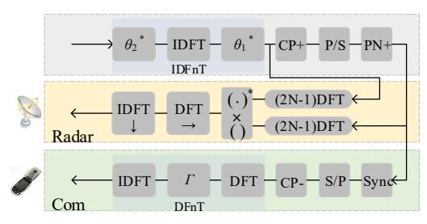
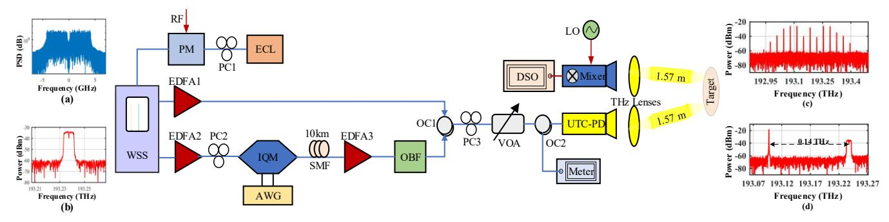
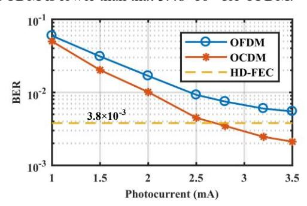
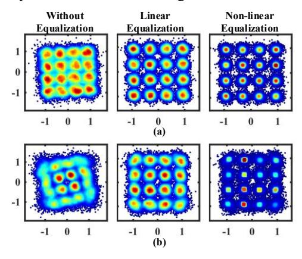
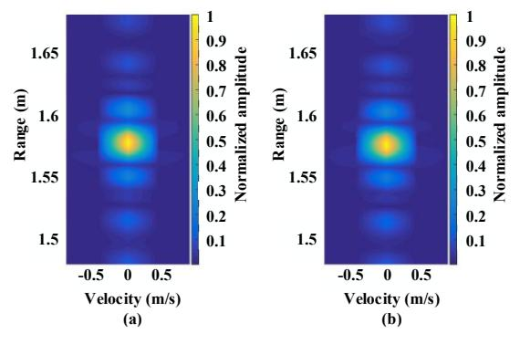
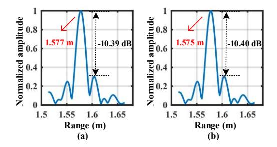

# THz-over-fiber system with orthogonal chirp division multiplexing for integrated sensing and communication

Lianyi Li1, Lu Zhang1, Hongqi Zhang1, Zhidong Lyu1, Zuomin Yang1, Changming Zhang2, Xianbin Yu2\*

1College of Information Science and Electronic Engineering, Zhejiang University, 310027 Hangzhou, China

2Zhejiang Lab, Hangzhou 311121, China

\*E-mail: xyu@zhejianglab.com

Abstract—We experimentally demonstrate an orthogonal chirp division multiplexing (OCDM) waveform-based terahertz-over-fiber (ToF) system for integrated sensing and communication (ISAC) applications. 32 Gbit/s data rate and 1.875 cm range resolution are simultaneously achieved at 0.14 THz.

Keywords—Integrated sensing and communication, orthogonal chirp division multiplexing, terahertz-over-fiber

## I. INTRODUCTION

The integrated sensing and communication (ISAC) techniques are expected to save hardware resources and improve system efficiency greatly by sharing the transceiver and system architectures. Recently, the emergence of broadband immersive intelligent services has driven the ISAC towards larger communication capacity and higher sensing resolution [1]. In this sense, the terahertz frequency band (0.1 THz -10 THz) has been recognized as one of promising candidates for high-performance ISAC development [2].

As we know, compared to the electronic schemes [3], the photonic THz ISAC systems provide some technological benefits like broadband modulation bandwidth, high signal-to-noise ratio (SNR), and seamless convergence with the existing radio-over-fiber (RoF) based wireless access networks [4], namely the terahertz-over-fiber (ToF) system.

A suitable ISAC waveform is apparently critical to the ToF ISAC systems to achieve high performance besides the support of THz band. In principle, compared with the single-carrier signals [5], the multi-carrier modulation signals can typically reduce the influence of waveform truncation and multipath fading at high data rates [6]. The orthogonal frequency division multiplexing (OFDM) has been commonly used as the multi-carrier ISAC waveform [7], while the frequency-selective fading in the OFDM-ToF systems significantly affects the transmission performance of ISAC signals, such as degrading the bit error ratio (BER) and fluctuating Q value.

Alternatively, an orthogonal chirp division multiplexing (OCDM) waveform orthogonally multiplexes multiple subchirp waveforms, and spreads the chirps in the frequency domain [8]. The spreading operation and convolution properties make the OCDM highly promising to dilute the frequency-selective fading problem, and hence enhance the ISAC performance. The authors in [9] recently demonstrate an OCDM-RoF system in the millimeter-wave achieving 16 Gbit/s data rate, confirming the OCDM can obtain a better communication performance than the OFDM, while the OCDM-based sensing performance in the ISAC systems remains to be investigated, particularly in the THz band.

In this paper, we propose and experimentally demonstrate an OCDM waveform-based ToF system for ISAC

applications. A THz photonic system at 0.14 THz is conducted, and both high data rate communication and sensing performances are measured. The experimental results indicate enhanced robustness and ISAC capacity against the frequency-selective fading compared with the traditional OFDM.

### II. SYSTEM MODEL

Fig. 1 depicts the generation and demodulation process schemes of the OCDM ISAC waveform. The modulation symbol undergoes an inverse discrete Fresnel transform (IDFnT) to generate an OCDM frame composed of M symbol blocks of length N.

Fig. 1. The OCDM waveform generation scheme and the receiving signal processing schemes of the communication and sensing applications.

The compatibility of OCDM and OFDM ISAC waveforms is brought by the discrete Fourier transforms (DFT) and DFnT. The DFnT can be composed of DFT and two N-length additional phase vector multiplications ( $\theta_1$  and  $\theta_2$ ) while retaining high-speed computing [8].

### A. Communication Receiver Processing

The echo is first synchronized by PN codes sliding correlation and performed DFnT to recover data finally. Two implementation methods of DFnT operation are given by [8]. In this study, the second one is adopted, which adds a chirp phase-cancellation operation ( $\Gamma_{\rm M}$ ) and an additional IDFT based on OFDM. When frequency domain equalization is adopted, this method can reduce the additional arithmetic complexity [8].

$$\Gamma_{M}\left(k,k\right) = e^{-j\frac{\pi}{N}k^{2}}.$$
 (1)

# B. Radar Receiver Processing

The echo delay carries range information. Range-Doppler (RD) radar image is obtained by the zero-padded matched filtering algorithm in the discrete frequency domain. This means that an N length symbol needs to be performed 2N-1 size DFT, and then conjugate multiplied. Then the obtained Hadamard product is performed DFT in the frequency direction and followed IDFT in the time direction [10].

Fig. 2. Schematic experimental configuration for ToF-based ISAC systems. WSS: wavelength selective switch; PM: phase modulator; ECL: external cavity laser; EDFA: Erbium-doped fiber amplifier; IQM: in-phase and quadrature modulator; SMF: single mode fiber; AWG: arbitrary waveform generator; OBF: optical band-pass filter; PC: polarization controller; OC: optical coupler; VOA: variable optical attenuator; UTC-PD: uni-traveling-carrier photodiode; DSO: digital sampling oscilloscope; LO: local oscillation. (a) The electrical spectrum downloaded to AWG, (b) the optical spectrum from IQM output, (c) the optical spectrum of optical frequency combs, (d) the optical spectrum of OC output.

### III. PHOTONIC THZ ISAC LINK

#### A. Experimental Setup

Fig. 2 details the experimental configuration. The continuous wave light from ECL (NKT Photonics, 1552 nm, 16 dBm, 0.1 kHz linewidth) is injected into the PM (40 GHz bandwidth), where the PM is driven by an RF signal (35 GHz, 1.37 dBm). The optical spectrum of the optical frequency comb (35 GHz interval) after the PM is shown in Fig. 2(c). Then two optical comb lines (193.238 THz and 193.098 THz) are selected and filtered out by a programmable WSS (Finisar). The combination of optical frequency comb and NKT laser can reduce the frequency offset and phase noise of the generated THz signal. After the amplification by EDFA1 and EDFA2, one optical carrier is launched into IQM (IDPhotonics) to implement digital baseband modulation, and another is served as the LO light.

The OCDM signal is modulated to 8 Gbaud 16-ary quadrature amplitude modulation (16QAM) and digital-to-analog converted by an AWG (Keysight M8194A, 120 GSa/s, 45 GHz). After a 10 km standard SMF transmission, the optical signal is filtered out by OBF to suppress the out-of-band amplified spontaneous emission noise. The 10 km SMF introduces some frequency-selective fading caused by fiber dispersion. Subsequently, the filtered signal is coupled with the LO light by an OC. The coupled optical spectrum is shown in Fig. 2(d). The coupled optical signals are finally sent into a UTC-PD for photo-mixing to generate a THz signal.

The THz signal is transmitted and received through a pair of horn antennas over a 3.14 m wireless backhaul link with a pair of THz lenses for collimating the THz beam. The wireless backhaul link also introduces some frequency-selective fading.

At the receiver, the THz carrier at 0.14 THz is received by the Schottky mixer (147 GHz LO, -2 dBm, 12x) for down-conversion. The output IF signal (7 GHz frequency, 8 GHz bandwidth) is then analog-to-digital converted by a broadband real-time DSO (Keysight DSOZ594A, 80 GSa/s, 59 GHz) for further communication and radar processing.

### B. Waveform Parameters Setting

Each frame of the OCDM ISAC waveform consists of 482 blocks. There are 68 positive subchirps in an OCDM symbol to modulate data. In the time domain, each OCDM block is up-sampled to 1024 points, of which 956 points are left zero. Equivalently, the oversampling rate is 15 (1024/68). For the OFDM ISAC waveform, each frame consists of 482 blocks with 68 positive subcarriers. The fast Fourier transform points

are 1024, achieving the same oversampling rate as OCDM.

Further, for both ISAC waveforms, 64 points for CP. Otherwise, the center 2 sample points in the frequency domain are left zero to reduce the impact of insufficient carrier suppression on the spectrum quality. This operation does not occupy data subcarriers or subchirps, so it cannot lose data rate. As a result, the obtained ISAC waveforms both achieve a 32 Gbit/s maximum data rate and 1.875 cm range resolution.

For comparison, waveform parameters and experimental system are identical for OFDM and OCDM ISAC waveform.

#### IV. EXPERIMENTAL RESULTS AND DISCUSSIONS

#### A. Bit Error Ratio

The transmission performance of OFDM and OCDM ISAC waveform over the ToF link are shown in Fig. 3. The photocurrent range of UTC-PD is 1 mA~3.5 mA adjusted by a VOA. In contrast, the OCDM shows lower BER over a set range of photocurrents, and approximately saves 1 mA photocurrent when the BER of  $3.8 \times 10^{-3}$  (the hard-decision forward error correction (HD-FEC) threshold) is achieved [11]. When the photocurrent is 3.5 mA, the BER of  $2.11 \times 10^{-3}$  for OCDM is lower than that  $5.48 \times 10^{-3}$  for OFDM.

Fig. 3. The transmission performance of the OCDM and OFDM ISAC waveform in the ToF system.

Consider that proper equalization might improve the demodulation. The equalization in communication processing combines zero force linear equalization and Volterra nonlinear equalization [12]. With the photocurrent being 3.5 mA, the constellation diagrams with or without equalization are shown in Fig. 4. Comparing the constellations without equalization, the OCDM's rotate less and compact more. Further, with the same number of constellation points, the non-linear equalization constellation of OCDM has darker colors around the standard constellation points, while

OFDM's color is light and unevenly distributed. Besides, the OCDM's have better aggregation and clearer spacing, intuitively smaller error vector magnitude.

Fig. 4. The received constellation diagrams without equalization, with linear equalization, and with non-linear equalization at 3.5 mA photocurrent. (a) OCDM (b) OFDM.

Frequency-selective fading can cause severe inter-symbol interference (ISI). The OCDM spreads the ISI over the entire symbol, whose BER is uniform over the subchirps and lower in total. In contrast, the OFDM generates unrecoverable BER in the edge subcarriers, thereby driving up the overall BER.

## *B. Radar images*

Fig. 5 shows the normalized RD images of the OCDM and OFDM ISAC system. It is observed that the total sidelobe levels within 0.2 m outside the target area are almost the same.

Fig. 5. The RD images of the ISAC system at 0.2 m range. (a) OCDM (b) OFDM.

Fig. 6. The normalized range cuts at 0 m/s velocity. (a) OCDM (b) OFDM.

Fig. 6 shows the normalized range cuts of the radar images, and the measured distance results are obtained from the peaks. The estimated errors of the two ISAC systems are both less than 1 cm compared to the actual target distance (1.57 m).

Furthermore, we calculate the peak side lobe ratio (PSLR) and integrated-sidelobe level ratio (ISLR). Within the allowable range of error, the OCDM and OFDM achieved the same results. Approximately the PSLRs are -10.4 dB, and ISLRs are -6.7 dB.

The radar processing algorithms of the experiments are the same, whereas implementations of the OFDM and OCDM ISAC waveforms are compatible. Thus, it is reasonable that they reflect approximately identical radar performance.

# V. CONCLUSION

In conclusion, we propose and experimentally implement the OCDM waveform-based ToF system for ISAC applications. The transmission of the OCDM signals over a 10 km optical fiber and a 3.14 m wireless link at 0.14 THz is conducted with achievement of 32 Gbit/s data rate and 1.875 cm range resolution. Compared with OFDM based ToF system, the OCDM-based scheme exhibits improved performance in the frequency-selective ISAC channels. Therefore, the proposed OCDM ISAC waveform provides an promising solution for ultrahigh frequency and large bandwidth ToF-based ISAC systems.

Acknowledgement: This work was supported by the National Key Research and Development program of China (2021YFB2800800) and "Pioneer" and "Leading Goose" R&D Program of Zhejiang 2023C01139, in part by the National Natural Science Foundation of China under Grant 62101483; Natural Science Foundation of Zhejiang province under Grant LQ21F010015; Fundamental research funds for the Zhejiang Lab (no. 2020LC0AD01).

## REFERENCES

- [1] C. B. Barneto et al., "Full-Duplex OFDM radar with LTE and 5G NR waveforms: challenges, solutions, and measurements," IEEE Trans. Microw. Theory Tech., vol. 67, pp. 4042–4054, August 2019.
- [2] A. S. Cacciapuoti, K. Sankhe, M. Caleffi, and K. R. Chowdhury, "Beyond 5G: THz-based medium access protocol for mobile heterogeneous networks," IEEE Commun. Mag., vol. 56, pp. 110–115, June 2018.
- [3] N. M. Idrees et al., "Improvement in sensing accuracy of an OFDMbased W-band system," J. Commun. Inf. Netw., vol. 7, pp. 37–47, March 2022.
- [4] H. Zhang et al., "Tbit/s multi-dimensional multiplexing THz-over-fiber for 6G wireless communication," J. Light. Technol., vol. 39, pp. 5783– 5790, June 2021.
- [5] X. Chen, Z. Liu, Y. Liu, and Z. Wang, "Energy leakage analysis of the radar and communication integrated waveform," IET Signal Process., vol. 12, pp. 375–382, May 2018.
- [6] E. Saberinia and A. H. Tewfik, "Single and multi-carrier UWB communications," in 7th International Symposium on Signal Processing and Its Applications, Paris, France, July 2003, vol. 2, pp. 343–346.
- [7] X. Ouyang and J. Zhao, "Orthogonal chirp division multiplexing for coherent optical fiber communications," J. Light. Technol., vol. 34, pp. 4376–4386, September 2016.
- [8] X. Ouyang and J. Zhao, "Orthogonal chirp division multiplexing," IEEE Trans. Commun., vol. 64, pp. 3946–3957, July 2016.
- [9] C. Browning, D. Dass, P. Townsend, and X. Ouyang, "Orthogonal Chirp-Division Multiplexing for future converged optical/millimeterwave radio access networks," IEEE Access, vol. 10, pp. 3571–3579, December 2021.
- [10] F. Zhang, The Schur complement and its applications. New York: Springer, 2005.
- [11] J. Cho, L. Schmalen, and P. J. Winzer, "Normalized generalized mutual information as a forward error correction threshold for probabilistically shaped QAM," in 43rd European Conference on Optical Communication, Gothenburg, Sweden, September 2017, pp. 1–3.
- [12] E. Giacoumidis et al., "Volterra-based reconfigurable nonlinear equalizer for coherent OFDM," IEEE Photonics Technol. Lett., vol. 26, pp. 1383–1386, July 2014.