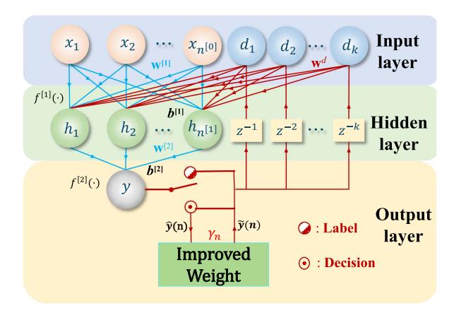
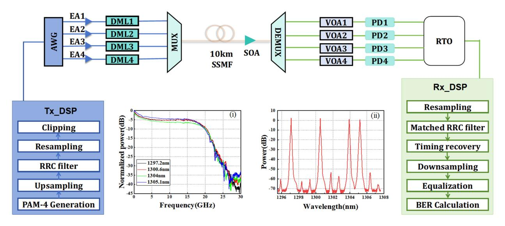
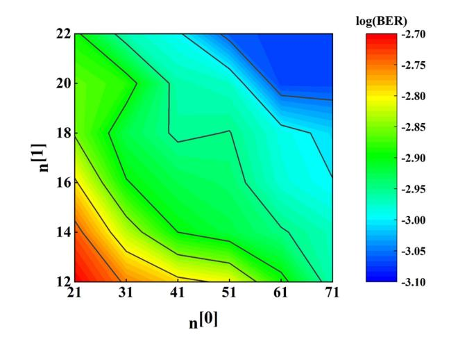
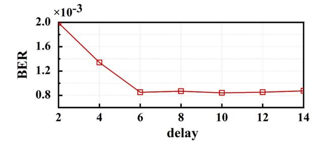
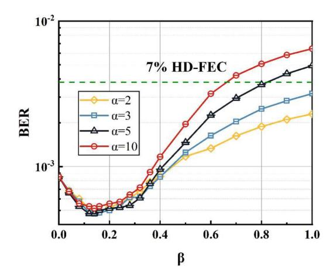
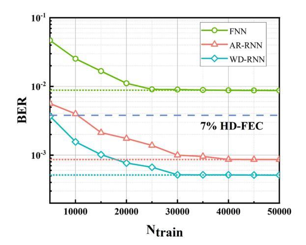
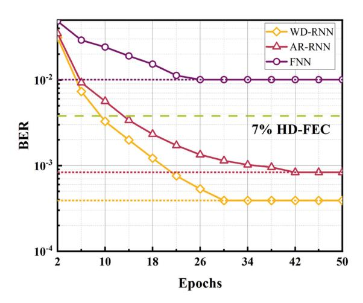
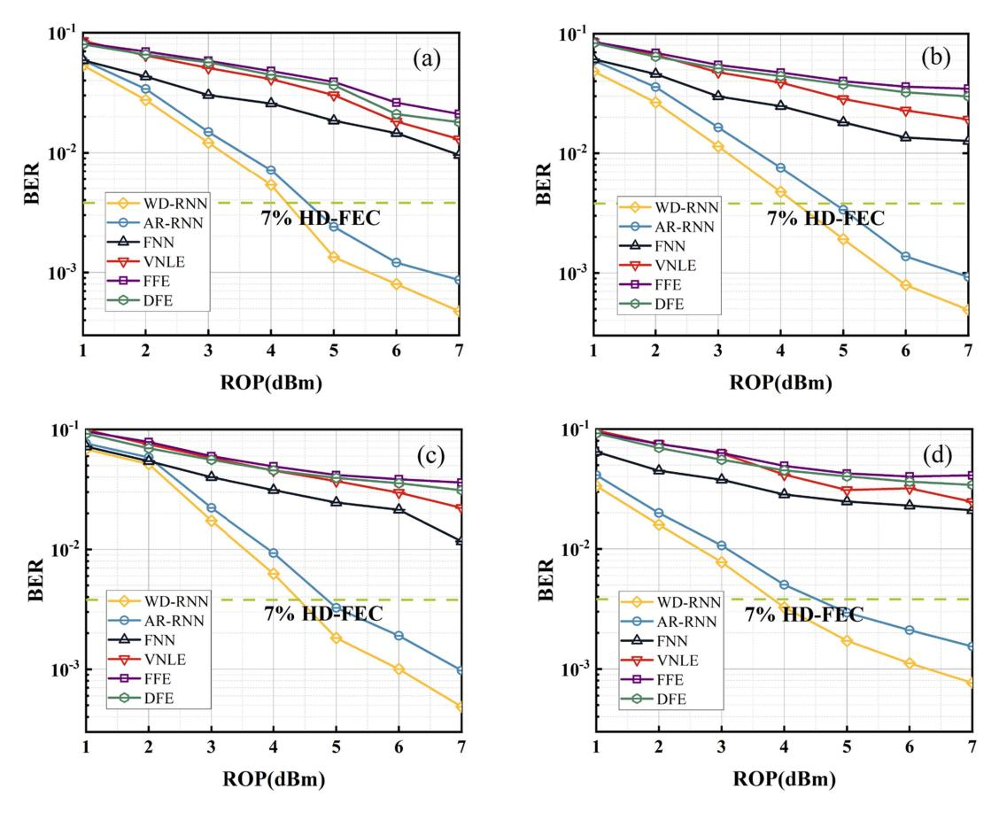
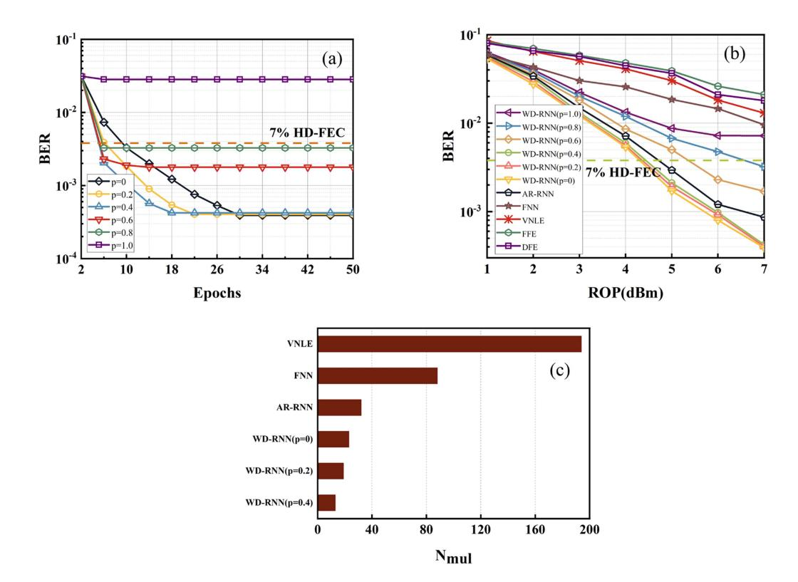

# O-Band DML Enabled 4×100G Short-Reach Photonic Interconnections With Weighted Decision Aided Recurrent Neural Network

Haoran Liang, Meng Xiang, Junjiang Xiang, Yongfeng Qiu, Songnian Fu, Senior Member, IEEE, and Yuwen Qin D

Abstract—The severe bandwidth constraint along with nonlinearity introduced by the utilization of low-cost direct modulation laser (DML) hinders a higher data throughput for the photonic interconnection. Here, we propose a nonlinear equalizer based on weighted decision aided recurrent neural network (WD-RNN) for the four-level pulse amplitude modulation (PAM-4) intensity modulation direct detection (IM-DD) short-reach transmission, when the average 10-dB bandwidth of four used DMLs is only 20.2 GHz. After optimizing the WD-RNN equalization parameters for one wavelength channel at fixed received optical power (ROP) and applying the same parameters to other channels, we can experimentally realize the  $4 \times 100$  Gb/s transmission over 10 km standard single-mode fiber (SSMF) and verify the generalization of the WD-RNN enabled nonlinear equalizer under the wavelength channel variation, when the 7% HD-FEC threshold is considered. Furthermore, the proposed nonlinear equalizer is experimentally verified to outperform the conventional model-driven Volterra equalizer, data-driven nonlinear equalizers based on feedforward network, and auto regressive recurrent neural network (AR-RNN), in term of the BER performance under various ROP conditions. Meanwhile, the training process of WD-RNN can be simplified with reduced data size and epochs, in comparison with its AR-RNN enabled counterpart, leading to the mitigation of decision errors arising in the feedback structure. The required computational complexity (CC) of the WD-RNN based nonlinear equalizer is found to be only 11.85%, 26.14%, 71.88% of that for VNLE, FNN and AR-RNN, in terms of achieving the same equalization performance. With the introduction of weight pruning, the CC of WD-RNN can be further reduced by 40%, without any performance penalty.

Index Terms—Intensity modulation direct detection (IM-DD), multiple lanes, O-band, weighted decision aided recurrent neural network (WD-RNN).

Received 14 January 2025; revised 7 April 2025; accepted 22 April 2025. Date of publication 29 April 2025; date of current version 16 July 2025. This work was supported in part by the National Key Research and Development Program of China under Grant 2024YFB2807903, in part by the National Natural Science Foundation of China under Grant U21A20506 and Grant 62475051, and in part by the Guangdong Introducing Innovative and Entrepreneurial Teams of "The Pearl River Talent Recruitment Program" under Grant 2021ZT09X044. (Corresponding author: Meng Xiang.)

The authors are with the Key Laboratory of Photonic Technology for Integrated Sensing and Communication, Ministry of Education, Guangdong Provincial Key Laboratory of Information Photonics Technology, Institute of Advanced Photonics Technology, School of Information Engineering, Guangdong University of Technology, Guangzhou 510006, China (e-mail: 2112303203 @mail2.gdut.edu.cn; meng.xiang@gdut.edu.cn; 1112203009@mail2.gdut.edu. cn; 2112203090@mail2.gdut.edu.cn; songnian@gdut.edu.cn; qinyw@gdut. edu.cn).

Color versions of one or more figures in this article are available at https://doi.org/10.1109/JLT.2025.3565115.

Digital Object Identifier 10.1109/JLT.2025.3565115

#### I. INTRODUCTION

RECENTLY, due to the rapid development of the Internet and artificial intelligence (AT) there. growth in data traffic [1], [2]. In this context, an urgent demand arises for short-reach photonic interconnection systems capable of supporting higher throughput with low-cost and low power consumption. With the intensity modulation and direct detection (IM-DD) technique, achieving a transmission rate of 400 Gb/s is challenging for single-lane transmission [3]. Alternatively, a four-lane wavelength division multiplexing (WDM) IM-DD scheme is adopted to achieve 400 Gb/s photonic interconnections, which is operated at O-band, instead of C-band, for the purpose of minimizing the impact of chromatic dispersion induced power fading. Moreover, four-level pulse amplitude modulation (PAM-4) has been recommended as the optimal choice for 400-Gigabit Ethernet (400GE) applications, owing to its ability to increase the spectral efficiency (SE) while maintaining a low system complexity [4]. Furthermore, utilizing direct modulation laser (DML) for the PAM-4 signal modulation is ideally preferred, in comparison with Mach-Zehnder modulator (MZM) and electro-absorption modulator (EAM), due to its advantages of low cost, small footprint, and low power consumption.

However, the PAM-4 photonic interconnections based on DMLs may suffer from various linear and nonlinear impairments, including severe bandwidth constraint [5], the detrimental frequency chirp, and modulation nonlinearity [6]. To enhance the IM-DD short-reach performance, the utilization of advanced digital signal processing (DSP) for mitigating transmission impairments is essential. Recent investigations of O-band DML based short-reach IM-DD transmission based on various DSP schemes are summarized in Table I. The 25  $\times$  25 Gb/s WDM transmission over 55 km standard single-mode fiber (SSMF) was demonstrated, with the help of feedforward equalizer (FFE) [7]. A single-lane 95 Gb/s PAM-4 transmission was achieved over the 20 km SSMF, with the help of optimized quadric curve (QC) fitting-based pre-equalization [8]. A single-lane 200 Gb/s PAM-4 transmission over the 20 km SSMF was achieved, by the utilization of decision feedback equalizer (DFE) together with a DML with 3-dB bandwidth of 38 GHz [9]. However, both the pre-equalization and FFE/DFE can only deal with the bandwidth constraint induced linear impairment. To simultaneously mitigate both linear and nonlinear impairments, Volterra nonlinear

0733-8724 © 2025 IEEE. All rights reserved, including rights for text and data mining, and training of artificial intelligence and similar technologies. Personal use is permitted, but republication/redistribution requires IEEE permission. See https://www.ieee.org/publications/rights/index.html for more information.

| Ref.      | Format | Data Rate (Gbit/s) | Fiber Length (km) | Bandwidth of DML (GHz) | DSP                 | Reached BER Threshold             |
|-----------|--------|-----------------------|----------------------|---------------------------|---------------------|--------------------------------------|
| [7]       | NRZ    | 25×25                 | 55                   |                           | FFE                 |                                      |
| [8]       | DMT    | 95                    | 20                   | 10 (3dB)                  | QC pre-equalization | 7% HD-FEC (3.8×10 -3 )    |
| [9]       | PAM-4  | 200                   | 20                   | 38 (3dB)                  | DFE                 | 6.25% HD-FEC (4.5×10 -3 ) |
| [14]      | PAM-4  | 100                   | 50                   | 13 (3dB)                  | VNLE                | 20% SD-FEC (2×10 -2 )     |
| [15]      | PAM-4  | 4×100                 | 40                   | 15 (3dB)                  | VNLE+FFE            | 20% SD-FEC (2×10 -2 )     |
| This work | PAM-4  | 4×100                 | 10                   | 20.2 (10dB)               | WD-RNN              | 7% HD-FEC (3.8×10 -3 )    |

TABLE I RECENT INVESTIGATIONS OF IM-DD TRANSMISSION USING O-BAND DMLS

equalization (VNLE) has been extensively studied in the past few years [\[10\],](#page-7-0) [\[11\],](#page-7-0) [\[12\],](#page-7-0) [\[13\].](#page-7-0) Ref. [\[14\]](#page-7-0) demonstrated a transmission of 100 Gb/s/λ PAM-4 signals with 29 dB loss budget, utilizing the 10G-class O-band DMLs with 3-dB bandwidth of around 10 GHz, when a 389-tap VNLE was applied to simultaneously mitigate both the linear and nonlinear distortions after the SSMF transmission. Moreover, the transmission of 4 *×* 100 Gb/s PAM-4 signals over 40 km SSMF was achieved, with the help of a 53-tap second-order VNLE and a 73-tap FFE [\[15\].](#page-7-0) However, due to the large number of higher-order cross terms arising in the Volterra series, the memory length escalation of VNLE for the DML enabled high-speed photonic interconnection leads to an exponential enhancement of the computational complexity (CC), which limits its practical applications.

With the continuous development of machine learning technique, there has been a growing trend to introduce the data-driven neural networks (NN) as an effective equalization technique for the short-reach IM-DD transmission, owing to their capabilities of employing nonlinear activation functions among hidden layers to model the linear and nonlinear transmission effects arising in the SSMF channel [\[16\],](#page-7-0) [\[17\],](#page-7-0) [\[18\].](#page-7-0) For example, a feedforward neural network (FNN)-based nonlinear equalization for the IM-DD system was proposed [\[19\],](#page-7-0) leading to an improvement of equalization performance after 20 km SSMF transmission, in comparison with the VNLE. In [\[20\],](#page-7-0) a radial basis function neural network (RBF-NN)-based nonlinear equalizer was introduced for the IM-DD transmission over 80 km SSMF. However, to achieve a better performance, both FNN-based and RBF-NN-based equalizers require sufficiently large number of hidden neurons, leading to the huge CC. In [\[21\],](#page-7-0) the convolutional neural network (CNN)-based nonlinear equalizer was demonstrated, to mitigate both linear and nonlinear impairments arising in the IM-DD transmission, but with more complicated structures than that of the FNN-based equalizer, leading to an unaccepted CC for practical implementation. Recently, recurrent neural networks (RNN) have gained prominence, due to their effective utilization of time-series information. In [\[22\],](#page-7-0) the impact of semiconductor optical amplifier (SOA)-induced nonlinearities was experimentally investigated. An auto-regressive recurrent neural network (AR-RNN) based equalizer was experimentally demonstrated for the realization of 4 *×* 75 Gb/s optically amplified PAM-4 transmission. In [\[23\],](#page-7-0) up to 60 Gb/s non-returned zero (NRZ) and 100 Gb/s PAM-4 transmission over 20 km SSMF were achieved by utilizing AR-RNN. Nevertheless, the main drawback of utilizing AR-RNN is that it is susceptible to the error propagation, leading to a performance penalty. In addition, when the central wavelength of each lane changes, the neural network used for equalization needs to be retrained. Such limitation results in a poor generalization and poses challenges for real-time implementation for the multi-lane IM-DD transmissions [\[24\].](#page-7-0)

In this paper, we propose a weighted decision aided recurrent neural network (WD-RNN) nonlinear equalizer for the DML enabled photonic interconnection, and experimentally verify its effective function by successfully transmitting 4 *×* 100 Gb/s O-band PAM-4 signals over 10 km SSMF, based on four DMLs with the average 10-dB bandwidth of 20.2 GHz, considering the 7% hard-decision forward error correction (HD-FEC) threshold. During the training process of WD-RNN, instead of decisions, labels are used as feedback, due to its inherent parallel processing nature, leading to the significant acceleration of the training [\[25\].](#page-7-0) As for the testing process of WD-RNN, where feedback labels are not available, weighted decisions are introduced as feedback to minimize the detrimental impact of decision errors. Consequently, the proposed WD-RNN outperforms both traditional model-driven nonlinear equalizers such as VNLE, and other data-driven nonlinear equalizers such as FNN and AR-RNN, in terms of the receiver sensitivity. The content of the current submission is organized as follows. The Section II describes the operation principle of the proposed WD-RNN equalizer. Next, the experimental setup of O-band 4 *×* 100 Gb/s PAM-4 short-reach transmission is introduced in Section [III.](#page-2-0) Then, the experimental verification of the proposed WD-RNN equalizer is presented in Section [IV.](#page-3-0) Finally, all conclusions are summarized in Section [V.](#page-6-0)

## II. PRINCIPLE OF WD-RNN EQUALIZER

The structure of WD-RNN, consisting of one input layer, one hidden layer, and one output layer, is illustrated in Fig. [1.](#page-2-0) Since deep NNs generally holds a high CC, here we will only consider 3-layer NNs, which has been proven with the capability of uniformly approximating any continuous function with arbitrary precision, if the NN has a sufficiently large number of hidden units and suitable activation functions[\[26\].](#page-7-0) The forward process of WD-RNN is denoted by blue arrows and the recurrent loop is denoted by red arrows, as shown in Fig. [1.](#page-2-0) The i*−*th layer of the WD-RNN consists of n[*i*] neurons, where i = 0, 1, 2. During our investigation, the output layer of the WD-RNN has only one neuron, which is n[2] = 1. Such measure intends to reduce the CC of NN, making the WD-RNN essentially a predictor [\[27\]](#page-7-0) in such case. The weight matrix *w*[*i*] of the i*−*th layer represents the collection of all weight parameters from the (i-1)th layer to the

Fig. 1. Schematic of 3-layer WD-RNN.

 $i^{th}$  layer, resulting in a  $n^{[i-1]} \times n^{[i]}$  matrix. Here, we introduce a vector  $\boldsymbol{b}$  as the bias for the WD-RNN, whose size is  $n^{[i]} \times 1$ . The activation functions are defined as  $f(\cdot)$ . We choose the Tanh function for the hidden layer due to its symmetric output range from -1 to 1, which avoids the non-negative bias of ReLU and Sigmoid functions and better matches the distribution of the distorted signals [28]. Then we adopt pure-linear activation function at the output layer. The recurrent structure of WD-RNN is controlled by an  $n^{[1]} \times k$  weight matrix  $\boldsymbol{w}^d$ , assuming k delays are used in the feedback loop. The WD-RNN input is the received PAM-4 signals after the timing recovery. One forward propagation (FP) of the WD-RNN represents the equalization of one symbol, and a single FP step of WD-RNN can be expressed as

$$\boldsymbol{H}^{[1]} = f^{[1]} \left( \left[ \boldsymbol{w}^{[1]}, \boldsymbol{w}^{d} \right] \left[ \boldsymbol{X}^{T}, \hat{\boldsymbol{Y}}_{d}^{T} \right]^{T} + \boldsymbol{b}^{[1]} \right)$$

$$y = f^{[2]} \left( \boldsymbol{w}^{[2]} \boldsymbol{H}^{[1]T} + \boldsymbol{b}^{[2]} \right)$$
(1)

where X consists of individual inputs,  $\hat{Y}_d$  is composed of k delays,  $H^{[1]}$  represents the output values of  $n^{[1]}$  neurons at the hidden layer, and y represents the RNN output. The training strategy, known as the teaching force, involves the use of labels as feedback input. This effectively prevents training errors and potential system crashes resulting from the error propagation. As for the testing stage of the WD-RNN, as illustrated in Fig. 1, we introduce weighted decisions of y to replace labels to minimize the impact of decision errors. Generally, the calculated WD of the output signal y can be expressed as

$$\tilde{y}(n) = S(\gamma_n)\,\hat{y}(n) + [1 - S(\gamma_n)]\,y(n) \tag{2}$$

where  $\hat{y}(n)$  is the hard decision of y(n). WD is realized by calculating the reliability value  $\gamma_n$ . For the PAM-4 format, when y(n) is between -3 and 3,  $\gamma_n$  can be calculated by (3), which is a measure of whether the hard decision is accurate.

$$\gamma_n = 1 - |y(n) - \hat{y}(n)| \tag{3}$$

When y(n) is close to the hard decision,  $\gamma_n$  is close to 1, indicating that the result of the hard decision is reliable. When y(n) is less than -3 or greater than 3,  $\gamma_n = 1$  is chosen. The

use of reliability can minimize the impact of decision errors. In addition,  $S(\cdot)$  is a compressed sigmoid function, as shown in (4), to augment the impact of reliability values when they are high, while mitigating this impact when they are low.

$$S(x) = \frac{1}{2} \left( \frac{1 - \exp\left[-\alpha \left(x/\beta - 1\right)\right]}{1 + \exp\left[-\alpha \left(x/\beta - 1\right)\right]} + 1 \right) \tag{4}$$

where  $\alpha$  is a positive integer, and  $\beta$  within a range of  $0 < \beta < 1$  is a compression factor. Both  $\alpha$  and  $\beta$  are required to be optimized, to ensure the best equalization performance. Please note that, HD is a special case of WD by setting S(x) = 1. During our investigation, 50,000 random PAM-4 symbols are applied for the purpose of training, while 60,000 PAM-4 symbols are utilized for the testing. Given that the weight pruning strategy significantly reduces structural overfitting, we set the dropout rate to be 0.01 to prevent feature co-adaptation during the training of WD-RNN [29].

#### III. EXPERIMENTAL SETUP

The experimental setup is illustrated in Fig. 2. At the transmitter side, the Mersenne Twister generator is first employed to generate pseudo-random bit sequence (PRBS), in order to avoid the trap of BER performance over-estimation [30], when NNs are employed as nonlinear equalizers. After the bit-to-symbol mapping and up-sampling to 2 samples per symbol (Sps), the 100 Gb/s PAM-4 signals for each lane are then pulse-shaped by a root-raised cosine (RRC) filter with a roll-off factor of 0.01, followed by resampling to match with the sampling rate of the arbitrary waveform generator (AWG). Meanwhile, clipping is used to reduce the peak-to-average power ratio (PAPR). Thereafter, the signal is loaded into the AWG with a 3-dB bandwidth of 45 GHz and a sampling rate of 120 GSa/s, for the purpose of digital-to-analog-conversion. The generated electrical signals are then amplified by electrical amplifiers (EAs) and introduced to four DMLs (S-HSLD-0818-S01) with central wavelength at 1300.6 nm, 1305.1 nm, 1304 nm, and 1297.2 nm, respectively. The measured frequency responses of four DMLs are shown in the inset (i) of Fig. 2, with the average 10-dB bandwidth of 20.2 GHz, and the bias current is set to 172 mA with the temperature control of 24.8 °C. The optical outputs of four DMLs are wavelength-division multiplexed and launched into the SSMF. After transmission over 10 km SSMF with the attenuation of 0.35 dB/km at the O-band and wavelength divison demultiplexed at the reciever-side, variable optical attenuators (VOAs) are utilized to adjust the received optical power (ROP) for each lane. Meanwhile, since four photodiodes (PDs) without transimpedance amplifiers (TIAs) are used, an O-band SOA is utilized to compensate the transmission loss from both the SSMF and optical components. Next, after optical-to-electrical conversion by four PDs, the received electrical signals for each wavelength lane are digitized by a real-time sampling oscilloscope (RTO) with a sampling rate of 80 GSa/s. As for the receiver-side DSP, the signal of each lane is first resampled to 2 Sps. After the matched RRC filtering and timing recovery, the signals are down-sampled to 1 Sps. For the ease of performance comparison, six kinds of equalizers, including FFE, DFE, VNLE, FNN, AR-RNN and

Fig. 2. Experimental setup of the  $4 \times 100$  Gb/s PAM-4 IM-DD transmission based on WD-RNN. Inset: (i) Frequency response of four DMLs. (ii) Optical spectrum of WDM signals after the 10 km SSMF transmission.

WD-RNN, are chosen. Finally, the BER is calculated after the symbol-to-bit demapping. The optical spectrum of four-lane signals after the 10 km SSMF transmission is shown in the inset (ii) of Fig. 2. It is observed that, four-wave mixing (FWM) effect occurs, leading to the generation of harmonics after the SSMF transmission. However, the FWM components are filtered out by the wavelength division demultiplexer (DEMUX), due to the unequal wavelength spacing. Moreover, the power ratio between the WDM signals and the FWM components exceeds 50 dB, indicating a negligible impact on the WDM signals.

#### IV. RESULTS AND DISCUSSIONS

### A. Parameters Optimization of WD-RNN Equalizer

For the optimization of WD-RNN parameters, we choose the 1300.6 nm channel under investigation and ROP is set as 7 dBm. We first investigate the impact of the number of neurons at the input and hidden layers on the equalization performance, under the condition of sufficiently large delay parameter of k = 10to better learn the time dependencies between symbols [31], as shown in Fig. 3. As we can see, the BER decreases significantly as the number of neurons increases. This is attributed to the enhanced learning capability of the WD-RNN, which is helpful to model the linear and nonlinear characteristics of fiber channel more effectively. However, when  $n^{[0]}$  exceeds 61 and  $n^{[1]}$  exceeds 20, the BER performance starts to be saturated. Considering the trade-off between BER performance and CC, the optimal parameters for the WD-RNN network size are determined by  $n^{[0]} = 61$  and  $n^{[0]} = 20$ , respectively. In this context, the optimized 3-layer network with a neuron configuration of (61, 20, 1) improves the BER from  $2 \times 10^{-3}$  to  $7.9 \times 10^{-4}$ , compared to the smaller configuration of (21, 12, 1). Thereafter, we optimize the delay parameter k of WD-RNN, as shown in Fig. 4. With the growing delay parameter, BER first decreases and then becomes saturated. Therefore, we identify the optimal k = 6 to guarantee the best compromise between the

Fig. 3. BER contour map of the 3-layer WD-RNN equalizer, when the ROP is 7 dBm. (Delay parameter k=10).

Fig. 4. Impact of delay units arising in the WD-RNN on the BER performance, when the ROP is 7 dBm.

BER performance and CC for the next investigation. Finally, we study the impact of WD parameters on the equalization performance, and the relationship between BER and WD parameters is presented in Fig. 5. Obviously, the compression factor  $\beta$  has a more profound impact on the equalization performance

Fig. 5. Measured BER as a function of WD parameters at the ROP of 7 dBm.

Fig. 6. Relationship between the number of training symbols required for WD-RNN, AR-RNN and FNN equalization schemes and the BER performance, when the ROP is 7 dBm.

than α. The BER initially decreases and then increases with the growing β, under conditions of various α values. To guarantee the best equalization performance, we identify the optimal WD parameters of α = 5 and β = 0.14.

Then, we investigate the impact of the number of training symbols on the BER performance, by the use of FNN, AR-RNN, and WD-RNN, as shown in Fig. 6. For the FNN scheme, no more than 25000 training symbols are required for the BER convergence, while as for the AR-RNN, 40000 training symbols are necessary. This is because the requirement for the number of training symbols generally increases with respect to the NN complexity [\[32\].](#page-7-0) For WD-RNN, 30000 training symbols are enough to achieve the BER convergence, leading to the reduction of 25% training symbols, in comparison with that of AR-RNN. Fig. 7. presents the impact of the training epochs on the BER performance, when the training data size is 40000. The BER convergence of WD-RNN and AR-RNN is achieved within 30 and 42 epochs, respectively, indicating that WD-RNN exhibits 28.5% faster convergence speed than that of AR-RNN. We owe this phenomenon to the fact that, WD can reduce the error propagation probability more effectively. As a result, we

Fig. 7. Relationship between the number of training epochs required for WD-RNN, AR-RNN and FNN equalization schemes and the BER performance, when the ROP is 7 dBm.

choose 30000 training symbols and 30 epochs for the WD-RNN training.

## *B. Performance Evaluation of FFE, DFE, VNLE, FNN, AR-RNN and WD-RNN*

After parameters optimization for the 1300.6 nm channel with ROP of 7 dBm, we fix those WD-RNN parameters and investigate the transmission performance for all 4 wavelength channels. Fig. [8.](#page-5-0) illustrates the relationship between BER and ROP for the transmission of 4 *×* 100 Gb/s PAM-4 signals. Other equalizers including FFE, DFE, VNLE and FNN are also considered, for the ease of performance comparison. To achieve the optimal BER performance, the number of taps arising in both FFE and DFE are optimized to 155, the first/second/third-order lengths of VNLE are optimized to be 61, 21, and 15, respectively. The FNN size with 3 layers for four channels is optimized to be (61, 20, 1). It is evident that, the achieved BER decreases along with the growing ROP for all wavelength channels. Due to the incapability to equalize the nonlinear impairments, FFE exhibits the worst BER performance. With the inclusion of the decision, DFE slightly outperforms FFE, but still fails to reach the 20% soft-decision forward error correction (SD-FEC) threshold at BER = 2 *×* 10*−*2 for all four channels. Furthermore, the VNLE also shows unsatisfied equalization performance, because of the noise enhancement issue in the presence of severe bandwidth constraint. Using FNN, the equalization performance can be enhanced in comparison with those model-driven equalizers, but the achieved BER still fails to reach the 7% HD- FEC threshold at BER = 3.8 *×* 10*−*3. Using past predicted output symbols as additional inputs, more information becomes available for predicting the current output symbols, thereby the equalization performance of AR-RNN can be significantly improved, when it is compared with FNN. Since the use of WD can minimize the detrimental impact of decision errors of AR-RNN, the BER performance can be further boosted with the aid of WD-RNN under various ROP conditions. Considering the 7% HD-FEC threshold, the WD-RNN scheme guarantees 0.38 dB, 0.64 dB,

Fig. 8. Measured BER versus ROP of four wavelength channels using six types of equalizers; (a) 1300.6 nm; (b) 1305.1 nm; (c) 1304 nm; (d) 1297.2 nm.

0.52 dB, and 0.72 dB improvement of the receiver sensitivity, respectively, for the 1300.6 nm, 1305.1 nm, 1304 nm, and 1297.2 nm channels, in comparison with its AR-RNN counterpart. Therefore, by optimizing the WD-RNN equalization parameters for one wavelength channel with the fixed ROP and applying the same parameters to other channels, we can experimentally realize 4 *×* 100 Gb/s transmission over 10 km SSMF considering the 7% HD-FEC threshold, confirming the generalization of the equalization process, under the condition of channel variation. It is also worth noting that the WD-RNN framework can be extended to support higher-order modulation formats, including PAM6, PAM8, and probabilistic shaping (PS)-PAM16, further demonstrating its adaptability across diverse modulation schemes.

## *C. Simplification and Computational Complexity Analysis of WD-RNN*

There are many methods to reduce the CC of neural network, among which weight pruning is widely used [\[33\],](#page-7-0) [\[34\],](#page-7-0) [\[35\].](#page-7-0) Here, we apply the weight pruning to the proposed WD-RNN on the original training model, to minimize CC. We manually set a pruning ratio p as the percentile of absolute values of all training weights and select its corresponding weight value as the pruning threshold. Then weights whose absolute value are less than the pruning threshold are removed, in order to obtain the pruning model. Each weight pruning is performed at intervals of four epochs. Meanwhile, we still choose the 1300.6 nm channel under investigation and the impact of the pruning ratio p on the BER performance of WD-RNN is shown in Fig. [9\(a\).](#page-6-0) As we can see, when p = 0.2 and p = 0.4, substantial reduction of the CC can be achieved with a negligible performance penalty. In addition, with the growing pruning ratio, WD-RNN achieves a faster convergence speed. Fig. [9\(b\)](#page-6-0) shows the performance of the WD-RNN equalizer after the weight pruning, in comparison with above mentioned equalizers. It is clear that WD-RNN without the pruning holds the best BER performance. When the weight pruning (p = 0.2 and p = 0.4) is implemented, similar BER performance can be guaranteed under various ROP conditions.

Next, the CC required to achieve a targeted BER is investigated, when the number of multiplications needed to recover 1 symbol is chosen as a commonly used figure-of-merit [\[36\],](#page-7-0) which is denoted as N*mul*. If we assume the first/second/thirdorder lengths of VNLE are denoted as L1, L2, and L3, the requiredN*mul* for the implementation of VNLE, FNN, AR-RNN, WD-RNN are presented by (5)–(8), respectively.

$$N_{mul\_VNLE} = L_1 + L_2(L_2 + 1) + L_3(L_3 + 1)(L_3 + 2)/2$$
(5)

$$N_{mul\_FNN} = (n^{[0]} + 1)n^{[1]}$$
(6)

Fig. 9. (a) Relationship between pruning ratio and WD-RNN's BER performance; (b) ROP-BER curve when the ROP is 7 dBm. (c) The number of multiplications required for several equalization schemes under 20% SD-FEC. (All results are under the investigation of 1300.6 nm channel).

$$N_{mul\_AR-RNN} = (n^{[0]} + k + 1)n^{[1]}$$
(7)

$$N_{mul\_WD-RNN} = (n^{[0]} + k + 1)n^{[1]} + 5$$
(8)

N*mul* for various equalizers under the 1300.6 nm channel are presented in Fig. 9(c). When the ROP is 7 dBm, to reach the 20% SD-FEC threshold at BER = 2 *×* 10*−*2, the network size of FNN, AR-RNN, WD-RNN(p = 0), WD-RNN(p = 0.2), WD-RNN(p = 0.4) are optimized to be (21, 4, 1), (5, 4, 1, k = 2), (4, 2, 1, k = 4), (3, 2, 1, k = 3), and (2, 2, 1, k = 1), respectively. As a result, the requiredN*mul* for WD-RNN is only 11.85%, 26.14%, 71.88% of that of VNLE, FNN and AR-RNN. With the introduction of weight pruning, the CC of WD-RNN can be further reduced by 40%.

#### V. CONCLUSION

We propose a WD-RNN based nonlinear equalizer, for the purpose of mitigating both linear and nonlinear impairments arising in the DML-enabled photonic interconnection. After optimizing parameters of WD-RNN based equalizer for one wavelength channel at fixed ROP and applying them to other wavelength channels, we can experimentally realize the O-band 4 *×* 100 Gb/s transmission over 10 km SSMF, verifying the generalization of the equalization process across the other channel variations. Meanwhile, the proposed WD-RNN based equalizer outperforms both the conventional model-driven equalizers such as FFE, DFE, VNLE, and other data-driven equalizers based on FNN and AR-RNN. Specifically, 0.38 dB, 0.64 dB, 0.52 dB, and 0.72 dB improvements of receiver sensitivity are, respectively, guaranteed at the 7% HD-FEC threshold for 1300.6 nm, 1305.1 nm, 1304 nm, and 1297.2 nm channels, when the WD-RNN based nonlinear equalizer is compared with its AR-RNN counterpart. Moreover, the training process of WD-RNN can be simplified with the reduced data size and epochs, in comparison with AR-RNN. In order to ensure the same BER performance, the computational complexity required for WD-RNN is only 11.85%, 26.14%, 71.88% of that for VNLE, FNN and AR-RNN. With the introduction of the weight pruning, the CC ofWD-RNN can be further reduced by 40% without performance penalty.

### REFERENCES

- [1] J. Zhang et al., "280 Gb/s IM/DD PS-PAM-8 transmission over 10 km SSMF at O-band for optical interconnects," in *Proc. Opt. Fiber Commun. Conf. Exhib.*, 2020, pp. 1–3.
- [2] J. Zhang et al., "Symmetrical 50-Gb/s/λ PAM-4 TDM-PON at O-band supporting 26 dB+ loss budget using low-bandwidth optics and semiconductor optical amplifier," in *Proc. Opt. Fiber Commun. Conf. Exhib.*, 2020, pp. 1–3.
- [3] K. Wang, J. Zhang, M. Zhao, W. Zhou, L. Zhao, and J. Yu, "High-speed PS-PAM8 transmission in a four-lane IM/DD system using SOA at O-band for 800G DCI," *IEEE Photon. Technol. Lett.*, vol. 32, no. 6, pp. 293–296, Mar. 2020.
- [4] N. Stojanovi´c, Z. Qiang, C. Prodaniuc, and F. Karinou, "Eye deskewing algorithms for PAM modulation formats in IM-DD transmission systems," in *Proc. Opt. Fiber Commun. Conf. Exhib.*, 2017, pp. 1–3.
- [5] P. Torres-Ferrera, H. Wang, V. Ferrero, M. Valvo, and R. Gaudino, "Optimization of band-limited DSP-aided 25 and 50 Gb/s PON using 10G-Class DML and APD," *J. Lightw. Technol.*, vol. 38, no. 3, pp. 608–618, Feb. 2020.
- [6] K. Zhang et al., "Intensity-directed equalizer for chirp compensation enabling DML-based 56Gb/s PAM4 C-band delivery over 35.9 km SSMF," in *Proc. Eur. Conf. Opt. Commun.*, 2017, pp. 1–3.

- [7] X. Sheng et al., "Experimental demonstration of 25 *×* 25 Gb/s O-band WDM transmission over 55 km G.652 fiber," in *Proc. Opto-Electron. Commun. Conf.*, 2023, pp. 1–4.
- [8] D. Zou et al., "Comparision of bit-loading and DFT-spread DMT signal transmission in O-band IM/DD system utilizing DML," in *Proc. Asia Commun. Photon. Conf.*, 2018, pp. 1–3.
- [9] X. Pang et al., "200 Gb/s optical-amplifier-free IM/DD transmissions using a directly modulated O-band DFB+R laser targeting LR applications," *J. Lightw. Technol.*, vol. 41, no. 11, pp. 3635–3641, Jun. 2023.
- [10] Q. Zhang et al., "An improved volterra nonlinear equalizer for 50 Gb/s PAM4 IM/DD transmission with 10G-Class optics," in *Proc. Asia Commun. Photon. Conf. Int. Conf. Inf. Photon. Opt. Commun.*, 2020, pp. 1–3.
- [11] L. Liu et al., "Intrachannel nonlinearity compensation by inverse Volterra series transfer function," *J. Lightw. Technol.*, vol. 30, no. 3, pp. 310–316, Feb. 2012.
- [12] C.-Y. Chuang et al., "Sparse volterra nonlinear equalizer by employing pruning algorithm for high-speed PAM-4 850-nm VCSEL optical interconnect," in *Proc. Opt. Fiber Commun. Conf. Exhib.*, 2019, pp. 1–3.
- [13] F. P. Guiomar, J. D. Reis, A. L. Teixeira, and A. N. Pinto, "Digital postcompensation using Volterra series transfer function," *IEEE Photon. Technol. Lett.*, vol. 23, no. 19, pp. 1412–1414, Oct. 2011.
- [14] J. Zhang et al., "Demonstration of 100-Gb/s/λ PAM-4 TDM-PON supporting 29-dB power budget with 50-km reach using 10G-class O-band DML transmitters," in *Proc. Opt. Fiber Commun. Conf. Exhib.*, 2019, pp. 1–3.
- [15] K. Wang, M. Zhao, M. Kong, and J. Yu, "Demonstration of 4 *×* 100 Gbit/s PAM-4 transmission over 40 km in an IM/DD system based on narrow band DMLs," *IEEE Photon. J.*, vol. 12, no. 3, Jun. 2020, Art. no. 7201908.
- [16] V. Houtsma, E. Chou, and D. van Veen, "92 and 50 Gbps TDM-PON using neural network enabled receiver equalization specialized for PON," in *Proc. Opt. Fiber Commun. Conf. Exhib.*, 2019, pp. 1–3.
- [17] L. Yi, T. Liao, L. Huang, L. Xue, P. Li, and W. Hu, "Machine learning for 100 Gb/s/λ passive optical network," *J. Lightw. Technol.*, vol. 37, no. 6, pp. 1621–1630, Mar. 2019.
- [18] P. Li, L. Yi, L. Xue, and W. Hu, "100 Gbps IM/DD transmission over 25 km SSMF using 20G-class DML and PIN enabled by machine learning," in *Proc. Opt. Fiber Commun. Conf. Expo.*, 2018, pp. 1–3.
- [19] J. Estaran et al., "Artificial neural networks for linear and non-linear impairment mitigation in high-baudrate IM/DD systems," in *Proc. 42nd Eur. Conf. Opt. Commun.*, 2016, pp. 1–3.
- [20] Z. Yang et al., "Radial basis function neural network enabled C-band 4 *×* 50 Gb/s PAM-4 transmission over 80 km SSMF," *Opt. Lett.*, vol. 43, pp. 3542–3545, 2018.
- [21] C.-Y. Chuang et al., "Convolutional neural network based nonlinear classifier for 112-Gbps high speed optical link," in *Proc. Opt. Fiber Commun. Conf. Expo.*, 2018, pp. 1–3.
- [22] A. G. Reza, M. Troncoso-Costas, C. Browning, S. O'Duill, and L. P. Barry, "Mitigation of SOA-induced nonlinearities with recurrent neural networks in 75 Gbit/s/λ PAM-4 IM/DD WDM-PON transmission systems," *J. Lightw. Technol.*, vol. 41, no. 12, pp. 3967–3975, Jun. 2023.

- [23] C. Ye, D. Zhang, X. Hu, X. Huang, H. Feng, and K. Zhang, "Recurrent neural network (RNN) based end-to-end nonlinear management for symmetrical 50Gbps NRZ PON with 29 dB+ loss budget," in *Proc. Eur. Conf. Opt. Commun.*, 2018, pp. 1–3.
- [24] X. Fang et al., "Low complexity deep neural network equalizer based on the multi-source domain transfer learning in IMDD system," *Opt. Exp.*, vol. 32, pp. 33004–33015, 2024.
- [25] R. J. Williams and D. Zipser, "A learning algorithm for continually running fully recurrent neural networks," *Neural Comput.*, vol. 1, no. 2, pp. 270–280, 1989.
- [26] X. Glorot and Y. Bengio, "Understanding the difficulty of training deep feedforward neural networks," in *Proc. Int. Conf. Artif. Intell.*, 2010, pp. 249–256.
- [27] Z. Xu, C. Sun, T. Ji, H. Ji, and W. Shieh, "Cascade recurrent neural network enabled 100-Gb/s PAM4 short-reach optical link based on DML," in *Proc. Opt. Fiber Commun. Conf. Exhib.*, 2020, pp. 1–3.
- [28] W. Sheng et al., "Complex-valued recurrent neural network equalizer with low complexity for a 120-Gbps 50-km optical PAM-4 IM/DD system," *Opt. Exp.*, vol. 32, no. 2, pp. 27624–27634, 2024.
- [29] H. Salehinejad and S. Valaee, "EDropout: Energy-based dropout and pruning of deep neural networks," *IEEE Trans. Neural Netw. Learn. Syst.*, vol. 33, no. 10, pp. 5279–5292, Oct. 2022.
- [30] Z. Yang, F. Gao, S. Fu, M. Tang, and D. Liu, "Overfitting effect of artificial neural network based nonlinear equalizer: From mathematical origin to transmission evolution," *Sci. China Inf. Sci.*, vol. 63, no. 6, 2020, Art. no. 160305.
- [31] Z. Xu, C. Sun, T. Ji, J. H. Manton, and W. Shieh, "Cascade recurrent neural network-assisted nonlinear equalization for a 100 Gb/s PAM4 short-reach direct detection system," *Opt. Lett.*, vol. 45, pp. 4216–4219, 2020.
- [32] Z. Xu, S. Dong, J. H. Manton, and W. Shieh, "Low-complexity multitask learning aided neural networks for equalization in short-reach optical interconnects," *J. Lightw. Technol.*, vol. 40, no. 1, pp. 45–54, Jan. 2022.
- [33] L. Ge, W. Zhang, C. Liang, and Z. He, "Compressed neural network equalization based on iterative pruning algorithm for 112-Gbps VCSEL-enabled optical interconnects," *J. Lightw. Technol.*, vol. 38, no. 6, pp. 1323–1329, Mar. 2020.
- [34] Z. Xu, S. Dong, C. Jiang, J. H. Manton, and W. Shieh, "Sparsely-connected cascade recurrent neural network-based nonlinear equalizer for a 100-Gb/s PAM4 optical interconnect," in *Proc. Asia Commun. Photon. Conf.*, 2021, pp. 1–3.
- [35] G. S. Yadav, C.-Y. Chuang, K.-M. Feng, J. Chen, and Y.-K. Chen, "Sparsity learning deep neural network nonlinear equalization method for 112Gbps PAM4 short-reach transmission links," *J. Lightw. Technol.*, vol. 41, no. 8, pp. 2333–2342, Apr. 2023.
- [36] Z. Xu, C. Sun, T. Ji, J. H. Manton, and W. Shieh, "Computational complexity comparison of feedforward/radial basis function/recurrent neural network-based equalizer for a 50-Gb/s PAM4 direct-detection optical link," *Opt. Exp.*, vol. 27, pp. 36953–36964, 2019.