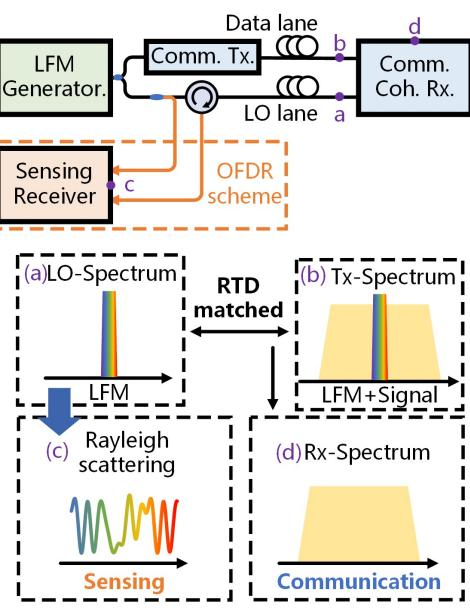
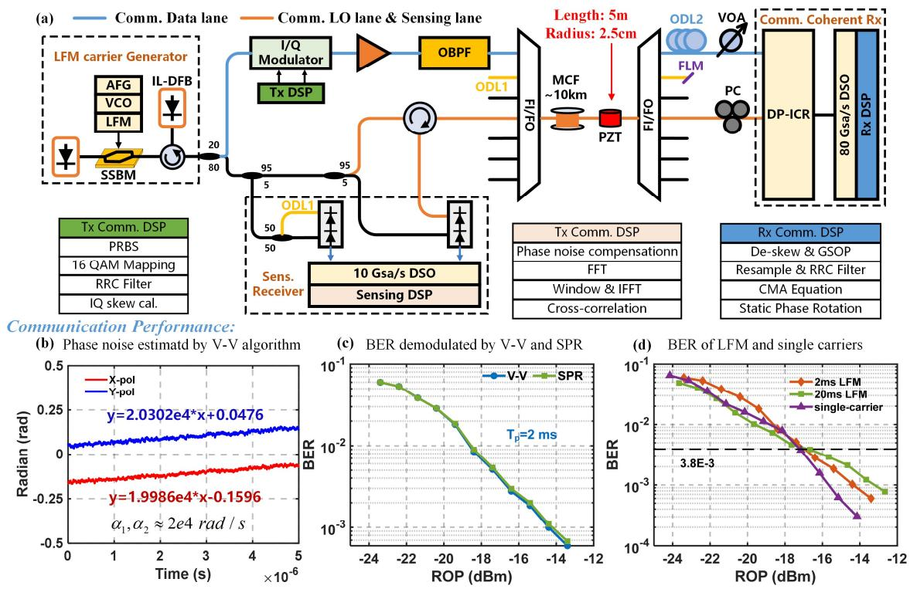
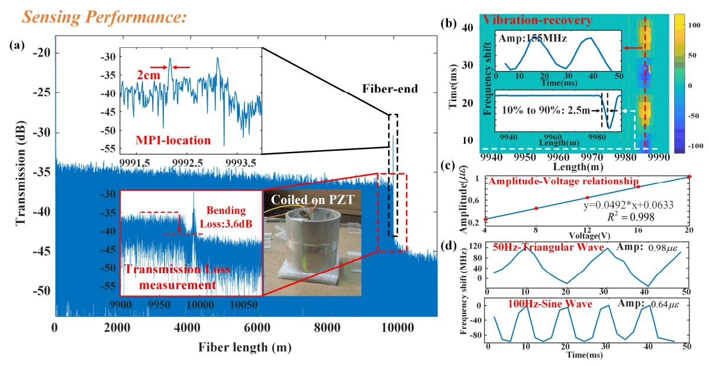

# LFM Carrier Enabled Integrated Sensing and Communication in Self-homodyne Coherent Detection Transmission System

Shuyan Chen, Bowen Yin, Huan He, Yang Shi, Mingming Zhang, Zhiyong Zhao\* Ming Tang\*

HUST, Wuhan, 430074, China, zhiyongzhao@hust.edu.cn, tangming@mail.hust.edu.cn

**Abstract**: We demonstrate integrated communication (25-Gbaud DP-16QAM, <1 dB penalty) and distributed sensing (2-cm spatial resolution) over 10-km MCF using linear-frequency-modulated carriers and self-homodyne coherent detection. Simultaneous optical multipath interference, transmission loss, and vibration monitoring are achieved without spectral overhead. ©2025 The Author(s)

#### Introduction

Self-homodyne coherent detection (SHCD) emerges as a low-cost and simplified solution in higher-speed data center interconnects (DCI), utilizing spatial-division-multiplexed (SDM) local oscillator (LO) and signal transmission to eliminate phase noise, thereby reducing digital signal processing (DSP) complexity [1]. While a critical challenge lies in constructing integrated sensing and communication (ISAC) systems capable of monitoring SHCD link health parameters, particularly optical multipath interference (MPI), transmission loss (TL), and vibration disturbances.

Current ISAC implementations in conventional heterodyne-detection systems typically employ wavelength-division multiplexing to separate sensing and communication channels, albeit at the cost of scarce spectral resources [2]. Alternative approaches using pilot tones [3] or realtime communication signals [4] to mitigate spectrum overhead but compromise transmission performance. While recent demonstration integrated distributed acoustic sensing (DAS) into SHCD systems [5], these methods still require in-band pilot insertion, limiting spectral efficiency. Furthermore, conventional DAS implementations relying on pulse time-of-flight measurements suffers from an inherent spatial resolution limitation dictated by pulse width (> 50cm) [6], proving inadequate for high-precision MPI and TL detection. The phase demodulation method in DAS also imposes amplitude limitations ( $< 1 \mu \varepsilon$ ) on vibration sensing due to phase unwrapping challenges [7].

In this paper we propose, for the first time, a linear frequency-modulated (LFM) carrier-enabled SHCD architecture to integrate high-fidelity communication and optical frequency-domain reflectometry (OFDR)-based sensing without additional spectrum occupation. Our design leveraging multicore fiber (MCF) for spatially isolated LO/signal transmission. For data transmission, the LFM-induced phase noise can be cancelled by coherent detection through precise signal-LO relative-time-delay (RTD) alignment. For sensing application, by establishing an intrinsic OFDR

Fig. 1: Proposed working principle

sensing mechanism in LO lane, we demonstrate 2-cm spatial resolution for distributed MPI/TL detection and large-strain vibration monitoring capability, implementing a robust and comprehensive ISAC solution for DCI.

## **Operation Principle**

The proposed ISAC scheme is illustrated in Fig.1, comprising an LFM generator module, communication transceivers, and a MCF link. An additional OFDR signal detection module is co-located with the communication transmitter. Figure (a)-(d) depict the optical spectra at different locations. In the SHCD implementation, both signal and local oscillator (LO) waves originate from the same LFM optical source, propagating through separate MCF cores to the remote integrated coherent receiver (ICR). Excluding constant noise terms in the links, the phase noise profiles at positions a (transmitter), b (LO), and c (receiver) are mathematically expressed as:

$$\varphi_a = t(2\pi f + \pi kt) \tag{1}$$

$$\varphi_b = (t + \Delta t) (2\pi f + \pi k (t + \Delta t)) \tag{2}$$

$$\varphi_c = 2\pi k \Delta t \cdot t + 2\pi f \Delta t - \pi k \Delta t^2 \tag{3}$$

where  $f, k, \Delta t$  denote the central wavelength of the optical source, the chirp rate of the LFM.

Fig. 2: (a) Experimental setup of proposed ISAC scheme in SHCD system (b)-(d) Communication performance evaluation

and RTD between the signal and LO, respectively. According to (3), when RTD is matched (∆=0), the LFM-induced phase noise cancels out as shown in Fig. 1(d). This eliminates the need for additional frequency offset estimation algorithms in DSP, consistent with conventional SHCD systems. Simultaneously, the LFM carrier in the LO path serves as the OFDR probe. Its Rayleigh backscattering (RBS) light (Fig. 1(c)) is coherently detected with the sensing LO through an interferometer and captured by a balanced photodetector (BPD). The OFDR system achieves distributed positioning of RBS in the frequency domain and its spatial resolution is determined by:

$$\Delta z = \frac{c}{2n\Delta F} \tag{4}$$

when transmitting in SSMF with LFM chirp range exceeding 100 MHz, the system achieves sub-meter resolution. Furthermore, the maximum detectable vibration amplitude is determined by the chirp range, which exceeds 1 .

#### Experimental Setup

We demonstrate ISAC in an SHCD system using a 10-km 7-core multicore fiber as the SDM transmission link. A 5-meter section of the MCF is wound around a piezoelectric ceramic (PZT) cylinder (radius=2.5 cm) to simulate environmental disturbances. Fig. 2(a) illustrates the experimental configuration. A narrow-linewidth fiber laser (NKT E15) generates the optical carrier, which undergoes LFM via a single-sideband modulator. The LFM waveform with 5 GHz bandwidth is synthesized using a wideband voltagecontrolled oscillator (ADF5709). The modulated carrier is then injected into an injection-locked DFB laser, amplifying the power to 13 dBm while suppressing residual sidebands. The LFM optical carrier splits via an 80:20 coupler into two branches: upper for data transmission and lower for LO. The upper branch modulates a signal using an IQ modulator, transmitting through an outer MCF core. An erbium-doped fiber amplifier and optical bandpass filter precondition the signal before transmission. The lower branch routes the LO through the central MCF core for remote coherent detection. At the receiver, an optical delay line compensates RTD between two paths. Received optical power (ROP) is adjusted via a variable optical attenuator before the ICR (NeoPhotonics μ40) [8]. Offline DSP is shown in Fig.2(a).

For sensing functionality, the LO branch simultaneously enables OFDR. A 95:5 coupler splits the LO light: 95% feeds the main interferometer (MI) for distributed sensing, while 5% supplies an auxiliary interferometer (AI) to compensate the phase noise from nonlinear frequency sweeping and environmental fluctuations. The MI injects probe light into the central MCF core, with RBS coherently mixed with the sensing LO. The AI implements an unbalanced Mach-Zehnder interferometer with 20-km path difference (equivalent to maximum round-trip time in the sensing path), realized through round-trip propagation in another outer MCF core. Both MI and AI beat signals are detected by BDPs, sampled at 2.5 GS/s, and processed through conventional OFDR demodulation algorithms [9].

Fig. 3: Sensing performance evaluation. (a)MPI location and TL measurement (b)-(d) Vibration recovery.

### Results and discussions

The 25-Gbaud dual-polarization 16QAM signal transmission performance using LFM carriers was firstly evaluated. Figure 2(b) presents the phase noise profiles of both polarizations estimated through the Viterbi-Viterbi (V-V) algorithm under 2-ms LFM periodicity. Both polarization states exhibit gradual linear phase noise accumulation with nearly identical slope coefficients (α₁, α₂ ≈ 2e4 rad/s). This phenomenon originates from residual RTD mismatch between signal and LO paths, as derived in Eq. (3). Notably, according to Eq. (3), the time delay ∆ can be calculated from the chirp rate and α₁, α₂, approximately 1.273 ns. The total phase variation per frame remains below 0.1 rad, demonstrating effective phase noise suppression. Bit error rate (BER) performance comparisons between conventional V-V and SPR algorithms are shown in Fig. 2(c). With received power varying from -13 to -24 dBm, both methods achieve equivalent BER performance, confirming minimal impact from residual linear phase terms on SPR-based demodulation. For benchmark comparison, a conventional singlecarrier SHCD system transmitting 200-Gbps DP-16QAM over 10-km MCF is tested. Fig. 2(d) compares BER performance under three scenarios: 2-ms LFM, 20-ms LFM, and single-carrier. At the 7% forward error correction (FEC) threshold, the proposed system exhibits <1 dB power penalty compared to conventional SHCD, experimentally validating near-complete LFM-induced phase noise cancellation with negligible communication performance degradation.

The OFDR sensing performance was tested using the 5-GHz LFM optical carrier with a 2-ms period as the probe in the 10-km LO path. Fig.

3(a) displays the RBS intensity profile along the fiber length, showing two Fresnel reflection peaks at the MCF end (upper inset) with measured 2 cm spatial resolution, close to the theoretical limit according to (4). The 5-m fiber section coiled on the 2.5-cm radius PZT exhibits ~3.6 dB intensity reduction (lower inset), quantifying bending loss for tight coiling. The calculated transmission loss over 10-km MCF exceeds 0.221 dB/km, demonstrating precise loss measurement capability. Vibration detection was tested using 50-Hz sinusoidal PZT excitation at 20 V amplitude. Figure 3(b) presents the time-distance frequency shift distribution, with upper inset showing recovered timedomain vibration (150 MHz shift corresponding to ~1 strain) [10] and lower inset demonstrating 2.5-m spatial resolution. The linear response between applied voltage on PZT and measured strain amplitude yields a coefficient of determination (R²) of 0.998 and sensitivity of 0.0492 /, as shown in Figure 3(c) Figure 3(d) further verifies high-fidelity vibration waveform recovery for various frequencies and patterns, confirming the system's superior dynamic sensing capability.

# Conclusions

This paper presents a spectrally efficient self-homodyne architecture integrating communication and sensing through LFM carrier. Through spatial-division multiplexing in MCF and coherent detection, the proposed system cancels LFMinduced communication impairments, enabling 200 Gbps transmission. OFDR sensor in LO path realizes high-accuracy MPI localization, transmission loss measurement, and large-strain vibration monitoring with 2-cm spatial resolution. This establishes a practical framework for realtime fiber health monitoring in SHCD systems.

#### Acknowledgements

The authors acknowledge National Key R&D Program of China (2023YFB2906303); Major Program (JD) of Hubei Province (2023BAA013); National Natural Science Foundation of China (62105111); Natural Science Foundation of Wuhan (2024040801020199)

#### References

- [1] Chen Y, Wang X, Zeng Y, Chen J, Li W, Zhang Y, Zhang M, Zhao C, Liu D, Tang M. "All-optical polarization split of the signal and LO for a bi-directional self-homodyne coherent system." Optics Letter. 2021 Jun 15;46(12):2819- 2822. DOI: 10.1364/OL.427789
- [2] S. Guerrier, K. Benyahya, C. Dorize, E. Awwad, H. Mardoyan and J. Renaudier, "Vibration Detection and Localization in Buried Fiber Cable after 80km of SSMF using Digital Coherent Sensing System with Co-Propagating 600Gb/s WDM Channels," 2022 Optical Fiber Communications Conference and Exhibition (OFC), San Diego, CA, USA, 2022, pp. 1-3. DOI: 10.1364/OFC.2022.M2F.3
- [3] Zihe Hu, Mingming Zhang, Yuqi Li, Junda Chen, Weihao Li, Yuxuan Xiong, Luming Zhao, Can Zhao, and Ming Tang, "Enabling endogenous distributed acoustic sensing in a digital subcarrier coherent transmission system," Optics Letter. 49, 3166-3169 (2024). DOI: 10.1364/OL.524132
- [4] Martins HF, Shi K, Thomsen BC, Martin-Lopez S, Gonzalez-Herraez M, Savory SJ. Real time dynamic strain monitoring of optical links using the backreflection of live PSK data. Optics Express. 2016 Sep 19;24(19):22303-18. DOI: 10.1364/OE.24.022303
- [5] E. Ip, Y. -K. Huang, T. Wang, Y. Aono and K. Asahi, "Distributed Acoustic Sensing for Datacenter Optical Interconnects using Self-Homodyne Coherent Detection," 2022 Optical Fiber Communications Conference and Exhibition (OFC), San Diego, CA, USA, 2022, pp. 1-3.
- [6] Z. He and Q. Liu, "Optical Fiber Distributed Acoustic Sensors: A Review," in Journal of Lightwave Technology, vol. 39, no. 12, pp. 3671-3686, 15 June15, 2021, doi: 10.1109/JLT.2021.3059771.
- [7] Muñoz, F., Soto, M.A. Enhancing fibre-optic distributed acoustic sensing capabilities with blind near-field array signal processing. Nature Communications 13, 4019 (2022). DOI: https://doi.org/10.1038/s41467-022-31681-x
- [8] T. Gui, J. Cao, X. Chen, K. Zheng, S. Yuan, X. Fang, Y. Lei, Q. Zhan, D. Wang, Q. Sui, Z. Li, and L. Li., "Real-time Single-Carrier 800Gb/s DP-64QAM Demonstration using Bi-Directional Self-homodyne Coherent Transceivers with 200krad/s Endless Active Polarization Controller," 2021 Opto-Electronics and Communications Conference (OECC), Hong Kong, 2021, pp. 1-3, DOI: 10.1364/OECC.2021.T5A.5.
- [9] X. Fan, Y. Koshikiya and F. Ito, "Phase-Noise-Compensated Optical Frequency-Domain Reflectometry," in IEEE Journal of Quantum Electronics, vol. 45, no. 6, pp. 594- 602, June 2009, DOI: 10.1109/JQE.2009.2013114
- [10] Y. Koyamada, M. Imahama, K. Kubota and K. Hogari, "Fiber-Optic Distributed Strain and Temperature Sensing With Very High Measurand Resolution Over Long Range Using Coherent OTDR," in Journal of Lightwave Technology, vol. 27, no. 9, pp. 1142-1146, May1, 2009, DOI: 10.1109/JLT.2008.928957.