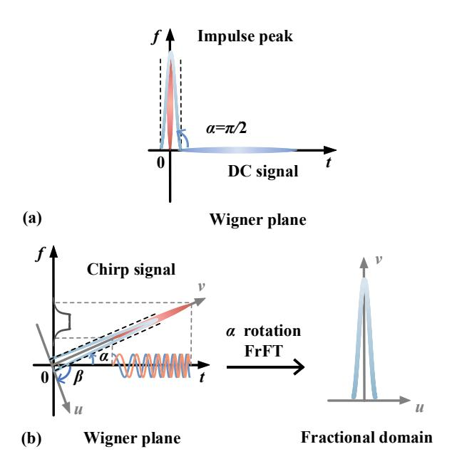
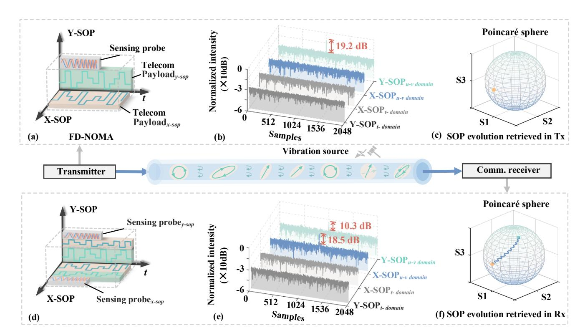
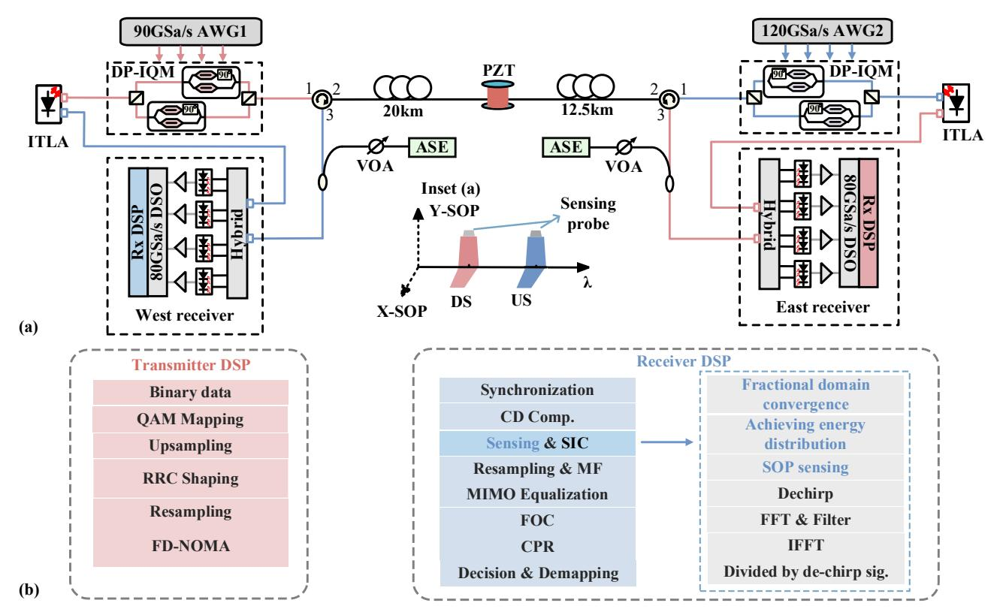
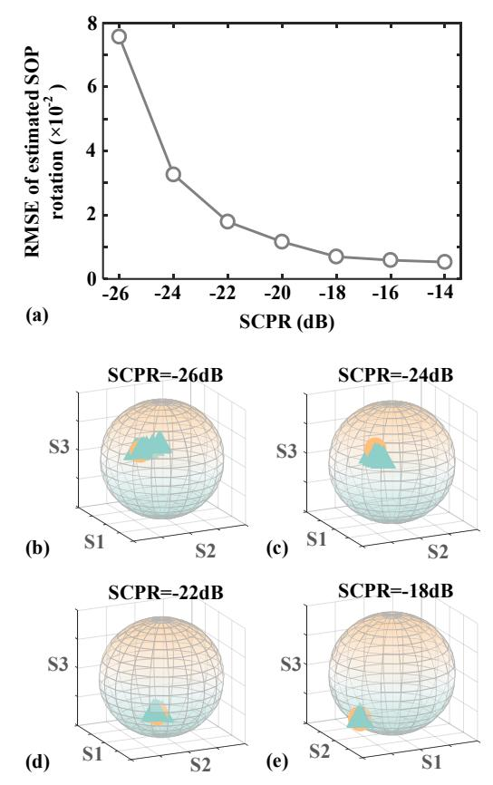
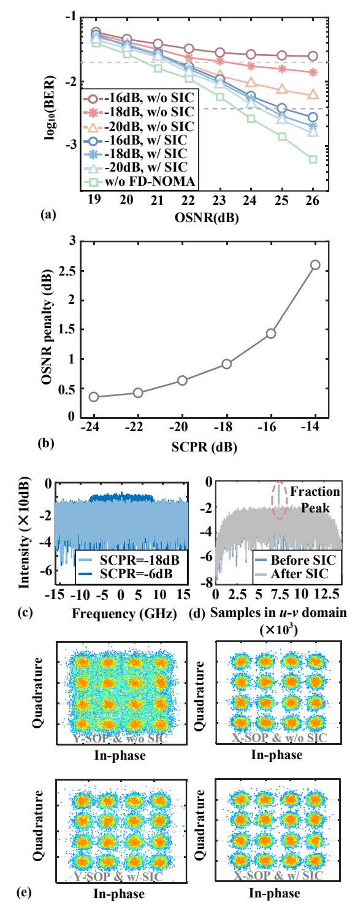
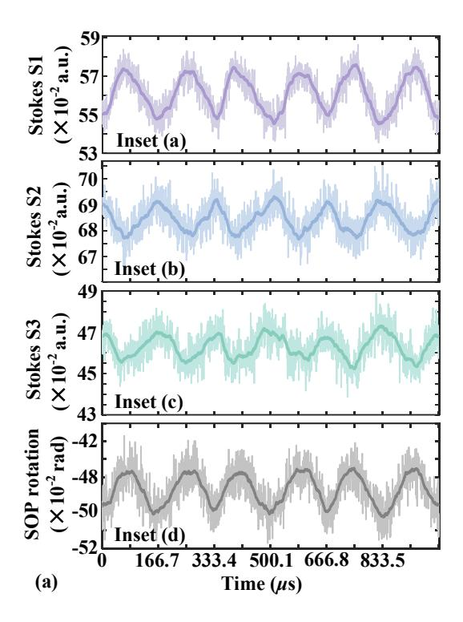
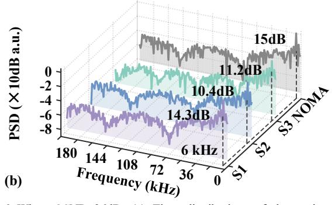
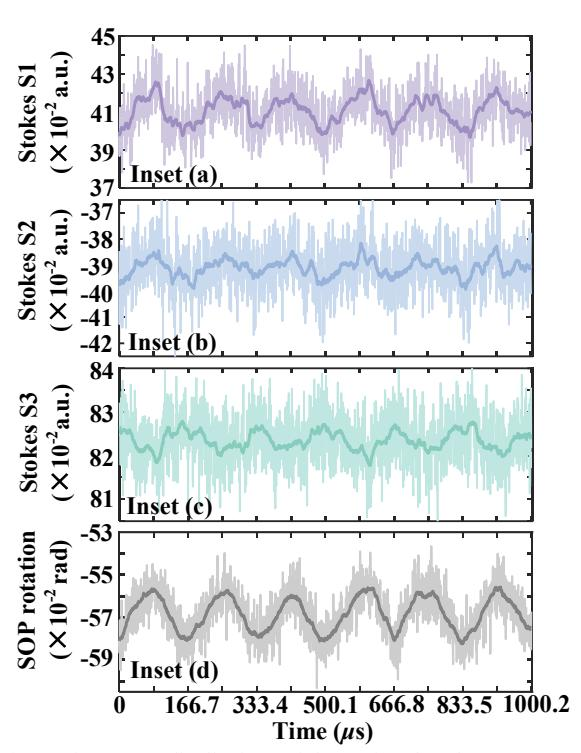
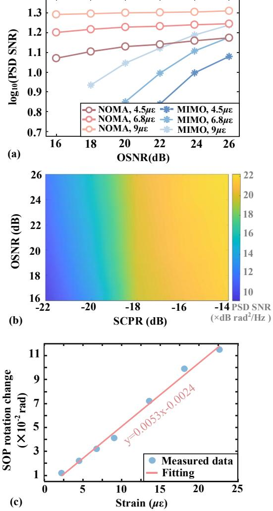
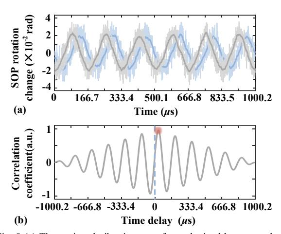

{0}------------------------------------------------

# 1

# Integrated Communication and In-band Spectrum Polarization-Based Sensing via Fraction-Division Non-Orthogonal Multiple Access

Li Wang † , Yue Wang† , Yibin Li, Zhonghong Lin, Zixian Wei, Chao Lu, *Senior Member*, *IEEE*, *Fellow*, *OSA,* Changyuan Yu, *Senior Member*, *IEEE*, *Fellow*, *OSA* and Ming Tang, *Senior Member*, *IEEE*

*Abstract***—We have proposed and experimentally validated an integrated scheme of in-band spectrum polarization sensing and standard coherent communication via fraction-division nonorthogonal multiple access (FD-NOMA). Processed through fractional Fourier transform (FrFT), the chirp-based sensing probe is superimposed onto telecom payload in an orthogonal polarization state. The temporal and spectrum resources originally intended for telecom are utilized for forward sensing. By leveraging energy-compaction property of FrFT, the sensing probe can converge to fractional peak while telecom payload remains dispersed. Therefore, the sensing probe and telecom payload are orthogonal to each other in matched fraction domain. The energy distribution of fractional peak between orthogonal SOPs can be obtained to achieve vibration-induced SOP sensing. The feasibility of integration of in-band spectrum sensing and communication is verified by an experiment of bidirectional 480Gb/s DP-16QAM transmission over 32.5 km fiber. To mitigate probe-induced impact, successive interference cancellation (SIC) involving matched de-chirping is proposed to improve optical signal to noise ratio (OSNR) penalty from more than 3.0dB to 0.7dB. Experimental results of sensing performance demonstrate that the signal-to-noise ratio (SNR) of recovered vibration waveform using FD-NOMA deteriorates by less than 0.9dB as OSNR degrades from 26dB to 18dB. In contrast, conventional adaptive equalization exhibits severe SNR penalty of approximately 8.9 dB. The sensitivity and the limit of detection (LoD) are 5.3×10-3 rad/***μ***ε and 70.7** *n***ε/√Hz respectively, with vibration localization error equivalent to 8 m.**

*Index Terms***—Integrated sensing and communication, nonorthogonal multiple access, optical fiber communication, optical fiber polarization**

This paragraph of Manuscript received Date Month, Year; revised Date Month, Year; accepted Date Month, Year. Date of publication Date Month, Year; date of current version Date Month, Year. This work was supported by supported by National Nature Science Foundation of China (NSFC) under Grant 62225110 and Fujian Natural Science Foundation Project 2025J08138. (*Corresponding author: Yibin Li and Ming Tang*.)

Li Wang, Yue Wang, Yibin Li, Zixian Wei, Chao Lu and Changyuan Yu are with Photonics Research Center, Department of Electrical and Electronic Engineering, Hong Kong Polytechnic University, Hong Kong, China. (e-mail: li2wang@polyu.edu.hk;11783583879@qq.com;1yibinxm.li@connect.polyu.h k; zixian.wei@polyu.edu.hk;chao.lu@polyu.edu.hk;changyuan.yu@polyu.edu .hk). † These authors contributed equally to this work.

Zhonghong Lin and Ming Tang are with the National Engineering Laboratory of Next Generation Internet Access Networks, School of Optical and Electronic Information, Huazhong University of Science and Technology, Wuhan, China. (e-mail: kin@hust.edu.cn; tangming@mail.hust.edu.cn).

Color versions of one or more of the figures in this article are available online at http://ieeexplore.ieee.org

# I. INTRODUCTION

HE burgeoning adoption of the Internet of Things (IoT), extended reality (XR), and low-altitude economic activities is catalyzing the evolution of wireless communication beyond the 5G (B5G)/6G paradigms [1, 2]. This shift is transforming networks from mere datatransmission into intelligent infrastructures incorporating integrated sensing and communication (ISAC) capabilities [3]. Concurrently, the maturation of distributed optical fiber sensing (DOFS) technology presents an inherently promising platform for ISAC within optical fiber transmission networks [4]. Coherent optical fiber networks, spanning transoceanic links, metropolitan area networks (MANs), and fiber-to-thehome (FTTH) systems, offer a natural foundation for ISAC due to widespread deployment and full optical field recovery [6-8]. Therefore, it enables the potential for ISAC and presents a promising avenue for enhancing the utility and efficiency of optical fiber networks. T

Leveraging existing infrastructure for vibration sensing has motivated ISAC approaches utilizing wavelength-division multiplexing (WDM) [10-12]. These typically integrate phasesensitive optical time-domain reflectometry (*φ*-OTDR) with telecom payloads. However, such an approach requires the reservation of dedicated spectral channels for sensing probes, inevitably compromising spectral efficiency (SE) for communication purposes. Furthermore, it merely shares the fiber medium with two distinct transceivers, leading to substantial infrastructure costs. By sharing existing hardware components such as digital-to-analog converters (DACs) and analog-to-digital converters (ADCs), ISAC over datacenter interconnect (DCI) offers a cost-reduction pathway [12], yet its feasibility remains confined to bidirectional self-homodyne system architectures. Recently, multi-frequency telecom pilots designed for polarization demultiplexing serve as sensing probes [13]. However, the pilots need spectral gaps to be located in, which is preferable in digital subcarrier multiplexing. Time-division multiplexing (TDM) combined with WDM to alleviate interference fading in distributed acoustic sensing (DAS) [14], also incur SE penalties. An alternative scheme to implement DAS through mode division multiplexing (MDM) or space division multiplexing (SDM) face practical limitations due to the overwhelming dominance of legacy single-mode fiber (SMF) networks [15, 16]. A

{1}------------------------------------------------

common drawback of the aforementioned methods is their reliance on dedicated orthogonal resources, whether in time, frequency, or space exclusively reserved for sensing. To overcome this constraint and realize endogenous ISAC, the optical carrier, pilot or information-bearing signal originally intended for communication can be repurposed for in-band spectrum sensing. The optical pilot inserted at spectrum edge can serve as sensing probes to improve signal to noise ratio (SNR) of backscattering trace. However, the effective number of bits (ENOB) constrains achievable sensing performance [17]. It has been suggested that in-band spectrum sensing can be achieved by exploiting digital signal processing (DSP) inherent to coherent communication systems, such as multiple input multiple output (MIMO) or phase recovery [18-20]. The vibration sensing utilizing optical phase achieves higher sensitivity and SNR compared to that using polarization state. Nevertheless, such an approach requires the replacement of conventional external cavity lasers with lasers that offer greater phase stability to minimize phase noise, thereby increasing hardware complexity. Furthermore, performance of such DSP-derived sensing suffers from optical signal-to-noise ratio (OSNR) of telecom signal. By using frequency-domain pilot tones (FPTs) in phase-based sensing, the requirement of linewidth of laser can be relaxed to 100 kHz [20]. However, the subcarrier intervals are needed to insert the FPTs.

In this paper, an integrated scheme of in-band spectrum polarization sensing and standard coherent communication via fraction-division non-orthogonal multiple access (FD-NOMA) is proposed. Originated from constant signal through fractional Fourier transform (FrFT), the chirp signal serving as sensing probe is superimposed on telecom payload of Y-state of polarization (Y-SOP). Characterized by specific FrFT rotation, the chirp-based sensing probe can converge to energy-concentrated peak and then be distinguished in fraction domain even though it shares temporal and spectrum resources with telecom payload. The vibration-induced SOP evolution, which results in energy distribution, can be estimated by leveraging converged fraction peaks. The proof-of-concept experiment has been validated using bidirectional 60GBaud dual-polarization (DP) 16 quadrature amplitude modulation (QAM) signal over 32.5 km fiber. The sensing performance of FD-NOMA without sacrificing spectrum efficiency, is demonstrated through dynamic measurements of 6kHz frequency vibration, attaining vibration localization error equivalent to 8 m. The sensitivity and the limit of detection (LoD) are  $5.3 \times 10^{-3}$  rad/ $\mu\epsilon$  and 70.7  $n\epsilon/\sqrt{\text{Hz}}$  respectively, Besides, successive interference cancellation (SIC) is proposed to mitigate effect of sensing probe, leading to more than 2.3dB optical signal to noise ratio (OSNR) improvement. Experimental results show that the FD-NOMA is robust against amplifier spontaneous emission (ASE) noise, leading to 0.9dB degradation of signal-to-noise (SNR) of retrieved vibration as OSNR decreases from 26dB to 18 dB.

The remainder of this paper is organized as follows. Section II introduces the principle of in-band spectrum sensing by

utilizing chirp-based sensing probe. The orthogonality between sensing probe and telecom payload is also discussed. Section III presents experimental setup utilized to verify the performance of polarization sensing, where the SIC to mitigate effect of sensing probe is introduced. In Section IV, along with experimental results, we discuss the performance of sensing utilizing FD-NOMA, which is compared to that obtained using conventional multiple-input multiple output (MIMO) equalization. In addition to sensing results, the OSNR improvement brought by SIC is also introduced for communication. Finally, we summarize the paper.

#### II. PRINCIPLE

#### A. Brief Introduction of FrFT

The FrFT of signal f(t) with rotation angle  $\alpha$  or transform order p can be expressed as [21]:

$$F_{\alpha}(u) = \int_{-\infty}^{\infty} f(t)K_{\alpha}(t,u) dt \tag{1}$$

where rotation angle  $\alpha$  is relevant to the transform order p in time-frequency domain with relationship  $p=2\alpha/\pi$ . The integral kernel  $K_{\alpha}(t, u)$  of FrFT is represented by:

$$K_{\alpha}(t,u) = \begin{cases} \sqrt{(1-j\cot\alpha)/2\pi} \\ \exp\left[j(t^2+u^2)/2\cot\alpha - jtu/\sin\alpha\right], \alpha \neq n\pi \\ \delta(t+u), \alpha = (2n\pm1)\pi \\ \delta(t-u), \alpha = 2n\pi \end{cases}$$
(2)

where the exp is exponential function and n is arbitrary integer. From perspective of Wigner plane illustrated in Fig.

Fig. 1 (a) Fourier transform can be regarded as FrFT with 90-degree rotation in Wigner plane. (b)Optimal fraction domain where time-frequency distribution of chirp squeezes to its minimum.

{2}------------------------------------------------

1(a), the characterization of direct current signal aligns parallel to the time axis (t-axis) due to its constant frequency value. Through FrFT with rotation angle  $\alpha$ , DC signal undergoes a transformation into a chirp signal, characterized by nonstationary frequency dynamics and a large time-bandwidth product, as shown in Fig. 1(b). The frequency modulation (FM) slope of chirp signal is intrinsically governed by the rotation angle  $\alpha$  (or equivalently, the transform order p). Critically, for a chirp signal generated via FrFT rotation  $\alpha$ , there exists an optimal fractional domain defined by rotation angle  $\beta$ . Within this domain, the time-frequency distribution of chirp squeezes to its minimum [21-23], which means that the chirp signal converges to impulse peak with maximal energy compaction. The converged or aggregated peak in  $\beta$  rotation fractional domain is depicted in Fig. 1(b), where the u-axis and v-axis denote the time axis and frequency axis after the rotation of FrFT. Notably, the conventional Fourier transform represents a specific case of FrFT with rotation angle  $\alpha = \pi/2$ . To achieve convergence peak, the fraction domain is supposed to satisfy the relationship that can be expressed as:

$$\beta = \frac{\pi}{2} - \alpha \tag{3}$$

Under this optimal rotation  $\beta$ , the chirp signal is mapped to impulse peak in the fractional domain. The amplitude and temporal duration of the original chirp signal directly determine the amplitude of convergence peak.

# B. Principle of In-band Spectrum Polarization sensing To enable polarization-based sensing without

compromising SE, a chirp-based sensing probe generated by applying  $\alpha$ -rotation FrFT to a DC signal is superimposed onto telecom payload, forming FD-NOMA signal. As illustrated in Fig. 2(a), the sensing probe, represented in gray, is overlaid on the telecom payload of the Y-SOP at the transmitter. The light beige and green blocks signify the telecom payloads of the X-SOP and Y-SOP, respectively. The sweeping frequency of the sensing probe is intentionally positioned within the spectral band occupied by telecom payloads. This allocation enables the proposed FD-NOMA scheme to achieve co-residence of sensing and communication signals on identical time-frequency resources without dedicated channel. By utilizing the characteristic of chirp processed through FrFT, the sensing probe and telecom payload can be distinguished in fraction domain. A  $\beta$ -rotation FrFT selectively compresses chirpprocessed sensing probes (where  $\alpha + \beta = \pi/2$ ) into energyconcentrated impulse peak, while telecom payloads remain dispersed in the fractional domain. Consequently, FD-NOMA resolves sensing probes within their optimized fractional coordinates despite full resource sharing with telecom signals in temporal and spectrum dimensions.

In order to evaluate the extraction capability of FD-NOMA, a sensing probe transformed via  $\alpha$ -rotation FrFT is superimposed onto the Y-SOP telecom payload at the transmitter, with the telecom power dominant by 21 dB. The corresponding waveforms colored in light and dark grey in time domain are illustrated in Fig. 2(b). Serving as additive noise, the sensing signal is drowned in telecom

Fig.2 (a) Transmitted FD-NOMA signal composed of chirp-based sensing probe and telecom payload. (b) Converged peaks obtained by sensing probe can be distinguished in matched fraction domain. (c) The SOP evolution recovered in transmitter. (d) Received FD-NOMA after SOP evolution. (e) Vibration-induced SOP evolution results in energy redistribution in fractional domain. (f) The SOP evolution recovered in receiver.

{3}------------------------------------------------

payload in time domain. To distinguish the telecom payload and sensing signal, the telecom payloads for each SOP undergo FrFT operations with  $\beta$  rotation, which are also shown in Fig. 2(b). The blue and grey labels in Fig. 2(b) indicate that the telecom payloads of X-SOP and Y-SOP in matched fraction domain, respectively. Despite the impact of the telecom payload playing role of severe background noise, the FD-NOMA can highlight the fractional peak by leveraging the inherent energy-compaction property of FrFT. The ratio of peaks to the noise floor obtained still achieves 19.2dB in fractional domain. Therefore, the sensing probe severely affected by telecom payload can still be significantly distinguished by FD-NOMA in the matched fraction domain.

The transmitted sensing probe can be represented using the Jones vector as follows:  $T_{SOP}$ =[0,  $F_{\alpha}(u)$ ]. At the transmitter, the sensing probe is allocated to the Y-SOP. As the signal propagates along the fiber, the SOP evolution is modulated by vibration, inducing polarization mode coupling between the two orthogonal SOPs. Consequently, under the influence of this SOP evolution, the received sensing signal can be expressed as:

$$\begin{bmatrix} R_x \\ R_y \end{bmatrix} = \begin{bmatrix} \cos \theta e^{j\varepsilon} & -\sin \theta e^{-j\gamma} \\ \sin \theta e^{j\gamma} & \cos \theta e^{-j\varepsilon} \end{bmatrix} \cdot \begin{bmatrix} S_x + n_x \\ F_\alpha(u) + S_y + n_y \end{bmatrix}$$
(4)

Here,  $\gamma$ ,  $\varepsilon$ , and  $\theta$  correspond to the phase retarders and the orientation or rotation of the SOP, respectively.  $S_x$  and  $S_y$  represent the telecom payloads of the X-SOP and Y-SOP, while  $n_x$  and  $n_y$  denote the noise components in the X-SOP

and Y-SOP, respectively. As depicted in Figure 2(d), a portion of the sensing signal energy couples into the X-SOP, resulting in the superposition of telecom payloads and the sensing signal within this SOP. Despite being influenced by SOP evolution and telecom payloads, the sensing probe can still be effectively extracted in the matched fractional Fourier domain. The received FD-NOMA signal of each SOP undergoes an FrFT operation with a rotation angle of  $\beta$ , producing aggregated fraction peaks in the received X-SOP and Y-SOP. Figure 2(e) presents the resulting FD-NOMA signals of dual polarization after matched FrFT processing. The convergence peaks emerge in fractional domain of the received X-SOP and Y-SOP. Supposing that fractional peaks of X-SOP and Y-SOP are defined as  $X_{\alpha}$ and  $Y_{\alpha}$  respectively, the received FD-NOMA signal in matched fraction domain can be represented as:

$$A_{c}^{2}I\begin{bmatrix}\sin^{2}\theta\\\cos^{2}\theta\end{bmatrix} + \begin{bmatrix}\cos^{2}\theta - A_{c}\sin2\theta\cos(\gamma + \varepsilon)\\\sin^{2}\theta + A_{c}\sin2\theta\cos(\gamma + \varepsilon)\end{bmatrix} + \begin{bmatrix}n'_{x}\\n'_{y}\end{bmatrix} = \begin{bmatrix}X_{\alpha}\\Y_{\alpha}\end{bmatrix}$$
 (5)

Where  $A_c$  denotes the convergence peak value in matched fraction domain. For determined FrFT rotation angle,  $A_c$  is dependent on the amplitude and time duration of transmitted sensing probe. I indicates  $2\times 2$  identity matrix.  $n_x'$  and  $n_y'$  stand for the  $n_x$  and  $n_y$  in fractional domain, respectively.  $n_x'$  and  $n_y'$  comprise two types of noise: additive white Gaussian noise and the telecom payloads, which serve as background noises from perspective of sensing probe. The fractional noise term  $n_y'$  or  $n_y'$  is much

Fig. 3 (a) Experimental setup of bidirectional DP-16QAM signal transmission, VOA variable optical attenuator. (b) The DSP in transmitter and receiver.

{4}------------------------------------------------

smaller than aggregated peak  $A_c$  due to significant convergence of matched FrFT. Therefore, the energy distribution between  $Y_{\alpha}$  and  $X_{\alpha}$  can be expressed as:

$$\frac{X_{\alpha}}{Y_{\alpha}} = \frac{\sin^{2}\theta - \sin 2\theta \cos(\gamma + \varepsilon) / A_{c} + (n_{x}^{'} + \cos^{2}\theta) / A_{c}^{2}}{\cos^{2}\theta + \sin 2\theta \cos(\gamma + \varepsilon) / A_{c} + (n_{x}^{'} + \sin^{2}\theta) / A_{c}^{2}}$$

$$\approx \tan^{2}\theta, n_{x/y}^{'} \le 1 \ll A_{c} \tag{6}$$

Therefore, the SOP rotation can be achieved by:

$$\theta = \arctan(\frac{X_{\alpha}}{Y_{\alpha}})^{\frac{1}{2}} \tag{7}$$

It is noteworthy that the fractional energy distribution depends on the evolution of SOP. Consequently, this energy distribution can be utilized to estimate vibration-induced SOP rotation. As depicted in Fig. 2(c), the transmitted sensing probe initially possesses a linear SOP, represented by its position on the Poincaré sphere. External disturbances applied to the fiber induce SOP evolution, resulting in a positional shift of this state on the Poincaré sphere. Fig. 2(f) illustrates the process by which the SOP on the Poincaré sphere gradually transitions from a linear-state to a leftcircular state, influenced by vibration and the intrinsic birefringence of fiber. By estimating the vibration-induced energy distribution in the matched fraction domain, forward sensing can be achieved without sacrificing SE for communication. As the sensing probe shares temporal and spectrum resources with the telecom payload, the interference derived from sensing probe is supposed to be mitigated by successive interference cancellation (SIC) composed of matched de-chirping. Since the frequency modulation slope of the chirp is related to the rotation angle  $\alpha$ , the de-chirping signal  $F_{-\alpha}(u)$ , whose FM slope is opposite to that of the sensing probe  $F_a(u)$ , can be employed for matched de-chirping. Applying the de-chirping signal  $F_{-\alpha}$ (u) transforms the sensing probe into a fixed-frequency signal. The received FD-NOMA signals for the dual polarizations can then be expressed as:

$$F_{-\alpha}(u) \cdot \begin{bmatrix} R_x \\ R_y \end{bmatrix} = A \begin{bmatrix} -\sin\theta e^{-j\gamma} \exp(2\pi f_0 t) \\ \cos\theta e^{-j\varepsilon} \exp(2\pi f_0 t) \end{bmatrix}$$
$$+F_{-\alpha}(u) \cdot \begin{bmatrix} (S_x + n_x)\cos\theta e^{j\varepsilon} - (S_y + n_y)\sin\theta e^{-j\gamma} \\ (S_x + n_x)\sin\theta e^{j\gamma} + (S_y + n_y)\cos\theta e^{-j\varepsilon} \end{bmatrix}$$
(8)

where  $f_0$  is the initial frequency of the sensing probe. A denotes amplitude of sensing probe. As evident from Eq. 8 (where noise components are omitted for simplicity), the sensing probe  $F_a(u)$  is transformed into a constant-frequency signal. Consequently, the de-chirping sensing probe can be filtered in the frequency domain to mitigate its effect on the telecom payload. The corresponding DSP flow of SIC will be discussed in the next section.

#### III. EXPERIMENT SETUP

To validate the feasibility of in-band spectrum sensing via FD-NOMA signal, a bidirectional experiment employing 60-Gbaud 16QAM signals is conducted with the setup illustrated in Fig. 3(a). The downstream (DS) and upstream (US) paths, depicted in red and blue respectively, are separated via wavelength. In the DS transmitter, an integrated tunable laser assembly (ITLA) operating at 1550.1 nm (linewidth ~200 kHz) serves as the optical source. A sequence of 16QAM symbols with length of 215 are generated and shaped by root raised cosine (RRC) filter. After resampling, the 16QAM signal is generated via an 90GSa/s arbitrary waveform generator (AWG1, Keysight 8196). A chirp probe corresponding to a 0.1-order FrFT rotation is introduced in the Y-SOP. The purpose of utilizing 0.1-order FrFT rotation is to prevent energy dispersion induced by emergence of multiple convergence peaks [22]. This can lead to degradation of estimation performance of SOP rotation since low-peak-value convergence peak is more susceptible to the influence of teleom signal and noise. This probe spanning 214 samples, is superimposed onto the telecom payloads to form the FD-NOMA signal. The electrical FD-NOMA signal subsequently drives a coherent driver modulator (CDM, NeoPhotonics). The downstream signal is received using an optical 90° hybrid and four balanced photodiodes (BPDs) for coherent detection of the dual-polarization signal. For the US path, an ITLA at

Fig. 4 (a) The RMSE of estimated SOP versus SCPR. (b), (c), (d) and (e) correspond to estimated SOPs on Poincaré sphere when SCPR=-26dB, -24dB, -22dB and -18dB respectively

{5}------------------------------------------------

1550.9 nm feeds a dual-polarization IQ modulator (DP-IQM, Fujitsu 7992) driven by AWG2 (Keysight 8194). An integrated coherent receiver (ICR, NeoPhotonics) is employed to receive US signal. For both US and DS signals, two digital storage oscilloscopes (RTOs, Keysight DSAZ594A) with a sampling rate of 80 GSa/s independently capture the data after optical-to-electrical. To evaluate sensing performance, a 6meter piezoelectric transducer (PZT), positioned 20 km from the DS transmitter and 12.5 km from the US transmitter, is applied. The receiver DSP flow is shown Fig. 3(b). The chromatic dispersion (CD) compensation is performed for chirp-based probe to prevent the drift of FrFT order. By utilizing convergence characteristics of FD-NOMA, SIC can be utilized to mitigates the interference on payloads. After achieving polarization sensing, matched de-chirping using signal with opposite FrFT rotation transforms the sensing probe into a fixed-frequency tone. Subsequent FFT-based filtering suppresses frequency-domain the components. Finally, telecom payload is recovered through inverse operation of FFT and matched de-chirp.

#### IV. EXPERIMENTAL RESULTS AND DISCUSSIONS

Since the sensing probe shares the temporal and spectrum resource with telecom payload, the sensing-to-communication power ratio (SCPR) is defined as power distribution between sensing probe and transmitted telecom payload to demonstrate whether the convergence peak is distinguished from data signal. The SCPR can be expressed as:

$$SCPR = 20 \cdot \log_{10}(\frac{|A_s|}{|A_c|}) \tag{9}$$

where  $A_s$  and  $A_c$  denote the amplitude of the sensing probe and telecom payload, respectively. The dependence of SOP rotation estimation performance on the SCPR is illustrated in Fig. 4(a). For reference, the benchmark SOP is obtained using the converged weight coefficients of MIMO finite impulse response (FIR) filter of a non-NOMA communication signal. It can be observed that root mean square error (RMSE) improves from  $7.8 \times 10^{-2}$  to  $5.3 \times 10^{-3}$  as the SCPR increases. This performance enhancement is attributed to a more pronounced convergence peak emerging in fraction domain. Fig. 4(b) to (e) depict the estimated SOPs corresponding to SCPR ranging from -26 dB to -18 dB. On the Poincaré sphere representations, yellow circles correspond to the reference SOP, while green triangles represent the measured SOPs obtained via the sensing probe. It is important to note that the Stokes vectors originate from the SOP rotation facilitated by FD-NOMA and the phase retarders which are determined using the converged values of MIMO coefficients. Figs. 4(b) to (e) reveals that higher SCPR levels correlate with a reduction in the average deviation between estimated SOP and reference SOP, which means that higher SCPR values yield enhanced estimation performance. However, excessively high SCPR detrimentally impacts communication signal quality. Consequently, it is imperative to investigate the impact of SCPR on telecom payload and achieve the trade-off between sensing and communication performance. Fig. 5(a) illustrates

the impact of SCPRs corresponding to -16dB, -18dB and -20dB on telecom payload. For SCPR equivalent to -16dB, the BER exhibits no significant improvement when the OSNR exceeds 23 dB. This situation occurs because the sensing probe-induced noise dominates over ASE noise in high OSNR region. Fig. 5(c) illustrated the spectrum of FD-NOMA signal

Fig. 5(a) BER performance with and without SIC versus OSNR. (b) OSNR penalty of telecom payload versus SCPR. (c) The spectrum of FD-NOMA signal. (d) The fractional domain spectrum of sensing probe before and after SIC (e) The comparison of 16QAM signal between constellations without and with SIC.

{6}------------------------------------------------

consisting of telecom payload and sensing probe. When the SCPR is -6 dB, the normalized intensity of signal within bandwidth from -7.5 to 7.5 GHz is elevated. This elevation is attributed to the presence of a high-power sensing probe resulting in an uneven spectrum across the entire FD-NOMA signal. The spectrum of FD-NOMA signal is relatively flat with SCPR=-18dB. Although the sensing signal is not discernible on the spectrum at this SCPR, it can be extracted due to energy-compaction property, resulting in a convergence peak in the fractional domain. The fractional peak is depicted in Fig. 5(d). After SIC, the convergence peak is reduced significantly in fractional domain. Constellation diagrams for 16QAM after MIMO adaptive equalization and phase recovery without SIC are presented in Fig. 5(e). The Y-SOP constellation samples exhibit decision boundary ambiguity due to superposition with the sensing probe signal. Compared to Y-SOP constellation samples, the X-SOP constellation demonstrates clearer boundaries. This is because over half of the telecom payload does not undergo non-orthogonal access

Fig. 6 When OSNR=26dB: (a) Time distributions of the retrieved Stokes parameters and SOP rotation for 6kHz vibration using MIMO equalization (inset a to c) and FD-NOMA (inset d) respectively. (b) The power spectral density of Stokes parameters and SOP rotation.

multiplexing with the sensing signal. Consequently, adaptive equalization successfully achieves convergence and polarization demultiplexing utilizing this unmixed FD-NOMA component, thereby mitigating the influence of sensing probe of Y-SOP on telecom payload of X-SOP. For comparison, Fig. 5(c) presents the corresponding constellation diagram with SIC implementation. Matched dechirping and frequency filtering effectively suppress the majority of sensing signal interference. According to Fig. 5(a), BER analysis demonstrates OSNR penalty exceeding more than 3 dB for hard decision forward error correction (HD-FEC) threshold at -20 dB SCPR. Superior to the performance without SIC, the BER performance is slightly worse than that without FD-NOMA, leading to 0.7dB OSNR penalty under HD-FEC at SCPR of -20dB. For soft decision forward error correction (SD-FEC) threshold at -16 dB SCPR, the SIC results in 4.2dB improvement of OSNR penalty. The OSNR penalty of HD-FEC using SIC is demonstrated in Fig. 5(b). Analysis of Fig. 5(b) and Fig. 4(a) reveals a critical trade-off: although higher SCPR values enhance the accuracy of SOP estimation, this improvement incurs progressively higher OSNR costs. To achieve an optimal balance between sensing precision and communication efficacy, an SCPR value of -18 dB is determined and subsequently adopted for all further experimental validation.

To demonstrate the sensing probe performance with -18 dB SCPR, dynamic measurements have been implemented. The experimental setup utilized an FD-NOMA signal frame length of 215 symbols and DSO sampling rate of 80 GSa/s, resulting in corresponding SOP sampling rate of 1.83 MHz. Given a one-way propagation time of 157.08 µs over 32.5 km of fiber, the maximum unambiguous vibration frequency measurable within a single signal period was determined to be 6.37 kHz. This limitation arises from cross-correlation ambiguity when multiple signal periods span the measurement duration (the single-pass transit time of light) [24]. Accordingly, a 6 kHz sinusoidal waveform below this ambiguity limit is applied to drive the PZT. It is noteworthy that the maximum measurable frequency becomes constrained by SOP sampling rate if the vibration localization is not required. For comparative analysis, the conventional method using FIR weight coefficients from MIMO adaptive equalizer is employed. The normalized Stokes parameters can be derived from adaptive equalizer as follows: [19]

$$s_0 \propto \left| h_{xx}^2 + h_{yx}^2 \right| \tag{10}$$

$$s_{1} = \left[ \left| h_{xx} \right|^{2} - \left| h_{yx} \right|^{2} \right] / s_{0}$$
 (11)

$$s_2 = -2 \operatorname{Re} \left[ h_{yx}^* h_{xx} \right] / s_0$$
 (12)

$$s_3 = 2\operatorname{Im} \left[ h_{yx}^* h_{xx} \right] / s_0 \tag{13}$$

where  $h_{xx}$  and  $h_{yx}$  denote converged weight coefficients of adaptive equalizer. Inset (a) to (c) of Figure 6. (a) depict the Stokes vectors [S1, S2, S3] obtained using MIMO weight coefficients, alongside their corresponding signal envelopes. Taking S1 as an example, the light-purple and dark-purple

{7}------------------------------------------------

Fig. 7 Time-space distributions of the retrieved Stokes parameters and SOP rotation for 6kHz vibration using MIMO equalization (inset a to c) and FD-NOMA (inset d) respectively when OSNR=22dB.

traces represent the retrieved waveform and its corresponding envelope. Measurements were conducted at an OSNR of 26 dB with 4.5 με strain applied via the PZT to the wound fiber. These results demonstrate that the PZT-induced vibration generates time-varying Stokes parameter proportional to the applied strain. The polarization sensing results using the FD-NOMA method are presented in inset (d). The recovered vibration exhibits sinusoidal waveform with a period of 166.7  $\mu$ s, corresponding to a repetition frequency of 6 kHz. The phase progression of the FD-NOMA waveform aligns approximately with that of S1. This is because SOP rotation obtained by FD-NOMA refers to energy distribution of chirp between one SOP and its counterpart, while S1 is derived using MIMO weight coefficients affected by the mutual coupling of signals in orthogonal SOPs. Besides, the Stokes vector S1 originates from modulus of  $h_{xx}$  and  $h_{yx}$  since adaptive MIMO performs polarization demultiplexing in Jones space. The Stokes vector S1 is determined by SOP rotation  $\theta$ , as specified in Eq. 4 and Eq. 11, while the SOP estimation utilizing FD-NOMA is also influenced by SOP rotation according to Eq. 7. The similarity coefficient corresponding to Pearson product-moment correlation is calculated for comparison. The similarity coefficient of FD-NOMArecovered waveform is 0.9502, exceeding the value of 0.9419 obtained using MIMO equalization. Fig. 6(b) compares the power spectral density (PSD) of vibration waveforms recovered via FD-NOMA and MIMO adaptive equalization. From the spectrogram, the 6kHz frequency of vibration is correctly recovered. The SNR of S1, S2, S3 are 14.3 dB, 10.4dB, and 11.2 dB respectively, leading to mean SNR of 11.9 dB. In contrast, the SNR achieved by FD-NOMA is 15

dB, demonstrating 3.1 dB improvement. This improvement stems from the dual role of MIMO adaptive equalizer in polarization demultiplexing and mitigating inter-symbol interference (ISI) caused by residual chromatic dispersion, bandwidth limitations, and even polarization mode dispersion obeying a Maxwellian distribution. Consequently, polarization sensing performance based on converged MIMO weights is potentially compromised by ISI, particularly for detecting minor vibration. The impact of OSNR equal to 22 dB on sensing performance is shown in Fig. 7. Compared to the results of 26 dB OSNR, the recovered Stokes waveforms are significantly affected by ASE noise, obscuring the sinusoidal envelope especially for S2 and S3 which exhibit SNRs approximate to 7 dB. Superiorly, the vibration waveform recovered via FD-NOMA retains a clear sinusoidal envelope with an SNR of 13.7 dB. The deterioration of SNR is about 1.3dB. This resilience to ASE noise can be attributed to the energy-compaction property of the matched FrFT. Based on the energy-compaction property, the convergence impulse peak is not sensitive to ASE noise because the energy of the sensing probe will be centralized while the noise remains

Fig. 8 (a) The SNR of waveforms affected by different OSNRs and strains. (b) The impact of OSNR and SCPR on sensing performance of FD-NOMA. (c) SOP rotation change versus applied strain.

{8}------------------------------------------------

Fig. 9 (a) The retrieved vibration waveform obtained by east and west receiver. (b) The cross-correlation result of recovered waveforms.

dispersed in fractional domain. Furthermore, Fig. 8(a) compares the performance between MIMO equalization and FD-NOMA under different OSNR and strain situations. For the applied strain equal to 9  $\mu\epsilon$ , the mean SNR obtained using MIMO equalization decreases from 17.3 dB to 8.4dB with OSNR decreasing from 26 to 18 dB. The SNR obtained using FD-NOMA combined with FrFT remains relatively stable (less than 0.9dB) as OSNR decreases. Therefore, the FD-NOMA can still recover vibration waveform when the signal is severely affected by ASE noise. It is noteworthy that the

proposed FD-NOMA not only demonstrates robustness against ASE noise in polarization-based sensing but also offers advantages for adaptive MIMO equalization from telecom perspective [25]. The SOP rotation can be implemented prior to MIMO equalization, thereby facilitating the process of formal equalization. The received signal can be equalized through an inverse SOP rotation using 1-tap MIMO equalization, which is designed for pre-polarization demultiplexing. This approach allows the signal to rapidly reach the iterative convergence region. Moreover, preequalization not only reduces the number of iterations required by AEO but also minimizes fluctuations during the iterative process. The effects of SCPR and OSNR on vibration waveform recovered using FD-NOMA is investigated, as shown Fig. 8(b). When OSNR is fixed at 26 dB, the SNR improves from 11.9 dB to 22.1dB as SCPR increases from -22 to -14 dB. Compared to SCPR, OSNR has less influence on sensing performance. The linearity of the response to strain is further verified. As illustrated in Fig. 8(c), the applied strain on PZT is varies from 2.3  $\mu\epsilon$  to 22.7  $\mu\epsilon$ . The measured results align closely with the linear fitting curve. The linear coefficient (R2) is 0.9927, which indicates excellent linearity in the strain response. The sensitivity is  $5.3 \times 10^{-3} \text{rad}/\mu\epsilon$ according to average gradient of the linear fitting. Consequently, the limit of detection (LoD) is approximate to 70.7  $n\varepsilon/\sqrt{Hz}$ . The performance of vibration localization is demonstrated using bidirectional FD-NOMA signal. The time

Table .1 Comparison between FD-NOMA and alternative approaches of forward sensing

| Sensin g type Optical phase | Scheme                                 | Principle                                                                                                            | Performance characteristics & key parameters |                                             |                 |                  |                          |                             |
|--------------------------------------|----------------------------------------|----------------------------------------------------------------------------------------------------------------------|----------------------------------------------|---------------------------------------------|-----------------|------------------|--------------------------|-----------------------------|
|                                      |                                        |                                                                                                                      | Resilien ce to ASE                     | SE utilization                           | Impact on comm. | Vibration SNR | Detected vibration freq. | Baud & distance             |
|                                      | DSP- derived ISAC [18]        | Signal phase is extracted by DSP consisting of FOC, TDE CPR.                                                | Low                                          | High (100%)                              | None            | 10dB             | 10Hz to 2kHz             | 256Gb 16QAM for 480km |
|                                      | FPTs for phase estimatio n [20]        | FPTs are employed for CPE of telecom payload, thereby achieving sensing through signal phase          | N/A                                          | Medium (need subcarrier intervals) | Low             | 15dB             | 40kHz                    | 256Gb 16QAM              |
| Polariz ation state            | MIMO- based ISAC                 | SOP is recovered using MIMO                                                                                          | Low                                          | High (100%)                              | None            | 11dB~17d B    | 6kHz                     | 480Gb for 32km           |
|                                      | FPTs for SOP estimatio n [13] | By estimating evolution of Jones matrix of FPTs, the vibration-induced sensing is achieved               | N/A                                          | Medium (need subcarrier intervals) | Low             | 15dB             | 300kHz                   | N/A                         |
|                                      | FD- NOMA (this work)          | By leveraging fraction-compaction property, the energy distribution between orthogonal SOPs is obtained for sensing. | High                                         | High (100%)                              | Low             | 15dB~20d B    | 6kHz                     | 480Gb for 32km           |

{9}------------------------------------------------

delay between the two setups is calibrated via synchronized triggers, though in practical applications, synchronization can be achieved using global positioning system (GPS). The total length of the two fiber spools is calibrated by OTDR as 32.550 km, with one spool measuring 12.538 km. Fig. 9(a) demonstrates the changes in vibration waveforms obtained by east and west receiver. Fig. 9(b) presents the corresponding cross-correlation waveform. The delay of polarization sensing waveforms is 66 samples corresponding to a distance of 12.546 km, attaining the position error of 8m.

Finally, the performance of FD-NOMA is compared with alternative approaches for forward sensing that utilize optical phase or SOP, as presented in Table .1. The analysis includes approaches that retrieve phase changes using frequency pilot tones (FPTs) and telecom DSP, which encompasses frequency offset compensation (FOC), time-domain equalization (TDE), and carrier phase noise recovery (CPR). Additionally, the evolution of SOP can also be employed for vibration sensing. Approaches using FPTs for polarization demultiplexing and MIMO techniques are introduced for comparative analysis. It is noteworthy that the strain applied to the PZT varies in each study listed in Table .1. Furthermore, the OSNRs of the systems are not identical, resulting in different SNRs of the retrieved vibration waveforms. Consequently, it is challenging to conduct comparisons under a unified benchmark. The SNRs presented in the table are specifically measured within the systems discussed in the paper.

# V. CONCLUSION

In this paper, we propose an integrated scheme of in-band spectrum polarization sensing and standard coherent communication via FD-NOMA. By superimposing the sensing probe processed through FrFT on telecom payload, temporal and spectrum resources originally intended for communication signal can be repurposed for polarization-based forward sensing. Characterized by energy-compaction property of FrFT, the sensing probe is orthogonal to telecom payload and can be distinguished in matched fraction domain. The energy distribution dependent on vibration-induced SOP evolution can be obtained in fractional domain to achieve forward sensing. The experiment of proposed FD-NOMA has been verified through 480Gb/s DP-16QAM signals over 32.5km fiber transmission. For communication, the SIC comprising matched de-chirping and frequency domain filter is proposed to mitigate the impact of sensing probe. The OSNR improvement can achieve more than 2.3 dB (SCPR equal to - 20dB) and 4.2 dB (SCPR equal to -16dB) at HD-FEC and SD-FEC, respectively. While for sensing, the vibration of sensing frequency of 6kHz and 8m localization error are successfully verified. Due to energy-compaction property in matched fraction domain, the FD-NOMA is robust against ASE noise, leading to 0.9dB degradation of SNR of retrieved vibration as OSNR decreases from 26dB to 18 dB. For comparison, the conventional MIMO equalization is also demonstrated with severe SNR penalty of approximately 8.9 dB. The sensitivity and the limit of detection (LoD) obtained using FD-NOMA are 5.3×10-3 rad/*μ*ε and 70.7 *n*ε/√Hz, respectively

# REFERENCES

- [1] S. Polymeni, S. Plastras, D. N., Kormentzas., et al. The impact of 6G-IoT technologies on the development of agriculture 5.0: A review. *Electronics*., vol. 12, no. 12, pp. 2651-2675, 2025.
- [2] Y. Zuo, J. Guo, N. Gao,, et al. A survey of blockchain and artificial intelligence for 6G wireless communications. *IEEE Communications Surveys & Tutorials*, vol. 25, no. 4: pp. 2494-2528, 2023.
- [3] Y. Cui, F. Liu, C. Masouros, et al. Integrated sensing and communications: Background and applications. *Singapore: Springer Nature Singapore*, pp. 3-21, 2023.
- [4] C. Zhang, X. Tang, G. Wang., et al, Field Test of Communication Cable for Environmental Monitoring, in Optical Fiber Communication Conference (OFC), p. Tu2J.7, 2024.
- [5] E. Ip, Y. K. Huang, G. Wellbrock., et al, Vibration Detection and Localization Using Modified Digital Coherent Telecom Transponders, *J. Lightwave Technol.*, vol. 40, no. 5, pp. 1472-1482, 2022.
- [6] G. Marra, D. M. Fairweather, V. Kamalov., et al., Optical interferometry– based array of seafloor environmental sensors using a transoceanic submarine cable. *Science*, vol. 376, no. 6595, pp.874-879.
- [7] N. Suzuki, H. Miura, K.Mochizuki and K. Matsuda. Simplified digital coherent-based beyond-100G optical access systems for B5G/6G,. *Journal of Opt. Commun. and Netw*., vol. 14, no. 1, 2022.
- [8] D. Zhang, M. Zuo, H. Chen., et al. Technological prospection and requirements of 800G transmission systems for ultra-long-haul all-optical terrestrial backbone networks, *J. Lightwave Technol.*, vol. 41, no. 12, pp. 3774-3782, 2023.
- [9] M. F. Huang, P. Ji, T. Wang, Y. Aono, M. Salemi, Y. Chen, J. Zhao, T. J. Xia, G. A. Wellbrock, Y.-K. Huang, G. Milione, and E. Ip. First field trial of distributed fiber optical sensing and high-speed communication over an operational telecom network, *J. Lightwave Technol.,* vol. 38, no. 1, pp. 75–81, 2020.
- [10] E. Ip, Y. K. Huang, M.-F. Huang, et al., DAS over 1,007-km hybrid link with 10-Tb/s DP-16QAM co-propagation using frequency-diverse chirped pulses, *J. Lightwave Technol.* vol. 41, no. 4, pp. 1077–1086, 2023.
- [11] S. Guerrier, K. Benyahya, C. Dorize., et al, Vibration detection and localization in buried fiber cable after 80 km of SSMF using digital coherent sensing system with co-propagating 600Gb/s WDM channels, in *Optical Fiber Communication Conference* (*OFC*), paper M2F.3, 2022.
- [12] E. Ip, Y. Huang, T. Wang., et al, Distributed acoustic sensing for datacenter optical interconnects using self-homodyne coherent detection. in *Optical Fiber Communication Conference* (*OFC*)., p. W1G. 4, 2022.
- [13] B. Yang, J. Tang, Q. Zhuo. et al. Robust SOP-Based Vibration Sensing Integrated in DSCM System Based on Frequency-Domain Pilot Tones. Frontiers in Optics. Optica Publishing Group, 2024. p. FD1. 6.
- [14] J. Wang, L. Lu, L. Wang., et al. High-efficiency ISAC to enable submeter level vibration sensing for coherent fiber networks. in: *Optical Fiber Communication Conference* (*OFC*). p. Tu2J. 3, 2024.
- [15] Y. Chen, Y. Xiao, S. Chen, F. Xie, Z. Liu, D. Wang, X. Yi, C. Lu, and Z. Li, Field Trials of Communication and Sensing System in Space Division Multiplexing Optical Fiber Cable, *IEEE Commun. Mag.* vol. 61, no. 8, pp. 182–188, 2023.
- [16] J. M. Marin, I. Ashry, O. Alkhazragi, A. Trichili, T. Khee Ng, and B. S. Ooi, Simultaneous distributed acoustic sensing and communication over a two-mode fiber, *Opt. Lett.* Vol. 47, no. 24, pp. 6321–6324, 2022.
- [17] L. Wang, Y. Wang and Z. Lin., et al. Endogenous integration of communication and interference fading free sensing using telecom pilots via joint polarization-fraction domain multiplexing. *Opti. Express*, early access.
- [18] E. Ip, Y. K. Huang, G. Wellbrock., et al, Vibration Detection and Localization Using Modified Digital Coherent Telecom Transponders, *J. Lightwave Technol.*, vol. 40, no. 5, pp. 1472-1482, 2022.
- [19] Z. Zhan, M. Cantono, V. Kamalov., et al. Optical polarization–based seismic and water wave sensing on transoceanic cables. *Science*, vol. 371, pp. 931-936, 2021.
- [20] B. Yang, J. Tang, C. Cheng et al. Integrated Communication and Enhanced Forward Phase-based Sensing Based on Frequency-Domain Pilot Tones in DSCM Systems Using 100 kHz ECLs. *J. Lightwave Technol*. vol. 43, no. 6, pp. 2664-2671, 2024.
- [21] T. Erseghe, P. Kraniauskas and G. Carioraro, Unified fractional Fourier transform and sampling theorem, *IEEE Transactions on Signal Processing*, 47 (12), pp. 3419-3423, 1999.

{10}------------------------------------------------

- [22] L. Wang, H. Jiang, H. He, F. Luo and M. Tang. PMD estimation and its enabled feedforward adaptive equalization based on superimposed FrFT training sequences, Opt. Lett., vol. 46, no. 7, pp. 1526-1529, 2021.
- [23] H. Zhou, X. Li, M. Tang., et al. Joint timing/frequency offset estimation and correction based on FrFT encoded training symbols for PDM CO-OFDM systems, Opt. Express, vol. 24, no. 25, pp. 28256-28269, 2016.
- [24] G. Y. Chen, X. Rao. K. Liu. Super-long-range distributed vibration sensor based on the polarimetric forward-transmission of light. *Opt. Lett.*, vol. 48, no.21, pp. 5767-5770, 2023.
- [25] L. Wang, Y. Wang, M. Tang., et al. Ultra-fast SOP rotation tracking and its enabled feedforward adaptive equalization based on superimposed chirp pilot. *Opti. Express*, vol. 33, no.4, pp. 7110-7125