# Traveling Wave Antenna-on-Display featuring Simultaneous 2-D Phase and Frequency Beam Scanning for Integrated Sensing and Communication

Dongseop Lee1 and Wonbin Hong1

1 Pohang University of Science and Technology (POSTECH): dept. Electrical Engineering, Pohang, South Korea \* whong@postech.ac.kr

*Abstract***— This paper reports the first traveling wave antenna (TWA) concept for integrated sensing and communication (ISAC) applications. The frequency-dependent beam steering capability of the TWA enables dynamic spatial scanning performance for both radar and communication systems. However, TWA features a large physical footprint due to the large number of unit cells and termination requirements. To mitigate such size constraints, this antenna is further realized within the display panel denoted as traveling wave antenna-ondisplay (TWAoD). The exemplified optically invisible antenna array is fabricated and achieves two-dimensional (2D) simultaneous phase scanning (PS) and frequency scanning (FS) mode. Denoted as hybrid beam steering in this paper, this function is crucial for ISAC. Experimental results show that the design achieves high gain and dual mode capability for radar and communication at 24 and 28 GHz, respectively. By addressing core limitations of current ISAC antennas, this solution establishes a new concept for compact, highperformance solutions providing a scalable approach for modern mobile, automotive and other pragmatic and emerging scenarios.**

*Index Terms—***2-dimensional (2D) beam scanning, antennaon-display (AoD), ISAC system, traveling-wave antenna.**

## I. INTRODUCTION

Integrated sensing and communication (ISAC) systems have been receiving significant attention due to enhanced spatial efficiency and functional versatility [1]. Conventional microwave and mmWave antenna-in-package (AiP) for ISAC are separately realized for radar and communication, which requires vast number of antenna elements [2], [3], [4]. In Table I, conventional ISAC antenna design [3], [4] faces physical challenges due to the large antenna size. In addition, the topology results in interference between the two respective antenna beams for radar and communication resulting in degraded EVM (Error Vector Magnitude), low SNR (Signal to Noise Ratio), and degraded accuracy.

In recent years, traveling wave antennas (TWAs) with wideband characteristics have been considered for frequency-dependent beam steering, which allows simultaneous directional control for ISAC while using a single antenna aperture. However, despite its advantages, there are no ISAC TWAs solutions at present. Conventional TWAs cannot achieve precise phase-controlled beam steering at fixed frequencies, which restricts simultaneous

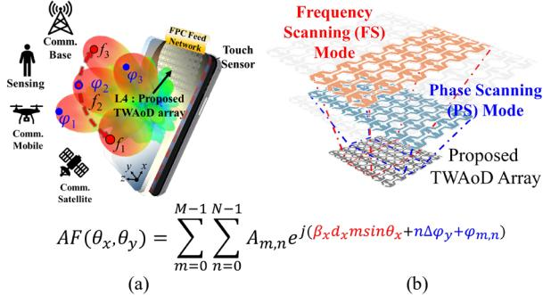

Fig. 1. (a) Illustration of a single-platform traveling wave antenna-on-display (TWAoD) array within mobile terminal for 2-dimensional frequency scanning (FS) and phase scanning (PS) mode. (b) Shared aperture concept implementing both FS and PS mode.

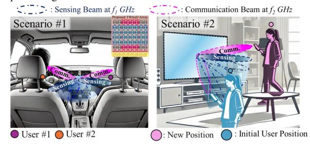

Fig. 2. Concept of the proposed TWAoD integrated sensing and communication (ISAC) antenna structure utilizing FS/PS mode for Scenario 1 and Scenario 2.

targeted communication and accurate multi-input multioutput (MIMO) radar tracking. In addition, these structures require multiple vias, multi-layer lamination and more than 10-unit cells for precise beam steering and impedance termination.

To resolve the critical size and beam steering constraints of TWAs for ISAC, this paper realizes a TWAs integrated into the transparent region of the display panel, denoted as traveling wave antenna-on-display (TWAoD), as shown in Fig. 1(b). TWAoD resolves the spatial limitation and eliminates the need for termination due to the mesh sheet resistance. In addition, the proposed TWAoD utilizes gridshaped with cross over patch structure, which enables EH1 mode radiation. The shared aperture concept for phase scanning (PS) mode and frequency scanning (FS) mode is presented in Fig 1(a). The shared TWAoD array enables both FS and PS mode for the first time, integrating the traveling

TABLE I COMPARISON OF EVALUATION METRICS FOR ISAC ANTENNA SYSTEM

| ISAC Antenna Architecture | Ant. Element (N for comm. L for Radar) | System Gain   | EVM / SNR     |
|---------------------------------|----------------------------------------------|------------------|---------------|
| SW* [3]                         | N2 ×L2                                    | 1) Low, 2) High  | EVM ↑ / SNR ↓ |
| SW* [4]                         | N2 ×L2                                    | 1) High, 2) High | EVM ↑ / SNR ↑ |
| TW** (This work)             | N                                            | 1) High, 2) High | EVM ↓ / SNR ↑ |

1): Radar, 2): Comm., SW\* : Standing Wave, TW\*\*: Traveling Wave

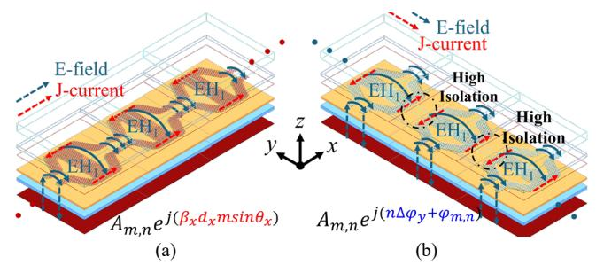

Fig. 3. (a) Frequency scanning (FS) mode at *xoz*-plane. (b) Phase scanning (PS) mode at *yoz*-plane.

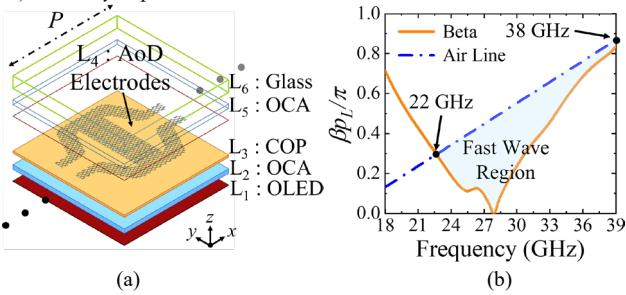

Fig. 4. (a) Configuration of the proposed TWAoD unit cell in display region. (b) Simulated dispersion diagram of the proposed unit cell. (*P* = 5.1mm)

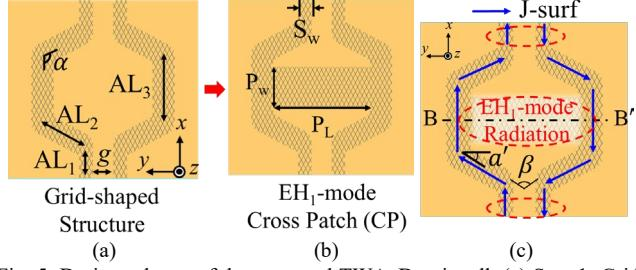

Fig. 5. Design scheme of the proposed TWAoD unit cell. (a) Step 1: Gridshaped structure. (b) Step 2: EH1-mode cross patch (CP). (c) The proposed step 2 unit cell of B-B′ boundary (Design parameters: AL1=1.95, AL2= 1.36, AL3=0.87, *g*=0.6, =118°, Pw=1.2, PL=2.87, SW =0.39, Unit = mm).

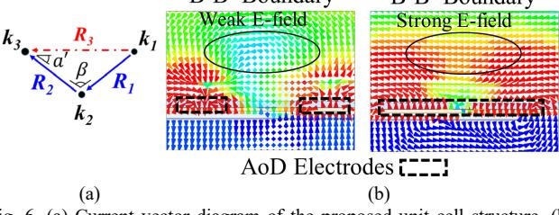

Fig. 6. (a) Current vector diagram of the proposed unit cell structure. (b) Electric-field distribution of the proposed unit cell as function of w/ and w/o CP structure (B-B′ boundary at 22 – 38 GHz).

wave antenna principle for frequency-dependent angle variation and the phased array principle for independent phase control.

The proposed ISAC beam steering scenarios, such as user sensing and communication beam tracking in automotive or consumer electronics display-based devices, are presented in Fig. 2. In addition, the TWAoD structure with ISAC feed network is highly suitable for ISAC applications. This novel design addresses the space constraints in mobile devices and provides enhanced beam-steering capabilities essential for future wireless sensing and communication systems.

## II. INTEGRATED SINGLE PLATFORM FOR DUAL-BEAM

As shown in Fig. 3(a), during the FS mode, the array adjusts beam angles as a function of frequency, leveraging the EH1-mode characteristics for high directivity and broad coverage due to the perpendicularly coupled electric and magnetic fields (1).

$$A_{m,n}e^{j(\beta_X d_X m \sin \theta_X)}, \beta_{n,x} = \beta_0 + \frac{2n\pi}{P}$$
 (1)

During the PS mode, the phase of each electrode is independently controlled at a fixed frequency, which allows multi-beam formation with high isolation and low mutual coupling between the elements, as shown in Fig. 3(b). This enables simultaneous multi-user communication and multitarget tracking (2). Based on the proposed array factor (2), the TWAoD array realizes effective 2-D beam scanning for ISAC system, which utilizes FS and PS mode within a single antenna platform.

$$AF(\theta_x, \theta_y) = \sum_{m=0}^{M-1} \sum_{n=0}^{N-1} A_{m,n} e^{j(\beta_x d_x m \sin \theta_x + n\Delta \phi_y + \phi_{m,n})}$$
(2)

#### III. DISPLAY-INTEGRATED ANTENNA DESIGN

The proposed TWAoD unit cell situated in the display region is presented in Fig. 4(a). The antenna is designed using a high-frequency structure simulator (HFSS) simulation program. Upper substrate layers of OCA (L5) and cover glass (L6) are utilized to protect the AoD electrodes and OLED panel (L1) from environment hazards. The proposed optically invisible antenna (L4) is situated in the active area of the display panel by utilizing mesh-patterned electrodes, which are realized using identical and periodic diamond-grid meshpatterned electrodes. The transparency of the antenna electrodes features over 85%, which is sufficient for conventional high-resolution display panels. More detailed information on the fabrication and stacking of the AoD is available in [5].

Conventional EH1-mode TWA designs utilize vias and the use of multi-stack antenna layers. However, these structures are constrained by the display panel manufacturing process. Thus, the proposed TWAoD features a single layer and vialess design for compatibility with the display manufacturing process. In dispersion diagram, the proposed TWAoD is operated *as n*=-1 first higher-order harmonic within the fastwave region from 22 to 38 GHz, as shown in Fig. 4(b).

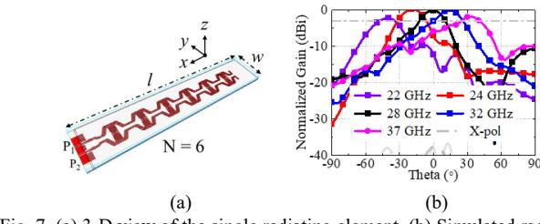

Fig. 7. (a) 3-D view of the single radiating element. (b) Simulated radiation patterns (*xoz*-plane) of the single radiating element. (Design parameters: *l =*  39mm*, w =*8mm*, d* = 4.8mm)

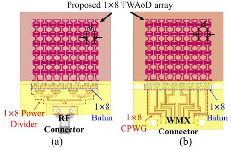

Fig. 8. Configuration of the1×8 TWAoD array with (a) passive feeding type. (b) active feeding type.

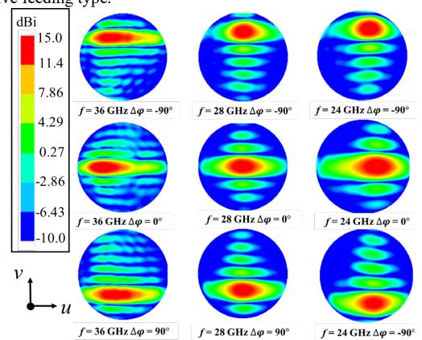

Fig. 9. Simulated radiation patterns of the proposed 2-D beam steering antenna at 24, 28, and 36 GHz with different phase shift (Δφ = -90°, 0°, and 90°).

The design scheme of the proposed TWAoD unit cell is shown in Fig. 5. The single layer unit cell is composed of gridshaped feed and cross over patch structure. The grid-shaped structure is initially designed for EH1-mode. In Step 1, the grid-shaped structure features a wider impedance bandwidth due to the bent angle technique, as shown in Fig. 5(a). In Fig. 6(a), based on current vector sum, the current path *R3* is extended tilting angle of ′ , which allows for broader frequency support. However, the coupling field is weak at the middle of the unit cell due to the large distance between the two microstrip line structures, as shown in Fig. 6(b). Thus, the cross patch (CP) structure of the unit cell is introduced in Step 2, as shown in Fig. 5(b). In the B-B′ boundary, the electric field of the unit cell with CP is enhanced compared to the unit cell without CP structure. The CP structure contributes to enhanced y-direction E-field 3 ����⃗ at 18-24 GHz. Thus, the proposed unit cell achieves stable EH1-mode radiation characteristic across the entire operation frequencies. Fig. 7(a) shows the configuration of the exemplified 1-D TWAoD structure. The simulated H-plane frequency scanning pattern in the *xoz*-plane is exhibited from -52° to +46° in the 22 – 37GHz, as shown in Fig. 7(b).

## IV. 2-D FREQUENCY-PHASE BEAM SCANNING

In general, antenna array structures with 2-D space scanning characteristics consist of multilayer, multi-port, and multi-via designs to allow beam steering in the various scan planes. However, past display antenna topology and AoD studies have been limited to 1-D beam scanning characteristics, which is insufficient for applications requiring spherical beam steering coverage [5], [6]. The placement of the FPC feeding network is limited by the conventional display panel topology. Thus, a new class of the FS and PS mode capabilities of the 1×8 TWAoD array is presented. This proposed structure realizes 2-D space beam steering, providing comprehensive coverage in front of the present-day display panel.

### *A. Array Design and Simulation Results*

The designs of the 1×8 TWAoD array with FPC feeding are presented in Fig. 8. The unit cell of the exemplified optically invisible 1-D TWAoD is first optimized to six elements (N=6) due to high mesh sheet resistance in the single-digit ohms range [5]. The TWAoD element enables Hplane scanning (*xoz*-plane) to operate at different frequencies. Based on elements, an exemplified 1×8 array is designed to verify E-plane PS mode capability for full-space beam coverage. The distance between the elements is 0.37. For EH1-mode radiation, each TWAoD element is designed with FPC-based wideband balun to realize differential feeding. In Fig. 8(a), 1×8 FPCB balun and power divider are designed to provide uniform phase and amplitude feeding for FS mode (*xoz*-plane). In Fig. 8(b), WMX feeding structure is implemented to achieve beam steering through phase differences of ports. Conventional single layer FPCB feeding network of the AoD structure, such as the power divider, feature narrow operation bandwidth due to the extremely thin substrate (≤ 0.0046) [5], [6]. Thus, the wideband compact size balun and power divider structures propose using FPCB topology.

The simulated radiation pattern for different frequencies and phase excitation is presented in Fig. 9. This figure demonstrates the 2D beam steering capability of the proposed antenna structure across multiple frequencies (24 GHz, 28 GHz, and 36 GHz) and phase shifts (Δφ = -90°, 0°, and 90°). As shown, the antenna can effectively steer the beam in both azimuthal (*yoz*-plane) and elevation (*xoz*-plane) planes by adjusting the frequency and phase. This flexibility enables wide-angle coverage and precise control over the beam direction, which is essential for ISAC applications that require dynamic and adaptive beamforming.

## *B. Experimental Verification*

Fig. 10(a) presents the simulated and measured Sparameter and peak realized gain of proposed 1×8 TWAoD

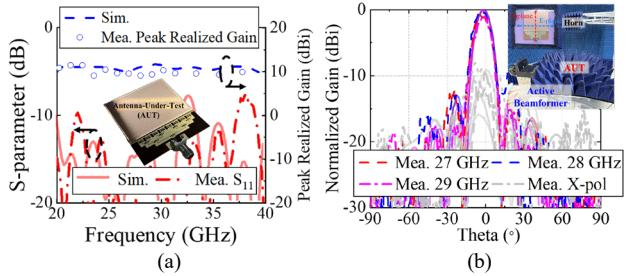

Fig. 10. (a) Simulated and measured S-parameter and peak realized gain of the proposed 1×8 TWAoD array. (b) Simulated and measured E-plane radiation pattern. (solid line: simulation, dot line: measurement)

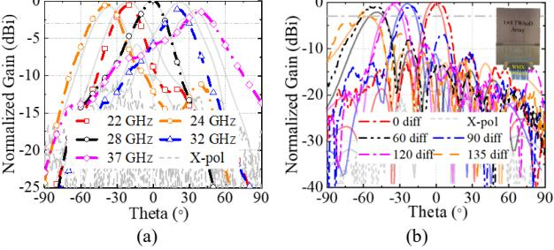

Fig. 11. (a) Simulated and measured beam steering pattern. (a) FS mode (Hplane). (b) PS mode (E-plane).

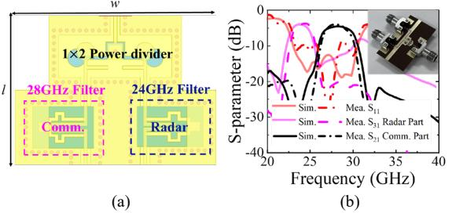

Fig. 12. (a) Configuration of the proposed FPC-based diplexer for ISAC application. (b) Simulated and measured S-parameter of the fabricated 3-port diplexer. (Design parameter: *l =* 4.6mm, *w* = 6.2 mm)

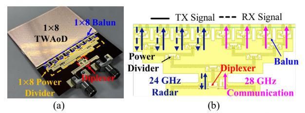

Fig. 13. (a) Photograph of the fabricated TWAoD array with diplexer for ISAC system. (b) Configuration of the FPC-based ISAC feed network.

array at the operating frequencies. The measured impedance bandwidth ascertains |S11| < -10dB across 20-40 GHz. In addition, the peak gain is achieved in the range of 10-12 dBi (simulated)/9.8-11.3 dBi (measured) across the operating bands (22-38GHz). The discrepancy between the measured and simulated gain is mainly due to imperfect fabrication, assembly, and measurement errors. To validate 2-D beam steering performance, the far-field radiation pattern measurement setup is presented in Fig. 10(b).

The simulated and measured E-/H-plane radiation patterns are presented in Fig. 10(b) and Fig. 11. E-plane broadside radiation is achieved at 27-29 GHz, as shown in Fig. 10(b). In addition, the measured cross-polarization level is higher than 10 dB. To verify FS scenarios, the sensing horn scans the proposed TWAoD array in the *xoz*-plane for H-plane radiation pattern at different frequencies. The measured Hplane radiation patterns are shown in Fig. 11(a). The measured H-plane scanning angle is set as -52° to +47° in the 22–37 GHz. Moreover, the proposed TWAoD array demonstrates backward-to-forward continuous beam scanning in operation frequencies. The cross-polarization levels are less than -13 dB. To validate PS scenarios (*yoz*plane), the far-field anechoic chamber with active beamformer is utilized. The active beam former activates the PS mode performance, which enables equal amplitude and required phase differences across 8 ports of the TWAoD array. The measured E-plane phase beam scanning pattern is presented in Fig. 11(b). The 3-dB scanning angles achieve approximately ±58° at 28 GHz. Moreover, the measured patterns present sidelobe levels below -10dB and crosspolarization levels below -15 dB, respectively. Good consistency between the measured and simulated patterns can be observed.

As a result, the proposed TWAoD array verifies stable gain over a wide bandwidth, enabling continuous beam scanning performance, despite its single layer structure. Furthermore, the proposed antenna demonstrates wide-angle FS (H-plane) and PS (E-plane) mode that fully over 2-D space, highlighting the versatility and effectiveness of the design.

#### V. HARDWARE SOLUTION FOR ISAC AOD SYSTEMS

The proposed standalone TWAoD array demonstrates excellent radiation performance for both radar and communication functionalities. This section introduces FPCbased diplexer and feed network solutions for achieving different operating frequencies and signal characteristics required for each function.

### *A. Diplexer for Radar and Communication*

For ISAC applications, the antenna feeding system and passive components such as baluns, filters, and power dividers are critical [8]. As shown in Fig. 12(a), the configuration of the proposed FPC-based diplexer for ISAC applications is presented. By separating the frequency bands allocated to each function, the diplexer effectively minimizes crossinterference and allows each to operate within its designated spectrum. A diplexer can isolate a 24 GHz radar signal from a 28 GHz communication signal. As shown in Fig. 12(b), the insertion loss (S21) for the communication path and S31 for the radar path exhibit minimal signal attenuation, maintaining effective separation between the two frequency bands. The proposed FPC-based diplexer effectively isolates the 24 GHz radar signal from the 28 GHz communication signal, allowing for reliable performance in both channels. The measured results confirm that the diplexer design provides adequate frequency separation and minimal insertion loss, making it well-suited for ISAC applications.

### *B. Proposed Display-based Antenna for ISAC systems*

As shown in Fig .13(a) and 14(a), the proposed TWAoD array integrated with FPC-based ISAC feed network is

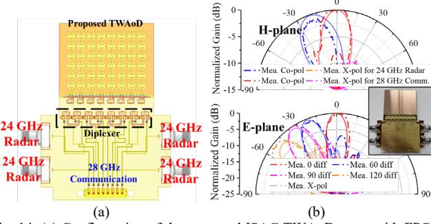

Fig. 14. (a) Configuration of the proposed ISAC TWAoD array with FPC-based ISAC active feed network. (b) Simulated and measured H-/E-plane radiation pattern for ISAC applications.

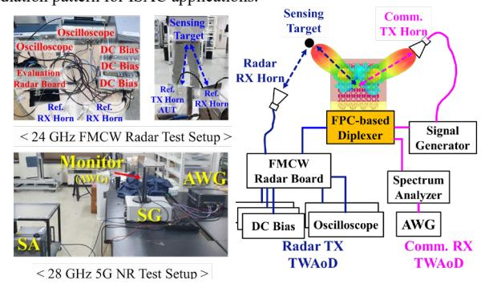

Fig. 15. The proposed test setup for evaluating the ISAC systems' radar and communication performance.

fabricated and designed. As shown in Fig. 14(b), the measured main beam direction of the H-plane radiation at  $24/28 \, \text{GHz}$  is confirmed at -25° and 0°. The TWAoD features split main beams, which allows for simultaneous measuring communication and radar signals without signal interference. Furthermore, the array achieves a wide beam steering angle of  $\pm 60^{\circ}$ , demonstrating excellent beam steering performance suitable for wireless communication applications.

Fig. 15 presents simultaneous evaluation of both radar and communication performance for the proposed TWAoD in an ISAC environment. A 24 GHz FMCW radar measurement setup includes a radar board connected to a receiver horn and transceiver TWAoD array, an oscilloscope to capture and analyze radar signals. In the center, the array is integrated with an FPC-based diplexer, allowing the 24 GHz radar and 28 GHz communication signals to be processed through separate channels within the shared antenna aperture. A 28 GHz 5G NR test setup is configured to evaluate communication performance. This setup demonstrates that the main beams of the TWAoD achieve interference-free operation of both radar and communication functionalities. In Table II, it is noted that this work is the first to achieve 2-D beam steering in a display-integrated traveling-wave antenna topology while meeting ISAC performance criteria.

#### VI. CONCLUSION

The proposed antenna is the first to demonstrate a travelingwave antenna featuring ISAC functionalities using a sharedaperture approach. Moreover, the EH-mode based traveling wave antenna-on-display (TWAoD) provides a compact,

TABLE II
COMPARISON OF STATE-OF-THE-ART DISPLAY AND ISAC ANTENNAS

| Ref.      | Freq. (GHz) | Support ISAC | Ant. Type | 2-D Hybrid* Beam Scan. | Display /Transpa rency | Profile (λ) |
|-----------|----------------|-----------------|--------------|------------------------------|------------------------------|-------------|
| [2]       | 5.6-6.1        | Yes             | AiP          | N/A                          | N/A                          | 0.036       |
| [3]       | 24             | N/A             | AiP          | N/A                          | N/A                          | 0.068       |
| [5]       | 28/38          | N/A             | AoD          | N/A                          | Yes / ≥88%                | 0.021       |
| [7]       | 28             | N/A             | AoD          | N/A                          | Yes ≥88%                  | 0.023       |
| This work | 22 - 37        | Yes             | AoD          | ¹)±58° ²)-52°~+47°        | Yes / ≥85%                | 0.018       |

Hybrid\*: Frequency/phase beam scanning

display-integrated solution for ISAC systems, enabling simultaneous radar and communication functionalities within a single antenna structure. The TWAoD integrated with FPC-based diplexer demonstrates good radiation pattern at 24 GHz for radar and 28 GHz for communication, achieving effective frequency separation and minimizing signal interference. 2D hybrid beam scanning of the array enhances coverage and adaptability for detection and signal transmission. The optically invisible TWAoD is feasible for integration with touch-sensitive displays, making it ideal for space-constrained applications in mobile and automotive display platforms.

#### ACKNOWLEDGMENT

The authors would like to thank Keita Iimura of Dai Nippon Printing Co., Ltd in Japan for their valuable discussions and support in measurement. This work was supported in part by the Institute of Information and Communications Technology Planning and Evaluation (IITP) grant funded by the Korea Government (MSIT) (No.2021-0-00763, No.2020-0-0085.8 and No.RS-2024-00354970); and the Korea Research Foundation (No.RS-2024-00452255).

## REFERENCES

- H. Zhang, "Joint Waveform and Phase Shift Design for RIS-Assisted Integrated Sensing and Communication Based on Mutual Information," *IEEE Comm. Lett.*, vol. 26, no. 10, pp. 2317-2321, Oct. 2022.
- [2] S. L. Ma, J. Lu, C. Gu and J. Mao, "A Wideband Dual-Circularly Polarized, Simultaneous Transmit and Receive (STAR) Antenna Array for Integrated Sensing and Communication in IoT," *IEEE Internet of Things Journal*, vol. 10, no. 7, pp. 6367-6376, 1 Apr. 2023.
- [3] L. Ma, J. Lai, Y. Yin, C. Xia, C. Gu and J. Mao, "A Wideband Co-Linearly Polarized Full-Duplex Antenna-in-Package With High Isolation for Integrated Sensing and Communication," *IEEE Antennas Wireless Propag. Lett.*, vol. 22, no. 9, pp. 2185-2189, Sept. 2023.
- [4] H.-C. Huang et al., "Hybrid Integration of 5G/B5G Millimeter-wave and Microwave Antennas in Handsets for ISAC," *IEEE Antennas Wireless Propag. Lett.*, doi: 10.1109/LAWP.
- [5] D. Lee et al., "Dual-polarized Dual-Band Antenna-on-Display Using Via-Less and Single-Layer Topology for mmWave Wireless Scenarios," *IEEE Antennas Wireless Propag. Lett.*, May. 2023.
- [6] T. D. Nguyen et al., "Optically Invisible Artificial Magnetic Conductor Subarrays for Triband Display-Integrated Antennas," *IEEE Trans. Microw. Theory and Techn.*, vol. 70, no. 8, pp. 3975-3986, Aug. 2022.
- [7] H. -D. Li and L. Zhu, "Study on Bandwidth Properties of EH1-Mode Microstrip Leaky-Wave Antenna for Broadside Radiation," *IEEE Antennas Wireless Propag. Lett*, vol. 20, no. 10, pp. 2028-2032, Oct. 2021.
- [8] Tao et al., "Compact Hybrid Resonator With Series and Shunt Resonances Used in Miniaturized Filters and Balun Filters," *IEEE Trans. Microw. Theory Techn.*, vol. 58, no. 2, pp.390-402, Feb. 2010.