{0}------------------------------------------------

# Signal-Signal Beating Interference: From Destructive to Constructive for Photonic THz Integrated Sensing and Communication System Using Self-Coherent OFDM

Fengwei Liu®, Xihua Zou®, Senior Member, IEEE, Ningyuang Zhong®, Xiong Deng®, Member, IEEE, Lianshan Yan®, Senior Member, IEEE, and Wei Pan

Abstract—Terahertz (THz) integrated sensing and communication (ISAC) is a key building block for future 6G networks. In the traditional fiber or radio-over-fiber communication system, signal-signal beat interference (SSBI) is a critically destructive factor to be canceled. In this work, a nonlinear matched filtering (NMF) approach is proposed to transform the SSBI from a destructive interference into a constructive component for the THz ISAC system. By reusing the energy from the constructive SSBI, the NMF significantly enhances the sensing metrics in terms of the resolution and the peak-sidelobe ratio (PSLR). Using NMF can attain higher resolution with limited bandwidth; the larger the bandwidth, the better the effect. In experiments, a self-coherent ISAC system operating at 144-GHz center frequency and 5-GHz bandwidth is demonstrated with a 20-Gb/s communication capacity and a 1.94-cm ranging resolution. More importantly, the 3-dB resolution is improved by up to 25% and the PSLR is increased by up to 8 dB for the sensing function. In addition, the peak-to-average power ratio (PAPR) of the integrated signal is reduced by up to 7 dB.

Index Terms—Integrated sensing and communication (ISAC), nonlinear matched filter, signal-signal beat interference (SSBI), terahertz (THz).

### I. Introduction

IRELESS communication and radar sensing, once developed independently until the early 1960s [1], have converged in recent decades due to advancements in hardware architecture [2], channel modeling [3], waveform design [4], and signal processing [5]. This convergence has enabled deep integration, leading to substantial coordination gains [6] and the emergence of integrated sensing and communication (ISAC) [7], now a key feature in 6G/B6G networks and a vital enabler for many future applications [8].

According to 3GPP TR 22.837 [9], ISAC supports over 30 use cases, ranging from public services to personal

Received 22 August 2025; revised 24 October 2025; accepted 14 November 2025. This work was supported by the National Natural Science Foundation of China under Grant U21A20507 and Grant 62271422. (Corresponding author: Xihua Zou.)

The authors are with the Key Laboratory of Photonic-Electric Integration and Communication-Sensing Convergence, Ministry of Education, School of Information Science and Technology, Southwest Jiaotong University, Chengdu 611756, China (e-mail: ferngwhale@my.swjtu.edu.cn; zouxihua@swjtu.edu.cn).

Digital Object Identifier 10.1109/TMTT.2025.3638469

applications, such as autonomous driving assistance [10], low-altitude airspace management [11], infrastructure monitoring [12], industrial IoT [13], health sensing [14], and extended reality [15]. These applications demand both high-speed data transmission and advanced sensing functions, including precise localization, high-resolution imaging, posture tracking, and environmental perception [16]. In autonomous driving, for instance, ISAC-enabled base stations can detect obstacles beyond the vehicle's line of sight, reducing blind spots and providing early warnings for unforeseen dangers.

To better support these diverse use cases, ISAC systems often rely on broadband millimeter-wave (MMW) or terahertz (THz) frequencies, providing both enhanced communication capacity and sensing resolution. However, purely electronic implementations of such broadband systems face inherent limitations, including restricted bandwidth, high complexity, and degraded signal quality [17]. Photonic technologies offer a compelling alternative, enabling ultrahigh-capacity, high-resolution MMW/THz ISAC systems with their wide bandwidth, low frequency-dependent losses, and flat frequency response [18].

Building on the advantages mentioned above, photonicassisted MMW/THz ISAC systems have attracted tremendous research interest. These existing systems can be generally classified into coherent and noncoherent or self-coherent architectures. In coherent systems, the ISAC framework closely aligns with mainstream wireless communication architectures, especially when the sensing receiver uses a mixer for echo down-conversion. Examples include a W-band photonic ISAC system [19] that uses an OFDM waveform and a two-stage carrier recovery algorithm, achieving a 0.98-cm range resolution and a 47.54-Gb/s data rate. A 300-GHz dual-chirp system [20] employs adaptive frequency offset compensation to eliminate training preambles, providing 20-Gb/s communication capacity and 1.5-cm resolution. In [21], a subcarrier-chirp interleaved waveform at 150 GHz reaches an 88-Gb/s data rate and 8-mm resolution over 10.2 m. Additionally, fully photonic direct reception with dechirping enhances real-time sensing; for instance, Bai et al. [22] use an OFDM-modulated constant-envelope LFM carrier to achieve 8-Gb/s communication capacity and 1.5-cm

{1}------------------------------------------------

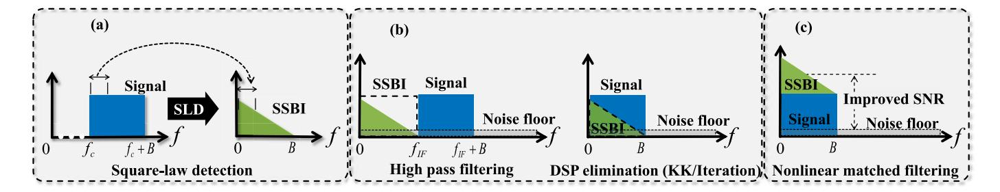

Fig. 1. SSBI from destructive to constructive in self-coherent system. (a) SSBI generation. (b) Destructive SSBI (cancellation approaches). (c) Constructive SSBI.

resolution. Sparse LFM subband fusion [\[23\]](#page-9-19) increases spatial resolution to 2.14 cm while maintaining 18-Gb/s communication capacity in the E-band, and fiber length effects are examined in [\[24\],](#page-9-20) resulting in a 116-Gb/s data rate and 6-mm resolution at 134 GHz. On the other hand, the noncoherent or self-coherent architectures offer a costeffective alternative for simplified remote radio units, avoiding expensive THz mixers and local oscillators by using envelope detection for signal downconversion. For example, Wu et al. [\[25\]](#page-9-21) apply envelope detection in a time–frequency division multiplexing scheme, achieving 15–60-Gb/s data rate and 1.53–4.39-cm resolution over 10-km fiber. A 94.5-GHz constant-envelope LFM-OFDM system [\[26\]](#page-9-22) supports 8–15.4-Gb/s communication capacity and 1.5–7.5-cm resolution. To further improve ranging precision, a symboldomain matched filtering method [\[27\]](#page-9-23) achieves a 4.56-Gb/s data rate and 1.88-cm resolution.

As shown in Fig. [1,](#page-1-0) in traditional self-coherent or noncoherent ISAC systems, signal-signal beat interference (SSBI), caused by square-law detection, is generally seen as destructive to the received signal. Many earlier studies have aimed to cancel SSBI using high-pass filter [\[28\]](#page-9-24) or phase retrieval techniques like the Kramers–Kronig (KK) algorithm or dc-value method [\[29\],](#page-9-25) [\[30\].](#page-9-26) Although these methods improve communication by reducing SSBI interference, they neglect the sensing information that SSBI can carry. Discarding SSBI is a waste of valuable sensing energy. Our previous work [\[31\]](#page-9-27) has demonstrated that SSBI has little adverse impact on sensing function.

In this article, we propose a new perspective on SSBI by viewing it as a constructive opportunity instead of a destructive challenge. We introduce a nonlinear matched filtering (NMF) technique that enables us to extract sensing information from SSBI, even when it overlaps in both the time and frequency domains with the original signal. This method creates a heterogeneous sensing channel in the digital domain, allowing SSBI to function alongside the original matched filter and enhance overall sensing performance with minimal changes to hardware and software. Additionally, incorporating a virtual carrier into an information-bearing signal reduces the peak-toaverage power ratio (PAPR) of the integrated signal. The main contributions of this article are summarized as follows.

*1) Improved 3-dB Resolution:* SSBI improves the half-power (3 dB) resolution by 28% compared to the ambiguity function of the OFDM signal, enabling higher resolution for narrower band signals. Experimental results show a 25% increase in 3-dB resolution, reaching 1.94 cm with a 5-GHz bandwidth signal.

- *2) PSLR Enhancement:* SSBI naturally doubles the peak-tosidelobe ratio (PSLR) in dB compared to the original signal, achieving up to 13 dB of theoretical gain. Experimental results indicate a maximum PSLR gain of 8 dB, depending on the signal-to-noise ratio (SNR).
- *3) PAPR Reduction via Virtual Carrier:* A virtual carrier generally has a lower PAPR than the information-bearing signal, significantly reducing the overall PAPR of the integrated signal and enhancing robustness against the nonlinear distortion. Experimental results demonstrate up to a 7-dB reduction in OFDM's PAPR.

The rest of this article is organized as follows. Section [II](#page-1-1) describes the self-coherent D-band THz ISAC system, including the KK-based communication receiver and the NMF-based sensing receiver. Section [III](#page-4-0) details the experimental setup, presents the results, and provides analysis. Finally, Section [IV](#page-8-3) summarizes the findings and discusses their implications.

# II. SYSTEM MODEL AND PRINCIPLE

The proposed THz self-coherent ISAC system uses a monostatic structure, where the transmitter both sends out the integrated waveform and receives the sensing echo signal. This communication-centric system directly employs the entire communication waveform for sensing purposes. The integrated signal waveform is defined as

$$E(t) = E + s(t). (1)$$

Here, the direct current term *E* represents the amplitude of the virtual carrier, and *s*(*t*) is the complex baseband signal that carries information, encompassing the spectrum from 0 to *B*. As shown in Fig. [2\(a\),](#page-2-0) the simplified self-coherent transceiver system is illustrated, with the spectra of key nodes depicted in Fig. [2\(b\).](#page-2-0) At the transmitter, *E*1(*t*) is the local oscillator light, and *E*2(*t*) is the integrated optical signal resulting from the electro-optical conversion of *E*(*t*)

$$E_1(t) = E_1 e^{i[2\pi f 1t + \theta_1(t)]}$$
 (2)

$$E_2(t) = [E_2 + s(t)]e^{j[2\pi f_2 t + \theta_2(t)]}.$$
 (3)

When *E*1(*t*) and *E*2(*t*) are combined and injected into the THz photodetector, the THz wave *E*THz(*t*) is generated through optical heterodyne detection

$$E_{\text{THz}}(t) = |E_1(t) + E_2(t)|^2$$

$$\propto E_1[E_2 + s(t)] e^{j[2\pi(f_2 - f_1)t + \theta_2(t) - \theta_1(t)]}.$$
(4)

{2}------------------------------------------------

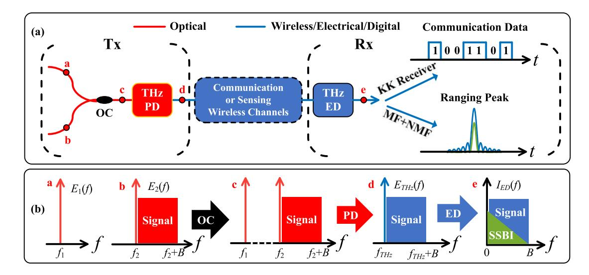

Fig. 2. Principle of the proposed photonics-aided THz ISAC system. (a) Architecture illustrations; Tx: transmitting end; Rx: receiving end; OC: optical coupler; THz PD: THz photodetector; THz ED: THz envelope detection; NM: matched filtering; NMF: nonlinear matched filtering. (b) Spectra at some key points; SSBI: signal-signal beat interference.

Since the THz photodetector has a high-frequency response, the low-frequency square interference term and the dc component from the beat frequency can be neglected.

Consequently, the THz signal  $E_{\mathrm{THz}}(t)$  contains only the integrated electrical signal in the THz band. The center frequency of this signal is determined by the frequency difference  $f_1-f_2$  between the two free-running lasers at the transmitter, providing flexibility for carrier frequency tuning. After propagating through the wireless communication or sensing channel with a delay  $t_0$ , the integrated THz signal is downconverted using a THz square-law detector at the receiver to obtain the baseband information signal  $I_{\mathrm{ED}}(t)$ 

$$I_{\text{ED}}(t) \propto |E_{\text{THz}}(t - t_0)|^2$$

$$\propto \left| [E_0 + s(t - t_0)] e^{j[2\pi(f_2 - f_1)(t - t_0) + \theta_2(t - t_0) - \theta_1(t - t_0)]} \right|^2$$

$$\propto \underbrace{E_0^2}_{\text{Direct Current}} + \underbrace{2E_0 \Re \{s(t - t_0)\}}_{\text{Useful Signal}} + \underbrace{|s(t - t_0)|^2}_{\text{SSBI}}.$$
(5)

Ignoring the constant coefficient term  $E_1$ , the received signal  $I_{\rm ED}(t)$  includes dc components, the useful signal component, and the SSBI component. Both the useful signal and SSBI components are immune to carrier frequency offsets or phase noise introduced by the two free lasers at the transmitter or the downconversion process at the receiver. This virtual carrier-assisted self-coherent system does not require phase-locked lasers, unlike traditional coherent ISAC systems, making the transceiver structure simpler and more robust. The virtual carrier amplitudes at various stages of the system, denoted as  $E, E_2$ , and  $E_0$ , fluctuate due to the nonflat frequency response of the system. After electro-optical conversion and transmission through the optical fiber or wireless channel, the carrier signal power ratio (CSPR) at the receiver differs from that at the transmitter.

# A. Communication Model

In a self-coherent communication system, the KK algorithm is employed at the receiver to enhance signal recovery. At

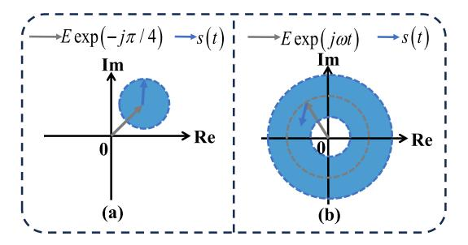

Fig. 3. Complex trajectory of the integrated signal that meets the minimum phase condition. (a) Virtual carrier fixed when the information-bearing signal was rotating and (b) both were rotating.

the transmitter, the virtual carrier is added in the frequency domain alongside the information-bearing signal before the arbitrary waveform generator (AWG), starting from the digital domain signal source with little frequency guard band. At the receiver, the KK algorithm or iterative algorithms are used to mitigate SSBI and decrease the system's bit error rate (BER). A key requirement for phase retrieval algorithm is that the integrated signal E(t) must meet the minimum-phase condition [32] throughout the system

$$|E| > |s(t)|. (6)$$

As shown in Fig. 3, when the phase of the virtual carrier is fixed in the first quadrant, the trajectory of E(t) does not encircle the origin, fulfilling the minimum-phase condition. If the phase of the virtual carrier is not fixed, the trajectory rotates around the origin, creating a blank circle. Even in this case, the trajectory does not pass through the origin, so it still satisfies the minimum-phase condition. As the CSPR of the integrated signal increases, the size of the blank circle at the center grows. Therefore, by examining the trajectory of E(t) in the complex plane, one can determine whether the minimum-phase condition is satisfied.

{3}------------------------------------------------

During transmission, the relative amplitude between the virtual carrier |E| and the information-bearing signal |s(t)| can fluctuate due to channel fading and nonflat equipment response. However, if the integrated signal satisfies the minimum-phase condition before reaching the square-law detector at the receiver, the signal phase can be recovered, and the SSBI can be eliminated using the KK algorithm in digital processing, thereby enhancing overall communication performance.

Now, consider the conditions needed to achieve the optimal CSPR. In (5), when focusing solely on the useful signal component, the maximum value of the product occurs when the power of the virtual carrier equals the average power of the information-bearing signal. Therefore, it appears that the optimal CSPR should be 0 dB. However, considering the minimum-phase condition in (6), the optimal CSPR will be higher. The CSPR of E(t) is defined as

$$CSPR_{E(t)} = \frac{|E|^2}{\frac{1}{T} \int_0^T |s(t)|^2 dt}$$
 (7)

and the PAPR of s(t) is defined as

$$PAPR_{s(t)} = \frac{\max\{|s(t)|^2\}}{\frac{1}{T} \int_0^T |s(t)|^2 dt}.$$
 (8)

Comparing (7) and (8), the denominators are the same, and the numerator relates to the minimum-phase condition. The power of the virtual carrier must surpass the maximum power of the information-bearing signal, meaning

$$CSPR_{E(t)} > PAPR_{s(t)}. \tag{9}$$

Therefore, the value of optimal CSPR of the integrated signal will be slightly lower than the PAPR of the information-bearing signal.

As the PAPR of s(t) decreases, the required CSPR for E(t) to meet the minimum-phase condition also decreases. Therefore, selecting signal waveforms with lower PAPR or reducing the PAPR of the waveform can help lower the optimal CSPR of the integrated signal. OFDM waveform, commonly used in 4G/5G standards, tends to have higher PAPR due to multiple subcarriers summing in phase. To address the high PAPR, techniques such as the repeated clipping and filtering (RCF) algorithm can be employed.

### B. Sensing Model

The sensing system uses the same waveform and hardware transceiver architecture as the communication system in the self-coherent ISAC framework, but it processes SSBI differently in digital signal processing. In the self-coherent sensing system, the receiver uses square-law detection for downconversion, which causes both the OFDM signal and its SSBI to appear at baseband simultaneously. To improve sensing performance, it is important to analyze the ambiguity functions of these two signals separately. By multiplying the OFDM signal by its complex conjugate, the SSBI signal without additional time delay can be obtained. It is also crucial to remove the dc component from the SSBI signal, because its zero-Doppler cut of the ambiguity function would otherwise form a large triangular shape, reducing the PSLR.

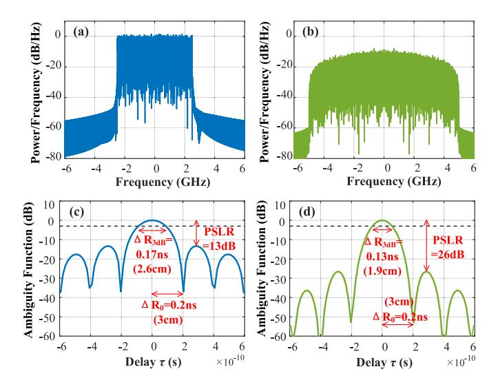

Fig. 4. Spectra and the zero-Doppler cuts of ambiguity functions of OFDM signal and its SSBI signal. (a) Complex OFDM signal with a bandwidth of 5 GHz. (b) Real SSBI signal with 5-GHz bandwidth. (c) and (d) Rayleigh resolution, 3-dB resolution, and PSLR of their ambiguity function.

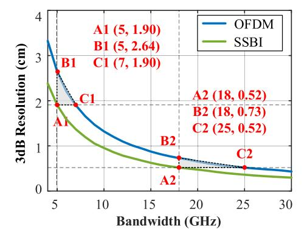

Fig. 5. 3-dB resolution of OFDM and its SSBI under different bandwidths.

1) Performance Analysis of PSLR and 3-dB Resolution: As an example, consider an OFDM signal with a 5-GHz bandwidth and its SSBI signal. Their respective power spectral densities and zero-Doppler cuts of the ambiguity functions are shown in Fig. 4. While both signals have an effective bandwidth of 5 GHz, SSBI provides significant advantages in both 3-dB resolution and PSLR. Specifically, the 3-dB resolution of SSBI improves from 2.6 to 1.9 cm, a 28% enhancement. Additionally, the PSLR of SSBI increases from 13 to 26 dB, offering a 13-dB gain. Since the SSBI signal equals the squared magnitude of the OFDM signal, the PSLR of the SSBI ambiguity function is also equal to the absolute square of the PSLR of the OFDM ambiguity function, which becomes twice as large in the dB domain. This higher PSLR enables clearer detection of weak reflected targets that might otherwise be obscured by sidelobes.

Next, we compare the 3-dB resolution performance of OFDM and SSBI under different bandwidth conditions, as shown in Fig. 5. When both signals reach a 1.9-cm resolution, SSBI requires only 5 GHz of bandwidth, while OFDM needs 7 GHz, resulting in a 28.6% increase in bandwidth efficiency. As the bandwidth expands to 18 GHz, SSBI achieves a

{4}------------------------------------------------

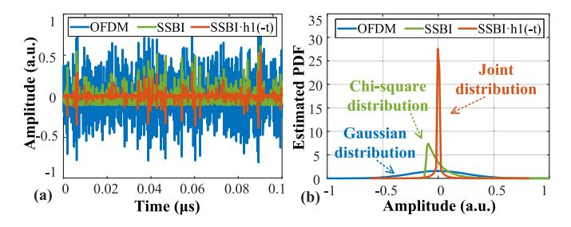

Fig. 6. (a) Real signals in time domain, including OFDM, its SSBI, and their dot product. (b) Estimated probability density functions of these three signals.

0.52-cm resolution, maintaining a 28.8% advantage over the 0.73-cm resolution of OFDM. When both signals reach the same 0.52-cm resolution, SSBI requires only 18 GHz of bandwidth, whereas OFDM needs 25 GHz, yielding a 28% boost in bandwidth efficiency. Therefore, using SSBI for sensing can improve the 3-dB resolution of the echo signal by roughly 28%, with more significant benefits at higher OFDM bandwidths. When the system hits its analog bandwidth limit, employing SSBI in the digital domain can overcome this bottleneck and further enhance the 3-dB resolution of the waveform.

*2) Performance Analysis of the Mutual Interference:* Because OFDM and SSBI overlap in both time and frequency domains, the matched filter's output will be influenced by SSBI, and the same applies to the nonlinear matched filter. Therefore, it is important to evaluate the mutual interference between the two signals.

We first analyze the effect of SSBI on the matched filter output when the OFDM signal is real-valued. In a monostatic sensing system, the transmitted waveforms can be accurately recorded in advance, enabling the construction of the matched filter *h*1(*t*) = *s*(−*t*). This method avoids violating the causality constraints of matched filtering. The information-bearing signal OFDM, its SSBI, and the dot product of SSBI and *h*1(−*t*) are shown in Fig. [6\(a\),](#page-4-1) along with their estimated amplitude probability densities in Fig. [6\(b\).](#page-4-1) The amplitude of the OFDM signal follows a zero-mean Gaussian distribution, while SSBI follows a zero-mean chi-squared distribution after removing its dc component. The dot product follows a joint distribution, where the values are centered around zero, resulting in a negligible accumulated interference sum in the convolution of matched filtering. In contrast, the dot product between the OFDM signal and *h*1(−*t*) produces a nonzero-mean SSBI signal, leading to a significantly larger convolution.

For the complex-valued OFDM signal, after digital downconversion and removing the dc component, the envelope detector output, *I*ED−*D*(*t*), contains both the normalized OFDM and SSBI signals. The outputs of the matched filter *R*MF(*t*) and nonlinear matched filter *R*NMF(*t*) are

$$R_{\text{MF}}(t) = I_{\text{ED-}D}(t) * h_1(t)$$

$$\propto \int_{-\infty}^{+\infty} s(\tau - t_0) s^*(\tau - t) d\tau$$

$$+ \int_{-\infty}^{+\infty} |s(\tau - t_0)|^2 s^*(\tau - t) d\tau$$

$$= R_{11}(t) + R_{21}(t)$$
(10)

$$R_{\text{NMF}}(t) = I_{\text{ED}-D}(t) * h_{2}(t)$$

$$\propto \int_{-\infty}^{+\infty} s(\tau - t_{0}) (|s(\tau - t)|^{2})^{*} d\tau$$

$$+ \int_{-\infty}^{+\infty} |s(\tau - t_{0})|^{2} (|s(\tau - t)|^{2})^{*} d\tau$$

$$= R_{12}(t) + R_{22}(t). \tag{11}$$

In *R*MF(*t*), the term *R*11(*t*) is the desired OFDM filtering signal, while *R*21(*t*), caused by SSBI, acts as interference. Similarly, in *R*NMF(*t*), *R*22(*t*) is the useful SSBI filtering signal, and *R*12(*t*) is the interference caused by the OFDM signal. In this THz sensing system, the signal duration is typically several microseconds, with bandwidths in the GHz range and sampling rates in the tens of GHz. This leads to sequence lengths of hundreds of thousands of points, making interference terms negligible compared to the signal terms. Therefore, even if the SSBI signal is hidden beneath the OFDM signal, the nonlinear matched filter can still extract useful information from the SSBI.

*3) Performance Analysis of the Composite Filter:* By combining the outputs of the matched filter and nonlinear matched filter, the composite filter output *R*(*t*) is approximated as

$$R(t) = R_{\text{MF}}(t) + kR_{\text{NMF}}(t)e^{j\theta} \approx R_{11}(t) + kR_{22}(t)e^{j\theta}$$
 (12)

where *K* is a scaling factor to align the noise levels of the two filters and θ is the phase rotation required to align the peaks of the two outputs. This phase alignment ensures coherent summation and improves the composite filter output SNR.

As shown in Fig. [7,](#page-5-0) after envelope detection, the baseband echo signal is processed in parallel by both the matched filter and the nonlinear matched filter. This approach creates a heterogeneous diversity reception using a single physical sensing channel but two digital paths. Once the range information is extracted from both the OFDM and SSBI signals, the system can choose to use either filter output individually or a combined output, based on application requirements. Using the combined output can improve both 3-dB resolution and PSLR, although the gains may be smaller than using the nonlinear matched filter alone, since the SSBI signal naturally has better resolution and PSLR. Nevertheless, the composite filter can provide higher SNR in certain CSPR settings.

# III. EXPERIMENTAL SETUP AND RESULTS

The experimental setup for the THz self-coherent ISAC system is shown in Fig. [8.](#page-5-1) At the central office, an AWG output the baseband or intermediate frequency integrated signal, which contained both the virtual carrier and the OFDM information signal. This integrated signal was then modulated onto the light wave of laser 2 using an IQ Mach–Zehnder modulator operating in carrier-suppressed single-sideband mode to support the virtual carrier scheme. Since the modulated optical signal typically had low power, it was amplified by an erbiumdoped fiber amplifier, and an optical filter was employed to suppress amplified spontaneous emission noise. The freerunning lasers 1 and 2 (Koheras BASIK E15) with 0.1-kHz linewidth did not require frequency or phase locking. A variable optical attenuator and polarization controller adjusted

{5}------------------------------------------------

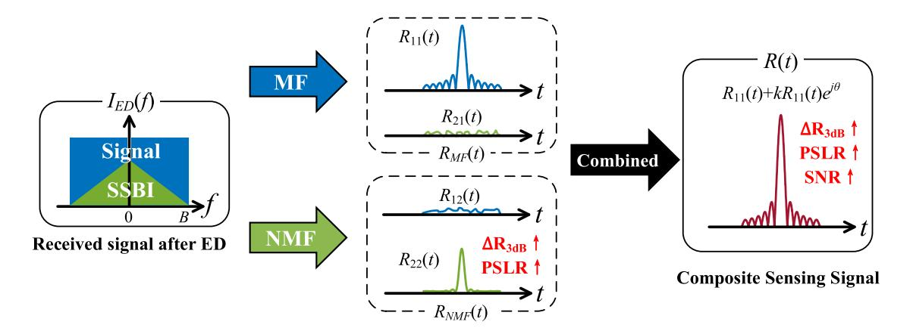

Fig. 7. Heterogeneous diversity filtering process and its enhancements in sensing performance metrics.

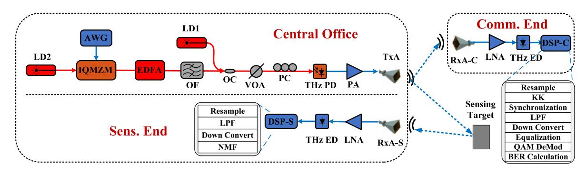

Fig. 8. Experimental setup of the proposed THz ISAC system based on self-coherent OFDM scheme; LD: laser diode; AWG: arbitrary waveform generator; IQMZM: IQ Mach–Zehnder modulator; EDFA: erbium-doped fiber amplifier. OC: optical coupler; VOA: variable optical attenuator; THz PD: THz photodetector; THz ED: THz envelope detector; PA: power amplifier; LNA: low-noise amplifier; TxA: transmitting antenna; RxA-S: receiving antenna of sensing; RxA-C: receiving antenna of communication; DSP: digital signal processing.

the power and polarization of the optical signal injected into the THz photodetector. Through optical heterodyne beating, the photodetector generated the THz integrated signal. By adjusting the wavelengths of the two free-running lasers, the center frequency of the THz signal could be flexibly tuned. After amplification, the THz signal was transmitted through the wireless channel via the THz antenna. As the signal propagated, one part was received by the communication antenna, while another part was reflected by targets and captured by the sensing receive antenna. Both the communication and sensing receivers shared the same envelope detection structure, which included a THz antenna, low-noise amplifier, and square-law detector, to downconvert the THz signal to baseband. The main difference was in the digital processing: the communication receiver employed the KK algorithm, while the sensing receiver used matched filtering or NMF. A photograph of the experimental setup is shown in Fig. [9.](#page-5-2) In the experiment, the wireless transmission distance was about 50 cm. After propagating through a line-of-sight wireless channel, the THz integrated signal was received by the communication receiver, which can be considered as a single-target sensing process.

At the transmitter end, the OFDM waveform parameters followed the 5G NR standard, as shown in Table [I.](#page-6-0) The signal was under 16QAM modulation, and the total duration *T* was 3.504 µs. Before emission by the AWG, the integrated signal was upconverted to a precisely tuned intermediate frequency

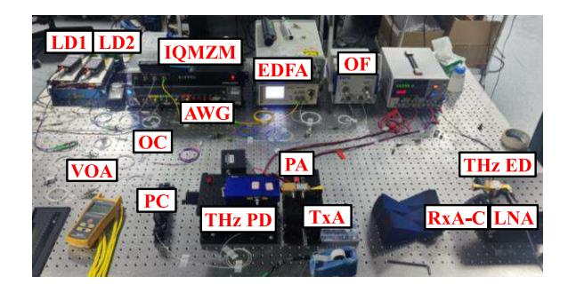

Fig. 9. Photograph of the experimental platform for the proposed THz selfcoherent ISAC system.

to avoid frequency-selective fading on the virtual carrier, as shown in the spectrum in Fig. [10\(a\).](#page-6-1) The PAPR of the OFDM signal increased with the number of subcarriers, and for THz OFDM signals, higher subcarrier counts were necessary to achieve a wider bandwidth, making PAPR reduction more difficult. To address this, the RCF algorithm was applied before adding the virtual carrier to reduce the PAPR of the complex baseband OFDM signal to about 6 dB. After converting it to a real-valued signal, the PAPR increased by roughly 3 dB, leading to a final PAPR of about 9 dB. As shown in [\(9\),](#page-3-4) reducing the PAPR decreased the optimal CSPR for the integrated signal. In the experiment, both the OFDM

{6}------------------------------------------------

TABLE I OFDM PARAMETER SETTING

| Parameter              | Value                       |
|------------------------|-----------------------------|
| Carrier Frequency      | $f_c = 144 \text{GHz}$      |
| Total Bandwidth        | B = 5 GHz                   |
| Number of Subcarriers  | N = 5120                    |
| Number of Symbols      | M=3                         |
| Subcarrier Spacing     | $\Delta f = 980 \text{KHz}$ |
| Symbol Duration        | $T_d = 1.096$ us            |
| Cyclic Prefix Duration | $T_{cp} = 0.072$ us         |
| Total Symbol Duration  | $T_s = 1.168$ us            |
| Clipping Ratio         | CR = 6 dB                   |

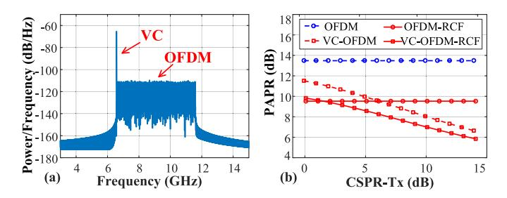

Fig. 10. (a) Spectrum of ISAC waveform before the AWG. (b) PAPR reduction of the integrated signal brought by the virtual carrier or RCF algorithm.

signals with and without the RCF algorithm were combined and transmitted together for comparison.

In addition to the RCF algorithm, the virtual carrier helped reduce the PAPR of *E*(*t*). As shown in Fig. [10\(b\),](#page-6-1) a realvalued OFDM signal without a virtual carrier had a fixed PAPR of 13.5 dB. After applying the RCF algorithm, its PAPR decreased to 9.5 dB. When the virtual carrier was added, the CSPR of *E*(*t*) increased from 0 to 14 dB, reducing the PAPR of the unclipped OFDM from 11.5 to 6.6 dB, and the PAPR of the clipped OFDM dropped from 9.8 to 5.8 dB. The virtual carrier itself had a PAPR of only 3 dB. By adding it to a high-PAPR OFDM signal, the overall PAPR of the integrated signal was effectively reduced. Therefore, using both the RCF algorithm and the virtual carrier, the PAPR of the integrated signal *E*(*t*) was notably lower than that of the original OFDM signal *s*(*t*). Within the CSPR range from 3 to 12 dB, the combined effect of the RCF algorithm and virtual carrier resulted in a PAPR improvement for the integrated signal, ranging from 4.4 to 7.1 dB.

The spectrum of the optical signal before injection into the THz photodetector is shown in Fig. [11\(a\).](#page-6-2) The frequency difference between the signal light and local oscillator light was approximately 144 GHz, which was within the first THz atmospheric transmission window. Compared to methods using optical frequency combs for heterodyne generation of THz signals, the approach with two free-running lasers provided clear advantages in system compactness, frequency tunability, and higher photodetector output SNR. Fig. [11\(b\)](#page-6-2) shows the spectrum of the information signal after being downconverted to baseband via the THz envelope detector. The received OFDM signal had a 5-GHz bandwidth, with an estimated SNR of approximately 21 dB.

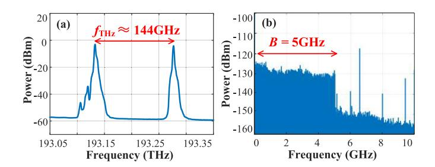

Fig. 11. (a) Optical spectrum before THz PD. (b) Electrical spectrum after THz ED.

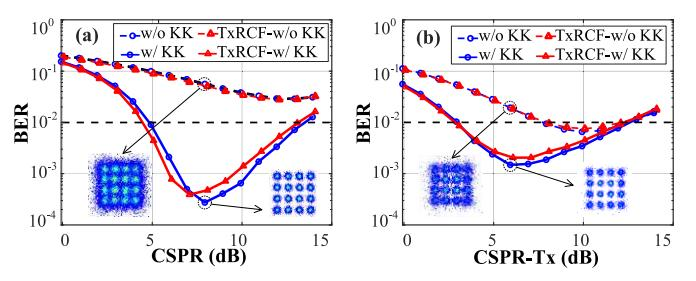

Fig. 12. BER versus CSPR with/without using the KK algorithm under two different transmission schemes, with/without RCF algorithm, respectively. (a) Simulation results and (b) experimental results.

# *A. Communication Performance Analysis*

At the communication receiver, the BER is highly sensitive to the CSPR of the integrated signal. Fig. [12\(a\)](#page-6-3) and [\(b\)](#page-6-3) shows the simulation and experimental results, respectively, with both sets revealing the same BER trend. These results indicate that there exists an optimal CSPR for achieving the lowest BER. Without the KK algorithm, the receiver directly demodulated the baseband signal. In this case, the useful OFDM signal was affected by SSBI, making it difficult to meet the 20% SD-FEC threshold (BER <1e−2 ). However, with the KK algorithm, the BER easily dropped below the FEC threshold within a suitable CSPR range, from 5 to 14 dB in the simulation and from 3 to 12 dB in the experiment. If the CSPR setting for *E*(*t*) was too high or too low, the output SNR of square-law detection decreased, resulting in a U-shaped BER curve.

In the simulation results shown in Fig. [12\(a\),](#page-6-3) the optimal CSPR was 8 dB without the RCF algorithm and 7 dB with the RCF algorithm applied to the complex baseband OFDM signal. The corresponding minimum BERs are 4e−4 and 3e−4 , respectively. This 1-dB reduction in the optimal CSPR may seem minor, but it is significant because it is just enough to push the composite filter SNR past the 7.66-dB diversity gain threshold. This demonstrated that using the RCF algorithm to reduce the PAPR of the information signal effectively lowered the optimal CSPR of the integrated signal. Meanwhile, the BER increased slightly by 1e−4 , but this small cost is acceptable. When the CSPR exceeded 7 dB, the BER of the unclipped signal was lower, but when the CSPR was below 7 dB, the clipped signal performed better. This indicates that the RCF algorithm improves BER performance in the lower CSPR range. In summary, applying the RCF algorithm to *s*(*t*) offers two main advantages for self-coherent systems: first, it reduces the optimal CSPR, bringing it closer to 0 dB, which benefits the output SNR after square-law detection; second, it

{7}------------------------------------------------

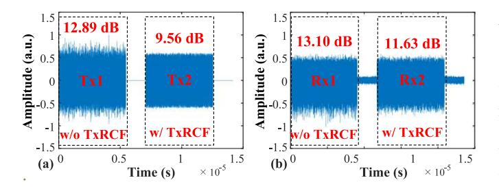

Fig. 13. PAPR comparison of under two different transmission schemes, with/without RCF algorithm, respectively. (a) Tx end, two types of waveforms before the AWG. (b) Rx end, after the THz ED.

enhances BER performance at lower CSPR values, where the system is more sensitive to nonlinear distortion.

In the experimental results shown in Fig. [12\(b\),](#page-6-3) the optimal CSPR was about 6 dB for both the original and RCF-processed OFDM signals. The lowest BERs were 1.5e−3 without clipping and 2.1e−3 with clipping. Whether the RCF algorithm was used or not, the optimal CSPR stayed nearly the same, and the reduction of the optimal CSPR observed in the simulation did not appear in the experiment. Only when the CSPR dropped below 3 dB did the clipped signal have a slightly lower BER than the unclipped signal. The limited effect of the RCF algorithm in the experiment can be explained by changes in the PAPR of the information signal after transmission. As shown in Fig. [13,](#page-7-0) the clipped and unclipped OFDM signals were zero-padded and concatenated to compare the PAPR performance before and after transmission. At the transmitter, the unclipped OFDM signal had a PAPR of 12.89 dB, while the clipped version dropped to 9.56 dB, a difference of 3.33 dB. After passing through the channel and downconversion at the envelope detector, the PAPR of the unclipped signal increased to 13.10 dB, while the clipped signal rose to 11.63 dB, reducing the difference to just 1.47 dB. In other words, although the signal is clipped at the transmitter, the PAPR tends to rise again during transmission, gradually approaching its unclipped level. This shows that the transmission properties of the OFDM signal in the channel somewhat reduce the effectiveness of the RCF algorithm.

The received SNR in the experiment was slightly higher than in the simulation, which explains why the BER performance without using the KK algorithm was better than the simulated results. However, while the simulation only accounted for additive white Gaussian noise, the experiment also involved channel fading, device nonlinearities, shot noise, and other types of interference. Since the KK algorithm is sensitive to nonlinear distortion, these additional noise sources in the experiment caused more degradation of the BER performance. Furthermore, the optimal CSPR observed in the experiment was lower than in the simulation. The integrated signal passed through a series of devices and channels with nonflat frequency responses. The lower optimal CSPR in the experiment suggests that, during transmission, the virtual carrier experienced stronger attenuation than the informationbearing signal. As a result, the CSPR at the receiver differed from that at the transmitter. All the CSPR values shown in the figures refer to the transmitter-side settings.

### *B. Sensing Performance Analysis*

At the sensing receiver, after the echo signal was downconverted via square-law detection and digitized, the first step was to remove the dc component from the baseband signal. The remaining signal, which contained both the OFDM and SSBI components, was then further downconverted to a complex baseband signal. Matched filtering and NMF were then applied to extract the ranging information from the OFDM and SSBI components separately, enabling heterogeneous filter diversity reception. When the system sampling rate *FS* was 64 GHz, the signal sequence length *L* could reach 210 432, which was sufficient to suppress mutual interference between the OFDM and SSBI components in the filter outputs. By aligning the noise floors and peak phases of the two filter outputs, the composite filter could achieve gains in SNR, 3-dB resolution, and PSLR under specific CSPR conditions.

The subplots in Fig. [14](#page-8-4) display the outputs of the nonlinear matched filter, matched filter, and composite filter. When the CSPR of the transmitted integrated signal is 0 dB, the output SNRs of the three filters are 36.29, 40.82, and 41.92 dB, respectively. Compared to using only the matched filter, the composite filter enhances the SNR by 1.1 dB. When the CSPR is set to 3 dB, the communication BER reaches the FEC threshold. At this communication point, the composite filter does not provide an SNR advantage for sensing. In that case, it may be better to rely solely on the matched filter. This tradeoff has limited impact on overall system performance and can be addressed in the future. For example, using waveforms with naturally low PAPR, such as single-carrier or constantenvelope waveforms, can help minimize this issue, allowing the composite filter to still provide an SNR gain even when the communication CSPR is near its optimal value.

A zoomed-in view of the ranging peaks from the top of Fig. [14](#page-8-4) is presented at the bottom to better compare the PSLR and 3-dB resolution of the three filters. The asymmetry in the sidelobes is caused by imperfections in the fourth moment of the information signal, as discussed in [\[33\].](#page-9-29) In Fig. [14\(d\),](#page-8-4) due to the relatively low output SNR of the nonlinear matched filter, the sidelobes are buried in the noise floor. Consequently, the measured PSLR, which is the power ratio between the peak and the highest noise level, is 21.92 dB instead of the ideal 26 dB. The PSLRs for the matched and composite filters are 12.29 and 15.74 dB, respectively. Compared to the matched filter, the PSLR improvements are 9.63 dB for the nonlinear matched filter and 3.45 dB for the composite filter. The 3-dB resolutions for the three filters are 1.94, 2.6, and 1.95 cm, respectively, indicating about a 25% resolution enhancement for both the nonlinear and composite filters over the matched filter. Indeed, the coherent accumulation of outputs from multiple frames can effectively increase the sensing SNR, raising the sidelobes of the SSBI sensing signal above the noise floor, thereby indirectly enhancing the PSLR and range resolution of nonlinear and composite filters. However, in our proof-of-concept experiment, a fixed-length pseudorandom binary sequence (PRBS) was used repeatedly for all OFDM frames. The sequence of coherent accumulation is not long enough, resulting in insufficient SNR in the filter output.

{8}------------------------------------------------

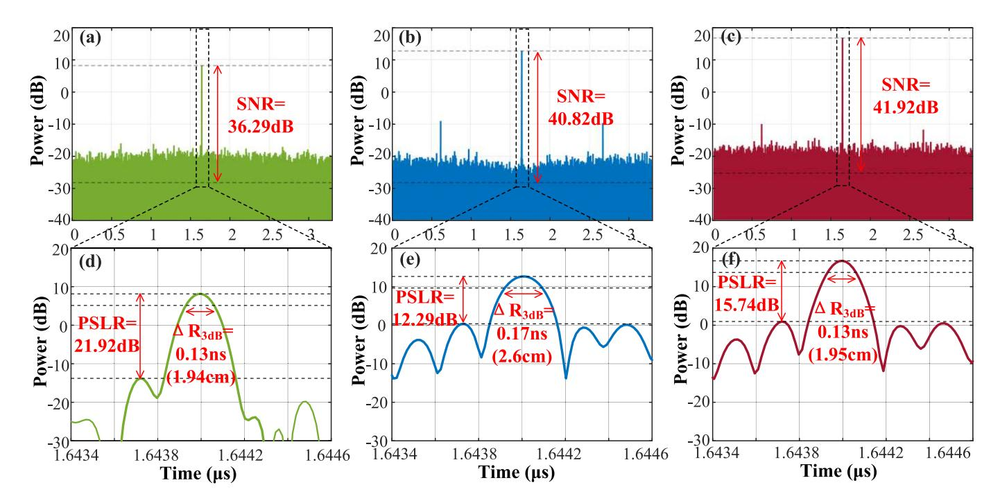

Fig. 14. Output SNRs of different filters. (a) Nonlinear matched filter, (b) matched filter, (c) composite filter, and (d)–(f) output 3-dB resolutions and PSLRs of these three filters, respectively.

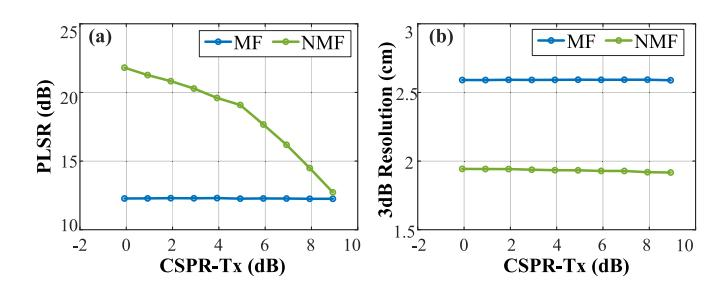

Fig. 15. (a) PSLR and (b) 3-dB resolution of the matched filter and the nonlinear matched filter under different transmitted CSPRs.

As shown in Fig. [15,](#page-8-5) the output metrics of the matched filter remained relatively stable in terms of PSLR and 3-dB resolution, regardless of the CSPR set at the transmitter. When the CSPR was set to 3 dB, the nonlinear matched filter achieved a PSLR gain of 8 dB and approximately 25% improvement in 3-dB resolution. At a CSPR of 6 dB, the PSLR gain was 5.38 dB, with the 3-dB resolution improvement still around 25%. The PSLR gain from the nonlinear matched filter gradually decreased as CSPR increased but remained positive. In contrast, introducing the nonlinear matched filter and composite filter provided additional flexibility gains for the sensing end.

For sensing applications, three observation windows, labeled A, B, and C, can be defined to correspond to the outputs of the nonlinear matched filter, matched filter, and composite filter, respectively. For example, when the available analog bandwidth of the ISAC system is limited, Window A can be used to improve the 3-dB resolution. To detect small targets closely following a strong reflection with a large radar cross section, Window A or C can enhance PSLR. When the echo power is weak, Window B or C is better suited to preserve or increase the SNR. In our communicationcentric ISAC systems, the minimum CSPR needed to meet the SD-FEC threshold is 3 dB. At this CSPR level, the PSLR can improve by up to 8 dB, and the 3-dB resolution can increase by up to 25%.

# IV. CONCLUSION

We proposed and demonstrated a photonics-assisted THz OFDM ISAC system using a constructive SSBI. The system maintains key benefits of traditional self-coherent architectures, such as simple and robust design, high spectral efficiency, and immunity to frequency offset and phase noise. Additionally, we introduced an NMF approach to extract sensing information from the SSBI, significantly enhancing multiple sensing metrics with minimal digital signal processing. In experiments with a 5-GHz bandwidth OFDM signal centered at 144 GHz, we achieved a 20-Gb/s communication rate and a 1.94-cm ranging resolution. Under specific CSPR conditions, the nonlinear matched filter provides up to a 25% improvement in 3-dB range resolution and an 8-dB increase in PSLR. Using a virtual carrier reduces the integrated signal's PAPR by up to 7 dB.

# REFERENCES

- [\[1\]](#page-0-0) R. M. Mealey, "A method for calculating error probabilities in a radar communication system," *IEEE Trans. Space Electron. Telemetry*, vol. SEP-9, no. 2, pp. 37–42, Jun. 1963, doi: [10.1109](http://dx.doi.org/10.1109/TSET.1963.4337601)/ [TSET.1963.4337601.](http://dx.doi.org/10.1109/TSET.1963.4337601)
- [\[2\]](#page-0-1) L. Han and K. Wu, "Multifunctional transceiver for future intelligent transportation systems," *IEEE Trans. Microw. Theory Techn.*, vol. 59, no. 7, pp. 1879–1892, Jul. 2011, doi: 10.1109/[TMTT.2011.2138156.](http://dx.doi.org/10.1109/TMTT.2011.2138156)

{9}------------------------------------------------

- [\[3\]](#page-0-2) W. Yang et al., "Integrated sensing and communication channel modeling and measurements: Requirements and methodologies toward 6G standardization," *IEEE Veh. Technol. Mag.*, vol. 19, no. 2, pp. 22–30, Jun. 2024, doi: 10.1109/[MVT.2024.3383654.](http://dx.doi.org/10.1109/MVT.2024.3383654)
- [\[4\]](#page-0-3) Z. Xiao and Y. Zeng, "Waveform design and performance analysis for full-duplex integrated sensing and communication," *IEEE J. Sel. Areas Commun.*, vol. 40, no. 6, pp. 1823–1837, Jun. 2022, doi: [10.1109](http://dx.doi.org/10.1109/JSAC.2022.3155509)/ [JSAC.2022.3155509.](http://dx.doi.org/10.1109/JSAC.2022.3155509)
- [\[5\]](#page-0-4) X. Liu, T. Huang, N. Shlezinger, Y. Liu, J. Zhou, and Y. C. Eldar, "Joint transmit beamforming for multiuser MIMO communications and MIMO radar," *IEEE Trans. Signal Process.*, vol. 68, pp. 3929–3944, 2020, doi: 10.1109/[TSP.2020.3004739.](http://dx.doi.org/10.1109/TSP.2020.3004739)
- [\[6\]](#page-0-5) Q. He, Z. Wang, J. Hu, and R. S. Blum, "Performance gains from cooperative MIMO radar and MIMO communication systems," *IEEE Signal Process. Lett.*, vol. 26, no. 1, pp. 194–198, Jan. 2019, doi: 10.1109/[LSP.2018.2880836.](http://dx.doi.org/10.1109/LSP.2018.2880836)
- [\[7\]](#page-0-6) F. Liu, C. Masouros, A. P. Petropulu, H. Griffiths, and L. Hanzo, "Joint radar and communication design: Applications, state-of-the-art, and the road ahead," *IEEE Trans. Commun.*, vol. 68, no. 6, pp. 3834–3862, Jun. 2020, doi: 10.1109/[TCOMM.2020.2973976.](http://dx.doi.org/10.1109/TCOMM.2020.2973976)
- [\[8\]](#page-0-7) Y. Cui, F. Liu, X. Jing, and J. Mu, "Integrating sensing and communications for ubiquitous IoT: Applications, trends, and challenges," *IEEE Netw.*, vol. 35, no. 5, pp. 158–167, Sep. 2021, doi: [10.1109](http://dx.doi.org/10.1109/MNET.010.2100152)/ [MNET.010.2100152.](http://dx.doi.org/10.1109/MNET.010.2100152)
- [\[9\]](#page-0-8) *Study on Integrated Sensing and Communication*, document TR 22.837, 3GPP, Jun. 2024. [Online]. Available: https://portal.3gpp.org/desktopmodules/Specifications/ SpecificationDetails.aspx?specificationId=4044
- [\[10\]](#page-0-9) S. Saponara, M. S. Greco, and F. Gini, "Radar-on-chip/in-package in autonomous driving vehicles and intelligent transport systems: Opportunities and challenges," *IEEE Signal Process. Mag.*, vol. 36, no. 5, pp. 71–84, Sep. 2019, doi: 10.1109/[MSP.2019.2909074.](http://dx.doi.org/10.1109/MSP.2019.2909074)
- [\[11\]](#page-0-10) J. Tang et al., "Cooperative ISAC-empowered low-altitude economy," *IEEE Trans. Wireless Commun.*, vol. 24, no. 5, pp. 3837–3853, May 2025, doi: 10.1109/[TWC.2025.3542399.](http://dx.doi.org/10.1109/TWC.2025.3542399)
- [\[12\]](#page-0-11) J. Yang, C.-K. Wen, and S. Jin, "Application of integrated sensing and communication in structural health monitoring," in *Proc. 33rd Wireless Opt. Commun. Conf. (WOCC)*, Hsinchu, Taiwan, Oct. 2024, pp. 128–133, doi: 10.1109/[wocc61718.2024.10785580.](http://dx.doi.org/10.1109/wocc61718.2024.10785580)
- [\[13\]](#page-0-12) D. He et al., "Integrating sensing and communication for IoT systems: Task-oriented control perspective," *IEEE Internet Things Mag.*, vol. 7, no. 4, pp. 76–83, Jul. 2024, doi: 10.1109/[IOTM.001.2300210.](http://dx.doi.org/10.1109/IOTM.001.2300210)
- [\[14\]](#page-0-13) X. Li, Y. Cui, J. A. Zhang, F. Liu, D. Zhang, and L. Hanzo, "Integrated human activity sensing and communications," *IEEE Commun. Mag.*, vol. 61, no. 5, pp. 90–96, May 2023, doi: [10.1109](http://dx.doi.org/10.1109/MCOM.002.2200391)/ [MCOM.002.2200391.](http://dx.doi.org/10.1109/MCOM.002.2200391)
- [\[15\]](#page-0-14) T. Ma, Y. Xiao, X. Lei, and M. Xiao, "Integrated sensing and communication for wireless extended reality (XR) with reconfigurable intelligent surface," *IEEE J. Sel. Topics Signal Process.*, vol. 17, no. 5, pp. 980–994, Sep. 2023, doi: 10.1109/[JSTSP.2023.3304846.](http://dx.doi.org/10.1109/JSTSP.2023.3304846)
- [\[16\]](#page-0-15) K. Wu, Z. Wang, S.-L. Chen, J. Andrew Zhang, and Y. Jay Guo, "ISAC: From human to environmental sensing," 2025, *arXiv:2507.13766*.
- [\[17\]](#page-0-16) C. Han, Y. Wu, Z. Chen, Y. Chen, and G. Wang, "THz ISAC: A physicallayer perspective of terahertz integrated sensing and communication," *IEEE Commun. Mag.*, vol. 62, no. 2, pp. 102–108, Feb. 2024, doi: 10.1109/[MCOM.001.2200404.](http://dx.doi.org/10.1109/MCOM.001.2200404)
- [\[18\]](#page-0-17) L. Wang, X. Wang, and S. Pan, "Microwave photonics empowered integrated sensing and communication for 6G," *IEEE Trans. Microw. Theory Techn.*, vol. 73, no. 8, pp. 5295–5315, Aug. 2025, doi: [10.1109](http://dx.doi.org/10.1109/TMTT.2025.3532810)/ [TMTT.2025.3532810.](http://dx.doi.org/10.1109/TMTT.2025.3532810)

- [\[19\]](#page-0-18) H. Yan et al., "W-band photonic-aided mm-wave ISAC system enabled by a shared OFDM signal waveform and a two-stage carrier frequency recovery algorithm," *Opt. Lett.*, vol. 49, no. 18, pp. 5280–5283, Sep. 2024, doi: 10.1364/[ol.537847.](http://dx.doi.org/10.1364/ol.537847)
- [\[20\]](#page-0-19) Z. Lyu et al., "Dual-chirp-based photonic THz-ISAC system with adaptive frequency synchronization," *Opt. Lett.*, vol. 49, no. 16, pp. 4493–4496, Aug. 2024, doi: 10.1364/[ol.530911.](http://dx.doi.org/10.1364/ol.530911)
- [\[21\]](#page-0-20) J. Zhang et al., "Photonics-aided THz integrated sensing and communication system based on a subcarrier-chirp inter-embedded waveform," *IEEE Open J. Commun. Soc.*, vol. 6, pp. 2993–3003, 2025, doi: [10.1109](http://dx.doi.org/10.1109/OJCOMS.2025.3545896)/ [OJCOMS.2025.3545896.](http://dx.doi.org/10.1109/OJCOMS.2025.3545896)
- [\[22\]](#page-0-21) W. Bai et al., "Millimeter-wave joint radar and communication system based on photonic frequency-multiplying constant envelope LFM-OFDM," *Opt. Exp.*, vol. 30, no. 15, pp. 26407–26409, Jul. 2022, doi: 10.1364/[oe.461508.](http://dx.doi.org/10.1364/oe.461508)
- [\[23\]](#page-1-2) N. Zhong, P. Li, W. Bai, W. Pan, L. Yan, and X. Zou, "Spectralefficient frequency-division photonic millimeter-wave integrated sensing and communication system using improved sparse LFM sub-bands fusion," *J. Lightw. Technol.*, vol. 41, no. 23, pp. 7105–7114, Dec. 15, 2023, doi: 10.1109/[jlt.2023.3265799.](http://dx.doi.org/10.1109/jlt.2023.3265799)
- [\[24\]](#page-1-3) B. Dong et al., "THz integrated sensing and communication with full-photonic direct LFM reception and de-chirping for D-band fiber-wireless network," *IEEE Trans. Microw. Theory Techn.*, vol. 73, no. 8, pp. 5383–5395, Aug. 2025, doi: 10.1109/[TMTT.2025.](http://dx.doi.org/10.1109/TMTT.2025.%26%23xe008; 3549729) [3549729.](http://dx.doi.org/10.1109/TMTT.2025.%26%23xe008; 3549729)
- [\[25\]](#page-1-4) F. Wu et al., "Photonic-assisted W-band flexible integrated sensing and communication system for fiber-wireless network based on CE-LFM-OFDM," *Opt. Lett.*, vol. 49, no. 16, pp. 4605–4608, Aug. 2024, doi: 10.1364/[ol.528335.](http://dx.doi.org/10.1364/ol.528335)
- [\[26\]](#page-1-5) B. Dong et al., "Photonic-based W-band integrated sensing and communication system with flexible time{-} frequency division multiplexed waveforms for fiber-wireless network," *J. Lightw. Technol.*, vol. 42, no. 4, pp. 1281–1295, Feb. 15, 2024, doi: 10.1109/[jlt.2024.](http://dx.doi.org/10.1109/jlt.2024.%26%23xe008; 3354070) [3354070.](http://dx.doi.org/10.1109/jlt.2024.%26%23xe008; 3354070)
- [\[27\]](#page-1-6) L. Yin and J. He, "Modulated-symbol domain matched filtering scheme for photonic-assisted integrated sensing and communication system based on a single OFDM waveform," *Opt. Lett.*, vol. 49, no. 8, pp. 2153–2156, Apr. 2024, doi: 10.1364/[ol.518695.](http://dx.doi.org/10.1364/ol.518695)
- [\[28\]](#page-1-7) B. Dong et al., "Photonic-based W-band flexible TFDM integrated sensing and communication system for fiber-wireless network," in *Proc. Opt. Fiber Commun. Conf. Exhib. (OFC)*, Mar. 2023, pp. 1–3, doi: 10.1364/[OFC.2023.W4J.5.](http://dx.doi.org/10.1364/OFC.2023.W4J.5)
- [\[29\]](#page-1-8) T. Harter et al., "Generalized Kramers–Kronig receiver for coherent terahertz communications," *Nature Photon.*, vol. 14, no. 10, pp. 601–606, Oct. 2020, doi: 10.1038/[s41566-020-0675-0.](http://dx.doi.org/10.1038/s41566-020-0675-0)
- [\[30\]](#page-1-9) R. K. Patel, I. A. Alimi, N. J. Muga, and A. N. Pinto, "Optical signal phase retrieval with low complexity DC-value method," *J. Lightw. Technol.*, vol. 38, no. 16, pp. 4205–4212, Aug. 15, 2020, doi: [10.1109](http://dx.doi.org/10.1109/JLT.2020.2986392)/ [JLT.2020.2986392.](http://dx.doi.org/10.1109/JLT.2020.2986392)
- [\[31\]](#page-1-10) F. Liu et al., "Millimeter-wave over fiber integrated sensing and communication system using self-coherent OFDM," *Opt. Exp.*, vol. 32, no. 9, pp. 15493–15506, Apr. 2024, doi: 10.1364/[oe.513686.](http://dx.doi.org/10.1364/oe.513686)
- [\[32\]](#page-2-4) A. Mecozzi, C. Antonelli, and M. Shtaif, "Kramers–Kronig coherent receiver," *Optica*, vol. 3, no. 11, pp. 1220–1227, Nov. 2016, doi: 10.1364/[optica.3.001220.](http://dx.doi.org/10.1364/optica.3.001220)
- [\[33\]](#page-7-1) Z. Du, F. Liu, Y. Xiong, T. X. Han, Y. C. Eldar, and S. Jin, "Reshaping the ISAC tradeoff under OFDM signaling: A probabilistic constellation shaping approach," *IEEE Trans. Signal Process.*, vol. 72, pp. 4782–4797, 2024, doi: 10.1109/[TSP.2024.](http://dx.doi.org/10.1109/TSP.2024.%26%23xe008; 3465499) [3465499.](http://dx.doi.org/10.1109/TSP.2024.%26%23xe008; 3465499)