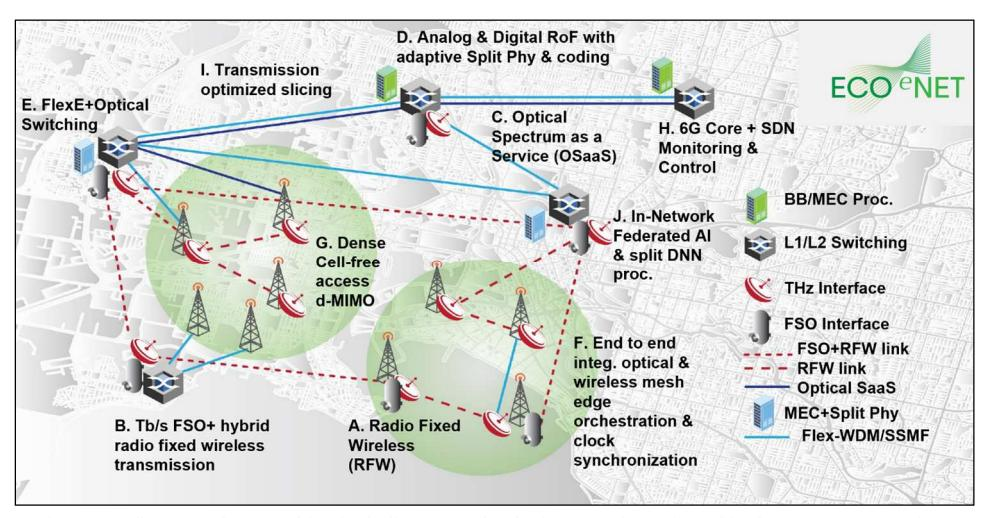
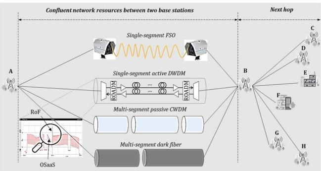
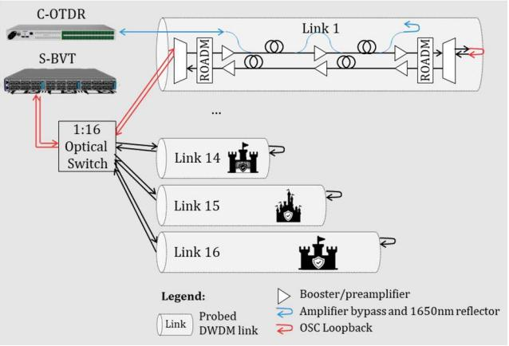
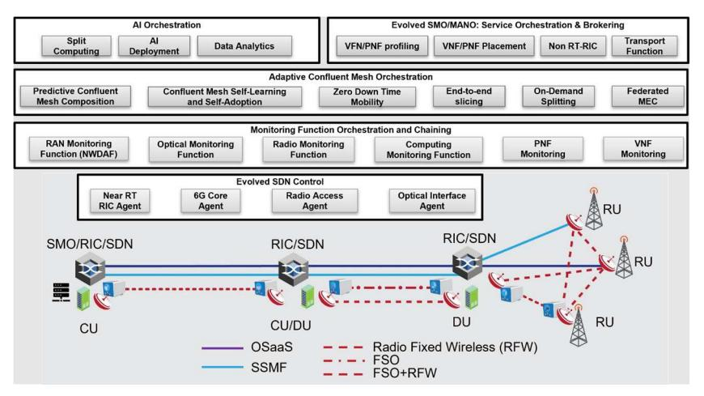

{0}------------------------------------------------

63

2024 European Conference on Networks and Communications & 6G Summit (EuCNC/6G Summit): 6G Next-Generation Visions & Sustainability (NVS)

# Towards Efficient Confluent Edge Networks

Rishu Raj1, Devika Dass1, Kaida Kaeval2, Sai Patri3, Vincent Sleiffer3, Benedikt Baeuerle4, Wolfgang Heni4, Marco Ruffini1, Colm Browning5, Alan Naughton5, Ruth Mackey5, David Mackey5, Boris Vukovic6, Jasmin Smajic 6, Juerg Leuthold 6, Carlos Natalino7, Lena Wosinska7, Tommy Svensson7, Aleksandra Kaszubowska-Anandarajah1, Ioanna Mesogiti8, Simon Pryor9, Anna Tzanakaki10, Reza Nejabati11, Paolo Monti7, and Dan Kilper1

1CONNECT Centre, School of Computer Science and Statistics, Trinity College Dublin, Dublin, Ireland; 2Tallinn University of Technology, Tallinn, Estonia; 3Adtran Networks SE, Germany; 4Polariton Technologies, Adliswil, Switzerland; 5mBryonics Ltd, Galway, Ireland; 6ETH Zurich, Institute of Electromagnetic Fields, Zurich, Switzerland; 7Electrical Engineering Department, Chalmers University of Technology, Gothenburg, Sweden; 8OTE –Hellenic Telecommunications Organisation, Athens, Greece; 9Accelleran N.V., Antwerp, Belgium; 10National and Kapodistrian University of Athens, Athens, Greece; 11University of Bristol, Bristol, UK.

Abstract— We provide a vision for 6G fixed networks based on flexible and scalable high-capacity transmission technologies that form mesh edge networks to achieve ultra energy-efficient highly available networks with low latency. These networks will be controlled by AI-native orchestration across mobile, fixed, and compute domains. Mesh networking at the edge will be enabled by a seamless 'confluence' of radio fixed wireless (RFW), free space optical (FSO), and switched flex grid wavelength division multiplexed (Flex-WDM) transport using optical-spectrum-as-a-service (OSaaS) and integrated sensing and communication capabilities. In addition, in the frame of the European Smart Network Services Joint Undertaking, the ECO-eNET project will investigate key technologies and concepts to determine the full potential of confluent networks as a viable and scalable platform for 6G.

Keywords— Confluent networking, Free-space optics, Radio fixed wireless, Optical spectrum as a service, Fibre sensing.

#### I. INTRODUCTION

The densification of wireless access points started in 5G will continue through 6G as end user data rates and the number of connected devices continue to increase. In addition to higher capacity at the edge, emerging applications such as haptic controls and emergency response mechanisms are demanding lower latency and high availability. This combination of increased network performance and access point densification at the edge presents a major challenge for future 6G networks [1]. Extending the high-capacity metro core networks based on dense wavelength division multiplexing (DWDM) to this edge environment would be expensive and problematic to deploy in many edge locations [2]. Line of sight fixed wireless technologies in the mmWave and (sub-) terahertz (THz) bands and free space optics (FSO) promise high capacity but are susceptible to blocking and weather-related outages [3]. Combining these fixed wireless transmission technologies with fibre networks, however, could provide a promising compromise, particularly if the fibre systems could be used in more efficient, adaptive, and switched operations.

Already new applications and network functionality are creating a proliferation of edge and far-edge cloud data centres positioned geographically closer to the user devices. These resources will naturally create more east-west traffic flow within the edge as opposed to traditional north-south traffic flow from the edge to the core. This east-west traffic would benefit from mesh connectivity, which would improve performance and reliability through path diversity. However, edge networks are primarily tree and point-to-point networks

for cost and deployment reasons. Core mesh optical networks are again too expensive to extend to the edge and integration with high-capacity fixed wireless transmission technologies might provide a solution. Optical spectrum as a service (OSaaS) is attractive as an efficient and flexible transmission platform that might be used to facilitate the integration of radio and optical signals for this purpose. Integrated radio and optical sensing signals can also be carried on this same platform [4]. To enable such mesh networks at the edge, a seamless and efficient integration of these diverse technologies is needed. In particular, radio and optical signals will more than converge, they will need to be confluent: flowing together in a unified transmission network.

In this context, the term confluent transmission is used to refer to systems that natively support multiple transmission media and their signals, as illustrated in Fig. 1. This can include, for example, transmission over a combination of radio fixed wireless (RFW: mmWave or sub-THz/THz), FSO, and flex grid wavelength division multiplexed (Flex-WDM) fibre optics. Such confluent transmission can be implemented using OSaaS transmission capabilities to form mesh networks offering flexible management of highcapacity traffic with low latency and high energy efficiency. Importantly, new developments in RFW and FSO links that can achieve terabit per second capacities would enable the formation of mesh networks at the edge, where deployment costs and complexity prohibit wired mesh networks. These wireless links offer the efficiency and latency benefits of mesh data transport while enabling the transmission of the control plane signals to manage both the wireless and wireline networks. This provides a new degree of freedom in network control that can be exploited to facilitate optical switching and low latency. Analogue radio-over-fibre (aRoF) signals [5], sent over the wired network and efficiently converted to RFW signals using novel plasmonic devices, can potentially provide the high capacity needed and when combined with FSO, can achieve greater resilience to changing weather conditions. Efficient path diversity through adaptive optical transmission within OSaaS using optical switching can also contend with the blocking events in the wireless links. The combination of analogue and digital signals in this confluent mesh network enables further optimization of front-/mid-/back-haul (x-haul) networks and the delivery of artificial intelligence (AI) services through edge cloud computing.

ECO-eNET is a funded Horizon Europe Smart Networks and Services Joint Undertaking project that will investigate

{1}------------------------------------------------

Fig. 1. Confluent mesh networking including ten technologies (A-J) investigated in the ECO-eNET project.

the support of 6G use cases and the achievement of 6G key performance indicators (KPIs) through the use of such confluent x-haul networks with high-density cell-free radio

iple-output (d-MIMO) techniques to efficiently deliver high data capacity. The proposed confluent x-haul network will exploit a wide range of spectral bands (at transport and radio segments), while overcoming the challenges of line-ofsight (LoS) communications being subject to severe blocking and fading challenges.

#### II. CONFLUENT MESH NETWORKING

Confluent networking considers three transmission media for use in xhaul networks: RFW, FSO, and Flex-grid DWDM fibre optics. Confluent mesh networking is the core or primary focus of the ECO-eNET project. Ten different related networking technologies (A-J in Fig. 1) will be studied in the project. The main goal and objectives are:

- *1) Confluent transmission technologies:* The potential of technologies like RFW at THz and sub-THz frequencies, FSO, and DWDM fibre optics will be explored to enable the performance required by 6G. Electronic RFW transceivers will be replaced by plasmonic-based ones to extend the reach of the RFW link and significantly reduce the energy consumption of the network. Moreover, the project aims to create a transparent fibre-FSO interface supporting multiple modulation formats. This will be possible thanks to novel, low-cost, adaptive photonic components and lantern technology. Optically switched and modulation format adaptive OSaaS will be used to efficiently multiplex and transport the signals from these diverse transmission links in mesh configurations and connect them with edge computing resources. OSaaS will also enable fibre and radio sensing signals to be carried alongside the communication signals. The project will explore parallel and integrated sensing and communication to better optimize the network and provide new sensing based network services.
- *2) Control and orchestration methods for confluent networking:* The proposed physical layer solutions will be able to deliver their full potential in terms of improved capacity, energy efficiency, and latency only if appropriately controlled and managed. This will be achieved by the adoption of existing and the development of new wireline, radio, and compute controllers, capable of efficient end-to-

access networks (RANs) using coordinated multipoint (CoMP) and distributed multiple-input mult

end provisioning across these highly diverse domains. This will be coordinated through an AI-enabled orchestration layer, that efficiently delivers AI services for both end user applications and network control and optimization. These AI services will also make use of environmental information from network sensing components. Furthermore, resource allocation and configuration across the wireless and wired domains will be supported through the adoption of suitable AI-driven operations facilitating fast service delivery that meets service requirements in the most resource- and energyefficient manner.

*3) Demonstration of the key technologies and network concepts:* The technologies and control/management solutions will be combined in a series of lab and field experiments to understand their potential and limitations. The first experiment will study confluent transmission of sub-THz RFW and FSO wireless transmission systems to establish an outdoor link under changing weather conditions. These technologies are expected to be complementary, as they perform best in different atmospheric conditions. Conditions for achieving 1 Tb/s over a 1 km distance will be evaluated, and strategies for addressing changing weather conditions will be studied. Secondly, the project will assess fibre sensing used to allocate/reconfigure wireless (RFW and FSO) and wired (DWDM) resources. Finally, the effectiveness of the AI-based control of confluent transmission over an OSaaS xhaul mesh network will be studied, including use of fibre sensing to achieve energy- and latency-optimized operations.

### III. BACKGROUND LITERATURE

RFW, FSO, and flex-grid DWDM have individually progressed to the point that they are promising candidates for use in 6G x-haul networks. Since the initial demonstration of a commercial RFW link in 2012, showing 10 Gb/s over 5 km at a carrier of 120 GHz [6], much progress has been made, reaching data rates of up to 1 Tb/s over a few meters [7]. Electronic RFW transceivers offer a high level of integration and can host mixers, frequency doublers, and amplifiers on the same chip [8], but they are fundamentally bandwidth limited. Photonics-based RFW transceivers, on the other

{2}------------------------------------------------

Fig. 2. Confluent network resources between two base stations. The magnifying glass emphasizes the OSaaS that can be generated at base station A or routed as a bundled signal from further points in the network.

Fig. 3. Fibre sensing options utilising C-OTDR and channel probing.

hand, do not suffer from bandwidth limitations and allow for a direct and transparent connection to a fibre optical network [9]. State-of-the-art demonstrations achieved 192 Gb/s RFW transmission over 115 m at a wireless carrier frequency of 230 GHz [10]. However, photonic RFW transceivers to date lack the same level of integration as their electronic counterparts, which is essential for scaling to the requirements of future 6G networks. Integrated photonic emitters and receivers tackle this problem by directly incorporating multiple photodiodes or modulators with planar antennas on the same chip. Most FSO systems rely solely on customised forward error correction and powerintensive digital signal processing to reduce the bit error rate due to the atmospheric deep signal fades, which also introduces latencies on the order of hundreds of milliseconds in strong turbulence. Such systems have demonstrated 1.72 Tbps throughput over 3 km [11].

While each transmission medium has been studied in some detail, they generally have yet to be studied in combination. RFW and FSO links have been investigated for mmWave bands, including relay systems, security aspects, and multihop scenarios [12], [13] as parallel and hybrid transmission channels. Going beyond existing developments, ECO-eNET will perform the first sub-THz RFW and FSO hybrid transmission experiments. mmWave and FSO links have been used with DWDM transmission in series and network configurations using aRoF signals [14]. ECOe-NET will evolve this work further through systematic studies of series, parallel, and hybrid link configurations, as well as multiplexing of analogue, digital RoF and baseband digital signals with single channel capacities >=100 Gb/s and maximum (WDM) capacities up to 100 Tb/s.

## IV. RESEARCH CHALLENGES

ECO-eNET aims to combine new optical and wireless transmission media and innovative devices within the confluent networking framework to meet the targeted 6G capabilities. However, the attainable performance gains will ultimately depend on how these innovations can be operated over 6G control and management systems. To this end, ECOe-NET will explore new control and management functions for confluent networking while remaining compatible with emerging 6G control architectures. Furthermore, a set of toolboxes and methodologies will be developed to plug into a programmable 6G environment. For this purpose, ECOe-NET will use an evolved disaggregated radio architecture combined with SDN x-haul control aligned with emerging 6G architectures.

In addition, the proposed confluent edge networks will be analysed in terms of technologies and architecture deployment/realisation options, and the proposed control and management layer will incorporate decision logic optimising the network instances jointly from technical, economic and energy perspectives, towards defining technically feasible, economically viable and sustainable (energy dimension) technologies and deployment options. ECOe-NET will leverage past technical and energy efficiency network studies [15 – 18]. Moreover, the deployment options and resource allocation will also be assessed from a techno-economic perspective, leveraging the 5G deployment assessment approaches presented in [19 – 21].

#### *A. Confluent Transmission Technologies*

The concept of confluent networking is shown in Fig. 1. Baseband signals may be processed for transmission at different split physical layer points, including the analogue radio signal and digital (splits 7.x and 8), at various locations along the end-to-end path. In the figure, Flex Ethernet and optical switching and grooming/aggregation are used to reconfigure the path depending on the service needs and network management policies. This approach provides tremendous freedom for optimising the network for energy consumption, latency, and capacity.

## *1) Radio Fixed Wireless (RFW) Transmission*

The plasmonic RFW link consists of a novel dual polarisation RFW transceiver, doubling the available data rate and operating over the 190 – 350 GHz frequency range. The transceiver allows for a direct optical-to-THz and THzto-optical conversion of four or more data channels simultaneously. The data signals fed to the transceiver are encoded on separate wavelengths, using modulation formats with a minimum spectral efficiency of 5 bits/Hz. A symbol rate of 25 Gbaud per channel will be used, covering an estimated total bandwidth of 105 GHz in the RFW domain. Finally, a dynamic bit loading of individual WDM channels will be considered to fully exploit each channel's capacity [10].

## *2) Free Space Optical (FSO) Transmission*

A 1 Tb/s capacity FSO link with a 1 km reach will enable transparent fibre-coupled FSO links that can operate agnostically to the optical channel. The FSO antenna consists of an optical head and photonic components which enable

{3}------------------------------------------------

Fig. 4. ECO-eNET control and management framework.

high throughput FSO point-to-point links to be realised. Crucially the FSO system must compensate for atmospheric turbulence which is done using a combination of high-speed tracking and higher order correction using a photonic lantern which enables the FSO link to be fibrecoupled. Fibre coupling is very advantageous for confluent networking since it allows the use of standard optical communication systems components such as optical transceivers and fibre amplifiers. The FSO system will be expanded to allow compatibility with additional modulation formats while also targeting the use of low-cost components and increased capacity of up to 1Tb/s.

## *3) Hybrid RFW/FSO Transmission*

In addition to optical compensation techniques, atmospheric effects on FSO transmission can be mitigated by combining the FSO link with an RFW link. The absorption and scattering properties of RFW and FSO differ since the scattering of the signal depends upon the size of the water droplets in the atmosphere. For example, fog is particularly detrimental to FSO, while rain deteriorates the RFW link. Therefore, using RFW and FSO together can improve the transmission system's resilience over different atmospheric and weather conditions. This can be done by establishing parallel FSO and RFW links, operating separately, or combining them into a hybrid link sharing common data and coding, for example, using maximal ratio combining. In the latter case, joint detection provides superior outage performance compared with either individual channel for all atmospheric turbulence regimes, pointing errors, and RF fading [22]. Such hybrid links have been demonstrated for mmWave and FSO operation [14]. The case of sub-THz RFW and FSO will be studied to determine the performance tradeoffs for the different combinations and consider the energy requirements and signal modulation for confluent networks.

#### *4) Optical Spectrum as a Service (OSaaS)*

OSaaS is a transparent lightpath connecting two endpoints in the network [4]. When OSaaS is implemented on longer routes, the number of transceivers can be significantly reduced. Hence, the capital investments into the transceivers and the overall latency of the end-to-end service are lowered. Furthermore, a smaller amount of active equipment contributes to a higher availability of end-to-end services and reduces the carbon footprint per end-to-end service. OSaaS is completely independent of the underlying infrastructure and can employ a mix of DWDM networks utilising different technologies. This can include completely passive 1530, 1550 or 1570 nm channels from the coarse wavelength division multiplexing (CWDM) channel plan or dark fibre segments. Thus, the OSaaS concept could also bring the benefits mentioned above to the access networks serving 6G. However, the seamless implementation of this new service type in mesh access networks requires attention to resource allocation and management over all interconnected segments. While this is complicated in the case of dark fibre or passive segments due to often missing databases, it requires extra attention in the case of active systems, where unbalanced signal powers may interrupt the performance of the neighbouring channels or, even worse, the whole system. Fig. 2 illustrates the implementation of the OSaaS as part of the confluent mesh network at the edge. The magnifier is located at the input of the DWDM system, as it has the highest requirements for input power compatibility. Similarly, if performance allows, OSaaS can also be transmitted over low cost CWDM or dark fibre links.

#### *5) Fibre Sensing*

Coherent-optical time domain reflectometers (C-OTDRs) transfer the complete optical field, namely amplitude, phase, and polarisation information, into electronically accessible information. As a result, C-OTDRs are ideally suited to detect and pinpoint the location of any disturbance in the vicinity or onto the fibre by tracking the phase of the back-reflected signal. A wide range of events can be detected, from temperature changes due to fire, digging, or traffic activity near buried optical fibre to vibrations induced by storms onto the optical ground wire (OPGW) overhead cables. Therefore, a C-OTDR can be used to predict potential failure of the optical network and detect weather conditions which may affect the wireless communication channels, thus helping improve the performance and reliability of the confluent network.

Next to OTDR technology, a dedicated, characterised transceiver can be used with an optical switch for precise sensing purposes. This allows the collection of accurate sensing data from several access links using a single dedicated coherent transceiver. For continuous trend monitoring, any already commissioned transceiver can also be used. The telemetry data can be exploited as is or interpreted through channel probing or inverse back-to-back 

{4}------------------------------------------------

methods to retrieve precise channel performance information from the commissioned live channels. Coherent transceiverbased sensing is particularly useful in the active parts of the confluent mesh networks. It enables the detection of signal spectrum overlap for dense utilisation of resources, detecting exact spectrum performance in terms of generalised signalto-noise (GSNR), or recognising any direct detection channels transmitted alongside coherent channels. All of these are essential aspects for OSaaS in edge networks.

Further analyses of the data provided by the coherent receiver digital signal processors allow for correlating the transceiver performance with information such as weather conditions and temperature changes, albeit with limited information on the localisation of these events. Currently, channel probing is mainly used in long-haul transmission systems. The exact usage scenarios to support confluent mesh networks containing passive network segments in the edge must be investigated. In addition, both C-OTDR and channel probing-based sensing data can be correlated to wireless sensing data, providing additional input for future applications. The connection scheme of the two fibre sensing techniques described above is depicted in Fig. 3.

## *B. Confluent Network Management & Control*

The performance of the physical layer technologies (discussed in Section III) and their potential to deliver improved capacity, energy efficiency, and latency depend on how they are controlled and managed. This, however, imposes several challenges as radio and transport networks are currently separately engineered and controlled. Crossdomain and cross-physical layer technology 5G core, transport and radio access network control will need to evolve towards increased coordination and compatibility for 6G and confluent networking. AI-based network control is also investigated to address the complexity of joint control and management across wireless and wireline systems. Therefore, the ECO-eNET project will build tools that can exploit the confluent networking capabilities within this evolving and increasingly integrated control environment. In addition, in-network AI capabilities will be added for user and network (xApp and rApp) applications leveraging the O-RAN Alliance architectural extensions to 3GPP, with the addition and extension of the RAN Intelligent Controller (RIC) towards 6G [23]. In addition, in-network AI capabilities will be added for user and network (xApp and rApp) applications.

More specifically, the ECO-eNET platform will include a flexible and scalable control framework with extendable application programming interfaces (APIs) on top of the B5G/6G Open RAN, the core and the transport network domains to enable monitoring and programmability of the underlying network infrastructure. This will enable an endto-end platform that can support customised service delivery in response to the service requirements in the most resource and energy-efficient manner. The ECO-eNET control platform will include a flexible RIC, which will support RAN monitoring and adaptive radio resource slicing and bundling into suitable dynamic RAN architectures such as cell-free and distributed MIMO and integrated access and backhaul (IAB) with confluent mesh x-haul, a flexible core network controller to support core network control and monitoring, and an SDN control layer that will provide transport network control and monitoring. The monitoring data collection will ensure appropriate system initialization and allow continuous optimisation of the entire system operation. This ECO-eNET monitoring system will be able to subscribe and collect both high-level (E2E service related such as throughput, packet latency, jitter, etc.) and low-level statistics (network/compute resource utilisation, bit error rate, packet error rate, power consumption, physical layer characteristics of the RFW links and optical switching nodes). These statistics can then be exposed to other NFs hosted at the ECO-eNET platform, such as the network data analytics functions (NWDAF), to provide recommendation services. The system will also be able to make lower layer decisions such as optimal mapping of the wireless domain service characteristics to the optical transport parameter configuration. Special attention will be put into developing an integrated control plane supporting the seamless cross-domain service delivery through the wireless and transport domains to enable confluent networking.

With sensing and extended control-plane telemetry arising from both the transport and RAN (with 6G ISAC), the need for a 6G ready architectural framework will be researched and developed, to support distributed and federated processing, control and intelligence [24], evolved from the O-RAN split Non-RT and Near-RT RIC hierarchy towards a 'Common SMO' [23]. A crucial part of the research will explore the relative benefits of placing the different control elements within the confluent network, particularly where the transport SDN intersects with the near RT RIC and other RAN control functions, which need to be investigated. Fig. 4 shows the envisioned control and management functionalities to be investigated for confluent networking that includes integrated wireless/wireline data plane operations optimised in terms of energy consumption, latency, confluent end-toend slicing, and service provisioning.

#### V. SYSTEM EXPERIMENTS

A series of system experiments evaluating the confluent network performance while incorporating the 6G use case requirements and other architectural constraints will be carried out. These will bring together the technologies under investigation and experiment on key performance elements. In addition, the obtained results will be further analysed, considering the expected commercialisation paths and technological evolution to determine their potential for meeting the final 6G targets.

The performance of the FSO link will be evaluated in two separate outdoor experiments. The first will be a longdistance experiment to establish the 1+ km reach. The transmitter and receiver will each have dark fibre connectivity within the testbed and line of sight visibility. Signal generation and analysis will be carried out using the test equipment in the lab. The RFW link will be developed separately, and similarly to the FSO experiments, the 1 km reach performance will be evaluated in a separate experiment. Experiments will also be carried out using a short-distance outdoor configuration to enable data collection over an extended period. They will include the FSO and RFW links for hybrid and parallel transmission experiments.

For confluent mesh network experiments, different fibre topologies will be configured to systematically evaluate 

{5}------------------------------------------------

network performance, considering different distances, numbers of hops, aRoF, dRoF and baseband (short reach and coherent optical) transmission to study crosstalk and other interference effects such as power dynamics in amplified portions of the network. Space (fibre), wavelength and FlexE switches will be used for dynamic bandwidth management. High-speed electro-optic switches, configured with and without filters, will be used to study switching speed dependencies, going down to the sub-microsecond switching time scales. This general setup will be the basis for the edge network resource allocation experiments based on fibre sensing feedback. Based on sensed data, the experiments will evaluate how fibre sensing information can be used to allocate/reconfigure wireless (RFW and FSO) and wired (DWDM) resources. The goal is to trigger the new route selection in case of a route failure or a new equipment configuration request in case of degradation. The confluent control and management integrations and AI orchestration will be implemented to study the operation of confluent networking in an evolved control and management framework and its performance in AI-driven and enhanced services and network operations. The end-to-end demonstration of the ECO-eNET end-to-end confluent architecture, with the control plane orchestrating the key underlying wireless and optical technologies will be carried out in the OpenIreland testbed in Dublin, Ireland [25] and on the Bristol testbed in the UK.

## VI. CONCLUSION

A network paradigm based on confluent edge network technologies is envisioned to meet the capacity, energy efficiency, availability, and latency targets of 6G. A low latency seamless integration between wireless and optical xhaul networks, including FSO, aRoF, dRoF and DWDM baseband technologies using OSaaS, will be studied together with AI-orchestration in radio and optical system control platforms over edge and metro networks. Sub-THz and FSO links will achieve 1 Tb/s up to 1 km to enable high-capacity mesh networks at the edge. High reliability optically switched capacity management within this confluent mesh network will enable highly efficient dense cell-free radio access scalable to high capacity and the integration of fibre and wireless sensing.

## ACKNOWLEDGEMENTS

This work was supported by the ECO-eNET project with funding from the Smart Networks and Services Joint Undertaking (SNS JU) under grant agreement No. 10113933. The JU receives support from the European Union's Horizon Europe research and innovation programme.

## REFERENCES

- [1] C. -X. Wang *et al.*, "On the road to 6G: Visions, requirements, key technologies, and testbeds," *IEEE Communications Surveys & Tutorials*, vol. 25, no. 2, pp. 905-974, Feb. 2023.
- [2] E. Forestieri *et al.*, "High-speed optical communications systems for future WDM centralized radio access networks," *Journal of Lightwave Technology*, vol. 40, no. 2, pp. 368-378, Jan. 2022.
- [3] A. Bekkali *et al.*, "Free space optical communication systems for 6G: A modular transceiver design," IEEE Wireless Communications, vol. 30, no. 5, pp. 50-57, Oct. 2023.

- [4] K. Kaeval *et al.*, "Characterization of the optical spectrum as a service," *J. Opt. Commun. Netw.*, vol. 14, no. 5, pp. 398-410, May 2022.
- [5] R. Altuna, J. D. L-Cardona and C. Vázquez, "Monitoring of power over fiber signals using intercore crosstalk in ARoF 5G NR transmission," *Journal of Lightwave Technology*, vol. 41, no. 23, pp. 7155-7161, Dec. 2023.
- [6] A. Hirata *et al.*, "120-GHz-band wireless link technologies for outdoor 10-Gbit/s data transmission," *IEEE Transactions on Microwave Theory and Techniques*, vol. 60, no. 3, pp. 881-895, Mar. 2012.
- [7] H. Zhang *et al.*, "Aggregated 1.059 Tbit/s photonic-wireless transmission at 350 GHz over 10 meters," in *Proc. Opto-Electronics and Communications Conference (OECC)*, Hong Kong, 2021, pp. 1-3.
- [8] I. Kallfass *et al.*, "64 Gbit/s transmission over 850 m fixed wireless link at 240 GHz carrier frequency," *Journal of Infrared, Millimeter and Terahertz Waves*, vol. 36, no. 2, pp. 221-233, Jan. 2015.
- [9] S. Ummethala *et al.*, "THz-to-optical conversion in wireless communications using an ultra-broadband plasmonic modulator," *Nature Photonics*, vol. 13, no. 8, pp. 519-524, Jul. 2019.
- [10] Y. Horst *et al.*, "Transparent optical-THz-optical link transmission over 5/115 m at 240/190 Gbit/s enabled by plasmonics," in *Proc. Optical Fiber Communications Conference and Exhibition (OFC*), San Francisco, CA, USA, 2021, pp. 1-3.
- [11] German Aerospace Center, "World record in free-space optical communications," 2016. [Online]. Available: www.dlr.de/en/latest/ news/2016/20161103\_world-record-in-free-space-optical-communica tions\_19914.
- [12] Y. F. Al-Eryani *et al.*, "Protocol design and performance analysis of multiuser mixed RF and hybrid FSO/RF relaying with buffers," *J. Opt. Commun. Netw.,* vol. 10, no. 4, pp. 309-321, Apr. 2018.
- [13] E. Erdogan *et al.*, "The secrecy comparison of RF and FSO eavesdropping attacks in mixed RF-FSO relay networks," *IEEE Photonics Journal*, vol. 14, no. 1, pp. 1-8, Feb. 2022.
- [14] J. Zhang *et al.*, "Fiber--wireless integrated mobile backhaul network based on a hybrid millimeter-wave and free-space-optics architecture with an adaptive diversity combining technique," *Optics letters*, vol. 41, no. 9, pp. 1909-1912, May 2016.
- [15] F. Yaghoubi *et al.*, "A techno-economic framework for 5G transport networks," *IEEE Wireless Commun.*, vol. 25, no. 5, pp. 56-63, Oct. 2018.
- [16] C. Ranaweera *et al.*, "Optical transport network design for 5G fixed wireless access," *Journal of Lightwave Technology*, vol. 37, no. 16, pp. 3893-3901, Aug. 2019.
- [17] B. Skubic *et al.*, "Optical transport solutions for 5G fixed wireless access [Invited]," *J. Opt. Commun. Netw.,* vol. 9, no. 9, pp. D10-D18, Sep. 2017.
- [18] A. Tzanakaki, M.Anastasopoulos, D. Simeonidou, "Converged optical, wireless, and data center network infrastructures for 5G services," *J. Opt. Commun. Netw.,* vol. 11, no. 2, pp. A111-A122, Feb. 2019.
- [19] I. Mesogiti *et al.*, "Techno-economic aspects of 5G transport network deployments," in *Proc. Optical Network Design and Modeling*, Athens, Greece, 2019, pp. 118–129.
- [20] I. Mesogiti *et al.*, "Macroscopic and microscopic techno-economic analyses highlighting aspects of 5G transport network deployments," *Photonic Netw. Commun.*, vol. 40, no. 3, pp. 256-268, Dec. 2020.
- [21] A. Udalcovs *et al.*, "Total cost of ownership of digital vs. analog radioover-fiber architectures for 5G fronthauling," *IEEE Access*, vol. 8, pp. 223562–73, Dec. 2020.
- [22] L. Huang *et al.*, "Unified performance analysis of hybrid FSO/RF system with diversity combining," *Journal of Lightwave Technology*, vol. 38, no. 24, pp. 6788-6800, Dec. 2020.
- [23] O-RAN nGRG, "O-RAN Towards 6G," *O-RAN next Generation Research Group*, RR-2023-01 2023.10. [Online]. Available: https://www.o-ran.org/research-reports
- [24] B. Driss *et al.*, "Federated learning for 6G: Paradigms, taxonomy, recent advances and insights,". [Online]. Available: https://doi.org/10.48550/arXiv.2312 .04688
- [25] CONNECT, "Openireland testbed, funded by Science Foundation Ireland," 2024. [Online]. Available: www.openireland.eu.