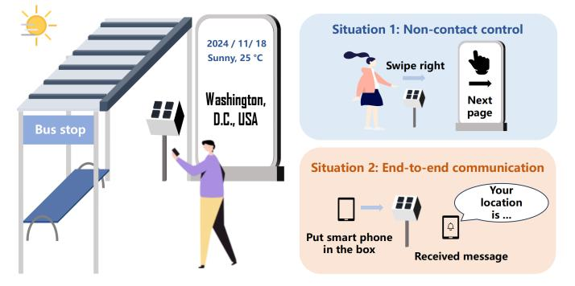
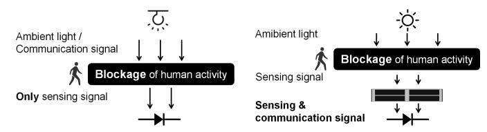
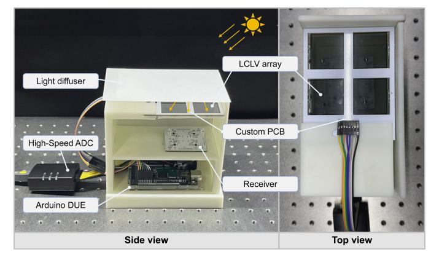
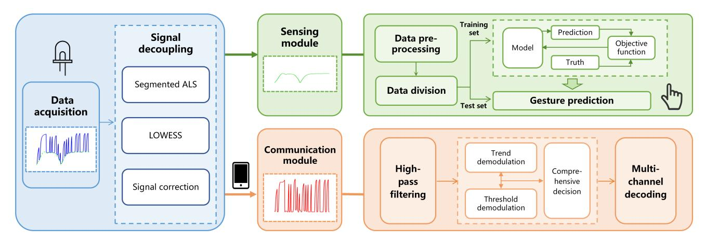
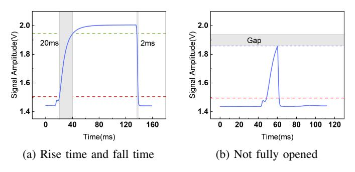
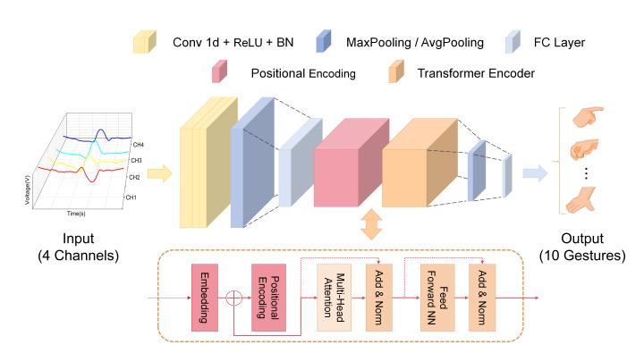
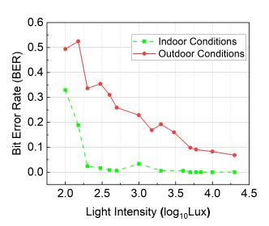
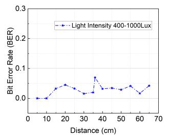
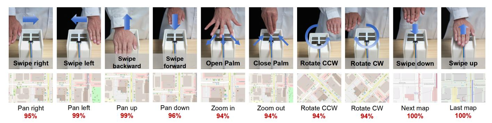

{0}------------------------------------------------

# LumiPane: Intelligent Interaction through Gesture Sensing and Ambient Light Communication

Liguang Ruan† *SIGS, Tsinghua University* Shenzhen, China rlg23@mails.tsinghua.edu.cn

Jiarong Li *SIGS, Tsinghua University Pengcheng Laboratory* Shenzhen, China li-jr22@mails.tsinghua.edu.cn

Chenxin Liang† *SIGS, Tsinghua University* Shenzhen, China liangcx23@mails.tsinghua.edu.cn

> Xiaojun Liang\* *Pengcheng Laboratory* Shenzhen, China liangxj@pcl.ac.cn

Jiaqi Yin *Shenzhen X-Institute* Shenzhen, China yjqhit@gmail.com

Wenbo Ding\* *SIGS, Tsinghua University Pengcheng Laboratory RIOS Lab* Shenzhen, China ding.wenbo@sz.tsinghua.edu.cn

*Abstract*—Intelligent interaction systems have revolutionized modern living and work environments. In this paper, we propose a novel system called LumiPane, which combines visible light communication signals and gesture sensing signals for integrated transmission. LumiPane leverages the dimming characteristics of a liquid crystal light valve (LCLV) and employs a demodulation scheme that combines trend and threshold techniques. This enables high-quality ambient light communication at a maximum rate of 60bps without the need for an active light source. Additionally, we design a 1DConvTrans model for gesture recognition, achieving an impressive accuracy rate of 97.6%, outperforming traditional deep learning methods. These advancements demonstrate the potential of LumiPane for enhancing intelligent interaction systems in various real-world applications, such as smart bus stops that can communicate with smartphones to transmit current location information and provide contactless control panels for viewing maps.

*Index Terms*—Intelligent Interaction, Gesture Recognition, Ambient Light Communication, ISAC.

## I. INTRODUCTION

#### *A. Background*

As the Internet of Things (IoT) rapidly evolves, a novel concept known as ubiquitous sensing has emerged, meeting the growing demand for interactive smart devices in everyday situations [1]. This development is driven by the need for more intuitive and seamless interaction between humans and their environments. Sensing technologies, such as hand gesture recognition [2], are at the forefront of this trend, augmenting the system's environmental perception capabilities and significantly enhancing user satisfaction.

The boundaries between sensing and communication have gradually faded since the emergence of IoT, which requires the cooperation of the two fields. Integrated sensing and communication (ISAC) rises as a novel technology in the 6th generation network [3]. ISAC has great potential to be applied in various scenarios, for instance, the automobile industry [4],

Fig. 1: Two sample applications: non-contact interaction and end-to-end ambient light communication.

indoor localization [5] and human activity recognition [6]. Ubiquitous sensing takes the integration further by embedding sensors in multiple environments, facilitating more complex interactions between the physical and digital worlds. Among various wireless communication methods for ISAC, visible light communication (VLC) stands out as a robust alternative for mainstream communication methods due to its advantages of unlicensed frequency band, non-electromagnetic inference, and high security [7]. In addition, visible light sensing (VLS) has shown potential in various aspects, such as localization and user interaction. However, blockage is a troubling problem for ISAC systems, particularly for the VLC component, as the current VLC technology is predominantly based on line-of-sight (LOS) links. Furthermore, many VLS solutions currently achieve their functionality by blocking the receiver, which poses significant challenges to LOS communication [8]. Therefore, current research focuses on how to achieve visible light sensing while ensuring reliable VLC functionality under LOS conditions. For instance, the method discussed in [9] utilizes the intensity of reflected light signals to sense the position of devices. However, due to the weaker signal strength in this reflection-based approach, it imposes high demands on backend signal processing, making it challenging to implement

†These authors contributed equally to this work.

\*Corresponding authors.

{1}------------------------------------------------

Fig. 2: Illustration comparing traditional VLS (left) and LumiPane (right).

fast edge computing.

To solve this problem, we propose LumiPane, the first ISAC system that seamlessly integrates gesture sensing with ambient light communication functionalities. Fig. 1 illustrates two sample applications of LumiPane in smart bus stops: enabling people to interact with bus stop screens and facilitating endto-end communication for obtaining current geographic data. This system can utilize the bus stop's integrated lighting and can also harness sunlight as its light source. Unlike traditional touch screens, users can interact with LumiPane without physical contact, significantly addressing public health concerns in communal spaces. This is particularly beneficial during events such as the COVID-19 pandemic, where touch screens may pose an increased risk of infection [10]. Due to the inability to completely block ambient light, we design the VLS component of the system onto the LCLV array, which functions as the transmitter. This design embeds the sensing signal into the light source prior to data modulation, thus preventing complete obstruction of the normal VLC link, as illustrated in Fig. 2. And the system employs a decoupling algorithm to separate the sensing signal from the communication signal. After separation, hand gesture recognition is obtained using an transformer-based network, and the communication signal is decoded by our devised algorithm. The proposed system has been tested on 10 gestures and has demonstrated an accuracy of 97.6% at a communication speed of 60 bps in various environments.

## *B. Related Works*

Ambient light-based outdoor VLC has been an active research topic in recent years. For instance, in 2019, Rens Bloom *et al.* proposed LuxLink [11], an outdoor VLC system based on LCLV to transmit data at a rate of 80 bps. In the following years, Seyed Keyarash Ghiasi *et al.* [12] designed a stack LCD shutter system achieving a speed of 1 kbps, though it employed a costly LCD shutter. Tapia et al. [13] proposed an ambient light camera screen communication system using liquid crystal on silicon (LCoS) as transmitters in 2022, achieving a speed of 2 kbps. In summary, VLC based on liquid crystal has the advantages of easy integration, versatility, and effectiveness in outdoor environments.

VLS-based hand gesture recognition systems enjoy benefits such as easy installation, low cost, and high efficiency. Solar cells are commonly used as receivers in this application [14]. Dong Ma *et al.* proposed SolarGest [15] in 2019, which analyzes the photo-current solar cell harvested under different gestures to realize recognition. OptoSense [16], introduced in 2020, employs solar cells attached to indoor environments like doorknobs and walls to sense activities. Except for solar cell, there are also systems that apply LCD or organic light emitting diode (OLED) screen to fullfil sensing tasks. For example, SMART [17], devised by Zimo Liao *et al.* employs smart phone screens as the transmitters to emit visible light patterns and the ambient light sensor of cell phones as receiver for hand gesture recognition.

Although the communication rate may appear modest, the system's performance is quite impressive for VLC using inexpensive LCLV instead of the costly LCD shutter, while still ensuring effective sensing capabilities. Compared to popular Wi-Fi-based gesture recognition systems, those utilizing VLC not only enhance privacy and exhibit stronger anti-interference capabilities but also facilitate more seamless future deployments [18]. In summary, our method introduces the first ISAC system that combines ambient light communication with gesture recognition, providing new insights into outdoor VLC and VLS.

#### II. SYSTEM DESIGN

This section introduces the system design of LumiPane, including both hardware and software components.

Fig. 3 illustrates the architecture of the entire LumiPane system, comprising a transmitter based on LCLV and a multichannel receiver circuit. The structure of the LumiPane system is custom-built using 3D printing to enhance its adaptability to various lighting conditions. Above the LCLV, a diffuser is employed to mitigate the directionality of incident light, enhancing the system's efficacy under various lighting conditions. Subsequently, the MCU located at the bottom controls the LCLV to modulate the encoded data onto the incoming light. The receiver converts this optical signal into an electrical signal using photodiodes, which is then transmitted to the user interface for further processing.

Fig. 3: System architecture of LumiPane.

#### *A. Hardware Deployment*

LumiPane's hardware configuration encompasses two main modules: the transmitter and the receiver, each boasting a quadruple-channel configuration. A 3D-printed model frame is used to secure the position of these components and provide some interference reduction.

{2}------------------------------------------------

Fig. 4: Signal processing workflow for gesture recognition and ambient light communication.

- *a) Transmitter:* The transmitter, which uses off-the-shelf Adafruit Controllable Shutter Glass 3627, consists of four LCLVs affixed to a custom printed circuit board. This array is controlled by an Arduino DUE based on FreeRTOS, allowing for multi-channel parallel transmission of different data. The Arduino DUE encodes text information into ASCII values and appends frame headers to facilitate symbol synchronization during subsequent reception.
- *b) Receiver:* The receiver uses QSD2030 with only a response time of 5ns. Signal amplification is handled by the LTC6269 chip, combining a transimpedance amplifier and a voltage operational amplifier [19]. The digitized data, processed by a 16-bit high-speed ADC module AD7606, is transmitted to the terminal for decoding and gesture recognition. Fig. 3 illustrates the receiver's physical setup, which allows users to place their smartphones on it to receive the geographic data in the future.

### *B. Algorithm Implementation*

The software algorithm section of LumiPane is divided into two main components. In this work, sensing and communication signal decoupling Method (SCSD Method) was proposed to separate the modulated original signal from the mixed signal. For the sensing module, the first part isolates the envelope data containing sensing information, which is then input into the classification algorithm to obtain gesture recognition results. Fig. 4 illustrates the signal processing flow of the LumiPane system

*a) SCSD Method:* Considering that gestures occluding primarily affect the intensity fluctuations in the time domain, this study mainly focuses on processing the mixed signals through time-domain signal separation. As shown in Fig. 4, after hardware acquisition, the signal undergoes initial filtering and noise reduction. Subsequently, a segmented alternating least squares (ALS) approach is adopted to determine the baseline of each segment of the original signal. The segmented ALS method divides the signal into segments and applies the least squares method iteratively to estimate baseline and signal components within each segment. Following this, locally weighted scatterplot smoothing (LOWESS) is used to smooth the baseline, thereby enhancing the accuracy and stability of subsequent signal processing algorithms, making signal analysis and feature extraction more reliable.

Fig. 5: The electrical characteristics of LCLV.

*b) Signal Demodulation:* In VLC systems, thresholdbased demodulation are typically employed due to the rapid intensity changes at the transmitter [20]. However, in liquid crystal modulation, the response time of the LCLV refers to the time it takes for the liquid crystal molecules to reach the desired state after being subjected to an electric field. As shown in Fig. 5a, the application and removal of the electric field lead to asymmetric changes in the state of the liquid crystal molecules. Therefore, there is a significant difference between the rise and fall times, with the rise time taking approximately 20 ms to complete, while the fall time only requires 2 ms. Meanwhile, when the transmitter sends signals alternating between 0 and 1, due to the short symbol period, the liquid crystal is forced to switch to another state before fully reaching the opposite state. Consequently, as shown in Fig. 5b, a peak may appear without reaching the maximum value. These factors contribute to the failure of threshold-based demodulation schemes. Therefore, the trendbased demodulation scheme has been proposed, which can partially mitigate these issues [21].

However, it still faces challenges with certain specific codeword combinations, such as long sequences of 0s. To address these issues, a demodulation scheme combining trend 

{3}------------------------------------------------

and threshold methods is proposed in this paper. The specific process of this scheme is as follows:

- Thresholding and Statistical Counting: Applies a threshold to classify data points as high or low. Then calculates the ratio of high data points to assess the score of the symbol in the threshold section.
- Dynamic Trend Analysis: Applies linear regression to get the trend of data points over time, calculating the slope to determine rising or falling trends.
- Stability Evaluation: Uses relative standard deviation to assess the signal stability, which impacts the reliability of the symbol decision.
- Final Decision: Combines scores from the above analyses to determine the symbol for the current sampling period as either 0 or 1.

*c) 1DConvTrans model:* Convolutional Neural Networks (CNNs) excel in tasks like image recognition and object detection, while 1D CNNs specialize in extracting temporal features from sequential data [22]. Transformers, known for their effectiveness in modeling sequential data, are suited for tasks such as natural language processing and time series analysis [23]. To leverage the strengths of both architectures, the 1DConvTrans model combining 1D CNNs and Transformers is introduced, enabling simultaneous extraction of spatial and temporal features. This approach significantly enhances performance in tasks requiring comprehensive consideration of both spatial and temporal information, such as gesture recognition. Fig. 6 illustrates the framework of the 1DConvTrans model utilized in this paper.

Fig. 6: The architecture of the 1DConvTrans model.

## III. EXPERIMENT & RESULT

For communication, the primary validation involved assessing the system's bit error rate (BER) performance across various lighting conditions, including both indoor and outdoor environments. In terms of sensing, the comparison primarily centered on the advantages of the proposed deep learning model over traditional time series classification algorithms.

## *A. Experimental Setup*

Communication performance experiments were conducted under indoor and outdoor conditions. However, achieving stable light intensity in outdoor environments is challenging due to factors such as weather and obstructions. Therefore, diffusers with different transmittance rates were used, and experiments were conducted at different times to control the light intensity received by the photodiodes. Regarding the frame structure, the synchronization frame header was configured as 11111100. The frame data is transmitted through four channels, each sending different ASCII code sequences. And the BER was determined by averaging the values from all channels.

In the gesture recognition experiments, the transmitter continued to send the aforementioned data, while the receiver captured the combined communication and sensing signals. Data collection involved five participants, each performing ten different gestures such as sliding from left to right and rotating clockwise. For each gesture type, each volunteer collected data in 56 sets, with each set lasting one minute and the gesture performed every 5 seconds, totaling 2000 data entries. The data were divided into training, validation, and testing sets with ratios of 0.8:0.1:0.1. The model that exhibited the best performance on the validation set was selected as the final model during the training process.

(a) BER variation under different lighting conditions

(b) BER variation under different distances

Fig. 7: Impact of light intensity and communication distance on BER.

#### *B. BER Analysis*

Firstly, the communication performance of LumiPane under various lighting conditions was tested at a fixed communication distance of 10 cm, as depicted in Fig. 7a. The system consistently achieved a bit error rate below 0.1 at light intensities exceeding 4000 Lux, both in outdoor scenarios using sunlight and indoor scenarios using artificial light sources. In indoor environments, the BER dropped to below 0.04 at 200 Lux. The suboptimal communication performance in outdoor conditions is likely due to the weaker effective communication link strength between the LCLVs and the receiver caused by sunlight. In outdoor environments, the direct light intensity between the receiver and the transmitter is relatively low, and weather variations, along with changes in time, can also significantly affect performance, as evidenced by the fluctuations observed in the red curve in Fig. 7a.

Subsequently, the impact of communication distance on the BER of LumiPane under light intensities was tested, as shown in Fig. 7b. The results indicate that the system exhibits

{4}------------------------------------------------

Fig. 8: Gesture recognition using the LumiPane system based on the 1DConvTrans model for map manipulation. The system includes ten control strategies: pan right, pan left, pan up, pan down, zoom in, zoom out, rotate counterclockwise (CCW), rotate clockwise (CW), turn to the next map, and turn to the previous map [24].

stable communication performance within the range of 5 to 65 cm, with the BER generally remaining below 0.05. Moreover, at communication distances below 10 cm, the BER is zero, which aligns precisely with the typical application scenarios of LumiPane shown in Fig. 1.

#### *C. Gesture Recognition Results*

Experiments were conducted on several deep learning models, including LSTM, CNN, ResNet, and Transformer, as depicted in Table I. The results indicate that the Transformer architecture surpasses other traditional deep learning models in terms of accuracy, precision, recall, and F1-score, while also having significantly fewer parameters. Notably, compared to the classic Transformer model, the proposed 1DConvTrans architecture, with only a 3% increase in parameter number, reduced the recognition error rate from 5.7% to 2.4%. This demonstrates the superior performance of 1DConvTrans in gesture recognition tasks.

TABLE I: Evaluation of gesture recognition models.

| Models      | Number of parameters | Accuracy | Precision | Recall | F1-score |
|-------------|-------------------------|----------|-----------|--------|----------|
| LSTM        | 797.2K                  | 93.4%    | 93.7%     | 93.4%  | 93.4%    |
| CNN         | 5.7M                    | 83.3%    | 84.0%     | 83.3%  | 83.2%    |
| ResNet      | 23.0M                   | 84.1%    | 84.8%     | 84.1%  | 83.9%    |
| Transformer | 150.9K                  | 94.3%    | 94.6%     | 94.3%  | 94.3%    |
| Ours        | 156.1K                  | 97.6%    | 97.7%     | 97.6%  | 97.6%    |

Fig. 8 demonstrates the application of LumiPane's sensing function for gesture-based map navigation. It includes ten operations, corresponding to sliding the map up, down, left, and right, zooming in and out, and switching between map types. Through these 10 gestures, users can achieve contactless control of map applications, which is particularly suitable for deployment in transportation hubs like bus stations. The classification model used here is the 1DConvTrans model, demonstrating the robustness of our system in recognizing various gestures.

## IV. CONCLUSIONS & DISCUSSION

This paper introduces LumiPane, an intelligent interaction system based on gesture sensing and ambient light communication. By utilizing a LCLV and introducing the SCSD method, the system achieves dual functionality in communication and sensing by separating sensing signals from communication signals. Additionally, the paper designs a demodulation method that combines trend and threshold based on the unique electrical characteristics of the LCLV, enhancing the robustness of the communication system. In terms of gesture recognition, the 1DConvTrans model is proposed, which achieves excellent recognition performance. Extensive experiments have been conducted to validate the system's effective application in various everyday scenarios, such as different lighting conditions.

Future work will focus on enhancing the communication performance in outdoor environments, particularly under conditions of dynamic variations in light, as well as addressing interference issues that may arise when scaling up to busy public spaces. Exploring frequency modulation-based techniques and utilizing higher-performance LCLVs may provide effective solutions. Additionally, developing more lightweight and faster classification models will be crucial for practical edge computing deployment.

#### ACKNOWLEDGMENT

This research was supported by the Shenzhen Ubiquitous Data Enabling Key Lab (No. ZDSYS20220527171406015), the Guangdong Innovative and Entrepreneurial Research Team Program (No. 2021ZT09L197), the Shenzhen Science and Technology Program (No. JCYJ20220530143013030), the Tsinghua Shenzhen International Graduate School-Shenzhen Pengrui Young Faculty Program of Shenzhen Pengrui Foundation (No. SZPR2023005), the Tsinghua University Shenzhen International Graduate School Tutor Research Fund, the Tsinghua University Tutor Research Fund, and the Major Key Project of Pengcheng Laboratory (No. PCL2023A09).

## REFERENCES

[1] H. Zhang, B. Di, K. Bian, Z. Han, H. V. Poor, and L. Song, "Toward ubiquitous sensing and localization with reconfigurable intelligent surfaces," *Proceedings of the IEEE*, vol. 110, no. 9, pp. 1401–1422, 2022.

{5}------------------------------------------------

- [2] L. Guo, Z. Lu, and L. Yao, "Human-machine interaction sensing technology based on hand gesture recognition: A review," *IEEE Transactions on Human-Machine Systems*, vol. 51, no. 4, pp. 300–309, 2021.
- [3] C. Liang, J. Li, S. Liu, F. Yang, Y. Dong, J. Song, X.-P. Zhang, and W. Ding, "Integrated sensing, lighting and communication based on visible light communication: A review," *Digital Signal Processing*, p. 104 340, 2023.
- [4] I. Mistry, S. Tanwar, S. Tyagi, and N. Kumar, "Blockchain for 5g-enabled iot for industrial automation: A systematic review, solutions, and challenges," *Mechanical systems and signal processing*, vol. 135, p. 106 382, 2020.
- [5] M. Zhou, Y. Li, M. J. Tahir, X. Geng, Y. Wang, and W. He, "Integrated statistical test of signal distributions and access point contributions for wi-fi indoor localization," *IEEE Transactions on Vehicular Technology*, vol. 70, no. 5, pp. 5057–5070, 2021.
- [6] K. Chen, D. Zhang, L. Yao, B. Guo, Z. Yu, and Y. Liu, "Deep learning for sensor-based human activity recognition: Overview, challenges, and opportunities," *ACM Computing Surveys*, vol. 54, no. 4, pp. 1–40, 2021.
- [7] A. Memedi and F. Dressler, "Vehicular visible light communications: A survey," *IEEE Communications Surveys & Tutorials*, vol. 23, no. 1, pp. 161–181, 2020.
- [8] M. M. Cespedes, B. G. Guzm ´ an, and V. P. G. Jim ´ enez, ´ "Lights and shadows: A comprehensive survey on cooperative and precoding schemes to overcome los blockage and interference in indoor vlc," *Sensors*, vol. 21, no. 3, p. 861, 2021.
- [9] R. Zhang, Y. Shao, M. Li, L. Lu, and Y. C. Eldar, "Optical integrated sensing and communication with lightemitting diode," in *2024 IEEE International Conference on Communications Workshops (ICC Workshops)*, IEEE, 2024, pp. 2059–2064.
- [10] H. Zhou, W. Huang, Z. Xiao, S. Zhang, W. Li, J. Hu, T. Feng, J. Wu, P. Zhu, and Y. Mao, "Deeplearning-assisted noncontact gesture-recognition system for touchless human-machine interfaces," *Advanced Functional Materials*, vol. 32, no. 49, p. 2 208 271, 2022.
- [11] R. Bloom, M. Z. Zamalloa, and C. Pai, "Luxlink: Creating a wireless link from ambient light," in *Proceedings of the 17th conference on embedded networked sensor systems*, 2019, pp. 166–178.
- [12] S. K. Ghiasi, M. A. Z. Zamalloa, and K. Langendoen, "A principled design for passive light communication," in *Proceedings of the 27th Annual International Conference on Mobile Computing and Networking*, 2021, pp. 121–133.
- [13] M. C. Tapia, T. Xu, Z. Wu, and M. Z. Zamalloa, "Sunbox: Screen-to-camera communication with ambient light," *Proceedings of the ACM on Interactive, Mobile, Wearable and Ubiquitous Technologies*, vol. 6, no. 2, pp. 1–26, 2022.

- [14] D. Ma, G. Lan, C. Hu, M. Hassan, W. Hu, M. B. Upama, A. Uddin, and M. Youssef, "Recognizing hand gestures using solar cells," *IEEE Transactions on Mobile Computing*, vol. 22, no. 7, pp. 4223–4235, 2022.
- [15] D. Ma, G. Lan, M. Hassan, W. Hu, M. B. Upama, A. Uddin, and M. Youssef, "Solargest: Ubiquitous and battery-free gesture recognition using solar cells," in *The 25th annual international conference on mobile computing and networking*, 2019, pp. 1–15.
- [16] D. Zhang, J. W. Park, Y. Zhang, Y. Zhao, Y. Wang, Y. Li, T. Bhagwat, W.-F. Chou, X. Jia, B. Kippelen, *et al.*, "Optosense: Towards ubiquitous self-powered ambient light sensing surfaces," *Proceedings of the ACM on interactive, mobile, wearable and ubiquitous technologies*, vol. 4, no. 3, pp. 1–27, 2020.
- [17] Z. Liao, Z. Luo, Q. Huang, L. Zhang, F. Wu, Q. Zhang, and Y. Wang, "Smart: Screen-based gesture recognition on commodity mobile devices," in *Proceedings of the 27th Annual International Conference on Mobile Computing and Networking*, 2021, pp. 283–295.
- [18] H. F. T. Ahmed, H. Ahmad, and C. Aravind, "Device free human gesture recognition using wi-fi csi: A survey," *Engineering Applications of Artificial Intelligence*, vol. 87, p. 103 281, 2020.
- [19] Q. Wang, D. Giustiniano, and D. Puccinelli, "Openvlc: Software-defined visible light embedded networks," in *Proceedings of the 1st ACM MobiCom workshop on Visible light communication systems*, 2014, pp. 15–20.
- [20] H. Ye, J. Xiong, and Q. Wang, "When vlc meets underscreen camera," in *Proceedings of the 21st Annual International Conference on Mobile Systems, Applications and Services*, 2023, pp. 343–355.
- [21] L. De Groot, T. Xu, and M. Z. Zamalloa, "Dronevlc: Exploiting drones and vlc to gather data from batteryless sensors," in *2023 IEEE International Conference on Pervasive Computing and Communications*, IEEE, 2023, pp. 242–251.
- [22] J. Zhu, H. Chen, and W. Ye, "Classification of human activities based on radar signals using 1d-cnn and lstm," in *2020 IEEE International Symposium on Circuits and Systems*, IEEE, 2020, pp. 1–5.
- [23] A. Vaswani, N. Shazeer, N. Parmar, J. Uszkoreit, L. Jones, A. N. Gomez, Ł. Kaiser, and I. Polosukhin, "Attention is all you need," *Advances in neural information processing systems*, vol. 30, 2017.
- [24] OpenStreetMap contributors, *OpenStreetMap*, https:// www.openstreetmap.org, Accessed: July 9, 2024, 2024.