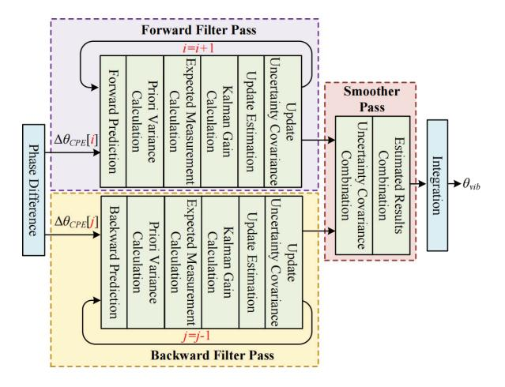
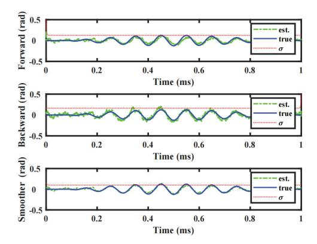
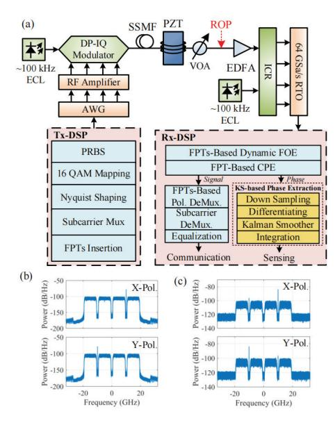
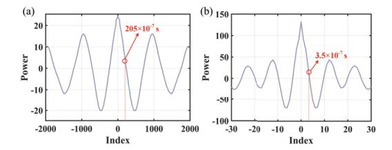
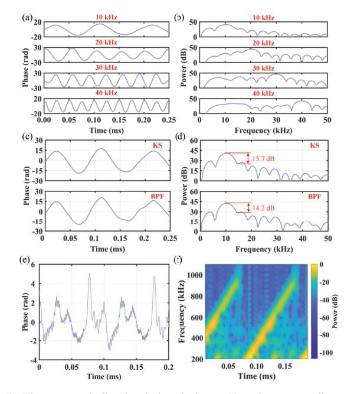

{0}------------------------------------------------

# Flexible Vibration Sensing Using Kalman Smoother Integrated in ECL-Based Communication Systems

Bang Yang®, Member, IEEE, Jianwei Tang®, Member, IEEE, Shuang Gao, Junpeng Liang®, Jinlong Wei®, Senior Member, IEEE, and Yanfu Yang®, Senior Member, IEEE

Abstract—In this letter, we propose a flexible vibration-induced phase extraction scheme based on a three-pass Kalman smoother (KS) with scalar linear time-invariant model for integrated communication and sensing systems under commercial externalcavity lasers (ECLs). By differentiating the phase estimated by the carrier phase estimation (CPE) module, the laser phase noise is transformed into Gaussian noise. Then, the three-pass KS is used to estimate the differentiated vibration-induced phase. In the three-pass KS, the forward filter pass is used to obtain the posteriori estimates, the backward filter pass is employed to obtain the priori estimates, and the smoother pass is utilized to combine both posteriori and priori estimates. The vibrationinduced phase can be obtained by integrating the estimated differentiated vibration-induced phase. In experiments, compared to conventional vibration-induced phase extraction scheme based on band-pass filter (BPF), the KS-based scheme achieves a 1.5 dB sensing signal-to-noise ratio (SSNR) enhancement at 10 kHz without requiring vibration frequency or waveform information. Furthermore, the KS-based scheme enables frequency-modulated continuous wave (FMCW) vibration detection in the range of 200 kHz to 1 MHz with the same smoother parameters used for sinusoidal vibration detection, highlighting the flexibility of the KS-based scheme. This flexible vibration-induced phase extraction scheme provides a feasible solution for intelligent sensing in future optical networks.

Index Terms—Optical fiber communication, integrated sensing and communication, network operation and maintenance.

### I. Introduction

ITH the development of autonomous driving, virtual reality (VR), and large language models (LLMs), the data volume in optical communication networks has significantly increased. Furthermore, the stability of optical links is becoming increasingly important [1], [2], [3]. Optical networks require additional perception capabilities to achieve intelligent network operation and maintenance (O&M). One solution is integrated fiber sensing into communication systems, which

Received 25 March 2025; revised 20 May 2025; accepted 3 June 2025. Date of publication 6 June 2025; date of current version 12 June 2025. This work was supported in part by Shenzhen Municipal Science and Technology Innovation Council under Grant JCYJ20240813104835048. (Bang Yang and Jianwei Tang contributed equally to this work.) (Corresponding author: Yanfu Yang.)

Bang Yang, Jianwei Tang, Shuang Gao, and Yanfu Yang are with the School of Integrated Circuits, Harbin Institute of Technology, Shenzhen 518055, China (e-mail: 200210608@stu.hit.edu.cn; tangjw@pcl.ac.cn; gaoshuang2021@hit.edu.cn; yangyanfu@hit.edu.cn).

Junpeng Liang and Jinlong Wei are with Pengcheng Laboratory, Shenzhen 518000, China (e-mail: liangjp@pcl.ac.cn; weijl01@pcl.ac.cn).

Color versions of one or more figures in this letter are available at https://doi.org/10.1109/LPT.2025.3577173.

Digital Object Identifier 10.1109/LPT.2025.3577173

efficiently utilizes communication infrastructure while equipping fiber link with sensing capabilities for O&M [2], [4].

Compared to integrate back-scattering-based sensing into communication fibers [5], the sensing based on forward information show more promising applications under longhaul communication conditions, such as subsea multi-span fiber cables [6], [7]. Forward-phase-based sensing relies on the fiber's deformation causing variations in the carrier's phase, achieving vibration sensing through the carrier phase estimation (CPE) module. Most of the phase-based sensing schemes depend on narrow-linewidth lasers (NLLs) to minimize frequency drift and phase noise to suppress sensing background noise [2]. However, commercial coherent communication systems usually use external-cavity lasers (ECLs), whose frequency drift and phase noise can reduce the sensing signal-to-noise ratio (SSNR). Dynamic frequency offset estimation (FOE) using data-block division can partly compensate the frequency drift [3]. However, the estimation accuracy is limited and only 30 kHz sinusoidal vibration detection is demonstrated. In our previous work [8], we proposed a highaccuracy dynamic FOE scheme by inserting frequency-domain pilot tones (FPTs) into the digital subcarrier multiplexing (DSCM) system. Then the vibration-induced phase extraction is achieved using a band-pass filter (BPF). The SSNR at 10 kHz was improved by 10 dB thanks to the accurate FOE. The center frequency of the BPF needs to be adjusted for different vibration detection, making challenge in intelligent sensing. Thereby, it remains crucial to investigate flexible vibration-induced phase extraction.

In this letter, we propose a flexible vibration-induced phase extraction scheme based on three-pass Kalman smoother (KS) with scalar linear time-invariant model [9], [10]. This KSbased scheme can achieve multi-type vibrations detection adaptively using the same parameters. Firstly, the estimated carrier phase is differentiated to transform laser phase noise into Gaussian noise. Then, the differentiated vibration-induced phase is estimated by the three-pass KS. By integrating the output of the KS, adaptive vibration-induced phase extraction is achieved. Simulation results demonstrate that the output of smoother pass exhibits higher estimation accuracy compared to the output of the single filter pass. In experiments, the KS-based scheme achieves a 1.5 dB SSNR gain at 10 kHz compared to the BPF-based scheme. Furthermore, the KS-based scheme successfully detects frequency-modulated continuous wave (FMCW) vibration in the range of 200 kHz

{1}------------------------------------------------

Fig. 1. Principles of the KS-based vibration-induced phase extraction scheme.

TABLE I SCALAR LINEAR TIME-INVARIANT MODEL

| Parameter                            | Symbol                  | Value                     |
|--------------------------------------|-------------------------|---------------------------|
| Discrete time step                   | Dt                      | $T_s$                     |
| Time constant                        | $\tau$                  | -                         |
| Variance of process                  | $\phi$                  | -                         |
| Dynamic coefficient                  | F                       | $-\frac{1}{\tau}$         |
| State transition matrix              | Φ                       | $e^{F \cdot Dt}$          |
| Process noise covariance             | Q                       | $\phi \cdot (1 - \Phi^2)$ |
| Process noise standard deviation     | q                       | $\sqrt{Q}$                |
| Measurement matrix                   | H                       | 1                         |
| Measurement noise covariance         | R                       | 1                         |
| Measurement noise standard deviation | r                       | $\sqrt{R}$                |
| Differential estimated carrier phase | $\Delta \theta_{CPE}$   | -                         |
| Differential vibration-induced phase | $\Delta \theta_{vib}$   | -                         |
| Differential laser phase noise       | $\Delta \theta_{laser}$ | -                         |
| Data index                           | k                       | -                         |

to 1 MHz with the same parameters used for sinusoidal vibration detection. The KS-based scheme enables flexible vibration-induced phase extraction without requiring parameters adjustments.

# II. PRINCIPLES

The principle of the vibration-induced phase extraction scheme based on three-pass KS is shown in Fig. 1. Since the phase noise of the laser follows a Wiener process, its differences are modeled to follow a Gaussian distribution [11]. Therefore, by differentiating the estimated carrier phase, the sum of the differential vibration-induced phase and the differential laser phase noise (Gaussian noise) can be obtained:

$$\Delta\theta_{CPE}[k] = \Delta\theta_{laser}[k] + \Delta\theta_{vib}[k]. \tag{1}$$

As the vibration-induced phase variations are relatively slow compared to the sampling rate, the system is modeled as a scalar linear time-invariant model. The parameters and computation methods of the model are shown in Table I. The variance of process is a parameter to be adjusted by applying a known vibration signal to the link prior to application, ensuring a compromise between signal-to-noise ratio and fidelity. The variance of process is set to 2 in this work. The time constant (TC) can be derived from the signal. The time delay when the power of the signal's autocorrelation function drops to  $\frac{1}{e^2}$  of the peak can be simply used as the TC. The system's process and measurement equations are as follows:

$$x[k] = \Phi x[k-1] + qw = \Delta \theta_{vib}[k]. \tag{2}$$

$$z[k] = Hx[k] + rw = \Delta\theta_{CPE}[k]. \tag{3}$$

Here, x represents the process value which is the differential vibration-induced phase, z represents the measurement value which is the carrier phase. w is a zero-mean, unit-variance Gaussian random variable. The three-pass KS is employed to estimate x.

The length of the differentiated carrier phase data is N. In our simulation and experiment, the N is set to 9999. The forward filter pass is utilized to obtain posterior estimates and compute the corresponding estimate uncertainty covariance from the 1-st data to the N-th data. The initial state value is set to 0. Firstly, the model is used for prediction as shown in Eq. (4), and the priori variance is computed as shown in Eq. (5):

$$\hat{x}_{[f-1]}[k] = \Phi \hat{x}_{[f+1]}[k-1]. \tag{4}$$

$$P_{[f-1]}[k] = \Phi P_{[f+1]}[k-1]\Phi + Q. \tag{5}$$

Here,  $P_{[f-1]}[k]$  represents the priori variance. Subsequently, the expected measurement is computed as shown in Eq. (6).

$$\hat{z} = H\hat{x}_{[f-1]}[k]. \tag{6}$$

Then, the Kalman gain is calculated as follows:

$$\bar{K}_f = \frac{P_{[f-]}[k]H}{HP_{[f-]}[k]H + R}. (7)$$

Finally, the process value and estimated uncertainty covariance are updated using the measurement as follows:

$$\hat{x}_{[f+1]}[k] = \hat{x}_{[f-1]}[k] + \bar{K}_f(z[k] - \hat{z}). \tag{8}$$

$$P_{[f+1]}[k] = P_{[f-1]}[k] - \bar{K}_f H P_{[f-1]}[k]. \tag{9}$$

After completing the forward filtering step, the backward filter pass is employed to obtain prior estimates and compute corresponding estimate uncertainty covariance from the N-th data to the 1-st data. The initial state value is also set to 0. Firstly, based on the model, the backward prediction and the variance calculation are performed:

$$\hat{x}_{[h-1]}[k] = \Phi^{-1}\hat{x}_{[h+1]}[k+1]. \tag{10}$$

$$P_{[b-]}[k] = P_{[b+]}[k+1]\Phi^{-2} + Q.$$
 (11)

Subsequently, the Kalman gain is computed as follows:

$$\hat{z} = H\hat{x}_{[b-]}[k]. \tag{12}$$

$$\hat{z} = H\hat{x}_{[b-]}[k]. \tag{12}$$

$$\bar{K}_b = \frac{P_{[b-]}[k]H}{HP_{[b-]}[k]H + R}. \tag{13}$$

Finally, the estimate and uncertainty covariance are updated:

$$\hat{x}_{[b+]}[k] = \hat{x}_{[b-]}[k] + \bar{K}_b(z[k] - \hat{z}). \tag{14}$$

$$P_{[b+1]}[k] = P_{[b-1]}[k] - \bar{K}_b H P_{[b-1]}[k]. \tag{15}$$

{2}------------------------------------------------

Fig. 2. The estimated differential vibration-induced phase using forward filter pass, backward filter pass and three-pass KS in simulation. est.: estimated results; true: true results; σ: estimation uncertainties.

Using the smoother pass, the estimated results of both filter passes are combined to obtain the final estimate:

$$P_{[s]}[k] = \left(\frac{1}{P_{[f+]}[k]} + \frac{1}{P_{[b-]}[k]}\right)^{-1}.$$
 (16)

$$\hat{x}_{[s]}[k] = \left(\frac{\hat{x}_{[f+]}[k]}{P_{[f+]}[k]} + \frac{\hat{x}_{[b-]}[k]}{P_{[b-]}[k]}\right) P_{[s]}[k]. \tag{17}$$

By integrating the estimated values, the vibration-induced phase can be obtained as shown below:

$$\hat{\theta}_{vib}[k] = \hat{\theta}_{CPE}[0] + \sum_{m=1}^{k} \hat{x}_{[s]}[m].$$
 (18)

The theoretical vibration-induced phase estimation performance of the three-pass KS is verified through numerical simulation firstly. In the simulation, the 3 dB linewidth of the lasers is set to 100 kHz, the amplitude of the sinusoidal vibration signal is set to 20 radians, the vibration frequency is set to 10 kHz, the frequency of the vibration envelope is set to 1.25 kHz. The vibration appears at 0.1 ms, and the vibration disappears at 0.9 ms. The simulation is conducted without amplifier spontaneous emission (ASE) noise or frequency offsets. The differential vibration-induced phase is estimated using forward filter pass, backward filter pass and threepass KS. The estimated results are shown in Fig. [2,](#page-2-0) it can be seen that compared to the filter passes, the estimated results from the KS exhibit lower noise level and estimation uncertainty, demonstrating the high-accuracy advantage of the KS. In practical applications, residual frequency offset can affect vibration-induced phase extraction performance. The accurate dynamic FOE scheme based on FPTs that we proposed previously [\[8\]](#page-3-7) can effectively suppress residual frequency offset, ensuring the normal operation of our KSbased phase extraction.

# III. EXPERIMENTAL SETUP AND RESULTS

The experimental setup and digital signal processing (DSP) diagram for integrated sensing and communication are shown in Fig. [3\(a\).](#page-2-1) At the transmitter side, pseudo-random binary sequence (PRBS) is firstly generated, then mapped to 16-QAM. The signal undergoes Nyquist shaping using a

Fig. 3. (a) The experimental setup and Tx & Rx DSP. The electrical spectra of the transmitted signal (b) and the received signal (c).

root-raised cosine (RRC) filter with a roll-off factor of 0.1. Subcarrier multiplexing is then performed with the center frequencies of four subcarriers set to −15 GHz, −5 GHz, 5 GHz, and 15 GHz respectively. The subcarrier intervals are set to 2 GHz, and the communication symbol rate is set to 4 × 8 GBaud. Finally, the FPTs are inserted to the subcarrier intervals at 10 GHz in *X* polarization and at −10 GHz in *Y* polarization respectively, as our previous work [\[8\].](#page-3-7) The electrical spectrum of the transmitted signal is as shown in Fig. [3\(b\).](#page-2-1) Then, the signal is up-sampled to the the arbitrary waveform generator's (AWG's, Keysight 8199A) sampling rate of 128 GSa/s. An ECL (IDPhotonics CoBrite, LW ≤ 100 kHz) with a central wavelength of 1550 nm serves as the light source and is modulated by a DP-IQ modulator driven by the AWG.

After transmission through a standard single-mode fiber (SSMF) with a length of 40 km, the signal is coherent detected by an integrated coherent receiver (ICR) with another ECL. A piezoelectric transducer (PZT) is applied to the fiber link to induce vibration. A variable optical attenuator (VOA) is used to adjust the received optical power (ROP), and an erbiumdoped optical fiber amplifier (EDFA) is used to compensate the loss of the fiber link, thereby the optical sensing to noise ratio (OSNR) can be adjusted. At the receiver side, the electrical spectrum of the received signal is as shown in Fig. [3\(c\).](#page-2-1) Due to polarization rotation, cross-talk appears in the FPTs of the two polarization directions. The FPTs are used for carrier recovery and communication signal demodulation as our previous work [\[8\].](#page-3-7) For sensing, the estimated carrier phase is firstly down-sampled to 10 MSa/s to reduce the complexity. Then the phase is differentiated and the differential vibration-induced phase is estimated by the three-pass KS. Finally, the vibrationinduced phase is recovered by integrating the estimated results.

Firstly, the TCs of differential carrier phases under different vibrations are estimated using the autocorrelation method as proposed in Section [II.](#page-1-4) A 10 kHz sinusoidal vibration and a 200 kHz to 1 MHz FMCW vibration are applied to the link

{3}------------------------------------------------

Fig. 4. TC estimates under 10 kHz sinusoidal (a) and FMCW vibrations (b).

Fig. 5. The extracted vibration-induced phases (a) and corresponding spectra (b) under sinusoidal vibrations with different frequencies using KS. The extracted vibration-induced phases (c) and corresponding spectra (d) under 10 kHz sinusoidal vibration using KS and BPF. The extracted vibration-induced phase (e) and corresponding STFT (f) under FMCW vibration using KS.

respectively. The autocorrelation functions of the differential phases and the estimated TCs are shown in Fig. 4(a) and Fig. 4(b) respectively. It can be seen that the high-frequency vibration has smaller estimated TC compared to low-frequency vibration, indicating that the TC can reflect the speed of signal change. As  $\Phi = e^{-\frac{Dt}{\tau}}$  and  $Q = \phi \cdot (1 - \Phi^2)$ , a smaller TC  $\tau$  corresponds to a smaller  $\Phi$ , a larger Q, then the process value x changes faster in the model. The process value in the model can change with different frequencies under different TCs, which is the key for adaptive phase tracking.

Then, the adaptive phase extraction capability of the KS-based scheme under multi-type vibrations is investigated. Sinusoidal vibrations with frequencies ranging from 10 kHz to 40 kHz are applied, and the aforementioned method is employed to estimate the TCs. Then, the KS-based scheme is utilized for vibration-induced phases extraction with the estimated TCs. The results are illustrated in Fig. 5(a), with the corresponding spectra shown in Fig. 5(b). These results demonstrate that the KS-based scheme successfully achieves vibration-induced phase extraction within the frequency range of 10 kHz to 40 kHz. Then, both BPF-based and KS-based schemes are applied to extract vibration-induced phases from the same carrier phase. The BPF utilized a brickwall

filter with a passband from 5 kHz to 50 kHz. As depicted in Figs. 5(c)&(d), the KS-based scheme exhibits a 1.5 dB improvement in SSNR compared to the BPF-based scheme. For FMCW vibrations within the frequency range of 200 kHz to 1 MHz with a repeat frequency of 10 kHz, the KS-based scheme effectively extracts the vibration-induced phase, as shown in Fig. 5(e). The corresponding short time Fourier transform (STFT) spectra is provided in Fig. 5(f), revealing a linear variation in frequency with a repeat frequency of 10 kHz. Notably, all estimates are conducted using the same parameters used for the sinusoidal vibrations detection, underscoring the adaptability of the proposed KS-based scheme.

# IV. CONCLUSION

In conclusion, we propose a flexible three-pass KS-based scheme for vibration-induced phase extraction in integrated sensing and communication systems. The scheme firstly differentiated carrier phase to transform laser phase noise into Gaussian noise. By employing forward and backward filter passes, we achieve both posteriori and priori estimates, which are then combined using the smoother pass to obtain accurate estimation. Then the vibration-induced phase estimation is achieved by integrating the output of the KS. In experiments, compared to BPF-based scheme, the KS-based scheme achieves a 1.5 dB improvement in SSNR at 10 kHz. Furthermore, the KS-based scheme successfully detects sinusoidal vibrations in the range of 10 kHz to 40 kHz and FMCW vibration from 200 kHz to 1 MHz with identical parameters throughout, thereby highlighting the flexibility. This flexible vibration-sensing capability can adaptively achieve the detection of multi-type vibration events, presenting a promising solution for intelligent O&M in future networks.

# REFERENCES

-  Z. Wang et al., "Co-route fiber recognition and status diagnosis based on integrated sensing and communication in 6G transport networks," *IEEE Internet Things J.*, vol. 11, no. 18, pp. 29348–29359, Sep. 2024.
- [2] E. Ip et al., "Vibration detection and localization using modified digital coherent telecom transponders," *J. Lightw. Technol.*, vol. 40, no. 5, pp. 1472–1482, Mar. 1, 2022.
- [3] W. Zuo, H. Zhou, Y. Qiao, Y. Zhao, and B. Ye, "Investigation of cocable identification based on ultrasonic sensing in coherent systems," *IEEE Photon. Technol. Lett.*, vol. 35, no. 21, pp. 1155–1158, Aug. 22, 2023.
- [4] E. Ip et al., "Using global existing fiber networks for environmental sensing," *Proc. IEEE*, vol. 110, no. 11, pp. 1853–1888, Nov. 2022.
- [5] H. He et al., "Integrated sensing and communication in an optical fibre," *Light, Sci. Appl.*, vol. 12, no. 1, p. 25, Jan. 2023.
- [6] A. Mecozzi, M. Cantono, J. C. Castellanos, V. Kamalov, R. Müller, and Z. Zhan, "Polarization sensing using submarine optical cables," *Optica*, vol. 8, no. 6, p. 788, May 2021.
- [7] Z. Zhan et al., "Optical polarization-based seismic and water wave sensing on transoceanic cables," Sci., vol. 371, no. 6532, pp. 931–936, Feb. 2021.
- [8] B. Yang et al., "Integrated communication and enhanced forward phase-based sensing based on frequency-domain pilot tones in DSCM systems using 100 kHz ECLs," J. Lightw. Technol., vol. 43, no. 6, pp. 2664–2671, Mar. 15, 2025.
- [9] M. Grewal and A. Andrews, Kalman Filtering: Theory and Practice Using MATLAB. Hoboken, NJ, USA: Wiley, 2011.
- [10] S. S. Haykin, Adaptive Filter Theory, 5th ed., Upper Saddle River, NJ, USA: Pearson, 2014.
- [11] X. Du, Q. Wang, and P.-Y. Kam, "Maximum likelihood estimation of Wiener phase noise variance in coherent optical systems," *J. Lightw. Technol.*, vol. 42, no. 9, pp. 3163–3173, Jan. 24, 2024.