{0}------------------------------------------------

# Photonics-assisted Millimeter-Wave Multiband Integrated Sensing and Communication System Using Coherent Receiving

Wenlin Bai , Peixuan Li, Xihua Zou, Senior Member, IEEE, Ningyuan Zhong, Wei Pan, Xiong Deng, and Lianshan Yan, Senior Member, IEEE

Abstract—Multiband integrated sensing and communication (ISAC) systems towards multiple functions and multiple users will play an important pole in future 6G wireless networks. Here, we propose and experimentally demonstrate a multiband ISAC system using optical frequency upconversion and coherent receiving techniques for millimeter-wave (MMW) high-capacity wireless communication and high-resolution sensing functions. The MMW multiband ISAC signals are simultaneously generated by a single photonic MMW frequency upconverter consisting of an optical frequency comb, a wavelength selective switch, an I/Q Mach-Zehnder modulator, and a high-speed photodetector. A multi-channel coherent photonic MMW de-chirper with phase compensation is utilized for coherent multiband radar signal processing, which facilitates the coherence-processing-free multiband data fusion and thus leading to an ultra-high resolution radar detection. Meanwhile, the communication receiving and demodulation towards multiband/multiuser scenarios are achieved by coherent receiving technology. In experiments, a photonic MMW ISAC system delivering Ka-band and V-band wireless signals is implemented, achieving a communication data rate of 16 Gbit/s and a two-dimension radar imaging of 3.75-cm range resolution, respectively. More importantly, after the multiband data fusion, an 8.6-mm ultra-high resolution is successfully achieved for radar ranging and imaging.

Index Terms—Coherent receiving technique, millimeter-wave, multiband data fusion, multiband integrated sensing and communication, ultra-high resolution ranging and imaging.

Manuscript received 30 January 2023; revised 2 May 2023; accepted 11 May 2023. Date of publication 16 May 2023; date of current version 29 May 2023. This work was supported in part by the National Natural Science Foundation of China under Grants U21A20507, 62001401, and 62271422, in part by the Sichuan Science and Technology Program under Grant 2022JDTD0013, in part by the Natural Science Foundation of Sichuan Province under Grants 2022NSFSC0559 and 2023NSFSC1969, and in part by the Fundamental Research Funds for the Central Universities under Grant 2682023CG008. (Corresponding author: Xihua Zou.)

The authors are with the Center for Information Photonics and Communications, School of Information Science and Technology, Southwest Jiaotong University, Chengdu 611756, China, and also with the Key Laboratory of Photonic-Electric Integration and Communication-Sensing Convergence, Ministry of Education, Chengdu 611756, China (e-mail: baiwenlin@my.swjtu.edu.cn; lipeixuango@163.com; zouxihua@swjtu.edu.cn; zny@my.swjtu.edu.cn; wpan@home.swjtu.edu.cn; xiongdeng@swjtu.edu.cn; lsyan@home.swjtu.edu.cn).

Color versions of one or more figures in this article are available at https://doi.org/10.1109/JSTQE.2023.3276903.

Digital Object Identifier 10.1109/JSTQE.2023.3276903

#### I. INTRODUCTION

TEXT generation wireless networks (i.e., beyond 5G and 6G) have been envisioned as an era of the Internet of everything, which will enable many emerging applications, such as vehicle-to-everything, smart home and manufacturing, remote sensing, environmental monitoring, human-communication interaction, and so on [1], [2], [3]. These applications demand high-quality wireless connectivity as well as highly accurate and robust sensing capability, which exactly promotes the integrated sensing and communication (ISAC) technique to gain a lot of attention. Also, the expected evolution trend in both radar and communication systems towards the collaboration of multiple frequency bands has been one of the primary impetuses for developing ISAC technologies. It will help to improve the rapid/accurate sensing ability and ultra-high communication capacity of ISAC system in a resource-efficient manner with hardware, spectral/temporal/spatial, and computing power [1]. For instance, the original K-band and below ISAC system can provide a simple and rapid response/interaction, the higher frequency one operating at U, V, W, even THz-bands bring more accurate resolution and larger data rates [4]. Thus, multiband ISAC system holds the promises of offering a comprehensive solution for different application scenarios. However, limited by the electronics bottlenecks, i.e., narrow bandwidth, high cost, complexity, the real-world deployment and application of multiband ISAC system is a severe challenge in conventional electrical domain.

Alternatively, microwave photonics technology combines the advantages of high operating frequency, large instantaneous bandwidth (IBW), low frequency-dependent loss, flat frequency response, and fast analog signal processing [5], [6], [7], [8], [9], [10], [11], bringing outstanding solutions for large-capacity millimeter-wave (MMW)/THz-wave communication [12], [13], and ultra-high resolution radar systems [14], [15], [16]. As a result, a plurality of photonics-based ISAC systems have been proposed and experimentally demonstrated in recent years [17], [18], [19], [20], [21], [22], [23], [24], [25], [26], [27], [28], [29]. The reported photonics-based ISAC strategies are typically frequency-division multiplexing (FDM), time-division multiplexing (TDM), and integrated waveforms. Using the FDM scheme, a photonics-based flexible ISAC system with adaptive waveforms for the W-band fiber-wireless

1077-260X © 2023 IEEE. Personal use is permitted, but republication/redistribution requires IEEE permission. See https://www.ieee.org/publications/rights/index.html for more information.

{1}------------------------------------------------

network is proposed, having a maximum 41.48 Gbit/s data rate and a maximum 1.53 cm sensing resolution [20]. Furthermore, the W-band [21] and THz-band [22] photonics-assisted ISAC systems operating at the TDM mode are successively proposed to generate the LFM and QPSK signal with the bandwidths above 15 GHz, which demonstrates the communication data rate as high as 38.1 Gbit/s and the radar range resolution up to 9.4 mm level. Nonetheless, these FDM/TDM efforts impose concerns on the spectral and temporal efficiency. For the integrated waveform strategies, linear frequency modulation (LFM) chirp and orthogonal frequency division multiplexing (OFDM) signals are two common choices corresponding to the sensing and communication-centric design strategies [2]. In the sensing-centric photonics-based ISAC systems, the LFM signals are utilized as the radio carrier, whose key parameters, i.e., amplitude, phase, and frequency, are modulated by communication information. In [23], [24], the LFM-encoded amplitude shift keying (ASK) integrated waveforms are synthesized by cascaded and paralleled optical intensity modulators, which experimentally demonstrate a data rate of  $\sim$ 100 Mbit/s and a two-dimensional radar imaging resolution of  $\sim$ 1.8 cm  $\times$ 2 cm. In [25], a quadrature phase-shift keying (QPSK)-sliced LFM ISAC waveform is generated based on a dual-polarization dual-parallel Mach-Zehnder modulator (DPol-DPMZM). It shows a 210.52 Mbit/s data rate and a 3.25 cm range resolution, respectively. Subsequently, a DC-offset QPSK-encoded LFM MMW integrated signal is obtained to provide a 10.4 cm ranging resolution and an 11.5 Gbit/s communication data rate [26]. In addition, in our previous work [27], an MMW ISAC system based on photonic-multiplying is proposed to generate a 60 GHz constant envelop LFM-OFDM ISAC signal with a 10 GHz IBW, showing a 1.5 cm radar range resolution and an 8 Gbit/s communication data rate. In the photonics-based communication-centric ISAC systems, the high spectralefficient OFDM signal is widely developed. In [28], an OFDMbased ISAC system using the OEO technique is proposed and experimentally rendered a data rate of 6.4 Gbit/s and a radar range resolution of 7.5 cm. Subsequently, tunable K/W-band ISAC system based on OEO with a 7.5/1.5 cm range resolution and 12.8/32 Gbit/s communication capacity is realized [29]. Although the great contributions to the photonics-based radar and communication-centric ISAC systems, these efforts only work in the single-band and cannot meet the requirements of multiple bands or applications for future wireless networks.

In addition, photonics-based multiband radar and multiple-input-multiple-output (MIMO) radar have been proposed and experimentally demonstrated outstanding two or three-dimensional (2D/3D) imaging capabilities in real-world applications, i.e., space surveillance [30], maritime target recognition [31], [32]. Furthermore, a plurality of photonics-assisted coherent multiband radars based on coherent fusion processing (CFP) have been developed to enable an ultra-wideband ranging and imaging [33], [34], [35], [36]. Consequently, these efforts also throw inspiring light on realizing multiband ISAC systems with distinguished radar detection resolution and communication capacity by reaping the unique advantages of photonics technologies.

Therefore, in this paper, we propose and experimentally demonstrate a novel photonics-based MMW multiband ISAC system. It is based on a single photonic MMW frequency upconverter to simultaneously generate MMW multiband ISAC signals, which helps to achieve large-capacity wireless communication and high-resolution sensing capabilities. Here, the loaded intermediate frequency (IF) multiband ISAC signals are designed by the phase modulation of LFM carriers with different IBWs using the baseband real-valued OFDM signal carried with different bit data, facilitating the high power-efficient radar and communication functions towards multiband /multiuser scenarios. In the coherent multiband radar receiver, the multi-channel photonic MMW mixing with phase compensation is realized to complete the coherent multiband radar de-chirping process. It also supports the coherence-processing-free multiband data fusion, thereby promoting an ultra-high resolution radar ranging and imaging. Meanwhile, the coherent receiving technique facilitates the multiband communication receiving and demodulation. In proof-of-concept, we have demonstrated a photonicsassisted MMW multiband ISAC system delivering Ka-band and V-band ISAC wireless signals, achieving the communication data rate of 16 Gbit/s and two-dimension radar imaging with a range resolution below 3.75 cm. Furthermore, an 8.6 mm level ultra-high resolution radar ranging and imaging is successfully realized through the multiband data fusion processing. In addition, the prolongable capability of our proposal to higher frequencies and more sub-bands radar and communication demonstrations, such as four-band ISAC system covering U, V, and W-bands, are validated through simulations.

#### II. PRINCIPLE OF OPERATION

#### A. ISAC Waveform Towards Multiband and Multiuser

For long-distance integrated radar and communication scenarios, constant envelope integrated waveforms with fixed low peak-to-average power ratio (PAPR) are a promising solution for achieving the maximum transmit power budget of high-power power amplifier [27], [37], [38]. Thus, we here design a constant envelope ISAC waveform towards multiband and multiuser, as shown in Fig. 1. The baseband real-valued OFDM signals carrying different bit data are modulated onto the phase of LFM carriers with different IBWs, generating the constant envelope LFM-OFDM ISAC waveform. Then, the baseband ISAC waveforms are up-converted to IF one by mixing with single-tone signals of different IF frequencies. Accordingly, the generated IF-ISAC signal can be expressed as

$$s_{IASC}(t) = \sum_{i=1}^{N} A_i \cos \left\{ 2\pi \left[ f_i t - \frac{1}{2} k_i t^2 - h_i \cdot m_i(t) \right] \right\},$$

where  $i(i=1,\cdots,N)$  stands for different sub-band/user.  $A_i,f_i$  are the amplitude and initial frequency the  $i\_th$  ISAC signal, respectively.  $k_i=B_i/T_i$  denotes the frequency modulation slope of the  $i\_th$  LFM carrier, which is related to its IBW  $B_i$  and pulse-width  $T_i$ .  $m_i(t)$  represents the baseband real-valued OFDM signal, and  $h_i$  is the phase modulation index (PMI). Therefore, we can appropriately regulate these parameters,

{2}------------------------------------------------

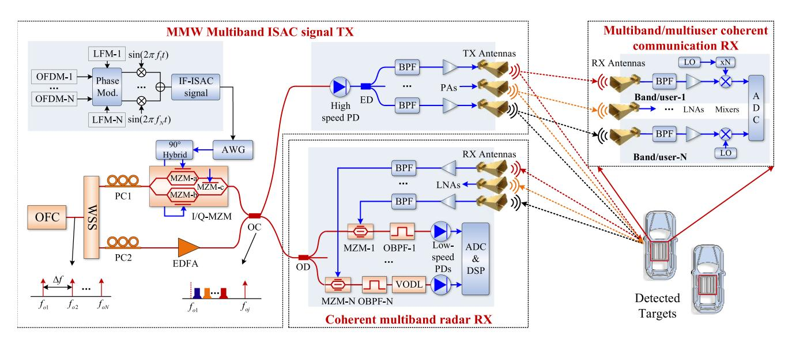

Fig. 1. Schematic diagram of proposed photonics-assisted MMW multiband ISAC system. ADC: analog digital converter; AWG: arbitrary waveform generator; BPF: bandpass filter; ED: electrical divider; EDFA: Erbium-doped fiber amplifier; IF-ISAC: immediate frequency-integrated sensing and communication; LFM: linear frequency modulation; LNA: low noise amplifier; LO: local oscillator; MZM: Mach-Zehnder modulator; OBPF: optical bandpass filter; OC: optical coupler; OD: optical divider; VODL: variable optical delay line; OFC: optical frequency comb; OFDM: orthogonal frequency division modulation; PA: power amplifier; PC: polarization controller; PD: photodetector; RX: receiver; TX: transmitter; WSS: wavelength selective switch.

 $A_i, f_i, k_i, h_i, m_i(t)$ , to meet the sensing and communication requirements towards different users or scenarios.

#### B. Photonic MMW Multiband ISAC System

Fig. 1 gives the schematic diagram of the proposed photonics-assisted MMW multiband ISAC system.

Firstly, a single photonic MMW frequency upconverter consisting of an optical frequency comb (OFC), a wavelength selective switch (WSS), an I/Q Mach-Zehnder modulator (I/Q-MZM), and a high-speed photodetector (PD) is established to simultaneously generate the MMW multiband ISAC signal. As shown in Fig. 1, an OFC signal with a free spectral range (FSR) of  $\Delta f$  is injected into a WSS to select two optical tones. Via the first polarization controller (PC1), the optical single-tone signal in the upper path is injected into an I/O-MZM to carry the electrical IF-ISAC signal. The IF-ISAC signal generated by an arbitrary waveform generator (AWG) passes an electrical 90° hybrid before it is applied to the I/Q-MZM, which is an integrated device consisting of two sub-MZMs (MZM-a and MZM-b), and a parent MZM-c. Considering the small signal modulation assumption, a carrier-suppressed single sideband (CS-SSB) modulation (i.e., +1st order sideband) can be achieved by biasing the MZM-a and MZM-b at the minimum transmission point (MITP), and MZM-c at the quadrature transmission point (QP). Then, the state of polarization and amplitude of the optical single-tone signal in the lower path are adjusted by the PC2 and Erbium-doped fiber amplifier (EDFA) to be aligned with those of the CS-SSB optical signal in the upper path. After that, optical signals from two paths are coupled by a 2 × 2 optical coupler (OC). The coupled optical signal (see Fig. 1) can be given by

$$E_{OC}(t) \propto$$

$$E_{o1}J_{1}(\beta) \sum_{i=1}^{N} E_{i} \exp \left\{ j2\pi \left[ (f_{o1} + f_{i})t - \frac{1}{2}k_{i}t^{2} - h_{i}m_{i}(t) \right] \right\} + E_{oj} \exp \left( j2\pi f_{oj}t \right),$$
(2)

where  $E_{o1}, E_{oj}$  and  $f_{o1}, f_{oj}$  are the amplitudes and center frequencies of the selected two optical tones, respectively.  $E_i$  is the amplitude of the  $i\_th$  sub-band optical signal.  $J_n(\cdot)$  denotes the  $n\_th$  order Bessel function of the first kind and  $\beta$  represents the modulation index of the I/Q-MZM. As shown in Fig. 1, the coupled optical signal is then divided into two parts: one serves as the reference optical carrier for the coherent multiband radar de-chirping process; another is sent to a high-speed PD to generate the MMW multiband ISAC signals. Through the optical-to-electrical conversions in the high-speed PD, the obtained photocurrent can be expressed as

$$I_{PD}(t) \propto E_{OC} \cdot E_{OC}^*$$

$$\propto R \left\{ 1 + \sum_{i=1}^{N} \cos \left\{ 2\pi \left[ (f_{o2} - f_{o1} - f_i)t + \frac{1}{2}k_i t^2 + h_i \cdot m_i(t) \right] \right\} \right\},$$
(3)

where R is the amplitude of the obtained photocurrent. Thus, the MMW multiband ISAC signals centered at  $f_{o2}-f_{o1}-f_i$  are generated through the optical heterodyne detection. Here, we can appropriately adjust the FSR of OFC or switch the operating channels of WSS to achieve the reconfiguration of operating frequency and IBW of the generated MMW ISAC signals. Subsequently, the multiband MMW ISAC signals are separated, amplified, and then emitted into free space by means of electrical bandpass filters (BPFs), power amplifiers (PAs), and transmit antennas operating at different frequency bands,

{3}------------------------------------------------

thus realizing the radar detection and wireless communication functions towards multiband and multiuser.

In the multiband/multiuser coherent communication receiver, the MMW ISAC signals are respectively received and demodulated by the receivers of different bands or users. As shown in Fig. 1, the MMW ISAC signals located at each frequency band are separately captured, filtered, and power compensated by the receiving antenna, BPFs, and low noise amplifiers (LNAs) in each receiver. Subsequently, the heterodyne coherent reception is implemented through the mixers along with the local oscillator (LO) signal to down-convert each sub-band MMW ISAC signals to the IF ones:

$$S_{IF}(t) \propto$$

$$R\sum_{i=1}^{N}\cos\left\{2\pi\left[(f_{o2}-f_{o1}-f_{i}-f_{LO-i})t+\frac{1}{2}k_{i}t^{2}+h_{i}m_{i}(t)\right]\right\},\tag{4}$$

where  $f_{LO-i}$  denotes the center frequency of the i-th LO signal. It is noted that the high-frequency MMW LO signal can be obtained from the frequency-multiplying of the low-frequency microwave signal (see Fig. 1). Afterwards, these IF signals are digitized by multi-channel analog-to-digital convertor (ADC) for further digital signal processes (DSPs), such as coherent down-conversion using the LFM carrier,  $\cos(\pi k_i t^2)$ , to extract the constant envelope OFDM signal from the IF-ISAC signal, phase demodulation, OFDM demodulation, and bit error rate (BER) calculation.

In the coherent multiband radar receiver, the echoes reflected by the targets are also collected, amplified, and filtered by the MMW antennas, LNAs, and BPFs, then to drive different radar receiving channels. In each channel, the filtered echo is applied to modulate the reference optical carrier by the MZM-i, as shown in Fig. 1. Then, the  $i\_th$  optical bandpass filter (OBPF-i) is used to select the optical sideband corresponding to  $i\_th$  sub-band radar echo. Its output can be depicted as

$$E_{OBPF_{-}i}(t) \propto E_{o1}E_{oj}E_{i}R \cdot J_{1}(\beta)J_{1}(\gamma_{i})$$

$$\cdot \left\{ \exp \left\{ j2\pi \left[ (f_{o1} + f_{i})t - \frac{1}{2}k_{i}t^{2} - h_{i}m_{i}(t) \right] \right\} \right\} , \quad (5)$$

where  $i(i=1,\cdots,N)$  stands for different OBPF and MZM,  $\gamma_i$  is the modulation index of the  $i\_th$  MZM. And,  $t_i'=t-(\tau+\tau_i')$ , in which  $\tau$  is the round-trip delay of echo signal with respect to the transmit MMW signal in free space, and  $\tau_i'$  is the path delay caused by radar receiving antenna, LNA, BPF, and cable (see in Fig. 1). Thus, the variable optical delay lines (VODLs) are introduced to compensate the path delays in different radar receiving channels to ensure the phase coherence between multiband radar de-chirping signals. Then, the compensated optical components are injected into the low-speed PDs to achieve the photonic microwave de-chirping process of multiple-band radar. The output of the  $i\_th$  low-speed PD can be written as

$$I_{PD-i}(t) \propto C_i \cos\left[2\pi k_i \left(\tau + \tau_i'\right)t + \theta_i\right],$$
 (6)

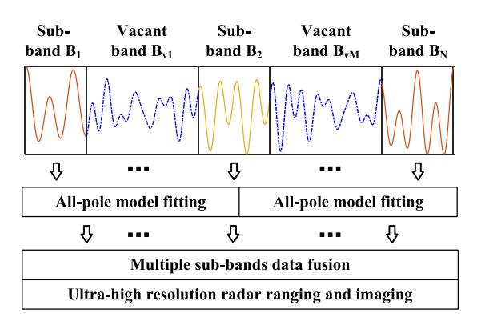

Fig. 2. Block diagram of multiband data fusion processing.

where  $C_i, k_i(\tau + \tau_i')$  separately denote the amplitude and center frequency of the radar de-chirped signal corresponding to the  $i\_th$  sub-band. Therefore, after phase (delay) compensation, the center frequency of the de-chirped signals emanating from distinct sub-band radars is rendered uniform, ensuring the accuracy of radar target detection.  $\theta$  stands for the redundant phase components including constant term, OFDM signal, and its delay version, which can be eliminated by the electrical filter [27], [37]. Accordingly, the radar range resolution for the  $i\_th$  sub-band can be expressed as

$$\Delta R_i = \frac{c}{2B_i},\tag{7}$$

where c is the vacuum speed of light,  $B_i$  denotes the IBW of the  $i\_th$  sub-band. Here, the radar range resolution can be improved by increasing IBW of ISAC signal for each sub-band.

In addition, inspired by the well-investigated coherent fusion processing algorithm [33], [34], the generated MMW multiband radar signal in our proposed system can be further fused to achieve an ultra-high resolution radar range profile of complex scenario beyond the detection capability of each radar sub-band. Moreover, due to the delay compensation processing in the photonics-based multiband radar receiver, the phase coherence of the obtained de-chirped signals between different sub-bands can be ensured so that our proposal can realize a coherenceprocessing-free multiband data fusion. The block diagram of multiband data fusion processing is shown in Fig. 2, which essentially encompasses three steps: all-pole model fitting, multiple sub-bands data fusion, and standard radar DSPs (i.e., ranging and imaging). The first step is to fit the all-pole model by characterizing the measurement data (de-chirped signals) of multiple sub-bands. The subsequent sub-band data fusion step is accomplished by global all-pole model fitting to predict the measurement signal over the entire ultra-wideband frequency range. Subsequently, the obtained global signal model is used for filling the vacant band with interpolating values, thus obtaining equivalent fused wideband data. As shown in Fig. 2, the bandwidths of multiple sparse sub-bands and the vacant bands between them are  $B_1, \dots, B_N$ , and  $B_{v1}, \dots, B_{vM}$ , respectively. Thus, the equivalent bandwidth  $B_{total}$  and range resolution  $\Delta R_{total}$  of

{4}------------------------------------------------

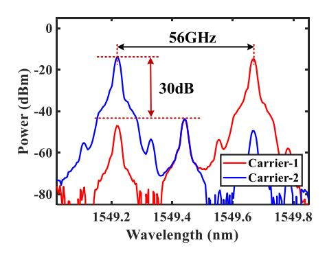

Fig. 3. Measured optical spectra of two OFC tones at the outputs of interleaver.

the fused data can be given by

$$B_{total} = \sum_{i}^{N} B_i + \sum_{vj}^{vM} B_{vj}, \Delta R_{total} = \frac{c}{2B_{total}}$$
 (8)

Finally, standard radar DSPs are implemented for the fused data to achieve ultra-high resolution ranging and imaging.

# III. EXPERIMENTS AND RESULTS

#### *A. Generation of the Ka-Band to V-band MMW ISAC Signals*

A proof-of-concept experiment is carried out based on the setup shown in Fig. [1.](#page-2-0) The OFC module is made up of a laser, an MZM, and a microwave source (MS). A 1549.4 nm optical carrier signal with a power of 12 dBm is emitted from a narrowlinewidth laser (Teraxion PS-TNL), and injected into an MZM having a 3-dB bandwidth of 40 GHz. The MZM is driven by a single-tone radio-frequency (RF) signal from an MS to generate a OFC with an FSR of 28 GHz. Then, a 50-GHz inter-leaver is leveraged to select two OFC tones, whose measured optical spectra are shown in Fig. 3. As can be seen that two selected OFC tones have a 56 GHz frequency space and demonstrate an over 30 dB suppression ratio with other optical sidebands. The carrier-1 signal is injected into an I/Q-MZM (FUJITSU FTM7962EP) with a 3-dB bandwidth of 22.5 GHz to achieve the photonic MMW frequency up-conversion of IF-ISAC signal.

The main parameters of the transmit IF-ISAC signals are summarized as in Table I. The off-line dual-band IF-ISAC signals centered at 4 GHz and 18 GHz are loaded into the AWG running at a sampling rate of 64 GSa/s for digital-to-analog conversion, and applied to two RF ports of I/Q-MZM through an electrical 90° hybrid to modulate the carrier-1 signal in the upper path for generating the CS-SSB optical signal.

Fig. 4 gives the measured optical spectrum (blue line) of the coupled optical signal via a 50:50 OC1, displaying a CS-SSB optical signal with an over 21 dB carrier suppression ratio. The coupled optical signal is first sent to a PD1 (Thorlabs RXM40AF) with a 3 dB bandwidth of 40 GHz to generate the Ka-band MMW ISAC signal. Through the PA and transmit antenna operating at 26.5∼40 GHz, the high-frequency outof-band undesired signals are filtered out, and the measured

TABLE I MAIN PARAMETERS FOR IF-ISAC SIGNALS

| OFDM                   | Bandwidth                    | 2 GHz  |
|------------------------|------------------------------|--------|
|                        | Modulation format            | 16-QAM |
|                        | FFT size                     | 2048   |
| LFM carrier            | Initial frequency (Band1) | 2 GHz  |
|                        | Initial frequency (Band2) | 16 GHz |
|                        | IBW                          | 4 GHz  |
|                        | Pulse width                  | 5 μs   |
| Phase modulation index | Band1                        | 1.0    |
|                        | Band2                        | 0.7    |

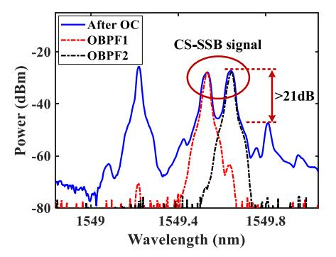

Fig. 4. Measured optical spectra at the outputs of OC1 (blue line), OBPF1 (red line) and OBPF2 (black line).

electrical spectrum of the obtained Ka-band ISAC signal centered at 38 GHz is shown in Fig. [5\(a\).](#page-5-0) Fig. [5\(b\)](#page-5-0) presents its spectrogram, demonstrating a 4 GHz IBW and 5 µs pulse width. Then, the coupled optical signal is also injected into another 70 GHz bandwidth PD2 (Finisar XPDV3120) for the generation of the V-band MMW ISAC signal. Similarly, the PA and antenna operating at 50∼75 GHz are used to suppress the low-frequency components to attain the V-band MMW ISAC signal centered at 52 GHz, of which spectrum and spectrogram are measured as shown in Fig. [5\(e\)](#page-5-0) and [\(f\).](#page-5-0)

In addition, Fig. [6\(a\)–\(c\)](#page-5-0) give the temporal waveforms of the traditional OFDM signal, Ka-band ISAC signal, and V-band ISAC signal, respectively. As can be seen from Fig. [6\(a\),](#page-5-0) the traditional OFDM signal shows a high PAPR of 15.3 dB. However, the generated Ka-band and V-band ISAC signals have a desirable constant envelop property, displaying the fixed low-PAPR of 2.1 dB and 3.5 dB, which is beneficial to achieve the maximum transmit power budget of high-power PA for long-distance integrated radar and communication.

Finally, the generated Ka-band and V-band MMW ISAC signals are emitted into free space to perform the radar detection and wireless communication functions, respectively.

# *B. Demonstrations of MMW Wireless Communication and Radar Detection Functions for Ka-Band and V-Band*

For Ka-band and V-band MMW wireless communication function demonstrations, two ∼1.2 m line-of-sight propagation

{5}------------------------------------------------

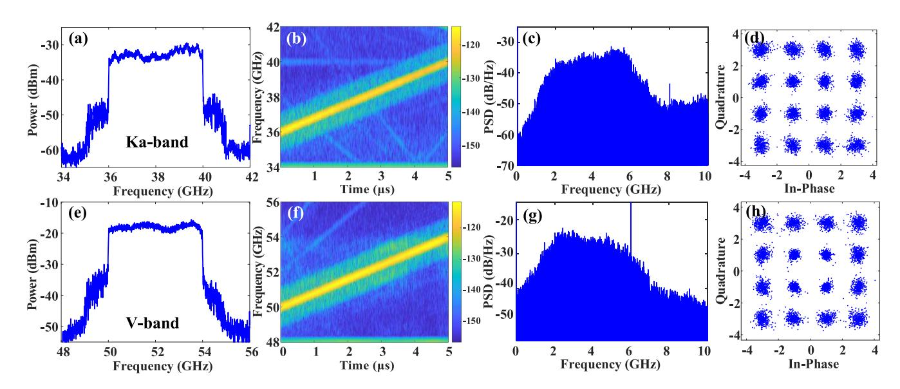

Fig. 5. Ka-band case: measured (a) spectrum and (b) spectrogram of the generated MMW ISAC signal, (c) measured PSD after coherent downconversion using LFM carrier, (d) corresponding to constellation diagram of demodulated signal; V-band case: measured (e) spectrum and (f) spectrogram of the generated MMW ISAC signal, (g) measured PSD after coherent downconversion using LFM carrier, (h) corresponding to constellation diagram of demodulated signal.

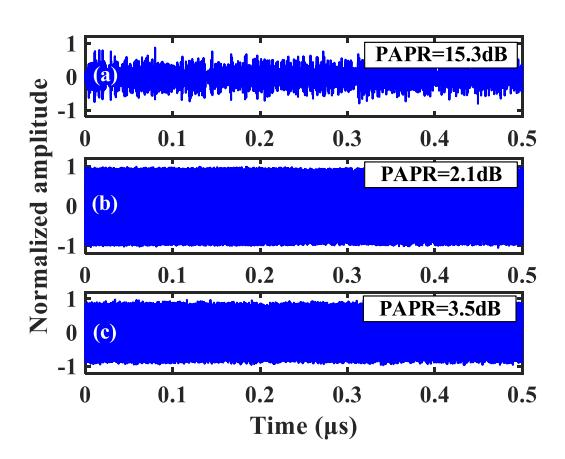

Fig. 6. Temporal waveforms of (a) traditional OFDM signal, (b) Ka-band and (c) V-band ISAC signals.

links are simultaneously established by two coherent communication receivers consisting of two pairs of MMW antennas, two transmit PAs, and two receive LNAs. The 38 GHz Ka-band and 52 GHz V-band ISAC signals are captured by the receive antenna in different communication receivers. After amplified by the LNAs, these captured ISAC signals are sent to the MMW mixers for the frequency down-conversion. The 38 GHz Ka-band signal is first downconverted to a 4 GHz IF one by mixing with a 34 GHz single tone RF signal.

However, for the 52 GHz V-band signal, a 56 GHz LO signal from the electrical frequency-quadrupling of the 14-GHz single-tone microwave signal is mixed with it to downconvert a 4-GHz IF one. Two down-converted IF ISAC signals are then digitized by a dual-channel real-time oscilloscope (OSC) running at a sample rate of 40 GSa/s. Further off-line DSPs are implemented to evaluate the performance of the Ka-band and V-band communication system, which include coherent

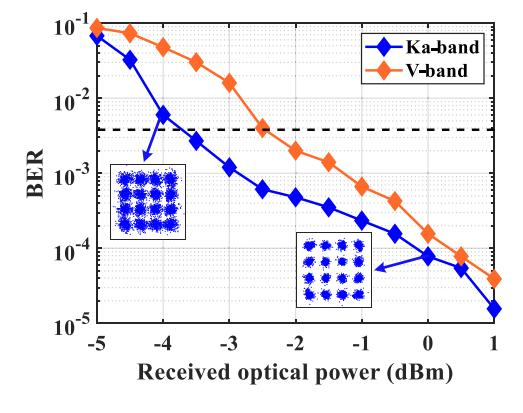

Fig. 7. Measured BER performances as a function of the received optical powers for the Ka-band and V-band communication demonstrations.

down-conversion using the LFM carrier, phase demodulation, OFDM demodulation, and error vector magnitude (EVM)/BER calculations.

When the bandwidths of the baseband OFDM signals for the Ka-band and V-band cases are both set as 2 GHz, Fig. 5(c) and (g) give the measured power spectral density (PSD) of the constant envelope OFDM signals after coherent downconversion using LFM carriers. Subsequently, two clear and separated constellation diagrams for the demodulated signals in two cases can be observed in Fig. 5(d) and (h), achieving the 9.5% and 10.2% EVM performance satisfying the 12.5% threshold specified by the 3rd Generation Partnership Project (3GPP) for 16-QAM modulation. Therefore, both Ka-band and V-band wireless links are able to accomplish a high quality wireless communication transmission at raw data rates of 8 Gbit/s.

Furthermore, Fig. 7 demonstrates BER performances corresponding to Ka-band and V-band cases versus the different received optical powers before PD1 and PD2. From Fig. 7, the

{6}------------------------------------------------

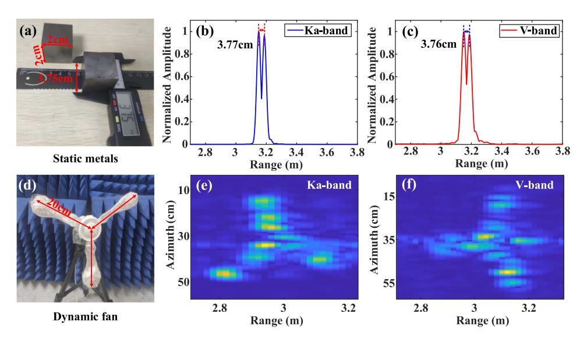

Fig. 8. (a) Photograph of two static metal targets for radar ranging, obtained radar ranging results of two reflectors separated at 3.75 cm interval for (b) Ka-band and (c) V-band radars; (d) photograph of the dynamic electric fan for radar imaging, obtained radar imaging results for (e) Ka-band and (f) V-band radars.

received optical power margins to keep a BER below the 7% pre-forward error correction (pre-FEC) threshold  $(3.8 \times 10^{-3})$  should be over -3.8 dB and -2.5 dB for two cases. Two insets in Fig. 7 indicate the constellation diagrams corresponding to the received optical powers of -4 dB and 0 dB, respectively.

For Ka-band and V-band radar function demonstrations, dualchannel coherent radar receiver is leveraged to receive Ka-band and V-band radar echoes reflected by targets ∼3.2 m away from transceiver antennas. The received echoes are separately applied to MZM1 and MZM2 having the 3-dB bandwidth of 40-GHz and 65-GHz to modulate the reference optical carriers, as shown in Fig. 1. After being amplified by two EDFAs, the outputs of MZM2 and MZM3 are sent to two OBPFs (EXFO XTM-50) to filter two optical sidebands for the photonic microwave de-chirping processes of the Ka-band and V-band radars. The measured optical spectra at the outputs of two OBPFs are shown in Fig. 4. Through two low-speed PDs with a 3-dB bandwidth of 1 GHz, two radar de-chirped signals are digitized by a dual-channel OSC with a sample rate of 250 MSa/s. Subsequently, two metal cube reflectors with a length of 2 cm are leveraged to imitate the static desired targets for radar ranging demonstrations, as shown in Fig. 8(a). Fig. 8(b) and (c) present the obtained range profile results of two reflectors separated at 3.75 cm interval for Ka-band and V-band radar systems.

As can be observed from Fig. 8(b) and (c) that the obtained distances between two targets are 3.77 cm and 3.76 cm, respectively, which are consistent with the theoretical 3.75 cm range resolution for two sub-band ISAC signals with 4 GHz IBW. In addition, a VODL with a delay resolution of 40.6 fs is leveraged to compensate the electrical/optical path delay in Ka-band and V-band radar receivers, thus generating two phase coherent de-chirped signals and attaining the same ranging result,  $\sim$ 3.2 m, as shown in Fig. 8(b) and (c).

Then, an inverse synthetic aperture radar (ISAR) imaging is implemented by emulating a dynamic target with an electric fan, as displayed in Fig. 8(d). The electric fan has three

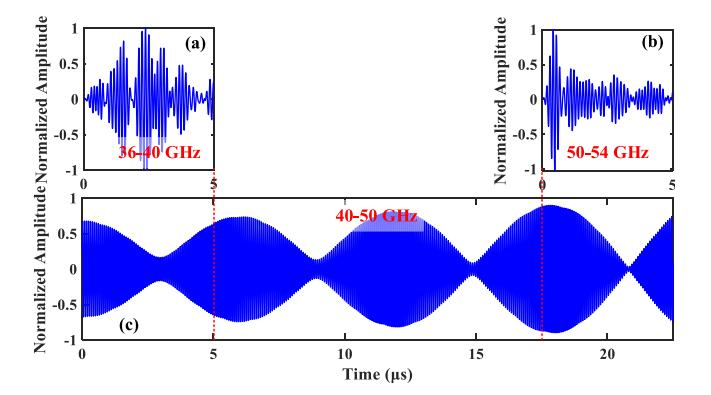

Fig. 9. Temporal waveforms of de-chirped signals for (a) Ka-band radar, (b) V-band radar and (c) dual-band data fusion processing.

silver-paper-packed blades with a radius of 20 cm and a rotation speed of  $2\pi$  rad/s. The captured dual-band LFM-OFDM radar detection signals are with a duration of 10 ms consisting of 2000 pulses. Fig. 8(e) and (f) show two-dimensional imaging results corresponding to Ka-band and V-band radars. As can be seen from two figures that the profiles of the electric fan can be clearly distinguished.

# C. Demonstrations of Ultra-High Resolution Radar Based on Multiband Data Fusion Processing

Thanks to the coherent multiband radar receiver, coherence-processing-free multiband data fusion can be achieved to activate ultra-high resolution radar detection. Accordingly, radar ranging and imaging experiments on smaller spacing or volume targets are demonstrated, as shown in Figs. 10(a) and 11(a). Firstly, Fig. 9 gives the normalized temporal waveforms of radar de-chirped signals before and after dual-band data fusion processing. From Fig. 9(c), the vacant data (40-50 GHz) between Ka-band and V-band is filled by the multiband data fusion

{7}------------------------------------------------

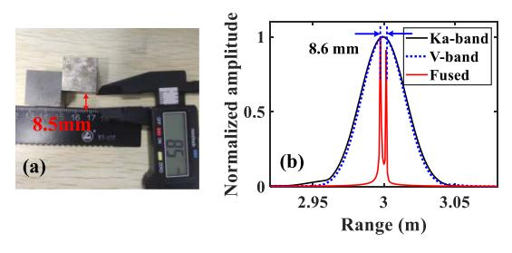

Fig. 10. (a) Photograph of two static metal targets separated at 8.5 mm intervals, (b) the obtained normalized range profile results by two single radars (black and blue lines) and multiband data fusion processing (red line).

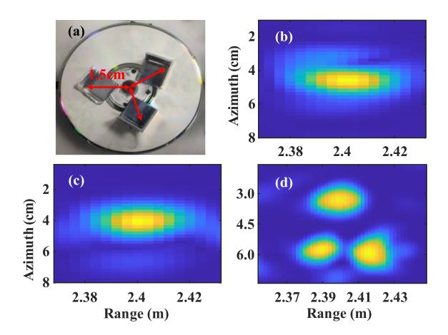

Fig. 11. (a) Photograph of the dynamic triangular reflectors mounted on a rotating platform for ultra-high resolution radar imaging, the ISAR imaging results constructed by (b) a single Ka-band radar, (c) a single V-band radar, and (d) multiband data fusion processing.

processing, acquiring an equivalent wideband de-chirped signal (36-54 GHz) with a total pulse width of 22.5  $\mu$ s. Then, when the distance between two metal reflectors is set as 8.5 mm, the normalized range profile results by two single radars, Ka-band (black line), V-band (blue line), and dual-band fusion processing (red line) are obtained, as shown in Fig. 10(b). Limited by the low range resolution of 3.75 cm, the single radar in Ka-band or V-band cannot distinguish two targets in the range profile. However, after multiband data fusion processing, the equivalent bandwidth and theoretical range resolution can reach to 18 GHz and 8.3 mm. Therefore, two targets can be clearly distinguished shown in Fig. 10(b), and the measured distance is 8.6 mm, which agrees well with its theoretical resolution.

Fig. 11(a) displays a photograph of the three triangular reflectors mounted on an electrical circular rotating platform for ultra-high resolution radar imaging. The rotating platform has a radius of 1.5 cm and is also with a rotation speed of  $2\pi$  rad/s. Fig. 11(b)–(d) accordingly show the two-dimensional ISAR imaging results constructed by a single Ka-band radar, a single V-band radar, and multiband data fusion processing. As can be seen from Fig. 11(b) and (c) that only one bright can be observed through single radar imaging. But it is obvious that three moving targets are resolvable in the range and azimuth profiles after multiband data fusion processing.

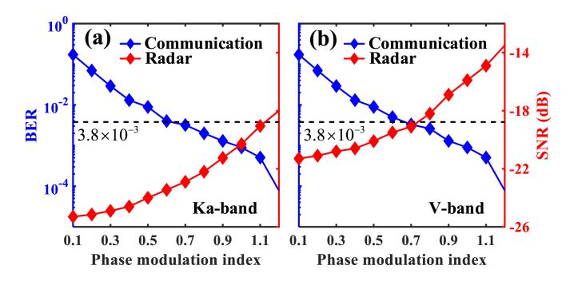

Fig. 12. Measured BERs of the demodulated OFDM signal and SNRs of the de-chirping radar signal versus different phase modulation indexes of the transmit IF-ISAC signals in the (a) Ka-band and (b) V-band cases.

### D. Performance Trade-off Between Radar and Communication Functions

Additional experiments are conducted to evaluate the performance trade-off between radar and communication functions governed by the PMIs of the transmit IF ISAC signals for Ka-band and V-band cases. Fig. 12 shows the measured BERs of the demodulated OFDM signals and the SNRs of the radar de-chirped signals with variable PMIs ranging from 0.1 to 1.2. As can be seen from Fig. 12(a) and (b) that the communication performances indicated by BERs (blue line) can be gradually improved by increasing the PMIs. However, the SNRs (red line) of the de-chirped signals for Ka-band and V-band radars decrease with the increase of the PMIs. Therefore, to gain a great balance for communication and radar functions, the suggested values of PMIs should be 1.0 and 0.7 for the Ka-band and V-band cases, respectively.

# IV. PROLONGABLE PERFORMANCE SIMULATIONS AND DISCUSSIONS OF PROPOSED ISAC SYSTEM IN U, V, AND W-BANDS

To further verify the prolongable performance of our proposal to higher frequency and more sub-bands radar and communication demonstrations, the MMW ISAC system towards U, V, and W-bands is investigated based on a commercially available optical system simulation platform, VPItransmissionMaker. In simulations, the OFCs with an FSR of 45 GHz are generated to obtain around 90 GHz MMW signal.

Fig. 13(a) and (b) show the electrical spectrum and spectrogram of the MMW four-band ISAC signals generated by the proposed ISAC system. Their center frequencies are respectively 58.5, 67.5, 75.5, and 83.5 GHz, covering an ultra-wideband frequency range from 56 GHz to 86 GHz.

Subsequently, the generated four-band ISAC signals are used to validate communication and radar functionalities. For communication function, the demodulated BER performances as a function of the received optical power for four-band transmission cases are measured, as shown in Fig. 13(c). The received optical power margins to keep a BER below the  $3.8 \times 10^{-3}$  pre-FEC threshold should be over -12 dB for four cases. For simulating ultra-high resolution radar function, the MMW four-band ISAC

{8}------------------------------------------------

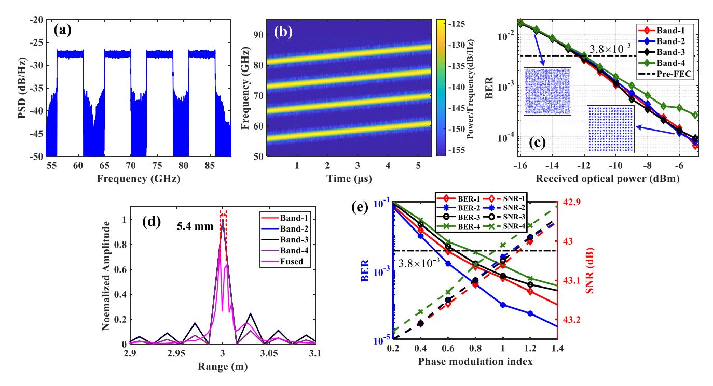

Fig. 13. Obtained (a) electrical spectrum and (b) spectrogram of the MMW four-band signals generated by the ISAC system covering U, V, and W-bands; (c) measured BER performances as a function of the received optical power for four-band communication demonstrations; (d) when two simulated objects are separated at 5 mm intervals, obtained range profile results by four single sub-band radars and multiband data fusion processing; (e) measured BERs of the demodulated OFDM signals and SNRs of the de-chirped radar signals versus different phase modulation indexes of the transmit IF-ISAC signals in four MMW sub-band cases.

signals are delayed by 20 ns and 20.033 ns to emulate the reflections from two objects at 3 m and 3.005 m, respectively. Accordingly, Fig. 13(d) shows the normalized range profile results obtained by four single sub-band radars and multiband data fusion processing. From Fig. 13(d), the sensing distance between two objects is about 5.4 mm, which is consistent with the theoretical 5 mm range resolution for the equivalent bandwidth of 30 GHz after multiband data fusion processing. Fig. 13(e) gives the performance trade-offs between radar and communication functions in four MMW sub-band cases, indicating that the suggested PMI values ranging from 0.8 to 1.

# V. CONCLUSION

In this paper, we have proposed and experimentally validated an MMW multiband ISAC system with large capacity communication and ultra-high resolution sensing capability based on the photonics MMW frequency upconversion and coherent receiving techniques. The single photonic MMW frequency upconverter consisting of an OFC, a WSS, an I/Q-MZM, and a high-speed PD simultaneously achieves the generation of MMW multiband ISAC signals. A multi-channel coherent photonic radar de-chirper with delay compensation greatly facilitates twofold benefits: the multiband coherent radar signal processing and the coherence-processing-free multiband data fusion, which thus realize ultra-high resolution radar ranging and imaging. Concurrently, the coherent receiving technique is leveraged to realize the communication receiving and demodulation towards multiband/multiuser scenarios. In proof-of-concept experiments, the photonics-assisted MMW ISAC system delivering Ka-band and V-band wireless signals is established, demonstrating a twodimension radar ISAR imaging of 3.75 cm range resolution and a data rates of 16 Gbit/s. Moreover, ultra-high resolution radar ranging and imaging with an 8.6 mm level range resolution are successfully achieved by multiband data fusion processing. In addition, simulations of MMW four-band ISAC system covering U, V, and W-bands are implemented to the prolongable ability of our proposal to higher frequencies and more sub-bands integrated functions. Therefore, our proposed ISAC system is expected to offer a great solution for multiband integrated radar and communication applications and thus accommodate the visions of future 6G and beyond wireless networks.

# REFERENCES

- [1] F. Liu, C. Masouros, A. P. Petropulu, H. Griffiths, and L. Hanzo, "Joint radar and communication design: Applications, State-of-the-Art, and the road ahead," *IEEE Trans. Commun.*, vol. 68, no. 6, pp. 3834–3862, Jun. 2020.
- [2] F. Liu et al., "Integrated sensing and communications: Towards dualfunctional wireless networks for 6G and beyond," *IEEE J. Sel. Areas Commun.*, vol. 40, no. 6, pp. 1728–1767, Jun. 2022.
- [3] F. Liu and C. Masouros, "A tutorial on joint radar and communication transmission for vehicular networks - Part II: State of the Art and challenges ahead," *IEEE Commun. Lett.*, vol. 25, no. 2, pp. 327–331, Feb. 2021.
- [4] X. Yi et al., "A 24/77 GHz dual-band receiver for automotive radar applications," *IEEE Access*, vol. 7, pp. 48053–48059, 2019.
- [5] M. David, J. Yao, and J. Capmany, "Integrated microwave photonics," *Nature Photon.*, vol. 13, no. 2, pp. 80–90, Jan. 2019.
- [6] J. Capmany and D. Novak, "Microwave photonics combines two worlds," *Nature Photon.*, vol. 1, no. 6, pp. 319–330, Jun. 2007.

{9}------------------------------------------------

- [7] K. Asakawa, Y. Sugimoto, and S. Nakamura, "Silicon photonics for telecom and data-com applications," *Opto-Electron. Adv.*, vol. 3, no. 10, Oct. 2020, Art. no. 200011.
- [8] S. Krasikov, A. Tranter, A. Bogdanov, and Y. Kivshar, "Intelligent metaphotonics empowered by machine learning," *Opto-Electron. Adv.*, vol. 5, no. 3, Mar. 2022, Art. no. 210147.
- [9] X. Zou et al., "Microwave photonics for featured applications in high-speed railways: Communications, detection, and sensing," *J. Lightw. Technol.*, vol. 36, no. 19, pp. 4337–4346, Oct. 2018.
- [10] J. Liu et al., "Quantum photonics based on metasurfaces," *Opto-Electron. Adv.*, vol. 4, no. 9, Sep. 2021, Art. no. 200092.
- [11] Y. Hu, D. Liang, and R. Beausoleil, "An advanced III-V-on-silicon photonic integration platform," *Opto-Electron. Adv.*, vol. 4, no. 9, Sep. 2021, Art. no. 200094.
- [12] J. Yu, X. Li, and W. Zhou, "Tutorial: Broadband fiber-wireless integration for 5G+ communication,"*APL Photon.*, vol. 3, Sep. 2018, Art. no. 111101.
- [13] K. Sengupta, T. Nagatsuma, and D. Mittleman, "Terahertz integrated electronic and hybrid electronic–photonic systems," *Nature Electron.*, vol. 1, pp. 622–635, Dec. 2018.
- [14] S. Pan and Y. Zhang, "Microwave photonic radars," *J. Lightw. Technol.*, vol. 38, no. 19, pp. 5450–5484, Oct. 2020.
- [15] P. Ghelfi et al., "A fully photonics-based coherent radar system," *Nature*, vol. 507, no. 7492, pp. 341–345, Mar. 2014.
- [16] C. Ma et al., "Microwave photonic imaging radar with a sub-centimeterlevel resolution," *J. Lightw. Technol.*, vol. 38, no. 18, pp. 4948–4954, Sep. 2020.
- [17] S. Melo et al., "Dual-use system combining simultaneous active radar & communication, based on a single photonics-assisted transceiver," in *Proc. 17th Int. Radar Symp.*, 2016, pp. 1–4.
- [18] W. Bai et al., "Photonic millimeter-wave joint radar communication system using spectrum-spreading phase-coding," *IEEE Trans. Microw. Theory Techn.*, vol. 70, no. 3, pp. 1552–1561, Mar. 2022.
- [19] Z. Xue, S. Li, X. Xue, X. Zheng, and B. Zhou, "Photonics-assisted joint radar and communication system based on an optoelectronic oscillator," *Opt. Exp.*, vol. 29, no. 14, pp. 22442–22454, Jul. 2021.
- [20] B. Dong et al., "Demonstration of photonics-based flexible integration of sensing and communication with adaptive waveforms for a W-band fiberwireless integrated network," *Opt. Exp.*, vol. 30, no. 22, pp. 40936–40950, Oct. 2022.
- [21] Y. Wang et al., "W-band simultaneous vector signal generation and radar detection based on photonic frequency quadrupling," *Opt. Lett.*, vol. 47, no. 3, pp. 537–540, Feb. 2022.
- [22] Y.Wang et al., "Integrated high-resolution radar and long-distance communication based-on photonic in terahertz band," *J. Lightw. Technol.*, vol. 40, no. 9, pp. 2731–2738, 2022.
- [23] H. Nie, F. Zhang, Y. Yang, and S. Pan, "Photonics-based integrated communication and radar system," in *Proc. Int. Topical Meet. Microw. Photon.*, 2019, pp. 1–4.
- [24] W. Bai et al., "60-GHz photonic millimeter-wave joint radarcommunication system," in *Proc. Int. Conf. Microw. Millimeter Wave Technol.*, 2021, pp. 1–3.
- [25] S. Wang, D. Liang, and C. Yang, "Photonics-assisted joint communication-radar system based on a QPSK-sliced linearly frequency-modulated signal," *Appl. Opt.*, vol. 61, no. 16, pp. 4752–4760, Jun. 2022.
- [26] M. Lei et al., "Photonics-aided integrated sensing and communications in mmW bands based on a DC-offset QPSK-encoded LFMCW," *Opt. Exp.*, vol. 30, no. 24, pp. 43088–43103, Nov. 2022.
- [27] W. Bai et al., "Millimeter-wave joint radar and communication system based on photonic frequency-multiplying constant envelope LFM-OFDM," *Opt. Exp.*, vol. 30, no. 15, pp. 26407–26425, Jul. 2022.
- [28] Z. Xue et al., "OFDM radar and communication joint system using optoelectronic oscillator with phase noise degradation analysis and mitigation," *J. Lightw. Technol.*, vol. 40, no. 13, pp. 4101–4109, Jul. 2022.
- [29] Z. Xue, S. Li, X. Xue, X. Zheng, and B. Zhou, "Tunable K/W-band OFDM integrated radar and communication system based on optoelectronic oscillator for intelligent transportation," *Opt. Exp.*, vol. 30, no. 20, pp. 35270–35281, Sep. 2022.
- [30] J. Dong et al., "Photonics-enabled distributed MIMO radar for highresolution 3D imaging," *Photon. Res.*, vol. 10, no. 7, pp. 1679–1688, Jul. 2022.
- [31] P. Ghelfi, F. Laghezza, F. Scotti, D. Onori, and A. Bogoni, "Photonics for radars operating on multiple coherent bands," *J. Lightw. Technol.*, vol. 40, no. 13, pp. 4101–4109, Jul. 2022.

- [32] G. Serafino et al., "A photonics-assisted multiband MIMO radar network for the port of the future," *IEEE J. Sel. Topics Quantum Electron.*, vol. 40, no. 6, pp. 1728–1767, Jun. 2022.
- [33] B. Hussain et al., "Auto-regressive spectral gap filling algorithms for photonics-based highly sparse coherent multiband radars in complex scenarios," in *Proc. IEEE Radar Conf.*, 2018, pp. 993–998.
- [34] K. Cuomo, J. Pion, and J. Mayhan, "Ultrawide-band coherent processing," *IEEE Trans. Antennas Propag.*, vol. 47, no. 6, pp. 1094–1107, Jun. 1999.
- [35] S. Peng et al., "A photonics-based coherent dual-band radar for ultrahigh resolution range profile," *IEEE Photon. J*, vol. 11, no. 4, Aug. 2019, Art. no. 5502408.
- [36] X. Zhu, G. Sun, and F. Zhang, "Photonics-based multiband radar fusion with Millimeter-level range resolution," in *Proc. Opt. Fiber Commun. Conf. Exhib.*, 2022, Paper Th3G.2.
- [37] S. Thompson, A. Ahmed, J. Proakis, J. Zeidler, and M. Geile, "Constant envelope OFDM," *IEEE Trans. Commun.*, vol. 56, no. 8, pp. 1300–1312, Aug. 2008.
- [38] R. Mohseni, A. Sheikhi, and M. Shirazi, "Constant envelope OFDM signals for radar applications," in *Proc. 91st Veh. Technol. Conf.*, 2020, pp. 1–5.

**Wenlin Bai** received the B.S. degree from Southwest Jiatotong University, Chengdu, China, in 2017. He is currently working toward the Ph.D. degree with the School of Information Science and Technology. His research interests include microwave photonics and joint radar and communication.

**Peixuan Li** is currently an Associate Professor with the Center for Information Photonics and Communications, Southwest Jiaotong University, Chengdu, China. His research interests include microwave photonics, radio over fiber, and integrated photonics.

**Xihua Zou** (Senior Member, IEEE) is currently a Full Professor and the Deputy Dean with the Center for Information Photonics and Communications, Southwest Jiaotong University, Chengdu, China. He once was a Humboldt Research Fellow with the Institute of Optoelectronics, University of Duisburg-Essen, North Rhine-Westphalia, Germany. He was also a Visiting Researcher and a joint training Ph.D. student with the Microwave Photonics Research Laboratory, University of Ottawa, Ottawa, ON, Canada, and a Visiting Scholar with the Ultrafast Optical Processing Research Group, INRS-EMT, Canada. He has authored or coauthored more than 80 academic papers in high-impact refereed journals, and more than ten granted Chinese patents. His interests include microwave photonics, microwave/millimeter-wave over fiber communication for 5G/6G, and integrated photonics.

Dr. Zou is the SPIE Fellow and the Alexander von Humboldt Research Fellow, Excellent Young Scholar of NSFC, and National Outstanding Expert in Science & Technology of China. He was also the recipient of the OSA 2018 Outstanding Reviewer.

He is currently an Associate Editor for *Optics Express*, and ISC (International Steering Committee) Member of the IEEE Topical Meeting on Microwave Photonics (MWP). He was an Associate Editor for the IEEE JOURNAL OF QUANTUM ELECTRONICS, the Guest Editor of a Special Issue on Microwave Photonics in IEEE/OSA JOURNAL OF LIGHTWAVE TECHNOLOGY, and the leading Guest Editor of a Special Section on Microwave Photonics in *SPIE Optical Engineering*.

**Ningyuan Zhong** received the B.S. degree from Southwest Jiatotong University, Chengdu, China, in 2021. He is currently working toward the Ph.D. degree with the School of Information Science and Technology. His research interests include microwave photonics and joint radar and communication.

{10}------------------------------------------------

**Wei Pan** is currently a Full Professor with the Center for Information Photonics and Communications, Southwest Jiaotong University, Nanjing, China. His research interests include semiconductor lasers, nonlinear dynamic systems, and optical communications. He has authored or coauthored more than 200 papers in high-impact refereed journals. Prof. Pan was appointed as the steering and consultancy expert of the highest-level national project (973 Project) of China. He was also awarded as the Academic and Technology Leader of Sichuan province, China.

**Xiong Deng** received the M.Eng. degree in communication and information engineering from the University of Electronic Science and Technology of China, Chengdu, China, in 2013, and the Ph.D. degree in optical wireless communications from the Eindhoven University of Technology, Eindhoven, The Netherlands, in 2018. In 2013, he was a Researcher with the Terahertz Science and Technology Research Center, China Academy of Engineering Physics, where he was involved in the integrated terahertz communication and imaging systems. He was a Guest Researcher with Signify (Philips Lighting) Research, where he was involved in light fidelity. He is currently an Associate Professor with Southwest Jiaotong University and a Postdoctoral Researcher with the Eindhoven University of Technology. His research interests include the system modeling, digital signal processing, circuits for intelligent lighting, millimeter wave, microwave photonics, and optical wireless communications.

**Lianshan Yan** (Senior Member, IEEE) received the B.E. degree from Zhejiang University, Hangzhou, China, and the Ph.D. degree from the University of Southern California, Los Angeles, CA, USA. He is currently the Dean with the School of Information Science & Technology and Director with the Center for Information Photonics & Communications, Southwest Jiaotong University, Chengdu, China. He is the author or coauthor of more than 500 papers, including more than ten invited journal papers and more than 50 invited talks. He also authored three books and two book chapters. He holds 13 issued U.S. patents and more than 70 Chinese patents. He is a Fellow of Optica (formerly OSA). He has been the Co-Editor-in-Chief of Light: Advanced Manufacturing since 2020. He was the recipient of the IEEE Photonics Society Distinguished Lecturer Award during 2011–2013 and IEEE LEOS Graduate Fellowship 2002. He was the Co-Chair or TPC Member of more than 50 international conferences. He is also the winner of the National Science Fund for Distinguished Young Scholars of China, Chair Professor of Cheung Kong Scholars Program. He was the Chair of Optical Fiber Technology Technical Group, Optical Society of America, during 2015–2018 and an Associate Editor for the IEEE PHOTONICS JOURNAL during 2009–2015.