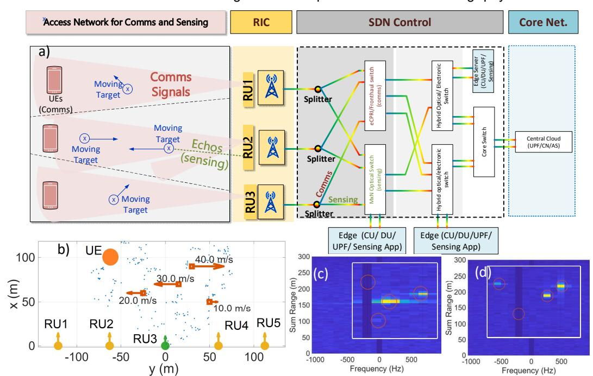
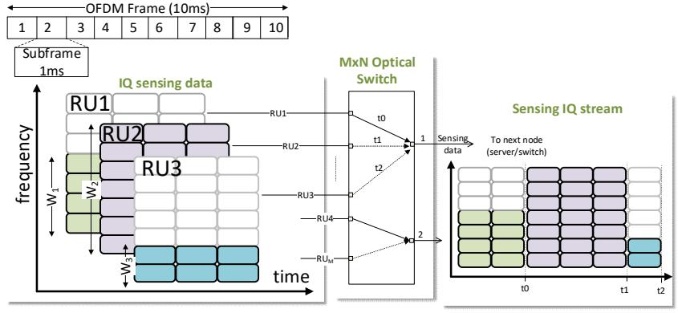
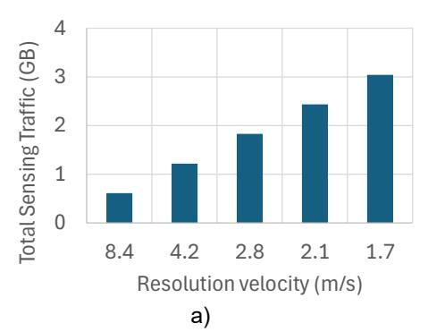
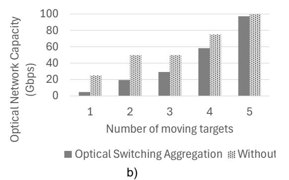

{0}------------------------------------------------

# Optical Transport Networks Supporting Integrated Communications and Sensing in 6G

Anna Tzanakaki and Markos Anastasopoulos

National and Kapodistrian University of Athens, Athens, Greece, atzanakaki@phys.uoa.gr

**Abstract** This paper proposes a 6G network architecture supporting Integrated Sensing and Communications (ISAC) services exploiting a multi-technology optical transport network. A modelling framework is proposed optimising optical transport network resources for ISAC. The proposed architecture is experimentally implemented and evaluated over a 6G test-bed.

### Introduction

The deployment of 5G technologies, is currently becoming a reality around the world, creating new opportunities for a variety of industries and business sectors offering new and improved services with regards to sustainability, resilience, user experience, etc. However, in this recently created ecosystem enabling convergence of multiple industries and business sectors with connectivity platforms, the requirements for interconnection and performance increase rapidly and it is expected that they will soon exceed the capabilities of 5G technology.

To address these limitations migration to 6G systems is proposed. The 6G vision involves a widely extended connectivity scale of a huge number of end devices, extreme and varying levels of capacity and bandwidth granularity, increased degree of mobility and a great variety of services with strict sustainability, scalability and autonomy goals. In this context, 6G is expected to offer improved performance in comparison to 5G with regards to connectivity, peak data rates, latency, energy efficiency, etc. integrating together the most advanced and heterogeneous

network and compute technologies. It will also offer increased intelligence and flexibility through wide adoption of Artificial Intelligence (AI) and Machine Learning (ML) techniques. However, these will come at the expense of increased complexity imposing the need for autonomous operation and self-optimisation capabilities. In addition, 6G will offer new and enhanced capabilities such as localisation, monitoring and sensing of the surrounding environment. These capabilities will be exploited in the form of advanced and novel service models integrating together features such as connectivity, computing, caching, monitoring, positioning, navigation, etc. A representative example of such a model is that of Integrated Communications and Sensing (ISAC) that will effectively enable connection of the physical, biological, and cyber worlds.

ISAC [1] performs sensing and monitoring of the surrounding environment through the mobile communications infrastructure without the need of extra monitoring devices and equipment. In this context, the network acts as a "radar" sensor, exploiting its own radio signals to sense and comprehend the surrounding physical world. The

Fig. 1: a) Integrated Transport Network for Comms and Sensing, b) RAN configuration and moving targets, blue dots are static reflectors, Moving targets as detected by (c) RU4 and (d) RU5, Nframe = 12, W= 100MHz, RAN frequency =3.5GHz

{1}------------------------------------------------

Fig. 2: Sensing stream scheduling through Optical Transport Switching

echoes (reflections) and scattering of wireless signals predominately transmitted for communication purposes, provide information related to the characteristics of the environment and/or objects therein [2]. The sensing data collected and processed by the network can then be leveraged to enhance the network's operations, augment existing services such as XR and digital twinning, and enable new services, such as object detection and tracking, along with imaging and environment reconstruction. This potential has already attracted a lot of attention from 3GPP, which has initiated a preliminary study on use cases and ISAC requirements, making it a promising candidate to optimize both communications and sensing systems [2], [3].

Sensing and communication functions can be performed taking different approaches: (a) adopting separate and dedicated infrastructures for sensing and communications, (b) sensing and communication capabilities supported by common hardware sharing the available spectrum, but transmitting sensing and communications signals over different timeslots, and (c) adopting integrated systems fully sharing both spectrum and time domains. Although early prototypes are available validating concepts (a) and (b), implementations of 3GPP compliant ISAC systems are still at a very early stage. These systems demand additional complexity in signal processing but require collection and aggregation of huge volumes of synchronized IQ reflected (echo) streams that need to be processed to extract information on the sensed environment. This processing can only be performed at edge servers, introducing the need to transport the IQ streams over flexible high-capacity transport networks. In these environments, transport networks are expected to play a more important and challenging role compared to that in 5G [4].

This paper studies how optical transport networks can facilitate 6G ISAC services and how these services affect the requirements and technical specifications that the 6G transport network needs to support.

## **System Architecture**

To facilitate 6G ISAC services exploiting the

capabilities of optical transport networks we propose the system architecture illustrated in Fig. 1a. This architecture adopts an optoelectronic transport network to interconnect the Radio Access Network (RAN) with the core functions located at edge and central cloud compute resources. The hierarchical structure of the proposed architecture offers RAN connectivity and collects and aggregates communication and sensing traffic streams from the Remote Units (RUs), while it transports these to edge and central cloud servers for processing. For the RAN segment, we consider a typical 5G compatible Input Multiple Multiple Output (MIMO)-Orthogonal Frequency Division Multiplexing (OFDM) waveform. The primary objective of the system is to successfully establish connections for communication purposes between the 5G RUs and the User Equipment (UEs). However, the OFDM waveforms transmitted for communication purposes are reflected by obstacles in the environment and are received by the RUs. These echo signals can then be processed to sense the surrounding environment and detect moving targets acting as a Doppler OFDM radar [5]. The Doppler OFDM radar functionality is supported by a suitable sensing app hosted at the edge cloud as (Fig. 1a).

The OFDM waveform is organized into frames with 10ms duration each comprising ten subframes of 1ms. The bandwidth (in MHz) allocated per RU i is denoted as  $W_i$ . The main parameters characterising the performance of the OFDM doppler radar are distance and velocity resolution,  $\Delta d_i$  and  $\Delta v_i$ , respectively. These more specifically refer to the lowest distance and velocity for which two targets positioned at  $d_i$  and  $d + \Delta d_i$  moving with velocities  $v_i$  and  $v_i + \Delta v_i$  can be located and distinguished. For OFDM radar, the resolution range  $\Delta d_i$  for echoes corresponding to communication signals transmitted by RU i is:

$$\Delta d_i = c_0/2W_i \quad (1)$$

where  $c_0$  is the speed of light. Similarly, the speed resolution for the moving targets is given by:

$$\Delta v_i = c_0/2f_c N_{frames} T_s \quad (2)$$

{2}------------------------------------------------

where  $f_c$  is the central frequency of the wireless system,  $T_s$  the duration of the OFDM symbol and  $N_{frames}$  the number of frames employed in the velocity estimation process. Therefore, by increasing the number of frames collected and processed by the OFDM radar, higher sensing accuracy can be achieved. However, increasing the bandwidth and  $N_{frames}$  increases also the volume of sensing IQ streams which are transported and processed by the sensing app implementing the Doppler OFDM radar.

To enable independent handling of comms and sensing IQ streams, addressing their different requirements, optical splitters are introduced in the optical transport network (Fig. 1a). These are employed at the output of the RUs duplicating IQ streams thus creating two separate paths for comms and sensing signals. This allows comms streams to be forwarded through a combination of optoelectronic switches supporting the CPRI/eCPRI protocols [6] for further processing at the DUs/CUs whereas sensing streams can be transferred and terminated at the edge server hosting the sensing app. The eCPRI compliant optoelectronic switches can aggregate IQ streams from multiple RUs maximizing the utilization of network resources. On the other hand, given the characteristics of the sensing flows described above their aggregation from the RUs can be performed adopting all optical switching technologies with switching times of the order of 25ms-75ms. This enables collection of the necessary number of OFDM frames per tracked area allowing the sensing app to achieve the required sensing accuracy level transparently. Therefore, transparent optical switching plays a key role in supporting the functionality of the Doppler OFDM radar. The proposed solution offers an elegant and simple implementation eliminating the need of optoelectronic conversions.

The proposed concept is demonstrated in Fig. 2. As can be seen appropriate scheduling policies are applied at the optical switches to perform the required aggregation and transfer the optimal number of  $N_{frames}$  from the RUs (sufficient to detect the moving targets) to the sensing apps. This

corresponds to the policy that connects ingress port 1 to output port 1 for the time interval  $(0,t_0)$ , ingress port 2 to output port 1 for the interval  $(t_0,t_1)$  and ingress port 2 to output port 1 for  $(t_1,t_2)$ . At a system level this concept is shown in Fig. 1 where for the RAN topology shown in Fig. 1b, the received sensing signals captured from RU4 can be used to detect only 2 targets illustrated Fig. 1c, whereas sensing information from RU5 can detect 3 targets (Fig. 1d). Clearly indicating that combing sensing flows from multiple RUs can significantly improve the detection of moving targets.

The total volume of transmitted sensing information per RU for different resolution velocities is shown in Fig. 3a). Based on (2), OFDM radar resolution can increased by increasing the number of transmitted  $N_{frames}$ . As expected, this increases the volume of transmitted information that should be terminated at the sensing app. Finally, Fig. 3b). compares the total volume of transmitted sensing traffic as a function of the number of moving targets for the area shown in Fig. 1 b) with and without the aggregation optical switching functionality. For small number of moving targets, the required number of  $N_{frames}$  by the OFDM radar is small allowing the time switched optical network to aggregate sensing flows from a limited number of RUs. Increased number of targets introduces enhanced resolution requirements, in order to maintain the capability of the radar to clearly identify all moving targets. This results in increased number of  $N_{frames}$  leading to the need of continuous connection, thus eliminating the benefit of the optical switching aggregation functionality.

#### Conclusions

This study proposed the adoption of optical switching technologies as an enabler in aggregating sensing streams in 6G networks supporting ISAC services. Results indicate that significant benefits in terms of network capacity reduction can be achieved across a variety of mobile target detection scenarios.

Fig. 3: a) Volume of sensing traffic vs resolution velocity b) Optical transport network capacity allocated for sensing with and without optical network switching

{3}------------------------------------------------

## Acknowledgements

The present work has been supported by the Smart Networks and Services Joint Undertaking (SNS JU) under the European Union's Horizon Europe research and innovation programme under Grant Agreements No 101192521 (MultiX), No. 101139133 (ECO-eNET) and No. 101139282 (6G-SENSES).

## References

- [1] M. Anastasopoulos, J. Gutiérrez, A. Tzanakaki, "Optical Transport Network Optimization Sup-porting Integrated Sensing and Communication Services", OFC 2025
- [2] 3GPP TR 22.837 V19.4.0 (2024-06) Feasibility Study on Integrated Sensing and Communication (Release 19).
- [3] M. Anastasopoulos, J. Gutiérrez, and A. Tzanakaki, "Optical Transport Network Optimization Supporting Integrated Sensing and Communication Services," in Optical Fiber Communication Conference (OFC) 2025, Technical Digest Series (Optica Publishing Group, 2025), paper W2A.48.
- [4] A. Tzanakaki and M. Anastasopoulos, "Optical Transport Networks Converging Edge Compute and Central Cloud: An Enabler For 6G Services", invited, OFC'2024, USA
- [5] C. Knill, B. Schweizer, S. Sparrer, F. Roos, R. F. H. Fischer and C. Waldschmidt, "High Range and Doppler Resolution by Application of Compressed Sensing Using Low Baseband Bandwidth OFDM Radar," in IEEE Transactions on Microwave Theory and Techniques, vol. 66, no. 7, pp. 3535-3546, July 2018
- [6] A. de la Oliva, J. A. Hernandez, D. Larrabeiti and A. Azcorra, "An overview of the CPRI specification and its application to C-RAN-based LTE scenarios," in IEEE Communications Magazine, vol. 54, no. 2, pp. 152-159, February 2016, doi: 10.1109/MCOM.2016.7402275.