{0}------------------------------------------------

# Demonstration of High Sensitivity Detection and High Precision Localization of Vibrations in Bidirectional Coherent Transmission Systems Enabled by Carrier Laser Phase Noise Retrieval

Yixiang Hu®, *Graduate Student Member, IEEE*, Kaibo Zhang, Mohammad E. Mousa-Pasandi®, Ramón Gutiérrez-Castrejón®, *Senior Member, IEEE*, Maurice O'Sullivan®, Fanqi Kong, Brandon Buscaino, Jinsong Zhang®, Santiago Bernal®, *Graduate Student Member, IEEE*, Charles St-Arnault®, and David V. Plant, *Fellow, IEEE* 

Abstract—We demonstrate a method for mitigating the effects of laser phase noise on the detection and localization of vibrations in a bidirectional coherent optical fiber transmission system. By introducing a relative delay between the two frequency tones generated at the transmitter, we retrieve an estimate of the transmitter laser phase noise at the coherent receiver. We demonstrate 200 Gbps, 16 QAM error-free transmission over 80 km while simultaneously detecting and localizing a 3 kHz vibration with 24 rad peak-to-peak phase swing. Compared to conventional methods, our method results in a reduction of localization error by 58%, from 102 m to 43 m, and a reduction in standard deviation of estimated locations by 81%, from 355 m to 67 m.

Index Terms—Fiber sensing, integrated sensing and communication, laser phase noise, optical communication.

#### I. INTRODUCTION

ETWORK operators are currently considering simultaneous fiber plant monitoring and data transmission enabled by coherent transceivers. Here we investigate the ability to locate a point source vibration event that induces a phase perturbation on the traffic-carrying optical signal. The perturbation imparts an additional phase signature onto the optical field, with frequency

Received 29 March 2025; revised 22 June 2025; accepted 23 July 2025. Date of publication 28 July 2025; date of current version 16 September 2025. (Corresponding author: Yixiang Hu.)

Yixiang Hu, Kaibo Zhang, Jinsong Zhang, Santiago Bernal, Charles St-Arnault, and David V. Plant are with the Photonic Systems Group, Department of Electrical and Computer Engineering, McGill University, Montréal, QC H3A 0E9, Canada (e-mail: yixiang.hu@mail.mcgill.ca; kaibo.zhang2@mail.mcgill.ca; jinsong.zhang@mail.mcgill.ca; santiago.berna 1@mail.mcgill.ca; charles.st-arnault@mail.mcgill.ca; david.plant@mcgill.ca).

Mohammad E. Mousa-Pasandi, Maurice O'Sullivan, Fanqi Kong, and Brandon Buscaino are with Ciena Corporation, Ottawa, ON K2K 0L1, Canada (e-mail: mpasandi@ciena.com; mosulliv@ciena.com; fkong@ciena.com; bbuscain@ciena.com).

Ramón Gutiérrez-Castrejón is with Photonic Systems Group, Department of Electrical and Computer Engineering, McGill University, Montréal, QC H3A 0E9, Canada, and also with the Institute of Engineering, Universidad Nacional Autónoma de México (UNAM), Mexico City 04510, Mexico (e-mail: rgutierrezc@iingen.unam.mx).

Color versions of one or more figures in this article are available at https://doi.org/10.1109/JLT.2025.3593142.

Digital Object Identifier 10.1109/JLT.2025.3593142

content from 100s of Hz to 10s kHz depending on cause of the perturbation. The goal of this work is to detect and localize perturbation from the recovered laser phases at both ends of a bidirectional link. Target applications are multi-span coherent optical fiber transmission systems operating over terrestrial distances (10s km – 1000s km) and transoceanic distances (1000s km – 10000s km). We consider the former of these.

One conventional method of localization is Distributed Acoustic Sensing (DAS), which recovers and processes a backwards-propagating optical field [1], [2], [3], [4]. As with optical time domain reflectometry (OTDR), DAS relies on weak Rayleigh backscattering and is limited to single span sensing distances, due to the unidirectionality of optical isolators found in erbium-doped fiber amplifiers (EDFAs). Alternatively, it is possible to localize perturbation based on detection of a forwardpropagating carrier. Table I enumerates recent work on location estimation with a forward-propagating carrier. To compare our results with equivalent systems, we examine vibration detection and localization field trials that did not use a dedicated service channel, but instead used the data-carrying channels [5], [6]. In [5], the authors demonstrated vibration sensing by measuring the phase of forward transmitted data modulated light over a 380 km in-service bidirectional link. Using a small digital signal processing (DSP) overhead, vibration events with 30 kHz frequency were detected and localized within 25 meters while transmitting bidirectional 32 Gbaud dual polarization (DP) 16QAM. Two low phase noise (PN) lasers of 0.1 kHz linewidth were employed to obtain sufficient phase perturbation signal to noise ratio (SNR). We note that the laser linewidth was 1/1000th of the laser linewidths typical of commercial equipment. In [6], the same authors extended their work in [5] by comparing vibration sensing methods based on phase and state of polarization (SOP). When a hammer strike induces a vibration on an aerial cable, the phase record shows a larger amplitude variations, signal-to-noise ratio (SNR), and bandwidth than the corresponding SOP change.

In this paper, we employ semiconductor lasers with  $20 \times$  larger linewidth (2 kHz) as the carrier and local oscillator (LO) lasers along with a modified dual polarization I/Q modulator

0733-8724 © 2025 IEEE. All rights reserved, including rights for text and data mining, and training of artificial intelligence and similar technologies. Personal use is permitted, but republication/redistribution requires IEEE permission. See https://www.ieee.org/publications/rights/index.html for more information.

{1}------------------------------------------------

| Laser Linewidth (kHz) | Service Channel | Vibration Frequency (kHz) | Phase Swing (Rad) | Reach (km) | Transmission Capacity | Localization (m) | Year-Ref. |
|-----------------------------|--------------------|---------------------------------|-------------------------|---------------|--------------------------|------------------|-----------|
| 0.1                         | No                 | 30                              | NA                      | 380           | 32 Gbaud, DP-16QAM       | 25               | 2021 [5]  |
| 0.1                         | Yes                | NA                              | ~220                    | 99            | 60 Gbaud, DP-16QAM       | 23               | 2023 [7]  |
| 0.1                         | Yes                | 1, 25                           | 500,166                 | 615           | No Data                  | 127, 3.5         | 2021 [8]  |
| 0.1                         | Yes                | NA                              | 12                      | 41.4          | 120 Gbaud, DP-16QAM      | 350              | 2024 [9]  |
| 100                         | Yes                | ~30                             | NA                      | 55.9          | 120 Gbaud, DP-16QAM      | 100              | 2024 [10] |
| 100                         | No                 | 60                              | 1                       | 100           | 64 Gbaud, QPSK           | NA               | 2024 [11] |
| 2                           | No                 | 9 - 11                          | 32                      | 80            | 60 Gbaud, 16-QAM         | 4                | This Work |
| 2                           | No                 | 2.5 - 3.5                       | 24                      | 80            | 60 Gbaud, 16-QAM         | 43               | This Work |

TABLE I SUMMARY OF PREVIOUS EXPERIMENTAL DEMONSTRATION RESULTS ALONGSIDE RESULTS REPORTED IN THIS WORK

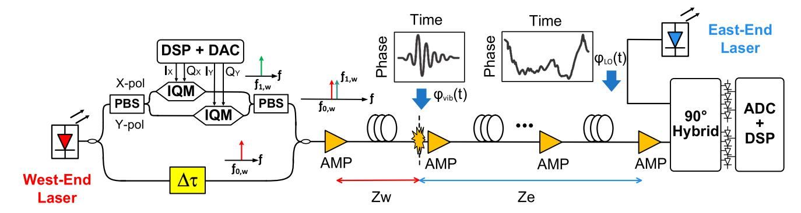

Fig. 1. Schematic of the proposed carrier laser PN retrieval method in a West-End to the East-End coherent transmission link. The West-End laser is split into two branches: (1) a conventional DP-IQM branch (upper) to generate a pilot tone at f1*,w* (data signals are omitted for simplicity), and (2) a pass-through branch (lower) delayed by Δτ to create a second pilot tone at f0*,w*. After recombination and amplification, the dual-pilot tone signal is transmitted over a multi-span fiber link and experiences a point wise vibration induced phase change ϕ*vib*(t). At the receiver, the East-End laser (LO) adds additional PN ϕ*L,e*(t) onto both pilot tones, which are then digitized and processed. The two insets illustrate how both the vibration induced phase change and LO laser PN act equally and simultaneously on both pilot tones. By performing a difference operation between the phase of two pilot tones and applying an inverse filter based on the Δτ, the West-End laser PN is retrieved and compensated. In a symmetric link configuration, the East-End laser PN can be retrieved similarly by transmitting signals in the opposite direction from East-End to West-End.

(DP-IQM) architecture to detect and localize various vibration profiles in an 80 km standard single mode fiber (SSMF) bidirectional link. We use an estimate of the carrier laser PN derived from co-propagating pilot tones, to increase measured perturbation signature SNR and reduce localization error from a forward propagation scheme.

The remainder of the paper is organized as follows. In Section II, we describe the carrier laser PN retrieval technique, and we show it is used for longitudinal sensing of perturbations. Section [III](#page-3-0) details the design of a bidirectional coherent transmission experimental setup to demonstrate the proposed method. In Section [IV,](#page-5-0) we present experimental results and analysis. Finally, we conclude this work in Section [V.](#page-9-0)

# II. CARRIER LASER PN RETRIEVAL

In the following, we describe the mathematical framework of the proposed method. Fig. 1 describes carrier laser PN retrieval for the West-to-East (W-E) direction (the East-to-West direction is identical). First, assume Ew (t) = Awej(2πf0*,w*t+ϕ*L,w*(t)) and Ee (t) = Aeej(2πf0*,e*t+ϕ*L,e*(t)) are the electrical fields of the W-End and E-End lasers shown in Fig. 1, wherein f0,w and f0,e are the analog frequencies of the W and E lasers respectively, and ϕL,w(t)and ϕL,e(t) are their respective temporal laser PNs. The carrier is split into two branches, where the upper branch undergoes standard DP-IQM modulation and the lower branch introduces a time delay Δτ . We note that this delay element can be incorporated without significant complexity within a standard coherent modem transmitter assembly. In the DP-IQM stage, a pilot tone is inserted digitally at f1,w which is Δ*f* away from the carrier frequency f0,w. Then, the DP-IQM branch and the pass through branch are combined, resulting in a field with both a modulated signal at f1,w = f0,w + Δf and a pass-through signal at f0,w. The two orthogonal pilot tones share the same carrier laser PN except for a time delay, ϕL,w(t − Δτ ) for f1,w and ϕL,w(t) for f0,w. Such a delay can also be applied to two orthogonal polarizations of the carrier [\[12\].](#page-9-0) The signal is then transmitted over a multi-span fiber link, as illustrated in Fig. 1 below.

When a point source perturbation acts on the transmission fiber, an optical phase variation ϕvib(t) is imprinted onto the phase of the carrier light as the inset shows. We assume that the position of the perturbation is at a distance zw away from West-End terminal and a distance ze from the East-End terminal, respectively. The corresponding propagation time in the fiber for the zw and ze distances are τw and τe, respectively. Neglecting chromatic dispersion (CD), which does not affect our analysis, the electrical fields at the E-receiver, Ef0*,w* (t) and Ef1*,w* (t), can

{2}------------------------------------------------

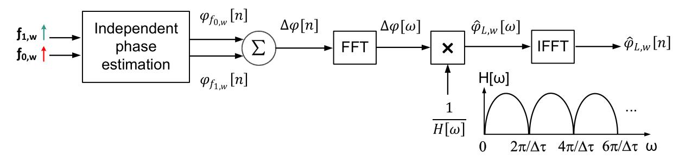

Fig. 2. Illustration of carrier laser PN retrieval in the receiver DSP, including independent carrier phase estimation of two demultiplexed pilot tones, differential operation, Fast Fourier Transform (FFT), multiplication of the inverse of the transfer function, and Inverse Fast Fourier Transform (IFFT) to calculate  $\varphi_{L,w}[n]$ . Also shown is  $H[\omega]$ , the interferometric transfer function (positive frequency side) based on the  $\Delta \tau$  inserted at the transmitter.

be written as a function of the two pilot tones  $f_{0,w}$  and  $f_{1,w}$ :

$$E_{f_{0,w}}(t) = (A_{f_{0,w}} + n_{f_{0,w}}(t)) \exp \{j (2\pi (f_{0,w} - f_{0,e}) t + \varphi_{vib} (t - \tau_e) + \varphi_{L,w} (t - \tau - \Delta \tau) + \varphi_{n,f_{0,w}}(t) - \varphi_{L,e}(t)) \},$$

$$E_{f_{1,w}}(t) = (A_{f_{1,w}} + n_{f_{1,w}}(t)) \exp \{j (2\pi (f_{1,w} - f_{0,e}) t + \varphi_{vib} (t - \tau_e) + \varphi_{L,w} (t - \tau) + \varphi_{n,f_{1,w}}(t) - \varphi_{L,e}(t)) \},$$

$$(2)$$

where  $A_i$  represents the amplitude,  $n_i(t)$  is the accumulated amplitude noise, and  $\varphi_{n,i}(t)$  is the accumulated PN excluding the laser phase contributions;  $i=f_{0,w}$ ,  $f_{1,w}$ . The last term in the exponential represents the LO PN from the E laser. After analog-to-digital conversion, the dual pilot tone signal is digitized and input to the DSP for further processing.

Fig. 2 illustrates the receiver DSP used to retrieve the carrier laser PN. The two pilot tones are identified in the frequency domain, extracted, and down-converted to baseband. Subsequently, the phase of each pilot tone is independently calculated and unwrapped using carrier laser phase recovery algorithms common in coherent modems. The digitally estimated phase of each tone,  $\varphi_{f_{0,w}}[n]$  and  $\varphi_{f_{1,w}}[n]$ , can then be written as:

$$\varphi_{f_{0,w}}[n] = \varphi_{L,w}[n - N - \Delta N] - \varphi_{L,e}[n] + \varphi_{n,f_{0,w}}'[n] + \varphi_{vib}[n - N_e],$$
(3)

$$\varphi_{f_{1,w}}[n] = \varphi_{L,w}[n-N] - \varphi_{L,e}[n] + \varphi_{n,f_{1,w}}[n] + \varphi_{vib}[n-N_e],$$
(4)

where N and  $\Delta N$  are the discrete equivalents of  $\tau$  and  $\Delta \tau$ .  $\varphi_{n,f_{0,w}}{}'[n]$  and  $\varphi_{n,f_{1,w}}{}'[n]$  include the accumulated PN in the transmission link. We define the differential phase as:

$$\Delta \varphi \ [n] = \varphi_{f_{0,w}} \ [n] - \varphi_{f_{1,w}} \ [n] = \varphi_{L,w} \ [n - N - \Delta N]$$
$$- \varphi_{L,w} \ [n - N] + \varphi_{n,f_{0,w}}{}' [n] - \varphi_{n,f_{1,w}}{}' [n] .$$
(5)

It is noted that the vibration phase  $\varphi_{vib}[n-N_e]$  and E-laser PN  $\varphi_{L,e}[n]$  are cancelled out because they appear in both  $\varphi_{f_{0,w}}[n]$  and  $\varphi_{f_{1,w}}[n]$ . Next, let  $\varphi_{L,w}[\omega] \overset{F}{\Leftrightarrow} \varphi_{L,w}[n]$  and  $\Delta \varphi[\omega] \overset{F}{\Leftrightarrow} \Delta \varphi[n]$  be discrete Fourier transform pairs, which can

be obtained via FFT. In the Fourier domain, the representation of the West-laser PN can be retrieved by:

$$\hat{\varphi}_{L,w}\left[\omega\right] = \Delta\varphi\left[\omega\right] \cdot H^{-1}\left[\omega\right] \approx \varphi_{L,w}\left[\omega\right], \tag{6}$$

where  $H\left[\omega\right]=e^{-j\omega N}-e^{-j\omega(N+\Delta N)}$  is the transfer function of the delay interferometer. Note that at the null positions of  $H[\omega]$ , the transfer function is adjusted to a non-zero small value to avoid enhancement of noise during inversion. Next, using an IFFT, we calculate the digital time domain representation of (6) to reconstruct the West-laser PN:

$$\hat{\varphi}_{L,w} [n] = \mathcal{F}^{-1} \{\hat{\varphi}_{L,w} [\omega]\} \approx \varphi_{L,w} [n].$$
 (7)

Subsequently, the retrieved west laser PN can be subtracted from (3):

$$\varphi_{new,f_{0,w}}[n] = \underbrace{\varphi_{L,w}[n - N - \Delta N]}_{measured} - \underbrace{\varphi_{L,w}[n - N - \Delta N]}_{retrieved} - \varphi_{L,e}[n] + \varphi_{n,f_{0,w}}'[n] + \varphi_{vib}[n - N_e].$$
(8)

Since laser PN  $\hat{\varphi}_{L,w}[n]$  is typically much larger than  $\varphi_{n,f_{0,w}}{}'[n]$  or  $\varphi_{n,f_{1,w}}{}'[n]$ , the approximation  $\varphi_{L,w}[n-N-\Delta N] \approx \hat{\varphi}_{L,w}[n-N-\Delta N]$  is valid. Consequently, the west laser PN is mitigated, leading to improved estimation of the received vibration phase.

Using the same principle as above, the east laser PN can be retrieved from the E-W transmission. In this way, both West and East carrier laser PN contributions to the vibration induced phase can be minimized. By reducing the laser PN floor, the system is capable of detecting smaller vibration amplitudes and achieving more precise localization due to decreased uncertainty in the estimation of the amplitudes of vibration phases. Once the W-E and E-W transmissions are time-synchronized, the vibration location is determined by cross-correlating the W-End and E-End detected vibration phases to determine the arrival time difference,  $\tau_w - \tau_e$ . The corresponding distance from the West-End to the induced vibration is calculated as  $z_w = \frac{1}{2} \left( L + \frac{c \left( \tau_w - \tau_e \right)}{n_g} \right)$ , where L is the total length of the W-E transmission fiber, c is the speed of light in the vacuum, and  $n_q$ is the group index of fiber. In the above, we omit data signals for simplicity, but the proposed carrier laser phase retrieval method remains compatible with the coherent optical fiber transmission systems, where pilot tones are commonly used to compensate

{3}------------------------------------------------

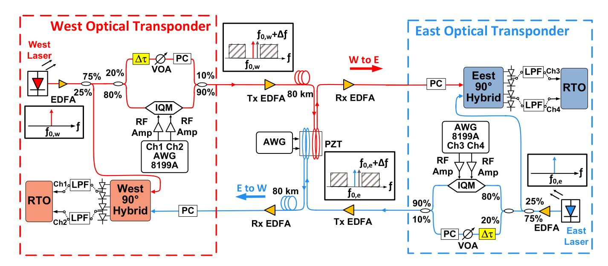

Fig. 3. Experimental setup for bidirectional coherent transmission and vibration sensing using the proposed method. In each direction, 60 Gbaud 16 QAM signals are transmitted together with the dual pilot tones while a point source vibration is introduced with a two-fiber PZT driven by a low-speed AWG. A 4 channel RTO synchronously captures the in-phase and quadrature components of the single-polarization coherent signals from the two directions. IQM: single polarization in-phase quadrature modulator; AWG: arbitrary waveform generator, PC: polarization controller, Δτ: time delay induced by a 100-m single mode fiber, VOA: variable optical attenuator, PZT: piezoelectric transducer, RTO: real-time oscilloscope, LPF: low-pass filter.

for signal imperfections such as IQ imbalance and frequency offset.

### III. EXPERIMENTAL DESIGN

Fig. 3 shows our bidirectional, dual fiber, single polarization coherent optical fiber transmission system testbed. The Westto-East (W-E) and East-to-West (E-W) directions are identical. Both the west end carrier laser and the east end LO laser have 2 kHz Lorentzian linewidths and output powers of 13 dBm. Each laser operates at 1550.1 nm, with a residual frequency offset of between 50 MHz and 200 MHz. To compensate for the insertion loss of the single polarization IQM, erbium-doped fiber amplifiers (EDFAs) are used to boost the laser output powers to 18 dBm. The resulting laser power-to-noise floor SNR is 55 dB measured by an optical spectrum analyser. Next, the light is split into a carrier branch (75%), and an LO branch (25%). Subsequently, a second splitter distributes power into two branches, one feeding a single polarization IQM (80%) and another one feeding the Δτ branch (20%) to create an ∼500 ns delay using 100 m of standard single mode fiber (SSMF). The 100 m delay line is enclosed within a cardboard box to largely mitigate the ambient acoustic noise present in the lab. This configuration is sufficient to demonstrate the experimental proof of concept. For a first commercial prototype, the delay line can be engineered to have a miniaturized footprint that is hermetically sealed to improve its stability to environmental noise. Additionally, in practical applications, the choice of delay length should consider the trade-off between increased exposure to acoustic noise and the enhanced sensitivity enabled by stronger differential phase term. The inserted delay, together with the IQM branch, beam splitter and combiner, produces a delay interferometer. At the IQM, we apply digital subcarrier multiplexing modulation using an AWG to generate two independent 30 Gbaud 16 QAM subcarrier signal bands (root raised cosine roll off factor: 0.05). The data rate at the IQM output is therefore 60 Gbaud, 240 Gbps. The Fig. [2](#page-2-0) inset shows two signal bands that are symmetrically positioned around the center frequency f0,w with a single side guard band of 1.5 GHz. The pilot tone is inserted at Δf = 62.5 MHz away from the center carrier frequency, f0,w. This offset is chosen to mitigate the crosstalk between pilot tones and keep the required RTO sampling rate low, which enables capturing of low frequency vibrations within constrained memory depth. The ratio between the power of the data signal and the digital pilot tone is set to 15 dB. In the delay branch, a polarization controller is used to align the state of polarization with that of the IQM branch. Next, a VOA in the delay branch equalize the branch powers at the output of 90/10 combiner, resulting in a total optical power of −14 dBm. Finally, the combined signal is amplified to 0 dBm by an EDFA and propagated along 80 km of SSMF. In the W-E direction a perturbation is introduced on the link at 81789 meters using a PZT (piezoelectric transducer) that serves to emulate a vibro-acoustic perturbation. This same perturbation is introduced in the E-W direction immediately following the transmitter output and before propagating along the 80 km.

Fig. [4\(a\)](#page-4-0) shows a device schematic, and Fig. [4\(b\)](#page-4-0) shows a picture of the transducer. Referring to Fig. [4\(a\),](#page-4-0) two separate SMF strands of equal length are wound around a PZT cylinder to ensure that the strength of the induced vibrations is the same irrespective of the transmission direction. We verified this calibration by analyzing the amount of induced phase variation for the light through each fiber coil on the PZT. At the coherent receiver, initially configured in a homodyne detection setup, we measured the beat signal between the laser propagating through the transducer and with respect to a pass through branch. We calculate the phase of the beat signal while applying a sinusoid

{4}------------------------------------------------

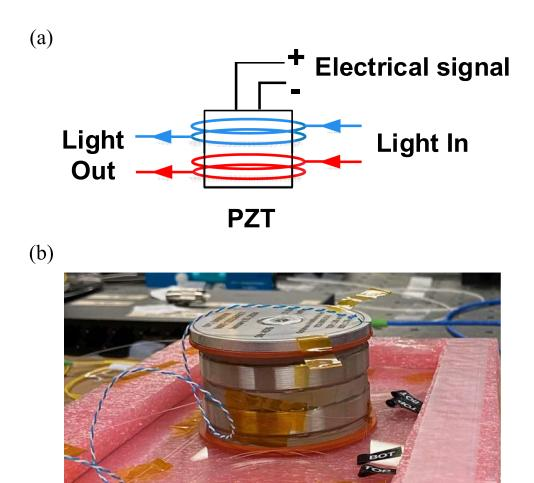

Fig. 4. (a) Schematic of the piezo electric driven vibro-acoustic transducer. Two SMF coils (described in red and blue) are tightly and uniformly wrapped around the PZT cylinder. An electrical signal applied to the PZT generates a controlled vibro-displacement along the radial axis, transducing to a phase-change on the light passing through two fiber branches. (b) Picture of the fabricated transducer device.

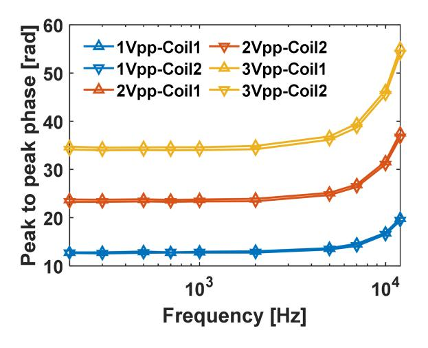

Fig. 5. Characterized peak-to-peak phase variation induced by the transducer device driven by sinusoid signals at different frequencies and peak-to-peak voltage.

signal to the transducer with peak-to-peak voltages ranging from 1 Vpp to 3 Vpp and frequencies ranging from 0.2 kHz to 12 kHz. In Fig. 5, the peak-to-peak phase variation versus frequency is plotted for the two coils with the PZT element driven by a sinusoid signal at three different peak-to-peak voltage values: 1 Vpp, 2 Vpp, and 3 Vpp. Both coils exhibit a nearly identical response and the resulting phase variation increases as the driving voltage increases. Below 5 kHz, the phase variation reaches approximately 13 rad, 24 rad, and 35 rad, for 1 Vpp, 2 Vpp, and 3 Vpp, respectively. As the frequency increases to between 5 kHz and 10 kHz, the level of phase variation rises because of the frequency response of the PZT cylinder. Combining these two fiber PZT devices and an arbitrary waveform generator (NI PXI-5422, 16 bits), which has output voltage between 5.64 mVpp and 12 Vpp and a sampling rate between 5 MSa/s and 200 MSa/s, we can emulate point source vibration events acting on a bidirectional fiber pair from milli-Hz to 100 kHz and introducing phase variations from milli-rads to 200 rads.

At the receiver, an EDFA is first used to increase the received optical power to 0 dBm. Next, a polarization controller is used to align the states of polarization of the incoming signal and the LO in the 90° hybrid. The outputs of each hybrid are then connected to two 50 GHz balanced photodiodes (BPDs) followed by an RTO that digitizes and quantizes the received electrical signals. In our setup, one 4-channel RTO receives both the west-east and east-west signals, allowing for time synchronous capture of vibrations travelling in both directions.

To verify the effectiveness of the proposed method for improving vibration detection and localization alongside data communication, we conduct the following series of experimental measurements.

## *A. Standalone Sensing*

In this measurement, we transmit CW tones in both directions and verify the denoising performance of the proposed method. The transducer is driven by wideband signals with center frequencies of 1 kHz (0.5 kHz bandwidth), 3 kHz (1 kHz bandwidth), and 10 kHz (2 kHz bandwidth) using driving voltages of 0.5 Vpp and 2 Vpp. The RTO sampling rate is set at 1 GSa/s and a 33 ms waveform is captured. In the offline processing, we extract the phase for each pilot tone and retrieve the W and E carrier laser PNs and subtract them from the measured vibration induced phase variation (as detailed in Fig. [2,](#page-2-0) Section [II\)](#page-1-0). Vibration localization is subsequently realized via cross correlation of the vibration phase in W-E and E-W directions. A digital bandpass filter with a Hann-window is applied, with its bandwidth matched to the target vibration bandwidth. The localization error and standard deviation of estimated locations are compared between results obtained with and without the proposed denoising method.

## *B. Sensing and Low Speed Data Transmission*

In the second measurement, we simultaneously transmit pilot tones and a low speed 16 QAM signal at 3 Gbaud. This setup enables concurrent capture of data signals and low frequency vibration signal using the limited RTO memory depth of 50×106 points. The RTO sample rate is set at 5 GSa/s and a drive signal at 10 kHz (2 kHz bandwidth) and 0.5 Vpp is applied to the transducer. In this measurement we can capture 10 ms of data. In the offline processing, we employ conventional coherent DSP to recover the 16 QAM data symbols while simultaneously applying the method described above in the prior measurement.

### *C. Sensing and High-Speed Data Transmission*

In the third measurement, the symbol rate is increased to 60 Gbaud 16 QAM to demonstrate the efficacy of the proposed sensing technique in a high-speed transmission channel. 6 combinations of drive signals are applied to the transducer: 0.5 Vpp and 2 Vpp drive voltages, and 1 kHz (0.5 kHz bandwidth), 3 kHz (1 kHz bandwidth), and 10 kHz (2 kHz bandwidth) center

{5}------------------------------------------------

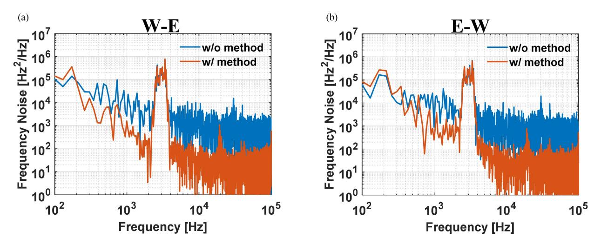

Fig. 6. Frequency noise power spectral density of the vibration-induced phase change calculated from the measured temporal PN at E-End and W-End receivers with and without the effect of the denoising method for (a) W-E and (b) E-W direction.

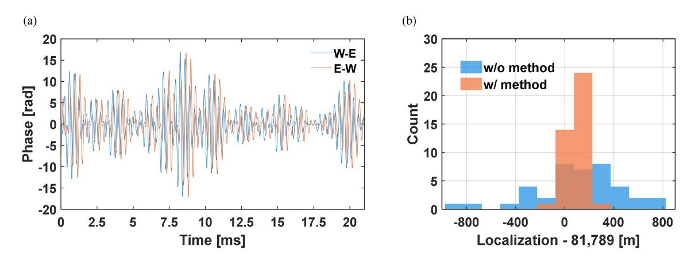

Fig. 7. (a) Extracted temporal vibration phase waveform of the 2Vpp with the method and band pass filter for each transmission direction. (b) Localization results over 40 captures between with and without the method.

frequencies. A phase variation consistent with fiber tampering is also emulated by driving the transducer with 3 Vpp at frequencies between 0.1–10 kHz. 60 Gbaud 16 QAM waveforms sampled at 80 GSa/s are first captured and the system BER performance is evaluated. Conventional coherent receiver digital signal processing is employed to recover traffic. Subsequently, we evaluate the sensing performance by inserting four 200 MHz cut-off low pass filters (LPFs) between the four BPD outputs and the RTO inputs to avoid spectrum aliasing. Also, the sampling rate is lowered to 1 GSa/s. By filtering the data and lowering the sampling rate we capture a 33 ms in duration waveform per the standalone sensing measurement.

## IV. EXPERIMENTAL RESULTS

#### *A. Standalone Sensing*

To verify the concept, we first verify the performance of the proposed method in the CW transmission case. Here, we introduce at 3 kHz center frequency and 1 kHz bandwidth using a low-speed signal generator. The peak-to-peak voltage swing of the generated signal is set to 2 Vpp. It is continuously introduced onto the transducer while the RTO captures the waveform at the receivers. The RTO sampling rate is 1 GSa/s. Following the procedure described in Section [II,](#page-1-0) we retrieve both lasers PN in the bidirectional coherent system. The estimated lasers PN is subsequently subtracted from the overall measured phase variation at the west and east receivers.

In Fig. 6, for each direction, we show two overlaid frequency noise spectra of the phase perturbation, demonstrating the effect of the denoising method. The blue traces show the original spectra while the orange traces show the spectra resulting from applying the proposed method. At 3 kHz, the noise level around the target vibration signal is reduced by more than one order of magnitude, a significant improvement in SNR. This improvement in SNR increases the detection sensitivity for both the W-E and E-W transmission directions.

In Fig. 7(a), we show the recovered time domain phase waveforms of the 3 kHz vibration after applying the proposed denoising method. A digital bandpass filter with a Hann-window is applied at the same frequency ranges of the 3-kHz vibration. The 3 kHz vibration induces approximately a 30 rad phase variation, with equal amplitudes observed in both transmission directions.

{6}------------------------------------------------

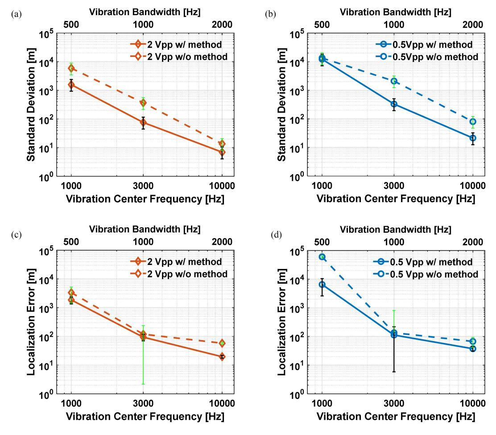

Fig. 8. Vibration localization performance with and without the method over 40 captures when only CW tones are transmitted. Standard deviation of estimated locations versus vibration center frequency and bandwidth at (a) 2 Vpp and (b) 0.5 Vpp. Localization error versus vibration center frequency and bandwidth at (c) 2 Vpp and (d) 0.5 Vpp. The error bar indicates 95% confidence interval for the results obtained over 40 measurements.

Due to the placement of the transducer near the east receiver, the vibration traveling in the W-E direction arrives earlier, while the vibration in the E-W direction exhibits a noticeable time lag. This relative time shift can be determined by identifying the peak of the cross-correlation between the W-E and E-W waveforms. Using a group index for the SSMF of 1.4682 at 1550 nm, we calculate the corresponding location of the vibration, zw. The actual vibration location is measured by an OTDR using the same index, and we determine it to be 81789 m after accounting for the length of the 80 km spool, patch cords, optical amplifiers, and polarization controllers.

To evaluate the localization performance, we repeat the measurement 40 times and calculate the vibration location with and without the proposed denoising method. The localization results are compared in Fig. [7\(b\).](#page-5-0) The orange-binned data, obtained by applying the proposed method, shows a narrower spread compared to the blue-binned data obtained without the method. With the proposed method, the standard deviation of localization results for the 3 kHz vibration is reduced from 365 m to 76 m, corresponding to a 79% improvement in localization precision. We also calculated the localization error, defined as the absolute value of the mean difference between the measured and actual location. When using the proposed method, the localization error is reduced from 119 m to 94 m corresponding to a 21% improvement in accuracy.

Next, we perform a similar investigation at different vibration frequencies. The center frequency of the vibration is varied between 1 kHz, 3 kHz, and 10 kHz and the driving voltage is set to either 0.5 Vpp or 2 Vpp. From Fig. 8(a) and (b), we observe that the standard deviation of localization results decreases as the vibration frequency increases. This trend can be attributed to several factors, including the stronger response of PZT device at higher frequencies, decreasing laser frequency noise floor with frequency, and the increased number of captured vibration signal cycles within the same RTO memory length. Additionally, the variation in vibration bandwidth can also impact the localization results as it determines the full width at half maximum of the cross-correlation peak. When the proposed method is applied, a reduction of the standard deviation is observed across vibration frequencies from 1 kHz to 10 kHz. This improvement results from the increased vibration SNR provided by the denoising method. For example, when the driving voltage is 0.5 Vpp, at 3 kHz the standard deviation is decreased from 2106 m to 332 m. It is important to note that the 0.5 Vpp perturbation at 3 kHz induces approximately an 8 rad phase swing which is overwhelmed by the lasers' PN. The substantial improvement

{7}------------------------------------------------

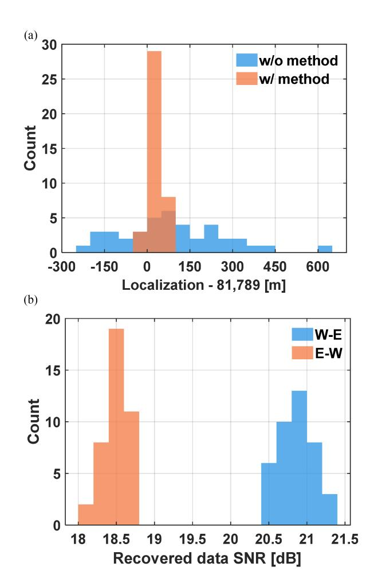

Fig. 9. (a) 10 kHz vibration localization results and (b) simultaneously transmitted 3 Gbaud 16 QAM data signal SNR over 80 km SSMF.

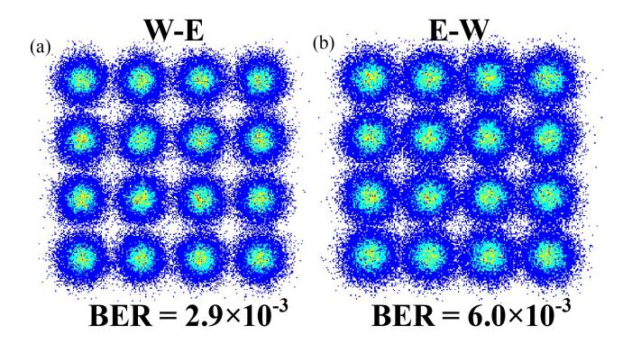

Fig. 10. Constellation diagrams of recovered 60-Gbaud 16-QAM for (a) W-E and (b) E-W transmission direction after 80 km of SMF. Error-free transmission is demonstrated.

indicates that the method brings large performance improvement even for an extremely small perturbation.

From Fig. [8\(c\)](#page-6-0) and [\(d\)](#page-6-0), we present the localization error versus the center frequency of the applied vibration. Similar to the trend observed in standard deviation, a reduction of localization error is observed with the increase of the vibration frequencies. This improvement is attributed to stronger vibration signals at higher driving signal frequencies of the PZT and slightly lower laser frequency noise floor at those frequencies. Importantly, in these test cases, the method provides more accurate estimation of vibration's location due to the significant improvement in vibration SNR. The lowest localization error is obtained for a 2 Vpp vibration at 10 kHz, where the error decreases from 58 m to 20 m, representing approximately a 66% reduction after applying the proposed method.

#### *B. Sensing and Low Speed Data Transmission*

In this section, we validate the feasibility of simultaneous data transmission and vibration localization in the proposed bidirectional coherent optical fiber transmission system. We concurrently capture and process data signals and vibration signals. Due to the limited RTO memory depth, we transmit low-speed 3 Gbaud 16 QAM data signals at the W-End and E-End transmitters and the sampling rate of the RTO is set to 5 GSa/s at the receivers. A guard band is applied in relation to the data signal (0.5 GHz single-sided). In this measurement, we introduce a vibration with a 10 kHz center frequency and 2 kHz bandwidth. For the data-carrying signal, we employ conventional coherent receiver DSP to linearly compensate for fiber chromatic dispersion and transceiver bandwidth limitations. The two pilot tones are identified and down-converted to baseband to extract their unwrapped phase. In the communication DSP, the phase of the digitally inserted pilot is used to correct phase rotation on the 16-QAM data symbols. In the sensing DSP, the unwrapped phase of both the digitally inserted pilot tone and the analog inserted center frequency pilot tone are utilized to retrieve the carrier laser PN based on the same procedures outlined in Section [II.](#page-1-0) Then the W-E and E-W vibration phases are crosscorrelated to produce an estimation of the vibration location. In Fig. 9(a), the localization of the vibration over 40 captures is plotted. Results with (blue-binned) and without (orange-binned) the method are shown. The standard deviation is reduced from 185 m to 21 m. Correspondingly, the localization error is reduced from 92 m to 34 m. These results put forward the efficacy of the proposed method when data is simultaneously transmitted on the fiber. In Fig. 9(b), the 16 QAM signal SNR after 80 km transmission is presented, with values of ∼21 dB for W-E transmission and ∼19 dB for E-W transmission. The difference between the SNR in the two directions is due to differences in the half-wave voltage of the IQMs and responsivity of the BPDs used in the two transceivers. The results presented show that the proposed method is compatible with data communication transmission and, moreover, it can improve the precision and accuracy of the vibration localization.

## *C. Sensing and High-Speed Data Transmission*

To experimentally demonstrate the compatibility of the proposed method and high-speed data transmission at the rate of commercial transponders, we increase the 16 QAM symbol rate to 60 Gbaud, and we set the single-sided guard band to 1.5 GHz. A 10 kHz 2 Vpp signal is applied to the transducer while the highspeed signals waveforms are captured at the RTO. The recovered 60 Gbaud 16 QAM constellations are shown in Fig. 10. The bit error rates (BER) are under 20% HD-FEC threshold (1.5e-2) for

{8}------------------------------------------------

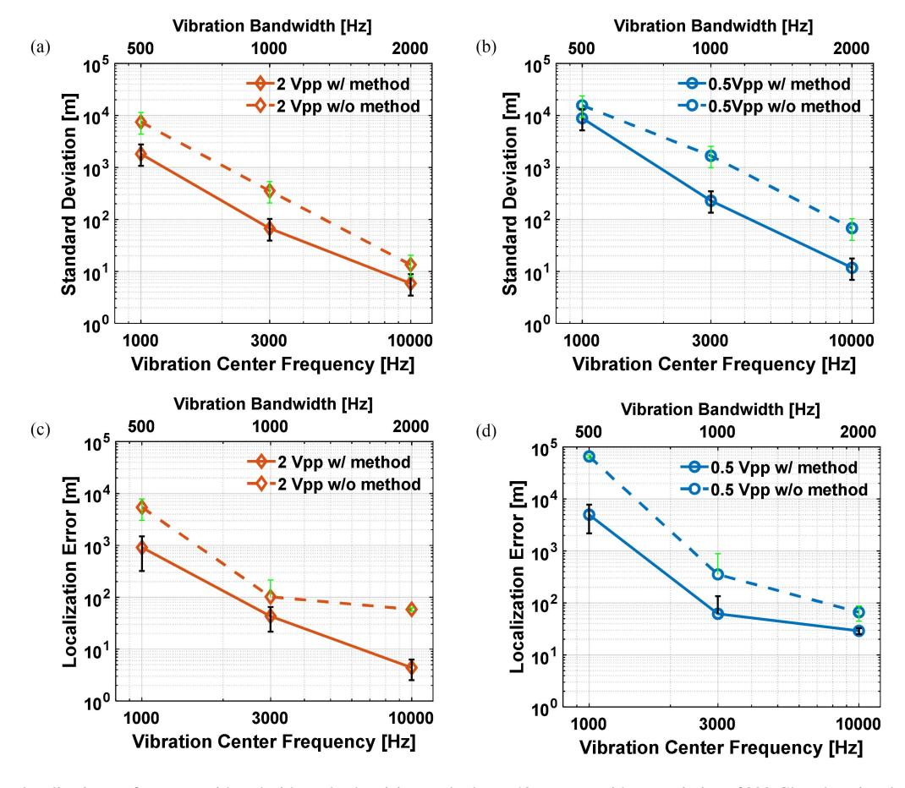

Fig. 11. Vibration localization performance with and without the denoising method over 40 captures with transmission of 200-Gbps data signal. Standard deviation of estimated locations versus vibration center frequency and bandwidth at (a) 2 Vpp and (b) 0.5 Vpp. Localization error versus vibration center frequency and bandwidth at (a) 2 Vpp and (b) 0.5 Vpp. The error bar indicates 95% confidence interval for the results obtained over 40 measurements.

W-E direction and under 6.7% HD-FEC threshold (3.8e-3) for E-W direction. These data rates correspond to a net 200 Gbps single-polarization transmission, suitable for commercial 400 Gbps dual-polarization coherent transponders.

Next, we install four inline/coax LPFs with a 200 MHz 3 dB bandwidth in order to mitigate the effects of aliasing and capture low-frequency vibrations. The RTO sampling rate is changed to 1 GSa/s while maintaining the 200 Gbps 16 QAM transmission over the 80 km bidirectional SSMF. Like the standalone sensing case, vibration frequency ranges from 1 kHz to 10 kHz with driving voltages of either 0.5 Vpp or 2 Vpp are applied to the transducer. The vibration localization results are summarized in Fig. 11. The results are similar to the ones obtained in the CW transmission cases. The application of the proposed method leads to lower standard deviation and localization error for vibration frequencies between 1 kHz and 10 kHz. For instance, at 3 kHz and 2 Vpp, the proposed method reduces the localization error from 102 m to 43 m, representing a 58% localization accuracy improvement compared to without the method. Notably, at 10 kHz and 2 Vpp vibration, the method achieves the smallest localization error of 4 m, corresponding to a 93% error reduction compared to 58 m obtained without the method.

Finally, we introduce a vibration profile reported in [\[6\]](#page-9-0) that emulates a fiber tampering event during the transmission of

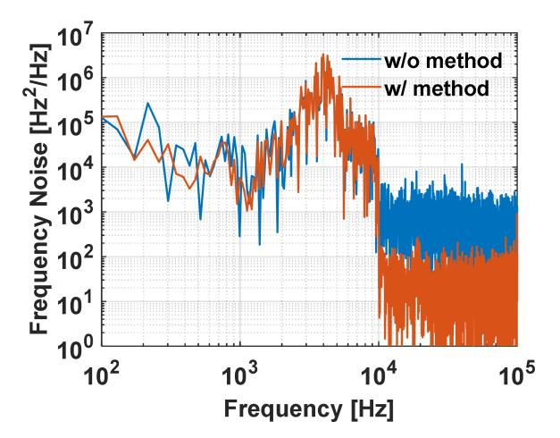

Fig. 12. Vibration spectra for an emulated tampering event with and without the effect of the method in the 200 Gbps bidirectional coherent transmission system.

the 200 Gbps traffic. The emulated perturbation induced phase variation spectra is shown in Fig. 12. We limit the frequency content to between 0.1 kHz and 10 kHz in this demonstration. The blue trace illustrates the detected perturbation without the method, whereas the orange trace shows results after using the proposed denoising method. A clear noise floor reduction is 

{9}------------------------------------------------

observable for frequencies beyond 10 kHz upon applying the method. Repeating the same measurements and processing, we improve the localization by reducing the standard deviation from 68 m to 16 m and the localization error from 35 m to 24 m.

## V. CONCLUSION

We propose and experimentally demonstrate a method for recovering carrier laser phase noise to enhance vibration detection and localization in optical networks. This method enables higher sensitivity and better precision fiber sensing on multispan fiber transmission links. The required enabling hardware modification can be integrated into coherent modems used in coherent optical fiber transmission systems. We experimentally verify the method's effectiveness for vibration detection and localization in a net 200 Gbps single-polarization bidirectional coherent optical fiber transmission system. With this noise reduction method, and for a vibration at 3 kHz the localization error is decreased from 102 m to 43 m (58% reduction) and the standard deviation of estimated locations is reduced from 355 m to 67 m (81% reduction) compared to results without the method.

## ACKNOWLEDGMENT

The authors are grateful to CMC Microsystems and EXFO for their help.

#### REFERENCES

[1] E. Ip et al., "DAS over 1,007-km hybrid link with 10-Tb/s DP-16QAM Copropagation using frequency-diverse chirped pulses," *J. Lightw. Technol.*, vol. 41, no. 4, pp. 1077–1086, Feb. 2023, doi: [10.1109/JLT.2022.3219369.](https://dx.doi.org/10.1109/JLT.2022.3219369)

- [2] E. Ip, Y.-K. Huang, T. Wang, Y. Aono, and K. Asahi, "Distributed acoustic sensing for datacenter optical inter-connects using self-homodyne coherent detection," in *Proc. Opt. Fiber Commun. Conf. Exhib.*, San Diego, CA, USA, 2022, pp. 1–3, doi: [10.1364/OFC.2022.W1G.4.](https://dx.doi.org/10.1364/OFC.2022.W1G.4)
- [3] H. He et al., "Integrated sensing and communication in an optical fibre," *Light: Sci. Appl.*, vol. 12, no. 25, Jan. 2023, Art. no. 25, doi: [10.1038/s41377-022-01067-1.](https://dx.doi.org/10.1038/s41377-022-01067-1)
- [4] S. Guerrier et al., "Field trial of high-resolution distributed fiber sensing over multi-core fiber in metropolitan area with construction work detection using advanced MIMO-DAS," in *Proc. Opt. Fiber Commun. Conf. Exhib.*, San Diego, CA, USA, 2023, pp. 1–3, doi: [10.1364/OFC.2023.W1J.5.](https://dx.doi.org/10.1364/OFC.2023.W1J.5)
- [5] G. A. Wellbrock et al., "Field trial of vibration detection and localization using coherent telecom transponders over 380 km link," in *Proc. Opt. Fiber Commun. Conf. Exhib.*, San Diego, CA, USA, 2021, pp. 1–3, doi: [10.1364/OFC.2021.F3B.2.](https://dx.doi.org/10.1364/OFC.2021.F3B.2)
- [6] E. Ip et al., "Vibration detection and localization using modified digital coherent telecom transponders," *J. Lightw. Technol.*, vol. 40, no. 5, pp. 1472–1482, Mar. 2022, doi: [10.1109/JLT.2021.3137768.](https://dx.doi.org/10.1109/JLT.2021.3137768)
- [7] Y. Yan et al., "Simultaneous communications and vibration sensing over a single 100 km deployed fiber link by fiber interferometry," in *Proc. Opt. Fiber Commun. Conf. Exhib.*, San Diego, CA, USA, 2023, pp. 1–3, doi: [10.1364/OFC.2023.W1J.4.](https://dx.doi.org/10.1364/OFC.2023.W1J.4)
- [8] Y. Yan, F. N. Khan, B. Zhou, A. P. T. Lau, C. Lu, and C. Guo, "Forward transmission based ultra-long distributed vibration sensing with wide frequency response," *J. Lightw. Technol.*, vol. 39, no. 7, pp. 2241–2249, Apr. 2021, doi: [10.1109/JLT.2020.3044676.](https://dx.doi.org/10.1109/JLT.2020.3044676)
- [9] J. Tang et al., "Distributed vibration sensing and simultaneous selfhomodyne transmission of single-carrier net 5.36 Tb/s signal using 7-core fiber," in *Proc. Opt. Fiber Commun. Conf. Exhib.*, San Diego, CA, USA, 2024, pp. 1–3, doi: [10.1364/OFC.2024.M2K.1.](https://dx.doi.org/10.1364/OFC.2024.M2K.1)
- [10] Y. Hao et al., "Delayed self-heterodyne interferometry enabling 4.8 Tb/s coherent transmission and simultaneous vibration sensing with 100 kHz linewidth ECLs," in *Proc. Asia Commun. Photon. Conf. Int. Conf. Inf. Photon. Opt. Commun.*, Beijing, China, 2024, pp. 1–4, doi: [10.1109/ACP/IPOC63121.2024.10810043.](https://dx.doi.org/10.1109/ACP/IPOC63121.2024.10810043)
- [11] H. Zhou et al., "Ultrasonic phase extraction method for co-cable identification in coherent optical transmission systems," *Chin. Opt. Lett.*, vol. 22, no. 10, Oct. 2024, Art. no. 100601.
- [12] Y. Hu et al., "Digital vibration detection and localization using carrier laser phase noise retrieval in a conventional coherent transponder," in *Proc. Opt. Fiber Commun. Conf. Exhib.*, San Diego, CA, USA, 2024, pp. 1–3, doi: [10.1364/OFC.2024.W1B.6.](https://dx.doi.org/10.1364/OFC.2024.W1B.6)