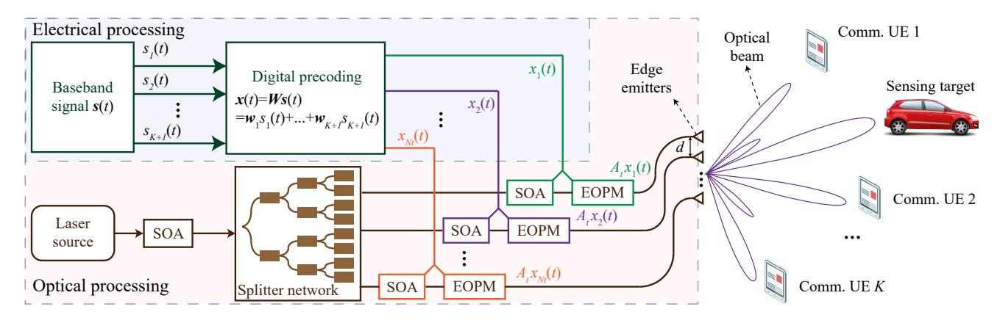
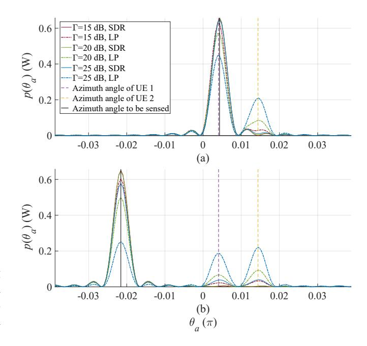
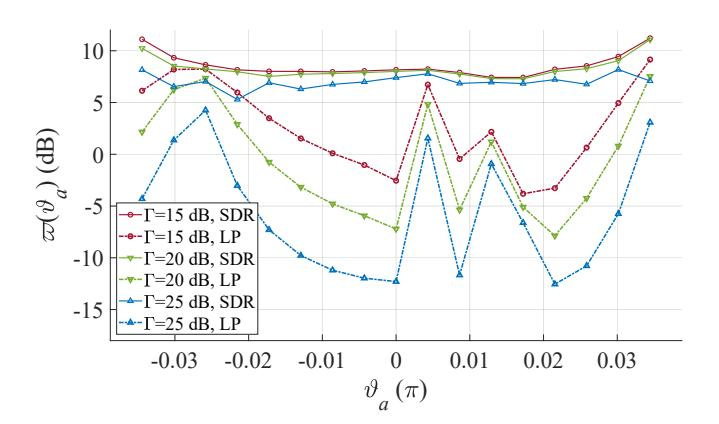
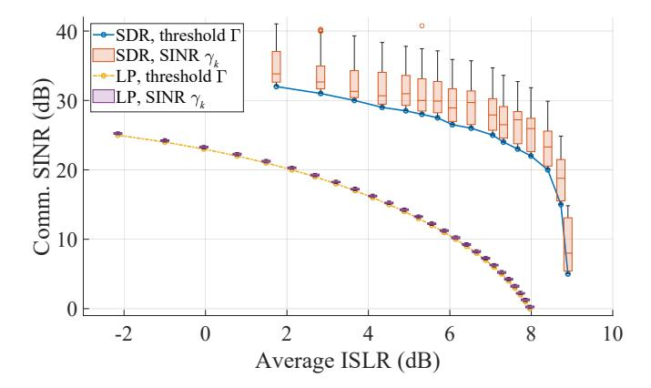

{0}------------------------------------------------

# Optimal Beamforming for Optical Wireless Integrated Sensing and Communication Based on Optical Phased Array

Yunfeng Wen1 , Fang Yang1 , Jian Song1,2, and Zhu Han3 1Department of Electronic Engineering, Tsinghua University, Beijing National Research Center for Information Science and Technology (BNRist), Beijing 100084, P. R. China 2Shenzhen International Graduate School, Tsinghua University, Shenzhen 518055, P. R. China 3Department of Electrical and Computer Engineering, University of Houston, Houston, TX 77004 USA

*Abstract*—Optical wireless integrated sensing and communication (OW-ISAC) is emerging as a crucial technology to complement and augment its radio-frequency counterpart. In this paper, we propose an optical phased array (OPA)-based OW-ISAC framework to serve multiple communication user equipments and conduct sensing for the direction of interest simultaneously. The system model for OPA-based OW-ISAC is introduced, where the optical beamforming process, atmospheric channel, and operational principles of communication and sensing subsystems are elaborated. In addition, the signal-to-interferenceplus-noise ratio and integrated sidelobe ratio are derived as the performance metrics to evaluate OW-ISAC. Subsequently, an optimization problem for beamforming is formulated and resolved, which optimizes the sensing performance metric under the constraint of communication quality. Finally, numerical results substantiate the effectiveness of the proposed OPA-based OW-ISAC framework, while the tradeoff between communication and sensing performance metrics is also revealed.

*Index Terms*—Integrated communication and sensing, optical wireless communication, optical phased array, beamforming, integrated sidelobe ratio.

## I. INTRODUCTION

Integrated sensing and communication (ISAC) has garnered considerable attention from academia and industry in recent years. As communication and sensing (C&S) systems step from separation to integration, similar trends can be observed during their evolution [1]. One is the escalating adoption of higher carrier frequencies to broaden available bandwidth. The other is the expanded antenna arrays to allow for more degrees of freedom (DoF) and superior reliability in beamforming [2]. While a giant leap has been witnessed in the radio-frequency (RF)-ISAC, the emergence of optical wireless (OW)-ISAC stands out as a promising alternative. With expansive unlicensed bandwidth and short wavelengths, OW-ISAC can deliver Gbps-class communication and conduct precise sensing down to the centimeter level simultaneously, which is anticipated to complement and augment its RF counterpart [3].

Even though conventional optical sensing methods demand the cooperation of targets to be sensed, e.g., visible light positioning [4], OW-ISAC is not restricted to the interplay with cooperative targets. In contrast, OW-ISAC can be implemented on light detection and ranging (LiDAR) to conduct active sensing for both cooperative and uncooperative targets simultaneously [5]. Enlightened by the concept of active sensing, various OW-ISAC schemes have been proposed to enable simultaneous communication and sensing, such as phase-shift laser ranging with communication [6], combined linear frequency modulation and continuous phase modulation (LFM-CPM) [7], and direct-current-biased optical orthogonal frequency division multiplexing (DCO-OFDM)-based ranging [8].

However, despite the abundant research on time-domain waveform design, angle-domain sensing in active OW-ISAC remains an unresolved frontier, which necessitates the integration of beam steering techniques. Traditional optical beam steering techniques often face limitations in steering speed, physical footprint, and robustness due to their mechanical components. Instead, an optical phased array (OPA) offers a solid-state solution for precise and agile beam control, thereby outperforming mechanical beam steering in reliability and versatility [9]. As a pivotal technology for future LiDARs [10] and optical wireless communication (OWC) [11], OPA serves as an enabler for OW-ISAC to provide angle-domain sensing capabilities, and an OPA-based OW-ISAC prototype has been demonstrated recently [12].

In this paper, we propose an OPA-based OW-ISAC framework, and our specific contributions are listed as follows. First, the system model is introduced for OPA-based OW-ISAC, which incorporates an optical beamforming process to serve multiple communication user equipments (UE) and conduct sensing simultaneously. Second, the C&S operational principles are elaborated to derive the performance metrics, i.e., signal-to-interference-plus-noise ratio (SINR) for communication and integrated sidelobe ratio (ISLR) for sensing. Third, an optimization problem is formulated and resolved to achieve optimal beamforming for OW-ISAC, which optimizes the sensing performance metric under the constraint of communication quality. Numerical results substantiate the effectiveness of the proposed OPA-based OW-ISAC framework, while the tradeoff between communication and sensing performance metrics is also revealed.

The remainder of this paper is organized as follows. Section II presents the system model for OW-ISAC, including OPA-based beamforming, atmospheric channel model, and C&S operational principles. Subsequently, C&S performance metrics are derived in Section III, based on which the optimization problem is formulated and resolved. Afterward, numerical results are illustrated in Section IV, and finally the conclusion is drawn in Section V.

{1}------------------------------------------------

Fig. 1. Beamforming process of the proposed OPA-based OW-ISAC system.

#### II. SYSTEM MODEL FOR OPA-BASED OW-ISAC

In this section, the system model of the proposed OW-ISAC framework is introduced, where an OPA is adopted as the OW-ISAC transmitter. As illustrated in Fig. 1, the OPA is composed of a uniform line array with  $N_t$  edge emitters in the horizontal plane and serves K communication UEs simultaneously. Besides, the OPA also conducts sensing for the direction of interest like a scanning LiDAR. To lay the foundation for OW-ISAC, the principles of OPA beamforming, the atmospheric channel, the communication sub-system and the sensing sub-system are elaborated in Sections II-A, II-B, II-C, and II-D, respectively.

#### A. OPA-Based Optical Beamforming

Fig. 1 indicates that the beamforming process of OPA relies on both electrical precoding and optical modulation. In the electrical part, the baseband signal vector  $s(t) \in \mathbb{C}^{K+1}$  consists of K+1 independent and normalized signals  $\{s_1(t), \cdots, s_{K+1}(t)\}$  generated by an identical OW-ISAC scheme, e.g. LFM-CPM [7]. Among the baseband signals,  $s_k(t)$ ,  $k=1,\cdots,K$  corresponds to the k-th communication UE, while  $s_{K+1}(t)$  serves as the sensing signal. Denoting the precoding matrix as  $\mathbf{W} = [\mathbf{w}_1, \cdots, \mathbf{w}_{K+1}] \in \mathbb{C}^{N_t \times (K+1)}$ , the baseband signal s(t) is precoded by a digital precoder to form the electrical signal vector  $\mathbf{x}(t) \in \mathbb{C}^{N_t}$ , i.e.,

$$\boldsymbol{x}(t) = \boldsymbol{W}\boldsymbol{s}(t) = \sum_{k=1}^{K+1} \boldsymbol{w}_k s_k(t). \tag{1}$$

In the optical part, the optical signal is generated by a coherent laser source, whose amplitude is first adjusted by a semiconductor optical amplifier (SOA). Subsequently, a star-coupler-based splitter network splits the optical signal into  $N_t$  branches uniformly, each of which contains an SOA and an electro-optic phase modulator (EOPM). Under the control of the precoded electrical signal  $x_{n_t}(t)$ , the SOA and EOPM in the  $n_t$ -th branch modulate the magnitude and phase of optical signal independently [13]. Once the electrical signal vector x(t) is loaded on the optical signal, the edge emitters are ready to transmit optical beams to free space.

To derive the far-field beampattern generated by the OPA, the light field at azimuth angle  $\theta_a$  can be expressed as

$$E(\theta_a, t) = \sum_{n_t=1}^{N_t} A_t x_{n_t}(t) \exp(jk_0 (n_t - 1) d \sin(\theta_a)), \quad (2)$$

where  $A_t$ ,  $k_0$ , and d denote the magnitude of light field in each branch, optical wavenumber, and distance between adjacent edge emitters, respectively. For notational convenience, the steering vector for  $\theta_a$  is defined as

$$\boldsymbol{h}(\theta_a) = \begin{bmatrix} 1, \exp(jk_0 d \sin(\theta_a)), \\ \cdots, \exp(jk_0 (N_t - 1) d \sin(\theta_a)) \end{bmatrix}^T,$$
(3)

based on which the expression of far-field light field is recast as  $E(\theta_a, t) \triangleq A_t \boldsymbol{h}(\theta_a)^{\mathcal{H}} \boldsymbol{x}(t)$ .

Specifically, if the optical beam is steered to  $\vartheta_a$ , i.e.,  $\boldsymbol{x}(t) = \boldsymbol{h}(\vartheta_a)$ , the light field intensity can be written as

$$p(\theta_a) = \frac{A_t^2 \sin^2 \left( N_t k_0 d \left( \sin \left( \theta_a \right) - \sin \left( \theta_a \right) \right) / 2 \right)}{\sin^2 \left( k_0 d \left( \sin \left( \theta_a \right) - \sin \left( \theta_a \right) \right) / 2 \right)}, \quad (4)$$

whose main lobe achieves a maximum value at  $\vartheta_a$  with a full-width-half-maximum (FWHM) divergence angle of [10]

$$\Delta\theta_a\left(\vartheta_a\right) = \frac{\sqrt{3}\pi}{N_t k_0 d\cos\left(\vartheta_a\right)}.$$
 (5)

Meanwhile, a significant difference between OPA and its RF counterpart lies in that the distance d between adjacent emitting elements is larger than a half of the optical wavelength  $2\pi/k_0$  to avoid crosstalk [10]. Therefore, while the main lobe is steered to  $\vartheta_a$ , supernumerary grating lobes are also transmitted to [14]

$$\vartheta_g = \arcsin\left(\sin\left(\vartheta_a\right) + \frac{2m\pi}{k_0 d}\right), \quad m = \pm 1, \pm 2, \cdots.$$
 (6)

The grating lobes cause spatial ambiguity for optical beamforming, and previous OPA literatures generally exploit the main lobe only. As a result, the field of view (FOV) for OPA is limited, i.e.,

$$-\theta_{\text{FOV}} \le \theta_a \le \theta_{\text{FOV}}, \quad \theta_{\text{FOV}} = \arcsin\left(\frac{\pi}{k_0 d}\right).$$
 (7)

{2}------------------------------------------------

#### B. Channel Model

For terrestrial scenarios, the light field propagates through an atmospheric channel and reaches a UE or a target if an line-of-sight (LoS) link exists. Among the impairments of atmospheric propagation, misalignment and geometric losses are intrinsically included in (2), while the atmospheric attenuation and turbulence are modelled as follows.

1) Atmospheric attenuation: For the near-infrared wavelength ranges, the optical energy may be absorbed and scattered by particles like rain, snow, fog, dust, aerosol, smoke, etc. Among these detrimental environmental conditions, fog and haze have the most significant impact on the atmospheric attenuation as their particle sizes are close to the near-infrared wavelengths. Supposing that the optical link distance is D, the attenuation brought by fog and haze can be derived by the Beer-Lambert law as [15]

$$L_a(D) = 10^{-\alpha D/10000},$$
 (8)

where the exponential attenuation factor  $\alpha$  (in dB/km) can be obtained by the Nebuloni visibility model.

2) Atmospheric turbulence: The inhomogeneities in the atmospheric temperature and pressure arise from solar heating and wind, which result in the variations of refractive index along the optical path. In consequence, the optical link suffers from the scintillation brought by the atmospheric turbulence, i.e., random fluctuations of the received light field intensity. For weak turbulence, the scintillation can be modelled by the log-normal distribution, which can be depicted by a stochastic scintillation term  $L_t\left(D\right)$  as

$$p(L_t; D) = \frac{1}{L_t \sqrt{2\pi\sigma_t^2}} \exp\left(-\frac{1}{2\sigma_t^2} \left(\ln\left(L_t\right) + \frac{\sigma_t^2}{2}\right)^2\right),$$
(9)

where the scintillation index  $\sigma_t^2(D)$  can be obtained by the Rytov approximation as [16]

$$\sigma_t^2(D) \approx 1.23 k_0^{7/6} D^{11/6} C_n^2,$$
 (10)

with  $C_n^2$  denoting the refractive index.

#### C. Communication Sub-system

Denoting the distance and azimuth angle of the k-th UE as  $r_k$  and  $\theta_{a,k}$ , respectively, the received light field can be calculated by incorporating the channel model into (2), i.e.,

$$E_{c,k}(t) = L(r_k)^{1/2} E\left(\theta_{a,k}, t - \frac{r_k}{c}\right),$$
 (11)

where  $L\left(r_{k}\right)=L_{a}\left(r_{k}\right)L_{t}\left(r_{k}\right)$  is the total atmospheric loss, and c denotes the speed of light. After the light field propagates through a LoS atmospheric channel and reaches the k-th UE, a photodiode (PD) is adopted to detect  $E_{c,k}\left(t\right)$  incoherently. Therefore, assuming that perfect time synchronization has been achieved between the transmitter and the k-th UE, the received signal of the k-th UE follows a square law as

$$y_k(t) = \mathcal{R}_c |E_{c,k}(t + r_k/c)|^2 + v_{c,k}(t),$$
 (12)

where  $\mathcal{R}_c$  denotes the responsivity of PD, and the noise term  $v_{c,k}(t)$  arises from both the shot noise in PD and the thermal noise in the circuit.

#### D. Sensing Sub-system

In addition to the impairments of atmospheric propagation, the channel model for sensing also incorporates the reflection of targets in a specific scene. For a horizontally deployed OPA, the distances to targets  $r\left(\theta_{a}\right)$  and reflectivities of targets  $\Re_{f}\left(\theta_{a}\right)$  can all be denoted as functions of the azimuth angle  $\theta_{a}$ . Consequently, the reflected light field for sensing from azimuth angle  $\theta_{a}$  can be expressed as

$$E_{s}\left(\theta_{a},t\right) = \left(L\left(2r\left(\theta_{a}\right)\right)\right)^{1/2}\mathfrak{R}_{f}\left(\theta_{a}\right)E\left(\theta_{a},t-\frac{2r\left(\theta_{a}\right)}{c}\right). \tag{13}$$

The sensing sub-system aims to detect targets in the direction of interest, which splits the surroundings into an angle grid set  $\Theta$ . To avoid the spatial ambiguity brought by sampling, the difference between adjacent angle grids in  $\Theta$  is set as a half of the minimum FWHM angle, i.e.,  $\Delta\theta$  (0) /2. Besides, the sensing sub-system adopts a PD to detect the reflected light field incoherently, whose FOV is limited in  $[-\theta_{\text{FOV}}, \theta_{\text{FOV}}]$ . Therefore, the angle grid set is defined as

$$\Theta = \left\{0, \pm \frac{\Delta\theta\left(0\right)}{2}, \pm 2 \cdot \frac{\Delta\theta\left(0\right)}{2}, \cdots, \pm \left\lceil \frac{2\theta_{\text{FOV}}}{\Delta\theta\left(0\right)} \right\rceil \cdot \frac{\Delta\theta\left(0\right)}{2} \right\},\tag{14}$$

where  $\lceil \cdot \rceil$  denotes the ceil operator. As a result, the received signal for the sensing PD is the summation of its response to its whole FOV, i.e.,

$$z(t) = \sum_{\theta_a \in \Theta} \mathcal{R}_s(\theta_a) \left| E_s(\theta_a, t) \right|^2 + v_s(t), \quad (15)$$

where the sensing noise  $v_s\left(t\right)$  arises from the shot noise and thermal noise in the sensing receiver, while the responsivity of the sensing PD is defined as

$$\mathcal{R}_{s}\left(\theta_{a}\right) = \begin{cases} \tilde{R}_{s}\cos\left(\theta_{a}\right), & -\theta_{\text{FOV}} \leq \theta_{a} \leq \theta_{\text{FOV}}, \\ 0, & \text{otherwise}, \end{cases}$$
 (16)

with  $R_s$  denoting the PD responsivity for vertical incidence.

#### III. OPTIMAL BEAMFORMING FOR OW-ISAC

In this section, the performance metrics for both communication and sensing sub-systems are derived first. Subsequently, these performance metrics are jointly optimized to achieve the optimal beamforming for OPA-based OW-ISAC.

## A. Performance Metric for Communication

The SINR is analyzed in the light field as the performance metric for the communication sub-system. To avoid numerical integrals, the stochastic scintillation term  $L_t\left(r_k\right)$  is substituted with its 0.05-lower quantile  $\tilde{L}_t\left(r_k\right)$ , so that the desired communication performance for the k-th UE can be guaranteed at a probability of larger than 95%. Thereby, the optical power of the l-th UE at the location of the k-th UE is expressed as

$$\bar{p}_{k,l} = A_t^2 \tilde{L}(r_k) \mathbb{E}\left(|\boldsymbol{h}^{\mathcal{H}}(\theta_{a,k}) \boldsymbol{w}_l s_l(t)|^2\right)$$
$$= A_t^2 \tilde{L}(r_k) \operatorname{tr}(\boldsymbol{R}_{\boldsymbol{w}_l} \boldsymbol{H}(\theta_{a,k})),$$
(17)

where  $\tilde{L}(r_k) = L_a(r_k) \tilde{L}_t(r_k)$  is the equivalent total loss, and  $\operatorname{tr}(\cdot)$  denotes the trace of a matrix. Besides,  $\mathbf{R}_{w_l} = \mathbf{w}_l \mathbf{w}_l^{\mathcal{H}}$ 

{3}------------------------------------------------

and  $\boldsymbol{H}(\theta_{a,k}) = \boldsymbol{h}(\theta_{a,k}) \boldsymbol{h}^{\mathcal{H}}(\theta_{a,k})$  are the auto-correlation matrices of  $\boldsymbol{w}_l$  and  $\boldsymbol{h}(\theta_{a,k})$ , respectively. Additionally, an equivalent noise term  $\tilde{v}_{c,k}(t)$  is added to  $E_{c,k}(t)$  to model the influence of  $v_{c,k}(t)$  on the light-field SINR, i.e.,

$$y_k(t) \triangleq \mathcal{R}_c |\tilde{E}_{c,k}(t + r_k/c)|^2, \tag{18}$$

where  $\tilde{E}_{c,k}\left(t\right) \triangleq E_{c,k}\left(t\right) + \tilde{v}_{c,k}\left(t\right)$  is total received light field that incorporates the influence of the equivalent noise term  $\tilde{v}_{c,k}\left(t\right)$ . For simplicity, both  $\tilde{v}_{c,k}\left(t\right)$  and  $v_{c,k}\left(t\right)$  are asserted to follow zero-mean Gaussian distributions, i.e.,  $\tilde{v}_{c,k}\left(t\right) \sim \mathcal{CN}(0,\tilde{\sigma}_{c,k}^{2}), v_{c,k}\left(t\right) \sim \mathcal{N}(0,\sigma_{c,k}^{2})$ . Consequently, their consistency in high-order momentums yields a relationship of

$$\mathbb{E}\left(\left|\tilde{v}_{c,k}\left(t\right)\right|^{4}\right) = \frac{1}{\mathcal{R}_{c}^{2}} \mathbb{E}\left(v_{c,k}^{2}\left(t\right)\right) = 2\tilde{\sigma}_{c,k}^{4} = \frac{\sigma_{c,k}^{2}}{\mathcal{R}_{c}^{2}}.$$
 (19)

Based on the results in (17) and (19), the communication SINR of the k-th UE is written as

$$\gamma_{k} = \frac{\bar{p}_{k,k}}{\sum_{l=1,l\neq k}^{K+1} \bar{p}_{k,l} + \mathcal{R}_{c}\tilde{\sigma}_{c,k}^{2}} \\
= \frac{\operatorname{tr}\left(\mathbf{R}_{\boldsymbol{w}_{k}} \boldsymbol{H}\left(\boldsymbol{\theta}_{a,k}\right)\right)}{\operatorname{tr}\left(\sum_{l=1,l\neq k}^{K+1} \mathbf{R}_{\boldsymbol{w}_{l}} \boldsymbol{H}\left(\boldsymbol{\theta}_{a,k}\right)\right) + \frac{\sigma_{c,k}}{\sqrt{2}A_{t}^{2}\tilde{L}\left(r_{k}\right)}}.$$
(20)

Since the communication quality of service (QoS) depends on the SINR, the light-field SINR in (20) should exceed a threshold  $\Gamma_k$  to ensure the communication QoS for the k-th UE, i.e.,  $\gamma_k \geq \Gamma$ , which can be recast in an affine form as

$$(1 + \Gamma^{-1}) \operatorname{tr} (\mathbf{R}_{\boldsymbol{w}_{k}} \boldsymbol{H} (\theta_{a,k}))$$

$$\geq \operatorname{tr} \left( \sum_{l=1}^{K+1} \mathbf{R}_{\boldsymbol{w}_{l}} \boldsymbol{H} (\theta_{a,k}) \right) + \frac{\sigma_{c,k}}{\sqrt{2} A_{t}^{2} \tilde{L} (r_{k})}. \tag{21}$$

## B. Performance Metric for Sensing

As indicated by (15), the sensing PD cannot distinguish its desired signal from clutters in its FOV. Specifically, if the OPA-based OW-ISAC system steers an optical beam to azimuth angle  $\vartheta_a$ , the reflected signals from  $\Theta \setminus \{\vartheta_a\}$  are all viewed as clutters that interferes with the reflected signal from  $\vartheta_a$ . However, the complicated description of the surroundings hinders a concise evaluation of the sensing performance metric. Instead, we optimize the beampattern, i.e., power distribution in the angle domain. To enhance the desired signal and suppress clutters simultaneously, the ISLR is selected as the sensing performance metric, i.e.,

$$\varpi(\vartheta_{a}) = \frac{\mathcal{R}_{s}(\vartheta_{a}) \mathbb{E}\left(|E(\vartheta_{a},t)|^{2}\right)}{\sum_{\vartheta \in \Theta \setminus \{\vartheta_{a}\}} \mathcal{R}_{s}(\vartheta) \mathbb{E}\left(|E(\vartheta,t)|^{2}\right)}.$$
 (22)

Moreover, the maximizer of  $\varpi(\vartheta_a)$  is the same as that for a contrast metric, which is defined as

$$\chi\left(\vartheta_{a}\right) \triangleq A_{t}^{2} \operatorname{tr}\left(\boldsymbol{T}_{\vartheta_{a}} \sum_{k=1}^{K+1} \boldsymbol{R}_{\boldsymbol{w}_{k}}\right)$$

$$= \mathbb{E}\left(\kappa \mathcal{R}_{s}\left(\vartheta_{a}\right) \left|E\left(\vartheta_{a},t\right)\right|^{2} - \sum_{\vartheta \in \Theta} \mathcal{R}_{s}\left(\vartheta\right) \left|E\left(\vartheta,t\right)\right|^{2}\right),$$
(23)

where  $\kappa \in \mathbb{R}^+$  is a contrast factor to balance the desired signal against clutters, while the Hermitian matrix  $T_{\theta_a}$  is defined as

$$T_{\vartheta_{a}} = \kappa \mathcal{R}_{s} \left(\vartheta_{a}\right) \boldsymbol{H} \left(\vartheta_{a}\right) - \sum_{\vartheta \in \Theta} \mathcal{R}_{s} \left(\vartheta\right) \boldsymbol{H} \left(\vartheta\right). \tag{24}$$

Since the contrast metric in (23) has a linear relationship with  $R_{w_k}$ , it is recognized as the sensing performance metric for notational convenience.

## C. Problem Formulation and Resolution

The goal of the optimization problem is to jointly optimize the contrast metric in (23) under the transmit power and communication QoS constraints. Supposing that the total transmitted power is  $P_t$ , the optimization of precoding matrix W is equivalent to the optimization of auto-correlation matrices  $R_{w_k}$ , which is formulated as

(P0): 
$$\max_{\mathbf{R}_{aa}} \quad \chi(\vartheta_a)$$
, (25a)

s.t. 
$$\gamma_k \ge \Gamma$$
,  $1 \le k \le K$ , (25b)

$$\operatorname{diag}\left(\sum_{k=1}^{K+1} \boldsymbol{R}_{\boldsymbol{w}_k}\right) = \frac{P_t \mathbf{1}_{N_t}}{A_t^2 N_t}, \qquad (25c)$$

$$R_{w_k} \succeq 0,$$
 (25d)

$$\operatorname{rank}\left(\boldsymbol{R}_{\boldsymbol{w}_{k}}\right) = 1,\tag{25e}$$

where (25b), (25c), (25d), and (25e) are the communication QoS constraint, the power constraint, the semidefinite constraint, and the rank-1 constraint, respectively. Due to the rank-1 constraint in (25e), (P0) is non-convex and can be solved by the semidefinite relaxation (SDR) approach. Specifically, by omitting the rank-1 constraint, (P0) can be relaxed as

(P1): 
$$\max_{\hat{R}_{w_k}} \qquad \chi(\vartheta_a), \tag{26a}$$
 s.t. 
$$(25b), (25c), (25d).$$

Apart from the semidefinite constraint in (25d), the objective in (26a), the communication QoS constraint in (25b), and the power constraint in (25c) are all affine. Therefore, (P1) is a semidefinite programming (SDP) problem and can be solved by convex optimization algorithms like the primal-dual interior point method (IPM) [17]. When the optimal precoding matrix  $\hat{R}_{w_k}^*$  is obtained for (P1), a sub-optimal solution  $R_{w_k}^*$  to (P0) can be retrieved by standard rank-1 approximation techniques like Gaussian randomization.

Despite the maturity of the SDR approach, the sensing task of imaging or tracking may demand repetitive resolution of (P0), which motivates us to seek for a sub-optimal solution with reduced complexity. A significant difference between RF-ISAC and OW-ISAC lies in that while an RF-ISAC signal may propagate through dispersive channels, an OW-ISAC signal only propagates through LoS channels. In consequence, an intuitive solution to an optical beamforming problem is to directly steer the optical signal to the UE or the direction of interest. Thereby, the precoding vectors can be recast as

$$\boldsymbol{w}_{k} = \sqrt{\beta_{k}} \boldsymbol{h} \left( \theta_{a,k} \right), \quad 1 \leq k \leq K,$$
 (27a)

$$\boldsymbol{w}_{K+1} = \sqrt{\beta_{K+1}} \boldsymbol{h} \left( \boldsymbol{P} \left( \vartheta_a \right) \right), \tag{27b}$$

{4}------------------------------------------------

TABLE I SIMULATION CONFIGURATIONS

|                         | ı                      |                                      |
|-------------------------|------------------------|--------------------------------------|
| Parameter               | Notation               | Value                                |
| Number of edge emitters | $N_t$                  | 16                                   |
| Number of comm. UE      | K                      | 2                                    |
| Emitter distance        | d                      | 6.2 µm                               |
| Speed of light          | c                      | $3 \times 10^8$ m/s                  |
| Optical wavenumber      | $k_0$                  | $4.05 \times 10^6 \text{ m}^{-1}$    |
| Atmospheric attenuation | $\alpha$               | 12 dB/km                             |
| Refractive index        | $C_n^2$                | $5 \times 10^{-14} \text{ m}^{-2/3}$ |
| Total transmitted power | $P_t/A_t^2$            | 0.1 W                                |
| Comm. PD responsivity   | $\mathcal{R}_c$        | 0.1 A/W                              |
| Sensing PD responsivity | $	ilde{\mathcal{R}}_s$ | 0.1 A/W                              |
| Comm. noise power       | $\sigma_{c,k}^2$       | $1 \times 10^{-4} \text{ A}^2$       |
| Contrast factor         | κ                      | 2                                    |

where  $\beta_k \in \mathbb{R}^+$  denotes the power of the k-th precoding vector. Consequently, the semidefinite constraint in (25d) and the rank-1 constraint in (25e) are always satisfied, while the objective and other constraints in (P1) form a simplified power-loading problem as

(P2): 
$$\max_{\beta} \qquad \chi(\vartheta_a) = \varrho^T(\vartheta_a)\beta,$$
 (28a)

s.t. 
$$\mathbf{1}_{K+1}^{T}\boldsymbol{\beta} = P_t / \left( A_t^2 N_t \right),$$
 (28b)

$$\Pi \beta + \sigma \le 0, \tag{28c}$$

$$\beta \succeq 0.$$
 (28d)

The parameters in the objective and constraints are defined as

$$\boldsymbol{\beta} = \left[\beta_1, \cdots, \beta_{K+1}\right]^T, \tag{29a}$$

$$(\boldsymbol{\varrho})_k = \operatorname{tr}\left(\boldsymbol{T}_{\theta_a}\boldsymbol{H}\left(\theta_{a,k}\right)\right),$$
 (29b)

$$(\boldsymbol{\Pi})_{l,k} = \begin{cases} |\boldsymbol{h}^{\mathcal{H}}(\theta_{a,k})\boldsymbol{h}(\theta_{a,l})|^{2}, & l \neq k, \\ -\Gamma^{-1}N_{t}^{2}, & l = k, \end{cases}$$
(29c)

$$(\boldsymbol{\sigma})_k = \sigma_{c,k} / \sqrt{2} \tilde{L} (r_k). \tag{29d}$$

Moreover, the constraints (28b) and (28c) in (P2) are equivalent to (25c) and (25b), respectively, while (28d) restricts the power to be non-negative.

The simplified optimization problem (P2) is an linear programming (LP) problem and can be solved by the simplex method or IPM with lower complexity than that of SDP. Nevertheless, a low-dimensional LP problem provides a limited DoF in beamforming, and thus the precoding matrices attained by (P2) are only sub-optimal solutions to (P0).

#### IV. NUMERICAL RESULTS

In this section, numerical simulations are conducted to substantiate the effectiveness of proposed OPA-based OW-ISAC framework, and Table I shows parameter configurations for simulations. The OW-ISAC system aims to conduct OWC with communication receivers carried by two cooperative targets, whose distances and azimuth angles are set as  $(r_1, \theta_{a,1}) = (22 \text{ m}, 4.1 \times 10^{-3} \text{ m})$  and  $(r_2, \theta_{a,2}) = (11.5 \text{ m}, 1.4 \times 10^{-2} \text{ m})$ , respectively. In addition, each angle grid in  $\Theta$  is selected as the direction of interest recurrently to provide a thorough evaluation of the sensing performance.

Fig. 2. Beampattern versus different SINR thresholds and methods for precoding. (a)  $\vartheta_a=4.3\times 10^{-3}~\pi$ . (b)  $\vartheta_a=-2.2\times 10^{-2}~\pi$ .

Fig. 3. ISLR versus SINR threshold and different methods for precoding.

Fig. 2 displays the beampatterns with respect to different SINR thresholds for communication UE and methods for precoding. While a probing lobe is steered to the azimuth angle to be sensed, a portion of the optical power is also transmitted to the directions of UEs to meet the communication QoS constraints, which deteriorates the ISLR for sensing. However, synergy can still be achieved between communication and sensing sub-systems in Fig. 2(a), where the communication signal  $s_1(t)$  is directly adopted as the sensing signal thanks to the coincidence between UE 1 and the direction to be sensed. Moreover, an increased SINR threshold demands more optical power be allocated to the directions of UEs, eliciting more severe interference to the sensing signal. Compared with the SDR method, the LP formulation provides less DoF for precoding, and thus the power for probing decreases more drastically than that of the SDR approach.

Fig. 3 illustrates the relationship between ISLR and az-

{5}------------------------------------------------

Fig. 4. SINR for communication versus ISLR for sensing.

imuth angle to be sensed with different SINR thresholds for communication UE and varied methods for precoding. In addition to an overall decreased ISLR, the lack of DoF for the LP formulation causes the anisotropy in \$ (ϑa). Specifically, when the azimuth angle to be sensed coincides with that of a UE, the achieved ISLR can be 10 dB higher than those without any coincidence. On the contrary, the ISLR achieved by the SDR approach varies more stably as ϑa changes.

To dive deeper into the tradeoff between communication and sensing, Fig. 4 shows the relationships between SINR threshold for communication and ISLR for sensing. Since the SINR threshold Γ serves as the lower bound for the SINR of each UE, the SINRs γk of all UEs are also displayed by the boxchart. The anti-correlation between the threshold SINR and the average ISLR E (\$ (θa)) embodies the C&S tradeoff for both SDR and LP formulations. However, while γk also shows a declining trend with an enhanced ISLR, the SINRs obtained by SDR follow long-tail distributions due to the 50 Gaussian randomizations in each optimization problem. In contrast, the LP formulation does not incorporates a randomly generated steering vector, which results in SINR values close to the threshold instead. Even though a significant performance deterioration is witnessed in the LP formulation, it still serves as a sub-optimal alternative to the SDR approach for low SINR thresholds due to the saturated ISLR in these scenarios.

## V. CONCLUSION

In this paper, we proposed an OPA-based OW-ISAC framework to serve multiple communication UEs and conduct sensing for the direction of interest simultaneously. The system model for OPA-based OW-ISAC was introduced, where we elaborated on the optical beamforming, atmospheric channel, and operational principles of communication and sensing subsystems. Additionally, dedicated performance metrics were derived to evaluate the OW-ISAC system, i.e., SINR for communication and ISLR for sensing. Subsequently, these performance metrics were incorporated into the optimization problem for beamforming, which maximized the ISLR and guaranteed the QoS of communication simultaneously. Moreover, numerical results substantiated the effectiveness of the proposed framework and revealed the tradeoff in OW-ISAC. Consequently, the proposed OPA-based OW-ISAC framework could serve various applications and complement its RF counterpart in the coming era of connectivity and intelligence.

## ACKNOWLEDGMENT

This work was supported in part by the National Key Research and Development Program of China under Grant 2023YFE0110600; and in part by NSF CNS-2107216, CNS-2128368, CMMI-2222810, ECCS-2302469, US Department of Transportation, Toyota. Amazon and JST ASPIRE JPM-JAP2326.

## REFERENCES

- [1] F. Liu, L. Zheng, Y. Cui, C. Masouros, A. P. Petropulu, H. Griffiths, and Y. C. Eldar, "Seventy years of radar and communications: the road from separation to integration," *IEEE Signal Process. Mag.*, vol. 40, no. 5, pp. 106-121, Jul. 2023.
- [2] J. A. Zhang, F. Liu, C. Masouros, R. W. Heath, Z. Feng, L. Zheng, and A. Petropulu, "An overview of signal processing techniques for joint communication and radar sensing," *IEEE J. Sel. Topics Signal Process.*, vol. 15, no. 6, pp. 1295-1315, Sep. 2021.
- [3] Y. Wen, F. Yang, J. Song, and Z. Han, "Optical integrated sensing and communication: architectures, potentials and challenges," *IEEE Internet Things Mag.*, vol. 7, no. 4, pp. 68-74, Jun. 2024.
- [4] S. Shao, A. Salustri, A. Khreishah, C. Xu, and S. Ma, "R-VLCP: channel modeling and simulation in retroreflective visible light communication and positioning systems," *IEEE Internet Things J.*, vol. 10, no. 13, pp. 11429-11439, Feb. 2023.
- [5] Y. Wen, F. Yang, J. Song, and Z. Han, "Pulse sequence sensing and pulse position modulation for optical integrated sensing and communication," *IEEE Commun. Lett.*, vol. 27, no. 6, pp. 1525-1529, Apr. 2023.
- [6] Y. Hai, Y. Luo, C. Liu, and A. Dang, "Remote phase-shift LiDAR with communication," *IEEE Trans. Commun.*, vol. 71, no. 2, pp. 1059-1070, Jan. 2023.
- [7] Y. Wen, F. Yang, J. Song, and Z. Han, "Free space optical integrated sensing and communication based on LFM and CPM," *IEEE Commun. Lett.*, vol. 28, no. 1, pp. 43-47, Nov. 2023.
- [8] E. B. Muller, V. N. H. Silva, P. P. Monteiro, and M. C. R. Medeiros, "Joint optical wireless communication and localization using OFDM," *IEEE Photon. Technol. Lett.*, vol. 34, no. 14, pp. 757-760, Jun. 2022.
- [9] C. V. Poulton, M. J. Byrd, P. Russo, B. Moss, O. Shatrovoy, M. Khandaker, and M. R. Watts, "Coherent LiDAR with an 8,192-element optical phased array and driving laser," *IEEE J. Sel. Topics Quantum Electron.*, vol. 28, no. 5, pp. 1-8, Jul. 2022.
- [10] C.-P. Hsu, B. Li, B. Solano-Rivas, A. R. Gohil, P. H. Chan, A. D. Moore, and V. Donzella, "A review and perspective on optical phased array for automotive LiDAR," *IEEE J. Sel. Topics Quantum Electron.*, vol. 27, no. 1, pp. 1-16, Sep. 2021.
- [11] C.-W. Chow, Y.-C. Chang, S.-I. Kuo, P.-C. Kuo, J.-W. Wang, Y.-H. Jian, Z. Ahmad, P.-H. Fu, J.-W. Shi, D.-W. Huang, T.-Y. Hung, Y.-Z. Lin, C.- H. Yeh, and Y. Liu, "Actively controllable beam steering optical wireless communication (OWC) using integrated optical phased array (OPA)," *J. Lightw. Technol.*, vol. 41, no. 4, pp. 1122-1128, Feb. 2023.
- [12] Y. Li, Z. Wang, H. Du, B. Chen, J. Song, and M. Tao, "Integrated communication and sensing system based on Si-SiN dual-layer optical phased array," *Opt. Exp.*, vol. 32, no. 19, pp. 33 222-33 231, Sep. 2024.
- [13] M. Gagino, A. Millan-Mejia, L. Augustin, K. Williams, E. Bente, and V. Dolores-Calzadilla, "Integrated optical phased array with on-chip amplification enabling programmable beam shaping," *Sci. Rep.*, vol. 14, no. 1, p. 9590, Apr. 2024.
- [14] F. Gao, L. Xu, and S. Ma, "Integrated sensing and communications with joint beam-squint and beam-split for mmWave/THz massive MIMO," *IEEE Trans. Commun.*, vol. 71, no. 5, pp. 2963-2976, May 2023.
- [15] R. Nebuloni and E. Verdugo, "FSO path loss model based on the visibility," *IEEE Photon. J.*, vol. 14, no. 2, pp. 1-9, Feb. 2022.
- [16] L. C. Andrews and R. L. Phillips, *Laser Beam Propagation through Random Media*, 2nd ed. Bellingham, WA: SPIE, 2005.
- [17] S. P. Boyd and L. Vandenberghe, *Convex Optimization*. New York, NY: Cambridge University Press, 2004.