{0}------------------------------------------------

# PAM Waveform Design for Joint Communication and Sensing Based on Visible Light

Jinliang Wang, Nuo Huang<sup>10</sup>, Chen Gong<sup>10</sup>, Senior Member, IEEE, Wei Wang, and Xu Li<sup>10</sup>, Member, IEEE

Abstract—In this article, we propose a joint communication and sensing (JCAS) waveform design method for pulse amplitude modulation (PAM) signal based on visible light. Common communication and sensing performance metrics, including symbol error rate, achievable transmission rate, miss detection probability, and Kullback-Leibler (KL) divergence, are adopted. We provide an optimization criterion with respect to parameter of the integrated waveform under peak power constraint to balance the communication performance and the sensing performance. We conduct the JCAS experiments for the objects under short distance of 1 m and long distance of 7 m. Both numerical and experimental results show that, for PAM signals, there exists a fundamental tradeoff between the communication performance and the sensing performance. Given the same sampling rate and the same number of samples for target detection, high-order PAM signals provide better sensing performance due to the lower tail probability. Moreover, with longer distances and stronger diffuse reflections, the detection duration needs to be extended to obtain better sensing performance.

Index Terms—Achievable transmission rate, joint communication and sensing (JCAS), Kullback-Leibler (KL) divergence, waveform design.

## <span id="page-0-0"></span>I. INTRODUCTION

ISIBLE light can serve as an alternative to radio frequency (RF) signals, especially for scenarios sensitive to electromagnetic signals, such as hospitals, cabins, and so on. Due to the widespread use of light-emitting diode (LED) devices and their advantages of fast response, low-power consumption, and long lifetime, the researches on data transmission, positioning, and other aspects based on visible light have developed rapidly [1], [2].

Due to the similarities between the communication system and the sensing system in terms of spectrum, transceiver structure, signal detection, and processing, joint communication and sensing (JCAS) has gained extensive attention [3], [4], [5], [6], [7], [8]. It aims to realize data transmission and

Manuscript received 21 September 2023; revised 21 December 2023 and 31 January 2024; accepted 28 February 2024. Date of publication 8 March 2024; date of current version 23 May 2024. This work was supported in part by the National Natural Science Foundation of China under Grant 62331024, Grant 62171428, and Grant 62101526; in part by the Fundamental Research Funds for the Central Universities under Grant KY2100000118; and in part by the Huawei Innovation Project. (Corresponding author: Chen Gong.)

Jinliang Wang, Nuo Huang, and Chen Gong are with the CAS Key Laboratory of Wireless-Optical Communications, School of Information Science and Technology, University of Science and Technology of China, Hefei 230027, China (e-mail: Jlwang0120@mail.ustc.edu.cn; huangnuo@ustc.edu.cn; cgong821@ustc.edu.cn).

Wei Wang and Xu Li are with the Central Research Institure, Huawei Technologies, Shenzhen 518129, China (e-mail: alexis.wangwei@huawei.com; lixu11@huawei.com).

Digital Object Identifier 10.1109/JIOT.2024.3373447

<span id="page-0-2"></span>target/environment detection, identification, imaging, etc., by means of spectrum sharing, software and hardware resources sharing, and other ways [9], [10], [11], [12]. The endeavors can be categorized into hardware structure design, waveform design, data processing, and other key technologies, among which the waveform design needs to be investigated [13], [14].

<span id="page-0-5"></span><span id="page-0-4"></span><span id="page-0-3"></span>The integrated waveform design in RF spectrum can be divided into three main types. The first type focuses on sensing, where the traditional radar waveforms are modified to achieve communication. Linear frequency modulation waveform with constant-envelope characteristics is widely adopted to embed the communication information by modulating amplitude, phase, and other parameters [15], [16], [17]. In multiple-input-multiple-output (MIMO) system, frequency hopping technology, antenna pattern optimization, and index modulation greatly extend the degree of freedom in integrated waveform design [18], [19], [20]. However, these waveforms have a low communication rate. The second type adopts the communication waveforms for sensing, e.g., orthogonal frequency-division multiplexing (OFDM) signals are adopted to realize JCAS through constellation point optimization, subcarrier and power allocation [21], [22], [23]. However, the randomness of communication information will deteriorate the sensing performance. The third type aims to design waveforms with higher degrees of freedom to realize flexible tradeoff between communication and sensing. Integrated waveforms based on information theory [24] and capacity loss criterion [25], [26], [27] have been proposed, but these waveforms have higher complexity.

<span id="page-0-13"></span><span id="page-0-12"></span><span id="page-0-11"></span><span id="page-0-10"></span><span id="page-0-9"></span><span id="page-0-8"></span><span id="page-0-7"></span><span id="page-0-6"></span><span id="page-0-1"></span>Until now, the JCAS based on visible light is in the preliminary research stage. In [28], the integrated waveform for joint communication and frequency estimation of vibrating objects was investigated, where a fundamental compromise between high throughput and wide coverage was demonstrated by adjusting the duty cycle of the strobe light source. Further, the JCAS performance was optimized in [29] for single strobe and multiple strobe cases. Moreover, the integrated waveform for communication and machine frequency estimation in the industrial Internet of Things (IoT) was investigated in [30], where the communication data was transmitted both in onphase and off-phase of the light source for high throughput with small degradation on sensing performance. In [31], a JCAS system for sensing the rotation angle of a servomotor and sending the necessary commands was practically implemented. The integration problem of sense-prioritized under multiple constraints was studied in [32], where the total

2327-4662 © 2024 IEEE. Personal use is permitted, but republication/redistribution requires IEEE permission. See https://www.ieee.org/publications/rights/index.html for more information.

{1}------------------------------------------------

<span id="page-1-2"></span>transmitted power was minimized based on slot selection and power allocation algorithms. More recently, multiband carrierless amplitude and phase (m-CAP) modulation was adopted in [33] to achieve communication and positioning under the constraints of dynamic range and modulation bandwidth of the light source. In [34], the communication and distance estimation were realized simultaneously through pulse sequence sensing and pulse position modulation (PPS-PPM) method, where the sensing performance was comparable to that of a single-pulse laser radar.

In the existing literature, the sensing targets include the space shuttles [4], factory floor robots [28], human bodies [35], etc. However, in visible light-based JCAS systems, the sensing tasks are focused on parameter estimation, while target detection has not been explored. Target detection based on visible light plays an important role in scenarios sensitive to electromagnetic interference. Therefore, we define the sensing task as target detection in the direction of light source illumination in this work.

In this article, we propose an integrated waveform design scheme for communication and target detection based on visible light, which can flexibly balance communication performance and sensing performance by adjusting the parameter of the pulse amplitude modulation (PAM) waveform. First, we analyze the effects of the integrated waveform parameter on common communication and sensing metrics, including symbol error rate (SER), achievable transmission rate, miss detection probability, and Kullback-Leibler (KL) divergence. Then, based on the achievable transmission rate and KL divergence, we propose an optimization framework for the integrated waveform parameter to achieve a tradeoff between the communication performance and sensing performance under peak power constraint. Finally, we conduct JCAS experiments under short distance of 1 m and long distance of 7 m. Both numerical and experimental results validate the balance between the sensing and communication performance. To the best of our knowledge, this is the first time that the waveform design for joint communication and target detection is proposed and experimentally verified.

With the help of pulse-shaping and channel equalization, PAM-based integrated waveforms can achieve a lower average BER than OFDM-based ones at high symbol rates [36]. For MIMO-based integrated waveforms, the optimization objective is typically formulated as a high-dimensional matrix optimization problem, which requires more sophisticated data processing than PAM-based ones [8]. Therefore, the PAM-based integrated waveform is simpler and easier to realize with the consideration of system performance and data processing complexity.

The remainder of this article is organized as follows. In Section II, we describe the JCAS system, present the communication and sensing problems, and offer the integrated waveform design scheme. In Section III, we analyze the relationships between the performance metrics and the integrated waveform parameter and provide the optimization criterion for integrated waveform parameter. Numerical and experimental results are presented in Sections IV and V, respectively. Finally, Section VI concludes this article.

<span id="page-1-3"></span>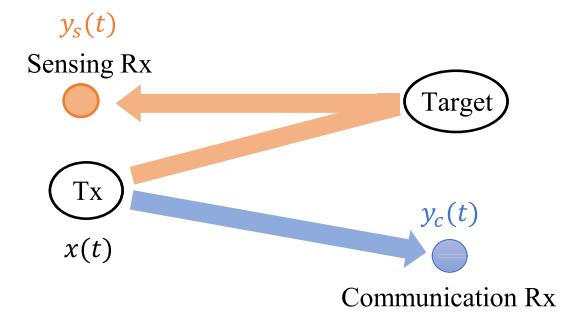

Fig. 1. Diagram of JCAS system.

#### <span id="page-1-6"></span><span id="page-1-1"></span>II. SYSTEM MODEL

<span id="page-1-4"></span><span id="page-1-0"></span>Fig. 1 illustrates a JCAS system based on visible light, where the integrated optical signal x(t) is transmitted from a light source (e.g., LED) for both communication and sensing. The optical signal is received by the communication detector to convey the messages, and the received signal is denoted as  $y_c(t)$ . Meanwhile, the optical signal is reflected by the target and detected by the sensing detector, whose received signal is denoted as  $y_s(t)$ . In this work, we assume that M-PAM is adopted for JCAS, i.e.,  $x(t) \in S = \{A_0, A_1, \ldots, A_{M-1}\}$ , where S denotes the constellation set. Because the indoor visible channel exhibits slow fading characteristics [37], we assume that the channel gain remains constant during one symbol period.

# A. Communication Link

Define  $x_n = x(nT_s)$  with  $1/T_s$  being the sampling rate. The samples of  $y_c(t)$  is given by

$$y_{c,n} = y_c(nT_s) = h_c x_n + w_{c,n}, n = 1, 2, ..., N$$
 (1)

where N denotes the number of samples,  $h_c$  denotes the communication link gain, and  $w_{c,n} \sim \mathcal{N}(0, \sigma_c^2)$  denotes the additive Gaussian noise in the communication link.

The communication receiver needs to decide among the M possible symbols in set S. We adopt the minimum error probability criterion for symbol detection, which is equivalent to the following minimum distance criterion:

$$\hat{x}_n = \arg\min_{x_n \in \mathcal{S}} \|y_{c,n} - h_c x_n\|. \tag{2}$$

#### <span id="page-1-5"></span>R Sensino Link

Define the samples of  $y_s(t)$  as  $y_{s,n} \triangleq y_s(nT_s)$ . The sensing problem is to distinguish between the hypotheses with and without the target, i.e.,

$$\mathcal{H}_0: y_{s,n} = w_{s,0n}, n = 1, 2, \dots, N$$
  
 $\mathcal{H}_1: y_{s,n} = h_s x_n + w_{s,1n}, n = 1, 2, \dots, N$  (3)

where  $h_s$  denotes the sensing link gain,  $w_{s,0n} \sim \mathcal{N}(0, \sigma_{s0}^2)$  and  $w_{s,1n} \sim \mathcal{N}(0, \sigma_{s1}^2)$  denote the additive Gaussian noises in the sensing link.

The miss detection probability and false alarm probability are defined as

$$P_{md} = \Pr{\mathcal{H}_0 | \mathcal{H}_1}, P_{fa} = \Pr{\mathcal{H}_1 | \mathcal{H}_0}. \tag{4}$$

{2}------------------------------------------------

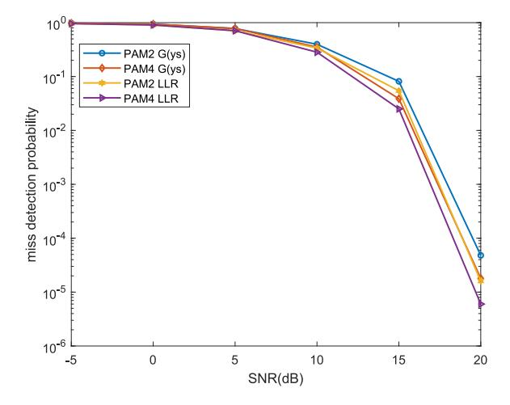

Fig. 2. Pmd versus SNR based on LR and  $G(y_s)$  detection rules.

Adopting Neyman–Pearson (NP) criterion [38], we design the detection rule to minimize the miss detection probability  $P_{md}$ given that the false alarm probability  $P_{fa}$  does not exceed a threshold  $\epsilon$ , i.e.,

$$\min P_{md}$$
, s.t. $P_{fa} \le \epsilon$ . (5)

As  $y_{s,n}$  under hypothesis  $\mathcal{H}_1$  satisfies the mixed Gaussian distribution with probability density function (PDF)

<span id="page-2-8"></span>
$$p(y_{s,n}|\mathcal{H}_1) = \frac{1}{M} \sum_{m=0}^{M-1} \frac{1}{\sqrt{2\pi}\sigma_{s1}} \exp\left[-\frac{(y_{s,n} - h_s A_m)^2}{2\sigma_{s1}^2}\right]$$
(6)

the optimal detection rule based on likelihood ratio (LR) in (7) involves high computational complexity [39]

<span id="page-2-1"></span>
$$L(\mathbf{y}_{s}) = \frac{p(\mathbf{y}_{s}|\mathcal{H}_{0})}{p(\mathbf{y}_{s}|\mathcal{H}_{0})} = \frac{\prod_{n=1}^{N} \sum_{m=0}^{M-1} \frac{1}{\sqrt{2\pi}M\sigma_{s1}} \exp\left[-\frac{(y_{s,n} - \mu_{sm})^{2}}{2\sigma_{s1}^{2}}\right]}{\left(\frac{1}{\sqrt{2\pi}\sigma_{s0}}\right)^{N/2} \exp\left[-\sum_{n=1}^{N} \frac{y_{s,n}^{2}}{2\sigma_{s0}^{2}}\right]}$$
(7)

where  $\mu_{sm} = h_s A_m$  and  $\mathbf{y}_s = [y_{s,1}, y_{s,2}, \dots, y_{s,N}]$ . Define  $G(\mathbf{y}_s) = \sum_{n=1}^{N} (y_{s,n}^2 / \sigma_{s0}^2)$ . In this work, a lowcomplexity detection rule based on test statistic  $G(y_s)$  is proposed as

$$G(\mathbf{y}_s) = \sum_{n=1}^{N} \frac{y_{s,n}^2}{\sigma_{s0}^2} \underset{\mathcal{H}_0}{\overset{\mathcal{H}_1}{\gtrsim}} \gamma \tag{8}$$

where the threshold  $\gamma$  is determined by

$$P_{fa} = \Pr\{G(\mathbf{y}_s) > \gamma | \mathcal{H}_0\} = \epsilon. \tag{9}$$

We compare the miss detection probability based on LR with that based on  $G(y_s)$  under a single sample. It can be seen from Fig. 2 that the  $G(y_s)$ -based detection rule has a certain performance loss compared to the LR-based one, but its computational complexity is lower even with multiple samples. Thus, it is reasonable and effective to adopt  $G(y_s)$  as the test statistic.

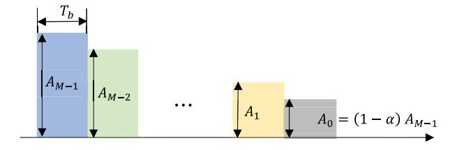

Fig. 3. Schematic of integrated waveform design.

## <span id="page-2-3"></span>C. Integrated Waveform Design

<span id="page-2-2"></span>The detection rule for communication link shows that larger amplitude difference between symbols can improve the communication performance, while for sensing link, higher mean power of symbols can improve the sensing performance. Under the peak power constraint of the transmitter, there exists a fundamental tradeoff between larger amplitude difference and higher mean power of transmitted symbols.

<span id="page-2-9"></span>For PAM-based JCAS system, the main objective of integrated waveform design is to find a balance between larger difference of symbol amplitudes  $\{A_0, A_1, \dots, A_{M-1}\}$ and higher mean power. Considering the peak power constraint of the transmitter, we fix amplitude  $A_{M-1}$  to the peak power, and change other M-1 amplitudes through the parameter  $\alpha$ ,

<span id="page-2-6"></span>
$$A_0 = (1 - \alpha)A_{M-1}, \alpha \in (0, 1]$$

$$A_m = A_{m-1} + \delta, \delta = \frac{\alpha A_{M-1}}{M-1}, m = 1, \dots, M-2 \quad (10)$$

and the corresponding schematic of the integrated waveform design is shown in Fig. 3.

<span id="page-2-10"></span>As the parameter  $\alpha$  increases, the amplitude difference  $\delta$  increases, improving the communication performance. Meanwhile, an increase of  $\alpha$  leads to a reduction in the mean symbol power, which deteriorates the sensing performance. Therefore, a good tradeoff between the communication performance and sensing performance can be achieved by choosing an appropriate value of  $\alpha$ .

## <span id="page-2-0"></span>III. PERFORMANCE METRICS AND WAVEFORM **DESIGN CRITERION**

<span id="page-2-7"></span>A. Communication Performance Metric

1) SER: For M-PAM signal, the SER is given by [40]

<span id="page-2-11"></span><span id="page-2-4"></span>
$$P_{e} = \frac{2(M-1)}{M} \left\{ Q \left[ \frac{h_{c}(A_{M-1} - A_{0})}{2\sigma_{c}(M-1)} \right] \right\}$$
$$= \frac{2(M-1)}{M} \left[ Q \left( \frac{h_{c}\delta}{2\sigma_{c}} \right) \right]$$
(11)

where  $Q(x) = \int_{x}^{+\infty} (1/\sqrt{2\pi})e^{-(t^2/2)}dt$ .

According to (11),  $P_e$  decreases with  $\delta$  and  $\alpha$ .

2) Achievable Transmission Rate: The achievable transmission rate between the input and output of the communication link is given by [41]

<span id="page-2-12"></span><span id="page-2-5"></span>
$$I(x_n; y_{c,n}) = h(y_{c,n}) - h(y_{c,n}|x_n).$$
 (12)

{3}------------------------------------------------

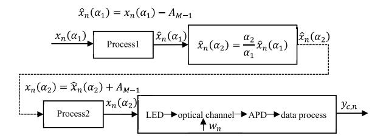

Fig. 4. Data transmission process in optical channel.

Note that  $y_{c,n}$  obeys a mixed Gaussian distribution with PDF [42]

<span id="page-3-8"></span><span id="page-3-0"></span>
$$p(y_{c,n}) = \frac{1}{M} \sum_{m=0}^{M-1} \frac{1}{\sqrt{2\pi}\sigma_c} \exp\left[-\frac{(y_{c,n} - h_c A_m)^2}{2\sigma_c^2}\right].$$
(13)

According to (12) and (13), the achievable transmission rate is a function of signal amplitudes, which are given by  $A_m = A_{m-1} + (\alpha A_{M-1}/M - 1)$  and related to  $\alpha$ . For notational simplicity, we express the achievable transmission rate as a function of  $\alpha$ 

$$I(\alpha) \triangleq I(x_n(\alpha); y_{c,n}), x_n(\alpha) \in A_{M-1}S(\alpha)$$

$$S(\alpha) = \left\{1 - \alpha, 1 - \frac{M-2}{M-1}\alpha, \dots, 1 - \frac{1}{M-1}\alpha, 1\right\}. (14)$$

As shown in the following theorem,  $I(\alpha)$  is an increasing function of  $\alpha$ .

Theorem 1: Given M and  $A_{M-1}$ ,  $I(\alpha)$  increases with  $\alpha$ , i.e.,

$$\forall \alpha_1 < \alpha_2, I(\alpha_1) < I(\alpha_2). \tag{15}$$

*Proof:* Consider the data transmission process in optical channel in Fig. 4, where  $\alpha_1 < \alpha_2$ , and  $x_n(\alpha_k) = A_{M-1}S(\alpha_k), k \in \{1, 2\}.$ 

As  $x_n(\alpha_1)$ ,  $\hat{x}_n(\alpha_1)$ ,  $\hat{x}_n(\alpha_2)$ ,  $x_n(\alpha_2)$ , and  $y_{c,n}$  form a Markov chain  $x_n(\alpha_1) \to \hat{x}_n(\alpha_1) \to \hat{x}_n(\alpha_2) \to x_n(\alpha_2) \to y_{c,n}$  [43], we have  $I(x_n(\alpha_1); y_{c,n}) \le I(x_n(\alpha_2); y_{c,n})$  by data processing inequality.

# <span id="page-3-6"></span>B. Sensing Performance Metric

1) Miss Detection Probability: According to the central limit theorem,  $(1/N)G(y_s)$  approximately follows Gaussian distribution under both hypotheses  $\mathcal{H}_0$  and  $\mathcal{H}_1$  [44], i.e.,

<span id="page-3-2"></span>
$$\mathcal{H}_0: \frac{1}{N}G(\mathbf{y}_s) \sim \mathcal{N}\left(\sigma_{s0}^2, 2\sigma_{s0}^4\right)$$

$$\mathcal{H}_1: \frac{1}{N}G(\mathbf{y}_s) \sim \mathcal{N}\left(\mu, \sigma^2\right)$$
(16)

where  $\mu$  and  $\sigma$  are given by

$$\mu = \frac{\sum_{m=0}^{M-1} \left(\sigma_{s1}^2 + \mu_{sm}^2\right)}{M\sigma_{s0}^2}$$

$$\sigma^2 = \frac{3\sigma_{s1}^4 + \sum_{m=0}^{M-1} \left(5\sigma_{s1}^2 u_{sm}^2 + \mu_{sm}^4\right)}{MN\sigma_{s0}^4} - \frac{\left[\sigma_{s1}^2 + \sum_{m=0}^{M-1} \left(\mu_{sm}^2\right)\right]^2}{M^2N\sigma_{s0}^4}.$$
(17)

We analyze the sensing performance based on (16). Given the false alarm probability  $P_{fa} = \epsilon$ , detection threshold  $\gamma$ , and the miss detection probability  $P_{md}$  are given by [38]

<span id="page-3-3"></span>
$$\gamma = Q^{-1} (P_{fa}) \sqrt{2N\sigma_{s0}^4 + N\sigma_{s0}^2}$$
 (18)

$$P_{md} = \int_{-\infty}^{\gamma} P(G|\mathcal{H}_1) dG = 1 - Q \left[ \frac{\gamma - \mu}{\sigma} \right]. \tag{19}$$

<span id="page-3-1"></span>It can be seen from (19) that  $P_{md}$  decreases with  $\mu$ , which is proportional to  $\{A_m\}_{m=0}^{M-1}$ , and  $\{A_m\}_{m=0}^{M-1}$  vary with  $\alpha$  from (10). Thus,  $P_{md}$  increases with the  $\alpha$ .

2) KL Divergence: According to the law of Chernoff–Stein given by (20), KL divergence characterizes the exponential coefficient of miss detection probability as the samples size approaches infinity [45], which serves as the extreme performance of sensing. Thus, we can also adopt KL divergence to characterize the sensing performance [46]

<span id="page-3-12"></span><span id="page-3-11"></span><span id="page-3-4"></span>
$$\lim_{N \to \infty} \frac{\log P_{md}}{N} = -D(p_{s0}(y_s)||p_{s1}(y_s))$$

$$= \int p_{s0}(y_s) \log \frac{p_{s0}(y_s)}{p_{s1}(y_s)} dy_s \qquad (20)$$

where  $p_{s1}(y_s)$  is the PDF of a mixed Gaussian distribution under hypothesis  $\mathcal{H}_1$ , whose parameters can be estimated by expectation–maximization (EM) algorithm.

From (20), we can see that the KL divergence is determined by  $p_{s1}(y_s)$  and  $p_{s0}(y_s)$ , where  $p_{s0}(y_s)$  is independent of  $\alpha$ ,  $p_{s1}(y_s)$  is related to signal amplitudes, which are given by  $A_m = A_{m-1} + (\alpha A_{M-1}/M - 1)$  and related to  $\alpha$ . Therefore, we can prove that  $D(p_{s0}(y_s)||p_{s1}(y_s))$  is decreasing with respect to  $\alpha$ . We prove a stronger conclusion that the KL divergence is increasing with respect to all  $A_i$  for  $0 \le i \le M-2$ , as stated in the following theorem.

<span id="page-3-9"></span><span id="page-3-7"></span>Theorem 2: Given M and  $A_{M-1}$ , KL divergence  $D(p_{s0}(y_s)||p_{s1}(y_s))$  increases with  $A_i, i \in \{0, 1, ..., M-2\}$ , i.e.,

$$\forall A_i, i \in \{0, 1, \dots, M - 2\} 
\frac{\partial D(p_{s0}(y_s)||p_{s1}(y_s, A_0, A_1, \dots, A_{M-1}))}{\partial A_i} > 0.$$
(21)

#### C. Modulation Design Criterion

<span id="page-3-10"></span>We provide the modulation design criterion based on achievable transmission rate and KL divergence. The modulation design criterion based on SER and miss detection probability is similar and will not be described. We optimize the modulation constellation to maximize the KL divergence, provided that the achievable transmission rate is no less than a certain threshold. Note that the highest amplitude peak power. Therefore, we actually need to optimize other M-1 amplitudes  $\{A_m\}_{m=0}^{M-2}$  by adjusting parameter  $\alpha$ . The optimization problem can be formulated as

<span id="page-3-5"></span>
$$\max_{\alpha} D(p_{s0}(y_s)||p_{s1}(y_s))$$
s.t.  $I(\alpha) \ge I_{th}, \alpha \in (0, 1]$ 

$$A_0 = (1 - \alpha)A_{M-1}$$

$$A_m = A_{m-1} + \frac{\alpha A_{M-1}}{M-1}, m = 1, \dots, M-2. \quad (22)$$

{4}------------------------------------------------

In problem (22), the objective function  $D(p_{s0}(y_s)||p_{s1}(y_s))$  decreases with  $\alpha$ , while the achievable transmission rate  $I(\alpha)$  in the constraint is an increasing function of  $\alpha$ . As a result, the optimal solution  $\alpha^*$  to problem (22) must satisfy  $I(\alpha^*) = I_{th}$ , i.e.,  $\alpha^* = I^{-1}(I_{th})$ , which is a function of communication link gain  $h_c$ , not related to sensing link gain  $h_s$ .

# IV. NUMERICAL EVALUATIONS

<span id="page-4-0"></span>In this section, we first verify the relationship between the performance metrics and the integrated waveform parameter  $\alpha$  at different signal-to-noise ratios (SNRs) and different PAM orders to ensure the accuracy of the theoretical analysis in Sections III-A and III-B. Then, the tradeoff between the communication performance and sensing performance is analyzed, and the effect of PAM orders on sensing performances are provided.

#### A. Parameter Settings

Assuming negligible reflection from the walls, communication and sensing in the JCAS system are achieved through line-of-sight (LOS) link and first-order non-LOS (NLOS) link, respectively.

Let *x* denote the electrical signal at the transmitter, which is converted to the optical signal by the LED. After passing through the channel, the optical signal is received by the avalanche photodiode (APD) and converted to an electrical signal, i.e.,

$$P_r = \eta h P_t = \eta h \kappa x \tag{23}$$

where  $P_t = \kappa x$  denotes the transmitted optical power,  $\kappa$  denotes the electrical-to-optical conversion coefficient of the LED, h denotes the channel gain,  $\eta$  denotes the optical-to-electrical conversion coefficient of the APD, and  $P_r$  denotes the received optical power.

Consider an LED transmitter with a Lambertian emission pattern, as shown in Fig. 5. The channel gain in the communication link is given by [47]

<span id="page-4-3"></span>
$$h_c = \begin{cases} \frac{A(m+1)}{2\pi d^2} \cos^m(\varphi_c) \cos(\psi_c), & 0 \le \psi_c \le \Psi \\ 0, & \text{otherwise} \end{cases}$$
 (24)

where  $m = -\ln 2/\ln(\cos \varphi_{1/2})$  is the order of Lambertian emission,  $\varphi_{1/2}$  is the semi-angle of LED at half power,  $\varphi_c$  is the emission angle of LED in the communication link, d is the distance between the LED and communication receiver, A is the effective area of the APD,  $\psi_c$  is the incidence angle at the communication receiver, and  $\Psi$  is the field of view (FOV) of the APD.

In the sensing link, for a target with distance  $d_1$  from the transmitter and  $d_2$  from the receiver, the channel gain is given by [47]

$$h_s = \begin{cases} \frac{A(m+1)}{2\pi d_1^2 d_2^2} \rho A_r \cos^m(\varphi_s) \cos(\beta_i) \cos(\beta_r) \\ \cos(\psi_s), & 0 \le \psi_s \le \Psi \\ 0, & \text{otherwise} \end{cases}$$
 (25)

where  $\varphi_s$  is the emission angle of LED in the sensing link,  $\rho$  is the reflectance coefficient of the target,  $A_r$  is the microelement of the reflective area,  $\beta_i$  and  $\beta_r$  are the incidence angle

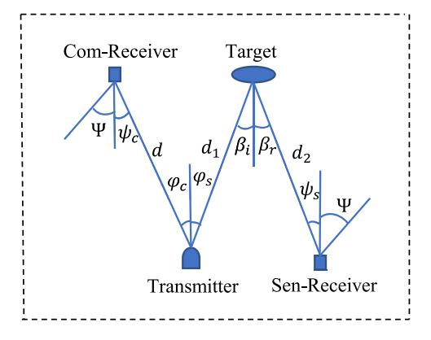

Fig. 5. Geometric models of LOS link and NLOS link.

<span id="page-4-2"></span><span id="page-4-1"></span>TABLE I
TYPICAL PARAMETERS OF LOS LINK AND NLOS LINK

| Radiation power                                           | 1 W       |
|-----------------------------------------------------------|-----------|
| Semi-angle of LED at half-power                           | 60°       |
| Reflection coefficient                                    | 0.5       |
| Reflective area of the target                             | 1 m × 1 m |
| Effective area of the APD                                 | 3 mm      |
| FOV of the APD                                            | 70°       |
| Vertical distance between transmitter and receiver planes | 1 m       |

and radiation angle at the target, respectively, and  $\psi_s$  is the incidence angle at the sensing receiver.

<span id="page-4-5"></span><span id="page-4-4"></span>According to the device manual of the APD used in the experiment,  $\eta$  is 22 (A/W) at multiplication factor 50 and wavelength 550 nm. From [48] and [49], the false alarm probability  $P_{fa}$  is set to 0.01, and the miss detection probability below 0.01 represents satisfactory sensing performance. The symbol peak amplitude  $A_{M-1}$  is set to 10, and  $A_0$  varies from 0 to 8 with a step size of 2. The set of discrete points of  $\alpha$  is {0.2, 0.4, 0.6, 0.8, 1} according to the formula  $A_0 = (1 - \alpha)A_{M-1}$ . SNR varies from 0 to 30 dB with a step size of 5 dB. The typical parameters in the geometric models of the LOS link and the NLOS link are shown in Table I [50].

#### <span id="page-4-6"></span>B. Numerical Results

The achievable transmission rate and KL divergence versus SNRs for 4-PAM signal are shown in Fig. 6. It can be observed that the achievable rate increases with  $\alpha$  and the KL divergence decreases with  $\alpha$ , which are consistent with the monotonicity of the theoretical analysis. Moreover, both the communication performance and sensing performance are improved as the SNR increases. The similar analysis can be performed on SER and  $P_{md}$  versus SNR for 4-PAM signal.

With SNR fixed to a certain value, e.g., 20 dB, we can obtain  $h_c$ =3.7081e-4,  $h_s$ =9.1587e-5,  $\sigma_c$ =3.301e-4, and  $\sigma_s$ =8.153e-5. Fig. 7 plots the SER and  $P_{md}$  versus  $\alpha$  under different PAM orders, and Fig. 8 plots the achievable transmission rate and KL divergence versus  $\alpha$  under different PAM orders. It can be seen from Figs. 7 and 8 that the balance between the communication performance and sensing performance can be achieved through the parameter  $\alpha$ .

{5}------------------------------------------------

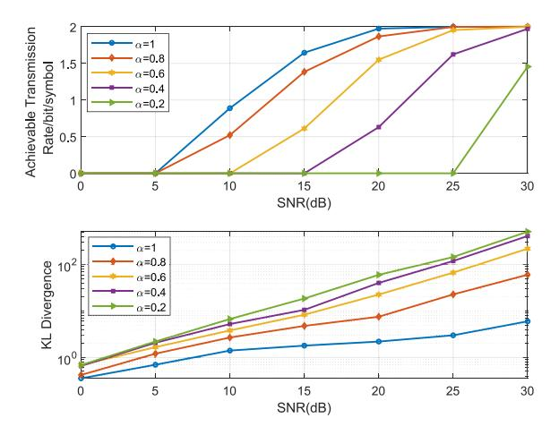

Fig. 6. Achievable transmission rate and KL divergence for 4-PAM.

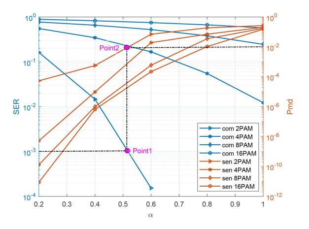

Fig. 7. BER and miss detection probability versus  $\alpha$  under different PAM orders.

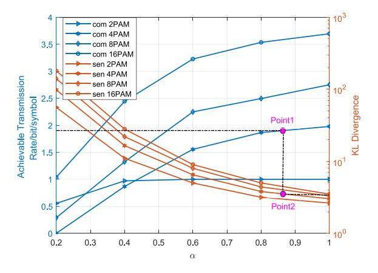

Fig. 8. Achievable transmission rate and KL divergence versus  $\alpha$  under different PAM orders.

From "Point1" and "Point2" in Fig. 7, we have  $\alpha^* = 0.52$  and the corresponding  $P_{md} = 10^{-2}$  for 2-PAM signal and SER threshold of  $10^{-3}$ . If  $\alpha$  falls below  $\alpha^*$ , the communication performance deteriorates with an increase in SER, and the sensing performance improves with a decrease in  $P_{md}$ . If  $\alpha$  rises above  $\alpha^*$ , the opposite trends can be observed. From Point1 and Point2 in Fig. 8, we have  $\alpha^* = 0.86$  and the corresponding KL divergence of 2.5 for 4-PAM signal and

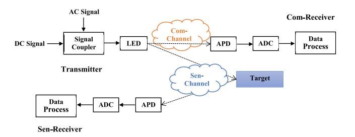

Fig. 9. Block diagram of the experimental system.

<span id="page-5-4"></span><span id="page-5-1"></span> $I_{th} = 1.9$ . If  $\alpha$  falls below  $\alpha^*$ , the communication performance deteriorates with a decrease in achievable data rate, and the sensing performance improves with an increase in KL divergence. If  $\alpha$  rises above  $\alpha^*$ , the opposite trends can be observed. Similarly,  $\alpha^*$  can be obtained for other PAM orders.

Moreover, the numerical results indicate that the better sensing performance can be obtained for high-order PAM signals, mainly due to the fact that high-order PAM signals shows lower tail probability to the value around zero compared with that of low-order PAM signals.

## V. EXPERIMENTAL EVALUATIONS

<span id="page-5-0"></span>In this section, we experimentally investigate the effect of the integrated waveform on the communication performance and sensing performance when detection target is within 1 and 7 m from the LED. The block diagram of the experimental system is shown in Fig. 9.

## <span id="page-5-2"></span>A. Experimental Settings

- 1) Short Distance Case: The experimental system is shown in Fig. 10. A green LED (Cree XPG2) is driven by a Bias-Tee. The direct current (DC) is driven by a DC power supply (Rigol DP832A), and the PAM signal (1 MSa/s) is generated by an arbitrary waveform generator (Keysight 33600A). The light beam angle is approximately 41.2°, so that the spot size is comparable to the area of the target, thus maximizing the intensity of the received signals. The detection target and communication receiver are both 1 m from the LED, representing the short distance case.
- <span id="page-5-3"></span>2) Long Distance Case: The experimental scene is basically the same as the short distance case, but the difference is that the light source is changed to a blue LED (Cree XHP70) with higher power. A PMMA plano-convex lens with diameter of 35 mm and height of 8.7 mm is employed to converge the light. As shown in Fig. 11, the detection target and communication receiver are 7 and 6 m away from the LED, respectively, which represents the long distance case.

In this work, two detection materials are measured, a down jacket and a hospital gown, both of which have an approximate reflective area of 1 square meter. Both materials reflect diffusely when the light irradiates the surface, but the diffuse reflection of the hospital gown is more serious due to its rougher surface, which leads to a longer detection time.

At the transmitter, we change the voltage of both alternate current (AC) and DC component to keep the peak amplitude

{6}------------------------------------------------

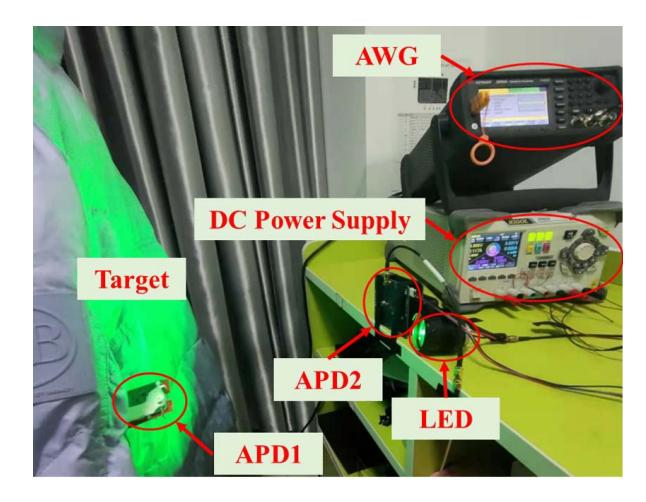

Fig. 10. Experimental system for JCAS at short distance.

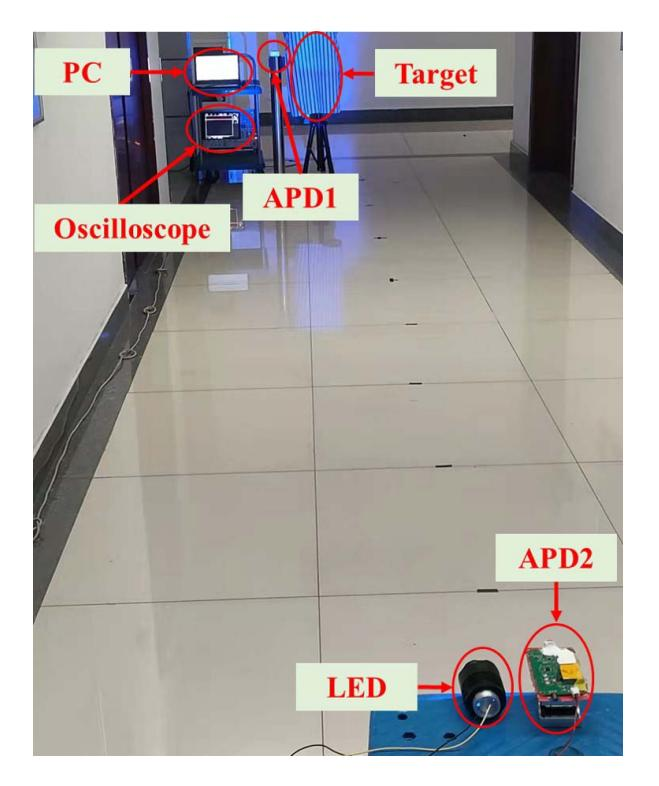

Fig. 11. Experimental scene for JCAS at long distance.

 $A_{M-1}$  on the LED constant while varying the amplitudes  $\{A_m\}_{m=0}^{M-2}$ . However, due to the nonlinearity of the LED's photoelectric conversion, DC decreases with unequal steps when AC increases equally. Therefore, we set DC values according to the approximate constant maximum value of the received signal under different AC values. In addition, for different AC and DC settings, we calculate the values of  $\alpha$  based on the maximum and minimum values of the received signal. The values of  $\alpha$  at different AC and DC settings are presented in Table II.

Because the measurement of the optical power at the transmitter is relatively complicated, we set the DC values based on the maximum value of the received signal rather than the maximum optical power of the transmitted signal for different AC values.

<span id="page-6-3"></span>TABLE II VALUES OF  $\alpha$  FOR DIFFERENT ACS AND DCS

<span id="page-6-2"></span>

| AC(V)             |          | 2      | 4      | 6      | 8      | 10     |
|-------------------|----------|--------|--------|--------|--------|--------|
| Short<br>Distance | DC(V)    | 3.01   | 2.97   | 2.9    | 2.8    | 2.7    |
|                   | $\alpha$ | 0.1928 | 0.2574 | 0.3554 | 0.4903 | 0.5576 |
| Long<br>Distance  | DC(V)    | 6.1    | 5.8    | 5.6    | 5.5    | 5      |
|                   | $\alpha$ | 0.8046 | 0.8365 | 0.8485 | 0.8851 | 0.9209 |


<span id="page-6-0"></span>Fig. 12. Transmitted frame structure with synchronization pilot.

At the receiver side, one APD (Hamamatsu C12702-12) with DC filtering, denoted as APD1, is adopted for communication. Another APD (Hamamatsu S5344) without DC filtering, denoted as APD2, is adopted to detect the reflected signals from the target. Furthermore, an oscilloscope (Agilent MSOX6004A) is adopted to capture and save the sampled signals of APD1 and APD2 at a sampling rate of 10 MSa/s for offline data processing on the computer.

#### B. Data Processing

In the offline processing stage, we adopt the digital bandpass filter to remove the high-frequency noise of the devices and the low-frequency noise of indoor LEDs. Then perform the parameters estimation and performances calculation based on specific data of the frame structure in Fig. 12, where the frame structure has a "pilot" length of 256 symbols and a ratio of pilot length to "data" length of 1/127.

In the communication link, pilot sequences and data sequences are adopted for synchronization and performances calculation, respectively. The length of the synchronization pilot needs to be determined based on the specific scenario, signal characteristics, and noise level. While in the sensing link, pilot sequences and data sequences are not distinguished.

<span id="page-6-1"></span>1) Estimation for Communication: The communication channel gain can be estimated by the pilot sequences according to maximum-likelihood estimation (MLE) method [51], i.e.,

$$\hat{h}_c = \arg \max_{h_c} \ln p(\mathbf{y}_c^p | h_c) = \arg \min_{h_c} \sum_{n=1}^{L_2} (y_{c,n}^p - h_c x_n)^2$$
 (26)

where  $y_c^p$  denotes the received samples corresponding to the pilot sequences with dimension  $L_2$ .

By setting the derivative of  $\ln p(\mathbf{y}_c^p|h_c)$  with respect to  $h_c$  to be zero, the MLE of  $h_c$  can be obtained as

<span id="page-6-4"></span>
$$\hat{h}_c = \frac{\sum_{n=1}^{L_2} x_n y_{c,n}^p}{\sum_{n=1}^{L_2} x_n^2}.$$
 (27)

2) Estimation for Sensing: The mean and variance of Gaussian distribution under hypothesis  $\mathcal{H}_0$  are estimated by

{7}------------------------------------------------

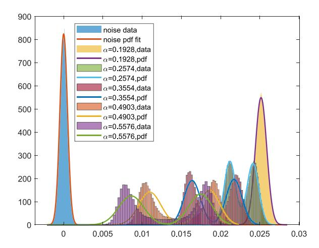

Fig. 13. Distributions of sample values and the PDFs versus  $\alpha$  for 2-PAM.

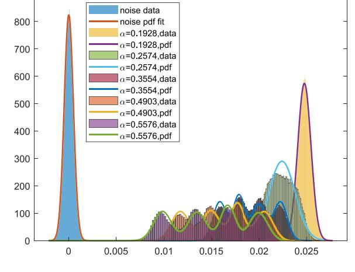

900

<span id="page-7-0"></span>Fig. 14. Sample distributions and the PDFs versus  $\alpha$  for 4-PAM.

MLE method [51], i.e.,

$$\hat{\mu}_{s0} = \arg\max_{\mu_{s0}} p(\mathbf{y}_s | \mathcal{H}_0) = \frac{1}{N} \sum_{n=1}^{N} y_{s,n}$$
 (28)

$$\hat{\sigma}_{s0}^2 = \arg\max_{\sigma_{s0}^2} p(\mathbf{y}_s | \mathcal{H}_0) = \sqrt{\frac{1}{N} \sum_{n=1}^N y_{s,n}^2}.$$
 (29)

Note that the sample under hypothesis  $\mathcal{H}_1$  follows a mixed Gaussian distribution, as given in (6), whose parameters are estimated by adopting EM algorithm. The detailed process is given in [52, Appendix B].

<span id="page-7-3"></span>Finally, we adopt the estimated parameters and filtered signals to evaluate the communication and sensing performances. A sliding-window is adopted to calculate the correlation values between the synchronization pilot to obtain the "start" position of a frame, followed by the symbol detection based on the estimates. For sensing, the PDF under hypothesis  $\mathcal{H}_0$  and  $\mathcal{H}_1$  are obtained from the estimated parameters.

## C. Experimental Results

Figs. 13 and 14 plot the distributions of the sample values and the corresponding PDFs for 2-PAM and 4-PAM signals under different  $\alpha$  at a distance of 20 cm, where the "noise pdf" denotes the PDF under hypothesis  $\mathcal{H}_0$ , and the " $\alpha=m$  pdf" represents the PDF under  $\mathcal{H}_1$  with  $\alpha=m$ .

We mean originally that as  $\alpha$  increases, the interval between the two peaks of the PDF under  $\mathcal{H}_1$  increases, resulting in a lower SER. Meanwhile, the PDF under  $\mathcal{H}_1$  gets closer to that under  $\mathcal{H}_0$ , leading to higher miss detection probability. Thus, we can conclude that the communication performance and sensing performance follow an opposite trend with  $\alpha$ .

The SER and achievable rate with respect to  $\alpha$  at different distances for 4-PAM signal are shown in Fig. 15. It can be seen that the SER decreases with  $\alpha$  and the achievable transmission rate increase with  $\alpha$ , which is consistent with the results of the theoretical analyses in Section III-A. In addition, due to the constant beam angle of the LED, the channel gain of the communication link decreases with distance, thus

<span id="page-7-1"></span>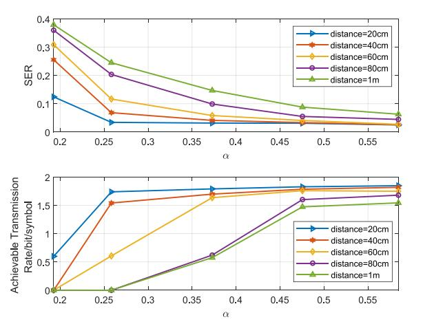

<span id="page-7-2"></span>Fig. 15. SER and achievable transmission rate versus  $\alpha$  for 4-PAM signal.

the SNR decreases and the communication performances are weakened.

Based on the threshold and 10-ms observations,  $P_{md}$  and KL divergence with respect to  $\alpha$  for 4-PAM signals are shown in Fig. 16 We can still obtain results consistent with the theoretical analyses that  $P_{md}$  decreases with  $\alpha$  and KL divergence increases with  $\alpha$ . Moreover, the sensing performances deteriorate with the distance because of the reduced mean received power.

We compare the communication performance and sensing performance at distances of 80 cm and 1 m, including SER and miss detection probability  $P_{md}$ , the achievable rate and KL divergence, as shown in Figs. 17 and 18. The miss detection probability is calculated based on forty milliseconds of received samples. From the results, we can conclude that the tradeoff between the communication performance and the sensing performance can be achieved through the selection of parameter  $\alpha$ . The optimal  $\alpha$  is obtained based on the requirement of communication performance.

Next, we investigate the sensing performance over longer distance of 7 m under 2-PAM signal. Due to strong reflection of the walls, we increase the observation time when detecting the target, and calculate the miss detection probability based on the observed samples of 200 ms.

{8}------------------------------------------------

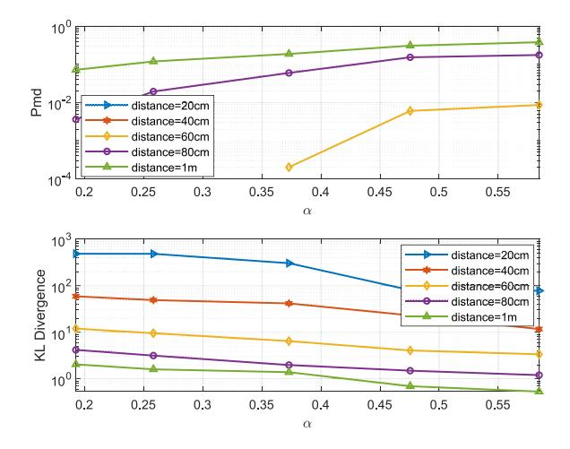

Fig. 16. Miss detection probability and KL divergence versus α for 4-PAM signal.

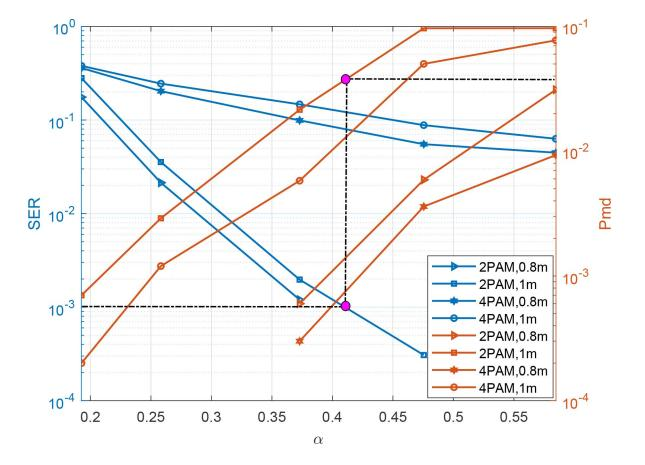

Fig. 17. SER and miss detection probability versus α for different PAM orders.

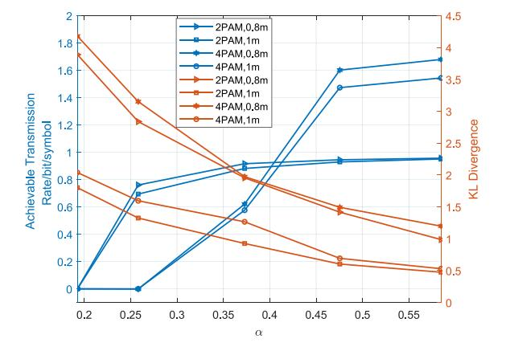

Fig. 18. Achievable transmission rate and KL divergence versus α for different PAM orders.

The sample distributions and the PDFs versus α for different reflectors are shown in Fig. [19.](#page-8-4) Due to the long distance, the PDF under hypothesis *H*<sup>1</sup> obey a Gaussian distribution rather than a mixed Gaussian distribution. As α increases, the PDF under *H*<sup>1</sup> yields more overlap with the PDF under *H*0, which increases the miss detection probability and deteriorates the sensing performance.

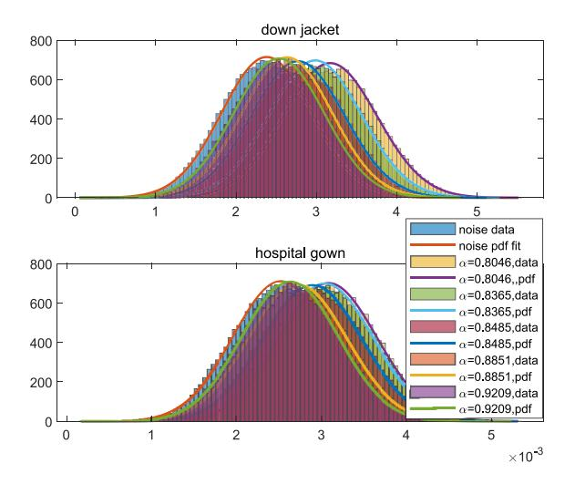

<span id="page-8-1"></span>Fig. 19. Samples distributions and the PDFs versus α for different reflectors.

<span id="page-8-4"></span>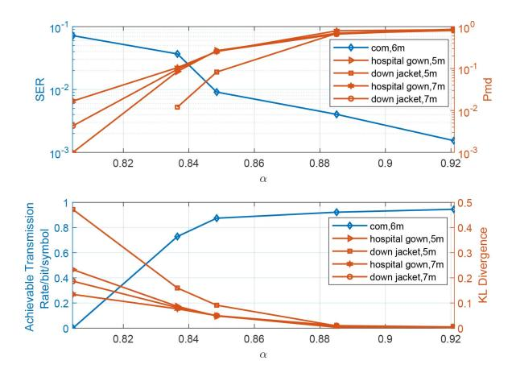

<span id="page-8-2"></span>Fig. 20. Communication and sensing performance versus α.

Fig. [20](#page-8-5) plots the performances of communication and sensing versus α. The sensing performances are poorer than those of the down jacket because of the stronger diffuse reflection of the hospital gown. The balance between the communication performance and sensing performance in the long range case also can be achieved through parameter α.

# <span id="page-8-5"></span>VI. CONCLUSION

<span id="page-8-3"></span><span id="page-8-0"></span>In this article, we have explored the integrated communication and sensing waveform design for PAM signal based on visible light. The SER, the achievable transmission rate, the miss detection probability and KL divergence have been adopted as the performance metrics. An optimization criterion with respect to parameter of the integrated waveform under peak power constraint have been proposed. We have conducted the JCAS experiments for objects under short distance of 1 m and long distance of 7 m. Numerical and experimental results have demonstrated the performance tradeoff between communication and sensing, With longer distances and stronger diffuse reflections, the sample size for target detection needs to be increased to obtain better sensing performance. In addition, under the same sampling rate and the same number of samples for target detection, high-order PAM signals provide better 

{9}------------------------------------------------

sensing performance due to the lower tail probability to the value around zero.

#### APPENDIX

## <span id="page-9-0"></span>A. Proof of Theorem 2

The KL divergence can be calculated as

$$D(p_{s0}||p_{s1}) = \frac{1}{2} \ln \frac{\sigma_{s1}^2}{e\sigma_{s0}^2} - \frac{1}{\sqrt{2\pi}\sigma_{s0}} \int_{-\infty}^{\infty} \exp\left(\frac{y_s^2}{2\sigma_{s0}^2}\right) \\ \ln \left\{ \sum_{m=0}^{M-1} \exp\left[-\frac{(y_s - h_s A_m)^2}{2\sigma_{s1}^2}\right] \right\} dy_s. \quad (30)$$

We set channel link gain  $h_s$  to be one to simplify the calculation and define

$$f(A_0, A_1, \dots, A_{M-1}) \triangleq \int_{-\infty}^{\infty} \exp\left[-\frac{y_s^2}{2\sigma_{s0}^2}\right] \ln\left\{\sum_{m=0}^{M-1} \exp\left[-\frac{(y_s - A_m)^2}{2\sigma_{s1}^2}\right]\right\} dy_s. (31)$$

For any  $A_i$ ,  $i \in \{0, 1, ..., M - 2\}$ , we have

<span id="page-9-2"></span>
$$\begin{split} &\frac{\partial f}{\partial A_{i}} = \int_{-\infty}^{\infty} \exp\left[-\frac{y_{s}^{2}}{2\sigma_{s0}^{2}}\right] \frac{\exp\left[-\frac{(y_{s}-A_{i})^{2}}{2\sigma_{s1}^{2}}\right] \frac{y_{s}-A_{i}}{\sigma_{s1}^{2}}}{\sum_{m=0}^{M-1} \exp\left[-\frac{(y_{s}-A_{m})^{2}}{2\sigma_{s1}^{2}}\right]} dy_{s} \\ &= \int_{-\infty}^{\infty} \exp\left[-\frac{y_{s}^{2}+A_{i}^{2}}{2\sigma_{s0}^{2}} - \frac{y_{s}^{2}}{2\sigma_{s1}^{2}}\right] \frac{\exp\left[-\frac{(y_{s}-A_{m})^{2}}{2\sigma_{s1}^{2}}\right] \frac{y_{s}}{\sigma_{1}^{2}}}{\sum_{m=0}^{M-1} \exp\left[-\frac{(y_{s}+A_{i}-A_{m})^{2}}{2\sigma_{s1}^{2}}\right]} dy_{s} \\ &= \int_{0}^{\infty} \exp\left[-\frac{y_{s}^{2}+A_{i}^{2}}{2\sigma_{s0}^{2}} - \frac{y_{s}^{2}}{2\sigma_{s1}^{2}}\right] \frac{\exp\left[-\frac{y_{s}A_{i}}{\sigma_{s0}^{2}}\right] \frac{y_{s}}{\sigma_{s1}^{2}}}{\sum_{m=0}^{M-1} \exp\left[-\frac{(y_{s}+A_{i}-A_{m})^{2}}{2\sigma_{s1}^{2}}\right]} dy_{s} \\ &- \int_{0}^{\infty} \exp\left[-\frac{y_{s}^{2}+A_{i}^{2}}{2\sigma_{s0}^{2}} - \frac{y_{s}^{2}}{2\sigma_{s1}^{2}}\right] \frac{\exp\left[\frac{y_{s}A_{i}}{\sigma_{s0}^{2}}\right] \frac{y_{s}}{\sigma_{s1}^{2}}}{\sum_{m=0}^{M-1} \exp\left[-\frac{(y_{s}-A_{i}-A_{m})^{2}}{\sigma_{s0}^{2}}\right]} dy_{s}. \end{split}$$

For  $v_s > 0$ , we have

<span id="page-9-1"></span>
$$\frac{(y_s + A_i - A_m)^2}{2\sigma_{s1}^2} - \frac{A_i y_s}{\sigma_{s0}^2} < \frac{y_s^2 - 2y_s A_m + (A_i - A_m)^2}{2\sigma_{s1}^2}$$
(33)

$$\frac{(y_s - A_i + A_m)^2}{2\sigma_{s1}^2} + \frac{A_i y_s}{\sigma_{s0}^2} > \frac{y_s^2 + 2y_s A_m + (A_i - A_m)^2}{2\sigma_{s1}^2}.$$
 (34)

Using (33) and (34), it yields

<span id="page-9-3"></span>
$$\frac{y_s^2 - 2y_s A_m + (A_i - A_m)^2}{2\sigma_{s1}^2} < \frac{y_s^2 + 2y_s A_m + (A_i - A_m)^2}{2\sigma_{s1}^2}$$

$$\Rightarrow \frac{(y_s + A_i - A_m)^2}{2\sigma_{s1}^2} - \frac{A_i y_s}{\sigma_{s0}^2} < \frac{(y_s - A_i + A_m)^2}{2\sigma_{s1}^2} + \frac{A_i y_s}{\sigma_{s0}^2}.$$
(35)

Combining (32) and (35), it follows that for any  $A_i$ ,  $i \in \{0, 1, ..., M-2\}$ ,  $(\partial f/\partial A_i) < 0$ . Thus,  $f(A_0, A_1, ..., A_{M-1})$  decreases with  $A_i$  and KL divergence increases with  $\{A_i\}_{i=0}^{M-2}$ .

<span id="page-9-6"></span>Algorithm 1 EM Algorithm Based on Initial Values Optimized Input: samples  $y_s$ , PAM order M, maximum iterations *Iter*, estimation error Err;

Output: estimated means  $\hat{\mu}_s$ , estimated variances  $\hat{\sigma}_s^2$ ;

```
1: Divide samples into T = 8M sections based on its value,
      i.e., y_s = [y_{s1}, y_{s2}, \dots, y_{sT}];
 2: Calculate the density d_i, mean value \mu_i of each section;
 3: Initial i = 1, j = 1 and temp = [];
 4: repeat
           if d_i < E\{d\}, \ \mu_i < E\{\mu\} then
                 temp = [temp; \mathbf{y}_{si}];
                 i = i + 1;
 7:
 8:
 9:
                 \mathbf{y}_{new,j} = temp;
                 j = j + 1;
                 temp = \mathbf{y}_{si};
11:
                 i = i + 1;
12:
13:
           end if
14: until (i < T)
15: M = j - 1;
     for m \in [1, M] do
           Initialize \mu_{sm} = E\{y_{new,m}\};
Initialize \sigma_{sm}^2 = E\{y_{new,m} - \mu_{sm}\};
     end for
20: Set k = 1;
21: repeat
           Compute E\left\{\hat{\eta}_{m}|\mathbf{y}_{s}, \left(\hat{\mu}_{sm}\right)^{k}, \left(\hat{\sigma}_{sm}^{2}\right)^{k}\right\} as in Eq. (36);
           Update (\hat{\mu}_{sm})^{k+1} as in Eq. (37);
Update (\hat{\sigma}_{sm}^2)^{k+1} as in Eq. (38);
24:
           if \|(\hat{\mu}_s)^{k+1} - (\hat{\mu}_s)^k\| < Err, \|(\hat{\sigma}_s^2)^{k+1} - (\hat{\sigma}_s^2)^k\| < Err
25:
                 break;
26:
27:
           end if
           k = k + 1;
29: until (k > Iter)
```

## B. EM Algorithm

The detailed process of EM algorithm is shown in Algorithm 1. For the EM algorithm, we have

<span id="page-9-4"></span>
$$E\left\{\hat{\boldsymbol{\eta}}_{m}|\boldsymbol{y}_{s},\left(\hat{\mu}_{sm}\right)^{k},\left(\hat{\sigma}_{sm}^{2}\right)^{k}\right\} = \frac{\mathcal{N}\left(\boldsymbol{y}_{s}|\left(\hat{\mu}_{sm}\right)^{k},\left(\hat{\sigma}_{sm}^{2}\right)^{k}\right)}{\sum_{m}\mathcal{N}\left(\boldsymbol{y}_{s}|\left(\hat{\mu}_{sm}\right)^{k},\left(\hat{\sigma}_{sm}^{2}\right)^{k}\right)}$$
(36)

where  $\hat{\eta}_m$  denotes the set of hidden variables estimated under Gaussian distribution with mean  $\hat{\mu}_{sm}$  and variance  $\hat{\sigma}_{sm}^2$ 

<span id="page-9-5"></span>
$$(\hat{\mu}_{sm})^{k+1} = \frac{E\{\hat{\eta}_{m}|\mathbf{y}_{s}, (\hat{\mu}_{sm})^{k}, (\hat{\sigma}_{sm}^{2})^{k}\} * \mathbf{y}_{s}^{T}}{\sum_{m} E\{\hat{\eta}_{m}|\mathbf{y}_{s}, (\hat{\mu}_{sm})^{k}, (\hat{\sigma}_{sm}^{2})^{k}\}}$$
(37)
$$(\hat{\sigma}_{sm}^{2})^{k+1} = \frac{E\{\hat{\eta}_{m}|\mathbf{y}_{s}, (\hat{\mu}_{sm})^{k}, (\hat{\sigma}_{sm}^{2})^{k}\} \cdot \left[\mathbf{y}_{s}^{T} - (\hat{\mu}_{sm})^{k}\right]^{2}}{\sum_{m} E\{\hat{\eta}_{m}|\mathbf{y}_{s}, (\hat{\mu}_{sm})^{k}, (\hat{\sigma}_{sm}^{2})^{k}\}}.$$
(38)

{10}------------------------------------------------

## REFERENCES

- <span id="page-10-0"></span>[\[1\]](#page-0-0) C. G. Gavrincea, J. Baranda, and P. Henarejos, "Rapid prototyping of standard-compliant visible light communications system," *IEEE Commun. Mag.*, vol. 52, no. 7, pp. 80–87, Jul. 2014.
- <span id="page-10-1"></span>[\[2\]](#page-0-0) *IEEE Standard for Local and Metropolitan Area Networks–Part 15.7: Short-Range Wireless Optical Communication Using Visible Light*, IEEE Standard 802.15.7-2011, 2011.
- <span id="page-10-2"></span>[\[3\]](#page-0-1) Z. Xu, W. Liu, Z. Wang, and L. Hanzo, "Petahertz communication: Harmonizing optical spectra for wireless communications," *Digit. Commun. Netw.*, vol. 7, no. 4, pp. 605–614, Nov. 2021.
- <span id="page-10-3"></span>[\[4\]](#page-0-1) B. Chang, W. Tang, X. Yan, X. Tong, and Z. Chen, "Integrated scheduling of sensing, communication, and control for mmWave/THz communications in cellular connected UAV networks," *IEEE J. Select. Areas Commun.*, vol. 40, no. 7, pp. 2103–2113, Jul. 2022.
- <span id="page-10-4"></span>[\[5\]](#page-0-1) Z. Feng, Z. Fang, Z. Wei, X. Chen, Z. Quan, and D. Ji, "Joint radar and communication: A survey," *China Commun.*, vol. 17, no. 1, pp. 1–27, Jan. 2020.
- <span id="page-10-5"></span>[\[6\]](#page-0-1) J. A. Zhang et al., "An overview of signal processing techniques for joint communication and radar sensing," *IEEE J. Select. Topics Signal Proces.*, vol. 15, no. 6, pp. 1295–1315, Nov. 2021.
- <span id="page-10-6"></span>[\[7\]](#page-0-1) Z. Wei et al., "Integrated sensing and communication signals toward 5G-A and 6G: A survey," *IEEE Internet Thing. J.*, vol. 10, no. 13, pp. 11068–11092, Jul. 2023.
- <span id="page-10-7"></span>[\[8\]](#page-0-1) X. Fang, W. Feng, Y. Chen, N. Ge, and Y. Zhang, "Joint communication and sensing toward 6G: Models and potential of using MIMO," *IEEE Internet Thing. J.*, vol. 10, no. 5, pp. 4093–4116, Mar. 2023.
- <span id="page-10-8"></span>[\[9\]](#page-0-2) D. Ganti, W. Zhang, and M. Kavehrad, "VLC-based indoor positioning system with tracking capability using Kalman and particle filters," in *Proc. IEEE Int. Conf. Consum. Electron.*, 2014, pp. 476–477.
- <span id="page-10-9"></span>[\[10\]](#page-0-2) X. Liu, H. Makino, and Y. Maeda, "Basic study on indoor location estimation using visible light communication platform," in *Proc. IEEE Eng. Med. Biol. Soc.*, 2008, pp. 2377–2380.
- <span id="page-10-10"></span>[\[11\]](#page-0-2) J. Font-Segura and X. Wang, "GLRT-based spectrum sensing for cognitive radio with prior information," *IEEE Trans. Commun.*, vol. 58, no. 7, pp. 2137–2146, Jul. 2010.
- <span id="page-10-11"></span>[\[12\]](#page-0-2) S. Hu, Q. Gao, C. Gong, and Z. Xu, "Efficient visible light sensing in eigenspace," *IEEE Commun. Lett.*, vol. 22, no. 5, pp. 994–997, May 2018.
- <span id="page-10-12"></span>[\[13\]](#page-0-3) J. Wang, X. D. Liang, L.-Y. Chen, and Y.-L. Li, "Waveform designs for joint wireless communication and radar sensing: Pitfalls and opportunities," *IEEE Internet Thing. J.*, vol. 10, no. 17, pp. 15252–15265, Sep. 2023.
- <span id="page-10-13"></span>[\[14\]](#page-0-3) L. Zhang and Y. C. Liang, "Joint spectrum sensing and packet error rate optimization in cognitive IoT," *IEEE Internet Thing. J.*, vol. 6, no. 5, pp. 7816–7827, Oct. 2019.
- <span id="page-10-14"></span>[\[15\]](#page-0-4) M. Nowak, M. Wicks, Z. Zhang, and Z. Wu, "Co-designed radarcommunication using linear frequency modulation waveform," *IEEE Aerosp. Electron. Syst. Mag.*, vol. 31, no. 10, pp. 28–35, Oct. 2016.
- <span id="page-10-15"></span>[\[16\]](#page-0-4) G. N. Saddik, R. S. Singh, and E. R. Brown, "Ultra-wideband multifunctional communications/radar system," *IEEE Trans. Microw. Theory. Tech.*, vol. 55, no. 7, pp. 1431–1437, Jul. 2007.
- <span id="page-10-16"></span>[\[17\]](#page-0-4) X. Chen, X. Wang, S. Xu, and J. Zhang, "A novel radar waveform compatible with communication," in *Proc. Int. Conf. Comput. Problem-Solving*, 2011, pp. 177–181.
- <span id="page-10-17"></span>[\[18\]](#page-0-5) T. Huang, N. Shlezinger, X. Xu, Y. Liu, and Y. C. Eldar, "MAJoRCom: A dual-function radar communication system using index modulation," *IEEE Trans. Signal Process.*, vol. 68, no. 5, pp. 3423–3438, May 2020.
- <span id="page-10-18"></span>[\[19\]](#page-0-5) A. Hassanien, M. G. Amin, Y. D. Zhang, and F. Ahmad, "Dual-function radar-communications: Information embedding using sidelobe control and waveform diversity," *IEEE Trans. Signal Process.*, vol. 64, no. 8, pp. 2168–2181, Apr. 2016.
- <span id="page-10-19"></span>[\[20\]](#page-0-5) E. BouDaher, A. Hassanien, E. Aboutanios, and M. G. Amin, "Towards a dual-function MIMO radar-communication system," in *Proc. IEEE Radar Conf.*, 2016, pp. 1–6.
- <span id="page-10-20"></span>[\[21\]](#page-0-6) S. D. Liyanaarachchi, T. Riihonen, C. B. Barneto, and M. Valkama, "Optimized waveforms for 5G–6G communication with sensing: Theory, simulations and experiments," *IEEE Trans. Wireless Commun.*, vol. 20, no. 12, pp. 8301–8315, Dec. 2021.
- <span id="page-10-21"></span>[\[22\]](#page-0-6) M. F. Keskin, V. Koivunen, and H. Wymeersch, "Limited feedforward waveform design for OFDM dual-functional radarcommunications," *IEEE Trans. Signal Process.*, vol. 69, no. 12, pp. 2955–2970, Dec. 2021.
- <span id="page-10-22"></span>[\[23\]](#page-0-6) S. H. Dokhanchi, B. S. Mysore, K. V. Mishra, and B. Ottersten, "A mmWave automotive joint radar-communications system," *IEEE Trans. Aerosp. Electron. Syst.*, vol. 55, no. 3, pp. 1241–1260, Jun. 2019.

- <span id="page-10-23"></span>[\[24\]](#page-0-7) D. Guo, S. Shamai, and S. Verdu, "Mutual information and minimum mean-square error in Gaussian channels," *IEEE Trans. Inf. Theory*, vol. 51, no. 4, pp. 1261–1282, Apr. 2005.
- <span id="page-10-24"></span>[\[25\]](#page-0-8) M. Kobayashi, G. Caire, and G. Kramer, "Joint state sensing and communication: Optimal tradeoff for a memoryless case," in *Proc. IEEE Int. Symp. Inf. Theory*, 2018, pp. 111–115.
- <span id="page-10-25"></span>[\[26\]](#page-0-8) A. Sutivong, M. Chiang, T. Cover, and Y.-H. Kim, "Channel capacity and state estimation for state-dependent gaussian channels," *IEEE Trans. Inf. Theory*, vol. 51, no. 4, pp. 1486–1495, Apr. 2005.
- <span id="page-10-26"></span>[\[27\]](#page-0-8) W. Zhang, S. Vedantam, and U. Mitra, "Joint transmission and state estimation: A constrained channel coding approach," *IEEE Trans. Inf. Theory*, vol. 57, no. 10, pp. 7084–7095, Oct. 2011.
- <span id="page-10-27"></span>[\[28\]](#page-0-9) I. Gokarn and A. Misra, "Adaptive & simultaneous pervasive visible light communication and sensing," in *Proc. IEEE Int. Conf. Pervasive Comput. Commun. Workshops Affiliated Events*, 2021, pp. 344–347.
- <span id="page-10-28"></span>[\[29\]](#page-0-10) A. Misra and I. Gokarn, "VibranSee: Enabling simultaneous visible light communication and sensing," in *Proc. IEEE Int. Conf. Sens., Commun., Netw.*, 2021, pp. 1–9.
- <span id="page-10-29"></span>[\[30\]](#page-0-11) M. S. Amjad and F. Dressler, "Using visible light for joint communications and vibration sensing in industrial IoT applications," in *Proc. IEEE Int. Conf. Commun.*, 2021, pp. 1–6.
- <span id="page-10-30"></span>[\[31\]](#page-0-12) C. Fragner, A. P. Weiss, F. P. Wenzl, and E. Leitgeb, "Integrated sensing and communication in the visible spectral range: A novel closed loop controller," in *Proc. Int. Conf. Broadband Commun. Next Gener. Netw. Multimedia Appl.*, 2022, pp. 1–7.
- <span id="page-10-31"></span>[\[32\]](#page-0-13) J.-Y. Wang, H.-N. Yang, J.-B. Wang, M. Lin, and P. Shi, "Joint optimization of slot selection and power allocation in integrated visible light communication and sensing systems," *IEEE Internet Things J.*, vol. 10, no. 24, pp. 22415–22426, Dec. 2023.
- <span id="page-10-32"></span>[\[33\]](#page-1-2) L. Shi, B. Béchadergue, L. Chassagne, and H. Guan, "Joint visible light sensing and communication using m-CAP modulation," *IEEE Trans. Broadcast.*, vol. 69, no. 1, pp. 276–288, Mar. 2023.
- <span id="page-10-33"></span>[\[34\]](#page-1-3) Y. Wen, F. Yang, J. Song, and Z. Han, "Pulse sequence sensing and pulse position modulation for optical integrated sensing and communication," *IEEE Commun. Lett.*, vol. 27, no. 6, pp. 1525–1529, Jun. 2023.
- <span id="page-10-34"></span>[\[35\]](#page-1-4) H. Yang et al., "An advanced integrated visible light communication and localization system," *IEEE Trans. Commun.*, vol. 71, no. 12, pp. 7149–7162, Dec. 2023.
- <span id="page-10-35"></span>[\[36\]](#page-1-5) J. Lian, M. Noshad, and M. Brandt-Pearce, "Comparison of optical OFDM and M-PAM for LED-based communication systems," *IEEE Commun. Lett.*, vol. 23, no. 3, pp. 430–433, Mar. 2019.
- <span id="page-10-36"></span>[\[37\]](#page-1-6) F. Miramirkhani and M. Uysal, "Channel modeling and characterization for visible light communications," *IEEE Photon. J.*, vol. 7, no. 6, pp. 1–16, Dec. 2015.
- <span id="page-10-37"></span>[\[38\]](#page-2-9) S. Kay and P. Hall, *Fundamentals of Statistical Signal Processing: Detection Theory*, vol. 2. Englewood, NJ, USA: Prentice Hall, 1993.
- <span id="page-10-38"></span>[\[39\]](#page-2-10) M. Aref and M. Nayebi, "Likelihood-ratio detection," in *Proc. IEEE Int. Symp. Inf. Theory*, 1994, p. 260.
- <span id="page-10-39"></span>[\[40\]](#page-2-11) S. Benedetto and E. Biglieri, *Principles of Digital Transmission: With Wireless Applications*. New York, NY, USA: Springer, 2014.
- <span id="page-10-40"></span>[\[41\]](#page-2-12) X. Liu, C. Gong, D. Zou, Z. Babar, Z. Xu, and L. Hanzo, "Signal characterization and achievable transmission rate of VLC under receiver nonlinearity," *IEEE Access*, vol. 7, pp. 137030–137039, 2019.
- <span id="page-10-41"></span>[\[42\]](#page-3-8) K. Pu, "Using the mixed Gaussian distribution method to design of a threshold for CCD monitor," in *Proc. Int. Conf. Commun., Circuits Syst.*, 2013, pp. 274–277.
- <span id="page-10-42"></span>[\[43\]](#page-3-9) T. Chan, S. Hranilovic, and F. R. Kschischang, "Capacity-achieving probability measure for conditionally Gaussian channels with bounded inputs," *IEEE Trans. Inf. Theory*, vol. 51, no. 6, pp. 2073–2088, Jun. 2005.
- <span id="page-10-43"></span>[\[44\]](#page-3-10) E. E. A. Medina and S. E. Barbin, "Performance of spectrum sensing based on energy detection for cognitive radios," in *Proc. IEEE Conf. Antennas Propag. Wireless Commun.*, 2018, pp. 948–951.
- <span id="page-10-44"></span>[\[45\]](#page-3-11) T. M. Cover and J. A. Thomas, *Elements of Information Theory*, 2nd ed. Hoboken, NJ, USA: Wiley, 2005.
- <span id="page-10-45"></span>[\[46\]](#page-3-12) A. Youssef, C. Delpha, and D. Diallo, "Performances theoretical model-based optimization for incipient fault detection with KL Divergence," in *Proc. Eur. Signal Process.*, 2014, pp. 466–470.
- <span id="page-10-46"></span>[\[47\]](#page-4-3) T. Komine and M. Nakagawa, "A study of shadowing on indoor visible-light wireless communication utilizing plural white LED lightings," in *Proc. IEEE Int. Symp. Wireless Commun. Syst.*, 2004, pp. 36–40.
- <span id="page-10-47"></span>[\[48\]](#page-4-4) M. Z. Alom, T. K. Godder, M. N. Morshed, and A. Maali, "Enhanced spectrum sensing based on energy detection in cognitive radio network using adaptive threshold," in *Proc. Int. Conf. Netw., Syst. Security*, 2017, pp. 138–143.

{11}------------------------------------------------

- <span id="page-11-0"></span>[\[49\]](#page-4-5) J. Xu, J. Wang, I. Izadi, and T. Chen, "Performance assessment and design for univariate alarm systems based on FAR, MAR, and AAD," *IEEE Trans. Autom. Sci. Eng.*, vol. 9, no. 2, pp. 296–307, Apr. 2012.
- <span id="page-11-1"></span>[\[50\]](#page-4-6) T. Zhang, L. Guo, and Z. Liu, "Study on modeling of visible light communication in indoor furniture scene," in *Proc. Cross Strait Quad-Reg. Radio Sci. Wireless Technol. Conf.*, 2018, pp. 1–3.
- <span id="page-11-2"></span>[\[51\]](#page-6-4) K. V. Prasad, "Fundamentals of statistical signal processing: Estimation theory," *Control Eng. Practice*, vol. 2, no. 4, pp. 728–728, 1994.
- <span id="page-11-3"></span>[\[52\]](#page-7-3) H. Watanabe, S. Muramatsu, and H. Kikuchi, "Interval calculation of EM algorithm for GMM parameter estimation," in *Proc. IEEE Int. Symp. Circuits Syst.*, 2010, pp. 2686–2689.


**Chen Gong** (Senior Member, IEEE) received the B.S. degree in electrical engineering and mathematics (minor) from Shanghai Jiaotong University, Shanghai, China, in 2005, the M.S. degree in electrical engineering from Tsinghua University, Beijing, China, in 2008, and the Ph.D. degree from Columbia University, New York, NY, USA, in 2012.

He was a Senior Systems Engineer with Qualcomm Research, San Diego, CA, USA, from 2012 to 2013. He is currently a Professor with the University of Science and Technology of China,

Hefei, China. His research interests include wireless communications, optical wireless communications, and signal processing.

Dr. Gong received the Hong Kong Qiushi Outstanding Young Researcher Award in 2016.


**Jinliang Wang** received the B.S. degree in electronics and information engineering from Hefei University of Technology, Hefei, China, in 2021. She is currently pursuing the M.S. degree with the University of Science and Technology of China, Hefei.


**Wei Wang** received the B.S. degree from Xi'an University of Posts and Telecommunications, Xi'an, China, in 2016, and the Ph.D. degree from the School of Telecommunications Engineering, Xidian University, Xi'an, in 2022.

She has rich experience in wireless optical communications, including underwater wireless optical communications, deep-learning-based wireless communications, and optical orbital angular momentum. Her current research interests include wireless optical sensing and integrated sensing and communications technologies.

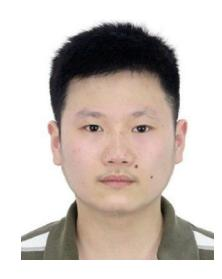

**Nuo Huang** received the B.S. degree in electronics and information engineering from Huazhong University of Science and Technology, Wuhan, China, in 2012, and the Ph.D. degree in information and communication engineering from the National Mobile Communications Research Laboratory, Southeast University, Nanjing, China, in 2019.

He is currently a Research Associate with the Department of Electronic Engineering and Information Science, University of Science and Technology of China, Hefei, China. From December

2015 to June 2017, he was a visiting student with the Department of Electrical Engineering, Columbia University, New York, NY, USA. His research interests include resource allocation and transceiver design in wireless (optical) communications.

Dr. Huang was selected by the National Postdoctoral Program for Innovative Talents in 2019.


**Xu Li** (Member, IEEE) received the B.S. and Ph.D. degrees in electrical and electronics engineering from the University of Science and Technology of China, Hefei, China, in 2010 and 2015, respectively.

From 2013 to 2014, he was a visiting Ph.D. student with the Department of Electrical Engineering and Computer Science, Northwestern University, Evanston, IL, USA. He is currently associated with Shenzhen Research Development Center, Huawei Technologies Company Ltd., Shenzhen, China. His

research involves various architectures of radio access network in 5G, especially the end-to-end network slicing. He has a rich wireless research experience, including ultra-wideband chips, interference alignment, relay networks, stochastic geometry, and public safety wireless broadband networks. His current research topics include microwave wireless communication, radio over fiber communication, and optical wireless communication.