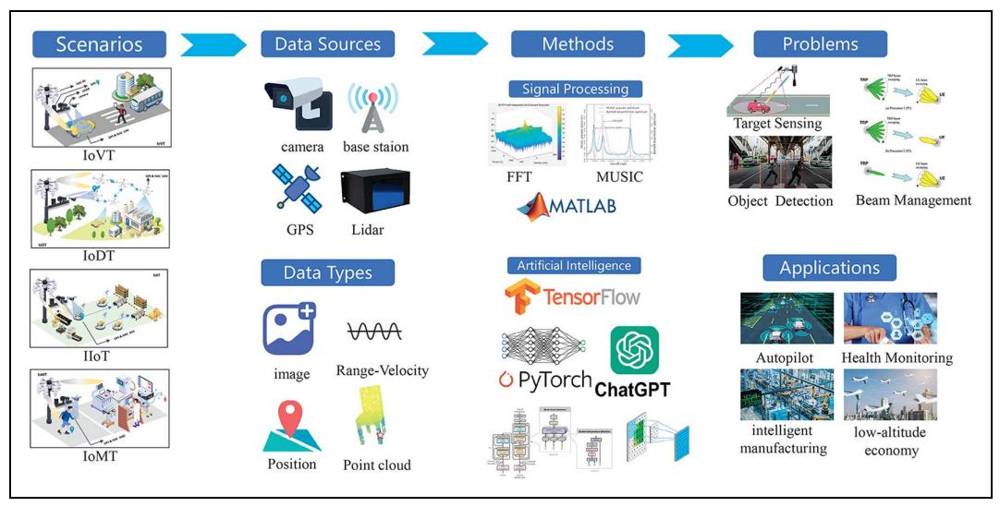
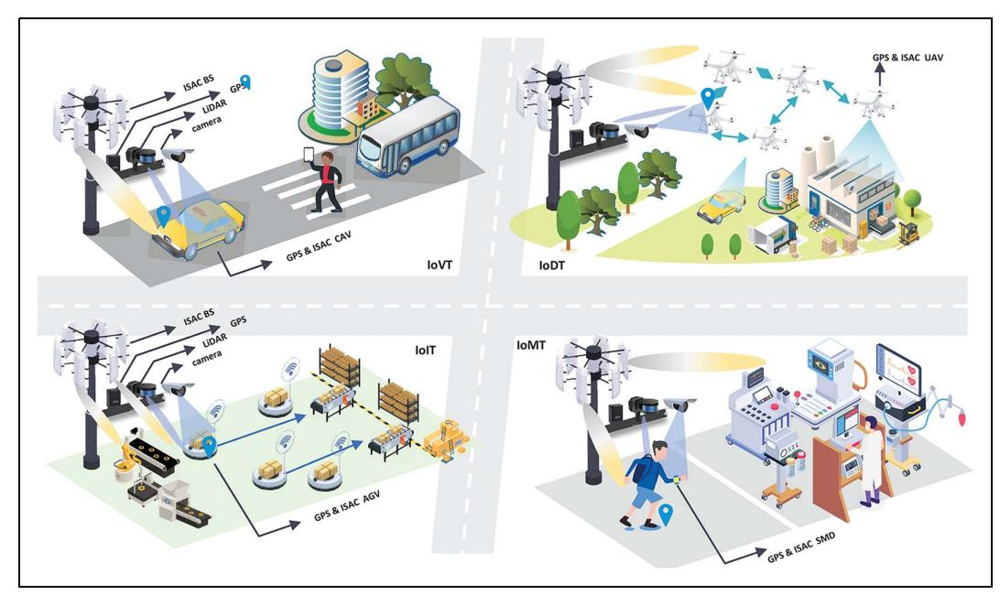
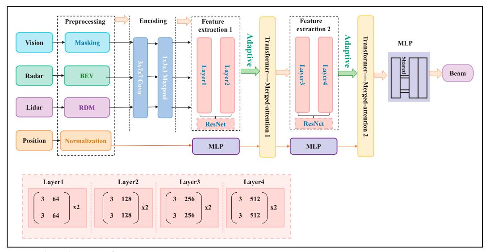

# Multi-Modal Integrated Sensing and Communication in Internet of Things With Large Language Models

Ao Liu ®, Weiwei Jiang ®, Member, IEEE, Sai Huang ®, Senior Member, IEEE, and Zhiyong Feng ®, Senior Member, IEEE

#### **ABSTRACT**

Integrated sensing and communication (ISAC) technology has emerged as a fundamental technology underpinning the advancement of the Internet of Things (IoT). Nonetheless, conventional single-modal ISAC systems predominantly depend on radio frequency radar for environmental awareness. Their performance in complicated dynamic contexts is inadequate because to the constraints of perceptual capability from a single modality. To address this shortcoming, multi-modal ISAC (M-ISAC) enhances the comprehensiveness and precision of environmental information by amalgamating data from several sensors, including radar, Light Detection and Ranging (LiDAR), cameras, and Global Positioning Systems (GPS). In this paper, we initially delineate the conventional application contexts of M-ISAC inside the IoT and evaluates the present state of traditional signal processing techniques and artificial intelligence (AI) in M-ISAC. Subsequently, the architecture of large language models (LLMs) and their potential capacities to improve the efficacy of M-ISAC are shown. Finally, we discuss emerging challenges and future research directions for LLM-driven M-ISAC systems.

#### I. INTRODUCTION

The rapid progression of the sixth generation (6G) mobile communication system has led to significant integration of sensing and communication (ISAC), which is increasingly recognized as a fundamental technology for supporting emerging applications in the Internet of Things (IoT) [1]. ISAC can markedly enhance both spectrum and energy efficiency while simultaneously lowering hardware expenses through the sharing and coordination of spectrum, hardware, and waveform levels, thereby fulfilling the dual requirements of real-time high-precision positioning and high-speed data transmission.

Despite advances in hardware resource reuse, spectrum efficiency, and initial coordination of communication and perception, single-modal ISAC relies exclusively on RF radar for perception, limiting its effectiveness in complex environments [2]. As communication bandwidths expand and physical settings become more intricate, radar sensing struggles to

adequately represent the nuanced and dynamic relationship between electromagnetic signals and the physical world. Non-RF sensors offer varied ambient data to improve perception, although they are limited by intrinsic constraints. These sensors are extremely vulnerable to meteorological and illumination conditions, reducing their effectiveness. For example, Light Detection and Ranging (LiDAR) and Red-Green-Blue-Depth (RGB-D) cameras demonstrate diminished efficacy in conditions of precipitation, snowfall, or low illumination [3], [4].

Multi-modal Integrated Sensing and Communication (M-ISAC) overcomes the limitations of single-modal ISAC by synthesizing multidimensional perception data with communication data. These perception data, sourced from various sensors comprising radar, LiDAR and RGB-D cameras, and Global Positioning System (GPS), enables the capture of multilevel multi-perspective environmental information, significantly enhancing perception accuracy and strengthening communication capabilities [5].

The data obtained from M-ISAC sensors and communication devices display varying formats, semantics, and time-frequency characteristics, complicating data fusion. Conventional fusion and processing methods dependent on ISAC struggle to manage the intricate nonlinear interactions and interdependencies across multi-modal perception and communication, therefore constraining the coordinated optimization of overall system performance.

To address the challenges inherent in M-ISAC, the adoption of artificial intelligence (AI) is crucial [6]. Leveraging its sophisticated data processing, learning, and reasoning capabilities, AI autonomously models the complex nonlinear relationships within multimodal data, extracts key features, and enables effective fusion. Large Language Models (LLMs) exhibit exceptional proficiency in comprehending and processing multi-modal data, leveraging capabilities such as robust cross-modal transfer, contextual learning, and the handling of high-dimensional complex datasets. These attributes render LLMs inherently suitable for integrated multi-modal perception and communication systems. Through pre-training and fine-tuning, LLMs minimize reliance on extensive annotated datasets and swiftly adapt to new tasks. Their crossdomain learning and efficient reasoning outperform

This work was supported by the National Natural Science Foundation of China under Grant 62422103, Grant 62401070, Grant 62321001, and Grant 62171045.

The authors are with the School of Information and Communication Engineering, Beijing University of Posts and Telecommunications, and the Key Laboratory of Universal Wireless Communications, Ministry of Education, Beijing 100876, China. Weiwei Jiang is the corresponding author.

Digital Object Identifier: 10.1109/MIOT.2025.3575888
Date of Current Version: 30 September 2025
Date of Publication: 6 June 2025

FIG. 1. A general system framework of M-ISAC network.

traditional methods in multi-modal data processing, substantially enhancing the overall performance of such systems.

M-ISAC based on LLMs aims to complete the feature representation and intelligent fusion of multimodal perception and communication diversified data through LLMs, and to achieve deep collaboration and enhancement between the multi-modal perception system and the communication system. This paper makes several key contributions to the field of LLM-based M-ISAC systems. We provide a comprehensive overview of the integration of LLMs in M-ISAC systems, evaluating their current state and potential applications across various IoT scenarios. We highlight critical research challenges that need to be addressed to fully realize the potential of LLM-driven M-ISAC systems, such as the lack of highquality multi-modal data, rigorous training requirements, performance-power trade-offs, and limitations in edge computing. Finally, we propose future research directions to address these challenges, including the development of high-quality multimodal datasets, low-cost LLM deployment strategies, knowledge-assisted domain migration, and co-design of signal processing with LLMs. Our key contributions are summarized as follows:

- We provide a comprehensive overview of LLMsbased multi-modal sensing-communication integration in IoT scenarios, by defining the methods, problems, and applications.
- We summarize the state-of-the-art progresses of LLMs-based multi-modal sensing-communication integration, including both multi-modal datasets and LLMs.
- We highlight critical research challenges in designing LLMs for achieving multi-modal sensing-communication integration and propose potential solutions as research opportunities for addressing these challenges.

# II. M-ISAC IN IOT

# A. OVERVIEW

In this section, we introduce the general system framework of M-ISAC network within IoT and evaluate its application potential across various use cases, as illustrated in Fig. 1. We examine the critical challenges and associated technologies of M-ISAC, and investigate the implementation of AI-enhanced M-ISAC from the dual perspectives of communication and perception, elucidating its capacity to support and enhance IoT applications.

The architecture of M-ISAC systems, as illustrated in Fig. 1, highlights the integration of various sensing modalities such as radar, LiDAR, cameras, and GPS, along with communication components like base stations and IoT devices. This multi-modal approach enables the capture of comprehensive environmental data from multiple perspectives, enhancing the accuracy and robustness of both sensing and communication tasks. The data flow in these systems typically involves the collection of raw sensor data, preprocessing to extract relevant features, and fusion of multi-modal data to create a unified representation of the environment. The integration of LLMs further enhances this process by leveraging their advanced reasoning and semantic comprehension capabilities. LLMs can process and interpret the fused multimodal data, generating coherent and contextually relevant outputs that support decision-making and task execution. For example, in an autonomous driving scenario, LLMs can integrate visual data from cameras, distance measurements from LiDAR, and positional data from GPS to provide real-time situational awareness and navigation instructions. This seamless integration of LLMs into the M-ISAC framework not only improves the system's ability to handle complex and dynamic environments but also enables more intelligent and adaptive responses to various challenges, such as occlusions, changing weather conditions, and varying traffic patterns.

# B. SCENARIOS

M-ISAC technology is extensively utilized across various domains, including the Internet of Vehicular Things (IoVT), Internet of Drone Things (IoDT), Industrial Internet of Things (IIoT), and Internet of Medical Things (IoMT), as shown in Fig. [2.](#page-2-0) It markedly enhances the efficiency, safety, and functionality across diverse domains by amalgamating multi-source data and facilitating real-time communication. Subsequently, we elucidate the implementation of M-ISAC in various fields.

FIG. 2. Application scenarios of the M-ISAC technology.

- 1) Internet of Vehicular Things: IoVT, especially in autonomous driving, utilizes M-ISAC technology to augment environmental awareness, enhance safety, and optimize traffic flow. Principal applications encompass cooperative perception, wherein vehicles exchange sensor data through Vehicle-to-everything (V2X) communication to mitigate challenges like occlusion and limited field of view; high-precision positioning, employing ISAC in conjunction with massive MIMO and broadband technology to attain centimeter-level accuracy, essential for navigation in regions with inadequate GPS signals; and environmental modeling, where multi-modal sensing facilitates simultaneous localization and mapping (SLAM).
- 2) Internet of Drone Things: IoDT employs M-ISAC technology to promote effective collaboration and communication. Multi-modal sensing supports real-time drone localization and guarantees uninterrupted communication links, essential for intricate swarm operations. The M-ISAC base station tracks the positions and communication channels of the drone swarm to identify network variations or disruptions, enhancing swarm performance. Furthermore, the M-ISAC drone swarm exhibits self-healing capabilities, dynamically adjusting its topology to restore communication and ensure mission continuity, thereby reinforcing network robustness and resilience in dynamic environments.
- 3) Industrial Internet of Things: IIoT utilizes the M-ISAC technology to manage complex data and monitor production processes in real time. M-ISAC integrates multiple sensors to collect comprehensive environmental data while ensuring operational continuity through robust communication protocols. M-ISAC empowers the IIoT to concurrently process and transmit extensive sensor data for real-time decision-making, while enabling high-precision, broadspectrum perception to construct virtual models, thereby optimizing factory operations and enhancing production efficiency.
- 4) Internet of Medical Things: IoMT relies on M-ISAC to meet modern healthcare needs through comprehensive, real-time monitoring and efficient

data processing. Key applications encompass noncontact health monitoring, wherein vital signs are assessed without wearable devices, improving patient comfort and minimizing infection risks; medical imaging, utilizing terahertz imaging for early diagnosis and personalized treatment by detecting conditions such as cancer and monitoring biochemical markers; telemedicine, ensuring precise, real-time transmission of physiological signals and medical images; and motion monitoring, where multi-modal sensing enables highprecision tracking of patient movements, enhancing recovery through real-time feedback during activities like physical therapy.

# C. METHODS

This section outlines the fundamental enabling technologies of M-ISAC. Initially, it introduces conventional signal processing methods, then analyzing exemplary AI algorithms designed for M-ISAC applications.

#### 1) Signal Processing:

 Channel Estimation: Traditional M-ISAC channel estimation methods primarily rely on three technical frameworks. The first employs independent statistical models, such as Rayleigh fading for communication channels and path loss models for sensing channels, which overlooks the spatial consistency arising from shared environmental scatterers. The second utilizes deterministic high-precision techniques like ray tracing, offering accurate physical propagation characterization but incurring computational complexity that scales with scenario dynamics, thus failing to meet real-time demands. The third adopts cluster-based sparse models to reduce dimensionality via multi-path component clustering, yet it inadequately captures the evolution of dynamic scatterers. Common limitations across these approaches include insufficient modeling of the coupling between communication and sensing channels, and a pronounced trade-off between high computational cost and low generalizability [\[7\].](#page-8-0) These shortcomings collectively hinder collaborative

| Category               | Representative Model            | Application Areas                                                           |
|------------------------|---------------------------------|-----------------------------------------------------------------------------|
| Neural Networks        | DNN, CNN                        | Signal detection, target recognition, image classification.                 |
| Generative Models      | GAN                             | Data augmentation, channel modeling, image generation.                      |
| Graph Models           | GNN                             | Network sensing, link prediction, topology optimization.                    |
| Sequential Models      | LSTM                            | Channel prediction, time series data analysis, resource allocation.         |
| Reinforcement Learning | DRL                             | Autonomous driving, resource allocation, decision optimization.             |
| Distributed Learning   | FL                              | Collective spectrum sensing, data privacy protection, distributed learning. |
| Transfer Learning      | Transfer Learning               | Cross-modal task adaptation, signal processing, image classification.       |
| Few-shot Learning      | Few-shot Learning               | Anomaly detection, scene classification, few-shot signal processing.        |
| LLMs                   | GPT Series, Llama               | Natural language processing, reasoning, decision support.                   |
| Supervised Learning    | Linear Regression, SVM, KNN, NN | Signal classification, target detection, channel estimation.                |

TABLE I. Summary of models and applications.

- accuracy and system robustness in dynamic scenarios [8].
- Positioning: In M-ISAC systems, precise positioning hinges on accurately estimating angle, distance, and Doppler parameters, yet this remains a complex challenge. Traditional approaches, such as the cross-spectrum algorithm, are straightforward but constrained by limited resolution and noise susceptibility. Two-dimensional fast Fourier transform (2D-DFT) effectively estimates distance and Doppler parameters [9], though it incurs high computational complexity and grid-based resolution limitations. Subspace decomposition techniques, including MUSIC and ESPRIT, achieve superior resolution but are sensitive to model assumptions and computationally intensive. Maximum likelihood estimation delivers high accuracy yet proves impractical for real-time applications due to its complexity. Compressed sensing exploits channel sparsity to lower computational demands, but its efficacy diminishes when sparsity assumptions fail. Collectively, these methods exhibit drawbacks such as limited resolution, high computational cost, sensitivity to assumptions, and inadequate real-time performance, constraining their effectiveness in dynamic M-ISAC positioning scenarios [10].
- 2) Artificial Intelligence: This section succinctly outlines the capability of prominent AI models to improve M-ISAC systems. Table I delineates the particular AI models and their utilization within M-ISAC.
- Al-enhanced M-ISAC Communication: In M-ISAC systems, AI plays a key role in optimizing resource management and improving channel prediction accuracy. Traditional methods struggle with the complexity of large-scale IoT, especially regarding multi-channel coefficients. Machine learning (ML) offers efficient precoding strategies by learning complex patterns, such as optimizing beamforming with deep neural networks to reduce interference. In channel prediction, AI models like long short-term memory networks (LSTM) and graph neural networks (GNN) provide significant advantages. LSTM captures the nonlinear temporal characteristics of fading channels and integrates multimodal data for precise time series prediction, while GNN analyzes spatial correlations and data coupling across nodes for scalable prediction in large systems. LSTM excels in time-domain modeling,

- and GNN emphasizes spatial coordination. Together, they combine high-dimensional features and scene information, supporting resource scheduling, power control, and network optimization in ISAC systems for intelligent communication and sensing integration [8].
- Al-enhanced M-ISAC sensing: In M-ISAC systems, Al-driven perception positioning enhances accuracy and robustness by integrating multi-modal data fusion with dynamic environment modeling. Deep neural networks (DNNs) employ end-to-end learning to capture nonlinear spatiotemporal relationships among heterogeneous sensors, enabling feature alignment and synergistic optimization of multi-source data. For instance, a graph neural network-based spatiotemporal fusion framework models the dynamic interplay between vehicle trajectories and scatterer distributions, while attention mechanisms adaptively weight sensor confidence, mitigating multipath artifacts and boosting target resolution in high-speed scenarios. Reinforcement learning (RL) optimizes the joint allocation of sensing and communication resources, dynamically tuning beam scanning frequency and signal power in dense multi-user settings to minimize positioning latency and maximize communication capacity [11]. Additionally, federated learning enables distributed nodes to share local environmental insights under privacy constraints, constructing a global digital twin model to improve generalization in complex environments. These AI techniques surmount traditional methods' reliance on static assumptions, enhancing adaptability to occlusion, Doppler shifts, and interference through real-time optimization [12].

# III. LLMs

LLMs have significantly advanced artificial intelligence. Rooted in machine learning and natural language processing (NLP), their progress hinges on the Transformer architecture, which markedly improved text generation and comprehension. This breakthrough enabled the development of models like OpenAl's GPT series and open-source systems such as Llama [13]. LLMs possess capabilities for complex reasoning, decision-making, and multi-modal information processing, crucial for tasks involving text generation, planning, and human-computer interactions.

FIG. 3. The architecture of MLLMs.

Furthermore, by effectively fusing multi-modal data, LLMs demonstrate considerable potential within M-ISAC systems.

This section seeks to elucidate the current capabilities, architectural framework, and limitations of LLMs while investigating their potential applications within M-ISAC.

#### A. MULTI-MODAL LLMS

Multi-modal Large Language Models (MLLMs) represent an advanced evolution of artificial intelligence systems, extending the foundational framework of LLMs. These models are engineered to proficiently process and generate multi-modal data-encompassing text, images, videos, and audio-and find extensive application in content generation and cross-modal tasks. Their distinguishing characteristics include: (1) a parameter scale reaching billions, vastly surpassing traditional models and conferring exceptional modeling capacity; and (2) the adoption of innovative training paradigms, such as multi-modal instruction tuning, which markedly enhances their proficiency in interpreting and executing complex directives [14].

1) MLLMs Framework: As illustrated in Fig. 3, the architecture of MLLMs typically comprises three integral components: (1) a pre-trained modality encoder, tasked with extracting high-resolution features from diverse multi-modal inputs; (2) a pre-trained LLMs, which encapsulates extensive knowledge and exhibits superior reasoning and generalization capabilities; and (3) a modality interface, which facilitates seamless integration between multi-modal data and natural language through learnable connectors or specialized expert models. This structure enables efficient mapping of heterogeneous inputs to versatile outputs, bridging the divide between modalities with precision and adaptability.

2) LLMs Data and Training: The training of MLLMs is methodically divided into three phases: pre-training, instruction fine-tuning, and alignment fine-tuning, each employing specific datasets to fulfill designated goals. In pre-training, extensive multi-modal paired datasets, including image-text pairings, are utilized to synchronize visual inputs with the representation space of the foundational LLMs, thereby enhancing the comprehension of visual tokens. This step generally entails preserving the integrity of

pre-trained components, such as visual encoders and LLMs, while enhancing learnable interfaces to guarantee cross-modal consistency and uphold core knowledge, with training resolution modified based on the data's properties. Instruction fine-tuning utilizes a diverse range of task-specific datasets to improve the model's effectiveness in downstream applications and its ability to comprehend and execute instructions. Alignment fine-tuning employs reinforcement learning methodologies to enhance model calibration, assuring conformity with specific operational criteria. Through this rigorous, multi-phase procedure, MLLMs attain strong integration of multi-modal information and adaptability to various tasks.

#### B. LLM-ENHANCED M-ISAC

In M-ISAC systems, LLMs utilize their sophisticated semantic comprehension and reasoning abilities to improve system performance and task efficiency. LLMs function as central controllers by breaking down intricate tasks into subtasks by chain-of-thought reasoning, allocating them to suitable tools or modules, as demonstrated by Vesprog's application of GPT-3 to produce structured visual programs with optimized prompts enhanced by human examples. LLMs, as decision-makers, integrate contextual and historical data across iterative tasks, evaluate data adequacy for informed judgments, and provide userfriendly responses to facilitate engagement. As semantic enhancers, LLMs amalgamate multi-modal input, generating coherent natural language outputs customized to particular needs, so augmenting the semantic representation of sensory and communicative data. LLMs promote task decomposition, resource coordination, and information processing in M-ISAC systems by contributing to control, decisionmaking, and semantic augmentation.

The M-ISAC system demonstrates that MLLMs possess significant application potential in data fusion, target identification, resource optimization, and security monitoring due to their remarkable capabilities. The following sections outline their distinct roles and contributions

1) Integration of Many Modalities and Comprehension of Context: Leveraging their advanced semantic comprehension, LLMs facilitate the systematic amalgamation of textual descriptions,

| <b>Dataset Classification</b> | Dataset Name           | Description                                                                                                                                                                                                             |
|-------------------------------|------------------------|-------------------------------------------------------------------------------------------------------------------------------------------------------------------------------------------------------------------------|
| real-world dataset            | e-FLASH                | Large-scale multi-modal data collection, including machine, GPS, LiDAR, and RF measurement data. Used for studying millimeter-wave communication, including LoS (Line-of-Sight) and NLoS (Non-Line-of-Sight) scenarios. |
| real-world dataset            | DeepSense 6G           | Large-scale real-world multi-modal data collection, including communication and sensor data. Designed for environments with rapidly changing scenes and increasing scene complexity.                                    |
| simulated dataset             | Vision-Wireless (ViWi) | Provides visual data and wireless communication channel data sharing, installed on RSU, but does not include the vehicle-to-vehicle (V2V) wireless communication data.                                                  |
| simulated dataset             | M 3 SC      | A system supporting field-specific scene recognition and data collection, integrating sensor data and wireless communication, considering mmMIMO and millimeter-wave communication.                                     |

TABLE II. Overview of real-world and simulated M-ISAC datasets.

contextual information, and perceptual inputs including photographic and radar data across many levels. By utilizing language as an interpretative framework to support additional modalities, LLMs augment the system's potential for intuitive and coherent perception, hence enhancing its capability to understand complicated situations with increased precision and depth.

2) Object Recognition and Scene Analysis: LLMs derive semantic information from M-ISAC data, including item locations and behavioral descriptions, to enhance object recognition and scene analysis. In constrained samples or unexpected contexts, LLMs enhance detection efficacy by leveraging their extensive knowledge base and reasoning capabilities. LLMs provide intuitive and accessible sensory modules by integrating vision, text, and light sensitivity. In mobile devices, LLM agents analyze eye tracking, bodily movements, and brain wave signals, but in vehicular networks, they utilize LIDAR, and GPS for accurate location detection. Multi-modal data and advanced cognition provide robust and adaptable sensing systems.

3) Adaptive Strategy Generation: LLMs produce natural language for beam management, channel selection, and coding/modulation methods, which are translated into control instructions for adaptive strategy formulation in integrated sensing and communication systems. Natural language interaction and querying provide swift scheduling and optimization of perceptual and communicative resources, establishing a flexible and efficient operational framework. This approach enhances the flexibility and responsiveness of resource allocation, guaranteeing strong performance under varying conditions.

4) Edge/Cloud Collaboration and Unified Interface: On the edge side, sensor data is initially processed by a lightweight language model and then analyzed collaboratively with a large LLM on the cloud through Prompt, taking into account both efficiency and depth. In addition, LLM explains the perception and decision-making process in natural language, enhancing the system's interpretability and user trust.

5) Situational Awareness and Security Surveillance: Sensor data is first processed by a light-weight language model at the edge, then collaboratively analyzed with a big LLM in the cloud via Prompt, considering both efficiency and depth. Furthermore, LLM elucidates the perception and decision-making processes in natural language,

hence augmenting the system's interpretability and fostering user trust.

#### C. M-ISAC DATASETS

LLMs possess the capability to process multi-modal data, hence augmenting the diverse functionalities of M-ISAC intelligently. High-quality datasets are fundamental to the learning capabilities of LLMs and are crucial for ensuring the accuracy and reliability of the output results. Consequently, M-ISAC research utilizing LLMs is intricately linked to the procurement and application of superior datasets.

M-ISAC datasets are now categorized into two types: real-world datasets acquired through actual collecting and simulated datasets produced using powerful simulation platforms [15]. The actual collected dataset possesses a high level of reliability and can precisely represent the intricate environmental attributes of the real world. Nonetheless, it is constrained by labor and expenses, rendering it incapable of adaptively addressing the specific requirements of researchers. Conversely, simulated datasets mitigate this constraint by lowering expenses and enabling researchers to tailor the simulation environment. The simulation platform's reliability has been validated through current measurement efforts; yet, a discrepancy persists between its outputs and actual test scenarios

Table II summarizes the basic information of several existing datasets.

## IV. CHALLENGES

The challenges facing LLM-enhanced M-ISAC systems have significant implications for their practical implementation and performance. First, the lack of high-quality multi-modal data restricts the training and fine-tuning of LLMs, leading to potential inaccuracies and limited generalizability in real-world applications. For example, insufficient data can result in models that fail to recognize rare but critical scenarios in autonomous driving or industrial monitoring. Second, the rigorous training requirements of LLMs, such as their tendency to generate "hallucinations" due to reliance on statistical patterns, can lead to unreliable outputs in safety-critical tasks. Third, the performancepower trade-off is particularly critical in real-time applications. For instance, in autonomous driving, where latency thresholds must be below 10 milliseconds to ensure safety, current LLMs may struggle to meet these demands due to their computational complexity. Edge computing limitations further exacerbate this issue. Edge devices typically have limited energy budgets, often below 1 watt for small IoT sensors, and processing delays can exceed 50 milliseconds for complex LLM tasks, significantly hindering real-time performance.

# A. LACK OF HIGH-QUALITY MULTI-MODAL DATA

Datasets encompassing multi-modal sensing and communication data remain insufficient. Due to constraints in cost, labor, and material resources, real-world M-ISAC datasets are scarce and predominantly restricted to fixed scenarios. While simulated datasets offer the advantage of flexible customization for specific research programs and the adjustment of device parameters, they frequently fail to encapsulate the full complexity and randomness inherent in real-world environments. Moreover, their transferability to authentic settings necessitates further empirical validation. To facilitate deeper exploration of M-ISAC leveraging LLMs, there is an urgent need for intensified research efforts focused on the construction of comprehensive datasets.

To address the challenge of insufficient highquality multi-modal data, collaborative data collection across distributed edge devices can be a powerful solution. By pooling data from various sources, such as urban traffic systems, industrial sensors, and healthcare monitors, researchers can create more diverse and representative datasets. Automated annotation techniques, leveraging machine learning algorithms to label data, can significantly reduce the manual effort required. Additionally, advanced simulation techniques that combine physical modeling with data-driven approaches can generate synthetic datasets that closely mimic real-world conditions. Validating these synthetic datasets in actual scenarios ensures their reliability and robustness, making them suitable for training and fine-tuning LLMs. These efforts collectively enhance the quality and diversity of multi-modal data, improving the accuracy and generalizability of LLMs in M-ISAC systems.

#### B. RIGOROUS TRAINING REQUIREMENTS FOR LLMS

LLMs depend on statistical patterns instead of factverified generation methods. LLMs anticipate and generate content based on the chance of word co-occurrence in training data, lack the capacity to assess the validity or logical coherence of information, and may consequently produce "hallucinations," which refer to unverified or erroneous material. In domains characterized by ambiguous knowledge limits or limited data, such as professional matters or recent occurrences, the model may rely on conjecture derived from historical trends instead of trustworthy sources, leading to diminished credibility of the information. The precision of LLM is constrained by the quality and diversity of the training data. This limitation considerably restricts its use in contexts necessitating great precision and verifiability, such as scientific study or medical diagnosis.

To mitigate the rigorous training requirements of LLMs, several strategies can be employed. Instruction tuning and alignment fine-tuning can improve the accuracy and reliability of LLMs in specific applications by adapting them to task-specific datasets. Knowledge distillation, where knowledge from larger models is transferred to smaller, more efficient models, can enhance performance while reducing computational demands. Hybrid models that integrate

LLMs with domain-specific models incorporating physical laws and expert knowledge can improve prediction accuracy.

# C. Performance-Power Trade-Off

In contexts such as autonomous driving and industrial automation, target perception, data fusion, beam management, and communication scheduling must be executed within milliseconds or less. Current high-performance deep learning or reinforcement learning algorithms frequently necessitate tens to hundreds of milliseconds for reasoning, which remains inadequate under conditions of high-speed mobility or stringent security demands. Furthermore, increased model size correlates with greater computational latency, resulting in a paradox.

Addressing the performance-power trade-off in LLMs involves optimizing both the models and the hardware used for deployment. Model compression techniques, such as pruning and quantization, can significantly reduce the size and computational complexity of LLMs without compromising performance. Hardware acceleration using specialized processors like GPUs, TPUs, and FPGAs can speed up inference times, making LLMs more viable for real-time applications. Implementing edge-cloud collaboration frameworks, where initial processing is done on edge devices and more complex computations are offloaded to the cloud, can balance efficiency and latency.

#### D. EDGE COMPUTING LIMITATIONS

M-ISAC applications usually rely on intelligent nodes on the edge. However, these nodes are limited by energy consumption and hardware performance, making it difficult to support reasoning and training of large-scale models. Although technologies such as model compression and quantization have made progress, achieving ultra-low latency and low energy consumption while ensuring algorithm accuracy and robustness remains an unresolved challenge.

To overcome edge computing limitations, energy-efficient algorithms and adaptive resource management strategies are essential. Developing lightweight neural network architectures specifically designed for low-power consumption can improve the feasibility of deploying LLMs on edge devices. Adaptive resource management techniques that dynamically allocate computational resources based on real-time demands can optimize energy usage and performance. Federated learning, which enables distributed training across multiple edge devices, can reduce the computational burden on individual devices while improving model accuracy through collective learning.

#### E. INTERPRETABILITY OF MULTI-MODAL LLMS

The intermediate decision-making process of LLMs when processing multidimensional data such as images, radar echoes, and channel state information is often non-transparent. The complex architecture leads to insufficient interpretability and lack of transparency in the decision-making process. Once a decision error occurs in a critical task (such as safety monitoring and unmanned driving), it is difficult to trace and correct the hidden dangers within the model. Establishing intelligent visualization methods to enhance the understanding of high-dimensional data features is another challenge for future research on interpretable AI models.

Enhancing the interpretability of multi-modal LLMs is crucial for their deployment in critical applications. Explainable AI (XAI) techniques, such as attention mechanisms and feature visualization, can provide insights into the reasoning behind LLM decisions. Tools like SHAP (SHapley Additive exPlanations) and LIME (Local Interpretable Model-agnostic Explanations) can help explain the contributions of different features and modalities to the final output. Simplifying model architectures without sacrificing performance can also improve interpretability, making it easier to understand and trust the decisions made by LLMs.

# V. OPPORTUNITIES

While some investigations have been conducted on LLM-based M-ISAC systems, further efforts are required for specific requirements and scenarios. Consequently, the subsequent section delineates various prospective avenues in this subject.

### A. HIGH-QUALITY MULTI-MODAL DATA ACQUISITION

To augment the complexity and representative randomness of the dataset while safeguarding privacy, a viable strategy is to consolidate diverse real-world data (encompassing urban traffic, industrial monitoring, and healthcare monitoring) via collaborative multi-modal data collection from distributed edge devices. This method, in conjunction with automated technologies, can significantly diminish dependence on manual annotations. To mitigate the deficiency of real-world data, it is imperative to enhance the technology for generating synthetic datasets. Future simulation strategies must incorporate hybrid approaches that merge physical modelling with data-driven techniques to ensure that the produced data accurately represents the dynamic attributes of the actual world. The utility of such synthetic data must be validated in actual circumstances to confirm its resilience and reliability.

#### B. LOW-COST LLM DEPLOYMENT

Minimizing the deployment expenses of LLMs can facilitate advancements by enhancing edge reasoning and fostering collaboration among cloud, edge, and end systems. Lightweight models, when paired with hardware acceleration, enhance the reasoning efficiency of edge nodes and meet millisecond-level real-time requirements. The cloud-edge-end collaboration framework delegates complex computations to the cloud via dynamic task allocation, while maintaining the low-latency response capability of the edge. Energy efficiency optimization strategies, including data compression and energy harvesting, further mitigate the resource constraints of edge devices. This holistic strategy aims to facilitate the effective implementation of LLMs in contexts like as autonomous driving and industrial automation, while also supporting 6G smart connection.

#### C. Knowledge-Assisted Domain Migration

Future studies may investigate methods to enhance the transition of LLM from language processing to multi-modal data processing by leveraging expert knowledge in wireless communications. A primary objective is to develop a migration framework that amalgamates expert knowledge, integrating physical models in wireless communications (including channel fading and interference characteristics) with the statistical modeling proficiency of LLM to augment the model's comprehension and predictive abilities for multi-modal data (such as CSI, radar echoes, and spectrum information). By incorporating domain-specific prior knowledge, such as multipath propagation laws or antenna array parameters, into the pre-processing and embedding modules of LLMs, the efficiency of feature extraction from non-text data can be enhanced, thus bridging the semantic gap between linguistic data and wireless multi-modal data

#### D. Co-Design of Signal Processing LLM

To enhance multi-modal information integration and augment system efficacy. A primary objective is to integrate signal processing technology with LLM to provide an effective framework for data processing and modeling that addresses the diverse requirements of raw data, feature, and semantic level fusion. In raw data level fusion, signal processing techniques preprocess sensor inputs to alleviate load, enabling real-time prediction and analysis via LLM's time series modeling capabilities; in feature level fusion, AI feature extraction technology integrates with LLM's cross-modal reasoning abilities to create adaptive modules that optimize performance and data volume, facilitating precise abstraction of environmental information; in semantic level fusion, leveraging LLM's robust semantic comprehension, unified information mapping and associations are established.

## VI. CONCLUSION

In this paper, we have provided a comprehensive overview of the application scenarios of M-ISAC in the IoT and detailed the implementation of conventional signal processing techniques and AI models within M-ISAC. We have presented the universal framework, functionalities, and applications of LLM-enhanced M-ISAC systems, highlighting their potential to significantly improve the integration and processing of multi-modal data. Our analysis has identified several critical challenges, including the lack of high-quality multi-modal data, rigorous training requirements for LLMs, performance-power trade-offs, and limitations in edge computing. These challenges, if addressed, can unlock the full potential of LLM-driven M-ISAC systems.

To advance the field, we propose several future research directions. First, the development of highquality multi-modal datasets is essential to improve the accuracy and generalizability of LLMs in M-ISAC systems. Second, strategies for low-cost LLM deployment, such as model compression and cloud-edge collaboration, are needed to meet real-time performance requirements while minimizing energy consumption. Third, knowledge-assisted domain migration can enhance the transition of LLMs from language processing to multi-modal data processing by incorporating expert knowledge in wireless communications. Finally, the co-design of signal processing with LLMs can provide an effective framework for data processing and modeling, addressing the diverse requirements of raw data, feature, and semantic level fusion.

#### REFERENCES

[1] W. Saad, M. Bennis, and M. Chen, "A vision of 6G wireless systems: Applications, trends, technologies, and open

- research problems," IEEE Netw., vol. 34, no. 3, pp. 134–142, Oct. 2019.
- [2] H. Zhang, S. Gao, X. Cheng, and L. Yang, "Integrated sensing and communications towards proactive beamforming in mmWave V2I via multi-modal feature fusion (MMFF)," IEEE Trans. Wireless Commun., vol. 23, no. 11, pp. 15721–15735, Jun. 2024.
- [3] M. Alrabeiah, A. Hredzak, and A. Alkhateeb, "Millimeter wave base stations with cameras: Vision-aided beam and blockage prediction," in Proc. IEEE 91st Veh. Technol. Conf. (VTC2020-Spring), Antwerp, Belgium, 2020, pp. 1–5.
- [4] A. Klautau, N. Gonzalez-Prelcic, and R. W. Heath, "LIDAR data for deep learning-based mmWave beam-selection," IEEE Wireless Commun. Lett., vol. 8, no. 3, pp. 909–912, Feb. 2019.
- [5] A. Alkhateeb et al., "DeepSense 6G: A large-scale real-world multi-modal sensing and communication dataset," IEEE Commun. Mag., vol. 61, no. 9, pp. 122–128, Sep. 2023.
- [6] N. Wu et al., "AI-enhanced integrated sensing and communications: Advancements, challenges, and prospects," IEEE Commun. Mag., vol. 62, no. 9, pp. 144–150, Sep. 2024.
- [7] Y. Li, Y. Zhan, L. Zheng, and X. Wang, "Device activity detection and channel estimation for millimeter-wave massive MIMO," IEEE Trans. Commun., vol. 72, no. 2, pp. 1062–1074, Oct. 2024.
- [8] Y. Shi et al., "Machine learning for large-scale optimization in 6G wireless networks," IEEE Commun. Surveys Tuts., vol. 25, no. 4, pp. 2088–2132, Fourthquarter 2023.
- [9] C. Sturm and W. Wiesbeck, "Waveform design and signal processing aspects for fusion of wireless communications and radar sensing," Proc. IEEE, vol. 99, no. 7, pp. 1236–1259, May 2011.
- [10] M. L. Rahman, J. A. Zhang, X. Huang, Y. J. Guo, and R. W. Heath, "Framework for a perceptive mobile network using joint communication and radar sensing," IEEE Trans. Aerosp. Electron. Syst., vol. 56, no. 3, pp. 1926–1941, Jun. 2019.
- [11] P. Saikia, K. Singh, W.-J. Huang, and T. Q. Duong, "Hybrid deep reinforcement learning for enhancing localization and communication efficiency in RIS-aided cooperative ISAC systems," IEEE Internet Things J., vol. 11, no. 18, pp. 29494–29510, Sep. 2024.
- [12] X. Liu, H. Zhang, C. Ren, H. Li, C. Sun, and V. C. Leung, "Multi-task learning resource allocation in federated integrated sensing and communication networks," IEEE Trans. Wireless Commun., vol. 23, no. 9, pp. 11612–11623, Sep. 2024.
- [13] A. Maatouk, N. Piovesan, F. Ayed, A. De Domenico, and M. Debbah, "Large language models for telecom: Forthcoming

- impact on the industry," IEEE Commun. Mag., vol. 63, no. 1, pp. 62–68, Jan. 2025.
- [14] S. Yin et al., "A survey on multimodal large language models," Jun. 2023. [Online]. Available: [https://arxiv.org/](https://arxiv.org/abs/2306.13549) [abs/2306.13549](https://arxiv.org/abs/2306.13549)
- [15] X. Cheng et al., "Intelligent multi-modal sensingcommunication integration: Synesthesia of machines," IEEE Commun. Surveys Tuts., vol. 26, no. 1, pp. 258–301, Nov. 2024.

## BIOGRAPHIES

AO LIU received the B.S. degree from the University of Science and Technology Beijing (USTB), in 2020. She is currently working toward the Ph.D. degree with Beijing University of Posts and Telecommunications (BUPT). Her research interests include wireless communication, radar sensing, integrate communication and sensing network, and signal processing.

WEIWEI JIANG (Member, IEEE) received the B.Sc. and Ph.D. degrees from the Department of Electronic Engineering, Tsinghua University, Beijing, China, in 2013 and 2018, respectively. Currently, he is an Assistant Professor with the School of Information and Communication Engineering, Beijing University of Posts and Telecommunications, and Key Laboratory of Universal Wireless Communications, Ministry of Education. His current research interests include artificial intelligence for networking and communication, satellite communication, and smart grid communication.

SAI HUANG (Senior Member, IEEE) is currently a Full Professor with the Department of Information and Communication Engineering, Beijing University of Posts and Telecommunications (BUPT), and serves as an Academic Secretary for the Key Laboratory of Universal Wireless Communications, Ministry of Education, China. His research interests include machine learning assisted intelligent signal processing, statistical spectrum sensing and analysis, fast detection and depth recognition of universal wireless signals, millimeter wave signal processing, and cognitive radio network.

ZHIYONG FENG (Senior Member, IEEE) received the B.S., M.S., and Ph.D. degrees from Beijing University of Posts and Telecommunications (BUPT), Beijing, China, in 1993, 1997, and 2009, respectively. Currently, she is a Full Professor with BUPT and the Director of the Key Laboratory of Universal Wireless Communications, Ministry of Education, China. Her research interests include 5G mobile networks, ISAC system design, wireless network architecture design, cognitive wireless networks, universal signal detection and identification, and network information theory.