{0}------------------------------------------------

# A Spectrum-Efficient MoF Architecture for Joint Sensing and Communication in B5G Based on Polarization Interleaving and Polarization-Insensitive Filtering

Mingzheng Lei, Min Zhu, Bingchang Hua, Jiao Zhang, Yuancheng Cai, Yucong Zou, Xiang Liu, and Jianjun Yu, Fellow, IEEE, Fellow, OSA

Abstract—The intelligentization of future society puts forward an urgent demand for high-precision sensing and ultra-high-speed wireless communications in the upcoming beyond fifth-generation (B5G) era. We propose and experimentally demonstrate a novel spectrum-efficient MMW-over-fiber (MoF) architecture for joint sensing and communication in B5G optical-wireless converged networks. The proposed MoF architecture is based on polarization interleaving and polarization-insensitive filtering. In the proposed architecture, the sensing and communication sidebands are generated simultaneously through asymmetrical single-sideband (ASSB) modulation, whereas the two local oscillator (LO) sidebands up-converting the sensing and communication signals to MMW band are obtained by carrier-suppressed double-sideband (CS-DSB) modulation. By interleaving the two sets of sidebands for sensing and communication in two orthogonal polarizations, the demand for higher bandwidth devices and the occupied spectral grid can thus be effectively reduced. The ASSB modulation eliminates the chromatic-dispersion- (CD) induced power fading for long-reach services. The polarization-insensitive filtering removes the need for complicated polarization tracking, resulting in a simple structure at the remote units (RUs) and polarization-free digital signal processing (DSP) at the user ends (UEs). Moreover, the two sets of sidebands originate from a shared laser, so frequency offset estimation (FOE) can be avoided to further reduce the complexity

Manuscript received 14 January 2022; revised 7 May 2022 and 31 May 2022; accepted 2 June 2022. Date of publication 10 June 2022; date of current version 21 October 2022. This work was supported in part by the National Natural Science Foundation of China under Grants 62101121 and 62101126, in part by the Key Research and Development Program of Jiangsu Province under Grant BE2020012, in part by the Open Fund of IPOC (BUPT) under Grant IPOC2021A01, and in part by the Major Key Project of Peng Cheng Laboratory under Grant PCL2021A01-2. (Corresponding author: Min Zhu.)

Mingzheng Lei, Bingchang Hua, Yucong Zou, and Xiang Liu are with the Purple Mountain Laboratories, Nanjing, Jiangsu 211111, China (e-mail: 2016010326@bupt.cn; huabingchang@pmlabs.com.cn; zouyucong@pmlabs.com.cn; 230208580@seu.edu.cn).

Min Zhu, Jiao Zhang, and Yuancheng Cai are with the Purple Mountain Laboratories, Nanjing, Jiangsu 211111, China, and also with the National Mobile Communications Research Laboratory, Southeast University, Nanjing 210096, China (e-mail: minzhu@seu.edu.cn; jiaozhang@seu.edu.cn; caiyuancheng@pmlabs.com.cn).

Jianjun Yu is with the Purple Mountain Laboratories, Nanjing, Jiangsu 211111, China, and also with the Key Laboratory for Information Science of Electromagnetic Waves, Fudan University, Shanghai 200433, China (e-mail: jianjun@fudan.edu.cn).

Color versions of one or more figures in this article are available at https://doi.org/10.1109/JLT.2022.3181608.

Digital Object Identifier 10.1109/JLT.2022.3181608

and power consumption of the DSP, thereby facilitating a user-friendly terminal. The experimental results show that a  $\pm 15\text{-mm}$  ranging accuracy at B5G MMW band for single-target detection is achieved, and a 30-cm ranging resolution for dual-target detection is also realized. Furthermore, a 23-Gbit/s error-free transmission rate at 28GHz over 5.41-km single-mode fiber (SMF) and 2-m wireless distance is successfully demonstrated without frequency offset compensation.

Index Terms—Microwave photonics, MMW, radar sensing, radio-over-fiber, wireless communication.

### I. INTRODUCTION

HE emerging intelligent services such as smart factory, intelligent driving, and smart home, have put forward an urgent need for high-precision sensing and ultra-high-speed wireless communications in the upcoming B5G mobile communications era [1]. Recently, radar sensing and wireless communications are developing towards MMW bands, because the realization of high-precision sensing and ultra-high-speed wireless communications is inseparable from the support of large bandwidth [2], [3]. In distributed MMW networks, the radio-over-fiber (RoF) technology with ultra-low transmission loss shows great potential due to the serious attenuations caused by coaxial cables [4], [5]. Besides, the centralized processing characteristics of RoF links can greatly simplify the structures of remote units (RUs) [6]. As such, various RoF-aided microwave radars [7]–[23] and MMW vector signal generators (VSGs) [24]–[34] have been reported in recent years.

According to radar waveforms, the RoF-aided microwave radars in [7]–[23] can be classified into three main categories, namely ultra-wideband (UWB) radar [7]–[11], phase-coded radar [12]–[18], and linear frequency-modulated (LFM) radar [19]–[23]. The UWB radar is usually realized through nonlinear optical effects [7]–[10] and photoelectric loops [11], including self-phase modulation [7], four-wave mixing [8], stimulated Brillouin scattering [9], optical injection locking [10], and chaotic optoelectronic oscillation [11]. However, the nonlinear optical effects and photoelectric loops result in complex structures and poor reconstructions. The phase-coded radar can be implemented by frequency-to-time mapping (FTTM) [12], [13], frequency doubling [14], [15], frequency quadrupling [16], [17],

0733-8724 © 2022 IEEE. Personal use is permitted, but republication/redistribution requires IEEE permission. See https://www.ieee.org/publications/rights/index.html for more information.

{1}------------------------------------------------

and frequency octupling [18]. Frequency multiplication not only simplifies the structures of the phase-coded radars, but also reduces the demands for higher bandwidth devices. Similar to the phase-coded radar, the LFM radar can also be achieved by FTTM [19] and frequency multiplication [20]–[23]. Nevertheless, LFM radars have higher Doppler tolerance and lower requirements on the linearity of modulators than phase-coded ones.

Unlike sensing waveforms with large time-bandwidth products, communication waveforms, such as quadrature amplitude modulation (QAM) and orthogonal frequency-division multiplexing (OFDM), aim to convey more symbols. The most direct and simple way to generate photonics-aided communication signals at MMW band is by beating two free-running lasers [24]. However, an extra FOE algorithm is required to eliminate the phase noise from the two uncorrelated lasers, thereby increasing the complexity and power consumption of the DSP at the UE. In practical applications, a low power consumption for terminals is critical. To reduce the phase noise induced by two incoherent lasers, VSGs based on fundamental frequency modulation [25], frequency up-conversion [26]–[29], frequency doubling [30], [31], frequency quadrupling [32], [33], and even frequency octupling [34] have been proposed. For the VSG based on fundamental frequency modulation in [25], an expensive dedicated ultra-bandwidth Indium Phosphide modulator is desired. In upconversion-based mechanisms [26]–[29], a LO carrier assists in up-converting the intermediate frequency (IF) QAM signal to MMW band. Despite the reduction in device bandwidth by utilizing the ASSB modulation, the LO carrier may prematurely saturate the driver of the Mach-Zehnder modulator (MZM) [27]– [29]. Frequency multiplication [30]–[34] eliminates the need for ultra-bandwidth devices, but requires the amplitude and phase precoding, which reduces the Euclidean distances between the constellation points. To avoid the precoding, a method using odd multiples of frequency was presented in [35]. The input data was recovered by digital post-processing at the UE instead.

Noting that the works mentioned above only realized radar sensing or wireless communication alone. Due to the similarities between the radio frequency (RF) front ends of radar and wireless communications, it is desirable to seamlessly integrate two functions together to reduce software and hardware redundancies. Unfortunately, so far, only a few attempts have been made to integrate radar sensing and wireless communications at MMW band based on RoF. In [36], a joint radar and communication system was proposed by precoding an amplitude-shift keying (ASK) signal onto the amplitude of a LFM wave. However, the peak-to-sidelobe ratio (PSR) was deteriorated because of the amplitude precoding, and the communication capacity was limited to only 100Mbit/s. To improve the transmission rate, a unified communication and sensing system using OFDM formats was given in [37]. Unfortunately, it only reached a meter-level ranging resolution. To improve the PSR, a scheme by loading the communication data on the polarity of a LFM pulse was reported in [38]. Nevertheless, the wireless rate still only reached 335.6Mbit/s. In [39], we built a radar-assisted MMW communication system through ASSB modulation. The wireless rate reached 23Gbit/s, but only single-target detection was tested.

In the radar and communication aggregation networks, radar usually tends to have a larger scanning angle than wireless communications in order to track targets in a large angle range. As a result, frequency-division multiplexing mechanism will be preferred according to the principle of analog beamforming. To simultaneously up-convent different signals to different MMW frequencies, several mechanisms have been reported. In [40], a dual-band MoF access system was demonstrated based on wavelength-division multiplexing (WDM). However, the phase noise from the two uncorrelated lasers needs FOE at the UE. To avoid the phase noise, a hybrid multiband light wave transmission system based on injection locking was proposed [41]. Nevertheless, the WDM mechanism wastes a large amount of optical spectrum. In MMW band, more RUs are required due to the shorter wireless coverage distance, which will lead to a shortage of spectral resources. To improve the spectral efficiency, a wideband dual-channel photonic up-conversion was achieved based on polarization-division multiplexing (PDM) [42]. Despite the compact structure and flexible reconfigurability, very precise adaptive polarization alignment must be applied. Furthermore, the desired up-conversion terms will suffer from CD-induced power fading due to the CS-DSB modulation. To migrate the CD-induced power fading to an uninterested band, multi-band photonic up-conversion also based on PDM was demonstrated [43]. Also, precise adaptive polarization tracking such as a polarization monitoring and feedback loop [44], [45] at the RU, or a polarization de-multiplexing algorithm [46] at the UE is required. The adaptive polarization tracking contradicts the centralized processing of RoF technology, limiting its practical applications. In [47], [48], multi-service MoF systems based on frequency doubling were put forward to reduce the device bandwidths. Still, CD-induced power fading exists because of the CS-DSB modulation. It is highly desired to build a FDM-based MMW sensing and communication system with spectrum-efficient architecture, simple and stable RUs, user-friendly terminals, and CD-immune performance.

In this paper, we propose and experimentally demonstrate a novel spectrum-efficient and user-friendly MoF architecture for joint sensing and communication in B5G based on polarization interleaving and polarization-insensitive filtering. In the central unit (CU), a communication sideband (Com-OSB) and a sensing sideband (Sen-OSB) on opposite frequency sides are generated simultaneously through ASSB modulation, whereas two LO sidebands (-LO-OSB and +LO-OSB) up-converting the Sen-OSB and Com-OSB to MMW band are obtained by CS-DSB modulation. The four optical sidebands originating from a shared laser are separated and then recombined into two groups in a frequency-spaced manner. The recombined sidebands are polarization-interleaved and then deliver over a SMF to the distributed unit (DU). At the DU, the received optical signal is first amplified and then split for resource allocation. The split optical signal transmits over another SMF to an interested RU. At the RU, the received optical signal is divided into two branches for further filtering. Owing to the polarization interleaving, no photocurrents rises theoretically by beating the optical sidebands in two orthogonal polarizations. Consequently, a pure LFM wave at MMW band for sensing can be generated by

{2}------------------------------------------------

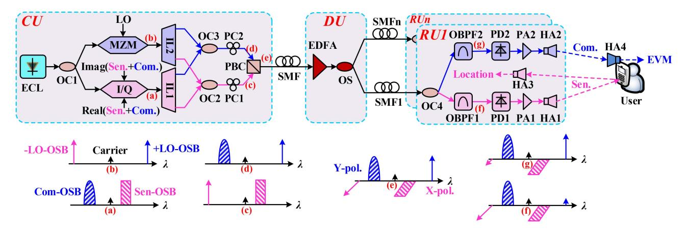

Fig. 1. Schematic diagram of our proposed spectrum-efficient and user-friendly MoF architecture. ECL: External cavity laser, OC: Optical coupler, I/Q: I/Q modulator, MZM: Mach-Zehnder modulator, Sen.: Sensing signal, Com.: communication signal, LO: Local oscillator signal, IL: interleaver, PC: Polarization controller, PBC: Polarization beam combiner, SMF: single-mode fiber, EDFA: erbium-doped fiber amplifier, OS: optical splitter, OBPF: Optical band-pass filter, PD: photodetector, PA: power amplifier, HA: Horn antenna, EVM: Error vector magnitude, CU: Central unit, DU: Distributed unit, RU: Remote unit.

rejecting the unwanted+LO-OSB without complicated adaptive polarization tracking. Meanwhile, a pure communication signal at MMW band for communication can also be generated by simply filtering out the -LO-OSB. The generated LFM wave with a lager scanning angle can be used to accurately sense the users' positions for improving the quality of B5G communications. Thanks to the polarization interleaving, better optical spectrum efficiency is obtained than the PDM adopted in [42], [43], [49]–[51] to deliver two RF signals together. Besides, the four sidebands originate from a shared laser, so FOE algorithms are not required. The polarization-tracking-free structure and FOE-free DSP will facilitate a simple RU and a user-friendly terminal. Our experimental results show that a LFM wave and a 23-Gbit/s 16QAM signal at B5G MMW band are successfully generated without CD-induced power fading after delivering 5.41-km SMF. Furthermore, a ±15-mm ranging accuracy for single-target detection is achieved by the generated LFM wave, and a 30-cm ranging resolution for dual-target detection is also realized. An error-free 16QAM signal is obtained at the UE end without frequency offset compensation. The influences of QAM-to-LFM power ratio (QLPR), carrier-to-signal power ratio (CSPR), and laser frequency drift on communication performance are also qualitatively investigated.

# II. NETWORK ARCHITECTURE AND PRINCIPLE

Fig. 1 shows the schematic diagram of our proposed spectrumefficient and user-friendly MoF architecture for joint sensing and communication. In the CU, a linearly polarized continuouswave (CW) from an external cavity laser (ECL) is first divided equally into two paths through an optical coupler (OC1), and then injected into an in-phase/quadrature modulator (I/Q MOD) and a MZM respectively. The two arms of the I/Q MOD are respectively driven by the real and imaginary parts of an electrical complex signal generated by software-defined DSP. The complex signal is a combination of the sensing and communication IF signals on opposite frequency sides, which can be mathematically expressed as

$$IF_{IQ} = A_s s(t) e^{j\omega_s t} + A_c c(t) e^{-j\omega_c t}$$
(1)

where s(t)/c(t) is the baseband sensing/communication signal; As/Ac is the amplitude of the sensing/communication signal; ωs/ωc is the angular frequency of the IF sensing/communication signal.

By biasing the two sub-MZMs at the minimum transmission points and the parent-MZM at the quadrature transmission point, two asymmetrical optical SSB signals (Sen-OSB and Com-OSB) can be obtained, as shown in Fig. 1(a). Meanwhile, the MZM is driven by an electrical LO signal through CS-DSB modulation. Correspondingly, two LO sidebands (-LO-OSB and +LO-OSB) up-converting the radar and communication signals to MMW band are obtained, as plotted in Fig. 1(b). The adopted two modulators ensure a flexibility CSPR and avoid saturating the driver of the I/Q MOD prematurely. The two ASSB signals and two LO-OSBs at the output of the two modulators can be respectively expressed as

$$E_{IQ} \propto \frac{A\pi}{v_{\pi-IQ}} \left[ A_s s(t) e^{j(\omega + \omega_s)t} + A_c c(t) e^{j(\omega - \omega_c)t} \right]$$
 (2)

$$E_{MZM} \propto \frac{AA_{LO}\pi}{v_{\pi-MZM}} \left[ e^{j(\omega+\omega_{LO})t} - e^{j(\omega-\omega_{LO})t} \right]$$
 (3)

where A and ω are the amplitude and angular frequency of the laser, respectively; vπ−IQand vπ−MZM are the half-wave voltages of the I/Q MOD and MZM, respectively.

An interleaver (IL1) following with the I/Q MOD separates the Sen-OSB and Com-OSB, while another IL (IL2) following with the MZM separates the two LO-OSBs. The separated Sen-OSB and -LO-OSB are recombined via the OC2, as illustrated in Fig. 1(c). The separated Sen-OSB and -LO-OSB are recombined via the OC3, as plotted in Fig. 1(d). The two sets of recombined optical sidebands are polarization-interleaved by a polarization beam combiner (PBC) after polarization alignments by two polarization controllers (PC1 and PC2). The polarization-interleaved optical sidebands, as shown in Fig. 1(e),

{3}------------------------------------------------

then transmit over a spool of SMF to a DU. Mathematically, the output optical field of the PBC can be written as

$$E_{PBC} \propto \left[ \frac{AA_s\pi}{v_{\pi-IQ}} s(t) e^{j(\omega+\omega_s)t} - \frac{AA_{LO}\pi}{v_{\pi-MZM}} e^{j(\omega-\omega_{LO})t} \right] \vec{x}$$

$$+ \left[ \frac{AA_c\pi}{v_{\pi-IQ}} c(t) e^{j(\omega-\omega_c)t} + \frac{AA_{LO}\pi}{v_{\pi-MZM}} e^{j(\omega+\omega_{LO})t} \right] \vec{y}$$
(4)

At the DU, the received optical signal is first boosted by an erbium-doped fiber amplifier (EDFA) for power compensation, and then split by an optical splitter (OS) for resource allocation. The split optical signal transmits over another SMF to a respective RU.

At the RU, the received optical signal is divided into two parts by the OC4 for sensing and communication respectively. For the sensing part, an optical band-pass filter (OBPF1) removes the +LO-OSB in *y* polarization, as shown in Fig. 1(f). For the communication part, another OBPF (OBPF2) rejects the -LO-OSB in *x* polarization instead, as illustrated in Fig. 1(g). Since the band-pass filtering is insensitive to polarization drift, adaptive polarization alignments are no longer needed. The two filtered optical signals can be respectively written as

$$E_{OBPF1} \propto \left[ \frac{AA_s \pi}{v_{\pi - IQ}} s(t) e^{j(\omega + \omega_s)t} - \frac{AA_{LO} \pi}{v_{\pi - MZM}} e^{j(\omega - \omega_{LO})t} \right] \vec{x}$$

$$+ \left[ \frac{AA_c \pi}{v_{\pi - IQ}} c(t) e^{j(\omega - \omega_c)t} \right] \vec{y}$$

$$E_{OBPF2} \propto \left[ \frac{AA_s \pi}{v_{\pi - IQ}} s(t) e^{j(\omega + \omega_s)t} \right] \vec{x}$$

$$+ \left[ \frac{AA_c \pi}{v_{\pi - IQ}} c(t) e^{j(\omega - \omega_c)t} + \frac{AA_{LO} \pi}{v_{\pi - MZM}} e^{j(\omega + \omega_{LO})t} \right] \vec{y}$$
(6)

After the polarization-insensitive filtering, two photodetectors (PD1 and PD2) convert the filtered optical signals to electrical MMW signals. Thanks to the polarization interleaving, no photocurrents rises theoretically by beating the optical sidebands in *x* and *y* polarizations. Therefore, ignoring the baseband components, the generated sensing and communication signals can be respectively given by

$$i_s(t) \propto \frac{A^2 A_s A_{LO} \pi^2}{v_{\pi - IQ} v_{\pi - MZM}} s(t) \cos(\omega_s + \omega_{LO}) t$$
 (7)

$$i_c(t) \propto \frac{A^2 A_c A_{LO} \pi^2}{v_{\pi - IQ} v_{\pi - MZM}} c(t) \cos(\omega_c + \omega_{LO}) t$$
 (8)

As can be seen from (7) and (8), a pure MMW sensing signal and a pure MMW communication signal are generated respectively without complicated polarization tracking owing to the polarization interleaving and polarization-insensitive filtering. The frequencies of the generated signals can be flexibly adjusted by regulating the IF and LO frequencies loaded on the two modulators. Compared with the PDM used in [42], [43], [49]–[51], polarization interleaving occupies less spectral grid to deliver two RF signals in two orthogonal polarizations, so that more RUs can co-exist to achieve wide area wireless coverage in WDM-based B5G mobile networks. ASSB modulation implemented at the CU avoids the power fading caused by distributed SMFs with different lengths. Additionally, polarization interleaving and ASSB modulation reduces the demands for higher bandwidth devices, such as modulators and VSGs. Polarization-insensitive filtering eliminates the need for complicated polarization tracking to de-multiplex the sensing and communication signals, thus reducing the complexities of the RUs.

The generated sensing signal is amplified by a power amplifier (PA1) and further radiated into the air via a horn antenna (HA1). The radiated sensing signal is finally reflected back to the transmission end by the users and received by a HA (HA3) to estimate the users' positions accurately for improving the quality of wireless communications. The generated communication signal is amplified by another PA (PA2) and finally radiated into the air via another HA (HA2) for directional communication with the users under the case of high-resolution sensing. At the UE, the downstream communication signal is received by the user via its antenna (HA4) for further performance evaluation. Because the four optical sidebands source from a shared laser, the generated sensing and communication signals are free from the phase noise induced by laser frequency deviations, thereby reducing the complexity and power consumption of the DSP at the UE. Besides, considering that the polarization-insensitive filtering removes the polarization demultiplexing algorithm at the UE, the proposed MoF architecture is very user-friendly. The simple RU and user-friendly terminal are in line with the centralized processing of RoF technology, which is crucial for practical applications. So far, a novel spectrum-efficient architecture for joint sensing and communication in B5G opticalwireless converged networks is successfully presented. Since no special devices and complicated feedback loops is involved, the proposed MoF system is easy for photonic integration [52]. For the transmission of sensing echoes and upstream communication signals, it will be discussed in Section III.

# III. EXPERIMENTAL SET-UP AND RESULTS

Fig. 2 illustrates the experimental set-up of our proposed spectrum-efficient MoF system according to the architecture in Section II. In the CU, a 14.5-dBm CW at 1558.558nm emitted from a narrow linewidth ECL is injected into two I/Q MODs via the OC1. The combined sensing and communication IF signals driving the I/Q MOD1 are generated by offline DSP, and converted into analog domain by a 92-GSa/s arbitrary waveform generator (AWG). The IF sensing signal is a LFM wave ranging from 6GHz to 7.15GHz. The IF communication signal is a 16QAM signal centered at 10GHz. The I/Q MOD1 is automatically biased at the desired transmission points as described in Section II to implement ASSB modulation. The measured spectrum at the output of the I/Q MOD1 is shown as the blue curve in Fig. 3. During the measurement, the 16QAM signal is set at 5.75GBuad and pulse-shaped by a cosine filter with a roll-off factor of 0.05. The output voltages of the AWG are fixed at 200mV, and the amplitude ratio between the LFM

{4}------------------------------------------------

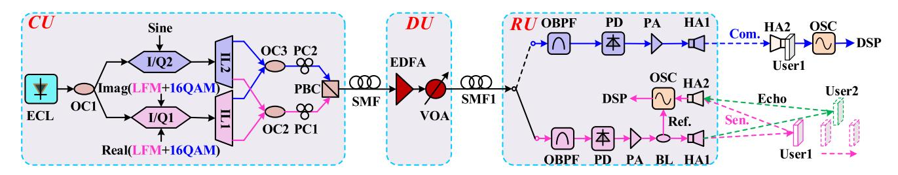

Fig. 2. Experimental set-up of our proposed spectrum-efficient MoF system. ECL: external cavity laser, OC: Optical coupler, I/Q: I/Q modulator, Sen.: Sensing signal, Com.: Communication signal, IL: Interleaver, PC: Polarization controller, PBC: Polarization beam combiner, SMF: Single-mode fiber, EDFA: Erbium-doped fiber amplifier, VOA: Variable optical attenuator, OBPF: Optical band-pass filter, PD: photodetector, PA: Power amplifier, BL: balun, HA: Horn antenna, OSC: Oscilloscope, DSP: Digital signal processing, CU: Central unit, DU: Distributed unit, RU: Remote unit.

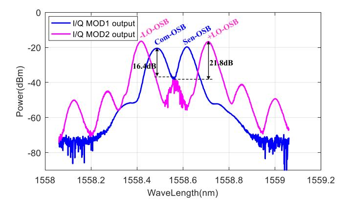

Fig. 3. Measured spectrum (0.03nm resolution) at the output of the I/Q MOD1 (blue) and I/Q MOD2 (pink).

wave and 16QAM signal is 10:4. From Fig. 3, a Sen-OSB and a Com-OSB on opposite frequency sides are observed due to the ASSB modulation, and the optical carrier is well suppressed by 16.4dB lower than the Com-OSB. It should be pointed out that the MZM used to generate two LO-OSBs in Section II is replaced by the I/Q MOD2 here. The LO signal is an 18-GHz sine wave generated by a swept signal generator (SSG), and it drives only one arm of the I/Q MOD2. The I/Q MOD2 is also automatically biased to implement CS-DSB modulation. The measured spectrum at the output of the I/Q MOD2 is plotted as the pink curve in Fig. 3. During the measurement, the LO power is fixed at 1dBm. From the figure, the two LO-OSBs, with a 21.8-dB carrier-to-sideband power ratio, indicate only a 36-GHz effective optical bandwidth of the proposed MoF system owing to the polarization interleaving. For refs. [42], [49]–[51], at least a 28-GHz modulator and 52.58-GHz ((6+7.15)/2+18+10+18) optical bandwidth are required to deliver the MMW sensing and communication signals transmitted in our system.

The Sen-OSB and Com-OSB are then separated by a 25-GHz IL (IL1). The measured transmission responses of the odd and even channels of the IL1 are shown as the dotted lines in Fig. 4, while the separated Sen-OSB and Com-OSB are plotted as the solid curves in Fig. 4. As we can see, a 23.6-dB signal-to-residual power ratio (SRPR) is obtained thanks to the sharp filtering edges of the IL1. Meanwhile, the two LO-OSBs are separated by a 50-GHz IL (IL2). The measured transmission responses of the odd and even channels of the IL2 are shown as the dotted lines in Fig. 5, while the separated -LO-OSB and +LO-OSB are shown

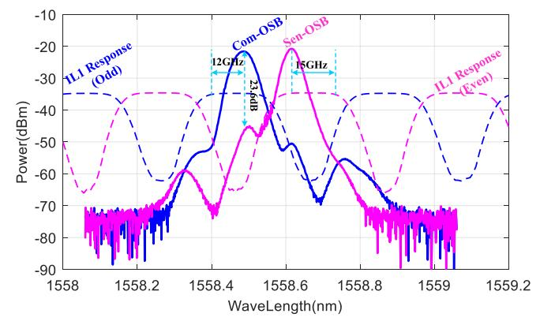

Fig. 4. Measured transmission responses of the odd (blue dotted) and even (pink dotted) channels of the IL1, and measured Sen-OSB (pink solid) and Com-OSB (blue solid) separated by the IL1.

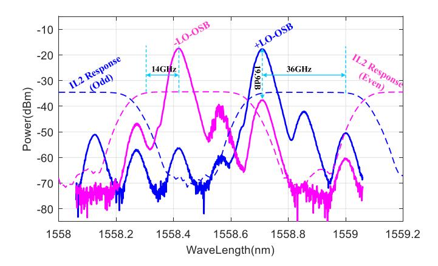

Fig. 5. Measured transmission responses of the odd (blue dotted) and even (pink dotted) channels of the IL2, and measured -LO-OSB (pink solid) and +LO-OSB (blue solid) separated by the IL2.

as the solid curves in Fig. 5. From the figure, a 19.9-dB SRPR is obtained. During the filtering, the residual -LO-OSB is higher than the residual +LO-OSB, because the +LO-OSB locates at the falling edge of the even channel. The separated Sen-OSB and -LO-OSB are recombined by the OC2, as shown by the pink line in Fig. 6. The separated Com-OSB and +LO-OSB are recombined by the OC3, as shown by the blue line in Fig. 6. The recombined optical sidebands are polarization interleaved by a PBC, as shown by the black line in Fig. 6. The output power of the PBC is maximized by adjusting the two PCs (i.e., PC1

{5}------------------------------------------------

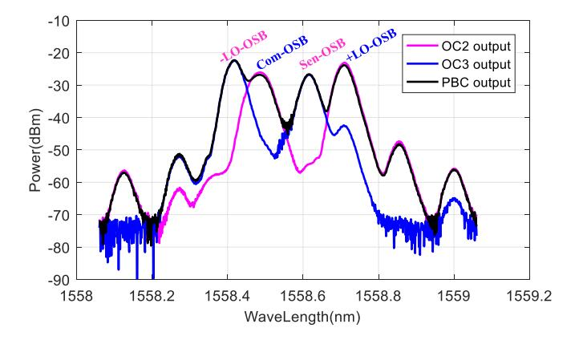

Fig. 6. The recombined optical sidebands at the output of the OC2 (pink), OC3 (blue), and PBC (black).

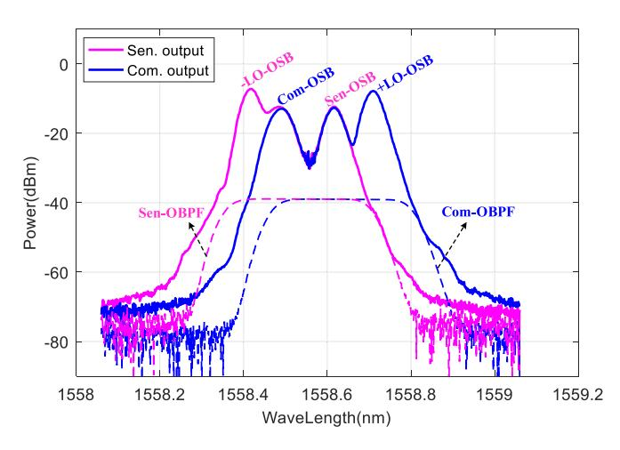

Fig. 7. Measured transmission responses of the Sen-OBPF (pink dotted) and Com-OBPF (blue dotted), and measured spectra for sensing (pink solid) and communication (blue solid) at the output of the OBPF.

and PC2). A 5.31-km SMF following with the PBC delivers the optical signal to a DU.

At the DU, the received optical signal is boosted to be about 10dBm by an EDFA, and then attenuated by a variable optical attenuator (VOA) to simulate the splitting loss for the resource allocation. Followed by the VOA, another 100-m SMF (SMF1) delivers the optical signal to a desired RU.

At the RU, the received optical signal, with random and timevarying polarization state, is used respectively for sensing and wireless communication. We first sense the users' distances, and then wirelessly communicate with a MMW user.

## *A. MMW Radar Sensing*

For radar sensing, an OBPF (EXFO, XTM-50) with independently adjustable wavelength and bandwidth suppresses the +LO-OSB. Note that no polarization tuning is performed before the filtering. The OBPF has negligible polarization mode dispersion and polarization dependent loss, so it does not affect the integrity of the passing signals. The filtered optical sidebands are shown by the pink solid curve in Fig. 7. By beating the filtered signals in a 40-GHz PD, a MMW LFM wave is thus generated.

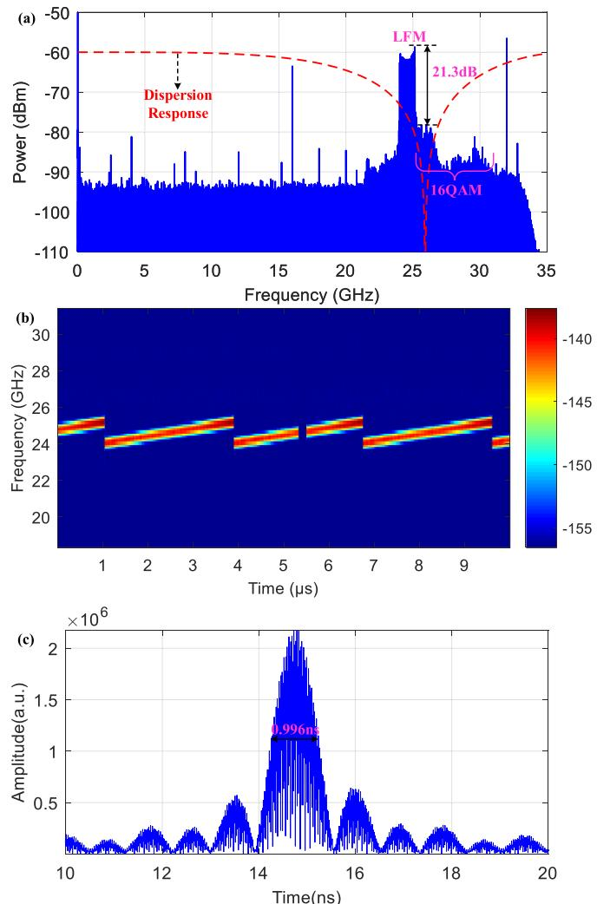

Fig. 8. Measured (a) Electrical spectrum and (b) Instantaneous frequency of the echo received by the HA2, (c) cross-correlation result between the echo and it reference.

The generated LFM wave is amplified by a 30-dB gain PA working at 20-40GHz, and then divided equally into two paths via a 50-GHz balun. One divided path is captured by a 33-GHz oscilloscope (OSC) as a reference, the other path is radiated into the air through the HA1 to sense the users' distances. The sensing signal is reflected back to the transmitting end by the users, and the echoes are finally collected by the same OSC through the HA2. The captured LFM waves are analyzed by offline DSP.

First, we measure the distance of a single user. A metal plate with a size of 150mm×150mm, acting as the user1, is placed on one side of the perpendicular bisector of the HA1 and HA2. During the measurement, the user1 moves away from the antenna end in a 50-mm step within a distance of 1500mm to 2050mm, as shown in Fig. 2. Fig. 8(a) plots the measured electrical spectrum of the echo received by the HA2 when the distance is 1600mm. From the spectrum, the energy of the received echo is concentrated around 24.58GHz, which is in good agreement with the theoretical value (18+(6+7.15)/2 = 24.575). The frequency response of a DSB link with 5.41-km SMF is shown by the red line in Fig. 8(a), where the power is

{6}------------------------------------------------

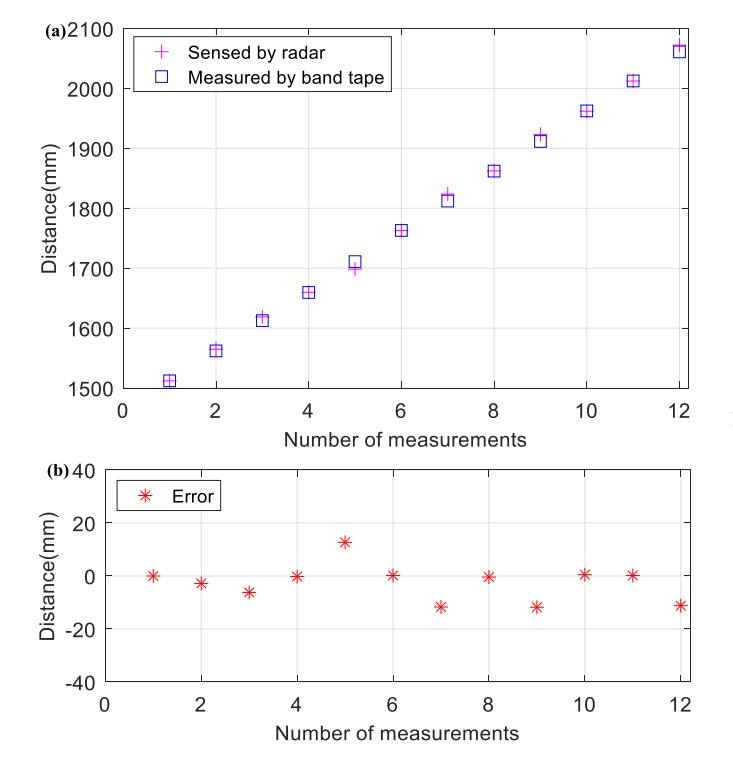

Fig. 9. (a) The distances sensed by our radar (pink) and measured by a band tape (blue), (b) Measured distance errors.

seriously attenuated around 26GHz due to the CD. Fortunately, no power null point is observed in the spectrum of the received echo, which indicates that our proposed MoF system is free from CD-induced power fading. The received sensing signal is 21.3dB higher than the unwanted communication signal. Such a SRPR is attributed to good performance of the ASSB modulation at IF band and polarization orthogonality between the Sen-OSB and Com-OSB. Fig. 8(b) illustrates the instantaneous frequency of the echo. A 2.85-μs echo pulse varies linearly and periodically from 24GHz to 25.15 GHz, verifying the chirp characteristic of the sensing signal. Fig. 8(c) shows the cross-correlation result between the echo and its reference, where one obvious correlation peak is observed. The measured full width at half-maximum (FWHM) of the correlation peak is 0.996ns, which will result in a 29.88-cm ranging resolution according to ref. [21]. The distances sensed by our proposed radar and measured by a band tape are given by the pink and blue marks in Fig. 9(a), respectively. As can be seen, the sensed distances are very close to the measured ones. Fig. 9(b) gives the errors between the sensed and measured distances. The sensed distance errors are only within ±15mm for single user detection.

Next, we measure the distances of two users simultaneously. Another metal plate with the same size, acting as the user2, is placed on the other side of the perpendicular bisector of the HA1 and HA2, During the measurement, the user2 is fixed at 1550mm away from the antenna end, whereas the user1 moves away from the antenna end in a 50-mm step within a distance of 1200mm to1800mm, as shown in Fig. 2. Fig. 10 shows the measured electrical spectra of the echoes received by the HA2 when the distance of the user1 is 1200mm. From the spectra, two obvious

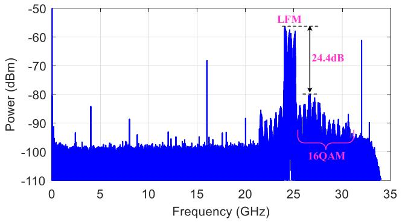

Fig. 10. Measured electrical spectra of the echoes received by the HA2.

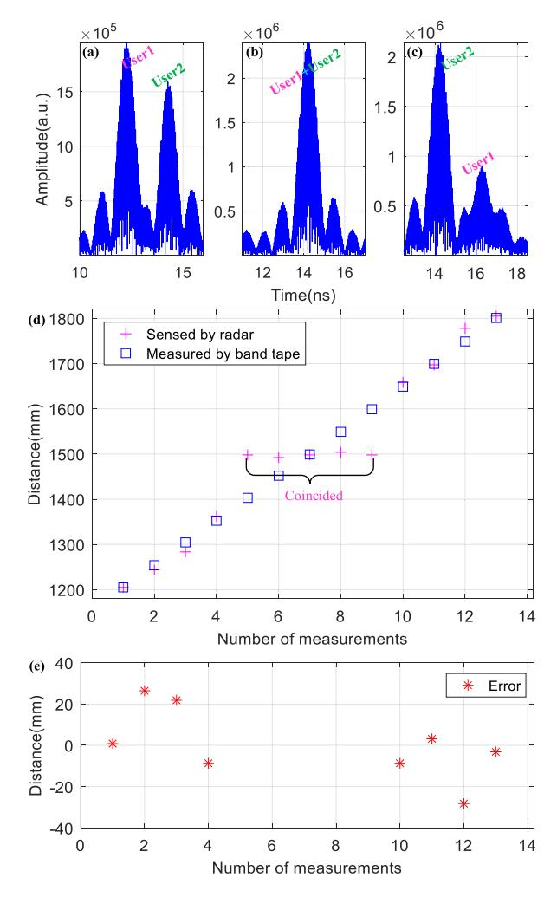

Fig. 11. Cross-correlation results between the echoes and references at (a) 1200mm, (b) 1500mm, and (c) 1800mm, (d) Distances sensed by our radar (pink) and measured by a band tape (blue), (e) Measured distance errors.

power fading points around 24.58GHz are observed, which are caused by the superposition of the echoes reflected by the two users. The superimposed echo is 24.4dB higher than the reflected communication signal due to the suppression of the +LO-OSB. Fig. 11(a)-(c) illustrates the cross-correlation results between the echoes and corresponding references at 1200 mm, 1500mm and 1800mm, respectively. Two obvious correlation peaks are observed in both Fig. 11(a) and (c), indicating the two echoes

{7}------------------------------------------------

reflected by the two users. During the movement of the user1, the relative orientation of the two correlation peaks is switched. It is worth noting that there is only one peak in Fig. 11(b). This is because the two users are too close, resulting in the coincidence of the two correlation peaks. The attenuation of the user1 in Fig. 11(c) is caused by longer wireless transmission. The distances sensed by our radar and measured by a band tape are given by the pink and blue marks in Fig. 11(d), respectively. The sensed distances are close to the measured ones except for 1400mm to 1600mm. The inconsistency of the measurement is due to the coincidence of the two correlation peaks at these distances, as shown in Fig. 11(b). The sensing results demonstrate a 30-cm ranging resolution, which agrees well with the calculated one of 29.88cm. Fig. 11(e) gives the errors between the sensed and measured distances. The sensed distance errors of our proposed MoF system are only within ±30mm for dual user detection. The error is mainly caused by the two relatively large reflecting surfaces, which leads to inaccurate manual measurement of the two reflecting points.

### *B. MMW Wireless Communications*

For wireless communication, the OBPF is set to remove the -LO-OSB instead. Also, no polarization tuning is performed before the OBPF. The filtered optical sidebands are shown by the blue curve in Fig. 7. By beating the filtered signals in the 40-GHz PD, a MMW 16QAM signal is generated. The generated 16QAM signal is amplified by the same PA and then radiated into the air through the HA1 to communicate with a user. The HA2 is moved 2m away from the transmitting end to act as the user1 for receiving the 16QAM signal. The received signal is captured by the OSC for offline DSP, which includes down-conversion, resample, retiming, constant modulus algorithm (CMA), carrier phase recovery (CPE), and error vector magnitude (EVM) evaluation. The commonly used FOE and least mean square (LMS) algorithm are not required here, thus reducing the complexity and power consumption of the DSP, which are critical for terminals in practical applications.

First, we investigate the effect of polarization interleaving on the spectral purity of communication signals by measuring the electrical spectrum at the output of PD. The measured result, unaffected by the frequency responses of the PA and HA1, is shown in Fig. 12(a). The generated 16QAM is centered at 28GHz, where no CD-induced power fading is observed around 26GHz owing to the ASSB modulation. Thanks to the polarization-insensitive filtering, the residual LFM wave is 22.5dB lower than the desired 16QAM signal. In addition, there are two signal-to-signal beating interferences (SSBIs) and two LFM interferences (LIs). The SSBI1, which can be easily blocked by the HA1, are generated by the self-beating of the Sen-OSB and Com-OSB. The SSBI2, generated by beating the Sen-OSB and Com-OSB, is observed to be 19.9dB lower than the desired 16QAM signal because of the polarization interleaving. The weak IL1 is generated by beating the residual optical carrier and Sen-OSB. The LI2, generated by beating the +LO-OSB and Sen-OSB, is observed to be 18.1dB lower than the desired 16QAM signal due to the polarization interleaving. The LIs and

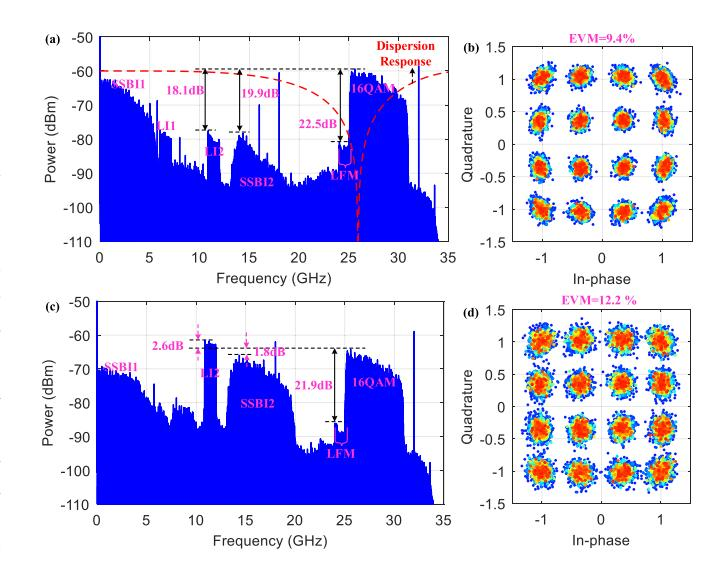

Fig. 12. (a) Electrical spectra and (b) Constellation diagram of the generated 16QAM signal by using a PBC, (c) Electrical spectra and (d) Constellation diagram of the generated 16QAM signal by using an OC.

SSBI2 can be further suppressed by improving the filtering performances and the polarization extinction ratio. Fig. 12(b) plots the constellation diagram calculated from the 16QAM signal. The constellation points present good aggregation, resulting in an EVM of 9.4%. As a comparison, the PBC is replaced by an OC to verify the merits of polarization interleaving. Fig. 12(c) shows the electrical spectrum at the output of the PD under the same operating conditions. The SSBI2 is only 1.8dB lower than the 16QAM signal, and the LI2 is even 2.6 dB higher than the interested 16QAM signal because of the same polarization of the optical sidebands. Since the interferences occupy a large part of energy, the 16QAM signal in Fig. 12(c) is 4.8dB lower than that in Fig. 12(a). Besides, the high-power interferences will also disturb other services in microwave bands, for example, data-over-cable service in a hybrid fiber-coaxial network [50]. Fig. 12(d) plots the constellation diagram calculated from Fig. 12(c). The clustering of the constellation points is worse than that in Fig. 12(b). Correspondingly, the calculated EVM is 12.2%, which is 2.8% worse than that in Fig. 12(b).

Subsequently, we explore the power budget for multiple RUs by measuring the EVM at different received optical powers (ROPs). The ROP is swept by adjusting the VOA. Fig. 13(a) gives the EVM performance as a function of the ROP for 2.875GBaud (blue) and 5.75Gbaud (pink) 16QAM signals. As can be seen, the EVM performances are significantly improved with the increases of the ROP. The measured ROP thresholds at 3GPP standard (12.5% EVM) for 2.875GBaud and 5.75Gbaud 16QAM signals are lower than -7.55dB and -5.05dB, respectively. Fig. 13(b) and (c) illustrate the constellation diagrams of the 2.875GBaud and 5.75Gbaud 16QAM signals close to the 3GPP standard, respectively. The constellation points of the two diagrams are well clustered, revealing a good wireless communication performance.

Next, we measure the influence of radar sensing on wireless communication performance. Fig. 14(a) gives the EVM performances versus the QLPRs of 2.875GBaud (blue) and 5.75Gbaud

{8}------------------------------------------------

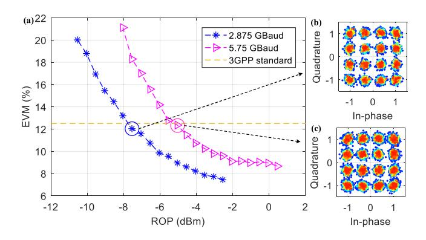

Fig. 13. EVM performance as a function of the ROP for 2.875GBaud (blue) and 5.75Gbaud (pink) 16QAM signals, and constellation diagrams of (b) the 2.875GBaud and (c) 5.75Gbaud 16QAM signals close to the 3GPP standard.

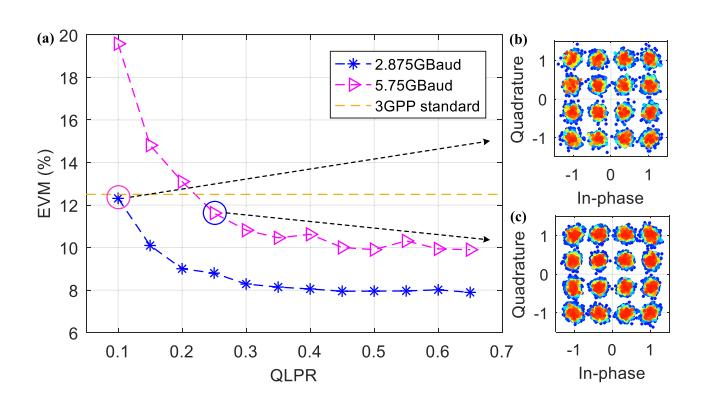

Fig. 14. EVM performances versus the QLPRs of 2.875GBaud (blue) and 5.75Gbaud (pink) 16QAM signals, and constellation diagrams of (b) the 2.875GBaud and (c) 5.75Gbaud 16QAM signals close to the 3GPP standard.

(pink) 16QAM signals. For 2.875GBaud, the communication performance is enhanced as the QLPR increases from 0.1 to 0.4. Moreover, all calculated EVMs, with a floor of about 8%, are better than the 3GPP standard. For 5.75Gbaud, the communication performance is significantly enhanced with the increase of the QLPR from 0.1 to 0.45. The measured EVM, with a floor of about 10%, is better than the 3GPP standard when the QLPR is larger than 0.25. Fig. 14(b) and (c) give the constellation diagrams of the 2.875GBaud and 5.75Gbaud 16QAM signals close to the 12.5% EVM limit, respectively. The constellation points of the two diagrams are well concentrated around the theoretical points.

Also, the influence of CSPR on wireless communication performance is measured. The CSPR is swept by adjusting the LO power loaded on the I/Q MOD2. For 2.875GBaud, the communication performance shows a gradual growth trend as the LO power increases from -10dBm to -1dBm. All calculated EVMs, with a floor of about 8%, are better than the 3GPP standard. For 5.75Gbaud, the communication performance also presents a gradual improvement trend with the increase of the LO power from -10dBm to -2dBm. The measured EVM, with a floor of about 10.5%, is better than the 3GPP standard when the LO power is higher than -7dBm. The performance improvement is mainly owing to less energy occupied by the Sen-OSB when the total power into the PD is fixed. Higher LO power was not tested

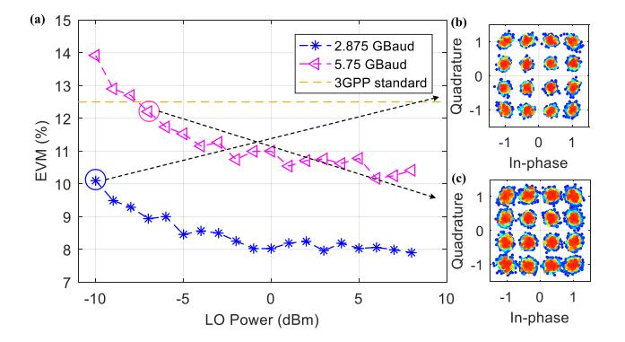

Fig. 15. EVM performance as a function of the LO power for 2.875GBaud (blue) and 5.75Gbaud (pink) 16QAM signals, and constellation diagrams of (b) the 2.875GBaud with a -10-dBm LO and (c) 5.75Gbaud 16QAM signal close to the 3GPP standard.

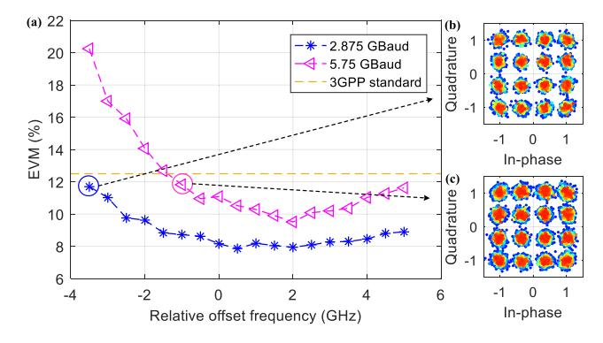

Fig. 16. EVM performances of 2.875GBaud (blue) and 5.75Gbaud (pink) 16QAM signals versus the offset frequencies of the laser, and constellation diagrams of (b) the 2.875GBaud and (c) 5.75Gbaud 16QAM signals close to the 3GPP standard.

for fear of damaging the I/Q MOD2 due to the high gain of the modulator driver. Fig. 15(b) gives the constellation diagram of the 2.875GBaud 16QAM signal with a -10-dBm LO, where the constellation points are remarkably gathered. Fig. 15(c) shows the constellation diagram of the 5.75Gbaud 16QAM signal close to the 3GPP standard, where good communication performance also can be deduced.

Finally, we investigate the influence of laser frequency drift on wireless communication performance. The laser frequency drift is simulated by shifting the laser wavelength away from 1558.558nm. Fig. 16(a) shows the EVM performances of 2.875GBaud and 5.75Gbaud 16QAM signals versus the offset frequencies of the laser. For 2.875Gbaud, the calculated EVMs are all below the 12.5% limit, indicating a stable performance. For 5.75Gbaud, the communication performance is relatively more sensitive to laser frequency drift. Still, the calculated EVM is above the 3GPP standard as the laser frequency offsets from -1GHz to 5GHz. The 6-GHz offset margin is sufficient for practical application. Fig. 16(b) and (c) illustrate the constellation diagrams of the 2.875GBaud and 5.75Gbaud 16QAM signals close to the 12.5% EVM limit, respectively. The constellation points of the two diagrams are also closely and orderly scattered around the desired points, proving a good wireless communication quality.

{9}------------------------------------------------

## *C. Discussion*

In the demonstration experiment, the pair of combined sensing and communication IF signals for ASSB modulation are obtained via a 92-GSa/s AWG. In practical applications, the combined IF signals can be generated by low-speed digital-to-analog conversion followed by two-stage analog I/Q up-conversion. By this way, the wideband 90° phase shifts for ASSB modulation are no longer needed. Thanks to the mature commercial RF integration processes, the cost of I/Q up-conversion at IF band is relatively low. The frequency tunability of our proposed MoF structure is mainly limited by the ILs. The remaining tuning ranges for the Com-OSB, Sen-OSB, -LO-OSB, and +LO-OSB are about 12GHz, 15GHz, 14GHz, and 36GHz, respectively, as shown in Figs. 4 and 5. As a result, the carriers of the upconverted communication and sensing signals can up to 76GHz and 53.575GHz, respectively, which is sufficient to fully cover the B5G MMW bands recommended by the World Radio Communication Conference 2019 (WRC-19) [53]. The frequency tunability can be more flexible by replacing the two ILs with two cheap single band-pass fiber Bragg gratings. Combining with the industrial wavelength standard of WDM to design the optical filters, the frequency tunability can be further improved, and the cost can be effectively reduced accordingly.

As for delivering downstream data for multiple RUs with independent information, the single-carrier format can be replaced by the sub-carrier multiplexing widely used in 4G LTE [50], [54]. Considering that one centralized CU will polite multiple RUs, the overall cost of the system is actually reduced at the expense of acceptable complexity of the shared CU. In the next work, we will conduct full-duplex and field tests to further explore the performance of our proposed architecture. For full-duplex transmission, the downlink can be similar to the Fig. 2, except two optical circulators should be inserted before and after the SMF, respectively. For uplink, at the RU, the upstream communication signal and sensing echo, received by the upstream HA, are first amplified by a low noise amplifier (LNA), and then down-converted to a low frequency (LF) by an envelope detector (ED). The ED can avoid the using of a RF oscillator and mixer for MMW down-conversion at the DU. To assist envelope detection, digital virtual carriers need be inserted to the downstream and upstream signals [55], [56]. Thus, the downstream MMW communication signal can also be received by envelope detection to further reduce user cost. The down-converted LF signal modulates a directly modulated laser (DML). The DML eliminates the polarization alignment for upstream optical modulation and further reduces the complexity and cost of the RU. The wavelength for uplink can be set at 1310 nm band to save the spectral resource for downlink and avoid Rayleigh scattering. Hence, the upstream wavelength is not associated in any way with the downstream wavelength. At the DU, the upstream optical signal is transmitted back to the CU through a circulator. Due to the amplifier's unidirectional nature, the upstream optical signal should bypass the EDFA. In the CU, the received optical signal is sent into a semiconductor optical amplifier (SOA) via another circulator for power compensation. The compensated signal conducts photoelectric conversion by a low-speed PD, and finally is processed by a DSP module to restore the upstream communication and sensing information. As can be seen, the uplink, with a simple architecture and cost-effective optoelectronic devices, adds little complexity to the downlink.

It should be mentioned that we did not perform any polarization readjustment throughout the experiments. The good sensing and communication performances well verify the stability of the proposed architecture. It should also be noted that most of the devices used in the experiment are passive, and no dedicated photoelectric devices and complicated feedback loops is involved in the experiment, which makes proposed MoF system easy for photonic integration.

### IV. CONCLUSION

To summarize, we propose and experimentally demonstrate a novel spectrum-efficient and user-friendly MoF architecture for joint sensing and communication in B5G optical-wireless converged networks. The proposed MoF system simultaneously up-converts the communication and radar signals to MMW band by polarization interleaving and polarization-insensitive filtering. The polarization interleaving reduces the demand for higher bandwidth devices and immune to the CD-induced power fading. The polarization-insensitive filtering removes the need for complicated polarization tracking to de-multiplex the sensing and communication signals. In the experiment, a ±15-mm ranging accuracy for single target detection is achieved, and a 30-cm ranging resolution for dual target detection is also realized. Moreover, a 23-Gbit/s error-free transmission rate at 28GHz over 5.41-km SMF and 2-m wireless distance is successfully obtained without frequency offset compensation at the UE. We believe that the proposed user-friendly MoF architecture, compatible with the WDM passive optical network, is very promising in the upcoming B5G mobile communications era.

# REFERENCES

- [1] W. Ye and S. Gao, "Integrated sensing and communication towards 5.5G," *Commun. Inf. Technol.*, vol. 15, no. 5, pp. 27–33, Nov. 2021.
- [2] A. Kanno *et al.*, "Field trial of 95-GHz frequency-modulated continuouswave radar system driven by radio over fiber techniques," in *Proc. IEEE Res. Appl. Photon. Defense Conf.*, 2018, pp. 1–4.
- [3] A. Stöhr, B. Shih, S. T. Abraha, A. G. Steffan, and A. Ng'oma, "High spectral-efficient 512-QAM-OFDM 60GHz CRoF system using a coherent photonic mixer (CPX) and an RF envelope detector," in *Proc. Opt. Fiber Commun. Conf.*, 2016, Paper Tu3B.4.
- [4] J. Yao, "Microwave photonics," *J. Lightw. Technol.*, vol. 27, no. 3, pp. 314–335, Feb. 2009.
- [5] S. H. R. Naqvi, P. H. Ho, and S. Jabeen, "A novel distributed antenna access architecture for 5G indoor service provisioning," *IEEE J. Sel. Areas Commun.*, vol. 36, no. 11, pp. 2518–2527, Nov. 2018.
- [6] W. Xu, X. Gao, M. Zhao, M. Xie, and S. Huang, "Full duplex radio over fiber system with frequency quadrupled millimeter-wave signal generation based on polarization multiplexing," *Opt. Laser Technol.*, vol. 103, pp. 267–271, Jul. 2018.
- [7] J. Li, Y. Liang, and K. K. Wong, "Millimeter-wave UWB signal generation via frequency up-conversion using fiber optical parametric amplifier," *IEEE Photon. Technol. Lett.*, vol. 21, no. 17, pp. 1172–1174, Sep. 2019.
- [8] M. A. Esmail, A. Ragheb, H. Seleem, H. Fathallah, and S. Alshebeili, "K-band centralized cost-effective all-optical sensing signal distribution network," *IEEE Photon. J.*, vol. 12, no. 6, Dec. 2020, Art. no. 7202510.
- [9] D. Grodensky, D. Kravitz, and A. Zadok, "Ultra-wideband microwavephotonic noise radar based on optical waveform generation," *IEEE Photon. Technol. Lett.*, vol. 24, no. 10, pp. 839–841, May 2012.

{10}------------------------------------------------

- [10] M. Zhang *et al.*, "Remote radar based on chaos generation and radio over fiber," *IEEE Photon. J.*, vol. 6, no. 5, Oct. 2014, Art. no. 7902412.
- [11] J. Zheng *et al.*, "Fiber-distributed ultra-wideband noise radar with steerable power spectrum and colorless base station," *Opt. Exp.*, vol. 22, no. 5, pp. 4896–4907, Feb. 2014.
- [12] J. Chou, Y. Han, and B. Jalali, "Adaptive RF-photonic arbitrary waveform generator," *IEEE Photon. Technol. Lett.*, vol. 15, no. 4, pp. 581–583, Apr. 2003.
- [13] J. Ye *et al.*, "Photonic generation of microwave phase-coded signals based on frequency-to-time conversion," *IEEE Photon. Technol. Lett.*, vol. 24, no. 17, pp. 1527–1529, Sep. 2012.
- [14] S. Zhu *et al.*, "Photonic generation of background-free binary phase-coded microwave pulses," *Opt. Lett.*, vol. 44, no. 1, pp. 94–97, Dec. 2018.
- [15] M. Chang and Y. Chen, "Frequency-doubled phase-coded microwave signal generation based on cascaded modulators," in *Proc. IEEE MTT-S Int. Wireless Symp.*, 2018, pp. 1–4.
- [16] Y. Chen and S. Pan, "Photonic generation of tunable frequency multiplied phase-coded microwave waveforms," *IEEE Photon. Technol. Lett.*, vol. 30, no. 13, pp. 1230–1233, Jul. 2018.
- [17] W. Chen *et al.*, "Photonic generation of binary and quaternary phasecoded microwave waveforms with frequency quadrupling," *IEEE Photon. J.*, vol. 8, no. 2, Apr. 2016, Art. no. 5500808.
- [18] X. Li *et al.*, "Frequency-octupled phase-coded signal generation based on carrier-suppressed high-order double sideband modulation," *Chin. Opt. Lett.*, vol. 15, no. 7, Jul. 2017, Art. no. 070603.
- [19] F. Zhang, X. Ge, and S. Pan, "Background-free pulsed microwave signal generation based on spectral shaping and frequency-to-time mapping," *Photon. Res.*, vol. 2, no. 4, pp. B5–B10, May 2014.
- [20] H. Cheng, X. Zou, B. Lu, and Y. Jiang, "High-resolution range and velocity measurement based on photonic LFM microwave signal generation and detection," *IEEE Photon. J.*, vol. 11, no. 1, Feb. 2019, Art. no. 7200808.
- [21] F. Zhang *et al.*, "Photonics-based broadband radar for high-resolution and real-time inverse synthetic aperture imaging," *Opt. Exp.*, vol. 25, no. 14, pp. 16274–16281, Jun. 2017.
- [22] Y. Liu *et al.*, "Theoretical investigation of photonic generation of frequency quadrupling linearly chirped waveform with large tunable range," *Opt. Exp.*, vol. 25, no. 14, pp. 16196–16203, Jun. 2017.
- [23] Y. Tong *et al.*, "Photonic generation of phase-stable and wideband chirped microwave signals based on phase-locked dual optical frequency combs," *Opt. Lett.*, vol. 41, no. 16, pp. 3787–3790, Aug. 2016.
- [24] A. Stöhr *et al.*, "Robust 71–76 GHz radio-over-fiber wireless link with high-dynamic range photonic assisted transmitter and laser phase-noise insensitive SBD receiver," in *Proc. Opt. Fiber Commun. Conf.*, 2014, pp. 1–3.
- [25] H. Song *et al.*, "DSP-free remote antenna unit in a coherent radio over fiber mobile fronthaul for 5G mm-wave mobile communication," *Opt. Exp.*, vol. 29, no. 17, pp. 27481–27492, Aug. 2021.
- [26] L. Huang *et al.*, "Photonic generation of equivalent single sideband vector signals for RoF systems," *IEEE Photon. Technol. Lett.*, vol. 28, no. 22, pp. 2633–2636, Nov. 2016.
- [27] W. J. Jiang *et al.*, "Photonic vector signal generation employing a novel optical direct-detection in-phase/quadrature-phase upconversion," *Opt. Lett.*, vol. 35, no. 23, pp. 4069–4071, Nov. 2010.
- [28] X. Li, Y. Xu, and J. Yu, "Single-sideband W-band photonic vector millimeter-wave signal generation by one single I/Q modulator," *Opt. Lett.*, vol. 41, no. 18, pp. 4162–4165, Sep. 2016.
- [29] X. Pan *et al.*, "Photonic vector mm-wave signal generation by optical dual-SSB modulation and a single push-pull MZM," *Opt. Lett.*, vol. 44, no. 14, pp. 3570–3573, Jul. 2019.
- [30] X. Li, J. Xiao, Y. Xu, and J. Yu, "QPSK vector signal generation based on photonic heterodyne beating and optical carrier suppression," *IEEE Photon. J.*, vol. 7, no. 5, Oct. 2015, Art. no. 7102606.
- [31] Y. Wang, Y. Xu, X. Li, J. Yu, and N. Chi, "Balanced precoding technique for vector signal generation based on OCS," *IEEE Photon. Technol. Lett.*, vol. 27, no. 23, pp. 2469–2472, Dec. 2015.
- [32] C. T. Lin, J. Chen, P. T. Shih, W. J. Jiang, and S. Chi, "Ultra-high data-rate 60 GHz radio-over-fiber systems employing optical frequency multiplication and OFDM formats," *J. Lightw. Technol.*, vol. 28, no. 16, pp. 2296–2306, Apr. 2010.
- [33] X. Li, J. Yu, and G. K. Chang, "Frequency-quadrupling vector mm-wave signal generation by only one single-drive MZM," *IEEE Photon. Technol. Lett.*, vol. 28, no. 12, pp. 1302–1305, Jun. 2016.

- [34] X. Li *et al.*, "W-band 8QAM vector signal generation by MZM-based photonic frequency octupling," *IEEE Photon. Technol. Lett.*, vol. 27, no. 12, pp. 1257–1260, Jun. 2015.
- [35] L. Zhao, L. Xiong, M. Liao, S. Liu, and X. Yu, "QPSK vector millimeterwave signal generation based on odd times of frequency without precoding," *IEEE Photon. J.*, vol. 10, no. 6, Dec. 2018, Art. no. 5502109.
- [36] H. Nie, F. Zhang, Y. Yang, and S. Pan, "Photonics-based integrated communication and radar system," in *Proc. Int. Topical Meeting Microw. Photon.*, 2019, pp. 1–4.
- [37] L. Huang, R. Li, S. Liu, P. Dai, and X. Chen, "Centralized fiberdistributed data communication and sensing convergence system based on microwave photonics," *J. Lightw. Technol.*, vol. 37, no. 21, pp. 5406–5416, Nov. 2019.
- [38] Z. Xue, S. Li, X. Xue, X. Zheng, and B. Zhou, "Photonics-assisted joint radar and communication system based on an optoelectronic oscillator," *Opt. Exp.*, vol. 29, no. 14, pp. 22442–22454, Jun. 2021.
- [39] M. Lei *et al.*, "Radar-assisted MMW-over-fiber system for B5G mobile communications," in *Proc. Conf. Lasers Electro Opt.*, 2022, Paper SM5J.4.
- [40] L. Cheng, C. Liu, Z. Dong, J. Yu, and K G. Chang, "60-GHz and 100-GHz wireless transmission of high-definition video services in converged radioover-fiber systems," in *Proc. Conf. Lasers Electro Opt.*, 2014, pp. 1–2.
- [41] C. Y. Lin *et al.*, "Employing injection-locked FP LDs to set up a hybrid CATV/MW/MMW WDM light wave transmission system," *Opt. Lett.*, vol. 39, no. 13, pp. 3931–3934, Jul. 2014.
- [42] F. Shi *et al.*, "Wideband dual-channel photonic RF repeater based on polarization division multiplexing modulation and polarization control," *J. Lightw. Technol.*, vol. 38, no. 6, pp. 1275–1285, Mar. 2020.
- [43] Z. Tang, F. Zhang, and S. Pan, "60-GHz RoF system for dispersion-free transmission of HD and multi-band 16QAM," *IEEE Photon. Technol. Lett.*, vol. 30, no. 14, pp. 1305–1308, Jul. 2018.
- [44] B. Koch, R. Noe, D. Sandel, V. Mirvoda, J. Omar, and K. Puntsri, "20-Gb/s PDM-RZ-DPSK transmission with 40 krad/s endless optical polarization tracking," *IEEE Photon. Technol. Lett.*, vol. 25, no. 9, pp. 798–801, May 2013.
- [45] Y. Gao *et al.*, "Ultra-wideband photonic microwave I/Q mixer for zero-IF receiver," *IEEE Trans. Microw. Theory Techn.*, vol. 65, no. 11, pp. 4513–4525, Nov. 2017.
- [46] D. Qian, N. Cvijetic, J. Hu, and T. Wang, "108 Gb/s OFDMA-PON with polarization multiplexing and direct detection," *J. Lightw. Technol.*, vol. 28, no. 4, pp. 484–493, Feb. 2010.
- [47] A. Chowdhury, H. C. Chien, S. H. Fan, J. Yu, and G. K. Chang, "Multi-band transport technologies for in-building host-neutral wireless over fiber access systems," *J. Lightw. Technol.*, vol. 28, no. 16, pp. 2406–2415, May 2010.
- [48] M. Zhu *et al.*, "Radio-over-fiber access architecture for integrated broadband wireless services," *J. Lightw. Technol.*, vol. 31, no. 23, pp. 3614–3620, Oct. 2013.
- [49] D. N. Nguyen, "Polarization division multiplexing-based hybrid microwave photonic links for simultaneous mmW and sub-6GHz wireless transmissions," *IEEE Photon. J.*, vol. 12, no. 6, Dec. 2020, Art. no. 5502814.
- [50] S. J. Liu, J. H. Yan, C. Y. Tseng, and K. M. Feng, "Polarizationtracking-free IFoF mobile fronthaul with adaptively modulated PDM multiband DDO-OFDM," *IEEE Photon. Technol. Lett.*, vol. 29, no. 14, pp. 1211–1214, Jul. 2017.
- [51] Y. Zhu, M. Jiang, and F. Zhang, "Direct detection of polarization multiplexed single sideband signals with orthogonal offset carriers," *Opt. Exp.*, vol. 26, no. 12, pp. 15887–15898, Jun. 2018.
- [52] S. Pan and Y. Zhang, "Microwave photonic radars," *J. Lightw. Technol.*, vol. 38, no. 19, pp. 5450–5484, Oct. 2020.
- [53] D. Brenner, "Global 5G spectrum update," in *Spectrum Strategy & Technology Poilcy*, Clearwater, FL, USA: SVP*,* Jun. 2020.
- [54] P. T. Dat, A. Kanno, N. Yamamoto, and T. Kawanishi, "Simultaneous transmission of 4G LTE-A and wideband MMW OFDM signals over fiber links," in *Proc. IEEE Int. Topical Meeting Microw. Photon.*, 2016, pp. 87–90.
- [55] T. M. F. Alves and A. V. T. Cartaxo, "Power budget of ultra-dense virtualcarrier-assisted DD MB-OFDM next-generation PON," *IEEE Photon. Technol. Lett.*, vol. 28, no. 13, pp. 1406–1409, Jul. 2016.
- [56] S. T. Le *et al.*, "1.72-Tb/s virtual-carrier-assisted direct-detection transmission over 200 km," *J. Lightw. Technol.*, vol. 36, no. 6, pp. 1347–1353, Mar. 2018.