{0}------------------------------------------------

# Nanoantennas and Nanoradars: The Future of Integrated Sensing and Communication at the Nanoscale

M. Javad Fakhimi®, Student Member, IEEE, and Ozgur B. Akan®, Fellow, IEEE

Abstract—Nanoantennas, operating at optical frequencies, are a transformative technology with broad applications in 6G wireless communication, IoT, smart cities, healthcare, and medical imaging. This paper explores their fundamental aspects, applications, and advancements, aiming for a comprehensive understanding of their potential in various applications. It begins by investigating macroscopic and microscopic Maxwell's equations governing electromagnetic wave propagation at different scales. The study emphasizes the critical role of surface plasmon polariton wave propagation in enhancing light-matter interactions, contributing to high data rates, and enabling miniaturization. Additionally, it explores using two-dimensional materials like graphene for enhanced control in terahertz communication and sensing. The paper also introduces the employment of nanoantennas as the main building blocks of Nano-scale Radar (NR) systems for the first time in the literature. NRs, integrated with communication signals, promise accurate radar sensing for nanoparticles inside a nano-channel, making them a potential future application in integrated sensing and communication (ISAC) systems. These nano-scale radar systems detect and extract physical or electrical properties of nanoparticles through transmitting, receiving, and processing electromagnetic waves at ultra-high frequencies in the optical range. This task requires nanoantennas as transmitters/receivers/transceivers, sharing the same frequency band and hardware for high-performance sensing and resolution.

Index Terms—Nanoantennas, light-matter interaction, Maxwell's equations, terahertz radiation, ultrafast data transmission, 6G wireless communications, biosensors, photodetection, integrated sensing and communication (ISAC).

#### I. Introduction

RAPID advancement of wireless communication technologies has changed the way we access information in our increasingly connected world. As we approach the era of 6G wireless communication, the demand for higher

Manuscript received 12 January 2024; revised 14 May 2024; accepted 19 July 2024. Date of publication 29 July 2024; date of current version 18 December 2024. This work was supported by the AXA Research Fund (AXA Chair for Internet of Everything at Koç University). The associate editor coordinating the review of this article and approving it for publication was M. T. Barros. (Corresponding author: M. Javad Fakhimi.)

M. Javad Fakhimi is with the Center for Next-Generation Communications, Department of Electrical and Electronics Engineering, Koç University, 34450 Istanbul, Türkey (e-mail: mfakhimi22@ku.edu.tr).

Ozgur B. Akan is with the Center for Next-Generation Communications, Department of Electrical and Electronics Engineering, Koç University, 34450 Istanbul, Türkey, and also with the Internet of Everything Group, Electrical Engineering Division, Department of Engineering, University of Cambridge, CB3 0FA Cambridge, U.K. (e-mail: oba21@cam.ac.uk).

Digital Object Identifier 10.1109/TMBMC.2024.3434545

data rates, lower latency, and enhanced connectivity continues to dominate. To address these challenges, researchers are exploring new technologies that can reveal the unique properties of terahertz frequencies (0.1 to 10 THz) [1]. Among these transformative technologies, nanoantennas are proposed as promising and practical structures with the potential to reshape wireless communication, revolutionize the Internet of Things (IoT) and healthcare, and advance medical imaging [2]. These nanoscale structures enable hyper data transmission rates and high capacity, making them ideal for addressing the burgeoning data demands of the 6G era [4]. Furthermore, the development of nanoantennas as a crucial building block of Nano-scale Radar (NR) systems is critical. Nanoantennas play a significant role in signal transmission and reception, enabling the tracking of spatial and physical/electrical properties of nanoparticles (targets) in nano-channels. Moreover, the use of nanoantennas in the field of medicine has demonstrated exceptional potential in diverse medical applications including imaging, biosensing, disease detection, drug delivery, photodynamic therapy (PDT), real-time monitoring, and photothermal therapy [237], [238], [239], [240], [241], [242], [243], [244], [245], [246].

The foundation of nanoantennas lies in the principles of electromagnetic theory, expressed through the macroscopic and microscopic Maxwell's equations [14], [22], [25], [27]. These fundamental equations explain the propagation of electromagnetic waves, including those at terahertz frequencies and optical frequencies, providing insights into the intricate behavior of nanoantennas and their interactions with electromagnetic radiation [5], [23]. SPPs emerge as a pivotal aspect of nanoantenna research, facilitating enhanced light-matter interactions and confinement of terahertz waves [20], [21], [24], [108]. SPP wave propagation enables significant control over electromagnetic fields, contributing to the high data rates and miniaturization capabilities of nanoantennas [91]. Furthermore, the quantum mechanical perspective of nanoantennas offers a unique insight into the behavior of these structures in the microscopic world [6], [19], [23], [33], [34], [35], [36]. The coexistence of classical and quantum phenomena in nanoantennas manifest new paths for quantum communication and sensing, offering a paradigm shift in future applications [7]. Quantum mechanics provides a deeper understanding of the underlying mesoscopic and microscopic physics, and helps us to explain the fundamentals of the interaction between the light and the matter, which is

2332-7804 © 2024 IEEE. Personal use is permitted, but republication/redistribution requires IEEE permission. See https://www.ieee.org/publications/rights/index.html for more information.

{1}------------------------------------------------

considered to be the root of differences between the classical antenna theory, and the nanoantenna radiation rules.

Researchers have harnessed these principles to fabricate nanoantennas that efficiently receive and transmit data while minimizing energy consumption and space requirements [\[8\]](#page-17-6). Additionally, the utilization of two-dimensional materials, such as graphene, for manufacturing more efficient and more compact structures to fit in the nanoscale has been investigated in this paper [\[9\]](#page-18-13). To realize the full potential of nanoantennas in real-world applications, researchers have focused on the fabrication and characterization methods of these nanoscale structures [\[10\]](#page-18-14). Fabrication techniques at the nanoscale, such as Photolithography [\[271\]](#page-23-0), Electron Beam Lithography (EBL) [\[272\]](#page-23-1), [\[273\]](#page-23-2), Focused Ion Beam Lithography (FIBL) [\[274\]](#page-23-3), [\[275\]](#page-23-4), Nanoimprint Lithography (NIL) [\[276\]](#page-23-5), Roll-to-Roll Printing [\[277\]](#page-23-6), and Solid-state Superionic Stamping [\[278\]](#page-23-7) allow precise construction of nanoantennas with subwavelength dimensions, making them suitable for integration into highly compact devices and systems. Characterization methods, such as Optical Microscopy (OM) [\[281\]](#page-23-8), Scanning Electron Microscopy (SEM) [\[282\]](#page-23-9), Scanning Tunneling Microscopy (STM) [\[283\]](#page-23-10), Transmission Electron Microscopy (TEM) [\[284\]](#page-23-11), and Atomic Force Microscopy (AFM) [\[285\]](#page-23-12) enable engineers to analyze the performance and functionality of nanoantennas under various conditions, providing valuable insights for optimization and application-specific customization.

In recent years, significant advancements have been made in the development of nanoantennas, with researchers focusing on various aspects and structures. Several notable publications have emerged in the literature, offering comprehensive reviews on nanoantennas and their applications. Among these, the review paper [\[109\]](#page-19-2) delves into research on nanoantennas spanning infrared and visible bands over the past decade and a half. It provides valuable insights into fundamental concepts and state-of-the-art advancements, including a proposal for a multi-layered dipole nanoantenna with impressive characteristics such as a 312 THz impedance bandwidth, approximately 3 dBi gain, and an omnidirectional radiation pattern suitable for energy harvesting and photonics. Additionally, in [\[115\]](#page-20-0), various types of nanoantennas are discussed, including plasmonic, dielectric, and metal-dielectric structures, with a focus on recent developments and practical applications. Furthermore, [\[113\]](#page-20-1) explores the functionality of graphene optical antennas in optoelectronics and photonics, detailing their experimental validations and advancements in graphenebased plasmonic antennas. The significance of nanoantennas extends to energy harvesting and thermal conversion, as discussed in [\[110\]](#page-19-3), offering alternatives to traditional photovoltaic devices across multiple domains. Moving on, [\[199\]](#page-21-0) provides a comprehensive overview of plasmonic nanoantennas, covering characterization methods, fabrication techniques, and applications in photovoltaics, nanomedicine, and spectroscopy. Optical antennas and their principles, including nonlinear structures, are explored in [\[111\]](#page-19-4), highlighting their roles in diverse fields like medicine, microscopy, and spectroscopy. Lastly, [\[112\]](#page-19-5) delves into nanoantennas' role in enhancing Light-emitting diodes (LEDs) performance and their potential applications in micro- and nanostructures, layered designs, and LED control using reprogrammable nanoantennas.

This paper aims to underscore the significance of ongoing research and progress in the realm of nanoantennas, emphasizing their design, manufacturing considerations, and foundational elements. Meanwhile, the concept of nanoscale radar systems has been proposed for the first time. Considering numerous emerging applications of nanoantennas and nanoradars in future applications across diverse domains, notably including 6G wireless communications, IoT, and Medical applications, this work tries to encourage researchers and come up with a starting point in further work and studies.

The major contributions of this paper include:

- • In this paper, the initial focus was on thoroughly elucidating the fundamentals of nanoantennas. The exploration delved into Maxwell's equations, examining the nuances that arose when applying these equations to the microscale, as opposed to macro-scale radiations, akin to their RF counterparts. Additionally, as the transition to the nanoscale regime was made, the pivotal roles played by quantum phenomena, notably the plasmonic effect, were extensively discussed. This approach allowed for a comprehensive understanding of their operational principles and performance across various scenarios.
- • This paper outlines key antenna parameters and explores the distinctions between nanoantennas and their larger-scale counterparts. This examination aids in comprehending the fundamental processes of nanoscale radiations, irrespective of the nanoantenna type or its particular application.
- While nanoantennas have been proposed for various applications, this paper focuses on elucidating their significance in emerging fields like 6G telecommunications and medicine. It achieves this by compiling and analyzing a substantial body of literature on the topic.
- This paper presents high-performance nanoantenna structures currently in use and discusses the challenges encountered in diverse applications such as 6G telecommunications and drug delivery. It also highlights how nanoantennas can address these challenges, thereby indicating potential avenues for further research in this field.
- • This paper delves into the utilization of nanoantennas and other nano-components within nanoscale radar systems, proposing potential and viable building blocks for NRs. Unlike conventional approaches found in existing literature concerning sensing and communication, the proposed nanoradar configuration hinges solely on transmitting and receiving light while analyzing the reflected signals from objects. This approach remains effective regardless of the type of nano-objects involved, in contrast with plasmonic sensing and THz ISAC frameworks.
- • This paper investigates the viability of nanoradars through simulations and presents the foundational equations for in-depth analysis of radar signals using various methodologies, including Mie and Rayleigh-Gans-Debye (RGD) theories, which are thoroughly explored and discussed.
- • Last but not least, this paper builds up an all-inclusive knowledge of nanoantennas, mentions and explores the

{2}------------------------------------------------

emerging technologies related to them, and discusses the potential future works in various fields and domains.

The rest of the paper is organized as follows. The necessary concepts and subjects to fully understand the functionality of nanoantennas and nanoradars, such as the governing radiation rules at the nanoscale, as well as the SPP wave propagation and excitation methodologies, are given in Section II. Then, the principles and parameters of nanoantenna theory and their applications are discussed in Sections III and IV, respectively, when the main building blocks of NR systems are discussed in Section V. At last, Section VI contains the conclusion and future research direction for nanoradar systems.

#### II. BACKGROUND KNOWLEDGE

#### A. Antenna Theory

1) Radiation in Macroscopic Range: According to the well-established principles of electromagnetism, antennas function by radiating electromagnetic waves when influenced by sources like electric and magnetic charges, as well as current densities [30]. To generate electromagnetic waves, oscillating fields in time are required. By designing the antenna structure appropriately, these waves can be guided along a transmission line (the body of the antenna) before being emitted into free space. When studying an antenna system, it is essential to identify the sources of radiation and calculate the resulting electromagnetic fields using relevant equations. This analysis helps us understand how the antenna radiates energy into the surrounding space. Once the radiation has been determined, we can evaluate the antenna's performance using commonly used metrics such as gain, directivity, and radiation efficiency. These measures provide insights into the antenna's effectiveness in transmitting or receiving electromagnetic signals [17], [18].

Maxwell's equations, the fundamental equations of electromagnetism, have been widely studied and applied in the *low-frequency regime*, which includes microwave and infrared frequencies. At these frequencies, materials such as metals with high conductivities inhibit the propagation of electromagnetic waves within them. As a result, in microwave applications, metals are often approximated as Perfect Electric Conductors (PECs) to simplify the analysis. Generally speaking, Maxwell's equations can solve all electromagnetic boundary value problems, including antenna configurations. When dealing with a lossless medium with no ability to conduct electricity, i.e., conductivity is zero ( $\sigma = 0$ ), and adopting the time convention of  $e^{j\omega t}$ , we can recap the equations as follows [17]:

$$\nabla \cdot \mathbf{D} = \rho_e, \tag{1}$$

$$\nabla \cdot \mathbf{B} = \rho_m, \tag{2}$$

$$\nabla \times \mathbf{E} = -\mathbf{M} - j\omega \mu \mathbf{H},\tag{3}$$

$$\nabla \times \mathbf{H} = +\mathbf{J} + j\omega \varepsilon \mathbf{E},\tag{4}$$

where **E**, **D**, **B**, **H**, **J**,  $\varepsilon$ , and  $\mu$  are the electric field, electric displacement field, magnetic flux, magnetic field, electric current density, permittivity, and permeability, respectively, while  $\rho_e$ , and  $\rho_m$  denote the electric and magnetic charges.

In these equations,  $\mathbf{J}$ ,  $\mathbf{M}$ ,  $\rho_e$ , and  $\rho_m$  can be considered as the sources of radiation. Also, the Ohm's Law can be restated as  $\nabla \cdot \mathbf{J} = -j\omega \frac{\rho_e}{\varepsilon}$ , and  $\nabla \cdot \mathbf{M} = -j\omega \frac{\rho_m}{\mu}$  accordingly. Naturally,  $\rho_m = 0$ , and the magnetic flux  $\mathbf{B}$  is solenoidal, which implies  $\nabla \cdot \mathbf{B} = \nabla \cdot \mathbf{H} = 0$ . Inspired by these equations, we may now investigate the microscopic regime to realize the rules of propagation at nanoscales.

2) Nanoscale Radiation: As observed in the preceding section, Maxwell's equations exhibit no dependency on the operating frequency. This implies that the relationships between electromagnetic fields remain consistent throughout the entire spectrum. However, the behavior of propagating waves changes when we increase the frequency to the Terahertz gap and above. Three fundamental questions arise in this case: First, what exactly happens to Maxwell's equations at such high frequencies? Do they remain unchanged, or do modifications need to be made to account for the new effects and phenomena? Second, which materials can tolerate these high-frequency radiations, and which substances are suitable for constructing antennas to operate in this regime? Third, how do the structure and propagation environment of the waves change at these frequencies? Are there new behaviors, limitations, or advantages brought about by the higher frequency range?

First of all, let's examine the wave equation derived from Maxwell's equations. The radiated electric and magnetic fields can be expressed by applying the curl operation to one of the curl equations of Maxwell's equations and substituting the resulting expression into the other equation. By doing this, we obtain

$$\nabla^2 \mathbf{E} - \mu \varepsilon \frac{\partial^2 \mathbf{E}}{\partial t^2} = \nabla (\nabla \cdot \mathbf{E}) + \mu \frac{\partial \mathbf{J}}{\partial t}, \tag{5}$$

where the RHS represents how the sources are participating in radiation. Now, if we consider a source-free region with a uniform electric charge density  $(\nabla \cdot \mathbf{E} = 0)$ , we obtain

$$\nabla^2 \mathbf{E} - \mu \varepsilon \frac{\partial^2 \mathbf{E}}{\partial t^2} = 0. \tag{6}$$

We have assumed constant values for permittivity and permeability, which holds true in a homogeneous and isotropic environment. However, at the nanoscale, the assumptions of homogeneity and isotropy may not be valid due to the significant influence of quantum effects. In contrast to macroscopic regions, where microwaves belong, the nanoscale is characterized by the presence of quantum phenomena such as quantization, wave-particle duality, plasmonic effect, uncertainty principle, and superposition [19]. These effects play critical roles, and waves can interact with matter at molecular scales. One notable quantum effect in nanoscale radiations is the plasmonic effect, which gives rise to the generation of plasmons. Plasmons confine the electromagnetic waves near the surface of a metal, leading to the formation of SPPs or Localized Surface Plasmons (LSP) [20], [21]. SPPs are propagating and dispersive electromagnetic waves that are coupled to the electron plasma of a conductor at a dielectric interface. They exhibit unique properties and allow for the confinement and manipulation of light at the nanoscale. On

{3}------------------------------------------------

the other hand, LSPs are non-propagating excitations of the conduction electrons in metallic nanostructures coupled to the electromagnetic field. LSPs are responsible for enhanced light-matter interactions and localized field enhancements. These two types of electromagnetic waves are explained in more detail in the next section. Since quantum effects play a critical role at the nanoscale, they directly influence the electrical and magnetic properties of the medium, including its permittivity and permeability. This can lead to the medium becoming anisotropic (with properties dependent on direction) or dispersive (with properties dependent on frequency). To accurately describe these effects, we represent permittivity and permeability as complex tensors in their most general forms ( $\underline{\varepsilon}$  and  $\mu$ , respectively). Consequently, we obtain

$$\nabla \times \nabla \times \mathbf{E} - \mu_0 \varepsilon_0 \omega^2 \mu \underline{\varepsilon} \mathbf{E} = 0. \tag{7}$$

In comparison to the conventional wave equation for macroscale radiations, the general form of the wave equation (7) in the nanoscale is often more complex and challenging to solve. In many cases, analytical solutions for this equation may not be readily available. Consequently, numerical methods, such as the Finite-Difference Time-Domain (FDTD) and Finite Element Method (FEM), are commonly employed to analyze the behavior of nanoscale radiations in various geometries and structures. The FDTD method discretizes time and space, allowing for the numerical approximation of the wave equation. By updating the fields over small time steps and spatial grid points, the FDTD method can simulate the propagation of electromagnetic waves and their interaction with nanoscale structures. This method is widely used for its simplicity and ability to handle a wide range of structures and geometries. On the other hand, the Finite Element Method (FEM) approximates the solution of the wave equation by dividing the domain into smaller elements. This numerical method is particularly suitable for irregular geometries and complex material properties. By solving the equation within each element and considering the interactions between adjacent elements, the FEM can accurately model the behavior of nanoscale radiations. Both FDTD and FEM, along with other numerical methods, have become indispensable tools for analyzing and understanding the behavior of nanoscale radiations, as they provide computational solutions to the complex wave equations that describe these phenomena [17], [22]. In the following section, we investigate the plasmonic effect from a quantum mechanical point of view, to more deeply understand the way behavior of nanoantennas in terms of nanoscale radiations.

#### B. Surface Plasmon Polaritons (SPPs)

A fascinating phenomenon occurs when a conductor, such as a metal, comes into proximity with an insulator, known as a dielectric. Confined electromagnetic waves with a two-dimensional nature become capable of propagating along the interface. These fascinating waves are referred to as surface plasmon polaritons. The generation of SPPs arises from the intricate coupling between the electromagnetic fields and the oscillations of electron charges within the conductor.

SPPs have fascinating applications in nanophotonics [97], optoelectronics [98], and sensing [99] due to their unique ability to confine electromagnetic waves (light) at the nanoscale. In the absence of external sources, the nature of these waves can be explored through their wave equation [23], i.e.,

$$\nabla^2 \mathbf{E} - \frac{\varepsilon}{c^2} \frac{\partial^2 \mathbf{E}}{\partial t^2} = 0, \tag{8}$$

where c is the speed of light in vacuum.

Taking equation (8) into the fourier domain, and considering  $k_0 = \omega/c$  as the wavevector, we obtain the *Helmholtz Wave Equation*, i.e.,

$$\left(\nabla^2 + \varepsilon k_0^2\right) \mathbf{E} = 0. \tag{9}$$

Applying the appropriate boundary conditions can offer solutions to (9) within various structures, which allows for two distinct sets of self-consistent solutions: TE modes (s-polarized) where the electric field aligns parallel to the interface, and TM modes (p-polarized) where the magnetic field aligns parallel to the interface. As an illustration, let us examine the most basic geometry suitable for supporting surface plasmon polaritons: a planar interface between a metal and a non-absorbent half space. We now derive the dispersion equation governing the propagation of waves within this arrangement. When considering the confined propagation of SPPs along the interface of two mediums, namely a conductor and an insulator, it is crucial to note that there must be a normal component of the electric field with respect to the surface. Consequently, the existence of s-polarized surface oscillations is negated, and the analysis should solely focus on TM modes. By considering propagation along the x direction with a constant propagation constant  $\beta$ , and assuming homogeneity by setting  $\frac{\partial}{\partial y} = 0$ , we can apply Maxwell's curl equations to derive the components of propagation. Through this analysis, we find that  $E_x$ ,  $E_z$ , and  $H_y$  are the only three components that are non-zero [23], i.e.,

$$E_{x,i}(z) = (-1)^i j A_i \frac{1}{\omega \varepsilon_0 \varepsilon_i} k_i e^{j\beta x} e^{-k_i z}, \qquad (10)$$

$$E_{z,i}(z) = -A_1 \frac{\beta}{\omega \varepsilon_0 \varepsilon_i} e^{j\beta x} e^{(-1)^{i+1} k_i z}, \qquad (11)$$

$$H_{y,i}(z) = A_i e^{j\beta x} e^{(-1)^{i+1} k_i z},$$
 (12)

where  $\varepsilon_2$  represents a constant value,  $\varepsilon_1$  is frequency-dependent, and  $i=\{1,2\}$  depending on the region. It is important to note that in order to fulfill the metallic behavior of the environment, the real part of  $\varepsilon_1$  must be negative  $(Re\{\varepsilon_1\} < 0)$ . It is essential to acknowledge that in optical frequencies, the short wavelength of waves enables them to penetrate deeply into the metal, causing it to exhibit dielectric-like behavior. However, our intention is to address this phenomenon and prevent it from occurring. By ensuring that the waves gradually fade and following the condition  $Re\{\varepsilon_1\} < 0$ , we can achieve this objective. Lastly, in the regime of large wavevectors, the angular frequency and wavevector of SPPs can be found in (13), and (14), respectively, i.e.,

$$\omega_{\rm spp} = \frac{\omega_{\rm p}}{\sqrt{1 + \varepsilon_2}},$$
(13)

{4}------------------------------------------------

$$k_{\rm spp} = \frac{\omega_{\rm spp}}{c} \sqrt{\frac{\varepsilon_1 \varepsilon_2}{\varepsilon_1} + \varepsilon_1},$$
 (14)

where ωp denotes the *plasma frequency*, as the threshold frequency for the dielectric behavior of metal.

Taking the surface plasmon polaritons, and consequently, the localized surface plasmons into the nanoantenna domain, one can comprehend their urgency for describing the behavior of nano-scale antennas. SPPs contribute to the radiation enhancement in nanoantenna through their ability to concentrate electromagnetic energy, enhance light-matter interactions, facilitate directional radiation, achieve sub-wavelength resolution, and enable plasmon resonance tuning [\[20\]](#page-18-5), [\[21\]](#page-18-6), [\[24\]](#page-18-7). Additionally, LSPs contribute to radiation enhancement of nanoantennas through resonant absorption and scattering, field enhancement, the generation of hotspots, strong coupling with nearby emitters, and the ability to tune their resonance frequencies [\[91\]](#page-19-1), [\[92\]](#page-19-9), [\[93\]](#page-19-10), [\[94\]](#page-19-11), [\[95\]](#page-19-12), [\[96\]](#page-19-13). Hence, SPP and LSP play crucial roles in designing nanoantennas for various applications, including sensing, imaging, and light manipulation at the nanoscale, and the physical explanation of their existence can be managed through quantum mechanics.

Some of the most important ways to excite SPPs include through nanoantennas [\[43\]](#page-18-18), [\[108\]](#page-19-0), [\[109\]](#page-19-2), [\[116\]](#page-20-2), prismcoupling [\[23\]](#page-18-4), [\[100\]](#page-19-14), grating-coupling [\[101\]](#page-19-15), attenuated total reflection (ATR) [\[102\]](#page-19-16), and nanostructure-enhanced excitation [\[103\]](#page-19-17).

Additional excitation techniques and other structures supporting SPP generation have been mentioned in the literature, such as Kretschmann Configuration [\[104\]](#page-19-18), Photonic Crystal-Based Excitation [\[105\]](#page-19-19), Two-Photon Excitation [\[106\]](#page-19-20), Nanostructured Metasurfaces [\[107\]](#page-19-21), which mostly share same fundamentals or overlap in some certain ways while focusing on a specific application. For example, both the Kretschmann configuration and prism-coupling techniques involve using a prism to couple incident light into a metal-dielectric interface in favor of SPP generation and can sometimes be used interchangeably. Generally, each excitation method offers unique advantages and can be tailored for specific applications, ranging from sensing and imaging to light-matter interactions, and energy harvesting. Since the field of plasmonics is being explored and getting richer day by day, further advancements and novel applications are expected for SPPs in the near future.

# III. NANOANTENNAS AND TERAHERTZ RADIATION

In this section, we explore the fascinating world of nanoantenna theory and search through the fundamental concepts of antenna parameters as we uncover the mechanisms behind these nano-scale structures with profound applications in various domains.

#### *A. Nano-Antenna Theory*

The emergence of 5G wireless communications, accompanied by research advancements over the past fifteen years [\[134\]](#page-20-3), [\[135\]](#page-20-4), has assisted the development of meticulously crafted configurations. These configurations are tailored to provide the exponentially faster communication rates of the fifth-generation (5G) and forthcoming sixth-generation (6G) technologies. To enable their applications in various fields like biosensors, medical devices, energy harvesting, light manipulation, optical communications, and nanoscale communications, these configurations need the integration of miniaturized components at the nanoscale [\[116\]](#page-20-2). In order to facilitate these advancements, it is imperative to design practical broadband antennas for both transmitters and receivers that can effectively handle these types of communications. Specifically, these modern antennas need to exhibit compact sizes, low profiles, high gains, wide bandwidths, and desirable radiation patterns. To keep pace with the rapid technological progress, nanoantennas are gaining prominence as they are primarily designed to operate within the terahertz range, enabling communication rates on the order of terabits per second. The nanoantenna serves as a crucial component responsible for the collection and absorption of electromagnetic waves with wavelengths that are proportional to its physical dimensions. By precisely tuning the size and shape of the nanoantenna, it becomes capable of effectively capturing and interacting with electromagnetic waves of specific wavelengths [\[119\]](#page-20-5). Typically, a nanoantenna comprises a ground plane, a resonant cavity, and the transmitter/receiver section, which is the antenna itself. When electromagnetic waves with a specific frequency encounter the metal surface, they initiate the generation of Surface Plasmons (SPs) at the same frequency as the incident waves. The generated Alternating Current (AC) must be converted into a Direct Current (DC) to power an external load, as suggested by the transmission-line model. In other words, the absorbed incident waves are subsequently reflected and concentrated within the cavity using the ground plane section [\[115\]](#page-20-0), [\[119\]](#page-20-5).

As previously mentioned, the electromagnetic fields **E** and **H** are not subject to any additional conditions beyond the satisfaction of Maxwell's equations. This implies that as long as these equations are fulfilled, the propagation of electromagnetic waves is permitted, irrespective of their frequency. Nevertheless, classical Maxwell's equations are rendered inadequate at higher frequencies, such as in the optical range. This is attributed to the frequency variability of characteristic parameters in the participating media. Consequently, electromagnetic waves can penetrate the metal, inducing plasmon modes with wavelengths shorter than the free-space wavelength (λ0), significantly changing the antenna's properties [\[108\]](#page-19-0).

Another difference between the classical and optical antenna theories lies in the feeding technology of the antennas. In radio wave antennas, impedance-matched transmission lines and waveguides, such as the coaxial cables, are being employed to feed these structures [\[188\]](#page-21-1). Within the optical regime, the small dimensions of optical nanostructures make wiring between the antenna and the feed port (or transmitter/receiver) challenging. In this scenario, the transmitter or receiver can take the form of molecules, quantum dots, or tunnel junctions, connecting to the antenna through mechanisms involving energy or charge transfer [\[108\]](#page-19-0), [\[116\]](#page-20-2). The most important optical antennas that have been investigated in the literature as shown in Fig. [1](#page-5-0) are metallic Nanowires and Nanoloops [\[189\]](#page-21-2), [\[190\]](#page-21-3), [\[191\]](#page-21-4), [\[192\]](#page-21-5), [\[193\]](#page-21-6), [\[194\]](#page-21-7), [\[195\]](#page-21-8), [\[221\]](#page-22-10), [\[222\]](#page-22-11), which

{5}------------------------------------------------

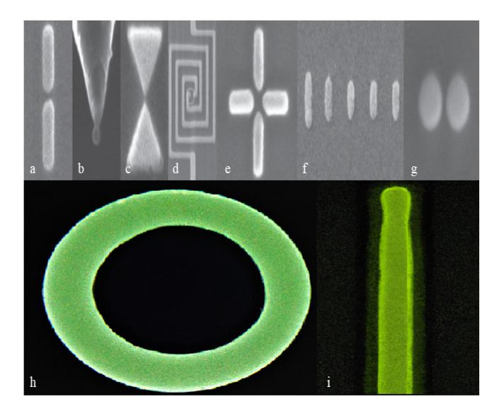

Fig. 1. SEM images showcasing different types of optical antennas: (a) Coupled-dipole antenna, (b) Nanoparticle antenna, (c) Bow-tie antenna, (d) Square-spiral antenna, (e) Cross antenna, (f) Yagi-Uda antenna, (g) Hertzian dimer antenna, (h) Nanoloop antenna, (i) Nanowire antenna. Images (a-g) captured from [108].

form the main building blocks of other nanoantennas as well, Coupled-dipole antennas [196], [197], [198], [199], Bow-tie antennas [204], [205], [206], [207], [208], [209], Hertzian dimer antennas [217], Nanoparticle antennas [200], [201], [202], [203], Yagi-Uda nanoantennas [210], [211], [212], [213], [214], [215], [216], Cross antennas [218], [219], and Square-spiral nanoantennas [220]. Table I presents a selection of top-performing nanoantennas featuring various structures, along with key design parameters like gain and bandwidth.

Relying on these fundamental concepts, we may now define and look into the nanoantenna parameters in the next section.

#### B. Antenna Parameters

The evaluation metrics for optical nanoantennas are closely similar to those of classical antenna structures. However, due to the plasmonic effect and shorter wavelengths involved, they require recalibration. Specifically, this recalibration can be applied to any frequency band where quantum effects cannot be disregarded. Consequently, the following equations and definitions can be extended to other frequencies with the inclusion of specific considerations, if necessary.

1) Radiation Pattern [18]: The radiation pattern provides a visual representation of an antenna's radiation properties in terms of its spatial coordination. Typically presented graphically, the pattern is defined within the spherical coordination system, i.e.,

$$P_{\rm rad} = \int_0^{\pi} \int_0^{2\pi} p(\theta, \phi) \sin\theta d\phi d\theta, \qquad (15)$$

where  $P_{\rm rad}$ , and  $p(\theta,\phi)$  are the radiated power and the normalized power density, respectively. Once the necessary calculations have been performed, we can plot the radiated power as a function of  $\theta$  or  $\phi$  and analyze and report the resulting radiation pattern.

2) Directivity [18]: Every antenna design aims to selectively transmit or receive propagations in specific directions while minimizing the influence of waves coming from other orientations. The directivity metric quantifies the antenna's ability to achieve this objective. It measures the antenna's performance in focusing transmitted or received waves. The directivity can be calculated within the spherical coordinate system using

$$D(\theta, \phi) = \frac{4\pi}{P_{rad}} p(\theta, \phi). \tag{16}$$

It is worth noting that the directivity can be defined independently for each axis, meaning that separate partial directivities can be calculated for the  $\theta$ -axis and the  $\phi$ -axis.

3) Efficiency [18]: Generally, the efficiency of an antenna is defined as

$$\eta_{\rm rad} = \frac{P_{\rm rad}}{P_{\rm rad} + P_{\rm loss}},$$
(17)

in which the  $P_{\rm rad}$ , and  $P_{\rm loss}$  are the radiated power and the power dissipated to heat, respectively. The total power can be calculated utilizing the oscillating electric field E of the nanoparticle transmitter and the *Poynting Vector*, which determines both the value and the direction of power dissipation. At the same time, the  $P_{\rm rad}$  is radiated from the entire nanosystem, i.e., both the nanoantenna and the nanoparticle.

4) Gain: The gain of an antenna can be defined as the ratio of the intensity in a specific direction (typically chosen as the direction of maximum radiation or maximum directivity) to the total input power dissipated by a hypothetical lossless isotropic reference antenna (P), whose gain is known, i.e., [18],

$$G = \frac{4\pi}{P}p(\theta, \phi) = \eta_{\text{rad}}D, \tag{18}$$

where D is the directivity. A commonly used choice for the reference antenna is a dipole. For example, if we consider a nanoparticle with a current density represented by  $\mathbf{J}(\mathbf{r},t) \approx Re\{\mathbf{J}(\mathbf{r})e^{-j\omega t}\}$  (which can be approximated as an oscillating dipole centered at the point-charge distribution of the nanoparticle) and a dipole moment denoted as  $\mathbf{p}(t) \approx Re\{\mathbf{p}e^{-j\omega t}\}$ , the Poynting vector  $\mathbf{S}(t)$  associated with the far-field of this dipole can be calculated as [108]

$$S(t) = \mathbf{E}(t) \times \mathbf{H}(t)$$

$$= \frac{1}{16\pi^2 \varepsilon_0 \varepsilon} \frac{\sin^2 \theta}{\mathbf{r}^2} \frac{n^3}{c^3} \left[ \frac{d^2}{dt^2} |\mathbf{p}(t - nr/c)| \right]^2 \mathbf{n}_r, \quad (19)$$

where  $\varepsilon$ , and  $\mathbf{n}_r$  are the permittivity of the environment and the radial unit vector, respectively. Note that the dipole moment due to a distribution of point charges  $q_n$  with respective coordinates  $\mathbf{r}_n$  and  $\mathbf{r}_0$  as the origin is expressed by  $\mathbf{p}(t) = \sum_n q_n[\mathbf{r}_n(t) - \mathbf{r}_0]$ , which can be written by assuming the time-harmonic dependence, as  $\mathbf{p}(t) \approx Re\{\mathbf{p}e^{-j\omega t}\}$ .

Now, if we take the integral of S(t) over a closed spherical surface  $(\partial V)$ , we obtain

$$P(t) = \int_{\partial V} \mathbf{S} \cdot \mathbf{n} \, da = \frac{n^3}{6\pi\varepsilon_0 \varepsilon c^3} \left[ \frac{d^2 |\mathbf{p}(t)|}{dt^2} \right], \quad (20)$$

{6}------------------------------------------------

| Structure      | Material                                   | Size (nm) | $\lambda$ (nm)     | Gain (dB)                      | BW (nm) 4     | Application                                               | Reference |
|----------------|--------------------------------------------|-----------|--------------------|--------------------------------|---------------|-----------------------------------------------------------|-----------|
| Nanowire       | InP                                        | 3130      | 850                | 2                              | 10            | Controlled Emission                                       | [189]     |
| Nanowire       | Gold/Si $O_2$                              | 40-1630   | 911                | 2                              | 25            | Development of complex nanoantennas                       | [190]     |
| Nanowire       | GaAs/InAs                                  | 2000      | 950                | 2                              | 70            | Quantum technologies                                      | [191]     |
| Nanowire       | Au/GaAs                                    | 2000      | 830                | N.m 1               | N.m           | Quantum technologies                                      | [192]     |
| Nanowire       | Gold/ITO                                   | 140       | 1100               | N.m                            | around 50     | Metamaterial design                                       | [195]     |
| Nanoloop       | Silver                                     | 500       | 1340               | 8.2                            | 10            | Boosted emissions in nanoscale applications               | [221]     |
| Nanoloop       | Gold                                       | 500       | N.m                | 7.5                            | N.m           | Enhanced nanoloop structures for optical applications     | [222]     |
| Bow-tie        | Gold/SiO 2 /ITO/PMMA            | 500       | 820                | N.m                            | 100           | High-contrast selection of single nanoemitters            | [204]     |
| Bow-tie        | Gold/Si/Cr                                 | 200       | $1100 \ (cm^{-1})$ | variable                       | variable      | Spectroscopy and optical information processing           | [205]     |
| Bow-tie        | Gold/ITO/Glass                             | 300       | 780                | 0.1 3                          | 50            | Next-generation photonic technologies                     | [206]     |
| Bow-tie        | Gold/ITO/Glass                             | 575       | 660-808            | N.m                            | N.m           | Lab-on-a-chip technology and biological applications      | [207]     |
| Bow-tie        | SiC/Glass/GaN/Gold                         | 600       | $900 (cm^{-1})$    | N.m                            | $20(cm^{-1})$ | Infrared applications                                     | [209]     |
| Nanoparticle   | Gold                                       | 60,100    | 740-1170           | N.m                            | 10            | High-resolution fluorescence imaging                      | [200]     |
| Nano-particle  | Gold                                       | 20,40,80  | 633                | E.F=40 2            | 15,23         | Spectroscopy, detection, and quantum applications         | [201]     |
| Nano-particle  | Gold/Silver                                | 10        | 680                | N.m                            | 20            | Photovoltaic devices                                      | [202]     |
| Yagi-Uda       | Various(e.g. Si)                           | 150       | 520                | 12                             | 50            | Nanophotonic circuits and photovoltaic devices            | [210]     |
| Yagi-Uda       | Gold/PC403                                 | 300       | 1500               | 20(Array),6(Single)            | 100           | Controlling light and point-to-point connection           | [211]     |
| Yagi-Uda       | Silver/Silica                              | 150       | 620                | 3                              | 25            | Molecular spectroscopy and sensing                        | [212]     |
| Yagi-Uda       | Si                                         | 130       | 490-570            | $8(\text{at }\lambda = 500nm)$ | 20            | Nano-optics                                               | [213]     |
| Yagi-Uda       | Gold/Glass/PMMA                            | 1200      | 1000               | 9                              | 50            | Computer processors and direct antenna links              | [214]     |
| Yagi-Uda       | Silver/a-Si                                | 390       | 1000               | N.m                            | 10            | Optical light manipulation at the nanoscale               | [215]     |
| Yagi-Uda       | Gold/Ti $O_2$                              | 40        | 780                | 7                              | 50            | Nonlinear signal detection and sensing                    | [216]     |
| Cross          | Si/quartz/Glass                            | 200       | 400-700            | N.m                            | 10            | Nano-spectroscopy and CCD imaging applications            | [218]     |
| Cross          | Gold/Glass                                 | 120       | 800                | E.F=40                         | 100           | Fluorescence-based biosensors                             | [219]     |
| Square-spiral  | Gold/Ti/Ti $O_x$                           | 5500      | 5-30 $\mu m$       | 2.5                            | 10            | Infrared detectors, cell devices and integrated photonics | [220]     |
| Coupled-dipole | Gold                                       | 110       | 830                | 1.15 3              | 50            | Sensors, near-field and plasmonic                         | [196]     |
| Hertzian dimer | Gold/Silver/Si 3 N 4 | 150       | 500                | 1.46                           | 30            | Imaging and sensing                                       | [217]     |

TABLE I
TABLE OF HIGH-PERFORMANCE NANOANTENNAS

4 "BW" is short for the bandwidth.

where we consider the radius of the sphere as zero to eliminate the retarded time. The average radiated power for a harmonically oscillating dipole can be expressed as

$$P = \frac{|\mathbf{p}|^2}{4\pi\varepsilon_0\varepsilon} \frac{n^3\omega^4}{3c^3}.$$
 (21)

To calculate the normalized radiation pattern, we take into account that n represents the dispersion-free index of refraction and must be one for the sake of the causality of the system. Additionally, we calculate the radiated power  $(p(\theta,\phi))$  into an infinitesimal unit solid angle  $d\Omega = \sin\theta d\theta d\phi$ , and divide it by the total radiated power (P), which gives us the normalized radiation pattern as

$$P_{n} = \frac{3}{8\pi} \sin^{2}\theta. \tag{22}$$

The normalized radiation pattern for two cases, one involving a single nanodipole and the other a multidipole array with four elements arranged in a row, is depicted in Fig. 2, which helps us gain insights into how the arrangement and design of nano antennas impact their radiation properties. Now, finding different parameters, such as gain and directivity, is straightforward for any type of antenna when the radiated power of the reference antenna (P) is calculated using Eq. (21), (22) and Fig. 2.

5) The Local Density of States: One notable distinction between classical and optical antenna theory lies in the definition of *input impedance*. In the context of optical nanoantennas, the concepts of current and voltage lack clear definitions, as the source is not directly connected to the antenna. Instead, since the power source is typically an emitter in the optical regime, we can calculate the Local Density of

States (LDOS) of the antenna. LDOS can be used to determine the density (or number) of states for the emitted photon out of the transmitter to occupy, allowing us to assess how its energy is dissipated [109]. As per this definition, a higher value of LDOS corresponds to better antenna performance. Thus, to enhance power dissipation, an optical nanoantenna must be optimized with higher values of LDOS. For instance, when considering a dipole emitter, we can calculate the LDOS using the system's dyadic Green function as

$$\rho_{\mathbf{p}}(\mathbf{r}_{0},\omega) = \frac{6\omega}{\pi c^{2}} \Big[ \mathbf{n}_{\mathbf{p}} \cdot \operatorname{Im} \Big\{ \overleftrightarrow{G}(\mathbf{r}_{0}, \mathbf{r}_{0}, \omega) \Big\} \cdot \mathbf{n}_{\mathbf{p}} \Big], \quad (23)$$

where  $\overleftrightarrow{G}$  is the Green-function tensor, and  $\mathbf{n_p}$  is a unit vector pointing in the direction of dipole  $\mathbf{p}$  [108].

By averaging Eq. (23) over all dipole orientations, when the quantum emitter has no preferred dipole axis, LDOS can be expressed as

$$\rho_p(\mathbf{r}_0, \omega) = \frac{12\varepsilon_0}{\pi\omega^2} \frac{P}{|\mathbf{p}|^2},\tag{24}$$

where  $\mathbf{r}_0$  and P denote the location of dipole  $\mathbf{p}$ , and the total radiated power, respectively [120].

6) Radiation Resistance: The radiation Resistance is defined as

$$R_{\rm rad} = \frac{P_{\rm rad}}{I_{\rm max}^2/2},\tag{25}$$

where  $R_{\rm rad}$ ,  $P_{\rm rad}$ , and  $I_{\rm max}$  are the radiation resistance, the radiation power, and the maximum current in the antenna's circuit, respectively. As explained earlier, the antenna element can be represented as a load in the circuit model. In this context, the radiation performance of the antenna increases

&lt;sup>1 "N.m" indicates that the information is not mentioned in the specific reference.

&lt;sup>2 "E.F" represents the Efficiency Factor, measuring the nanoantenna's enhancement efficiency— a parameter assessing the structure's ability to enhance light-matter interactions.

&lt;sup>3 This value represents the Emission Intensity (106 counts/s).

{7}------------------------------------------------

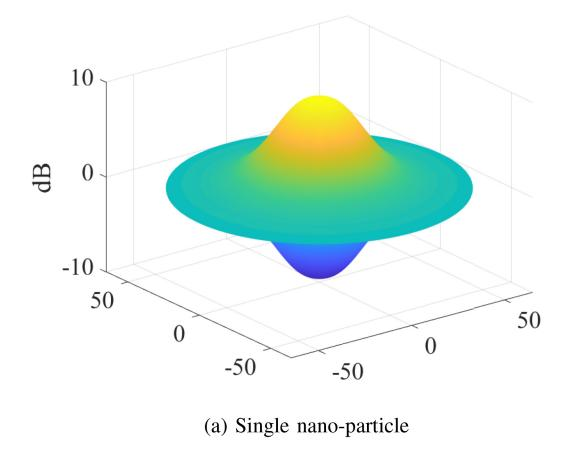

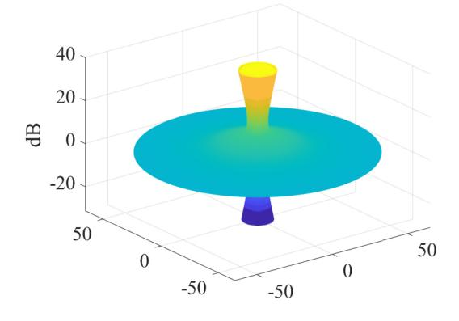

(b) 4-elements array of nano-particles

Fig. 2. Normalized Radiation Pattern: (a) A single nanoparticle functioning as a radiative nanodipole, where there is no radiation in the direction of the dipole. As anticipated, this miniature component exhibits low gain and low directivity. (b) A row of four nanodipoles arranged as an antenna array, with each dipole spaced 190 nm apart, designed for maximum radiation at  $\theta = 0^{\circ}$  ( $\beta = -kd$ ). The majority of the radiation is perpendicular to the nano dipole moment, similar to its RF counterpart. This configuration outperforms the single radiator in terms of directivity and gain, albeit with unavoidable null points.

with a larger radiation resistance. Specifically, for a dipole antenna, the radiation resistance can be expressed as

$$R_{\rm rad} = \frac{2\pi}{3} Z_0 \left(\frac{\Delta \ell}{\lambda}\right)^2, \tag{26}$$

where  $\Delta \ell$  is the antenna length,  $Z_0 \approx 377~\Omega$  is the wave-impedance in free space, and  $\lambda$  is the wavelength of operation [108].

7) Antenna's Effective Wavelength: When constructing an antenna, the design rules in both radio wave frequencies (including millimeter waves) and optical range illustrate a correlation between the operational frequency and the physical dimensions of the antenna. For instance, a half-wave antenna's length can be determined as  $\Delta \ell = \frac{1}{2} \lambda$ . In the case of array antennas, achieving maximum array efficiency requires careful spatial placement of the elements. This involves positioning the elements at distances proportional to the wavelength. A good example is the Hansen-Woodyard End-Fire Array, where the spacing parameter d is given by  $d = \frac{N-1}{N} \frac{\lambda}{4}$ . Here, N represents the number of array elements, and drepresents the required spacing between them [18]. In general, the essential dimensions of antennas can be expressed as  $\ell$ = (constant value)  $\times \lambda$ , emphasizing the linear relationship between antenna length  $(\ell)$  and the wavelength of radiation. However, in the case of optical frequencies, modifications need to be made as the previously mentioned equation no longer holds. This is because the PEC approximation is no longer valid at these frequencies. Consequently, at optical frequencies, the antenna's response to incident waves changes due to the presence of a shorter effective wavelength  $\lambda_{\rm eff}$ . This effective wavelength is determined by the material properties of the antenna, including the plasma frequency, conductivity, and penetration depth, i.e.,

$$\lambda_{\text{eff}} = n_1 + n_2 \frac{\lambda}{\lambda_{\text{p}}},\tag{27}$$

where  $n_1$  and  $n_2$  are constants depending on the antenna geometry, and  $\lambda_p$  is the plasma wavelength [122].

Calculating  $\lambda_{eff}$  according to (27) can be a complex task, often requiring the use of numerical and experimental methods. However, the linearity of this equation indicates that classical antennas can theoretically be linearly miniaturized into optical antennas. This miniaturization can be achieved by utilizing a Scaling Ratio (SR), i.e.,

$$SR = \frac{\lambda_{\text{eff}} \lambda_1}{\lambda_2}, \tag{28}$$

where  $\lambda_1$  represents the operational frequency of the optical antenna, and  $\lambda_2$  corresponds to the operational frequency of its classical counterpart [108].

In the following section, we inquire into the current applications of nanoantennas, while also introducing an emerging application, namely nano-scale radar systems.

#### IV. APPLICATIONS OF NANOANTENNAS

Nanoantennas exhibit remarkable capabilities, such as enabling terahertz band transmission suitable for 6G wireless communication, improving light-matter interactions for medical purposes, and enhancing sensing abilities for nanoradar applications. These capabilities are thoroughly discussed and explored in this section, highlighting their diverse applications across various fields.

#### A. 6G Wireless Communications

Building upon the advancements of previous generations, such as 1G (commercialized in the 1980s) which provided limited voice calling capabilities and limited transfer rates, to the current development and commercialization of 5G in the 2020s, which offers applications for the IoT and massive broadband services with significantly higher rates of up to 10 Gbps, the forthcoming 6G is anticipated to assist in developing a fully-digital world with hyper data transfer rates of up to 1 Tbps. To highlight the significance of 6G, similar Key Performance Indicators (KPIs) or characteristics will be employed, as outlined in Table II. When compared to the current most powerful existing generation,

{8}------------------------------------------------

TABLE II COMPARISON BETWEEN 6G AND 5G KPIS [\[258\]](#page-22-19), [\[261\]](#page-23-13)

| КРІ                                | 5G                     | 6G                     |  |
|------------------------------------|------------------------|------------------------|--|
| Peak Data Rate                     | 20 Gbps                | over 1 Tbps            |  |
| Experienced Data Rate           | 100 Mbps               | 1 Gbps                 |  |
| Latency                            | 1 ms                   | $10 - 100 \ \mu s$     |  |
| Jitter                             | Not Specified          | lower than $1~\mu s$   |  |
| Enhanced Energy Efficiency      | Not Specified          | 1 pJ/b                 |  |
| Reliability                        | Error rate $< 10^{-5}$ | Error rate $< 10^{-7}$ |  |
| Enhanced Spectral Efficiency    | around 30 b/s/Hz       | 100 b/s/Hz             |  |
| Connection Density and Mobility | 500 km/h               | beyond 1000 km/h       |  |

i.e., 5G, 6G offers noteworthy advancements. It is expected to be 100 times more reliable, possessing increased stability and dependability for various applications. Additionally, 6G offers data transfer rates that are 50 times faster, enabling even more efficient communication. Furthermore, 6G reduces latency by 10 times, resulting in significantly faster response times for in-time applications. These improvements in reliability, data transfer rate, and latency introduce 6G as a highly promising technology for future communication systems [\[262\]](#page-23-14), [\[263\]](#page-23-15), [\[264\]](#page-23-16). To enable the advanced capabilities of 6G, it is essential to identify a suitable operational frequency range within the spectrum and establish a wellaligned infrastructure. The most promising and untapped frequency range for 6G implementation, which can support faster data transfer rates and wider bandwidth, is known as the *Terahertz Gap*. This frequency range lies between 0.1 to 10 THz and offers exceptional potential for exceeding the limits of wireless communication in terms of speed and capacity. By exploring the capabilities of the Terahertz Gap, 6G can unlock new opportunities for hyper-connected and high-speed digital applications. The choice of the Terahertz Gap as the preferred frequency range for 6G implementation stems from several fundamental reasons. These reasons include limitations in the sub-6GHz band due to spectrum scarcity, insufficient bandwidth available in the millimeter wave (mmWave) range, constraints associated with the optical bands, and potential adverse effects of higher frequencies on the human body. These factors collectively highlight the need to explore alternative frequency ranges, such as the Terahertz Gap, to overcome these limitations and drive the development of 6G technology [\[125\]](#page-20-8). Terahertz waves possess several advantageous characteristics, making them well-suited for a range of applications. Their abilities include high resolution, the capability to penetrate non-conductive materials, sufficient bandwidth, and non-destructive properties–especially beneficial for medical purposes like cancer detection. These properties enable terahertz waves to provide important benefits and find applications in wireless communications and the upcoming 6G era. Along with many other usages, terahertz waves find applications in THz radars and sensing, enabling advanced navigation, collision avoidance for autonomous vehicles, and improved security screening [\[147\]](#page-20-9). They also offer wireless backhaul solutions, supporting the increasing demand for data transfer between base stations and core networks [\[148\]](#page-20-10). On the other hand, terahertz waves do face some limitations that should be taken into consideration. One of these limitations is the current lack of high-power THz wave transmitters. This means that the transmission distance of terahertz waves can be limited, affecting their range in certain applications. Additionally, terahertz waves are sensitive to high absorption coefficients caused by molecular absorptions in the propagation environment. This means that when terahertz waves interact with objects and obstacles, they can experience significant signal loss. This absorption phenomenon limits the ability of terahertz waves to penetrate certain materials and reduces their effectiveness in certain scenarios. To compensate for these limitations and harness the exceptional features of 6G communications, the implementation of highly directional antennas with sufficient gains and bandwidth is a must. These specialized antennas play a crucial role in overcoming the drawbacks associated with terahertz waves, enabling enhanced range and coverage. By offering high directivity, they focus the transmission beam in a specific direction, improving the efficiency of terahertz communication systems. Additionally, the large gains provided by these antennas boost signal strength, facilitating long-range communication capabilities. Furthermore, their wide bandwidth capabilities accommodate the high data rates required in 6G communications, supporting bandwidth-intensive applications and ensuring optimal performance. In this domain, antennas that operate in the frequency range of 0.1 to 10 THz are typically extremely small, often measuring in the nanoscale or sub-wavelength scale. Due to the reduced wavelength of electromagnetic waves within this range (ranging from 0.1 to 1 millimeter), conventional antennas designed for 4G or 5G communications (below 100 GHz) become ineffective. Hence, the field of antenna engineering and technologies faces numerous challenges in order to surpass these constraints and unlock the full potential of 6G applications, necessitating the utilization of nanoantennas. Terahertz antennas as the crucial components with the capability of addressing the challenges posed by 6G communications, can be divided into three major groups based on the manufacturing material: metallic or plasmonic antennas, novel antenna structures such as Metamaterial (MtM)-based and Graphene-based antennas, and dielectric antennas, which are outlined below, and compared in Table [III.](#page-9-0)

*1) Metallic Antennae:* Metallic antennas are manufactured using noble metals such as gold and silver, as well as copper, aluminum, or metal alloys that may include small percentages of palladium or platinum to improve stability and durability [\[138\]](#page-20-11). These antennas operate based on the principle of plasmonics, offering advantages such as low manufacturing cost, small sizes, and simple geometries. However, a major disadvantage of metallic antennas is their limited compatibility

{9}------------------------------------------------

#### TABLE III

COMPARISON BETWEEN VARIOUS TERAHERTZ ANTENNAS: [\[158\]](#page-20-12), [\[159\]](#page-20-13), [\[160\]](#page-20-14), [\[161\]](#page-20-15), [\[162\]](#page-20-16), [\[163\]](#page-20-17), [\[164\]](#page-20-18), [\[165\]](#page-21-26), [\[166\]](#page-21-27), [\[167\]](#page-21-28), [\[168\]](#page-21-29), [\[169\]](#page-21-30), [\[170\]](#page-21-31), [\[171\]](#page-21-32), [\[172\]](#page-21-33), [\[173\]](#page-21-34), [\[174\]](#page-21-35), [\[175\]](#page-21-36), [\[176\]](#page-21-37), [\[177\]](#page-21-38), [\[178\]](#page-21-39), [\[179\]](#page-21-40). METALLIC ANTENNAS, DIELECTRIC ANTENNAS, AND NEW-MATERIAL-BASED ANTENNAS (GRAPHENE AND METAMATERIALS). IT HIGHLIGHTS THE KEY METRICS SUCH AS LOWER COST AND PRODUCTION COMPLEXITY FOR METALLIC ANTENNAS, EASY AND ADVANCED INTEGRATION FOR DIELECTRIC ANTENNAS, AND COMPATIBILITY OF NEW-MATERIAL-BASED ANTENNAS WITH NANO-CHANNELS.

| Antenna Type                | Gain (dBi)        | Compatibility | Average Size   | Fabrication Difficulties |
|-----------------------------|-------------------|---------------|----------------|--------------------------|
| Metallic Antennas           | High 20-30        | Limited       | Sub-millimeter | Low                      |
| Dielectric Antennas         | Moderate 2-25     | Broad         | Micrometer     | Moderate                 |
| Graphene-based Antennas     | Extremely low < 1 | Limited       | Nanometer      | Moderate                 |
| Metamaterial-based Antennas | Moderate 2-5      | Limited       | Sub-millimeter | High                     |

with planar structures, making it challenging to incorporate them into modern technologies. Furthermore, their use of mechanical adjustment methods for antenna positioning can reduce the overall performance [\[138\]](#page-20-11). An example of a metallic antenna is the Horn antenna, which may feature a tapered or conical design [\[158\]](#page-20-12), [\[159\]](#page-20-13). Another instance is the travelingwave corner cube antenna, which is characterized by simple open structures, low manufacturing requirements, and low coupling efficiencies [\[160\]](#page-20-14), [\[161\]](#page-20-15). Despite their limitations, these types of antennas serve as practical options within the realm of metallic antenna technology.

- *2) Dielectric Antennae:* Dielectric antennas possess several significant characteristics, including low input impedance, ease of fabrication and integration, and low cost [\[138\]](#page-20-11). Unlike metal antennas, dielectric antennas have minimal free-electron movement, resulting in reduced losses and improved propagation properties. Various geometries, such as butterfly, dual U-shaped, logarithmic periodic, log periodic sinusoidal, and bent-wire configurations, have been proposed using genetic algorithms [\[138\]](#page-20-11), [\[162\]](#page-20-16). However, one notable drawback of these antennas is the presence of surface wave effects. These effects occur when the radiation angle exceeds the cutoff angle, leading to trapped energy in the dielectric substrate and high energy loss. To overcome this issue, techniques such as loading lenses, reducing substrate thickness, and replacing the dielectric material with electromagnetic bandgap (EBG) structures have been employed [\[163\]](#page-20-17).
- *3) Graphene-Based and MtM-Based Antennas:* Currently, there are interesting developments in material science that propose using carbon nanotubes and metamaterials for new and improved dipoles. These innovations offer significant advancements in radiation performance compared to traditional options. For example, carbon nanotube dipoles exhibit resonances within a specific frequency range below the terahertz gap but rapidly lose effectiveness outside this range [\[164\]](#page-20-18), [\[165\]](#page-21-26). Another promising option is bundles of carbon nanotubes wrapped in two dielectric layers, outperforming single-walled carbon nanotubes [\[166\]](#page-21-27). To further enhance bandwidth radiation characteristics and enable the fabrication of integrated antennas, researchers are exploring the application of two-dimensional planar materials, such as graphene, which possesses exceptional electrical properties.

Graphene allows for dynamic control by adjusting bias voltage and facilitates the production of surface plasmonics. In contrast to graphene, metals cannot naturally couple with and convert electromagnetic waves in free space, leading to rapid attenuation of SPPs parallel to the metal-substrate interface [\[167\]](#page-21-28). Consequently, metallic antennas, which are subject to skin effects and have limited size, fail to meet the requirements of THz antennas. However, graphene exhibits a wide range of light absorption and regulation, emphasizing inband transition dominance in the terahertz band. The collective oscillation of plasma in graphene enables excellent surface plasmon material properties characterized by stronger binding and lower loss. Moreover, graphene allows for continuous electrical tuning [\[168\]](#page-21-29), [\[170\]](#page-21-31), [\[171\]](#page-21-32). Indeed, further research on new antenna materials will be crucial for achieving optimal performance. These novel materials can overcome traditional antennas' limitations, presenting advantages such as high gain, wide bandwidth, low loss, and cost-effectiveness. Therefore, alongside graphene, it is also worth exploring metamaterials and other two-dimensional materials in antenna design [\[178\]](#page-21-39), [\[179\]](#page-21-40).

# *B. Nanoantennas in Medical Applications*

Nanotechnology has opened the way for novel advancements in the field of medicine, and one of its most fascinating components is the utilization of nanoantennas. These tiny structures, designed to interact with light on the nanoscale, have emerged as promising tools for revolutionizing medical applications in different ways, such as imaging, biosensing and disease detection, drug delivery, photodynamic therapy (PDT), real-time monitoring, and photothermal therapy [\[237\]](#page-22-0), [\[238\]](#page-22-1), [\[239\]](#page-22-2), [\[240\]](#page-22-3), [\[241\]](#page-22-4), [\[242\]](#page-22-5), [\[243\]](#page-22-6), [\[244\]](#page-22-7), [\[245\]](#page-22-8), [\[246\]](#page-22-9). For instance, nanoantennas are harnessed for innovative drug delivery strategies. Exploiting their plasmonic properties, they can generate localized heat when exposed to near-infrared light. As proposed by Ou et al. [\[237\]](#page-22-0) and illustrated in Fig. [\(3\(](#page-10-0)a)), this controlled photothermal effect triggers the release of therapeutic agents from liposomal drug carriers, like lowtemperature-sensitive liposomes (LTSLs). By co-delivering multi-branched gold nanoantennas (MGNs) and LTSLs, targeted drug delivery is achieved with minimal damage to

{10}------------------------------------------------

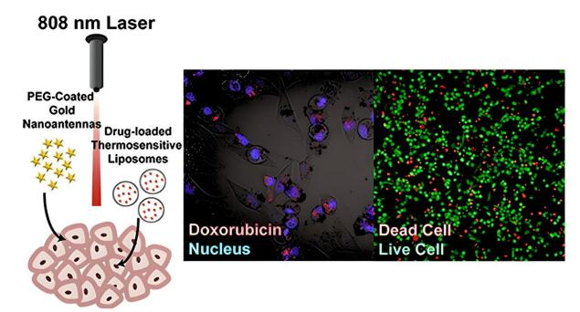

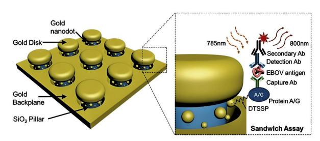

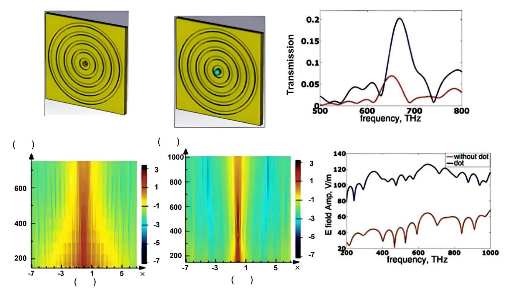

Fig. 3. Different examples of using nanoantennas in medical applications.

healthy tissue. The MGNs' unique geometry enhances lightto-heat conversion efficiency, enabling controlled drug release. This approach offers several advantages: precise drug delivery at the tumor site, noninvasiveness, and improved therapeutic efficacy in aggressive conditions like triple-negative breast cancer. MGN-mediated photothermal hyperthermia overcomes multidrug resistance and enhances drug delivery. This combination of nanoantennas and LTSLs opens avenues for clinically relevant noninvasive drug delivery platforms with the potential to revolutionize cancer treatment [\[237\]](#page-22-0). Nanoantennas have emerged as a groundbreaking tool in molecular sensing and detection as well, as exemplified by Zang et al. in [\[238\]](#page-22-1), when in the context of detecting the Ebola virus (EBOV) antigen, the significance of using nanoantennas is of greatest importance. The urgency to combat highly lethal pathogens like Ebola underscores the need for precise and sensitive diagnostics. Current methods, such as reverse transcriptase polymerase chain reaction (RT-PCR) and immunoassays, pose limitations in terms of sensitivity and controlled environments, and this is where nanoantennas shine. These plasmonic nanostructures possess the unique ability to interact intensely with biological elements due to their nanoscale characteristics. Through innovative techniques like nanoimprint lithography, Zang et al. have constructed 3D nanoantenna arrays. These structures 

{11}------------------------------------------------

exhibit optical resonance, magnifying fluorescence signal levels for early antigen detection as depicted in Fig. (3(b)). This leap in sensitivity is staggering when detection of EBOV soluble glycoprotein (sGP) in human plasma down to 220 fg mL-1 is achieved, with improvements of up to 240,000-fold compared to the 53 ng mL-1 EBOV antigen detection limit of the standard immunoassays. The scalable fabrication process further enhances their applicability, aligning with established assay formats. Zang's work showcases the transformative potential of nanoantennas, not only for Ebola but as a universal platform for diagnosing an array of diseases with unparalleled sensitivity and precision [238].

Numerous other publications within the literature demonstrate various applications involving nanoantennas and nanostructures in the realm of medical science. One such instance as shown in Fig. (3(c)), emphasizes on the employment of dielectric dot radiators, represented by the optical dot antenna (ODA), as a flexible way for arranging electromagnetic properties, thereby supporting transmission and directivity within bull's eye structures applicable to biosensors and nanophotonics [240]. Equally notable is the integration of plasmonic nanoantennas, manufactured by the indiumtin-oxide (ITO) nanorod arrays, which, as an alternative to conventional plasmonic materials like gold and silver, avoid their inherent limitations such as high loss and cost [243]. These examples are only a few out of many in the literature. However, it remains evident that further dedicated research endeavors are required to develop the maturity of this field.

# C. Nanoantennas for Enhanced Sensing in Nanoradar Systems

1) Discussions: A radar system is an electromagnetic technology employed for the detection and tracking of objects, specifically those in motion. This technology involves transmitting electromagnetic waves and subsequently analyzing the signals that are reflected or backscattered by the objects. Through this process, a radar system can unveil various characteristics of the objects, including their distance, speed, direction of movement, as well as material and physical properties. This system typically employs essential components such as antennas or transceivers, along with processing units and monitoring units. These components collaborate with each other to interpret the received signals from the targets, thereby enabling the determination of their respective locations, speeds, and other relevant features. At present, there is limited literature available on nanoradars, with only a few notable works being published [44], [49], [50], [51].

In addition to these limited works, there have been various discussions on sensing, imaging, and diverse forms of nano detections in the literature [52], [53], [54], [55], [56]. These discussions provide valuable insights that can contribute to the development of a nanoradar system. Integrating these discussions with the existing works on nanoradars will help establish a more comprehensive understanding of the concept.

In this section, we explore potential methodologies for nanoradar systems. Generally speaking, **A Nano-scale Radar** (**NR**) is a compact system designed to track minuscule entities, such as molecules or ions, at the nanoscale level, with the unique aspect of operating in optical frequencies, and to perform this task, they must be capable to detect and analyze the back-reflected/back-scattered waves from the targets efficiently.

Unlike conventional radar systems, which explore the transmission, reflection, and reception of signals based on the Doppler Effect-a domain well-explored in literature-important challenges can occur at the nanoscale [57], [58], [59], [60], [61], [62], [63], [64], [65], [66]. Specifically, due to the reliance on the optical and quantum properties of targets for reception and detection, such as scattering properties of the nanoparticle, a designed nanoradar might exhibit reliable performance in detecting one specific type of molecule yet struggle to discern another, while these optical properties can vary noticeably from one material to another. In other words, an anticipated potential NR system must be well-designed and optimized for only one particular application in one particular nano-channel. In order to study the scattering properties of nanoparticles, different methods, such as Mie-Theory or Rayleigh-Gans-Debye-Theory, are proposed [45], [46], [47], [48]. These theorems investigate the backscattered light (or electromagnetic waves) from the nano-objects by taking into account their sizes (relative to the wavelength of operation), shapes, and refractive indices. The Mie theory is a comprehensive approach for calculating light scattering by particles of all sizes, involving complex calculations based on Bessel functions and spherical harmonics [45]. It provides accurate results for various particle sizes and materials. Mathematically speaking, let's consider an abstract and simplified scenario where there is only one single spherical scatterer existing in the environment, exposed by a dipole nano-radiator. In this case, we can find closed-mathematical expressions for the incident and scattered electric fields, at observation point r [45], [46],

$$E_i(\mathbf{r}, \omega) = \sum_{\ell=0}^{\infty} \sum_{n=-\ell}^{\ell} \left( p_{\ell n} \mathbf{N}_{\ell n}^{(1)}(k\mathbf{r}) + q_{\ell n} \mathbf{M}_{\ell n}^{(1)}(k\mathbf{r}) \right), (29)$$

$$E_s(\mathbf{r}, \omega) = \sum_{\ell=0}^{\infty} \sum_{n=-\ell}^{\ell} \left( a_{\ell n} \mathbf{N}_{\ell n}^{(3)}(k\mathbf{r}) + b_{\ell n} \mathbf{M}_{\ell n}^{(3)}(k\mathbf{r}) \right), (30)$$

where  $N_{\ell n}$  and  $M_{\ell n}$  are the vector spherical harmonic basis functions for electric (TM), and magnetic (TE) harmonics, respectively, and  $a_{\ell n}$ ,  $b_{\ell n}$ ,  $p_{\ell n}$ , and  $q_{\ell n}$  are the coefficients, that must be calculated. The variable n takes integers from -l to l. This range is related to the azimuthal quantum number in spherical harmonics. Hence, for each value of l, there are 2l+1 possible values of n, corresponding to the magnetic quantum number. The summation over n from -l to l essentially sums over all possible values of the magnetic quantum number for a given angular momentum quantum number. Here, superscripts (1) and (3) mean that the coefficients are captured from spherical Bessel and Henkel functions, respectively. If the nano-particle is located at  $\mathbf{r}_0$ , the scattering coefficients  $a_{\ell n}$  and  $b_{\ell n}$  can be calculated, i.e.,

$$a_{\ell n} = (-1)^n \frac{i\alpha_{\ell}k^3}{\varepsilon} \frac{2\ell+1}{\ell(\ell+1)} \mathbf{N}_{\ell(-n)}^{(3)}(k\mathbf{r}_0).\mathbf{p}, \qquad (31)$$

{12}------------------------------------------------

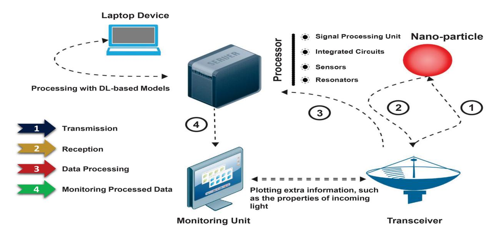

Fig. 4. The NR system Block Diagram comprises seven main blocks: Antenna and Transceiver responsible for wave transmission and reception, Signal Processing Unit for processing and analysis of received signals, Monitoring for displaying and visualizing processed radar data and other information, Sensors for providing feedback and control signals to the monitoring unit, Integrated Circuits (ICs) for controlling actuator movements and receiving data from sensors, and Resonator for ensuring frequency stability. All of these components can be integrated into a unified processor unit.

$$b_{\ell n} = (-1)^n \frac{i\beta_{\ell} k^3}{\varepsilon} \frac{2\ell + 1}{\ell(\ell + 1)} \mathbf{M}_{\ell(-n)}^{(3)}(k\mathbf{r}_0).\mathbf{p},$$
 (32)

where  $\mathbf{p}$ ,  $\alpha_\ell$ ,  $\beta_\ell$ , k, and  $\varepsilon$  are dipole moment, Lorentz-Mie single sphere coefficients, wavenumber, and the dielectric function, respectively. The computational cost for calculating these coefficients can be dramatically high, which makes finding the scattering fields extremely difficult, specifically when a more extended scenario is studied assuming multiple nano-particles in the environment with a total number of  $N_s$ , i.e.,

$$a_{\ell n}^{i} = \alpha_{\ell}^{i} \left\{ \frac{ik^{3}}{\varepsilon} \mathbf{N}_{\ell(-n)}^{(3)} \left( k \mathbf{r}_{0}^{i} \right) \cdot \mathbf{p} \right.$$

$$+ \sum_{\substack{j=1 \ j \neq i}}^{N_{s}} \sum_{n'=-\ell'}^{\infty} \sum_{n'=-\ell'}^{\ell'} \left[ a_{\ell'n'}^{j} A_{\ell n \ell' n'}^{(3)} \left( k \mathbf{R}^{ji} \right) \right.$$

$$+ b_{\ell'n'}^{j} B_{\ell n \ell' n'}^{(3)} \left( k \mathbf{R}^{ji} \right) \right] \right\}, \qquad (33)$$

$$b_{\ell n}^{i} = \beta_{\ell}^{i} \left\{ \frac{ik^{3}}{\varepsilon} \mathbf{M}_{\ell(-n)}^{(3)} \left( k \mathbf{r}_{0}^{i} \right) \cdot \mathbf{p} \right.$$

$$+ \sum_{\substack{j=1 \ j \neq i}}^{N_{s}} \sum_{\ell'=1}^{\infty} \sum_{n'=-\ell'}^{\ell'} \left[ b_{\ell'n'}^{j} A_{\ell n \ell' n'}^{(3)} \left( k \mathbf{R}^{ji} \right) \right.$$

$$+ a_{\ell'n'}^{j} B_{\ell n \ell' n'}^{(3)} \left( k \mathbf{R}^{ji} \right) \right] \right\}, \qquad (34)$$

where  $A_{\ell n \ell' n'}^{(3)}$  and  $B_{\ell n \ell' n'}^{(3)}$  are vector harmonic addition coefficients to model the couple between  $i^{\rm th}$  and  $j^{\rm th}$  spherical nano-particles, and  ${\bf R}^{ji}={\bf r}-{\bf r}_0$ . Note that in the case of a plane-wave excitation,  $n=\pm \ell$ , which is not valid for dipole excitation. In contrast to the Mie theory, the RGD theory simplifies scattering calculations for small particles (radius  $\ll$ 

wavelength) by assuming isotropic polarizability and straightforward scattering patterns [47]. The RGD approximation is applicable under specific conditions, i.e.,

$$|n-1| \ll 1,\tag{35}$$

$$kd|n-1| \ll 1,\tag{36}$$

where d is the linear dimension of the particle and n stands for the relative complex refractive index of the particle with respect to the surrounding medium. Considering an arbitrarily shaped particle exposed to a plane wave radiation in the z-direction, the parallel and perpendicular components of the scattered electric field can be calculated using the scattering matrix [47], [48], i.e.,

$$\begin{pmatrix} \Delta E_{\parallel \text{scat}} \\ \Delta E_{\perp \text{scat}} \end{pmatrix} = \frac{e^{(ik(r-z))}}{-ikr} \begin{pmatrix} S_2 & 0 \\ 0 & S_1 \end{pmatrix} \begin{pmatrix} E_{\parallel \text{inc}} \\ E_{\perp \text{inc}} \end{pmatrix}, \quad (37)$$

where  $E_{\parallel \rm scat}$ ,  $E_{\perp \rm scat}$ ,  $E_{\parallel \rm inc}$ , and  $E_{\perp \rm inc}$  are the parallel and perpendicular components of the scattering, and incident fields, respectively. Also, the scattering matrix elements need to be calculated separately, i.e.,

$$S_1 = -\frac{ik^3}{2\pi}(n-1)Vf(\theta,\phi),$$
(38)

$$S_2 = -\frac{ik^3}{2\pi}(n-1)Vf(\theta,\phi)\cos(\theta), \tag{39}$$

where V is the volume of the particle, and  $f(\theta, \phi)$  is the form factor, i.e.,

$$f(\theta,\phi) = \frac{1}{V} \int_{V} e^{i\delta} d\nu, \tag{40}$$

where  $\delta$  is the phase and can be calculated for different cases, e.g., for a homogeneous sphere  $\delta=2k\xi\sin(\frac{\theta}{2})$ , where the variable  $\xi$  is the distance from the origin to a plane of constant phase. Note that, in the case of a heterogeneous particle including j homogeneous regions, (37) must be generalized by calculating  $S_1$  and  $S_2$  for each region and summing up

{13}------------------------------------------------

| Aspect               | Rayleigh-Gans-Debye Theory                                 | Mie Theory                                                           |
|----------------------|------------------------------------------------------------|----------------------------------------------------------------------|
| Particle Size        | Suitable for $r \ll \lambda$                               | Applicable to a wide range of particle sizes                         |
| Scattering Regime    | Rayleigh and some Mie scattering                           | Mie scattering (covers broader scattering range)                     |
| Polarizability Model | Isotropic                                                  | Complex polarizability based on size, shape, and material properties |
| Scattering Amplitude | Simple expression $f(\theta) \propto \cos^2(\theta)$       | More complex expressions based on Bessel functions                   |
| Computational Cost   | Simplified calculations                                    | High computation costs in terms of time and resources                |
| Accuracy             | Accurate when $kd n-1 \ll 1$                               | More accurate on different particles                                 |
| Usage Scenarios      | Suitable for quick estimations and simple scattering cases | Preferred for detailed and accurate scattering analyses              |

TABLE IV COMPARISON BETWEEN RGD AND MIE THEOREMS [45], [46], [47], [48], [89], [90]

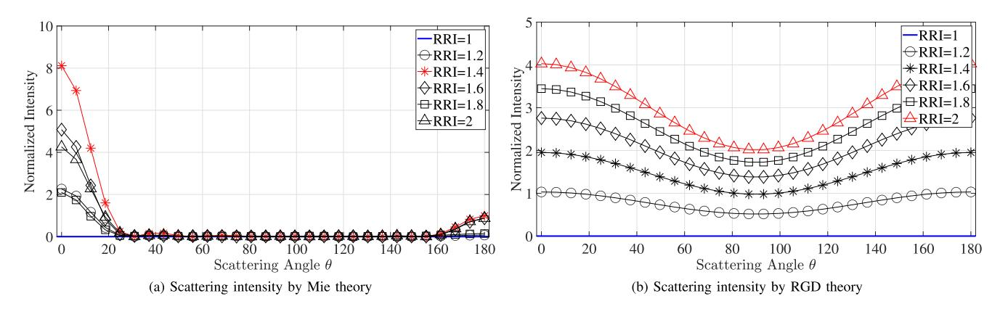

Fig. 5. (a) The intensity of the back-reflected electromagnetic waves as a function of the scattering angle for a homogeneous particle having a radius approximately equivalent to the incident light's wavelength (around 500 nm and 428 nm, respectively). In this case, (31) can be used. (b) The intensity of the scattered waves as a function of the scattering angle for a homogeneous spherical particle with a radius much smaller than the incident light's wavelength, i.e.,  $r \ll \lambda$  (around 50 nm and 428 nm, respectively). In these figures, RRI is the abbreviation of Relative Refractive Index and denotes the ratio of the refractive index of the nano-particle to the surrounding medium.

the results to achieve the final terms of the scattering matrix elements.

RGD theory is suitable for quick estimations but lacks accuracy for larger particles, while Mie theory covers a broader range of particle sizes and materials with more accurate predictions. Table IV provides a brief comparison between these two. Due to the noticeable computational costs associated with both Mie and RGD approaches, it becomes essential to use software tools such as Ansys Lumerical or COMSOL to fully simulate the entire procedure physically or MATLAB to explore the patterns of back-scattered electromagnetic waves numerically.

2) Simulations and Analysis: In this section, MATLAB has been used to find the scattering coefficients and investigate the scattering patterns, and the results are depicted in Fig. 5. In this context, consider an optical nano dot functioning as a transmitting antenna, emitting at a frequency of 700 THz (wavelength = 428 nm), within a nano-channel filled with Air ( $\varepsilon=1$ ). The objective is to detect a single homogeneous spherical object under two distinct scenarios. In one scenario, the nanoparticle's radius is set at 50 nm, i.e., the RGD theory must be applied, while in the other, is adjusted to 500 nm, i.e., Mie theory is employed.

The key difference between these two cases is the ratio of the target's size to the operational wavelength. In the first

scenario, size ≪ wavelength is met, allowing for the utilization of the RGD approximation. Conversely, in the second scenario, where this condition does not hold, the more sophisticated Mie's algorithm must be employed to accurately model the scattering phenomenon. As shown in Fig. 5, due to their minuscule dimensions, nano-particles exhibit limited capability in reflecting light with high intensities. Consequently, the received signals (echo-signals) are weak, especially within certain scattering angle intervals, such as between 50 to 150 degrees, which makes the process of detecting and analyzing the back-reflected signals, practically complex for the processing unit of the nanoantenna. One way to overcome this issue is to increase the refractive index of the particle as its inherent physical aspect. This index signifies the ability of the nano-particle to repel incident waves. Notably, an increase in the refractive index often leads to enhanced scattering properties of the particle, which makes it more feasible for the radar to correctly detect the nano-particle. In radar systems, received signals often include both echoes and undesired signals, known as noise. A simple method to mitigate noise effects is through threshold detection. This involves selecting an appropriate threshold value based on the signal's strength. This threshold helps distinguish between received signals that could be representative of a target's presence and those that are mere noise.

{14}------------------------------------------------

According to Fig. [5,](#page-13-1) only specific refractive indices within certain scattering ranges exhibit a noticeable distinction between potential system noise and a valid echo signal. However, it is crucial to note that the effectiveness of the processing unit holds significant importance. This unit is responsible for carrying out subsequent analysis of received echo signals, which includes tasks like determining a reliable threshold value, detecting the presence of a target, and even extracting its electrical properties, such as permittivity. For instance, in Fig. [6,](#page-14-1) determining an appropriate threshold value aligned with the processing unit's capabilities provides us with the range of detectable scattering angles, denoted as 2δ.

In Fig. [5,](#page-13-1) a notable observation is the contrast in backscattered wave intensity among different particle sizes at a specific frequency. Fig. [\(5\(](#page-13-1)a)) illustrates that when a nanoparticle around 500 nm in size interacts with light of λ = 438 μm, its relatively large size allows light to easily pass through it. This results in nearly zero amplitude for scattered waves across a broad range of angles from 25 to 160 degrees. Conversely, Fig. [\(5\(](#page-13-1)b)) clearly shows that for smaller particles, light penetration is significantly more challenging, leading to noticeable scattering across all angles compared to the previous case. This discrepancy underscores a critical consideration regarding radar operational frequencies for different particle sizes. It emphasizes the need to select a frequency that ensures operation within the RGD regime, where the particle size remains considerably smaller than the operational wavelength.

This setup suggests an initial step for an NR system to detect nano-targets. Yet, radar systems encompass tasks beyond mere detection, including estimating the range between the system and the target. While Mie theory addresses electromagnetic wave-particle interaction, it doesn't directly account for calculating the distance between emitter and target, i.e., solely relying on the Mie theory principles cannot help us through a complete standardization of nanoradars. Hence, unveiling deeper insights into target detection, accounting for the coexistence of factors like particle-emitter distance necessitates the application of more sophisticated electromagnetic theories and computational techniques, such as the Finite-Difference Time-Domain (FDTD) approach, which will be discussed in future works.

In other words, to analyze and calculate the waves that are reflected back from the target, we can apply more sophisticated methods and use the Mie or RGD theories to find the wave properties near the nano-particles. For instance, to study the scattering pattern of a nano-object, we can use the FDTD method to simulate the waves at the target location, considering the case of an inhomogeneous and dispersive medium. Then, we can apply the Mie theory to evaluate the backscattered waves.

In the following section, we will list certain NR components and analyze each separately.

# V. NANORADAR CONFIGURATION

A nanoradar system is composed of diverse components dedicated to object detection and signal processing, enabling

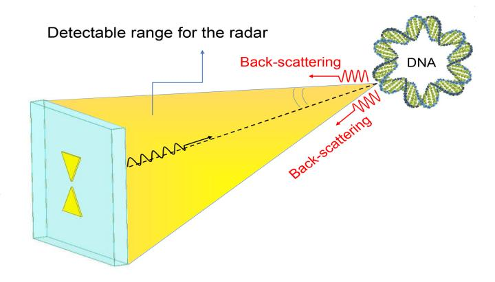

Fig. 6. A potential MNR configuration containing a DNA molecule as the scatterer (target) and a bow-tie structure as the transmitting antenna is depicted, showcasing the detectable angle δ. Due to the symmetry, the total feasible range of reflection angles for radar detection spans 2δ.

the extraction of key features such as speed, size, and physical or chemical properties tailored to specific applications. This study presents a practical setup, illustrated in Fig. [4,](#page-12-1) highlighting the indispensable role of nanoantennas as transmitters, receivers, or transceivers, a dedicated processing unit, which potentially incorporates software packages leveraging advanced deep learning methodologies, and photodetectors, which can be employed as accurate and powerful receivers, as discussed and listed below.

#### *A. Nanoantennas*

Nanoantennas are foundational components within potential NR systems. Engineered to engage with electromagnetic waves and resonate at distinct frequencies, they facilitate the transmission and reception of signals. In other words, they are responsible for controlling wave transmissions and reflections by emitters and targets, respectively. In a potential bistatic NR (BNR) setup, two distinct nanoantennas would be utilized–one for signal transmission and another for reception. Moreover, employing one antenna as a transmitter and integrating a separate component, like a photodetector, as the receiver can significantly enhance sensing capabilities and facilitate radar signal analysis, which will be explored further in more detail. On the other hand, in a Monostatic NR (MNR) setup, as shown in Fig. [6,](#page-14-1) compact transceivers can be utilized to manage both the transmission and reception of radar signals simultaneously [\[67\]](#page-19-28), [\[68\]](#page-19-29). Previous sections have discussed numerous structures that have been proposed for potential use in nanoradar systems. Depending on the specific applications and requirements, any of these structures can be used in a nanoradar system. The choice would depend on factors such as desired performance, operating conditions, and target detection capabilities.

# *B. Photo-Detectors (PDs)*

One convenient method for capturing back-scattered waves from targets within nanochannels involves the use of photodetectors. These devices possess the ability to sense and 

{15}------------------------------------------------

detect electromagnetic waves, particularly in the form of light, by generating an electric current when exposed to it. The resulting electric current in the external circuitry of the photo-detector, in response to optical radiations, can be monitored and analyzed. This analysis allows for a better understanding of the intrinsic features of the back-reflected light, serving as indicators of both the physical and electrical properties of nano-objects, such as their sizes, speeds, locations, and permittivities [88]. Photo-detectors are considered the main components of the photo-receiver inside optical channels, e.g., a nanoradar system, with different performance metrics, such as the quantum efficiency, bandwidth, and compatibility, which are expected to be optimized as a primary step of incorporating the PD into a nanoradar configuration. There are different proposed structures for photo-detectors depending on the application, e.g., resonant cavity enhanced photo-detectors (RCE-PD) [79], carbon nanotube and nanowire-based photo-detectors [80], [81], lowtemperature grown gallium arsenide (LT-GaAs) high-speed photo-detectors [82], plasmonic photo-detectors [83], CMOSintegrated waveguide photo-detectors [84], photomultiplier tubes (PMTs) [85], image intensifiers (I2) [86], and organic narrowband photodetectors [87]. The possibility of using each of these structures, along with their operational frequency bands must be proven for NR. For instance, we can calculate the photo-generated current of an RCE-PD structure as a result of an incident power as proposed in [79], i.e.,

$$I_{ph}(t) = \frac{q}{x_a + w_n + w_p} \big[ v_n N_{ph}(t) + v_p P_{ph}(t) \big], \ (41)$$

where  $w_n$  and  $w_p$  are the space charge widths surrounding the active layer in the N-layer and P-layer, and  $q,\ x_a,\ N_{ph}(t),\ P_{ph}(t),\ v_n,$  and  $v_p$  are the total charge, active region width, total photo-generated electron concentration, total photo-generated hole concentration, electrons saturation velocity, and hole saturation velocity, respectively.

The total photo-generated electron and hole concentrations in (41) are functions of time, dependent on the intrinsic physical parameters of the photo-detector, the incident power intensity  $P_i$ , the propagation frequency  $\nu$ , and the Planck's constant h [79], i.e.,

$$N_{\rm ph}(t) = \frac{P_{\rm i}}{h\nu} \left\{ (\mu_{\rm f}^* + \mu_{\rm b}^*) \left[ 1 - e^{-\alpha_{\rm eff} x_{\rm a}} \right] \right.$$

$$\times \left[ u(t) - u \left( t - \frac{w_{\rm n}}{v_{\rm n}} \right) \right]$$

$$+ \left[ \mu_{\rm f}^* \left( 1 - e^{-\alpha_{\rm eff} x_{\rm a} + \alpha_{\rm eff} v_{\rm n} t - \alpha_{\rm eff} w_{\rm n}} \right) \right.$$

$$+ \mu_{\rm b}^* \left( -e^{-\alpha_{\rm eff} x_{\rm a}} + e^{\alpha_{\rm eff} v_{\rm n} t - \alpha_{\rm eff} w_{\rm n}} \right) \right]$$

$$\times \left[ u \left( t - \frac{w_{\rm n}}{v_{\rm n}} \right) - u \left( t - \frac{w_{\rm n} + x_{\rm a}}{v_{\rm n}} \right) \right] \right\}, \tag{42}$$

$$P_{\rm ph}(t) = \frac{P_{\rm i}}{h\nu} \left\{ (\mu_{\rm f}^* + \mu_{\rm b}^*) \left[ 1 - e^{-\alpha_{\rm eff} x_{\rm a}} \right] \right.$$

$$\times \left[ u(t) - u \left( t - \frac{w_{\rm p}}{v_{\rm p}} \right) \right]$$

$$+ \left[ \mu_{\rm f}^* \left( 1 - e^{-\alpha_{\rm eff} x_{\rm a} + \alpha_{\rm eff} v_{\rm p} t - \alpha_{\rm eff} w_{\rm p}} \right) \right]$$

$$+\mu_b^* \left(-e^{-\alpha_{\text{eff}} x_a} + e^{\alpha_{\text{eff}} v_p t - \alpha_{\text{eff}} w_p}\right) \right] \times \left[ u \left(t - \frac{w_p}{v_p}\right) - u \left(t - \frac{w_p + x_a}{v_p}\right) \right] \right\}, \quad (43)$$

in which  $\alpha_{\rm eff}$  is the ionization factor,  $\mu_f^* = \mu_f/(1 - e^{-\alpha_{\rm eff} x_a})$ , and  $\mu_b^* = \mu_b/(1 - e^{-\alpha_{\rm eff} x_a})$ , where  $\mu_f$ , and  $\mu_b$  are the forward quantum efficiency (the ratio between the forward optical power to the total incident power), and the backward quantum efficiency (the ratio between the backward optical power to the total incident power), respectively.

It's important to highlight that in the next phase, we can analyze the impact of nano-targets on  $I_{\rm ph}(t)$  by employing Deep Learning (DL) models, thereby completing the nanoradar detection process [75]. Further investigation into feasible photo-detectors is essential if opted for being employed in an NR system. This choice is dependent on multiple factors, including the channel's length, the background material of the channel (water/air/etc.), the optimal number of PDs for effective detection, and their strategic placement within the channel.

#### C. Signal Processing and Monitoring

The processor would assume the responsibility of analyzing radar echo signals, extracting pertinent data, and formulating decisions predicated on the received signals. This unit could be seamlessly integrated within the radar system or function autonomously, establishing connectivity to the radar through suitable interfaces. Additionally, comprehensive oversight and regulation of all signals within the NR system are imperative across various tiers. The radar system's operation, encompassing parameter configuration, configuration adjustments, and overall performance monitoring, necessitates meticulous supervision facilitated through software interfaces or internal components and controllers. By leveraging Machine Learning (ML) and Deep Learning (DL) techniques, the complex output information contained within nanoscale signals in the NR system can be efficiently processed and interpreted. This enables researchers and practitioners to gain deeper insights into the data, enabling more precise monitoring and visualization of targets of interest [75]. Moreover, ML and DL models contribute to the task of detecting and classifying targets, providing enhanced capabilities in accurate identification and categorization. Therefore, the utilization of ML and DL models in analyzing nanoscale signals offers a practical solution that empowers sophisticated data processing, enabling comprehensive understanding and improved decision-making based on the captured information [75], [76], [77], [78]. The processing unit might be empowered by different components and modules. Some of these are as follows:

(a) Nano-resonators: Nanoscale resonators, specifically Metamaterial-based (MtM) structures, have the capability to manipulate electromagnetic waves at unique resonant frequencies determined by their size, shape, and material characteristics. These resonators can serve as highly sensitive sensors, detecting optical forces exerted by nano-objects like quantum dots or individual molecules. Additionally, they offer potential applications 

{16}------------------------------------------------

in nano-communication systems as precise frequency references for accurate timekeeping [\[69\]](#page-19-44), [\[70\]](#page-19-45). As a result, these structures are designed to enhance signal processing capabilities and improve sensitivity, making them viable components for a potential NR system.

- (b) *Nano Integrated Circuits (NICs):* Nanointegrated Circuits (NICs) possess the potential to play a critical role in the processing of radar signals, encompassing essential functions like modulation, sensing and detection (including single-photon detectors), and filtering. The design of these circuits must align with the specific requirements and functionalities of the NR system. Effective operation at the nanoscale and high frequencies, spanning the terahertz and optical ranges, is a key consideration. NICs can be fabricated using innovative materials and structures such as nanowires, graphene, and carbon nanotubes (CNTs) [\[71\]](#page-19-46), [\[72\]](#page-19-47).
- (c) *Nano-actuators and Sensors:* Nanoscale actuators play a crucial role in detecting external stimuli and enabling the NR system to adjust its parameters in response to the surrounding conditions. These actuators possess the unique advantage of precise manipulation at the nanoscale, making them well-suited for a broad range of applications that require accurate and miniaturized motion. The literature presents various types of nanoscale actuators or nanoelectromechanical systems (NEMS). For instance, Piezoelectric Actuators utilize the piezoelectric effect to enable precise positioning and control applications. Electromagnetic Actuators employ magnetic fields to generate forces, while Thermal Actuators rely on the expansion and contraction properties of materials. Additionally, Shape Memory Alloy Actuators utilize shape memory alloys, capable of reversible changes in shape or length when subjected to temperature variations. These diverse types of actuators offer promising avenues for achieving precise and adaptable motion at the nanoscale [\[73\]](#page-19-48), [\[74\]](#page-19-49).

Although all of the mentioned building blocks of the NR system have actual fabrication, the compatibility of these components remains a critical challenge. Significant efforts are required to develop the field of nanoradars toward standardization.

The standardization process aims to ensure consistency and efficiency across different nanoradar systems. To achieve this goal, researchers and engineers need to focus on explaining the underlying principles of nanoradars and clarifying the essential building blocks required for their implementation. This includes studying the interactions between nanoradar components such as transceiver antennas, nano-integrated circuits (NICs), nano actuators and sensors, and signal processing and monitoring units. In parallel with understanding the fundamental aspects, the development of standardized fabrication methods is a must. Researchers must explore various techniques and processes that enable the efficient and reliable integration of nanoradar components. Standardization will enable the development of more robust and reliable nanoradar systems that are versatile tools that find efficient applications across various fields, including biomedical imaging, disease

monitoring, drug-delivery supervision, in-body or external monitoring, and more.

## *D. Joint Communication and Sensing (JSAC)*

The primary concept behind Joint Communication and Sensing (JSAC) revolves around seamlessly integrating communication and sensing capabilities within systems and devices. This integration allows these devices to perform both sensing and transceiver functions simultaneously, enhancing their versatility and efficiency. Contrary to earlier proposals for nanoradars, which utilized separate photodetectors and nanoantennas, the JSAC methodology suggests employing components capable of multitasking. For example, instead of combining an RCE-PD and an optical antenna for light transmission and reception, a nanoantenna with a bio-functionalized layer coated with a specific biomarker detection layer can be used, as proposed in Fig. [8.](#page-17-7) When the detection layer binds with the target biomarker, it changes physical and electrochemical properties, resulting in detectable alterations in the antenna's frequency response [\[127\]](#page-20-19), [\[128\]](#page-20-20), as shown in Fig. [7.](#page-17-8)

Drawing inspiration from the framework of Terahertz Integrated Sensing and Communication (THz ISAC), which delineates AI-based approaches into joint communication and sensing, sensing-aided communication, and communicationaided sensing roles, NR configurations can similarly benefit [\[125\]](#page-20-8). For instance, employing two SensingNet deep learning models, one for range estimation and another for velocity estimation, each structured with input layers, flattening layers, five dense layers for feature extraction and nonlinear mapping, and an average output layer, as proposed in [\[126\]](#page-20-21), can significantly improve radar parameter extraction and learning speed. By leveraging such integrated approaches, we can enhance the capabilities of nanoradars and nanoantennas, making them more adept at handling complex tasks efficiently and paving the way for advanced applications in various fields, including biomedical sensing, environmental monitoring, and smart infrastructure management [\[125\]](#page-20-8), [\[126\]](#page-20-21), [\[127\]](#page-20-19), [\[128\]](#page-20-20).

While JSAC presents potential benefits for creating more efficient configurations, challenges arise when implementing it in a general NR system. For instance, the use of a nanoantenna with a specific biomarker detector layer can only aid in detecting and extracting targets and nano-objects capable of binding with this layer [\[127\]](#page-20-19). This limitation narrows the radar system's applicability, necessitating careful consideration of its intended use. When the radar's purpose is specific, such as detecting certain types of targets, exploring alternatives to photodetectors becomes viable. However, a comprehensive solution is required for a more versatile system capable of tracking various objects regardless of their properties, as depicted in Fig. [4.](#page-12-1)

# VI. CONCLUSION

In summary, the successful operation of many cutting-edge technologies relies heavily on well-established infrastructures. Optical antennas, particularly those operating in optical ranges,

{17}------------------------------------------------

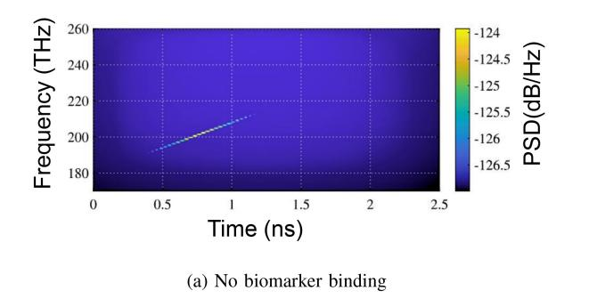

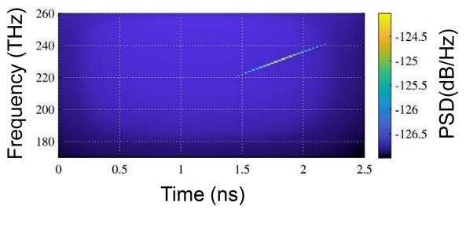

Fig. 7. Detection of antenna resonant frequency before and after binding based on the cutoff frequency and Power Spectrum Density (PSD) [\[127\]](#page-20-19).

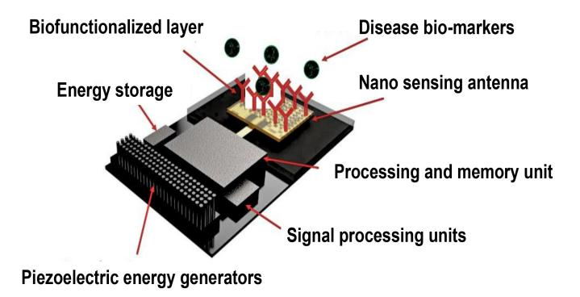

Fig. 8. Concept of plasmonic nano-patch antenna as a biofunctionalized sensor [\[128\]](#page-20-20).

including the terahertz gap, are critical components that require thorough investigation and development to meet the demands of state-of-the-art applications such as 6G, IoT, ISAC, nanoscale radar systems, and medical applications. The increasing need for Tbps data transfer rates in optical and terahertz communication channels calls for the development of optical nanoantennas with high gains and wide bandwidths. This article aims to investigate the fundamentals and emerging technologies in this field, referencing significant publications and offering researchers a comprehensive perspective on the various aspects and challenges connected to the design and construction of nanoantennas for diverse applications. Additionally, for the first time, this paper introduces the standardization of NR systems by presenting a foundational building block and discussing potential analysis techniques like Mie and RGD theories to explore the scattering behavior of nanoparticles. A practical nanoradar must proficiently detect the presence of nanoparticles and extract their physical or electrical properties within the nanochannel. Illuminating nano-objects is achieved through nanoantennas, and capturing back-scattered waves necessitates a device like a transceiver or a photo-detector. The photo-detector monitors the output current generated by incident waves, aiding in understanding the incoming light's various aspects and properties. Finally, the data processing unit, empowered by machine learning or deep learning models, analyzes and extracts these properties.

While this paper thoroughly explores the feasibility of the proposed NR configuration and details methodologies for fabricating its building blocks, challenges persist in seamlessly integrating these components, ensuring their effective interaction, processing multiple radar signals from diverse objects, and extracting crucial radar parameters such as distance and speed. Although we have discussed these challenges and proposed various solutions, such as utilizing FDTD simulations for target localization and employing AI-based methods for speed extraction, these aspects require further investigation in future work. This upcoming research will leverage highperformance simulation packages and advanced DL techniques to address these complexities comprehensively.

Furthermore, a comparative analysis is essential between the proposed configuration, utilizing optical antennas for transmission and a suite of photodetectors and signal-processing units for reception and analysis, and existing integrated sensing and communication infrastructures like plasmonic nano-antennas or THz ISAC frameworks. This comparison will shed light on performance metrics and highlight areas for improvement and innovation in NR systems. Tackling these challenges and conducting detailed comparisons necessitates dedicated research efforts and attention.

In conclusion, further research is expected in the near future, focusing on feasible configurations within the aforementioned components, ensuring physical compatibility between different parts, and refining data processing techniques for nanoradars.

## REFERENCES

- [\[1\]](#page-0-0) Y. Huang, Y. Shen, and J. Wang, "From terahertz imaging to terahertz wireless communications," *Engineering*, vol. 22, pp. 106–124, Mar. 2023.
- [\[2\]](#page-0-1) S. N. Hafizah Sa'don et al., "The review and analysis of antenna for sixth generation (6G) applications," in *Proc. IEEE Int. RF Microw. Conf. (RFM)*, 2020, pp. 1–5.
- [3] S. Elmeadawy and R. M. Shubair, "Enabling technologies for 6G future wireless communications: Opportunities and challenges," 2020, *arXiv:2002.06068*.
- [\[4\]](#page-0-2) I. F. Akyildiz, A. Kak, and S. Nie, "6G and beyond: The future of wireless communications systems," *IEEE Access*, vol. 8, pp. 133995–134030, 2020.
- [\[5\]](#page-0-3) H. Tao, A. C. Strikwerda, K. Fan, W. J. Padilla, X. Zhang, and R. D. Averitt "Reconfigurable terahertz metamaterials," *Phys. Rev. Lett.*, vol. 103, no. 14, 2009, Art. no. 147401.
- [\[6\]](#page-0-4) S. Schietinger, M. Barth, T. Aichele, and O. Benson, "Plasmonenhanced single photon emission from a nanoassembled metal–diamond hybrid structure at room temperature," *Nano Lett.*, vol. 9, no. 4, pp. 1694–1698, 2009.
- [\[7\]](#page-0-5) J.-Y. Kim et al., "Terahertz quantum plasmonics of nanoslot antennas in nonlinear regime," *Nano Lett.*, vol. 15, no. 10, pp. 6683–6688, 2015.
- [\[8\]](#page-1-0) F. Liang, Y. Guo, S. Hou, and Q. Quan, "Photonic-plasmonic hybrid single-molecule nanosensor measures the effect of fluorescent labels on DNA-protein dynamics,' *Sci. Adv.*, vol. 3, no. 5, 2017, Art. no. e1602991.

{18}------------------------------------------------

- [\[9\]](#page-1-1) R. Jain, P. K. Singhal, and V. V. Thakare, "An investigation on unique graphene-based THz antenna," in *Recent Advances in Graphene Nanophotonics*, vol. 190, S. K. Patel, S. A. Taya, S. Das, and K. Vasu Babu, Eds., Cham, Switzerland: Springer Nat., 2023, pp. 163–180. [Online]. Available: https://doi.org/10.1007/978-3-031-28942-2\_8
- [\[10\]](#page-1-2) M. A. Jamshed, A. Nauman, M. A. B. Abbasi, and S. W. Kim, "Antenna selection and designing for THz applications: suitability and performance evaluation: A survey," *IEEE Access*, vol. 8, pp. 113246–113261, 2020.
- [11] A. M. Gobin, M. H. Lee, N. J. Halas, W. D. James, R. A. Drezek, and J. L. West, "Near-infrared resonant nanoshells for combined optical imaging and photothermal cancer therapy," *Nano Lett.*, vol. 7, no. 7, pp. 1929–1934, 2007.
- [12] H. Chen, L. Shao, Q. Li, and J. Wang, "Gold nanorods and their plasmonic properties," *Chem. Soc. Rev.*, vol. 42, no. 7, pp. 2679–2724, 2013.
- [13] A. Liu et al., "A survey on fundamental limits of integrated sensing and communication," *IEEE Commun. Surveys Tuts.*, vol. 24, no. 2, pp. 994–1034, 2nd Quart., 2022.
- [\[14\]](#page-0-6) Maxwell, J.C. (1891) A Treatise on Electricity and Magnetism. Clarendon Press, Oxford, UK. ibid., unabridged third edition Dover Publications, Inc., New York 1954, "Infallible Cardinal Law of Ampere," Vol. 2, p. 175.
- [15] M. Faraday, "Experimental researches in electricity," *Philos. Trans. Royal Soc. London*, vol. 122, pp. 125–162, Nov. 1832. [Online]. Available: http://www.jstor.org/stable/107956
- [16] S. Ramo, J. R. Whinnery, and T. Van Duzer, *Fields and Waves in Communication Electronics*. New York, NY, USA: Wiley, 1965, p. 45.
- [\[17\]](#page-2-2) C. A. Balanis, "Antenna theory: A review," *Proc. IEEE*, vol. 80, no. 1, pp. 7–23, Jan. 1992, doi: [10.1109/5.119564.](http://dx.doi.org/10.1109/5.119564)
- [\[18\]](#page-2-2) C. A. Balanis, *Antenna Theory Analysis and Design*, 2nd ed. New York, NY, USA: Wiley, 1997.
- [\[19\]](#page-0-4) R. Toshio and N. Kawakami, "Plasmonic quantum nonlinear Hall effect in noncentrosymmetric two-dimensional materials," *Phys. Rev. B, Condens. Matter*, vol. 106, no. 20, 2022, Art. no. L201301.
- [\[20\]](#page-0-7) J. M. Pitarke, V. M. Silkin, E. V. Chulkov, and P. M. Echenique, "Theory of surface plasmons and surface-plasmon polaritons," *Rep. Progr. Phys.*, vol. 70, no. 1, p. 1, 2006.
- [\[21\]](#page-0-7) K. M. Mayer and J. H. Hafner, "Localized surface plasmon resonance sensors," *Chem. Rev.*, vol. 111, no. 6, pp. 3828–3857, 2011.
- [\[22\]](#page-0-6) D. M. Solis, J. Taboada, L. Landesa, J. L. Rodriguez, and F. Obelleiro, "Squeezing Maxwell's equations into the nanoscale," *Prog. Electromagn. Res.*, vol. 154, pp. 35–50, Nov. 2015.
- [\[23\]](#page-0-3) S. A. Maier, *Plasmonics: Fundamentals and Applications*, vol. 1. New York, NY, USA: Springer, 2007.
- [\[24\]](#page-0-7) C. Hamon et al., "Collective plasmonic properties in few-layer gold nanorod supercrystals," *ACS Photon.*, vol. 2, no. 10, pp. 1482–1488, Sep. 2015, doi: [10.1021/acsphotonics.5b00369.](http://dx.doi.org/10.1021/acsphotonics.5b00369)
- [\[25\]](#page-0-6) J. D. Jackson, *Classical Electrodynamics*, 3rd ed., New York, NY, USA: Wiley, 1999.
- [26] B. Hecht et al., "Local excitation, scattering, and interference of surface plasmons," *Phys. Rev. Lett.*, vol. 77, no. 9, p. 1889, 1996.
- [\[27\]](#page-0-6) M. P. Marder, *Condensed Matter Physics*. Hoboken, NJ, USA: Wiley, 2015.
- [28] N. W. Ashcroft and N. D. Mermin, *Solid State Physics*, vol. 116. Philadelphia, PA, USA: Saunders Coll. Publ., 1976, p. 217.
- [29] R. Boyd, *Nonlinear Optics*. 4th ed. Amsterdam, The Netherlands: Elsevier, 2019.
- [\[30\]](#page-2-3) D. J. Griffiths, *Introduction to Electrodynamics*. Boston, MA, USA: Pearson Educ., Inc., 2013 .
- [31] P. Bharadwaj, B. Deutsch, and L. Novotny, "Optical antennas," *Adv. Opt. Photon.*, vol. 1, no. 3, pp. 438–483 2009.
- [32] J. M. Jornet and I. F. Akyildiz, "Graphene-based plasmonic nanoantenna for terahertz band communication in nanonetworks," *IEEE J. Sel. Areas Commun.*, vol. 31, no. 12, pp. 685–694, Dec. 2013, doi: [10.1109/JSAC.2013.SUP2.1213001.](http://dx.doi.org/10.1109/JSAC.2013.SUP2.1213001)
- [\[33\]](#page-0-4) W. Zhu et al., "Quantum mechanical effects in plasmonic structures with subnanometre gaps," *Nat. Commun.*, vol. 7, Jun. 2016, Art. no. 11495. [Online]. Available: https://doi.org/10.1038/ncomms11495
- [\[34\]](#page-0-4) N. Zettili, *Quantum Mechanics, Concepts and Applications*. Chichester, U.K.: Wiley, 2001.
- [\[35\]](#page-0-4) M. S. Tame, K. R. McEnery, S. K. Özdemir, J. Lee, S. A. Maie, and M. S. Kim, "Quantum plasmonics," *Nat. Phys.*, vol. 9, pp. 329–340, 2013. [Online]. Available: https://doi.org/10.1038/nphys2615

- [\[36\]](#page-0-4) J. M. Fitzgerald, P. Narang, R. V. Craster, S. A. Maier, and V. Giannini, "Quantum Plasmonics," *Proc. IEEE*, vol. 104, no. 12, pp. 2307–2322, Dec. 2016, doi: [10.1109/JPROC.2016.2584860.](http://dx.doi.org/10.1109/JPROC.2016.2584860)
- [37] D. Malak and O. B. Akan, "Molecular communication nanonetworks inside human body," *Nano Commun. Netw.*, vol. 3, no. 1, pp. 19–35, 2012.
- [38] B. Atakan, S. Galmes, and O. B. Akan, "Nanoscale communication with molecular arrays in nanonetworks," *IEEE Trans. NanoBiosci.*, vol. 11, no. 2, pp. 149–160, Jun. 2012.
- [39] B. Atakan and O. B. Akan, "Carbon nanotube-based nanoscale ad hoc networks," *IEEE Commun. Mag.*, vol. 48, no. 6, pp. 129–135, Jun. 2010.
- [40] F. Dressler and O. B. Akan, "A survey on bio-inspired networking," *Comput. Netw.*, vol. 54, no. 6, pp. 881–900, 2010.
- [41] B. Atakan and O. B. Akan, "Carbon nanotube sensor networks," in *Proc. IEEE Nanocom*, 2009, pp. 1–6.
- [42] W. Su, E. Cayirci, and O. B. Akan, "Overview of communication protocols for sensor networks," in *Handbook of Sensor Networks*, M. Ilyas and I. Mahgoub, Eds., Boca Raton, FL, USA: CRC Press, 2004.
- [\[43\]](#page-4-1) S. A. Maier et al., "Plasmonics—A route to nanoscale optical devices," *Adv. Mater.*, vol. 13, no. 19, pp. 1501–1505, 2001.
- [\[44\]](#page-11-1) N. Lapshina, R. Noskov, and Y. Kivshar, "Nanoradar based on nonlinear dimer nanoantenna," *Opt. Lett.*, vol. 37, no. 18, pp. 3921–3923, 2012.
- [\[45\]](#page-11-2) C. F. Bohren and D. R. Huffman *Absorption and Scattering of Light by Small Particles*. Hoboken, NJ, USA: Wiley, 2008.
- [\[46\]](#page-11-2) W. Hergert and T. Wriedt, Eds., *The Mie Theory: Basics and Applications*, vol. 169. Springer, 2012, ch. 5, pp. 135–155.
- [\[47\]](#page-11-2) P. W. Barber and D. S. Wang, "Rayleigh-Gans-Debye applicability to scattering by nonspherical particles," *Appl. Opt.*, vol. 17, no. 5, pp. 797–803, 1978.
- [\[48\]](#page-11-2) S. Roke, M. Bonn, and A. V. Petukhov "Nonlinear optical scattering: The concept of effective susceptibility," *Phys. Rev. B, Condens. Matter, Mater. Phys.*, vol. 70, no. 11, 2004, Art. no. 115106.
- [\[49\]](#page-11-1) F. Zhu, M. Sanz-Paz, A. I. Fernández-Domínguez, M. Pilo-Pais, and G. P. Acuna "Optical ultracompact directional antennas based on a dimer nanorod structure," *Nanomaterials*, vol. 12, no. 16, p. 2841, 2022.
- [\[50\]](#page-11-1) B. Gulbahar and G. Memisoglu, "CSSTag: Optical nanoscale radar and particle tracking for in-body and microfluidic systems with vibrating graphene and resonance energy transfer," *IEEE Trans. NanoBiosci.*, vol. 16, no. 8, pp. 905–916, Dec. 2017.
- [\[51\]](#page-11-1) F. Aguillon, D. C. Marinica, and A. G. Borisov, "Molecule detection with graphene dimer nanoantennas," *J. Phys. Chem. C*, vol. 124, no. 51, pp. 28210–28219, 2020.
- [\[52\]](#page-11-3) Q. Wang and L. Wang "Lab-on-fiber: Plasmonic nano-arrays for sensing," *Nanoscale*, vol. 12, no. 14, pp. 7485–7499, 2020s.
- [\[53\]](#page-11-3) H. Nazemi, A. Joseph, J. Park, and A. Emadi, "Advanced micro-and nano-gas sensor technology: A review," *Sensors*, vol. 19, no. 6, p. 1285, 2019.
- [\[54\]](#page-11-3) F. Li, J. Li, B. Dong, F. Wang, C. Fan, and X. Zuo, "DNA nanotechnology-empowered nanoscopic imaging of biomolecules," *Chem. Soc. Rev.*, vol. 50, no. 9, pp. 5650–5667, 2021.
- [\[55\]](#page-11-3) J. Krämer, R. Kang, L. M. Grimm, L. De Cola, P. Picchetti, and F. Biedermann, "Molecular probes, chemosensors, and nanosensors for optical detection of biorelevant molecules and ions in aqueous media and biofluids," *Chem. Rev.*, vol. 122, no. 3, pp. 3459–3636, 2022.
- [\[56\]](#page-11-3) R. Nißler et al., "Remote near infrared identification of pathogens with multiplexed nanosensors," *Nat. Commun.*, vol. 11, no. 1, p. 5995, 2020.
- [\[57\]](#page-11-4) M. Ozger, E. B. Pehlivanoglu, and O. B. Akan, "Energy-efficient transmission range and duration for cognitive radio sensor networks," *IEEE Trans. Cogn. Commun. Netw.*, vol. 8, no. 2, pp. 907–918, Jun. 2022.
- [\[58\]](#page-11-4) O. B. Akan and M. Arik, "Internet of Radars: Sensing versus sending with joint radar-communications," *IEEE Commun. Mag.*, vol. 58, no. 9, pp. 13–19, Sep. 2020.
- [\[59\]](#page-11-4) O. B. Akan and M. Arik, "Internet of Radars (IoR): Internet of RAdio Detectors And Rangers," 2020, *arXiv:2002.00196*.
- [\[60\]](#page-11-4) M. Arik and O. B. Akan, "Realizing joint radar-communications in coherent MIMO radars," *Phys. Commun.*, vol. 32, pp. 145–159, Feb. 2019.
- [\[61\]](#page-11-4) B. A. Bilgin, E. Dinc, and O. B. Akan, "DNA-based molecular communications," *IEEE Access*, vol. 6, pp. 73119–73129, 2018.
- [\[62\]](#page-11-4) M. Ozger, F. Alagoz, and O. B. Akan, "Clustering in multi-channel cognitive radio ad hoc and sensor networks," *IEEE Commun. Mag.*, vol. 56, no. 4, pp. 156–162, Apr. 2018.

{19}------------------------------------------------

- [\[63\]](#page-11-4) A. Bicenm and O. Akan, "Cognitive radio sensor networks in industrial applications," in *Industrial Wireless Sensor Networks*. Boca Raton, FL, USA: CRC Press, 2017, pp. 319–337.
- [\[64\]](#page-11-4) M. Kuscu and O. B. Akan, "Nanoscale communications based on fluorescence resonance energy transfer (FRET)," in *Modeling, Methodologies and Tools for Molecular and Nano-scale Communications: Modeling, Methodologies and Tools*. Cham, Switzerland: Springer Int. Publ., 2017, pp. 349–375.
- [\[65\]](#page-11-4) O. Ergul, E. Dinc, and O. B. Akan, "Communicate to illuminate: State-of-the-art and research challenges for visible light communications," *Phys. Commun.*, vol. 17, pp. 72–85, Dec. 2015.
- [\[66\]](#page-11-4) M. I. Skolnik, *Introduction to Radar Systems*, vol. 3. New York, NY, USA: McGraw-Hill, 1980.
- [\[67\]](#page-14-2) M. Civas, M. Kuscu, O. Cetinkaya, B. E. Ortlek, and O. B. Akan, "Graphene and related materials for the Internet of Bio-Nano Things," 2023, *arXiv:2304.03824*.
- [\[68\]](#page-14-2) J. Jornet, D. Bird, E. Einarsson, and G. Aizin, "Hybrid graphene/semiconductor plasmonic nano-transceiver and nano-antenna for terahertz-band communication," Air Force Res. Lab., AF Office Sci. Res. (AFOSR)/ RTA1, Arlington, VA, USA, Rep. TR-2020-005, 2020.
- [\[69\]](#page-16-1) X. Liu et al., "Progress of optomechanical micro/nano sensors: A review," *Int. J. Optomechatron.*, vol. 15, no. 1, pp. 120–159, 2021.
- [\[70\]](#page-16-1) S. Zhu et al., "Nanoscale electric field sensing using a levitated nanoresonator with net charge," *Photon. Res.*, vol. 11, no. 2, pp. 279–289, 2023.
- [\[71\]](#page-16-2) H. Li, C. Xu, N. Srivastava, and K. Banerjee, "Carbon nanomaterials for next-generation interconnects and passives: Physics, status, and prospects," *IEEE Trans. Electron Devices*, vol. 56, no. 9, pp. 1799–1821, Sep. 2009, doi: [10.1109/TED.2009.2026524.](http://dx.doi.org/10.1109/TED.2009.2026524)
- [\[72\]](#page-16-2) J. Chang, J. Gao, I. Esmaeil Zadeh, A. W. Elshaari, and V. Zwiller, "Nanowire-based integrated photonics for quantum information and quantum sensing," *Nanophotonics*, vol. 12, no. 3, pp. 339–358, 2023, doi: [10.1515/nanoph-2022-0652.](http://dx.doi.org/10.1515/nanoph-2022-0652)
- [\[73\]](#page-16-3) B. Dong, Y. Ma, Z. Ren, and C. Lee, "Recent progress in nanoplasmonics-based integrated optical micro/nano-systems," *J. Phys. D, Appl. Phys.*, vol. 53, no. 21, 2020, Art. no. 213001.
- [\[74\]](#page-16-3) M. Rakotondrabe, M. Janaideh, A. Bienaim, and Q. Xu, *Smart Materials-Based Actuators at the Micro/Nano-Scale: Characterization, Control, and Applications*. New York, NY, USA: Springer, 2013.
- [\[75\]](#page-15-1) A. A. Boulogeorgos, S. E. Trevlakis, S. A. Tegos, V. K. Papanikolaou, and G. K. Karagiannidis, "Machine learning in nano-scale biomedical engineering," *IEEE Trans. Mol., Biol., Multi-Scale Commun.*, vol. 7, no. 1, pp. 10–39, Mar. 2021.
- [\[76\]](#page-15-2) J.-K. Qin et al., "Anisotropic signal processing with trigonal selenium nanosheet synaptic transistors," *ACS Nano*, vol. 14, no. 8, pp. 10018–10026, 2020.
- [\[77\]](#page-15-2) A.-A. A. Boulogeorgos, S. E. Trevlakis, and N. D. Chatzidiamantis, "Optical wireless communications for in-body and transdermal biomedical applications," *IEEE Commun. Mag.*, vol. 59, no. 1, pp. 119–125, Jan. 2021.
- [\[78\]](#page-15-2) I. F. Akyildiz and J. M. Jornet, "Electromagnetic wireless nanosensor networks," *Nano Commun. Netw.*, vol. 1, no. 1, pp. 3–19, 2010.
- [\[79\]](#page-15-3) Y. El-Batawy, F. M. Mohammedy, and M. J. Deen, "Resonant cavity enhanced photodetectors: Theory, design and modeling," in *Photodetectors Materials, Devices and Applications*. Cambridge, U.K.: Woodhead Publ., 2016, pp. 415–470.
- [\[80\]](#page-15-4) Y. W. Song, "Carbon nanotube and graphene photonic devices," in *Photodetectors Materials, Devices and Applications*. Cambridge, U.K.: Woodhead Publ., 2016, pp. 47–85.
- [\[81\]](#page-15-4) M. M. Ombaba, H. Karaagac, K. G. Polat, and M. S. Islam, "Nanowire enabled photodetection," in *Photodetectors Materials, Devices and Applications*. Cambridge, U.K.: Woodhead Publ., 2016, pp. 87–120.
- [\[82\]](#page-15-5) M. Currie, "Low-temperature grown gallium arsenide (LT-GaAs) high-speed detectors," in *Photodetectors Materials, Devices and Applications*. Cambridge, U.K.: Woodhead Publ., 2023, pp. 293–326.
- [\[83\]](#page-15-6) A. Ahmadivand, M. Karabiyik, and N. Pala, "Plasmonic photodetectors 10," in *Photodetectors Materials, Devices and Applications*. Cambridge, U.K.: Woodhead Publ., 2023, p. 353.
- [\[84\]](#page-15-7) S. Zhu and G. Q. Lo, "CMOS-integrated waveguide photodetectors for communications applications," in *Photodetectors Materials, Devices and Applications*. Cambridge, U.K.: Woodhead Publ., 2016, pp. 315–344.
- [\[85\]](#page-15-8) D. Renker, "New trends on photodetectors," *Nuclear Instruments And Methods In Physics Research Section A: Accelerators, Spectrometers, Detectors and Associated Equipment*, vol. 571, no. 1–2, 2007, pp. 1–6.

- [\[86\]](#page-15-9) G. Nützel, "Single-photon imaging using electron multiplication in vacuum," in *Single-Photon Imaging*, vol. 160, P. Seitz and A. Theuwissen, Eds., Berlin, Germany: Springer, 2011, pp. 73–102. [Online]. Available: https://doi.org/10.1007/978-3-642-18443-7\_5
- [\[87\]](#page-15-10) V. Pecunia, *Organic Narrowband Photodetectors: Materials, Devices and Applications*. Bristol, U.K.: IOP Publ., 2019.
- [\[88\]](#page-15-11) B. Nabet ed. *Photodetectors: Materials, Devices and Applications*. Cambridge, U.K.: Woodhead Publ., 2023.
- [\[89\]](#page-13-2) H. Du, "Mie-scattering calculation," *Appl. Opt.*, vol. 43, no. 6, pp. 1951–1956, 2004.
- [\[90\]](#page-13-2) C. Mätzler, "MATLAB functions for Mie scattering and absorption, version 2," Inst. für Angewandte Physik, Univ. Bergen, Bergen, Norway, Rep. 2002-11, 2002.
- [\[91\]](#page-0-8) M. Fox, *Optical Properties of Solids*, 2nd ed. Oxford, U.K.: Oxford Univ. Press, 2010.
- [\[92\]](#page-4-2) S. Lal, S. Link, and N. J. Halas, "Nano-Optics from Sensing to Waveguiding," *Nat. Photon.*, vol. 1, no. 11, pp. 641–648, 2007.
- [\[93\]](#page-4-2) A. K. Yetisen et al., "Theoretical and experimental aspects of nanorodand nanoparticle-mediated surface plasmon resonance," *Sens. Actuat. B, Chem.*, vol. 176, pp. 607–619, 2013.
- [\[94\]](#page-4-2) X. Zhang and Z. Liu, "Superlenses to overcome the diffraction limit," *Nat. Mater.*, vol. 7, no. 6, pp. 435–441, 2008.
- [\[95\]](#page-4-2) D. Pacifici, H. J. Lezec, and H. A. Atwater, "All-optical modulation by plasmonic excitation of CdSe quantum dots," *Nat. Photon.*, vol. 1, no. 7, pp. 402–406, 2007.
- [\[96\]](#page-4-2) N. Engheta, "Circuits with light at nanoscales: Optical nanocircuits inspired by metamaterials," *Science*, vol. 317, no. 5845, pp. 1698–1702, 2007.
- [\[97\]](#page-3-4) D. K. Gramotnev and S. I. Bozhevolnyi, "Plasmonics beyond the diffraction limit," *Nat. Photon.*, vol. 4, no. 2, pp. 83–91, 2010.
- [\[98\]](#page-3-5) H. Wang et al. "Plasmonically enabled two-dimensional material-based optoelectronic devices," *Nanoscale*, vol. 12, no. 15, pp. 8095–8108, 2020.
- [\[99\]](#page-3-6) M. A. Otte, B. Sepulveda, W. Ni, J. P. Juste, L. M. Liz-Marzán, and L. M. Lechuga, "Identification of the optimal spectral region for plasmonic and nanoplasmonic sensing," *ACS Nano*, vol. 4, no. 1, pp. 349–357, 2010.
- [\[100\]](#page-4-3) A. Boudrioua, E. Dogheche, D. Remiens, and J. C. Loulergue, "Electrooptic characterization of (Pb, La) TiO3 thin films using prism-coupling technique," *J. Appl. Phys.*, vol. 85, no. 3, pp. 1780–1783, 1999.
- [\[101\]](#page-4-4) W. L. Barnes, A. Dereux, and T. W. Ebbesen, "Surface plasmon subwavelength optics," *Nature*, vol. 424, no. 6950, pp. 824–830, 2003.
- [\[102\]](#page-4-5) H. Yuxin et al., "Attenuated total reflection for terahertz modulation, sensing, spectroscopy and imaging applications: A review," *Appl. Sci.*, vol. 10, no. 14, p. 4688, 2020.
- [\[103\]](#page-4-6) W. Hou and S. B. Cronin, "A review of surface plasmon resonanceenhanced photocatalysis," *Adv. Funct. Mater.*, vol. 23, no. 13, pp. 1612–1619, 2013.
- [\[104\]](#page-4-7) P. S. Menon et al., "Kretschmann based surface plasmon resonance for sensing in visible region," in *Proc. IEEE 9th Int. Nanoelectron. Conf. (INEC)*, 2019, pp. 1–6, doi: [10.1109/INEC.2019.8853847.](http://dx.doi.org/10.1109/INEC.2019.8853847)
- [\[105\]](#page-4-8) L. Hajshahvaladi, H. Kaatuzian, M. Moghaddasi, and M. Danaie, "Hybridization of surface plasmons and photonic crystal resonators for high-sensitivity and high-resolution sensing applications," *Sci. Rep.*, vol. 12, Dec. 2022, Art. no. 21292. [Online]. Available: https://doi.org/10.1038/s41598-022-25980-y
- [\[106\]](#page-4-9) C. Y. Lin, K. C. Chiu, C. Y. Chang, S. H. Chang, T. F. Guo, and S. J. Chen, "Surface plasmon-enhanced and quenched two-photon excited fluorescence," *Opt. Exp.*, vol. 18, no. 12, pp. 12807–12817, 2010.
- [\[107\]](#page-4-10) T. Gric, "Surface-plasmon-polaritons at the interface of nanostructured metamaterials" *Progress In Electromagnetics Research M*, vol. 46, pp. 165–172, Mar. 2016, doi: [10.2528/PIERM15121605.](http://dx.doi.org/10.2528/PIERM15121605)
- [\[108\]](#page-0-7) L. Novotny and B. Hecht, *Principles of Nano-Optics*. Cambridge, U.K.: Cambridge Univ. Press, 2012, ch. 13, pp. 414–447.
- [\[109\]](#page-1-3) P. R. Meher, A. R. Cholleti, and S. K. Mishra, "State-of-the-art of nanoantenna designs in infrared and visible regions: An applicationoriented review," *IETE Techn. Rev.*, vol. 40, no. 5, pp. 1–23, 2022.
- [\[110\]](#page-1-4) S. Kumar, S. Tanwar, and S. K. Sharma, "Nanoantenna—A review on present and future perspective," *Int. J. Sci. Eng. Technol.*, vol. 4, no. 1, pp. 240–247, 2016.
- [\[111\]](#page-1-5) A. E. Krasnok et al. "Optical nanoantennas," *Physics-Uspekhi*, vol. 56, no. 6, p. 539, 2013.
- [\[112\]](#page-1-6) L. Ma et al., "Nanoantenna-enhanced light-emitting diodes: Fundamental and recent progress," *Laser Photon. Rev.*, vol. 15, no. 5, 2021, Art. no. 2000367.

{20}------------------------------------------------

- [\[113\]](#page-1-7) Z. Ullah et al. "A review on the development of tunable graphene nanoantennas for terahertz optoelectronic and plasmonic applications," *Sensors*, vol. 20, no. 5, p. 1401, 2020.
- [114] N. A. P. Mohan and K. Indhumathi, "Sub-millimeter wave nanoantenna—A review," *J. Phys., Conf. Ser.*, vol. 2484, no. 1, 2023, Art. no. 12053, doi: [10.1088/1742-6596/2484/1/012053.]( http://dx.doi.org/10.1088/1742-6596/2484/1/012053)
- [\[115\]](#page-1-8) I. Kavankova et al., "Review of nanoantennas application," *Prz. Elektrotechniczny*, vol. 1, pp. 13–17, Jan. 2023.
- [\[116\]](#page-4-1) *Nanoantennas and Plasmonics: Modelling, Design and Fabrication*. Stevenage, U.K.: IET, 2020.
- [117] C. Milias et al., "Metamaterial-inspired antennas: A review of the state of the art and future design challenges," *IEEE Access*, vol. 9, pp. 89846–89865, 2021.
- [118] *Metamaterials: Physics and Engineering Explorations*. Hoboken, NJ, USA: Wiley, 2006.
- [\[119\]](#page-4-11) G. Sadashivappa and N. P. Sharvari, "Nanoantenna—A review," *Int. J. Renew. Energy Technol. Res.*, vol. 4, no. 1, pp. 1–9, 2015.
- [\[120\]](#page-6-4) J.-J. Greffet, L. Marine, and M. François, "Impedance of a nanoantenna and a single quantum emitter," *Phys. Rev. Lett.*, vol. 105, no. 11, 2010, Art. no. 117701.
- [121] L. Novotny, "Effective wavelength scaling for optical antennas," *Phys. Rev. Lett.*, vol. 98, no. 26, 2007, Art. no. 266802.
- [\[122\]](#page-7-3) P. Muhlschlegel et al., "Resonant optical antennas," *Science*, vol. 308, no. 5728, pp. 1607–1609, 2005.
- [123] E. Cubukcu, E. A. Kort, K. B. Crozier, and F. Capasso, "Plasmonic laser antenna," *Appl. Phys. Lett.*, vol. 89, no. 9, 2006, Art. no. 093120.
- [124] E. K. Payne, K. L. Shuford, S. Park, G. C. Schatz, and C. A. Mirkin, "Multipole plasmon resonances in gold nanorods," *J. Phys. Chem. B*, vol. 110, no. 5, pp. 2150–2154, 2006.
- [\[125\]](#page-8-1) W. Jiang et al., "Terahertz communications and sensing for 6G and beyond: A comprehensive review," *IEEE Commun. Surveys Tuts.*, early access, Apr. 8, 2024, doi: [10.1109/COMST.2024.3385908.](http://dx.doi.org/10.1109/COMST.2024.3385908)
- [\[126\]](#page-16-4) Y. Wu, F. Lemic, C. Han, and Z. Chen, "Sensing integrated DFTspread OFDM waveform and deep learning-powered receiver design for terahertz integrated sensing and communication systems," *IEEE Trans. Commun.*, vol. 71, no. 1, pp. 595–610, Jan. 2023.
- [\[127\]](#page-17-9) A. Sangwan and J. M. Jornet, "Joint nanoscale communication and sensing enabled by plasmonic nano-antennas," in *Proc. 8th Annu. ACM Int. Conf. Nanoscale Comput. Commun.*, 2021, pp. 1–6.
- [\[128\]](#page-16-5) A. Sangwan and J. M. Jornet, "Joint communication and bio-sensing with plasmonic nano-systems to prevent the spread of infectious diseases in the Internet of Nano-Bio Things," *IEEE J. Sel. Areas Commun.*, vol. 40, no. 11, pp. 3271–3284, Nov. 2022.
- [129] Z. Wang et al., "A tutorial on extremely large-scale MIMO for 6G: Fundamentals, signal processing, and applications," 2023, *arXiv:2307.07340*.
- [130] T. Yilmaz and O. B. Akan, "State-of-the-art and research challenges for consumer wireless communications at 60 GHz," *IEEE Trans. Consum. Electron.*, vol. 62, no. 3, pp. 216–225, Aug. 2016.
- [131] T. Yilmaz and O. B. Akan, "Millimeter-wave communications for 5G wireless networks," *Opportunities in 5G Networks: A Research and Development Perspective*. Boca Raton, FL, USA: CRC Press, 2016, pp. 425–440.
- [132] T. Yilmaz and O. B. Akan, "On the use of low terahertz band for 5G indoor mobile networks," *Comput. Electr. Eng.*, vol. 48, pp. 164–173, Nov. 2015.
- [133] T. Yilmaz, E. Fadel, and O. B. Akan, "Employing 60 GHz ISM band for 5G wireless communications," in *Proc. IEEE Int. Black Sea Conf. Commun. Netw. (BlackSeaCom)*, Odessa, Ukraine, 2014, pp. 77–82.
- [\[134\]](#page-4-12) T. Janevski, "5G mobile phone concept," in *Proc. 6th IEEE Consum. Commun. Netw. Conf.*, 2009, pp. 1–2.
- [\[135\]](#page-4-12) M. R. Bhalla and A. Vardhan Bhalla, "Generations of mobile wireless technology: A survey," *Int. J. Comput. Appl.*, vol. 5, no. 4, pp. 26–32, 2010.
- [136] A. Gupta and R. K. Jha, "A survey of 5G network: Architecture and emerging technologies," *IEEE Access*, vol. 3, pp. 1206–1232, 2015.
- [137] Y. J. Guo and R. W. Ziolkowski, *Advanced Antenna Array Engineering for 6G and Beyond Wireless Communications*. Hoboken, NJ, USA: Wiley, 2021.
- [\[138\]](#page-8-2) Y. He, Y. Chen, L. Zhang, S.-W. Wong, and Z. N. Chen, "An overview of terahertz antennas," *China Commun.*, vol. 17, no. 7, pp. 124–165, 2020.
- [139] M. C. Kemp, P. F. Taday, B. E. Cole, J. A. Cluff, A. J. Fitzgerald, and W. R. Tribe, "Security applications of terahertz technology," in *Proc. SPIE Terahertz Mil. Secur. Appl.*, 2003, doi: [10.1117/12.500491.]( http://dx.doi.org/10.1117/12.500491)

- [140] M. H. Rahaman, A. Bandyopadhyay, S. Pal, and K. P. Ray, "Reviewing the scope of THz communication and a technology roadmap for implementation," *IETE Techn. Rev.*, vol. 38, no. 5, pp. 465–478, 2021.
- [141] A. J. Seeds, H. Shams, M. J. Fice, and C. C. Renaud, "Terahertz photonics for wireless communications," *J. Lightw. Technol.*, vol. 33, no. 3, pp. 579–587, Feb. 1, 2015.
- [142] M. Usman, S. Ansari, A. Taha, A. Zahid, Q. H. Abbasi, and M. A. Imran, "Terahertz-based joint communication and sensing for precision agriculture: A 6G use-case," *Front. Commun. Netw.*, vol. 3, p. 3, Mar. 2022.
- [143] D. S. Sitnikov et al., "Effects of high intensity non-ionizing terahertz radiation on human skin fibroblasts," *Biomed. Opt. Exp.*, vol. 12, no. 11, pp. 7122–7138, 2021.
- [144] T. S. Rappaport et al., "Millimeter wave mobile communications for 5G cellular: It will work!," *IEEE Access*, vol. 1, pp. 335–349, 2013.
- [145] I. F. Akyildiz, J. M. Jornet, and C. Han, "Terahertz band: Next frontier for wireless communications," *Phys. Commun.*, vol. 12, pp. 16–32, Sep. 2014.
- [146] D. M. Mittleman, "Twenty years of terahertz imaging [Invited]," *Opt. Exp.*, vol. 26, no. 8, pp. 9417–9431, 2018.
- [\[147\]](#page-8-3) S. Ergün and S. Sönmez, "Terahertz technology for military applications," *J. Manag. Inf. Sci.*, vol. 3, no. 1, pp. 13–16, 2015.
- [\[148\]](#page-8-4) J. F. O'Hara, S. Ekin, W. Choi, and I. Song, "A perspective on terahertz next-generation wireless communications," *Technologies*, vol. 7, no. 2, p. 43, 2019.
- [149] J. Crabb, X. Cantos-Roman, G. R. Aizin, and J. M. Jornet, "Amplitude and frequency modulation with an on-chip graphene-based plasmonic terahertz nanogenerator," *IEEE Trans. Nanotechnol.*, vol. 21, pp. 539–546, 2022.
- [150] M. Civas and O. B. Akan, "Terahertz wireless communications in space," 2021, *arXiv:2110.00781*.
- [151] M. Civas, T. Yilmaz, and O. B. Akan, "Terahertz band intersatellite communication links," in *Next Generation Wireless Terahertz Communication Networks*. Boca Raton, FL, USA: CRC Press, 2021. pp. 337–354.
- [152] N. Khalid, N. A. Abbasi, and O. B. Akan "Statistical characterization and analysis of low-THz communication channel for 5G Internet of Things," *Nano Commun. Netw.*, vol. 22, Dec. 2019, Art. no. 100258.
- [153] N. Khalid, N. A. Abbasi, and O. B. Akan, "300 GHz broadband transceiver design for low-THz band wireless communications in indoor Internet of Things," in *Proc. IEEE Int. Conf. Internet Things (iThings) IEEE Green Comput. Commun. (GreenCom) IEEE Cyber, Phys. Soc. Comput. (CPSCom) IEEE Smart Data (SmartData)*, 2017, pp. 770–775.
- [154] N. Khalid and O. B. Akan, "Experimental throughput analysis of low-THz MIMO communication channel in 5G wireless networks," *IEEE Wireless Commun. Lett.*, vol. 5, no. 6, pp. 616–619, Dec. 2016.
- [155] N. Khalid and O. B. Akan, "Wideband THz communication channel measurements for 5G indoor wireless networks," in *Proc. IEEE Int. Conf. Commun. (ICC)*, 2016, pp. 1–6.
- [156] T. Yilmaz and O. B. Akan, "On the 5G wireless communications at the low terahertz band," 2016, *arXiv:1605.02606*.
- [157] M. Polese, J. M. Jornet, T. Melodia, and M. Zorzi, "Toward end-toend, full-stack 6G terahertz networks," *IEEE Commun. Mag.*, vol. 58, no. 11, pp. 48–54, Nov. 2020.
- [\[158\]](#page-9-1) G. M. Rebeiz, "Millimeter-wave and terahertz integrated circuit antennas," *Proc. IEEE*, vol. 80, no. 11, pp. 1748–1770, Nov. 1992.
- [\[159\]](#page-9-1) M. M. Zhou and Y. J. Cheng, "D-band high-gain circular-polarized plate array antenna," *IEEE Trans. Antennas Propag.*, vol. 66, no. 3, pp. 1280–1287, Mar. 2018.
- [\[160\]](#page-9-1) S. S. Gearhart, C. C. Ling, and G. M. Rebeiz, "Integrated millimeterwave corner-cube antennas," *IEEE Trans. Antennas Propag.*, vol. 39, no. 7, pp. 1000–1006, Jul. 1991.
- [\[161\]](#page-9-1) S. S. Gearhart, C. C. Ling, G. M. Rebeiz, H. Davee, and G. Chin, "Integrated 119-*mu*m linear corner-cube array," *IEEE Microw. Guid. Wave Lett.*, vol. 1, no. 7, pp. 155–157, Jul. 1991.
- [\[162\]](#page-9-1) O. Markish and Y. Leviatan, "Analysis and optimization of terahertz bolometer antennas," *IEEE Trans. Antennas Propag.*, vol. 64, no. 8, pp. 3302–3309, Aug. 2016.
- [\[163\]](#page-9-1) J. R. Bray and L. Roy, "Physical optics simulation of electrically small substrate lens antennas," in *Proc. IEEE Canad. Conf. Electr. Comput. Eng.*, 1998, pp. 814–817.
- [\[164\]](#page-9-1) J. Hao and G. W. Hanson, "Infrared and optical properties of carbon nanotube dipole antennas," *IEEE Trans. Nanotechnol.*, vol. 5, no. 6, pp. 766–775, Nov. 2006.

{21}------------------------------------------------

- [\[165\]](#page-9-1) S. F. Mahmoud and A. R. AlAjmi, "Characteristics of a new carbon nanotube antenna structure with enhanced radiation in the sub-terahertz range," *IEEE Trans. Nanotechnol.*, vol. 11, no. 3, pp. 640–646, May 2012.
- [\[166\]](#page-9-1) M. Yan and M. Qiu, "Analysis of surface plasmon polariton using anisotropic finite elements," *IEEE Photon. Technol. Lett.*, vol. 19, no. 22, pp. 1804–1806, Nov. 2007.
- [\[167\]](#page-9-1) Y. Wang et al., "Manipulating surface plasmon polaritons in a 2-D T-shaped metal–insulatorU-metal plasmonic waveguide with a joint ˝ cavity," *IEEE Photon. Technol. Lett.*, vol. 22, no. 17, pp. 1309–1311, Sep. 2010.
- [\[168\]](#page-9-1) N.-N. Feng, M. L. Brongersma, and L. Dal Negro, "Metal-dielectric slot-waveguide structures for the propagation of surface plasmon polaritons at 1.55 μm," *IEEE J. Quantum Electron.*, vol. 43, no. 6, pp. 479–485, Jun. 2007.
- [\[169\]](#page-9-1) H. Lu et al., "Graphene-based active slow surface plasmon polaritons," *Sci. Rep.*, vol. 5, no. 1, p. 8443, 2015.
- [\[170\]](#page-9-1) F. Bonaccorso, Z. Sun, T. Hasan, and A. C. Ferrari, "Graphene photonics and optoelectronics," *Nat. Photon.*, vol. 4, no. 9, pp. 611–622, 2010.
- [\[171\]](#page-9-1) Y. S. Cao, L. J. Jiang, and A. E. Ruehli, "An equivalent circuit model for graphene-based terahertz antenna using the PEEC method," *IEEE Trans. Antennas Propag.*, vol. 64, no. 4, pp. 1385–1393, Apr. 2016.
- [\[172\]](#page-9-1) L. Zakrajsek, E. Einarsson, N. Thawdar, M. Medley, and J. M. Jornet, "Lithographically defined plasmonic graphene antennas for terahertzband communication," *IEEE Antennas Wireless Propag. Lett.*, vol. 15, pp. 1553–1556, 2016.
- [\[173\]](#page-9-1) W. Fuscaldo, P. Burghignoli, P. Baccarelli, and A. Galli, "Graphene Fabry–Perot Cavity leaky-wave antennas: Plasmonic versus nonplasmonic solutions," *IEEE Trans. Antennas Propag.*, vol. 65, no. 4, pp. 1651–1660, Apr. 2017.
- [\[174\]](#page-9-1) S. A. Naghdehforushha and G. Moradi, "Design of plasmonic rectangular ribbon antenna based on graphene for terahertz band communication," *IET Microw., Antennas Propag.*, vol. 12, no. 5, pp. 804–807, 2018.
- [\[175\]](#page-9-1) Z. Xu, X. Dong, and J. Bornemann, "Design of a reconfigurable MIMO system for THz communications based on graphene antennas," *IEEE Trans. Terahertz Sci. Technol.*, vol. 4, no. 5, pp. 609–617, Sep. 2014.
- [\[176\]](#page-9-1) Z. Liu, Y. Meng, F. Hu, Q. Xiao, P. Yan, and M. Gong, "Largely tunable terahertz circular polarization splitters based on patterned graphene nanoantenna arrays," *IEEE Photon. J.*, vol. 11, no. 5, pp. 1–11, Oct. 2019.
- [\[177\]](#page-9-1) C. Han and I. F. Akyildiz, "Three-dimensional end-to-end modeling and analysis for graphene-enabled terahertz band communications," *IEEE Trans. Veh. Technol.*, vol. 66, no. 7, pp. 5626–5634, Jul. 2017.
- [\[178\]](#page-9-1) G. Oliveri, D. H. Werner, and A. Massa, "Reconfigurable electromagnetics through metamaterials—A review," *Proc. IEEE*, vol. 103, no. 7, pp. 1034–1056, Jul. 2015.
- [\[179\]](#page-9-1) S. J. Allen, Jr., D. C. Tsui, and R. A. Logan, "Observation of the two-dimensional plasmon in silicon inversion layers," *Phys. Rev. Lett.*, vol. 38, no. 17, p. 980, 1977.
- [180] O. B. Akan, E. Dinc, M. Kuscu, O. Cetinkaya, and B. A. Bilgin, "Internet of Everything (IoE)—From molecules to the universe," *IEEE Commun. Mag.*, vol. 61, no. 10, pp. 122–128, Oct. 2023.
- [181] O. Cetinkaya, M. Ozger, and O. B. Akan, "Internet of energy harvesting cognitive radios," in *Towards Cognitive IoT Networks*, M. A. Matin, Ed., Cham, Switzerland: Springer, 2020, pp. 125–150. [Online]. Available: https://doi.org/10.1007/978-3-030-42573-9\_9
- [182] S. Andreev and C. Dobre, "The Internet of Things and sensor networks," *IEEE Commun. Mag.*, vol. 57, no. 9, pp. 70–70, Sep. 2019.
- [183] O. Mustafa, O. Cetinkaya, and O. B. Akan, "Energy harvesting cognitive radio networking for IoT-enabled smart grid," *Mobile Netw. Appl.*, vol. 23, pp. 956–966, Aug. 2018.
- [184] N. Khalid, T. Yilmaz, and O. B. Akan, "Energy-efficient modulation scheme for THz-band 5G femtocell Internet of Things," in *Proc. Int. Balkan Conf. Commun. Netw. (BalkanCom)*, 2017, pp. 1–6.
- [185] T. Yilmaz, G. Gokkoca, and O. B. Akan, "Millimetre wave communication for 5G IoT applications," in *Internet of Things (IoT) in 5G Mobile Technologies*, C. Mavromoustakis, G. Mastorakis, and J. Batalla, Eds., Cham, Switzerland: Springer Int. Publ., 2016. pp. 37–53. [Online]. Available: https://doi.org/10.1007/978-3-319-30913-2\_3
- [186] Y. Turker and O. B. Akan, "On the use of the millimeter wave and low terahertz bands for Internet of Things," in *Proc. IEEE 2nd World Forum Internet Things (WF-IoT)*, 2015, pp. 177–180.
- [187] T. Yilmaz, N. A. Abbasi, and O. B. Akan, "Millimeter-Wave 5Genabled Internet of Things," in *5G-Enabled Internet of Things*. Boca Raton, FL, USA: CRC Press, 2019, pp. 163–181.

- [\[188\]](#page-4-13) G. Singh and J. Singh, "Comparative analysis of microstrip patch antenna with different feeding techniques," in *Proc. Int. Conf. Recent Adv. Future Trends Inf. Technol.*, 2012, pp. 18–22.
- [\[189\]](#page-4-14) G. Grzela et al., "Nanowire antenna emission," *Nano Lett.*, vol. 12, no. 11 pp. 5481–5486, 2012.
- [\[190\]](#page-4-14) J. Dorfmüller, R. Vogelgesang, W. Khunsin, C. Rockstuhl, and C. E. Klaus Kern, "Plasmonic nanowire antennas: experiment, simulation, and theory," *Nano Lett.*, vol. 10, no. 9, pp. 3596–3603, 2010.
- [\[191\]](#page-4-14) I. Friedler, C. Sauvan, J. P. Hugonin, P. Lalanne, J. Claudon, and J. M. Gèrard, "Solid-state single photon sources: The nanowire antenna," *Opt. Exp.*, vol. 17, no. 4, pp. 2095–2110, 2009.
- [\[192\]](#page-4-14) P. E. Kremer et al., "Strain-tunable quantum dot embedded in a nanowire antenna," *Phys. Rev. B, Condens. Matter*, vol. 90, no. 20, 2014, Art. no. 201408.
- [\[193\]](#page-4-14) P. J. Burke, S. Li, and Z. Yu, "Quantitative theory of nanowire and nanotube antenna performance," *IEEE Trans. Nanotechnol.*, vol. 5, no. 4, pp. 314–334, Jul. 2006.
- [\[194\]](#page-4-14) D. Rossouw, M. Couillard, J. Vickery, E. Kumacheva, and G. A. Botton, "Multipolar plasmonic resonances in silver nanowire antennas imaged with a subnanometer electron probe," *Nano Lett.*, vol. 11, no. 4, pp. 1499–1504, 2011.
- [\[195\]](#page-4-14) H. Harutyunyan, G. Volpe, R. Quidant, and L. Novotny, "Enhancing the nonlinear optical response using multifrequency gold-nanowire antennas," *Phys. Rev. Lett.*, vol. 108, no. 21, 2012, Art. no. 217403.
- [\[196\]](#page-5-1) J. S. Huang et al., "Mode imaging and selection in strongly coupled nanoantennas," *Nano Lett.*, vol. 10, no. 6, pp. 2105–2110, 2010.
- [\[197\]](#page-5-1) W. Li, S. Gao, L. Zhang, Q. Luo, and Y. Cai, "An ultra-wide-band tightly coupled dipole reflectarray antenna," *IEEE Trans. Antennas Propag.*, vol. 66, no. 2, pp. 533–540, Feb. 2018.
- [\[198\]](#page-5-1) Y.-M. Cai et al., "A novel ultrawideband transmitarray design using tightly coupled dipole elements," *IEEE Trans. Antennas Propag.*, vol. 67, no. 1, pp. 242–250, Jan. 2019.
- [\[199\]](#page-1-9) V. Giannini, A. I. Fernández-Domínguez, S. C. Heck, and S. A. Maier, "Plasmonic nanoantennas: Fundamentals and their use in controlling the radiative properties of nanoemitters," *Chem. Rev.*, vol. 111, no. 6, pp. 3888–3912, 2011.
- [\[200\]](#page-5-2) S. Palomba, M. Danckwerts, and L. Novotny, "Nonlinear plasmonics with gold nanoparticle antennas," *J. Opt. A, Pure Appl. Opt.*, vol. 11, no. 11, 2009, Art. no. 114030.
- [\[201\]](#page-5-2) C. Höppener, Z. J. Lapin, P. Bharadwaj, and L. Novotny, "Self-similar gold-nanoparticle antennas for a cascaded enhancement of the optical field," *Phys. Rev. Lett.*, vol. 109, no. 1, 2012, Art. no. 017402.
- [\[202\]](#page-5-2) I. Carmeli et al., "Broad band enhancement of light absorption in photosystem I by metal nanoparticle antennas," *Nano Lett.*, vol. 10, no. 6, pp. 2069–2074, 2010.
- [\[203\]](#page-5-2) M. W. Knight, N. K. Grady, R. Bardhan, F. Hao, P. Nordlander, and N. J. Halas, "Nanoparticle-mediated coupling of light into a nanowire," *Nano Lett.*, vol. 7, no. 8, 2007, pp. 2346–2350.
- [\[204\]](#page-5-3) A. Kinkhabwala, Z. Yu, S. Fan, Y. Avlasevich, K. Müllen, and W. E. Moerner, "Large single-molecule fluorescence enhancements produced by a bowtie nanoantenna," *Nat. Photon.*, vol. 3, no. 11, pp. 654–657, 2009.
- [\[205\]](#page-5-3) N. A. Hatab et al., "Free-standing optical gold bowtie nanoantenna with variable gap size for enhanced Raman spectroscopy," *Nano Lett.*, vol. 10, no. 12, pp. 4952–4955, 2010.
- [\[206\]](#page-5-3) K. D. Ko et al., "Nonlinear optical response from arrays of Au bowtie nanoantennas," *Nano Lett.*, vol. 11, no. 1, pp. 61–65, 2011.
- [\[207\]](#page-5-3) B. J. Roxworthy et al., "Application of plasmonic bowtie nanoantenna arrays for optical trapping, stacking, and sorting," *Nano Lett.*, vol. 12, no. 2, pp. 796–801, 2012.
- [\[208\]](#page-5-3) W. Ding et al., "Surface plasmon resonances in silver Bowtie nanoantennas with varied bow angles," *J. Appl. Phys.*, vol. 108, no. 12, 2010, Art. no. 124314.
- [\[209\]](#page-5-3) T. Wang et al., "Phonon-polaritonic bowtie nanoantennas: Controlling infrared thermal radiation at the nanoscale," *Acs Photon.*, vol. 4, no. 7, pp. 1753–1760, 2017.
- [\[210\]](#page-5-4) I. S. Maksymov et al., "Optical Yagi-Uda nanoantennas," *Nanophotonics*, vol. 1, no. 1, pp. 65–81, 2012.
- [\[211\]](#page-5-4) D. Dregely et al., "3D optical Yagi–Uda nanoantenna array," *Nat. Commun.*, vol. 2, no. 1, p. 267, 2011.
- [\[212\]](#page-5-4) J. Li, A. Salandrino, and N. Engheta, "Shaping light beams in the nanometer scale: A Yagi-Uda nanoantenna in the optical domain," *Phys. Rev. B, Condens. Matter*, vol. 76, no. 24, 2007, Art. no. 245403.
- [\[213\]](#page-5-4) A. E. Krasnok, A. E. Miroshnichenko, P. A. Belov, and Y. S. Kivshar, "Huygens optical elements and Yagi—Uda nanoantennas based on dielectric nanoparticles," *JETP Lett.*, vol. 94, pp. 593–598, Dec. 2011.

{22}------------------------------------------------

- [\[214\]](#page-5-4) J. Dorfmuller et al., "Near-field dynamics of optical Yagi–Uda nanoantennas," *Nano Lett.*, vol. 11, no. 7, pp. 2819–2824, 2011.
- [\[215\]](#page-5-4) I. S. Maksymov, A. E. Miroshnichenko, and Y. S. Kivshar, "Actively tunable bistable optical Yagi–Uda nanoantenna," *Opt. Exp.*, vol. 20, no. 8, pp. 8929–8938, 2012.
- [\[216\]](#page-5-4) X. Y. Z. Xiong, L. J. Jiang, W. E. I. Sha, Y. H. Lo, and W. C. Chew, "Compact nonlinear Yagi–Uda nanoantennas," *Sci. Rep.*, vol. 6, no. 1, 2016, Art. no. 18872.
- [\[217\]](#page-5-5) A. Alù and N. Engheta, "Hertzian plasmonic nanodimer as an efficient optical nanoantenna," *Phys. Rev. B, Condens. Matter*, vol. 78, no. 19, 2008, Art. no. 195111.
- [\[218\]](#page-5-6) V. Vashistha, G. Vaidya, P. Gruszecki, A. E. Serebryannikov, and M. Krawczyk "Polarization tunable all-dielectric color filters based on cross-shaped Si nanoantennas," *Sci. Rep.*, vol. 7, no. 1, p. 8092, 2017.
- [\[219\]](#page-5-6) J. L. Stokes et al., "Analysis and design of a cross dipole nanoantenna for fluorescence-sensing applications," *J. Opt. Soc. Am. B*, vol. 31, no. 2, pp. 302–310, 2014.
- [\[220\]](#page-5-7) K. Wang et al., "Design and analysis of a square spiral nano-rectenna for infrared energy harvest and conversion," *Opt. Mater. Exp.*, vol. 6, no. 12, pp. 3977–3991, 2016.
- [\[221\]](#page-4-14) A. Ahmadi and H. Mosallaei, "Plasmonic nanoloop array antenna," *Opt. Lett.*, vol. 35, no. 21, pp. 3706–3708, 2010.
- [\[222\]](#page-4-14) B. Q. Lu, J. Nagar, T. Yue, M. F. Pantoja, and D. H. Werner, "Closedform expressions for the radiation properties of nanoloops in the terahertz, infrared and optical regimes," *IEEE Trans. Antennas Propag.*, vol. 65, no. 1, pp. 121–133, Jan. 2017.
- [223] B. Zhang et al., "Metallic 3-D printed antennas for millimeter- and submillimeter wave applications," *IEEE Trans. Terahertz Sci. Technol.*, vol. 6, no. 4, pp. 592–600, Jul. 2016.
- [224] T. Tajima, H.-J. Song, K. Ajito, M. Yaita, and N. Kukutsu, "300- GHz step-profiled corrugated horn antennas integrated in LTCC," *IEEE Trans. Antennas Propag.*, vol. 62, no. 11, pp. 5437–5444, Nov. 2014.
- [225] A. Sharma and G. Singh, "Rectangular microstirp patch antenna design at THz frequency for short distance wireless communication systems," *J. Infrared, Millim. Terahertz Waves*, vol. 30, pp. 1–7, Jan. 2009
- [226] A. S. Dhillon, D. Mittal, and E. Sidhu, "THz rectangular microstrip patch antenna employing polyimide substrate for video rate imaging and homeland defence applications," *Optik*, vol. 144, pp. 634–641, Sep. 2017. [Online]. Available: https://www.sciencedirect.com/science/article/pii/S0030402617308355
- [227] Q. Rubani, S. H. Gupta, and A. Kumar, "Design and analysis of circular patch antenna for WBAN at terahertz frequency," *Optik*, vol. 185, pp. 529–536, May 2019. [Online]. Available: https://www.sciencedirect.com/science/article/pii/S0030402619304437
- [228] I. Llatser, C. Kremers, A. Cabellos-Aparicio, J. M. Jornet, E. Alarc'on, and D. N. Chigrin, "Graphene-based nano-patch antenna for terahertz radiation," *Photon. Nanostruct. Fundam. Appl.*, vol. 10, no. 4, pp. 353–358, 2012. [Online]. Available: https://www.sciencedirect.com/science/article/pii/
- [229] U. Nissanov et al., "High gain terahertz microstrip array antenna for future generation cellular communication," in *Proc. Int. Conf. Artif. Intell., Big Data, Comput. Data Commun. Syst. (icABCD)*, 2020, pp. 1–6.
- [230] S. A. Naghdehforushha and G. Moradi, "High directivity plasmonic graphene-based patch array antennas with tunable THz band communications," *Optik*, vol. 168, pp. 440–445, Sep. 2018. [Online]. Available: https://www.sciencedirect.com/science/article/pii/S0030402618305977
- [231] K. R. Jha and G. Singh, "Microstrip patch array antenna on photonic crystal substrate at terahertz frequency," *Infrared Phys. Technol.*, vol. 55, no. 1, pp. 32–39, 2012. [Online]. Available: https://www.sciencedirect.com/science/article/pii/S1350449511001009
- [232] M. Alibakhshikenari et al., "High-gain on-chip antenna design on silicon layer with aperture excitation for terahertz applications," *IEEE Antennas Wireless Propag. Lett.*, vol. 19, pp. 1576–1580, 2020.
- [233] E. Seok et al., "A 410GHz CMOS push-push oscillator with an onchip patch antenna," in *IEEE Int. Solid-State Circuits Conf. Tech. Dig.*, 2008, pp. 472–629.
- [234] R. R. Hartmann, J. Kono, and M. E. Portnoi, "Terahertz science and technology of carbon nanomaterials," *Nanotechnology*, vol. 25, no. 32, Jul. 2014, Art. no. 322001. [Online]. Available: https://dx.doi.org/10.1088/0957-4484/25/32/322001
- [235] G. Lu, J. Wang, Z. Xie, and J. T. W. Yeow, "Carbon-based THz microstrip antenna design: A review," *IEEE Open J. Nanotechnol.*, vol. 3, no. 2022, pp. 15–23, 2022.
- [236] D. Correas-Serrano and J. S. Gomez-Diaz, "Graphene-based antennas for terahertz systems: A review," 2017, *arXiv:1704.00371*.

- [\[237\]](#page-0-9) Y. C. Ou et al. "Gold nanoantenna-mediated photothermal drug delivery from thermosensitive liposomes in breast cancer," *ACS Omega*, vol. 1, no. 2, pp. 234–243, 2016.
- [\[238\]](#page-0-9) F. Zang, Z. Su, L. Zhou, K. Konduru, G. Kaplan, and S. Y. Chou, "Ultrasensitive Ebola virus antigen sensing via 3D nanoantenna arrays," *Adv. Mater.*, vol. 31, no. 30, 2019, Art. no. 1902331.
- [\[239\]](#page-0-9) T. N. Khajwal, A. Rajawat, and S. H. Gupta, "Design and performance analysis of nano implantable optical antenna," in *Proc.7th Int. Conf. Signal Process. Integr. Netw. (SPIN)*, 2020, pp. 549–552.
- [\[240\]](#page-0-9) A. Bhardwaj and V. Dinesh Kumar, "Optical dot antenna and nanohole transmission," *Micro Nano Lett.*, vol. 7, no. 11, pp. 1151–1156, 2012.
- [\[241\]](#page-0-9) A. E. Cetin, D. Etezadi, and H. Altug, "Accessible nearfields by nanoantennas on nanopedestals for ultrasensitive vibrational spectroscopy," *Adv. Opt. Mater.*, vol. 2, no. 9, pp. 866–872, 2014.
- [\[242\]](#page-0-9) R. Aliaksandra, "Nanomaterials for biosensing and phototherapy applications," in *Proc. Int. Conf. Laser Opt. (ICLO)*, 2018, pp. 540–540, doi: [10.1109/LO.2018.8435651.](http://dx.doi.org/10.1109/LO.2018.8435651)
- [\[243\]](#page-0-9) K. Chen et al. "Protein-functionalized indium-tin oxide nanoantenna arrays for selective infrared biosensing," *Adv. Opt. Mater.*, vol. 5, no. 17, 2017, Art. no. 1700091.
- [\[244\]](#page-0-9) R. H. Mahdi and H. A. Jawad, "Thermal response of skin diseased tissue treated by plasmonic nanoantenna," *Int. J. Electr. Comput. Eng.*, vol. 10, no. 3, p. 2969, 2020.
- [\[245\]](#page-0-9) D. Etezadi, J. B. Warner IV, H. A. Lashuel, and H. Altug, "Realtime in situ secondary structure analysis of protein monolayer with mid-infrared plasmonic nanoantennas," *ACS Sens.*, vol. 3, no. 6, 2018, pp. 1109–1117.
- [\[246\]](#page-0-9) R. Adato and H. Altug "In-situ ultra-sensitive infrared absorption spectroscopy of biomolecule interactions in real time with plasmonic nanoantennas," *Nat. Commun.*, vol. 4, no. 1, 2013, p. 2154.
- [247] H. Hao, D. Hui, and D. Lau "Material advancement in technological development for the 5G wireless communications" *Nanotechnol. Rev.*, vol. 9, no. 1, 2020, pp. 683–699, doi: [10.1515/ntrev-2020-0054.](http://dx.doi.org/10.1515/ntrev-2020-0054)
- [248] A. A. C. Alves, M. C. Melo, J. J. Siqueira, F. Zanella, J. R. Mejía-Salazar, and C. S. Arismar, "Plasmonic nanoantennas for 6G intra/inter-chip optical-wireless communications," in *Proc. 2nd 6G Wireless Summit (6G SUMMIT)*, Levi, Finland, 2020, pp. 1–4, doi: [10.1109/6GSUMMIT49458.2020.9083901.](http://dx.doi.org/10.1109/6GSUMMIT49458.2020.9083901)
- [249] F. Zanella, H. R. D. Filgueiras, G. Valério, C. A. Dartora, A. A. Mariano, and S. A. Cerqueira, "Nano-antenna modelling based on plasmonic charge distribution for THz-based 6G applications," in *Proc. 2nd 6G Wireless Summit (6G SUMMIT)*, Levi, Finland, 2020, pp. 1–4, doi: [10.1109/6GSUMMIT49458.2020.9083852.](http://dx.doi.org/10.1109/6GSUMMIT49458.2020.9083852)
- [250] A. Ahmed and R. Gordon, "Single molecule directivity enhanced raman scattering using nanoantennas," *Nano Lett.*, vol. 12, no. 5, pp. 2625–2630, 2012, doi: [10.1021/nl301029e.](http://dx.doi.org/10.1021/nl301029e)
- [251] L. S. Brito and R. Felix, "Design and simulation of broadband horn nanoantennas for nanophotonic applications," *J. Microw., Optoelectron. Electromagn. Appl.*, vol. 21, no. 4, pp. 570-583, 2022, doi: [10.1590/2179-10742022v21i4268099.](http://dx.doi.org/10.1590/2179-10742022v21i4268099)
- [252] W. O. F. Carvalho and J. R. Mejía-Salazar, "Plasmonics for telecommunications applications," *Sensors*, vol. 20, no. 9, p. 2488, 2020. [Online]. Available: https://doi.org/10.3390/s20092488
- [253] T. R. Sangeeta and J. Deny, "A study on optical interconnects to improve on-chip wireless communication using plasmonic nanoantennas and seeking dielectric nanoantenna as an alternative," in *Proc. IEEE Int. Conf. Nanoelectron., Nanophoton., Nanomater., Nanobiosci. Nanotechnol. (5NANO)*, 2022, pp. 1–5, doi: [10.1109/5NANO53044.2022.9828934.](http://dx.doi.org/10.1109/5NANO53044.2022.9828934)
- [254] D. Singh, "Features architecture and security issues in 5G and 6G communication," in *Proc. 8th Int. Conf. Signal Process. Commun. (ICSC)*, 2022, pp. 117–120, doi: [10.1109/ICSC56524.2022.10009619.](http://dx.doi.org/10.1109/ICSC56524.2022.10009619)
- [255] S. A. Khaleel, E. K. I. Hamad, N. O. Parchin, and M. B. Saleh, "MTM-inspired graphene-based THz MIMO antenna configurations using characteristic mode analysis for 6G/IoT applications," *Electronics*, vol. 11, no. 14, p. 2152, 2022, [Online]. Available: https://doi.org/10.3390/electronics11142152
- [256] J. H. Kim, "6G and Internet of Things: A survey," *J. Manag. Anal.*, vol. 8, no. 2, pp. 316–332, 2021, doi: [10.1080/23270012.2021.1882350.](http://dx.doi.org/10.1080/23270012.2021.1882350)
- [257] A. S. M. Mohsin and F. Ahmed, "Study the optical property of gold nanoparticle and apply them to design bowtie nanoantenna using FDTD simulation," *J. Opt.*, vol. 51, pp. 543–551, Sep. 2022. [Online]. Available: https://doi.org/10.1007/s12596-022-00837-9
- [\[258\]](#page-8-5) N. P. Kulkani, D. S. Mantri, N. R. Prasad, P. M. Pawar, and R. Prasad, "6G future vision: Requirements, design issues and applications," in *6G Enabling Technologies*. Denmark, U.K.: River Publ., 2023, pp. 23–43.

{23}------------------------------------------------

- [259] W. Tong and P. Zhu, *6G: The Next Horizon: From Connected People and Things to Connected Intelligence*. Cambridge, U.K.: Cambridge Univ., 2021.
- [260] M. Maier and A. Ebrahimzadeh, *Toward 6G: A New Era of Convergence*. Hoboken, NJ, USA: Wiley, 2021
- [\[261\]](#page-8-5) U. Nissanov and G. Singh, *Antenna Technology for Terahertz Wireless Communication*. Cham, Switzerland: Springer Int. Publ., 2023
- [\[262\]](#page-8-6) Z. Chen et al., "Terahertz wireless communications for 2030 and beyond: A cutting-edge frontier," *IEEE Commun. Mag.*, vol. 59, no. 11, pp. 66–72, Nov. 2021, doi: [10.1109/MCOM.011.2100195.](http://dx.doi.org/10.1109/MCOM.011.2100195)
- [\[263\]](#page-8-6) S. Elmeadawy and R. M. Shubair, "6G wireless communications: Future technologies and research challenges," in *Proc. Int. Conf. Electr. Comput. Technol. Appl. (ICECTA)*, 2019, pp. 1–5, doi: [10.1109/ICECTA48151.2019.8959607.](http://dx.doi.org/10.1109/ICECTA48151.2019.8959607)
- [\[264\]](#page-8-6) A. Mourad, R. Yang, P. H. Lehne, and A. de la Oliva, "Towards 6G: Evolution of key performance indicators and technology trends," in *Proc. 2nd 6G Wireless Summit (6G SUMMIT)*, Levi, Finland, 2020, pp. 1–5, doi: [10.1109/6GSUMMIT49458.2020.9083759.](http://dx.doi.org/10.1109/6GSUMMIT49458.2020.9083759)
- [265] L. Galluccio, O. B. Akan, S. Balasubramaniam, and R. Sivakumar, "Wireless communications at the nanoscale [guest editorial]," *IEEE Wireless Commun.*, vol. 19, no. 5, pp. 10–11, Oct. 2012.
- [266] O. B. Akan, M. T. Isik, and B. Baykal, "Wireless passive sensor networks," *IEEE Commun. Mag.*, vol. 47, no. 8, pp. 92–99, Aug. 2009.
- [267] O. B. Akan, "Performance of transport protocols for multimedia communications in wireless sensor networks," *IEEE Commun. Lett.*, vol. 11, no. 10, pp. 826–828, Oct. 2007.
- [268] O. B. Akan and M. C. Vuran, "Reliable transmission and congestion control in wireless sensor networks," in *Wireless Sensor Networks: A Systems Perspective*, N. Bulusu and S. Jha, Eds., Norwood, MA, USA: Artech House, 2005.
- [269] M. C. Vuran, Ö. B. Akan, and I. F. Akyildiz, "Spatio-temporal correlation: theory and applications for wireless sensor networks," *Comput. Netw.*, vol. 45, no. 3, pp. 245–259, 2004.
- [270] Ö. B. Akan, "Advanced transport protocols for next generation heterogeneous wireless network architecturesm," M.S. thesis, School Electr. Comput. Eng., Georgia Inst. Technol., Atlanta, GA, USA, 2004.
- [\[271\]](#page-1-10) J. Souk, S. Morozumi, F. C. Luo, and I. Bita, *Flat Panel Display Manufacturing*. Hoboken, NJ, USA: Wiley, 2018.
- [\[272\]](#page-1-11) R. F. W. Pease, "Electron beam lithography," *Contemporary Physics*, vol. 22, no. 3, pp. 265–290, 1981.
- [\[273\]](#page-1-11) A. A. Tseng, K. Chen, C. D. Chen, and K. J. Ma, "Electron beam lithography in nanoscale fabrication: recent development," *IEEE Trans. Electron. Packag. Manuf.*, vol. 26, no. 2, pp. 141–149, Apr. 2003.
- [\[274\]](#page-1-12) J. Melngailis, "Focused ion beam lithography," *Nuclear Instrum. Methods Phys. Res. Sec. B, Beam Interact. Mater. Atoms*, vol. 80, pp. 1271–1280, Jan. 1993.
- [\[275\]](#page-1-12) F. Watt, A. A. Bettiol, J. A. Van Kan, E. J. Teo, and M. B. H. Breese, "Ion beam lithography and nanofabrication: A review," *Int. J. Nanosci.*, vol. 4, no. 3, pp. 269–286, 2005.
- [\[276\]](#page-1-13) L. J. Guo, "Nanoimprint lithography: Methods and material requirements," *Adv. Mater.*, vol. 19, no. 4, pp. 495–513, Feb. 2007, doi: [10.1002/adma.200600882.](http://dx.doi.org/10.1002/adma.200600882)
- [\[277\]](#page-1-14) J. Morse, "Nanofabrication technologies for roll-to-roll processing," in *Proc. Workshop Nanofabr. Technol. Roll-to-Roll Process.*, 2012, pp. 1–32.
- [\[278\]](#page-1-15) A. Kumar, "Optical nano-antennas: Fabrication, characterization and applications," Ph.D. dissertation, Dept. Electr. Comput. Eng., Univ. Illinois Urbana-Champaign, Champaign, IL, USA, 2011.

- [279] R. Chkalov, D. Kochuev, K. Khorkov, and V. Prokoshev, "Fabrication of bicomponent nanoantennas interfaces by femtosecond laser ablation method," in *Proc. EPJ Web Conf.*, vol. 220, 2019, pp. 1–2.
- [280] B. Gupta et al., "Recent advances in materials design using atomic layer deposition for energy applications," *Adv. Funct. Mater.*, vol. 32, no. 3, 2022, Art. no. 2109105.
- [\[281\]](#page-1-16) B. Herman and J. J. Lemasters, *Optical Microscopy: Emerging Methods and Applications*. Cambridge, MA, USA: Academic, 2012.
- [\[282\]](#page-1-17) A. Mohammed and A. Abdullah, "Scanning electron microscopy (SEM): A review," in *Proc. 2018 Int. Conf. Hydraul. Pneum.*, 2018, pp. 1–9.
- [\[283\]](#page-1-18) G. Binnig and H. Rohrer, "Scanning tunneling microscopy," *Surf. Sci.*, vol. 126, nos. 1–3, pp. 236–244, 1983.
- [\[284\]](#page-1-19) L. Reimer, *Transmission Electron Microscopy: Physics of Image Formation and Microanalysis*, vol. 36. New York, NY, USA: Springer, 2013.
- [\[285\]](#page-1-20) D. Rugar and P. Hansma, "Atomic force microscopy," *Phys. Today*, vol. 43, no. 10, pp. 23–30, 1990.

**M. Javad Fakhimi** (Student Member, IEEE) received the B.Sc. degree from the Department of Electrical and Computer Engineering, University of Tehran, Iran, in 2022. He is currently pursuing the Ph.D. degree with the Department of Electrical and Electronics Engineering, Koç University, Turkey. His research interests include optical and nanoscale communication.

**Ozgur B. Akan** (Fellow, IEEE) received the Ph.D. degree from the School of Electrical and Computer Engineering, Georgia Institute of Technology, Atlanta, in 2004. He is currently the Head of the Internet of Everything Group, Department of Engineering, University of Cambridge, U.K., and the Director of the Centre for Next-Generation Communications, Koç University, Turkey. His research interests include wireless, nano, and molecular communications, and Internet of Everything.