{0}------------------------------------------------

# Microwave Photonic Integrated Sensing and Communication Based on Polarization Multiplexing and Frequency-to-Time Mapping

Jiawei Gao, Dingding Liang®, Taixia Shi®, Member, IEEE, and Yang Chen®, Member, IEEE

Abstract—The integration of multidimensional sensing, including target sensing, spectrum sensing, and environmental parameter sensing, with wireless communication represents a pressing need for information discovery, interaction, intelligent decision-making, and automation in the future interconnected world of everything. In this work, a microwave photonic approach incorporating multidimensional sensing and communication is proposed based on polarization multiplexing and frequency-to-time mapping. The ±2nd-order frequency-sweep optical sidebands from a dual-parallel Mach-Zehnder modulator are shared between two orthogonal polarizations of a dual-polarization Mach-Zehnder modulator: One polarization state realizes the generation of joint radar and communication signals by loading baseband data to support both radar and communication functions; the other polarization state achieves transverse load sensing in conjunction with a phase-shifted fiber Bragg grating, while also possessing the capability for frequency measurement. The concept is experimentally verified. An amplitude-shift keying linearly frequency-modulated signal is generated from one polarization state, supporting 2-Gbit/s wireless communication and 4.8-cm radar ranging resolution; the other polarization state achieves a maximum mean weight measurement error of less than  $2.4 \times 10^{-3}$  N.

Index Terms-Microwave photonics, multimodal sensors, radar, radio frequency identification, sensor system integration, transverse load sensing.

#### I. Introduction

OWADAYS, the Internet of Things (IoT) has become a key force in promoting social a key force in promoting social progress and economic development and is moving toward the Internet of Everything (IoE). The IoT relies on the advancements in various sensing devices, including radars, sensors, and others, along with communication technologies, to enable information discovery, interaction, intelligent decision-making, and automation [1]. Currently, most of these functions in practice are still implemented via electronic circuits. As IoT's requirements for various functions continue to increase, the need for sensing

Received 3 September 2024; revised 18 December 2024; accepted 11 February 2025. Date of publication 14 February 2025; date of current version 9 June 2025. This work was supported in part by the National Natural Science Foundation of China under Grant 62371191 and Grant 62401207; in part by the Space Optoelectronic Measurement and Perception Laboratory, Beijing Institute of Control Engineering under Grant LabSOMP-2023-05; and in part by the Science and Technology Commission of Shanghai Municipality under Grant 22DZ2229004. (Corresponding author: Yang Chen.)

The authors are with the Shanghai Key Laboratory of Multidimensional Information Processing and the Engineering Center of SHMEC for Space Information and GNSS, East China Normal University, Shanghai 200241, China (e-mail: ychen@ce.ecnu.edu.cn).

Digital Object Identifier 10.1109/JIOT.2025.3542099

range, accuracy, and communication data rate are all on the rise [2], [3]. Moreover, in different application scenarios, the broadband tunability of RF systems is also an urgent demand [4]. Besides, for some of the more complex entities in IoT, such as self-driving cars, autonomous aerial vehicles, intelligent robots, and smart factories, the integration of the aforementioned multiple functions into a highly integrated system is crucial, which is vital for reducing system size, weight, complexity, and so forth [5]. However, traditional electronic technology is facing bottlenecks in solving the above problems.

The rapid development of microwave photonics recently has provided novel solutions to these challenges. Numerous reports have emerged, showcasing its applications in various key technologies required by IoT, including wireless communications [6], [7], [8], radar [9], [10], [11], optical fiber sensing [12], [13], [14], and spectrum sensing [15], [16], [17]. In addition, due to the urgent need for system miniaturization and integration in practical applications, many scholars have focused on the research of integrating the functions above on a unified hardware platform to make the best use of hardware resources, and some work has also been reported, including joint radar and communication systems [18], [19], [20], [21], [22], [23], [24], as well as joint radar and spectrum sensing systems [25], [26].

For joint radar and communication systems, the radar and communication signals can be multiplexed through time-division multiplexing [18], frequency-division multiplexing [19], or a combination of time-division multiplexing and frequency-division multiplexing [20]. Besides signal multiplexing, signal sharing can also be employed to achieve both radar and communication functions. One example was based on an orthogonal frequency-division multiplexing linearly frequency-modulated (LFM) signal [21]. However, due to the complexity of the waveform, the baseband waveform corresponding to it was still generated in the electrical domain, which requires a high-speed arbitrary waveform generator (AWG) to edit the waveform, resulting in a high cost. A quadrature phase-shift keying signal was generated in the optical domain via an optoelectronic oscillator for joint radar and communication applications [22], avoiding the dependence on high-speed AWG. Nevertheless, the radar receiving end still requires a high sampling rate for the signal format being used. The adoption of de-chirp processing in a LFM radar system can significantly reduce the complexity, so joint radar and communication systems based on waveform

{1}------------------------------------------------

sharing can insert LFM signals as part of the shared waveform to lower the sampling and processing complexity at the radar receiving end. In [23] and [24], joint radar and communication systems based on the amplitude-shift keying LFM (ASK-LFM) signal were proposed, and the radar receiving end was greatly simplified.

For joint radar and spectrum sensing systems, the radar detection and frequency measurement functions were commonly simultaneously achieved by sharing the LFM signal [25], [26]. To better meet the application needs of future IoT and IoE, radar, communication, and spectrum sensing should be seamlessly integrated. Shi et al. [27] proposed a joint radar, wireless communications, and spectrum sensing system, which enables precise perception of the surrounding physical and electromagnetic environments while maintaining high-speed communication. Besides spectrum sensing, the functions of conventional sensors, such as temperature sensing, transverse load sensing, magnetic field sensing, etc., are highly desired to be combined within the joint radar and communication system. However, to our knowledge, there is currently no reported microwave photonic system that can meet this requirement. Combining optical fiber sensors with microwave photonic joint radar and communication into an integrated system is feasible and promising.

In this work, we show a microwave photonic system that integrates radar, wireless communications, and transverse load sensing based on polarization multiplexing and frequencyto-time mapping (FTTM). In the system, the  $\pm 2$ nd-order optical sidebands, which are generated from a dual-parallel Mach-Zehnder modulator (DP-MZM), are shared in two polarizations of the dual-polarization Mach-Zehnder modulator (Dpol-MZM). One polarization state realizes the generation of joint radar and communication signals by loading baseband data to support both radar and communication functions; the other polarization state achieves transverse load sensing in conjunction with a phase-shifted fiber Bragg grating (PS-FBG), while also possessing the capability for frequency measurement. We expect this system to provide possible technical support for the all-round interaction between people and things, things and things in the future IoT and IoE. For example, in future self-driving cars and autonomous aerial vehicles, radar and communication functions can help them quickly and accurately acquire the physical characteristics of their surroundings and interact with other vehicles nearby, thereby ensuring the normal operation and information transmission of the vehicles. The transverse load sensing function enables the precise perception of certain mechanical parameters of the vehicle, assisting it in better understanding its own status and making decisions accordingly. Furthermore, the spectrum sensing function allows vehicles to obtain the surrounding electromagnetic environment, enabling them to select more suitable frequency bands for their various wireless functions and avoid various types of interference.

#### II. PRINCIPLE AND EXPERIMENTAL SETUP

The schematic and experimental setup of the proposed microwave photonic integrated sensing and communication

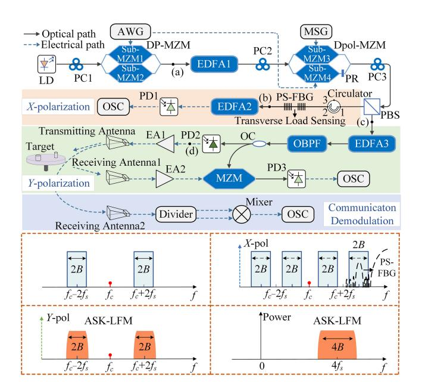

Fig. 1. Schematic and experimental setup of the proposed multidimensional sensing and communication system. LD, laser diode; PC, polarization DP-MZM, dual-parallel MachâĂŞZehnder modulator: EDFA, erbium-doped fiber amplifier; Dpol-MZM, dual-polarization MachâĂŞZehnder modulator; PR, polarization rotator; PBS, polarization beam splitter; AWG, arbitrary waveform generator; MSG, microwave signal generator; PS-FBG, phase-shifted fiber Bragg grating; EA, electrical amplifier; OBPF, optical band-pass filter; PD, photodetector; OSC, oscilloscope; OC, optical coupler. (a)-(d) are the spectra of the signals at different locations in the system diagram.

ID Photonics CoBriteDX1-1-HC1-FA) can be expressed as  $E_c(t) = E_c \exp(j\omega_c t)$ , where  $E_c$  and  $\omega_c$ , respectively, represent the amplitude and angular frequency of the optical signal. After passing through a polarization controller (PC1), the optical signal is injected into a DP-MZM (Fujitsu FTM-7961EX) and applied to sub-MZM1, where it is modulated by an LFM signal, which is generated from an arbitrary waveform generator (AWG, Keysight M8195A) and amplified by an electrical amplifier (EA, Multilink MTC5515). The LFM signal is expressed as

$$V_{\rm IF}(t) = V_{\rm IF} \cos \left[ 2\pi \left( f_0 t + \frac{1}{2} k t^2 \right) \right] \tag{1}$$

where  $V_{IF}$ ,  $f_0$ , and k are the amplitude, initial frequency, and chirp rate of the LFM signal, respectively. In this work, k has a positive value. The instantaneous frequency of the LFM signal can be expressed as  $f_{IF} = f_0 + kt$ ,  $t \in [0, T)$ . Sub-MZM1 in the DP-MZM is biased at the maximum transmission point to generate an optical carrier and  $\pm 2$ nd-order sidebands. Sub-MZM2 is not connected with the LFM signal, and the amplitude and phase of the pure optical carrier from sub-MZM2 are adjusted by the bias voltages of sub-MZM2 and the main-MZM to make it have the same amplitude as the optical carrier output by sub-MZM1, but with a phase difference of 180°. Under these circumstances, the optical signal with only two  $\pm$  2nd-order LFM optical sidebands from the DP-MZM is schematically shown in Fig. 1(a), where  $f_s$  and B are the center frequency and bandwidth of the LFM signal, respectively. This optical signal can be expressed as

microwave photonic integrated sensing and communication 
$$E_{DP-MZM}(t) \propto E_c J_2(m_1)$$
 system are shown in Fig. 1. A continuous-wave (CW) optical 
$$\left\{\exp\left[j2\pi\left(f_c+2f_0\right)t+j2\pi kt^2\right]\right\}$$
 signalized interestil as a fundamental of the fundamental of the photonic integrated sensing and communication 
$$\left\{\exp\left[j2\pi\left(f_c+2f_0\right)t+j2\pi kt^2\right]\right\}$$
 signalized interestil as a fundamental of the photonic integrated sensing and communication 
$$\left\{\exp\left[j2\pi\left(f_c+2f_0\right)t+j2\pi kt^2\right]\right\}$$
 signalized interestil as a fundamental of the photonic integrated sensing and communication 
$$\left\{\exp\left[j2\pi\left(f_c+2f_0\right)t+j2\pi kt^2\right]\right\}$$

{2}------------------------------------------------

where  $J_2(\cdot)$  denotes the 2nd-order Bessel function of the first kind and  $m_1$  is the modulation index of sub-MZM1. Then, the optical signal from the DP-MZM is amplified by an erbium-doped fiber amplifier (EDFA1, Amonics AEDFA-PA-35-B-FA). The optical signal from EDFA1 is sent to the Dpol-MZM (Fujitsu FTM-7981EDA) via PC2.

In the Dpol-MZM, the  $\pm 2$ nd-order LFM optical sidebands are equally divided into two parts and, respectively, sent to sub-MZM3 and sub-MZM4. In the X polarization, sub-MZM3 is biased at the minimum transmission point, and the optical signal is carrier-suppressed double-sideband (CS-DSB) modulated by a single-tone signal generated from a microwave signal generator (MSG, Agilent 83630B). In the Y polarization, sub-MZM4 is also biased at the minimum transmission point, and the optical signal is amplitude-modulated by a binary sequence, which is generated from the AWG and amplified by another EA (Multilink MTC5515). Therefore, the output of the Dpol-MZM in the X and Y polarizations can be, respectively, denoted as

$$E_{X-\text{pol}}(t) \propto J_{1}(m_{2})J_{2}(m_{1})$$

$$\begin{cases} \exp\left[j2\pi (f_{c} + 2f_{0} + f_{X})t + j2\pi kt^{2}\right] \\ + \exp\left[j2\pi (f_{c} + 2f_{0} - f_{X})t + j2\pi kt^{2}\right] \\ + \exp\left[j2\pi (f_{c} - 2f_{0} + f_{X})t - j2\pi kt^{2}\right] \\ + \exp\left[j2\pi (f_{c} - 2f_{0} - f_{X})t - j2\pi kt^{2}\right] \end{cases}$$

$$E_{Y-\text{pol}}(t) \propto S_{\text{ASK}}(t)J_{2}(m_{1})$$

$$\begin{cases} \exp\left[j2\pi (f_{c} + 2f_{0})t + j2\pi kt^{2}\right] \\ + \exp\left[j2\pi (f_{c} - 2f_{0})t - j2\pi kt^{2}\right] \end{cases}$$
(4)

where  $m_2$  is the modulation index of sub-MZM3 in the X polarization,  $f_X$  is the frequency of the single-tone signal from the MSG, and  $S_{\rm ASK}(t) \in \{0, 1\}$  is the binary sequence generated by the AWG. The optical signals in the two polarization directions of the Dpol-MZM are demultiplexed by PC3 and a polarization beam splitter, and then, respectively, sent to two branches.

In the upper branch, the optical signal from the X polarization is injected into a PS-FBG through an optical circulator. The ultranarrow peak in the transmission notch of the PS-FBG functions as a narrowband optical bandpass filter (OBPF). To realize the transverse load sensing, the frequency of the single-tone signal generated by the MSG is adjusted until the peak of the PS-FBG overlaps with the LFM optical sideband with the highest frequency. Then sensing demodulation can be realized through FTTM when the rightmost LFM optical sideband sweeps over the peak of the PS-FBG, as shown in Fig. 1(b). In Fig. 1(b), the solid blue lines represent the four LFM optical sidebands in the X polarization, while the dashed black line shows a schematic of the transmission spectrum of the PS-FBG with an ultranarrow peak. After FTTM, optical pulses are generated from the PS-FBG, which is amplified by EDFA2 (Max-Ray EDFA-PA-35-B) and then injected into a photodetector (PD1, Nortel PP-10G) to convert the optical pulses to electrical pulses. The Bragg wavelength of the PS-FBG can be expressed as [28]

$$\lambda_{\rm Bragg} = 2n_{\rm eff}\Lambda$$
 (5)

where  $\lambda_{\rm Bragg}$ ,  $n_{\rm eff}$ , and  $\Lambda$  are the Bragg wavelength, effective refractive index, and grating pitch of the PS-FBG, respectively. When the transverse load is applied to the PS-FBG,  $n_{\rm eff}$  and  $\Lambda$  of the PS-FBG will be changed. Accordingly, the Bragg wavelength, as well as the center of the ultranarrow peak, will also be shifted, resulting in the change of relative position between the ultranarrow peak of the PS-FBG and the LFM optical sideband. Ultimately, this change will be reflected in the appearance time of the pulses generated after FTTM and we can then obtain the transverse load based on the appearance time of pulses. Thus, the transverse load sensing is implemented. Furthermore, the transverse sensing range can be shifted by adjusting the frequency of the single-tone signal.

In the lower branch, the optical signal from the *Y* polarization, as shown in Fig. 1(c), is first amplified by EDFA3 (Amonics AEDFA-PTK-DWDM-15-B-FA) and then filtered by an OBPF (WL Photonics Inc. WLTF-BA-U-1550-100-SMM-0.9/1.0-FC/APC). The OBPF retains the two optical sidebands and filters out most of the amplified spontaneous emission noise. The optical signal from the OBPF is divided into two parts through a 10:90 optical coupler (OC). 10% of the optical signal is injected into PD2 (Picometrix PT-40D/8XLMD) to achieve optical-to-electrical conversion, thus generating a frequency-quadrupling ASK-LFM signal as shown in Fig. 1(d). The ASK-LFM signal can be expressed as

$$i_{\text{Trans}}(t) \propto S_{\text{ASK}}(t)J_2^2(m_1)\cos[4\pi(2f_0+kt)t].$$
 (6)

As can be seen, the center frequency and sweep bandwidth of the generated ASK-LFM signal are four times that of the LFM signal generated by the AWG. Besides, the amplitude of the LFM signal is modulated by the binary sequence  $S_{\rm ASK}(t)$ . Under these circumstances, joint radar and communication functions can be achieved using the ASK-LFM signal. In the proposed system, the ASK-LFM signal is amplified by EA1 (Centellax OA4MVM2) and then radiated into free space via a transmitting antenna with a bandwidth from 8 to 18 GHz to simultaneously realize radar ranging, ISAR imaging, and communication functions.

At the radar receiving end, 90% of the optical signal from the OC is used as an optical reference signal and sent to an MZM (Fujitsu FTM-7938EZ). The echo signal reflected by the target is received by a receiving antenna, amplified by EA2 (Centellax OA4MVM3), and then applied to the RF port of the MZM. The MZM is biased at the quadrature transmission point and optical de-chirping is thus implemented after the optical signal from the MZM is detected in PD3 (Nortel PP-10G). The echo delay is denoted as

$$\tau = -\frac{2}{c}R\tag{7}$$

where R is the distance between the antennas and the target, and c is the velocity of light in a vacuum. Therefore, the dechirped signal generated from PD3 can be expressed as

$$i_{\text{de-chirp}}(t) \propto S_{\text{ASK}}(t)S_{\text{ASK}}(t-\tau)$$

$$\cos \left[2\pi \left(4f_0\tau + 4kt\tau - 2k\tau^2\right)\right]. \tag{8}$$

{3}------------------------------------------------

The de-chirped signal is sampled by an oscilloscope (OSC, R&S RTO2032). After obtaining the de-chirped signal, the range information of targets can be obtained and expressed as

$$R = \frac{1}{2}c\tau = \frac{c}{8k}f_{\text{de-chirp}}.$$
 (9)

Besides radar ranging, the system can also realize highresolution ISAR imaging. For an LFM signal that is not amplitude modulated, in theory, the range resolution  $R_{RES}$ and the cross-range resolution  $C_{RES}$  of ISAR imaging can be expressed as

$$R_{\text{RES}} = \frac{c}{2B_{\text{Total}}} \tag{10}$$

$$R_{\text{RES}} = \frac{c}{2B_{\text{Trans}}}$$
 (10)  
 $C_{\text{RES}} = \frac{c}{2\theta f_{\text{Trans}}}$  (11)

where  $B_{\text{Trans}}$  and  $f_{\text{Trans}}$  are the sweep bandwidth and the center frequency of the signal, respectively;  $\theta$  is the integration viewing angle of the rotating target.

At the communication receiving end, the ASK-LFM signal received by a receiving antenna is divided into two parts by an electrical power divider (MCLI PS2-11). Then, the two identical electrical signals are self-mixed in an electrical mixer (Miteq M30) for envelope detection. Finally, the self-mixed signal is sampled by the OSC. In the digital domain, if a threshold is reasonably set, the original binary sequence can be recovered.

#### III. EXPERIMENTAL RESULTS

A proof-of-concept experiment based on the setup shown in Fig. 1 is performed to verify the feasibility of the proposed system. The generation of joint radar and communication signals, radar ranging and imaging, as well as high-speed communication, are discussed sequentially in this section. Additionally, we further explore the feasibility of extending the proposed system for microwave frequency measurement.

# A. Spectra for Signal Generation and Transverse Load Sensing

A 12-dBm CW light wave centered at 1550.038 nm and generated from the LD is used as the light source and injected into the DP-MZM. Then, an LFM signal centered at 3 GHz and with a frequency-sweep range from 2.25 to 3.75 GHz is generated by the AWG and applied to the DP-MZM. The peakto-peak amplitude and sweep period of the LFM signal are set to 500 mV and 4  $\mu$ s, respectively. The frequency and power of the single-tone signal from the MSG are set to 6 GHz and 15 dBm, respectively. Based on the principle and experimental setup discussed in Section II, the optical spectra of the X and Y polarizations from the Dpol-MZM are measured by an optical spectrum analyzer (OSA, ANDO AQ6317B) and shown in Fig. 2(a) and (b), respectively.

The dotted blue line in Fig. 2(a) represents the generated LFM optical sidebands through CS-DSB modulation in the X polarization. Due to the aforementioned frequency settings, not all four optical sidebands shown in Fig. 1(a) are observed in Fig. 2(a). In fact, in Fig. 2(a), the two middle optical sidebands overlap with each other, resulting in the observation of only

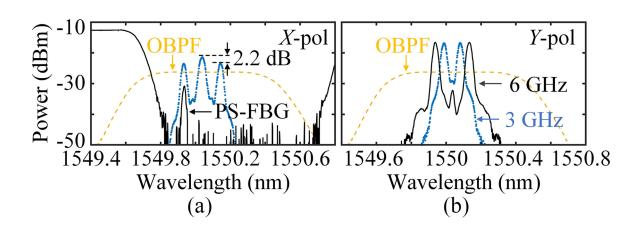

Fig. 2. Spectra of the optical signals (a) in the X polarization and (b) in the Y polarization.

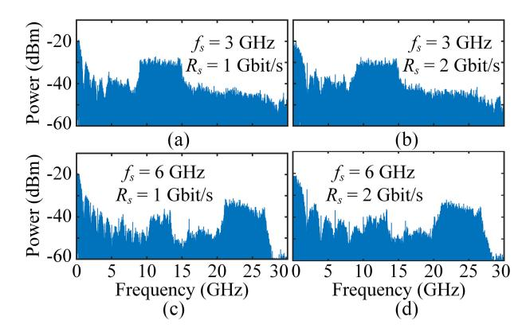

Fig. 3. Electrical spectra of the joint radar and communication signals when the center frequency of the electrical LFM signal and the bit rate of the binary sequence are (a) 3 GHz and 1 Gbit/s, (b) 3 GHz and 2 Gbit/s, (c) 6 GHz and 1 Gbit/s, and (d) 6 GHz and 2 Gbit/s.

one optical sideband in the center, and its power is 2.2 dB greater than that of the two optical sidebands on the two sides. The solid black line in Fig. 2(a) shows the transmission spectrum of the PS-FBG. As can be seen, a narrow peak is observed in the transmission notch of the PS-FBG. The 3-dB bandwidth of the peak is around 200 MHz. However, due to the resolution limitation of the OSA, this peak appears much wider than its true bandwidth. The dashed yellow line in Fig. 2(a) represents the frequency response of the OBPF, which has a 3-dB bandwidth of around 97.5 GHz. When the transverse load is applied to the PS-FBG, the narrow peak in Fig. 2(a) will drift, which makes the transverse load sensing possible.

The optical signal from the Y polarization is shown in Fig. 2(b). Here, the bit rate and peak-to-peak amplitude of the binary sequence from the AWG are 1 Gbit/s and 400 mV, respectively. The dotted blue line in Fig. 2(b) represents the optical spectrum from the Y polarization when the electrical LFM signal is centered at 3 GHz. Besides, the solid black line shows the corresponding spectrum when the electrical LFM signal is centered at 6 GHz and the bit rate of the binary sequence is 2 Gbit/s. It should be noted that the effect of the binary sequence on the optical spectrum cannot be observed in Fig. 2(b), which is also limited by the resolution of the OSA.

Then, the optical spectrum in Fig. 2(b) is beaten in PD2 to generate the ASK-LFM signal for joint radar and communication functions. The electrical spectra of the generated ASK-LFM signals are observed through an electrical spectrum analyzer (Rohde & Schwarz FSP-40). Fig. 3(a) and (b) show the electrical spectra of the ASK-LFM signal when the center frequency of the electrical LFM signal  $f_s$  is 3 GHz and the bit

{4}------------------------------------------------

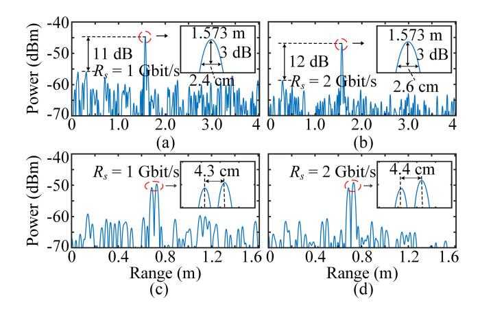

Fig. 4. Electrical spectra of the de-chirped signals when  $f_s = 3$  GHz and (a)  $R_s = 1$  Gbit/s; (b)  $R_s = 2$  Gbit/s. Range resolutions when  $f_s = 3$  GHz and (c)  $R_s = 1$  Gbit/s; (d)  $R_s = 2$  Gbit/s.

rate of the binary sequence  $R_s$  is 1 and 2 Gbit/s, respectively, while Fig. 3(c) and (d) show the results when the center frequency of the electrical LFM signal  $f_s$  is 6 GHz and the bit rate of the binary sequence  $R_s$  is 1 and 2 Gbit/s. As can be seen, besides the baseband frequency components, the frequency-quadrupled ASK-LFM signal is dominant in the spectrum. It is worth noting that the power of the highfrequency ASK-LFM signals in Fig. 3(c) and (d) are lower than that of the low-frequency ASK-LFM signal in Fig. 3(a) and (b), and the flatness of the high-frequency ASK-LFM signal is relatively poor due to the inconsistent response of amplifiers, PD, and other devices in different frequency bands. Additionally, it can be observed that when the data rate is 1 Gbit/s, the spectrum of the ASK-LFM signal is slightly narrower compared to the case when the data rate is 2 Gbit/s. This is mainly due to the fact that a higher data rate causes a greater broadening of the LFM spectrum, resulting in a wider spectrum for the ASK-LFM signal.

# B. Radar Ranging and Imaging

In the radar ranging experiment, a corner reflector is employed as the target and placed 1.55 m away from the antenna pair. The electrical LFM signal is centered at 3 GHz and sweeps from 2.25 to 3.75 GHz. The sweep period of the electrical LFM signal is limited by the AWG to 4  $\mu$ s, so the chirp rate of the generated joint radar and communication signal is 1.5 GHz/ $\mu$ s after frequency multiplication. The dechirped signal from PD3 is sampled by the OSC at a sampling rate of 250 MSa/s. After performing a fast Fourier transform (FFT) on the digitized data, the electrical spectra of the dechirped signals are shown in Fig. 4.

Fig. 4(a) and (b) show the spectra when the communication data rates are 1 and 2 Gbit/s, respectively. Note that the horizontal coordinates of the spectra have been changed to "range" according to (9). As can be seen, the range of the corner reflector is measured to be 1.573 m under the two different data rates, with a deviation of 2.3 cm from the set value. The full width at half maximums (FWHMs) of the two peaks are 2.4 and 2.6 cm, respectively. Besides the range

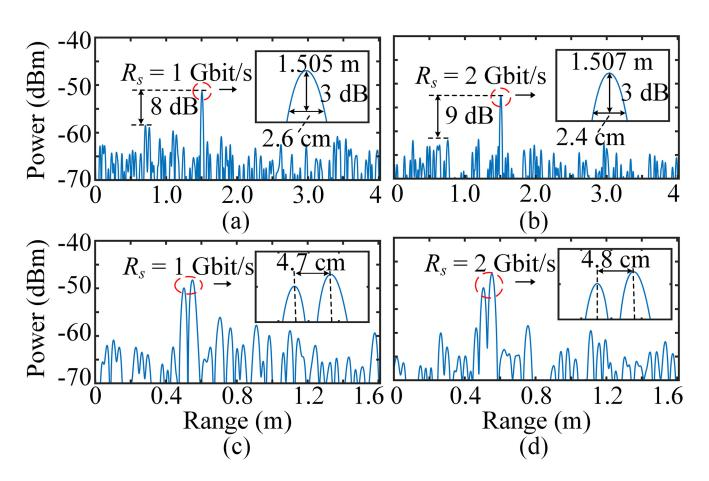

Fig. 5. Electrical spectra of the de-chirped signals when  $f_s = 6$  GHz and (a)  $R_s = 1$  Gbit/s; (b)  $R_s = 2$  Gbit/s. Range resolutions when  $f_s = 6$  GHz and (c)  $R_s = 1$  Gbit/s; (d)  $R_s = 2$  Gbit/s.

of a single target, the range resolution is also verified by using two metal tubes that are placed close to each other. The distance between the two metal tubes is set to 4.3 cm, and the measurement results when the communication data rates are 1 and 2 Gbit/s are shown in Fig. 4(c) and (d), respectively. When the distance between the two metal tubes is 4.3 cm, they can still be distinguished. When the distance gets closer, the two peaks corresponding to the two targets will affect each other and become indistinguishable. According to (10), the theoretical range resolution is 2.5 cm. The difference between the actual resolution of ranging using ASK-LFM signals and the theoretical resolution of ranging using LFM signals should be attributed to the additional amplitude information attached to the ASK-LFM signals, which reduces the signal-to-noise ratio (SNR) of the de-chirped signal, thereby degrading its resolution.

To further demonstrate the tunability of the system, the center frequency of the LFM signal is adjusted from 3 to 6 GHz. In this case, the generated ASK-LFM signal sweeps from 21 to 27 GHz. The electrical spectra for the ranging and resolution test are shown in Fig. 5. Considering the highfrequency ASK-LFM signal, the antennas used in the former experiment are replaced by another two antennas with a wide operating bandwidth from 12 to 40 GHz. In this experiment, the corner reflector is placed 1.48 m away from the antenna pair. As shown in Fig. 5(a) and (b), the range measured at the communication data rates of 1 and 2 Gbit/s are 1.505 and 1.507 m, respectively. The deviations from the theoretical values are 2.5 and 2.7 cm. Besides, the FWHMs of the two peaks are 2.6 and 2.4 cm. The range resolutions are measured and shown in Fig. 5(c) and (d), which are 4.7 and 4.8 cm, respectively. By comparing the experimental results of ASK-LFM signals across different frequency bands, it is found that apart from the reduction in SNR, there is no significant degradation in system performance. The FWHM of the dechirped peaks does not change obviously because it is mainly determined by the sweep bandwidth of the ASK-LFM signal. The decline in SNR is primarily attributed to the greater losses of the system at higher frequency bands, as well as the

{5}------------------------------------------------

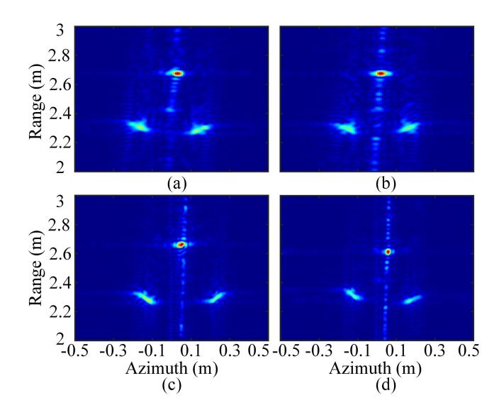

Fig. 6. ISAR imaging results when (a)  $f_s = 3$  GHz and  $R_s = 1$  Gbit/s; (b)  $f_s = 3$  GHz and  $R_s = 2$  Gbit/s; (c)  $f_s = 6$  GHz and  $R_s = 1$  Gbit/s; (d)  $f_s = 6$  GHz and  $R_s = 2$  Gbit/s.

increased free-space transmission losses. In addition, with the increase in the communication data rate, the SNR of the dechirped signal will be accordingly improved, which is mainly because higher data rates result in the unwanted frequency components generated by communication signals being more dispersed in the frequency domain, thus reducing their average power.

Then high-resolution ISAR imaging is demonstrated by using the ASK-LFM signal in the two different frequency bands used above. Three cylindrical tubes are placed in a triangular shape on a turntable. The turntable requires 24.56 s to rotate one circle. By accumulating and processing echoes over a period of 1.5 s, a frame of the target image can be obtained. However, since the chirp rate of the ASK-LFM signal is very large (1.5 GHz/ $\mu$ s), even at the sampling rate of 60 MSa/s, the storage space required to fully acquire the 1.5-s de-chirped signal is still too large for the OSC. To reduce the amount of sampled data, another AWG (Rigol DG2052) is utilized to generate a rectangular pulse signal with a 1-ms period and a 50% duty cycle, serving as an external trigger for the OSC. The OSC is set to collect waveforms for 20  $\mu s$ at a sampling rate of 200 MSa/s every time it receives the rising edge of the trigger. As a result, only 1500 digital signal segments, each with a length of 20  $\mu$ s, need to be acquired and processed for a frame of image, greatly reducing the complexity of digital sampling and processing. The imaging results under different LFM signal center frequencies and communication data rates are shown in Fig. 6. As can be seen, the three objects are clearly distinguished. It is worth noting that compared to the results presented in Fig. 6(a) and (b), where the LFM center frequency is 3 GHz, Fig. 6(c) and (d), with the LFM center frequency set at 6 GHz, exhibit superior azimuth resolution in imaging. This is attributed to the ASK-LFM signal's higher carrier frequency in this case. According to (11), a higher carrier frequency corresponds to better azimuth resolution.

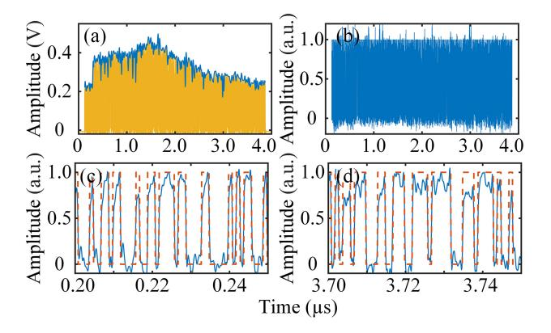

Fig. 7. (a) Waveform and envelope of the ASK-LFM signal, (b) waveform after compensation. Two sections of the waveform after compensation from (c) 0.20 to 0.25  $\mu$ s and (d) 3.70 to 3.75  $\mu$ s. The communication data rate is 1 Gbit/s.

# C. High-Speed Communication

Then, high-speed communication using the ASK-LFM signal is demonstrated. At the communication receiving end, limited by the operating bandwidth (RF: 3–15 GHz, LO: 3–15 GHz, IF: DC-3 GHz) of the mixer, the center frequency of the electrical LFM signal is set to 3 GHz, thus the sweep range of the generated ASK-LFM signal is from 9 to 15 GHz. The communication data rate is set to 1 Gbit/s first. After self-mixing, the waveform of the ASK-LFM signal is sampled by the OSC at a sampling rate of 10 GSa/s, as shown in Fig. 7(a). The envelope of the waveform is found and also shown in Fig. 7(a). As can be seen, due to the uneven frequency response of the mixer and other components over the bandwidth of the ASK-LFM signal, the waveform does not have a flat amplitude. It should be noted that the amplitude unevenness is basically consistent for a specific operating frequency band when the system is unchanged. Therefore, once the operating frequency band is determined, compensation can be made to the amplitude unevenness of the waveform to avoid its impact on the setting of the decision threshold and the decision-making. The waveform after compensation is shown in Fig. 7(b), where it is evident that compared to Fig. 7(a), the envelope of the compensated waveform becomes significantly flatter. Fig. 7(c) and (d) display two sections of the waveform in Fig. 7(b) from 0.20 to 0.25  $\mu$ s and from 3.70 to 3.75  $\mu$ s. The dashed orange line shows the corresponding binary sequence transmitted in the system. It can be seen that the waveforms are completely consistent with the binary sequence.

Then, the communication data rate is adjusted to 2 Gbit/s, with the corresponding results shown in Fig. 8. Comparing Fig. 7(a) and Fig. 8(a), it is evident that the envelopes obtained after self-mixing exhibit very similar trends of variation. The differences in details are caused by the different communication data rates and the use of different binary sequences. For the compensation, it is sufficient to address the larger amplitude variations. Therefore, even if identical compensation functions are employed, the differences in details will not significantly impact the final results. Fig. 8(b) shows the waveform after compensation, while Fig. 8(c) and (d) show

{6}------------------------------------------------

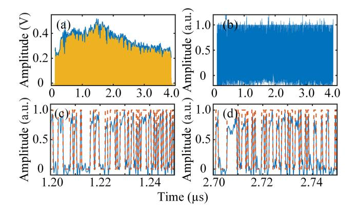

Fig. 8. (a) Waveform and envelope of the ASK-LFM signal, (b) waveform after compensation. Two sections of the waveform after compensation from (c) 1.20 to 1.25  $\mu$ s and (d) 2.70 to 2.75  $\mu$ s. The communication data rate is 2 Gbit/s.

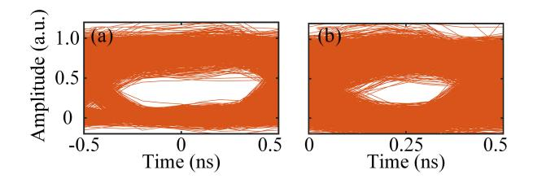

Fig. 9. Eye diagrams when the communication data rates are (a) 1 Gbit/s and (b) 2 Gbit/s.

two sections of the waveform from 1.20 to 1.25  $\mu$ s and 2.70 to 2.75  $\mu$ s. As can be seen, the original binary sequence is well recovered.

Additionally, the waveforms after compensation are used to draw the eye diagrams. Fig. 9(a) and (b) are the eye diagrams obtained at communication data rates of 1 and 2 Gbit/s, respectively. The eye diagrams are both open and clear, which demonstrates that effective data communication can be achieved. When the communication data rate is higher, the eye-opening of the eye diagram in Fig. 9(b) is worse compared to the case shown in Fig. 9(a) where the communication data rate is lower.

# D. Transverse Load Sensing

Finally, the transverse load sensing experiment is carried out when the center frequency and sweep bandwidth of the electrical LFM signal are 3 and 1.5 GHz, respectively. A single-tone signal at 6 GHz is generated by the MSG and sent to sub-MZM3 of the Dpol-MZM to make the LFM optical sideband with the highest frequency sweep over the peak in the transmission notch of the PS-FBG. Fig. 10(a) shows a photograph of the PS-FBG and the supporting fiber, which are fixed on a glass plate. Both optical fibers are covered with tape to avoid being damaged during the experiment. The setup for applying the transverse load is shown in Fig. 10(b). The PS-FBG and the supporting fiber are placed symmetrically on the glass plate. On the two fibers, an acrylic plate of the same size as the glass plate is used to ensure that the PS-FBG is subjected to uniform force distribution. After that, the transverse load is gradually increased in steps of  $9.8 \times 10^{-3}$  N by stacking weights on the acrylic plate.

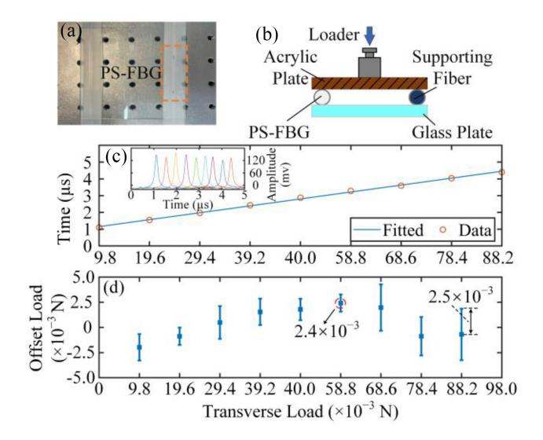

Fig. 10. (a) Photograph of the PS-FBG and the supporting fiber. (b) Setup for applying the transverse load. (c) Appearance time versus the transverse load. (d) Measurement errors of five measurements using the linear fitting curve in (c). The inset in (c) shows the temporal pulses with different transverse loads.

As discussed in Section II, different transverse loads will shift the peak of the PS-FBG to different frequencies, so that the appearance time of the pulse in a sweep period after FTTM is also different. Fig. 10(c) shows the appearance time of the pulse versus the transverse load. The temporal pulses with different transverse loads are given in the inset of Fig. 10(c). By linearly fitting the 9 data points through the least squares method, a fitting curve is obtained as shown in Fig. 10(c). It should be noted that the temporal axis here exceeds a sweep period of 4  $\mu$ s, which is because the range of transverse load measurement exceeds the maximum measurable range when the single-tone signal is at 6 GHz. Therefore, when obtaining the last two pulses as shown in Fig. 10(c), the frequency of the MSG output signal is shifted by 2 GHz, and the temporal position of the obtained pulses is adjusted accordingly. The measurement errors and error bars of five measurements are given in Fig. 10(d). As can be seen, the mean deviation of the measurement results relative to the linear fitting curve is no more than  $2.4 \times 10^{-3}$  N, and the maximum standard deviation is  $2.5 \times 10^{-3}$  N. It is worth noting that several factors may contribute to the measurement errors: First, it is hard to ensure the consistent placement of the weights each time, despite clear marks have been made on the acrylic plate; Second, apart from the applied weights, the PS-FBG is also influenced by other external factors like temperature; Third, the laser phase noise can also introduce a certain degree of randomness to the pulses generated in the experiment, thereby introducing a certain amount of random error.

As indicated in Fig. 10, the sensitivity of the transverse load sensing is ultrahigh, but the sensing range is very limited. The main reason is that the weights are directly applied to the PS-FBG in the experiment via the acrylic plate, which makes the PS-FBG very sensitive. If a heavy metal block could be placed on the acrylic plate before applying the weights as in [13], Further tradeoffs between the measurement sensitivity and range can be achieved. Due to the lack of a suitable metal

{7}------------------------------------------------

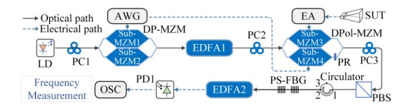

Fig. 11. Schematic diagram and experimental setup of the frequency measurement system.

block in the laboratory, we only conduct the test using the setup shown in Fig. [10\(](#page-6-2)b). In addition, it should be noted that the transverse load sensing range can be tuned by adjusting the frequency of the single-tone signal from the MSG according to the requirement.

## *E. Extending the System for Frequency Measurement*

As demonstrated in Section [III-A](#page-3-4)[–III-D,](#page-6-3) the proposed microwave photonic integrated sensing and communication system is comprehensively studied. Microwave ranging and imaging, high-speed communication, and high-sensitivity transverse load sensing are all verified. The above three functions can be simultaneously achieved through optical signals on the two orthogonal polarization states output by the Dpol-MZM. Based on the principle of transverse load sensing, with minor modifications and adjustments to the system, it can additionally achieve the frequency measurement function. However, it is important to note that the frequency measurement function and the transverse load sensing function cannot be implemented simultaneously, but the frequency measurement function can be achieved concurrently with the other two functions.

As shown in Fig. [11,](#page-7-1) to implement the frequency measurement function, the MSG for shifting the LFM optical sideband in transverse load sensing should be replaced by a receiving antenna and an EA, which receives and amplifies the signal under test (SUT). In addition, the PS-FBG should be kept stable to make the peak in its transmission notch fixed. Under these circumstances, the frequency measurement range is from *f*PS−FBG – *fc* – 2*fs* – *B* to *f*PS−FBG − *fc* − 2*fs* + *B*, where *f*PS−FBG is the center frequency of the ultranarrow peak in the transmission notch of the PS-FBG.

To simplify the experiment, the SUT is directly sent to sub-MZM3 of the Dpol-MZM. In the experiment, the electrical LFM signal generated by the AWG is centered at 3 GHz and sweeps from 2.25 to 3.75 GHz with a sweep period of 4 μs. The wavelength of the LD is set to 1550.046 nm. Under these circumstances, the frequency measurement range of the system is from 6 to 9 GHz.

The SUT in this experiment are three single-tone signals at 8.5, 8.2, and 7.9 GHz, respectively. Fig. [12\(](#page-7-2)a) shows the generated electrical pulses after FTTM, which are sampled by the OSC at a sampling rate of 250 MSa/s. Here, the appearance time from 0 to 4 μs corresponds to the frequency from 9 to 6 GHz. According to the appearance time of pulses, the measured frequencies of the three single-tone signals are 8.499, 8.211, and 7.920 GHz, respectively. As can be seen, the maximum deviation from the theoretical values

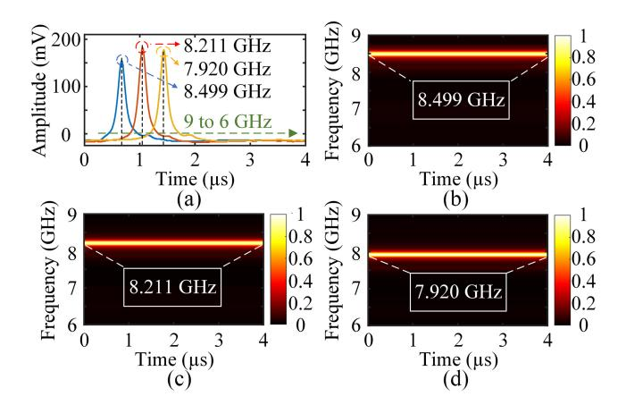

Fig. 12. (a) Electrical pulses for SUTs at 8.5, 8.2, and 7.9 GHz. Timefrequency diagrams a single-tone SUT at (b) 8.5 GHz, (c) 8.2 GHz, and (d) 7.9 GHz.

is 20 MHz. Accurate microwave frequency measurement is achieved. Besides microwave frequency measurement, the time-frequency diagram of the SUT can also be obtained by accumulating pulses in multiple sweep periods, as shown in Fig. [12\(](#page-7-2)b) to (d).

# IV. CONCLUSION

In this work, we show a microwave photonic integrated sensing and communication system based on polarization multiplexing and FTTM. To our knowledge, this is the first time that radar ranging and imaging, high-speed communication, and transverse load sensing are realized simultaneously in a microwave photonic system. Furthermore, the transverse load sensing function can be easily replaced with the spectrum sensing function to achieve a more flexible system configuration. The proposed approach is evaluated experimentally. An ASK-LFM signal is generated to support both radar and communication functions, achieving 2-Gbit/s wireless communication and 4.8-cm radar ranging resolution; while an LFM optical sideband is used in conjunction with a PS-FBG to implement transverse load sensing or frequency measurement functions, achieving a maximum mean weight measurement error of less than 2.4×10−3 N and a maximum frequency measurement error of less than 20 MHz. The proposed system realizes multiple functions at a relatively low cost, meeting the requirements for miniaturization and integration of multifunctional systems. After further introducing photonic integration for chip-level design and integration, the proposed system will be exceptionally well-suited for offering advanced sensing capabilities of physical targets, parameters, and electromagnetic environments, as well as high-speed information interaction abilities, with a more compact system architecture in the forthcoming interconnected world of everything. This will provide robust support for the further realization of advanced intelligent decision-making and automation.

## REFERENCES

[\[1\]](#page-0-0) A. Al-Fuqaha, M. Guizani, M. Mohammadi, M. Aledhari, and M. Ayyash, "Internet of Things: A survey on enabling technologies, protocols, and applications," *IEEE Commun. Surveys Tuts.*, vol. 17, no. 4, pp. 2347–2376, 4th Quart., 2015.

{8}------------------------------------------------

- [\[2\]](#page-0-1) L. Chettri and R. Bera, "A comprehensive survey on Internet of Things (IoT) toward 5G wireless systems," *IEEE Internet Things J.*, vol. 7, no. 1, pp. 16–32, Jan. 2020.
- [\[3\]](#page-0-1) M. Amiri, F. Tofigh, N. Shariati, J. Lipman, and M. Abolhasan, "Review on metamaterial perfect absorbers and their applications to IoT," *IEEE Internet Things J.*, vol. 8, no. 6, pp. 4105–4131, Mar. 2021.
- [\[4\]](#page-0-2) F. Falconi, C. Porzi, A. Malacarne, F. Scotti, P. Ghelfi, and A. Bogoni, "UWB fastly-tunable 0.5–50 GHz RF transmitter based on integrated photonics," *J. Lightw. Technol.*, vol. 40, no. 6, pp. 1726–1734, Mar. 15, 2022.
- [\[5\]](#page-0-3) M. A. Jamshed, K. Ali, Q. H. Abbasi, M. A. Imran, and M. Ur-Rehman, "Challenges, applications, and future of wireless sensors in Internet of Things: A review," *IEEE Sensors J.*, vol. 22, no. 6, pp. 5482–5494, Mar. 2022.
- [\[6\]](#page-0-4) D. Novak et al., "Radio-over-fiber technologies for emerging wireless systems," *IEEE J. Quant. Electron.*, vol. 52, no. 1, Jan. 2016, Art. no. 600311.
- [\[7\]](#page-0-4) J. Ding et al., "High-speed and long-distance photonics-aided terahertz wireless communication," *J. Lightw. Technol.*, vol. 41, no. 11, pp. 3417–3423, Jun. 1, 2023.
- [\[8\]](#page-0-4) Z. Tao et al., "Highly reconfigurable silicon integrated microwave photonics filter towards next-generation wireless communication," *Photon. Res.*, vol. 11, no. 5, pp. 682–694, May 2023.
- [\[9\]](#page-0-5) P. Ghelfi et al., "A fully photonics-based coherent radar system," *Nature*, vol. 507, no. 7492, pp. 341–345, Mar. 2014.
- [\[10\]](#page-0-5) X. Ye, F. Zhang, Y. Yang, and S. Pan, "Photonics-based radar with balanced I/Q de-chirping for interference-suppressed high-resolution detection and imaging," *Photon. Res.*, vol. 7, no. 3, pp. 265–272, Mar. 2019.
- [\[11\]](#page-0-5) D. Liang, L. Jiang, and Y. Chen, "Multi-functional microwave photonics radar system for simultaneous distance and velocity measurement and high-resolution microwave imaging," *J. Lightw. Technol.*, vol. 39, no. 20, pp. 6470–6478, Oct. 2021.
- [\[12\]](#page-0-6) Y. Wang, M. Wang, W. Xia, and X. Ni, "High-resolution fiber Bragg grating based transverse load sensor using microwave photonics filtering technique," *Opt. Exp.*, vol. 24, no. 16, pp. 17960–17967, Aug. 2016.
- [\[13\]](#page-0-6) J. Yao, "Microwave photonic sensors," *J. Lightw. Technol.*, vol. 39, no. 12, pp. 3626–3637, Jun. 2021.
- [\[14\]](#page-0-6) Y. Xiao, Y. Wang, and Q. Liu, "Sensitivity-enhanced fully distributed LCFBG sensor based on microwave-photonics interferometry," *IEEE Photon. Technol. Lett.*, vol. 35, no. 18, pp. 1010–1013, Sep. 2023.
- [\[15\]](#page-0-7) J. Liu, T. Shi, and Y. Chen, "High-accuracy multiple microwave frequency measurement with two-step accuracy improvement based on stimulated Brillouin scattering and frequency-to-time mapping," *J. Lightw. Technol.*, vol. 39, no. 7, pp. 2023–2032, Apr. 2021.
- [\[16\]](#page-0-7) T. Hao, J. Tang, N. Shi, W. Li, N. Zhu, and M. Li, "Multiple-frequency measurement based on a Fourier domain mode-locked optoelectronic oscillator operating around oscillation threshold," *Opt. Lett.*, vol. 44, no. 12, pp. 3062–3065, Jun. 2019.
- [\[17\]](#page-0-7) W. Dong et al., "Compact photonics-assisted short-time fourier transform for real-time spectral analysis," *J. Lightw. Technol.*, vol. 42, no. 1, pp. 194–200, Jan. 2024.
- [\[18\]](#page-0-8) Y. Wang et al., "Integrated high-resolution radar and long-distance communication based-on photonic in terahertz band," *J. Lightw. Technol.*, vol. 40, no. 9, pp. 2731–2738, May 2022.
- [\[19\]](#page-0-8) M. Lei et al., "A spectrum-efficient MoF architecture for joint sensing and communication in B5G based on polarization interleaving and polarization-insensitive filtering," *J. Lightw. Technol.*, vol. 40, no. 20, pp. 6701–6711, Oct. 2022.
- [\[20\]](#page-0-8) B. Dong et al., "Photonic-based W-band integrated sensing and communication system with flexible time-frequency division multiplexed waveforms for fiber-wireless network," *J. Lightw. Technol.*, vol. 42, no. 4, pp. 1281–1295, Feb. 2024.
- [\[21\]](#page-0-8) W. Bai et al., "Millimeter-wave joint radar and communication system based on photonic frequency-multiplying constant envelope LFM-OFDM," *Opt. Exp.*, vol. 30, no. 15, pp. 26407–26425, Jul. 2022.
- [\[22\]](#page-0-8) Z. Xue, S. Li, X. Xue, X. Zheng, and B. Zhou, "Photonics-assisted joint radar and communication system based on an optoelectronic oscillator," *Opt. Exp.*, vol. 29, no. 14, pp. 22442–22454, Jul. 2021.
- [\[23\]](#page-0-8) D. Liang, P. Zuo, and Y. Chen, "Research on radar-communication integration based on optically injected semiconductor laser," *Acta Electronica Sinica*, vol. 51, no. 9, pp. 2321–2329, Sep. 2023.
- [\[24\]](#page-0-8) H. Nie, F. Zhang, Y. Yang, and S. Pan, "Photonics-based integrated communication and radar system," in *Proc. Int. Topical Meeting Microw. Photon. (MWP)*, Oct. 2019, pp. 1–4.

- [\[25\]](#page-0-9) J. Shi, F. Zhang, X. Ye, Y. Yang, D. Ben, and S. Pan, "Photonicsbased dual-functional system for simultaneous high-resolution radar imaging and fast frequency measurement," *Opt. Lett.*, vol. 44, no. 8, pp. 1948–1951, Apr. 2019.
- [\[26\]](#page-0-9) J. Shi, F. Zhang, D. Ben, and S. Pan, "Simultaneous radar detection and frequency measurement by broadband microwave photonic processing," *J. Lightw. Technol.*, vol. 38, no. 8, pp. 2171–2179, Apr. 2020.
- [\[27\]](#page-1-2) T. Shi, Y. Chen, and J. Yao, "Seamlessly merging radar ranging/imaging, wireless communications, and spectrum sensing, for 6G empowered by microwave photonics," *Commun. Eng.*, vol. 3, Sep. 2024, Art. no. 130.
- [\[28\]](#page-2-0) C. E. Campanella, A. Cuccovillo, C. Campanella, A. Yurt, and V. M. Passaro, "Fibre Bragg grating based strain sensors: Review of technology and applications," *Sensors*, vol. 18, no. 9, p. 3115, Sep. 2018.

**Jiawei Gao** received the B.E. degree in communications engineering from Nanjing University of Information Science and Technology, Nanjing, China, in 2022. He is currently pursuing the master's degree with the School of Communication and Electronic Engineering, East China Normal University, Shanghai, China.

His research focuses on microwave photonic radar and radar signal processing.

**Dingding Liang** received the B.E. degree in electronic and information engineering from Yancheng Teachers University, Yancheng, China, in 2018. He is currently pursuing the Ph.D. degree with the School of Communication and Electronic Engineering, East China Normal University, Shanghai, China.

His research focuses on microwave photonic radar systems.

**Taixia Shi** (Member, IEEE) received the B.S. degree in physics from Shanxi Datong University, Datong, China, the M.S. degree in materials science and engineering from Taiyuan University of Technology, Taiyuan, China, and the Ph.D. degree in communication and information systems from East China Normal University, Shanghai, China, in 2015, 2019, and 2023, respectively.

He is currently a Postdoctoral Researcher with the School of Communication and Electronic Engineering, East China Normal University. His research interest focuses on photonics-assisted self-interference cancelation, microwave photonic signal measurement, and radio-over-fiber techniques.

**Yang Chen** (Member, IEEE) received the B.E. degree in telecommunications engineering and the Ph.D. degree in communication and information systems from Xidian University, Xi'an, China, in 2009 and 2015, respectively.

He is currently a Full Professor with the School of Communication and Electronic Engineering, East China Normal University, Shanghai, China. From 2012 to 2014, he was a joint-training Ph.D. student with Microwave Photonics Research Laboratory, School of Electrical Engineering and Computer Science, University of Ottawa, Ottawa, ON, Canada. He has authored or co-authored more than 70 papers in peer-reviewed journals and more than 20 papers in conference proceedings. His current research interests include microwave photonics, optoelectronic oscillators, radio-over-fiber techniques, and optical communications.

Prof. Chen was selected to receive the inaugural IEEE/Optica Journal of Lightwave Technology Outstanding Reviewer Award in 2023 and the IEEE Photonics Journal Outstanding Reviewer Award in 2022. He was listed in the World's Top 2% Scientists elaborated by Stanford University, in 2023 and 2024. He is a member of Optica.