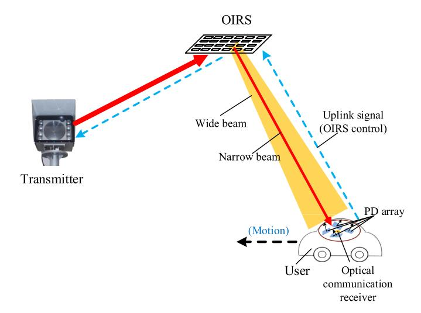
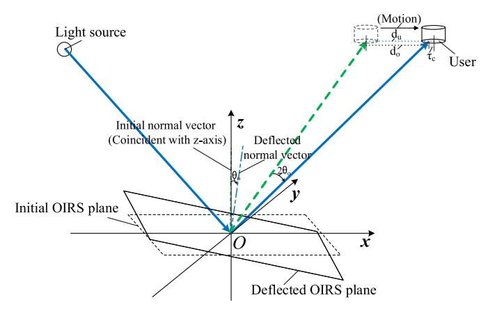
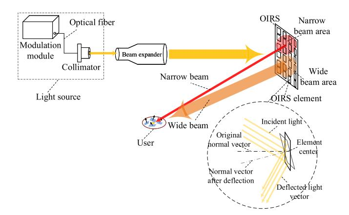
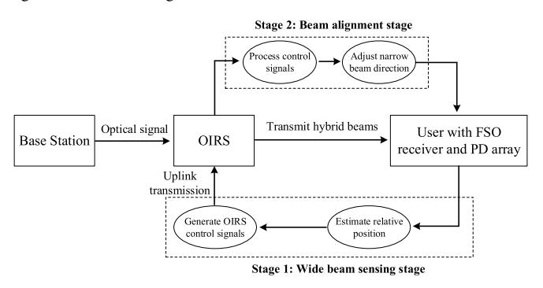
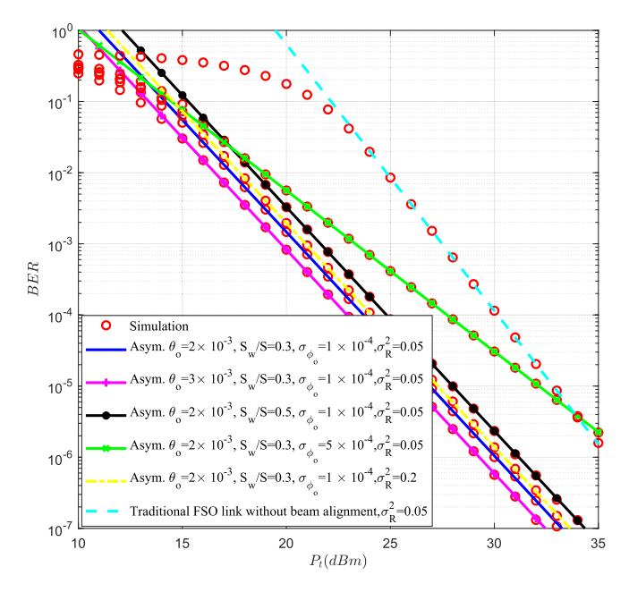
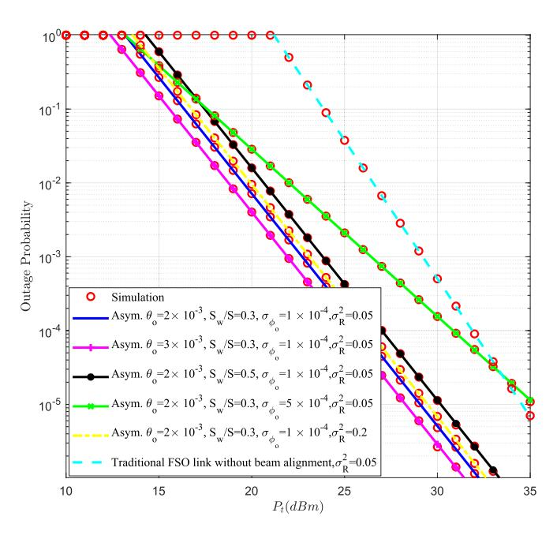
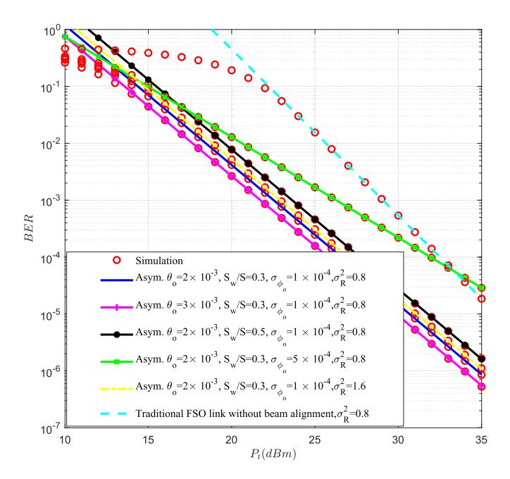
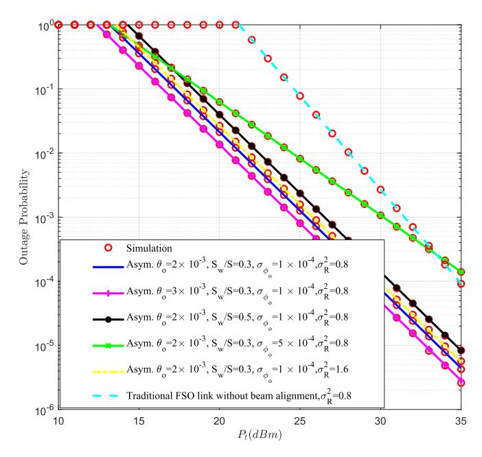
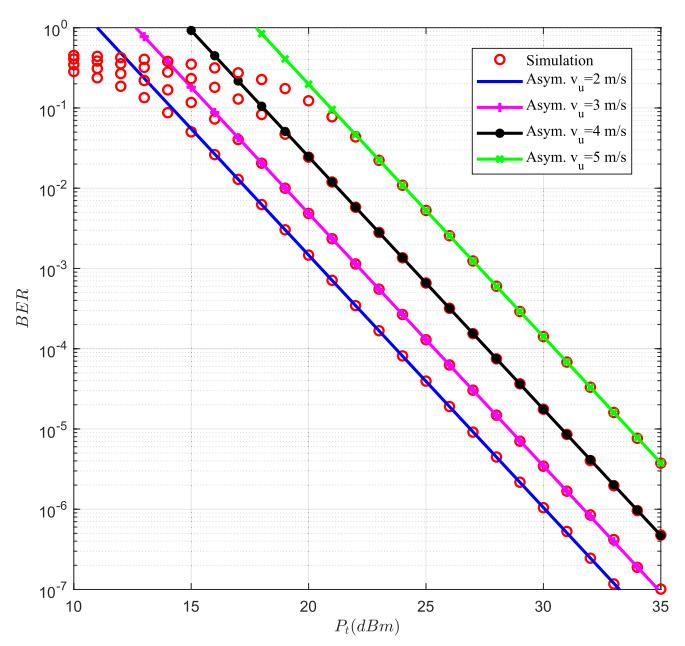
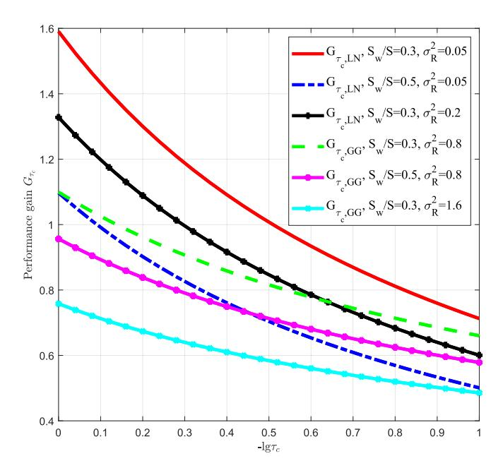

{0}------------------------------------------------

# Optical Integrated Sensing and Communication System Based on Combination of OIRS and PD Array for Mobile Scenarios

Haibo Wang®, Member, IEEE, Zaichen Zhang®, Senior Member, IEEE, Yingmeng Ge®, Member, IEEE, and Bingcheng Zhu®, Senior Member, IEEE

Abstract—With the continuous improvement of the communication frequency band, optical wireless communication (OWC) has attracted extensive attention. Due to the short wavelength and high directivity of optical signals, OWC has high requirements for precise positioning and beam alignment, which additionally increases the positioning and computing burden of the base station. In order to solve this pain point problem, this paper proposes an optical integrated sensing and communication system based on combination of optical intelligent reflecting surface (OIRS) and photodiode (PD) array. This system enables the integration of sensing and communication functionalities with a single transmission, a single device, and ultimately a single network infrastructure, which saves a lot of resources and improves system performance. Based on the OWC channel model and the OIRS physical model, we deduce the probability distribution function (PDF) of channel fading and the closed-form expression of system performance, which shows the influence of various parameters on performance. Simulations have been performed to verify the accuracy of the derived results. Based on theoretical results and simulation results, we make suggestions for system design.

*Index Terms*—Optical intelligent reflecting surface, integrated sensing and communication, photodiode array, pointing error, atmospheric turbulence.

#### I. INTRODUCTION

ITH the continuous improvement of communication frequency band and speed requirements, optical wireless communication (OWC) technology has gradually attracted people's attention. OWC offers benefits such as ample

Received 14 April 2024; revised 19 July 2024; accepted 18 October 2024. Date of publication 29 October 2024; date of current version 12 December 2024. This work was supported in part by NSFC under Project 623B2017 and Project 61960206005, in part by the National Key Research and Development Program of China under Grant 2023YFB3609804, in part by Jiangsu NSF under Project BK20221452, in part by the Fundamental Research Funds for Central Universities under Grant 2242022k60001, in part by the Research Fund of the National Mobile Communications Research Laboratory under Grant 2024A03, and in part by the Southeast University (SEU) Innovation Capability Enhancement Plan for Doctoral Students under Grant CXJH\_SEU 24005. The associate editor coordinating the review of this article and approving it for publication was A. Liu. (Corresponding author: Zaichen Zhang.)

The authors are with the National Mobile Communications Research Laboratory, Frontiers Science Center for Mobile Information Communication and Security, Southeast University, Nanjing 210096, China, and also with Purple Mountain Laboratories, Nanjing 211111, China (e-mail: zczhang@seu.edu.cn).

Color versions of one or more figures in this article are available at https://doi.org/10.1109/TWC.2024.3484569.

Digital Object Identifier 10.1109/TWC.2024.3484569

spectrum resources, rapid speed, high energy efficiency, and robust interference resistance [1], [2]. It has emerged as a significant focus for future mobile communication development. However, due to the high directivity of optical signals, existing OWC systems are mainly oriented to point-to-point fixed transceiver scenarios. In scenarios involving mobile users, only visible light communication (VLC) employing LED sources with broad beam angles can be utilized. This approach covers extensive areas with optical signals by emitting wide beams [3], [4]. Nonetheless, the VLC system expends a significant portion of energy for the coverage of the communication area, resulting in relatively lower communication rates and energy utilization efficiency. Moreover, optical mobile communication (OMC) based on wireless laser communication is proposed [5], [6], [7]. OMC employs a narrow beam with high energy utilization efficiency. It utilizes the beam tracking module of the base station to achieve beam tracking for mobile users. Therefore, the OMC system has extremely high requirements for beam tracking and concentrates the burden of tracking on the base station. As the user count rises, the base station encounters challenges in managing the equipment and computing demands needed to simultaneously track multiple users with the outgoing beam. The deflection of multiple beams at the transmitting end will also cause crosstalk between signals. Furthermore, in the current OMC system, the optical positioning module and the communication module are segregated, resulting in inefficiency and the wastage of considerable computing resources [8], [9].

Optical intelligent reflecting surfaces (OIRS), as an emerging optical communication device, can execute functions like reflection, deflection, beam splitting, and beam shaping of optical signals. This technology is anticipated to enhance the performance of OMC systems [10], [11]. Benefiting from the programmable control capability of the OIRS on the beam itself, the OMC system can offload the burden of beam alignment at the base station to one or more OIRSs located in the environment [12]. Each OIRS can be responsible for beam tracking in an area. Existing OIRS, regardless of its type, requires power supply as long as it itself needs to be adjusted. Therefore, OIRS is usually set up in an active environment, or we need to drive OIRS with a battery. Simultaneously, by employing a photodiode (PD) array furnished with a position estimation algorithm, the OIRS can establish a closed-loop control connection with the receiver. This allows for real-time

1536-1276 © 2024 IEEE. Personal use is permitted, but republication/redistribution requires IEEE permission. See https://www.ieee.org/publications/rights/index.html for more information.

{1}------------------------------------------------

correction of OIRS beam deflection, enhancing the precision and stability of beam tracking [\[8\],](#page-13-7) [\[13\],](#page-13-12) [\[14\].](#page-13-13)

Therefore, for mobile communication scenarios, this paper proposes an optical integrated sensing and communication system based on combination of OIRS and PD array. In this system, OIRSs are employed to attain beam reflection and real-time deflection, effectively distributing the responsibility of beam alignment from the base station to the OIRSs situated in the environment. In [\[15\]](#page-13-14) and [\[16\], t](#page-14-0)he authors employed optical phased arrays (OPA) and microelectromechanical systems (MEMS) to achieve the tracking and targeting of mobile users through optical beams. This demonstrates the technical feasibility of utilizing OIRS for beam tracking. In contrast to previous research on beam deflection and tracking using OIRS, this paper's primary objective is not limited to achieving the basic function of beam tracking. Instead, the central aim of this paper is to establish a closed-loop complete OWC system for mobile scenarios that operates independently of traditional base stations. Meanwhile, since the positioning of the PD array is based on wide beams and free space optics (FSO) communication is based on narrow beams, we control the OIRS surface by partitioning to output both wide and narrow beams. In this system, OIRS not only realizes signal forwarding as a communication device, but also assists position estimation and beam deflection as an optical positioning element. After building and designing the model and algorithm of the system, this paper analyzes the performance of the system by considering the OIRS physical model, user moving speed, aiming error, link jitter, atmospheric turbulence and other practical factors, and deduce the closed-form solution of the system performance expressions. Based on the results of the analysis, we evaluate the design of the system and make recommendations for the optimization needed for the actual system to work.

Different from the existing RF and OWC systems for mobile scenarios, this system uses narrow optical beams with high energy utilization efficiency, while sharing the burden of beam alignment from the base station to the OIRSs in the environment [\[5\],](#page-13-4) [\[17\],](#page-14-1) [\[18\],](#page-14-2) [\[19\]. A](#page-14-3)t the same time, this system proposes a closed-loop control algorithm for OIRS adaptive beam positioning and deflection, which effectively improves the accuracy and stability of beam tracking for mobile users. Different from the existing OIRS-assisted OWC system, this system is oriented to mobile scenarios [\[12\],](#page-13-11) [\[20\],](#page-14-4) [\[21\]. I](#page-14-5)t not only applies OIRSs to communication, but also applies OIRSs to perception and tracking of mobile users. Sub-area control of OIRS is used to meet the needs of wide and narrow beam output. Moreover, the performance analysis in this paper is oriented to mobile users. In this system, since we use FSO light source, the main influencing factors of the system channel model still include traditional pointing error, atmospheric turbulence, etc. However, since this system is oriented to mobile users and is coupled with the sensing module. Therefore, the channel model of this system introduces the influence of each parameter of the sensing module on the basis of the traditional FSO channel model. At the same time, the sensing accuracy also affects the distribution of pointing errors in the FSO channel, which makes the performance analysis of this system special. In the performance analysis, special factors in mobile scenarios such as user moving speed, aiming error, the area of the OIRS's region for wide and narrow beam and OIRS deflection are considered, which are not available in the existing OIRS-assisted OWC system [\[10\],](#page-13-9) [\[11\].](#page-13-10)

The contributions of this paper are as follows:

- (1) For mobile communication scenarios, based on OIRS and PD array technology, we propose an integrated optical sensing and communication system. The system shifts the burden of sensing and beam alignment at the base station to the distributed OIRS, thereby reducing the computational load at the base station and effectively improving the accuracy of system sensing and communication performance. The sensing scheme and performance analysis in this system are highly related, where various parameters of the sensing system will directly affect the performance of the communication system.
- (2) In the design of the integrated optical sensing and communication system, we propose a closed-loop control algorithm for beam positioning and alignment, which effectively improved the accuracy and stability of beam alignment. Based on the OWC channel model, we quantified the impact of each parameter in the sensing module on system performance.
- (3) Based on the OWC channel model and the OIRS physical model, we deduce the probability distribution function (PDF) of channel fading and the closed-form expression of system performance, which shows the influence of various parameters, in particular, the various parameters of the sensing module on performance. Simulations have been performed to verify the accuracy of the derived results. At the same time, based on theoretical results and simulation results, We made recommendations on the design of an integrated optical sensing and communication system.

The rest of this paper are organized as follows. Section [II](#page-1-0) introduces our system model and derives the expression of received signal and PDF of the channel fading. In Section [III,](#page-5-0) we design the structure and workflow of the optical sensing module combining OIRS and PD Array. The optical sensing algorithm based on PD array and the beam alignment algorithm based on OIRS have also been proposed. In Section [IV,](#page-8-0) we derive the close-form expressions for system's average bit error rate (BER) under both weak and strong turbulence. Meanwhile, based on the asymptotic analysis theory, we derived the system's asymptotic outage probability and BER. Section [V](#page-10-0) shows some numerical results and gives some discussion about the influence of various parameters and the system design. Section [VI](#page-13-15) draws conclusion.

# II. SYSTEM MODEL

Consider an OWC scenario with mobile users whose movements follow predefined paths, such as roads or tracks. This intentional movement along specific routes is designed to simplify the alignment process and reduce complexity. If the user moves randomly across a two-dimensional plane, the optical sensing system described in this paper may not adequately fulfill the beam tracking requirements. We assume that the user's current moving speed is vu, the OIRS refresh period is ∆t, and the user moves a distance of vu∆t within the OIRS refresh interval. The beam deflection displacement by

{2}------------------------------------------------

Fig. 1. Schematic diagram of an optical integrated sensing and communication system based on combination of OIRS and PD array for mobile scenarios.

OIRS is  $d_o$ , then  $\tau_c = |v_u \Delta t - d_o|$  is the beam alignment error. In a practical system, users may experience real-time variations in their speed. Therefore, OIRS needs to monitor the user's speed at all times to adjust the beam deflection, so as to ensure the stability of the beam alignment. Based on this scenario, this paper proposes an optical integrated sensing and communication system, which utilizes the cooperative work of OIRS and PD array to perform precise optical sensing and beam tracking while maintaining high-speed communication. Since this system enables the integration of sensing and communication functionalities with a single transmission, a single device, and ultimately a single network infrastructure, this system can be regarded as an optical integrated sensing and communication system [22], [23], [24].

As shown in Fig. 1, in this system, the base station sends an optical signal to the OIRS, and this signal reaches the user after being reflected by the OIRS. The user employs a PD arraybased receiver, which can estimate the direction and position of the incident beam. According to the estimated relative orientation between the user and the OIRS, the user sends a feedback signal to the OIRS to modify the beam control mode of the OIRS. Here the PD array operates effectively with wide beams. Narrow beams have limitations in covering extensive areas and transmitting position information. Hence, we employ areabased control of the OIRS. A designated area on the OIRS is employed to scatter the incident beam, generating a wide beam primarily for positioning purposes. Simultaneously, another designated area on the OIRS focuses the beam to produce a narrow beam intended for communication. It is practical to control the OIRS for beam output by region since in OIRS each unit can be controlled independently. We only need to divide the region artificially and select different modulation strategies for OIRS units in different regions to control the OIRS for beam output by region. In the existing OIRS related research, the regional control of OIRS has been widely used. Many related works also use the regional control of OIRS to realize applications such as user space division multiplexing and MIMO transmission [20], [25], [26], [27].

The wide beam and narrow beam in this system use different beam emission models, where the wide beam is following Lambertian emission model, while the narrow beam is following Gaussian beam propagation. This is because for narrow beams used for communication, we need the beam energy to be as concentrated as possible. At this time, the light spot with Gaussian distribution is the most suitable. For wide beams, since the wide beam is used to estimate the user's position, if we use Gaussian light spots, it will seriously limit the measurement range of the user's position. The Lambertian distribution spot here is the most suitable for wide beam positioning. Therefore, it is necessary to adopt different light field distributions for the wide and narrow beams of this system. The mixed output of Gaussian light and Lambertian light can be achieved through phase modulation of the OIRS itself or by adding an additional lens system. In this system, since only a small part of the energy of wide beams is received by the optical communication receiver and wide beams carry the same information as narrow beams, the self-interference between narrow beam and wide beam is very small, which has minimal impact on system performance [8], [13], [28]. Assuming that there is a base station, an OIRS and a user in this system, we can obtain the expression of the signal received by the user R(t) as

$$R(t) = r_c(t) + r_p(t)$$

$$= h_{s,o,r} \left( \frac{S_n}{S} + \frac{S_w S_{r_c}}{2S\pi l_{o,r}^2} \cos^m(\xi_w) \right) \alpha_o \eta_{r_n} s(t) + n_{r_n}$$

$$+ \alpha_o \frac{S_w}{S} \eta_{r_w} s(t) + n_{r_w}, \tag{1}$$

where  $r_c(t) = h_{s,o,r}(\frac{S_n}{S} + \frac{S_w S_{r_c}}{2S\pi l_{o,r}^2} \cos^m(\xi_w))\alpha_o\eta_{r_n}s(t) + n_{r_n}$ , represents the signal used for communication, which includes narrow-beam signals  $h_{s,o,r} \frac{S_n}{S} \alpha_o \eta_{r_n} s(t)$  and wide-beam signals partially illuminated to optical communication receivers  $h_{s,o,r} \frac{S_w S_{r_c}}{2S\pi l_o^2} \cos^m(\xi_w) \alpha_o \eta_{r_n} s(t)$ .  $r_c(t)$  is received by an optical communication receiver located in the center.  $r_p(t) =$  $\alpha_0 \frac{S_w}{S} \eta_{r_w} s(t) + n_{r_w}$  represents the signal used for positioning, which is received by the PD array located around.  $h_{s.o.r}$ represents the channel fading from the source via OIRS to the receiver;  $S_n$  is the area of the OIRS surface responsible for outputting the narrow beam,  $S_w$  is the area of the OIRS surface responsible for outputting the wide beam, S is the total area of the OIRS surface, where  $S_n + S_w = S$ ;  $S_{r_c}$ is the receiving area of the optical communication receiver;  $m = -\ln 2/\ln(\cos\theta_{w_{1/2}})$ , where  $\theta_{w_{1/2}}$  is the half power angle of the wide beam;  $l_{o,r}$  is the distance from OIRS to the receiver;  $\xi_w$  is the radiation angle from the OIRS to the user; s(t) is the optical signal transmitted by the source. We utilize intensity modulation direct detection (IM/DD) with on-off keying (OOK) modulation in this system and s(t) =0 or  $2P_t$ , where  $P_t$  is the transmitted optical power at the source.  $\alpha_o$  is the power attenuation coefficient introduced by OIRS, which includes the power loss introduced by OIRS reflection efficiency, OIRS unit gap and the size of OIRS. In the actual system, we need to make the beam aperture smaller than the OIRS size as much as possible to improve the OIRS output efficiency.  $\eta_{r_n}, \eta_{r_w}$  are the average receiving

{3}------------------------------------------------

efficiency of the optical receiver when OIRS outputs narrow beam and wide beam respectively, where  $\eta_{r_n} \approx 1$  and  $\eta_{r_w} = \frac{S_{r_{PD}} + m}{2\pi l^2} \cos^m(\xi_w) \cos\psi_w; S_{r_{PD}}$  is the receiving area of the PD array;  $\psi_w$  is the incidence angle to the PD array; Since the user receiver consists of a optical communication receiver for narrow beams and a PD array for wide beams, the zero-mean Gaussian white noise from the user's receiver can be decomposed into Gaussian white noise from optical communication receiver  $n_{r_n}$  with a variance of  $\sigma_{n_{r_n}}^2$  and Gaussian white noise from PD array  $n_{r_w}$  with a variance of  $\sigma_{n_{rm}}^2$ . Here for PD arrays, the impact of wide beam's channel fading is far less than the reception efficiency, which can be ignored [6], [9], [13], [21]. For the optical communication receivers, wide beams still follow channel fading while part of its energy is received by the communication receiver together with the narrow beam.

Here we would like to explain that although the location of the user in this system will change in real time, the probability distribution of channel fading in this system can be considered static when performing performance analysis. This is because the change of the user's position in this system is very slow relative to the communication rate. Moreover, the change of the user's position is not large enough to affect the scale of the probability distribution of factors such as atmospheric attenuation, atmospheric turbulence, and pointing error in a short period of time. Meanwhile, it is difficult to model and analyze the system performance if the channel of the system changes rapidly over time. Therefore, in performance analysis, the channel fading of the whole system is still regarded as quasi-static, that is, relative to the signal's communication rate, the probability distribution model of  $h_{s,o,r}$  can be regarded as not changing over time. This approximation is often used in existing mobile communication systems, which is relatively accurate and facilitates system's analysis [5], [29], [30].

Below we will analyze the factors that affect the channel fading in this system. This system is oriented to mobile scenarios and its beam alignment is in a state of continuous self-adaptive correction. Therefore, we cannot assume that the beam has been precisely aligned to the center of the receiver. Unlike the existing OIRS-assisted FSO system, when considering the pointing error, we cannot only consider the beam jitter under quasi-static conditions, but also need to take the beam alignment error into account. We need to analyze the effect on the signal if the beam at the transmitter is not aligned to the center of the receiver. At the same time, we need to consider the influence of channel fading caused by atmospheric turbulence and atmospheric attenuation. Then the channel fading in this paper can be written as

$$h_{s,o,r} = h_{p_{s,o,r}} h_{a_{s,o,r}} h_{l_{s,o,r}},$$
 (2)

where  $h_{s,o,r}$  represents the channel fading from the source, through OIRS, to the receiver,  $h_{p_{s,o,r}}$  is the channel gain introduced by pointing error,  $h_{a_{s,o,r}}$  is the channel gain introduced by atmospheric turbulence and  $h_{l_{s,o,r}}$  is the channel gain introduced by atmospheric attenuation, which is also called path loss.

#### A. Pointing Error

Pointing error refers to the phenomenon that the optical beam deviates from the center of the receiver due to factors such as jitter at the transmitter, thereby causing signal fading. Fig. 2 shows a schematic diagram of beam alignment in an optical integrated sensing and communication system. In Fig. 2, the initial OIRS plane (x, y plane) is set to be parallel to the receiving plane. The z-axis represents the normal vector of the initial OIRS plane. In the actual system, an error will be generated in the z-axis direction, which corresponds to the jitter of the OIRS plane. In this system, the jitter angle of the OIRS plane is set to  $\varphi_o$ , which will be superimposed with the jitter at transmitter and mapped on the receiving plane. In this system, since it involves user movement and beam tracking, pointing error does not only cover beam jitter. As shown in Fig. 2, assuming that the OIRS refresh time slot is  $\Delta t$ , and the user's moving speed is  $v_u$ . Then the user's displacement in the OIRS refresh time slot can be presented as  $d_u = v_u \Delta t$ .  $d_u$  can be decomposed into  $[d_{u_x}, d_{u_y}]$  in the x, y plane at the receiving end, where  $d_{u_x} = v_{u_x} \Delta t, d_{u_y} = v_{u_y} \Delta t$ . In order to align the beam, the deflection angle of OIRS is  $\theta_o$ , which corresponds to the deflection displacement in the receiving plane as  $d_o$ .  $d_o$  can be decomposed into  $[d_{o_x}, d_{o_y}]$  in the x, y plane at the receiving end, and  $d_{o_x} = 2\theta_{o_x}l_{o,r}, d_{o_y} = 2\theta_{o_y}l_{o,r}$ , where  $\theta_{o_x}$  and  $\theta_{o_y}$ are the mapping of  $\theta_o$  on the x, y planes respectively.

Then the alignment error of the beam can be expressed as  $\tau_c = \sqrt{\left(v_{u_x}\Delta t - 2\theta_{o_x}l_{o,r}\right)^2 + \left(v_{u_y}\Delta t - 2\theta_{o_y}l_{o,r}\right)^2}$ , which can be regarded as the mean value of the pointing error. That is, the mean value of the beam displacement of the receiving plane is this beam alignment deviation. Meanwhile, we assume that the jitter angle of the beam at the transmitting end is  $\varphi_t$ , and the jitter angle of the OIRS surface is  $\varphi_o$ . Both  $\varphi_t$  and  $\varphi_o$  are all random variables conforming to the Gaussian distribution. Assume that the beam displacement at the receiving plane is  $D = [D_x, D_y]$ . According to the geometric relationship, we can deduce that both  $D_x$  and  $D_y$  are random variables that conform to the non-zero mean Gaussian distribution. Therefore, the mean and standard variance of  $D_x$  and  $D_y$  can be expressed as

$$\mu_{D_x} = v_{u_x} \Delta t - 2\theta_{o_x} l_{o,r}$$

$$\sigma_{D_x} = \sqrt{\sigma_{\varphi_{t_x}}^2 (l_{s,o} + l_{o,r})^2 + 4\sigma_{\varphi_{o_x}}^2 l_{o,r}^2}$$

$$\mu_{D_y} = v_{u_y} \Delta t - 2\theta_{o_y} l_{o,r}$$

$$\sigma_{D_y} = \sqrt{\sigma_{\varphi_{t_y}}^2 (l_{s,o} + l_{o,r})^2 + 4\sigma_{\varphi_{o_y}}^2 l_{o,r}^2},$$
(3)

where  $\mu_{D_x}, \mu_{D_y}$  are the mean of  $D_x$  and  $D_y$  respectively,  $\sigma_{D_x}, \sigma_{D_y}$  are the standard variance of  $D_x$  and  $D_y$  respectively,  $l_{s,o}$  is the distance from the source to OIRS,  $\varphi_{t_x}, \varphi_{t_y}, \varphi_{o_x}, \varphi_{o_y}$  are the components of  $\varphi_{t_s}, \varphi_{o_s}$  in the x and y planes respectively. According to the experimental results, the jitter variance of the OWC system in the horizontal and elevation directions can be regarded as symmetrical [31], [32], [33], that is,  $\sigma_{\varphi_{t_x}} = \sigma_{\varphi_{t_y}} = \sigma_{\varphi_{t_s}}, \ \sigma_{\varphi_{o_x}} = \sigma_{\varphi_{o_y}} = \sigma_{\varphi_{o_s}}.$  However, the components of the mean value of the pointing error in the x and y axes  $\mu_{D_x}, \mu_{D_y}$  cannot be regarded as the same. Since in the actual system, the user's movement direction is uncertain,

{4}------------------------------------------------

Fig. 2. Schematic diagram of beam alignment in an optical integrated sensing and communication system.

the OIRS beam deflection relative to the user's movement is also uncertain. We cannot guarantee that the mean value of the beam deflection is the same in the x and y axis. Therefore, beam displacement at the receiving plane  $D = \sqrt{D_x^2 + D_y^2}$  conforms to the Beckman distribution, whose PDF can be expressed as (4), shown at the bottom of the next page, where  $I_0(\cdot)$  is the modified Bessel function of the first kind with order zero.

From [34], when a beam with Gaussian distribution irradiates the optical receiver with aperture radius a, the channel gain caused by pointing error  $h_{p_{s,o,r}}$  can be approximated as

$$h_{p_{s,o,r}} \approx A_0 \exp\left(-\frac{2D^2}{\omega_{z_{eq}}^2}\right),$$
 (5)

where  $A_0$  is the fraction of the receiver's collected power at D=0 and  $\omega_{z_{eq}}$  is the equivalent beam width. We have  $A_0=[\mathrm{erf}(z)]^2$  and  $\omega_{z_{eq}}^2=\omega_z^2\frac{\sqrt{\pi}\mathrm{erf}(z)}{2z\mathrm{exp}(-z^2)}$ , where  $z=\sqrt{\frac{\pi}{2}}\frac{a}{\omega_z}$  is the ratio between aperture radius and the beam width,  $\mathrm{erf}(x)=\frac{2}{\sqrt{\pi}}\int_0^x e^{-t^2}dt$  is the error function,  $\omega_z$  is the beam waist radius and can be approximated by  $\omega_z=\phi(l_{s,o}+l_{o,r}),\phi$  is the divergence angle of the beam. (5) shows the relationship between receiving efficiency and the offset of the beam center from the receiver center. The approximation in (5) is very accurate if  $\frac{\omega_z}{a}>6$ , where a is the receiver's aperture radius [34].

Substituting (5) into (4), we can derive the PDF of  $h_{p_{s,o,r}}$  as (6), shown at the bottom of the next page. From (6), we can observe that the beam alignment error  $\sqrt{\left(v_{u_x}\Delta t - 2\theta_{o_x}l_{o,r}\right)^2 + \left(v_{u_y}\Delta t - 2\theta_{o_y}l_{o,r}\right)^2}$  has a great influence on the channel fading, which directly affects the system performance.

# B. Atmospheric Turbulence

For different atmospheric turbulence intensities, the corresponding distribution of channel fading caused by atmospheric turbulence is different [30], [33]. For weak turbulence conditions, we utilize the lognormal fading model to characterize

the atmospheric fading  $h_{a_{s,a,r}}$ , whose PDF can be written as

$$f_{h_{a_{s,o,r}}}(h_{a_{s,o,r}}) = \frac{1}{2h_{a_{s,o,r}}\sqrt{2\pi\sigma_X^2}}$$

$$\cdot \exp\left(-\frac{\left(\ln h_{a_{s,o,r}} + 2\sigma_X^2\right)^2}{8\sigma_X^2}\right), \quad (7)$$

where  $\sigma_X^2$  is the log-amplitude variance given by  $\sigma_X^2 \approx \frac{\sigma_R^2}{4} = 0.31 k^{\frac{7}{6}} C_n^2 z^{\frac{11}{6}}$  [33], where  $\sigma_R^2$  is the Rytov variance for a plane wave,  $C_n^2$  is the index of refraction structure parameter of atmosphere,  $k = \frac{2\pi}{\lambda}$  is the optical wavenumber, and  $\lambda$  is the optical wavelength.

For medium to strong turbulence conditions, we utilize the Gamma-Gamma turbulence model to characterize the atmospheric fading  $h_{a_{s,a,r}}$ , whose PDF can be written as

$$f_{h_{a_{s,o,r}}}(h_{a_{s,o,r}}) = \frac{2 \left(\alpha_g \beta_g\right)^{(\alpha_g + \beta_g)/2}}{\Gamma\left(\alpha_g\right) \Gamma\left(\beta_g\right)} h_{a_{s,o,r}}^{\frac{\alpha_g + \beta_g}{2} - 1} \cdot K_{\alpha_g - \beta_g} \left(2\sqrt{\alpha_g \beta_g h_{a_{s,o,r}}}\right), \tag{8}$$

where  $\Gamma(\cdot)$  is the Gamma function, and  $K_{\alpha_g-\beta_g}(\cdot)$  is the modified Bessel function of the second kind of order  $\alpha_g-\beta_g$ . The parameters  $\alpha_g$  and  $\beta_g$  are related to the small scale and large scale eddies respectively, where

$$\alpha_g = \left[ \exp\left(\frac{0.49\sigma_R^2}{\left(1 + 1.1\sigma_R^{\frac{12}{5}}\right)^{\frac{7}{6}}}\right) - 1 \right]^{-1},$$

$$\beta_g = \left[ \exp\left(\frac{0.51\sigma_R^2}{\left(1 + 0.69\sigma_R^{\frac{12}{5}}\right)^{\frac{5}{6}}}\right) - 1 \right]^{-1}.$$
(9)

The parameter defining the turbulence intensity here is the Rytov variance  $\sigma_R^2$ , where as  $\sigma_R^2 < 0.3$ , it is weak turbulence with lognormal distribution, and as  $\sigma_R^2 \geq 0.3$ , it is medium to strong turbulence with Gamma-Gamma distribution.

#### C. Atmospheric Attenuation

In this system, we use laser with the wavelength of 1550 nm, which has low atmospheric attenuation in sunny weather and is suitable for wireless transmission [35]. However, under special weather conditions, the transmission of optical signals will also be affected. Under the weather of mist and haze with a visibility of 1 km, the attenuation at 1550 nm is about 3 dB/km [35]. In this system, we assume that the change of the weather conditions are relatively slow, which brings in large-scale channel gain. The atmospheric attenuation can be written as [35]

$$h_{l_{s,o,r}} = 10^{-\frac{\alpha_l(l_{s,o} + l_{o,r})}{10^4}},$$
 (10)

where  $\alpha_l$  represents the atmospheric attenuation per km in the optical channel under current weather conditions, whose unit is dB/km.

## D. Analysis of Channel Fading

Since  $h_{l_{s,o,r}}$  is a large scale channel gain, the PDF of channel gain from the base station through OIRS to the user

{5}------------------------------------------------

h can be expressed as

$$f_{h_{s,o,r}}(h_{s,o,r})$$

$$= \int f_{h_{s,o,r}|h_{a_{s,o,r}}} \left( h_{s,o,r} \mid h_{a_{s,o,r}} \right) f_{h_{a_{s,o,r}}}(h_{a_{s,o,r}}) dh_{a_{s,o,r}}$$

$$= \int \frac{f_{h_{a_{s,o,r}}}(h_{a_{s,o,r}})}{h_{a_{s,o,r}}h_{l_{s,o,r}}} f_{h_{p_{s,o,r}}} \left( \frac{h_{s,o,r}}{h_{a_{s,o,r}}h_{l_{s,o,r}}} \right) dh_{a_{s,o,r}}.$$
(11)

For weak turbulence conditions, we utilize lognormal fading model to characterize the atmospheric turbulence fading. Substituting (7) and (6) into (11), we can derive the PDF of the channel fading under weak turbulence conditions as (12), shown at the bottom of the next page, where  $\nu = \frac{\omega_{z_{eq}}}{2\sqrt{\sigma_{\varphi_{t_s}}^2(l_{s,o}+l_{o,r})^2+4\sigma_{\varphi_{o_s}}^2l_{o,r}^2}}$ ,  $\mathrm{erfc}(\cdot)=1-erf(\cdot)$  is the complementary error function.

For medium to strong turbulence conditions, we utilize Gamma-Gamma model to characterize the atmospheric turbulence fading. Substituting (8) and (6) into (11), we can derive the approximation of the PDF of the channel fading under medium to strong turbulence conditions based on the finite series approximation in [36] as

$$f_{GG}(h_{s,o,r}) \approx \sum_{i=0}^{I} \left\{ \frac{1}{i!} \left( \frac{\alpha_g \beta_g}{A_0 h_{l_{s,o,r}}} \right)^i \left( \kappa_i(\alpha_g, \beta_g) h_{s,o,r}^{\beta_g - 1 + i} - \kappa_i(\beta_g, \alpha_g) h_{s,o,r}^{\alpha_g - 1 + i} \right) \right\}, \tag{13}$$

where

$$\kappa_{i}(\alpha_{g}, \beta_{g}) = \frac{\pi \nu^{2} \sin^{-1}((\alpha_{g} - \beta_{g})\pi)}{\Gamma(\alpha_{g})\Gamma(\beta_{g})\Gamma(i - \alpha_{g} + \beta_{g} + 1) |\nu^{2} - \beta_{g} - i|} \cdot \exp\left(-\frac{(v_{u_{x}}\Delta t - 2\theta_{o_{x}}l_{o,r})^{2} + (v_{u_{y}}\Delta t - 2\theta_{o_{y}}l_{o,r})^{2}}{2\sigma_{\varphi_{t_{s}}}^{2}(l_{s,o} + l_{o,r})^{2} + 8\sigma_{\varphi_{o_{s}}}^{2}l_{o,r}^{2}} - \nu^{2} \frac{(v_{u_{x}}\Delta t - 2\theta_{o_{x}}l_{o,r})^{2} + (v_{u_{y}}\Delta t - 2\theta_{o_{y}}l_{o,r})^{2}}{(\beta_{g} - \nu^{2} + i)(2\sigma_{\varphi_{t_{s}}}^{2}(l_{s,o} + l_{o,r})^{2} + 8\sigma_{\varphi_{o_{s}}}^{2}l_{o,r}^{2})}\right), \tag{14}$$

and  $I = \lfloor \nu^2 - \alpha_g \rfloor$ .

## III. DESIGN OF OPTICAL SENSING MODULE COMBINING OIRS AND PD ARRAY

From (13) and (14), we can observe that the beam alignment error mainly affects the pointing error, and is superimposed with factors such as atmospheric turbulence and atmospheric attenuation, which seriously affects the system performance. In order to solve the problem of beam alignment for mobile users, we need to design a closed-loop user's moving speed monitoring and beam adaptive calibration working system, whose core are OIRS and PD array in this work.

## A. Structure and Working Principle of OIRS

Fig. 3 is the schematic diagram of the OIRS's beam deflection. As shown in Fig. 3, the OIRS in this system is divided into a narrow beam region and a wide beam region. Wherein the wide beam region does not require beam focusing and steering. Therefore, we focus on the OIRS control algorithms in the narrow beam region. When the user is at the position  $(p_x, p_y, p_z)$ , the OIRS needs to adjust the rotation angle of each mirror element in the narrow beam region to deflect the beam to the user, thereby achieving beam control. Assuming that the OIRS consists of  $M \cdot N$  mirror elements in the narrow beam region, the coordinate of the center of mirror element in the m-th row and n-th column is  $(x_{mn},y_{mn},z_{mn})$ . The original direction vector of its normal vector  $h_{mn}$  is  $(h_{x_{mn}}, h_{y_{mn}}, h_{z_{mn}})$ . A laser source with a collimator is utilized as light source in this system, which can be regarded as parallel light source within a short distance under 300 meters. The beam passes through the beam expander and is expanded into a larger parallel beam to cover the OIRS surface. We assume the direction vector of the incident beam  $\vec{s}$  as  $(s_x, s_y, s_z)$ , and the coordinates of the receiver's center as  $(p_x, p_y, p_z)$ . Then according to the geometric relationship, we can deduce the direction vector of the normal vector of the mirror element in the m-th row and n-th column after

$$\left(\frac{p_x - x_{mn}}{2l_1} - \frac{s_x}{2l_2}, \frac{p_y - y_{mn}}{2l_1} - \frac{s_y}{2l_2}, \frac{p_z - z_{mn}}{2l_1} - \frac{s_z}{2l_2}\right),\tag{15}$$

$$f_{D}(D) = \frac{D}{2\pi\sigma_{\varphi_{t_{s}}}^{2} (l_{s,o} + l_{o,r})^{2} + 8\pi\sigma_{\varphi_{o_{s}}}^{2} l_{o,r}^{2}} \cdot \int_{0}^{2\pi} \exp\left(-\frac{(D\cos\varsigma - v_{u_{x}}\Delta t - 2\theta_{o_{x}}l_{o,r})^{2}}{2\sigma_{\varphi_{t_{s}}}^{2} (l_{s,o} + l_{o,r})^{2} + 8\sigma_{\varphi_{o_{s}}}^{2} l_{o,r}^{2}} - \frac{(D\sin\varsigma - v_{u_{y}}\Delta t - 2\theta_{o_{y}}l_{o,r})^{2}}{2\sigma_{\varphi_{t_{s}}}^{2} (l_{s,o} + l_{o,r})^{2} + 8\sigma_{\varphi_{o_{s}}}^{2} l_{o,r}^{2}}\right) d\varsigma$$

$$= \frac{D}{\sigma_{\varphi_{t_{s}}}^{2} (l_{s,o} + l_{o,r})^{2} + 4\sigma_{\varphi_{o_{s}}}^{2} l_{o,r}^{2}} \exp\left(-\frac{D^{2} + \tau_{c}^{2}}{2\sigma_{\varphi_{t_{s}}}^{2} (l_{s,o} + l_{o,r})^{2} + 8\sigma_{\varphi_{o_{s}}}^{2} l_{o,r}^{2}}\right) I_{0}\left(\frac{D\tau_{c}}{\sigma_{\varphi_{t_{s}}}^{2} (l_{s,o} + l_{o,r})^{2} + 4\sigma_{\varphi_{o_{s}}}^{2} l_{o,r}^{2}}\right), (4)$$

$$f_{h_{p_{s,o,r}}}(h_{p_{s,o,r}}) = \frac{\omega_{z_{eq}}^{2}}{4\sigma_{\varphi_{t_{s}}}^{2} (l_{s,o} + l_{o,r})^{2} + 16\sigma_{\varphi_{o_{s}}}^{2} l_{o,r}^{2}} \exp\left(-\frac{\tau_{c}^{2}}{2\sigma_{\varphi_{t_{s}}}^{2} (l_{s,o} + l_{o,r})^{2} + 8\sigma_{\varphi_{o_{s}}}^{2} l_{o,r}^{2}}\right) \cdot \left(\frac{h_{p_{s,o,r}}}{A_{0}}\right)^{\frac{\omega_{z_{eq}}^{2}}{4\sigma_{\varphi_{t_{s}}}^{2} (l_{s,o} + l_{o,r})^{2} + 16\sigma_{\varphi_{o_{s}}}^{2} l_{o,r}^{2}}} - 1 I_{0}\left(\frac{\sqrt{-\frac{1}{2}\omega_{z_{eq}}^{2} \tau_{c}^{2} \ln\frac{h_{p_{s,o,r}}}{A_{0}}}}{\sigma_{\varphi_{t_{s}}}^{2} (l_{s,o} + l_{o,r})^{2} + 4\sigma_{\varphi_{o_{s}}}^{2} l_{o,r}^{2}}}\right).$$
 (6)

{6}------------------------------------------------

Fig. 3. Schematic diagram of the OIRS's beam deflection.

Fig. 4. The workflow of the optical sensing module.

where,

$$l_1 = \sqrt{(p_x - x_{mn})^2 + (p_y - y_{mn})^2 + (p_z - z_{mn})^2},$$
  

$$l_2 = \sqrt{s_x^2 + s_y^2 + s_z^2}.$$
(16)

Therefore, the deflection angle of the mirror element  $\theta_{mn}$  can be expressed as (17), shown at the bottom of the next page. The direction vector of the rotation axis of the normal vector  $\vec{l}_d$  is (18), shown at the bottom of the next page, where  $\times$  represents the cross product of vectors. Unitize  $\vec{l}_d$  to obtain  $\vec{l}_d' = \frac{\vec{l}_d}{|\vec{l}_d|}$ . Then we can derive the rotation matrix of the mirror element in the m-th row and n-th column  $R_{mn}$  as

$$R_{mn} = E\cos\theta_{mn} + (1 - \cos\theta_{mn}) \begin{pmatrix} l_{d_x} \\ l_{d_y} \\ l_{d_z} \end{pmatrix} \begin{pmatrix} l_{d_x}, l_{d_y}, l_{d_z} \end{pmatrix}$$

$$+ \sin\theta_{mn} \begin{pmatrix} 0 & -l_{d_z} & l_{d_y} \\ l_{d_z} & 0 & -l_{d_x} \\ -l_{d_y} & l_{d_x} & 0 \end{pmatrix}$$

$$(19)$$

Based on  $\theta_{mn}$ ,  $\vec{l_d}$  and the calculated rotation matrix group  $[R_{11}, R_{12}, \dots R_{MN}]$ , the MA-type OIRS can adjust each mirror element to reflect the beam to the target location. Since this system is a hybrid system of wide and narrow beams, only some elements of OIRS participate in the focusing and deflection of narrow beams. Therefore, in an actual system, OIRS should select specific elements to apply the above control algorithm to complete beam focusing and alignment. The remaining elements are responsible for outputting a wide beam, which directly reflects the beam or diverges appropriately to cover the PD array.

#### B. Working Mode of the Optical Sensing Module

Optical sensing in this system requires OIRS and PD array to work together. Among them, the PD array needs to rely on wide beams for target perception, while the system needs narrow beams for communication. This is due to the large coverage of the wide beam, which is suitable for transmitting position information. Although narrow beams have high energy efficiency, their own transmission requires precise alignment, making it difficult to transmit large-scale position information. Since OIRS can output both wide and narrow beams, we can split the workflow into two stages, the wide beam sensing stage and the beam alignment stage.

Fig. 4 shows the workflow of the optical sensing module. In the wide beam sensing stage, OIRS reflects the received base station signal to the user in the form of a wide beam. After receiving the wide beam signal, the user estimates the relative position of the OIRS based on the PD array, and converts the OIRS elements' rotation matrix based on the relative position. Then, the user transmits the matrix information to the OIRS through the uplink channel to control the deflection of the OIRS. In the beam alignment stage, after receiving the control signal from the user, OIRS focuses the beam to the user's location according to the elements' rotation matrix. In the next cycle, the system repeats this process.

From this workflow, we can find that when the system is in wide beam sensing stage, the OIRS's output is a wide beam, whose transmission efficiency is low. Although the system communication will not be interrupted in this stage, it will lead to unstable communication performance of the system. In this system, we make two stages work in parallel, that is, control the OIRS for beam output by region. One region of OIRS is responsible for generating wide beams for sensing. Another region is responsible for narrow beam's focusing and alignment. Since the work of Stage 2 needs to obtain the location information provided by Stage 1, so although the two stages work in parallel, Stage 2 always works based on the

$$f_{LN}(h_{s,o,r}) = \frac{\nu^2 h_{s,o,r}^{\nu^2 - 1}}{2 \left( A_0 h_{l_{s,o,r}} \right)^{\nu^2}} \exp\left( \frac{\tau_c^2}{\sigma_{\varphi_t}^2 \left( l_{s,o} + l_{o,r} \right)^2 + 4\sigma_{\varphi_{o_s}}^2 l_{o,r}^2} + 2\sigma_X^2 \nu^2 + 2\sigma_X^2 \nu^4 \right)$$

$$\cdot \operatorname{erfc}\left( \frac{\frac{1}{2} \ln \frac{h_{s,o,r}}{A_o h_{l_{s,o,r}}} + \frac{3\tau_c^2}{\omega_{z_{eq}}^2} + \sigma_X^2 + 2\sigma_X^2 \nu^2}{\sqrt{\frac{2\tau_c^2}{\nu^2 \omega_{z_{eq}}^2} + 2\sigma_X^2}} \right), \tag{12}$$

{7}------------------------------------------------

information provided by Stage 1 in the previous time slot. In this two-stage parallel working mode, the cycle of beam alignment is shorter and the communication performance is more stable. However, this mode also brings a fixed performance loss, which we will analyze in Section IV.

## C. Wide Beam Sensing Algorithm Based on PD Array

According to (1), in the wide beam sensing stage, the optical signal power received by the PD array can be expressed as

$$P_{r_w} = \alpha_o \frac{S_w}{S} \eta_{r_w} P_t + n_{r_w}$$

$$= \frac{\alpha_o S_w (S_{r_{PD}} + m)}{2\pi S l_{o,r}^2} \cos^m (\xi_w) \cos \psi_w P_t + n_{r_w}, \quad (20)$$

where  $m=-\ln 2/\ln(\cos\theta_{w_{1/2}})$ ,  $\theta_{w_{1/2}}$  is the half power angle of the wide beam, which represents the angle between two points at which the power flux density in the maximum radiation direction is reduced to half in a certain plane of the maximum radiation direction of the beam. The wide beam output in this system follows the Lambertian emission distribution, which is conducive to positioning and has been widely used in optical positioning. Existing high-precision target positioning algorithms based on the Lambertian emission model can also be used in this system, which is also conducive to the further expansion of the positioning algorithm [19], [21]. For the PD array, the impact of channel fading on wide beams is far less than receiving efficiency [6], [9], [13], [21]. Since the PD array receives optical signals not for communication but for positioning, it has a high tolerance for signal errors.

It is assumed that the PD array adopted by the user receiver includes K PDs with different normal vectors. According to the (20), the received power can be written as the vector product form as

$$\widehat{\mathbf{P}_{\mathbf{w}}} = p_{max} \mathbf{V}_{\mathbf{PD}} \frac{\iota_{\mathbf{o}, \mathbf{r}}}{\|\iota_{\mathbf{o}, \mathbf{r}}\|} + \mathbf{n}_{\mathbf{r}_{\mathbf{w}}}, \tag{21}$$

where  $\mathbf{V_{PD}} = \left(\mathbf{v_1}^T, \mathbf{v_2}^T, \dots, \mathbf{v_K}^T\right)^T$  is a  $K \cdot 3$  matrix composed of normal vectors of the K PDs,  $\iota_{\mathbf{o,r}}$  is the vectors from the receiver to the OIRS,  $p_{max} = \frac{\alpha_o S_w (S_{r_{PD}} + m)}{2\pi S l_{o,r}^2} \cos \psi_w P_t$  and  $\mathbf{n_{r_w}} = \left(n_{r_{w_1}}, n_{r_{w_2}}, \dots, n_{r_{w_K}}\right)^T$  is the PD array's noise vector. Assuming that  $\iota_{\mathbf{N_{o,r}}} = \frac{\iota_{\mathbf{o,r}}}{\|\iota_{\mathbf{o,r}}\|}$  is the normalized direction vector from the receiver to the OIRS, then from (21), we can derive the expression of  $\iota_{\mathbf{N_{o,r}}}$  as

$$\iota_{\mathbf{N_{o,r}}} = \frac{1}{p_{max}} \left( \mathbf{V_{PD}}^T \mathbf{V_{PD}} \right)^{-1} \mathbf{V_{PD}}^T \left( \widehat{\mathbf{P_w}} - \mathbf{n_{r_w}} \right). \tag{22}$$

In the actual system, the PD array's noise value is difficult to obtain, so we can obtain the approximate direction vector as

$$\widetilde{\iota_{\mathbf{N_{o,r}}}} = \frac{1}{p_{max}} \left( \mathbf{V_{PD}}^T \mathbf{V_{PD}} \right)^{-1} \mathbf{V_{PD}}^T \widehat{\mathbf{P_w}}, \quad (23)$$

and the approximation error is

$$\widetilde{e_{o,r}} = -\frac{1}{p_{max}} \left( \mathbf{V_{PD}}^T \mathbf{V_{PD}} \right)^{-1} \mathbf{V_{PD}}^T \mathbf{n_{r_w}}.$$
 (24)

Then the approximate user displacement can be derived as

$$d_r = (\widetilde{\iota_{\mathbf{N_{o,r}}}} - \iota_{\mathbf{N_{o,r_o}}}) l_{o,r}, \tag{25}$$

where  $\iota_{\mathbf{N_{o,r_0}}}$  represents the direction vector from OIRS to the user at the initial position.

The difference between the user offset at this moment and the user offset at the previous moment is divided by the OIRS refresh interval  $\Delta t$ , and the current user's moving speed at (n+1) moment can be estimated as

$$v_u^{n+1} = \frac{d_r^{n+1} - d_r^n}{\Delta t} \tag{26}$$

Assuming that the user keeps a constant speed for a period of time, we can reduce the amount of calculation and pre-control the OIRS beam according to the user's movement speed. At the same time, if the user suddenly changes speed, this system can also sense and control the output of OIRS in real time.

Substituting the estimated direction vector into (15) and (19), we can derive the OIRS's element deflection angle and rotation matrix as (27), shown at the bottom of the next page, where

$$\vec{l_d} = (l_{d_x}, l_{d_y}, l_{d_z}) = \vec{h_{mn}} \cdot \vec{h_{mn}}$$

$$= (h_{y_{mn}} h'_{z_{mn}} - h_{z_{mn}} h'_{y_{mn}}, h_{z_{mn}} h'_{x_{mn}} - h_{x_{mn}} h'_{z_{mn}}, h_{x_{mn}} h'_{y_{mn}} - h_{y_{mn}} h'_{x_{mn}}),$$
(28)

where

$$(h'_{x_{mn}}, h'_{y_{mn}}, h'_{z_{mn}}) = \left(\frac{\iota_{N_{x_{o,r}}}}{2l'_{1}} - \frac{s_{x}}{2l'_{2}}, \frac{\iota_{N_{y_{o,r}}}}{2l'_{1}} - \frac{s_{y}}{2l'_{2}}, \frac{\iota_{N_{z_{o,r}}}}{2l'_{1}} - \frac{s_{z}}{2l'_{2}}\right),$$

$$l'_{1} = \sqrt{\iota_{N_{x_{o,r}}}^{2} + \iota_{N_{y_{o,r}}}^{2} + \iota_{N_{z_{o,r}}}^{2}},$$

$$l'_{2} = \sqrt{s_{x}^{2} + s_{y}^{2} + s_{z}^{2}},$$
(29)

and  $\iota_{N_{x_{o,r}}}, \iota_{N_{y_{o,r}}}, \iota_{N_{z_{o,r}}}$  are the components of  $\iota_{N_{o,r}}$  on the x, y, and z axes respectively.

At this time, the user adds the rotation angle and rotation matrix information to the uplink signal and sends it to the OIRS to guide the deflection of the OIRS. The OIRS reflects the wide beam to the user. Then the user estimates its relative

$$\theta_{mn} = \arccos \left| \frac{h_{x_{mn}} \left( \frac{p_x - x_{mn}}{2l_1} - \frac{s_x}{2l_2} \right) + h_{y_{mn}} \left( \frac{p_y - y_{mn}}{2l_1} - \frac{s_y}{2l_2} \right) + h_{z_{mn}} \left( \frac{p_z - z_{mn}}{2l_1} - \frac{s_z}{2l_2} \right)}{\sqrt{\frac{1}{2} - \frac{(p_x - x_{mn})s_x + (p_y - y_{mn})s_y + (p_z - z_{mn})s_z}{2l_1 l_2}}} \right|.$$
(17)

$$\vec{l_d} = (l_{d_x}, l_{d_y}, l_{d_z}) = \vec{h_{mn}} \times \vec{h'_{mn}} = (h_{y_{mn}} h'_{z_{mn}} - h_{z_{mn}} h'_{y_{mn}}, h_{z_{mn}} h'_{x_{mn}} - h_{x_{mn}} h'_{z_{mn}}, h_{x_{mn}} h'_{y_{mn}} - h_{y_{mn}} h'_{x_{mn}}).$$
(18)

{8}------------------------------------------------

direction to the OIRS according to the current incident angle of the wide beam, and then guides the deflection of the OIRS. In this system, since we control OIRS in different areas, the wide beam sensing stage and the beam deflection stage can work in parallel. At this time, the control signal obtained by OIRS in the algorithm is the user uplink signal from the previous time slot. Considering that the uplink signal generation, transmission and processing all take time, the control signal of OIRS should be superimposed on the displacement of the user within this time, that is,  $d'_{o} = 2\theta_{o_{s}}l_{o,r} + v_{u}t_{s} = 2\theta_{o_{c}}l_{o,r}$ , where  $d'_{o}$  is the corrected OIRS output beam offset,  $\theta_{o_s}$  is the deflection angle of the OIRS element calculated by the positioning module based on the estimated relative position of the user,  $v_u$  is the current user's moving speed, and  $t_s$  is the time of uplink signal generation, transmission and processing. Here, the  $v_u$  is estimated based on the difference in user displacement between two OIRS refresh intervals. In the actual system, the user may be in a state of variable speed movement, so there will still be a certain beam alignment deviation.

#### IV. PERFORMANCE ANALYSIS

According to (1), since we use the narrow beam for communication, the system's signal-to-noise ratio (SNR)  $\gamma$  can be expressed as

$$\gamma = \frac{2h_{s,o,r}^2 (S_n + O_w)^2 \alpha_o^2 \eta_{r_n}^2 P_t^2}{S^2 \sigma_r^2},$$
 (30)

where  $O_w = \frac{S_w S_{rc}}{2\pi l_{o,r}^2} \cos^m(\xi_w)$ . When there is no channel fading in the system, that is  $E\left[h^2\right] = 1$ , the average SNR of the system can be defined as  $\overline{SNR} = \frac{2(S_n + O_w)^2 \alpha_o^2 \eta_{rn}^2 P_t^2}{S^2 \sigma_{rn}^2}$ . Here when calculating the SNR, the form of  $P_t^2$  is used. This is because unlike the RF band, optical communication converts the power of the optical signal into a electrical level and then performs subsequent signal processing [31], [33], [34].  $P_t$  refers to the transmission power of the optical signal, which corresponds to the amplitude of the electrical signal at the receiving end.

## A. Bit Error Rate

Since IM/DD with OOK modulation is utilized in this system, the average BER of the system can be expressed as

$$P_{e} = \int_{0}^{\infty} P_{e}(e \mid h_{s,o,r}) f_{h_{s,o,r}}(h_{s,o,r}) dh_{s,o,r} = \int_{0}^{\infty} \frac{1}{2} \operatorname{erfc}\left(\frac{P_{t} h_{s,o,r} \alpha_{o} \eta_{r_{n}}(S_{n} + O_{w})}{\sqrt{2} S \sigma_{r_{n}}}\right) f_{h_{s,o,r}}(h_{s,o,r}) dh_{s,o,r}.$$
(31)

Under the weak turbulence conditions, by substituting (12) into (31), we can derive the average BER expression of the system under weak turbulence as (32), shown at the bottom of the next page, where (33), shown at the bottom of the next page. Since the integral interval of (32) is from  $-\infty$  to  $\infty$ , it is difficult to obtain its closed-form expression. Therefore, we set a parameter  $Q_{LN}$ , and decompose the integral domain into two areas  $(-\infty, Q_{LN})$  and  $(Q_{LN}, \infty)$ , and use the integral of  $(-\infty, Q_{LN})$  to approximate the average BER expression. According to the approximate estimate in [37], we can derive an approximate expression for the average BER as (34), shown at the bottom of the next page. Under medium to strong turbulence conditions, by substituting (13) into (31), we can derive the system's average BER's approximate expression as We can observe from (34) and (35), shown at the bottom of the next page, the impact of each parameter of the sensing module on system performance. In performance analysis, the term  $\tau_c$  describes the sensing module and the accuracy of OIRS deflection. Through its performance in the performance expression, its impact on system performance is analyzed. Among them, the two parameters  $v_u$  and  $\theta_o$  mean the user's movement rate and the OIRS deflection angle. In mobile scenarios, it directly affects the accuracy and stability of beam alignment. It has an important impact on communication system performance. The parameters  $S_n$ ,  $S_w$ , and  $V_{PD}$ respectively represent the modulation area of OIRS for the narrow beam, the modulation area of OIRS for the wide beam, and the orientation of the PD array. The relative proportion of  $S_n$  and  $S_w$  will make a trade-off between communication performance and positioning accuracy. The increase in  $S_n$  will increase the power of communication signals, but will also lead to a decrease in positioning accuracy, which will affect communication performance.

#### B. Asymptotic Performance Analysis

In the system, we adopt the analytical technique in [38] to derive the asymptotic performance expression of the system. The instantaneous SNR of the system can be decomposed into  $\gamma = \overline{\gamma}\mu$ , where  $\overline{\gamma}$  represents the average SNR and  $\mu$  is the normalized instantaneous channel coefficient. As in [38], suppose that the PDF of  $\mu$  can be expanded into the Taylor series as

$$f_{\mu}(\mu) = q_c \mu^t + o(\mu^t),$$
 (36)

where  $g_c\mu^t$  is the first non-zero term of its Taylor series expansion at the origin, and  $o(\mu^t)$  is the higher-order term. The PDF of  $\gamma$  can be expressed as

$$f_{\gamma}(\gamma) = \frac{g_c \gamma^t}{\overline{\gamma}^{t+1}} + o(\frac{\gamma^t}{\overline{\gamma}^{t+1}}). \tag{37}$$

$$\theta'_{mn} = \arccos \left| \frac{h_{x_{mn}} \left( \frac{\iota_{N_{x_{o,r}}} - \frac{s_{x}}{2l'_{2}} \right) + h_{y_{mn}} \left( \frac{\iota_{N_{y_{o,r}}} - \frac{s_{y}}{2l'_{2}} \right) + h_{z_{mn}} \left( \frac{\iota_{N_{z_{o,r}}} - \frac{s_{z}}{2l'_{2}} \right)}{2l'_{1}l'_{2}} \right|,$$

$$R'_{mn} = E \cos \theta'_{mn} + (1 - \cos \theta'_{mn}) \begin{pmatrix} l_{d_{x}} \\ l_{d_{y}} \\ l_{d_{z}} \end{pmatrix} \left( l_{d_{x}}, l_{d_{y}}, l_{d_{z}} \right) + \sin \theta'_{mn} \begin{pmatrix} 0 & -l_{d_{z}} & l_{d_{y}} \\ l_{d_{z}} & 0 & -l_{d_{x}} \\ -l_{d_{y}} & l_{d_{x}} & 0 \end{pmatrix},$$

$$(27)$$

{9}------------------------------------------------

From [34], the outage probability will be

format. The average BER over fading channel is

$$P_{out}(\gamma_{th}) = \int_{0}^{\gamma_{th}} f_{\gamma}(\gamma) d\gamma$$

$$= \frac{g_c}{t+1} \left(\frac{\gamma_{th}}{\overline{\gamma}}\right)^{t+1} + o\left(\frac{1}{\overline{\gamma}^{t+1}}\right). \quad (38)$$

From [34] and [38], the conditional BER is  $P_e(\mu) = \rho_c Q(\sqrt{\overline{\gamma}\zeta_c\mu})$ , where  $Q(x) = \int_x^{+\infty} \frac{1}{\sqrt{2\pi}} \exp\left(-\frac{1}{2}t^2\right) dt$ ,  $\rho_c$  and  $\zeta_c$  are constants associated with the underlying modulation

$$P_{e} = \int_{0}^{\infty} \rho_{c} Q(\sqrt{\overline{\gamma}\zeta_{c}\mu}) f_{\mu}(\mu) d\mu$$

$$= \frac{2^{t} g_{c} \rho_{c} \Gamma\left(t + \frac{3}{2}\right)}{\sqrt{\pi}(t+1)(\zeta_{c}\overline{\gamma})^{t+1}} + o\left(\frac{1}{\overline{\gamma}^{t+1}}\right), \tag{39}$$

where  $\Gamma(\cdot)$  is the gamma function defined as  $\gamma(v) = \int_0^\infty u^{v-1} e^{-u} du$ .

According to the above asymptotic analysis and derivation, by substituting (12) into (30) and (37), we can obtain the

$$P_{e,LN} = \frac{\nu^{2} \exp\left(\frac{\tau_{c}^{2}}{\sigma_{\varphi_{t_{s}}}^{2}(l_{s,o}+l_{o,r})^{2}+4\sigma_{\varphi_{o_{s}}}^{2}l_{o,r}^{2}} + 2\sigma_{X}^{2}\nu^{2} + 2\sigma_{X}^{2}\nu^{4}\right)}{4\left(A_{0}h_{l_{s,o,r}}\right)^{\nu^{2}}} \\ \cdot \int_{0}^{\infty} \operatorname{erfc}\left(\frac{\frac{1}{2} \ln \frac{h_{s,o,r}}{A_{o}h_{l_{s,o,r}}} + \frac{3\tau_{c}^{2}}{\omega_{z_{eq}}^{2}} + \sigma_{X}^{2} + 2\sigma_{X}^{2}\nu^{2}}}{\sqrt{\frac{2\tau_{c}^{2}}{\nu^{2}\omega_{z_{eq}}^{2}} + 2\sigma_{X}^{2}}}\right) \operatorname{erfc}\left(\frac{P_{t}h_{s,o,r}}{\sqrt{2}\sigma_{r_{n}}}\right) h_{s,o,r}^{\nu^{2}-1} dh_{s,o,r}} \\ = \frac{\nu^{2}\lambda_{a}}{4} \exp(\lambda_{b} - \nu^{2}\lambda_{c}) \int_{-\infty}^{\infty} \exp\left(\nu^{2}\lambda_{a}z\right) \operatorname{erfc}\left(\frac{h_{l_{s,o,r}}A_{0}\alpha_{o}\eta_{r_{n}}P_{t}(S_{n} + O_{w})}{\sqrt{2}S\sigma_{r_{n}}\exp(\lambda_{b} - \lambda_{a}z)}\right) \operatorname{erfc}(z) dz, \tag{32}$$

$$\lambda_{a} = 2\sqrt{\frac{2(v_{u_{x}}\Delta t - 2\theta_{o_{x}}l_{o,r})^{2} + 2(v_{u_{y}}\Delta t - 2\theta_{o_{y}}l_{o,r})^{2}}{\nu^{2}\omega_{z_{eq}}^{2}} + 2\sigma_{X}^{2}}}$$

$$\lambda_{b} = \frac{(v_{u_{x}}\Delta t - 2\theta_{o_{x}}l_{o,r})^{2} + (v_{u_{y}}\Delta t - 2\theta_{o_{y}}l_{o,r})^{2}}{\sigma_{\varphi_{t_{s}}}^{2}(l_{s,o} + l_{o,r})^{2} + 4\sigma_{\varphi_{o_{s}}}^{2}l_{o,r}^{2}} + 2\sigma_{X}^{2}\nu^{2} + 2\sigma_{X}^{2}\nu^{4}}$$

$$\lambda_{c} = \frac{6(v_{u_{x}}\Delta t - 2\theta_{o_{x}}l_{o,r})^{2} + 6(v_{u_{y}}\Delta t - 2\theta_{o_{y}}l_{o,r})^{2}}{\omega_{z_{eq}}^{2}} + 2\sigma_{X}^{2} + 4\sigma_{X}^{2}\nu^{2},$$

$$z = \frac{\frac{1}{2}\ln\frac{h_{s,o,r}}{A_{o}h_{l_{s,o,r}}} + \frac{3(v_{u_{x}}\Delta t - 2\theta_{o_{x}}l_{o,r})^{2} + 3(v_{u_{y}}\Delta t - 2\theta_{o_{y}}l_{o,r})^{2}}{\omega_{z_{eq}}^{2}} + \sigma_{X}^{2} + 2\sigma_{X}^{2}\nu^{2}} = \frac{\ln\frac{h_{s,o,r}}{A_{o}h_{l_{s,o,r}}} + \lambda_{c}}{\lambda_{a}}.$$
(33)

$$P_{e,LN}^{\sim} = \frac{\nu^2 \lambda_a}{4} \exp\left(\lambda_b - \nu^2 \lambda_c\right) \cdot \left\{ \frac{1}{\nu^2 \lambda_a} \left[ \exp\left(\nu^2 \lambda_a Q_{LN}\right) \operatorname{erfc}(Q_{LN}) \right] + \exp\left(\frac{\nu^4 \lambda_a^2}{4}\right) \operatorname{erfc}\left(\frac{\nu^2 \lambda_a}{2} - Q_{LN}\right) \right] - \frac{2}{\sqrt{\pi}} \sum_{i=0}^{\infty} \frac{(-1)^i}{i!(2i+1)} \left( \frac{h_{l_{s,o,r}} A_0 \alpha_o \eta_{r_n} P_t(S_n + O_w)}{\sqrt{2} S \sigma_{r_n}} \right)^{2i+1} \cdot \frac{\exp\left(-2\lambda_c i - \lambda_c\right)}{(2i+1+\nu^2) \lambda_a} \left[ \exp\left((\nu^2 + 2i+1)\lambda_a Q_{LN}\right) \operatorname{erfc}(Q_{LN}) \right] + \exp\left(\frac{\lambda_a^2 \left(\nu^2 + 2i+1\right)^2}{4}\right) \operatorname{erfc}\left(\frac{\left(\nu^2 + 2i+1\right) \lambda_a}{2} - Q_{LN}\right) \right].$$

$$(34)$$

$$P_{e,GG} = \frac{1}{2\sqrt{\pi}} \sum_{i=0}^{I} \left\{ \frac{1}{i!} \left( \frac{2\alpha_{g}\beta_{g}}{A_{0}h_{l_{s,o,r}}} \right)^{i} \left[ \kappa_{i}(\alpha_{g},\beta_{g}) \cdot \frac{2^{\beta_{g}}\Gamma\left(\frac{\beta_{g}+i+1}{2}\right)}{\beta_{g}+i} \left( \frac{2(S_{n}+O_{w})^{2}\alpha_{o}^{2}\eta_{r_{n}}^{2}P_{t}^{2}}{S^{2}\sigma_{r_{n}}^{2}} \right)^{-\frac{\beta_{g}+i}{2}} - \kappa_{i}(\beta_{g},\alpha_{g}) \right. \\ \left. \cdot \frac{2^{\alpha_{g}}\Gamma\left(\frac{\alpha_{g}+i+1}{2}\right)}{\alpha_{g}+i} \left( \frac{2(S_{n}+O_{w})^{2}\alpha_{o}^{2}\eta_{r_{n}}^{2}P_{t}^{2}}{S^{2}\sigma_{r_{n}}^{2}} \right)^{-\frac{\alpha_{g}+i}{2}} \right] \right\}.$$
(35)

{10}------------------------------------------------

values of  $g_{c_{LN}}$  and  $t_{LN}$  under weak turbulence conditions as

$$g_{c_{LN}} = \frac{\nu^2}{4(h_{l_{s,o,r}}A_0)^{\nu^2}} \exp(\lambda_b)$$

$$\cdot \operatorname{erfc}\left(\frac{\ln \frac{\sigma_{r_n}\sqrt{\gamma}S}{\sqrt{2}\alpha_o\eta_{r_n}h_{l_{s,o,r}}A_0P_t(S_n+O_w)} + \lambda_c}{\lambda_a}\right),$$

$$t_{LN} = \frac{\nu^2}{2} - 1. \tag{40}$$

Substituting (40) into (38), we can derive the expression of the asymptotic outage probability of the system under weak turbulence conditions as

$$P_{OUT,LN}^{\infty} = \frac{1}{2} \left( \frac{\sigma_{r_n} \sqrt{\gamma_{th}} S}{\sqrt{2} \alpha_o \eta_{r_n} h_{l_{s,o,r}} A_0 P_t(S_n + O_w)} \right)^{\nu^2} \exp(\lambda_b)$$

$$\cdot \operatorname{erfc} \left( \frac{\ln \frac{\sigma_{r_n} \sqrt{\gamma_{th}} S}{\sqrt{2} \alpha_o \eta_{r_n} h_{l_{s,o,r}} A_0 P_t(S_n + O_w)} + \lambda_c}{\lambda_a} \right),$$
(41)

where  $\gamma_{th}$  is the outage threshold of SNR.

Substituting (40) into (39), we can derive the expression of the asymptotic average BER of the system under weak turbulence conditions with the conditional BER as

$$P_{e,LN}^{\infty} = \frac{2^{\frac{\nu^2 - 4}{2}} \rho_c \Gamma\left(\frac{\nu^2 + 1}{2}\right)}{\sqrt{\pi}} \cdot \left(\frac{\sigma_{r_n} S}{\sqrt{2\zeta_c} \alpha_o \eta_{r_n} h_{l_{s,o,r}} A_0 P_t(S_n + O_w)}\right)^{\nu^2} \cdot \exp(\lambda_b) \operatorname{erfc}\left(\frac{\ln \frac{\sigma_{r_n} S}{\sqrt{2\alpha_o \eta_{r_n} h_{l_{s,o,r}} A_0 P_t(S_n + O_w)}} + \lambda_c}{\lambda_a}\right). \tag{42}$$

From (42) we can observe that under weak turbulence conditions, the diversity order only depends on pointing error, which indicates that under weak turbulence conditions, turbulence fading can be ignored for diversity when the SNR is high. Moreover, by substituting (13) and (37) into (38), we can derive the expression of the asymptotic outage probability of the system under medium to strong turbulence conditions as (43), shown at the bottom of the next page.

## V. NUMERICAL RESULTS

In this section, we compare analytical results and simulation results. The simulation is based entirely on physical modeling and optical laws. We have added independent jitter random variables with non-zero mean Gaussian distribution to the direction vector of the incident beam and the normal vector of the OIRS to simulate optical link jitter. In this system, the narrow beam irradiates part of the surface of the OIRS, and reaches the receiver after being focused and reflected by the OIRS. Since this system is oriented to mobile scenarios, the optical beam is in the state of tracking the user. Maintaining constant alignment of the optical signal proves challenging. In the simulation we add aiming errors so that the beam hits

TABLE I System Settings

| Parameters                                                                                             | value               |
|--------------------------------------------------------------------------------------------------------|---------------------|
| Optical wavelength $(\lambda)$                                                                         | 1550 nm             |
| Transmit divergence at $1/e^2$ ( $\phi$ )                                                              | 6 mrad              |
| Atmospheric attenuation $(\alpha_{atm})$                                                               | 0.1 dB/km           |
| OIRS attenuation coefficient $(\alpha_o)$                                                              | 0.95                |
| Standard deviation of jitter angle at transmitter $(\sigma_{\varphi_t})$                               | $2 \times 10^{-3}$  |
| Link distance from transmitter to OIRS $(l_{s,a})$                                                     | 100 m               |
| Link distance from OIRS to receiver $(l_{o,r})$ Diameter of the optical communication receiver (2a) | 50 m                |
| Diameter of the optical communication receiver (2a)                                                    | 10 cm               |
| Noise variance at optical communication receiver $(\sigma_{n_{r_n}}^2)$                                | $10^{-6} \text{ W}$ |
| Radiation angle of the wide beam $(\xi_w)$                                                             | 30°                 |
| Receiving area of the PD array $(S_{PD})$ Incidence angle of the PD array $(\psi_w)$                | $200 \ cm^2$        |
| Incidence angle of the PD array $(\psi_w)$                                                             | 45°                 |
| Noise variance at PD array $(\sigma_{n_{ren}}^2)$                                                      | $10^{-5} \text{ W}$ |
| OIRS refresh time slot $(\Delta t)^{w}$                                                                | 0.2 s               |

the receiver with a certain random offset. Meanwhile, at the transmitting end, we simulated  $10^8$  independent optical signals and used Monte Carlo method at the receiving end to count the number of optical signals received. Thus we calculate the outage probability and BER based on the ratio of the number of received optical signals to the number of transmitted optical signals. The parameters in this system are presented in Table I.

#### A. Asymptotic Performance Results

In Fig. 5, we show the asymptotic BERs and the simulated BERs for our system at user's moving speed  $(v_u = 2m/s)$ under weak turbulence conditions with different jitter values. The asymptotic BER curves are based on (42). The outage probability curves for the same systems under weak turbulence conditions with SNR threshold  $\gamma_{th} = 5$  dB are presented in Fig. 6, where the asymptotic outage probability curves are obtained by (41). From Fig. 5, the simulated BER curves for IM/DD with OOK modulation agree with the asymptotic BER curves in high SNR regimes. The same behavior can be observed for the outage probability in Fig. 6. The numerical results indicate that the asymptotic estimation of system performance measures under weak turbulence conditions is accurate in large SNR regimes. We take the traditional FSO link without adaptive beam alignment as the baseline method and observe that the beam alignment of our system greatly improves the system performance in the mobile user scenario. Here, we use the system performance within the first  $\Delta t$  for the traditional FSO link. As time goes by, the performance of the FSO link will become worse or even interrupted.

In this system, we selected  $\theta_o = 2 \times 10^{-3}$ ,  $S_w/S = 0.3$ ,  $\sigma_{\varphi_o} = 1 \times 10^{-4}$ ,  $\sigma_R^2 = 0.8$  as the baseline curve to analyze the impact of changes in various parameters on system performance. Compared with curves with different OIRS output beam deflection angles  $\theta_o$ , we can observe that when the user is in a mobile state, the increase of OIRS's output beam deflection angle can effectively improve the system performance. Here the deflection angle of the OIRS depends on the response speed of the optical sensing module. When the optical sensing module can quickly sense the user's movement and control the OIRS for beam deflection, then the beam can be aimed at the user as much as possible at the time of the user's movement. In addition, the accuracy of the optical sensing module affects the system's judgment

{11}------------------------------------------------

Fig. 5. The asymptotic BERs and simulated BERs for the optical integrated sensing and communication system at user's moving speed (vu = 2m/s) under weak turbulence conditions with different parameter values, the asymptotic results are obtained from [\(42\).](#page-10-2)

of user displacement, thus determining the accuracy of θo. On the other hand, large changes in user speed can also lead to aiming errors, thus reducing system performance. Parameter Sw/S represents the area proportion of the output wide beam in the OIRS control region. When Sw/S increases, the power of wide beam increases, which improves the accuracy of the optical sensing module. However, the increase of Sw/S also results in a reduction in communication power, which in turn affects communication performance. From the curve, we can observe that the improvement of Sw/S will still reduce system performance overall. When designing the system, we should reduce Sw/S and increase Sa/S as much as possible while meeting the minimum input power of the optical sensing system, thereby optimizing the performance of the system. Moreover, it can be seen from the curve that under weak turbulence conditions, the impact of the OIRS jitter coefficient on the system performance still dominates, followed by the impact of various parameters of the optical sensing module in

Fig. 6. The asymptotic outage probability and simulated outage probability for the optical integrated sensing and communication system at user's moving speed (vu = 2m/s) under weak turbulence conditions with different parameter values, the asymptotic results are obtained from [\(41\).](#page-10-4)

this system. Turbulence coefficient has little impact on system performance.

In Fig. [7,](#page-12-0) we show the approximate BERs and the simulated BERs for our system at user's moving speed (vu = 2m/s) under medium to strong turbulence conditions with different jitter values. The approximate BER curves are based on [\(35\).](#page-9-3) The outage probability curves for the same systems under medium to strong turbulence conditions with SNR threshold γth = 5 dB are presented in Fig. [8,](#page-12-1) where the asymptotic outage probability curves are obtained by [\(43\).](#page-11-0) From Fig. [7,](#page-12-0) the simulated BER curves for IM/DD with OOK modulation agree with the asymptotic BER curves in high SNR regimes. The same behavior can be observed for the outage probability in Fig. [8.](#page-12-1) The numerical results indicate that the asymptotic estimation of system performance measures under medium to strong turbulence conditions is accurate in large SNR regimes. From the curves, we can observe that compared with weak

$$P_{OUT,GG}^{\infty} = \frac{\pi \nu^{2} \exp\left(-\frac{\tau_{c}^{2}}{2\sigma_{\varphi_{t_{s}}}^{2}(l_{s,o}+l_{o,r})^{2}+8\sigma_{\varphi_{o_{s}}}^{2}l_{o,r}^{2}}\right)}{\Gamma(\alpha_{g})\Gamma(\beta_{g})\sin(\pi(\alpha_{g}-\beta_{g}))} \sum_{i=0}^{I} \left(\frac{\alpha_{g}\beta_{g}}{A_{0}h_{l_{s,o,r}}}\right)^{i} \\ \cdot \left(\frac{\left(\frac{\alpha_{g}\beta_{g}}{A_{0}h_{l_{s,o,r}}}\right)^{\beta_{g}} \exp\left(-\frac{\nu^{2}\tau_{c}^{2}}{2(\beta_{g}-\nu^{2}+i)\left[\sigma_{\varphi_{t_{s}}}^{2}(l_{s,o}+l_{o,r})^{2}+4\sigma_{\varphi_{o_{s}}}^{2}l_{o,r}^{2}\right]}\right)}{i!(\beta_{g}+i)|\nu^{2}-\beta_{g}-i|\Gamma(\beta_{g}+i+1-\alpha_{g})} \left(\frac{\sigma_{r_{n}}\sqrt{\gamma_{th}}S}{\sqrt{2}\alpha_{o}\eta_{r_{n}}P_{t}(S_{n}+O_{w})}\right)^{\beta_{g}+i} - \frac{\left(\frac{\alpha_{g}\beta_{g}}{A_{0}h_{l_{s,o,r}}}\right)^{\alpha_{g}}\exp\left(-\frac{\nu^{2}\tau_{c}^{2}}{2(\alpha_{g}-\nu^{2}+i)\left[\sigma_{\varphi_{t_{s}}}^{2}(l_{s,o}+l_{o,r})^{2}+4\sigma_{\varphi_{o_{s}}}^{2}l_{o,r}^{2}\right]}\right)}{i!(\alpha_{g}+i)|\nu^{2}-\alpha_{g}-i|\Gamma(\alpha_{g}+i+1-\beta_{g})} \left(\frac{\sigma_{r_{n}}\sqrt{\gamma_{th}}S}{\sqrt{2}\alpha_{o}\eta_{r_{n}}P_{t}(S_{n}+O_{w})}\right)^{\alpha_{g}+i}\right).$$
(43)

{12}------------------------------------------------

Fig. 7. The approximate BERs and simulated BERs for the optical integrated sensing and communication system at user's moving speed  $(v_u = 2m/s)$  under medium to strong turbulence conditions with different parameter values, the asymptotic results are obtained from (35).

Fig. 8. The asymptotic outage probability and simulated outage probability for the optical integrated sensing and communication system at user's moving speed  $(v_u=2m/s)$  under medium to strong turbulence conditions with different parameter values, the asymptotic results are obtained from (43).

turbulence conditions, the impact of  $\theta_o$  and  $S_w/S$  on system performance under medium to strong turbulence is relatively small. Changes in turbulence coefficient have a greater impact on system performance, which affects the diversity order of the curve. Under medium to strong turbulence conditions, the OIRS jitter coefficient is no longer dominant, but its change will still change the diversity order of the curve. This is due to the change in the upper limit of the summation in (35).

Fig. 9. The asymptotic BERs and simulated BERs for the optical integrated sensing and communication system at different user speeds within the first  $\Delta t$  when the beam deflection of the OIRS remains constant  $(\theta_o=2\times 10^{-3},S_w/S=0.3,\sigma_{\phi_o}=1\times 10^{-4},\sigma_R^2=0.05).$ 

Fig. 9 shows the asymptotic BERs and simulated BERs for the optical integrated sensing and communication system at different user speeds within the first  $\Delta t$  when the beam deflection of the OIRS remains constant. The adaptive alignment of the beam in this system depends on the control of OIRS, and the adjustment of OIRS has a refresh time. Therefore, if the user suddenly changes the moving speed and OIRS still uses the deflection angle  $\theta_o$  at the previous moment, the system performance will be greatly reduced. From Fig. 9, we can see that the change in user moving speed has a great impact on system performance. At the same time, the interval between the curves of  $v_u = 5m/s$  and  $v_u = 4m/s$  is larger than the interval between the curves of  $v_u = 4m/s$  and  $v_u = 3m/s$ , which implies that as the change in user speed increases, the performance degradation is also increasing.

## B. Performance Gain From Beam Alignment

In order to intuitively analyze the impact of the beam control accuracy of the optical sensing module on system performance in this system, in this subsection we will analyze the system performance gain brought about by improving the alignment accuracy and provide relevant numerical results.

Here  $P_{e_{\tau c}}$  denotes the asymptotic average BER of the system under beam alignment error  $\tau_c = |v_u \Delta t - d_o|$ .  $G_{\tau_c,LN}$  represents the system performance gain when the beam alignment accuracy is doubled under weak turbulence conditions as

$$G_{\tau_c,LN} = lg \frac{P_{e_{\tau_c},LN}^{\infty}}{P_{e_{\frac{1}{2}\tau_c},LN}^{\infty}},$$
(44)

where 
$$P_{e_{\tau_c},LN}^{\infty}$$
 is the value of  $P_{e,LN}^{\infty}$  when  $\sqrt{\left(v_{u_x}\Delta t - 2\theta_{o_x}l_{o,r}\right)^2 + \left(v_{u_y}\Delta t - 2\theta_{o_y}l_{o,r}\right)^2} = \tau_c$ .

{13}------------------------------------------------

Fig. 10. The relationship between the BER performance gain  $G_{\tau_c,LN}$  and  $G_{\tau_c,GG}$  and the alignment accuracy of the sensing module  $(-lg\tau_c)$  with different parameter values, the results are obtained from (44) and (45).

 $G_{\tau_c,GG}$  represents the system performance gain when the beam alignment accuracy is doubled under medium to strong turbulence conditions as

$$G_{\tau_c,GG} = lg \frac{P_{e_{\tau_c},GG}^{\infty}}{P_{e_{\frac{1}{3}\tau_c},GG}^{\infty}},\tag{45}$$

where 
$$P_{e_{\tau_c},GG}^{\infty}$$
 is the value of  $P_{e,GG}^{\infty}$  when  $\sqrt{\left(v_{u_x}\Delta t - 2\theta_{o_x}l_{o,r}\right)^2 + \left(v_{u_y}\Delta t - 2\theta_{o_y}l_{o,r}\right)^2} = \tau_c$ . Fig. 10 shows the curves of  $G_{\tau_c,LN}$  and  $G_{\tau_c,GG}$  as the

alignment accuracy  $(-lg\tau_c)$  increases. From Fig. 10, we can observe that the performance gain brought about by the improvement of beam alignment accuracy in this system decreases continuously with the improvement of alignment accuracy, which indicates that in the actual system, we do not need to pursue the improvement of alignment accuracy all the time. We need to choose an alignment module that is more cost-effective and beneficial to system performance according to the actual situation. In addition, compared with medium to strong turbulence conditions, the improvement of beam alignment accuracy has a greater gain in system performance under weak turbulence conditions, which is consistent with the conclusions obtained in Figs. 5 and 7. The improvement of  $S_w/S$  also reduces the gain of beam alignment accuracy, which further verifies the conclusion that we should reduce  $S_w/S$  and increase  $S_n/S$  as much as possible when designing the system.

# VI. CONCLUSION

In this work, we propose an optical integrated sensing and communication system based on combination of OIRS and PD array. Through a single transmission, a single device, and a single network infrastructure, the system realizes the integration of optical sensing and communication. A closed-loop control algorithm for beam positioning and alignment

has been proposed. The algorithms effectively improve the accuracy and stability of beam alignment. In addition, based on the OWC channel model, we quantify the optimization of optical sensing and beam alignment functions for communication performance. However, this system is a basic optical integrated sensing and communication system, which only contains a single OIRS and a single PD array. In future work, it will be essential to scale up the system and incorporate additional optical systems to enhance both sensing and communication performance. Assuming that the user maintains a constant speed for a period of time, we can reduce the amount of calculation and pre-control the OIRS beam according to the user's moving speed. The method of user's moving speed monitoring and pre-control can further expand the system's perception accuracy and rate, thereby extending the system design to faster mobile users. The future system design optimization will focus on improving system's sensing accuracy, OIRS adjustment rate, and user moving speed monitoring.

#### REFERENCES

-  H. Elgala, R. Mesleh, and H. Haas, "Indoor optical wireless communication: Potential and state-of-the-art," *IEEE Commun. Mag.*, vol. 49, no. 9, pp. 56–62, Sep. 2011.
- [2] D. Kedar and S. Arnon, "Urban optical wireless communication networks: The main challenges and possible solutions," *IEEE Commun. Mag.*, vol. 42, no. 5, pp. S2–S7, May 2004.
- [3] S. Wang, K. Zhang, B. Zhu, W. Wang, and Z. Zhang, "Visible light communications for unmanned aerial vehicle: Channel modeling and experimental validation," *IEEE Commun. Lett.*, vol. 27, no. 6, pp. 1530–1534, Jun. 2023.
- [4] C. Chen, W.-D. Zhong, and D. Wu, "On the coverage of multiple-input multiple-output visible light communications [invited]," *J. Opt. Commun. Netw.*, vol. 9, no. 9, pp. D31–D41, Sep. 2017.
- [5] Z. Zhang et al., "Optical mobile communications: Principles, implementation, and performance analysis," *IEEE Trans. Veh. Technol.*, vol. 68, no. 1, pp. 471–482, Jan. 2019.
- [6] K. Zhang, B. Zhu, Z. Zhang, and H. Wang, "Tracking system for fast moving nodes in optical mobile communication and the design rules," *IEEE Trans. Wireless Commun.*, vol. 20, no. 4, pp. 2716–2728, Apr. 2021.
- [7] Z. Zhang et al., "Optical mobile communications: Principles and challenges," in *Proc. 26th Wireless Opt. Commun. Conf. (WOCC)*, Apr. 2017, pp. 1–4.
- [8] M. H. Bergen, A. Arafa, X. Jin, R. Klukas, and J. F. Holzman, "Characteristics of angular precision and dilution of precision for optical wireless positioning," *J. Lightw. Technol.*, vol. 33, no. 20, pp. 4253–4260, Oct. 15, 2015.
- [9] D.-C. Lin et al., "Positioning unit cell model duplication with residual concatenation neural network (RCNN) and transfer learning for visible light positioning (VLP)," *J. Lightw. Technol.*, vol. 39, no. 20, pp. 6366–6372, Oct. 15, 2021.
- [10] V. Jamali, H. Ajam, M. Najafi, B. Schmauss, R. Schober, and H. V. Poor, "Intelligent reflecting surface assisted free-space optical communications," *IEEE Commun. Mag.*, vol. 59, no. 10, pp. 57–63, Oct. 2021.
- [11] M. Najafi, B. Schmauss, and R. Schober, "Intelligent reflecting surfaces for free space optical communication systems," *IEEE Trans. Commun.*, vol. 69, no. 9, pp. 6134–6151, Sep. 2021.
- [12] S. Sun, T. Wang, F. Yang, J. Song, and Z. Han, "Intelligent reflecting surface-aided visible light communications: Potentials and challenges," *IEEE Veh. Technol. Mag.*, vol. 17, no. 1, pp. 47–56, Mar. 2022.
- [13] H. Takahara, N. Tanaka, and Y. Arai, "Passively aligned LD/PD array submodules by using micro-capillaries," *IEEE Trans. Adv. Packag.*, vol. 23, no. 2, pp. 323–327, May 2000.
- [14] G. Wang, W. Su, and X.-G. Xia, "Orthogonal-like space-time-coded CPM systems with fast decoding for three and four transmit antennas," *IEEE Trans. Inf. Theory*, vol. 56, no. 3, pp. 1135–1146, Mar. 2010.
- [15] H. Wang, Z. Zhang, B. Zhu, J. Dang, L. Wu, and Y. Zhang, "Approaches to array-type optical IRSs: Schemes and comparative analysis," *J. Lightw. Technol.*, vol. 40, no. 12, pp. 3576–3591, Jun. 15, 2022.

{14}------------------------------------------------

- [\[16\]](#page-1-3) B. Glushko, A. Shar, M. Medina, D. Kin, and S. Krylov, "MEMS-based tracking for an indoor optical wireless communication bidirectional link," *IEEE Photon. Technol. Lett.*, vol. 28, no. 5, pp. 550–553, Mar. 1, 2016.
- [\[17\]](#page-1-4) A. Liu et al., "A survey on fundamental limits of integrated sensing and communication," *IEEE Commun. Surveys Tuts.*, vol. 24, no. 2, pp. 994–1034, 2nd Quart., 2022.
- [\[18\]](#page-1-4) A. Liu, V. K. N. Lau, W. Ding, and E. Yeh, "Mixed-timescale online PHY caching for dual-mode MIMO cooperative networks," *IEEE Trans. Wireless Commun.*, vol. 18, no. 5, pp. 2722–2736, May 2019.
- [\[19\]](#page-1-4) B. Zhou, A. Liu, and V. Lau, "Successive localization and beamforming in 5G mmWave MIMO communication systems," *IEEE Trans. Signal Process.*, vol. 67, no. 6, pp. 1620–1635, Mar. 2019.
- [\[20\]](#page-1-5) A. M. Abdelhady, A. K. S. Salem, O. Amin, B. Shihada, and M.-S. Alouini, "Visible light communications via intelligent reflecting surfaces: Metasurfaces vs mirror arrays," *IEEE Open J. Commun. Soc.*, vol. 2, pp. 1–20, 2021.
- [\[21\]](#page-1-5) B. Zhou, A. Liu, and V. Lau, "Visible light-based user position, orientation and channel estimation using self-adaptive location-domain grid sampling," *IEEE Trans. Wireless Commun.*, vol. 19, no. 7, pp. 5025–5039, Jul. 2020.
- [\[22\]](#page-2-2) Y. Wen, F. Yang, J. Song, and Z. Han, "Pulse sequence sensing and pulse position modulation for optical integrated sensing and communication," *IEEE Commun. Lett.*, vol. 27, no. 6, pp. 1525–1529, Jun. 2023.
- [\[23\]](#page-2-2) Y. Cui, F. Liu, X. Jing, and J. Mu, "Integrating sensing and communications for ubiquitous IoT: Applications, trends, and challenges," *IEEE Netw.*, vol. 35, no. 5, pp. 158–167, Sep. 2021.
- [\[24\]](#page-2-2) K. Zhong, J. Hu, C. Pan, M. Deng, and J. Fang, "Joint waveform and beamforming design for RIS-aided ISAC systems," *IEEE Signal Process. Lett.*, vol. 30, pp. 165–169, 2023.
- [\[25\]](#page-2-3) Y. Zhang, B. Di, H. Zhang, Z. Han, H. V. Poor, and L. Song, "Meta-wall: Intelligent omni-surfaces aided multi-cell MIMO communications," *IEEE Trans. Wireless Commun.*, vol. 21, no. 9, pp. 7026–7039, Sep. 2022.
- [\[26\]](#page-2-3) T. Q. Wang, R. J. Green, and J. Armstrong, "MIMO optical wireless communications using ACO-OFDM and a prism-array receiver," *IEEE J. Sel. Areas Commun.*, vol. 33, no. 9, pp. 1959–1971, Sep. 2015.
- [\[27\]](#page-2-3) H. Wang, Z. Zhang, B. Zhu, J. Dang, L. Wu, and Z. Gong, "Space division multiple access based on OIRS in multi-user FSO system," *IEEE Trans. Veh. Technol.*, vol. 71, no. 12, pp. 13403–13408, Dec. 2022.
- [\[28\]](#page-2-4) M. P. Chang, C.-L. Lee, B. Wu, and P. R. Prucnal, "Adaptive optical self-interference cancellation using a semiconductor optical amplifier," *IEEE Photon. Technol. Lett.*, vol. 27, no. 9, pp. 1018–1021, May 1, 2015.
- [\[29\]](#page-3-0) M. Xiong, Q. Liu, X. Wang, S. Zhou, B. Zhou, and Z. Bu, "Mobile optical communications using second harmonic of intra-cavity laser," *IEEE Trans. Wireless Commun.*, vol. 21, no. 5, pp. 3222–3231, May 2022.
- [\[30\]](#page-3-0) H. G. Sandalidis, T. A. Tsiftsis, G. K. Karagiannidis, and M. Uysal, "BER performance of FSO links over strong atmospheric turbulence channels with pointing errors," *IEEE Commun. Lett.*, vol. 12, no. 1, pp. 44–46, Jan. 2008.
- [\[31\]](#page-3-1) K. P. Peppas and P. T. Mathiopoulos, "Free-space optical communication with spatial modulation and coherent detection over H-K atmospheric turbulence channels," *J. Lightw. Technol.*, vol. 33, no. 20, pp. 4221–4232, Oct. 15, 2015.
- [\[32\]](#page-3-1) J. Park, E. Lee, C.-B. Chae, and G. Yoon, "Impact of pointing errors on the performance of coherent free-space optical systems," *IEEE Photon. Technol. Lett.*, vol. 28, no. 2, pp. 181–184, Jan. 15, 2016.
- [\[33\]](#page-3-1) S. Nath, S. Sengar, S. K. Shrivastava, and S. P. Singh, "Impact of atmospheric turbulence, pointing error, and traffic pattern on the performance of cognitive hybrid FSO/RF system," *IEEE Trans. Cognit. Commun. Netw.*, vol. 5, no. 4, pp. 1194–1207, Dec. 2019.
- [\[34\]](#page-4-4) A. A. Farid and S. Hranilovic, "Outage capacity optimization for freespace optical links with pointing errors," *J. Lightw. Technol.*, vol. 25, no. 7, pp. 1702–1710, Jul. 2007.
- [\[35\]](#page-4-5) M. Ijaz, Z. Ghassemlooy, J. Perez, V. Brazda, and O. Fiser, "Enhancing the atmospheric visibility and fog attenuation using a controlled FSO channel," *IEEE Photon. Technol. Lett.*, vol. 25, no. 13, pp. 1262–1265, Jul. 13, 2013.

- [\[36\]](#page-5-7) J. Fang et al., "Polar-coded MIMO FSO communication system over gamma-gamma turbulence channel with spatially correlated fading," *J. Opt. Commun. Netw.*, vol. 10, no. 11, pp. 915–923, Nov. 2018.
- [\[37\]](#page-8-5) F. Yang, J. Cheng, and T. A. Tsiftsis, "Free-space optical communication with nonzero boresight pointing errors," *IEEE Trans. Commun.*, vol. 62, no. 2, pp. 713–725, Feb. 2014.
- [\[38\]](#page-8-6) Z. Wang and G. B. Giannakis, "A simple and general parameterization quantifying performance in fading channels," *IEEE Trans. Commun.*, vol. 51, no. 8, pp. 1389–1398, Aug. 2003.

Haibo Wang (Member, IEEE) received the B.Eng. degree in information engineering from Southeast University, Nanjing, China, in 2018, where he is currently pursuing the Ph.D. degree with the School of Information Science and Engineering.

Zaichen Zhang (Senior Member, IEEE) was born in Nanjing, China, in 1975. He received the B.S. and M.S. degrees in electrical and information engineering from Southeast University, Nanjing, China, in 1996 and 1999, respectively, and the Ph.D. degree in electrical and electronic engineering from The University of Hong Kong, Hong Kong, China, in 2002. From 2002 to 2004, he was a Post-Doctoral Fellow with the National Mobile Communications Research Laboratory, Southeast University. He joined the School of Information Science and Engineering,

Southeast University, in 2004, where he is currently a Professor. He has published more than 250 articles and issued more than 70 patents. His current research interests include 6G mobile communication systems, optical mobile communications, and quantum information technologies.

Yingmeng Ge (Member, IEEE) received the B.S. degree in information engineering from Southeast University, Nanjing, China, in 2018, where he is currently pursuing the Ph.D. degree in information science and engineering with the National Mobile Communications Research Laboratory. His research interests include MIMO detection and AI in communication.

Bingcheng Zhu (Senior Member, IEEE) received the B.A.Sc. degree in information engineering from the South China University of Technology, Guangzhou, China, in 2010, and the Ph.D. degree in information and communication engineering from Southeast University, Nanjing, Jiangsu, China, in 2015. He was a Visiting Student with The University of British Columbia, Kelowna, BC, Canada, in 2014. He is currently an Associate Professor with Southeast University. His current research interests include optical positioning, free-

space optical communications, visible light communications, and diversity over fading channels.