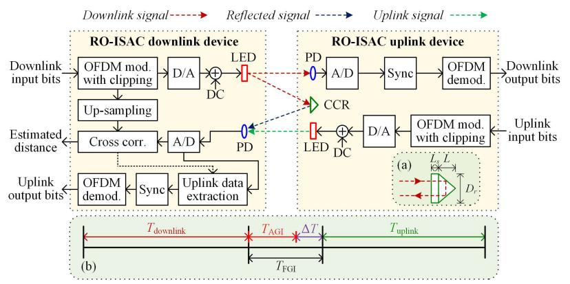
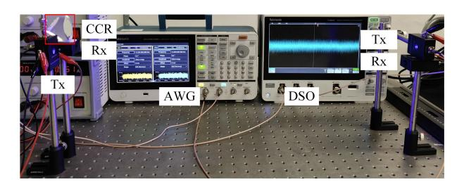
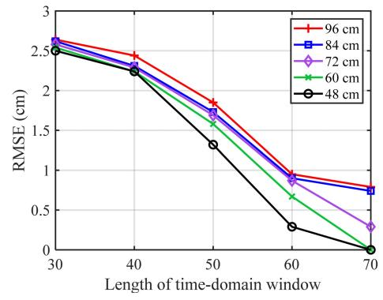
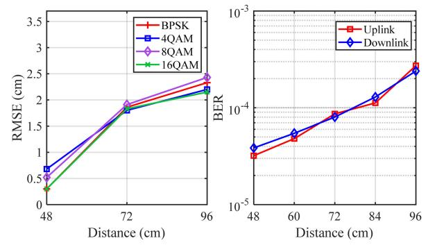
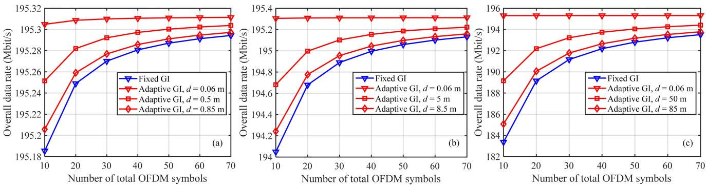
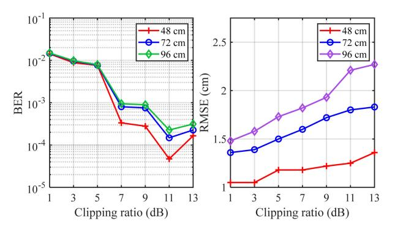

{0}------------------------------------------------

# Bidirectional Retroreflective Optical ISAC Using Time Division Duplexing and Clipped OFDM

Haochuan Wang, Chen Chen®, Senior Member, IEEE, Zhihong Zeng®, Sihua Shao®, Senior Member, IEEE, and Harald Haas®, Fellow, IEEE

Abstract—Optical integrated sensing and communication is one of the most promising technologies for the sixth-generation (6G) networks due to its large transmission capacity and high sensing accuracy. In this Letter, we propose and experimentally demonstrate a bidirectional retroreflective optical integrated sensing and communication (RO-ISAC) system using time division duplexing (TDD) and clipped orthogonal frequency division multiplexing (OFDM). The proposed bidirectional RO-ISAC system consists of a downlink device and an uplink device, where the uplink device uses a corner cube reflector (CCR) to reflect the downlink signal back to the downlink device so as to perform passive ranging. To avoid the interference between the reflected downlink signal and the uplink signal, we here propose a TDD-based interference cancellation scheme for the bidirectional RO-ISAC system, where two types of guard intervals (GIs) including fixed GI and adaptive GI are considered. Moreover, clipped OFDM is adopted as the waveform to realize simultaneous communication and sensing.

Index Terms—Retroreflective optical integrated sensing and communication (RO-ISAC), orthogonal frequency division multiplexing (OFDM), time division duplexing (TDD), bidirectional transmission.

## I. INTRODUCTION

ITH the fast development of visible light communication (VLC), it has become an important component of future sixth-generation (6G) mobile communication systems due to its abundant and license-free optical spectrum, large transmission capacity, high communication security and no hazardous electromagnetic radiation [1]. However, in many future 6G application scenarios, communication systems not only require high reliability and high speed, but also require a certain sensing ability for the communication targets which can further improve frequency band utilization and provide multi-dimensional information [2].

Received 11 December 2024; revised 24 January 2025; accepted 8 February 2025. Date of publication 11 February 2025; date of current version 5 May 2025. This work was supported in part by the National Natural Science Foundation of China under Grant 62271091, in part by the National Science Foundation under Grant CNS-2431272, and in part by the Fundamental Research Funds for the Central Universities under Grant 2024CDJXY020. (Corresponding author: Chen Chen.)

Haochuan Wang, Chen Chen, and Zhihong Zeng are with the School of Microelectronics and Communication Engineering, Chongqing University, Chongqing 400044, China (e-mail: 202312131101t@stu.cqu.edu.cn; c.chen@cqu.edu.cn; zhihong.zeng@cqu.edu.cn).

Sihua Shao is with the Department of Electrical Engineering, Colorado School of Mines, Golden, CO 80401 USA (e-mail: sihua.shao@mines.edu).

Harald Haas is with the Department of Engineering, University of Cambridge, CB3 0FA Cambridge, U.K. (e-mail: huh21@cam.ac.uk).

Color versions of one or more figures in this letter are available at https://doi.org/10.1109/LPT.2025.3541038.

Digital Object Identifier 10.1109/LPT.2025.3541038

Compared with traditional visible light positioning (VLP), the optical integrated sensing and communication (OISAC) system makes a trade-off between communication and sensing, which brings the system more extensive application scenarios [3]. Moreover, the multiplexing of communication and sensing further enhances the frequency band utilization of the system, providing powerful communication and sensing capabilities that cannot be achieved by a single VLC or VLP system [4]. In OISAC systems, waveform design plays a key role to achieve satisfactory communication and sensing performance at the same time. So far, several waveforms have been designed to situate the requirement of both communication and sensing, such as pulse sequence sensing and pulse position modulation (PSS-PPM) [5], combined linear frequency modulation and continuous phase modulation (LFM-CPM) [6], pulse amplitude modulation (PAM)-based waveform [7], and orthogonal frequency division multiplexing (OFDM) [8]. Among them, OFDM reveals to be a promising waveform candidate due to its ability to achieve high transmission rate and satisfactory sensing performance at the same time [9].

Recently, we have proposed a retroreflective optical integrated sensing and communication (RO-ISAC) system using OFDM and corner cube reflector (CCR), where the downlink signal is reflected back to the uplink device via the CCR equipped in the uplink device and efficient ranging can be performed accordingly [10]. Due to the use of signal retro-reflection, sensing can be realized without consuming additional system bandwidth, thus maintaining the large transmission capacity of the RO-ISAC system while ensuring satisfactory sensing performance [11]. However, only downlink transmission has been considered in the RO-ISAC system so far, while bidirectional transmission has not yet been reported in the literature. In this Letter, we propose a bidirectional RO-ISAC system using time division duplexing (TDD) and clipped OFDM. To avoid the interference between the reflected downlink signal and the uplink signal, we propose a TDD-based interference cancellation scheme in which two types of guard intervals (GIs) are considered. Experiments are conducted to investigate the performance of the proposed TDD-based bidirectional RO-ISAC system using clipped OFDM.

#### II. PRINCIPLE

In this section, the model of a bidirectional RO-ISAC system using TDD and clipped OFDM is first described, and then the detailed process of TDD-based bidirectional transmission in the RO-ISAC system is discussed.

{1}------------------------------------------------

Fig. 1. Schematic diagram of the proposed bidirectional RO-ISAC system using TDD and clipped OFDM. Insets: (a) diagram of CCR and (b) TDD-based frame design for bidirectional transmission. mod.: modulation; demod.: demodulation; corr.: correlation.

## A. System Model

Fig. 1 illustrates the schematic diagram of the proposed bidirectional RO-ISAC system using TDD and clipped OFDM, which consists of a downlink device and an uplink device. At the downlink device, downlink input bits are modulated into a real-valued OFDM signal via OFDM modulation and the resultant digital OFDM signal is clipped with a certain clipping ratio to reduce the peak-to-average-power ratio (PAPR). After digital-to-analog (D/A) conversion, the clipped downlink OFDM signal is further combined with a direct current (DC) bias and the combined signal is used to drive an LED so as to generate the downlink signal. At the uplink device, a photo-detector (PD) is adopted to receive the downlink signal and analog-to-digital (A/D) conversion is further conducted to obtain the received downlink digital OFDM signal. Subsequently, time synchronization is executed and then OFDM demodulation is performed to get the downlink output bits.

To enable simultaneous communication and sensing, the uplink device is equipped with a CCR to reflect the downlink signal back to the downlink device via retro-reflection. The inset (a) in Fig. 1 depicts the diagram of the CCR, where  $D_r$ , L, and  $L_s$  denote the diameter, the length, and the recessed length of CCR, respectively [12]. Moreover, the uplink signal generated following the same procedures as the downlink signal also propagates through the space to the downlink device. Hence, the PD in the downlink device might receive both the reflected downlink signal and the uplink signal simultaneously, resulting in non-negligible interference. To avoid the interference between the reflected downlink signal and the uplink signal, a TDD-based interference cancellation scheme is proposed which will be discussed in the next subsection.

After PD detection, the obtained analog signal is converted into a digital signal via A/D conversion, which can be then utilized for both ranging and uplink demodulation. Specifically, ranging is realized by performing cross correlation between the converted digital signal and the up-sampled downlink OFDM signal [10]. Moreover, according to the cross-correlation results, the uplink data can be extracted from the complete received data frame as shown in Fig. 1(b), and hence the uplink output bits can be recovered via time synchronization and OFDM demodulation. Letting S denote the sampling rate of the A/D converter in the downlink device, the ranging resolution is given by  $\Delta d = c/2S$ , with c

being the speed of light. In addition, letting L denote the length of time-domain window adopted for cross-correlation calculation, the maximum ranging distance is obtained by  $d_{\text{max}} = c(L-1)/2S$ .

# B. TDD-Based Bidirectional Transmission

In bidirectional RO-ISAC systems, there might be interference between the reflected downlink signal and the uplink signal. To efficiently avoid interference and enable bidirectional transmission, a TDD-based interference cancellation scheme is proposed for bidirectional RO-ISAC systems. The frame design of TDD-based bidirectional transmission is shown in the inset (b) of Fig. 1. As we can see, the overall time frame is divided into three periods, i.e., the downlink period  $T_{\text{downlink}}$ , the uplink period  $T_{\text{uplink}}$  and the GI period  $T_{\text{GI}}$ . Note that the downlink and uplink devices are synchronized so as to successfully implement the TDD-based bidirectional transmission. Letting  $N_{\rm bits}^{\rm downlink}$  and  $N_{\rm bits}^{\rm uplink}$  respectively denote the number of bits transmitted by the downlink and uplink OFDM symbols within one time frame, the overall data rate of the TDD-based bidirectional RO-ISAC system can be obtained by  $R = (N_{\text{bits}}^{\text{downlink}} + N_{\text{bits}}^{\text{uplink}}) / (T_{\text{downlink}} + T_{\text{GI}} + T_{\text{uplink}})$ . The insertion of a suitable GI plays an important role to avoid interference, and the following two types of GIs are proposed.

- 1) Fixed GI: Considering that the bidirectional RO-ISAC system has a maximum ranging distance  $d_{\rm max}$ , it is reasonable to assume that the maximum distance of the bidirectional RO-ISAC system does not exceed its maximum ranging distance  $d_{\rm max}$ . Under this assumption, a fixed GI with a time period of  $T_{\rm FGI} = d_{\rm max}/c$  can be inserted between the downlink and uplink periods to avoid the interference between the reflected downlink signal and the uplink signal.
- 2) Adaptive GI: Although a fixed GI with  $T_{\rm FGI} = d_{\rm max}/c$  can achieve efficient interference cancellation, it cannot adapt to the change of distance between the downlink and uplink devices. Particularly, for an arbitrary distance  $d \in (0, d_{\rm max}]$ , the practically required GI period is calculated by d/c, which can be much smaller than  $T_{\rm FGI}$  when  $d \ll d_{\rm max}$ . As a result, the use of a fixed GI with  $T_{\rm FGI} = d_{\rm max}/c$  for a relatively small d inevitably leads to the waste of time for communication signal transmission and hence reduce the overall data rate of the bidirectional RO-ISAC system. To enhance time

{2}------------------------------------------------

Fig. 2. Experimental setup of the bidirectional RO-ISAC system.

### TABLE I EXPERIMENTAL PARAMETERS

| Parameter                  | Value     |
|----------------------------|-----------|
| IFFT/FFT size              | 256       |
| Number of data subcarriers | 50        |
| OFDM clipping ratio        | 11 dB     |
| AWG sampling rate          | 250 MSa/s |
| DSO sampling rate          | 2.5 GSa/s |
| Up-sampling ratio          | 10        |
| Ranging resolution         | 6 cm      |
|                            |           |

utilization, we further propose an adaptive GI with a time period of  $T_{\rm AGI} = \hat{d}/c + T_0$ , where  $\hat{d}$  is the estimate of the practical distance d through cross-correlation-based ranging and  $T_0$  is a small time gap to compensate for the time shift caused by ranging errors. Under the assumption that the bidirectional RO-ISAC system can achieve satisfactory ranging performance, i.e., the ranging error does not exceed its ranging resolution, we can reasonably set  $T_0 = \Delta d/c$  and hence we have  $T_{\rm AGI} = (\hat{d} + \Delta d)/c$ . By replacing  $T_{\rm FGI}$  with  $T_{\rm AGI}$ , a GI period reduction of  $\Delta T = (d_{\rm max} - \hat{d} - \Delta d)/c$  can be obtained.

## III. EXPERIMENTAL RESULTS

Fig. 2 depicts the experimental setup of the bidirectional RO-ISAC system using commercial optical transmitter (Tx) and receiver (Rx) modules. The downlink and uplink clipped OFDM signals are both generated offline using MATLAB and then uploaded to a two-channel arbitrary waveform generator (AWG, Tektronix AFG31102) with a sampling rate of 250 MSa/s for each channel. The AWG output signals are used to drive the two Tx modules (HCCLS2021MOD01-TX) for downlink and uplink transmissions, respectively. The detected signals from two Rx modules (HCCLS2021MOD01-RX) are first recorded by a two-channel digital storage oscilloscope (DSO, Tektronix MDO32) with a sampling rate of 2.5 GSa/s for each channel and then processed offline using MATLAB. The experimental parameters are listed in Table I and more details about the Tx/Rx modules can be found in [13].

Fig. 3 shows the ranging root mean square error (RMSE) versus length of time-domain window for different distances. As we can see, the ranging RMSE significantly reduces with the increase of the length of time-domain window, indicating that increasing the length of signal for cross-correlation calculation is an efficient way to enhance the range accuracy. Moreover, for a given length of time-domain window, the ranging RMSE gradually increases with the increase of distance, which is because a larger distance is corresponding to a lower received signal-to-noise ratio (SNR). It can be clearly

Fig. 3. Ranging RMSE vs. length of time-domain window for different distances.

Fig. 4. (a) Ranging RMSE vs. distance for different modulation constellations and (b) communication BER vs. distance for downlink and uplink channels.

observed from Fig. 3 that a ranging RMSE of no more than 3 cm can be achieved for a distance of 96 cm with a length of time-domain window of 30, demonstrating the satisfactory ranging performance of the bidirectional RO-ISAC system.

Fig. 4(a) illustrates the ranging RMSE versus distance for different modulation constellations. It can be seen that comparable ranging RMSE can be obtained by the considered four kinds of modulation constellations for a given distance, which suggests that the use of different modulation constellations has a negligible impact on the ranging performance since ranging is performed in the time domain. Fig. 4(b) plots the communication bit error ratio (BER) versus distance for downlink and uplink channels, both adopting 16-ary quadrature amplitude modulation (16QAM) during OFDM modulation. As we can see, the downlink and uplink channels have nearly the same BER performance, which is due to the fact that both channels are established using the same hardwares. Moreover, the BERs of both the downlink and uplink channels are below the 7% forward error correction (FEC) coding threshold of  $3.8 \times 10^{-3}$ for a distance of 96 cm, showing the excellent communication performance of the bidirectional RO-ISAC system.

Figs. 5(a), (b) and (c) show the overall data rate versus number of total OFDM symbols in one complete data frame using fixed/adaptive GI for a maximum ranging distance of 1 m, 10 m, and 100 m, respectively. As we can see, the overall data rate generally increases with the increase of the number of total OFDM symbols in one complete data frame and the overall data rate using adaptive GI is always higher than that using fixed GI. Moreover, for a given maximum ranging distance, a higher overall data rate is achieved using adaptive

{3}------------------------------------------------

Fig. 5. Overall data rate vs. number of total OFDM symbols using fixed/adaptive GI for a maximum ranging distance of (a) 1 m, (b) 10 m, and (c) 100 m.

Fig. 6. (a) Communication BER vs. OFDM clipping ratio and (b) ranging RMSE vs. OFDM clipping ratio for different distances.

GI with a shorter distance, while the overall data rate using adaptive GI approaches that using fixed GI when the distance approaches the maximum ranging distance. In addition, the overall data rate improvement becomes much more significant when the maximum ranging distance becomes larger.

Fig. [6\(a\)](#page-3-14) shows the communication BER versus OFDM clipping ratio for different distances. When the clipping ratio is increased from 1 dB to 13 dB, there exists an optimal clipping ratio of 11 dB for OFDM to achieve the minimum BER for all three distances. This is mainly because the signal power improvement plays a dominant role for a relatively small clipping ratio, while the clipping distortion dominates when the clipping ratio becomes relatively large. Fig. [6\(b\)](#page-3-14) shows the ranging RMSE versus OFDM clipping ratio for different distances. It is interesting to observe that the ranging RMSE gradually increases with the increase of clipping ratio for all three distances, which indicates that a higher ranging accuracy is obtained when the OFDM waveform is clipped more severely with a smaller clipping ratio. This observation might be explained as follows. Considering the noise-like OFDM waveform, the clipped OFDM waveform with a smaller clipping ratio makes it more similar to the waveform of a binary pulse signal, thus enhancing its cross-correlation performance and improving its ranging accuracy. Hence, the trade-off between communication and sensing using OFDM can be realized by adaptively adjusting the clipping ratio.

## IV. CONCLUSION

In this Letter, we have proposed and demonstrated a bidirectional RO-ISAC system employing TDD and clipped OFDM. To avoid the interference between the reflected downlink signal and the uplink signal, a TDD-based interference cancellation scheme has been proposed, where two types of GIs including fixed GI and adaptive GI are considered. Experimental results show that the proposed bidirectional RO-ISAC system is able to achieve both high-speed communication and high-accuracy ranging at the same time. Moreover, it is also revealed that the clipping ratio in clipped OFDM has a different impact on communication and ranging performance.

# REFERENCES

- [\[1\] N](#page-0-0). Chi, Y. Zhou, Y. Wei, and F. Hu, "Visible light communication in 6G: Advances, challenges, and prospects," *IEEE Veh. Technol. Mag.*, vol. 15, no. 4, pp. 93–102, Dec. 2020.
- [\[2\] C](#page-0-1).-X. Wang et al., "On the road to 6G: Visions, requirements, key technologies, and testbeds," *IEEE Commun. Surveys Tuts.*, vol. 25, no. 2, pp. 905–974, 2nd Quart. 2023.
- [\[3\] Y](#page-0-2). Wen, F. Yang, J. Song, and Z. Han, "Optical integrated sensing and communication: Architectures, potentials and challenges," *IEEE Internet Things Mag.*, vol. 7, no. 4, pp. 68–74, Jul. 2024.
- [\[4\] C](#page-0-3). Liang et al., "Integrated sensing, lighting and communication based on visible light communication: A review," *Digit. Signal Process.*, vol. 145, Feb. 2024, Art. no. 104340.
- [\[5\] Y](#page-0-4). Wen, F. Yang, J. Song, and Z. Han, "Pulse sequence sensing and pulse position modulation for optical integrated sensing and communication," *IEEE Commun. Lett.*, vol. 27, no. 6, pp. 1525–1529, Jun. 2023.
- [\[6\] Y](#page-0-5). Wen, F. Yang, J. Song, and Z. Han, "Free space optical integrated sensing and communication based on LFM and CPM," *IEEE Commun. Lett.*, vol. 28, no. 1, pp. 43–47, Jan. 2024.
- [\[7\] J](#page-0-6). Wang, N. Huang, C. Gong, W. Wang, and X. Li, "PAM waveform design for joint communication and sensing based on visible light," *IEEE Internet Things J.*, vol. 11, no. 11, pp. 20731–20742, Jun. 2024.
- [\[8\] E](#page-0-7). B. Müller, V. N. H. Silva, P. P. Monteiro, and M. C. R. Medeiros, "Joint optical wireless communication and localization using OFDM," *IEEE Photon. Technol. Lett.*, vol. 34, no. 14, pp. 757–760, Jul. 15, 2022.
- [\[9\] Y](#page-0-8). Wen, F. Yang, J. Song, and Z. Han, "Free-space optical integrated sensing and communication based on DCO-OFDM: Performance metrics and resource allocation," *IEEE Internet Things J.*, vol. 12, no. 2, pp. 2158–2173, Jan. 2025.
- [\[10\]](#page-0-9) Y. Cui et al., "Retroreflective optical ISAC using OFDM: Channel modeling and performance analysis," *Opt. Lett.*, vol. 49, no. 15, pp. 4214–4217, 2024.
- [\[11\]](#page-0-10) H. Wang, Z. Zeng, C. Chen, B. Zhu, S. Shao, and M. Liu, "Retroreflective optical ISAC supporting 3D positioning in indoor environments," in *Proc. Asia Commun. Photon. Conf. (ACP) Int. Conf. Inf. Photon. Opt. Commun. (IPOC)*, Nov. 2024, pp. 1–5.
- [\[12\]](#page-1-1) S. Shao, A. Salustri, A. Khreishah, C. Xu, and S. Ma, "R-VLCP: Channel modeling and simulation in retroreflective visible light communication and positioning systems," *IEEE Internet Things J.*, vol. 10, no. 13, pp. 11429–11439, Jul. 2023.
- [\[13\]](#page-2-4) C. Chen, Y. Nie, X. Zhong, M. Liu, and B. Zhu, "Characterization of a practical 3-m VLC system using commercially available Tx/Rx modules," in *Proc. Asia Commun. Photon. Conf. (ACP)*, Oct. 2021, pp. 1–3.