{0}------------------------------------------------

# Optical Wireless Integrated Sensing and Communication Based on EADO-OFDM: A Flexible Resource Allocation Perspectivelg

Yunfeng We[n](https://orcid.org/0009-0000-9708-6012) , Fang Yan[g](https://orcid.org/0000-0003-3575-5086) , *Senior Member, IEEE*, Jian Song [,](https://orcid.org/0000-0002-6066-9510) *Fellow, IEEE*, and Zhu Han [,](https://orcid.org/0000-0002-6606-5822) *Fellow, IEEE*

*Abstract*—Integrated sensing and communication (ISAC) is regarded as one key enabler in the future sixth-generation (6G) mobile communication network. While considerable attention has been paid to radio-frequency (RF)-ISAC, optical wireless (OW)- ISAC is also rapidly developing as a powerful complement to its RF counterpart. In this paper, an enhanced asymmetrically clipped direct-current-biased optical orthogonal frequency division multiplexing (EADO-OFDM) scheme is proposed for flexible waveform design and resource allocation in OW-ISAC. A generalized OW-ISAC framework is first established to describe the working principles of both communication and sensing (C&S). Then, the signal model is introduced for EADO-OFDM, where the Price theorem is adopted to model the colored clipping noise and elicit a generalized frequency-selective channel. In addition, a joint optimization problem of resource allocation for EADO-OFDM is formulated to adaptively balance C&S performance metrics, and the solution to the problem is obtained by the block coordinate descent algorithm. Finally, extensive numerical simulations demonstrate the flexibility of the proposed EADO-OFDM scheme, while the C&S trade-off is also revealed during the resource allocation.

*Index Terms*—Integrated sensing and communication, orthogonal frequency division multiplexing, optical wireless communication, resource allocation, block coordinate descent.

# I. INTRODUCTION

I NTEGRATED sensing and communication (ISAC) has garnered considerable attention from both academia and

Received 30 July 2024; revised 27 December 2024 and 9 March 2025; accepted 27 March 2025. Date of publication 10 April 2025; date of current version 14 August 2025. This work was supported in part by the National Key Research and Development Program of China under Grant 2023YFE0110600; in part by NSF under Grant CNS-2107216, Grant CNS-2128368, Grant CMMI-2222810, and Grant ECCS-2302469; in part by the U.S. Department of Transportation, Toyota; and in part by Amazon and Japan Science and Technology Agency (JST) Adopting Sustainable Partnerships for Innovative Research Ecosystem (ASPIRE) under Grant JPMJAP2326. An earlier version of this paper was presented at the Globecom 2024 [DOI: 10.1109/GLOBE-COM52923.2024.10901628]. The associate editor coordinating the review of this article and approving it for publication was H. ElSawy. *(Corresponding author: Fang Yang.)*

Yunfeng Wen is with the Department of Electronic Engineering, Tsinghua University, Beijing 100084, China (e-mail: wenyf22@mails.tsinghua.edu.cn).

Fang Yang is with the Department of Electronic Engineering, Tsinghua University, Beijing 100084, China, and also with the State Key Laboratory of Widegap Semiconductor Optoelectronic Materials and Technologies, Beijing 100084, China (e-mail: fangyang@tsinghua.edu.cn).

Jian Song is with the Department of Electronic Engineering, Tsinghua University, Beijing 100084, China, and also with Shenzhen International Graduate School, Tsinghua University, Shenzhen 518055, China (e-mail: jsong@tsinghua.edu.cn).

Zhu Han is with the Department of Electrical and Computer Engineering, University of Houston, Houston, TX 77004 USA, and also with the Department of Computer Science and Engineering, Kyung Hee University, Seoul 446-701, South Korea (e-mail: hanzhu22@gmail.com).

Digital Object Identifier 10.1109/TWC.2025.3557061

industry in recent years, offering ubiquitous communication and sensing (C&S) services in the upcoming era of connectivity and intelligence [\[2\].](#page-14-0) To pave the way for future applications like the intelligent transportation system (ITS) [\[3\],](#page-14-1) cooperation and co-design become key concepts in ISAC [\[4\].](#page-14-2) Namely, C&S systems are anticipated to share the same hardware and jointly design their waveform, rather than being treated as isolated parts or interference to each other [\[5\].](#page-14-3) Based on the cooperation and co-design ideology, numerous ISAC waveforms have been proposed for the radio-frequency (RF) band, including those based on linear frequency modulation [\[6\]](#page-14-4) and orthogonal frequency division multiplexing (OFDM) [\[7\].](#page-14-5) Besides, the resource allocation in ISAC is also intrinsically associated with C&S performances [\[8\],](#page-14-6) [\[9\].](#page-14-7) In addition to conventional time-division and frequency-division schemes, the joint optimization in the time-frequency domain also shows great potential in accommodating various ISAC tasks [\[10\].](#page-14-8)

While a giant leap in RF-ISAC has been witnessed, optical wireless (OW)-ISAC is also emerging as a promising complement. Compared with its RF counterpart, OW-ISAC offers *three advantages* in the context of ISAC, i.e., increasing communication rate, enhancing sensing precision, and reducing interference [\[11\].](#page-14-9) In addition, OW-ISAC systems can be categorized into cooperative and uncooperative types according to their working principles. Specifically, conventional visible light positioning generally demands the target to be equipped with an optical wireless communication (OWC) receiver, thus being categorized as a cooperative type [\[12\],](#page-14-10) [\[13\].](#page-14-11) On the contrary, an uncooperative OW-ISAC system is implemented on optical sensors like light detection and ranging (LiDAR), which actively scans both cooperative and uncooperative targets in the surroundings [\[14\],](#page-14-12) [\[15\].](#page-14-13) To obtain high-resolution point clouds of the environment, an OW-ISAC system should be capable of simultaneous ranging and communication, necessitating the optimal waveform design and resource allocation in OW-ISAC.

However, an essential gap between RF-ISAC and OW-ISAC waveform design originates from the widely adopted intensity modulation and direct detection (IM/DD) scheme. Generally, optical C&S systems leverage direct detection to reduce the cost and complexity of hardware, which restricts the transmitted signal to be real and non-negative. As a result, the existing complex-value waveforms in RF-ISAC are not readily applicable to OW-ISAC. Therefore, dedicated OW-ISAC waveforms have been proposed, ranging from pulsed waveforms [\[16\],](#page-14-14) [\[17\]](#page-14-15) to constant-modulus waveforms [\[18\],](#page-14-16) 

{1}------------------------------------------------

[\[19\].](#page-14-17) Nevertheless, these waveforms are generally heuristically designed, and the rigid forms limit their flexibility under capricious user requirements. In contrast, optical OFDM schemes provide the capability of resisting frequency selectivity thanks to its time-frequency interpretation [\[20\].](#page-14-18) Additionally, the subtle signal processing and resource allocation techniques of optical OFDM also facilitate the performance improvement of OW-ISAC systems, as investigated in the tutorial of [\[21\].](#page-14-19)

Among the abundant optical OFDM schemes, directcurrent-biased optical OFDM (DCO-OFDM) has become a baseline for OW-ISAC, whose functionalities of simultaneous C&S have been demonstrated theoretically and experimentally [\[22\],](#page-14-20) [\[23\].](#page-15-0) Nonetheless, the excessive direct-current (DC) bias neither carries communication data nor contributes to target sensing, which deteriorates the power efficiency of DCO-OFDM. Towards this end, power-efficient techniques are proposed to losslessly obtain non-negative signal without extra DC bias, including asymmetrically-clipped optical OFDM (ACO-OFDM) [\[24\],](#page-15-1) pulse-amplitude-modulated discrete multitone (PAM-DMT) [\[25\],](#page-15-2) and flip-OFDM [\[26\].](#page-15-3) Moreover, these basic optical OFDM schemes can be combined with each other to strike a trade-off between spectral and power efficiencies, yielding hybrid schemes like asymmetrically-clipped DC-biased optical OFDM (ADO-OFDM) [\[27\]](#page-15-4) and hybrid ACO-OFDM (HACO-OFDM) [\[28\].](#page-15-5) Furthermore, the optical OFDM schemes can be further enhanced by increasing modulation layers, and an eminent example of layered modulation is given by layered ACO-OFDM (LACO-OFDM) [\[29\].](#page-15-6)

Despite the maturity of OFDM schemes in OWC, their extensions to OW-ISAC are not straightforward, since successive interference cancellation (SIC) techniques are not readily available for optical sensing receivers as their communication counterparts. Consequently, OW-ISAC systems are more vulnerable to detrimental clipping noise than conventional OWC systems [\[30\].](#page-15-7) Additionally, the optimal power allocation and subcarrier assignment may vary as the objective evolves from sole communication to ISAC, urging the need for refined resource allocation strategies.

To mitigate the interference from the clipping noise and achieve the C&S compromise, we adopt enhanced ADO-OFDM (EADO-OFDM) as the prototype waveform for OW-ISAC [\[31\].](#page-15-8) Specifically, our contributions are listed as follows.

- • First, a generalized OW-ISAC system framework based on EADO-OFDM is presented to provide flexible C&S capabilities. By tuning system parameters of EADO-OFDM, an OW-ISAC system can reach a compromise between spectral and power efficiencies under capricious user demands. In addition, with its vast degree of freedom in power allocation and subcarrier assignment, the EADO-OFDM scheme also subsumes DCO-OFDM, ACO-OFDM, and ADO-OFDM, thus serving as a unified optical OFDM framework for OW-ISAC.
- Second, the signal model and signal processing techniques are investigated for EADO-OFDM. The Price theorem is adopted to model the non-linear distortion of EADO-OFDM, which elicits a generalized

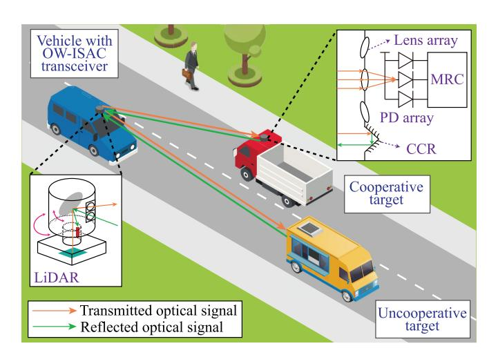

Fig. 1. Generalized system framework of the proposed OW-ISAC scheme.

frequency-selective channel. Moreover, the communication receiver adopts SIC to mitigate the clipping noise, while the sensing receiver utilizes an element-wisedivision method to avoid the impact of communication data. Subsequently, these techniques are also utilized to derive the expressions of normalized signal-to-noise-plusdistortion ratio (SNDR) on each subcarrier.

• Third, a joint optimization problem of resource allocation for EADO-OFDM is formulated to strike a trade-off between C&S functionalities. To solve this non-convex problem, the original joint optimization problem is decomposed into three sub-problems, i.e., a sub-problem for DCO-ACO power distribution, a sub-problem for subcarrier assignment, and a sub-problem for subcarrier power allocation. Thereby, the block coordinate descent (BCD) algorithm is adopted to solve these sub-problems iteratively. Numerical simulations demonstrate that the joint optimization can adaptively balance C&S performance metrics, while the C&S trade-off is also revealed during the resource allocation.

The rest of this paper is organized as follows. The generalized OW-ISAC system framework is presented in Section [II,](#page-1-0) where expressions for C&S channel gains are also provided. Section [III](#page-3-0) presents signal model and signal processing techniques for EADO-OFDM, based on which C&S performance metrics are also derived. The joint optimization problem of resource allocation for EADO-OFDM is formulated and solved by the BCD algorithm in Section [IV.](#page-5-0) Moreover, extensive simulation results are illustrated in Section [V,](#page-9-0) and the conclusion is drawn in Section [VI.](#page-13-0)

## II. SYSTEM FRAMEWORK FOR OW-ISAC

In this section, we take the ITS scenario as an example to introduce a generalized OW-ISAC framework, which is illustrated in Fig. [1.](#page-1-1) The OW-ISAC functionalities are implemented on an automotive LiDAR that can transmit and receive optical signals simultaneously. While the LiDAR can scan the surroundings to generate point clouds for sensing, its beam steering mechanisms can also establish and maintain communication links with other OWC receivers [\[32\].](#page-15-9) In addition, 

{2}------------------------------------------------

the LiDAR is also equipped with low-latency applicationspecific integrated circuits for digital signal processing like fast Fourier transform (FFT), which ensures real-time OFDM signal processing for sensing [33].

On the target side, the targets in the field of view (FOV) of the OW-ISAC transceiver can be classified into uncooperative and cooperative targets according to their equipment and orientations. On the one hand, a target without an unobstructed OWC receiver is recognized as an uncooperative target. In this case, the OW-ISAC transceiver estimates its profile in the same way as a conventional LiDAR, which mainly relies on the diffuse reflections of its surface. On the other hand, a target with an OWC receiver in the FOV of the OW-ISAC transceiver is viewed to be cooperative, whose corner-cube retroreflector (CCR) reflects part of the OW-ISAC signal back to the LiDAR [23]. Meanwhile, the lens array and photodetector (PD) array ensure the FOV of the OWC receiver for narrow laser beams, and a maximal ratio combiner (MRC) aggregates the responses of PDs, both of which contribute to the robustness of the OWC link in mobile scenarios [34].

#### A. Communication Model

For the communication sub-system, we assume perfect synchronization between the OW-ISAC transceiver and the OWC receiver, while the Doppler shift is eliminated by the IM/DD scheme. Thereby, denoting the transmitted optical intensity as  $x\left(n\right)$ , the received communication signal can be written as

$$y_c(n) = H_c x(n) + w_c(n), \qquad (1)$$

where  $H_c$  denotes the channel gain of communication, and n is the discrete time-domain index. Besides, the thermal noise and shot noise are modelled as additive white Gaussian noise (AWGN) whose power is  $\sigma_{n,c}^2$ , i.e.,  $w_c(n) \sim \mathcal{N}\left(0, \sigma_{n,c}^2\right)$ .

For terrestrial scenarios, the optical signal propagates through an atmospheric channel, where propagation impairments mainly originate from atmospheric attenuation, turbulence, geometric loss, etc. Moreover, due to the narrow and directional characteristics of laser beams, only line-of-sight (LoS) channels are considered by OWC. Therefore, the channel gain of communication is given by

$$H_c = G_c L_a(D) L_t(D) L_g(D), \qquad (2)$$

where  $G_c$  is a combined coefficient including the gain of amplifiers and the PD responsivity of the OWC receiver. Besides,  $L_a(D)$ ,  $L_t(D)$ , and  $L_g(D)$  denote the atmospheric attenuation, the scintillation brought by turbulence, and the geometric loss, respectively, whose relationships with the link distance D are elaborated as follows.

1) Atmospheric Attenuation: The atmospheric attenuation arises from the absorption and scattering of fog, haze, rain, snow, and dust, which is generally modelled as an exponential function of the link distance [35], i.e.,

$$L_a(D) = \exp(-\beta_a D), \qquad (3)$$

where the attenuation factor  $\beta_a$  is determined by specific atmospheric conditions.

2) Atmospheric Turbulence: The log-normal distribution is adopted to model the atmospheric turbulent channel under weak turbulence, and the scintillation term in (2) follows the distribution of

$$p(L_t; D) = \frac{1}{L_t \sqrt{2\pi\sigma_t^2}} \exp\left(-\frac{1}{2\sigma_t^2} \left(\ln\frac{L_t}{\bar{L}_t} + \frac{\sigma_t^2}{2}\right)^2\right), \quad (4)$$

where  $\bar{L}_t$  and  $\sigma_t^2$  denote the average turbulence power and the scintillation index, respectively. In this paper,  $\bar{L}_t \triangleq 1$  is normalized, and  $\sigma_t^2$  can be obtained by the Rytov approximation as [36]

$$\sigma_t^2(D) \approx 1.23 \left(\frac{2\pi}{\lambda}\right)^{7/6} D^{11/6} C_n^2,$$
 (5)

where  $C_n^2$  and  $\lambda$  denote the refractive index and the optical wavelength, respectively.

3) Geometric Loss: The geometric loss arises from the divergence of laser beams between the transmitter and the receiver. Supposing that perfect alignment is achieved by the beam steering mechanism of the OW-ISAC transceiver, the geometric loss can be expressed as

$$L_g(D) = \frac{A_c}{\pi} \left(\frac{2}{D\theta}\right)^2,\tag{6}$$

where  $A_c$  and  $\theta$  denote the equivalent aperture of the OWC receiver and the beam divergence angle, respectively.

#### B. Sensing Model

Due to the non-penetration property and narrow beams of laser, we only consider a single-point-target scenario, and the received sensing signal can be written as

$$y_s(n) = H_s x(n - \tau_0 R_s) + w_s(n),$$
 (7)

where  $H_s$  denotes the total channel gain of sensing, while the thermal noise and shot noise are modelled as AWGN whose power is  $\sigma_{n,s}^2$ , i.e.,  $w_s(n) \sim \mathcal{N}\left(0,\sigma_{n,s}^2\right)$ . Additionally,  $R_s$  denotes the sampling rate, and  $\tau_0 = 2D/c$  is the time of flight (ToF) for the sensing signal with c denoting the speed of light.

Similar to its communication counterpart, optical sensing also relies on LoS channels, and the total channel gain of sensing is therefore given by

$$H_s = \Re G_s L_a(2D) L_t(2D) L_a(2D),$$
 (8)

where  $\Re$  denotes the reflectivity of the sensing target, and the combined factor  $G_s$  includes the gain of amplifiers and the PD responsivity of the OW-ISAC transceiver. In addition, since the sensing channel involves a round-trip propagation of optical signal,  $L_a(2D)$  and  $L_t(2D)$  denote the atmospheric attenuation and the scintillation brought by turbulence, respectively. Furthermore, as CCR is adopted by the cooperative target in Fig. 1, the beam divergence angle of the reflected signal equals to that of the transmitted signal, and the total geometric loss is thus given by  $L_a(2D)$ .

{3}------------------------------------------------

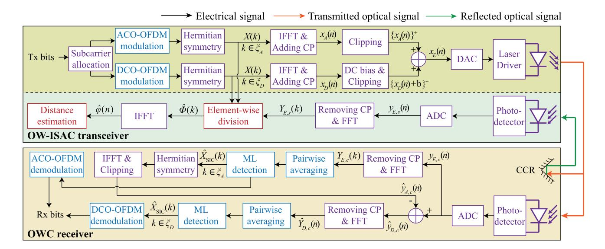

Fig. 2. Signal processing procedures of the proposed EADO-OFDM scheme for OW-ISAC. The blocks in purple, red, and blue are common components for C&S, specific components for sensing, and specific components for communication, respectively.

#### III. SIGNAL PROCESSING FOR EADO-OFDM

In this section, we discuss the signal processing techniques for OW-ISAC based on EADO-OFDM, as illustrated in Fig. 2. The signal model of EADO-OFDM and its non-linear distortion are first introduced in Section III-A, where the clipping noise is modelled as colored noise. Then, the signal processing techniques for communication and sensing are discussed in Sections III-B and III-C, respectively.

#### A. EADO-OFDM Signal Model

While odd and even subcarriers are fixed to ACO-OFDM and DCO-OFDM respectively in conventional ADO-OFDM, the EADO-OFDM scheme can adaptively assign part of the odd subcarriers to DCO-OFDM. Denoting the number of subcarriers as N, the independent subcarrier set  $\xi = \{1, 2, \cdots, N-1\}$  is divided into two sub-sets, i.e.,  $\xi_D$  and  $\xi_A$ , for DCO-OFDM and ACO-OFDM, respectively. As the time-domain ACO-OFDM signal has the antisymmetry property,  $\xi_A$  should be a sub-set of the odd-subcarrier set, which resembles that in conventional ADO-OFDM. Denoting the odd-subcarrier and even-subcarrier sets as  $\xi_O$  and  $\xi_E$ , respectively, the constraints imposed on  $\xi_D$  and  $\xi_A$  are written as

$$\xi_A \cup \xi_D = \xi, \ \xi_A \cap \xi_D = \emptyset, \ \xi_A \subset \xi_o, \ \xi_D \supset \xi_e.$$
 (9)

Once  $\xi_D$  and  $\xi_A$  are established, the transmitted signal X(k) in the frequency domain is obtained by modulating the transmitted bits, with k denoting the discrete frequency-domain index. Then, Hermitian symmetry is imposed on the frequency-domain subcarriers to obtain a real signal in the time domain, i.e.,  $X(k) = X^*(N-k)$ . Therefore, the DCO and ACO components of the EADO-OFDM signal can be expressed as

$$x_D(n) = \frac{1}{\sqrt{N}} \sum_{k \in \mathcal{E}_D} X(k) \exp\left(\frac{j2\pi nk}{N}\right), \quad (10)$$

and

$$x_{A}(n) = \frac{1}{\sqrt{N}} \sum_{k \in \mathcal{E}_{A}} X(k) \exp\left(\frac{j2\pi nk}{N}\right), \quad (11)$$

respectively, where j denotes the imaginary unit. Subsequently, the EADO-OFDM signal is written as

$$x_E(n) = \{x_D(n) + b\}^+ + \{x_A(n)\}^+,$$
 (12)

where the notation  $\{\cdot\}^+$  denotes the non-negative clipping and is defined as  $\{x\}^+ = \max\{x,0\}$ , while b denotes the DC bias for DCO-OFDM. Moreover, to maintain the unambiguous range for target distance estimation and resist ISI, an  $n_g$ -points guard interval is concatenated in the front of  $x_E(n)$ , which is filled with a cyclic prefix (CP).

As described in (12), the EADO-OFDM signal is a non-linear combination of  $x_A(n)$  and  $x_D(n)$ , which has distinct properties from conventional OFDM signal. Based on the central limit theorem, both  $x_D(n)$  and  $x_A(n)$  can be modelled as Gaussian random processes with variances of  $\sigma_D^2$  and  $\sigma_A^2$ , respectively, i.e.,

$$\sigma_D^2 = \frac{1}{N} \sum_{k \in \xi_D} \mathbb{E}(|X(k)|^2), \ \sigma_A^2 = \frac{1}{N} \sum_{k \in \xi_A} \mathbb{E}(|X(k)|^2),$$
(13)

where the operator  $\mathbb{E}\left(\cdot\right)$  means calculating the expectation.

According to the Bussgang theorem [37], the clipped signal can be modelled as

$$x_{D}^{+}(n) = \{x_{D}(n) + b\}^{+} = \mathcal{K}_{D}x_{D}(n) + v_{D}(n),$$
 (14a)

$$x_{A}^{+}(n) = \{x_{A}(n)\}^{+} = \mathcal{K}_{A}x_{A}(n) + v_{A}(n),$$
 (14b)

where  $v_D\left(n\right)$  and  $v_A\left(n\right)$  are clipping noises that are uncorrelated with the original signal  $x_D\left(n\right)$  and  $x_A\left(n\right)$ . In addition, the attenuation factor of DCO-OFDM is calculated as

$$\mathcal{K}_{D} = \frac{\mathbb{E}\left(x_{D}^{+}\left(n\right)x_{D}\left(n\right)\right)}{\mathbb{E}\left(x_{D}^{2}\left(n\right)\right)} = Q\left(\lambda_{b}\right),\tag{15}$$

{4}------------------------------------------------

where  $\lambda_b = -b/\sigma_D \leq 0$  is the normalized clipping level, and  $Q\left(\cdot\right)$  is the complementary cumulative distribution function of standard Gaussian distribution. Similarly, the attenuation factor for ACO-OFDM is calculated as  $\mathcal{K}_A = 1/2$ , since the normalized clipping level of ACO-OFDM is  $\lambda_b = 0$ . Moreover, the optical power of  $x_E\left(n\right)$  is calculated as

$$P_{o} = \mathbb{E}\left(x_{E}\left(n\right)\right) = \sigma_{D}\left(\phi\left(\lambda_{b}\right) - \lambda_{b}\mathcal{K}_{D}\right) + \frac{1}{\sqrt{2\pi}}\sigma_{A}, \quad (16)$$

where  $\phi(\cdot)$  is the probability distribution function (PDF) of standard Gaussian distribution. Similarly, leveraging the uncorrelated property of DCO and ACO components, the electrical power of  $x_E(n)$  is derived as

$$P_{e} = \mathbb{E} \left( x_{D}^{+}(n) + x_{A}^{+}(n) \right)^{2}$$

$$= \mathbb{E} \left( x_{D}^{+}(n) \right)^{2} + \mathbb{E} \left( x_{A}^{+}(n) \right)^{2} + 2\mathbb{E} \left( x_{D}^{+}(n) \right) \mathbb{E} \left( x_{A}^{+}(n) \right)$$

$$= \sigma_{D}^{2} \left( -\lambda_{b} \phi \left( \lambda_{b} \right) + \left( 1 + \lambda_{b}^{2} \right) \mathcal{K}_{D} \right)$$

$$+ \frac{1}{2} \sigma_{A}^{2} + \sqrt{\frac{2}{\pi}} \sigma_{A} \sigma_{D} \left( \phi \left( \lambda_{b} \right) - \lambda_{b} \mathcal{K}_{D} \right). \tag{17}$$

Furthermore, denoting the auto-correlation functions of  $x_D\left(n\right)$  and  $v_D\left(n\right)$  as  $R_{x_D}\left(n\right)$  and  $R_{v_D}\left(n\right)$ , respectively, the following theorem can be utilized to model the power spectral density (PSD) of the clipping noise.

Theorem 1: The auto-correlation function of the clipping noise can be expressed as

$$R_{v_D}(n) = \mathcal{I}(R_{x_D}(n)) + C_1 R_{x_D}(n) + C_2,$$
 (18)

where the integral is defined as

$$\mathcal{I}(r) = \frac{\sigma_D^2}{2\pi} \int_{-\frac{\pi}{2}}^{\arcsin\left(\frac{r}{\sigma_D^2}\right)} \int_{-\frac{\pi}{2}}^{\theta_1} \varpi\left(\theta_1, \theta_2\right) d\theta_1 d\theta_2,$$
(19a)

$$\varpi\left(\theta_{1}, \theta_{2}\right) = \cos\left(\theta_{1}\right) \exp\left(-\frac{\lambda_{b}^{2}}{1 + \sin\left(\theta_{2}\right)}\right).$$
 (19b)

Moreover, the constants  $C_1$  and  $C_2$  are calculated as

$$C_{1} = \frac{1}{\sigma_{D}^{2}} \left( \mathbb{E} \left( \left( v_{D} \left( n \right) \right)^{2} \right) - C_{2} - \mathcal{I} \left( \sigma_{D}^{2} \right) \right), \tag{20a}$$

$$C_2 = \left(\mathbb{E}\left(v_D\left(n\right)\right)\right)^2 - \mathcal{I}\left(0\right). \tag{20b}$$

The first-order and second-order momentums of  $v_D(n)$  in (20a) and (20b) are given by

$$\mathbb{E}\left(v_D\left(n\right)\right) = \sigma_D\left(-\lambda_b \mathcal{K}_D + \phi\left(\lambda_b\right)\right),\tag{21a}$$

$$\mathbb{E}\left(v_D\left(n\right)\right)^2 = \sigma_D^2\left(\mathcal{K}_D - \lambda_b\phi\left(\lambda_b\right) + \lambda_b^2\mathcal{K}_D - \mathcal{K}_D^2\right). \tag{21b}$$

*Proof:* See the Price theorem in Appendix A.

Once the auto-correlation function is obtained, the PSD of the clipping noise  $v_D(n)$  can be calculated by the Wiener-Khinchin theorem as [38]

$$P_{v_D}(k) = \sum_{n=0}^{N-1} R_{v_D}(n) \exp\left(-\frac{j2\pi nk}{N}\right).$$
 (22)

Additionally, by substituting  $\sigma_D$  with  $\sigma_A$  and b with 0, **Theorem 1** can also be extrapolated to ACO-OFDM, which yields the auto-correlation function  $R_{v_A}(n)$  and PSD  $P_{v_A}(k)$  of the clipping noise  $v_A(n)$ .

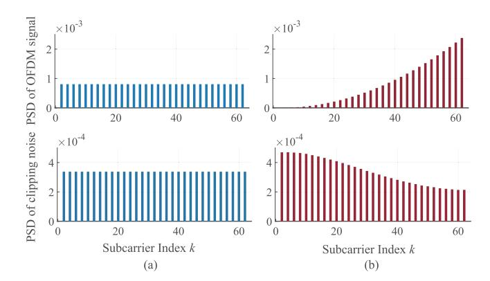

Fig. 3. The relationship between PSDs of original OFDM signal and clipping noise. (a) Uniform power allocation. (b) Non-uniform power allocation.

To understand **Theorem 1** more intuitively, the relationship between PSDs of OFDM signal and clipping noise is displayed in Fig. 3. Due to the frequency-domain Hermitian symmetry, the subcarrier index is restricted in  $1 \le k \le N/2 - 1$ . Besides, the amount of subcarriers, total power, and normalized clipping level are set to N = 128, P = 1, and  $\lambda_b = -1$ , respectively. Fig. 3(a) shows that if the transmitted power is uniformly distributed on the even subcarrier set  $\xi_e$ , then the clipping noise can also be regarded as a white noise on  $\xi_e$ . However, Fig. 3(b) indicates that non-uniform power allocation, as a common case in ISAC, yields an uneven clipping noise PSD within  $\xi_e$  [39].

Remark 1: The EADO-OFDM scheme can subsume DCO-OFDM, ACO-OFDM, and ADO-OFDM through flexible power allocation and subcarrier assignment. Specifically, by setting the DCO subcarrier set as  $\xi_D = \xi_e$  and  $\xi_D = \xi$ , the EADO-OFDM scheme returns to conventional ADO-OFDM and DCO-OFDM, respectively. Besides, an ADO-OFDM scheme with zero power on DCO component, i.e.,  $\sigma_D = 0$ , is equivalent to a conventional ACO-OFDM scheme. Therefore, with the accurate model of clipping noise provided by the Price theorem, the EADO-OFDM scheme is established as a unified framework for optical OFDM.

In addition to extending the conventional clipping model, the Price theorem also elicits a generalized frequency-selective channel even if the real-world optical channel is flat. To this end, we refer to (14) and derive the frequency-domain expression of EADO-OFDM signal as

$$X_{E}(k) = \mathcal{K}_{E}(k) X(k) + V_{D}(k) + V_{A}(k),$$
 (23)

where  $V_D\left(k\right)$  and  $V_A\left(k\right)$  denote the FFT of clipping noises  $v_D\left(n\right)$  and  $v_A\left(n\right)$ , respectively, while the attenuation factor is defined as

$$\mathcal{K}_{E}(k) = \begin{cases}
\mathcal{K}_{D}, & k \in \xi_{D}, \\
\mathcal{K}_{A}, & k \in \xi_{A}.
\end{cases}$$
(24)

#### B. Signal Processing for Communication

Based on the EADO-OFDM signal model in (23), the received communication signal in the frequency domain is expressed as

$$Y_{E,c}(k) = H_c X_E(k) + W_c(k),$$
 (25)

where  $W_c(k)$  is the FFT of  $w_c(n)$ .

{5}------------------------------------------------

Since the clipping noise of ACO-OFDM only affects even subcarriers,  $V_A\left(k\right)$  can be mitigated by SIC. Thereby, subcarriers in  $\xi_A$  can be first demodulated as

$$\hat{X}_{SIC}(k) = \arg \min_{X \in \Omega} |H_c \mathcal{K}_A X - Y_{E,c}(k)|^2, \ k \in \xi_A, \quad (26)$$

where  $\Omega$  denotes the constellation symbol set for communication. Subsequently, the ACO-OFDM signal is regenerated based on the obtained  $\hat{X}_{SIC}(k)$  and removed from the received ADO-OFDM signal to retrieve the DCO-OFDM signal, i.e.,

$$\hat{y}_{A,c}(n) = \frac{1}{\sqrt{N}} \sum_{k \in \mathcal{E}_A} H_c \hat{X}_{SIC}(k) \exp\left(\frac{j2\pi nk}{N}\right), \quad (27a)$$

$$\hat{y}_{D,c}(n) = y_{E,c}(n) - \{\hat{y}_{A,c}(n)\}^{+}$$
 (27b)

Based on the obtained DCO-OFDM signal, subcarriers in  $\xi_D$  can be then demodulated as

$$\hat{X}_{SIC}(k) = \arg \min_{X \in \Omega} |H_c \mathcal{K}_D X - \hat{Y}_{D,c}(k)|^2, \ k \in \xi_D,$$
 (28)

where  $\hat{Y}_{D,c}(k)$  is the FFT of  $\hat{y}_{D,c}(n)$ .

For the sake of a concise performance metric, the ACO-OFDM signal is assumed to be demodulated perfectly, which is usually achievable in the high signal-to-noise ratio (SNR) region. In consequence, the clipping noise only originates from DCO-OFDM, and an upper bound for the SNDR on the *k*-th subcarrier is defined as

$$\gamma_{c}(k) = \begin{cases} \frac{NH_{c}^{2}\mathcal{K}_{D}^{2}\sigma_{D}^{2}}{H_{c}^{2}P_{v_{D}}(k) + N\Delta f N_{c}}, & k \in \xi_{D}, \\ \frac{NH_{c}^{2}\mathcal{K}_{A}^{2}\sigma_{A}^{2}}{H_{c}^{2}P_{v_{D}}(k) + N\Delta f N_{c}}, & k \in \xi_{A}, \end{cases}$$
(29)

where the communication noise PSD is defined as  $N_c = \sigma_{n,c}^2/\Delta f$  with  $\Delta f$  denoting the OFDM subcarrier spacing.

Then, based on the ergodic channel capacity with constant transmit power, the performance metric for communication, i.e., spectral efficiency, can be expressed as [40]

$$C = \frac{1}{N} \int_{0}^{+\infty} p(L_t) \sum_{k \in \xi} \log \left( 1 + \gamma_c(k) \,\tilde{P}(k) \right) dL_t, \quad (30)$$

where  $\tilde{P}\left(k\right)$  is the normalized power allocation for the k-th subcarrier.

#### C. Signal Processing for Sensing

The received sensing signal in the frequency domain is expressed as

$$Y_{E,s}(k) = H_s X_E(k) \Phi(k) + W_s(k),$$
 (31)

where  $W_{s}\left(k\right)$  is the FFT of  $w_{s}\left(n\right)$ , and  $\Phi\left(k\right)$  is a sinusoidal signal defined as

$$\Phi(k) = \exp\left(-\frac{j2\pi\tau_0 R_s k}{N}\right). \tag{32}$$

To eliminate the influence of stochastic communication data on the range profile, we adopt the element-wise-division method to estimate  $\Phi(k)$  as [5]

$$\hat{\Phi}(k) = \frac{Y_{E,s}(k)}{H_s \mathcal{K}_E(k) X(k)}.$$
(33)

Remark 2: To avoid an ill-conditioned division in (33), the transmitted signal X(k) should not equal to zero. Towards this end, lower bounds  $\sigma_{D,l}$ ,  $\sigma_{A,l}$ , and  $\tilde{P}_l$  should be imposed to  $\sigma_D$ ,  $\sigma_A$ , and  $\tilde{P}(k)$ , respectively. Besides, a zero-value symbol should also be excluded from the constellation symbol set, i.e.,  $0 \notin \Omega$ .

Once  $\hat{\Phi}(k)$  is obtained, the estimation of  $\tau_0$  is equivalent to the frequency estimation of  $\Phi(k)$ . Consequently, the ToF is estimated as

$$\hat{\tau} = \arg \max_{\tau \in [0, \tau_g]} \left| \sum_{k=0}^{N-1} \hat{\varPhi}(k) \exp\left(\frac{j2\pi\tau R_s k}{N}\right) \right|, \quad (34)$$

and the estimated target distance is given by  $\hat{D} = c\hat{\tau}/2$ .

Furthermore, to obtain the performance metric for sensing, the SNDR on each subcarrier should be derived. However, as SIC is not available for the sensing receiver, the received sensing signal is distorted by clipping noises of both ACO-OFDM and DCO-OFDM, and thus the SNDR for sensing on the *k*-th subcarrier is expressed as

$$\gamma_{s}(k) = \begin{cases} \frac{NH_{s}^{2}\mathcal{K}_{D}^{2}\sigma_{D}^{2}}{H_{s}^{2}\left(P_{v_{D}}\left(k\right) + P_{v_{A}}\left(k\right)\right) + N\Delta f N_{s}}, & k \in \xi_{D}, \\ \frac{NH_{s}^{2}\mathcal{K}_{A}^{2}\sigma_{A}^{2}}{H_{s}^{2}\left(P_{v_{D}}\left(k\right) + P_{v_{A}}\left(k\right)\right) + N\Delta f N_{s}}, & k \in \xi_{A}, \end{cases}$$
(35)

where  $N_s = \sigma_{n,s}^2/\Delta f$  is the sensing noise PSD.

Once the expression for SNDR is obtained, the Cramèr-Rao Bound (CRB) can be then derived to provide a lower bound for the variance of estimated  $\hat{\tau}$ . As the CRB is inversely proportional to the Fisher information I, the performance metric for sensing can be expressed as [41]

$$I = \frac{8\pi^2}{NT^2} \int_0^{+\infty} p(L_t) \sum_{k \in \mathcal{E}} k^2 \gamma_s(k) \,\tilde{P}(k) dL_t, \qquad (36)$$

where  $T=1/\Delta f$  is the duration of an OFDM symbol disregarding the CP.

#### IV. RESOURCE ALLOCATION FOR EADO-OFDM

Resource allocation is an essential part of ISAC system design to achieve the optimal trade-off between C&S performance metrics. Besides, a flexible resource allocation scheme is also required by EADO-OFDM to balance the power efficiency of ACO component and the spectral efficiency of DCO component. Towards this goal, we first formulate a joint optimization problem for power allocation and subcarrier assignment in Section IV-A. Subsequently, the joint optimization problem is decomposed into sub-problems for DCO-ACO power distribution, subcarrier assignment, and subcarrier power allocation in Sections IV-B, IV-C, and IV-D, respectively. Once these sub-problems are solved individually, the BCD algorithm is then adopted to obtain the joint optimal resource allocation, whose optimality and computational complexity are discussed in Section IV-E.

{6}------------------------------------------------

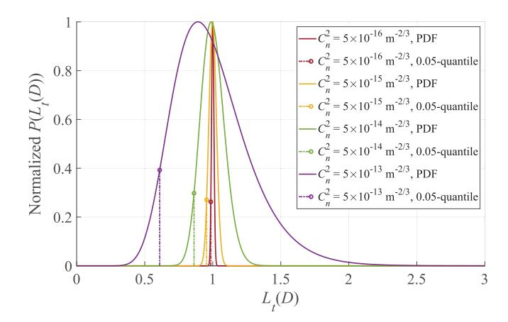

Fig. 4. Normalized PDF and 0.05-lower quantiles of scintillation  $L_t\left(D\right)$  versus different scintillation index with D=50 m and  $\lambda=905$  nm.

#### A. Joint Optimization for Resource Allocation

As described in (30) and (36), the C&S performance metrics of the EADO-OFDM scheme are the summation of those on each subcarrier, which belongs to either DCO-OFDM or ACO-OFDM. Therefore, the C&S performance metrics are decoupled for DCO-OFDM and ACO-OFDM, and we define a binary indicator  $u\left(k\right)$  for subcarrier assignment as

$$u(k) = \begin{cases} 1, & k \in \xi_A, \\ 0, & k \in \xi_D. \end{cases}$$
 (37)

Moreover, the stochastic part of channel gain, i.e., scintillation brought by atmospheric turbulence, can be replaced by an equivalent deterministic value to obtain a concise objective for the optimization problem. Since the performance degradation brought by atmospheric turbulence is inevitable,  $L_t\left(D\right)$  is substituted by its 0.05-lower quantile  $\tilde{L}_t\left(D\right)$  to obtain the desired communication performance metric at a probability of larger than 95%, i.e.,

$$\int_{0}^{\tilde{L}_{t}(D)} p(l_{t}) dl_{t} = 0.05.$$
 (38)

As illustrated in Fig. 4, substituting  $L_t(D)$  with  $\tilde{L}_t(D)$  is a conservative approximation, and the deterministic channel gain  $\tilde{H}_c = G_c L_a(D) \tilde{L}_t(D) L_g(D)$  becomes even smaller for a stronger turbulence with a larger  $C_n^2$ . Additionally, this approximation is also applicable to the atmospheric turbulence in the sensing channel, and the deterministic channel gain for sensing is calculated as  $\tilde{H}_s = \Re G_s L_a(2D) \tilde{L}_t(2D) L_g(2D)$ .

Thereby, a deterministic objective that involves both the spectral efficiency for communication and the Fisher information for sensing is derived by the weighted-sum method, i.e., to linearly aggregate C&S performance metrics with a weight factor  $\rho$ . Moreover, since the C&S performance metrics are different in their dimensions, they are normalized by reference values  $C_0$  and  $I_0$  according to the desired C&S performance. In consequence, the complete expression for the objective  $\Xi$  is given by (39), shown at the bottom of the page. For notational convenience,  $\tilde{C}_D$  and  $\tilde{C}_A$  are the spectral efficiencies of DCO and ACO components, respectively. Meanwhile,  $\tilde{I}_D$  and  $\tilde{I}_A$  denote the Fisher information of DCO and ACO components, respectively.

The joint optimization problem is to maximize  $\Xi$  under the constraints of power allocation and subcarrier assignment, i.e.,

(P0): 
$$\max_{\substack{\lambda_{b}, \sigma_{D}, \sigma_{A}, \\ u(k), \tilde{P}(k)}} \Xi\left(\lambda_{b}, \sigma_{D}, \sigma_{A}, u\left(k\right), \tilde{P}\left(k\right)\right), \tag{40a}$$

s.t. 
$$P_o(\lambda_b, \sigma_D, \sigma_A) \le P_{o.m},$$
 (40b)

$$P_e(\lambda_b, \sigma_D, \sigma_A) \le P_{e,m},$$
 (40c)

$$\sigma_D \ge \sigma_{D,l},$$
 (40d)

$$\sigma_A \ge \sigma_{A,l},$$
 (40e)

$$u(k) \in \{0, 1\},$$
 (40f)

$$u(k) = 0, \ k \equiv 0 \pmod{2}, \tag{40g}$$

$$\tilde{P}_{l} \le \tilde{P}\left(k\right) \le \tilde{P}_{u},\tag{40h}$$

$$\sum_{k \in \mathcal{E}} (1 - u(k)) \, \tilde{P}(k) = \frac{1}{2},\tag{40i}$$

$$\sum_{k \in \xi} u(k) \tilde{P}(k) = \frac{1}{2}, \tag{40j}$$

$$\Xi\left(\lambda_{b}, \sigma_{D}, \sigma_{A}, u\left(k\right), \tilde{P}\left(k\right)\right) \\
= \frac{\rho}{C_{0}}\left(\tilde{C}_{D} + \tilde{C}_{A}\right) + \frac{1 - \rho}{I_{0}}\left(\tilde{I}_{D} + \tilde{I}_{A}\right) \\
= \frac{\rho}{C_{0}}\left(\frac{1}{N}\sum_{k \in \xi} \log\left(1 + \frac{N\tilde{H}_{c}^{2}\mathcal{K}_{D}^{2}\left(\lambda_{b}\right)\sigma_{D}^{2}\left(1 - u\left(k\right)\right)\tilde{P}\left(k\right)}{\tilde{H}_{c}^{2}P_{v_{D}}\left(k\right) + N\Delta f N_{c}}\right) + \underbrace{\frac{1}{N}\sum_{k \in \xi} \log\left(1 + \frac{N\tilde{H}_{c}^{2}\mathcal{K}_{A}^{2}\sigma_{A}^{2}u\left(k\right)\tilde{P}\left(k\right)}{\tilde{H}_{c}^{2}P_{v_{D}}\left(k\right) + N\Delta f N_{c}}\right)}_{\tilde{C}_{D}\left(\lambda_{b}, \sigma_{D}, u\left(k\right), \tilde{P}\left(k\right)\right)} + \underbrace{\frac{1}{N}\sum_{k \in \xi} \log\left(1 + \frac{N\tilde{H}_{c}^{2}\mathcal{K}_{A}^{2}\sigma_{A}^{2}u\left(k\right)\tilde{P}\left(k\right)}{\tilde{H}_{c}^{2}P_{v_{D}}\left(k\right) + N\Delta f N_{c}}\right)}_{\tilde{C}_{D}\left(\lambda_{b}, \sigma_{D}, u\left(k\right), \tilde{P}\left(k\right)\right)} + \underbrace{\frac{1}{N}\sum_{k \in \xi} \log\left(1 + \frac{N\tilde{H}_{c}^{2}\mathcal{K}_{A}^{2}\sigma_{A}^{2}u\left(k\right)\tilde{P}\left(k\right)}{\tilde{H}_{c}^{2}P_{v_{D}}\left(k\right) + N\Delta f N_{c}}\right)}_{\tilde{L}_{D}\left(\lambda_{b}, \sigma_{D}, u\left(k\right), \tilde{P}\left(k\right)\right)} + \underbrace{\frac{1}{N}\sum_{k \in \xi} \log\left(1 + \frac{N\tilde{H}_{c}^{2}\mathcal{K}_{A}^{2}\sigma_{A}^{2}u\left(k\right)\tilde{P}\left(k\right)}{\tilde{H}_{c}^{2}P_{v_{D}}\left(k\right) + N\Delta f N_{c}}\right)}_{\tilde{L}_{D}\left(\lambda_{b}, \sigma_{D}, u\left(k\right), \tilde{P}\left(k\right)\right)} + \underbrace{\frac{1}{N}\sum_{k \in \xi} \log\left(1 + \frac{N\tilde{H}_{c}^{2}\mathcal{K}_{A}^{2}\sigma_{A}^{2}u\left(k\right)\tilde{P}\left(k\right)}{\tilde{H}_{c}^{2}P_{v_{D}}\left(k\right) + N\Delta f N_{c}}\right)}_{\tilde{L}_{D}\left(\lambda_{b}, \sigma_{D}, u\left(k\right), \tilde{P}\left(k\right)\right)} + \underbrace{\frac{1}{N}\sum_{k \in \xi} \frac{1}{N}\sum_{k \in \xi} \frac{1}{N}\tilde{H}_{c}^{2}\mathcal{K}_{A}^{2}\sigma_{A}^{2}u\left(k\right)\tilde{P}\left(k\right)}{\tilde{H}_{c}^{2}\left(P_{v_{D}}\left(k\right) + P_{v_{A}}\left(k\right)\right) + N\Delta f N_{c}}}\right)}_{\tilde{L}_{D}\left(\lambda_{b}, \sigma_{D}, u\left(k\right), \tilde{P}\left(k\right)\right)} + \underbrace{\frac{1}{N}\sum_{k \in \xi} \frac{1}{N}\sum_{k \in \xi} \frac{1}{N}\tilde{H}_{c}^{2}\mathcal{K}_{A}^{2}\sigma_{A}^{2}u\left(k\right)\tilde{P}\left(k\right)}{\tilde{L}_{D}\left(\lambda_{b}, \sigma_{D}, u\left(k\right), \tilde{P}\left(k\right)\right)}}_{\tilde{L}_{D}\left(\lambda_{b}, \sigma_{D}, u\left(k\right), \tilde{P}\left(k\right)\right)} + \underbrace{\frac{1}{N}\sum_{k \in \xi} \frac{1}{N}\sum_{k \in \xi} \frac{1}{N}\tilde{H}_{c}^{2}\mathcal{K}_{A}^{2}\sigma_{A}^{2}u\left(k\right)\tilde{P}\left(k\right)}{\tilde{L}_{D}^{2}\left(\lambda_{b}, \sigma_{D}, u\left(k\right), \tilde{P}\left(k\right)\right)}_{\tilde{L}_{D}\left(\lambda_{b}, \sigma_{D}, u\left(k\right), \tilde{P}\left(k\right)\right)}}_{\tilde{L}_{D}\left(\lambda_{b}, \sigma_{D}, u\left(k\right), \tilde{P}\left(k\right)\right)}}_{\tilde{L}_{D}\left(\lambda_{b}, \sigma_{D}, u\left(k\right), \tilde{P}\left(k\right)\right)}_{\tilde{L}_{D}\left(\lambda_{b}, \sigma_{D}, u\left(k\right), \tilde{P}\left(k\right)\right)}_{\tilde{L}_{D}\left(\lambda_{b}, \sigma_{D}, u\left(k\right), \tilde{P}\left(k\right)\right)}_{\tilde{L}_{D}\left(\lambda_{b}, \sigma_{D}, u\left(k\right), \tilde{P}\left(k\right)\right)}_{\tilde{L}_{D}\left(\lambda_{b}, u\left(k\right), \tilde{L}_{D}^{2}\left(\lambda_{b}, u\left(k\right), \tilde{L}_{D}^{2}\left(\lambda_{b}, u\left(k\right), \tilde{L}_{D}^{$$

{7}------------------------------------------------

Specifically, the constraints can be categorized as follows.

- 1) Total Power Constraints: The constraints (40b) and (40c) restrict the optical and electrical power to be smaller than  $P_{o,m}$  and  $P_{e,m}$ , respectively. Meanwhile, the constraints (40d) and (40e) correspond to the lower bounds of  $\sigma_D$  and  $\sigma_A$ , respectively.
- 2) Subcarrier Assignment Constraints: The constraint (40f) holds since u(k) is binary, while the constraint (40g) is equivalent to those in (9).
- 3) Subcarrier Power Allocation Constraints: The constraint (40h) restricts the normalized power allocation for each subcarrier to be larger than  $\tilde{P}_l < 1/N$  and also imposes an extra upper bound of  $\tilde{P}_u > 2/(N-4)$  for a more intuitive result. Additionally, constraints (40i) and (40j) correspond to the definitions in (13).

Unfortunately, (P0) is a non-convex problem with both continuous variables and discrete variables. The main challenge of solving (P0) lies in that its variables are coupled in both the objective and the constraints, which disrupts the convexity of the whole problem. Towards this end, we decompose (P0) into three sub-problems, i.e., DCO-ACO power distribution as (P1), subcarrier assignment as (P2), and subcarrier power allocation as (P3), which can be solved by the BCD algorithm iteratively. The three sub-problems with simplified formulations are elaborated as follows.

#### B. DCO-ACO Power Distribution

Given fixed  $u\left(k\right)$  and  $\tilde{P}\left(k\right)$ , the sub-problem for DCO-ACO power distribution optimizes the power of DCO-OFDM and ACO-OFDM under the total power constraints, which is formulated as

(P1): 
$$\max_{\lambda_b, \sigma_D, \sigma_A} \Xi(\lambda_b, \sigma_D, \sigma_A),$$
  
s.t. (40b), (40c), (40d), (40e). (41)

Since the normalized DC bias  $\lambda_b$  is still coupled with  $\sigma_D$  and  $\sigma_A$ , (P1) should be further decomposed to optimize  $\lambda_b$  and other variables separately. Specifically, the sub-problem for  $\lambda_b$  is written as

(P1-1): 
$$\max_{\lambda_b} \Xi(\lambda_b)$$
,  
s.t. (40b), (40c), (42)

which returns to a sole optimization of DC bias in DCO-OFDM. Since the unimodality of SNDR with respect to (w.r.t.)  $\lambda_b$  has been proven in [30], the golden section method can achieve the optimal solution to (P1-1). Meanwhile, the following proposition indicates the convexity of the constraints.

Proposition 1: Given fixed  $\lambda_b$ , the feasible set formulated by (40b), (40c), (40d), and (40e) is a convex set of  $(\sigma_D, \sigma_A)$ .

Proof: See Appendix B.

Thereby, we adopt the sequential convex programming (SCP) algorithm to tackle the nonconcavity of  $\Xi$  w.r.t.  $\sigma_D$  and  $\sigma_A$ . Supposing that the initial values in the (l+1)-th SCP iteration are  $\sigma_D^{(l)}$  and  $\sigma_A^{(l)}$ , the surrogate objective function (43), shown at the bottom of the next page, is the first-order

Taylor expansion of  $\Xi(\sigma_D, \sigma_A)$ , in which auxilliary variables are defined as

$$\mu_{c}(k) = \frac{N\tilde{H}_{c}^{2}\mathcal{K}_{D}^{2}(\lambda_{b})(1 - u(k))\tilde{P}(k)}{\tilde{H}_{c}^{2}P_{v_{D}}(k) + N\Delta f N_{c}} + \frac{N\tilde{H}_{c}^{2}\mathcal{K}_{A}^{2}u(k)\tilde{P}(k)}{\tilde{H}_{c}^{2}P_{v_{D}}(k) + N\Delta f N_{c}},$$

$$\mu_{s}(k) = \frac{N\tilde{H}_{s}^{2}\mathcal{K}_{D}^{2}(\lambda_{b})(1 - u(k))\tilde{P}(k)}{\tilde{H}_{s}^{2}(P_{v_{D}}(k) + P_{v_{A}}(k)) + N\Delta f N_{s}} + \frac{N\tilde{H}_{s}^{2}\mathcal{K}_{A}^{2}u(k)\tilde{P}(k)}{\tilde{H}_{s}^{2}(P_{v_{D}}(k) + P_{v_{A}}(k)) + N\Delta f N_{s}}.$$

$$(44a)$$

As a result, the relaxed sub-problem for variances of DCO and ACO components is given by

(P1-2): 
$$\max_{\sigma_D, \sigma_A} \mathcal{Z}\left(\sigma_D, \sigma_A | \sigma_D^{(l)}, \sigma_A^{(l)}\right),$$
  
s.t. (40b), (40c), (40d), (40e). (45)

According to *Proposition 1*, (P1-2) is to maximize an affine objective in a convex feasible set, which is solvable by convex optimization algorithms like the primal-dual interiorpoint method (IPM).

#### C. Subcarrier Assignment

The sub-problem for subcarrier assignment adaptively assigns subcarriers between DCO-OFDM and ACO-OFDM, thus optimizing C&S performance metrics. Considering the subcarrier assignment constraints, the sub-problem is formulated as

(P2): 
$$\max_{u(k)} \Xi(u(k))$$
,  
s.t. (40f), (40g), (40i), (40j), (46)

which is a combinatorial optimization problem with binary variables. Towards this end, by adding a quadratic penalty term that is defined as

$$\Pi\left(u\left(k\right)\right) = \sum_{k \in \mathcal{E}} u\left(k\right) \left(u\left(k\right) - 1\right),\tag{47}$$

the binary constraint (40f) can be relaxed as  $0 \le u(k) \le 1$ . However, as  $\Pi\left(u(k)\right)$  is a convex function of u(k), maximizing  $\Pi$  still elicits a non-convex optimization problem. To tackle this, the SCP algorithm is also adopted. Denoting the value of u(k) in the l-th SCP iteration as  $u^{(l)}(k)$ , the surrogate penalty term is defined as

$$\tilde{\Pi}\left(u(k)|u^{(l)}(k)\right) = \sum_{k \in \mathcal{E}} \left(u(k)\left(2u^{(l)}(k) - 1\right) - \left(u^{(l)}(k)\right)^{2}\right). \tag{48}$$

Based on the relaxed penalty term in (48), (P2) can be recast as a continuous optimization problem, i.e.,

(P2-1): 
$$\max_{u(k)} \Xi(u(k)) + \varrho^{(l)} \tilde{\Pi}\left(u(k) | u^{(l)}(k)\right),$$
  
s.t.  $0 \le u(k) \le 1,$   
(40g), (40i), (40j), (49a)

{8}------------------------------------------------

where the penalty coefficient  $\varrho^{(l)}$  grows exponentially as the SCP iteration proceeds, e.g.  $\rho^{(l+1)}=2\rho^{(l)}$ . In terms of u(k), the objective in (P2-1) is concave. Besides, since constraints (40g), (40i), (40j), and (49a) are all affine, (P2-1) is to maximize a concave function under affine constraints, which is also solvable by IPM.

#### D. Subcarrier Power Allocation

The sub-problem for subcarrier power allocation optimizes the normalized power on each subcarrier within the power budgets of both DCO-OFDM and ACO-OFDM, which is formulated as

(P3): 
$$\max_{\tilde{P}(k)} \ \Xi\left(\tilde{P}(k)\right)$$
,  
s.t. (40h), (40i), (40j). (50)

Since the C&S performance metrics are decoupled for DCO-OFDM and ACO-OFDM, the power allocation problems for subcarriers in  $\xi_D$  and  $\xi_A$  are also independent from each other. The subcarrier power allocation problem for DCO-OFDM, i.e.,  $k \in \xi_D$ , is written as

(P3-D): 
$$\max_{\tilde{P}(k)} \Xi_D \left( \tilde{P}(k) \right) = \frac{\rho \tilde{C}_D}{C_0} + \frac{(1-\rho)\tilde{I}_D}{I_0},$$
s.t. (40h), (40i). (51)

As indicated by (39), the objective  $\Xi_D$  is a concave function of  $\tilde{P}(k)$ . In addition, both (40h) and (40i) are affine constraints on  $\tilde{P}(k)$ . Hence, (P3-D) is a convex optimization problem, whose closed-form solution is given by Karush-Kuhn-Tucker (KKT) conditions as

$$\tilde{P}^*\left(k\right) = \frac{1}{\psi\left(\eta^*, k\right)} - \frac{1}{\gamma_c\left(k\right)},\tag{52}$$

where the auxilliary function  $\psi(\eta, k)$  is defined as

$$\psi\left(\eta,k\right) = \min\left\{\max\left\{\frac{C_0}{\rho}\left(\eta - \frac{\left(1 - \rho\right)k^2\gamma_s\left(k\right)}{I_0}\right), \frac{\gamma_c\left(k\right)}{\gamma_c\left(k\right)\tilde{P}_u + 1}\right\}, \frac{\gamma_c\left(k\right)}{\gamma_c\left(k\right)\tilde{P}_l + 1}\right\}, (53)$$

and the optimal dual variable  $\eta^*$  is the solution to

$$\sum_{k \in \mathcal{E}_{D}} \left( \frac{1}{\psi\left(\eta^{*}, k\right)} - \frac{1}{\gamma_{c}\left(k\right)} \right) = \frac{1}{2}.$$
 (54)

By defining

$$\eta_{\min} = \frac{1 - \rho}{I_0} \min_{k \in \mathcal{E}_D} \left\{ k^2 \gamma_s \left( k \right) \right\}, \tag{55a}$$

$$\eta_{\max} = \max_{k \in \xi_D} \left\{ \frac{\rho \gamma_c(k)}{C_0} + \frac{(1-\rho) k^2 \gamma_s(k)}{I_0} \right\}, \quad (55b)$$

we assert the existence of  $\eta^*$  on  $[\eta_{\min}, \eta_{\max}]$  by the Intermediate Value property [42], i.e.,

$$\lim_{\eta \to \eta_{\min}^{+}} \sum_{k \in \xi_{D}} \left( \frac{1}{\psi\left(\eta, k\right)} - \frac{1}{\gamma_{D, c}\left(k\right)} \right) \ge \frac{\left(N - 4\right)\tilde{P}_{u}}{4} > \frac{1}{2},$$
(56a)

$$\lim_{\eta \to \eta_{\max}^{-}} \sum_{k \in \xi_{D}} \left( \frac{1}{\psi\left(\eta,k\right)} - \frac{1}{\gamma_{D,c}\left(k\right)} \right) \leq \frac{\left(N-2\right)\tilde{P}_{l}}{2} < \frac{1}{2}. \tag{56b}$$

Moreover, since  $\psi\left(\eta,k\right)$  is a non-decreasing function of  $\eta$ , the bisection method can be adopted to obtain the optimal dual variable  $\eta^*$  on  $[\eta_{\min},\eta_{\max}]$ .

Similarly, the power allocation problem for ACO-OFDM is formulated as

(P3-A): 
$$\max_{\tilde{P}(k)} \Xi_A \left( \tilde{P}(k) \right) = \frac{\rho \tilde{C}_A}{C_0} + \frac{(1-\rho)\tilde{I}_A}{I_0},$$
  
s.t. (40h), (40j). (57)

The problem (P3-A) is also convex due to its concave objective and affine constraints. By substituting  $\xi_D$ ,  $\gamma_{D,c}(k)$ , and  $\gamma_{D,s}(k)$  in (P3-D) with  $\xi_A$ ,  $\gamma_{A,c}(k)$ , and  $\gamma_{A,s}(k)$ , the bisection method is also applicable to (P3-A). Once the power allocations for both DCO-OFDM and ACO-OFDM are optimized, (P3) will also be readily solved.

## E. Optimality and Computational Complexity Analysis

Once the three sub-problems are elaborated, the joint optimization problem is solved by the BCD algorithm, as summarized in Algorithm 1. Note that since numerical integrals are utilized in (19) to obtain the PSD of the clipping noise,  $P_{v_D}(k)$  and  $P_{v_A}(k)$  are regarded as constants when solving sub-problems, and their values are updated only at the beginning of each BCD iteration. In addition, the solution achieved by the BCD algorithm is sub-optimal due to the convex relaxation inside sub-problems. For further improvement of optimality, one can conduct the BCD algorithm for several times with different initial points and pick out the largest objective among these solutions. Another trick is to record the solutions in various BCD iterations and select an optimal one from them. In consequence, these techniques are viable if free computational or storage resources are available in the OW-ISAC system.

Moreover, the computational complexity of the BCD algorithm mainly consists in the three sub-problems.

$$\Xi\left(\sigma_{D}, \sigma_{A} | \sigma_{D}^{(l)}, \sigma_{A}^{(l)}\right) \\
= \frac{\rho}{C_{0}N} \sum_{k \in \xi} \left(\frac{2\mu_{c}(k) \, \sigma_{D}^{(l)}}{1 + \mu_{c}(k) \, \sigma_{D}^{(l)2}} \left(\sigma_{D} - \sigma_{D}^{(l)}\right) + \frac{2\mu_{c}(k) \, \sigma_{A}^{(l)}}{1 + \mu_{c}(k) \, \sigma_{A}^{(l)2}} \left(\sigma_{A} - \sigma_{A}^{(l)}\right)\right) \\
+ \frac{8\pi^{2} \, (1 - \rho)}{I_{0}NT^{2}} \sum_{k \in \xi} 2k^{2} \mu_{s}(k) \left(\sigma_{D}^{(l)} \left(\sigma_{D} - \sigma_{D}^{(l)}\right) + \sigma_{A}^{(l)} \left(\sigma_{A} - \sigma_{A}^{(l)}\right)\right) + \Xi\left(\sigma_{D}^{(l)}, \sigma_{A}^{(l)}\right). \tag{43}$$

{9}------------------------------------------------

# Algorithm 1 BCD Algorithm for Joint Optimization of Resource Allocation for EADO-OFDM

**Input:** Tolerance  $\epsilon_{\Xi}$ . Initial solution  $\lambda_b^{(0)}$ ,  $\sigma_D^{(0)}$ ,  $\sigma_A^{(0)}$ ,  $u^{(0)}(k)$ , and  $\tilde{P}^{(0)}(k)$ .

**Output:** Sub-optimal solution  $\lambda_b^*$ ,  $\sigma_D^*$ ,  $\sigma_A^*$ ,  $u^*(k)$ , and  $\tilde{P}^*(k)$ to the joint optimization problem.

- 1:  $i \leftarrow 0, \, \Xi^{(0)} \leftarrow 0$ .

- 2: **while**  $|\Xi^{(i+1)} \Xi^{(i)}| \ge \epsilon_{\Xi}$  **do** 3: Update  $P_{v_D}^{(i)}(k)$  and  $P_{v_A}^{(i)}(k)$  through (22). 4: Given  $\sigma_D^{(i)}$ ,  $\sigma_A^{(i)}$ ,  $u^{(i)}(k)$ , and  $\tilde{P}^{(i)}(k)$ , solve (P1-1) with the golden section method to obtain  $\lambda_b^{(i+1)}$ .
- Given  $\lambda_b^{(i+1)}$ ,  $u^{(i)}(k)$ , and  $\tilde{P}^{(i)}(k)$ , solve (P1-2) with the SCP method to obtain  $\sigma_D^{(i+1)}$  and  $\sigma_A^{(i+1)}$ . 5:
- Given  $\lambda_b^{(i+1)}$ ,  $\sigma_D^{(i+1)}$ ,  $\sigma_A^{(i+1)}$ , and  $\tilde{P}^{(i)}(k)$ , solve (P2-1) 6:
- with the SCP method to obtain  $u^{(i+1)}(k)$ . Given  $\lambda_b^{(i+1)}$ ,  $\sigma_D^{(i+1)}$ ,  $\sigma_A^{(i+1)}$ , and  $u^{(i+1)}(k)$ , solve (P3-7: D) and (P3-A) with the bisection method to obtain  $\tilde{P}^{(i+1)}(k)$  and  $\Xi^{(i+1)}$ .
- $i \leftarrow i + 1$ .
- 9: end while
- 10:  $\lambda_{b}^{*} \leftarrow b^{(i)}, \sigma_{D}^{*} \leftarrow \sigma_{D}^{(i)}, \sigma_{A}^{*} \leftarrow \sigma_{A}^{(i)}, u^{*}(k) \leftarrow u^{(i)}(k),$   $\tilde{P}^{*}(k) \leftarrow \tilde{P}^{(i)}(k).$ 
  - 1) DCO-ACO power distribution: The computational complexity of (P1) mainly consists in the golden section method for (P1-1) and the SCP for (P1-2). Denoting the error threshold for the golden section method as  $\varepsilon_{\lambda_h}$ , the computational complexity for (P1-1) is  $\mathcal{O}(\log(1/\varepsilon_{\lambda_h}))$ . In addition, the computational complexity of IPM grows at a rate proportional to the 3.5-th power of the amount of variables [43]. Therefore, supposing that the SCP takes  $K_1$  rounds to converge, the computational complexity for (P1-2) is  $\mathcal{O}(K_1 2^{3.5} \log (\varepsilon_I))$ , in which  $\varepsilon_I$  denotes the error threshold for IPM. Besides, the total computational complexity for (P1) is  $\omega_1$  =  $\mathcal{O}\left(\log\left(1/\varepsilon_{\lambda_b}\right) + K_1 2^{3.5} \log\left(1/\varepsilon_I\right)\right).$
  - 2) Subcarrier Assignment: Supposing that  $K_2$  ascending values of  $\varrho$  are selected for (P2-1), the computational complexity for solving (P2-1) is  $\omega_2$  $\mathcal{O}\left(K_2N^{3.5}\log\left(1/\varepsilon_I\right)\right)$  since the number of subcarriers to be assigned grows linearly with N.
  - 3) Subcarrier Power Allocation: The bisection method achieves a desired precision  $\varepsilon_B$  within  $\log(1/\varepsilon_B)$  iterations, while the complexity of calculating  $\Xi_D$  and  $\Xi_A$ grows linearly with N. As a result, the complexity for (P3) is  $\omega_3 = \mathcal{O}(N \log(1/\varepsilon_B))$ .
    - In summary, assuming that  $K_0$  iterations of the proposed BCD algorithm are conducted, the total complexity to solve (P0) is  $\omega_0 = \mathcal{O}(K_0(\omega_1 + \omega_2 + \omega_3))$ .

### V. NUMERICAL RESULTS

This section provides extensive simulation results of the proposed OW-ISAC scheme based on EADO-OFDM. As illustrated in Fig. 1, the OW-ISAC transceiver adopts a 905-nm LiDAR to conduct simultaneous C&S with the cooperative target at a distance of 50 m. Considering the similarities

TABLE I SIMULATION CONFIGURATIONS

| Parameter                     | Notation        | Value                                |
|-------------------------------|-----------------|--------------------------------------|
| Subcarriers in an OFDM symbol | N               | 1024                                 |
| Subcarrier spacing            | $\Delta f$      | 195.3 kHz                            |
| Length of a guard interval    | $n_g$           | 256                                  |
| Duration of a guard interval  | $\tau_g$        | 1280 ns                              |
| Duration of an OFDM symbol    | T               | 5120 ns                              |
| Sampling rate                 | $R_s$           | 200 MHz                              |
| Maximum electrical power      | $P_{e,m}$       | 0.5 W                                |
| Maximum optical power         | $P_{o,m}$       | 1 W                                  |
| Maximum normalized power      | $\tilde{P}_{n}$ | $5 \times 10^{-3}$                   |
| Minimum normalized power      | $	ilde{P_l}$    | $5 \times 10^{-4}$                   |
| Reference spectral efficiency | $C_0$           | 5 bps/Hz                             |
| Reference precision           | $c/2\sqrt{I_0}$ | 3 cm                                 |
| Target distance               | D               | 50 m                                 |
| Optical wavelength            | λ               | 905 nm                               |
| Speed of light                | c               | $3 \times 10^8$ m/s                  |
| Atmospheric attenuation       | $\beta_a$       | -12.8 dB/km                          |
| Refractive index              | $C_n^2$         | $5 \times 10^{-14} \text{ m}^{-2/3}$ |
| Beam divergence angle         | $\theta$        | 0.5 mrad                             |
| Receiver aperture             | $A_c$           | 10 cm 2                   |
| Target reflectivity           | R               | 0.5                                  |
| Combined coefficients         | $G_c, G_s$      | 10,10                                |

in scenarios, we refer to IEEE 802.15.13-2023 [44] for parameters of the proposed optical OFDM scheme and Rec. ITU-R P.1817-1 [45] for atmospheric propagation data, as shown in Table I. Consequently, the stationary part of the channel gain can be calculated as  $H_c/L_t(D) = -3.57$  dB for communication and  $H_s/L_t(2D) = -10.23$  dB for sensing. Besides, equivalent quantiles for scintillation terms can be calculated as  $\tilde{L}_t(D) = -0.64$  dB and  $\tilde{L}_t(2D) = -1.24$  dB, respectively. Once the system parameters are established, the resource allocation for EADO-OFDM is first optimized in Section V-A, and then various communication and sensing performance metrics are provided in Sections V-B and V-C, respectively.

#### A. Optimal Resource Allocation for EADO-OFDM

The definition of power allocation P(k) combines the results of DCO-ACO power distribution, subcarrier assignment, and subcarrier power allocation, i.e.,

$$P(k) = \begin{cases} \sigma_D^2 \tilde{P}(k), & k \in \xi_D, \\ \sigma_A^2 \tilde{P}(k), & k \in \xi_A, \end{cases}$$
 (58)

which is illustrated in Fig. 5 w.r.t. different weight factors and noise PSDs.

For the subcarrier assignment, DCO-OFDM occupies odd subcarriers with higher normalized frequency besides even subcarriers, since assigning an original ACO-OFDM subcarrier to DCO-OFDM increases its contribution to SNDRs from  $\mathcal{K}_A^2$  to  $\mathcal{K}_D^2$ . However, enlarging the DCO-OFDM subcarrier set reduces the average power allocated to each subcarrier in  $\xi_D$ , while the average power in  $\xi_A$  is also increased. Consequently, the subcarrier assignment makes a compromise between DCO-OFDM and ACO-OFDM, while ACO-OFDM

{10}------------------------------------------------

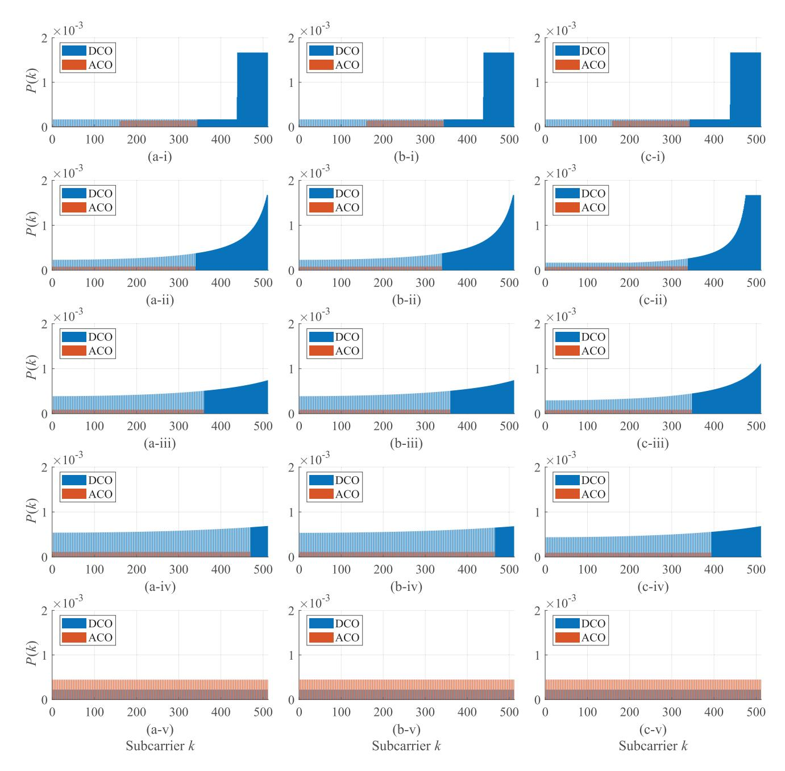

Fig. 5. Power allocation and subcarrier assignment results. The noise PSD for each column is (a) Nc = −117 dB/Hz, Ns = −120 dB/Hz, (b) Nc = −120 dB/Hz, Ns = −120 dB/Hz, and (c) Nc = −120 dB/Hz, Ns = −117 dB/Hz. Rows (i) to (v) correspond to weight factors of ρ = 0.00, 0.25, 0.50, 0.75, and 1.00, respectively.

still occupies subcarriers with lower normalized frequency. Nevertheless, a special case occurs in a pure communication system, i.e., ρ = 1.00, where ACO-OFDM occupies all of the odd subcarriers. As a result, the SNDRs on ACO subcarriers are significantly improved due to the complete elimination of the interference from DCO-OFDM, thus contributing to a higher spectral efficiency in high-SNR scenarios.

For the power allocation, Fig. [5](#page-10-0) shows a smooth change from the sensing-centric scenario of ρ = 0.00 to the communication-centric scenario of ρ = 1.00. A sensingcentric system allocates power to subcarriers with a higher normalized frequency to maximize the Fisher information, while the optimal power allocation of a communication-centric system is in a water-filling form. For the trade-off scenarios of 0 < ρ < 1, the power allocation bars can be viewed as a curved surface, whose curvature can be increased to improve the sensing performance. In addition, the DCO component takes up much more power than that of the ACO component when the Fisher information is incorporated into the objective, i.e., ρ < 1. The reason lies in that allocating part of the odd subcarriers to the DCO component disrupts the sole existence of the clipping noise on even subcarriers, and the power of the ACO component is reduced to mitigate the detrimental effects of error propagation. On the contrary, a pure

{11}------------------------------------------------

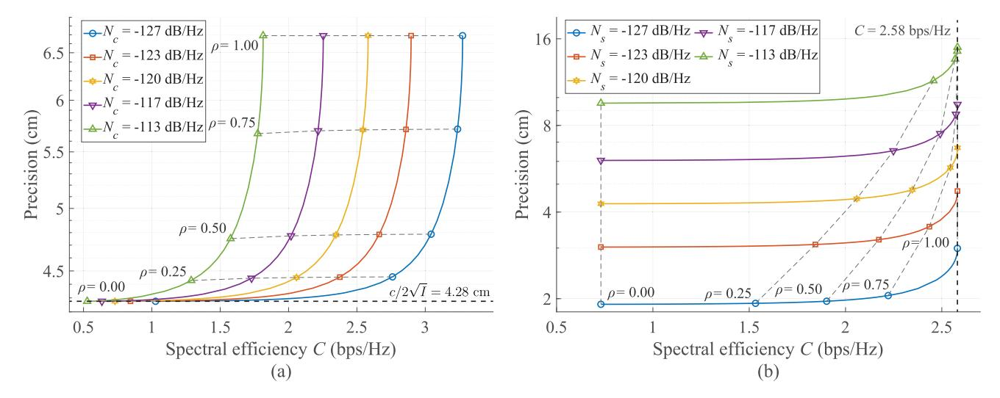

Fig. 6. Trade-off curves of C&S performance metrics. (a) Spectral efficiency and precision w.r.t. communication noise PSD for Ns = −120 dB/Hz. (b) Spectral efficiency and precision w.r.t. sensing noise PSD for Nc = −120 dB/Hz.

communication system does not assign odd subcarriers to DCO-OFDM, yielding higher SNDRs on ACO subcarriers than those on DCO subcarriers. As a result, the ACO component is allocated with larger power than that of the DCO component in this anomalous case.

Once the optimal resource allocation is obtained, the spectral efficiency can be calculated by [\(30\),](#page-5-3) and the sensing precision is defined as c/2 √ I with the Fisher information calculated by [\(36\).](#page-5-4) By continuously tuning the value of ρ in [0, 1], the trade-off curve between C&S performance metrics can be calculated, as drawn in Fig. [6.](#page-11-1) Besides, the operation points in Fig. [5](#page-10-0) are also highlighted in Fig. [6](#page-11-1) with gray dashed lines displaying the contours of ρ. Since the communication sub-system always achieves a high SNR given the simulation parameters, a subtle change in Nc does not affect the resource allocation obviously once ρ is fixed. In consequence, the precision is insensitive to the varied value of Nc given fixed ρ, as illustrated in Fig. [6\(a\).](#page-11-1) On the contrary, Fig. [6\(b\)](#page-11-1) shows significant differences in the spectral efficiency when Ns is changed, which originates from the sensitivity of resource allocation to the varied value of Ns in the low-SNR region. Furthermore, although tuning the weight factor yields different performance metrics, all the trade-off curves become marginal when ρ is near 0.00 or 1.00. As ρ approaches 0.00, the precision is lower bounded by that of a pure sensing system, as displayed by the black dashed line in Fig. [6\(a\).](#page-11-1) Similarly, the spectral efficiency is upper bounded by that of a pure communication system when ρ approaches 1.00, as illustrated by the black dashed line in Fig. [6\(b\).](#page-11-1) Therefore, to efficiently balance C&S performance metrics, the weight factor should be kept far away from extreme values of 0.00 and 1.00.

# *B. Communication Performance Metrics*

Given the optimized resource allocation, the C&S performance of the proposed OW-ISAC system can be evaluated with various performance metrics. Without loss of generality, we set ρ = 0.50 to display the performance metrics in a tradeoff scenario, and 16 quadrature amplitude modulation (QAM) is selected as a representative for non-constant-modulus modulation schemes. For the communication sub-system, 104 independent EADO-OFDM symbols are simulated. In addition to the bit error rate (BER) metric, we also define a normalized mean square error (MSE) metric to capture the impact of symbol-level distortion, i.e.,

$$\varepsilon_X^2 = \frac{\mathbb{E}\left(|X(k) - \hat{X}_{SIC}(k)|^2\right)}{\mathbb{E}\left(|X(k)|^2\right)}.$$
 (59)

Since the communication performance metrics for DCO and ACO components of EADO-OFDM may differ much from each other, the BER and normalized MSE of DCO and ACO components w.r.t. electrical SNR for communication, i.e., SNRe,c = Pe/ (N∆fNc), are displayed separately in Fig. [7.](#page-12-1) The BER metric in Fig. [7\(a\)](#page-12-1) is positively related to the MSE metric in Fig. [7\(b\),](#page-12-1) unveiling the relationship between detection and estimation errors. Specifically, the errors between desired transmitted signal and actual received signal originate from the shot noise, thermal noise, and clipping noise simultaneously. As the electrical SNR increases, the clipping noise gradually becomes the dominant in SNDR, thus forming platforms in MSE curves. Nonetheless, the ACO component of ADO-OFDM is not disturbed by the clipping noise despite the varying DCO-ACO power allocation, whose MSE curve declines linearly w.r.t. the electrical SNR in Fig. [7\(b\).](#page-12-1) Consequently, ADO-OFDM is still a promising solution for a pure communication system, which corresponds to the results in Fig. [5.](#page-10-0) In contrast, since the communication performance of the ACO component is severely disturbed in EADO-OFDM, a low-order modulation scheme can be adopted to ensure its communication performance, e.g., binary phase shift keying (BPSK) for the ACO component of EADO-OFDM.

To reveal the relationship between communication performance and atmospheric turbulence, the BER curves of EADO-OFDM w.r.t. different scintillation indices are also illustrated in Fig. [8.](#page-12-2) Since the BER of DCO and ACO components may differ much from each other, we only display the BER of DCO components for consistency. As the

{12}------------------------------------------------

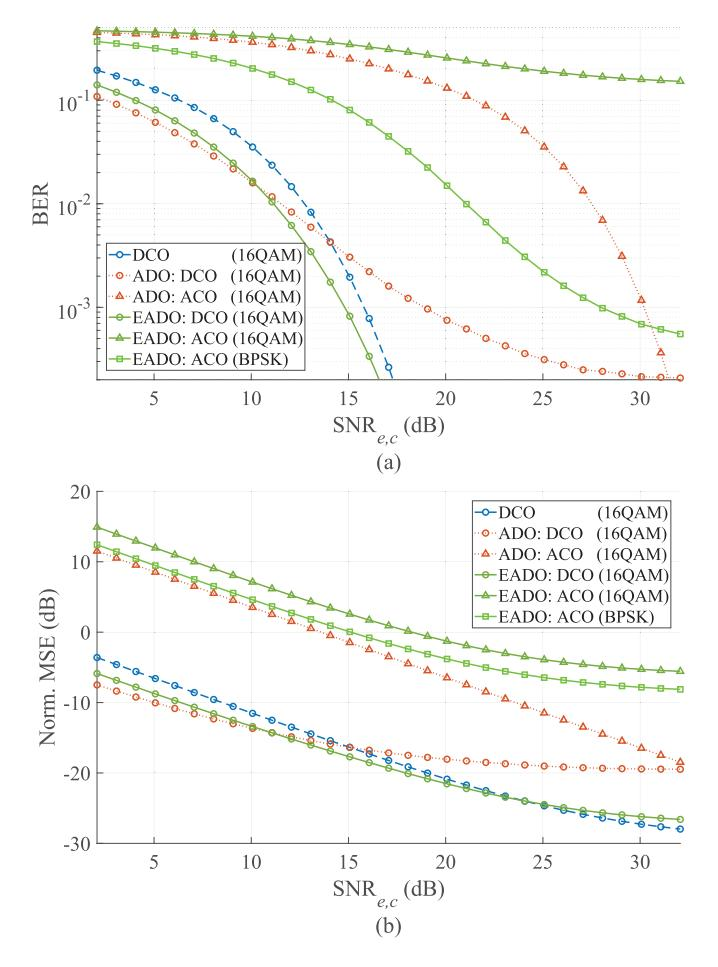

Fig. 7. BER and normalized MSE for communications w.r.t. different OFDM schemes. (a) BER versus electrical SNR. (b) Normalized MSE versus electrical SNR.

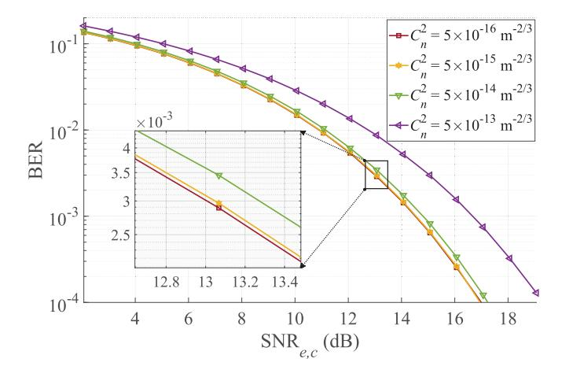

Fig. 8. BER for communication w.r.t. different scintillation indices.

scintillation index increases, the BER gradually deteriorates due to the enlarged flunctuations in light intensity. Moreover, the deterioration induced by the scintillation gets significant when  $C_n^2 \geq 5 \times 10^{-14} \ \mathrm{m}^{-2/3}$ , highlighting the influences of increased turbulence level.

#### C. Sensing Performance Metrics

Similar to its communication counterpart, the performance of the sensing sub-system is also evaluated by  $10^4$  Monte-

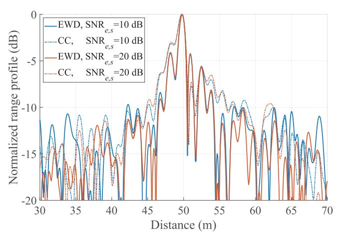

Fig. 9. Range profiles obtained by different methods under various electrical SNRs

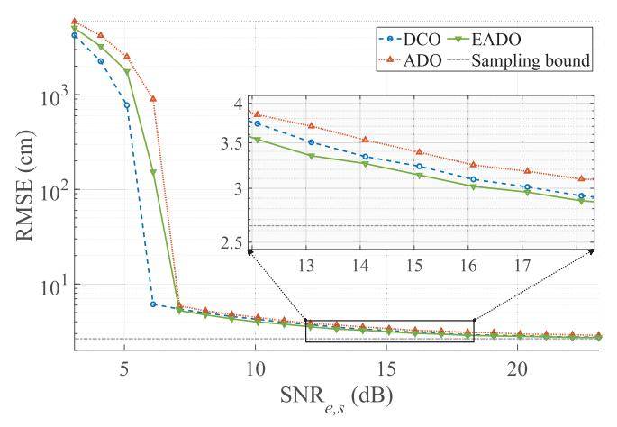

Fig. 10. RMSE for target distance estimation w.r.t. different OFDM schemes.

Carlo simulations. In addition, the electrical SNR for sensing is defined as  $P_e/(N\Delta f N_s)$ .

To highlight the effects of the non-constant-modulus modulation scheme, the range profiles obtained by different methods are displayed in Fig. 9, where we abbreviate element-wise division and cross correlation to EWD and CC, respectively. Even if the element-wise-division method obviates the detrimental effects of stochastic communication symbols, inevitable sidelobes still arise from the ubiquitous noise in the sensing sub-system. However, the element-wise-division method still achieves a lower level of the first sidelobe, which contributes to a more precise distance estimation under low SNRs.

The precision of target distance estimation is evaluated by the root-mean-square error (RMSE) that is defined as  $\varepsilon_D^2 = (\mathbb{E}(\hat{D}-D)^2)^{1/2}$ . The RMSE for target distance estimation is illustrated in Fig. 10, where we also draw the lower *sampling bound* for distance estimation [46]. On one hand, the EADO-OFDM scheme has a superior exploitation of high-frequency subcarriers that contribute more to distance estimation, thus outperforming the ADO-OFDM scheme in spectral efficiency for sensing. On the other hand, the EADO-OFDM scheme does not demand as large DC bias as that of

{13}------------------------------------------------

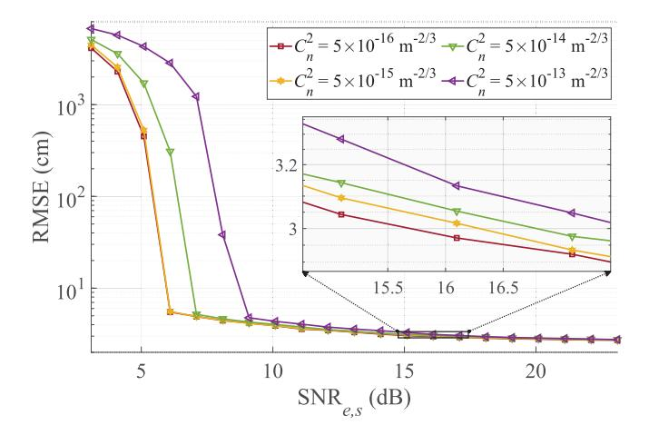

Fig. 11. RMSE for target distance estimation w.r.t. different scintillation indices

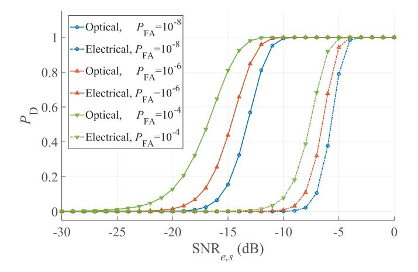

Fig. 12. Probabilities of detection and false alarm for EADO-OFDM system.

DCO-OFDM due to its smaller amount of DCO subcarriers. As a result, the EADO-OFDM scheme outperforms DCO-OFDM in power efficiency and achieves the minimum RMSE in the simulations.

The relationship between sensing performance and atmospheric turbulence is illustrated in Fig. 11. As the scintillation index increases, the RMSE curve demands a higher electrical SNR to approach the asymptotic region. However, once approaching the asymptotic region, the RMSE curve shows its marginality, and the influences of the scintillation index become negligible. In consequence, considering the performances in high SNR regions, the sensing sub-system is more robust than its communication counterpart.

Furthermore, the performance of detection is illustrated in Fig. 12. Specifically, we assert the presence of a target if the received optical or electrical power of an EADO-OFDM symbol exceeds a threshold. According to the simulation results, the optical power detector outperforms the electrical power detector despite the varying electrical SNRs or false alarm rate  $P_{FA}$ . The reason consists in that positive parts of the bipolar noise  $w_s(n)$  offset its negative parts in the optical power detector, while the optical power  $y_s(n)$  accumulates during

the summation, which highlights the necessity of exploiting the non-negative property of optical signal in OW-ISAC.

#### VI. CONCLUSION

In this paper, an EADO-OFDM scheme was proposed for OW-ISAC to provide simultaneous C&S capabilities. A generalized OW-ISAC framework was first established to describe the C&S working principles. Then, the EADO-OFDM signal was introduced, and its clipping noise was modelled by the Price theorem, which resulted in a generalized frequencyselective channel and a unified framework for optical OFDM. Subsequently, a joint optimization problem was formulated to adaptively balance C&S performance metrics. To tackle this complicated non-convex problem, the joint optimization was decomposed into three sub-problems for DCO-ACO power distribution, subcarrier assignment, and subcarrier power allocation, respectively, which was further solved iteratively by the BCD algorithm. Numerical simulations demonstrated the C&S abilities of the proposed scheme, while the C&S trade-off was also revealed during the resource allocation. In summary, the EADO-OFDM provided an efficient and flexible approach to OW-ISAC, which could met capricious C&S requirements in future optical wireless networks.

# APPENDIX A PROOF OF THEOREM 1

Regarding the clipping noise  $v_D(n)$  as the output of a memoryless non-linear system  $g(x) = \{x+b\}^+ - \mathcal{K}_D x$ , the second-order derivative of  $R_{v_D}(n)$  is given by the Price theorem as [47]

$$\frac{\partial^{2} R_{v_{D}}(n-m)}{\partial r^{2}} = \frac{\partial^{2} \mathbb{E}\left(g\left(x\left(m\right)\right)g\left(x\left(n\right)\right)\right)}{\partial r^{2}}$$

$$= \mathbb{E}\left(\frac{\partial^{4} g\left(x\left(m\right)\right)g\left(x\left(n\right)\right)}{\partial x\left(m\right)^{2} \partial x\left(n\right)^{2}}\right)$$

$$= \mathbb{E}\left(\frac{\partial^{2} g\left(x\left(m\right)\right)}{\partial x\left(m\right)^{2}} \frac{\partial^{2} g\left(x\left(n\right)\right)}{\partial x\left(n\right)^{2}}\right)$$

$$= \mathbb{E}\left(\delta\left(x\left(m\right) + b\right)\delta\left(x\left(n\right) + b\right)\right)$$

$$= \frac{1}{2\pi\sqrt{\sigma_{D}^{4} - r^{2}}} \exp\left(-\frac{b^{2}}{\sigma_{D}^{2} + r}\right), \quad (60)$$

where  $r=R_{v_{D}}\left(n\right)$  denotes the auto-correlation function of  $x_{D}\left(n\right)$ , and the notation  $\delta\left(x\right)$  is the Dirac delta function.

Calculating the indefinite integral yields the auto-correlation function of  $v_D(n)$  as

$$R_{v_D}(n) = \mathcal{I}(r) + C_1 r + C_2,$$
 (61)

where the integral  $\mathcal{I}(r)$  is defined as

$$\mathcal{I}(r) = \int_{-\sigma_D^2}^r \int_{-\sigma_D^2}^s \left[ \frac{1}{2\pi \sqrt{\sigma_D^4 - t^2}} \exp\left(-\frac{b^2}{\sigma_D^2 + t}\right) \right] dt ds$$
$$= \frac{\sigma_D^2}{2\pi} \int_{-\frac{\pi}{2}}^{\arcsin\left(\frac{r}{\sigma_D^2}\right)} \int_{-\frac{\pi}{2}}^{\theta_1} \varpi\left(\theta_1, \theta_2\right) d\theta_1 d\theta_2, \tag{62}$$

while  $C_1$  and  $C_2$  are constants independent from r. Then, by considering two special values of r, the constants  $C_1$  and  $C_2$  can be attained.

{14}------------------------------------------------

When  $r = R_{x_D}(n-m) = 0$  for  $n \neq m$ , i.e.,  $x_D(m)$  and  $x_D(n)$  are statistically independent, the auto-correlation function of  $v_D(n)$  is given by

$$R_{v_D}(n) = (\mathbb{E}(v_D(n)))^2 = \mathcal{I}(0) + C_2.$$
 (63)

When  $r=R_{x_{D}}\left(n-m\right)=\sigma_{D}^{2}$  for  $\forall n,m,$  i.e.,  $x_{D}\left(m\right)$  always equals  $x_{D}\left(n\right)$ , the auto-correlation function of  $v_{D}\left(n\right)$  is given by

$$R_{v_D}(n) = \mathbb{E}\left((v_D(n))^2\right) = \mathcal{I}\left(\sigma_D^2\right) + C_1\sigma_D^2 + C_2.$$
 (64)

Consequently, by simultaneously solving (63) and (64), the expressions of (20a) and (20b) can be obtained.

# APPENDIX B PROOF OF PROPOSITION 1

The constraints (40b), (40d), and (40e) are all affine, whose intersection set is the inside part of a convex polyhedron. Meanwhile, the convexity of (40c) is equivalent to the positive definition of

$$\boldsymbol{G}(\lambda_b) = \begin{bmatrix} g_2(\lambda_b) & \frac{1}{\sqrt{2\pi}} g_1(\lambda_b) \\ \frac{1}{\sqrt{2\pi}} g_1(\lambda_b) & \frac{1}{2} \end{bmatrix}, \tag{65}$$

where auxilliary functions are defined as

$$g_1(\lambda_b) = \phi(\lambda_b) - \lambda_b Q(\lambda_b), \qquad (66a)$$

$$g_2(\lambda_b) = -\lambda_b \phi(\lambda_b) + (1 + \lambda_b^2) Q(\lambda_b).$$
 (66b)

Among these auxilliary functions, the positivity of  $g_1(\lambda_b)$  and  $g_2(\lambda_b)$  are guaranteed by

$$g_1(\lambda_b) = \mathbb{E}\left(x_D^+(n)\right)/\sigma_D > 0,\tag{67}$$

and

$$g_2(\lambda_b) = \mathbb{E}(\left(x_D^+(n)\right)^2)/\sigma_D^2 > 0, \tag{68}$$

respectively. Besides, the determinant of  $G(\lambda_b)$  is defined as

$$\det\left(\boldsymbol{G}\left(\lambda_{b}\right)\right) = \frac{g_{2}\left(\lambda_{b}\right)}{2} - \frac{g_{1}^{2}\left(\lambda_{b}\right)}{2\pi},\tag{69}$$

whose derivative is calculated as

$$\frac{d\det\left(\boldsymbol{G}\left(\lambda_{b}\right)\right)}{d\lambda_{b}} = -\left(1 + \frac{Q\left(\lambda_{b}\right)}{\pi}\right)g_{1}\left(\lambda_{b}\right) < 0. \tag{70}$$

As a result,  $\det(G(\lambda_b))$  is a decreasing function of  $\lambda_b$ . Moreover, since the limitation of  $\det(G(\lambda_b))$  is given by

$$\lim_{\lambda_b \to +\infty} \det \left( \boldsymbol{G} \left( \lambda_b \right) \right)$$

$$= \frac{1}{2} \lim_{\lambda_b \to +\infty} g_2 \left( \lambda_b \right) + \frac{1}{2\pi} \left( \lim_{\lambda_b \to +\infty} g_1 \left( \lambda_b \right) \right)^2 = 0, \quad (71)$$

the positivity of  $\det (G(\lambda_b))$  can be proven, and  $G(\lambda_b)$  becomes a positive definite matrix despite the varying  $\lambda_b$ .

In summary, all the affine and quadratic constraints in (P1-2) are convex, whose intersection also yields a convex feasible set.

#### REFERENCES

- Y. Wen, F. Yang, J. Song, and Z. Han, "Adaptive resource allocation in ADO-OFDM for optical wireless integrated sensing and communication," in *Proc. IEEE Global Commun. Conf. (GLOBECOM)*, Cape Town, South Africa, Dec. 2024, pp. 2311–2316.
- [2] F. Liu et al., "Integrated sensing and communications: Toward dual-functional wireless networks for 6G and beyond," *IEEE J. Sel. Areas Commun.*, vol. 40, no. 6, pp. 1728–1767, Jun. 2022.
- [3] D. Ma, N. Shlezinger, T. Huang, Y. Liu, and Y. C. Eldar, "Joint radar-communication strategies for autonomous vehicles: Combining two key automotive technologies," *IEEE Signal Process. Mag.*, vol. 37, no. 4, pp. 85–97, Jul. 2020.
- [4] A. R. Chiriyath, B. Paul, and D. W. Bliss, "Radar-communications convergence: Coexistence, cooperation, and co-design," *IEEE Trans. Cogn. Commun. Netw.*, vol. 3, no. 1, pp. 1–12, Mar. 2017.
- [5] K. Wu, J. A. Zhang, X. Huang, and Y. J. Guo, "Integrating low-complexity and flexible sensing into communication systems," *IEEE J. Sel. Areas Commun.*, vol. 40, no. 6, pp. 1873–1889, Jun. 2022.
- [6] Q. Li, K. Dai, Y. Zhang, and H. Zhang, "Integrated waveform for a joint radar-communication system with high-speed transmission," *IEEE Wireless Commun. Lett.*, vol. 8, no. 4, pp. 1208–1211, Aug. 2019.
- [7] C. Sturm and W. Wiesbeck, "Waveform design and signal processing aspects for fusion of wireless communications and radar sensing," *Proc. IEEE*, vol. 99, no. 7, pp. 1236–1259, Jul. 2011.
- [8] L. Zhao, D. Wu, L. Zhou, and Y. Qian, "Radio resource allocation for integrated sensing, communication, and computation networks," *IEEE Trans. Wireless Commun.*, vol. 21, no. 10, pp. 8675–8687, Oct. 2022.
- [9] F. Dong, F. Liu, Y. Cui, W. Wang, K. Han, and Z. Wang, "Sensing as a service in 6G perceptive networks: A unified framework for ISAC resource allocation," *IEEE Trans. Wireless Commun.*, vol. 22, no. 5, pp. 3522–3536, May 2023.
- [10] B. Dong et al., "Photonic-based W-band integrated sensing and communication system with flexible time-frequency division multiplexed waveforms for fiber-wireless network," J. Lightw. Technol., vol. 42, no. 4, pp. 1281–1295, Feb. 15, 2024.
- [11] Y. Wen, F. Yang, J. Song, and Z. Han, "Optical integrated sensing and communication: Architectures, potentials and challenges," *IEEE Internet Things Mag.*, vol. 7, no. 4, pp. 68–74, Jul. 2024.
- [12] C. Liang et al., "Integrated sensing, lighting and communication based on visible light communication: A review," *Digit. Signal Process.*, vol. 145, Feb. 2024, Art. no. 104340.
- [13] S. Ma et al., "Waveform design and optimization for integrated visible light positioning and communication," *IEEE Trans. Commun.*, vol. 71, no. 9, pp. 5392–5407, Jun. 2023.
- [14] Y. Li and J. Ibanez-Guzman, "LiDAR for autonomous driving: The principles, challenges, and trends for automotive LiDAR and perception systems," *IEEE Signal Process. Mag.*, vol. 37, no. 4, pp. 50–61, Jul. 2020.
- [15] C.-P. Hsu et al., "A review and perspective on optical phased array for automotive LiDAR," *IEEE J. Sel. Topics Quantum Electron.*, vol. 27, no. 1, pp. 1–16, Jan. 2021.
- [16] Y. Wen, F. Yang, J. Song, and Z. Han, "Pulse sequence sensing and pulse position modulation for optical integrated sensing and communication," *IEEE Commun. Lett.*, vol. 27, no. 6, pp. 1525–1529, Jun. 2023.
- [17] M. Tao et al., "Simultaneous realization of laser ranging and communication based on dual-pulse interval modulation," *IEEE Trans. Instrum. Meas.*, vol. 70, pp. 1–10, 2021.
- [18] Y. Wen, F. Yang, J. Song, and Z. Han, "Free space optical integrated sensing and communication based on LFM and CPM," *IEEE Commun. Lett.*, vol. 28, no. 1, pp. 43–47, Jan. 2024.
- [19] Y. Hai, Y. Luo, C. Liu, and A. Dang, "Remote phase-shift LiDAR with communication," *IEEE Trans. Commun.*, vol. 71, no. 2, pp. 1059–1070, Feb. 2023
- [20] Y. Sun, F. Yang, and J. Gao, "Comparison of hybrid optical modulation schemes for visible light communication," *IEEE Photon. J.*, vol. 9, no. 3, pp. 1–13, Jun. 2017.
- [21] X. Zhang, Z. Babar, P. Petropoulos, H. Haas, and L. Hanzo, "The evolution of optical OFDM," *IEEE Commun. Surveys Tuts.*, vol. 23, no. 3, pp. 1430–1457, 3rd Quart., 2021.
- [22] E. B. Müller, V. N. H. Silva, P. P. Monteiro, and M. C. R. Medeiros, "Joint optical wireless communication and localization using OFDM," *IEEE Photon. Technol. Lett.*, vol. 34, no. 14, pp. 757–760, Jul. 15, 2022.

{15}------------------------------------------------

- [\[23\]](#page-1-6) Y. Cui et al., "Retroreflective optical ISAC using OFDM: Channel modeling and performance analysis," *Opt. Lett.*, vol. 49, no. 15, pp. 4214–4217, Aug. 2024.
- [\[24\]](#page-1-7) J. Armstrong and A. J. Lowery, "Power efficient optical OFDM," *Electron. Lett.*, vol. 42, no. 6, pp. 370–372, Mar. 2006.
- [\[25\]](#page-1-8) S. C. J. Lee, S. Randel, F. Breyer, and A. M. J. Koonen, "PAM-DMT for intensity-modulated and direct-detection optical communication systems," *IEEE Photon. Technol. Lett.*, vol. 21, no. 23, pp. 1749–1751, Dec. 1, 2009.
- [\[26\]](#page-1-9) N. Fernando, Y. Hong, and E. Viterbo, "Flip-OFDM for unipolar communication systems," *IEEE Trans. Commun.*, vol. 60, no. 12, pp. 3726–3733, Dec. 2012.
- [\[27\]](#page-1-10) S. D. Dissanayake and J. Armstrong, "Comparison of ACO-OFDM, DCO-OFDM and ADO-OFDM in IM/DD systems," *J. Lightw. Technol.*, vol. 31, no. 7, pp. 1063–1072, Apr. 1, 2013.
- [\[28\]](#page-1-11) B. Ranjha and M. Kavehrad, "Hybrid asymmetrically clipped OFDMbased IM/DD optical wireless system," *IEEE/OSA J. Opt. Commun. Netw.*, vol. 6, no. 4, pp. 387–396, Apr. 2014.
- [\[29\]](#page-1-12) F. Yang, Y. Sun, and J. Gao, "Adaptive LACO-OFDM with variable layer for visible light communication," *IEEE Photon. J.*, vol. 9, no. 6, pp. 1–8, Dec. 2017.
- [\[30\]](#page-1-13) X. Ling, J. Wang, X. Liang, Z. Ding, and C. Zhao, "Offset and power optimization for DCO-OFDM in visible light communication systems," *IEEE Trans. Signal Process.*, vol. 64, no. 2, pp. 349–363, Jan. 2016.
- [\[31\]](#page-1-14) X. Huang, F. Yang, X. Liu, H. Zhang, J. Ye, and J. Song, "Subcarrier and power allocations for dimmable enhanced ADO-OFDM with iterative interference cancellation," *IEEE Access*, vol. 7, pp. 28422–28435, 2019.
- [\[32\]](#page-1-15) Y. Kaymak, R. Rojas-Cessa, J. Feng, N. Ansari, M. Zhou, and T. Zhang, "A survey on acquisition, tracking, and pointing mechanisms for mobile free-space optical communications," *IEEE Commun. Surveys Tuts.*, vol. 20, no. 2, pp. 1104–1123, 2nd Quart., 2018.
- [\[33\]](#page-2-1) M. Mahdavi, O. Edfors, V. Owall, and L. Liu, "A low latency FFT/IFFT ¨ architecture for massive MIMO systems utilizing OFDM guard bands," *IEEE Trans. Circuits Syst. I, Reg. Papers*, vol. 66, no. 7, pp. 2763–2774, Jul. 2019.
- [\[34\]](#page-2-2) E. Sarbazi et al., "Design and optimization of high-speed receivers for 6G optical wireless networks," *IEEE Trans. Commun.*, vol. 72, no. 2, pp. 971–990, Feb. 2024.
- [\[35\]](#page-2-3) R. Nebuloni and E. Verdugo, "FSO path loss model based on the visibility," *IEEE Photon. J.*, vol. 14, no. 2, pp. 1–9, Apr. 2022.
- [\[36\]](#page-2-4) H. Singh and A. S. Sappal, "Moment-based approach for statistical and simulative analysis of turbulent atmospheric channels in FSO communication," *IEEE Access*, vol. 7, pp. 11296–11317, 2019.
- [\[37\]](#page-3-7) J. Bussgang, "Cross correlation function of amplitude-distorted Gaussian signals," Dept. Res. Lab. Electron., Massachusetts Inst. Technol., Cambridge, MA, USA, Tech. Rep. 216, Mar. 1952.
- [\[38\]](#page-4-8) L. Cohen, "Generalization of the Wiener–Khinchin theorem," *IEEE Signal Process. Lett.*, vol. 5, no. 11, pp. 292–294, Nov. 1998.
- [\[39\]](#page-4-9) H. Li, "Performance trade-off in inseparable joint communications and sensing: A Pareto analysis," in *Proc. IEEE Int. Conf. Commun.*, Seoul, South Korea, May 2022, pp. 1580–1585.
- [\[40\]](#page-5-5) K. Sharma and S. K. Grewal, "Capacity analysis of free space optical communication system under atmospheric turbulence," *Opt. Quantum Electron.*, vol. 52, no. 2, p. 82, Jan. 2020.
- [\[41\]](#page-5-6) S. M. Kay, *Fundamentals of Statistical Signal Processing: Estimation Theory*. Englewood Cliffs, NJ, USA: Prentice-Hall, 1993, ch. 3, pp. 53–56.
- [\[42\]](#page-8-2) G. Strang, *Calculus*. Cambridge, MA, USA: Wellesley-Cambridge, 2017, ch. 2, p. 134.
- [\[43\]](#page-9-4) D. Hertog, *Interior Point Approach to Linear, Quadratic and Convex Programming: Algorithms and Complexity*. Boston, MA, USA: Kluwer, 1994.
- [\[44\]](#page-9-5) IEEE Standard for Multi-Gigabit Per Second Optical Wireless Communications (OWC), With Ranges Up to 200 M, for Both Stationary and Mobile Devices, IEEE Standard 802.15.13-2023, Aug. 2023, pp. 1–158.
- [\[45\]](#page-9-6) ITU. (Feb. 2012). *Propagation Data Required for the Design of Terrestrial Free-Space Optical Links*. [Online]. Available: https://www.itu.int/ dmspubrec/itu-r/rec/p/R-REC-P.1817-1-201202-I!!PDF-E.pdf
- [\[46\]](#page-12-5) M. A. Richards, *Fundamentals of Radar Signal Processing*. New York, NY, USA: McGraw-Hill, 2014, ch. 7.
- [\[47\]](#page-13-4) R. Price, "A useful theorem for nonlinear devices having Gaussian inputs," *IEEE Trans. Inf. Theory*, vol. IT-4, no. 2, pp. 69–72, Jun. 1958.

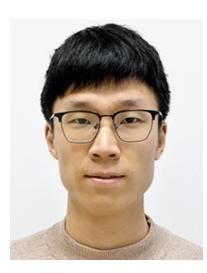

Yunfeng Wen received the B.Eng. degree in electronic engineering from Tsinghua University, Beijing, China, in 2022, where he is currently pursuing the Ph.D. degree in communication and information system.

His current research interests include optical wireless communication, optical sensing, and in particular, integrated sensing and communication in the optical band.

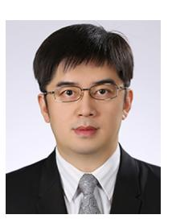

Fang Yang (Senior Member, IEEE) received the B.S.E. and Ph.D. degrees in electronic engineering from Tsinghua University, Beijing China, in 2005 and 2009, respectively. He is currently an Associate Professor with the Department of Electronic Engineering, Tsinghua University. He has published over 200 peer-reviewed journals and conference papers. He holds over 70 Chinese patents and two PCT patents. His research interests include wireless communication, visible light communication, intelligence reflecting surface, integrated sensing, and

communication. He is a fellow of IET. He received the IEEE Scott Helt Memorial Award (Best Paper Award in IEEE Transactions on Broadcasting) in 2015.

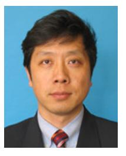

Jian Song (Fellow, IEEE) received the B.Eng. and Ph.D. degrees in electrical engineering from Tsinghua University, Beijing, China, in 1990 and 1995, respectively. He is currently the Director of Tsinghua DTV Technology Research and Development Center. He has been working in quite different areas of fiber-optic, satellite and wireless communications, and the power-line communications. He has published more than 300 peer-reviewed journals and conference papers. He holds two U.S. patents and more than 80 Chinese patents. His current research

interests include digital TV broadcasting. He is a fellow of IET.

Zhu Han (Fellow, IEEE) received the B.S. degree in electronic engineering from Tsinghua University in 1997 and the M.S. and Ph.D. degrees in electrical and computer engineering from the University of Maryland, College Park, in 1999 and 2003, respectively.

From 2000 to 2002, he was a Research and Development Engineer with JDSU, Germantown, MD, USA. From 2003 to 2006, he was a Research Associate at the University of Maryland. From 2006 to 2008, he was an Assistant Professor at Boise State

University, Idaho. He is currently a John and Rebecca Moores Professor at the Electrical and Computer Engineering Department and the Computer Science Department, University of Houston, TX, USA. His research targets on the novel game-theory related concepts critical to enabling efficient and distributive use of wireless networks with limited resources. His other research interests include wireless resource allocation and management, wireless communications and networking, quantum computing, data science, smart grid, carbon neutralization, and security and privacy. He received the NSF Career Award in 2010, the Fred W. Ellersick Prize of the IEEE Communication Society in 2011, the EURASIP Best Paper Award for the Journal on Advances in Signal Processing in 2015, the IEEE Leonard G. Abraham Prize in the field of Communications Systems (Best Paper Award in IEEE JSAC) in 2016, the IEEE Vehicular Technology Society 2022 Best Land Transportation Paper Award, and several best paper awards in IEEE conferences. He was an IEEE Communications Society Distinguished Lecturer from 2015 to 2018, an ACM Distinguished Speaker from 2022 to 2025, an AAAS Fellow since 2019, and an ACM Fellow since 2024. He has been a 1% highly cited researcher since 2017 according to Web of Science. He is also the winner of the 2021 IEEE Kiyo Tomiyasu Award (an IEEE Field Award), for outstanding early to mid-career contributions to technologies holding the promise of innovative applications, with the following citation: "for contributions to game theory and distributed management of autonomous communication networks."