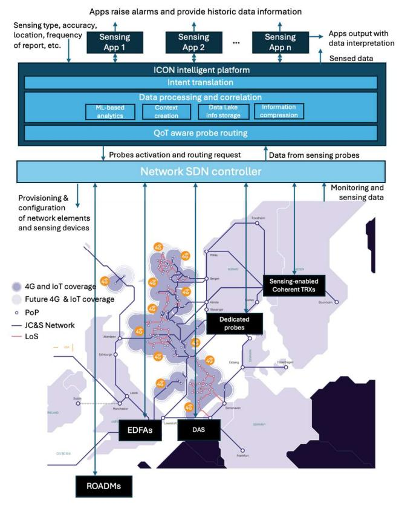

{0}------------------------------------------------

## Intent and Context-Aware Optical Networks

*Aleksandra Kaszubowska-Anandarajah Trinity College Dublin O' Reilly Institute, D02 W272 Dublin, Ireland anandara@tcd.ie*

*Kaida Kaeval Tallinn University of Technology Thomas Johann Seebeck Institute of Electronics Tallinn, Estonia kaida.kaeval@taltech.ee* 

*Alessandro Giusti CyRIC - Cyprus Research and Innovation Center Ltd Nicosia, Cyprus a.giusti@cyric.eu*

*André Richter VPIphotonics Berlin, Germany andre.richter@vpiphotonics.com*

*Darko Zibar DTU Electro Technical University of Denmark Ørsteds plad, Denmark dazi@dtu.dk*

*Andre Sandmann Adtran, Martinsried/Munich, Germany andre.sandmann@adtran.com*

*Dan Kilper Trinity College Dublin O' Reilly Institute, D02 W272 Dublin, Ireland dan.kilper@tcd.ie*

*Esther Renner Friedrich-Alexander-Universität Erlangen-Nürnberg Institute of Microwaves and Photonics Erlangen, Germany esther.renner@fau.de*

*Petr Munster Department of Telecommunication Brno University of Technology Brno, Czech Republic munster@vutbr.cz*

*Igor Koltchanov VPIphotonics Berlin, Germany igor.koltchanov@vpiphotonics.com*

*Andreas Papadopoulos CyRIC - Cyprus Research and Innovation Center Ltd Nicosia, Cyprus a.papadopoulos@cyric.eu*

*Florian Azendorf Adtran, Martinsried/Munich, Germany florian.azendorf@adtran.com*

*Marco Ruffini Trinity College Dublin O' Reilly Institute, D02 W272 Dublin, Ireland Marco.Ruffini@tcd.ie*

*Bernhard Schmauss Friedrich-Alexander-Universität Erlangen-Nürnberg Institute of Microwaves and Photonics Erlangen, Germany bernhard.schmauss@fau.de* 

*Tomas Horvath Department of Telecommunication Brno University of Technology Brno, Czech Republic horvath@vutbr.cz*

> *Steinar Bjørnstad Tampnet AS, Stavanger, Norway sbj@tampnet.com*

*Achim Autenrieth Adtran Networks SE Martinsried, Germany achim.autenrieth@adtran.com*

*Mohammed Hassine LightSenseAI, Cork, Ireland mohassine@gmail.com*

## ABSTRACT

Fibre sensing is undergoing a resurgence of interest due to the potential of integrating it into the telecommunications infrastructure and leveraging this infrastructure to achieve scale and widespread applicability. This is a trend that is occurring in both wireless and wired/fibre systems. Through this approach, the backbone fibre networks can be turned into a massive sensor for detecting earthquakes, tsunamis and a host of geographic disturbances [1, 2]. On a metro scale, networks have also been shown to detect the flow of road traffic and transport systems [3] using both the coherent communication signals themselves and a variety of sensing probes. These methods are largely compatible with high data rate dense wavelength division multiplexed (DWDM) networks and a large volume of research is carried out to improve the sensitivity and performance of the sensing technologies [4]. While promising, these early experiments remain proof of concept tests, in which the sensing technologies are a bolted-on novelty. Full exploitation of the benefits of the integrated sensing and communication (IASC), such as improved performance, increased security of the infrastructure and the creation of new services, requires sensing that is not just an add-on service, but a key part of the operation and performance of the communication system. This means a control and management of a sensing system that is compatible with optical network control and management, allowing for sensing signals to be deployed and routed across the network similar to the data channels, and the intelligence gained from the sensing system informing the operation of the communications network.

The intent and context-oriented optical networks (ICON) project, recently funded through the Horizon Europe Programme, aims to create a pathway for fibre sensing to become an integral service in optical transmission systems, both for improving the reliability and performance of the network itself as well as enabling new functionality and sensing based services. It will achieve this by firstly, developing a dynamic and flexible physical layer sensing system, applicable to a wide range of optical transmission system configurations and deployment scenarios. Secondly, by designing the control and management of sensing signals that is compatible with optical network control and management systems, including emerging virtualized functions and software defined network controls.

Two key features of the ICON concept are the intent- and context-awareness, both realised through the combination of the physical layer sensing and the intelligent sensing control system. In the intent-based approach, the ICON controller collects the intents from both the external applications and the internal system and based on their requirements, optimises sensing and network monitoring parameters. This includes choosing the type, frequency and location of the data collection that satisfies the intent efficiently, while balancing the other sensing and performance requirements of the system. 

{1}------------------------------------------------

Where possible, it processes data already available (e.g., gathered for another application) to retrieve the required information. The context-awareness on the other hand, correlates the contextual information, obtained from heterogeneous data acquired through the sensing and network monitoring systems, with information from other sources (e.g., weather reports, marine traffic or construction tracking systems) to build a comprehensive picture of network infrastructure and the surrounding environment.

Fig. 1: The ICON concept – sensing system controlled through an intelligent control platform that can be integrated into or interact with terrestrial and subsea network controllers and their network management systems.

To realise ICON, the network infrastructure, consisting of telecommunication systems with their built-in monitoring, would be complemented with fibre sensing systems managed by its own intelligent control platform. The latter, designed as a software defined networking (SDN) controller with virtualized network functions, could be flexibly integrated into existing SDN controls and other cloud services. The role of the sensing control platform would be to provision and configure IC&S network elements to fulfil the sensing requirements. As the sensing probes/signals need to be routed through the networks, similarly to the data signals, the IS&C controller would need to interface with the sensing applications as well as the network management system (NMS). The ICON concept is shown in Fig. 1 using a topology of the Tampnet network. Sensing and monitoring data, collected into a data lake, is used to create a digital twin (DT) of different network segments/elements. This in turn will be used to create the infrastructure context to improve network performance, as well as enhancing the data available to external (e.g. sensing) applications and the NMS - giving network operators new insights into their network operation that is only possible with the addition of sensing capabilities. The collected data can be shared through a modern telemetry broker platform [6], providing data-sovereign features for secure telemetry and sensing data sharing. This in turn, can empower machine-learning (ML)-based network anomaly and fault detection in multi-vendor, multi-operator environments. Furthermore, gathering data over longer time periods, with failure-specific collection intervals, enables extraction of additional value from the data, presented in the form of availability maps. These would include infrastructure vulnerability to certain anomalies and failures depending on the type, make predictions about infrastructure aging, and use this information in open, disaggregated networks to optimize routing algorithms and performance of modern services like Optical Spectrum as a Service.

In this presentation, the ICON concept and the pathway to its realisation will be discussed, including (1) the requirement for highly flexible physical layer sensing solutions capable of detecting wide range of events and compatible with different network segments; (2). signal processing, context creation, and data compression algorithms and (3) the creation of an intelligent platform, compatible with SDN control environments. The examples of ICON applications for optimization of the network utilisation and planning as well as ensuring the infrastructure security and reliability through real-time threat detection, localisation and identification will also be discussed.

## ACKNOWLEDGMENT

This work is funded by EU through the ICON project, under the grant agreement 101189703 as well as the Research Ireland/European Regional Development Fund (13/RC/2077/P2),

## REFERENCES

- [1] N. J. Lindsey et al., "Illuminating seafloor faults and ocean dynamics with dark fibre distributed acoustic sensing", Science 366, 1103-1107, 2019.
- [2] H. F. Martins et al., "Monitoring of Remote Seismic Events in Metropolitan Area Fibers using Distributed Acoustic Sensing (DAS) and Spatio-Temporal Signal Processing," OFC, San Diego, CA, USA, 2019.
- [3] G. A. Wellbrock et al., "First Field Trial of Sensing Vehicle Speed, Density, and Road Conditions by using Fiber Carrying High Speed Data," OFC 2019.
- [4] Z. Wang et al., "Field Trial of Coexistence and Simultaneous Switching of Real-Time Fiber Sensing and Coherent 400 GbE in a Dense Urban Environment," in Journal of Lightwave Technology, 42 (4), pp. 1304- 1311, 2024.
- [5] A. Mitrovska, B. Shariati, P. Safari and J. K. Fischer, "Data Governance Framework for Telemetry Sharing," European Conference on Optical Communication (ECOC), Frankfurt, Germany, 2024, pp. 1311-1314.