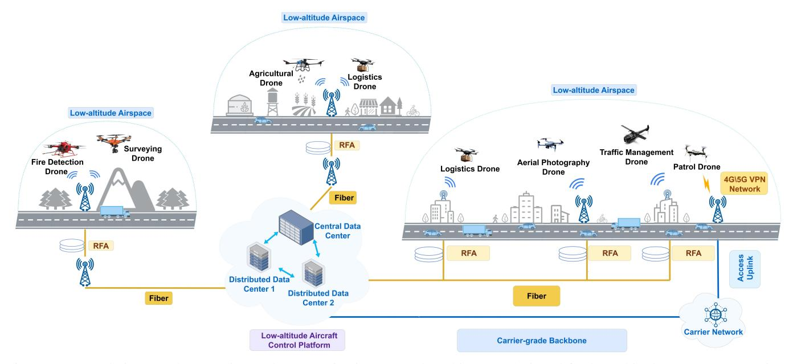
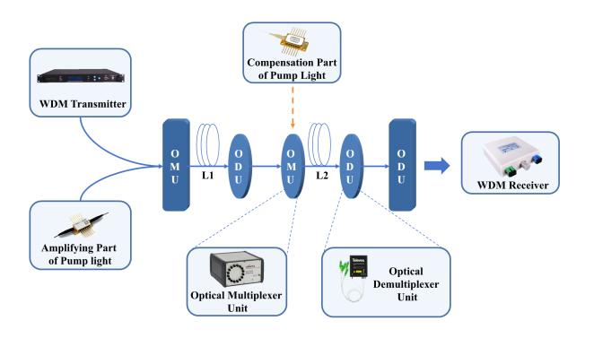
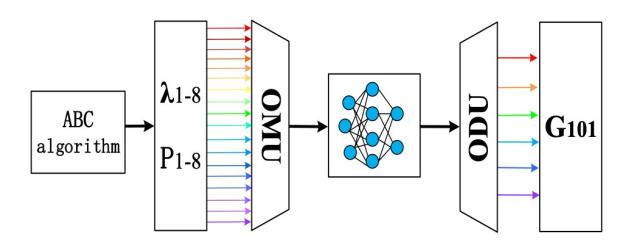
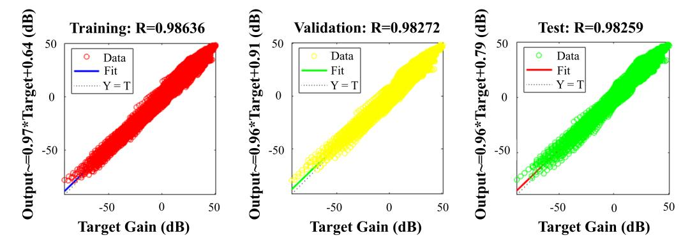
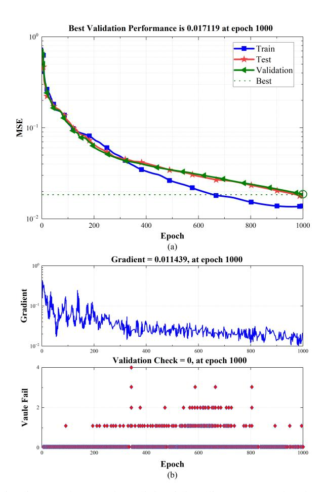
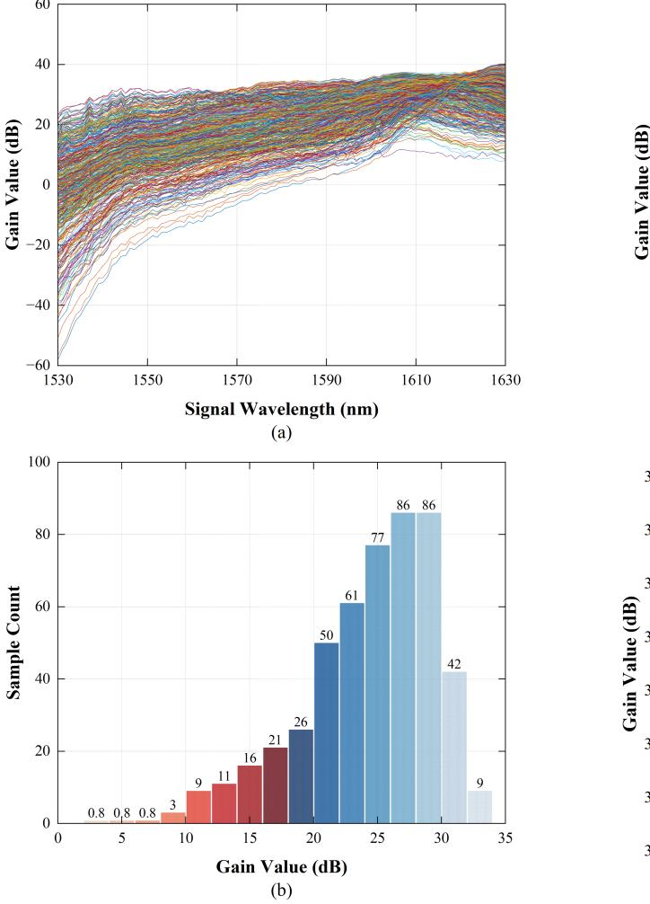
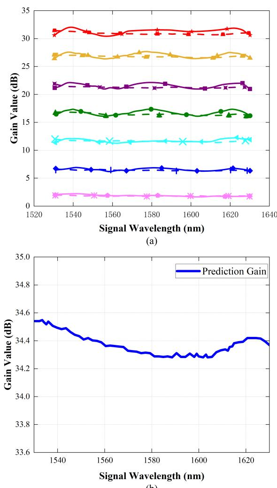
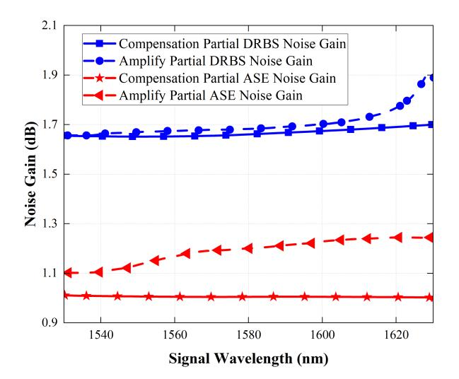
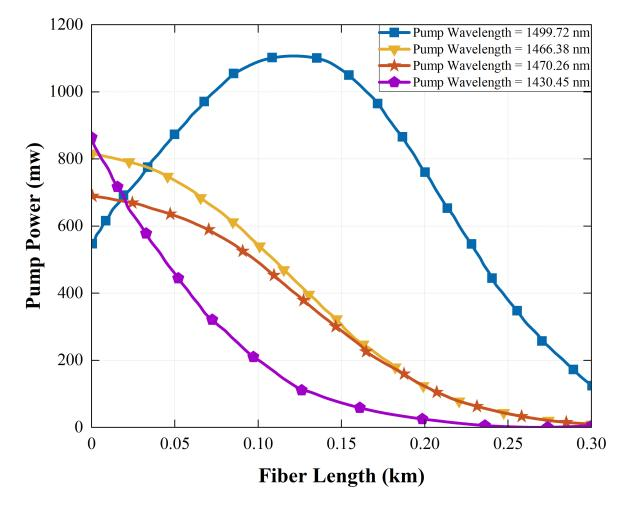

{0}------------------------------------------------

# Machine Learning-Enhanced Multi-Pump RFA for High-Performance Optical Backbone in Low-Altitude Sensing and Communication

Yi Gong, Member, IEEE, Yuyang Zhao, Song Wang, Member, IEEE, Mi Yang, Member, IEEE, Yi Wang, and Jiaqin Wang\*, Member, IEEE

Abstract—With the rise of low-altitude economy applications, 6G communication systems place stricter demands on optical fiber amplifiers, requiring wider bandwidth, higher gain, and better spectral uniformity. Backbone networks for low-altitude integrated sensing and communication systems, in particular, call for high-performance amplification to support robust data transmission and reliable sensing. However, traditional multipump Raman fiber amplifiers (RFAs) are no longer adequate for meeting the performance demands of distributed fiber optic sensing networks in such scenarios. To address this problem, this paper proposes a machine learning-enhanced multi-pump RFA for high-performance optical backbone in low-altitude sensing and communication. The back propagation neural network (BPNN) is employed to accurately model the nonlinear relationship between pump parameters and amplification performance, facilitating adaptive and fine-grained control over signal gain, which is critical for maintaining stable and efficient data transmission across dynamic and heterogeneous communication scenarios. Moreover, the artificial bee colony (ABC) algorithm is integrated to perform global optimization of pump wavelengths and power configurations, thereby improving overall system bandwidth, gain characteristics, and operational robustness under diverse and unpredictable network conditions. The experimental results demonstrate that the proposed method achieves superior prediction accuracy, enhanced stability, and greater adaptability compared to conventional algorithms.

Index Terms—Multi-pump Raman fiber amplifier (RFA), raman gain, back propagation neural network (BPNN), artificial bee colony (ABC).

#### I. Introduction

ITH the rise of the low-altitude economy, key applications such as airground integrated communications and intelligent sensing impose increasing demands on communication systems in terms of bandwidth, data rate, and robustness [1]. Distributed optical fiber sensing networks, as fundamental

Yi Gong, Yuyang Zhao, and Jiaqin Wang are with School of Information and Communication Engineering, Beijing Information Science and Technology University, Beijing 102206, China, (e-mail: {gongyi, yuyang.zhao}@bistu.edu.cn, wangjiaqin@buaa.edu.cn). (Corresponding author: Jiaqin Wang.)

Song Wang is with the School of Modern Post (School of Automation), Beijing University of Posts and Telecommunications, Beijing 100876, China, (e-mail: wongsang@bupt.edu.cn).

Mi Yang is with School of Electronic and Information Engineering, Beijing Jiaotong University, Beijing 100044, China, (e-mail: myang@bjtu.edu.cn).

Yi Wang is with the School of Electronics and Information, and also with the Henan Province Collaborative Innovation Center of Aeronautics and Astronautics Electronic Information Technology, Zhengzhou University of Aeronautics, Zhengzhou 450046, China, (email: yiwang@zua.edu.cn).

infrastructures for real-time environmental data acquisition, are expected to play a central role in supporting such systems [2]. These networks must deliver higher capacity, broader bandwidth, and enhanced adaptability to meet the hybrid requirements of sensing and communication in dynamic low-altitude environments [3]. These application-layer and network-layer advances also intensify the demand on the optical backbone, as multi-time-scale hierarchical deep reinforcement learning and blockchain-enabled joint optimization have been adopted in air–ground and space–air–ground systems [4], [5]. At the edge of low-altitude systems, active inference–based reinforcement learning further underscores the need for a stable, wideband, and low-latency fiber backbone [6].

Distributed optical fiber sensing networks use optical fibers as both communication links and sensing elements [7], enabling real-time monitoring by analyzing backscattered signals. Due to their high sensitivity and spatial resolution, they have been widely adopted in smart city applications. Fig. 1 illustrates an integrated air-ground perception and communication network architecture designed for low-altitude economy scenarios. By leveraging a distributed optical fiber sensing network and multi-pump Raman fiber amplifiers (RFAs), the system establishes low-altitude communication coverage across urban, agricultural, and mountainous areas, enabling high-bandwidth, low-latency data transmission and coordinated management of various types of unmanned aerial vehicles. Within low-altitude integrated sensing and communication systems, these networks serve as vital sensing foundations, while RFAs [8] are commonly used to provide broadband, high-gain, and low-noise signal amplification. However, conventional RFA designs fall short under the strict performance demands of emerging 6G systems operating in the terahertz range [9], especially where high throughput and environmental adaptability are required. Related challenges have also been explored in nonlinear multiple input multiple output systems for cyberphysical applications [10]. Addressing these limitations requires advanced amplification schemes that can intelligently adapt to variable conditions [11]. On the architectural side, hierarchical low-altitude wireless networking for air traffic management and ground-tosky blueprints have been articulated as the system context of future low-altitude communications [12], [13]. In parallel, edge perception, sensing-assisted reliable beamforming, and ISAC-enabled digital twins are rapidly evolving [14]–[16], and an evolutionary perspective on ISAC highlights even greater

{1}------------------------------------------------



Fig. 1: Integrated air-ground perception and communication network architecture designed for low-altitude economy scenarios.

bandwidth and flatness requirements for the physical backbone [17].

Ultra-wideband (UWB) transmission has drawn attention for improving spectral efficiency in long-distance optical links [18], but its success hinges on robust amplification. Compared with erbium-doped fiber amplifiers, RFAs offer key benefits such as sub-picosecond response, flexible bandwidth, and low noise [19], which are essential for fast and accurate sensing in low-altitude settings. However, the nonlinear nature of the relationship between gain, pump power, and wavelength complicates the configuration process [20], [21], limiting conventional designs from fully supporting the needs of integrated sensing and communication under low-altitude economic conditions. Traditionally, numerical methods for calculating signal power, such as the Runge-Kutta method [22], the shooting method [23], and the average power method [24]. Nevertheless, these approaches are often cumbersome and computationally intensive. To overcome these limitations, optimization algorithms such as evolutionary algorithms [25], [26] and particle swarm optimization algorithms [27], [28] have been proposed and extensively studied over years of research.

In recent years, artificial intelligence has achieved significant progress, driven by continuous advancements in computational power [29]. As an important subfield of artificial intelligence, machine learning (ML) has been widely applied across various industries, thereby enhancing products and services. ML techniques are now widely used in fields such as data mining, search engines, e-commerce, and computer vision. In essence, ML allows computers to utilize data or prior experience to improve performance and optimize program behavior [30]. The primary objective of ML research is to analyze complex and diverse data structures and to make efficient use of extracted information [31], [32].

Optical fiber communication offers extremely high capacity. For example, a pair of thin optical fiber filaments can simultaneously transmit millions of telephone signals. Additionally, optical fibers are immune to electromagnetic interference, as they do not conduct electricity or produce electromagnetic induction. They are also resistant to moisture and corrosion, and their energy loss is approximately one-tenth that of conventional communication cables. These advantages contribute to enhanced communication quality, with performance significantly surpassing that of conventional limited systems.

In the realm of optical communication, ML algorithms, particularly multilayer neural networks, have shown promise in reducing computational complexity and offering novel and efficient approaches for fiber optic system design [33], [34]. Compared to traditional algorithms, ML models exhibit strong nonlinear fitting capabilities. Current ML research in optical communication focuses on three main directions: nonlinear channel equalization, system performance monitoring, and optical network control [2], [3]. To avoid time-consuming optimization processes, ML is now being applied in systemlevel design tasks [1]. Techniques such as inverse system modeling and multilayer neural networks are used to learn the mapping relationships between pump power, Raman gain distribution, and wavelength.

For instance, in the C + L band or C band, the maximum prediction error of ML-based models is generally less than 0.5 dB [35], demonstrating that ML provides an efficient means of capturing the correlation between pump parameters and Raman gain. However, most existing studies do not apply ML directly to the design of RFAs. Furthermore, RFAs designed using conventional methods typically operate within the C or C + L bands, with a maximum Raman gain of around 27 dB and gain flatness ranging between 1–3 dB [36], [37]. These specifications do not meet the transmission bandwidth and capacity requirements of UWB systems.

This paper presents a design approach for UWB and highgain RFAs based on the back propagation neural network (BPNN) and the artificial bee colony (ABC) algorithm. The

{2}------------------------------------------------

main contributions of this paper are as follows:

- 1) We propose a ML-enhanced multi-pump RFA method for constructing high-performance optical backbone networks in low-altitude sensing and communication scenarios. The proposed RFA operates across the C + L + U bands, achieves high gain with a flat spectral response, and effectively suppresses noise variations, thereby meeting the performance demands of ultra-wide band communication systems.
- 2) We introduce BPNN to accurately model the nonlinear relationship between pump parameters and Raman gain, enabling adaptive and fine-grained signal amplification control.
- 3) We adopt ABC algorithm to globally optimize pump wavelengths and power configurations, thereby enhancing system bandwidth, gain characteristics, and robustness under complex network conditions.

The structure of this paper is organized as follows: Section II introduces the Related Works. Section III presents the theoretical Model. Section IV conducts simulation Results and performance evaluation. Finally, Section V concludes the paper.

# II. RELATED WORKS

RFA operation relies on stimulated Raman scattering (SRS) effect, hence its output gain exhibits complex nonlinear dependence on pump power, and there is no direct analytical equation, so it is difficult to solve such problems by numerical optimization methods. The past RFA design methods mostly use a genetic algorithm, a combination of simulated annealing algorithm and particle swarm algorithm or average power method to optimize the pump wavelength and pump power to get the optimal configuration of pumping light source. However, the above-mentioned traditional optimization methods have the defects of easily falling into local optimum and low optimization efficiency, which affect the performance of the RFA.

In recent studies, it has been further emphasized that nonlinear interference and spectral distortion, induced by SRS and other fiber effects, can severely degrade gain uniformity in multi-band transmission systems, making closed-form modeling and traditional heuristics insufficient [38], [39].

With the gradual research of optimization algorithms, some more advanced optimization algorithms will help to further improve the RFA design efficiency and design performance [40]. Optimization for communication systems has witnessed a rapid shift toward learning-based and nonconvex approaches, which offer superior global convergence compared to classical evolutionary algorithms [41]. These developments provide theoretical support for applying hybrid metaheuristics and neural networks in fiber amplifier design.

Some experts combined the ML approach with the optimal design of Raman amplifiers to train an effective single hiddenlayer feedforward network model, using an extreme learning machine (ELM) learning method trains effective singlehidden-layer feedforward network models, taking pump light wavelength and power as training inputs while using net gain as training target [42]. The method considerably decreases the computation time in contrast with the conventional solution. Another scholar constructed a three-layer neural network with the net gain as the training input and the pump light wavelength and power as the training target and trained a multihidden layer feedforward network model using the learning method of the neural network, but the accuracy was low with an error of up to 0.6 dB [43].

Later, some experts used the inverse system design method in ML to design a two-band multi-hidden layer feedforward neural network (FNN) for C-band and C + L-band, and the average value of the maximum error was 0.35 dB and 0.46 dB [44]. These results show that the use of ML methods to map the relationship between pump parameters and Raman gain is effective, but ML is not specifically applied to the design of RFA. In addition, the bandwidth of RFA designed by conventional methods is mainly C-band or C+L-band, the maximum Raman gain is about 27 dB, and the gain flatness is between 1 − 3 dB, which does not meet the transmission bandwidth and capacity requirements of UWB schemes. Moreover, these studies have only investigated the neural network models of one to three layers, and the computational results of the designed RFA network models are not accurate enough and have large errors.

Meanwhile, the rise of large-scale distributed optical fiber sensing systems, such as railway track fault diagnosis [45] and real-time vibration monitoring [46], requires optical backbones with high stability, low noise, and wide bandwidth. These scenarios demand more adaptive RFA configurations to ensure signal integrity under dual roles of sensing and communication.

Beyond these studies, emerging paradigms in intelligent communications further broaden the research landscape. Generative and semantic communication approaches shift the focus from traditional bit-level transmission to meaning-aware efficiency and resiliency [47], [48]. At the physical layer, learningassisted decoding of protograph LDPC codes has demonstrated notable reliability gains, exemplifying how machine learning can reshape fundamental transmission mechanisms [49]. These developments highlight the breadth of machine learning applications across the communication stack, complementing but distinct from the optical backbone perspective considered in this work.

Moreover, recent research has shown that proper shaping of launched signal power spectral density can significantly mitigate nonlinear interference in fiber systems [50]. Such insight inspires future directions for waveform-level and pump-level co-optimization in Raman-assisted transmission and sensing.

# III. THEORETICAL MODEL

The amplification behavior in RFAs is governed by SRS [51], [52], wherein the optical signal power evolves along the fiber length due to nonlinear interactions with multiple pump sources. In multi-pump scenarios, the evolution of the signal power P<sup>ν</sup> at frequency v<sup>ν</sup> along the propagation direction z is characterized by the following differential equation

$$\pm \frac{dP_{\nu}}{dz} = T_1 + T_2 + T_3,\tag{1}$$

{3}------------------------------------------------

where  $\nu$  is the indice of output channels. The first term  $T_1$  represents the gain from stimulated Raman interactions between higher-frequency pumps and the signal, as well as signal depletion due to power transfer to lower-frequency components. It is given by

$$T_{1} = \sum_{v_{\mu} > v_{\nu}} \frac{g_{R}(v_{\mu} - v_{\nu})}{K_{\text{eff}} A_{\text{eff}}} P_{\mu} P_{\nu} - \sum_{v_{\kappa} < v_{\nu}} \frac{v_{\nu}}{v_{\kappa}} \frac{g_{R}(v_{\nu} - v_{\kappa})}{K_{\text{eff}} A_{\text{eff}}} \P_{\mu} P_{\kappa},$$
(2)

where  $\mu$  and  $\kappa$  are the indices of input and intermediate channels.  $P_{\mu}$  and  $P_{\kappa}$  denote the powers of interacting pump and signal channels at frequencies  $v_{\mu}$  and  $v_{\kappa}$ , respectively;  $g_R(\cdot)$  is the Raman gain coefficient;  $A_{\rm eff}$  is the effective core area of the fiber; and  $K_{\rm eff}$  is the polarization efficiency factor.

The second term  $T_2$  accounts for fiber attenuation and Rayleigh backscattering losses and is defined as

$$T_2 = -\alpha_{\nu} P_{\nu} + \gamma_{\nu} P_{\nu},\tag{3}$$

where  $\alpha_{\nu}$  denotes the fiber attenuation coefficient at frequency  $v_{\nu}$ , and  $\gamma_{\nu}$  is the Rayleigh scattering coefficient that characterizes backward energy reflection.

The third term  $T_3$  models spontaneous Raman scattering, which includes a temperature-dependent component characterized by the Bose–Einstein photon occupancy factor. The term is expressed as

$$T_{3} = 2hv_{\mu} \sum_{v_{\mu} > v_{\nu}} \frac{g_{R}(v_{\mu} - v_{\nu})}{K_{\text{eff}} A_{\text{eff}}} P_{\nu}$$

$$\cdot \left[ 1 + \frac{1}{\exp\left(\frac{h(v_{\mu} - v_{\nu})}{kT}\right) - 1} \right] \cdot \Delta v$$
(4)

in this expression, h and k denote Planck's and Boltzmann's constants, respectively; T represents fiber absolute temperature; and  $\Delta v$  indicates bandwidth interval per frequency channel. The exponential term describes the thermal population of phonon states contributing to spontaneous emission, while the leading "1" accounts for the baseline spontaneous scattering.

This decomposition provides a comprehensive view of signal amplification in RFAs, allowing each contributing physical process—nonlinear gain, attenuation, and thermal scattering—to be separately quantified and optimized in intelligent design frameworks.



Fig. 2: The cascaded multi-pump Raman amplifier structure.

Fig. 2 illustrates the schematic diagram of a cascaded multipump Raman amplifier. We can see from Fig. 2, the input end of the amplifier is the wavelength of the signal within the spectral width of  $1530 - 1630 \ nm$ , along with four pump wavelengths  $(\lambda_{p11}, \lambda_{p12}, \lambda_{p13}, \lambda_{p14})$  for the amplification part and four pump wavelengths  $(\lambda_{p21}, \lambda_{p22}, \lambda_{p23}, \lambda_{p24})$  for the compensation part. In the amplification part, all the signals and pumps pass through the wavelength division multiplexer (WDM) and propagate through an optical fiber of length  $L_1$ km in the amplification part. Each signal light is amplified to distinct degrees due to the transmission optical fiber's distinct Raman gain coefficient. Afterward, the filter divides into four pump lights. Within the compensation section, the amplified signal and the compensation pump traverse a WDM and enter a  $L_2$  km optical fiber. The gain coefficients of the amplification and compensation parts are opposite, leading to different degrees of compensation for each signal in the fiber  $L_2$ . Finally, all the pump light is filtered out using a filter, obtaining the uniform amplification gain at the output of the amplifier.

BPNN is a widely used neural network model, which adopts a multi-layer feedforward structure and utilizes the error BP algorithm for supervised training [53], originally proposed in 1986. The BPNN computation process comprises two main parts: the forward computation and the backward computation.

During the forward computation, the input signal traverses sequentially through the hidden layers toward the output layer. This process can be abstractly expressed as a nonlinear mapping function

$$\mathbf{Z} = \mathcal{F}(\mathbf{X}; \boldsymbol{\theta}), \tag{5}$$

where  $\mathbf{X}$  denotes the input vector,  $\mathbf{Z}$  is the output vector, and  $\boldsymbol{\theta}$  represents the set of network parameters including weights and biases.  $\mathcal{F}(\cdot)$  denotes the nonlinear transformation implemented by the BPNN.

If the output layer fails to produce the desired result, the algorithm proceeds with the backward computation. The error signal is back propagated to adjust network parameters. Weight loss gradients are computed via chain rule

$$\frac{\partial \mathcal{L}}{\partial w_{ij}} = \frac{\partial \mathcal{L}}{\partial z_j} \cdot \frac{\partial z_j}{\partial a_j} \cdot \frac{\partial a_j}{\partial w_{ij}},\tag{6}$$

where  $\mathcal{L}$  denotes the loss function,  $w_{ij}$  is the weight connecting neuron i to neuron j,  $a_j$  is the weighted input to neuron j, and  $z_j = f(a_j)$  is the output of neuron j after activation. Here,  $i = 1, 2, \ldots, \beta$  indexes the neurons in the input layer,  $j = 1, 2, \ldots, p$  indexes the neurons in the hidden layer. Let input, hidden neuron counts equal  $\beta$ , p.

Furthermore, the error signal for each hidden neuron in layer *l* is computed using the following chain-rule-based BP formula

$$\delta_j^{(l)} = \left(\sum_{k=1}^{n^{(l+1)}} \delta_k^{(l+1)} w_{jk}^{(l+1)}\right) \cdot f'(net_j^{(l)}),\tag{7}$$

where  $\delta_j^{(l)}$  is the error signal for neuron j in layer l,  $\delta_k^{(l+1)}$  is the error from neuron k in the next layer l+1,  $w_{jk}^{(l+1)}$  is the weight from neuron j in layer l to neuron k in layer l+1,  $f'(\cdot)$  is the derivative of the activation function, and  $net_j^{(l)}$  is the

{4}------------------------------------------------

total input to neuron j in layer l. n denotes the dimensionality of the decision variables. k = 1, 2, ..., m indexes the neurons in the output layer. Let output layer neuron counts equal m.

Subsequently, the weights are updated using the gradient descent rule with momentum and L2 regularization

$$w_{ij}^{(l)}(t+1) = w_{ij}^{(l)}(t) - \eta \cdot \left(\frac{\partial \mathcal{L}(t)}{\partial w_{ij}^{(l)}} + \alpha \cdot \frac{\partial \mathcal{L}(t-1)}{\partial w_{ij}^{(l)}}\right) + \lambda \cdot \left\|w_{ij}^{(l)}\right\|_2, \tag{8}$$

where  $\eta$  is the learning rate,  $\alpha$  is the momentum coefficient,  $\lambda$  is the L2 regularization factor, t is the iteration count, and  $\|\cdot\|_2$  denotes the L2 norm of the weight.

BPNN has gained popularity due to its effectiveness in solving complex nonlinear problems in various domains [54], [55]. During training, the weights are continuously adjusted to minimize the total prediction error. Eventually, the learned mapping function can accurately estimate the corresponding output, such as the Raman gain value.

In fact, we regard the BPNN algorithm as a method for monitoring learning [56]. It uses mean squared error and gradient descent to realize modification of the network connection weights. Changing the network connection weights in order to implement the minimum sum of squares of the errors.

For BPNN learning rules, weight and threshold adjustments must follow negative gradient direction, corresponding to function maximum descent rate. The overall sample set can be expressed as

$$X = (X_1, \cdots, X_r, \cdots, X_q), \tag{9}$$

where each  $X_r$  represents a specific input sample in the dataset

$$X_r = (X_{r1}, \cdots, X_{r2}, \cdots, X_r),$$
 (10)

with  $r = 1, 2, \dots, q$ , with q representing sample set quantity. Here,  $X_{ri}$  denotes the i-th feature of the r-th input sample.

As the input signal  $X_{ri}$  is processed in the hidden layer, the connection weights between the input layer and the hidden layer are denoted by  $v_{ij}$ , and the bias term of the hidden neuron is denoted by  $v_{oj}$ . Here, The input to the j-th hidden neuron is defined as

$$I_{j} = \sum_{i=1}^{n} v_{ij} X_{ri} - v_{oj}, \tag{11}$$

where  $I_j$  is the total weighted input to the hidden neuron j. The j-th hidden neuron's output results from applying activation function  $f(\cdot)$ :

$$y_{rj} = f(I_j) = f\left(\sum_{i=1}^{n} v_{ij} X_{ri} - v_{oj}\right),$$
 (12)

where  $y_{rj}$  is the output of the j-th hidden neuron for the r-th input sample.

Let  $u_{jk}$  denote the weights connecting the hidden layer to the output layer, and let  $u_{ok}$  denote the bias of the k-th output neuron. Then, the input to the k-th output neuron is

$$I_k = \sum_{i=1}^{p} u_{jk} y_{rj} - u_{ok}, \tag{13}$$

and its output is given by:

$$Z_{rk} = f(I_k) = f\left(\sum_{j=1}^{p} u_{jk} y_{rj} - u_{ok}\right),$$
 (14)

where  $Z_{rk}$  is the predicted output of the k-th output neuron for the r-th input sample.

Let the expected output sample set be denoted as

$$\mathcal{D} = (D_1, D_2, \dots, D_n), \tag{15}$$

where  $D_r = (d_{r1}, d_{r2}, \dots, d_{rm})$  is the expected output vector corresponding to the r-th input sample.  $d_{rm}$  denotes the m-th component of the expected output vector corresponding to the r-th input sample, representing the desired value at the m-th output node.

The output error of the r-th sample at the k-th output neuron is calculated as

$$e_{rk} = d_{rk} - Z_{rk}, \tag{16}$$

where  $d_{rk}$  is the target output.

The squared error for the r-th sample is defined as

$$E_r = \frac{1}{2} \sum_{k=1}^{m} e_{rk}^2, \tag{17}$$

and the total error across all samples is given by

$$\mathcal{L} = \sum_{r=1}^{q} E_r,\tag{18}$$

when the calculation result of equation (17) is less than the set calculation accuracy, the calculation is finished, otherwise, it enters the correction phase.

The implemented BPNN architecture comprises three sequential layers: input, hidden, and output [57], [58]. The model's input consists of the pump wavelength and power. Since the amplification section and compensation section each use four pumps independently, the input section includes 16 parameters. Within the 1530 to 1630 nm wavelength band, there are 101 signals overlapping at 1 nm intervals. Therefore, the output section includes 101 parameters. The middle section is the BPNN model, which includes five hidden layers, each containing 48 neural network nodes. The network uses five hidden layers to capture complex nonlinear mapping between 16 pump parameters and 101 Raman gain outputs, avoiding overfitting while ensuring sufficient feature extraction. Each layer's 48 neurons provide adequate capacity without excess computation, achieving  $R_{\rm val/test} > 0.982$  and < 0.2~dB error for accurate Raman gain prediction.

The BPNN provides an effective framework for predicting the performance of ultra-wideband Raman amplifiers, enabling accurate analysis of the nonlinear mapping between input pump parameters and output signal gain. Based on BPNN, we can better understand the relationship between pump parameters and Raman gain. The Raman amplifier's pump parameters are optimized via an artificial colony algorithm to obtain high-gain, low-flatness output [59]. As a swarm intelligence technique, the algorithm emulates the collective food-seeking behavior of Apis mellifera colonies. The whole search process can be divided into the leading bee stage, bee

{5}------------------------------------------------

stage, and detecting bee stage. The specific steps of the whole optimization search process are as follows.

ABC algorithms divide the population into three types of bees: employed bees, onlooker bees, and scout bees. Each employed bee is associated with a specific food source, which corresponds to a potential solution in the optimization space. The algorithm represents candidate solutions using *D*-dimensional coordinate vectors:

$$\mathbf{S}_{\tau} = [s_{\tau 1}, s_{\tau 2}, \dots, s_{\tau D}],\tag{19}$$

where  $\mathbf{S}_{\tau}$  denotes the  $\tau$ -th food source and each  $s_{\tau\sigma}$  is the value of the  $\sigma$ -th decision variable in this solution vector, with D being the problem dimensionality. The quality of each food source is evaluated using a fitness function that transforms the raw objective value  $f_{\tau}$  into a normalized positive scalar. To handle all real-valued  $f_{\tau}$  outputs, the fitness metric is constructed as

$$\operatorname{fit}_{\tau} = \begin{cases} \frac{1}{1+f_{\tau}}, & f_{\tau} \ge 0\\ 1+|f_{\tau}|, & f_{\tau} < 0 \end{cases}, \tag{20}$$

where  $f_{\tau}$  represents the objective function value evaluated at  $\mathbf{S}_{\tau}$ . This transformation ensures that all fitness values are positive and can be meaningfully compared and ranked. During the onlooker phase, food sources are selected probabilistically according to normalized fitness values. If a food source fails to improve after several trials, a stagnation counter trial<sub> $\tau$ </sub> is incremented. The counter is updated using the following rule

$$\operatorname{trial}_{\tau} = \begin{cases} 0, & \text{if } f_{\tau}^{\text{new}} < f_{\tau}^{\text{old}} \\ \operatorname{trial}_{\tau} + 1, & \text{otherwise} \end{cases}, \tag{21}$$

where  $f_{\tau}^{\text{new}}$  and  $f_{\tau}^{\text{old}}$  represent the current and previous objective function values of the  $\tau$ -th food source, respectively. If these trial counter exceeds a predefined threshold, the employed bee transitions to a scout role, and its associated food source undergoes stochastic reinitialization. These cooperative mechanisms maintain an exploration-exploitation equilibrium throughout the search process, ensuring convergence to high-quality solutions while avoiding premature stagnation.

1) The Process of Hiring Bees to Search for Honey Sources: The  $\tau$ -th food source, representing a potential method to the optimization issue, is randomly generated within the search space using equation (22)

$$x_{\tau d} = L_d + \operatorname{rand} * (U_d - L_d), \tag{22}$$

here, d = 1, 2, ..., D. d indicates the current iteration number, and  $U_d$  and  $L_d$  represent the upper and lower limits of the search space, respectively.

During search commencement, the employed bee explores the vicinity of honey source  $\tau$  to generate a fresh honey source, following equation (23)

$$v_{\tau d} = x_{\tau d} + \phi * (x_{\tau d} - x_{\zeta d}),$$
 (23)

where  $x_{\zeta d}$  is the d-th component of a randomly selected food source  $\zeta$ , with the condition that  $\zeta$  is different from  $\tau$ , and it is used to form a differential perturbation.  $\phi$  is a random scalar,

#### Algorithm 1 General Scheme of the ABC Algorithm

**Input:** Number of food sources N, dimension D, limits  $L_d$ ,  $U_d$ , maximum cycle number MCN

**Output:** Best food source  $\mathbf{x}_{best}$ 

```
1: Initialize food sources \mathbf{x}_{	au}=(x_{	au 1},\ldots,x_{	au D}) by x_{	au d}=
      L_d + \operatorname{rand}(0,1) \cdot (U_d - L_d)
 2: while cycle < MCN and CPU time not exceeded do
            for each employed bee \tau do
                  Generate v_{\tau d} = x_{\tau d} + \phi_{\tau d}(x_{\tau d} - x_{kd}), \quad \phi_{\tau d} \sim
      \mathcal{U}(-1,1), \ k \neq \tau
                  if f(\mathbf{v}_{\tau}) < f(\mathbf{x}_{\tau}) then
                        \mathbf{x}_{\tau} \leftarrow \mathbf{v}_{\tau}
 7:
                  end if
            end for
 8:
 9:
            for each onlooker bee do
                  Compute p_{\tau} = \frac{\mathrm{fit}_{\tau}}{\sum_{\sigma=1}^{N} \mathrm{fit}_{\sigma}} and select solution \mathbf{x}_{\tau} Apply the same update rule as employed bees
10:
11:
12:
13:
            for each solution x_{\tau} do
                  if trial_{\tau} \geq limit then
14:
                         Reinitialize x_{\tau d} = L_d + \text{rand}(0, 1) \cdot (U_d - L_d)
15:
16:
17:
            Update the best solution: \mathbf{x}_{best} = \arg\min_{\mathbf{x}_{\tau}} f(\mathbf{x}_{\tau})
18:
            cycle \leftarrow cycle + 1
20: end while
21: Return \mathbf{x}_{best}
```

usually sampled from a symmetric interval such as from minus one to plus one, which determines the step size and direction.

The hired bee performs a local search around the current nectar source  $\tau$  by randomly selecting a dimension from the set [1,D]. Then, it selects another nectar source  $\zeta\subseteq 1,2,\ldots,N,\zeta\neq \tau$  at random from the N available sources. Finally, it perturbs the position of the current source by a random amount  $\phi$  drawn from a uniform distribution. This search process can be expressed algorithmically using (2).

## Algorithm 2 Employed Bee Local Search and Greedy Update

**Input:** Current food source  $\mathbf{x}_{\tau}$ , population size N, dimension D

**Output:** Updated food source  $\mathbf{x}_{\tau}$ 

```
1: for j=1 to N do
2: v_{\tau d}=x_{\tau d}+\phi\cdot(x_{\tau d}-x_{\zeta d})
3: end for
4: Evaluate fitness: fit_{\tau}=f(\mathbf{x}_{\tau}) and fit_{v_{\tau d}}=f(v_{\tau d})
5: if fit_{v_{\tau d}}\leq fit_{x_{\tau d}} then
6: x_{\tau d}\leftarrow v_{\tau d}
7: fit_{x_{\tau d}}\leftarrow fit_{v_{\tau d}}
8: end if
```

2) Hired Bees Share Information about Honey Sources, and Follow Bees Select Honey Sources to Search: The following bees follow according to the probability calculated by (24)

{6}------------------------------------------------

based on the nectar information shared by the hiring bees

$$p_{\tau} = \frac{fit_{\tau}}{\sum_{\tau=1}^{N} fit_{\tau}},\tag{24}$$

where  $fit_{\tau}$  is the fitness function of the  $\tau$ -th nectar source.

First, a number o is created from the interval [0,1] in random. Next, if  $p_i$  exceeds o, the subsequent bee creates a new nectar source in the vicinity of nectar source  $\tau$  based on equation (23). The bee then employs the same greedy selection method as the previously employed bee to identify the nectar source that will be retained.

3) Scout Bees Perform Random Searches in the Search Space: If, after "trial" iterations of search, the nectar source  $x_{\tau}$  reaches the threshold "limit" and no better nectar source is found, it shall be given up. The employed bee linked to solution  $x_{\tau}$  transitions to scout status. This scout then randomly generates a new candidate solution within search boundaries via equation (25)

$$X_{\tau}^{t+1} = \left\{ \begin{array}{l} L_d + \operatorname{rand}(0,1) \left( U_d - L_d \right), \text{ trial } _{\tau} \geqslant \text{ limit} \\ X_{\tau}^t, \text{ trial } _{\tau} < \text{ limit} \end{array} \right., \tag{25}$$

where  $X_{\tau}^{t}$  denotes the position of the  $\tau$ -th nectar source in the t-th iteration; limit is the maximum allowed trial count.

The ABC algorithm represents a canonical swarm-based meta- heuristic, deriving its optimization principles from honeybee foraging dynamics. The algorithm iteratively explores and develops the solution space through collaboration between worker bees, scout bees, and observer bees. This collaborative search mechanism not only enhances global optimization capabilities but also avoids getting stuck in local optima, thereby improving the accuracy and efficiency of system design.

To improve convergence and exploration capability during optimization, we adopt a hybrid update strategy that combines differential search and particle-based exploration. The update rule is defined as

$$x_{\varsigma\xi}^{(t+1)} = \begin{cases} x_{\varsigma\xi}^{(t)} + \phi_{\varsigma\xi}^{(t)} \cdot \left(x_{\varsigma\xi}^{(t)} - x_{\chi\xi}^{(t)}\right), & \text{if rand}() < p_{\varsigma} \\ x_{\varsigma\xi}^{(t)} + \omega \cdot \left(g_{\xi}^{(t)} - x_{\varsigma\xi}^{(t)}\right) \\ + c_{1}r_{1} \cdot \left(p_{\varsigma\xi}^{(t)} - x_{\varsigma\xi}^{(t)}\right) \\ + c_{2}r_{2} \cdot \left(g_{\xi}^{(t)} - x_{\varsigma\xi}^{(t)}\right), & \text{otherwise} \end{cases}$$

in this formulation,  $\varsigma$ ,  $\xi$ , and  $\chi$  denote the candidate solution index, dimension index, and peer solution index, respectively.  $x_{\varsigma\xi}^{(t)}$  represents the position of the  $\xi$ -th dimension of the  $\varsigma$ -th candidate solution at iteration t, while  $x_{\chi\xi}^{(t)}$  denotes a randomly selected peer solution used for differential comparison. The variable  $\phi_{\varsigma\xi}^{(t)}$  is a scaling factor, typically drawn from a uniform distribution, which controls the amplitude of the differential mutation. The term  $g_{\xi}^{(t)}$  indicates the global best position found so far in the  $\xi$ -th dimension, and  $p_{\varsigma\xi}^{(t)}$  corresponds to the personal best position of the  $\varsigma$ -th candidate in the same dimension. The variables  $r_1$  and  $r_2$  are independently sampled from a uniform distribution over the interval (0,1), while  $\omega$  denotes the inertia weight used to retain momentum from the previous iteration. The coefficients  $c_1$  and  $c_2$  are

acceleration constants that control the cognitive and social influences, respectively.

This probabilistic hybrid mechanism balances exploration and exploitation by switching between two update strategies. The first promotes diversity by leveraging differences between individuals, and the second accelerates convergence by utilizing both individual and global experience. This approach has proven effective in avoiding local optima, particularly in high-dimensional parameter tuning scenarios, such as pump configuration optimization in UWB Raman amplifiers.

In practical applications, especially within optical amplifier systems that exhibit nonlinear gain characteristics and strict physical constraints, the ABC algorithm is widely used to solve complex multi-objective optimization problems. A representative objective function in this context is given by

$$f(\mathbf{x}) = \sum_{\varsigma=1}^{n} \left( a_{\varsigma} x_{\varsigma}^{2} + b_{\varsigma} \sin(c_{\varsigma} x_{\varsigma}) \right), \tag{27}$$

where  $\mathbf{x} = [x_1, x_2, \dots, x_n] \in \mathbb{R}^n$  is the decision vector to be optimized. Each variable  $x_{\varsigma}$  is restricted to lie within a predefined feasible interval  $[x_{\varsigma}^{\min}, x_{\varsigma}^{\max}]$ . In addition to these bounds, the solution must satisfy a linear constraint of the form  $\sum_{\varsigma=1}^n d_{\varsigma} x_{\varsigma} \leq D_{\max}$ , where  $a_{\varsigma}$ ,  $b_{\varsigma}$ ,  $c_{\varsigma}$ , and  $d_{\varsigma}$  are known coefficients, and  $D_{\max}$  is a system-level resource constraint. This formulation is capable of modeling highly nonlinear and multidimensional optimization tasks while ensuring compliance with physical or engineering limitations, making it especially suitable for configuring pump parameters in distributed Raman amplification systems.

#### A. Analysis of BPNN Model

UWB Raman amplifiers are essential to high-speed optical communication systems [60]. Optimizing its performance is a challenging task because we should seek out the best pump parameters to actualize high gain and low flatness across different wavelengths. Thus, a combination of the Raman amplifier, the NN model, and the artificial colony algorithm is demonstrated in Fig. 3. Firstly, the artificial colony algorithm is used to optimize the original pump parameters, then the optimal pump parameters are obtained. Then, the optimized pump power and wavelength of the artificial colony algorithm input to the model mapping the neural model. The model ultimately generates precise gain values for each signal wavelength, and the output should be high gain and low flatness theoretically. By inputting the best pump parameters obtained from the ABC algorithm to the NN networks, we can preciously predict the gain value of every signal light. The integration of the ABC algorithm and the NN model in optimizing the performance of UWB Raman amplifiers has significant benefits. It enables high gain and low flatness across a broad range of wavelengths, thereby improving the overall performance of the system. This diagram also decreases the complexity of optimizing procession.

### IV. SIMULATION RESULTS

#### A. Parameter Setting

In this experiment, the  $1530-1630\ nm$  waveband, namely C+L+U waveband, is used as the signal light with a

{7}------------------------------------------------

# Algorithm 3 Iterative Search and Update Framework of ABC Algorithm

```
Input: Initial population {xς}
                             N
                             ς=1, dimension D, maximum
cycle number MCN, search equations (23), (24), and aban-
donment rule (25)
```

```
Output: Optimized food source xbest
 1: Initialize a set of N solutions xς = (xς1, . . . , xςD)
 2: while cycle < MCN do
 3: Generate new solution vςd for each employed bee
   using equation (23)
 4: Evaluate fitness of vς and apply greedy selection
 5: Calculate selection probability pς via equation (24)
```

```
8: Generate vςd using equation (23) and evaluate
   fitness
9: Apply greedy selection
10: end for
11: for each solution xς do
12: if trialς ≥ limit then
13: Reinitialize xς using equation (25)
14: end if
```

7: Select a solution x<sup>ς</sup> based on p<sup>ς</sup>

15: end for 16: Memorize the best solution so far as xbest 17: cycle ← cycle + 1 18: end while 19: Return xbest

6: for each onlooker bee do



Fig. 3: Schematic diagram of cascaded multi-pump RFA.

wavelength interval of 1 nm and an initial power of 0.01 mW. Four forward pumps are deployed in both the amplification part and the compensation part. The transmission medium is GeO2− doped microstructured fiber. Table I summarizes the configured pump wavelengths and associated simulation parameters.

A total of 5500 data sets are collected. The pump wavelength input range spans 1430 − 1530 nm, and the power ranges from 0 to 1 W. The output part consists of the specific gain values of each signal light, calculated by the Runge-Kutta method based on the pump parameters. In the experiment, 5000 data sets are used as training samples, and the remaining 500 data sets are used as final experimental samples. The datasets are randomly divided into training, validation, and test sets, with 70% of the samples used for training and 15% allocated to each of the validation and test sets. After model training, the 500 newly generated data sets are used to verify the generalization performance of the model.

TABLE I SIMULATION PARAMETERS OF RFA

| Parameter                             | Parameter unit | Value       |
|---------------------------------------|----------------|-------------|
| Pump wavelength range                 | nm             | 1430-1530   |
| Pump power range                      | W              | 0-1         |
| Signal optical loss coefficient       | dB/km          | 0.75        |
| Pump loss coefficient                 | dB/km          | 0.9         |
| Amplifying optical of fiber length    | km             | 0.3005      |
| Compensating optical of fiber length  | km             | 0.3         |
| Effective area of optical fiber       | µm2            | 15.5        |
| Absolute temperature of optical fiber | K              | 300         |
| Rayleigh scattering coefficient       | 1/m            | 7×10-8      |
| Boltzmann constant                    | J/K            | 1.38×10-23  |
| Planck constant                       | J·s            | 6.626×10-34 |

Additionally, the model's accuracy is assessed using mean square error (MSE) and the regression R-value. The MSE calculates the average squared error between the predicted values and the actual targets, the regression R-value measures the strength of the linear relationship between predicted outputs and actual values, where R = 1 implies perfect correlation and R = 0 implies no correlation. The training process is limited to a maximum of 1000 iterations, while the validation process allows up to six checks. Once either the maximum number of training epochs is reached or the peak validation error occurs for six consecutive checks, the training process is automatically terminated and the final results are recorded.

#### *B. Analysis of BPNN Model*

Fig. 4 presents the overall results obtained from 5000 training samples used in our neural network model. The BPNN architecture proves effective, as evidenced by its precise fitting of training, validation, and test data, indicated by high regression scores. The R-values for the training, validation, and test sets are 0.98636, 0.98272, and 0.98259, respectively, indicating a high level of model accuracy with minimal prediction error.

Throughout the training, validation, and testing stages, the 5000 data points align closely with the regression line, demonstrating the model's strong generalization capability and predictive accuracy. The consistently high R-values above 0.98 confirm the robustness of the model and its suitability for practical deployment. Furthermore, this exceptional predictive performance stems not only from well-curated training data but equally from the BPNN's optimized architecture, which facilitates robust pattern recognition and sophisticated data interpretation. This contributes to enhanced prediction precision and system reliability.

To further evaluate the training dynamics of our model, we analyze the convergence process of MSE and gradient values during training. As shown in Fig. 5, the model undergoes progressive refinement across training epochs.

We perform an exhaustive evaluation during model training to identify the ideal number of iterations for optimal performance. The results of our experiments indicate that peak train-

{8}------------------------------------------------



Fig. 4: The results of neural network model training: The regression R-value in training, validation, and test sets.



Fig. 5: Neural network model training diagram. (a) The change of MSE with epochs. (b) The change of gradient value and verification check value with epochs.

ing performance occurs when the gradient reaches 0.011439, and the MSE reaches its minimum value of 0.017119 after 1000 training epochs.

Fig. 5(a) presents the MSE curves for the training, validation, and test sets, showing how the error decreases as the number of epochs increases. Initially, a rapid decline in MSE is observed from 0 to 200 epochs. However, from 200 to 1000 epochs, the MSE values begin to stabilize, with the MSE for the validation and test sets remaining slightly higher than that of the training set.

We further observe that the MSE continues to decline as the number of training epochs increases, reaching its minimum value at 1000 epochs. Moreover, the gradient value also decreases gradually, although the trend exhibits zigzag fluctuations. This behavior results from gradient descent optimization, which inherently introduces oscillations during training.

In summary, our findings suggest that proper selection of training epochs is crucial for model convergence. By analyzing the data presented in Fig. 5(b), we can make informed decisions about the optimal training schedule and performance thresholds to achieve the best generalization capability.

#### *C. Analysis of Simulation Results*

We apply the optimized BPNN model to predict new data. The simulation procedures and results are as follows.

The prediction results for 500 data sets generated by the trained NN model are shown in Fig. 6. Specifically, Fig. 6(a) presents the predicted gain distribution at each wavelength, while Fig. 6(b) shows the average gain distribution across the 500 sets. As illustrated in Fig. 6(a), the individual gain values range approximately from –60 dB to 50 dB. Given an initial signal power of –20 dB, the minimum gain value of –60 dB indicates that the signal is not amplified but continuously attenuated. Fig. 6(b) displays the average gain distribution, which ranges from 0 to 35 dB. Among these, 27 and 29 dB are the most frequently occurring values, and the maximum gain reaches 35 dB. Therefore, the theoretical average gain of signal light within the 1530 to 1630 nm range is less than 40 dB when the pump power is below 1 W and other parameters remain unchanged.

The ABC algorithm is then combined with the neural network to optimize pump wavelength and power. Eight sets of gain spectra with different gain levels are obtained. The neural network model processes the optimized pump parameters to compute the resulting Raman gain profile. As shown in Fig. 7, the predicted values obtained from the neural network are compared with target values calculated using the Runge-Kutta method.

In Fig. 7(a), the comparison between predicted and target gain values is provided. The gain spectra are divided into eight

{9}------------------------------------------------



Fig. 6: The optimal neural network model predicts the 500 groups of data. (a) The optimal neural network model predicts the gain distribution of each wavelength. (b) The average gain distribution of 500 groups of data is predicted.

groups, each represented by a different color, i.e., red, yellow, purple, green, cyan, blue, and pink, indicating specific gain levels. Solid lines correspond to target values computed via the Runge-Kutta method, while dotted lines represent predicted values from the neural network. Gain is shown on the vertical axis, and signal wavelength on the horizontal axis. As the gain level decreases, the prediction error diminishes. Notably, the pink line, representing the lowest average gain of approximately 2 dB, exhibits a maximum prediction error of only 0.2 dB. These results demonstrate that the ABC algorithm effectively determines optimal pump configurations, and the neural network model provides accurate gain prediction.

Fig. 7(b) illustrates the application of the ABC algorithm to identify the optimal pump power and wavelength parameters for enhancing Raman amplifier performance. This figure compares the predicted and target gain under the optimal gain condition. The curve exhibits a relatively flat trend. When the signal wavelength is 1530 nm, the gain is approximately 34.6 dB, as the wavelength increases to 1630 nm, the gain



Fig. 7: Comparison between target gain and predicted gain. (a) Comparison of target gain and predicted gain under different gain values. (b) Comparison of target gain and predicted gain under the best gain value.

remains nearly constant at around 34.4 dB. Observing the curve's fluctuations across different wavelengths, we find that the gain initially decreases in oscillations and subsequently increases slightly. The resulting average gain is 34.37 dB, with a flatness of only 0.28 dB.

Fig. 8 presents the simulation results of amplified spontaneous emission (ASE) noise and double Rayleigh backscattering (DRBS) noise under optimized pump configurations. The blue solid and dashed lines denote DRBS noise gain with and without compensation, respectively, while the red solid and dashed lines represent ASE noise gain under the same conditions. In the amplification region, both ASE and DRBS noise gain increase with fiber length, potentially leading to signal transmission disruptions. However, after the compensation stage, both noise types are effectively reduced and more uniformly distributed. Specifically, ASE noise gain drops from 1.21 to 1.01 dB, and DRBS noise gain decreases from 1.77 to1.73 dB. These results indicate that the interference caused

{10}------------------------------------------------



Fig. 8: ASE noise and DRBS noise under optimal pump parameters.

by these noises can be partially mitigated.

Overall, while Raman amplifiers are effective in amplifying signals over a broad wavelength range, the presence of ASE and DRBS noise may impair transmission quality. Notably, this degradation becomes more pronounced as wavelength increases. Consequently, employing intelligent algorithms such as the proposed BPNN model is essential to optimize amplifier performance and enhance system stability.



Fig. 9: The change of pump power of compensating part with the length of the fiber.

Fig. 9 illustrates the variation of partial pump power with fiber length at different pump wavelengths. Among them, the blue, yellow, red, and purple lines represent the pump power at fiber length of 1499.72 nm, 1466.38 nm, 1470.26 nm, and 1430.45 nm, respectively. Overall, shorter pump wavelengths require higher power, particularly evident for 1430.45, 1466.38, and 1470.26 nm, whose power decreases with increasing fiber length. This trend is due to high-power pump light transferring energy to the signal and lower-power pump light, resulting in attenuation during transmission. The curve corresponding to 1499.72 nm exhibits a slightly different behavior, its pump power first increases and then decreases with fiber length. This pattern suggests that at 1499.72 nm, pump power initially builds up due to local amplification effects but eventually declines as energy is consumed in signal amplification and propagation losses.

#### *D. RFA for Low-Altitude UAV Needs*

The proposed ML-assisted multi-pump RFA achieves ultrawide C + L + U band coverage (1530–1630 nm) with a high average gain of 34.37 dB and excellent gain flatness of 0.28 dB, while effectively suppressing ASE and DRBS noise. These performance advantages directly correspond to the requirements of low-altitude UAV communication and sensing systems.

For broadband data transmission, the extended optical bandwidth supports concurrent channels for real-time sensor feeds, high-resolution imagery, and control signaling, ensuring efficient utilization of the available spectrum. The high and uniform gain profile ensures consistent link quality across all wavelengths, which is essential for long-distance UAV-toground and UAV-to-UAV communication.

In dynamic low-altitude environments, stable gain and lownoise amplification are vital to counteract channel fluctuations caused by UAV mobility and environmental variations. The low ASE and DRBS noise levels improve the signal-tonoise ratio, enabling precise and reliable data transfer for sensing applications, including high-accuracy environmental monitoring, target tracking, and cooperative UAV operations.

#### V. CONCLUSION

To enable distributed optical fiber sensing networks in urban environments to meet the stringent performance demands of 6G systems and emerging low-altitude economy applications, we propose a ML-enhanced multi-pump RFA for high-performance optical backbone in low-altitude sensing and communication. First, a BPNN model is employed to process collected data and accurately capture the nonlinear mapping between pump wavelength, pump power, and Raman net gain distribution. Secondly, the ABC globally optimizes pump parameters to achieve uniform spectral gain across the target bandwidth. Simulation results demonstrate that the proposed method achieves an average gain of 34.37 dB with a gain fluctuation of as low as 0.28 dB over the C+L+U band, covering the wavelength range from 1530 to 1630 nm. This high-gain and low-fluctuation performance meets the requirements for stable, high-capacity signal transmission in largescale distributed sensing networks. The proposed approach offers an effective and intelligent framework for constructing next-generation RFAs that can support robust backbone communication infrastructures for low-altitude sensing and communication systems.

To enhance the practical deployment of our ML-enhanced RFA design, future work will explore its scalability in largescale, real-time optical sensing networks. As such deployments often face dynamic conditions, such as mobile UAV relays and variable atmospheric environments, we will investigate 

{11}------------------------------------------------

the model's adaptability under these scenarios. Building on this, we plan to incorporate reinforcement learning or metaheuristic techniques to enable more robust and adaptive optimization in complex, changing environments.

#### ACKNOWLEDGMENTS

This work is supported by Beijing Natural Science Foundation (4242003), Qin Xin Talents Cultivation Program of Beijing Information Science and Technology University (QXTCP B202405), Fundamental Research Funds for the Beijing Municipal Universities (bistu71E2510909), and the National Natural Science Foundation of China (62206027). The authors would like to thank the Key Laboratory of Modern Measurement and Control Technology, Ministry of Education, Beijing Information Science and Technology University, for their support of this paper.

#### REFERENCES

- [1] W. Chen, Y. Zou, J. Zhu, and L. Zhai, "Joint trajectory design and phase shift optimization for multi-RIS-assisted UAV relay network using deep reinforcement learning," *IEEE Internet Things J.*, vol. 12, pp. 9759– 9774, Nov. 2024.
- [2] G. Baldini and I. Cerutti, "Classification of optical transmission anomalies with convolutional neural networks and 2D histograms," in *Proc. IEEE MeditCom*, pp. 62–67, 2023.
- [3] Z. Ling, F. Hu, T. Liu, Z. Jia, and Z. Han, "Hierarchical deep reinforcement learning for self-powered monitoring and communication integrated system in high-speed railway networks," *IEEE Trans. Intell. Transp. Syst.*, vol. 24, pp. 6336–6349, Feb. 2023.
- [4] J. Du, J. Xu, A. Sun, J. Kang, Y. Hu, F. Richard Yu, and V. C. M. Leung, "Profit maximization for multi-time-scale hierarchical DRL-based joint optimization in MEC-enabled air-ground integrated networks," *IEEE Trans. Commun.*, vol. 73, pp. 1591–1606, Mar. 2025.
- [5] J. Du, J. Wang, A. Sun, J. Qu, J. Zhang, C. Wu, and D. Niyato, "Joint optimization in blockchain- and MEC-enabled space–air–ground integrated networks," *IEEE Internet Things J.*, vol. 11, pp. 31862–31877, Oct. 2024.
- [6] J. W. Y. W. T. C. J. Du, J. Gong and S. Li, "An active inference based deep reinforcement learning algorithm for edge low-altitude systems," *J. Xi'an Univ. of Posts & Telecommun.*, vol. 30, pp. 9–18, Mar. 2025.
- [7] Y. Xu, J. Li, M. Chai, and M. Zhang, "Multi-pulse parallel demodulation for high-precision measurement in Raman-distributed optical fiber sensing," *J. Lightw. Technol.*, vol. 43, pp. 5260–5269, Mar. 2025.
- [8] Y. Zhang, X. Liu, Q. Qiu, Y. Liu, L. Yi, W. Hu, and Q. Zhuge, "Mappingfinding input-parameter refinement paradigm for a dynamic multiband optical network digital twin: The Raman amplifier modeling case," *J. Opt. Commun. Netw.*, vol. 16, pp. 1059–1069, Sep. 2024.
- [9] P. Rosa and G. R. Martella, "Bandwidth extension using Raman amplifier for enhanced optical communication systems," in *Proc. ICTON*, pp. 1–4, 2024.
- [10] Y. Gong, L. Zhang, R. Liu, K. Yu, and G. Srivastava, "Nonlinear MIMO for industrial internet of things in cyber–physical systems," *IEEE Trans. Ind. Inform.*, vol. 17, pp. 5533–5541, Sep. 2020.
- [11] Y. Gong, X. Li, F. Meng, L. Liu, M. Guizani, and Z. Xu, "Toward green RF chain design for integrated sensing and communications: Technologies and future directions," *IEEE Commun. Mag.*, vol. 62, pp. 36–42, Sep. 2024.
- [12] Z. Jia, J. He, Y. Cui, Q. Zhu, L. Yuan, F. Zhou, Q. Wu, D. Niyato, and Z. Han, "Hierarchical Low-Altitude Wireless Network Empowered Air Traffic Management," *arXiv e-prints*, p. arXiv:2509.03386, Sep. 2025.
- [13] W. Yuan, Y. Cui, J. Wang, F. Liu, G. Sun, T. Xiang, J. Xu, S. Jin, D. Niyato, S. Coleri, S. Sun, S. Mao, A. Jamalipour, D. In Kim, M.-S. Alouini, and X. Shen, "From Ground to Sky: Architectures, Applications, and Challenges Shaping Low-Altitude Wireless Networks," *arXiv e-prints*, p. arXiv:2506.12308, Jun. 2025.
- [14] Y. Cui, X. Cao, G. Zhu, J. Nie, and J. Xu, "Edge perception: Intelligent wireless sensing at network edge," *IEEE Commun. Mag.*, vol. 63, pp. 166–173, Mar. 2025.

- [15] Y. Cui, J. Nie, X. Cao, T. Yu, J. Zou, J. Mu, and X. Jing, "Sensingassisted high reliable communication: A transformer-based beamforming approach," *EEE J. Sel. Topics Signal Process.*, vol. 18, pp. 782–795, May 2024.
- [16] Y. Cui, W. Yuan, Z. Zhang, J. Mu, and X. Li, "On the physical layer of digital twin: An integrated sensing and communications perspective," *IEEE J. Sel. Areas Commun.*, vol. 41, pp. 3474–3490, Nov. 2023.
- [17] D. Zhang, Y. Cui, X. Cao, N. Su, Y. Gong, F. Liu, W. Yuan, X. Jing, J. A. Zhang, J. Xu, C. Masouros, D. Niyato, and M. Di Renzo, "Integrated Sensing and Communications Over the Years: An Evolution Perspective," *arXiv e-prints*, p. arXiv:2504.06830, Apr. 2025.
- [18] M. Matsuura, "High-power optical fiber transmission technologies for radio-over-fiber networks," *IEICE Trans. Commun.*, vol. E107-B, pp. 832–841, Aug. 2024.
- [19] A. Souza, N. Costa, J. Pedro, and J. Pires, "Raman amplifier design and launch power optimization in multi-band optical systems," *J. Opt. Commun. Netw.*, vol. 17, pp. A13–A22, Oct. 2024.
- [20] J. Yoshida, N. Hojo, M. Wakaba, M. Seki, K. Sakaguchi, M. Tanaka, S. Kamada, T. Kokawa, Y. Isozaki, and A. Kasukawa, "High power and low power consumption raman pump lasers with electric field control layer for Wide-Bands Raman amplification," *IEEE J. Sel. Top. Quantum Electron.*, vol. 31, pp. 1–9, Jul. 2024.
- [21] L. Chen, B. Han, W. Deng, Z. Leng, H. Liang, and H. Wu, "Watt-Level temporal stable and wavelength flexible amplified broadband light in a Raman amplifier pumped by a tunable random fiber laser," *J. Lightw. Technol.*, vol. 43, pp. 1406–1410, Oct. 2025.
- [22] N. Y. Abdul-Hassan, Z. J. Kadum, and A. H. Ali, "An efficient thirdorder scheme based on Runge–Kutta and Taylor series expansion for solving initial value problems," *Algorithms*, vol. 17, p. 123, Mar. 2024.
- [23] K. Alzahrani, N. Alzaid, H. O. Bakodah, and M. Almazmumy, "Computational approach to third-order nonlinear boundary value problems via efficient decomposition shooting method," *Axioms*, vol. 13, p. 248, Apr. 2024.
- [24] H. Jin, F. Yang, H. Tao, W. Xiao, Y. Zhou, and L. Cai, "A Ku-Band 100 w high-power amplifier MMIC using 0.2-µm GaN technology," *IEEE Microw. Wirel. Technol. Lett.*, vol. 34, pp. 80–83, Nov. 2023.
- [25] Y. Wang, R. Li, Y. Wang, and J. Sun, "Military UCAV 3D path planning based on multi-strategy developed human evolutionary optimization algorithm," *IEEE Internet Things J.*, Jan. 2025.
- [26] L. Kang, Y. Wang, and Z. Li, "Holt-based prediction correction dynamic multi-objective evolutionary algorithm for IoT with UAV in aerial edge computing," *IEEE Internet Things J.*, Jan. 2025.
- [27] N. Anwar and A. I. Hussein, "Rat swarm versus particle swarm intelligent optimization algorithms for maximum power point tracking in designing energy-efficient solar systems," in *Proc. 9th Int. Conf. Green Energy Appl. (ICGEA)*, pp. 1–6, 2025.
- [28] U. C. de Moura, F. D. Ros, A. M. R. Brusin, A. Carena, and D. Zibar, "Experimental characterization of Raman amplifier optimization through inverse system design," *J. Lightw. Technol.*, vol. 39, pp. 1162–1170, Feb. 2021.
- [29] J. G. Greener, S. M. Kandathil, L. Moffat, and D. T. Jones, "A guide to machine learning for biologists," *Nat. Rev. Mol. Cell Biol.*, vol. 23, pp. 40–55, Jan. 2022.
- [30] A. Kaushal, O. Almurshed, A. Muftah, N. Auluck, and O. Rana, "ToSiM-IoT: Toward a sustainable optimization of machine learning tasks in internet of things," *IEEE Internet Things J.*, vol. 12, pp. 16829– 16840, Jan. 2025.
- [31] H. Nasiri, C. Li, and L. Zhang, "Machine-learning-based SAR ADC featuring smart range detection for portable voice-activated IoT devices," *IEEE Internet Things J.*, pp. 1–14, May 2025.
- [32] S. Yu, K. Park, and Y. Park, "A machine learning attack-resistant PUFbased robust and efficient mutual authentication scheme in fog-enabled IoT environments," *IEEE Internet Things J.*, Jan. 2025.
- [33] Q. Chen, S. B. Ariffin, G. Peng, and S. Wang, "Optimization method for communication security in millimeter wave and fiber hybrid networks based on machine learning," in *Proc. 5th Int. Conf. Consum. Electron. Comput. Eng. (ICCECE)*, pp. 54–59, 2025.
- [34] G. Baldini, "Classification of fiber optics anomalies using transforms ensemble, adaptive smoothing based on the standardized variable distances learning algorithm, and convolutional neural networks," *IEEE Sens. Lett.*, Jan. 2025.
- [35] X. Gao, R. Gu, Y. Liu, L. Bai, and Y. Ji, "DyAGO: Dynamic adaptive gain optimization for multi-pump Raman amplifiers in ultra-wideband optical transmission systems," *J. Lightw. Technol.*, vol. 43, pp. 5174– 5188, Jun. 2025.
- [36] H. Kawakami, K. Saito, A. Masuda, S. Yamamoto, and E. Yamazaki, "Reducing noise figure and nonlinear penalty in distributed Raman

{12}------------------------------------------------

- amplifier system utilizing low-noise forward pumping technique," *J. Lightw. Technol.*, pp. 1–11, May 2025.
- [37] A. Souza, N. Costa, J. Pedro, and J. Pires, "Raman amplifier design and launch power optimization in multi-band optical systems," *J. Opt. Commun. Netw.*, vol. 17, pp. A13–A22, Jan. 2025.
- [38] Z. Cui, Y. Song, X. Luo, S. Li, J. Li, M. Fu, C. Ju, J. Li, M. Zhang, and D. Wang, "Optical fiber anomaly detection through SRS-induced spectral tilt in C+L-band transmission systems," *J. Opt. Commun. Netw*, vol. 17, pp. 616–630, Jul. 2025.
- [39] H. Kawakami, K. Saito, A. Masuda, S. Yamamoto, and E. Yamazaki, "Reducing noise figure and nonlinear penalty in distributed raman amplifier system utilizing low-noise forward pumping technique," *J. Lightw. Technol.*, vol. 43, pp. 7311–7321, Aug. 2025.
- [40] J. Xue, C. Zhang, M. Wang, and X. Dong, "MOSSA: An efficient swarm intelligent algorithm to solve global optimization and carbon fiber drawing process problems," *IEEE Internet Things J.*, vol. 12, pp. 11940– 11953, Dec. 2024.
- [41] Y.-F. Liu, T.-H. Chang, M. Hong, Z. Wu, A. Man-Cho So, E. A. Jorswieck, and W. Yu, "A survey of recent advances in optimization methods for wireless communications," *IEEE J. Sel. Areas Commun.*, vol. 42, pp. 2992–3031, Nov. 2024.
- [42] M. A. Iqbal, M. A. Al-Khateeb, L. Krzczanowicz, I. D. Phillips, P. Harper, and W. Forysiak, "Linear and nonlinear noise characterisation of dual stage broadband discrete Raman amplifiers," *J. Lightw. Technol.*, vol. 37, pp. 3679–3688, Jul. 2019.
- [43] D. Zibar, A. Rosa Brusin, U. De Moura, F. Da Ros, V. Curri, A. Carena, *et al.*, "Inverse system design using machine learning: The Raman amplifier case," *J. Lightw. Technol.*, vol. 38, pp. 736–753, Feb. 2020.
- [44] J. Gong, F. Liu, Y. Wu, Y. Zhang, S. Lei, and Z. Zhu, "Raman fiber amplifier design scheme based on back propagation neural network algorithm," *Opt. Eng.*, vol. 60, p. 037103, Mar. 2021.
- [45] L. Xie, Z. Li, Y. Zhou, W. Xiang, Y. Wu, and Y. Rao, "Railway track online detection based on optical fiber distributed large-range acoustic sensing," *IEEE Internet Things J.*, vol. 11, pp. 6469–6480, Feb. 2024.
- [46] G. Zhu, F. Liu, X. Yang, X. Zhou, K. Long, and P. P. Shum, "Bidirectional structure-based forward transmission distributed vibration sensor utilizing single optical fiber," *J. Lightw. Technol.*, pp. 1–1, Jul. 2025.
- [47] J. Dai, X. Qin, S. Wang, L. Xu, K. Niu, and P. Zhang, "Deep generative modeling reshapes compression and transmission: From efficiency to resiliency," *IEEE Wirel. Commun.*, vol. 31, pp. 48–56, Aug. 2024.
- [48] J. Dai, P. Zhang, K. Niu, S. Wang, Z. Si, and X. Qin, "Communication beyond transmitting bits: Semantics-guided source and channel coding," *IEEE Wirel. Commun.*, vol. 30, pp. 170–177, Aug. 2023.
- [49] J. Dai, K. Tan, Z. Si, K. Niu, M. Chen, H. V. Poor, and S. Cui, "Learning to decode protograph LDPC codes," *IEEE J. Sel. Areas Commun.*, vol. 39, pp. 1983–1999, Jul. 2021.
- [50] A. Abolfathimomtaz, M. Ardakani, H. Ebrahimzad, and Z. Zhang, "Minimizing fiber's nonlinear interference noise by designing launched signal PSD," *IEEE J. Sel. Areas Commun.*, vol. 43, pp. 1512–1523, May 2025.
- [51] Y. Song, M. Zhang, X. Jiang, F. Zhang, C. Ju, S. Huang, A. P. T. Lau, and D. Wang, "SRS-Net: A universal framework for solving stimulated raman scattering in nonlinear fiber-optic systems by physics-informed deep learning," *Commun. Eng.*, vol. 3, p. 109, Jan. 2024.
- [52] Y. Xu, S. Wang, and A. Saleem, "Simulative analysis of stimulated Raman scattering effects on WDM-PON based 5G fronthaul networks," *Sensors*, vol. 25, p. 3237, May 2025.
- [53] J. Xu, Z. Liu, G. Hong, and Y. Cao, "A new machine-learning-based calibration scheme for MODIS thermal infrared water vapor product using BPNN, GBDT, GRNN, KNN, MLPNN, RF, and XGBoost," *IEEE Trans. Geosci. Remote Sens.*, vol. 62, pp. 1–12, Jan. 2024.
- [54] Y. Zhu and Q. Zhang, "Hybird clustering algorithm based on BP neural network and K-means," in *Proc. 7th Int. Conf. Softw. Eng. Comput. Sci. (CSECS)*, pp. 1–9, 2025.
- [55] W. Huang, W. Zhou, Y. Sun, W. Zhao, Z. Tan, Y. Huang, X. You, and C. Zhang, "SHINE: Symbol-based heuristic iterative NB-LDPC coded MIMO BP detection and decoding," *IEEE Commun. Lett.*, May 2025.
- [56] M. S. Assenine, W. Bechkit, I. Mokhtari, H. Rivano, and K. Benatchba, "Cooperative deep reinforcement learning for dynamic pollution plume monitoring using a drone fleet," *IEEE Internet Things J.*, vol. 11, pp. 7325–7338, Mar. 2023.
- [57] J. Chen, G. He, Y. Wang, Y. Zheng, and Z. Xiao, "Adaptive PID control for hydraulic turbine regulation systems based on INGWO and BPNN," *Prot. Control Mod. Power Syst.*, vol. 9, pp. 126–146, Dec. 2024.

- [58] Y. Pu, Y. Chen, Y. Dong, K. Zhang, F. Wang, and X. Xi, "Prediction the diurnal variation of VLF waves in earth-ionosphere waveguide based on BPNN-TL method," *IEEE Antennas Wirel. Propag. Lett.*, Oct. 2024.
- [59] X. Pan, D. Peng, and S. Li, "Quantum binary improved artificial bee colony algorithm to solve the spanning tree construction problem in vehicular Ad Hoc network," *IEEE Internet Things J.*, vol. 11, pp. 36014– 36029, Jun. 2024.
- [60] W. Forysiak, "Recent advances in Raman amplification for ultrawideband transmission systems," in *Proc. IEEE SUM*, pp. 1–2, 2024.