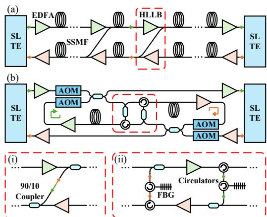
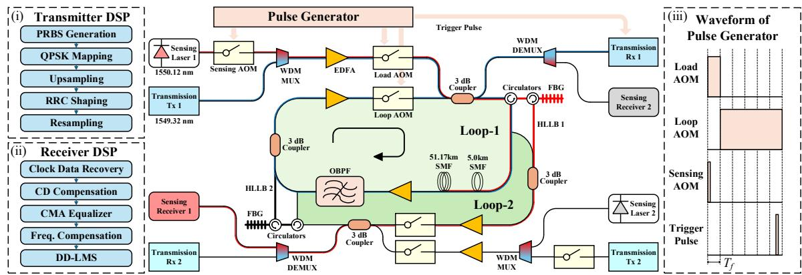
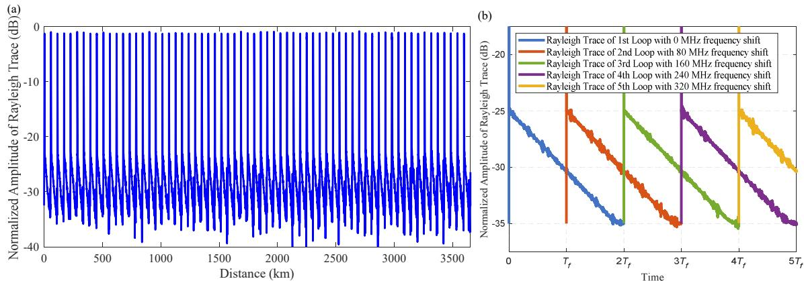
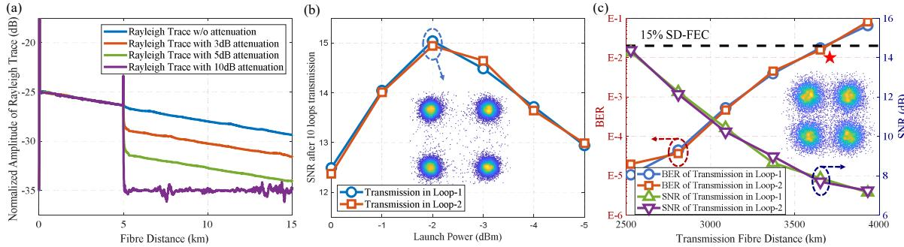

{0}------------------------------------------------

# Simultaneous Transmission and Sensing Emulation Using Interconnected Counter-Propagating Recirculating Loops

Junyu Wu(1), Zexu Liu(1), Lei Liu(1,3), Honglin Ji(2), William Shieh(1,3,\*)

- (1) School of Engineering, Westlake University, Hangzhou 310030, China, \*shiehw@westlake.edu.cn
- (2) Peng Cheng Laboratory, Shenzhen 518055, China
- (3) Westlake Institute for Optoelectronics, Hangzhou 311421, China

**Abstract** We propose the first long-haul bidirectional joint communication and sensing system using interconnected (dual) recirculating optical fibre loops with high-loss loop back and experimentally demonstrate a simultaneous 32-GBaud DP-QPSK signal transmission and backscattering-based sensing application of fault localization over 3650-km SSMF. ©2025 The Author(s)

#### Introduction

Since the 1990s, the number of submarine optical fibre cables has surged due to the growth in global internet and mobile services, with the current total length exceeding 1 million kilometres. These cables face various threats, including man-made events such as trawling activities or environmental-driven ones such as the cable rubbing against sharp rocks. Given their critical role in international and intercontinental telecommunication, sensing over live telecom networks emerges as a highly promising solution.

Research on techniques exploiting the sensitivity of optical fibre to environmental perturbations has shown that the existing network of submarine cables could potentially be used as seafloor sensors. Although backscattering-based techniques, such as distributed acoustic sensing (DAS), provide high sensitivity and spatial resolution, those approaches are currently limited to coastal areas up to several hundred kilometres from the shore owing to signal attenuation [1-4]. Sensing techniques based on laser interferometry provide a solution for sensing over much longer distances than the usable range of DAS while sacrificing the spatial resolution [5]. The polarization state of the signal also demonstrates sensing capabilities in ultra-long-haul submarine cables [6]. However, in both techniques, the cumulative phase or polarization changes over the entire fibre cables are measured, which limits the capability of detecting minor disturbances and localization [5, 6]. To address the issue, high-loss loop backs (HLLBs) with weak couplers, are inserted in each repeater for fault localization which enables backscattering light from all spans to couple back to the cable ends [7-9]. Distributed sensing techniques use fibre Bragg grating (FBG) to enhance the backscattering signal via the HLLBs at every repeater [7-9], which limits the sensing resolution to FBG spacing i.e. span length. More recently, a coherent optical frequency domain reflectometry (OFDR) DAS system over 2000-km submarine cables without

Fig. 1: (a) Structure of bidirectional submarine cables with HLLB; (b) Structure of bidirectional recirculating loops with HLLB for joint communication and sensing system; Inserts: (i) Structure of HLLB with 90/10 coupler; (ii) Structure of HLLB with circulator and FBG filter.

Bragg-reflector loopbacks has been demonstrated with about 200-m spatial resolution [10]. However, in sensing system research, more than several thousand kilometres of straight-lined transmission fibre link is necessary, the feasibility of a joint communication and sensing system with a recirculating fibre loop has never been investigated or evaluated, to the best of our knowledge.

In this paper, we propose and demonstrate the first structure of bidirectional joint communication and sensing system using interconnected (dual) counter-propagating recirculating loops (ICP-RL) with HLLBs. Based on the proposed structure, we experimentally demonstrate a joint 32-GBaud DP-QPSK transmission system over 3650-km SMF, with capabilities of backscattering-based sensing for fault localization in the fibre link. Our research signifies the feasibility and potential of the recirculating loop structure for joint communication and sensing exploration.

#### **Principle**

As shown in Fig. 1(a), the HLLB path in each repeater of submarine cables enables the backscattering sensing signal return to the sens-

{1}------------------------------------------------

Fig. 2: Experimental setup of bidirectional joint communication and sensing system using interconnected dual recirculating loops with HLLB; Insets: (i) transmitter DSP structure; (ii) receiver DSP structure; (iii) waveform of pulse generator.

ing receiver at the submarine line terminal equipment (SLTE) ends. The backscattering signal path through the HLLB to the counter-propagating cables to avoid the isolator exists in the EDFAs. However, high attenuation of the backscattering sensing signal is resulted from the HLLB path due to the 90/10 couplers commonly used in submarine cables as the structure shown in the insert (i) of Fig. 1.

We propose the first bidirectional joint communication and sensing system using a recirculating fibre loop with HLLB, which is shown in Fig. 1(b). The structure of HLLB in the recirculating loop is illustrated in insert (ii) of Fig. 1. Bidirectional communication signals are transmitted in the counterpropagating recirculating loops and received by a coherent receiver at the opposite SLTE ends. The recirculating loops are controlled by these acoustic optical modulators (AOMs). For the sensing system, circulators are used in the HLLB path to separate the backward scattering sensing signal, so that the attenuation of the HLLB path can be significantly reduced compared to using 90/10 couplers. Backscattering sensing signal is first filtered by FBGs in the HLLB path, and then coupled to the counter-propagating fibre loop and returns to the sensing receiver at the transmitter side SLTE ends. Long-haul simultaneous communication and sensing experiments can be demonstrated in laboratory based on the recirculating loop structure we proposed for joint system.

## **Experiment setup and results**

The experiment for demonstrating the bidirectional joint communication and sensing system is constructed as shown in Fig. 2, which introduces the HLLB into a recirculating optical fibre loop communication system. The communication signal is generated by modulating carriers of 1549.32nm produced by a laser array (ID Photonics CoBrite) using a dual-polarization inphase/quadrature modulator (DP-IQM, NeoPhotonics), which is driven by a common 64-GS/s 4-channel arbitrary waveform generator (AWG, Keysight M8195A) to produce 32-GBaud DP-

QPSK signals, with a 1% roll-off root-raised cosine pulse shape. The communication signal is amplified and fed into the loop-1 containing two SMF spans, two EDFAs, and an optical band pass filter (OBPF). At the output of loop-1, the communication signal is amplified to a constant receive power of 0 dBm and detected with a coherent receiver. The electrical signals are digitized by a 4-channel 80-GS/s real-time oscilloscope (DSO, Keysight DSAV334A) for offline digital signal processing (DSP), which mainly consists of clock data recovery (CDR), chromatic dispersion compensation (CDC), constant modulus algorithm (CMA), frequency offset compensation, decision-directed least mean square (DD-LMS), decision and bit-error-rate (BER) calculation. The propagation path of the communication signal in loop-1 has been marked with a blue line, and the structure of the transmitter DSP and receiver DSP has been shown in the inserts (i) and (ii).

The recirculating loop sensing system consists of two fibre lasers, an AOM and a DAS receiver. Sensing pulses repeating every 100 ms with a pulse width of about 25 µs are generated via sensing AOM driven by a digital pulse generator (DG645), of which the waveform has been shown in the insert (iii), where  $T_f$  represents the time for light to travel one loop trip of 56.17-km distance SSMF. Two fibre lasers (NKT E15) of 1550.12 nm with ~100Hz linewidth are used as the transmitter laser and LO for the DAS receiver. The sensing pulse is amplified and fed into loop-1, and the Rayleigh backscattering signal is separated and filtered by circulators and FBG, fed into reverse loop-2, and finally obtained from the output port of loop-2. The outputs of BPD are sampled and digitized using corresponding 14-bit ADCs running at 250MS/s. The propagation path of the sensing signal has been marked with a red line. The received data stream is averaged offline for an averaging time of ~12.8s (128 sweeps).

For the sensing system with the recirculating loop, we first investigate the application of the proposed fibre sensing system to the continuous

{2}------------------------------------------------

**Fig. 3:** (a) Measured OTDR trace of the recirculating fiber loop loss profile; (b) Rayleigh trace separated in frequency domain zoom in first 5 -.

**Fig. 4:** (a) Part of Rayleigh trace of the 10-th loop with an average time of about 12.8 seconds**;** (b) SNR performance over 561.7-km versus launch power; (c) BER and SNR versus transmission distance.

validation of the fibre loop. Fig. 3(a). shows the normalized amplitude of the Rayleigh trace from the sensing system. Each recirculating loop is clearly visible. We note that the Rayleigh backward scattering of each loop lasts for twice time of period of a transmission signal in the recirculating loop, which means sensing signals scattered from adjacent consecutive loops overlap when received. However, it can be easily distinguished in the frequency domain due to the frequency shift of 80 MHz introduced by the AOM in the recirculating loop, as the Rayleigh traces shown in Fig. 3(b). Then we add attenuations between two SMF spans, and part of the Rayleigh backward scattering trace of the 10th loop is shown in Fig. 4(a). Distinct spikes and steps can be observed, which demonstrates the capability of fault localization of the proposed structure for a sensing system using a recirculating loop with HLLB. Subsequently, we plan to employ OFDRbased sensing technology, which will enable longer sensing distances and vibration sensing.

For the communication system with recirculating loop, we first investigate the SNR after 561.7 km (10 loops) of transmission versus the optical launch power, as shown in Fig. 4(b). We find that the communication signal suffers from nonlinear noise when the launch power is 0 dBm. The SNR performance after 10 loops of transmission improves when the launch power is reduced from 0 dBm to -2 dBm. The optimal SNR performance is obtained when the launch power is -2 dBm, of which the constellation of recovered signal has been shown in insert of Fig. 4(b). The SNR performance degrades gradually as the launch power continues to decrease. Fig. 3(c) illustrates the BER and SNR performance plotted as a function of transmission fibre distance when the launch power is set to -2 dBm. The BER performance deteriorates gradually with the increase of transmission fibre distance. We can see that the BER is less than the 15% overhead soft decision forward error correction (SD-FEC) threshold of 2×10-2 after 65 loops of transmission in the recirculating loop system, which is more than 3650 km. The constellation diagram of the recovered signals over 65 loops transmission with a star marker is shown in the insert of Fig. 3(c).

## **Conclusions**

In this paper, we have proposed and demonstrated the first long-haul bidirectional joint communication and sensing system using interconnected dual counter-propagating recirculating fibre loops with HLLBs. For the communication system, a DP-QPSK signal at 32 GBaud, over 3650-km SSMF transmission is achieved. Simultaneously, an OTDR sensing system over 3650 km SSMF is also demonstrated. We believe our research validates the potential of the recirculating fibre loop in the research of long-haul joint communication and sensing systems.

{3}------------------------------------------------

### **References**

- [1] Williams. E. F., Fernández-Ruiz. M. R., Magalhaes. R., Vanthillo. R., Zhan. Z., González-Herráez. M., and Martins. H. F, "Distributed sensing of microseisms and teleseisms with submarine dark fibers", *Nature communications*, vol. 10, no. 1, pp. 5778, 2019, DOI: 10.1038/s41467-019-13262-7
- [2] Lindsey. N. J., Dawe. T. C., and Ajo-Franklin. J. B., "Illuminating seafloor faults and ocean dynamics with dark fiber distributed acoustic sensing", *Science*, vol. 366, no. 6469, pp. 1103–1107, 2019, DOI: 10.1126/science.aay5881
- [3] Spica. Z. J., Nishida. K., Akuhara, T., Pétrélis. F., Shinohara. M., and Yamada. T., "Marine sediment characterized by ocean bottom fiber optic seismology", *Geophysical Research Letters*, vol. 47, no. 16, pp. 784– 800, DOI: 10.1029/2020GL088360
- [4] Williams. E. F., Fernández-Ruiz. M. R., Magalhaes. R., Vanthillo. R., Zhan. Z., González-Herráez. M., and Martins. H. F, "Scholte wave inversion and passive source imaging with ocean-bottom DAS", *The Leading Edge*, vol. 40, no. 8, pp. 576-583, 2021, DOI: 10.1190/tle40080576.1
- [5] Marra. G., Clivati. C., Luckett. R., Tampellini. A., Kronjäger. J., Wright. L., Mura. A., Levi. F., Robinson. S. Xuereb. A., Baptie. B., and Calonico, D. "Ultrastable laser interferometry for earthquake detection with terrestrial and submarine cables", *Science*, vol. 361, no. 6401, pp. 486-490, 2018, DOI: 10.1126/science.aat4458
- [6] Zhan. Z., Cantono. M., Kamalov. V., Mecozzi. A., Müller. R., Yin. S., and Castellanos. J. C. "Optical polarization–based seismic and water wave sensing on transoceanic cables", *Science*, vol. 371, no. 6532, pp. 931- 936, 2021, DOI: 10.1126/science.abe6648
- [7] Otani. T., Horiuchi. Y., Kawazawa. T., Goto. K., and Akiba. S "Fault localization of optical WDM submarine cable networks using coherent-optical time-domain reflectometry", *EEE Photonics Technology Letters*, vol. 10, no. 7, pp. 1000-1002, 1998, DOI: 10.1109/68.681297
- [8] Marra. G., Fairweather. D. M., Kamalov. V., Gaynor. P., Cantono. M., Mulholland. S., Baptie. B., Castellanos. J. C., Vagenas. G., Gaudron. J. O., Kronjäger. J., Hill. I. R., Schioppo. M., Edreira. I. B., Burrows. K. A., Clivati. C., Calonico. D., and Curtis, A. "Optical interferometry– based array of seafloor environmental sensors using a transoceanic submarine cable", *Science*, vol. 376, no. 6595, pp. 874-879, 2022, DOI: 10.1126/science.abo1939
- [9] Slavík, R., Numkam Fokoua, E. R., Bradley, T. D., Taranta, A. A., Komanec, M., Zvánovec, S., Michaud-Belleau. V., Poletti. F., and Richardson, D. J. "Optical time domain backscattering of antiresonant hollow core fibers", *Optics Express*, vol. 30, no. 17, pp. 31310- 31321, 2022, DOI: 10.1364/OE.461873
- [10] Mazur. M., Fontaine. N. K., Ryf. R., Pilgrim. P., Chodkiewicz. T., Sosa. G., Carter. S. D., Jasso. S.V., Naik. J., Padmaraju. K., Mistry. A., Winter. D., Dallachiesa. L., Chen. H., and Neilson. D. T. "Real-Time In-Line Coherent Distributed Sensing over a Legacy Submarine Cable", In *Optical Fiber Communication Conference*, California, United States, 2024, DOI: 10.1364/OFC.2024.Th4B.8