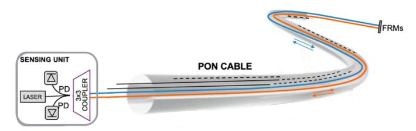
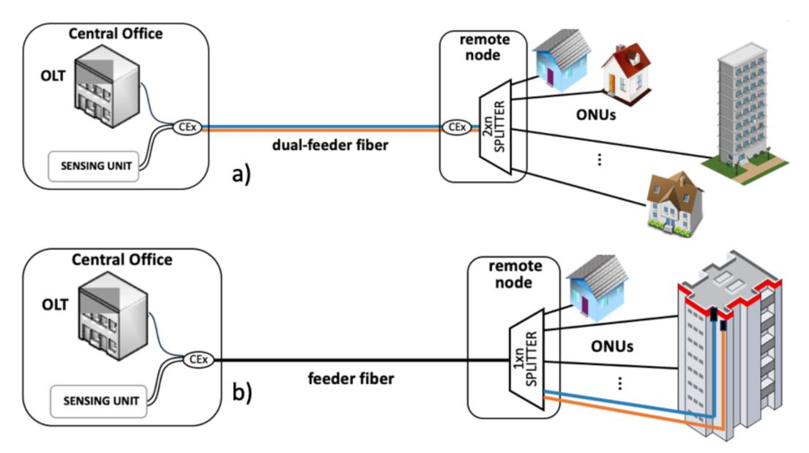

{0}------------------------------------------------

# Joint communication and sensing in access networks for anthropic activities monitoring and real-time safety surveillance

Pierpaolo Boffi

Dept. Electronics, Information
and Bioengineering

POLITECNICO di MILANO

Milan, Italy
pierpaolo.boffi@polimi.it

Marco Fasano
Dept. Electronics, Information
and Bioengineering
POLITECNICO di MILANO
Milan, Italy
marco.fasano@polimi.it

Andrea Madaschi

Dept. Electronics, Information
and Bioengineering

POLITECNICO di MILANO

Milan, Italy
andrea.madaschi@polimi.it

Paola Parolari

Dept. Electronics, Information
and Bioengineering

POLITECNICO di MILANO
Milan, Italy
paola.parolari@polimi.it

Abstract — The Passive Optical Network plays a crucial role in enabling large-scale monitoring by leveraging the existing fiber infrastructure in urban scenario. Sustainable solutions are shown to ensure monitoring of the environment and detection of anomalies dangerous for the integrity of the network infrastructure itself.

### Keywords-PON, fiber sensing, interferometry, access network

### I. INTRODUCTION

The already deployed access network is a precious asset for a global-scale pervasive and smart monitoring based on the fiber itself, with new business opportunities for the telecom providers. the network owners and the operators. Thanks to joint communication and sensing, the passive optical networks (PONs) not only constitute the real ubiquitous utility allowing us to be connected always and everywhere, but it can allow us to be completely aware of the environment around us. A sensing PON can be useful to monitor anthropogenic and natural phenomena, such as road traffic, but it can be useful also to provide a proactive surveillance of the fiber infrastructure itself, detecting in real-time dangerous situations affecting the integrity of the PON. Today the 60% of the OPEX is spent on the physical maintenance of the fiber infrastructure. Nowadays, the PON safety monitoring is assigned to OTDR systems only, which identify the fiber faults in terms of signal attenuation. However, the real-time detection of the onset of mechanical dangerous anomalies affecting the PON would prevent damages causing prolonged out of service and time-consuming repairs.

Fiber sensing in PON is characterized by specific constraints, which influence and make challenging the choice of the sensing solution to be adopted in this particular network scenario. First of all, the sustainability, in terms of cost, power consumption, DSP processing and storage, in view of large-scale applications. Sensors, such as the distributed-acoustic sensing (DAS) based ones, already available on the market, show impressive performance in terms of sensitivity and localization, but paying a prize in terms of cost and complexity. For a situational awareness at scale in a so pervasive infrastructure such as the access network in our cities, these solutions seem too expensive and inapplicable.

The coexistence between the telecommunication data and the sensing signals is another mandatory requirement, considering that the PON must operate with the different standards in terms of spectral occupancy. Finally, standard PONs are built on a Point-to-Multipoint (PtMP) architecture: this peculiar structure is a real challenge and, in many cases, is impractical for fiber-based sensing techniques. For instance, conventional sensing methods based on fiber backscattering, struggle with the simultaneous and unambiguous interrogation of all drop fibers. Additionally, the high link budget loss caused by the typical splitting ratio at the remote node (RN) can lead to sensing failure.

We propose a possible alternative sensing approach based on optical fiber interferometry (OFI), able to make sensitive the already deployed PON in a sustainable way. This solution is directly embedded inside the PON infrastructure, with a very simple, energy-efficient and cost-oriented implementation, with a minimal impact on the PON equipment, suitable for extensive applications. We show how this OFI-based interrogator can be applied to the PON to monitor human activity around the feeder fiber and potential hazards dangerous for the integrity of the PON infrastructure itself or to monitor the vibration modes of the fiber-to-the-home (FTTH) connected buildings by means of the drop fibers. Coexistence with the downstream (DS) and upstream (US) data is also confirmed.

## II. OFI-BASED INTERROGATOR FOR PON APPLICATIONS

The OFI solution [1] is based on a standard Michelson interferometer, as shown in Fig. 1, with the two fibers mirrored for the wavelength devoted to the sensing with Faraday rotator mirrors (FRMs) in order to face the polarization fading.

Fig. 1. Scheme of the OFI-based interrogator embedded inside the PON cable itself.

{1}------------------------------------------------

Fig. 2. Examples of OFI-based interrogator embedded in the PON infrastructure: OFI built by means of the dual-feeder fiber (a) and of a pair of drop fibers (b).

On the other side, a 3x 3 coupler is employed to provide passive homodyne demodulation. The peculiarity of the proposed scheme is that the reference fiber is not isolated with respect to the sensing area to be detected, but all the two fiber arms of the interferometer are inside the same cable. In this way, they accumulate the same noise, that can be easily cancelled out at the receiver. The reference fiber also is affected by the perturbation to be measured, but we demonstrated [2[ that just a slight difference in the geometrical arrangement of the fibers inside the cable allows to reveal the perturbation, maybe with a reduced sensitivity.

The OFI-based interrogator can be embedded in different ways in the PON infrastructure with respect to the perturbations that we want to monitor. The OFI can be built directly in the PON cable in case of dual-feeder fiber configuration, as shown in Fig. 2 a), to monitor anthropogenic and natural events and the safety of the feeder fiber and the remote node. Coexistence elements (CExs) are used to combine/split the PON services and the sensing signals mirrored by the FRMs located at the RN, before the passive splitter, with a minimal impact on the PON equipment. A very simple, low-effective implementation is obtained, suitable for extensive and sustainable applications, without the need of coherent transceivers, ultra-stable lasers and expensive DSP. With respect to solutions based on backscattering, the use of mirrors allows to achieve more robustness with respect to the PON losses. The OFI-based interrogator embedded in this way was used to monitor the safety of the PON cabinet in the street to provide an early warning of possible hazards [3], putting at risk the integrity of the PON infrastructure. Anthropogenic activities around the PON were also detected by the same interrogator [4], monitoring human eventsin proximity of the manhole covers, under which the PON cable is deployed.

On the other side, the OFI can be built by using two drop fibers, mirrored at the end for the sensing wavelength [5], as reported in Fig. 2 b). With this configuration the feeder fiber is not sensitive and does not introduce any contribution, because all the interference happens at the splitter. If the drop fibers run the entire height of the FTTH connected building, the vibration modes of the structure are detected to identify and timestamping possible anomalies and the beginning of a structural failure. With this approach, many buildings and skyscrapers already FTTH connected to the PONs can even operate as seismologic optical antennas for an early warning of earthquake in the urban area.

# III. CONCLUSIONS

The already deployed PONs show useful capabilities to be exploited for sensing, even presenting some challenges for the usual fiber sensors, in terms of topology, large-scale applications, and impact on the PON equipment. The OFI-based interrogator has been proposed as an alternative sensing solution, ready to use for pervasive situational awareness and for a proactive prevention of damages and breakages of the PON. The interrogator is embedded directly inside the PON structure, assuring joint communication and sensing in the present access network almost for free.

### ACKNOWLEDGMENT

This work was supported by the European Union - NextGeneration, Mission 4, Component 2, PRIN 2022, project SURENET.

### REFERENCES

- [1] P. Boffi, et al., "Real-Time Surveillance of Rail Integrity by the Deployed Telecom Fiber Infrastructure," IEEE Sensors Journal, vol. 23, no. 21, pp. 26012-26021, 2023. DOI: 10.1109/JSEN.2023.3316425
- [2] I. Di Luch, et al., "Vibration Sensing for Deployed Metropolitan Fiber Infrastructure," J. Lightwave Technol., vol. 39, no. 4, pp. 1204-1211, 2021. DOI: 10.1109/JLT.2021.3051732.
- [3] M. Fasano, et al., "In-service PON safety surveil-lance by a sustainable interferometric sensor," ECOC 2024, Frankfurt, GE, 2024, pp. 1663-1666
- [4] M. Fasano, et al., "Sensing in-service PON infrastructure by a sustainable interferometric sensor," 2024 24th ICTON, Bari, Italy.
- [5] I. Di Luch, et al., "Demonstration of structural vibration sensing in a deployed PON infrastructure," ECOC 2019, Dublin, Ireland, 2019.