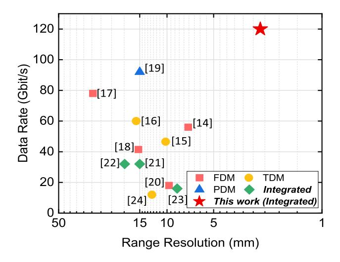
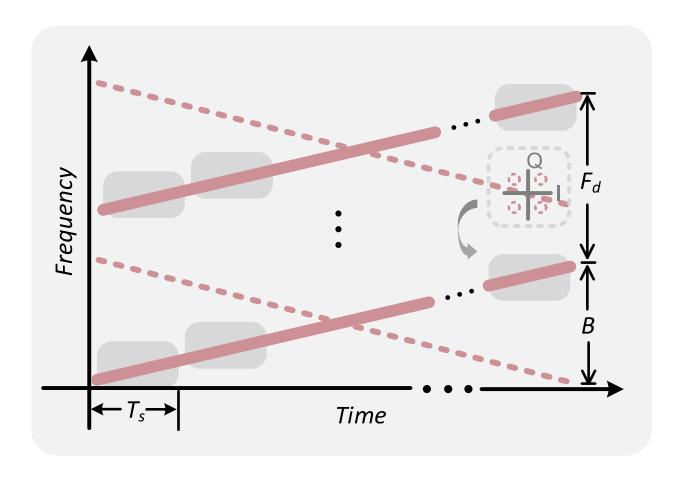
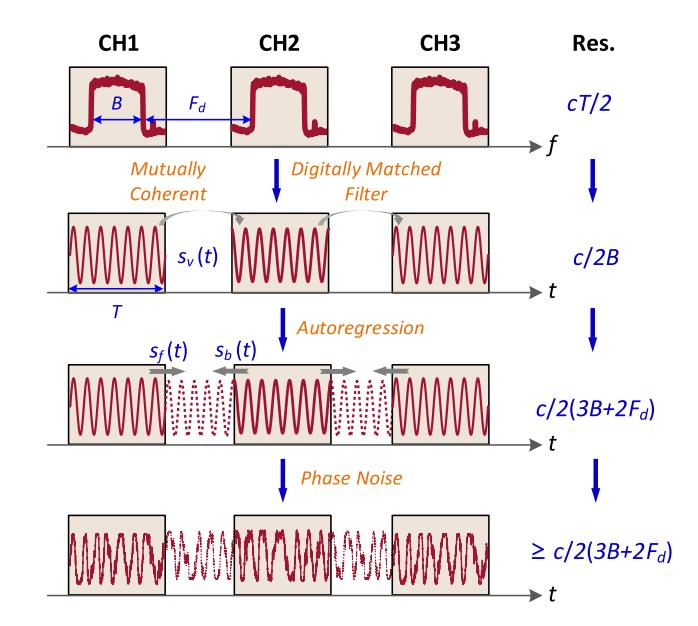
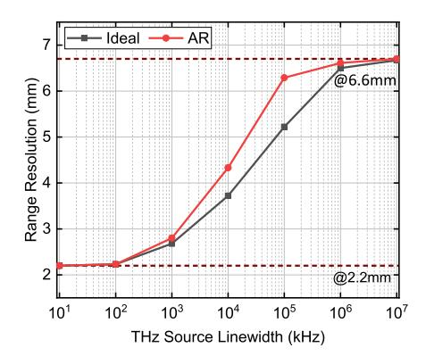
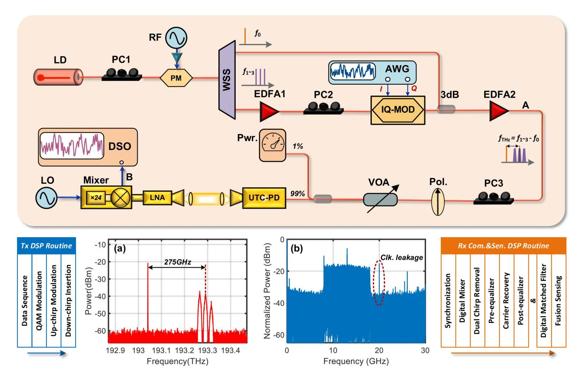
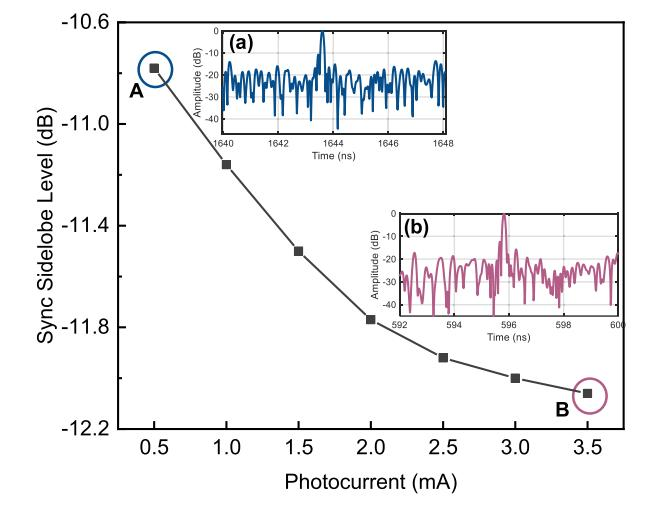
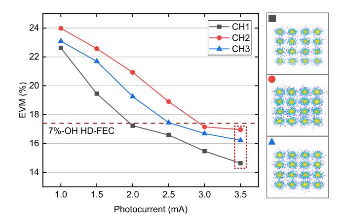
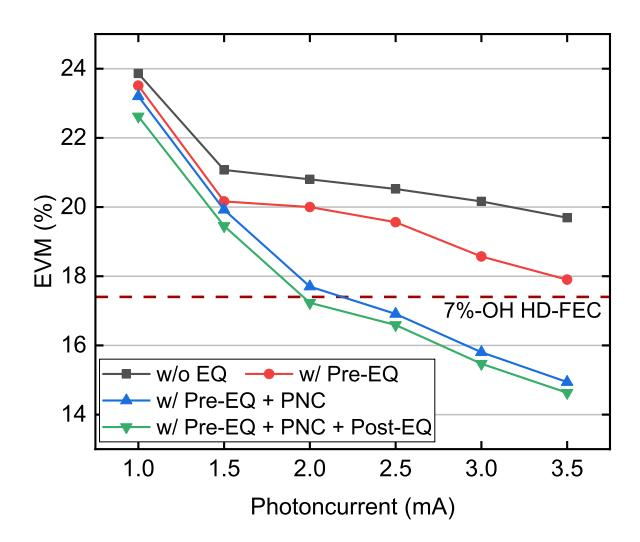
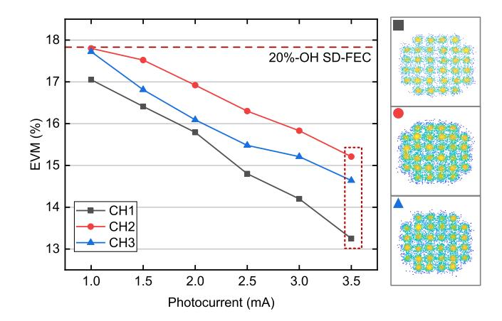
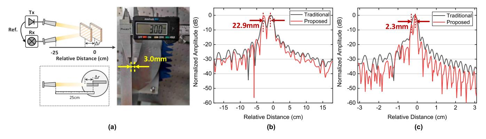

{0}------------------------------------------------

# Multi-Channel Photonic THz-ISAC System Based on Integrated LFM-QAM Waveform

Zhidong Lyu [,](https://orcid.org/0009-0009-6610-8819) Lu Zhang *[,](https://orcid.org/0000-0001-9567-155X) Member, IEEE*, Hongqi Zhang [,](https://orcid.org/0000-0003-4992-5285) Zuomin Yang [,](https://orcid.org/0000-0001-5250-5113) Changming Zhang [,](https://orcid.org/0009-0003-4937-5057) Hang Yang [,](https://orcid.org/0000-0002-0078-420X) Nan Li [,](https://orcid.org/0000-0003-4871-2376) Vjaˇceslavs Bobrovs *[,](https://orcid.org/0000-0002-5156-5162) Member, IEEE*, Oskars Ozolins *[,](https://orcid.org/0000-0001-9839-7488) Member, IEEE*, Xiaodan Pang *[,](https://orcid.org/0000-0003-4906-1704) Senior Member, IEEE*, Guangyi Liu *[,](https://orcid.org/0000-0002-8656-1946) Member, IEEE*, and Xianbin Yu *[,](https://orcid.org/0000-0003-0063-4460) Senior Member, IEEE*

*(Post-Deadline Paper)*

*Abstract***—The integrated sensing and communication (ISAC) has been envisioned as a promising technology to simultaneously perform high-capacity communication and high-accuracy sensing with efficient resource utilization. Nevertheless, due to the severe mutual constraints between communication and sensing functions, the performance of previously reported ISAC demonstrations notably trails that of individual communication or sensing systems. In this work, an integrated LFM-QAM waveform is proposed and theoretically analyzed by combining linear frequency modulation (LFM) and quadrature amplitude modulation (QAM) formats. Employing the proposed waveform and optical wavelength division multiplexing (WDM) technique, we experimentally implement a multi-channel photonic terahertz (THz)-ISAC wireless system operating at 275 GHz band, simultaneously achieving a communication data rate up to 120 Gbps and a range resolution as high as 2.5 mm. To the best of our knowledge, this is the first time to demonstrate beyond 100 Gbps wireless data rate and mm-scale**

Manuscript received 28 November 2023; revised 20 March 2024 and 13 April 2024; accepted 17 April 2024. Date of publication 22 April 2024; date of current version 14 June 2024. This work was supported in part by the National Key Research and Development Program of China under Grant 2022YFB2903800, in part by the "Pioneer" and "Leading Goose" Research and Development Program of Zhejiang under Grant 2023C01139, in part by the Natural National Science Foundation of China under Grant 62101483, in part by the Natural Science Foundation of Zhejiang Province under Grant LQ21F010015, and in part by the Vetenskapsrådet under Grant 2019-05197. An earlier version of this paper was presented at the European Conference Optical Communication (ECOC), Glasgow, Scotland, 2023. [DOI: 10.1049/icp.2023.2658]. *(Corresponding authors: Xianbin Yu; Lu Zhang.)*

Zhidong Lyu, Lu Zhang, Hongqi Zhang, Zuomin Yang, Hang Yang, Nan Li, and Xianbin Yu are with the College of Information Science and Electronic Engineering, Zhejiang University, Hangzhou 310027, China (e-mail: [zdlyu@](mailto:zdlyu@zju.edu.cn) [zju.edu.cn;](mailto:zdlyu@zju.edu.cn) [zhanglu1993@zju.edu.cn;](mailto:zhanglu1993@zju.edu.cn) [zhanghongqi@zju.edu.cn;](mailto:zhanghongqi@zju.edu.cn) [yangzuomin](mailto:yangzuomin@zju.edu.cn) [@zju.edu.cn;](mailto:yangzuomin@zju.edu.cn) [yanghange@zju.edu.cn;](mailto:yanghange@zju.edu.cn) [12031106@zju.edu.cn;](mailto:12031106@zju.edu.cn) [xyu@zju.edu.](mailto:xyu@zju.edu.cn) [cn\)](mailto:xyu@zju.edu.cn).

Changming Zhang is with the Zhejiang Laboratory, Hangzhou 311121, China (e-mail: [zhangcm@zhejianglab.com\)](mailto:zhangcm@zhejianglab.com).

Vjaˇceslavs Bobrovs is with the Institute of Telecommunications, Riga Technical University, 1048 Riga, Latvia (e-mail: [vjaceslavs.bobrovs@rtu.lv\)](mailto:vjaceslavs.bobrovs@rtu.lv).

Oskars Ozolins is with the Applied Physics Department, KTH Royal Institute of Technology, 106 91 Stockholm, Sweden, also with the RISE Research Institutes of Sweden, 164 40 Kista, Sweden, and also with the Institute of Telecommunications, Riga Technical University, 1048 Riga, Latvia (e-mail: [ozolins@kth.se\)](mailto:ozolins@kth.se).

Xiaodan Pang is with the Applied Physics Department, KTH Royal Institute of Technology, 106 91 Stockholm, Sweden, and also with the RISE Research Institutes of Sweden, 164 40 Kista, Sweden (e-mail: [xiaodan@kth.se\)](mailto:xiaodan@kth.se).

Guangyi Liu is with the China Mobile Communication Research Institute, Beijing 100032, China (e-mail: [liuguangyi@chinamobile.com\)](mailto:liuguangyi@chinamobile.com).

Color versions of one or more figures in this article are available at [https://doi.org/10.1109/JLT.2024.3392282.](https://doi.org/10.1109/JLT.2024.3392282)

Digital Object Identifier 10.1109/JLT.2024.3392282

**resolution based on an integrated waveform in the THz region, revealing the potential of THz-ISAC performance.**

*Index Terms***—High-resolution radar, Integrated sensing and communication (ISAC), Linear frequency modulated waveform and quadrature amplitude modulation (LFM-QAM), Terahertz photonics.**

#### I. INTRODUCTION

**I** N RECENT years, the sensing and communication, which have historically developed separately, present striking system similarities and gradually converge toward integration on the same frequency band and hardware architecture [\[1\].](#page-6-0) Compared to the assembling of two individuals, such kind of integrated sensing and communication (ISAC) system holds distinguished advantages of spectrum efficiency improvement, energy consumption reduction, and mutually beneficial performance, thus to attract an increasing research interest [\[2\],](#page-6-0) [\[3\].](#page-6-0) In a general sense, the higher operation frequency and broadband are the common development directions and typical development paradigms of wireless sensing and communication. Thanks to the abundant continuous bandwidth in the terahertz (THz, 0.1- 10 THz) band, incorporating the emerging ISAC functions in future wireless THz systems is acknowledged as an essential application scenario [\[4\],](#page-6-0) [\[5\],](#page-6-0) [\[6\].](#page-6-0) Up to date, numerous efforts have been so far placed to develop THz sensing and communication separately [\[7\],](#page-6-0) [\[8\].](#page-6-0) Amongst them, the photonics-based systems exhibit higher spectral purity and lower phase noise, which is unparalleled by any other architectures [\[9\],](#page-6-0) enabling wireless communication transmission exceeding 100 Gbps [\[10\],](#page-6-0) [\[11\],](#page-6-0) and multi-dimensional sensing with millimeter-level resolution [\[12\],](#page-6-0) [\[13\].](#page-6-0) In light of these, the performance of the emerging THz-ISAC systems can be promoted by leveraging photonic technologies to bridge the THz wireless links with existing optical fiber networks.

We summarize up-to-date research efforts on the progress of ISAC demonstrations in millimeter-wave (MMW) and THz band [\[14\],](#page-6-0) [\[15\],](#page-6-0) [\[16\],](#page-6-0) [\[17\],](#page-6-0) [\[18\],](#page-7-0) [\[19\],](#page-7-0) [\[20\],](#page-7-0) [\[21\],](#page-7-0) [\[22\],](#page-7-0) [\[23\],](#page-7-0) [\[24\],](#page-7-0) as shown in Fig. [1.](#page-1-0) Amongst those efforts, the multiplexingbased schemes directly schedule the traditional communication and sensing signals over non-overlapping domains, such as temporal, spectrum, and polarization. For example, using

0733-8724 © 2024 IEEE. Personal use is permitted, but republication/redistribution requires IEEE permission. See https://www.ieee.org/publications/rights/index.html for more information.

{1}------------------------------------------------

Fig. 1. Recent representative ISAC demonstrations with respect to the data rates and range resolutions.

an orthomode transducer (OMT), the electromagnetic polarization division multiplexing (PDM) technique is employed to allocate the sensing and communication signals on two orthogonal electromagnetic polarizations, simultaneously achieving a range resolution of 15 mm and up to 92 Gbps data rate in the W-band [\[19\].](#page-7-0) Although being easy to implement on hardware platforms, the aforementioned multiplexing-based designs suffer from poor resource utilization efficiency. Moreover, in terms of the THz-ISAC links, featuring strong directivity and tight coupling between sensing and communication channels, theoretical analysis has proved that the fully integrated waveforms are recommended to provide the expected integration gain [\[25\],](#page-7-0) [\[26\].](#page-7-0) For instance, to enhance robustness against the frequencyselective fading issue, a novel orthogonal chirp division multiplexing (OCDM) waveform is proposed and experimentally demonstrated, achieving 32 Gbps wireless transmission with a 1.875 cm range resolution [\[22\].](#page-7-0) The experimental results indicate that, owing to the chirp spreading property, the proposed OCDM waveform presents a better communication performance than the traditional orthogonal frequency division multiplexing (OFDM) while maintaining a comparable range resolution. Furthermore, a dual-band integrated system, demonstrated in [\[23\],](#page-7-0) is enabled by the linear frequency modulation (LFM) and OFDM waveforms, achieving a communication data rate of 16 Gbps with an 8.6 mm resolution. Such a constant envelop waveform features a low peak-to-average power ratio (PAPR) value, thereby combating the nonlinear distortions. However, the performance of the aforementioned ISAC demonstrations is not comparable to the advanced dedicated sensing or communication systems, nor is it sufficient to meet the demands of future wireless networks. In addition, it has been highlighted that the coherent fusion sensing algorithm is employed in [\[23\],](#page-7-0) simultaneously improving communication rate and range resolution, while the coherence between channels is ensured by an electrical signal generator, thus placing a high demand on the sampling rate of the digital-to-analog converter.

This paper is an extension version of our ECOC post-deadline paper [\[27\].](#page-7-0) Herein, we propose a multi-channel photonics-based

Fig. 2. Principle of multi-channel LFM-QAM waveform illustrated in the time-frequency domain.

THz-ISAC system by combining the integrated LFM-quadrature amplitude modulation (QAM) waveform with the wavelength division multiplexing (WDM) technique. The mathematical model of such an LFM-QAM waveform is formulated, and based on that, we derive the peak sidelobe ratio (PSLR) performance to discuss the influence of the QAM order. Subsequently, a proof-of-concept experiment is carried out at 275 GHz central frequency with a channel spacing of 25 GHz, simultaneously achieving a wireless transmission data rate of up to 120 Gbps and a range resolution as high as 2.5 mm. The proposed scheme highlights the significance of integrated waveforms in supporting future high-capacity and high-resolution THz-ISAC systems.

## II. OPERATION PRINCIPLE

#### *A. Multi-Channel LFM-QAM Waveform Design*

Fig. 2 depicts the basic principle of the proposed multichannel integrated LFM-QAM waveform in the time-frequency domain. In each channel, the continuous LFM waveform with a positive slope serves as the communication carrier, which can be written as:

$$s_{LFM}(t) = \exp[j\pi(2f_0t + ut^2)]$$
 (1)

where *f*0 and *u* represent the initial frequency and chirp slope, respectively. The LFM carrier linearly sweeps over the bandwidth *B* within the time duration *T* at a slope of *u* = *B* / *T*.

In each time slot *Ts*, the communication data sequence is mapped to the QAM symbols and then embedded onto the LFM carrier. The modulated LFM waveform is given by:

$$s_p(t) = a(t) \exp[j\pi(2f_0t + ut^2) + j\varphi(t)]$$
 (2)

where *a*(*t*) and ϕ(*t*) denote the amplitude and phase of QAM communication symbols, respectively.

To synchronize one communication frame, the LFM waveform with the same bandwidth but a negative slope is employed as the frame pilot. Theoretical analysis has proved that such a combination of the LFM waveform shows the best crosscorrelation performance [\[28\].](#page-7-0) Thus, the integrated LFM-QAM 

{2}------------------------------------------------

waveform can be formulated as:

$$s_{LFM-QAM}(t) = \sqrt{\gamma_p} a(t) \exp[j\pi (2f_0 t + ut^2) + j\varphi(t)]$$
$$+ \sqrt{\gamma_n} \exp[j\pi (2f_0 t + 2Bt - ut^2)] \quad (3)$$

where  $\gamma_p$  is the normalized amplitude of the LFM carrier and  $\gamma_n$  is the one of the pilot, which satisfy  $\gamma_p + \gamma_n = 1$ .

At the radar receiver, a matched filter based on pulse compression theory is employed. In our previous work, the approximate amplitude of the matched filter output of the LFM-PSK waveform is given by [29]:

$$r_{LFM-PSK}(\tau) = (T_s - |\tau|) \left| \operatorname{sinc}[\pi \mu \tau (T_s - |\tau|)] \frac{\sin(\pi \mu \tau T)}{\sin(\pi \mu \tau T_s)} \right|.$$

Due to the quasi-orthogonal property of the opposite-slope LFM pair, the ambiguity function of the integrated waveform is the linear combination of the LFM pair, we have:

$$r_{LFM-QAM}(\tau)$$

$$= \gamma_p A_m(T_s - |\tau|) \left| \operatorname{sinc}[\pi \mu \tau (T_s - |\tau|)] \frac{\sin(\pi \mu \tau T)}{\sin(\pi \mu \tau T_s)} \right|$$

$$+ \gamma_n (T - |\tau|) |\operatorname{sinc}[\pi \mu \tau (T - |\tau|)]| \tag{5}$$

where  $A_m$  represents the average amplitude of the QAM symbols.

According to (3), for maximizing the communication SINR while ensuring synchronization performance, we prefer to allocate as much power as possible to the LFM carrier, i.e.,  $\gamma_p \gg \gamma_n$ . Therefore, the approximate PSLR performance of the LFM-QAM waveform can be expressed as:

$$PSLR_{LFM-QAM} = \gamma_u A_m PSLR_{LFM-PSK}$$

$$= 2\pi \rho \gamma_u A_m \frac{1-11\rho^2}{16\rho^3 - 11\rho^2 + 1} \csc\left(\frac{11\rho^2 - 1}{8\rho^2}\pi\right)$$
(6)

where  $\rho$  is defined as the bandwidth ratio of LFM and QAM signal.

For a fixed bandwidth ratio, the PSLR increases with the LFM carrier amplitude and the QAM expectation amplitude. From (3) and (6), we can conclude that, in the case of the constant envelope modulation, such as 4QAM, the amplitude expectation  $A_m=1$ , and the modulation symbols will contribute to the sensing performance gain [25]. However, as for the multi-modulus modulation, such as 16QAM, with an amplitude expectation of  $A_m=(5+2\sqrt{5})$  / 10, the amplitude fluctuation could enhance the data rate on one hand, while it also compromises the radar performance.

In addition, according to (5), after the digitally matched filter, the range resolution of each channel can be calculated as c / 2B, where c is the vacuum velocity of light. Under the condition that all channels are coherent with each other, the time series prediction method such as autoregression (AR) can be employed to reconstruct the information of the vacant frequency bands [30], [31]. Fig. 3 displays the details of the multi-channel coherent fusion sensing algorithm. By performing the AR-based forward and backward prediction, a hypothetical time-domain signal  $s_v$  (t), corresponding to the de-chirp result of the vacant subband, can be obtained. Therefore, the interpolated subband

Fig. 3. Principle of multi-channel coherent fusion sensing algorithm.

signal can be expressed as follows

$$s_v(t_n) = s_f(t_n) + s_b(t_n)$$

$$= \sum_{l=1}^{L} a(l)s_{ch1}(t_{n-l}) + \sum_{l=1}^{L} b(l)s_{ch2}(t_{n+l})$$
 (7)

where L is the model order, which is set as one-third of the length of  $s_{ch1}$  (t). a(l) and b(l) are the forward and backward prediction coefficients, which can be estimated by the Burg algorithm and are used for the interpolation of the low-frequency and high-frequency parts of the vacant subband, respectively [31]. Thereby, we can obtain an equivalent fused wideband signal, with a promoted range resolution of  $c / 2(2B + 2F_d)$ , where  $F_d$  is the vacant bandwidth. Noted that, the THz band with large bandwidth can simultaneously accommodate multiple channels, which enables parallel processing within the system.

#### B. THz Source Phase Noise Consideration

In the aforementioned analysis, we ignore the effect of the THz source phase noise for the sake of simplicity. However, the phase noise will inevitably affect the coherence between multiple channels in practical cases, thereby leading to the performance degradation of the coherent fusion sensing algorithm.

Fig. 4 illustrates simulation results of the effect of THz source phase noise on theoretical range resolution, with an LFM bandwidth of 10 GHz for each of the three channels, which corresponds to the bandwidth in our experimental setup later on. Here, we model the THz source phase noise  $\varphi_n$  as a Wiener process with a variable linewidth [32], formulated as:

$$\varphi_n = \varphi_{n-1} + \Delta \varphi_n \tag{8}$$

where  $\Delta \varphi_n$  denotes a Gaussian distributed random variable with zero mean and variance of  $\sigma_{\varphi}^2 = 2\pi \Delta f/f_s$ , where  $f_s$  represents the sampling rate. Besides, the range resolution is estimated

{3}------------------------------------------------

Fig. 4. Effect of THz source phase noise on theoretical range resolution.

using the 3 dB spectral width of the compressed pulse, which is around 0.88·*c* / 2*B*. In Fig. 4, it is clear that the range resolution gets worse with the increasing of THz source linewidth, and meanwhile there exist two boundaries. The lower bound of 2.2 mm represents the minimum achievable resolution after the three-channel fusion procession, while the upper bound of 6.6 mm corresponds to the one-period extension of one channel with mutually incoherent three channels. Moreover, compared to the ideal case, the employment of the AR algorithm will cause a slight decrease in the range resolution of less than 1.1 mm.

Therefore, to avoid deterioration in the range resolution, it is recommended to use a THz source with a linewidth of less than 100 kHz. In the subsequent experiment, we will choose an electro-optical frequency comb source for THz signal generation [\[33\],](#page-7-0) [\[34\].](#page-7-0) After photonic heterodyning detection, if the seed laser linewidth is sufficiently narrow, the generated THz comb can be approximated as:

$$E_{THz}(t)$$

$$= \sum_{m=2}^{M} \sum_{k=1}^{m-1} A_n A_k \cos[2\pi (m-k) f_{RF} t + (m-k) \varphi_{RF}(t)]$$

(9)

where *An* is the amplitude of the *n*th optical comb line. *fRF* and ϕ*RF* denote the central frequency and the phase noise of the comb-driving radio frequency (RF) source, respectively. According to (9), such a method can ensure coherence between multiple channels. Meanwhile, the phase noise imposed on each channel will be determined purely by the RF driver, whose linewidth is less than 100 kHz apparently.

## III. EXPERIMANTAL SETUP

The experimental setup of the proposed multi-channel THz-ISAC system configuration based on the LFM-QAM waveform is shown in Fig. [5.](#page-4-0) At the transmitter side, the continuous optical wave generated from a C-band laser diode (LD, <100 kHz linewidth) is injected into an optical phase modulator (PM, EOSPACE, 40 GHz bandwidth) to generate the coherent optical frequency comb. The incident polarization state of the PM is optimized by a polarization controller (PC1). An amplified radio frequency signal with 25 GHz operation frequency and 34 dBm output power is employed to drive the PM. The inter-channel crosstalk is negligible here. Subsequently, a programmable wavelength selective switch (WSS, Ⅱ-Ⅵ, WaveShaper 4000A) is used to filter out one comb line as the optical local oscillator (LO), and 3 other 25 GHz spaced lines for baseband integrated LFM-QAM waveform modulation. The LO line and the 3 optical carriers are 250 GHz, 275 GHz, and 300 GHz apart, respectively. After being amplified by the Erbium-doped fiber amplifier (EDFA1), the optical carriers are launched into the optical in-phase and quadrature modulator (IQ-MOD, IDPHO-TONICS) for the designed integrated waveform modulation, in-between the PC2 is employed to maximize the output power of the IQ-MOD.

In the experiment, the baseband LFM-QAM integrated signal is generated by an electrical arbitrary waveform generator (AWG, Keysight M8194A, 120 GSa/s). The output voltage amplitude of the AWG is set as 80 mV to drive the IQ-MOD. In the digital domain, as shown in the inset on the lower left, the pseudorandom bit data sequence with a length of 215 - 1 (PRBS-15) is mapped into the QAM format and then modulated onto the LFM carrier. The bandwidth of the carrier is set as 10 GHz and the time duration is 1 μs. Subsequently, the LFM pilot, with the same frequency bandwidth and time duration as the carrier but one-fifteenth of the amplitude, is periodically inserted into the corresponding time slot. At this point, the 3 channel optical LFM-QAM integrated signals are generated. For THz integrated signal heterodyning generation, the modulated optical carriers need to be combined with the optical LO tone utilizing a 3 dB optical coupler (OC). Then the combined optical signal is amplified by the EDFA2 to compensate the insertion loss caused by the IQ-MOD. Fig. [5\(a\)](#page-4-0) shows the optical spectrum of the amplified signal measured by an optical spectrum analyzer (OSA, FINISAR, WaveAnalyzer 1500S), where the central frequency spacings of the adjacent channels are 25 GHz. After polarization alignment by the PC3 and a polarizer, the 3-channel optical signals are fed into the uni-traveling carrier photodiode (UTC-PD, IOD-PMJ-13001) to perform photonic heterodyning for the THz integrated signal generation. In the wake of the polarizer, a polarization-maintaining variable optical attenuator (VOA) is used to control the incident optical power of UTC-PD. The 3-channel THz integrated LFM-QAM signals are generated and emitted into the wireless link, the carrier frequencies of which are located at 250 GHz, 275 GHz, and 300 GHz, respectively, named channel 1 (CH1), CH2, and CH3, respectively.

After propagation in a 0.5 m line-of-sight (LOS) wireless link, the THz integrated signal is collected by the receiver horn antenna and then amplified using a THz low noise amplifier (THz-LNA, 22 dB gain, 12 dB noise figure) for propagation loss compensation. Subsequently, a Schottky mixer (VDI, WR3.4, 40 GHz IF bandwidth) driven by a 24-time frequency multiplied electrical LO signal is employed to perform frequency down-conversion to the intermediate frequency (IF) band. By tuning the electrical LO signal, the 3-channel IF signals can be

{4}------------------------------------------------

Fig. 5. Schematic of the proposed multi-channel photonic THz-ISAC transceiver architecture. (a) Optical spectrum of the coupled signal (Point A), (b) Electrical spectrum of the received IF signal of CH1 (Point B). LD: laser diode, PC: polarization controller, PM: phase modulator, RF: radio frequency source,WSS: wavelength selective switch, EDFA: Erbium-doped fiber amplifier, AWG: arbitrary waveform generator, IQ-MOD: in-phase and quadrature modulator, Pol.: polarizer, VOA: variable optical attenuator, Pwr.: power meter, UTC-PD: uni-traveling carrier photodiode, LNA: low noise amplifier, DSO: digital storage oscilloscope, LO: local oscillator.

individually captured and digitized by a 160 GSa/s real-time digital storage oscilloscope (DSO) with 63 GHz analog bandwidth. The stored signals are processed and analyzed offline in the digital domain. Fig. 5(b) illustrates the electrical spectrum of the obtained IF signal in CH1, and the detail of the communication and radar processing routines is shown in the inset on the lower right.

### IV. RESULTS AND DISCUSSIONS

#### *A. Synchronization Performance of LFM-QAM Waveform*

At the communication receiver, the sampled integrated LFM-QAM signal needs to be synchronized with the corresponding LFM pilot based on the matched filter to track one communication frame. Fig. 6 presents the measured sidelobe level of the synchronization results at different operation photocurrents of the UTC-PD, which represents the THz power stimulated by the optical signal. It can be seen that the sidelobe level decreases with the increase of photocurrent, and eventually stabilizes at around -12 dB due to the limitation of such an LFM waveform. Moreover, as shown in the insets of Fig. [7,](#page-5-0) the acquired synchronization results feature clear peaks even at a rather low output power level, which confirms the high noise tolerance of such an LFM pilot.

Fig. 6. Synchronization sidelobe level versus the photocurrent.

## *B. Communication Performance of LFM-QAM Waveform on Multiple Channels*

To evaluate the communication performance of the proposed LFM-QAM waveform, we measure the EVM performance for

{5}------------------------------------------------

Fig. 7. Measured 3-channel EVM performance of 16QAM versus the photocurrent.

3 channels. The symbol modulation format is set as 16QAM per channel with a 10 Gbaud data rate. Fig. 7 shows the measured EVM performance as a function of the photocurrent of the UTC-PD, and the constellation diagrams at 3.5 mA photocurrent. We can observe that when the photocurrent is larger than 3.0 mA, the overall 3 channels can achieve an EVM performance below the hard-decision forward error correction (HD-FEC) threshold with 7% overhead [\[35\].](#page-7-0) 10 Gbaud 16QAM per channel results in a gross data rate of 120 Gbps, after subtracting the FEC coding overhead, the net data rate can be calculated as 112.15 Gbps. Moreover, there exists a performance penalty between the adjacent channels of less than 0.5 mA, which is mainly caused by the fluctuations of the optical carrier power, the frequency response of the UTC-PD, and the receiver conversion loss. It is also worth noting that, the optical power of the CH3 corresponding to the 300 GHz band in Fig. [5\(a\)](#page-4-0) is slightly worse than that of other channels, due to its location at a high-order sideband. However, from the measured EVM performance in Fig. 7, the performance of CH3 is better than that of CH2, because the CH3 corresponds to the high-response band region of the THz devices.

Furthermore, we analyze the dependence of communication performance on the DSP modules, including pre-equalizer (EQ), phase noise compensation (PNC), and post-EQ. As shown in Fig. 8, the EVM performance of the CH1 for four different DSP module combinations has been measured as a function of the photocurrent of the UTC-PD. It shows the improvement by employing the appropriate DSP algorithms, especially at the high photocurrent region. Whereas, in the case of a low photocurrent, the DSP modules barely improve the EVM performance due to the limited SNR obtained. Comparing with different DSP combinations, one can observe that the PNC module promotes the EVM performance more than any other one, we believe it is because such a frequency time-varying waveform is more severely affected by the phase noise [\[36\].](#page-7-0)

Meanwhile, we also conduct the wireless transmission in the case of the 32QAM format, and the EVM results are shown in Fig. 9. The data rate is set as 8 Gbaud. We can see that the measured EVM results can stay below the soft-decision

Fig. 8. Measured EVM performance of 16QAM of the first channel versus the photocurrent with different DSP module combinations. EQ: equalizer, PNC: phase noise compensation.

Fig. 9. Measured 3-channel EVM performance of 32QAM versus the photocurrent.

forward error correction (SD-FEC) limit with 20% overhead in all channels and photocurrents, resulting in a gross data rate of 120 Gbps with a net data rate of 100 Gbps. Note that the measured EVM curves in Fig. 9 do not converge as well as those in Fig. 7. The reason is that the obtained SNR is difficult to support the modulation format with high spectral efficiency, which could be addressed by optimizing the THz sources and DSP modules.

## *C. Radar Sensing Performance of LFM-QAM Waveform and Muti-Channel Fusion Sensing*

To verify the efficiency of the proposed multi-channel fusion sensing algorithm, we demonstrate the practical targets sensing experiment, as displayed in Fig. [10.](#page-6-0) Here, two static metal targets are placed on a fixed platform and spaced 24.0 mm apart in range direction at first. The radar transceiver is configured as bistatic, collecting the reflected echoes of the three channels at three distinct times, with a 10 MHz external clock reference between

{6}------------------------------------------------

Fig. 10. (a) Schematic for two static metal targets ranging, and the measured radar range profile with the separated distance of (b) 24.0 mm and (c) 3.0 mm.

the AWG and DSO to synchronize the transceiver. Further, as displayed in Fig. 10(a), the range direction is calibrated according to the position of the farther target. Fig. 10(b) illustrates the measured range profile after a digitally matched filter, but with and without the advanced multi-channel fusion processing [\[31\].](#page-7-0) It is observed that both approaches can clearly distinguish the two targets with a measured distance of around 22.9 mm, which is close to the actual value with a 1.1 mm error. Moreover, the range profile given by the proposed algorithm exhibits a narrower pulse width, which is caused by the time-bandwidth product (TBWP) improvement of the multi-channel fusion algorithm [\[37\].](#page-7-0) Subsequently, we move the targets closer to each other little by little, and when the target distance is lower than the range resolution of a single channel, i.e., 15.0 mm in our experiment, the traditional approach cannot distinguish the two targets in the range profile. However, as shown in Fig. 10(c), after the multi-channel fusion sensing, there are two clear peaks separated by 2.3 mm, which is consistent with the theoretical value, corresponding to a measured error of 0.7 mm. It should be noted that the ranging error of the experimental system induced by the 160 GSa/s DSO can be calculated as 0.46 mm. Therefore, the results above are reasonable and acceptable with a random error of less than 0.64 mm.

#### V. CONCLUSION

In summary, a multi-channel photonic THz-ISAC system based on an LFM-QAM integrated waveform is proposed and experimentally demonstrated, to simultaneously achieve beyond 100 Gbps communication data rate and mm-scale radar sensing resolution. The proposed integrated waveform is composed of an LFM pair with opposite slopes and *m*-QAM format symbols. The theoretical analysis has validated that the order of QAM will affect the range sensing performance, as expected. By utilizing the coherence nature of multiple channels, a communication data rate of 120 Gbps and a 2.5 mm range resolution have been simultaneously achieved in a THz photonic system. Our proposed scheme indicates the high potential of the integrated waveform in supporting the development of THz-ISAC technology, providing a promising solution for simultaneous high-capacity communication and high-resolution sensing.

#### REFERENCES

- [1] F. Liu et al., "Seventy years of radar and communications: The road from separation to integration," *IEEE Signal Process. Mag.*, vol. 40, no. 5, pp. 106–121, Jul. 2023.
- [2] A. Hassanien, M. G. Amin, E. Aboutanios, and B. Himed, "Dual-function radar communication systems: A solution to the spectrum congestion problem," *IEEE Signal Process. Mag.*, vol. 36, no. 5, pp. 115–126, Sep. 2019.
- [3] F. Zhao et al., "A Ka-band 4TX/4RX dual-stream joint radarcommunication phased-array CMOS transceiver," *IEEE Trans. Microw. Theory Techn.*, vol. 72, no. 3, pp. 1993–2008, Mar. 2024.
- [4] C. Chaccour, M. N. Soorki, W. Saad, M. Bennis, P. Popovski, and M. Debbah, "Seven defining features of terahertz (THz) wireless systems: A fellowship of communication and sensing," *IEEE Commun. Surveys Tut.*, vol. 24, no. 2, pp. 967–993, Secondquarter 2022.
- [5] X. Yu et al., "Photonic-wireless communication and sensing in the terahertz band," in *Proc. IEEE Opt. Fiber Commun. Conf. Exhib.*, 2023, pp. 1–3.
- [6] Z. Liu, C. Yang, and M. Peng, "Integrated sensing and communications in terahertz systems: A theoretical perspective," *IEEE Netw.*, early access, Oct. 6, 2023, doi: [10.1109/MNET.2023.3321543.](https://dx.doi.org/10.1109/MNET.2023.3321543)
- [7] H. Zhang, L. Zhang, and X. Yu, "Terahertz band: Lighting up nextgeneration wireless communications," *China Commun.*, vol. 18, no. 5, pp. 153–174, May 2021.
- [8] L. Yi, Y. Li, and T. Nagatsuma, "Photonic radar for 3D Imaging: From millimeter to terahertz waves," *IEEE J. Sel. Topics Quantum Electron.*, vol. 29, no. 5, Sep./Oct. 2023, Art. no. 8500714.
- [9] I. F. Akyildiz, C. Han, Z. Hu, S. Nie, and J. M. Jornet, "Terahertz band communication: An old problem revisited and research directions for the next decade," *IEEE Trans. Commun.*, vol. 70, no. 6, pp. 4250–4285, Jun. 2022.
- [10] T. Harter et al., "Generalized Kramers–Kronig receiver for coherent terahertz communications," *Nature Photon.*, vol. 14, no. 10, pp. 601–606, Sep. 2020.
- [11] J. Zhang et al., "Real-time demonstration of 103.125-Gbps fiber–THz– fiber 2 × 2 MIMO transparent transmission at 360–430 GHz based on photonics," *Opt. Lett.*, vol. 47, no. 5, pp. 1214–1217, Mar. 2022.
- [12] S.Wang et al., "A terahertz photonic imaging radar system based on inverse synthetic aperture technique," in *Proc. IEEE Optoelectron. Commun. Conf.*, 2021, pp. 1–3.
- [13] Z. Yang, L. Zhang, H. Zhang, H. Yang, Z. Lyu, and X. Yu, "Photonic THz InISAR for 3D positioning with high resolution," *J. Lightw. Technol.*, vol. 41, no. 10, pp. 2999–3006, May 2023.
- [14] S. Jia et al., "A unified system with integrated generation of high-speed communication and high-resolution sensing signals based on THz photonics," *J. Lightw. Technol.*, vol. 36, no. 19, pp. 4549–4556, Oct. 2018.
- [15] Y. Wang et al., "Photonics-assisted joint high-speed communication and high-resolution radar detection system," *Opt. Lett.*, vol. 46, no. 24, pp. 6103–6105, Dec. 2021.
- [16] Y. Wang et al., "Integrated 1.58 cm range resolution radar and 60 Gbit/s 50m wireless communication based-on photonics technology in terahertz band," in *Proc. IEEE Opt. Fiber Commun. Conf. Exhib.*, 2022, pp. 1–3.
- [17] Y. Wang et al., "Joint communication and radar sensing functions system based on photonics at the W-band," *Opt. Exp.*, vol. 30, no. 8, pp. 13404–13415, Apr. 2022.

{7}------------------------------------------------

- [18] B. Dong et al., "Demonstration of photonics-based flexible integration of sensing and communication with adaptive waveforms for a W-band fiberwireless integrated network," *Opt. Exp.*, vol. 30, no. 22, pp. 40936–40950, Oct. 2022.
- [19] M. Lei et al., "Integration of sensing and communication in a W-band fiber-wireless link enabled by electromagnetic polarization multiplexing," *J. Lightw. Technol.*, vol. 41, no. 23, pp. 7128–7138, Dec. 2023.
- [20] N. Zhong, P. Li, W. Bai, W. Pan, L. Yan, and X. Zou, "Spectral-efficient frequency-division photonic millimeter-wave integrated sensing and communication system using improved sparse LFM sub-bands fusion," *J. Lightw. Technol.*, vol. 41, no. 23, pp. 7105–7114, Dec. 2023.
- [21] Z. Xue et al., "Tunable K /W-band OFDM integrated radar and communication system based on optoelectronic oscillator for intelligent transportation," *Opt. Exp.*, vol. 30, no. 20, pp. 35270–35281, Sep. 2022.
- [22] L. Li et al., "THz-over-fiber system with orthogonal chirp division multiplexing for integrated sensing and communication," *J. Lightw. Technol.*, vol. 42, no. 1, pp. 176–183, Jan. 2024.
- [23] W. Bai et al., "Photonics-assisted millimeter-wave multiband integrated sensing and communication system using coherent receiving," *IEEE J. Sel. Topics Quantum Electron.*, vol. 29, no. 6, Nov./Dec. 2023, Art. no. 7601111.
- [24] W. Deng et al., "A D-band joint radar-communication CMOS transceiver," *IEEE J. Solid-State Circuits*, vol. 58, no. 2, pp. 411–427, Feb. 2023.
- [25] Y. Xiong, F. Liu, Y. Cui, W. Yuan, T. X. Han, and G. Caire, "On the fundamental tradeoff of integrated sensing and communications under Gaussian channels," *IEEE Trans. Inf. Theory*, vol. 69, no. 9, pp. 5723–5751, Sep. 2023.
- [26] T. Mao, J. Chen, Q. Wang, C. Han, Z. Wang, and G. K. Karagiannidis, "Waveform design for joint sensing and communications in millimeterwave and low terahertz bands," *IEEE Trans. Commun.*, vol. 70, no. 10, pp. 7023–7039, Oct. 2022.
- [27] Z. Lyu et al., "Photonic THz-ISAC demonstration with simultaneous 120Gbit/s communication and 2.5mm sensing resolution," in *Proc. IEEE 49th Eur. Conf. Opt. Commun.*, 2023, pp. 1650–1653.

- [28] Z. Lyu et al., "Preamble-free synchronization based on dual-chirp waveforms for photonic THz-ISAC," *J. Lightw. Technol.*, vol. 42, no. 8, pp. 2657–2665, Apr. 2024.
- [29] Z. Lyu et al., "Radar-centric photonic terahertz integrated sensing and communication system based on LFM-PSK waveform," *IEEE Trans. Microw. Theory Techn.*, vol. 71, no. 11, pp. 5019–5027, Nov. 2023.
- [30] S. Peng, S. Li, X. Xue, X. Xiao, D. Wu, and X. Zheng, "A photonics-based coherent dual-band radar for super-resolution range profile," *IEEE Photon. J.*, vol. 11, no. 4, Aug. 2019, Art. no. 5502408.
- [31] P. Hu, S. Xu, W. Wu, and Z. Chen, "Sparse subband ISAR imaging based on autoregressive model and smoothed *l* 0 algorithm," *IEEE Sensors J.*, vol. 18, no. 22, pp. 9315–0323, Nov. 2018.
- [32] E. Chen, B. Buscaino, and J. M. Kakn, "Phase noise analysis of resonatorenhanced electro-optic comb-based analog coherent receiver," *J. Lightw. Technol.*, vol. 40, no. 21, pp. 7117–7128, Nov. 2022.
- [33] Z. Yang et al., "Robust photonic terahertz vector imaging scheme using an optical frequency comb," *J. Lightw. Technol.*, vol. 40, no. 9, pp. 2717–2723, May 2022.
- [34] D. Nopchinda, Z. Zhou, Z. Liu, and I. Darwazeh, "Multiband combenabled mm-wave transmission," *IEEE Trans. Microw. Theory Techn.*, vol. 72, no. 1, pp. 787–796, Jan. 2024,.
- [35] Z.-K. Weng, A. Kanno, and T. Kawanishi, "2-bit delta-sigma modulated 32-QAM OFDM based dual-wavelength digital RoF link," in *Proc. IEEE Opt. Fiber Commun. Conf. Exhib.*, 2021, pp. 1–3.
- [36] P. Tschapek, G. Körner, A. Hofmann, C. Carlowitz, andM. Vossiek, "Phase noise spectral density measurement of broadband frequency-modulated radar signals," *IEEE Trans. Microw. Theory Techn.*, vol. 70, no. 4, pp. 2370–2379, Apr. 2022.
- [37] C. Ma et al., "Microwave photonic imaging radar with a sub-centimeterlevel resolution," *J. Lightw. Technol.*, vol. 38, no. 18, pp. 4948–4954, Sep. 2020.