{0}------------------------------------------------

# Experimental Demonstration of Integrated Optical Wireless Sensing and Communication

Lina Shi , Ziqi Liu, Bastien Béchadergue, *Member, IEEE*, Hongyu Guan, *Member, IEEE*, Luc Chassagne, and Xun Zhang, *Senior Member, IEEE* 

Abstract—Whilethe contours of 6G are still being defined, integrated sensing and communication (ISAC) has been identified by the International Telecommunications Union (ITU) as a key feature of next-generation wireless communications. Given the maturity already demonstrated for data transmission on the one hand, and positioning on the other hand, optical wireless communications (OWC) could offer promising solutions for ISAC implementation, especially in indoor scenarios. In this paper, we propose and implement an OWC-based ISAC system that relies on multi-band carrierless amplitude and phase (m-CAP) modulation associated with received signal strength (RSS)-based positioning to achieve data transmission and localization from the same signal. This m-CAP/RSS system is deployed in a  $1.2 \times 1.2 \times 2.16$  m3 room using four access points installed on the ceiling, and can provide a communication link at a data rate of 12 Mbps with a bit error rate of less than  $3.8\times 10^{-3}$  to any user in a reception plane 20 cm above the ground, while estimating its position with an error of less than 5.9 cm in 90% of cases.

Index Terms—Integrated sensing and communication (ISAC), multiband carrierless amplitude and phase (m-CAP), optical wireless communications (OWC), received signal strength (RSS).

## I. INTRODUCTION

HILE the rollout of 5G is still underway, the world of research along with standards bodies such as the International Telecommunications Union (ITU) are now fully focused on the sixth generation (6G) of international mobile telecommunications (IMT) [1]. In November 2023, the ITU thus unveiled, under the official name of *IMT-2030*, its vision of 6G, which includes improvements to existing 5G networks, as well as

Manuscript received 1 March 2024; revised 22 May 2024; accepted 11 June 2024. Date of publication 17 June 2024; date of current version 16 October 2024. This work was supported in part by the company Oledcomm through the UVSQ-Oledcomm industrial partnership, in part by the French National Research Agency (ANR) through the Project SAFELiFi under Grant ANR-21-CE25-0001-01, in part by European Union's Horizon 2020 Research and Innovation Programme through the Project 6G-BRAINS under Grant 101017226, and in part by Smart Networks and Services Joint Undertaking (SNS JU) under Grant 101139292. (Corresponding author: Bastien Béchadergue.)

Lina Shi, Ziqi Liu, Bastien Béchadergue, Hongyu Guan, and Luc Chassagne are with the Laboratoire d'Ingénierie des Systèmes de Versailles (LISV), UVSQ - Université Paris-Saclay, 78140 Vélizy-Villacoublay, France (e-mail: bastien.bechadergue@uvsq.fr).

Xun Zhang is with the Laboratoire d'Ingénierie des Systèmes de Versailles (LISV), UVSQ - Université Paris-Saclay, 78140 Vélizy-Villacoublay, France, and also with the Institut Supérieur d'Electronique de Paris (ISEP), 92130 Issyles-Moulineaux, France.

Color versions of one or more figures in this article are available at  $\frac{1}{1000}$  https://doi.org/10.1109/JLT.2024.3415417.

Digital Object Identifier 10.1109/JLT.2024.3415417

major evolution such as integrated sensing and communication (ISAC) [2].

ISAC consists in sharing the same resources in the time, frequency and space domains to perform both sensing and communication in a fully integrated system [3]. The sensing function itself includes positioning, which should aim at an accuracy between 1 and 10 cm according to the IMT-2030 framework [2], but may also include environment sensing or even gesture recognition, so that future networks have the ability to "see" the physical world. Such ISAC systems could enable the emergence of a wide range of applications, from agile interdevice communications or accurate human-device interaction and control in the context of massive Internet of Things networks and Industry 4.0, to non-terrestrial networks [4], [5].

As 6G is expected to also improve by an order of magnitude several key performance indicators, such as throughput and latency, new frequency bands will be required, among which millimeter, THz and optical waves are seen as promising candidates [6], [7], [8]. The use of the optical spectrum for communications has especially been intensively studied for several decades, for the transmission of data over long distances using optical fibers. The maturity of this technology then accelerated the emergence of optical wireless communications (OWC) for wireless data transmission over short distances indoors – including the implementation of optically-based wireless local area networks, known as light-fidelity (LiFi) networks [8] – as well as for outdoor communication over longer distances in free-space optics configurations.

The advantages of OWC are multiple, ranging from the ability to use wide frequency bands from the ultraviolet to the infrared (IR) spectrum, to the high security of communication links, and including the availability of mature optoelectronic components such as light-emitting diodes (LED), laser diodes, vertical cavity surface emitting lasers, positive-intrinsic-negative (PIN) and avalanche photodiodes (PD). Therefore, these technologies have been the subject of research efforts for several years, to the point of now being standardized within the ITU [9], but also as a complementary technology to WiFi within the 802.11 group of the Institute of Electrical and Electronics Engineers (IEEE) [10], and commercialized by companies such as Oledcomm, pureLiFi or Signify [11].

Much of this research has focused on optimizing the spectral and energy efficiency of OWCs, using various types of orthogonal frequency division multiplexing (OFDM) schemes [12], or other techniques such as muti-band carrierless amplitude and

0733-8724 © 2024 IEEE. Personal use is permitted, but republication/redistribution requires IEEE permission. See https://www.ieee.org/publications/rights/index.html for more information.

{1}------------------------------------------------

| TABLE I                                                                                                                      |
|------------------------------------------------------------------------------------------------------------------------------|
| COMPARISON BETWEEN THE EXISTING LITERATURE ON EXPERIMENTAL DEMONSTRATION OF OWC-BASED ISAC AND OUR WORK (CDMA: CODE DIVISION |
| MULTIPLE ACCESS, DDM: DIFFERENCE IN DEPTH OF MODULATION, FBMC: FILTER BANK MULTI-CARRIER, ND: NON-DEFINED)                   |

| Reference | Year | Modulation | Positioning algorithm | Data rate (pre-FEC) | Positioning accuracy (type) | Type of Tx | Type of Rx | Test space                               |
|-----------|------|------------|-----------------------|------------------------|-----------------------------|------------|------------|------------------------------------------|
| [24]      | 2017 | OFDMA      | RSS                   | 1.7 Mbaud              | 1.68 cm (mean)              | 3 LED      | 1 PD       | $0.2 \times 0.2 \times 0.15 \text{ m}^3$ |
| [25]      | 2018 | FBMC       | PDOA                  | ND                     | 6.08 cm (mean)              | 3 LED      | 1 PD       | $1.2 \times 1.2 \times 2.1 \text{ m}^3$  |
| [26]      | 2021 | OFDM       | TOF                   | ND                     | < 10 cm (ND)                | 3 LED      | 1 PD       | $1.0 \times 1.0 \times 2.0 \text{ m}^3$  |
| [27]      | 2022 | CDMA       | RSS                   | 1-3 Mbps               | 1.5 cm (mean)               | 4 LED      | 1 PD       | $0.6 \times 0.6 \times 0.5 \text{ m}^3$  |
| [28]      | 2022 | OOK        | RSS                   | 0.12 Mbps              | 3.43 cm (mean)              | 1 LED      | 5 PD       | $1.0 \times 1.0 \times 2.5 \text{ m}^3$  |
| [29]      | 2023 | ООК        | Computer              | 0.44 Mbps              | 3.35 cm (mean)              | 1 LED      | 1 PD       | $2.0 \times 2.0 \times 3.0 \text{ m}^3$  |
| [27]      | 2023 | OOK        | vision                | 0. <del>11</del> Wibps | 5.55 cm (mean)              | 1 beacon   | 1 camera   | 2.0 × 2.0 × 5.0 m                        |
| [30]      | 2023 | DDM        | RSS                   | ND                     | 2 cm (96%)                  | 4 LED      | 1 PD       | $0.6 \times 0.6 \times 0.9 \text{ m}^3$  |
| [31]      | 2023 | OFDMA      | PDOA                  | 22.3 Mbps              | 8 cm (80%)                  | 4 LED      | 1 PD       | $2.0 \times 2.0 \times 1.5 \text{ m}^3$  |
| This work | 2024 | m-CAP      | RSS                   | 12 Mbps                | 5.9 cm (90%)                | 4 LED      | 3 PD       | $1.2 \times 1.2 \times 2.16 \text{ m}^3$ |

phase (*m*-CAP) modulations, which offer better peak-to-average power ratio (PAPR) performance for a lower computational complexity [13], [14], [15], [16]. At the same time, remarkable efforts have been made to increase the data rate, with some works reaching Tbps [17]. In parallel, various solutions for optical-based positioning, gathered under the label of *visible light positioning*, have been proposed and studied. These include techniques such as received signal strength (RSS), time of arrival (TOA), time or phase difference of arrival (TDPA/PDOA) and angle of arrival (AOA), which all have their advantages and drawbacks, even though RSS remains less complex and can be used with a single PD, which is why it has been adopted in many works [18].

The use of OWC systems for ISAC is also beginning to be studied, not only through simulations [19], [20], [21], [22], [23] but also experimentally [24], [25], [26], [27], [28], [29], [30], [31]. In [23], we proposed an ISAC system based on white LED sources and capable, according to simulations, of providing an illuminance between 300 and 500 lx over an entire  $4 \times 4 \times$ 2.5 m3 room, while ensuring two dimensional (2D) positioning using RSS with an error of less than 7.17 cm in 90% of cases, and continuous data connectivity with m-CAP at 32 Mbps. Compared to the existing literature, the interest of that work was to validate that m-CAP and RSS could be combined together and to find the optimal m-CAP parameters for ISAC with decent performance while taking into account lighting constraints and LED limitations in terms of bandwidth and dynamic range. The results thus obtained however needed to be consolidated experimentally, which is what we propose to do in this article.

From an experimental point of view, a few works on OWC-based ISAC have already been published, demonstrating very interesting performances, as shown in Table I. Pulsed modulations like on-off keying (OOK) have been combined with multiple positioning techniques, including RSS [27], [28] and computer vision [29], to provide positioning accuracy of about 2 to 3 cm, at the cost, however, of low data rates in the order of 1 Mbps, before forward error correction (FEC). Multicarrier modulations like OFDM/OFDM multiple access (OFDMA) have thus been studied to demonstrate larger data rates with positioning accuracy still below 10 cm, as in [24] where it is combined with RSS to reach an average positioning error of 1.68 cm, or in [26] where a time-of-flight (TOF) technique derived from TOA is

implemented within the ITU-T G.9991 layers [9] for ISAC in industrial environments. In [31], an OFDM/PDOA system is extensively studied and shown to offer a good compromise between communication and positioning, providing a pre-FEC data rate of 22.3 Mbps while ensuring positioning with an error below 8 cm in 80% of cases.

This brief review shows, however, that m-CAP modulation and RSS have never been combined experimentally in an OWC-based ISAC system, which confirms the interest of validating our previous simulation results with a prototype. In addition, it shows that at the exception of [26], the systems proposed rely mainly on custom-made optical emitters and receivers based on commercial LED or PD modules not necessarily optimized for OWC applications. In this paper, we therefore aim at demonstrating experimentally the feasibility of such an OWC-based ISAC system with two main priorities: the use of m-CAP and RSS on the one hand, the use of optical antennas available on the OWC market on the other hand. In addition, we focused our efforts on the positioning performance rather than the data rate performance, given the multitude of works already published on the latter subject.

To that end, we implemented a prototype with universal software radio peripheral (USRP) boards for signal generation and processing, connected to optical transceivers – or antennas – initially designed by Oledcomm for a commercial OWC product, and based on IR LEDs for emission and PIN PDs for reception. Using four such antennas, installed on the ceiling of a 1.2  $\times$  1.2  $\times$  2.16 m³ room, this system transmits data at a pre-FEC rate of 12 Mbps with a bit error rate (BER) below 3.8  $\times$  10 $^{-3}$ , whatever the user's position in a receiver plane 20 cm above the ground. At the same time, the user's coordinates can be estimated with an error of less than 5.9 cm in 90% of cases, hence demonstrating positioning performance in line not only with the current literature, as highlighted in Table I, but also with the ITU-2030 requirements.

The general architecture and operating principle of this system are described in greater detail in Section II, where the basics of m-CAP modulation and RSS positioning are presented. Section III then shows how this system has been implemented in practice, and lists the differences between the theoretical system and its experimental version, as well as their possible impact on positioning and data transmission performance, which is

{2}------------------------------------------------

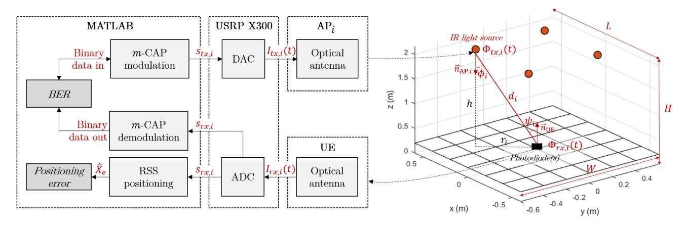

Fig. 1. Architecture of the proposed OWC-based ISAC system.

assessed in Section IV. Finally, Section V concludes the article with the main findings and suggestions of future work.

# II. WORKING PRINCIPLES OF OWC-BASED ISAC WITH $m ext{-}\mathrm{CAP}$ and RSS

In this section, we detail the fundamental principles of the proposed OWC-based ISAC system, namely its architecture (Section II-A) and modeling (Section II-B), the *m*-CAP modulation it relies on for data transmission (Section II-C) and the RSS positioning technique it uses for sensing (Section II-D).

#### A. Architecture of the Proposed ISAC System

The structure of the proposed OWC-based ISAC system is detailed in Fig. 1. On the infrastructure side, it is composed of  $N_{\rm AP}$  access points (AP) distributed across the ceiling of an  $L\times W\times H$  m³ room, each pointing in the direction defined by the unit director vector of their optical axis  $\vec{n}_{{\rm AP},i}$ . At the other end of the link, an user equipment (UE) can move anywhere in an x-y receiver plane located at a vertical distance h from the APs, with an orientation defined according to the unit director vector  $\vec{n}_{\rm UE}$  of its optical axis.

In such a configuration, the system operates as follows: for each AP, a binary data stream is first modulated into a digital m-CAP signal  $s_{tx,i}$ , with i the index of the i-th AP, and then converted into an analog current signal  $I_{tx,i}(t)$  by a digital-to-analog converter (DAC). This current signal drives the transmitting end of the IR optical antenna that equips the *i*-th AP, which therefore adds a direct current (DC) bias current  $I_b$  to  $I_{tx,i}(t)$  and converts it into an optical signal  $\Phi_{tx,i}(t)$  that propagates in free space via multiple paths to the receiving end of the UE's optical antenna. The collected optical signal  $\Phi_{rx,i}(t)$ is converted into an electrical signal  $I_{rx,i}(t)$ , which is then digitized by an analog-to-digital converter (ADC). The resulting digital signal  $s_{rx,i}$  is finally processed in parallel to recover the transmitted data ('m-CAP demodulation' block), and estimate the coordinates  $\hat{X}_e = (\hat{x}_e, \hat{y}_e)$  of the UE after receiving signals from at least four different APs ('RSS positioning' block).

In Fig. 1, only four APs, pointing each toward the floor, and one UE pointing toward the ceiling are represented, as this

corresponds to the experimental setup implemented later, and highlights some fundamental assumptions made in this work for the RSS positioning method to work: 1) at least four different light sources are needed, 2) the APs and the UE must have co-linear normal vectors oriented respectively along the z and -z axis, and 3) the vertical distance along the z axis between each AP and the UE is known and equal to h, which means localization of the UE is performed in the x-y receiver plane. These assumptions will be further commented in Section II-C.

In addition, Fig. 1 shows that for the experiments, some building blocks were implemented with MATLAB while others were based on an Ettus USRP X300. Although details of the prototype will be given in Section III-A, we can already state that the final objective of such a demonstrator was to evaluate the performance of the proposed system according to several metrics: the BER and communication coverage for the communication function (block 'BER' in Fig. 1), and the root mean square (RMS) positioning error for the sensing function ('Positioning error' block in Fig. 1).

# B. Modeling of the Proposed System

1) Theoretical Modeling: From a theoretical point of view, the different signals listed in Fig. 1 can be linked with each other through convolutions with different impulse responses. To begin with, we can observe that the optical signal  $\Phi_{tx,i}(t)$  emitted by the *i*-th AP depends directly on its modulation signal  $I_{tx,i}(t)$ . Each AP is indeed equipped with at least one IR LED combined with its control circuit, which role is to add a DC bias current  $I_b$  to  $I_{tx,i}(t)$  and then convert the resulting signal into a photon flux. LEDs are generally modeled as first-order RC electro-optical converters [32], which recent physics-based modeling work has revisited to better capture certain non-linearities [33], [34]. Assuming the AP's response can eventually be captured in a generic impulse response  $h_{AP,i}(t)$ , we can deduce that:

$$\Phi_{tx,i}(t) = (I_{tx,i}(t) + I_b) * h_{AP,i}(t), \tag{1}$$

where '\*' is the convolution product.

At the UE's receiver level, the incident optical signal  $\Phi_{rx,i}(t)$  is theoretically equal to the transmitted optical signal  $\Phi_{tx,i}(t)$ 

{3}------------------------------------------------

convolved with the impulse response  $h_{c,i}(t)$  of the optical wireless channel. In practice, this impulse response is made up of a line-of-sight (LOS) component  $h_{\mathrm{LOS},i}(t)$ , corresponding to the direct path between the i-th AP and the UE, and of a non-LOS (NLOS) component  $h_{\mathrm{NLOS},i}(t)$  coming from the multiple paths that include at least one reflection between the AP and the UE. In other words,  $h_{c,i}(t) = h_{\mathrm{LOS},i}(t) + h_{\mathrm{NLOS},i}(t)$ , where  $h_{\mathrm{LOS},i}(t) = H_{\mathrm{LOS}}(0)\delta(t-d_i/c)$ , with  $\delta(\cdot)$  the Dirac function,  $d_i$  the absolute distance between the i-th AP and the UE, c the celerity of light (so that  $d_i/c$  is the propagation delay between the i-th AP and the UE), and where  $H_{\mathrm{LOS}}(0)$  is the OWC channel DC-gain, which mainly depends on the link geometry.

Assuming this link geometry is as represented on the right part of Fig. 1, i.e. that the APs are all pointing to the floor and the UE is pointing to the ceiling, then whatever the position of the UE in the x-y receiver plane, the radiation and incidence angles  $\phi_i$  and  $\psi_i$  are such that  $\cos\phi_i=\cos\psi_i=h/d_i$ . In such a case, and if the incidence angle  $\psi_i$  is lower than the UE's field-of-view (FOV)  $\Psi_c$ , then [35]:

$$H_{\text{LOS,i}}(0) = \frac{A_{\text{PD}}(m_i + 1)}{2\pi d_i^2} \cos^{m_i} \phi_i \cos \psi_i$$

$$= \frac{A_{\text{PD}}(m_i + 1) h^{m_i + 1}}{2\pi d_i^{m_i + 3}},$$
(2)

with  $A_{\rm PD}$  the overall sensitive area of the UE and  $m_i$  the order of Lambertian emission of the IR LED on the i-th AP, which is related to its semi-angle at half-power  $\Phi_{1/2,i}$  by  $m_i = -\ln 2/\ln(\cos(\Phi_{1/2,i}))$ .

Finally, we can note that the analog signal  $I_{rx,i}(t)$  produced by the UE's optical antenna is obtained after conversion of the incident optical signal  $\Phi_{rx,i}(t)$  from the optical domain to the electrical domain by one or more PDs combined with their respective transimpedance amplifiers (TIA). These components are often modelled together as a band-pass opto-electrical converter, which gain results from the combination of the PD responsivity  $R_{PD}$  and the TIA gain, which high-pass and low-pass cut-off frequencies are mainly set by capacitors within the PDs and the feedback loop of the TIA, and which outputs a parasitic noise signal n(t) resulting mainly from dark noise, shot noise and thermal noise sources [35]. Assuming the UE's response can eventually be captured in a generic impulse response  $h_{\rm UE}(t)$ and that the noise signal n(t) is an additive white Gaussian noise (AWGN) independent from the received optical signal, we can deduce that:

$$I_{rx,i}(t) = \Phi_{rx,i}(t) * h_{\text{UE}}(t) + n(t).$$
 (3)

By combining (1), (2) and (3), we can eventually express the following relationship between the modulation signal  $I_{tx,i}(t)$  and the received signal  $I_{rx,i}(t)$ , which captures the distortion experienced by the original data signal after emission, propagation and reception:

$$I_{rx,i}(t) = (I_{tx,i}(t) + I_b) * h_{AP,i}(t) * h_{c,i}(t) * h_{UE}(t) + n(t).$$
(4)

2) Practical Modeling: From the system's point of view, only the digital and analog modulation signals  $s_{tx,i}$  and  $I_{tx,i}(t)$ , as well as the analog and digitized received signals  $I_{rx,i}(t)$  and

 $s_{rx,i}$ , may be known at any given time. The optical signals  $\Phi_{tx,i}(t)$  and  $\Phi_{rx,i}(t)$ , respectively transmitted by the *i*-th AP and received by the UE, cannot be measured by the system, unless it is equipped with dedicated power meters or sensors, which would considerably complicate its architecture. However, as we will see in more detail in Section II-C, estimates of the average values of these signals need to be calculated for the RSS positioning algorithm to work properly. It is therefore necessary to derive expressions for these estimates, which can be done by modeling explicitly the responses of the APs and UE.

In this work, we have targeted to keep the complexity of our system as low as possible, and have hence adopted the following simple linear relationship to estimate the average transmitted optical power, noted  $\widehat{\Phi}_{tx,i}$ , from the modulation signal  $I_{tx,i}(t)$  only (i.e. without taking into account the DC bias, as this component is then filtered out by the UE):

$$\widehat{\Phi}_{tx,i} = \eta_{\mathsf{AP},i} \mathbb{V} \left\{ I_{tx,i}(t) \right\},\tag{5}$$

where  $\eta_{\text{AP},i}$  is a constant electro-optical conversion factor and  $\mathbb{V}\{\cdot\}$  is the variance function.

Similarly, we have adopted a linear relationship of the following form to estimate the average optical power incident on the UE's optical antenna, noted  $\widehat{\Phi}_{rx,i}$ , from the electrical power of the resulting analog signal  $I_{rx,i}(t)$ :

$$\widehat{\Phi}_{rx,i} = \eta_{\text{UE}} \mathbb{V} \left\{ I_{rx,i}(t) \right\}, \tag{6}$$

with  $\eta_{\rm UE}$  a constant opto-electrical conversion factor. Note that since the UE behaves like a band-pass opto-electrical converter,  $I_{rx,i}(t)$  does not have any DC component, which means the contribution from the DC bias current  $I_b$  to the incident optical signal is indeed removed, as stated previously.

Although very simple to implement, these two estimators are obviously biased. First, they do not take into account the filtering behavior of both the AP and the UE, i.e. their possible non-flat frequency responses. In addition, the estimator of the average received optical power is based on the analog signal  $I_{rx,i}(t)$  produced by the UE, which is by construction tainted by the AWGN n(t). We can therefore deduce that the estimate of the UE's location provided by the system will necessarily contain an error, as we are now going to see in more details.

#### C. RSS for Positioning

From a sensing perspective, the role of the proposed OWC-based ISAC system is to find the location of the UE in the x-y receiver plane, i.e. to provide an estimate  $\widehat{X}_e = (\widehat{x}_e, \widehat{y}_e)$  of the real coordinates  $X_e = (x_e, y_e)$  of the UE, assuming its position on the z-axis is already known  $(z_e = h)$ . The sensing performance of the system can then be evaluated through the root-mean square (RMS) positioning error  $\Delta$ , given by:

$$\Delta = \sqrt{(\hat{x}_e - x_e)^2 + (\hat{y}_e - y_e)^2}. (7)$$

To obtain the estimate of the UE coordinates, the proposed system uses an RSS-based method coupled with linear least-squares estimation [36], as outlined in our previous work [23], to which reference can be made for further details. Here, we

{4}------------------------------------------------

simply recall that  $\widehat{X}_e$  can be obtained using :

$$\widehat{X}_e = \left( \boldsymbol{B}^T \boldsymbol{B} \right)^{-1} \boldsymbol{B}^T \widehat{\boldsymbol{C}}, \tag{8}$$

where **B** and  $\widehat{C}$  are given by:

$$\boldsymbol{B} = \begin{bmatrix} x_2 - x_1 & y_2 - y_1 \\ x_3 - x_1 & y_3 - y_1 \\ x_4 - x_1 & y_4 - y_1 \end{bmatrix}, \tag{9}$$

$$\widehat{C} = \frac{1}{2} \begin{bmatrix} (\hat{r}_1^2 - \hat{r}_2^2) + (x_2^2 + y_2^2) - (x_1^2 + y_1^2) \\ (\hat{r}_1^2 - \hat{r}_3^2) + (x_3^2 + y_3^2) - (x_1^2 + y_1^2) \\ (\hat{r}_1^2 - \hat{r}_4^2) + (x_4^2 + y_4^2) - (x_1^2 + y_1^2) \end{bmatrix}.$$
(10)

In these equations, the set of variables  $\{(x_i,y_i)\}_{i=1,\dots,4}$  refer to the x and y coordinates of the four APs, whereas the variables  $\{\hat{r}_i\}_{i=1,\dots,4}$  are estimates of the radial distances  $r_i$  between the UE and each AP, as illustrated in Fig. 1. In practice, these  $\hat{r}_i$  are not estimated directly, but through estimates  $\hat{d}_i$  of the absolute distances  $d_i$  between the UE and the APs, using the relationship  $\hat{r}_i = \sqrt{\hat{d}_i^2 - h^2}$ .

These  $\hat{d}_i$  are themselves obtained indirectly through estimates  $\widehat{\Phi}_{tx,i}$  and  $\widehat{\Phi}_{rx,i}$  of the optical powers transmitted by the APs and received by the UE, which are theoretically linked with each other via the optical wireless channel. In order to reduce the complexity of estimation of these  $d_i$ , we have chosen to neglect the NLOS contribution to the optical wireless channel, so that  $\widehat{\Phi}_{rx,i} = H_{\text{LOS},i}(0)\widehat{\Phi}_{tx,i}$ . Assuming in addition that the APs point to the ground, that the UE points to the ceiling, and that it is equipped with neither optical concentrators nor optical filters, then the relationship between  $\widehat{d}_i$ ,  $\widehat{\Phi}_{tx,i}$  and  $\widehat{\Phi}_{rx,i}$  can be deduced from (2), (5) and (6) as:

$$\hat{d}_{i} = \left[ \frac{A_{PD}(m_{i}+1) h^{m_{i}+1}}{2\pi} \cdot \frac{\eta_{AP,i} \mathbb{V} \{I_{tx,i}(t)\}}{\eta_{UE} \mathbb{V} \{I_{rx,i}(t)\}} \right]^{\frac{1}{m_{i}+3}}. (11)$$

According to this equation, we first understand that since positioning is performed by the UE, the latter must be able to estimate the variance of the drive current  $I_{tx,i}(t)$  of each AP, which in practice cannot be done directly. However, note that these variables can be measured by the APs themselves and then transmitted to the UE in specific data frames, as proposed in [23].

Then, (11) also illustrates the various limitations of the RSS method we have adopted for estimating the UE's location. First of all, the estimates  $\hat{d}_i$  will necessarily be biased insofar as NLOS contributions are neglected. Furthermore, and as stated previously, the signals produced by the UE are themselves tainted by AWGN noise and the non-flat portions of the frequency responses of the AP and UE are not taken into account in the optical power estimates, and thus in (11), which introduces an additional bias. To mitigate these limitations and their incidence on the RMS positioning error while still using a simple system model, we have adopted a calibration process that will be detailed in Section III-B.

#### D. Communication With m-CAP

While the received analog signal  $I_{rx,i}(t)$  is processed for estimation of the UE's location, it is in parallel demodulated to retrieve the transmitted data. From a communication perspective, the role of the proposed OWC-based ISAC system is to provide continuous communication coverage throughout the room, i.e. whatever the position of the UE on the x-y receiver plane. In practice, the system uses an m-CAP waveform for data transmission, whose performance is evaluated according to two metrics: the BER, i.e. the ratio between the number of bits received in error and the total number of bits transmitted; and the communication coverage, which we define as the set of points on the receiver plane where the BER  $\leq 3.8 \times 10^{-3}$ , a threshold below which FEC may be used efficiently, with a nominal overhead of 7% [37].

As further detailed in [23], we adopt here m-CAP because this multi-carrier scheme is an interesting alternative to conventional techniques, adding to the attributes of standard CAP a reduced sensitivity to non-flat channels and providing a lower PAPR compared to common OFDM schemes [14]. To that end, m-CAP divides the frequency spectrum into m sub-bands, each modulated with CAP through the use of digital or analog pulse shaping filters rather than fast Fourier transform and inverse fast Fourier transform in OFDM [16].

More precisely, the m-CAP modulation we implemented in each AP operates as follows: an input binary stream is first mapped over m parallel branches into M-QAM symbols, that are then upsampled by a factor  $N_{ss}$  and separated into their real and imaginary (i.e., in-phase and quadrature, or I/Q) components, noted  $X_I^{i,n}(t)$  and  $X_Q^{i,n}(t)$  in the time domain and with respect to the n-th branch of the i-th AP. The resulting m pairs of I/Q signals are then loaded onto the m sub-bands of width  $B_{sc}$  by digital finite impulse response (FIR) filters, characterized by their length  $L_{\rm SPAN}$ , their roll-off factor  $\alpha$  and their impulse response. For the n-th sub-band of the i-th AP, the responses of these I and Q filters, noted here  $f_I^{i,n}(t)$  and  $f_Q^{i,n}(t)$ , are designed to form a Hilbert pair, and can be expressed as:

$$f_I^{i,n}(t) = g_{SRRC}(t) \cdot \cos\left(\pi \frac{t}{T_s} (2n-1)(1+\alpha)\right), \quad (12)$$

$$f_Q^{i,n}(t) = g_{SRRC}(t) \cdot \sin\left(\pi \frac{t}{T_s} (2n-1)(1+\alpha)\right), \quad (13)$$

with  $T_s = 1/B_{sc}$  the m-CAP symbol duration and  $g_{\rm SRRC}(t)$  the response of the square-root raised cosine (SRRC) pulse shaping filter, defined as:

$$g_{\text{SRRC}}(t) = \frac{\sin\left(\frac{(1-\alpha)\pi t}{T_s}\right) + \frac{4\alpha t}{T_s}\cos\left(\frac{(1+\alpha)\pi t}{T_s}\right)}{\frac{\pi t}{T_s}\left[1 - \left(\frac{4\alpha t}{T_s}\right)^2\right]}.$$
 (14)

After filtering, the final m-CAP waveform  $I_{tx,i}(t)$  is obtained by summing together all sub-bands and then converting the resulting digital signal into its analog counterpart with a DAC,

{5}------------------------------------------------

which translates mathematically into:

$$I_{tx,i}(t) = \sum_{n=1}^{m} \left[ X_I^{i,n}(t) * f_I^{i,n}(t) - X_Q^{i,n}(t) * f_Q^{i,n}(t) \right]. \tag{15}$$

As it will be further detailed in Section III-A, this modulation signal is first amplified and then added to a DC current by the AP's optical antenna, in order to match the characteristics of the transmit IR LED. After free space propagation from the i-th AP to the UE, this DC component is directly removed by the UE using high-pass filtering, so that the received signal  $I_{rx,i}(t)$  is centered on zero. This received signal is then digitized by an ADC, and duplicated into 2 m equal signals that are filtered with time-reversed versions of the pulse shaping filters used at the transmitter side, i.e. with filters of impulse responses  $f_I^{i,n}(-t)$  and  $f_Q^{i,n}(-t)$ . The resulting I/Q signals are then down-sampled, recombined and demapped to recover the received binary data stream, which can be compared to the original data to evaluate the BER performance of the link.

As can be seen, the use of an m-CAP waveform requires the definition of a number of parameters, such as the number of sub-bands m, their center frequency  $f_{sc}$ , width  $B_{sc}$ , QAM order M and oversampling factor  $N_{ss}$ , along with the filters parameters like their length  $L_{\rm SPAN}$  and roll-off factor  $\alpha$ . For this, it is necessary to take into account the characteristics of the transmitting and receiving optical antennas — bandwidth, frequency response, drive current-to-optical power linearity, etc. —, which is why the values of these parameters will be defined in Section III-B, after the characterization of the optical antennas used experimentally.

#### III. DETAILS ON THE PROTOTYPE IMPLEMENTATION

#### A. Overview of the Experimental Test Bench

As mentioned in Fig. 1, we have in practice implemented our OWC-based ISAC system using MATLAB, an Ettus USRP X300 and optical antennas. Fig. 2 shows in more detail how these fundamental components were arranged to build our experimental test bench. As shown in Fig. 2(a), a computer ① is used to first generate the m-CAP signal  $s_{tx,i}$  with MATLAB, and then transmit it to the USRP X300 ② via an Ethernet link controlled by the GNU Radio software.

The USRP then transmits in loop the m-CAP waveform  $s_{tx,i}$  in its baseband analog form  $I_{tx,i}(t)$  thanks to an Ettus BasicTX daughterboard. However, this analog signal has a too low peak-to-peak amplitude of  $0.6 \ V_{pp}$  to drive the AP's optical antenna correctly, and must therefore be amplified beforehand. A Mini-Circuit ZHL-6A-S+ power amplifier ③, coupled to two 6 dB SMA attenuators, and powered by an external power supply ④, is therefore added at the output of the USRP X300 to amplify  $I_{tx,i}(t)$  with a gain of 13 dB, thus ensuring that its peak-to-peak amplitude is around 2.8 Vpp. It is indeed crucial that this peak-to-peak voltage threshold is not exceeded, in order to remain within the LED's electro-optical linearity zone after addition of the bias current, as further detailed in Section III-B2).

As shown in Fig. 2(b), this optical antenna 5 is installed on the ceiling of a  $1.2 \times 1.2 \times 2.16$  m3 test area. Since the

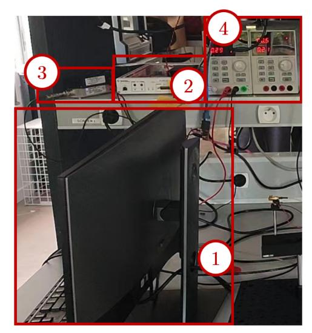

(a) Control area of the ISAC prototype, with ① the control computer for signal modulation and post-processing, ② the USRP X300, ③ a power amplifier for transmit signal amplification and ④ the power supply.

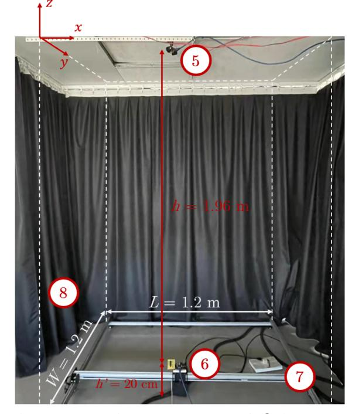

(b) Test area of the ISAC prototype, with ⑤ the transmit optical antenna, ⑥ the receive optical antenna, ⑦ a double rail to position the receive optical antenna and ⑧ black curtains delimiting the test area.

Fig. 2. Overview of the OWC-based ISAC prototype implemented, composed of a control area (a) and of a test area (b).

antenna's only interface is an RJ45 connector, it is in practice connected to the power amplifier 3 and power supply 4 via a simple custom-made SMA/RJ45 interface board, not shown in Fig. 2. At the other end of the link, a second optical antenna 6, this time serving as a UE, is mounted on a double rail 2 enabling it to be positioned precisely in an x-y receiving plane, located

{6}------------------------------------------------

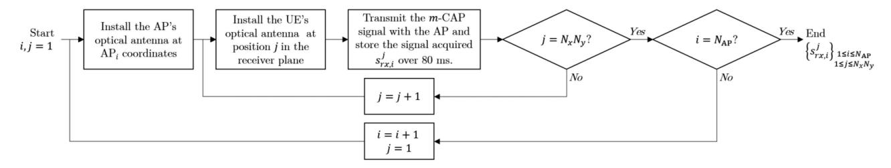

Fig. 3. Experimental protocol followed for the communication and positioning data acquisition.

TABLE II EXPERIMENTAL TEST-BENCH PARAMETERS

| Parameter                                           | Value                                    |
|-----------------------------------------------------|------------------------------------------|
| Test area dimensions, $L \times W \times H$         | $1.2 \times 1.2 \times 2.16 \text{ m}^3$ |
|                                                     | AP 1 : [0.3, 0.3, 0] m        |
| Coordinates of the APs, $[x_i, y_i, z_i]$           | AP 2 : [0.9, 0.3, 0] m        |
|                                                     | AP 3 : [0.3, 0.9, 0] m        |
|                                                     | AP 4 : [0.9, 0.9, 0] m        |
| Normal vector of the APs, $\vec{n}_{\mathrm{AP},i}$ | [0,0,-1]                                 |
| Normal vector of the UE, $\vec{n}_{\mathrm{UE}}$    | [0,0,1]                                  |
| Height between APs and UE, h                        | 1.96 m                                   |
| Height of the reception plane $h'$                  | 20 cm                                    |
| Granularity of the reception plan                   | 10 cm in $x$ and $y$                     |
| Number of test points along $x$ , $N_x$             | 13                                       |
| Number of test points along $y$ , $N_y$             | 13                                       |
| Total of position in $(x, y)$                       | $13 \times 13 = 169$                     |

at a distance h'=20 cm from the ground, so that the vertical distance between AP and UE is h=1.96 m. The entire test area is protected from external light interference by black curtains  $\circledast$ .

The UE's optical antenna, fed on the one hand by the external power supply 4 via a second SMA/RJ45 interface board, is on the other hand connected via this interface board to the USRP X300 2, which uses a BasicRX daughter board to convert the received analog signal  $I_{rx,i}(t)$  into its digital equivalent  $s_{rx,i}$ . This digital signal is eventually recorded as a vector of samples in real time by the computer 1 through GNU Radio. Note, however, that due to the limited computing power of 1, the sampling frequency could not exceed 20 MHz, otherwise overflow errors would occur. Once recorded, these samples were eventually post-processed with MATLAB in order to evaluate the communication and positioning performance of the proposed system.

It is important to note that, as mentioned in Section II-A, four APs are normally required for the positioning technique used by our system to work properly. In addition, it is preferable for the UE to receive the signal from each AP while the other APs are switched off, to avoid receiving parasitic optical power that would distort the positioning results. In [23], we proposed to use a time division multiplexing-like protocol to ensure such conditions are met. However, in the present work, for reasons of limited availability of the optical antennas, we used only one AP during our tests, which we successively placed in the four positions listed in Table II according to the coordinate system represented in Fig. 2(b).

We then followed the protocol detailed in Fig. 3. For a given position i of the AP, the UE was on its side placed at a starting position j = 1 on the x-y receiver plane (e.g.  $x_1 = 0$ ,  $y_1 = 0$ ).

We then transmitted the m-CAP waveform and recorded the received signal  $s_{rx,i}^{j}$  over a duration of around 80 ms to allow the transmission of 106 bits, which we finally post-processed with MATLAB. This process was then repeated for all UE positions j on the receiver plane, moving along the latter in 10 cm steps in x and y, i.e. placing it in  $N_x$  and  $N_y$  different locations along these respective axis. Once this process was completed with a given AP location, the optical antenna was moved to the next AP location and the procedure was repeated, until all data signals were acquired from all  $N_x N_y$  UE positions of all  $N_{AP}$  positions. These signals were then post-processed with MATLAB to evaluate both the communication and positioning performance of the system, as it will be detailed in Sections IV and V. Such a protocol is thus in practice equivalent to using  $N_{AP} = 4$  different APs transmitting successively their data signals.

#### B. Details on the Optical Antenna

Before detailing the experimental performance of our prototype, it is necessary to characterize the optical antennas we have used in order to: 1) define the parameters of the m-CAP waveform to be transmitted, and 2) identify any differences between the model we have adopted and presented in Section II-B, and our real OWC-based ISAC system.

1) Motivations for Using a Commercial Optical Antenna: It appears clearly from the previous section that the optical antennas are among the fundamental components of our demonstrator. In practice, the optical antennas we have used, shown in Fig. 4(a), have been designed by Oledcomm for its LiFiMAX product, which implements the ITU-T G.9991 standard [9] to provide 150 Mbps LiFi network access to any UE equipped with a compatible dongle. It should be noted here that the use of such antennas rather than separate off-the-shelf transmitters and receivers, as is often the case in the literature, is a deliberate choice motivated by two main reasons. Firstly, we intended to show that OWC-based ISAC systems could already be implemented on commercial systems. Secondly, the antenna's reception characteristics are actually superior to those of commercially available receivers [11]. However, as pointed out in the previous section, the use of this antenna requires a non-optimal intermediate amplifier stage, particularly in emission, to ensure correct operation with a USRP, as a detailed description of the antenna's architecture will further justify.

2) Architecture of the Optical Antenna: The internal architecture of the antennas, shown in Fig. 4(b), consists of four

{7}------------------------------------------------

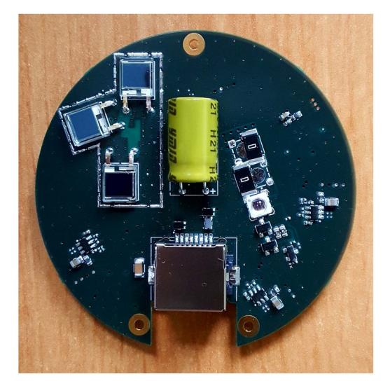

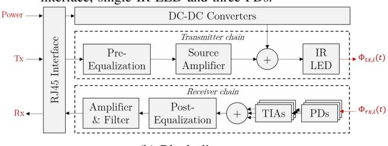

Fig. 4. Real view and block diagram of the optical antenna used for light signal transmission and reception in our OWC-based ISAC prototype.

TABLE III OPTICAL ANTENNA CHARACTERISTICS

| Transmitter chain characteristics       |                                                                         |  |  |  |
|-----------------------------------------|-------------------------------------------------------------------------|--|--|--|
| Parameter                               | Value                                                                   |  |  |  |
| Central wavelength of operation         | 940 nm                                                                  |  |  |  |
| FWHM spectral width                     | 45 nm                                                                   |  |  |  |
| Semi-angle at half-power $(\Phi_{1/2})$ | 45°                                                                     |  |  |  |
| LED linearity drive voltage range       | $3.2~\mathrm{V}\pm2.8~\mathrm{V}$ / $350~\mathrm{mA}\pm250~\mathrm{mA}$ |  |  |  |
| LED output optical power range          | 472.5 mW ± 337.5 mW                                                     |  |  |  |
| Receiver chain characteristics          |                                                                         |  |  |  |
| Parameter                               | Value                                                                   |  |  |  |
| Type of PD                              | Non disclosable [40]                                                    |  |  |  |
| Effective sensitive area $(A_{PD})$     | $79.2 \text{ mm}^2 \text{ [40]}$                                        |  |  |  |
| Responsivity $(R_{PD})$                 | 0.62 A/W at 940 nm [40]                                                 |  |  |  |
| FWHM angle of sensitivity $(\Psi_c)$    | 125° [40]                                                               |  |  |  |

main stages: a transmitter chain, a receiver chain, a power stage and an interface stage. The latter enables the input and output signals of the antenna to be combined on a single RJ45 connector, whereas the power stage consists mainly of DC-DC converters generating, from a single external power supply 'Power', the various power supplies required by the antenna.

The role of the transmission chain is to convert the electrical drive signal Itx,i(t) into its optical equivalent Φtx,i(t). The central component of this chain is thus the IR LED which, as detailed in Table III, has a central wavelength of 940 nm, a semi-angle at half power of 45°, and is calibrated to emit an optical signal of average power 472.5 mW with a swing of ± 337.5 mW. This optical power range was chosen for two main reasons: on the one hand, the electro-optical response of the LED remains relatively linear over this range of optical power, thus avoiding the non-linearity usually observed for drive currents that are too low or too high; on the other hand, such optical power values remain well below standard photobiological safety limits [\[38\].](#page-14-0)

In practice, the average optical power of 472.5 mW is obtained using a bias current Ib, added within the transmission chain and set at 350 mA, while the swing of ± 337.5 mW corresponds to the input drive current Itx,i(t) amplified and pre-equalized by the transmission chain. It should be noted that this internal amplification stage, initially designed to ensure the antenna's correct operation with commercial G.9991 semiconductors, requires an input signal with a dynamic range of ± 250 mA to guarantee an optical dynamic range of ± 337.5 mW at the output of the transmission chain. However, and as previously mentioned, the USRP alone is not able to provide such a high-amplitude drive signal, which justifies the 13 dB gain we have introduced using the ZHL-6A-S+ amplifier coupled with SMA attenuators. It should also be noted that the pre-equalization stage consists mainly of an RC resonator [\[39\]](#page-14-0) that introduces peaking in the frequency response of the transmission chain around 31 MHz, to compensate for the onset of roll-off in the receiver's frequency response, as we will see in the following Section III-B3).

On its side, the receiver chain converts the incident optical signal Φrx,i(t) into its electrical equivalent Irx,i(t), using three silicon PDs, each coupled to a TIA, whose respective signals are then summed and post-equalized. The internal capacitance of each PD introduces indeed low-pass filtering, which cut-off frequency decreases as this internal capacitance, and therefore the PD sensitive area, increase. The role of post-equalization is then, in the same way as pre-equalization, to push back this cut-off frequency, this time introducing peaking into the receiver's frequency response around 30 MHz. As summarized in Table III, the resulting receiver has eventually a total sensitive area of 79.2 mm2 with a photosensitivity of 0.62 A/W at 940 nm, and with a −3 dB bandwidth of 30 MHz. Note that this sensitive area-bandwidth compromise, which is high compared to commercial photoreceivers [\[11\],](#page-13-0) is made possible by the use of three PDs in parallel rather than in series, which therefore prevents their capacitance from adding up, thus considerably enhancing bandwidth.

*3) Implications on the* m*-CAP Waveform Design:* As mentioned in Section [III-A,](#page-5-0) only two such optical antennas were used in the experiments, the first playing successively the role of the four APs and the second playing the role of the UE. In order to set properly the parameters of the m-CAP waveform to transmit from one to the other, we first measured the frequency response of the system made of these two antennas. To do this, we observed with an Agilent Technologies E5071 C vector network analyzer (VNA) the frequency evolution of the S21 parameter while the AP antenna, connected to the VNA output, was driven by a frequency sweep ranging from 100 kHz to 100 MHz, and the UE antenna, connected to the VNA input, received this signal after a short and calibrated optical wireless propagation.

According to the resulting frequency response, represented in Fig. [5,](#page-8-0) we can conclude that the end-to-end link has a

{8}------------------------------------------------

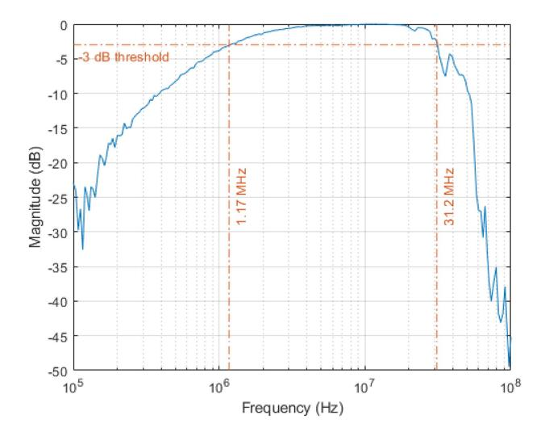

Fig. 5. Frequency response of the system composed of an optical antenna as light transmitter and another optical antenna as light receiver. The dashed-dotted orange lines highlight the −3 dB bandwidth of this system.

#### TABLE IV *m*-CAP PARAMETERS

| Parameter                              | Value          |
|----------------------------------------|----------------|
| Number of sub-bands, m                 | 4              |
| Sub-bands center frequencies, $f_{sc}$ | 1, 3, 5, 7 MHz |
| Sub-bands width, $B_{sc}$              | 1 MHz          |
| FIR filters roll-off factor, $\alpha$  | 0.4            |
| FIR filters length, $L_{\rm SPAN}$     | 10             |
| Oversampling factor, $N_{ss}$          | 20             |
| Final sampling frequency, $f_{samp}$   | 20 MHz         |
| QAM order, M                           | 16             |
| Data rate, $R_b$                       | 16 Mbps        |

−3 dB bandwidth of around 30 MHz, between 1.17 MHz and 31.2 MHz. Note that, on the one hand, the high-pass roll-off observed around 1 MHz actually comes from the use of a high pass filter at the receiver level of the optical antenna, in order to filter out ambient lighting, which spectrum can extend up to a few hundred kHz. On the other hand, the low-pass roll-off observed around 31 MHz is mainly due to the internal capacitances of the PDs which, despite being slightly compensated by pre- and post-equalization, behave like low-pass filters [\[39\].](#page-14-0)

In order to optimize communication performance, the central frequencies of the m-CAP sub-bands should thus be set between these two limits. In practice, however, given the maximum sampling frequency of 20 MHz induced by the limited processing power of the computer used to drive the USRP and GNU Radio in reception, we had to limit the maximum frequency of the m-CAP waveform to 10 MHz. As a result, we have chosen to set the number of sub-bands to m = 4, their width Bsc to 1 MHz and their respective center frequencies fsc to 1, 3, 5 and 7 MHz, as listed in Table IV. In other words, we deliberately under-dimensioned the number of sub-bands in order to facilitate the analysis of data transmission results, while guaranteeing an adequate guard band between them and with the usual frequency spectrum of interfering artificial and natural light sources. At

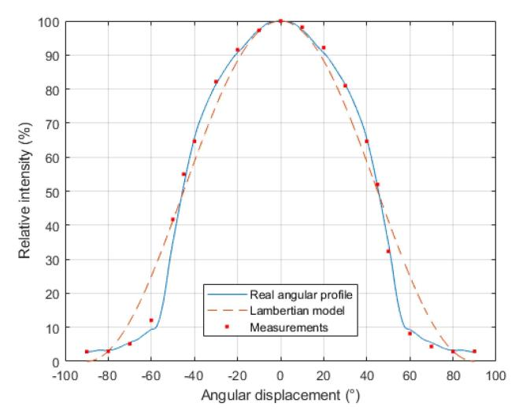

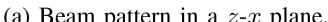

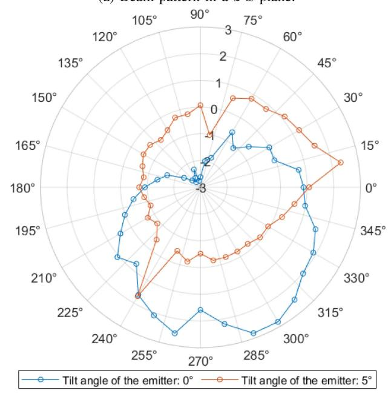

Fig. 6. Calibration of the beam pattern of the IR LED mounted on the optical antenna used as AP on (a) a *z*-*x* plane and (b) an *x*-*y* plane.

the same time, we deliberately placed the first sub-band at the limit of the system bandwidth, in order to study the influence of the corresponding non-flat portion of the antennas' frequency response on communication performance.

The other m-CAP waveform parameters, also listed in Table IV, and notably the rolloff factor α, the length of the FIR filters LSPAN, the oversampling factor Nss and final sampling frequency fsamp, were set at values providing the best compromise in terms of communication and positioning performance based on our previous simulations [\[23\].](#page-14-0) Furthermore, and given that reaching high throughput was not our priority, we have limited the QAM order of the sub-bands to M = 16, enabling 

{9}------------------------------------------------

our system to ultimately support data transmission at a data rate  $R_b = m \log_2(M) B_{sc} = 16$  Mbps.

4) Deviations From the System Model: The characterization of the optical antennas used experimentally provides fundamental insights for the analysis of positioning results. We have already pointed out in the Section II-C that the RSS positioning method used in our system is based on simplified models of the optical wireless channel and the impulse response of the optical transmitter and receiver. On the one hand, only the LOS contribution is used to calculate the distances between APs and UE from the estimated transmitted and received optical powers (11). On the other hand, the estimation of these powers is based on simple proportionality coefficients  $\eta_{\rm UE}$  and  $\eta_{\rm AP}$  which, while providing good first-order approximations, do not capture the non-flat behavior of the frequency response of the transmit-receive chain illustrated in Fig. 5.

Analysis of the emission pattern of the AP's IR LED reveals two additional deviations between our prototype and the model used for position estimation. The latter assumes that the optical sources used to transmit positioning signals have a generalized Lambertian profile, whose orders for semi-angles at half-power of 45° would be  $m_i=2$ . Fig. 6(a) shows, however, that the actual emission profile of the AP's IR LED, extracted from the datasheet in solid blue line and measured in red dots, sometimes differs significantly from a generalized Lambertian profile of order 2, in dashed orange line.

Furthermore, the RSS model used assumes that the emission pattern of the optical sources is symmetrical by rotation around the normal  $\vec{n}_{\rm AP,i}$ . Using a test bench similar to that shown in Fig. 2(b), but replacing the UE with a Thorlabs PMD100 power meter equipped with a S120 C sensor, we measured the power received along a circle of radius 1 m and center coincident with the AP in x and y, by variation of the polar angle  $\theta$  in steps of  $10^\circ$ . Fig. 6(b) shows the relative difference, in %, between the average optical power on the whole circle and the optical power measured at angle  $\theta$  when the AP points perfectly to the ground (green curve) or imperfectly, with an angle of  $5^\circ$  between  $-\vec{z}$  and  $\vec{n}_{\rm AP,i}$  (orange curve). In both cases, this relative difference, far from being zero, can reach up to 2.8% in absolute value. We therefore conclude that the AP's IR LED is not symmetrical, which could therefore have an impact on localization performance.

It may also be noted that despite slightly different orientations, the average received optical power is in both cases extremely similar, with an only 0.1% relative difference. At the same time, the fluctuations in received optical power caused by the asymmetrical pattern of the IR LED in the case of a  $5^{\circ}$  misalignment are of at most around 2.5% in absolute value, i.e. rather close to that of the case without misalignment. At the same time, since the Lambertian order of the IR source is  $m_i = 2$ , we can deduce from (2) that a slight misalignment of the AP will have a stronger impact on the received optical power than a slight misalignment of the UE. In other words, when the misalignment of the AP or the UE with respect to the vertical axis is small, its impact on the received optical power can be considered to be negligible compared to the effects of the asymmetrical pattern of the IR source.

#### IV. EVALUATION OF THE COMMUNICATION PERFORMANCE

As mentioned in Section III-A, communication performance was evaluated by acquiring approximately  $10^6$  bits for each UE position on the receiver plane, traversed in 10 cm steps along the x and y axes, and for each AP position. After demodulation of the received signal, we then compared the acquired bits with the transmitted bits to evaluate different values of the link BER. In practice, we were mainly interested in the BER per sub-band, which then allowed us to analyze the communication performance of our system in greater detail.

Fig. 7 shows the BER distributions for each sub-band in the receiver plane, while the transmitting optical antenna is located at AP3 ( $x=30\,\mathrm{cm},y=90\,\mathrm{cm}$ ). Only this position of AP is shown here, as the results obtained for the other AP positions follow similar trends. We can therefore extract several conclusions from Fig. 7, starting with the notable fact that BER values for the first sub-band ( $f_{sc}=1\,\mathrm{MHz}$ ) are rather high (around 0.12 in Fig. 7(a)), while those for the other sub-bands are of the order of  $10^{-5}$  to  $10^{-3}$ , as visible in Fig. 7(b), (c) and (d). Assuming FEC may be used efficiently as long as the BER  $\leq 3.8 \times 10^{-3}$  [37], we can deduce that the first sub-band is not able to provide a reliable communication link, whereas the others are.

This is because the first sub-band lies at the bandwidth limit of the AP-UE system, and is therefore subject to distortions induced by its non-flat frequency response, as shown in Fig. 5. The other sub-bands are located in frequency ranges where the gain of the AP-UE system is constant, and are therefore not subject to such distortions. Indeed, we can see that BER tends, at least occasionally, to increase as the UE moves further away from the AP, i.e., in the case of AP3, when the UE is located in positions with coordinates x close to 120 cm and/or y close to 0 cm. In these cases, the distance increases propagation losses, as highlighted by (2), leading to a reduction in the signal-to-noise ratio (SNR) and therefore an increased risk of errors at the UE level

Nevertheless, this risk remains limited, as shown in Fig. 8, which represents for each sub-band of each AP (with the exception of the first sub-band, excluded for the reasons previously mentioned) the empirical cumulative distribution function (CDF) of all BER measured on the receiver plane (i.e. 169 values per sub-band). We can see that for a given AP position, the BER of the various sub-bands, represented in the same color but with different markers, are mostly below the FEC threshold of  $3.8 \times 10^{-3}$ . Some curves are even barely visible (e.g. sub-band 2 of AP2), as the vast majority of measured BER values are 0 in these cases.

However, we can clearly observe a borderline case, with the 3 rd sub-band of AP2, whose CDF remains very low compared to that of the other sub-bands. This is because the BER of this sub-band fluctuates around 0.02 over the entire receiver plane. Despite several tests, we were unfortunately unable to explain this behavior, which we consider abnormal, given the results obtained for this same sub-band at other AP positions.

Fig. 8 also shows that in some other cases, the BER is higher than the FEC threshold (e.g. sub-band 3 of AP4), meaning that communication coverage is in these cases not ensured over the

{10}------------------------------------------------

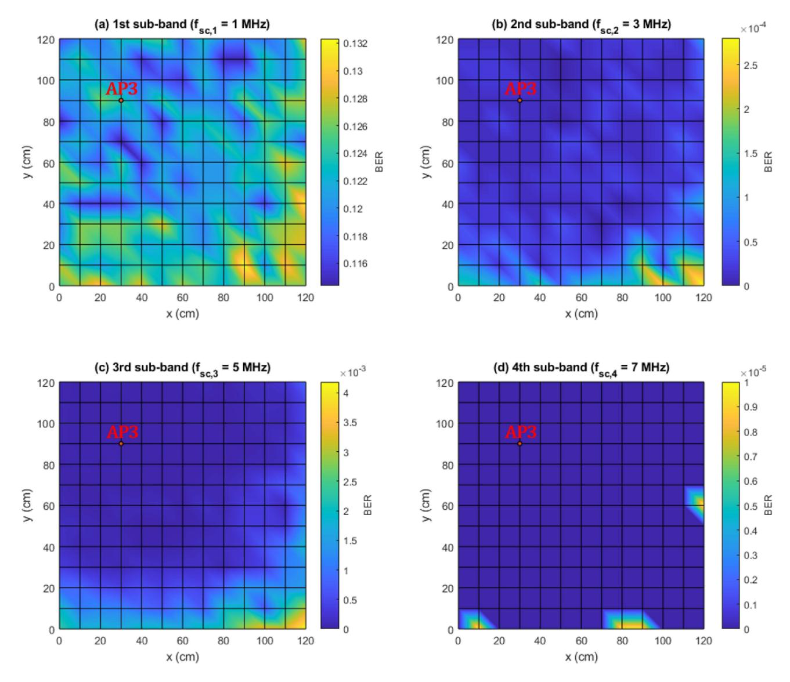

Fig. 7. Spatial distribution in the x-y receiver plane of the BER of each sub-band when the AP is at location AP3 (x = 30 cm, y = 90 cm).

whole receiver plane. These higher BER zones can again be explained by greater AP-UE distances, and therefore lower SNR. We can also observe that they are mostly located at the boundaries of the receiver plane, i.e. close to the protective curtains, which although not very reflective, may induce performance degradation due to multi-path.

In order to quantify the coverage performance of the various APs, we used the results in Fig. 8 to calculate the outage probability  $P_{out}$ , defined as the probability that the BER is greater than the FEC threshold of  $3.8\times10^{-3}$  over the entire receiver plane. Table V shows the evolution of  $P_{out}$  with the sub-band index and the AP position. In line with our previous conclusions, we observe that this probability is extremely high for the first sub-band of each AP ( $P_{out}=100\%$ ) and for the 3 rd sub-band of AP2 ( $P_{out}=96.45\%$ ). Similarly, we observe that it is null or very close to zero in the majority of the remaining cases, with the exception of the 3 rd sub-band of AP4, where  $P_{out}$  reaches 5.92 %.

TABLE V
OUTAGE PROBABILITIES OVER THE RECEPTION PLANE FOR THE DIFFERENT
APS AND THEIR RESPECTIVE SUB-BANDS

|                 | Sub-band 1 | Sub-band 2 | Sub-band 3 | Sub-band 4 |
|-----------------|------------|------------|------------|------------|
| $\mathbf{AP}_1$ | 100%       | 0%         | 0%         | 0%         |
| $AP_2$          | 100%       | 0.59%      | 96.45%     | 0.59%      |
| $AP_3$          | 100%       | 0%         | 0.59%      | 0%         |
| $AP_4$          | 100%       | 0%         | 5.92%      | 0%         |

We can therefore conclude from these various results that the proposed OWC-based ISAC system provides continuous communication coverage over the entire receiver plane, with an effective pre-FEC data rate of at least 12 Mbps (since the 1st sub-band is not functional if positioned at 1 MHz). Given the frequency response of the transmit-receive chain, we can nevertheless extrapolate much higher data rates if the number of sub-bands is increased along with the QAM order (e.g. 56 Mbps

{11}------------------------------------------------

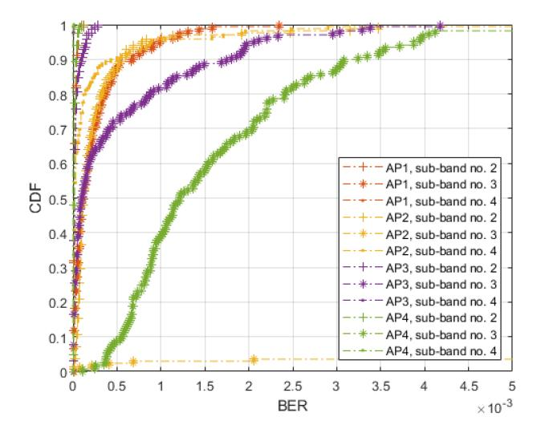

Fig. 8. Empirical CDF of the BER of each sub-band (except the 1st sub-band), in each AP location.

with 14 sub-bands centered on odd frequencies between 3 to 29 MHz and loaded with 16-QAM symbols).

#### V. EVALUATION OF THE POSITIONING PERFORMANCE

#### A. About the Need for Post-Calibration

Alongside data transmission, the signals acquired during the experiments enabled us to evaluate the positioning performance of our system. To do this, we used the method detailed in Section II-C which consists, for each UE position, in estimating the distances  $\hat{d}_i$  separating it from the four APs using (11), after calculating first the variances of the generated and acquired digital signals  $s_{tx,i}$  and  $s_{rx,i}$ . However, estimating the distances  $\hat{d}_i$  also requires knowledge of the electro-optical and opto-electrical conversion factors  $\eta_{\text{AP},i}$  and  $\eta_{\text{UE}}$ . Rather than finely determining these conversion factors a priori, we have opted here for a posteriori calibration, which in practice consists in determining, from the acquired signals, the values of  $\eta_{\text{AP},i}$  and  $\eta_{\text{UE}}$  that will optimize the statistical distribution of the RMS error of all  $N_x N_y$  position estimates made in the AP configuration detailed in Table II.

To justify the use of such a post-calibration, it is important to recall here that the RSS positioning technique we have adopted is based on a system model with multiple deviations from the real prototype. As mentioned in Section II-C, it takes into account only the LOS component of the received optical signal for estimating  $\hat{d}_i$ , and is based on simplified transmitter and receiver models, which are assumed to point perfectly towards the ground and ceiling respectively, and are separated by a known vertical distance h. Furthermore, this method assumes that the optical sources used at the APs have a generalized Lambertian beam pattern and are symmetrical about their optical axis. In practice, these assumptions are not always verified. Using post-calibration thus allows us to partially correct the errors induced by these various deviations, while keeping the complexity of the system

model (i.e. of the equations enabling position estimation) relatively low.

The post-calibration process we followed is detailed in Fig. 9. Let us define the ratios  $\eta_i$  as:

$$\eta_i = \frac{\eta_{\text{AP},i}}{\eta_{\text{UE}}}.\tag{16}$$

In a first step, we set all these  $\eta_i$  ratios to a value  $\eta_{min}$  identical for all APs. For a given UE position  $j \in [1, N_x N_y]$ , the variances of the digital signals transmitted  $s_{tx,i}$  and acquired  $s_{rx,i}$  can then be calculated in order to compute the estimated distances  $\hat{d}_i$  and eventually the UE's location estimate  $\hat{X}_e$  using (11) to (8). By comparing this estimate with the actual position of the UE, the RMS error  $\Delta_j$  at this location j and with the specific ratios  $\eta_i$ , can be determined. This process is then repeated for all positions of the UE to obtain a set of  $N_x N_y$  RMS errors, from which the corresponding empirical CDF  $F_{\Delta}(\delta)$  can be extracted, along with the value  $\delta_{90}$  at which this CDF equals 0.9. This whole process is eventually repeated for different values of  $\eta_i$ , up to the point they all equal  $\eta_{max}$ . The values  $\eta_i$  giving the lowest  $\delta_{90}$  are then the optimal values  $\eta_{opt,i}$  that minimize the error threshold  $\delta_{opt}$  below which 90% of the errors  $\Delta_j$  lie.

# B. Positioning Performance Evaluation

In a first step, we assumed that the four APs in our system were characterized by identical conversion constant ratios  $\eta_i$ , since these APs were in practice set up successively using the same optical antenna. The blue-dashed curve in Fig. 10(a), which shows the evolution of the CDF of the RMS error in the receiving plane after post-calibration, allows us to deduce that in this case, for all the 169 positions, 90% of the errors are smaller than

Nevertheless, as shown in Fig. 6(b), the emission pattern of the IR LED that equips the AP's optical antenna is not symmetrical. This means that, depending on the relative position between an AP and the UE and especially on the corresponding direction of emission, the optical power transmitted by the AP may vary by  $\pm 3\%$  around its average value. However, as highlighted in (16), since  $\eta_i$  depends directly on the electro-optical conversion factor of the i-th AP  $\eta_{\text{AP},i}$ , a fluctuation in transmitted optical power will result in a fluctuation in  $\eta_i$ . Therefore, we assumed that the  $\eta_i$  can vary from one AP to another, within a slightly lower limit of  $\pm 2.5\%$  around the optimum value obtained when they are assumed to be equal.

The CDF of the corresponding error, plotted as a solid orange line in Fig. 10(a), then shows that in this case, 90% of the errors are less than 12.2 cm. It should also be noted that this error threshold at 90% falls to 11.9 cm and 11.3 cm when the variation range in  $\eta_i$  is raised to 5% and 10% respectively, and reaches 10.7 cm when the  $\eta_i$  can be set without constraints. The latter case, however, has little physical significance, and we therefore consider here that the nominal performance of our system after post-calibration, but before complementary corrections, is that corresponding to a maximum variation of  $\pm 2.5\%$ .

Fig. 10(b) shows another way to visualize the distribution of RMS positioning error in the receiving plane, with blue circles representing the tested reference positions and red stars

{12}------------------------------------------------

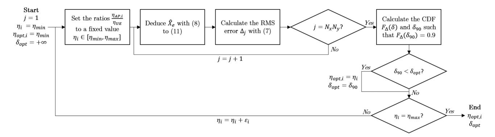

Fig. 9. Process followed to post-calibrate the positioning system.

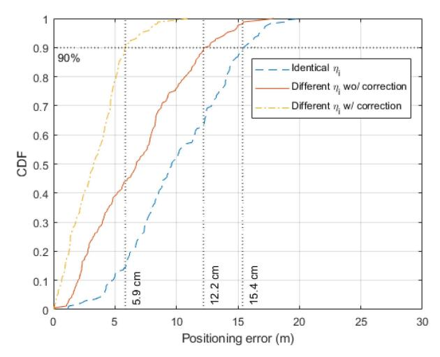

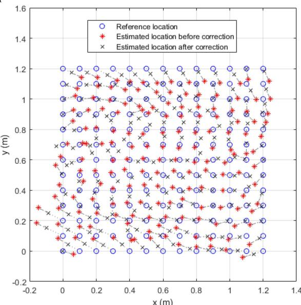

Fig. 10. CDF and spatial distribution of the RMS positioning error over the whole reception plane.

representing the estimated positions when allowing a maximum ±2.5% variation in the ηi (i.e. corresponding to the orange curve in Fig. 10(a)). Grey dotted lines have been added to identify more clearly to which reference position each estimated position corresponds. From these dotted lines, it can be seen that the RMS errors of two adjacent estimated positions are often oriented in very close directions, which could also be estimated during the post-calibration phase.

Assuming these directions are known, it would then be possible to add an second error correction step, by removing the average RMS error, calculated over the entire receiver plane, from each estimated position and in the direction given by the dotted line running from the estimated point to the reference point.

To verify this assumptions, we made for each reference position of the UE 100 consecutive estimates of its position. Then, we calculated the coordinates of the support vectors running from the reference position to each of the 100 position estimates, to finally calculate the angles between the support vector shown in Fig. 10(b) (grey dotted lines) and these 100 support vectors. This approach allows to assess the dispersion of the orientation of the error, which is represented in Fig. [11](#page-13-0) in the form of the empirical CDF of all error angles calculated for all reference positions (i.e. 100 × 169 = 16900 values). We can see that in 90% of cases, the error in angle is below 17◦, which remains reasonably low and thus allows us to apply the proposed additional correction step.

The positions corrected using this method, shown as black crosses in Fig. 10(b), appear to be closer to the reference positions, as confirmed by the empirical CDF of the corresponding error distribution, shown as yellow dashed-dotted lines in Fig. 10(a). In this case, 90% of errors are indeed less than 5.9 cm.

In practice, these directions of correction can only be estimated during the calibration phase for the reference positions tested. Consequently, if the UE subsequently finds itself at an actual position that does not correspond to any of the tested reference positions, the support vector defining the direction of correction will have to be a weighted average of the support vectors of the adjacent reference points. Consequently, the corrected coordinates and their CDF, shown in Fig. 10, correspond to an ideal case of correction, which defines a minimum value

{13}------------------------------------------------

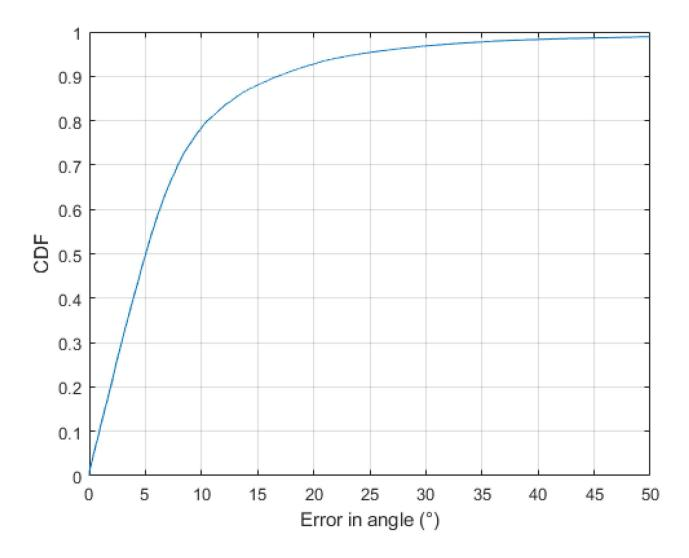

Fig. 11. CDF of the error in the angle defining the orientation of the estimated positions compared to the reference positions.

for positioning error. Note also that this second error-correction step, like the first, requires the prior acquisition of a set of measurements that should ideally be repeated when using a new UE, which remains quite restrictive for a large-scale deployment of the proposed system.

We can nevertheless conclude that our OWC-based ISAC system is capable of estimating the position of a UE with a relatively high resolution compared with state of the art systems operating over similar test areas, and that our post-calibration technique, while unlikely to correct all errors due to deviations of the real system from the model, does provide flexibility for fine-tuning the positioning.

# VI. CONCLUSIONS AND FUTURE WORKS

In this article, an OWC-based ISAC system using m-CAP modulation for data transmission and RSS-based positioning is proposed and implemented using USRPs and custom-made IR optical transceivers. The assumptions on which this system rely are clearly stated: in order to estimate the user's coordinates, the RSS model used is based solely on the LOS component of the received optical signal, and on simplified optical transmitter and receiver models which are assumed to point perfectly towards the ground and ceiling respectively, with a known vertical distance and with a symmetrical and generalized Lambertian beam pattern.

Although some of these assumptions are not or partially verified in practice, experimental tests carried out in a 1.2×1.2 × 2.16 m3 room still show that, after a two steps correction process, the proposed system is able to estimate the user coordinates with an RMS error below 5.9 cm in 90% of cases. At the same time, a pre-FEC data rate of 12 Mbps with a BER under 3.8×10−3 is guaranteed to the user whatever its location on the receiver plane, 20 cm above the ground (i.e. 11.16 Mbps of useful data rate if taking into account a 7% FEC overhead [\[37\]\)](#page-14-0).

Such performance is very encouraging, given that the ITU expects ISAC systems with a positioning accuracy of between 1 and 10 cm as part of its IMT-2030 framework. Future work should even enable us to further reduce this positioning error, while considerably limiting the number of calibration points currently required, in particular by adopting a more realistic RSS model along with machine learning techniques to determine the direction of error correction more precisely. At the same time, it would be useful for future applications to switch from two-dimensional to three-dimensional positioning, while increasing communication throughput by exploiting the full available bandwidth of the optical antennas we have developed, for example by using directly a commercial system.

# REFERENCES

- [1] H. Tataria, M. Shafi, A. F. Molisch, M. Dohler, H. Sjöland, and F. Tufvesson, "6G wireless systems: Vision, requirements, challenges, insights, and opportunities," *Proc. IEEE*, vol. 109, no. 7, pp. 1166–1199, Jul. 2021.
- [2] *Framework and overall objectives of the future development of IMT for 2030 and beyond*, Rec. ITU-R M.2160-0, International Telecommunications Union, Geneva, Switzerland, Nov. 2023. [Online]. Available: <https://www.itu.int/rec/R-REC-M.2160/en>
- [3] A. Liu et al., "A survey on fundamental limits of integrated sensing and communication," *IEEE Commun. Surv. Tuts.*, vol. 24, no. 2, pp. 994–1034, Secondquarter 2022.
- [4] D. K. Pin Tan et al., "Integrated sensing and communication in 6G: Motivations, use cases, requirements, challenges and future directions," in *Proc. IEEE 1st Int. Online Symp. Joint Commun. Sens.*, 2021, pp. 1–6.
- [5] A. Kaushik et al., "Integrated sensing and communications for IoT: Synergies with key 6G technology enablers," Sep. 2023. [Online]. Available: <https://arxiv.org/abs/2309.13542>
- [6] W. Hong et al., "The role of millimeter-wave technologies in 5G/6G wireless communications," *IEEE J. Microw.*, vol. 1, no. 1, pp. 101–122, Jan. 2021.
- [7] C. Chaccour, M. N. Soorki, W. Saad, M. Bennis, P. Popovski, and M. Debbah, "Seven defining features of terahertz (THz) wireless systems: A fellowship of communication and sensing," *IEEE Commun. Surv. Tuts.*, vol. 24, no. 2, pp. 967–993, Secondquarter 2022.
- [8] M. D. Soltani et al., "Terabit indoor laser-based wireless communications: Lifi 2.0 for 6G," *IEEE Wireless Commun.*, vol. 30, no. 5, pp. 36–43, Oct. 2023.
- [9] *High-speed indoor visible light communication transceiver System architecture, physical layer and data link layer specification*, Rec. ITU-T G.9991, International Telecommunications Union, Geneva, Switzerland, Mar. 2019. [Online]. Available: [https://www.itu.int/rec/T-REC-G.9991-](https://www.itu.int/rec/T-REC-G.9991-201903-I/en) [201903-I/en](https://www.itu.int/rec/T-REC-G.9991-201903-I/en)
- [10] *IEEE Standard for Information Technology-Telecommunications and Information Exchange between Systems Local and Metropolitan Area Networks-Specific Requirements Part 11: Wireless LAN Medium Access Control (MAC) and Physical Layer (PHY) Specifications Amendment 6: Light Communications*, IEEE Std 802.11bb-2023, Institute of Electrical and Electronics Engineers, Nov. 2023. [Online]. Available: [https:](https://ieeexplore.ieee.org/document/10315104) [//ieeexplore.ieee.org/document/10315104](https://ieeexplore.ieee.org/document/10315104)
- [11] B. Béchadergue and B. Azoulay, "An industrial view on lifi challenges and future," in *Proc. IEEE 12th Int. Symp. Commun. Syst.Netw. Digit. Signal Process.*, 2020, pp. 1–6.
- [12] X. Zhang, Z. Babar, P. Petropoulos, H. Haas, and L. Hanzo, "The evolution of optical OFDM," *IEEE Commun. Surv. Tuts.*, vol. 23, no. 3, pp. 1430–1457, Thirdquarter 2021.
- [13] M. I. Olmedo et al., "Multiband carrierless amplitude phase modulation for high capacity optical data links," *J. Lightw. Technol.*, vol. 32, no. 4, pp. 798–804, Feb. 2014.
- [14] M.-A. Khalighi, S. Long, S. Bourennane, and Z. Ghassemlooy, "PAMand CAP-based transmission schemes for visible-light communications," *IEEE Access*, vol. 5, pp. 27002–27013, 2017.
- [15] M. M. Merah, H. Guan, and L. Chassagne, "Experimental multi-user visible light communication attocell using multiband carrierless amplitude and phase modulation," *IEEE Access*, vol. 7, pp. 12742–12754, 2019.
- [16] X. Li et al., "A full-digital m-CAP receiver with synchronisation and adaptive blind equalisation for visible light communications," *J. Lightw. Technol.*, vol. 40, no. 8, pp. 2409–2426, Apr. 2022.

{14}------------------------------------------------

- [17] Y. Hong et al., "Demonstration of *>* 1 tbit/s WDM OWC with wavelengthtransparent beam tracking-and-steering capability," *Opt. Exp.*, vol. 29, no. 21, pp. 33694–33702, Oct. 2021.
- [18] Y. Zhuang et al., "A survey of positioning systems using visible LED lights," *IEEE Commun. Surv. Tuts.*, vol. 20, no. 3, pp. 1963–1988, Thirdquarter 2018.
- [19] Y. Xu et al., "Accuracy analysis and improvement of visible light positioning based on VLC system using orthogonal frequency division multiple access," *Opt. Exp.*, vol. 25, no. 26, pp. 32618–32630, 2017.
- [20] H. Yang, C. Chen, W.-D. Zhong, S. Zhang, and P. Du, "An integrated indoor visible light communication and positioning system based on FBMC-SCM," in *Proc. IEEE Photon. Conf.*, 2017, pp. 129–130.
- [21] H. Yang, W.-D. Zhong, C. Chen, A. Alphones, and P. Du, "QoS-driven optimized design-based integrated visible light communication and positioning for indoor IoT networks," *IEEE Internet Things J.*, vol. 7, no. 1, pp. 269–283, Jan. 2020.
- [22] M. Nassiri, G. Baghersalimi, and Z. Ghassemlooy, "A hybrid VLP and VLC system using m-CAP modulation and fingerprinting algorithm," *Opt. Commun.*, vol. 473, 2020, Art. no. 125699.
- [23] L. Shi, B. Béchadergue, L. Chassagne, and H. Guan, "Joint visible light sensing and communication using m-CAP modulation," *IEEE Trans. Broadcast.*, vol. 69, no. 1, pp. 276–288, Mar. 2023.
- [24] B. Lin, X. Tang, Z. Ghassemlooy, C. Lin, and Y. Li, "Experimental demonstration of an indoor VLC positioning system based on OFDMA," *IEEE Photon. J.*, vol. 9, no. 2, pp. 1–9, Apr. 2017.
- [25] H. Yang, C. Chen, W.-D. Zhong, A. Alphones, S. Zhang, and P. Du, "Demonstration of a quasi-gapless integrated visible light communication and positioning system," *IEEE Photon. Technol. Lett.*, vol. 30, no. 23, pp. 2001–2004, Dec. 2018.
- [26] S. M. Kouhini et al., "LiFi positioning for industry 4.0," *IEEE J. Sel. Topics Quantum Electron.*, vol. 27, no. 6, pp. 1–15, Nov./Dec. 2021.
- [27] D. Chen et al., "Integrated visible light communication and positioning CDMA system employing modified ZCZ and Walsh code," *Opt. Exp.*, vol. 30, no. 22, pp. 40455–40469, Oct. 2022.
- [28] J. Jin et al., "Adaptive feedback threshold based demodulation for mobile visible light communication and positioning integrated system," *Opt. Exp.*, vol. 30, no. 8, pp. 13331–13344, Apr. 2022.
- [29] J. Fang, J. Pan, X. Huang, J. Lin, and C. Jiang, "Integrated physical-layer secure visible light communication and positioning system based on polar codes," *Opt. Exp.*, vol. 31, no. 25, pp. 41756–41772, Dec. 2023.
- [30] Z. Liu and C. Yu, "Multi-user visible light communication and positioning system based on dual-domain multiplexing scheme," *Photonics*, vol. 10, no. 3, 2023, Art. no. 306.
- [31] H. Yang et al., "An advanced integrated visible light communication and localization system," *IEEE Trans. Commun.*, vol. 71, no. 12, pp. 7149–7162, Dec. 2023.
- [32] X. Li, Z. Ghassemlooy, S. Zvanovec, and L. N. Alves, "An equivalent circuit model of a commercial LED with an ESD protection component for VLC," *IEEE Photon. Technol. Lett.*, vol. 33, no. 15, pp. 777–779, Aug. 2021.
- [33] X. Deng et al., "Physics-based LED modeling and nonlinear distortion mitigating with real-time implementation," *IEEE Photon. J.*, vol. 14, no. 6, pp. 1–6, Dec. 2022.
- [34] D. Shi et al., "Physics-based modeling of GAN MQW LED for visible light communication systems," *IEEE Trans. Electron Devices*, vol. 71, no. 1, pp. 337–342, Jan. 2024.
- [35] Z. Ghassemlooy, M.-A. Khalighi, and D. Wu, "Channel modeling," in *Visible Light Communications*. Boca Raton, FL, USA: CRC Press, 2017, pp. 71–96.
- [36] W. Zhang, M. I. S. Chowdhury, and M. Kavehrad, "Asynchronous indoor positioning system based on visible light communications," *Opt. Eng.*, vol. 53, no. 4, pp. 1–10, 2014.
- [37] *Forward error correction for high bit-rate DWDM submarine systems*, Rec. ITU-T G.975.1, International Telecommunications Union, Feb. 2004. [Online]. Available:<https://www.itu.int/rec/T-REC-G.975.1-200402-I/en>
- [38] *Photobiological safety of lamps and lamp systems*, IEC-62471, International Electrotechnical Commission, Jul. 2006. [Online]. Available: <https://webstore.iec.ch/publication/7076>
- [39] H. Le Minh et al., "100-Mb/s NRZ visible light communications using a postequalized white LED," *IEEE Photon. Technol. Lett.*, vol. 21, no. 15, pp. 1063–1065, Aug. 2009.
- [40] Hamamatsu Si PIN photodiodes S2506/S6775/S6967 series, 2021. [Online]. Available: [https://www.hamamatsu.com/content/dam/hamamatsu](https://www.hamamatsu.com/content/dam/hamamatsu-photonics/sites/documents/99_SALES_LIBRARY/ssd/s2506-02_etc_kpin1048e.pdf)[photonics/sites/documents/99\\_SALES\\_LIBRARY/ssd/s2506-](https://www.hamamatsu.com/content/dam/hamamatsu-photonics/sites/documents/99_SALES_LIBRARY/ssd/s2506-02_etc_kpin1048e.pdf) [02\\_etc\\_kpin1048e.pdf](https://www.hamamatsu.com/content/dam/hamamatsu-photonics/sites/documents/99_SALES_LIBRARY/ssd/s2506-02_etc_kpin1048e.pdf)

**Lina Shi**received the engineering degree in computer science and electronics for embedded systems from the Université Grenoble Alpes, Grenoble, France, in 2017, and the Ph.D. degree in telecommunication from Sorbonne Université, Paris, France. From 2021 to 2022, she was a Postdoctoral Researcher with UVSQ, Université Paris-Saclay, Gif-sur-Yvette, France. She is currently a Nokia Bell Labs Researcher in France. Her research interests include performance estimation and monitoring in optical transmission systems, machine learning, optical communication and sensing.

**Ziqi Liu** received the Bachelor of Science degree in electronics information engineering from the China University of Geosciences, Beijing, China, in 2018, and the Master of Science degree in embedded systems from the Institut Supérieur d'Électronique de Paris, Paris, France, in 2022. He is currently working toward the Ph.D. degree in the area of device fingerprinting within visible light communication with Sorbonne University, Paris, France. His research interests include physical layer security, artificial intelligence, and visible light communication.

**Bastien Béchadergue** (Member, IEEE) received the aeronautical engineering degree from ISAE-Supaero, Toulouse, France, the M.S. degree in communication and signal processing from Imperial College London, London, U.K., in 2014, and the Ph.D. degree in signal and image processing from UVSQ, Université Paris-Saclay, Gif-sur-Yvette, France, in 2017, for his work on visible light communication and sensing for automotive applications. From 2017 to 2020, he was in charge of the research activities at Oledcomm, one of the leading companies in the development of optical wireless communication products. Since 2020, he has been an Associate Professor with UVSQ, Université Paris-Saclay, where his research focuses on optical wireless communication and sensing.

**Hongyu Guan** received the B.S. degree in electrical engineering from EN-SEIRB, Talence, France, in 2007, and the Ph.D. degree in computer science from the University of Bordeaux I, Bordeaux, France, in 2012, for his work on embedded systems for home automation. He is currently a Research Associate and the Chief Project Engineer with the LISV laboratory, Versailles Saint-Quentinen-Yvelines University, University of Paris-Saclay, Gif-sur-Yvette, France. His research interests include visible light communications, communication protocol, ubiquitous, data fusion, sensors, and nanometrology.

**Luc Chassagne** received the B.S. degree in electrical engineering from Supelec, Gif-sur-Yvette, France, in 1994, and the Ph.D. degree in optoelectronics from the University of Paris XI, Orsay, France, in 2000, for his work in the field of atomic frequency standard metrology. He is currently a Professor and the Director of the LISV laboratory, University of Versailles, Versailles, France. His research interests include nanometrology, sensors, and visible light communications.

**Xun Zhang** (Senior Member, IEEE) received the Ph.D. degree in instrumentation and microelectronics (IM) science from the University of Nancy, Nancy, France, in 2009. From 2009 to 2011, he undertook a Postdoctoral position with the SCEE Laboratory, CentraleSupélec, Gif-sur-Yvette, France, where he focused on applying auto-reconfigurable management methods and control strategies in FPGAs for cognitive radio systems. In 2011, he joined the LISITE Laboratory, ISEP, Paris, France, as an Associate Professor. He is currently a Professor with ISEP, and conducts permanent research with the LISV Laboratory within the University of Paris Saclay-Versailles. His research interests include PHY layer optimization for 5G cellular networks and visible light communication (VLC) systems. He is also pioneering the development of VLC-based indoor high-accuracy positioning and tracking algorithms. He is an Associate Editor for IEEE TRANSACTIONS ON BROADCASTING and is a Member of the BTS Awards Committee.