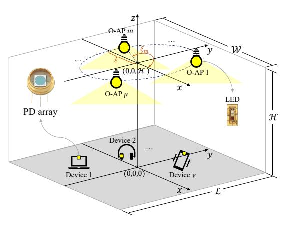
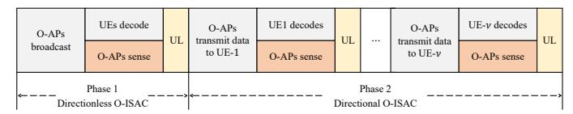
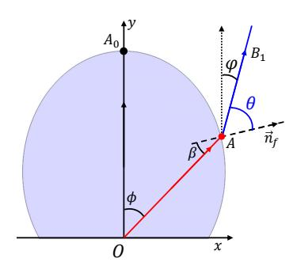
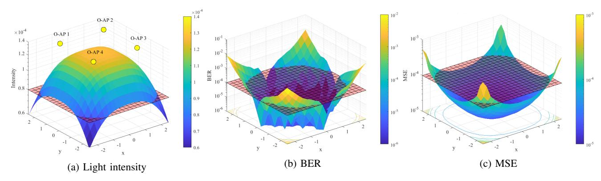
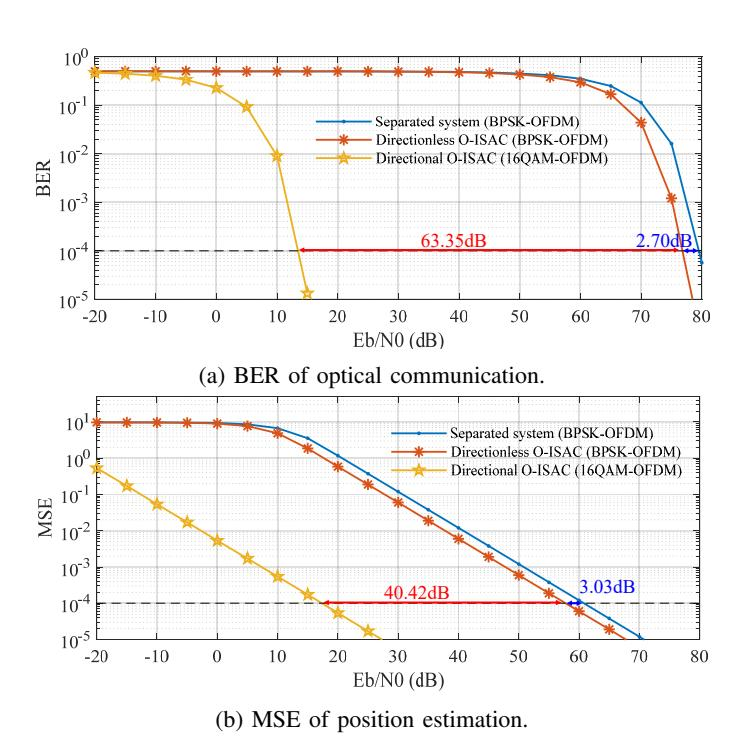

{0}------------------------------------------------

# Optical Integrated Sensing and Communication with Light-Emitting Diode

Runxin Zhang, Yulin Shao, Menghan Li, Lu Lu, Yonina C. Eldar

*Abstract*—This paper presents a new optical integrated sensing and communication (O-ISAC) framework tailored for costeffective Light-Emitting Diode (LED). Unlike prior research on ISAC, which predominantly focused on radio frequency (RF) band, O-ISAC capitalizes on the inherent advantages of the optical spectrum, including the ultra-wide license-free bandwidth, immunity to RF interference, and energy efficiency. Moreover, the performance of communication and sensing in O-ISAC is positively correlated, circumventing the tradeoff that has plagued RF-ISAC systems. Our O-ISAC framework unfolds in two phases: directionless O-ISAC and directional O-ISAC. In the first phase, distributed optical access points emit non-directional light for communication and leverage small-aperture imaging principles for sensing. In the second phase, we put forth the concept of optical beamforming, using collimating lenses to concentrate light, resulting in substantial performance enhancements in both communication and sensing. Numerical and simulation results demonstrate the feasibility and impressive performance of O-ISAC benchmarked against separate communication and sensing systems.

*Index Terms*—ISAC, optical communication, LED, optical beamforming, collimating lens.

### I. INTRODUCTION

With the growing demand of higher communication rates for mobile devices, researchers are exploring new frequency resources and signal processing techniques for next-generation communication systems [1]–[3]. A technique that has recently gained significant attention is integrated sensing and communication (ISAC) [2], [4]. The essence of ISAC is utilizing the time and frequency resources originally allocated to radar, and designing a unified transceiver that achieves wireless communication and remote sensing simultaneously.

Existing research efforts on ISAC have mostly been focused on radio bands. In this paper, we explore the integration of communication and sensing in a much higher frequency band – the optical band. The optical band is ultra-wide and licensefree [5]–[7]. Therefore, optical communication is viewed as

- R. Zhang, M. Li, and L. Lu are with the Key Laboratory of Space Utilization, Technology and Engineering Center for Space Utilization, Chinese Academy of Sciences, and the University of Chinese Academy of Sciences, Beijing, 100049, China (e-mails: zhangrunxin20@mails.ucas.ac.cn, limenghan21@mails.ucas.ac.cn, lulu@csu.ac.cn).
- Y. Shao is with the State Key Laboratory of Internet of Things for Smart City and the Department of Electrical and Computer Engineering, University of Macau, Macau S.A.R (e-mail: ylshao@um.edu.mo).
- Y. C. Eldar is with the Weizmann Institute of Science, Rehovot 7610001, Israel (e-mail:yonina.eldar@weizmann.ac.il).

This work was supported in part by the Key Research Program of the Chinese Academy of Sciences under Grant (Project no.: ZDRW-KT-2019-1-0103), in part by the Start-up Research Grant (Project no.: SRG2023-00038-IOTSC), and in part by the Science and Technology Development Fund, Macao SAR (Project no.: 01/2024/SKL).

a promising complement to radio communication in nextgeneration communication systems [8] to address the problem of spectrum scarcity. On the other hand, optical sensing is an estimation technology [9] with high precision by capturing the intensity of incident light rays and converting it into a form readable by a measuring device. In this light, this paper aims to develop an optical-ISAC (O-ISAC) system.

There have been research endeavors on O-ISAC, encompassing both wired O-ISAC, e.g., fiber-optic ISAC [10], [11], and wireless O-ISAC [11]–[14]. Unlike existing O-ISAC that relies exclusively on laser, which emits coherent light and is very similar to RF-ISAC, this paper introduces a new O-ISAC framework specifically designed for cost-effective commercial Light-Emitting Diodes (LEDs). LED O-ISAC faces several notable challenges: incoherent light, divergent light, and massive echo. In addressing them and unlocking the full potential of O-ISAC, we explore pragmatic strategies that address these hurdles. Our main contributions are summarized as follows.

We put forth a new O-ISAC framework tailored for costeffective commercial LEDs. We reveal the synergistic effect of optical communication and optical sensing – they share the common goal of maximizing the received light intensity at the target device, effectively eliminating the common tradeoff encountered by conventional RF-ISAC. Recognizing this synergy, we formulate a received light intensity maximization problem, involving a meticulous optimization of both *Source layout* and *LED radiation pattern*, to address the challenge of divergent light emission. Subsequently, these two optimization problems give rise to a two-phase operational mechanism: In phase 1, the system utilizes directionless light rays to broadcast control signals to all devices, while multiple distributed optical sensors collect reflected light and estimate the device positions. The LED locations are optimized following the solution of source layout optimization. In phase 2, a more refined operation unfolds, and each device is individually served in a Time Division Multiple Access (TDMA) fashion. The light intensities are significantly enhanced by optical beamforming, leading to more reliable communication and much more accurate device sensing and tracking.

Numerical and simulation results confirm the superior performance of the proposed O-ISAC framework. Compared with a separate communication and sensing system, the source layout optimization in phase 1 yields a remarkable improvement in both communication bit error rate (BER) and sensing mean squared error (MSE). In phase 2, the introduction of optical beamforming further optimizes the radiation patterns of LEDs,

{1}------------------------------------------------

Fig. 1: The system model of the proposed O-ISAC framework.

yielding substantial performance gains. The communication BER performance is improved by 66.05 dB, and the sensing MSE is improved by 43.45 dB, thanks to the greatly concentrated light.

### II. PROBLEM FORMULATION

We consider an indoor optical system with  $\mu$  distributed optical access points (O-APs), where each O-AP is equipped with an optical source (LED) and an optical sensor (pinhole camera) as a pinhole camera, as shown in Fig. 1. The dimension of the room is  $\mathcal{W} \times \mathcal{L} \times \mathcal{H}$ . The O-APs are arranged in a circular pattern, with the ceiling's center serving as the center and a radius of  $\varepsilon$ . Therefore, the coordinates of the O-APs (hence the LEDs and pinhole cameras) can be written as  $p_{\text{OAP},m} \triangleq (\varepsilon \cos \xi_m, \varepsilon \sin \xi_m, \mathcal{H}), \ m=1,2,...,\mu$ , where  $\xi_m$  denotes the angle between the m-th O-AP and the positive x-axis. Let there be  $\nu$  devices in the room, and each device is equipped with a square photodiode (PD) array containing  $\kappa$  PDs as the optical receiver.

### A. Propagation model of light source

The radiation patterns of LED light sources are starkly different from those of RF antennas. Hence, our initial step models LED propagation patterns to analyze received signal strength at devices effectively. Considering the m-th O-AP with Lambertian model [5], the LED has a semi-angle at half power  $\Phi_{1/2}$ , and the angle of emission (AoE) of light beams  $0 \le \phi_m \le \Phi_{1/2}$ . The angle of departure (AoD) of a light beam is denoted by  $\varphi_m$ , and we have  $\phi_m = \varphi_m$ .\(^1\) Consider a specific device. We index the  $\kappa$  PDs by  $\{k: k=1,2,...,\kappa\}$  and denote the coordinates of these PDs by  $p_{P,k} = (x_{P,k},y_{P,k},0)$ . Each PD has a half-angle field-of-view (FOV)  $\Psi_{\text{FOV}}$ , and the angle of arrival (AoA)  $\psi_m$ :  $0 \le \psi_m \le \Psi_{\text{FOV}}$ . When the O-APs and PDs are vertically oriented, we have  $\psi_m = \varphi_m$ .

Suppose the effective area of a PD is  $A_{\rm unit}$ , the received light intensity of the k-th PD from the m-th O-AP is

$$I_{m,k}^{\text{rx}}\left(x_{P,k},y_{P,k},\varepsilon,\xi_{m},R(\varphi_{m})\right)$$

1Later in Section IV,  $\varphi_m$  will differ from  $\phi_m$  due to the introduction of collimating lenses, which are employed to alter the direction of the light beam.

$$= I^{\text{tx}} \cdot \underbrace{\int \frac{m_0 + 1}{2\pi} \cos^{m_0} (\phi_m (\varphi_m, \lambda)) \chi(\lambda) d\lambda}_{R(\varphi_m)} \cdot \underbrace{\frac{A_{\text{unit}} \cos \psi_m}{d_{m,k}^2}}_{\Omega(\varepsilon, \varepsilon_m)}, \quad (1)$$

where  $I^{\rm tx}$  is the total light intensity emitted from the LED. Without loss of generality, we set  $I^{\rm tx}=1$ .  $R\left(\varphi_{m}\right)$  is the radiation pattern of the LED considering all wavelengths emitted by a single light source, and  $\chi(\lambda)$  is the distribution of wavelength  $\lambda.m_{0}$  is Lambert's mode number, and we set  $m_{0}=1$  as the typical value. In the absence of the collimating lens, we have  $\phi_{m}\left(\varphi_{m},\lambda\right)=\varphi_{m}$ , and  $R\left(\varphi_{m}\right)$  can be refined as  $R\left(\varphi_{m}\right)=\frac{1}{\pi}\cos\varphi_{m}$ .  $\Omega\left(\psi_{m}\right)$  is the solid angle, in which  $A_{\rm unit}$  is the unit area both for optical communication and optical sensing, and  $d_{m,k}$  represents the distance between the m-th O-AP and the k-th PD  $(x_{P,k},y_{P,k},0)$ .

### B. Optical communication

Consider an OFDM-enabled O-ISAC system with N orthogonal subcarriers. Let  $\boldsymbol{U}=[\boldsymbol{u}_1,\boldsymbol{u}_2,...,\boldsymbol{u}_L]\in\mathbb{C}^{(N/2-1)\times L}$  be a matrix to be transmitted to the devices. For intensity modulation, we impose the Hermitian symmetry constraint [15] on the input of inverse discrete Fourier transform (IDFT) to perform OFDM modulation. That is, we construct a matrix  $\boldsymbol{X}=[\boldsymbol{x}_1,\boldsymbol{x}_2,...,\boldsymbol{x}_L]\in\mathbb{C}^{N\times L}$ , where  $\boldsymbol{x}_\ell=[0,u_{1,\ell},u_{2,\ell},...,u_{N/2-1,\ell},0,u_{N/2-1,\ell}^*,...,u_{2,\ell}^*,u_{1,\ell}^*]^{\top},\ \ell=1,2,...,L$ , and perform an N-point IDFT to obtain IM/DD-compatible real-valued OFDM samples  $\boldsymbol{V}\in\mathbb{R}^{N\times L}$ .

Recall that we use lowercase bold letters to represent the column-wise vectorized form of a matrix, e.g.,  $\boldsymbol{x} \triangleq vec(\boldsymbol{X})$  and  $\boldsymbol{v} \triangleq vec(\boldsymbol{V})$ . The transformation from  $\boldsymbol{x}$  to  $\boldsymbol{v}$  is expressed as  $\boldsymbol{v} = \frac{1}{\sqrt{N}} \left( \boldsymbol{I}_L \otimes \boldsymbol{F}_N^H \right) \boldsymbol{x}$ , where  $\boldsymbol{F}_N$  denotes the N-point discrete Fourier transform (DFT) matrix (hence  $\boldsymbol{F}_N^H$  is the IDFT matrix),  $\otimes$  is the Kronecker product, and  $\boldsymbol{I}_L$  is the L-dimensional identity matrix. The transmitted signal after pulse shaping can be written as [16]

$$s(t) = \sum_{\ell=0}^{L-1} \sum_{n=0}^{N-1} v[n+\ell N]g(t-nT_{\text{sam}} - \ell T_{\text{sym}}), \quad (2)$$

where  $g(\cdot)$  is the shaping pulse,  $T_{\text{sam}}$  is the sample duration, and  $T_{\text{sym}}$  is the OFDM symbol duration,  $T_{\text{sym}} = NT_{\text{sam}}$ .

Without loss of generality, we consider one device in the system. The signal received by the k-th  $(k=1,2,...,\kappa)$  PD can be written as

$$r_k(t) = \sum_{m=1}^{\mu} s\left(t - \frac{d_{m,k}}{c}\right) h_{m,k} + w_k(t),$$
 (3)

where  $d_{m,k}$  is the distance between the m-th O-AP and the k-th device, and  $w_k(t)$  is additive white Gaussian noise (AWGN) added to the electrical domain signal. According to (1), the channel gain between the m-th O-AP and the k-th PD is

$$h_{m,k} = \frac{I_{m,k}^{\text{rx}} (x_{P,k}, y_{P,k}, \varepsilon, \xi_m, R(\varphi_m))}{I^{\text{tx}}}$$

$$\stackrel{(a)}{=} \frac{A_{\text{unit}}}{\pi d_{m,k}^2} \cos \varphi_m \cos \psi_m = \frac{A_{\text{unit}} \mathcal{H}^2}{\pi d_{m,k}^4}, \tag{4}$$

{2}------------------------------------------------

where (a) follows from (1) in the absence of optical beamforming. At the receiver, we sample  $r_k(t)$  and perform DFT, yielding

$$\mathbf{y}_k[n+\ell N] = \mathbf{x}[n+\ell N] \mathbf{\Delta}_k^{\top} \mathbf{h}_k + \mathbf{w}_k[n+\ell N], \quad (5)$$

where  $\Delta_k = \left[e^{-j2\pi\frac{n}{N}\frac{d_{1,k}}{cT_{\mathrm{sam}}}}, e^{-j2\pi\frac{n}{N}\frac{d_{2,k}}{cT_{\mathrm{sam}}}}, ..., e^{-j2\pi\frac{n}{N}\frac{d_{\mu,k}}{cT_{\mathrm{sam}}}}\right]^{\top}$  is a phase matrix,  $h_k = \left[h_{1,k}, h_{2,k}, ..., h_{\mu,k}\right]^{\top}$  is the channel coefficient vector, and  $w_k[n+\ell N] \sim \mathcal{N}(0,\sigma^2)$ . Compared to radio frequency communication, IM/DD exclusively relies on measuring the intensity of light rather than its phase. Consequently, optical carriers do not introduce extra phase shifts at the baseband due to time offsets. Overall, the signal received by all  $\kappa$  PDs can be written in a compact form as  $y=[y_1,y_2,...,y_\kappa]$ . To decode the transmitted signal, we employ the maximum ratio combining (MRC):

$$\mathbf{y}_{\text{MRC}} = \mathbf{y} \begin{bmatrix} \mathbf{\Delta}_{1}^{\top} \mathbf{h}_{1} & \mathbf{\Delta}_{2}^{\top} \mathbf{h}_{2} & \dots & \mathbf{\Delta}_{\kappa}^{\top} \mathbf{h}_{\kappa} \end{bmatrix}^{H},$$
 (6)

from which an estimate of x is given by

$$\widehat{x} = \frac{y_{\text{MRC}}}{\sum_{k=1}^{\kappa} \|\boldsymbol{\Delta}_k^{\top} \boldsymbol{h}_k\|^2}.$$
 (7)

With  $\widehat{X} \triangleq devec(\widehat{x})$ , the transmitted message can be reconstructed as

$$\widehat{\boldsymbol{U}}[n,\ell] = \frac{1}{2} \left( \widehat{\boldsymbol{X}}[n+1,\ell] + \widehat{\boldsymbol{X}}^*[N+1-n,\ell] \right). \tag{8}$$

### C. Optical sensing

Assuming the PD array is positioned at the center of the target device, the coordinate of the target device in the real-world coordinate system,  $p_D = (x_D, y_D, z_D)$ , corresponds to the center of the PD array. The pinhole camera of each O-AP also maintains a 3D coordinate system – camera coordinate system, wherein the pinhole is the origin with the coordinate (0,0,0). Without loss of generality, we design the  $\mu$  camera coordinate systems with a shared orientation, meaning that the 3D coordinate of the target device in the m-th camera coordinate system  $p_{C,m} = (x_{C,m}, y_{C,m}, z_{C,m})$  satisfies

$$x_{C,m} = x_{C,1} + \varrho_{x,m}, \ y_{C,m} = y_{C,1} + \varrho_{y,m}, \ z_{C,m} = z_{C,1}, \ (9)$$

where  $\varrho_{x,m}$  and  $\varrho_{y,m}$  are constants since the relative positions among cameras are fixed. The above transformations facilitate us to represent  $p_{C,m}$ ,  $\forall m$  using  $p_{C,1}$ . For the target device,  $p_{C,m}$  and  $p_D$  can be transformed to each other via [17], [18]

$$\begin{bmatrix} \boldsymbol{p}_{C,m} \\ 1 \end{bmatrix} = \begin{bmatrix} \boldsymbol{Q}_m & \boldsymbol{t}_m \\ 0 & 1 \end{bmatrix} \begin{bmatrix} \boldsymbol{p}_D \\ 1 \end{bmatrix}, \tag{10}$$

where  $\{Q_m: m=1,2,...,\mu\}$  are  $3\times 3$  rotation matrices and  $\{t_m: m=1,2,...,\mu\}$  are  $3\times 1$  positional vectors.

Each film plane has a 2D plane coordinate system. We denote by  $p_m = (x_m, y_m)$  the coordinate of the target device on the 2D plane coordinate systems. According to the pinhole imaging principle,  $p_m$  can be obtained from either  $p_{C,m}$  or  $p_D$ . Their relationships can be written as

$$z_{C,m} \begin{bmatrix} \boldsymbol{p}_m \\ 1 \end{bmatrix} = \begin{bmatrix} f_{x,m} & 0 & 0 \\ 0 & f_{y,m} & 0 \\ 0 & 0 & 1 \end{bmatrix} \boldsymbol{p}_{C,m} = \boldsymbol{K}_m \begin{bmatrix} \boldsymbol{Q}_m & \boldsymbol{t}_m \end{bmatrix} \begin{bmatrix} \boldsymbol{p}_D \\ 1 \end{bmatrix}, \quad (11)$$

where  $f_{x,m}$  and  $f_{y,m}$  are interior parameters (focal lengths) of the pinhole camera and  $K_m$  denotes the interior orientation parameters (IOPs); the matrix  $\begin{bmatrix} Q_m & t_m \end{bmatrix}$  denotes the exterior orientation parameters (EOPs). In particular, we assume the IOPs of the cameras are the same and define  $K_m \triangleq K$ .

Using sensed images, we employ image processing for target coordinate estimation, where accuracy depends on light intensity and contrast ratio. Estimation errors, influenced by AWGN, follow Gaussian distributions for small pixel sizes. Therefore, we can write the estimated coordinates as

$$\widehat{\boldsymbol{p}}_{m} = \boldsymbol{p}_{m} + \boldsymbol{e}_{m} = \begin{bmatrix} x_{m} \\ y_{m} \end{bmatrix} + \begin{bmatrix} e_{x,m} \\ e_{y,m} \end{bmatrix}, \tag{12}$$

where the variance of the estimation error is inversely propositional to the light intensity, i.e.,  $e_{x,m}, e_{y,m} \sim \mathcal{N}(0, \eta \frac{\sigma_I^2}{I_{\mathrm{ref}}^m})$ , and  $\eta$  is a scaling factor determined by the related size of the film plane to the environment and the distance of the film plane to the pinhole;  $\sigma_I^2$  is the variance of AWGN in the received light;  $I_m^{\mathrm{ref}}$  is the reflected light intensity given by

$$I_{m,k}^{\text{ref}} = \left[ \sum_{m=1}^{\mu} I_{m,k}^{\text{rx}} \right] \cdot \rho_{\text{ref}} A_{\text{unit}} \frac{\cos \varphi_m}{d_{m,k}^2}. \tag{13}$$

In (13),  $I_{m,k}^{\rm rx}$  is defined in (1), and the first term (i.e., the summation) represents the superposition of the intensities of all light sources on the reflectors;  $\rho_{\rm ref}$  is the reflection coefficient of the reflector;  $A_{\rm unit}$  represents the area of the reflector;  $\varphi_m$  is the angle of incidence (AoI) of the reflected signal, which is equal to the AoD of the m-th O-AP.

From (9), (11) and (12), we have

$$z_{C,1} \begin{bmatrix} \widehat{\boldsymbol{p}}_m \\ 1 \end{bmatrix} = \boldsymbol{K} \boldsymbol{p}_{C,m} + \begin{bmatrix} \boldsymbol{e}_m \\ 1 \end{bmatrix} = \boldsymbol{K} (\boldsymbol{p}_{C,1} + \boldsymbol{v}_m) + \begin{bmatrix} \boldsymbol{e}_m \\ 1 \end{bmatrix}, \quad (14)$$

where  $m=1,2,...,\mu$ . After some manipulations, (14) can be reorganized into a more compact form as

$$\begin{bmatrix} 0 \\ 0 \\ \dots \\ -f_{x}\varrho_{x,m} \\ -f_{y}\varrho_{y,m} \end{bmatrix} = \begin{bmatrix} f_{x} & 0 & -\widehat{x}_{1} + e_{x,1} \\ 0 & f_{y} & -\widehat{y}_{1} + e_{y,1} \\ \dots & \dots & \dots \\ f_{x} & 0 & -\widehat{x}_{m} + e_{x,m} \\ 0 & f_{y} & -\widehat{y}_{m} + e_{y,m} \end{bmatrix} \begin{bmatrix} x_{C,1} \\ y_{C,1} \\ z_{C,1} \end{bmatrix}$$

$$\triangleq \gamma = \sum n_{C,1}$$
(15)

Note that  $\gamma$  is a constant vector. From the sensed  $\widehat{p}_m$  in (12), we can construct an estimated  $\widehat{\Sigma}$ , which is analogous to the form presented in (15). Then,  $\widehat{p}_{C,1}$  is estimated by  $\widehat{p}_{C,1} = (\widehat{\Sigma}^{\top}\widehat{\Sigma})^{-1}\widehat{\Sigma}^{\top}\gamma^{\top}$ . Finally, the 3D coordinates of the target device in the real-world coordinate system are calculated from (10). We use the MSE of the coordinates to measure the sensing accuracy, giving

$$MSE_P = \mathbb{E}\left\{ \left\| \widehat{\boldsymbol{p}}_D - \boldsymbol{p}_D \right\|^2 \right\}. \tag{16}$$

It is worth noting that at least 2 pinhole cameras are necessary to ensure the row rank of matrix  $\Sigma$  in (15) exceeds 3, aligning with our intuition. Additionally, expanding the matrices in (15) and (16) allows for the simultaneous estimation of multiple targets at arbitrary positions.

{3}------------------------------------------------

Fig. 2: The workflow of the proposed two-phase O-ISAC system.

## III. SYNERGIES BETWEEN OPTICAL SENSING AND OPTICAL COMMUNICATION

Sec. II details the signal processing of both sensing and communication in our O-ISAC system. Expanding upon the signal flow, this section will uncover the connections between the factors that impact the performance of optical sensing and optical communication.

For optical communication, (7) reveals that the decoding performance is reliant on the equivalent channel gain at the baseband. In particular, it can be further refined as

$$\sum_{k=1}^{\kappa} \|\boldsymbol{\Delta}_{k}^{\top} \boldsymbol{h}_{k}\|^{2} \stackrel{(a)}{\approx} \sum_{k=1}^{\kappa} \left[ e^{-j2\pi \frac{n}{N} \frac{d_{1,k}}{cT_{\text{sam}}}} \sum_{m=1}^{\mu} h_{m,k} \right]$$

$$\cdot \left[ e^{-j2\pi \frac{n}{N} \frac{d_{1,k}}{cT_{\text{sam}}}} \sum_{m=1}^{\mu} h_{m,k} \right]^{*} = \sum_{k=1}^{\kappa} \left[ \sum_{m=1}^{\mu} h_{m,k} \right]^{2} \stackrel{(b)}{=} \sum_{k=1}^{\kappa} \left[ \sum_{m=1}^{\mu} I_{m,k}^{\text{rx}} \right]^{2}.$$
(17)

where (a) follows thanks to IM/DD – decoding relies on amplitude, causing only the baseband subcarrier to induce phase shifts on received symbols. As time delays are relatively small compared to the OFDM symbol duration, similar phase shifts occur on different subcarriers. (b) follows from (4). Overall, the equivalent channel gain is proportional to the received light intensity  $\sum_{m=1}^{\mu} I_{m,k}^{\rm rx}$  at each PD.

When it comes to optical sensing, the performance relies also on the intensity of the light received by the target PD, as indicated in the first term of (12). This underscores the interconnected nature of optical communication and optical sensing. Essentially, we can work towards optimizing the O-ISAC system with a shared objective, i.e.,  $\sum_{m=1}^{\mu} I_{m,k}^{\rm rx}$ , without sacrificing the performance of either the optical communication or optical sensing aspects. This synergy between our goals makes the optimization process more efficient and beneficial for the overall functionality of O-ISAC.

In  $I_{m,k}^{\rm rx}(x_{P,k},y_{P,k},\varepsilon,\xi_m,R(\varphi_m))$ , we can only maximize  $\sum_{m=1}^{\mu} I_{m,k}^{\rm rx}$  by finding the optimal  $\varepsilon$ ,  $\xi_m$ , and  $R(\varphi_m)$ . Specifically, optimizing light source distribution is crucial for broad device detection in broadcast scenarios, while concentrating light intensity suits targeted scenarios. The O-ISAC system is divided into two operation phases, as shown in Fig. 2.

Phase 1 (directionless O-ISAC): The O-APs broadcast a
control message to all devices periodically, and sense the
devices' states globally based on the reflected light. In
this phase, the system's performance within the region is
primarily determined by the light source layout to enhance
the area within the room where the superimposed optical
intensity exceeds a predefined threshold.

• Phase 2 (directional O-ISAC): The O-APs serve the devices in a TDMA fashion. Given the sensed states in the first phase, the communications between the O-APs and devices are improved by *optical beamforming*. In phase 2, our optimization objective is to improve the radiation pattern  $R(\varphi_m)$  of the light sources to achieve the convergence of optical intensity and concentrate it on the target object as shown in Section IV later.

In the first phase of O-ISAC, the received light intensity is determined by the distribution of optical sources. Therefore, we formulate the following source layout optimization problem to maximize the received light intensity. Specifically, we establish a threshold  $\rho_I$  that corresponds to an acceptable communication and sensing performance. The optimization objective is to maximize the area within the room where the received signal strength surpasses the threshold, giving (P1):

$$\max_{\varepsilon, \{\xi_m\}} \frac{1}{\mathcal{WL}} \int_{-\frac{\mathcal{L}}{2}}^{\frac{\mathcal{L}}{2}} \int_{-\frac{\mathcal{W}}{2}}^{\frac{\mathcal{W}}{2}} \frac{1}{2} \left[ \text{sgn}\left(\sum_{m} I_{m,k}^{\text{rx}} - \rho_I\right) + 1 \right] dx dy, \quad (18a)$$

s.t. 
$$I_{m,k}^{\text{rx}} = R(\varphi_m) \cdot \frac{A_{\text{unit}} \cos \psi_m}{d_{m/k}^2}$$
, (18b)

$$R(\varphi_m) = \frac{1}{\pi} \cos \varphi_m, \tag{18c}$$

$$R(\varphi_m) = \frac{1}{\pi} \cos \varphi_m, \tag{18c}$$

$$d_{m,k} = \sqrt{(\varepsilon \cos \xi_m - x_{P,k})^2 + (\varepsilon \sin \xi_m - y_{P,k})^2 + \mathcal{H}^2}, \tag{18d}$$

As can be seen, the optimization goal lies in enabling acceptable light intensity from a broader range of regions.

**Theorem 1.** In the first phase of O-ISAC, the optimal source layout that maximizes the proportion of areas exceeding the threshold  $\rho_I$ , i.e., the optimal solution to (P1), can be approximated by  $\mathbf{p}_{O-AP,m}^* = (\varepsilon^* \cos \xi_m^*, \varepsilon^* \sin \xi_m^*, \mathcal{H})$ , where

$$\varepsilon^* = \sqrt{\frac{\sqrt{\frac{5A_{min}\mathcal{H}^2}{2\pi\rho_I}} - \mathcal{H}^2}{\tan^2\frac{\pi}{\rho_I}}}, \quad \xi_m^* = \frac{2\pi(m-1)}{\mu} + \frac{\pi}{4}.$$
 (19)

To conserve space, the proof of Theorem 1 is presented in our technical report [19].

### IV. OPTICAL BEAMFORMING

In phase 2, we put forth the concept of optical beamforming for O-ISAC using collimating lenses to achieve spatial selectivity. Designing collimating lenses modifies the radiation pattern  $R(\varphi_m)$  directing light to the target receiver.

As shown in Fig. 3, a light ray with an AoE of  $\phi$  is emitted from the light source, directly enters the lens, and intersects with the lens surface on point A with normal vector  $\overrightarrow{n}_f$ . The entry angle into the lens is the incident angle  $\beta$ , and the angle upon exit from the lens surface is the exit angle  $\theta$ . The angle between the refracted light ray after leaving the lens surface and the y-axis is the AoD defined earlier in Sec. II. Geometrically, the relationship between these angles is  $\phi = \varphi - \beta + \theta$ .

Considering a specific target device located at  $p_D = (x_D, y_D, z_D)$ . Suppose the length and width of the target are  $\mathcal{L}_t$  and  $\mathcal{W}_t$ , respectively. The radiation pattern optimization

{4}------------------------------------------------

Fig. 3: The cross-section of a collimating lens.

problem can be formulated as maximizing the sum of light intensities falling on the target device, yielding

$$\max_{\{R(\varphi_m)\}} \int_{y_D - \frac{\mathcal{L}_t}{2}}^{y_D + \frac{\mathcal{L}_t}{2}} \int_{x_D - \frac{\mathcal{W}_t}{2}}^{x_D + \frac{\mathcal{W}_t}{2}} \sum_{m} I_{m,k}^{\mathsf{rx}} dx dy, \tag{20}$$

where  $I_{m,k}^{\rm rx}$  is defined in (1), and  $R(\varphi_m)$  in (1) is denoted by  $R(\varphi_m) = \int \frac{1}{\pi} \cos \left(\phi_m\right) \chi(\lambda) d\lambda$ . In (20), the parameters  $x_D, y_D, \mathcal{W}_t$ , and  $\mathcal{L}_t$  depend on the position and size of the target device. Since we have aligned all the O-APs towards the target device in Phase 2, the optimization objective in (20) is equivalent to maximizing the light intensity  $I_{m,k}^{\rm rx}$  at the target device. Since the radiation of the optical source is independent, we can optimize the radiation pattern of the LEDs independently. Without loss of generality, we consider the m-th LED for simplicity and omit the subscript m henceforth.

Ideally, we desire that for any AoE  $\phi$ , the light ray after collimation has an AoD  $\varphi(\lambda|\phi) = 0$ ,  $\forall \lambda$ . This maximizes  $R(\varphi = 0)$ . Therefore, we can equivalently transform the optimization problem in (20) into seeking a design solution for a lens that allows the light to be collimated, and thus we introduce optical beamforming using as shown in Fig. 3 in the following way: 1) For the light rays traveling in the direction of OA0, they enter the air perpendicular to the prism surface along the positive y-axis. Without loss of generality, we denote the coordinates of  $A_0$  by (0,1). 2) For the light rays emitted in any other direction  $\phi$ , their normalized direction vector is  $(\sin \phi, \cos \phi)$ . Our objective is to ensure that the refracted light from these rays remains parallel to the y-axis. To achieve this, we calculate the normal direction vector  $\overrightarrow{n}_f(\lambda)$  at the point where refraction occurs on the lens. The corresponding tangential direction vector  $\overrightarrow{n}_{f,\perp}(\lambda)$  at that specific point can also be determined. 3) We draw a tangent line from A0, extending along the tangent of the lens. This line intersects the bisector of the angle  $\phi$  at point B. The coordinates of point B are given by  $(\tan \frac{\phi}{2}, 1)$ . Then, we draw a line from point B in the direction of  $\overrightarrow{n}_{f,\perp}(\lambda)$  intersecting the light ray in the  $\phi$ direction at a point  $A(\phi, \lambda)$ .

For every value of  $\phi$ , we repeat steps 1) to 3) to determine the corresponding point  $A(\phi,\lambda)$ . The set of these points collectively defines the contour of the lens, as shown in Fig. 3. The entire surface profile of the lens can be obtained when the cross-section is rotated around the axis of revolution symmetry. The

above design solution yields the lens that collimates divergent light from each LED, thereby maximizing the light intensity incident on the target object in (20).

#### V. NUMERICAL AND SIMULATION RESULTS

This section assesses the effectiveness of the proposed O-ISAC system through numerical and simulation results. We conduct evaluations for both directionless and directional O-ISAC, comparing with a setup where sensing and communication operate independently, each with half the power.

Our initial focus centers around determining the optimal light source distribution in the first phase. For the proposed criterion in (18) maximizing the area in which the light intensity surpasses a threshold, we use the approximated optimal solution given in Theorem 1, and the threshold of the received light intensity is set to  $\rho_I = 0.8 \times 10^{-4}$ . Fig. 4 presents the achieved performances of this criteria: (a) is the light intensity distribution across the entire room, (b) is the achieved BER, and (c) is the achieved MSE. To quantitatively analyze Fig. 4, we set a reference value for both communication BER and sensing MSE at  $10^{-4}$ . The optimization goal proposed in (18) demonstrates favorable performance in all three metrics, as illustrated in Fig. 4. The proportions exceeding their respective thresholds are 89.12%, 70.98%, and 89.12%, respectively.

Optical beamforming is the most significant feature of the second phase to concentrate the light emitted by O-APs onto the target device, and hence the performances of both optical sensing and communications are improved. Compared with the separated system, directionless O-ISAC exhibits a 2.70 dB gain in BER performance, while directional O-ISAC exhibits a 63.35 dB gain as shown in Fig. 5a. Fig. 5b presents the MSE of position estimation in optical sensing that directionless O-ISAC outperforms the separate system by 3.03 dB, and directional O-ISAC outperforms the directionless system by 40.42 dB.

Overall, in our O-ISAC system, the O-APs periodically use a large power (e.g., 80 dB in Figs. 5a and 5b) to broadcast the control information and sense the devices globally. The BER can be kept to  $10^{-4}$  and the sensing MSE is lower than  $10^{-4}$  (corresponding to a localization accuracy of 1 cm). Then, in the second phase, the O-APs use a relatively low power (e.g., 18 dB) to serve the users and keep track of the users' locations.

### VI. CONCLUSION

This paper presented and evaluated a new O-ISAC paradigm tailored for commercial LEDs. The primary goal of O-ISAC is to integrate optical communication and optical sensing capabilities within a single framework to improve both communication efficiency and device localization accuracy. Our approach employs a two-phase strategy, utilizing high-power transmission in the phase 1 for global device localization and broadcast, and transitioning to lower-power transmission in the phase 2 to serve users and maintain precise device tracking.

Overall, our O-ISAC framework's ability to provide robust and efficient indoor optical communication while simultaneously enhancing device localization accuracy makes it a

{5}------------------------------------------------

Fig. 4: The light intensity, BER, and MSE distributions under the proposed optimization methods: (a) the distribution of light intensity; (b) the distribution of BER performance; (c) the distribution of MSE performance. 13.45dB, 76.80dB, 79.50dB

Fig. 5: Numerical and simulation results with BPSK-OFDM in directionless O-ISAC and 16QAM-OFDM in directional O-ISAC under various SNR.

promising solution for next-generation indoor wireless communication and sensing applications. Moving forward, we will focus on practical implementation and deployment considerations to further validate the system's real-world feasibility.

### REFERENCES

- [1] D. K. P. Tan, J. He, Y. Li *et al.*, "Integrated sensing and communication in 6G: motivations, use cases, requirements, challenges and future directions," in *IEEE JC&S*, 2021.
- [2] A. Liu, Z. Huang, M. Li *et al.*, "A survey on fundamental limits of integrated sensing and communication," *IEEE Communications Surveys & Tutorials*, vol. 24, no. 2, pp. 994–1034, 2022.
- [3] Y. Shao, D. Gund ¨ uz, and S. C. Liew, "Federated learning with misaligned ¨ over-the-air computation," *IEEE Transactions on Wireless Communications*, vol. 21, no. 6, pp. 3951–3964, 2022.

- [4] F. Liu, Y. Cui, C. Masouros, J. Xu, T. X. Han, Y. C. Eldar, and S. Buzzi, "Integrated sensing and communications: towards dual-functional wireless networks for 6G and beyond," *IEEE Journal on Selected Areas in Communications*, 2022.
- [5] I. B. Djordjevic, *Advanced optical and wireless communications systems*. Springer, 2018.
- [6] M. T. Rahman, A. S. M. Bakibillah, R. Parthiban, and M. Bakaul, "Review of advanced techniques for multi-gigabit visible light communication," *IET Optoelectronics*, vol. 14, no. 6, pp. 359–373, 2020.
- [7] R. Zhang, J. Xiong, M. Li, and L. Lu, "Design and Implementation of Low-Complexity Pre-Equalizer for 1.5 GHz VLC System," *IEEE Photonics Journal*, 2024.
- [8] E. C. Strinati, S. Barbarossa, J. L. Gonzalez-Jimenez, D. Ktenas, N. Cassiau, L. Maret, and C. Dehos, "6G: The next frontier: From holographic messaging to artificial intelligence using subterahertz and visible light communication," *IEEE Vehicular Technology Magazine*, vol. 14, no. 3, pp. 42–50, 2019.
- [9] P. H. Pathak, X. Feng, P. Hu, and P. Mohapatra, "Visible light communication, networking, and sensing: A survey, potential and challenges," *IEEE communications surveys & tutorials*, vol. 17, no. 4, 2015.
- [10] H. He, L. Jiang, Y. Pan, A. Yi, X. Zou, W. Pan, A. E. Willner, X. Fan, Z. He, and L. Yan, "Integrated sensing and communication in an optical fibre," *Light: Science & Applications*, vol. 12, no. 1, 2023.
- [11] J. Yan, F. Zheng, Y. Li *et al.*, "A Technical Review of Integrated Sensing and Communication in Optical Transmission System," in *IEEE ICOCN*, 2023.
- [12] M. Cao, Y. Wang, Y. Zhang *et al.*, "A Unified Waveform for Optical Wireless Integrated Sensing and Communication," in *ACP*. IEEE, 2022.
- [13] Y. Wen, F. Yang, J. Song, and Z. Han, "Pulse Sequence Sensing and Pulse Position Modulation for Optical Integrated Sensing and Communication," *IEEE Communications Letters*, 2023.
- [14] Z. Lyu, L. Zhang, H. Zhang, Z. Yang, H. Yang, N. Li, L. Li, V. Bobrovs, O. Ozolins, X. Pang *et al.*, "Radar-Centric Photonic Terahertz Integrated Sensing and Communication System Based on LFM-PSK Waveform," *IEEE Transactions on Microwave Theory and Techniques*, 2023.
- [15] M. Z. Afgani, H. Haas, H. Elgala, and D. Knipp, "Visible light communication using OFDM," in *2nd International Conference on Testbeds and Research Infrastructures for the Development of Networks and Communities*. IEEE, 2006.
- [16] Y. Shao, D. Gund ¨ uz, and S. C. Liew, "Bayesian over-the-air computation," ¨ *IEEE Journal on Selected Areas in Communications*, vol. 41, no. 3, pp. 589–606, 2022.
- [17] T.-H. Do and M. Yoo, "An in-depth survey of visible light communication based positioning systems," *Sensors*, vol. 16, no. 5, p. 678, 2016.
- [18] Y. Shao, S. C. Liew, and D. Gund ¨ uz, "Denoising noisy neural networks: ¨ A Bayesian approach with compensation," *IEEE Transactions on Signal Processing*, 2023.
- [19] R. Zhang, Y. Shao, M. Li, and L. Lu, "Optical integrated sensing and communication," *technical report, arXiv:2305.04395*, 2023.