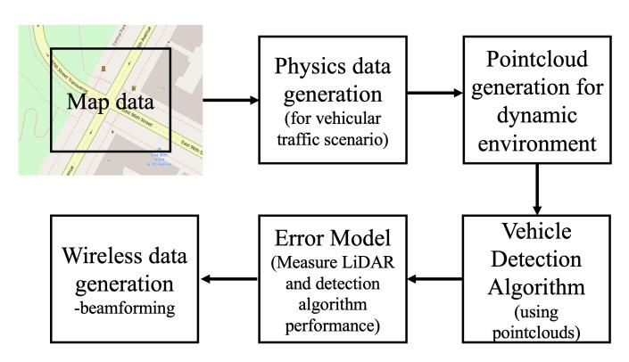
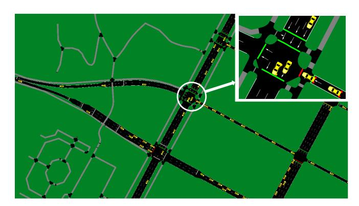
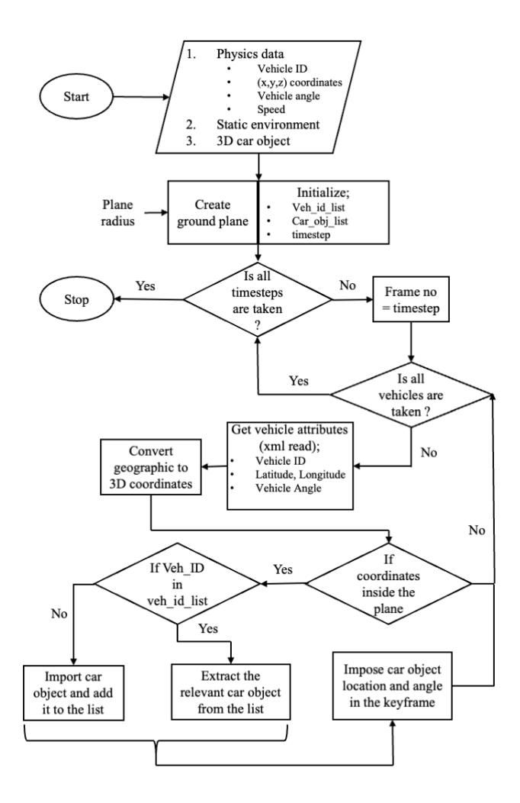
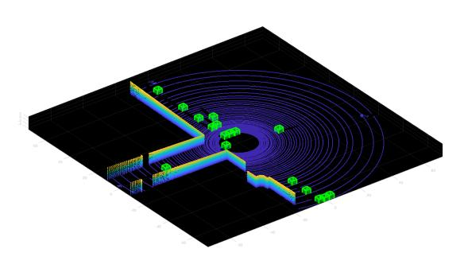
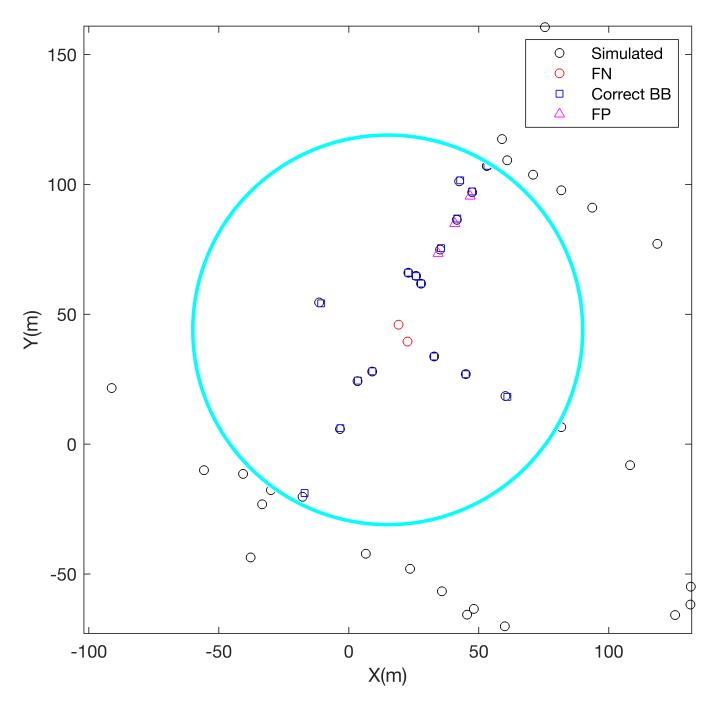
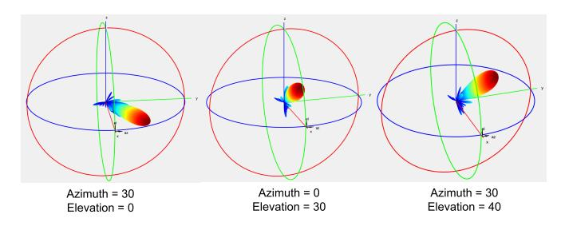
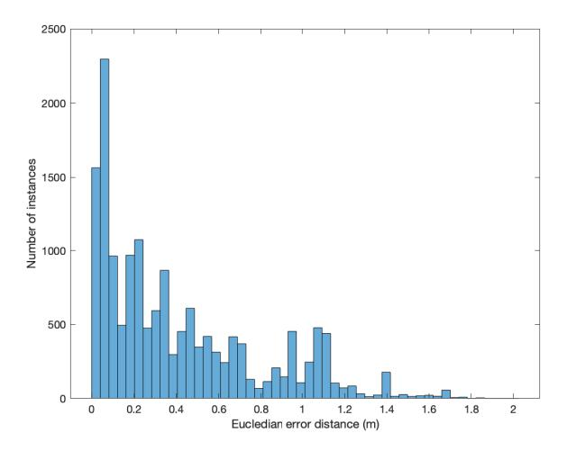
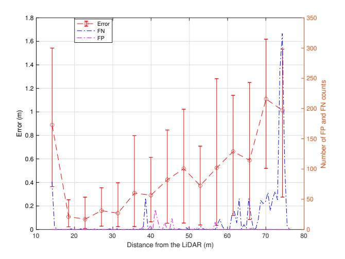
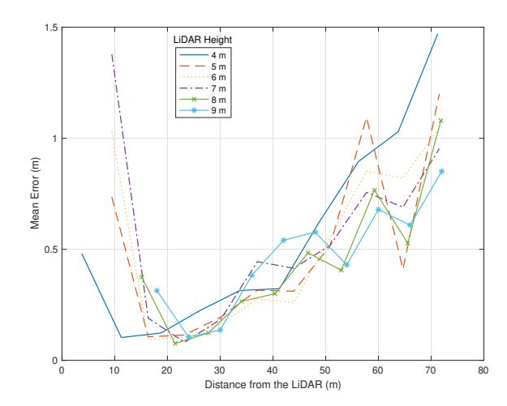
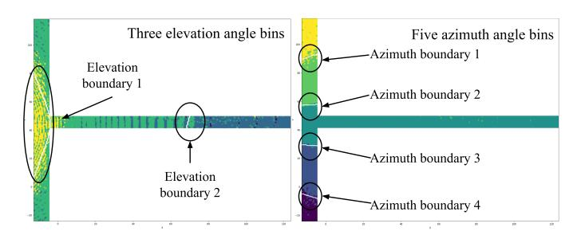

{0}------------------------------------------------

# LiDAR aided Simulation Pipeline for Wireless Communication in Vehicular Traffic Scenarios

Uvindu Kopiyawattagea<sup>∗</sup> , Anton Dilip Ranjula<sup>a</sup> , Nalin Jayaweera<sup>a</sup> , Dileepa Marasinghe<sup>a</sup> , Nandana Rajatheva<sup>a</sup> , Sami Hakola<sup>b</sup> , Timo Koskela<sup>b</sup> , Oskari Tervo<sup>b</sup> , Juha Karjalainen<sup>b</sup> , Jari Hulkkonen<sup>b</sup> <sup>a</sup>Centre for Wireless Communications, University of Oulu, Oulu, Finland <sup>b</sup>Nokia Standards, Oulu, Finland

{uvindusanda, hdantondilip }@gmail.com,{nalin.jayaweera, dileepa.marasinghe, nandana.rajatheva}@oulu.fi, {sami.hakola, timo.koskela, oskari.tervo, juha.p1.karjalainen, jari.hulkkonen}@nokia.com

*Abstract*—Integrated Sensing and Communication (ISAC) is one new technology under development for Sixth Generation (6G) systems. This paper focuses on creating a simulation pipeline for dynamic vehicular traffic scenarios and a novel approach to reducing wireless communication overhead with a LiDAR-based system. The simulation pipeline can be used to generate data sets for numerous research. Additionally, developed error model for vehicle detection algorithms can be used to identify LiDAR performance with respect to different parameters like LiDAR height, range, and laser point density. A periodic beam index map is developed by capturing antenna azimuth and elevation angles which denote maximum Reference Signal Receive Power (RSRP) for a simulated receiver grid on the road and classifying areas using Support Vector Machine (SVM) algorithm to reduce the number of Synchronization Signal Blocks (SSBs) that needed to send in Vehicle to Infrastructure (V2I) communication.

*Keywords*—*Integrated Sensing and Communication (ISAC), Light Detection and Ranging (LiDAR), Simulation pipeline, Multiple Input Multiple Output(MIMO), Beamforming, Vehicle detection, Signal to Noise Ratio (SNR)*

## I. INTRODUCTION

Sensing-aided communication methods are currently under investigation to optimize the performance of future 6G communication networks. Applications like smart cities, connected vehicles, and remote health care require high-quality wireless connectivity with high accuracy and robust sensing. ISAC [1] will go beyond classical communication methodology and provide a sensing functionality to measure or even fully map the surrounding environment with details for a particular instance. There are two potential gains of ISAC, namely, i) *Integration Gain* reach by the shared use of wireless resources for dual purposes of sensing and communication to alleviate duplication of transmissions, devices, and infrastructure, and ii) *Coordination Gain* achieved by the mutual assistance between sensing and communication. With the use of ISAC technology general wireless network turns into a sensingassisted network. There are two ways of ISAC i.e., sensingassisted communication and communication-assisted sensing. In this study, we consider sensing-assisted communication enabled by LiDAR sensors in V2I wireless network.

Massive Multiple Input Multiple Output (MIMO) and millimeter waves are significant technologies for wireless systems. It enables high data rates and multiplexing gains through directing radiating pattern created by the use of antenna array which is the beam towards user equipment (UE). This method called as beamforming. However, when you want to generate wireless data, having a large number of antenna elements on both the receiver and transmitter sides can become cumbersome. In Vehicle to everything (V2X) communication, incorporating highly mobility scenarios like traffic junctions in an urban area will become even more challenging. One main reason for the challenge can be the coordination overhead associated with the large channel matrices generated by MIMO antennas. Data-driven techniques are used for most parts in wireless communication including channel modelling, spectrum management, resource allocation, network security, beamforming in MIMO systems, Intelligence of Things (IoT), etc. Hence researchers need data sets and a simulation environment where they can easily change according to their objectives. Also, current research on Machine Learning (ML) applications to 5th Generation (5G) focus on how raw data from sensors such as LiDAR and cameras can optimize the communication performance of the network in different levels of the communication system [2], [3], [4]. But the possibility of having realistic 3D models, physics engines, and algorithm deployment environments to test current communication systems virtually, helps in terms of Artificial Intelligence (AI) applications in 6G and beyond.

With the development of ISAC technology, sensors like LiDAR, RGB cameras, and depth cameras have been added making the network even more complicated. For example, cellular networks become ubiquitously deployed large-scale sensor networks, namely a perceptive Network [5] with this added sensor network. But most of the current infrastructures do not yet support sensors like LiDAR due to the high capital cost. Additionally, the full potential of LiDAR in communication systems has not yet been fully realized. Even though this increase of complexity and cost in wireless systems affected all types of communication systems, the impact on vehicular communication is large [6]. In V2I network, managing interference and ensuring coexistence with multiple 

{1}------------------------------------------------

systems is a significant challenge, which requires additional computational complexity. These networks should be scalable to support a growing number of vehicles and sensors without compromising performance. All of these reasons act as a motivation to develop the simulation pipeline for V2I communication by incorporating sensing agent as LiDAR. The behavior of LiDAR as a Road Side Unit (RSU) in vehicular traffic scenarios is not addressed in most research. The majority of studies related to V2X communication involving LiDAR focuses on its installation on vehicles, primarily for the purpose of autonomous navigation and perception tasks but not for communication perspective. Also, most of published research in virtual simulation platforms do not study the LiDAR behaviour in vehicular network scenarios [7], [8]. Therefore, in addition to the simulation pipeline another aspect is to identify LiDAR performance as a RSU in V2I communication with respect to different parameters like LiDAR height, range, laser point density, added noise etc.

As for the main contribution and in addition to the LiDAR aided simulation pipeline, this research provides ability to analyze point cloud based vehicle detection algorithms for a selected vehicular environment. This analyzation includes how well the vehicle detection can be done and what kind of accuracy can be achieved for different variable parameters. This study of performance evaluation of detection accuracy is done using a custom-developed error model. As for the secondary contribution of this paper and using simulation pipeline results, a novel periodic beam index map is developed to reduce wireless communication overhead by reducing number of SSBs needed in vehicular communication. Beam index map is deployed such that the beam with maximum RSRP reaches high mobility UEs inside vehicles.

## II. SIMULATION PIPELINE

The implementation of a dynamic simulation environment to create data sets and a simulation environment for a system with LiDAR cohabiting with a 5G New Radio (NR) compliant wireless system is presented. The base of the vehicular traffic scenario is defined according to the 3rd Generation Partnership Project (3GPP) compliant documents. The automated simulation pipeline is explained in further sub-sections. The pipeline overview is shown in Fig. 1.

#### *A. Environment selection*

According to 3GPP compliant document ETSI TR 138 913 section 6.1.4, [9], the selected environment is called, "Urban Macro". The key characteristics of this scenario are continuous and ubiquitous coverage in urban areas. This scenario will be interference-limited, using macro TRxPs (i.e., radio access points above the rooftop level). In this simulation environment, the focus will be UE inside moving vehicles.

Multiple junctions from Manhattan in the United States are selected as the simulation environment. The reason for selecting multiple lane is that, then different traffic types can be



Fig. 1: Pipeline overview

achieved by changing the vehicle insertion density parameter of the physics engine. "OpenStreetMap" [10] is used to collect map data of a particular junction.

#### *B. Physics engine*

To achieve dynamic changes, vehicles should have motion according to general traffic rules. Therefore, the generation of vehicle paths and velocities has been achieved with the "Simulation of Urban Mobility" (SUMO) [11] open-source package. This is a microscopic, multi-model traffic simulator. It allows doing a simulation of how a single vehicle moves through a road with given traffic demand and a given road network. Route details are given at the end of the simulation for each time instance and for each vehicle. These route details include vehicle id, position, angle, vehicle type, speed, lane id, and slope details. Fig. 2 shows one instance of SUMO physics data generation using demand elements as cars.

Vehicles are modeled explicitly, have their own route, and do not depend on other vehicle routes. Even though, the simulations are deterministic by nature; there are various options to introduce randomness in multiple levels using this simulator. For this study, randomness is used to check the pipeline's robustness. The road network can be changed according to requirements. For example, there can be multiple edges between two junctions as there can be multiple lanes on the road. Network files can be edited using the Netedit Graphical User Interface (GUI) tool provided by SUMO to get the required junctions and edges. Routes are created by randomly selecting source and destination edges according to a Poisson distribution. Table I presents some crucial parameters used for physics data generation.

## *C. LiDAR point cloud generation for dynamic environment*

A laser scanner was added using the open-source project Blensor [12] in Blender software. The transition algorithm (Fig. 3) of developing a dynamic environment from the physics data is achieved using a blender python Application Programming Interface (API) script. This will extract the information

{2}------------------------------------------------

TABLE I: Physics data generation parameters

| Parameter                 | Value                   | Explanation                                                                                                                                                                        |  |
|---------------------------|-------------------------|------------------------------------------------------------------------------------------------------------------------------------------------------------------------------------|--|
| Run time                  | 1200 seconds            | Ensures enough vehicle movements to capture from the LiDAR                                                                                                                         |  |
| Vehicle<br>insertion rate | 1 vehicle per<br>second | Provide natural traffic density on the road                                                                                                                                        |  |
| Minimum<br>distance       | 300 m                   | Ensures that vehicle will travel at least mini-<br>mum distance which reduces the random vehicle<br>spawning in the middle of the road                                             |  |
| Maximum<br>vehicle speed  | 30 Kmph                 | According to ETSI TR 138 913 section 6.1.4 [9] for high urban city area the maximum vehicle speed is selected                                                                      |  |
| Fringe factor             | 10                      | Ensures that vehicles start and end their trips at<br>the edge of the road network. Then LiDAR sen-<br>sor should not capture missing and teleportation<br>of vehicles on the road |  |



Fig. 2: One instance of SUMO physics data simulation with demand elements (cars)

TABLE II: LiDAR configuration

| LiDAR model                           | Velodyne HDL-64E2 |
|---------------------------------------|-------------------|
| Scan resolution                       | 0.1 m             |
| Rotation speed                        | 30 Hz             |
| Scan distance                         | 75 m              |
| Added noise distribution              | Gaussian          |
| Mean of added noise                   | 0 m               |
| The standard deviation of added noise | 0.01 m            |
| Start-end angle                       | 0°-360°           |
| Reflectivity distance                 | 50 m              |
| Reflectivity limit                    | 0.1 m             |
| Reflectivity slope                    | 0.01 m            |

from the physics data file and place car objects in particular locations throughout the timeline in different time steps. After generating key frames, the simulation can run where cars move in the 3D environment according to previously generated physics data. The main task of the transition algorithm is to transition from physics data to three dimensional (3D) dynamic environment where user can extract point cloud data.

#### D. Vehicle detection using point cloud

Sensing-aided wireless communication research requires data sets with the ability to simulate and acquire information from sensing agents. In this study, the pipeline requires an



Fig. 3: Transition algorithm to create a dynamic environment from physics data

algorithm that can detect vehicle locations from point cloud data. Different types of methods such as machine learning and ground plane removal with cluster-based can be used to get vehicle locations. Since point cloud data is generated from a simulation platform, using a learning algorithm like in [13] has a high probability to over-fit the model to the data. Even if we make the simulation to more like practical environments, there is a high cost of training since the input data type (point cloud) consists of large size of data files. Also, most learning algorithms require LiDAR intensity data which is not available from Blenser API. Therefore, ground plane removal with cluster-based method [14] is identified as more suitable for the simulation platform.

Before feeding point cloud data into the clustering algorithm, it needs to go through a data pre-processing step where a change of axis needs to happen. Coordinate transformation

{3}------------------------------------------------

from LiDAR to global coordinates is used to generate point cloud data with global perspective. The vehicle detection algorithm consists of four parts i.e. (i) region of interest selection where it limits the actual point cloud processing region by removing not considered area and the LiDAR blind spot to improve the speed of detection, (ii) ground removal to remove the static environment and focus on the dynamic objects, here its vehicles, (iii) Euclidean distance-based clustering method to cluster the points with close distance into one class and only the coordinate information of the points is used in the clustering without intensity data finally (iv) Each detected cluster from the clustering part is converted to a bounding box detection (Fig. 4) with the format [x, y, z, θ, l, w, h]. Where x, y, z refers to the position, θ refers to the yaw angle, and l, w, h refers to its length, width, and height respectively of the bounding box.



Fig. 4: Bounding box detection of vehicles

## *E. Error model*

The custom error model (Algorithm 1) is developed to identify the performance of any given vehicle detection algorithm using point cloud data and LiDAR performance with different parameters. After initial input parameter setup, this can be used for any vehicular traffic scenario environment. The calculated results from the algorithm are detection accuracy with true positives, false negative, and false positive detection. The algorithm contains a visualization part where it shows multiple helpful information related to detection and LiDAR capability.

*Comment 1:* There can be more than one instance where queried bounding box locations points to the same simulated vehicle location. Which gives potential false positives from the vehicle detection algorithm.

*Comment 2:* False positives are locations where the vehicle does not suppose to be. True positives are bounding box detection without false positives which means correct locations from the vehicle detection algorithm. False negatives are locations where a vehicle detection algorithm does not detect a vehicle.

#### Algorithm 1 Error model

- 1: Inputs:Bounding box locations:(Lbb) and simulated vehicle locations:(Ls) with timestamps. LiDAR radius:(r). LiDAR sensor position coordinates:(X). Transformation matrix from LiDAR to global coordinates (H)
- 2: Update L<sup>s</sup> with coordinates only inside the LiDAR scan radius
- 3: Update Lbb with transformed coordinates using H
- 4: Get intersection timestamps T = (t1, t2, . . . , tn) of Lbb and L<sup>s</sup>
- 5: for t<sup>i</sup> in T do
- 6: Returns the indices of the closest points in Ls(ti) to the query points in Lbb(ti) ▷ Comment 1
- 7: Lpotential F P (ti) = Identify Lbb(ti) coordinates that points to a same location in Ls(ti)
- 8: if Lpotential F P (ti) is NOT empty then
- 9: Lbb F P removed(ti) = Get the coordinate from Lpotential F P (ti) which has minimum distance to corresponding coordinate in Ls(ti)

```
10: LF P (ti) = Remove Lbb F P removed(ti) from
   Lpotential F P (ti)
11: else
12: LF P (ti) = Nan
13: end if
14: if length(Ls(ti)) > length(Lbb F P removed(ti)) then
15: LF N (ti) = Coordinates in Ls(ti) except
   Lbb F P removed(ti)
16: else
17: LF N (ti) = Nan
18: end if
19: LT P (ti) = Lbb F P removed(ti)
20: end for
21: Outputs: LT P (ti), LF P (ti), LF N (ti) ▷ Comment 2
```

### *F. Wireless beamforming*

Beamforming is a technology where the radiation pattern of MIMO antenna steer according to the UE direction to achieve high Quality of Service (QoS) in a wireless channel. Beam formed radiation pattern for a specific azimuth and elevation angle can be calculated according to [15]. There it gets the element pattern by separately calculating horizontal and vertical radiation pattern in decibel. Then composite array radiation is added to already calculated element pattern to get the beam formed radiation pattern for all elevation and azimuth angle range. The composite radiation pattern is calculated using weighting factor, steering matrix components and correlation level [15]. Generated radiation pattern are given in the Fig. 6 for 8x8 MIIMO antenna as example.

Detected vehicle locations are used to steer the beams according to each time step of the moving vehicle. Road considered as a grid of receivers and simulation of the wireless channel has been done using the Wireless Insite software. Getting smaller grid spacing is always beneficial to pinpoint the exact location of the receiver beam. But grid spacing of

{4}------------------------------------------------



Fig. 5: 2D visualization of results from error model (Circle boundary represents the LiDAR range and points are vehicles)



Fig. 6: Beam formed radiation patterns for particular azimuth and elevation angles in degrees

0.5 m is selected because the average percentage of Euclidean detection error distance from the bounding box detection is approximately 0.5 m. This ensures that an average number of vehicles will not have the same receiver at the same time step while not having high computational overhead.

Channel matrices and precoder weights (Eq.1) calculated according to [16] used to determine the azimuth and elevation angles corresponding to maximum RSRP value (Eq.2) for each receiver location on the receiver grid.

$$w = \exp\left\{-j\left(\frac{2\pi}{\lambda}\right) \cdot (d_h \sin(\theta)\sin(\phi) + d_v \cos(\theta))\right\}$$
 (1)

where θ and ϕ are elevation and azimuth angles. d<sup>v</sup> and d<sup>h</sup> are vertical and horizontal antenna element distances from the center of the antenna and λ denotes the wavelength.

$$RSRP = 10 \cdot \log_{10}(|H^T \cdot w|^2) \tag{2}$$

where H denotes the channel matrix.

The pipeline will output the beam indexes which correspond to elevation and azimuth angle considering the total range that covers the LiDAR area with the base station. This task is performed by first getting the elevation and azimuth angle which provide the maximum RSRP for each receiver in the receiver grid. Then the boundary areas for elevation and azimuth angle maps will be identified using SVM algorithm and contour plot. The map acts like a lookup table where you provide the location of the vehicle as input and the output will be the corresponding elevation and azimuth angle. The accuracy of the output corresponds with the SVM boundary detection accuracy. This lookup table is used for a particular time period which is determined according to the scene changes. With this method, it is not necessary to do the wireless beamforming for each instance for every vehicle which reduces the communication overhead. Furthermore, it will reduce the number of SSBs that needed to send.

## III. RESULTS

The performance and observations from the proposed simulation pipeline were evaluated through a selected vehicular traffic scenario as in II-A. Furthermore, it is shown that a periodic wireless beamforming map can be used to reduce the wireless overhead that happens from a large number of V2I communication.

## *A. LiDAR performance in urban traffic scenario*

One of the main outcomes of this study is to identify the characteristics and limitations of detecting vehicles in urban traffic scenarios with the sensing agent as roadside LiDAR. Ultimately, we use that detected location information to correctly steer the signal beams of a MIMO antenna such that higher Signal to Noise Ratio (SNR) can be achieved at the moving UE side. Having a simulation pipeline is beneficial since it is possible to easily change sensor parameters to identify the behavior. Fig. 7, Fig. 8 and Fig. 9 are result outcomes from the error model which provide insights for the LiDAR behavior in urban traffic scenarios.

Approximately a maximum of 1.9 m, minimum of 0.1 m, and average of 0.26 m of detection error was recorded for a simulation traffic environment with a maximum car speed of 30 Kmph. 96% of detection have an error of less than 1 m for this LiDAR configuration in Fig 7. Detection accuracy is 83% and from a range, up to 70 m (not considering high FNs happen at the LiDAR boundary region) has approximately 10% of FNs. Also, less than 1% of FPs are observed.

In short distance from the LiDAR, there are no error values due to the blind spot. The mean and variation of Euclidean error distance reduce up to some point and increase with the distance from the sensor. This phenomenon is due to

{5}------------------------------------------------



Fig. 7: Histogram of bounding box distance error for LiDAR height 8m



Fig. 8: Bounding box detection error bar with 95% confidence interval, False Negative and False Positive counts with LiDAR range. LiDAR height is 8 m

having low laser point density from near the blind spot range as well as from further away from the sensor. Hence the vehicle detection algorithm will struggle to detect the vehicle in those ranges. Minimum error distance can be observed in the range of 12 to 26 m for LiDAR heights between 4 to 10 m. The minimum error distance observable area shifts to higher values of ranges as LiDAR height increases as in Fig. 9. As LiDAR height increase, the mean error variation will have a higher value compared to lower LiDAR heights, but average detection accuracy increase from 4m up to 6m LiDAR sensor height and then decrease for higher sensor heights. FN count largely increases due to shadowing in the



Fig. 9: Bounding box detection mean error variation with LiDAR range for multiple LiDAR heights

point cloud created by the neighboring vehicles. Therefore, FN count does not have an incremental relationship with the sensor range, rather it shows spikes in junctions where vehicles stack up in traffic. Also, point cloud do not contain many laser points at the LiDAR boundary region (70 to 75 m). Hence detection algorithm couldn't identify those vehicles resulting in very high FN counts. FP vehicle detection happens when the detection algorithm hyperparameter corresponds to a minimum number of laser points to identify a vehicle become low. On the contrary high value of a minimum number of laser points to identify a vehicle will result in FNs. Therefore, this detection algorithm parameter needs to be fine-tuned according to the environment using Fig. 5. It is important to point out that more general and smooth graphs can be obtained by increasing the detection data points in Fig. 8 and Fig. 9.

#### B. Periodic beam index map



Fig. 10: Boundary areas for elevation and azimuth angle maps for the receiver grid on the road

The resulting periodic maps shown in Fig 10 correspond to the selected T junction in Manhattan New York. The base station (e.g 8x8 MIMO antenna) that serves the LiDAR area is

{6}------------------------------------------------

situated between azimuth boundaries 2 and 3, on the other side of the horizontal road with an angle of  $20^\circ$  to the elevation plane. The considered calculation of this base station can serve 15 beams (3 elevation and 5 azimuth angles) within the elevation range from  $90^\circ$  to  $100^\circ$  and azimuth range of  $-60^\circ$  to  $60^\circ$ . The pipeline parameters can change to consider specific antennae with a given number of beams. The beam index map can be used for further V2I communication which reduces the additional overhead of figuring out the correct beam index with the cost of detecting accurate boundaries. This cost can be determined according to Eq.3. The cost value is between zero and one with 0 representing perfect boundary areas while 1 represents the maximum error of getting beam indexes.

$$cost = 1 - \left(\frac{A_{\theta} + A_{\phi}}{2}\right) \tag{3}$$

where  $A_{\theta}$  and  $A_{\phi}$  denote the SVM classification accuracy for elevation and azimuth maps respectively. For this environment  $A_{\theta}=0.82$  and  $A_{\phi}=0.97$  which gives a boundary detection cost of 0.105.

LiDAR error observation results for urban traffic scenarios with the novel method of reducing wireless communication overhead will provide new insight for future V2I communication.

#### IV. CONCLUSION

The proposed simulation pipeline includes mainly five stages as in Fig. 1. It can be used to generate data sets for different applications including ML, deep learning tasks, and optimization-based problems like figuring out the best LiDAR sensor installation location in a specific environment. The custom error model algorithm can be applied to detect true positive detection of a vehicle detection algorithm using point cloud data. In addition, it outputs the number of not detected and wrongly detected vehicles. The visualization section of the algorithm provides insights into how detection algorithm error variation with the LiDAR range, the effect of LiDAR height, and how false positive an false negative detection vary in different situations. Finally, a novel method of reducing wireless communication overhead is proposed in a vehicular traffic scenario. It uses a periodic beam index map to determine MIMO beam parameters for a particular vehicle at a specific time without always performing beam steering. The cost value is provided to determine how well the azimuth and elevation boundaries are classified, which ultimately affects the wireless communication performance. In future studies, the developed pipeline can be used to simulate other scenarios like blockage prediction, improve Line of Sight (LoS) handover, channel planning, and prediction, etc.

#### ACKNOWLEDGMENT

We would like to thank for the valuable guidance and support from mentors in the Centre for Wireless Communications (CWC) and Nokia Standards in Oulu, Finland.

#### REFERENCES

- Fan Liu, Yuanhao Cui, Christos Masouros, Jie Xu, Tony Xiao Han, Yonina C. Eldar, and Stefano Buzzi, "Integrated sensing and communications: Toward dual-functional wireless networks for 6g and beyond," *IEEE Journal on Selected Areas in Communications*, vol. 40, no. 6, pp. 1728–1767, 2022.
- [2] Aldebaro Klautau, Pedro Batista, Nuria González-Prelcic, Yuyang Wang, and Robert W. Heath, "5g mimo data for machine learning: Application to beam-selection using deep learning," in 2018 Information Theory and Applications Workshop (ITA), 2018, pp. 1–9.
- [3] Muhammad Alrabeiah, Andrew Hredzak, Zhenhao Liu, and Ahmed Alkhateeb, "Viwi: A deep learning dataset framework for vision-aided wireless communications," in 2020 IEEE 91st Vehicular Technology Conference (VTC2020-Spring), 2020, pp. 1–5.
- [4] Aldebaro Klautau, Nuria González-Prelcic, and Robert W. Heath, "Lidar data for deep learning-based mmwave beam-selection," *IEEE Wireless Communications Letters*, vol. 8, no. 3, pp. 909–912, 2019.
- [5] Andrew Zhang, Md. Lushanur Rahman, Xiaojing Huang, Yingjie Jay Guo, Shanzhi Chen, and Robert W. Heath, "Perceptive mobile networks: Cellular networks with radio vision via joint communication and radar sensing," *IEEE Vehicular Technology Magazine*, vol. 16, no. 2, pp. 20–30, 2021.
- [6] Eslam Farsimadan, Francesco Palmieri, Leila Moradi, Dajana Conte, and Paternoster Beatrice, Vehicle-to-Everything (V2X) Communication Scenarios for Vehicular Ad-hoc Networking (VANET): An Overview, pp. 15–30, 09 2021.
- [7] Dileepa Marasinghe, Nalin Jayaweera, Nandana Rajatheva, Sami Hakola, Timo Koskela, Oskari Tervo, Juha Karjalainen, Esa Tiirola, and Jari Hulkkonen, "Lidar aided wireless networks - beam prediction for 5g," in 2022 IEEE 96th Vehicular Technology Conference (VTC2022-Fall), 2022, pp. 1–7.
- [8] Ailton Oliveira, Felipe Bastos, Isabela Trindade, Walter Frazão, Arthur Nascimento, Diego Gomes, Francisco Müller, and Aldebaro Klautau, "Simulation of machine learning-based 6g systems in virtual worlds," vol. 2, pp. 113–123, 08 2021.
- [9] ETSI TR 138 913 V14.3.0., "5g; study in scenarios and requirements for next-generation access technologies," 10 2017.
- [10] "Openstreetmap: This website includes static environment data such as roads, buildings, and traffic lights," https://www.openstreetmap.org.
- [11] Pablo Alvarez Lopez, Michael Behrisch, Laura Bieker-Walz, Jakob Erdmann, Yun-Pang Flötteröd, Robert Hilbrich, Leonhard Lücken, Johannes Rummel, Peter Wagner, and Evamarie Wießner, "Microscopic traffic simulation using sumo," in *The 21st IEEE International Confer*ence on Intelligent Transportation Systems. 2018, IEEE.
- [12] Michael Gschwandtner, Roland Kwitt, Andreas Uhl, and Wolfgang Pree, "Blensor: Blender sensor simulation toolbox," 09 2011, vol. 6939, pp. 199–208.
- [13] Yin Zhou and Oncel Tuzel, "Voxelnet: End-to-end learning for point cloud based 3d object detection," in 2018 IEEE/CVF Conference on Computer Vision and Pattern Recognition, 2018, pp. 4490–4499.
- [14] "Track vehicles using lidar: From point cloud to track list," https://se.mathworks.com/help/lidar/ug/track-vehicles-using-lidarfrom-pointcloud-to-track-list.html.
- [15] ETSI TR 37.840, "Study of radio frequency (rf) and electromagnetic compatibility (emc) requirements for active antenna array system (aas) base station."
- [16] ETSI TR 138 901 V16.1.0, "Study on channel model for frequencies from 0.5 to 100 ghz (3gpp tr 38.901 version 16.1.0 release 16)," .