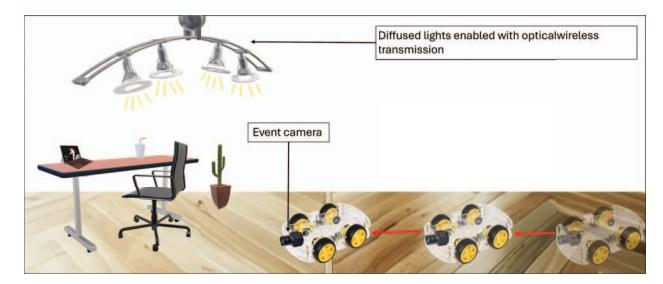
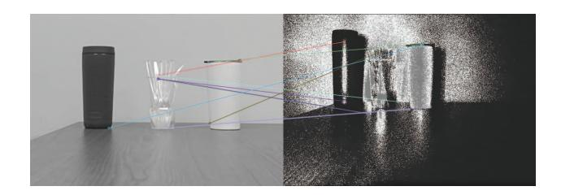

{0}------------------------------------------------

# **Poster Abstract: Joint Optical Wireless Communication and Sensing using Neuromorphic Cameras**

Abbaas Alif Mohamed Nishar amohamednishar1@student.gsu.edu Georgia State Univerisity Atlanta, Georgia, USA

Sonipriya Paul spaul30@student.gsu.edu Georgia State Univerisity Atlanta, Georgia, USA

Ashwin Ashok aashok@gsu.edu Georgia State Univerisity Atlanta, Georgia, USA

### **ABSTRACT**

In this work, we propose a novel re-use of neuromorphic (event) cameras for joint sensing and communications. Event cameras work on the principle of capturing changes in the light intensities, essentially capturing events that lead to such changes. This makes them operable at low power and sample events at fast rates (equivalent to about 40K frames-per-second compared to RGB cameras). We propose a system design to leverage the time-sampling nature of events for optical wireless communication and the ability to sample a collective area of physical space for imaging. In particular, we propose to address the challenges to achieve passive optical wireless (backscatter) communication as well as computer vision functions such as object and path detection using a single neuromorphic camera device. We posit that such an integrated functioning through a single low-power device opens new avenues for visible/invisible light communication and visual scene processing.

## **CCS CONCEPTS**

• **Networks** → **Mobile networks**; • **Hardware** → **Signal processing systems**; • **Computing methodologies** → **Computer vision**.

### **KEYWORDS**

VLC, VLC backscatter, VLC natural backscatter, Neuromorphic Cameras, Event Cameras, Joint Sensing and Communication

### **1 INTRODUCTION**

In the rapidly evolving wireless technology landscape, the integration of sensing and communication has been crucial, laying the foundation for future 6G networks [1]. Advances in WiFi, RF technologies, millimeter wave communications, and radars have been instrumental, now furthered by Visible Light Communication (VLC) that utilizes the broader optical spectrum, including ultraviolet and infrared. The potential of VLCs is magnified by neuromorphic cameras, which, with their ability to capture changes in light and frame them like a traditional camera video at 40,000 FPS. Furthermore, VLC has embraced backscatter communication for its energy efficiency, with neuromorphic cameras that enable natural backscatter through surface reflections, facilitating non-line of sight (NLoS) communication [4]. This breakthrough offers a novel approach to NLoS VLC, broadening its applicability and marking a significant stride in wireless communication research.

**Proposed Approach.** To this end, in this work we propose the concept of joint sensing and communication using neuromorphic cameras. We promote this concept based on the idea of a use-case of a robot performing a mission in an indoor scenario (e.g., a room),

**Figure 1: Conceptual illustration of the proposed joint sensing and communication using optical wireless and neuromorphic camera on a robot**

as shown in Figure 1. The robot is equipped with a neuromorphic camera and the ceiling lights (or any diffused ambient lighting) in the room are enabled for optical wireless transmission (e.g. transmit a packetized data using optical modulation techniques in visible or invisible (IR/UV) spectrum). With the help of our system, the robot will be able to receive data streams through light emissions and simultaneously be able to detect objects in the vicinity due to spatial restructuring of the event data and executing computer vision techniques in the resultant frame.

**Related Works.** Prior work on conducting computer vision operations has been well surveyed in [2] and has been employed for obstacle detection on drones [3].

**System Challenges.** The challenges in devising the bespoke joint modality system arises from making the optical wireless communication work in a fully passive manner. That is, the camera on the bot should not need to pointing in the line-of-sight direction to receive the data stream. Our system will leverage the fact that since the ceiling light is diffused and carries data, every point at which the light rays (photons) fall in the room and the field of view of the camera are pseudo-light emitters with data. Hence, the robot will be able to pick up the data under a truly nonline-of-sight condition. On the other hand, the ability to profile the communicated data across different surfaces (reflections) in the room helps to potentially characterize features of target objects.

## **2 FEASIBILITY TESTS AND RESULTS**

We conducted simple experiments to test the feasibility of our hypothesis that claims the ability to communicate and do vision sensing simultaneously with a single neuromorphic camera. We set up an LED emitter in a lab conference room emulating a ceiling light lamp. The camera was set to point directly at the LED (line-of-sight) and then pointed to the objects under view. We intentionally choose

{1}------------------------------------------------

**Figure 2: ORB descriptors with BF Matcher applied on grayscale image from RGB camera (left) and event frame (right) from neuromorphic camera**

three objects of variable surface texture: a water bottle/to-go coffee holder, and a small empty glass vase. a matte-finish water/coffee holder. We use the Prophesee (w/ EVK4 image sensor) camera evaluation kit and a vehicle RED tail light as the optical wireless emitter. The objects are placed at a depth/distace of 1.3m from the center of the camera.

## **2.1 Backscatter Optical Wireless Communication**

We transmitted (using the LED) a 101010.. sequence using a 50% duty cycle square waves from the function generator, and varying different frequencies across different trials. The frequency, equivalently the transmit data rate, ranged from 60Hz to 5KHz. Using the Lomb-Scargle periodogram graphing, we estimate the detected/dominant frequency based on the local maxima of the spectrum. This analysis is done for a single pixel manually selected from the equivalent space snapshot for each time as provided by the camera.

| 𝐹𝑡𝑟𝑎𝑛𝑠 (𝐻𝑧) | 𝐹𝑑𝑎𝑟𝑘 (𝐻𝑧) | 𝑃𝑑𝑎𝑟𝑘 (𝑑𝐵) | 𝐹𝑎𝑚𝑏𝑖𝑒𝑛𝑡 (𝐻𝑧) | 𝑃𝑎𝑚𝑏𝑖𝑒𝑛𝑡 (𝑑𝐵) |
|-------------|------------|------------|---------------|---------------|
| 60          | 60.004     | 24.034     | 60.000        | -2.2187       |
| 100         | 99.970     | 27.180     | 99.978        | 20.608        |
| 1k          | 999.963    | 21.289     | 1000.000      | 22.600        |
| 2.5k        | 2500.150   | 31.063     | 2500.090      | 34.908        |
| 5k          | 5000.000   | 29.4819    | 4999.900      | 20.75         |

**Table 1: Results of Communication Experiments**

From Table 1, we show that it is possible to detect the dominant frequency in the received signal and thus enable coherent detection. Considering each event corresponds to a light intensity change and with the polarities of changes (low to high v/s high to low), the demodulation process can involve a simple judiciously selected threshold. We observe that the 60Hz signal in the ambient scenario had very low received signal power due to interference from ambient light, which is roughly 50Hz. These results show the possibility and set the foundation for building decoding optical wirelessly communicated data using a neuromorphic camera in a complete backscatter scenario.

#### **2.2 Image Sensing and Processing**

In case of the vision domain, we visualize the event frame, sampled across spatial points within the field of view, looks and also target some feature matching between an RGB camera's image of the same scene and the event camera. We chose a frame from the 60Hz dataset, as it retained the most visual aesthetics of the objects and definition in the default event camera settings. We compute the ORB feature descriptor and do Brute-Force matching of features to find possible matching corresponding points. From Figure 2, we can see that the corresponding points are not found by the general feature descriptors.

To further understand this phenomenon, we chose the nonreflective object, removed the background, and cropped it tightly in both the image frame and the event frame. We calculated the histogram (probability density function) of the pixel intensities for the object in both types of frames. We observed that the distributions were starkly different. This implies that the extraction of computer vision features and further analysis require sophisticated correspondence matching and point tracking techniques.

#### **3 CONCLUSION AND FUTURE WORK**

This poster demonstrates the feasibility of using neuromorphic cameras for optical wireless communication and computer vision processing. Our findings highlight the effectiveness of neuromorphic cameras in improving data transmission efficiency and suggest the need for domain-specific algorithms to address challenges in vision sensing. Looking ahead, we plan to develop custom-made advanced packetization and demodulation techniques for this unique system and build a robotic platform to test these innovations in realworld applications. This future work aims to not only overcome the limitations identified, but also explore the integration of communication and sensing technologies for innovative applications in robotics and smart environments, pushing the boundaries of what is possible with passive joint optical wireless camera communication and computer vision.

#### **4 ACKNOWLEDGEMENT**

This work was supported by the National Science Foundation under Grant No. NSF CAREER CNS-2146267.

## **REFERENCES**

- [1] Xinran Fang, Wei Feng, Yunfei Chen, Ning Ge, and Yan Zhang. 2023. Joint Communication and Sensing Toward 6G: Models and Potential of Using MIMO. IEEE Internet of Things Journal 10, 5 (2023), 4093–4116. https://doi.org/10.1109/JIOT. 2022.3227215
- [2] Guillermo Gallego, Tobi Delbrück, Garrick Orchard, Chiara Bartolozzi, Brian Taba, Andrea Censi, Stefan Leutenegger, Andrew J. Davison, Jörg Conradt, Kostas Daniilidis, and Davide Scaramuzza. 2022. Event-Based Vision: A Survey. IEEE Trans. Pattern Anal. Mach. Intell. 44, 1 (jan 2022), 154–180. https://doi.org/10.1109/ TPAMI.2020.3008413
- [3] Jingao Xu, Danyang Li, Zheng Yang, Yishujie Zhao, Hao Cao, Yunhao Liu, and Longfei Shangguan. 2023. Taming Event Cameras with Bio-Inspired Architecture and Algorithm: A Case for Drone Obstacle Avoidance. Association for Computing Machinery, New York, NY, USA. https://doi.org/10.1145/3570361.3613269
- [4] Kenuo Xu, Kexing Zhou, Chengxuan Zhu, Shanghang Zhang, Boxin Shi, Xiaoqiang Li, Tiejun Huang, and Chenren Xu. 2023. When Visible Light (Backscatter) Communication Meets Neuromorphic Cameras in V2X. In Proceedings of the 24th International Workshop on Mobile Computing Systems and Applications (Hot-Mobile '23). Association for Computing Machinery, New York, NY, USA, 42–48. https://doi.org/10.1145/3572864.3580333