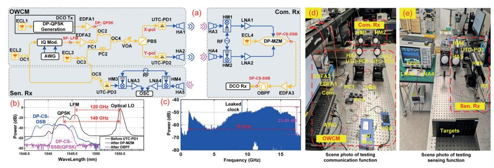
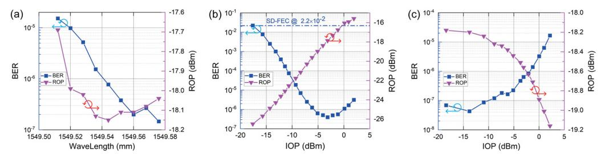
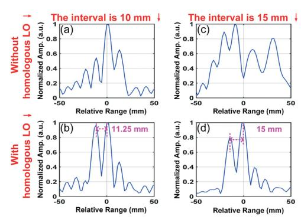

{0}------------------------------------------------

# A Sub-THz ISAC System with Simultaneous Real-Time 125.516-Gbps Communication Rate and Offline 10-mm Sensing Resolution Enabled by Photonics

Qingzhi Zhou(1), Mingzheng Lei(2\*), Junhao Zhang(1,2), Hao Li(1), Bingchang Hua(2), Yuancheng Cai(2), Jiao Zhang(1,2), Junjie Ding(2), Bo Liu(3), Zewei Zhang(1), Jiale Zheng(1), Jianjun Yu(2,4), Min Zhu(1,2\*)

**Abstract** *We demonstrate a photonic sub-THz integrated sensing and communication system. Realtime 125.516-Gbps data rate and offline 10-mm ranging resolution are achieved simultaneously in the 120-150 GHz band, enabled by a 2×2 MIMO fiber-wireless-fiber communication architecture and homologous sensing down-conversion mechanism. ©2024 The Authors* 

## **Introduction**

Contemporary advancements in the industry, such as smart cities and intelligent vehicles, rely on integrating high-speed wireless communication and high-precision sensing technology. The convergence of communication and radar frequencies in millimeter-wave (mmW) and terahertz (THz) bands serves as a significant catalyst for the development of integrated sensing and communications (ISAC). In recent years, mmW/THz photonics have been extensively explored as alternatives to conventional electronic methods with the natural advantage of considerable bandwidth and high frequency. A plethora of photonics-assisted joint radar and communication (JRC) systems have been reported for the integration of radar and communication functionalities in mmW/THz bands, employing the time-division multiplexing (TDM) [1-3], frequency-division multiplexing (FDM) [4-7], as well as co-time and co-frequency (CTCF) [8-9] mechanisms.

Table 1 summarizes the waveform mode, central frequency, communication rate, radar resolution, and capacity-resolution quotient (CRQ) [9] of typical photonics-assisted mmW/THz JRC links. However, the communications in the studies mentioned above are exclusively based on offline (OL) digital signal processing (DSP). Due to limitations in bandwidth, sampling rate, and accuracy of high-speed digital-to-analog/analog-todigital converters, achieving real-time (RT) processing for ultra-high-speed communication data remains challenging. Additionally, the phase noise and frequency offset caused by the freerunning laser beats severely limit more accurate spatial distance measurement. To effectively mitigate the frequency offset and phase noise at the transmitting end, techniques such as phaselocked loops, optical injection locking, or optical

**Tab. 1:** Comparison of typical photonics-aided JRC links

| Wave. Mode  | Cent. Freq. (GHz) | Com. Rate (Gbps) | Sen. Res. (cm) | CRQ (Gbps/cm) |
|----------------|-------------------------|------------------------|----------------------|------------------|
| TDM[1]         | 77                      | 90 (OL)                | 10                   | 9                |
| TDM[2]         | 96.5                    | 120 (OL)               | 2                    | 60               |
| TDM[3]         | 340                     | 60 (OL)                | 1.58                 | 37.97            |
| FDM[4]         | 28                      | 23 (OL)                | 30                   | 0.767            |
| FDM[5]         | 89.5                    | 78 (OL)                | 20                   | 3.9              |
| FDM[6]         | 60                      | 18 (OL)                | 0.97                 | 18.557           |
| FDM[7]         | 275                     | 40 (OL)                | 0.25                 | 160              |
| CTCF[8]        | 53                      | 16 (OL)                | 4.8                  | 3.333            |
| CTCF[9]        | 88.75                   | 92 (OL)                | 1.5                  | 61.333           |
| FDM[This work] | 140                     | 125.516 (RT)           | 1.0                  | 125.516          |

frequency comb [7] can be employed. However, these methods significantly increase the transmitter complexity.

This study integrates high-speed communication and high-resolution sensing in the sub-THz band employing the commonly used FDM method. Real-time communication of 125.516 Gbps has been successfully demonstrated utilizing a 2×2 multiple-input multiple-output (MIMO) fiber-wireless-fiber communication architecture [10], and the high-speed real-time processing capability of the state-of-the-art commercial digital coherent optics (DCO) modules. Meanwhile, offline sensing of the two targets with a radial distance of 10 mm is realized by utilizing a sub-THz local oscillator (LO) homologous to the radiated sub-THz sensing signals for mitigating the frequency offset and phase noise caused by the free-running laser beats. Eventually, the highspeed communication and high-precision sensing resulted in a remarkable CRQ of up to 125.516 Gbps/cm.

### **Experimental setup**

The proposed system primarily comprises an optical-wireless conversion module (OWCM), a

(1) National Mobile Communications Research Laboratory, Southeast University, Nanjing 210096, China,

minzhu@seu.edu.cn (2) Purple Mountain Laboratories, Nanjing 211111, China, mingzhenglei@bupt.cn (3) Nanjing University of Information Science & Technology, Nanjing 210044, China

(4) Key Laboratory for Information Science of Electromagnetic Waves, Fudan University, Shanghai, 200433, China

{1}------------------------------------------------

Fig. 1: (a) Schematic diagram of the proposed photonic sub-THz ISAC system. (b) Optical spectra at different nodes. (c) Spectrum of the down-converted echo reflected by two targets. Photos of the sub-THz (d) communication and (e) sensing.

wirelessly connected THz communication receiver (Com. Rx), and a fiber-connected sensing receiver (Sen. Rx), as shown in Fig. 1(a).

In the OWCM, three functions are implemented, namely the generation of wavelength-division multiplexing- (WDM-) ISAC signals, conversion of the WDM-ISAC signals into dual-polarization (DP) signals and subsequent conversion into dual-channel sub-THz FDM-ISAC signals. First, the DCO Tx module is operated in the 100-GbE mode in the OWCM to produce a real-time 31.379-GBaud DP-QPSK optical baseband signal with a roll-off factor of 0.2. At the same time, the offline-generated baseband digital linear frequency-modulated (LFM) signal with a bandwidth of 16 GHz is converted into a pair of orthogonal analog signals by a 64 GSa/s arbitrary waveform generator (AWG), which are then utilized to drive the I/Q modulator, thereby generating a singlepolarization (SP) sensing signal. A WDM-ISAC signal is generated by combining these two signals through the optical coupler (OC2). Parallelly, the ECL3 worked as the optical LO is coupled with WDM-ISAC signals by the OC4. The central wavelengths of the DP-QPSK signal, optical LFM signal, and optical LO are set at 1549.32 nm, 1549.552 nm, and 1550.512 nm, respectively, as shown in Fig. 1(b). The aggregated signals undergo separation into X- and Y-polarizations by employing a polarization beam splitter (PBS). Optical heterodyne beats are executed on each branch utilizing its corresponding uni-travelingcarrier photodiodes (UTC-PD1 and UTC-PD2). Two parallel sub-THz FDM-ISAC signals are generated and transmitted via the wireless link.

After transmitting a 0.82-m wireless distance, the two QPSK signals centered around 149 GHz are received by the THz horn antennas (HA3 and HA4) in the Com. Rx. The received signals are loaded onto the harmonic mixers (HM1 and HM2) for down-conversion to frequency (IF) signals centered around 24 GHz. The obtained two IF signals are amplified and converted back into a DP optical signal using a dual-polarization Mach-Zehnder modulator (DP-MZM) operated at the

carrier-suppression double-sideband (CS-DSB) mode. The generated DP-CS-DSB signal undergoes a power compensation by the erbium-doped fiber amplifier (EDFA3) to offset the loss induced by electro-optic modulation. Eventually, the compensated signal is injected into an optical band-pass filter (OBPF) to filter out one of the communication sidebands. The ECL4 is set at 1549.128 nm to align with the DP-QPSK signal in the OWCM, as shown in Fig. 1(b). Eventually, the selected DP single-sideband (DP-SSB) signal is directed to the DCO Rx for real-time high-speed coherent communication demodulation. Fig. 1(d) shows the scene of the sub-THz communication.

Due to the limited number of UTC-PDs. only one sub-THz LFM signal centered around 120 GHz with a bandwidth of 16 GHz is transmitted to test the sensing performance. Two simulated users reflect the radiated sub-THz sensing signals to the Sen. Rx. In addition to producing optical sensing signals, the lasers from the ECL2 and ECL3 are merged by the OC5. The aggregated optical signals are input into the UTC-PD3 to generate a sub-THz LO homologous to radiated sub-THz LFM for echo processing, thereby improving the sensing performance. The received echoes and photonics-generated homologous LO are both down-converted to around 10 GHz by respective HM. The down-converted IF LO and echoes are captured using an 80-GSa/s oscilloscope (OSC). The spectrum of echo exhibiting a depression due to the number of ranging targets being two is shown in Fig. 1(c). Further processing is then carried out in the digital domain. Fig. 1(e) shows the sub-THz sensing scene.

#### **Results and Discussions**

Initially, we adjust the ECL2 in a 0.08-nm (1-GHz) step to determine a suitable interval between the communication and sensing signals. The bit error ratio (BER) and received optical power (ROP) of the DCO Rx module versus the wavelength of the ECL2 are shown in Fig. 2(a). When the ECL2 is set at less than 1549.536 nm, there is an overlap between the communication and sensing; the

{2}------------------------------------------------

Fig. 2: BER and ROP versus: (a) wavelength of ECL2, (b) power of communication signal, and (c) power of sensing signal.

ROP and BER significantly decrease with an increasing guard interval. Since then, the ROP has remained relatively stable, while the BER has maintained a downward trend with the rise of the frequency gap. We finally determine that ECL2 is set at 1549.552 nm, exhibiting a gap of 2.2 GHz between the communication signal and the sensing signal, with a BER of approximately 10-7 level.

Subsequently, we measure the BER and ROP versus the average of the incident optical power (IOP) into the two UTC-PDs in OWCM when varying the output power of EDFA1, as shown in Fig. 3 (b), aiming to investigate the optical power margin. When the power of the communication signal is increased, the ROP is virtually always proportional to the IOP. The UTC-PDs remain unsaturated before the IOP reaches about -3 dBm, and the BER exhibits a decreasing trend with an increase in the IOP. The BER reaches its minimum value of 3.96×10-7 when the UTC-PDs just reach saturation. After this, the rise in IOP is accompanied by a decline in communication performance. The measured overall communication performance is better than the soft-decision forward-error-correction threshold (SD-FEC), corresponding to a real-time data rate of 31.379 GBaud × 2 bit/s/Hz  $\times$  2 polarizations = 125.516 Gbps.

Then, we investigate the impact of sensing signal power on the BER and ROP by modifying the EDFA2, as shown in Fig. 2(c). The observed trend shows that an increase in the power of the sensing signal leads to a reduction of the ROP, thereby resulting in an elevated BER. The magnitude of this effect escalates with the IOP. Therefore, following the application requirements, a slight decrease in the optical power within the radar path can be implemented to enhance communication performance.

In the analysis of the sensing function, two square iron plates, each with sides and thicknesses measuring 150 mm and 13 mm, respectively, are used as reflective objects. We collect the down-converted IF echoes and LO when the radial intervals between the two iron plates are 10 mm and 15 mm. Then, the IF echoes are down-converted to the baseband in the digital domain by using the imaginary exponential signal and homologous LO, respectively. Fig. 3 shows the normalized cross-correlations between the

Fig. 3: Normalized cross-correlation results, (a) (c): without homologous LO; (b) (d): with homologous LO.

converted echoes and the reference digital LFM wave. In Fig. 3(b) and Fig. 3(d), the two objects can be clearly separated, while the correlation peaks in Fig. 3(a) and Fig. 3(c) have become irregular due to the frequency offset and phase noise. When the interval between the two objects is 10mm, a measurement of 11.25 mm is obtained, as depicted in Fig. 3(b), indicating a margin of error of 1.25 mm. However, Fig.3(d) demonstrates that an exact interval of 15 mm can be achieved. This is caused by the sampling rate (80-GSa/s) of the OSC. The experiments show that spatial resolution reaches 10 mm, close to the theoretical value (9.375 mm). In [9], only a range resolution of 15 mm is achieved using a LFM signal with a bandwidth of 23 GHz due to the frequency offset and phase noise limitations. However, we achieve a resolution of 10 mm using a narrower bandwidth of 16 GHz through a homologous sensing down-conversion mechanism.

#### Conclusion

We have proposed and demonstrated a photonics-assisted ISAC link in the D-band. The proposed architecture enables high-speed real-time communication using the mature DCO module. Meanwhile, high-precision sensing is realized by effectively mitigating the phase noise and frequency offset caused by the free-running laser beats. The experimental results demonstrate the simultaneous achievement of an offline spatial resolution of 10 mm and a real-time data rate of 125.516 Gbps after transmission over a wireless distance of 0.82 m. The exceptional spatial resolution and high data rate resulted in a remarkable CRQ of 125.516 Gbps/cm.

{3}------------------------------------------------

### **Acknowledgments**

This work was partially supported by the National Key Research and Development Program (2022YFB2903800), the National Natural Science Foundation of China (62201393 and 62201397), and the Natural Science Foundation of Jiangsu Province (BK20220210 and BK20221194).

#### References

[1] Y. Wang, Z. Dong, J. Ding, W. Li, M. Wang, F. Zhao, and J. Yu, "Photonics-assisted joint high-speed communication and high-resolution radar detection system," *Optics Letters*, vol. 46, no. 24, pp. 6103-6106, Dec. 2021

DOI: <u>10.1364/OL.444252</u>

- [2] J. Jia, B. Dong, L. Tao, J. Shi, N. Chi, and J. Zhang, "Demonstration of radar-aided flexible communication in a photonics-based W-band distributed integrated sensing and communication system for 6G," *Chinese Optics Letters*, vol. 22, no. 4, pp. 043901, Apr. 2024. DOI: <u>10.3788/COL202422.043901</u>
- [3] Y. Wang et al., "Integrated 1.58 cm range Resolution Radar and 60 Gbit/s 50m Wireless Communication Based-on Photonics technology in Terahertz Band," Optical Fiber Communications Conference and Exhibition, IEEE, 2022, pp. 01-03. DOI: 10.1364/OFC.2022.Th3G.4
- [4] M. Lei et al., "A spectrum-efficient MoF architecture for joint sensing and communication in B5G based on polarization interleaving and polarization-insensitive filtering," *Journal of Lightwave Technology*, vol. 40, no. 20, pp. 6701–6711, Oct. 2022. DOI: 10.1109/JLT.2022.3181608
- [5] Y. Wang, J. Liu, J. Ding, M. Wang, F. Zhao, and J. Yu, "Joint communication and radar sensing functions system based on photonics at the W-band," *Optics Express*, vol. 30, no. 8, pp. 13404-13415, Apr. 2022. DOI: 10.1364/OE.449153
- [6] N. Zhong, P. Li, W. Bai, W. Pan, L. Yan, and X. Zou, "Spectral-Efficient Frequency-Division Photonic Milli-meter-Wave Integrated Sensing and Communication System Using Improved Sparse LFM Sub-Bands Fusion," Journal of Lightwave Technology, vol. 41, no. 23, pp. 7105-7114, 1 Dec. 2023. DOI: 10.1109/JLT.2023.3265799
- [7] Z. Lyu et al., "Photonic THz-ISAC demonstration with simultaneous 120Gbit/s communication and 2.5mm sensing resolution," in *European Conference on Optical Communications*, IEEE, 2023, pp. 1650-1653. DOI: 10.1049/icp.2023.2658
- [8] F. Liu, P. Li, N. Zhong, X. Deng, L. Yan, W. Pan, and X. Zou, "Millimeter-wave over fiber integrated sensing and communication system using self-coherent OFDM," *Optics Express*, vol. 32, no. 9, pp. 15493-15506, Apr. 2024. DOI: <u>10.1364/OE.513686</u>
- [9] M. Lei et al., "Integration of Sensing and Communication in a W-Band Fiber-Wireless Link Enabled by Electromagnetic Polarization Multiplexing," *Journal of Light*wave Technology, vol. 41, no. 23, pp. 7128-7138, Dec. 2023.

DOI: <u>10.1109/JLT.2023.3280388</u>

[10] J. Zhang, M. Lei, M. Zhu et al., "Optical-terahertz-optical seamless integration system for dual-λ 400 GbE realtime transmission at 290 GHz and 340 GHz," *Science China Information Sciences*, vol. 66, pp. 214301, Jun. 2023

DOI: 10.1007/s11432-023-3805-0