{0}------------------------------------------------

## Optical IRS-Aided Indoor Visible Light Fingerprint Localization

Guopeng Cheng, Fasong Wang, Ziye Zhang, Xingwang Li, *Senior Member, IEEE*, Nguyen Cong Luong, and Arumugam Nallanathan, *Fellow, IEEE*

*Abstract*—In response to the challenge of substantial localization inaccuracies in Line-of-Sight (LoS) obstructed areas within indoor Visible Light Positioning (VLP) systems, this study presents a visible light fingerprint localization technique enhanced by optical Intelligent Reflecting Surfaces (IRS). Initially, a fingerprint matrix database is established utilizing Received Signal Strength (RSS) data. The proposed method, termed IR-SPba, employs the Differential Evolution Based on Weight Issue (DE-WI) algorithm alongside the Weighted K-Nearest Neighbor (WKNN) algorithm to compute localization weight vectors. This integration proves particularly advantageous for Internet of Things (IoT) deployments in multipath-rich environments where traditional Radio-Frequency (RF)-based localization underperforms. To further enhance localization precision, the fingerprint matrix database is expanded into a fingerprint tensor database. This extension, in conjunction with the DE-WI and WKNN weight calculation algorithms and a two-step localization strategy, leads to the development of an improved optical IRS-assisted VLP method, designated as IRSPad. Simulation experiments substantiate the efficacy of both proposed localization methods, revealing that the IRSPad method achieves superior localization accuracy relative to the IRSPba method. Furthermore, within the same localization framework, the DE-WI weight calculation algorithm demonstrates superior performance compared to the WKNN algorithm regarding localization outcomes under the conditions examined in this research.

*Index Terms*—Integrated sensing and communication, visible light positioning, intelligent reflecting surface, received signal strength, fingerprint localization, weight calculation algorithm.

## I. INTRODUCTION

T HE rapid advancement of communication and sensing technologies has positioned Integrated Sensing and Communication (ISAC) as a significant area of research for next-generation wireless communication systems [\[1\]](#page-11-0)–[\[3\]](#page-11-1). A critical aspect of ISAC is its localization capability, which

This research was supported in part by the National Natural Science Foundation of Henan Province, China under Grant 252102211122, 242102210210, in part by the National Natural Science Foundation of China under Grant 62101505. Corresponding author: Fasong Wang (E-mail: iefswang@zzu.edu.cn)

- G. Cheng, F. Wang, and Z. Zhang are with the School of Electrical and Information Engineering, Zhengzhou University, Zhengzhou, 450001, China. (E-mails: gpcheng714@163.com, iefswang@zzu.edu.cn, zhangziye1219@163.com)
- X. Li is with the School of Physics and Electronics Information Engineering, Henan Polytechnic University and the Jiaozuo Key Laboratory of Crow-Sensing Network, Jiaozuo 454003, China (E-mail: lixingwangbupt@gmail.com)

Nguyen Cong Luong is with the Faculty of Computer Science, Phenikaa University, Hanoi 12116, Vietnam (E-mail: luong.nguyencong@phenikaauni.edu.vn)

A. Nallanathan is with the School of Electronic Engineering and Computer Science, Queen Mary University of London, London and also with the Department of Electronic Engineering, Kyung Hee University, Yongin-si, Gyeonggi-do 17104, Korea (E-mail: a.nallanathan@qmul.ac.uk)

finds extensive applications in domains such as the Internet of Things (IoT), industrial automation, and smart home systems, garnering considerable interest from both academic and industrial communities [\[4\]](#page-11-2)–[\[6\]](#page-11-3). While Global Navigation Satellite Systems (GNSS) are primarily utilized for outdoor localization, their performance in indoor settings is limited by challenges such as low signal transmission power and multipath interference, which negatively impact localization accuracy [\[7\]](#page-11-4). In response to these challenges, a range of indoor localization technologies has been developed, including WiFi [\[8\]](#page-11-5), Radio Frequency Identification (RFID) [\[9\]](#page-11-6), Bluetooth Low Energy (BLE) [\[10\]](#page-11-7), and Ultra Wide Band (UWB) [\[11\]](#page-11-8). While these technologies have enhanced the localization capabilities for indoor targets to a certain degree, they continue to encounter limitations, including inadequate localization accuracy, substantial signal attenuation, and elevated hardware costs [\[12\]](#page-11-9), [\[13\]](#page-11-10).

1

The anticipated sixth generation (6G) of wireless technology is expected to deliver intelligent and ubiquitous connectivity. To realize these objectives, the precise acquisition of location information for mobile terminals is increasingly essential, as it enhances not only location-based services but also the overall performance of wireless communication in multiple dimensions [\[14\]](#page-11-11). Visible Light Positioning (VLP) technology has attracted increasing attention due to the growing demand for high-accuracy indoor localization. This interest is largely driven by its inherent advantages, such as abundant spectral resources, minimal signal interference, enhanced confidentiality, and rapid development of optical signal resource allocation [\[15\]](#page-11-12)–[\[20\]](#page-11-13). VLP technology employs Light-Emitting Diode (LED) light sources to transmit light signals, which are subsequently detected by receiving devices, such as Photodiodes (PD), that monitor signal variations to facilitate localization. The predominant localization techniques utilized in VLP are primarily founded on signal characteristics, including Angle of Arrival (AOA), Time of Arrival (TOA), Time Difference of Arrival (TDOA), and Received Signal Strength (RSS) [\[21\]](#page-11-14). It is important to emphasize that compared to geometric techniques such as AOA and TOA, which require precise angle and time measurements, RSS-based methods are simpler to implement.They depend on signal attenuation rather than complex hardware [\[22\]](#page-11-15), [\[23\]](#page-12-0). Nevertheless, conventional RSS positioning approaches, including trilateration, remain vulnerable to measurement inaccuracies and computational challenges. Conversely, fingerprint-based RSS methodologies demonstrate enhanced robustness in intricate indoor settings through the process of data matching.

The fingerprint localization method is categorized into two distinct phases: the offline phase and the online phase. During the offline phase, a database of RSS fingerprint features is 

{1}------------------------------------------------

constructed, which catalogs signal fingerprint characteristics at various locations [\[24\]](#page-12-1), [\[25\]](#page-12-2). In the subsequent online phase, the position of the target is ascertained by measuring the RSS values and correlating them with the established fingerprint database. Traditional K-Nearest Neighbor (KNN) algorithms, along with their enhanced variants such as Weighted KNN (WKNN) and Self-Adaptive WKNN (SAWKNN), are commonly employed in fingerprint-based localization systems [\[26\]](#page-12-3). Furthermore, [\[27\]](#page-12-4) introduced a precise VLP method that leverages low-density location fingerprints and metaheuristic approaches under Line-of-Sight (LoS) conditions; however, this method fails to address the complications arising from LoS link obstructions in intricate indoor settings. Empirical studies have indicated that in indoor environments characterized by complex LoS link blockages, such as those caused by object occlusions and shadows, the localization accuracy of fingerprint-based VLP methods can diminish by as much as 90% and 67%, respectively [\[28\]](#page-12-5). These constraints highlight the susceptibility of fingerprint-based localization systems in intricate indoor settings that encounter LoS obstructions, where physical barriers and shadows can significantly disrupt the signal propagation trajectory. Conventional approaches, such as enhancing the density of fingerprint points or installing supplementary light sources, frequently lead to elevated hardware expenses and increased implementation complexity. This has prompted the investigation of Intelligent Reflecting Surface (IRS) assisted channel reconstruction as a more economical and efficient alternative.

The IRS represents a pivotal technology in the realm of 6G communication, offering an innovative methodology for enhancing the functionality of ISAC systems [\[29\]](#page-12-6)–[\[32\]](#page-12-7). Optical IRS is characterized as a programmable surface capable of reconfiguring wireless propagation channels, thereby facilitating the effective redirection of optical signals towards specified targets [\[33\]](#page-12-8), [\[34\]](#page-12-9). By manipulating the transmission pathways of signals, optical IRS can substantially mitigate signal attenuation resulting from LoS link blockages, thereby enhancing localization accuracy in complex environments [\[35\]](#page-12-10)–[\[37\]](#page-12-11). One investigation [\[38\]](#page-12-12) examined the dynamic reconstruction challenge associated with Non-LoS (NLoS) links in IRS assisted VLP systems, enhancing localization robustness in scenarios obstructed by LoS through the application of joint optimization algorithms. Another research effort [\[39\]](#page-12-13) developed a threedimensional signal propagation model accommodating various IRS configurations and introduced an IRS direction adjustment mechanism predicated on received power to address the challenges posed by intricate occlusion environments during localization. A study [\[40\]](#page-12-14) proposed a method for indoor visible light positioning TDOA method assisted by IRS, which achieved centimeter level localization. Nevertheless, prevailing methodologies largely rely on geometric ranging techniques, which require complex signal processing and fail to leverage the advantages of fingerprint-based localization, particularly their speed and reliability in static and complex environments. In light of this, the present paper proposes a fingerprint-based localization methodology that incorporates optical IRS. By leveraging optical IRS to intelligently reflect optical signals, this method facilitates effective signal transmission to the target location via NLoS pathways, thereby enabling accurate localization. This capability critically addresses the spatial occlusion challenges prevalent in complex IoT settings, where conventional radio-frequency (RF) signals exhibit degraded performance due to dense metallic infrastructures and dynamic obstacles. The proposed framework is well suited for IoTenabled smart environments, such as smart factories, autonomous warehouse robots, and industrial sensor networks, where robust and accurate indoor positioning is essential for real-time asset tracking and navigation under frequent signal obstructions.

The main contributions of this paper are outlined as follows.

- In order to tackle the challenge of LoS link blockage in intricate indoor settings, this study presents a model for a multi-user localization system that utilizes multiple LEDs and one or multiple optical IRSs. The incorporation of NLoS links via the optical IRSs markedly enhances the RSS for users situated in regions where LoS links are blocked.
- This study represents the inaugural application of fingerprint localization within optical IRSs-assisted indoor VLP context. Two distinct types of fingerprint databases are developed at each fingerprint location to accommodate varying usage scenarios: the first is a fundamental fingerprint matrix database, generated through the collection of RSS feature data; the second is a fingerprint tensor database, constructed by measuring the RSS values of localization signals emitted by each LED and reflected by all optical IRS units. The former is designed for less complex environments with lower accuracy requirements, whereas the latter, by significantly enhancing the information within the fingerprint database, is better suited for intricate environments that necessitate higher localization accuracy.
- Utilizing the established fingerprint databases, the Differential Evolution Based on Weight Issue (DE-WI) algorithm and the WKNN algorithm are employed to ascertain the weight vectors necessary for the localization algorithms. Furthermore, in order to address various application requirements, two distinct localization methodologies, namely IRSPba and IRSPad, are proposed. The IRSPad methodology incorporates a dual-optical IRSs array to construct a tensor representation of the fingerprint database. By implementing a fingerprint database selection strategy, a two-step localization process is executed, thereby enhancing the accuracy of the localization outcomes.

The subsequent sections of this paper are structured as follows: Section II delineates the system and channel models; Section III elaborates on the methodology for constructing the fingerprint database matrix and tensor, in addition to detailing the algorithmic processes associated with the two weight calculation algorithms, namely the DE-WI algorithm and the WKNN algorithm; Section IV articulates the procedural steps involved in the IRSPba method, the two-step localization strategy, and the IRSPad method; Section V presents a comparative analysis of localization performance across various conditions

{2}------------------------------------------------

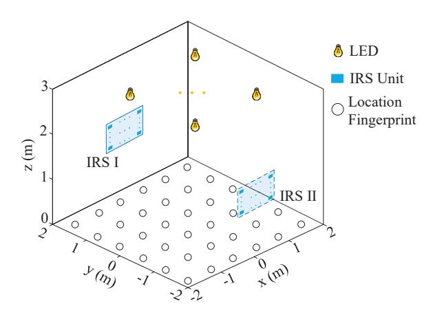

Fig. 1: The indoor visible light fingerprint localization system model based on optical IRS.

and methodologies through simulation studies; finally, Section VI concludes the paper.

## II. SYSTEM AND CHANNEL MODELS

#### *A. System Model*

In this paper, we posit the presence of M LED transmitters affixed to the ceiling of a room, with the floor systematically partitioned into multiple square grids. Each vertex of these grids corresponds to a fingerprint point, with the aggregate number of fingerprint points represented as N, and the interpoint distance denoted by S. We consider that each of the two opposing walls is equipped with an optical IRS array, with each array consisting of Ns reflective units. Consequently, the system utilizes a total of 2 × Ns optical IRS reflective units. The midpoint of each wall is regarded as the central position of the respective optical IRS array. The system model is illustrated in Fig. [1.](#page-2-0)

In indoor settings, visible light signals are transmitted through free space and detected by the PD at the user end. However, there are many NLoS propagation paths caused by diffuse reflection and scattering from the wall, the ceiling, the floor, and various objects. Despite this, compared to LoS links, the contribution of NLoS propagation paths is often minimal. Consequently, when the LoS link is blocked, the signal received by the PD significantly diminishes, adversely impacting localization accuracy for indoor users. In such scenarios, optical IRSs can create NLoS links through single reflections, which presents a viable strategy to enhance localization accuracy. This study concentrates on the scenario in which visible light signals reach the receiving PD through single reflections from the optical IRS, thereby ensuring that high localization accuracy is preserved even in the absence of a LoS path.

## *B. Channel Model*

In optical IRS-aided Visible Light Communication (VLC) channels, the optical IRS is conceptualized as a metasurface or reflective structure composed of a series of cost-effective

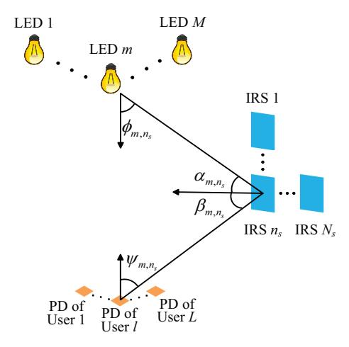

Fig. 2: Schematic diagram of NLoS propagation path assisted by optical IRS.

passive reflecting elements. These elements adjust the direction of incident signal reflection or refraction, focusing the signal on the receiver to enhance system performance [\[41\]](#page-12-15). This paper utilizes a metasurface-based optical IRS to enable intelligent control of the wireless environment while reducing energy consumption [\[36\]](#page-12-16). LEDs are strategically mounted on the ceiling, serving as both illumination sources and signal transmitters, modulating light intensity based on the Lambertian light source model. At the receiving end, a PD is utilized to capture the optical signal. Given that the size of the PD is significantly smaller than the distance separating the LEDs and the PD, it can be reasonably assumed that the intensity of the radiation signal received across each unit area of the PD surface is uniform.

The VLP system examined in this paper is characterized as a multiple-input single-output (MISO) configuration. Fig. [2](#page-2-1) depicts the light propagation pathway received by the lth user targeted for localization, wherein the light signal emitted by the m-th LED is reflected by the ns-th optical IRS unit. The illustration further delineates the spatial coordinates associated with the processes of light emission, reflection, and reception. It is posited that the transmission power of the LEDs is uniform across all units, represented as Pt. The system employs a time-division scheme, whereby at each discrete time instant, the PD receives signals transmitted from a single LED. The optical power Pr,m received at the user terminal from the m-th LED is expressed as

$$P_{r,m} = P_t \sum_{n_s=1}^{N_s} H_{NLoS,m} + \eta,$$
 (1)

where η denotes the additive Gaussian white noise, while HNLoS,m represents the channel gain associated with the reflected link subsequent to the reflection of the light signal by the optical IRS. Based on the preceding analysis, for the l-th target user, the channel gain of the system utilizing the

{3}------------------------------------------------

$$H_{\text{NLoS},m} = \begin{cases} \left(b+1\right) A \left(\cos\phi_{m,n_s}\right)^b \cos\alpha_{m,n_s} \frac{\rho}{\pi} \cos\beta_{m,n_s} \\ \times \frac{\xi \cos\psi_{m,n_s} Tg}{2\pi d_{m,n_s}^2 d_{n_s,l}^2} \operatorname{rect}\left(\frac{\psi_{m,n_s}}{\text{FOV}}\right), \psi_{m,n_s} \leq \text{FOV}, \\ 0, \psi_{m,n_s} > \text{FOV}, \end{cases}$$

where b denotes the Lambertian order of the LED, which is assumed to be uniform across all LEDs. The variable Arepresents the area of the PD. It is further assumed that the reflection coefficient of all the optical IRS units is constant, denoted by  $\rho$ , and that the area of each optical IRS unit is uniform, represented by  $\xi$ . The terms  $\phi_{m,n_s}$  and  $\alpha_{m,n_s}$ indicate the emission angle of the LED and the incident angle of the optical IRS unit, respectively, along the direct path from the m-th LED light source to the  $n_s$ -th optical IRS unit. Additionally,  $\beta_{m,n_s}$  and  $\psi_{m,n_s}$  refer to the exit angle of the  $n_s$ -th optical IRS unit and the incident angle at the PD of the target. The parameters T and g correspond to the optical filter gain and concentrator gain at the PD, respectively. The terms of  $d_{m,n_s}$  and  $d_{n_s,l}$  represent the distance from the m-th LED to the  $n_s$ -th optical IRS unit and from the  $n_s$ -th optical IRS unit to the l-th target PD, respectively. FOV denotes the field of view of the PD. Furthermore, the function  $rect(\cdot)$  is defined as

$$rect(x) = \begin{cases} 1, & |x| \le 1, \\ 0, & |x| > 1. \end{cases}$$
 (3)

Given that the emission of optical signals adheres to the classical Lambertian radiation model [42], and under the assumption that the half-power angles of the LEDs are uniform and represented as  $((\phi_{m,n_s})_{1/2})$ , the Lambertian order b can be calculated as

$$b = \frac{-\ln(2)}{\ln(\cos((\phi_{m,n_s})_{1/2}))}. (4)$$

Using the optical IRS unit in IRS I as a case study, let the coordinates of the m-th LED, the  $n_s$ -th optical IRS unit, and the l-th user be represented as  $(x_m^{\rm led}, y_m^{\rm led}, z_m^{\rm led}), (x_{n_s}^{\rm irs}, y_{n_s}^{\rm irs}, z_{n_s}^{\rm irs}),$  and  $(x_l, y_l, z_l)$ , respectively. The angles presented in equation (2) can be evaluated through the following relationships

$$\cos \varphi_{m,n_s} = \frac{\left| z_m^{\text{led}} - z_{n_s}^{\text{irs}} \right|}{d_{m,n_s}},\tag{5}$$

$$\cos \alpha_{m,n_s} = \frac{\left| y_{n_s}^{\text{irs}} - y_m^{\text{led}} \right|}{d_{m,n_s}},\tag{6}$$

$$\cos \beta_{m,n_s} = \frac{\left| y_{n_s}^{\text{irs}} - y_m^{\text{led}} \right|}{d_{n_s,l}},\tag{7}$$

$$\cos \psi_{m,n_s} = \frac{\left| z_{n_s}^{\text{irs}} - z_l \right|}{d_{n-l}},\tag{8}$$

where,

$$d_{m,n_s} = \sqrt{\left(z_m^{\text{led}} - z_{n_s}^{\text{irs}}\right)^2 + \left(x_m^{\text{led}} - x_{n_s}^{\text{irs}}\right)^2 + \left(y_m^{\text{led}} - y_{n_s}^{\text{irs}}\right)^2},$$
(9)

$$d_{n_s,l} = \sqrt{\left(z_{n_s}^{\text{irs}} - z_l\right)^2 + \left(x_{n_s}^{\text{irs}} - x_l\right)^2 + \left(y_{n_s}^{\text{irs}} - y_l\right)^2}.$$
 (10)

## III. OPTICAL IRS-AIDED FINGERPRINT DATABASES CONSTRUCTION AND WEIGHTS COMPUTATION

This paper proposes a fingerprint-based localization technique that employs optical IRSs. The core principle of this method is to determine the precise location of a user by measuring and analyzing the characteristics of received optical signals. In particular, it focuses on the strength of visible light signals measured in real-world environments. This approach is particularly beneficial in environments that are stable and exhibit minimal changes, as it effectively utilizes pre-existing data without necessitating frequent updates, thus facilitating rapid and reliable localization. The subsequent sections delineate the procedures involved in fingerprint localization, the development of various fingerprint databases, and the algorithmic process for weight computation employed in this research.

## A. Fingerprint-based Localization Procedures

The fingerprint localization methodology is typically divided into two principal phases: the offline phase and the online phase. The offline phase entails preparatory work before system deployment. During this phase, PDs are employed as receivers to gather signal strength characteristics at various predetermined fingerprint locations. This process usually involves the collection of multiple signal samples at each key fingerprint point, thereby facilitating the construction of a comprehensive fingerprint database. Subsequently, the online phase encompasses the real-time localization of users within the designated environment. In this phase, RSS observations are recorded at the target location, and the system leverages the fingerprint database established during the offline phase to calculate weights for the fingerprint points that are closest to the target. These calculated weights are then utilized to enable real-time localization capabilities.

1) Construction of the Fingerprint Database Matrix: For each fingerprint point and user location, we analyze the cumulative RSS values corresponding to each LED and the optical IRS units. By employing time-division multiplexing on the signal intensities detected by the PD from M LEDs, we can articulate the resultant fingerprint matrix database and observation vector in the following manner.

a) Fingerprint Matrix Database: The fingerprint matrix database  $\mathbf{R} \in \mathbb{R}^{M \times N}$  constructed in this paper is expressed

$$\mathbf{r} = [\mathbf{r}_{1}, \mathbf{r}_{2}, \cdots, \mathbf{r}_{n}, \cdots, \mathbf{r}_{N}]$$

$$= \begin{bmatrix} r_{1,1} & r_{1,2} & \cdots & r_{1,N} \\ r_{2,1} & r_{2,2} & \cdots & r_{2,N} \\ & \vdots & & & \\ \cdots & r_{m,n} & \cdots & & \\ \vdots & & & \vdots & \\ r_{M,1} & r_{M,2} & \cdots & r_{M,N} \end{bmatrix},$$
(11)

where  $\mathbf{r}_n \in \mathbb{R}^{M \times 1}$  represents the RSS observation vector measured at the n-th fingerprint point,  $r_{m,n}$  represents the sum of the RSS values of the m-th LED after being reflected by all optical IRS elements at the n-th fingerprint point, for  $m=1,2,\cdots,M,\ n=1,2,\cdots,N$ .

{4}------------------------------------------------

b) Observation Vector: We consider that the position of the l-th target user is unknown, the measured RSS observation vector  $\mathbf{o}_l \in \mathbb{R}^{M \times 1}$  at the l-th user can be expressed as

$$\mathbf{o}_{l} = [r_{1,l}, r_{2,l}, \cdots, r_{m,l}, \cdots, r_{M,l}]^{\mathrm{T}},$$
 (12)

where, for  $l=1,2,\cdots,L$ ,  $r_{m,l}$  represents the cumulative RSS measured at the l-th target location, which is contributed by the signals emitted from the m-th LED and reflected via all optical IRS units.

- 2) Construction of the Fingerprint Tensor Database: The previously proposed fingerprint matrix database encapsulates the aggregate RSS values reflected by the optical IRS units. Nonetheless, despite its straightforwardness, it does not effectively distinguish the individual RSS contributions from each optical IRS unit. This shortcoming diminishes the informational depth of the fingerprint database and negatively impacts localization accuracy. Consequently, the development of the fingerprint matrix database is enhanced by distinctly representing the RSS values from each optical IRS unit as received by the PD. In particular, the RSS represented by  $r_{m,n}$  is partitioned into individual RSS values corresponding to each optical IRS unit. This process converts  $r_{m,n}$  into a vector and  $\mathbf{r}_n$  into a matrix, consequently transforming the fingerprint database matrix R into a tensor. This methodology facilitates the creation of a more extensive fingerprint database and introduces both the fingerprint tensor database and the observation matrix.
- a) Fingerprint Tensor Database: For the sake of clarity, this discussion focuses solely on the optical IRS array installed on a single wall. The fingerprint tensor database, denoted as  $\mathcal{R} \in \mathbb{R}^{M \times N_s \times N}$ , is formulated as

$$\mathcal{R} = [\mathbf{R}_1, \mathbf{R}_2, \cdots, \mathbf{R}_n, \cdots, \mathbf{R}_N], \tag{13}$$

where the matrix  $\mathbf{R}_n \in \mathbb{R}^{M \times N_s}$  represents the matrix composed of RSS values collected at the n-th fingerprint location, which can be articulated as

$$\mathbf{R}_{n} = \begin{bmatrix} r_{1,1} & r_{1,2} & \cdots & r_{1,N_{s}} \\ r_{2,1} & r_{2,2} & \cdots & r_{2,N_{s}} \\ & \vdots & & & \\ \cdots & r_{m,n_{s}} & \cdots & \\ & \vdots & & \\ r_{M,1} & r_{M,2} & \cdots & r_{M,N_{s}} \end{bmatrix}.$$
(14)

where  $r_{m,n_s}$  represents the RSS of the m-th LED at the fingerprint point after reflection by the  $n_s$ -th optical IRS unit, for  $n_s = 1, 2, \dots, N_s$ .

It should be noted that the fingerprint tensor database for the alternative optical IRS array, positioned on the opposing wall, can be constructed utilizing the same methodology.

b) Observation Matrix: The observation matrix  $\mathbf{O}_l \in \mathbb{R}^{M \times N_s}$ , measured at the l-th target point, can be constructed

$$\mathbf{O}_{l} = \begin{bmatrix} r'_{1,1} & r'_{1,2} & \cdots & r'_{1,N_{s}} \\ r'_{2,1} & r'_{2,2} & \cdots & r'_{2,N_{s}} \\ & \vdots & & & & \\ & \cdots & r'_{m,n_{s}} & \cdots & & \\ & \vdots & & & & \\ & \vdots & & & & \\ & \vdots & & & &$$

where  $r'_{m,n_s}$  represents the RSS of the m-th LED at the target point after reflection by the  $n_s$ -th optical IRS unit.

#### B. Weight Calculation Algorithms

This section examines the two algorithms utilized for weight calculation in fingerprint-based localization within the context of this study: WKNN [43] and Differential Evolution (DE) [27]. In fingerprint localization methodologies, the determination of weights for neighboring fingerprints in relation to the target location is essential for achieving localization accuracy. The chosen weight calculation method significantly influences both the precision and reliability of the localization system. The WKNN algorithm is selected due to its well-established role as a fundamental technique for weight allocation in fingerprint localization. By dynamically modifying the weights of the K-nearest neighbors, WKNN effectively mitigates the localization bias associated with the fixed weight assignments characteristic of traditional KNN algorithms. Additionally, the DE algorithm is incorporated to develop the DE-WI method, primarily due to its global optimization capabilities, which enable it to overcome the limitations of conventional gradient descent methods that are susceptible to convergence at local optima. This approach also exhibits enhanced adaptability in optimizing multi-dimensional weight parameters within complex indoor environments. This article offers a thorough elucidation and comparative assessment of these two algorithms, with the objective of refining the weight calculation methodology, improving localization accuracy, and minimizing errors.

1) WKNN Algorithm: The WKNN algorithm represents an enhancement of the traditional KNN algorithm and is extensively utilized in fingerprint-based localization challenges [43]. In particular, WKNN identifies the K fingerprint points that exhibit the highest similarity in signal characteristics to the target point, subsequently assigning varying weights to these points according to their degree of similarity. In contrast to KNN, WKNN demonstrates a notable capacity to mitigate Positioning Error (PE) and deviations induced by noise, thereby improving overall localization accuracy [44]. The weight calculation methodology employed in the WKNN algorithm for the system model proposed in this research is elaborated upon in Algorithm 1.

In Algorithm 1, the variable  $d_{l,k}$  represents the distance metric between the l-th target and the k-th adjacent fingerprint point. The K nearest fingerprint points, which exhibit the most comparable signal characteristics to the target point, are identified through the computation of RSS distance metrics. A smaller distance metric indicates a greater similarity in

{5}------------------------------------------------

## Algorithm 1 WKNN-based Weight Calculation Algorithm

**Input:** The quantity of K neighboring fingerprint points that exhibit the highest similarity to the target signal, along with the corresponding coordinates of these K fingerprint points denoted as  $(x_k, y_k)$  for  $k = 1, 2, \dots, K$ .

**Output:** The coordinates of the *l*-th target  $(x_l, y_l)$ .

**Step 1:** Calculate the weights of the K neighboring fingerprint points for the l-th target

$$w_{l,k} = \frac{1}{d_{l,k}}.$$

**Step 2:** Calculate the estimated coordinates of the l-th target

$$x_l = \frac{\sum\limits_{k=1}^{K} w_{l,k} \times x_k}{\sum\limits_{k=1}^{K} w_{l,k}}, \quad y_l = \frac{\sum\limits_{k=1}^{K} w_{l,k} \times y_k}{\sum\limits_{k=1}^{K} w_{l,k}}.$$

features. This study employs Euclidean Distance (ED) and Square Chord Distance (SCD) as the distance metrics in the WKNN algorithm, capitalizing on their ability to effectively capture absolute differences, thereby enhancing the robustness and accuracy of localization performance.

In the context of utilizing the fingerprint matrix database as delineated in (11) and the observation vector as specified in (12), the ED and the SCD between the l-th target and the n-th fingerprint point are characterized as

$$d_{l,n}^{ED} = \left(\sum_{m=1}^{M} |r_{m,l} - r_{m,n}|^2\right)^{1/2},\tag{16}$$

$$d_{l,n}^{SCD} = \sum_{m=1}^{M} \left( \sqrt{r_{m,l}} - \sqrt{r_{m,n}} \right)^{2}.$$
 (17)

In the context of utilizing the fingerprint tensor database as delineated in (13) and the observation matrix as specified in (15), the ED and the SCD between the l-th target and the n-th fingerprint point are characterized as

$$d_{l,n}^{ED} = \sum_{m=1}^{M} \left( \sum_{n_s=1}^{N_s} \left| r'_{m,n_s} - r_{m,n_s} \right|^2 \right)^{1/2}, \tag{18}$$

$$d_{l,n}^{\text{SCD}} = \sum_{m=1}^{M} \sum_{n=1}^{N_s} \left( \sqrt{r'_{m,n_s}} - \sqrt{r_{m,n_s}} \right)^2.$$
 (19)

2) DE-WI Algorithm: This section introduces the DE-WI algorithm, which conceptualizes the weight calculation for neighboring fingerprint points as an optimization problem. More specifically, the DE-WI algorithm defines an appropriate optimization objective function that enables dynamic weight adjustment according to the degree of disparity between the current fingerprint point and the target point, thereby enhancing matching performance. Throughout the iterative process,

the algorithm persistently refines the objective function, ensuring that the resulting weights are optimized to enhance localization accuracy. Additionally, the algorithm modifies the weights in response to fluctuations in the target RSS, thereby contributing to improved localization robustness. In the context of the problem addressed in this study, the optimization function is defined as

$$F(\mathbf{w}) = \|\mathbf{o}_l - \mathbf{H}_K \mathbf{w}\|_2^2, \tag{20}$$

where the matrix  $\mathbf{H}_K = [\mathbf{h}_1, \mathbf{h}_2, \dots, \mathbf{h}_k, \dots, \mathbf{h}_K] \in \mathbb{R}^{M \times K}$ represents the RSS reference matrix, which is constructed by identifying the K nearest fingerprint points through the application of RSS distance metrics, with ED selected as the distance metric for the DE-WI algorithm. The vector  $\mathbf{w} = [w_1, w_2, \dots, w_k, \dots, w_K]^{\mathsf{T}} \in \mathbb{R}^{K \times 1}$  denotes the weight vector corresponding to these K fingerprint points. It is noteworthy that when the observation matrix (15) is employed,  $\mathbf{o}_l = sum(\mathbf{O}_l, 2)$  indicates a summation across the rows of  $O_l$ . Furthermore, as demonstrated in (20), by solving the objective function  $F(\mathbf{w})$ , the optimal weight vector  $\mathbf{w}$ is obtained when it reaches its minimum value. Thus, the determination of fingerprint weights is reformulated as an optimization problem concerning the objective function. The DE-WI-based weight calculation algorithm is delineated in Algorithm 2 for the system model proposed in this paper.

## Algorithm 2 DE-WI-Based Weight Calculation Algorithm

**Input:** Parameter K,  $\mathbf{o}_l \in \mathbb{R}^{M \times 1}$ ,  $\mathbf{H}_K \in \mathbb{R}^{M \times K}$ , a two-dimensional coordinate matrix  $\mathbf{Q} \in \mathbb{R}^{2 \times K}$  of K nearest neighbor fingerprint points.

**Output:** The coordinates of the *l*-th target  $(x_l, y_l)$ .

**Step 1:** Initialize the population size  $N_p$ , as well as the initial random solution vector  $\mathbf{w}_i(t)$  corresponding to each individual. In alignment with (20), the K estimated components of each weight vector  $\mathbf{w}$  are constrained within the interval [0,1], and their aggregate is equal to 1

Step 2: for 
$$t \leq N_t$$

for  $i = 1: N_p$ 
 $rnbr = randperm(K);$ 

for  $j = 1: K$ 

Step 2.1: Mutation operation

 $v_{i,j}(t+1) = w_{r_1,j}(t) + (w_{r_2,j}(t) - w_{r_3,j}(t))f.$ 

Step 2.2: Crossover operation

 $u_{i,j}(t+1) = \begin{cases} v_{i,j}(t+1), & rand \leq \mathrm{CR} \text{ or } j = rnbr(1), \\ w_{i,j}(t), & \text{else.} \end{cases}$ 

end for

Step 2.3: Selection operation

 $\mathbf{w}_i(t+1) = \begin{cases} \mathbf{u}_i(t), & F(\mathbf{u}_i(t)) \leq F(\mathbf{w}_i(t)), \\ \mathbf{w}_i(t), & \text{else.} \end{cases}$ 

end for

end for

Final weight vector:  $\mathbf{w} = \arg_{\mathbf{w}} \min F(\mathbf{w})$ 

Step 3: Calculate the coordinate values of the target as  $(x_l, y_l)^T = \mathbf{Q}\mathbf{w}$ 

{6}------------------------------------------------

In Algorithm 2, the variable t signifies the current iteration number, while  $N_t$  indicates the maximum number of iterations. The values  $r_1, r_2, r_3$  represent three distinct integers chosen from the integer-valued set  $\{1, \dots, N_p\}$ , with the stipulation that none of these integers are equal to i. The differential scaling factor f influences the degree of mutation, with smaller values of f facilitating convergence towards a local extremum. The parameter CR represents the crossover probability, which is constrained within the interval [0, 1]. The function randperm(K) generates a randomly permuted vector comprising integers from 1 to K, while rand produces a random number within the range [0,1]. The function rnbr(1)selects a random integer from the sequence [1, K] and guarantees that at least one parameter in  $u_{i,j}(t+1)$  is derived from  $v_{i,j}(t+1)$  by aligning j with the chosen index. Lastly,  $\mathbf{w}_i(t)$  denotes the weight vector associated with the K nearest neighbors of the i-th individual in the t-th generation.

**Remark 1**. It is important to emphasize that in practical implementations, the selection of critical parameters such as K,  $N_p$ , and  $N_t$  must strike a balance between localization accuracy and computational complexity. A small value of K may lead to the loss of positioning information, resulting in substantial errors, whereas an excessively large K can introduce redundant information and elevate computational complexity. Additionally, an increase in the population size  $N_p$  enhances the diversity of solutions generated by the DE-WI algorithm; however, this also leads to a rise in the computational cost associated with each iteration. Furthermore, it is essential to choose an appropriate number of iterations  $N_t$  to minimize redundant calculations while ensuring convergence. The optimal values for these parameters are often contingent upon the specific application context. A comprehensive discussion of our parameter settings is provided in Section V.

**Remark 2.** In practical applications, the choice between the WKNN and DE-WI algorithms involves a trade-off between localization accuracy and computational complexity. The WKNN algorithm offers high computational efficiency and is easy to implement, making it well-suited for scenarios with limited processing resources or strict real-time requirements. However, its localization accuracy may be compromised in complex channel environments due to its sensitivity to noise. In contrast, the DE-WI algorithm, based on an iterative optimization framework, incurs higher computational costs but significantly improves localization accuracy in environments with severe multipath interference or LoS blockages. Therefore, system designers can flexibly select the appropriate algorithm based on the specific deployment scenario and performance requirements to achieve an optimized positioning system.

#### IV. OPTICAL IRS-AIDED LOCALIZATION ALGORITHM

This section presents two VLP methodologies that utilize optical IRS and outlines the precise procedures for determining their PEs. The first method, referred to as IRSPba, represents the fundamental VLP approach grounded in optical IRS. The second method, designated as IRSPad, is an enhanced localization technique that builds upon IRSPba by integrating a two-step localization strategy.

#### Algorithm 3 IRSPba VLP Algorithm

**Input:** Parameter K, fingerprint matrix database  $\mathbf{R} \in \mathbb{R}^{M \times N}$ , user observation vector  $\mathbf{o}_l \in \mathbb{R}^{M \times 1}$ .

**Output:** The coordinates of the *l*-th target  $(x_l, y_l)$ , and PE.

**Step 1:** Calculate the ED and SCD from the l-th target to N fingerprint points based on (16) and (17) as

$$\begin{aligned} \mathbf{d}_{\mathrm{ED}} &= [d_{l,1}^{\mathrm{ED}}, d_{l,2}^{\mathrm{ED}}, \cdots, d_{l,N}^{\mathrm{ED}}]^{\mathrm{T}} \in \mathbb{R}^{N}, \\ \mathbf{d}_{\mathrm{SCD}} &= [d_{l,1}^{\mathrm{SCD}}, d_{l,2}^{\mathrm{SCD}}, \cdots, d_{l,N}^{\mathrm{SCD}}]^{\mathrm{T}} \in \mathbb{R}^{N}. \end{aligned}$$

Step 2: Sort  $\mathbf{d}_{ED}$  and  $\mathbf{d}_{SCD}$  in an ascending order:

$$\begin{aligned} [\mathbf{d}_{sort}^{\text{ED}}, \mathbb{I}_1] &= sort(\mathbf{d}_{\text{ED}}), \\ [\mathbf{d}_{sort}^{\text{SCD}}, \mathbb{I}_2] &= sort(\mathbf{d}_{\text{SCD}}). \end{aligned}$$

Step 3: Identify the K nearest fingerprint points that exhibit the highest similarity to the feature characteristics of the target signal, utilizing the initial K indices from sets  $\mathbb{I}_1$  and  $\mathbb{I}_2$ . Subsequently, compute the coordinates  $(x_k,y_k)$  for each  $k=1,2,\ldots,K$ , or alternatively, construct the two-dimensional coordinate matrix  $\mathbf{Q} \in \mathbb{R}^{2 \times K}$ .

**Step 4:** Employing one of two following weighting calculation algorithms for localization:

WKNN algorithm:

Apply Algorithm 1 to calculate the predicted coordinates  $(x_l, y_l)$  of the l-th user.

DE-WI algorithm:

Construct the  $\mathbf{H}_K$  matrix based on K neighboring fingerprint points:

for 
$$i = 1 : K$$
  
 $\mathbf{H}_K(:,i) = \mathbf{R}(:,\mathbb{I}_1(i)).$ 

end for

Apply Algorithm 2 to calculate the predicted coordinates  $(x_l, y_l)$  for the l-th user.

**Step 5:** Calculate PE:

PE = 
$$\sqrt{(x'_l - x_l)^2 + (y'_l - y_l)^2}$$
.

#### A. IRSPba VLP Algorithm

The operational framework of the fundamental IRSPba methodology, which is predicated on optical IRS, is delineated in Algorithm 3. In this context, the function  $sort(\cdot)$  refers to the process of arranging the vectors in ascending order. The vectors  $\mathbf{d}_{sort}^{\mathrm{ED}} \in \mathbb{R}^N$  and  $\mathbf{d}_{sort}^{\mathrm{SCD}} \in \mathbb{R}^N$  are indicative of the sorted arrangements, while the sets  $\mathbb{I}_1 \in \mathbb{R}^N$  and  $\mathbb{I}_2 \in \mathbb{R}^N$  correspond to their respective indices. The notation  $(x_l', y_l')$  signifies the precise coordinates of the l-th user.

# B. Two-Step Localization Strategy-Based IRSPad VLP Algorithm

The reflective properties of the optical IRS result in diminished received power in close proximity to the optical IRS and the corners of the service room, which consequently leads to a decrease in localization accuracy in these areas. When employing the IRSPba method with the fingerprint tensor database for localization in such contexts, one may observe significant PEs near the wall where the optical IRS array is situated, while errors tend to be minimal in regions that are further removed from the optical IRS and the room's corners. To mitigate this

{7}------------------------------------------------

Algorithm 4 Two-Step Localization Strategy-Based IRSPad VLP Algorithm

**Input:** Parameter K.

**Output:** The coordinates of the *l*-th target  $(x_l, y_l)$ , and PE.

**Step 1:** First localization:

Step 1.1: Use IRS I to establish the fingerprint tensor database  $\mathcal{R}_1 \in \mathbb{R}^{M imes N_s imes N}$  and the observation matrix  $\mathbf{O}_l' \in \mathbb{R}^{M \times N_s}$  at the l-th target.

Step 1.2: Calculate the ED and SCD from the l-th target to N fingerprint points based on (18) and (19) as:  $\mathbf{d}_{\text{ED}} = [d_{l,1}^{\text{ED}}, d_{l,2}^{\text{ED}}, \cdots, d_{l,N}^{\text{ED}}]^{\text{T}} \in \mathbb{R}^{N},$  $\mathbf{d}_{\text{SCD}} = [d_{l,1}^{\text{SCD}}, d_{l,2}^{\text{SCD}}, \cdots, d_{l,N}^{\text{SCD}}]^{\text{T}} \in \mathbb{R}^{N}.$ 

**Step 1.3:** The same as Step 2 in Algorithm 3: sort  $d_{ED}$ and  $\mathbf{d}_{SCD}$  in ascending order to obtain the sorted vectors and the corresponding index sets.

**Step 1.4:** The same as Step 3 in Algorithm 3: compute the coordinates of neighboring fingerprint points.

Step 1.5: Employing two different weights calculation algorithms for localization:

WKNN algorithm:

Apply Algorithm 1 to calculate the predicted coordinates  $(x_l^1, y_l^1)$  of the *l*-th user.

DE-WI algorithm:

Construct the  $\mathbf{H}_K$  matrix based on K neighboring fingerprint points:

$$\begin{aligned} & \textbf{for } i=1:K \\ & \mathbf{H}_K(:,i) = sum(\mathcal{R}_1(:,:,\mathbb{I}_1(i)),2). \\ & \textbf{end for} \end{aligned}$$

Then apply Algorithm 2 to calculate the predicted coordinates  $(x_l^1, y_l^1)$  for the *l*-th user.

Step 2: Second localization:

if 
$$y_l^1 \le 0$$
  
 $(x_l, y_l) = (x_l^1, y_l^1)$ ,

**Step 2.1:** Use IRS II to establish the fingerprint tensor database  $\mathcal{R}_2 \in \mathbb{R}^{M \times N_s \times N}$  and the observation matrix  $\mathbf{O}_{l}^{"} \in \mathbb{R}^{M \times N_{s}}$  at the l-th target.

Step 2.2: The same as Steps 1.2 to 1.5, perform the operations to obtain the final predicted coordinates  $(x_l,y_l).$ 

end if

Step 3: Calculate PE: 
$$\mathrm{PE} = \sqrt{\left(x_l' - x_l\right)^2 + \left(y_l' - y_l\right)^2}$$

challenge, we propose a two-step localization strategy. This strategy designates the central position of the room—defined as the midpoint between the two opposing walls equipped with optical IRS arrays—as a boundary. The initial step involves localization using the fingerprint tensor database established by IRS I as demonstrated in Fig. 1, followed by an assessment to determine the necessity of a second localization step utilizing IRS II. This method effectively addresses the previously mentioned issue of compromised localization accuracy. The methodology of the proposed IRSPad algorithm, which utilizes optical IRS and integrates a two-step localization strategy, is comprehensively described in Algorithm 4. Specifically, Steps 1 and 2 delineate the intricate procedures involved in the twostep localization strategy.

#### C. Complexity Analysis

In the indoor visible light fingerprint positioning system delineated in this study, both the signal and channel models are characterized as positive real numbers. Consequently, we conducted an analysis of the complexity associated with the IRSPba and IRSPad methodologies, focusing on floating point operations (FLOPs). The detailed complexity calculations are presented in Table I.

TABLE I: Complexity analysis of different methods

| Positioning method                                             | Real-valued flops                                                                              |
|----------------------------------------------------------------|------------------------------------------------------------------------------------------------|
| IRSPba(WKNN) IRSPba(DE-WI) IRSPad(WKNN) IRSPad(DE-WI) | $M(2NN_s + 2N_s + N)  M(2NN_s + 2N_s + N) + N_tN_pK  2MN_s(2N + 1)  2(MN_s(2N + 1) + N_tN_pK)$ |

It is important to highlight that the algorithmic complexity discussed in this article encompasses the cumulative complexity of both the offline stage, which involves the establishment of the fingerprint library, and the online stage, which pertains to the positioning process. The IRSPad method is predicated on a two-step localization approach, which results in an increased computational complexity for a single IRS unit during the localization phase when compared to the IRSPba method. Furthermore, in contrast to the WKNN algorithm, the complexity of the DE-WI algorithm is significantly influenced by the number of iterations, denoted as  $N_t$ , the size of the algorithm's population, represented as  $N_p$ , and the dimensionality, denoted as K, of the individuals within the population.

Remark 3. In the context of simulations, the average PE will be utilized. Let  $PE_l$  denote the PE of the *l*-th target point, while  $PE_{avg}$  signifies the average PE across L target points, The calculation of  $PE_{avg}$  can be expressed as

$$PE_{avg} = \frac{1}{L} \sum_{l=1}^{L} PE_{l}.$$
 (21)

#### V. SIMULATION ANALYSIS

In order to assess the efficacy of the proposed optical IRSaided localization algorithms, a series of simulation experiments were conducted. The parameters for the simulations were established as follows: to emulate realistic conditions, the elevation of both fingerprint and target points was uniformly maintained at the height of 1 meter. During the offline phase, the inter-fingerprint spacing S is designated as 20 centimeters. In the online phase, the number of nearest fingerprint points Kutilized for weighted localization is set to 5. Unless indicated otherwise, the signal-to-noise ratio (SNR) is fixed at 30 dB. The coordinates of the ground center are established at (0,0,0) m, with the center of the optical IRS array aligned with the center of the wall. The IRS array on both walls are arranged in a  $21 \times 21$  units. Certain parameter selections within the DE-WI algorithm were extensively cited in reference

{8}------------------------------------------------

[27]. MATLAB R2018a served as the computational tool for the simulations conducted in this study. The primary system parameters utilized in the simulation are outlined in Table II.

TABLE II: Key Simulation Parameters

| Simulation setup parameters                         | Values                                                             |
|-----------------------------------------------------|--------------------------------------------------------------------|
| Number of LEDs, M                                   | 4                                                                  |
| LED positions                                       | (-1,1,3) m, $(1,1,3)$ m, $(1,-1,3)$ m, $(1,-1,3)$ m, $(-1,-1,3)$ m |
| LED emission power, $P_{\rm t}$                     | 5 W                                                                |
| LED Lambertian light source order, b                | 1                                                                  |
| The number of optical IRS units on each wall, $N_s$ | $21 \times 21$                                                     |
| The area of the optical IRS unit, $\xi$             | $0.04 \text{ m} \times 0.02 \text{ m}$                             |
| The reflection coefficient of                       | 0.95                                                               |
| the optical IRS unit, $\rho$                        |                                                                    |
| The FOV of the PD, FOV                              | 90°                                                                |
| The effective receiving area of the PD, $A$         | $1~\mathrm{cm}^2$                                                  |
| The optical filter gain of the PD, $T$              | 1                                                                  |
| The concentrator gain of the PD, $g$                | 1                                                                  |
| The maximum number of iterations, $N_t$             | 200                                                                |
| Population size, $N_p$                              | 100                                                                |
| Differential scaling factor, $f$                    | 0.3                                                                |
| Crossover probability, CR                           | 0.6                                                                |

Fig. 3 through Fig. 5 depict the distributions of PEs following the evaluation of L=6400 potential target locations within the service room. In particular, Fig. 3 and Fig. 4 demonstrate the localization performance associated with the DE-WI weight calculation algorithm, whereas Fig. 5 illustrates the localization performance of the WKNN weight calculation algorithm.

Fig. 3 illustrates the simulation outcomes derived from the application of the DE-WI weight calculation algorithm, utilizing solely IRS I. In particular, Fig. 3(a) displays the PEs distribution achieved through the IRSPba method for target localization, whereas Fig. 3(b) presents the PEs distribution obtained from direct one-step localization, which employs Step 1 of the IRSPad method, utilizing the constructed fingerprint tensor database  $\mathcal{R}$  and the observation matrix  $\mathbf{O}_l$ . An examination of Fig. 3 indicates that, compared to the fingerprint matrix database, the localization process employing the fingerprint tensor database yields only slight discrepancies in PEs in certain areas, particularly those adjacent to the side of the room where the optical IRS array is located. Conversely, a notable enhancement in localization accuracy is observed in the area opposite the location of the optical IRS array. This finding underpins the rationale for the implementation of a two-step localization strategy.

The subsequent simulation is performed by concurrently utilizing both IRS I and IRS II, employing the DE-WI weight calculation algorithm and leveraging the fingerprint tensor database. Fig. 4(a) presents the PEs distribution achieved through the IRSPba method, while Fig. 4(b) depicts the PEs distribution obtained via the IRSPad method. An analysis of Fig. 4 reveals that the deployment of two IRS arrays on opposing walls, in conjunction with the two-step localization strategy of the IRSPad method, results in a substantial reduction of PEs throughout the service room. Furthermore, in comparison to the one-step localization outcomes illustrated in Fig. 3(b), Fig. 4(b) demonstrates a further alleviation of

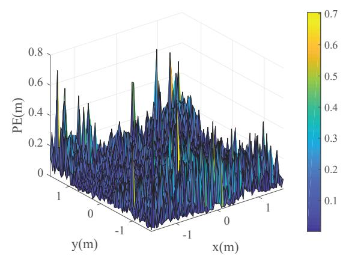

(a) PEs distribution diagram using DE-WI algorithm with fingerprint matrix database.

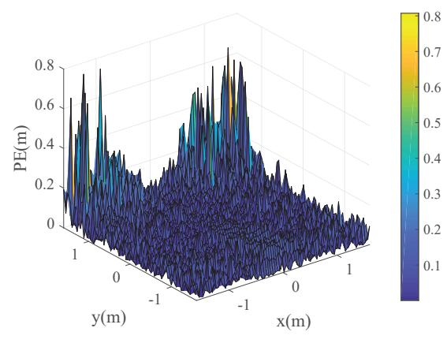

(b) PEs distribution diagram using DE-WI algorithm with fingerprint tensor database.

Fig. 3: PEs distribution diagrams of the DE-WI weight calculation algorithm using the fingerprint matrix database and tensor matrix for IRSPba and one-step localization of IRSPad in the context of IRS I.

the elevated PEs observed near the side of the room with the optical IRS array, as indicated in Fig. 3(b).

In order to evaluate the performance disparities between the weight calculation algorithms based on WKNN and DE-WI, Fig. 5 illustrates the distribution of PEs resulting from the integration of the IRSPad method with the two proposed WKNN weight calculation algorithms and the fingerprint tensor database. Specifically, Figs. 5(a) and 5(b) depict the localization performance of the ED-based WKNN algorithm, referred to as WKNN-ED, and the SCD-based WKNN algorithm, designated as WKNN-SCD, respectively. When compared to the DE-WI algorithm under identical conditions presented in Fig. 4(b), the DE-WI algorithm exhibits a markedly superior overall localization accuracy relative to the WKNN algorithm. Furthermore, as evidenced in Fig. 5, the PE trends for both WKNN-ED and WKNN-SCD algorithms are largely consistent, with only minimal differences in overall error observed.

Fig. 6 presents the trend of average PE as a function of

{9}------------------------------------------------

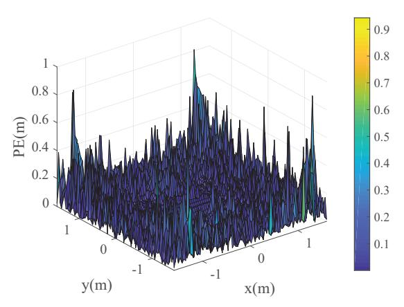

(a) PEs distribution diagram using DE-WI algorithm using IRSPba method.

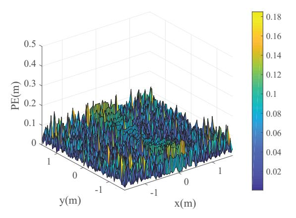

(b) PEs distribution diagram using DE-WI algorithm using IRSPad method.

Fig. 4: PEs distribution diagrams of the DE-WI weight calculation algorithm with fingerprint tensor database using the IRSPba method and the IRSPad method in the context of both IRS I and IRS II.

SNR, derived from simulations involving L = 528 randomly generated target locations, with all targets positioned at a height of 1 meter. The simulations employ the IRSPba and IRSPad methodologies in conjunction with the DE-WI, WKNN-ED, and WKNN-SCD algorithms, utilizing a fingerprint tensor database. As depicted in Fig. [6,](#page-10-0) the average PE for both the IRSPba and IRSPad methods demonstrates a decreasing trend with increasing SNR. Notably, the IRSPba method exhibits considerable errors at low SNR levels, with the final errors for the DE-WI, WKNN-ED, and WKNN-SCD algorithms converging to values of 0.075 m, 0.123 m, and 0.108 m, respectively. In contrast, the IRSPad method effectively addresses the high PE associated with the IRSPba method at low SNR. Additionally, the final converged PEs for the three algorithms are significantly lower than those of the original method, achieving values of 0.017 m, 0.067 m, and 0.044 m, respectively.

The aforementioned simulation results demonstrate that the three weight calculation algorithms achieve better localization performance under the IRSPad method compared to the

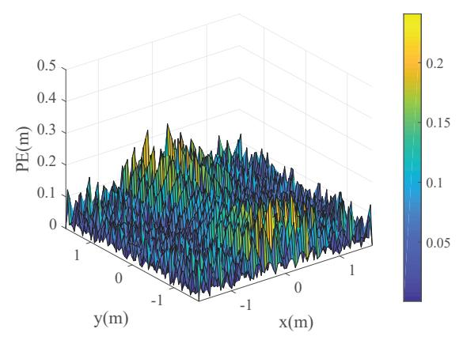

(a) PEs distribution diagram for WKNN-ED algorithm using IRSPad method.

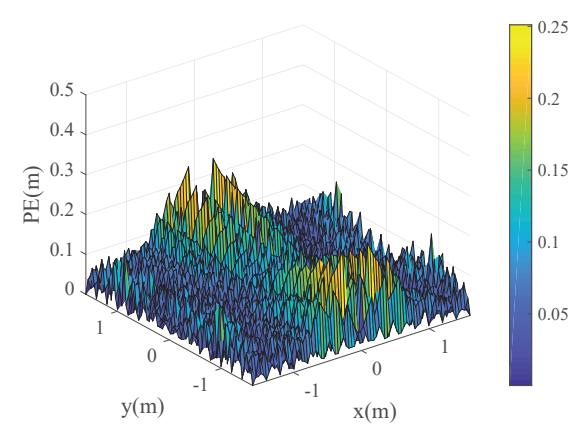

(b) PEs distribution diagram for WKNN-SCD algorithm using IRSPad method.

Fig. 5: PEs distribution diagrams for WKNN-ED and WKNN-SCD algorithms using the IRSPad method in the context of both IRS I and IRS II.

IRSPba method. Consequently, the following analysis of the proposed VLP algorithms will focus more closely on the IRSPad method.

Fig. [7](#page-10-1) presents the cumulative distribution function (CD-F) curves for three algorithms: DE-WI, WKNN-ED, and WKNN-SCD, which are utilized in the context of the IRSPad framework. These curves were derived from simulations that randomly generated L = 6400 target locations. As depicted in Fig. [7,](#page-10-1) the PEs for 90% of the target locations are recorded as 0.079 m, 0.097 m, and 0.101 m for the DE-WI, WKNN-ED, and WKNN-SCD algorithms, respectively. Notably, the DE-WI based IRSPad algorithm demonstrates superior localization accuracy, whereas the WKNN-SCD assisted IRSPad algorithm exhibits the least favorable performance in terms of PE.

The trend of average PE for the IRSPad method in relation to the number of nearest neighbor fingerprint points, denoted as K, is illustrated in Fig. [8.](#page-10-2) The data presented in the figure indicates that as K increases from 1 to 2, there is a significant enhancement in the PE performance across all three algorithms: DE-WI, WKNN-ED, and WKNN-SCD. Notably, at K = 3, the DE-WI algorithm demonstrates

{10}------------------------------------------------

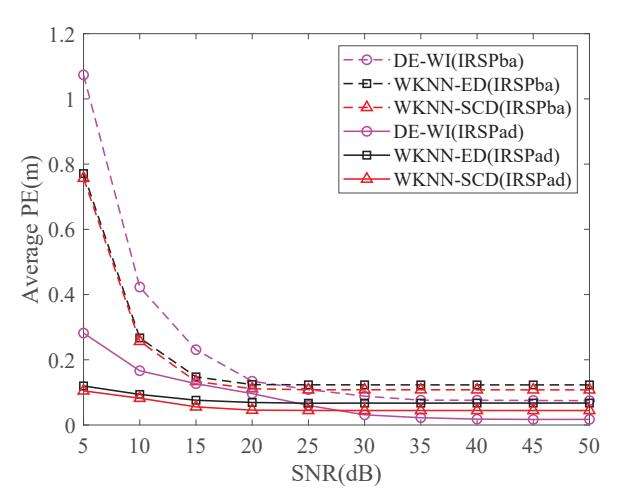

Fig. 6: The relationship between the average PE and the SNR across various methodologies.

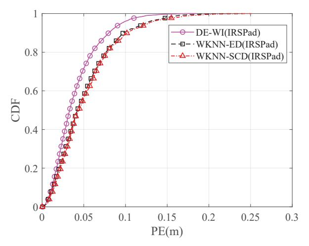

Fig. 7: Comparison of CDF curves of three weight calculation algorithms: DE-WI, WKNN-ED, and WKNN-SCD, which are utilized in the context of the IRSPad framework.

superior performance, while both WKNN algorithms reach a peak in PE. At K=5, the performance of the WKNN-ED algorithm exhibits fluctuations. Overall, it is crucial to highlight that the general trend of average PE for all three algorithms initially decreases with increasing K, followed by a slow increase. This phenomenon can be attributed to the loss of relevant localization information when K is small, leading to greater errors. Conversely, an excessively large K not only heightens computational complexity but also incorporates irrelevant fingerprint points into the localization process, thereby exacerbating the error. Consequently, in this paper, we have chosen K=5 as a result of balancing the average PE performance with computational efficiency.

The variation in the average PE of the three IRSPad VLP methods—namely DE-WI, WKNN-ED, and WKNN-SCD—relative to the fingerprint point spacing S is illustrated in Fig. 9. The results presented in the figure indicate that the average PE for all three algorithms increases with an increase

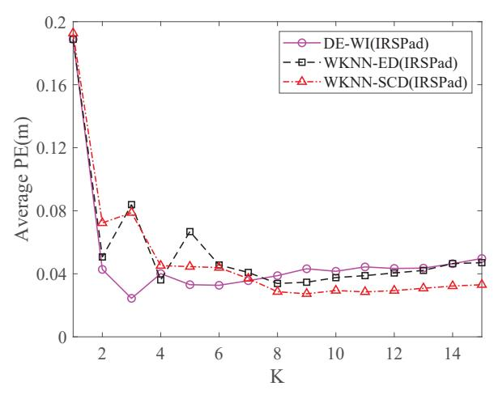

Fig. 8: The influence of the parameter K on the performance of the average PE in the three IRSPad VLP algorithms.

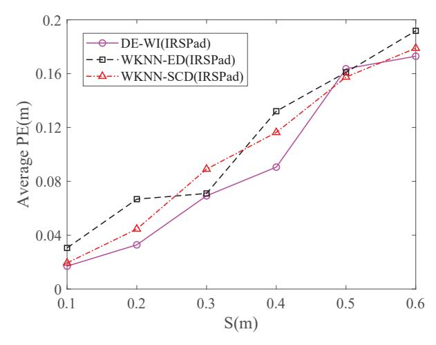

Fig. 9: The influence of the parameter S on the performance of the average PE in the three IRSPad VLP algorithms.

in S. This observation aligns with the anticipated outcome that localization performance deteriorates when the number of fingerprints is limited. Specifically, a larger S results in greater PEs, whereas a very small S complicates and increases the workload associated with constructing the fingerprint database during the offline phase. Consequently, based on the aforementioned simulations, a spacing of S=0.2 m has been selected, as it effectively balances the trade-off between localization accuracy performance and system complexity, thereby ensuring that the VLP system achieves centimeter-level accuracy without incurring excessive complexity.

It is worth noting that although this study validates the proposed system through simulations, the designed multi-LED and dual-IRS array system also demonstrates practical feasibility. Mature LED and PD devices are readily available, and programmable optical IRS technologies are advancing. In typical indoor environments such as warehouses or manufacturing workshops, deploying wall-mounted IRS units is physically feasible. Moreover, the system primarily relies on low-power, passive components, which offer advantages in

{11}------------------------------------------------

terms of low deployment cost and easy maintenance. However, the practical implementation of this approach necessitates additional considerations, including the accuracy of calibration and the impact of dynamic environmental factors. These aspects are intended to be explored in subsequent research endeavors.

### VI. CONCLUSION

This paper presents a multi-LED and multi-optical IRSsaided indoor visible light fingerprint localization system designed to mitigate the challenges posed by LoS link obstruction in intricate indoor settings. To cater to various application scenarios, two distinct types of fingerprint databases are developed: the first, termed the fingerprint matrix database, is characterized by a relatively straightforward complexity, while the second, known as the fingerprint tensor database, offers enhanced localization accuracy albeit with increased complexity. To tackle the issue of optimal weight calculation in fingerprint-based localization, the DE-WI and WKNN weight calculation algorithms are utilized, leveraging the established fingerprint features. Furthermore, two distinct VLP methodologies, designated as IRSPba and IRSPad, are introduced, each tailored to different fingerprint features and weight calculation techniques. To address the significant PEs encountered near walls when utilizing the single optical IRS array, a two-step localization strategy is proposed, facilitating high-accuracy localization across all locations within the designated service area. The extensive simulation findings demonstrate that, as illustrated in Fig. [6,](#page-10-0) the assessment of the IRSPba methodologies DE-WI, WKNN-ED, and WKNN-SCD weight calculation algorithms reveals that the average PE of the enhanced IRSPad method exhibits improvements of 77.33%, 45.53%, and 59.26%, respectively. It is worth noting that in situations where resources are limited, the IRSPba method remains an attractive choice for lightweight deployment due to its simpler structure and lower resource requirements. Additionally, under the parameters established in this research, the DE-WI algorithm demonstrates superior performance compared to the WKNN algorithm. In forthcoming research endeavors, we intend to establish a novel mechanism for the construction of a fingerprint database aimed at minimizing the costs associated with offline data collection. Additionally, we seek to further assess the performance of the system within authentic indoor environments.

### REFERENCES

- [1] K. Meng, Q. Wu, J. Xu, W. Chen, Z. Feng, R. Schober, and A. L. Swindlehurst, "UAV-enabled integrated sensing and communication: Opportunities and challenges," *IEEE Wireless Communications*, vol. 31, no. 2, pp. 97–104, Apr. 2024.
- [2] F. Liu, L. Zheng, Y. Cui, C. Masouros, A. P. Petropulu, H. Griffiths, and Y. C. Eldar, "Seventy years of radar and communications: The road from separation to integration," *IEEE Signal Processing Magazine*, vol. 40, no. 5, pp. 106–121, Jul. 2023.
- [3] R. Liu, L. Zhang, T. Mao, K. Guan, and Y. Xu, "Integrated sensing and communication for 6G: Motivation, enablers and standardization," in *2023 IEEE/CIC International Conference on Communications in China (ICCC Workshops), Dalian, China*, Aug. 2023, pp. 1–6.
- [4] H. Yang, W.-D. Zhong, C. Chen, A. Alphones, P. Du, S. Zhang, and X. Xie, "Coordinated resource allocation-based integrated visible light communication and positioning systems for indoor IoT," *IEEE Transactions on Wireless Communications*, vol. 19, no. 7, pp. 4671– 4684, Jul. 2020.

- [5] S. Li, F. Wang, Y. Zhang, R. Li, S. Shi, Y. Li, X. Li, and D. B. d. Costa, "Orthogonal chirp division multiplexing assisted dual-function radar communication in IoT networks," *IEEE Internet of Things Journal*, vol. 11, no. 13, pp. 23 752–23 764, Jul. 2024.
- [6] X. Li, J. Jiang, H. Wang, G. Chen, J. Du, C. Hu, and S. Mumtaz, "Physical layer security for wireless-powered ambient backscatter cooperative communication networks," *IEEE Transactions on Cognitive Communications and Networking*, vol. 9, no. 4, pp. 927–939, Jan. 2023.
- [7] T. Janssen, A. Koppert, R. Berkvens, and M. Weyn, "A survey on IoT positioning leveraging LPWAN, GNSS, and LEO-PNT," *IEEE Internet of Things Journal*, vol. 10, no. 13, pp. 11 135–11 159, Jul. 2023.
- [8] C. Tang, W. Sun, X. Zhang, J. Zheng, W. Wu, and J. Sun, "A novel fingerprint positioning method applying vision-based definition for WIFI-based localization," *IEEE Sensors Journal*, vol. 23, no. 14, pp. 16 092–16 106, Jul. 2023.
- [9] H. Chen, L. Yang, M. Yang, X. Hou, S. Chen, W. Dong, B. Yu, and Q. Wang, "Spatio-temporal feature fusion model based on attention mechanism for RFID indoor positioning," in *2024 27th International Conference on Computer Supported Cooperative Work in Design (C-SCWD), Tianjin, China*, May. 2024, pp. 1473–1478.
- [10] S. Xu, R. Chen, G. Guo, Z. Li, L. Qian, F. Ye, Z. Liu, and L. Huang, "Bluetooth, floor-plan, and microelectromechanical systems-assisted wide-area audio indoor localization system: Apply to smartphones," *IEEE Transactions on Industrial Electronics*, vol. 69, no. 11, pp. 11 744– 11 754, Nov. 2022.
- [11] S. Sung, H. Kim, and J.-I. Jung, "Accurate indoor positioning for UWBbased personal devices using deep learning," *IEEE Access*, vol. 11, pp. 20 095–20 113, Feb. 2023.
- [12] F. Zafari, A. Gkelias, and K. K. Leung, "A survey of indoor localization systems and technologies," *IEEE Communications Surveys & Tutorials*, vol. 21, no. 3, pp. 2568–2599, 3rd Quart., 2019.
- [13] V. P. Rekkas, L. A. Iliadis, S. P. Sotiroudis, A. D. Boursianis, P. Sarigiannidis, D. Plets, W. Joseph, S. Wan, C. G. Christodoulou, G. K. Karagiannidis, and S. K. Goudos, "Artificial intelligence in visible light positioning for indoor IoT: A methodological review," *IEEE Open Journal of the Communications Society*, vol. 4, pp. 2838–2869, Oct. 2023.
- [14] F. Liu, Y. Cui, C. Masouros, J. Xu, T. X. Han, Y. C. Eldar, and S. Buzzi, "Integrated sensing and communications: Toward dual-functional wireless networks for 6G and beyond," *IEEE Journal on Selected Areas in Communications*, vol. 40, no. 6, pp. 1728–1767, Jun. 2022.
- [15] Z. Zhu, Y. Yang, M. Chen, C. Guo, J. Cheng, and S. Cui, "A survey on indoor visible light positioning systems: Fundamentals, applications, and challenges," *IEEE Communications Surveys & Tutorials*, pp. 1–1, Oct. 2024.
- [16] E. Panayirci, E. B. Bektas, and H. V. Poor, "Physical layer security with DCO-OFDM-based VLC under the effects of clipping noise and imperfect CSI," *IEEE Transactions on Communications*, vol. 72, no. 7, pp. 4259–4273, Jul. 2024.
- [17] S. Bastiaens, M. Alijani, W. Joseph, and D. Plets, "Visible light positioning as a next-generation indoor positioning technology: A tutorial," *IEEE Communications Surveys & Tutorials*, vol. 26, no. 4, pp. 2867– 2913, Mar. 2024.
- [18] F. Wang, C. Liu, Q. Wang, J. Zhang, R. Zhang, L.-L. Yang, and L. Hanzo, "Optical jamming enhances the secrecy performance of the generalized space-shift-keying-aided visible-light downlink," *IEEE Transactions on Communications*, vol. 66, no. 9, pp. 4087–4102, Sep. 2018.
- [19] F. Wang, T. Zuo, J. Zhang, S. Shi, and Y. Li, "SM and NOMA joint assisted indoor multi-user VLC downlink," *IEEE Transactions on Green Communications and Networking*, vol. 9, no. 1, pp. 15–28, Mar. 2025.
- [20] S. Feng, N. Li, K. Liu, B. Li, C. Dong, and Q. Wu, "A cross Q-learning assisted resource allocation for user-centric optical wireless communication networks," *IEEE Transactions on Green Communications and Networking*, pp. 1–1, Mar. 2025.
- [21] Y. Zhuang, L. Hua, L. Qi, J. Yang, P. Cao, Y. Cao, Y. Wu, J. Thompson, and H. Haas, "A survey of positioning systems using visible LED lights," *IEEE Communications Surveys & Tutorials*, vol. 20, no. 3, pp. 1963– 1988, 3rd Quart., 2018.
- [22] X. Sun, Y. Zhuang, J. Huai, L. Hua, D. Chen, Y. Li, Y. Cao, and R. Chen, "RSS-based visible light positioning using nonlinear optimization," *IEEE Internet of Things Journal*, vol. 9, no. 15, pp. 14 137–14 150, Aug. 2022.

{12}------------------------------------------------

- [23] Z. Wang, Z. Liang, R. Liu, X. Li, and H. Li, "Design and performance analysis for indoor visible light positioning with single LED and single-tilted-rotatable PD," *IEEE Transactions on Instrumentation and Measurement*, vol. 73, pp. 1–14, Apr. 2024.
- [24] J. Vongkulbhisal, B. Chantaramolee, Y. Zhao, and W. S. Mohammed, "A fingerprinting-based indoor localization system using intensity modulation of light emitting diodes," *Microwave and Optical Technology Letters*, vol. 54, no. 5, pp. 1218–1227, May. 2012.
- [25] H. Q. Tran and C. Ha, "Fingerprint-based indoor positioning system using visible light communicationa novel method for multipath reflections," *Electronics*, vol. 8, no. 1, Jan. 2019.
- [26] J. Hu, D. Liu, Z. Yan, and H. Liu, "Experimental analysis on weight Knearest neighbor indoor fingerprint positioning," *IEEE Internet of Things Journal*, vol. 6, no. 1, pp. 891–897, Feb. 2019.
- [27] S. Xu, Y. Wu, X. Wang, and F. Wei, "Indoor high precision positioning system based on visible light communication and location fingerprinting," *Journal of Lightwave Technology*, vol. 41, no. 17, pp. 5564–5576, Sep. 2023.
- [28] O. Isam Younus, N. Chaudhary, Z. Nazari Chaleshtori, Z. Ghassemlooy, L. Nero Alves, and S. Zvanovec, "The impact of blocking and shadowing on the indoor visible light positioning system," in *2021 IEEE 32nd Annual International Symposium on Personal, Indoor and Mobile Radio Communications (PIMRC), Helsinki, Finland*, Sep. 2021, pp. 1–6.
- [29] E. Basar, G. C. Alexandropoulos, Y. Liu, Q. Wu, S. Jin, C. Yuen, O. A. Dobre, and R. Schober, "Reconfigurable intelligent surfaces for 6G: Emerging hardware architectures, applications, and open challenges," *IEEE Vehicular Technology Magazine*, vol. 19, no. 3, pp. 27–47, Sep. 2024.
- [30] X. Li, M. Liu, S. Dang, N. C. Luong, C. Yuen, A. Nallanathan, and D. Niyato, "Covert communications with enhanced physical layer security in RIS-assisted cooperative networks," *IEEE Transactions on Wireless Communications*, pp. 1–1, Mar. 2025.
- [31] X. Li, J. Zhao, G. Chen, W. Hao, D. B. Da Costa, A. Nallanathan, H. Shin, and C. Yuen, "STAR-RIS assisted covert wireless communications with randomly distributed blockages," *IEEE Transactions on Wireless Communications*, pp. 1–1, Feb. 2025.
- [32] S. P. Chepuri, N. Shlezinger, F. Liu, G. C. Alexandropoulos, S. Buzzi, and Y. C. Eldar, "Integrated sensing and communications with reconfigurable intelligent surfaces: From signal modeling to processing," *IEEE Signal Processing Magazine*, vol. 40, no. 6, pp. 41–62, Sep. 2023.
- [33] S. Aboagye, A. R. Ndjiongue, T. M. N. Ngatched, O. A. Dobre, and H. V. Poor, "RIS-assisted visible light communication systems: A tutorial," *IEEE Communications Surveys & Tutorials*, vol. 25, no. 1, pp. 251– 288, 1st Quart., 2023.

- [34] M. Lu, F. Wang, R. Li, T. Zuo, and J. Zhang, "Mirror array aided indoor SSK visible light downlink," *Optics Communications*, vol. 528, p. 129004, Feb. 2023.
- [35] A. M. Vegni, A. Romano, and H. A. Suraweera, "IRS-aided handover technique in indoor VLC blockage-affected systems," in *2024 14th International Symposium on Communication Systems, Networks and Digital Signal Processing (CSNDSP), Rome, Italy*, Jul. 2024, pp. 147– 152.
- [36] A. M. Abdelhady, A. K. S. Salem, O. Amin, B. Shihada, and M.- S. Alouini, "Visible light communications via intelligent reflecting surfaces: Metasurfaces vs mirror arrays," *IEEE Open Journal of the Communications Society*, vol. 2, pp. 1–20, Dec. 2021.
- [37] R. Ahiaklo-Kuz, S. Aboagye, O. Maraqa, and T. M. N. Ngatched, "Design and optimization of an integrated visible light communication and localization system using liquid crystal based-RIS receivers," *IEEE Photonics Journal*, vol. 17, no. 3, pp. 1–9, Apr. 2025.
- [38] Y. Wang, S. Wu, L. Yu, C. Xu, Z. Wang, and X. Cai, "RIS-assisted indoor visible light positioning based on sparse bayesian learning," in *2023 3rd International Conference on Intelligent Communications and Computing (ICC), Nanchang, China*, Nov. 2023, pp. 90–97.
- [39] F. Kokdogan and S. Gezici, "Intelligent reflecting surfaces for visible light positioning based on received power measurements," *IEEE Transactions on Vehicular Technology*, vol. 73, no. 9, pp. 13 108–13 121, Sep. 2024.
- [40] Y. Guo, F. Wang, R. Li, S. Shi, X. Li, and D. B. da Costa, "Optical IRS assisted-visible light positioning in indoor Non-LOS IoVs scenarios," *IEEE Internet of Things Journal*, pp. 1–1, Apr. 2025.
- [41] P. Kumari, M. Zaid, A. Singh, V. A. Bohara, and A. Srivastava, "On maximizing the channel gain for an IRS-aided indoor VLC system with blockages," in *2023 IEEE International Conference on Advanced Networks and Telecommunications Systems (ANTS), Jaipur, India*, Dec. 2023, pp. 1–6.
- [42] A. M. Abdelhady, O. Amin, A. K. S. Salem, M.-S. Alouini, and B. Shihada, "Channel characterization of IRS-based visible light communication systems," *IEEE Transactions on Communications*, vol. 70, no. 3, pp. 1913–1926, Mar. 2022.
- [43] D. Cs´ık, A. Odry, R. Pesti, and P. Sarcevic, "A novel wknn algorithm for fingerprinting-based fusion of different radio communication technologies for indoor positioning," in *2023 IEEE 23rd International Symposium on Computational Intelligence and Informatics (CINTI), Budapest, Hungary*, Nov. 2023, pp. 53–58.
- [44] Y. Song, "RSSI indoor location based on weighted KNN," in *2022 2nd International Signal Processing, Communications and Engineering Management Conference (ISPCEM), Montreal, ON, Canada*, Nov. 2022, pp. 243–248.