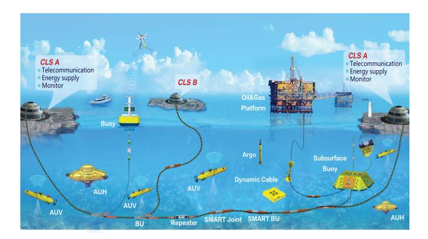
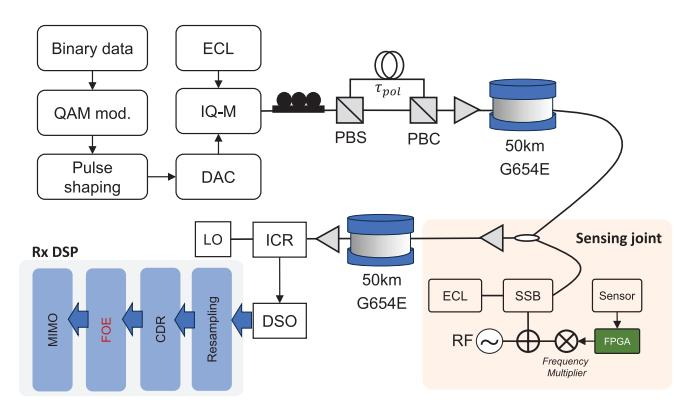
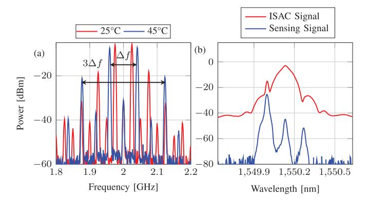
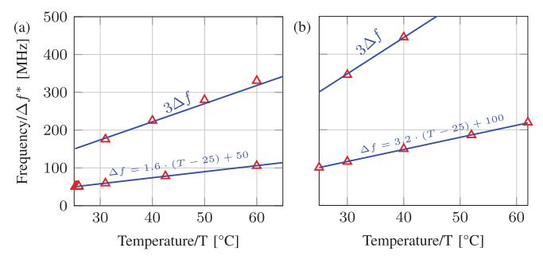
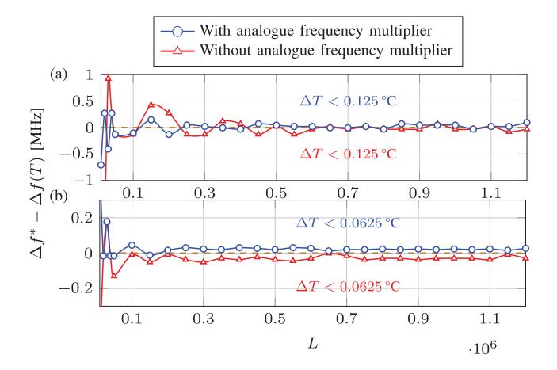
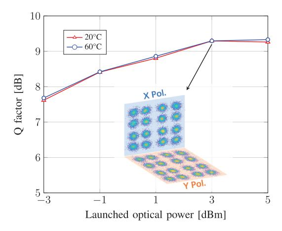

{0}------------------------------------------------

# Advanced Integration of Sensing and Communication With High DSP Compatibility for SMART Network

Yongfu W[u](https://orcid.org/0009-0000-6938-5592) , Lin Sun [,](https://orcid.org/0000-0002-5725-180X) *Senior Member, IEEE*, Jiaqi Cai, Weiye Wang, Lu Zhang, Rendong Xu, Guoxiang X[u](https://orcid.org/0009-0007-8943-775X) , Gordon Ning Liu [,](https://orcid.org/0000-0002-4281-2854) *Senior Member, IEEE*, Yi Ca[i](https://orcid.org/0000-0002-6682-0840) , *Senior Member, IEEE*, Haocai Huan[g](https://orcid.org/0000-0001-8096-0439) , and Gangxiang She[n](https://orcid.org/0000-0002-7342-6980) , *Senior Member, IEEE*

*Abstract*—Concept of the Scientific Monitoring and Reliable Telecommunications (SMART) network involves utilizing submarine communication cables to monitor the undersea environment. Traditionally, this integrated sensing and communication (ISAC) application has relied on separate wavelength bands for sensing information switching among all sensing joints and shores, necessitating additional hardware to exchange and demodulate the sensing information. In this study, we introduce a novel ISAC configuration tailored for the SMART network, with demonstrating the viability of detecting modulated sensing information using a communication-compatible digital signal processor (DSP). By applying frequency modulation (FM) and optical single-sideband (SSB) modulation to the sensing information obtained by the electronic sensors, we convert the information into multiple frequency subcarriers that reside near the communication spectrum without interference. We experimentally validated the proposed ISAC configuration using a two-span single-mode fiber (SMF) communication link, achieving real-time temperature monitoring on an FPGA platform at the sensing joint between two 50-km span SMFs. Furthermore, our findings indicate that employing high-order frequency subcarriers and an analog frequency multiplier for frequency chirp amplification of the FM sensing information enhances temperature estimation accuracy when using the communication-compatible DSP. With this approach, we achieved a temperature monitoring resolution of 0.0625◦C, which matches the resolution limit of the DS18B20 sensing probe used, while maintaining full compatibility with 16-GBaud DP-

Received 13 March 2025; revised 5 July 2025; accepted 25 July 2025. Date of publication 28 July 2025; date of current version 5 August 2025. This work was supported in part by the National Natural Science Foundation of China under Grant 62475178, in part by the Yangtze River Delta Region Integration Project under Grant 2024CSJGG2600, in part by the Young Elite Scientists Sponsorship Program by China Association for Science and Technology (CAST) under Grant 2023QNRC001, and in part by the Open Program of the State Key Laboratory of Photonics and Communications at Shanghai Jiao Tong University under Grant 2024GZKF009. *(Corresponding author: Lin Sun.)*

Yongfu Wu, Jiaqi Cai, Weiye Wang, Lu Zhang, Gordon Ning Liu, Yi Cai, and Gangxiang Shen are with the School of Electronic and Information Engineering, Soochow University, Suzhou, Jiangsu 215006, China.

Lin Sun is with the School of Electronic and Information Engineering, Soochow University, Suzhou, Jiangsu 215006, China, and also with the State Key Laboratory of Photonics and Communications, Shanghai Jiao Tong University, Shanghai 200240, China (e-mail: linsun@suda.edu.cn).

Rendong Xu and Haocai Huang are with the Ocean College, Zhejiang University, Zhoushan, Zhejiang 316004, China.

Guoxiang Xu is with Jiangsu Shenyuan Ocean Information Technology and Equipment Innovation Center Company Ltd., Suzhou 215000, China.

Color versions of one or more figures in this letter are available at https://doi.org/10.1109/LPT.2025.3593343.

Digital Object Identifier 10.1109/LPT.2025.3593343

QAM16 coherent communication data transmissions. At last, the scalability of the proposed ISAC configuration for the multiplespan SMART cable is further discussed.

*Index Terms*—Optical fiber sensing, subsea monitoring, frequency modulation.

#### I. INTRODUCTION

S TUDY in oceanic science is essential for deepening our understanding in Earth's oceans and the diverse marine life they support. With the rapid progress in trans-oceanic communication technologies, new possibilities are emerging to revolutionize the deep-sea environmental monitoring via the telecommunication infrastructures. This integration of sensing and communication (ISAC) on the fiber-optic telecommunication cables offers an innovative approach for subsea monitoring [\[1\],](#page-3-0) [\[2\],](#page-3-1) [\[3\].](#page-3-2) To advance ISAC capabilities in practical telecommunication cables, the concept of "SMART" cables has been introduced by joint task force including the International Telecommunication Union (ITU), the World Meteorological Organization (WMO), and the Intergovernmental Oceanographic Commission (IOC) [\[4\].](#page-3-3) The acronym "SMART" stands for "Science Monitoring and Reliable Telecommunications". SMART cables enable subsea monitoring by implementing varieties of electronic sensors such as accelerometers, pressure sensors and temperature sensors into cables as the sensing joint, for collecting and transmitting monitoring information continuously [\[5\],](#page-3-4) [\[6\].](#page-3-5)

Compared to the distributed fiber sensing (DFS) approach based on the tubed or armored fibers [\[7\],](#page-3-6) [\[8\],](#page-3-7) [\[9\],](#page-3-8) [\[10\]](#page-3-9) which also supports ISAC feasibility on fibers, SMART cables could directly expose sensors into seawater, thus enhancing sensitivity and enabling multi-parameter sensing. Additionally, SMART networks can integrate more varieties of sensors like accelerometers within repeaters, supporting real-time tsunami monitoring and boosting the network's resilience [\[11\].](#page-3-10) As shown by the schematic diagram in Fig. [1,](#page-1-0) the SMART network includes telecommunication cables and autonomous underwater vehicles (AUVs). The cables equipped with SMART sensors enable deep-sea monitoring, while AUVs provide the ability of mobile observation. Cable branch units (BUs) are to connect multiple stations, such as cable landing stations (CLS) and buoys, to form the subsea monitoring

{1}------------------------------------------------

Fig. 1. The considered scientific monitoring and reliable telecommunications (SMART) network.

network. The introduction of sensing and networking functions to telecommunication cables demands advanced power feeding equipment (PFE) and underwater energy storage. To multiplex and transmit the sensing information with telecommunication data in cables, current SMART systems employ Ethernet switches operating at different wavelength bands with the telecommunication lane to avoid interference [\[4\].](#page-3-3) This allows sensing information exchange among all repeaters as well as shores, but it also requires extra hardware resources to separate ISAC signals. Moreover, this approach consumes additional wavelength bandwidth for sensing information transmission, thus reducing communication spectrum efficiency [\[12\].](#page-3-11)

To address this challenge, we propose for the first time an ultra-dense multiplexing configuration for sensing and communication in subsea SMART networks. Via frequency modulation (FM) and optical single-side band (SSB) modulation on the sensing information within an FPGA-programmed sensing joint, the optically-coupled ISAC signals can be distinguished using standard coherent communication DSP at the receiver. Moreover, FM sensing information can be directly processed by the DFT operation in the coherentcommunication DSP. Experiments demonstrate a two-span repeater SMF transmission link, achieving seamless integration of communication and real-time temperature monitoring at a sensing joint. To ensure accurate demodulation of the sensing information with communication-compatible DSP, we employ analogue frequency multipliers and high-order harmonic waves to realize the frequency chirp amplification by a low-cost FPGA. The proposed ISAC configuration for subsea SMART network offers significant advancements with an improved spectrum efficiency of communication, low infrastructure costs, and the feasibility of a real-time compatible subsea monitoring via telecommunication cables.

### II. EXPERIMENTAL DEMONSTRATION

To realize ultra-dense ISAC for SMART network, we propose a scheme that integrates sensing information from the sensing joint with communication signals through FM and optical SSB modulations. The sensing information obtained from sensing probe needs to be converted into the frequency shifts of a sinusoidal waveform controlled by a FPGA board. Then, optical SSB modulates the FM sensing signals onto

Fig. 2. Experimental demonstration setup of the proposed SMART system. ECL: External cavity laser. PBS: Polarization beam splitter. PBC: Polarization beam combiner. SSB: Single-sideband modulator. ICR: Integrated coherent receiver. DSO: Digital storage oscilloscope. CDR: Clock data recovery. FOE: Frequency offset estimation.

light at the sensing joint, whose wavelength is similar to that of the communication laser. SSB's advantage over doublesideband modulation lies in its ability to produce FM optical subcarriers with only one side of spectrum, minimizing the sensing-communication interference. Moreover, FM sensing signals may interfere with the pilot tone, thereby reducing its detectability and compromising the accuracy of frequency offset estimation (FOE) for communication DSP. To address this issue, we employ optical SSB modulation to adaptively place the sensing signal outside the pilot tone frequency range, ensuring no spectral overlap between the sensing signal and the pilot tone for FOE. On the other hand, the harmonic waves of the FM sensing signal are negligible at higher orders, thus minimizing their interference with the pilot tone.

Experimental demonstration of the proposed ISAC is depicted in Fig. [2.](#page-1-1) A 20-GHz bandwidth I/Q modulator modulates the light emitted by an external cavity laser (ECL). I and Q branches of the modulator are driven by an arbitrary waveform generator (AWG) to generate a 16-Gbaud dual-polarization QAM-16 (DP-QAM16) communication signal with using a polarization division multiplexing emulator (PDME). To emulate the SMART system, a sensor joint is placed between two 50-km fiber spans. The employed DS18B20 is an electronic temperature sensor produced by Dallas Semiconductor. It features a measurement range of −55◦C to +125◦C, with an accuracy of ±0.5◦C within the −10◦C to +85◦C range and a maximum deviation of ±2.0◦C over the entire operating range. For the FPGA implementation, the synthesized RTL circuit on Quartus II platform circuit is used to capture the sequential logic signal from the DS18B20, whose bit width is 12. The higher 8 bits are used to describe the integer temperature and the lower 4 bits are for the decimals resulting in a temperature resolution of 0.0625◦C. Then, to realize the FM conversion of the digital temperature values, the linear relationship between the 12-bit sequential logic signal and FM frequency should be constructed. We built a look-up table (LUT) in on-board ROM. Then, the read-out results of LUT are converted into analogue frequencies by an external DAC with bandwidth at 100MHz, by accessing the corresponding address. Above modules share the same clock

{2}------------------------------------------------

Fig. 3. FM modulation and optical multiplexing of sensing information: (a) Electrical spectrum of the FM waveform at different temperatures. (b) Optical spectrum of the sensing waveform and ISAC waveforms.

source at 50MHz. Because the laser source at the sensing joint is physically located at different position to the one at the transmitter, making precise laser wavelength alignment difficult. In that case, the FM sensing information is hard to be controlled for the adaptive allocation out of the communication band. Thanks to the use of optical SSB modulation, via adaptively tuning the RF modulation frequency to the optical SSB, the adaptive allocation of FM sensing information can be realized. To allocate the FM sensing information out of the communication signal band, the driven waveform of optical SSB modulator is mixed by the FM-modulated intermediate frequency (IF) signals and local oscillator (LO) signal at 17GHz. Then optically-coupled ISAC signals by a 3-dB coupler propagate through the next 50-km SMF before reaching the receiver. At the receiver, the digitized ISAC signal at a 128-GSa/s sampling rate undergoes offline digital signal processing (DSP) including normalization, upsampling, clock recovery, chromatic dispersion compensation, frequency offset estimation (FOE), and least mean square (LMS)-based multiinput multi-output (MIMO) equalization.

During the digital FOE procedure which is used to compensate the frequency offset between signals and LO during coherent detection, the unavoidable discrete Fourier transform (DFT) can be applied to demodulate the FM sensing information. At the sensing joint, the frequency mixing process generates multiple frequency harmonic waves at the radio frequency (RF) output of the mixer which can be indicated by the inset in Fig. [2.](#page-1-1) Relative frequency difference *N* · ∆*f* between the *N th* imaged frequency components dependents on the harmonic wave order *N* and the frequency of FM sensing information ∆*f*(*T*). Because the demodulation of sensing information *N* · ∆*f*(*T*) is conducted by the communicationcompatible DSP, the DFT resolution *fDFT* = *fs L* should be much smaller than *N* · ∆*f*(*T*) to ensure a precise temperature estimation.

$$L \gg \frac{f_s}{N \cdot \Delta f(T)},\tag{1}$$

where *L* denotes the DFT length and *fs* is the sampling rate. Baud rate of communication signal is normally at Gbps level, corresponding sampling rate *fs* should be more than two times of baud rate to meet the Nyquist criteria. To achieve a fast monitoring of temperature change, we employ a

Fig. 4. Estimated ∆*f*(*T*) ∗ by communication-compatible FOE under different temperatures: (a) Without using analogue frequency multiplier, (b) with using analogue frequency multiplier.

analogue frequency multiplier before the mixer IF port, with the assistance of high-order frequency subcarriers measurement, to alleviate the requirement of a long DFT length. Electrical spectrum of the mixer RF port with tuning the LO frequency to 2GHz can be seen in Fig. [3\(a\),](#page-2-0) where the frequency difference ∆*f* is directly related to the sensed temperature from DS18B20. It indicates that the frequency subcarriers at the mixer RF port are imaged with the central frequency at the LO frequency. Such frequency images could be taken as advantages to avoid the precise wavelength alignment between the sensing and communication laser sources. Moreover, the relative frequencies between the imaged subcarriers at higher orders are much larger than the first order one. Such a frequency chirp amplification is beneficial to a more accurate estimation of the frequency shit related to the temperature variance. The mixed frequencies are then modulated via an optical SSB modulator for electrooptical conversion. Carrier suppression ratio of optical SSB modulation over 20dB is realized as depicted in Fig. [3\(b\).](#page-2-0)

## III. RESULTS AND DISCUSSIONS

Frequency multiplication is realized by the joint employment of analogue frequency multiplier and higher-order harmonic waves. The analogue frequency multiplier doubles the frequency shift that describes the temperature change, and the highest order of the usable harmonic wave at the RF port of mixer is 7. Consequently, 14 times of frequency broadening can be realized, which can improve the frequency estimation accuracy with using the finite-length DFT operation. As shown in Fig. [4,](#page-2-1) there is a linear relationship between the estimated ∆*f*(*T*) ∗ and temperature *T*. When using the third order harmonic wave for estimating, a three times slope of frequency-to-temperature can be obtained. Moreover, under the same temperature condition, the estimated frequencies with the assistance of the analogue frequency multiplier exhibit a further increased slope compared to those without the multiplier.

As mentioned in Eq. [1,](#page-2-2) a longer DFT length results in a higher frequency resolution, which is beneficial to the accurate temperature demodulation. As shown in Fig. [5\(a\),](#page-3-12) it presents the frequency estimation error which is obtained by the difference between the estimated ∆*f*(*T*) ∗ and the ideal frequency ∆*f*(*T*) which can be theoretically calculated by the fitting equations in Fig. [4,](#page-2-1) with temperature at 25.6◦C. As

{3}------------------------------------------------

Fig. 5. Estimated frequency error of FM sensing information with- and without using analogue frequency multiplier under different DFT length: (a) 1 *st* harmonic wave. (b) 7*th* harmonic wave.

Fig. 6. Q factors against LOP for optical ISAC signals under different temperatures.

illustrated in Fig. [5,](#page-3-12) the frequency estimation error gradually stabilizes as the DFT length increases. When using the firstorder harmonic wave, the maximum deviation of frequency estimation is approximately at 0.2MHz, which corresponds to a temperature error of about 0.125◦C, for both the cases with and without the frequency multiplier. Although both configurations provide comparable frequency estimation accuracy, the use of a frequency multiplier allows the smaller frequency fluctuations, highlighting its advantage in enhancing resolution. While in the case of the seventh-order harmonic wave, the maximum frequency estimation errors are approximately at 0.5MHz, respectively. However, due to the employment of higher harmonic order, the corresponding temperature resolution is improved to 0.0625◦C.

We measured the Q-factor values under different launched optical power (LOP) values at two distinct temperatures as depicted in Fig. [6.](#page-3-13) The inset of Fig. [6](#page-3-13) presents the DP-QAM16 constellation at 3dBm. The results show that the Q factor remains stable across varying LOP, indicating minimal interference from the sensing signal. Slight deviation in Q factors under 20◦C and 60◦C can be observed with 0.07-dB difference, at the LOP of 5dBm. This slight fluctuation in Q factors observed can be attributed to the instable operation of communication devices such as the DC bias of IQ modulator and the polarization multiplexer. However, the general trend of LOP-to-Q curves at two different temperatures indicate the well independency of communication performance on the sensing temperature, which showcase the compatible realization of ISAC. It is noted that the practical SMART cables are consisted of multiple fiber spans, along with multiple sensing joints to realize the large coverage of subsea monitoring. Our proposed ISAC configuration could be scalable to multiple-span links, by the means of locating the FM sensing information from different sensing joints at different WDM channels.

#### IV. CONCLUSION

We proposed a novel approach of FM and optical SSB modulation for sensing information obtained from the sensing joint in SMART network, enabling an ultra-dense ISAC along with a perfect DSP compatibility between sensing and communication functionalities. Experimental investigations on 100-km single-wavelength DP-QAM16 transmissions reveal that the sensing signals introduce a minimal interference on communications. Via incorporating a frequency multiplier and high-order frequency subcarrier estimation, we achieving an accurate temperature resolution at 0.0625◦C which reaches the limitation of the employed DS18B20 thermometer.

## REFERENCES

- [\[1\]](#page-0-0) S. Chen, K. Zhu, J. Han, Q. Sui, and Z. Li, "Photonic integrated sensing and communication system harnessing submarine fiber optic cables for coastal event monitoring," *IEEE Commun. Mag.*, vol. 60, no. 12, pp. 110–116, Dec. 2022.
- [\[2\]](#page-0-1) J. Wang, N. Varshney, C. Gentile, S. Blandino, J. Chuang, and N. Golmie, "Integrated sensing and communication: Enabling techniques, applications, tools and data sets, standardization, and future directions," *IEEE Internet Things J.*, vol. 9, no. 23, pp. 23416–23440, Dec. 2022.
- [\[3\]](#page-0-2) H. He et al., "Integrated sensing and communication in an optical fiber," *Light, Sci. Appl.*, vol. 12, no. 1, p. 25, 2023.
- [\[4\]](#page-0-3) S. Lentz and B. Howe, "Scientific monitoring and reliable telecommunications (SMART) cable systems: Integration of sensors into telecommunications repeaters," in *Proc. OCEANS MTS*/*IEEE Kobe Techno-Oceans (OTO)*, May 2018, pp. 1–7.
- [\[5\]](#page-0-4) C. Rowe, B. Howe, M. Begnaud, and A. Conley, "Science monitoring and reliable telecommunications (SMART) cables—The future of global undersea observing," in *Proc. IEEE Photon. Soc. Summer Topicals Meeting Ser. (SUM)*, Jul. 2024, pp. 1–2.
- [\[6\]](#page-0-5) L. Qiu, D. Ba, D. Zhou, Q. Chu, Z. Zhu, and Y. Dong, "Highsensitivity dynamic distributed pressure sensing with frequency-scanning ϕ-OTDR," *Opt. Lett.*, vol. 47, no. 4, p. 965, Dec. 2021.
- [\[7\]](#page-0-6) Z. Hu et al., "Enabling endogenous distributed acoustic sensing in a digital subcarrier coherent transmission system," *Opt. Lett.*, vol. 49, no. 11, pp. 3166–3169, 2024.
- [\[8\]](#page-0-7) L. Gu et al., "Co-wavelength-channel integration of ultra-low-frequency distributed acoustic sensing and high-capacity communication," *Photon. Res.*, vol. 13, no. 6, pp. 1611–1619, 2025.
- [\[9\]](#page-0-8) S. Chen, J. Han, Q. Sui, K. Zhu, C. Lu, and Z. Li, "Advanced signal processing in distributed acoustic sensors based on submarine cables for seismology applications," *J. Lightw. Technol.*, vol. 41, no. 13, pp. 4164–4175, Jul. 15, 2023.
- [\[10\]](#page-0-9) Z. Liu, S. Zhang, C. Yang, W.-H. Chung, and Z. Li, "Submarine optical fiber sensing system for the real-time monitoring of depth, vibration, and temperature," *Frontiers Mar. Sci.*, vol. 9, Jun. 2022, Art. no. 922669.
- [\[11\]](#page-0-10) G. Marra et al., "Optical interferometry–based array of seafloor environmental sensors using a transoceanic submarine cable," *Science*, vol. 376, no. 6595, pp. 874–879, May 2022.
- [\[12\]](#page-1-2) B. M. Howe et al., "SMART subsea cables for observing the Earth and ocean, mitigating environmental hazards, and supporting the blue economy," *Frontiers Earth Sci.*, vol. 9, Feb. 2022, Art. no. 775544.