{0}------------------------------------------------

# Revolutionizing 6G: Experimental Validation of an Optical Integrated Communication, Sensing, and Power Transfer System

Tiantian Chu, Jia Ye, *Member, IEEE*, Chen Chen, *Senior Member, IEEE*, Xinyue Guo, Zhihong Zeng, Shuaishuai Guo, *Senior Member, IEEE*, Harald Haas, *Fellow, IEEE*, and Mohamed-Slim Alouini, *Fellow, IEEE*

*Abstract*—The evolution of communication network architectures is steering towards more sustainable, flexible, and lightweight designs, particularly with the advent of sixthgeneration (6G) mobile communications. Spectrum-rich optical integrated systems are anticipated to play a crucial role in this transformation, offering significant advantages such as high data rates, reduced interference, and improved energy efficiency. This paper introduces and experimentally demonstrates a novel optical integrated communication, sensing, and power transfer (O-ICSPT) system. The proposed system integrates optical wireless communication, sensing, and wireless power transfer into a multifunctional framework, addressing the limitations of existing systems in terms of flexibility and resource utilization. The experimental setup investigates the effects of bias current, peakto-peak voltage, and light source wavelength on the performance of each functional module. Experimental results indicate that the O-ICSPT system achieves a maximum data rate of approximately 632.58 Mbps, a best ranging root mean square error approaching 0 m, and a peak energy harvesting capability of about 10.02 mW. These findings underscore the potential of the O-ICSPT system in future 6G integrated communication networks, marking the first experimental validation of such a system.

*Index Terms*—Optical integrated communication-sensingpower transfer, laser wireless communication, retroreflective optical sensing, laser power transfer.

# I. INTRODUCTION

S IX-GENERATION (6G) mobile communication is encountering profound technological revolution and has emerged a key focus of global research. To address the

This work was supported in part by the National Natural Science Foundation of China under Grant 62271091 and 62501088, in part by Chongqing Municipal Young Talents Program under Grant cstc2024ycjh-bgzxm0018, and in part by the Fundamental Research Funds for the Central Universities under Grant 2024CDJXY020. *(Corresponding authors: Jia Ye; Chen Chen.)*

Tiantian Chu and Jia Ye are with State Key Laboratory of Power Transmission Equipment Technology, School of Electrical Engineering, Chongqing University, Chongqing 400044, China (e-mail: 20241101050@stu.cqu.edu.cn; jia.ye@cqu.edu.cn).

Chen Chen and Zhihong Zeng are with School of Microelectronics and Communication Engineering, Chongqing University, Chongqing 400044, China (e-mail: c.chen@cqu.edu.cn; zhihong.zeng@cqu.edu.cn).

Xinyue Guo is with School of Optical-Electrical and Computing Engineering, University of Shanghai for Science and Technology, Shanghai 200093, China (e-mail: xinyueguo@usst.edu.cn).

Shuaishuai Guo is with School of Control Science and Engineering, Shandong University, Jinan 250062, China (e-mail: shuaishuai guo@sdu.edu.cn).

Harald Haas is with Department of Engineering, University of Cambridge, 9 JJ Thomson Avenue, Cambridge CB3 0FA, UK (e-mail: huh21@cam.ac.uk).

Mohamed-Slim Alouini is with CEMSE Division, King Abdullah University of Science and Technology (KAUST), Thuwal 23955-6900, Saudi Arabia (email: slim.alouini@kaust.edu.sa).

growing demands of hundreds of millions of Internet of Things (IoT) devices and mobile users for ultra-large-scale interconnectivity within access networks, 6G will fully utilize a broad spectrum of resources, including millimeter wave, terahertz, and optical bands [1]. To meet the diverse needs of various vertical industries, 6G will deeply integrate communication, sensing, and power transfer, giving rise to converged application scenarios such as integrated sensing and communication (ISAC) and simultaneous wireless information and power transfer (SWIPT) [2], [3]. The architecture of communication networks is evolving toward multi-network convergence, multifunctional integration, and designs that are green, flexible, and lightweight [4], [5]. Optical wireless communication (OWC) utilizes an extensive unregulated spectrum ranging from 3 THz to 300 PHz, encompassing infrared, visible, and ultraviolet light, offering advantages such as high data rates, immunity to electromagnetic interference, ease of integration, energy efficiency, and enhanced security [6]. In this context, optical integrated systems such as optical ISAC (O-ISAC) and simultaneous lightwave information and power transfer (SLIPT) have attracted unprecedented attention [7], [8].

1

The distinctive characteristics of optical front-ends and channels offer significant advantages for both communication and sensing [7]. O-ISAC systems are capable of fully exploiting the expansive bandwidth of optical signals, thereby facilitating high-speed communication and high-resolution sensing [9]. These systems demonstrate excellent performance in radio frequency (RF) sensitive environments and are particularly effective in indoor and underground settings, where satellite signals are typically obstructed [10]. The performance of communication and sensing in O-ISAC systems is intricately linked to the waveforms employed. Various waveforms, such as pulse sequence sensing combined with pulse position modulation [11], pulse amplitude modulation [12], linear frequency modulation integrated with continuous phase modulation [13], and direct current biased optical orthogonal frequency division multiplexing (DCO-OFDM) [14], [15], have been explored for their potential in O-ISAC systems. To optimize the performance of O-ISAC systems, both communicationcentric and sensing-centric resource allocation strategies have been proposed, tailored to specific application scenarios [16], [17]. Additionally, the directionless O-ISAC and directional O-ISAC frameworks have been introduced to overcome the inherent trade-off typically encountered in conventional RF- 

{1}------------------------------------------------

ISAC systems [18]. Channel models for O-ISAC systems, considering both non-line-of-sight [19] and line-of-sight (LOS) [20] links, have been systematically developed, providing a theoretical foundation for network optimization and the evaluation of emerging O-ISAC technologies.

One of the key challenges in delivering services to an expanding number of smart nodes is the limited energy resources of wireless devices. Energy harvesting (EH) has emerged as a promising technological solution to extend the operational lifetime of wireless networks [21], [22]. The use of optical wireless signals for both communication and EH dates back to [23], where a solar panel receiver was designed. The concept of SLIPT was first introduced in [24]. Following this, performance trade-offs for various application scenarios, including indoor [25], underwater [26], and aerial platforms [27], were examined, alongside analytical models for beam propagation [28], [29]. Moreover, intelligent reflective surfaces [30] and reinforcement learning [31] have been explored to enhance the performance of SLIPT systems. Several studies have also reported experimental data on SLIPT systems [32]– [36]. Zhang *et al*. achieved a data rate of 34.2 Mbps and an EH of 0.43 mW using organic photovoltaics (PV) [32]. Using a perovskite PV, a 660-nm LD-based 40 cm link was demonstrated, reporting an average data rate of 49 Mbps and highlighting the ability to harvest between 3 mW and 5 mW of power [33]. In [34], Tavakkolnia *et al*. demonstrated a data rate of 363 Mbps and an EH of 10.9 mW by utilizing a specially fabricated organic PV in a 4 × 4 multiple-input multiple-output (MIMO) system. In [35], a 3 × 3 MIMO system employed photodetectors to achieve a data rate of 85.2 Mbps while generating 87.33 mW of power. It is noteworthy that photodiode (PD) and PV offer distinct advantages in information decoding and EH, respectively [36]. The demonstrated EH levels in the tens-of-milliwatts range are well-suited to powering low-power devices in emerging IoT applications [35]. Such power levels are sufficient to sustain the operation of wireless sensor nodes used in environmental monitoring, wearable health systems, and indoor localization beacons, which are typically built around ultra-low-power microcontrollers. These applications prioritize long-term autonomy and minimal maintenance, making the integration of optical EH particularly advantageous.

A growing number of IoT applications, with broad prospects across domains such as smart cities, smart oceans, and smart exploration, are continuously emerging. A large number of low-power devices have been integrated into wireless networks to perform sensing and communication tasks [37]. Especially, autonomous wireless sensor networks deployed in remote or hazardous environments face an urgent need to extend battery life or achieve battery-free operation, thereby reducing the reliance on manual recharging or battery replacement. Meanwhile, the quality-of-service requirements of mobile terminals are becoming increasingly diverse, encompassing high-speed data transmission, high-precision sensing, and sustainable operation [38], [39]. Existing OWC, optical sensing, and optical wireless power transfer (OWPT) systems, due to their singlefunction nature and competition for resources, are no longer adequate to meet the growing complexity of functional demands and the goals of green development. Extensive research on O-ISAC and SLIPT has demonstrated their advantages in hardware sharing and spectrum reuse. However, these dualfunction systems still offer only partial solutions and face limitations in system flexibility, functional integration, and resource utilization.

The integration of OWC, optical sensing, and OWPT into a single optical integrated communication, sensing, and power transfer (O-ICSPT) system represents a highly promising solution. Beyond the inherent advantages of optical systems, O-ICSPT demonstrates superior capabilities in hardware sharing, spectrum reuse, and functional coordination. The optical front-end allows multi-functional sharing of key components, which minimizes hardware redundancy and simplifies system deployment, especially in scenarios with strict size and weight constraints. By modulating the optical carrier, the system is capable of simultaneously supporting data transmission, environmental sensing, and power transfer, thereby improving spectral efficiency and reducing competition for resources among functional modules. Furthermore, inter-functional benefits can be fully exploited. The communication module can carry information related to sensing and EH, sensing data can facilitate the optimization of communication and power transfer links, and the harvested energy can sustain long-term system operation.

Further functional integration introduces complexity in terms of hardware integration and performance trade-offs, highlighting the need for a unified system framework that can seamlessly incorporate these functions [37]. In the RF domain, several ICSPT-related studies have been reported, primarily focusing on resource allocation [40], spatial multiplexing [41], energy efficiency optimization [42], [43], and performance enhancement [44]. However, O-ICSPT fundamentally differs from RF-ICSPT in terms of physical principles and system architecture, and remains an emerging topic that warrants further investigation. Resource allocation schemes for selfpowered visible light communication and localization systems based on active sensing have been proposed [45], [46], though these approaches are typically associated with high energy consumption and complex system designs. There is still a lack of research on passive sensing-based O-ICSPT systems. Moreover, the formulation of practical guidelines for the selection of system parameters remains an open question.

In this paper, we propose and experimentally demonstrate a novel O-ICSPT system. The main contributions of this work are summarized as follows:

• A novel framework for the O-ICSPT system is proposed. Communication and sensing are achieved through a reflected light-based orthogonal frequency division multiplexing (OFDM) system. This approach is straightforward to implement and seamlessly integrates with existing infrastructure. By partitioning the optical power in the spatial domain, the system facilitates a flexible tradeoff between communication-sensing performance and EH performance. Additionally, it allows the PD and PV as photoconverters for signal detection and EH, respectively, leveraging their distinct advantages. Numerical results confirm the feasibility of the proposed framework, which 

{2}------------------------------------------------

provides a foundational structure for future research on O-ICSPT systems.

- The first experimental proof-of-concept of the O-ICSPT system is presented. The experimental platform successfully demonstrates a communication performance with a data rate of approximately 632.58 Mbps, sensing performance with a root mean square error (RMSE) of close to 0 m, and power transfer performance with a maximum EH of around 10.02 mW. The O-ICSPT system has been successfully integrated into a multifunctional communication network architecture, showcasing its potential for future applications in integrated communication systems. To the best of our knowledge, this marks the first experimental demonstration of the O-ICSPT system, providing a valuable reference for subsequent experimental platforms aimed at advancing O-ICSPT technology.
- The impact of system parameters on the performance of each functional module within the O-ICSPT system is systematically analyzed. Through a comprehensive experimental study, the key characteristics and performance influencers of the O-ICSPT system are identified. Specifically, the study outlines the effects of bias current, peakto-peak voltage (Vpp), and light source wavelength on the performance of each functional module. The derived experimental insights offer valuable practical guidance for future theoretical and experimental investigations focused on O-ICSPT systems.

The reminder of this paper is organized as follows. Section II introduces the framework of the proposed O-ICSPT system. Section III presents the detailed experimental setup. Experimental results are discussed in Section IV. Finally, Section V concludes the paper. For clarity, all abbreviations are summarized in Table I.

## II. O-ICSPT SYSTEM FRAMEWORK

The proposed O-ICSPT system framework is depicted in Fig. 1(a). DCO-OFDM is employed as the ISAC waveform due to its high spectral efficiency, resistance to multipath interference, flexible bandwidth allocation, and favorable timedomain correlation properties. The laser diode (LD) is selected for its advantageous features, including large bandwidth, narrow divergence angle, high collimation, and concentrated energy, making it highly suitable for the O-ICSPT system. The ISAC signal is first generated by OFDM modulator, as shown in Fig. 1(b). Initially, the binary bit sequences are mapped using quadrature amplitude modulation (QAM). A training sequence is then inserted for channel estimation. Following this, inverse fast Fourier transform (IFFT) is applied after Hermitian symmetry to generate the real-valued time-domain signal. The cyclic prefix (CP) is subsequently added to form the transmitted signal. The digital signal to be transmitted is converted to an analog electrical signal by a digital-to-analog (D/A) converter. Let s denote the continuous data symbol. For a given A > 0, −A < s < A. The mean and variance of s are E {s} = 0 and E s 2 = ε (ε > 0), respectively. After passing through the driving circuit, the emitted signal is represented as

$$m = \sqrt{g}s + I_{\rm DC},\tag{1}$$

TABLE I SUMMARY OF ABBREVIATIONS

| Abbreviation | Full name                                                                   |  |  |
|--------------|-----------------------------------------------------------------------------|--|--|
| 6G           | six-generation                                                              |  |  |
| AC           | alternating current                                                         |  |  |
| A/D          | analog-to-digital                                                           |  |  |
| APD          | avalanche photodiode                                                        |  |  |
| AWG          | arbitrary waveform generator                                                |  |  |
| BER          | bit error rate                                                              |  |  |
| CCR          | corner cubic reflectors                                                     |  |  |
| CP           | cyclic prefix                                                               |  |  |
| D/A          | digital-to-analog                                                           |  |  |
| DC           | direct current                                                              |  |  |
| DCO-OFDM     | direct current biased optical orthogonal frequency division multiplexing |  |  |
| EA           | electrical amplifier                                                        |  |  |
| EH           | energy harvesting                                                           |  |  |
| FEC          | forward error correction                                                    |  |  |
| FFT          | fast Fourier transform                                                      |  |  |
| IFFT         | inverse fast Fourier transform                                              |  |  |
| IoT          | Internet of Things                                                          |  |  |
| ISAC         | integrated sensing and communication                                        |  |  |
| LD           | laser diode                                                                 |  |  |
| LOS          | line-of-sight                                                               |  |  |
| MIMO         | multiple-input multiple-output                                              |  |  |
| OFDM         | orthogonal frequency division multiplexing                                  |  |  |
| O-ICSPT      | optical integrated communication, sensing, and power transfer            |  |  |
| O-ISAC       | optical integrated sensing and communication                                |  |  |
| OPS          | optical power splitter                                                      |  |  |
| OSC          | oscilloscope                                                                |  |  |
| OWC          | optical wireless communication                                              |  |  |
| OWPT         | optical wireless power transfer                                             |  |  |
| PD           | photodiode                                                                  |  |  |
| PV           | photovoltaic                                                                |  |  |
| QAM          | quadrature amplitude modulation                                             |  |  |
| RF           | radio frequency                                                             |  |  |
| RMSE         | root mean square error                                                      |  |  |
| SLIPT        | simultaneous lightwave information and power transfer                    |  |  |
| SNR          | signal-to-noise ratio                                                       |  |  |
| SWIPT        | simultaneous wireless information and power transfer                     |  |  |
| Vpp          | peak-to-peak voltage                                                        |  |  |

where g is defined as the gain of the power amplifier and IDC is defined as the bias current. The LD employs intensity modulation, which requires the transmit signal to be nonnegative, i.e., √gs + IDC ≥ 0.

The total transmit electrical power of the system is expressed as

$$P_e = \mathbb{E}\left\{\left\|\sqrt{g}s\right\|^2 + I_{\mathrm{DC}}^2\right\} = g\varepsilon + I_{\mathrm{DC}}^2. \tag{2}$$

The total transmitted optical power of the system is expressed as

$$P_l = \xi m = \xi \left(\sqrt{g}s + I_{\rm DC}\right),\tag{3}$$

where ξ is the current-to-light conversion coefficient of LD, denoting the power per unit of electrical current (W/A).

{3}------------------------------------------------

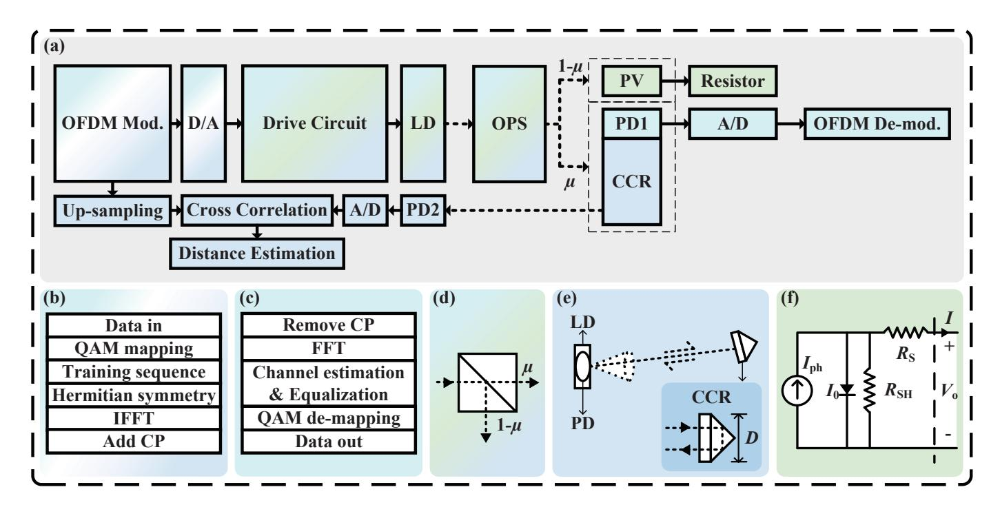

Fig. 1. (a) The proposed O-ICSPT system framework. (b) OFDM modulation. (c) OFDM de-modulation. (d) OPS model. (e) Point source and CCR model. (f) PV equivalent circuit.

The analog electrical signal is converted to optical signal by the LD. Flexible resource allocation is facilitated by optical power splitting in the spatial domain, which is accomplished using an optical power splitter (OPS), as illustrated in Fig. 1(d). The OPS can be integrated either in the transmitter or the receiver, depending on the specific requirements of different application scenarios. The light emitted from the LD is split into two sub-beams through the OPS in accordance with a predefined ratio. One portion of the beam follows the original path and is used for communication and sensing. The other portion is diverted at a 90-degree angle and is utilized for EH. By setting the optical power splitting factor as  $\mu$ , the optical power allocated for communication and sensing is written as

$$P_{\rm ISAC} = \mu P_l = \mu \xi \left( \sqrt{g} s + I_{\rm DC} \right). \tag{4}$$

The optical power allocated for EH is written as

$$P_{\rm EH} = (1 - \mu) P_l = (1 - \mu) \xi (\sqrt{g}s + I_{\rm DC}),$$
 (5)

where  $\mu \in [0,1]$ . The parameter  $\mu$  governs the allocation of optical power resources. By adjusting  $\mu$ , a flexible trade-off between communication-sensing performance and EH performance can be achieved.

The receiver module of the O-ICSPT system is divided into three parts: information decoding, sensing processing and EH. Optical power splitting enables the separation of the communication-sensing and EH functions, allowing the use of different photoconverters for signal detection and EH. The PD is chosen for its high sensitivity, fast response, and low noise, while the PV is favored for its superior power conversion efficiency relative to other photoconverters. The PD1, PD2, and PV are used as photoconverters for communication, sensing and EH, respectively, to leverage the distinct advantages of

each. The O-ICSPT system employs a passive sensing method based on reflected light for ranging. Compared to diffuse reflection on the target surface, the use of a light reflector significantly enhances light reflection, thereby substantially improving the quality of the reflected light. The corner cubic reflectors (CCR) is used as light reflector.

In the following, each receiver module is detailed described, and the corresponding numerical evaluations are provided.

#### A. Information Decoding Module

The LOS channel gain of communication module is given by [47]

$$h_{c} = \begin{cases} \frac{(m+1)A_{c}}{2\pi d_{c}^{2}} \cos^{m}(\phi) \kappa(\varphi) \cos(\varphi), & 0 \leq \varphi \leq \Psi_{c} \\ 0, & \text{else} \end{cases}$$
 (6)

where  $m=-\ln 2/\ln\left(\cos\left(\Phi_{1/2}\right)\right)$  is the order of Lambertion index with  $\Phi_{1/2}$  being the semi-angle at half power of the LD;  $d_c$  is defined as the distance between LD and PD1;  $A_c$  denotes the detection area of the PD1;  $\phi$  and  $\varphi$  denote the irradiance angle and the incidence angle, respectively;  $\kappa\left(\varphi\right)=T_s\left(\varphi\right)G\left(\varphi\right)$ , where  $T_s\left(\varphi\right)$  is the gain of optical lens and  $G\left(\varphi\right)=\nu^2/\sin^2\left(\Psi_c\right)$  is the gain of optical lens, with  $\nu$  and  $\Psi_c$  denoting the refractive index of the optical lens and half-angle field of view (FOV) of the PD in the communication receiver, respectively.

The received signal for communication is represented as

$$y_c = h_c \rho_c \mu \xi \sqrt{q} s + n_c, \tag{7}$$

where  $\rho_c$  is the responsivity of PD1, representing the current per unit of incident optical power (A/W), and  $n_c$  represents zero-mean Gaussian noise with a variance  $\sigma_c^2$ .

{4}------------------------------------------------

OFDM demodulation follows the inverse process of modulation, as illustrated in Fig. 1(c). Firstly, the CP is removed. Then the frequency-domain symbols are obtained via fast Fourier transform (FFT). Channel distortion is compensated by channel estimation and equalization. Finally, QAM de-mapping is performed to recover the original binary bit sequence. The received signal-to-noise ratio (SNR) of the communication signal is calculated as

$$\gamma_c = \frac{h_c^2 \rho_c^2 \mu^2 \xi^2 g \varepsilon}{\sigma^2}.$$
 (8)

Hence, the spectral efficiency of data transmission can be represented as [48]

$$\widetilde{C} = \frac{1}{2}\log_2\left(1 + \frac{e\gamma_c}{2\pi}\right),\tag{9}$$

where e is the Euler number. Assuming that the effective bandwidth of the system is B, the available data rate can be calculated as  $\frac{B}{2} \times \log_2 \left(1 + \frac{e\gamma_c}{2\pi}\right)$ .

#### B. Sensing Processing Module

The sensing channel model must account for the impact of light reflection, which distinguishes it from communication channel models. Due to its small divergence angle, the LD can be approximated as a point source. The CCR is capable of gathering and reflecting light back to the original source location. The model of the point source and CCR is illustrated in Fig. 1(e), where *D* denotes the diameter of the CCR. In point source model, the LD and the PD2 are placed side by side at the transmitter. Owing to the high collimation of the LD beam, the emitted light can be almost efficiently by the CCR. Specifically, the LOS channel gain for the sensing module under the point source model is given by [20]

$$h_{s} = \begin{cases} \frac{(m+1)A_{s}k}{8\pi d_{s}^{2}}\cos^{m+1}(\phi) \\ \kappa(\phi)\cos(\varphi), & 0 \leq \phi \leq \Psi_{s}, 0 \leq \varphi \leq \Psi_{r} \\ 0, & \text{else} \end{cases}$$
(10)

where  $d_s$  is defined as the distance between CCR and PD2;  $A_s$  denotes the detection area of the PD2; k is the reflectance of the CCR;  $\Psi_s$  and  $\Psi_r$  represent the half-angle FOV of the PD in the sensing transceiver and the half-angle FOV of the CCR in the sensing receiver, respectively. The propagation distance of the sensed signal is twice the distance between the transmitter and the ranging target. An additional  $\cos{(\phi)}$  term is introduced to account for the impact of the reflected signal to PD2. Furthermore, the term  $\kappa{(\cdot)}$  should also be calculated with respect to  $\phi$ .

The received signal for sensing is represented as

$$y_s = h_s \rho_s \mu \xi \sqrt{q} s + n_s, \tag{11}$$

where  $\rho_s$  is the responsivity in A/W of PD2, and  $n_s$  represents zero-mean Gaussian noise with a variance  $\sigma_s^2$ .

The quality of the reflected light plays a critical role in determining the sensing performance. The received SNR of the sensing signal is calculated as

$$\gamma_s = \frac{h_s^2 \rho_s^2 \mu^2 \xi^2 g \varepsilon}{\sigma^2}.$$
 (12)

The time-domain cross-correlation method is employed to perform ranging by using the time-domain samples of the original OFDM signal and the reflected OFDM signal, thereby ensuring the required sensing capability. Prior to performing the time-domain cross-correlation, the time-domain samples of the original OFDM signal should be up-sampled at the same up-sampling rate. Let  $\alpha$  denote the up-sampling rate; the maximum likelihood estimate of the time-of-flight is expressed as

$$\widehat{\tau} = \arg\max_{\tau} \sum_{n=0}^{\alpha L_w} y_s(n) x(n-\tau), \qquad (13)$$

where  $x\left(n\right)$  and  $y_s\left(n\right)$  are the up-sampled time-domain samples of the original OFDM signal and the time-domain samples of the received OFDM signal, respectively;  $L_w$  denotes the length of the time-domain window selected for cross-correlation before up-sampling. The estimated distance is calculated as  $\hat{d}=c\hat{\tau}/2$ , where c is the speed of light. The ranging RMSE is then calculated as

RMSE = 
$$\sqrt{\mathbb{E}\left[\left(d_s - \hat{d}\right)^2\right]}$$
. (14)

Let  $R_s$  denote the number of samples per second (Sa/s) taken by the analog-to-digital (A/D) converter of the sensing receiver, i.e., the sampling rate, and then the distance resolution and the maximum ranging distance are expressed as  $\Delta d = c/\left(2R_s\right)$  and  $d_{max} = c\left(\alpha L_w - 1\right)/\left(2R_s\right)$ , respectively.

#### C. EH Module

The PV cell is a critical component of the EH module, with its output characteristics highly dependent on the intensity of incident light. Variations in light intensity lead to changes in the output current and voltage of the PV, directly influencing its output power and subsequently altering its internal impedance. To maximize the output power, the PV must operate at the maximum power point. Assuming a constant luminous flux incident on the PV and operation at the maximum power point, its electrical equivalent can be analyzed. The equivalent circuit model of the PV, as depicted in Fig. 1(f), comprises a photogenerated current source  $I_{\rm ph}$ , a dark current  $I_0$  generated by the diode, a shunt resistor  $R_{\rm SH}$ , and a series resistor  $R_{\rm S}$ .  $I_{\rm ph}$  represents the current generated by incident light.  $I_0$  simulates the direct current (DC), which is dependent on irradiance and temperature.  $R_{\rm SH}$  models the reactive leakage current path, accounting for impurities in the junction and defects in the crystal structure of the PV.  $R_{\rm S}$  represents losses attributed to resistance in the welded cell boundaries, interconnecting elements, and semiconductor materials comprising the PV. The current generated by the PV cell is expressed as

$$I = I_{\rm ph} - I_0 \left( e^{\frac{V_{\rm o} + IR_{\rm S}}{a}} - 1 \right) - \frac{V_{\rm o} + IR_{\rm S}}{R_{\rm SH}},$$
 (15)

where  $a = kJT_{\rm C}/q_e$ . k is the Boltzmann's constant; J is the ideality factor of the diode;  $T_{\rm C}$  is the ambient temperature and

{5}------------------------------------------------

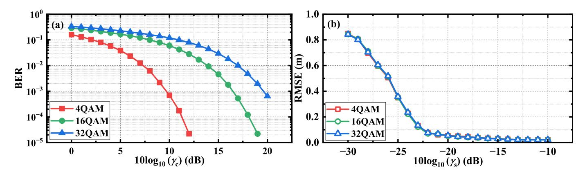

Fig. 2. BER and RMSE performance versus different SNR with  $\mu=1$ . (a) BER, and (b) RMSE.

 $q_e$  is the electron charge.  $I_{\rm ph}$  is determined by the intensity of light incident on the PV and can be calculated by

$$I_{\rm ph} = h_e \rho_e (1 - \mu) \xi I_{\rm DC},$$
 (16)

where  $\rho_e$  is the responsivity in A/W of PV and  $h_e$  denotes the channel gain of EH, given by [25]

$$h_e = \begin{cases} \frac{(m+1)A_e}{2\pi d_e^2} \cos^m(\phi) \kappa(\varphi) \cos(\varphi), & 0 \le \varphi \le \Psi_e \\ 0, & \text{else} \end{cases}$$
(17)

where  $d_e$  represents the distance between the LD and the PV;  $A_e$  denotes the detection area of the PV;  $\Psi_e$  is the half-angle FOV of the PV.

Assuming that the short-circuit current  $I_{\rm sc}$  is equal to  $I_{\rm ph}$  (i.e.,  $I_{\rm sc}=I_{\rm ph}$ ) [49], it is dependent on the open-circuit voltage  $V_{\rm oc}$  in a simple way, represented as

$$I_{\rm sc} = I_0 \left( e^{\frac{q_e V_{\rm oc}}{k T_{\rm C}}} - 1 \right) + \frac{V_{\rm oc}}{R_{\rm SH}}.$$
 (18)

In practice,  $R_{\rm SH}$  assumes very high values, rendering its effects negligible [50]. Ignoring the ratio between  $V_{\rm oc}$  and  $R_{\rm SH},~V_{\rm oc}$  can be derived based on the saturation current of the diode

$$V_{\rm oc} = V_{\rm t} \ln \left( 1 + \frac{I_{\rm sc}}{I_0} \right), \tag{19}$$

where  $V_{\rm t} = kT_{\rm C}/q_e$  is the thermal voltage.

In small-scale PV systems, the operating voltage  $V_{\rm o}$  of the PV at its maximum power point exhibits an approximately linear relationship with the open-circuit voltage  $V_{\rm oc}$ , i.e.  $V_{\rm o}=fV_{\rm oc}$ .  $f\in[0.71,0.78]$ , which slightly depends on irradiance conditions. The energy harvested is obtained as

$$P = fI_{\rm sc}V_{\rm oc}. (20)$$

Then the EH efficiency of the PV can be calculated as  $\eta = P/P_{\rm EH} \times 100\%$ .

#### D. Numerical Evaluation

Numerical simulations are conducted to evaluate the proposed O-ICSPT system framework. Non-ideal factors such as nonlinear distortion and low-pass frequency response are not considered here. The positions of the LD and PD2 are (2, 2.5,

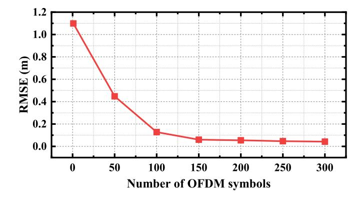

Fig. 3. RMSE performance versus the number of OFDM symbols used for sensing with  $\mu=1$ .

TABLE II SIMULATION PARAMETERS

| Parameter                                            | Value               |
|------------------------------------------------------|---------------------|
| LD emission semi-angle, $\Phi_{1/2}$                 | 15°                 |
| Half-angle FOV of PD, $\Psi_c$ & $\Psi_s$            | 60°                 |
| Half-angle FOV of CCR, $\Psi_r$                      | 60°                 |
| Half-angle FOV of PV, $\Psi_e$                       | 60°                 |
| Detection area of PD, $A_c$ & $A_s$                  | $1 \text{ cm}^2$    |
| Detection area of PV, $A_e$                          | $10 \text{ cm}^2$   |
| Current-to-light conversion coefficient of LD, $\xi$ | 8.6 W/A             |
| Responsivity of PD, $\rho_c$ & $\rho_s$              | 0.4 A/W             |
| Responsivity of PV, $\rho_e$                         | 0.3 A/W             |
| Refractive index of optical lens, $\nu$              | 1.51                |
| Reflectance of CCR, k                                | 0.92                |
| Bandwidth, B                                         | 200 MHz             |
| A/D conversion sampling rate, $R_s$                  | 2.5 GSa/s           |
| Noise power, $\sigma_c^2 \& \sigma_s^2$              | $10^{-12}$          |
| Dark current, $I_0$                                  | $10^{-9} \text{ A}$ |
| Thermal voltage, $V_{\rm t}$                         | 25 mV               |
| Fill factor, $f$                                     | 0.75                |

3), and the positions of PD1, the CCR, and the PV are (2, 2, 1.5). Other simulation parameters are detailed in Table II.

Fig. 2 illustrates the bit error rate (BER) and RMSE performance across different SNRs. The number of OFDM

{6}------------------------------------------------

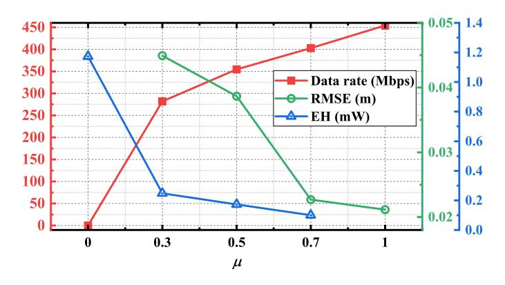

Fig. 4. The O-ICSPT system performance versus different µ.

symbols used for both communication and sensing is set to 200. As observed, in the communication domain, the SNR requirements vary depending on the order of the QAM modulation format. In contrast, on the sensing side, variations in QAM modulation order have a negligible impact on RMSE. Moreover, RMSE performance necessitates significantly lower SNR levels compared to BER performance. Notably, RMSE converges to its asymptotic region even at very low SNR values.

The number of OFDM symbols determines the length of the sequence used for cross-correlation in delay estimation. The autocorrelation function of this sequence exhibits a primary peak at zero delay, whose intensity is positively correlated with the sequence length. As illustrated in Fig. 3, increasing the number of OFDM symbols initially leads to a significant reduction in RMSE, which eventually converges. To minimize computational overhead, the ranging function can be fulfilled by extracting a segment of appropriate length from the ISAC signal acquired at the sensing receiver.

The performance of the O-ICSPT system, with fixed transmission power, is measured under different splitting ratios, as shown in Fig. 4. The number of OFDM symbols used for communication and sensing is 200 and 1, respectively. As the µ increases, a greater portion of optical power is allocated to communication and sensing, leading to an increase in both the communication received SNR and the sensing received SNR. Consequently, the performance of both communication and sensing improves continuously. Conversely, the optical power available for EH decreases as the µ increases, resulting in a gradual decline in EH performance. Notably, when µ = 0, the IDC is determined without considering communication and sensing performance.

## III. EXPERIMENTAL SET-UP

The experimental setup of the O-ICSPT system is illustrated in Fig. 5. The offline-generated OFDM signal was loaded into an arbitrary waveform generator (AWG: UNI-T UTG9604T) for D/A conversion, with the output signal having a peakto-peak voltage of Vpp. The analog signal was amplified by an electrical amplifier (EA: Mini-Circuits ZHL-6A-S+) and coupled to the DC via a bias-Tee (Mini-Circuits ZFBT-4R2GWFT+). Next, the LD (Red LD: Ushio HL63603TG, 638

TABLE III EXPERIMENTAL PARAMETERS

| Parameter                                     | Value     |
|-----------------------------------------------|-----------|
| Number of data subcarriers                    | 122       |
| FFT/IFFT size                                 | 256       |
| Zero padding length                           | 6         |
| CP length                                     | 8         |
| AWG sampling rate                             | 200 MSa/s |
| OSC sampling rate                             | 2.5 GSa/s |
| APD photosensitive area                       | 1 mm2     |
| OPS edge length                               | 25 mm     |
| CCR diameter                                  | 50 mm     |
| PV photosensitive area                        | 1 cm2     |
| Distance between LD and APD/CCR               | 1.5 m     |
| Distance between LD and PV                    | 0.6 m     |
| Length of training sequences                  | 10        |
| Number of OFDM symbols used for communication | 180       |
| Number of OFDM symbol used for sensing        | 1         |

nm; Green LD: Osram PLT3 520D, 520 nm; Blue LD: Osram PL 450B, 450 nm) was driven and converted the electrical signal into an optical signal. The beam was split into two subbeams at a specified ratio using an OPS (HYGX HCBS1). One sub-beam passed through the OPS and was detected by an avalanche photodiode (APD: Hamamatsu C12702-11) at the receiver, where it was converted back into an electrical signal. This electrical signal was sampled by an oscilloscope (OSC: Tektronix MDO3034) and subsequently processed for demodulation of the offline communication signal. The receiver was also equipped with a CCR (Thorlabs PS976), which reflected the light beam back to the transmitter. The reflected light was detected by the APD, A/D converted by the oscilloscope, and the time delay was calculated using cross-correlation to estimate the distance. The second sub-beam, which was turned at a 90-degree angle, was absorbed and converted into electrical energy by a GaAs PV, which was connected to a load resistor. The harvested energy was measured by a digital power meter (Chroma 66205).

The specific experimental parameters are listed in Table III. The 6 low-frequency subcarriers were filled with 0 due to the poor response of the EA. The effective bandwidth is calculated as 200×122/(256+ 8) ≈ 92.42 MHz. The ranging resolution is determined to be 3 × 108/(2 × 2.5 × 109 ) = 0.06 m. The OPS was positioned parallel to the LD so that the reflected light did not pass through it. Due to the size constraints of the APD and CCR, the communication and sensing functions were measured separately in the experiment. However, it is important to note that in practical applications, the APD and CCR can be fully integrated. When the beam is simultaneously incident on the APD and CCR, both communication and sensing functions can be performed concurrently.

# IV. EXPERIMENTAL RESULTS AND DISCUSSIONS

In this section, we experimentally demonstrate an O-ICSPT system for the first time. System characteristics are revealed and the effects of bias current, Vpp, and light source wave-

{7}------------------------------------------------

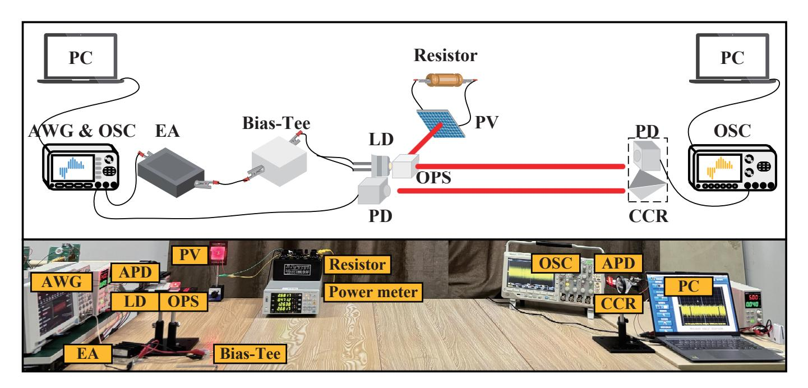

Fig. 5. O-ICSPT system experimental set-up.

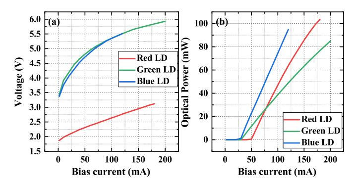

Fig. 6. Characteristic curves of LDs. (a) V-I characteristic curve, and (b) P-I characteristic curve.

length on each functional module are clarified through a comprehensive experimental study.

### A. System Characteristic

Initially, the characteristics of the O-ICSPT system are clarified by measuring some characteristic curves of LD and PV.

Fig. 6 illustrates the voltage versus current (V-I) and output optical power versus current (P-I) characteristic curves of three LDs with different wavelengths. The characteristic curves of the three LDs all show obvious nonlinear characteristics. The threshold currents of the red, green, and blue LDs are 50 mA, 30 mA, and 20 mA, respectively.

Fig. 7 shows the amplitude spectra and normalized channel frequency response. The amplitude spectra of the received signal gradually attenuates with increasing frequency, in sharp contrast to the relatively flat spectra of the transmitted signal. This phenomenon indicates that the SNR of higher-frequency subcarriers progressively deteriorates. This observation is consistent with the low-pass frequency response depicted in Fig.

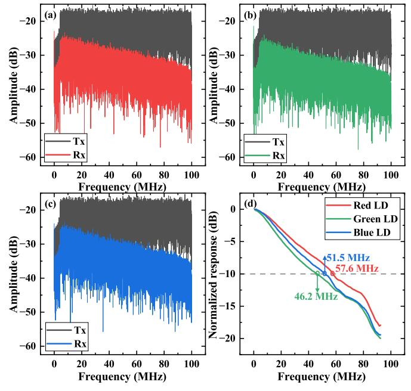

Fig. 7. Amplitude spectra of the transmitted and received signals of (a) red LD, (b) green LD, and (c) blue LD. (d) Normalized frequency response of different LDs.

7(d). The -10 dB bandwidths of the red, green, and blue LDs are 57.6 MHz, 46.2 MHz, and 51.5 MHz, respectively.

By varying the resistance of the load resistor, the V-I curves of the PV at different bias currents were measured, as shown in Fig. 8. For each V-I curve, there exists a specific maximum power point, and the associated resistance value represents the optimal matching impedance at that particular light intensity. In all the subsequent experiments involving EH, the optimal matching impedance, as determined by this

{8}------------------------------------------------

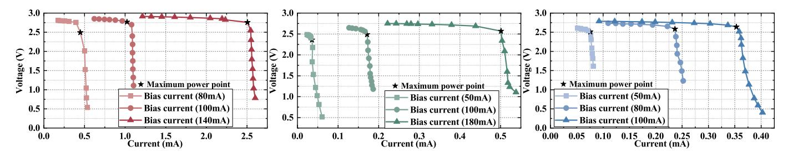

Fig. 8. V-I curve of PV with different bias currents (a) Red LD, (b) green LD, and (c) blue LD.

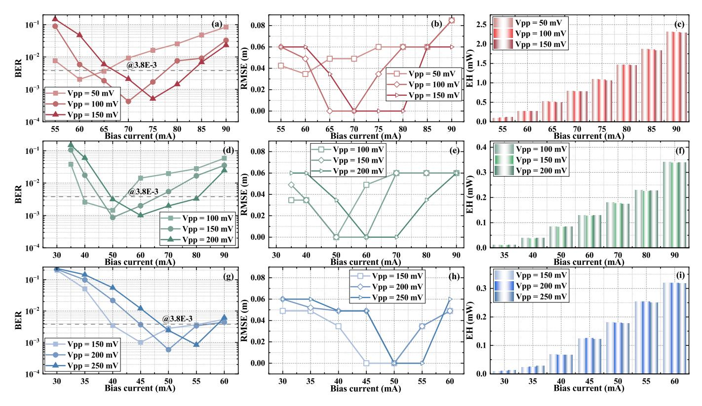

Fig. 9. BER, RMSE and EH performance versus different bias currents. (a)-(c) Red LD, (d)-(f) green LD, (g)-(i) blue LD.

method, was applied to ensure that the PV always operated at its maximum power point. Additionally, the output power of the PV was 0 when there was no directional light source irradiation, meaning that all the energy was derived from the LD light source.

#### B. System Performance

Subsequently, the effects of bias current, Vpp and light source wavelength on the performance of each functional module were investigated, as depicted in Fig. 9, Fig. 10 and Fig. 11. To comprehensively explore the performance limits of the developed O-ICSPT system, optical power resource allocation was not performed here. The performance metrics of the communication, sensing and EH were measured under conditions where the full optical power resources were available. The modulation order employed for the transmitted signal was 32QAM.

Fig. 9 illustrates the BER, RMSE, and EH performance of the O-ICSPT system under varying bias currents. The

BER performance considers the 7% forward error correction (FEC) BER threshold of  $3.8 \times 10^{-3}$ . Both the BER and RMSE decrease and then increase with increasing bias current. For both communication and sensing, there exists an optimal bias current that maximizes performance in each respective function. The value of the optimal bias current is influenced by Vpp. The alternating current (AC) component carries the communication-sensing information, which manifests as periodic fluctuations in the optical signal intensity. Too small a bias current results in signal clipping. With the gradual increase of the bias current, the bias current gradually meets the requirement of sending a non-negative signal and the LD operates in the linear region. However, beyond a certain point, an excessive bias current pushes the system into a nonlinear operating region, which degrades the waveform quality. In contrast, EH performance continues to improve with increasing bias current. The DC component provides stable optical power, which serves as the primary source for power transfer and directly influences the output performance

{9}------------------------------------------------

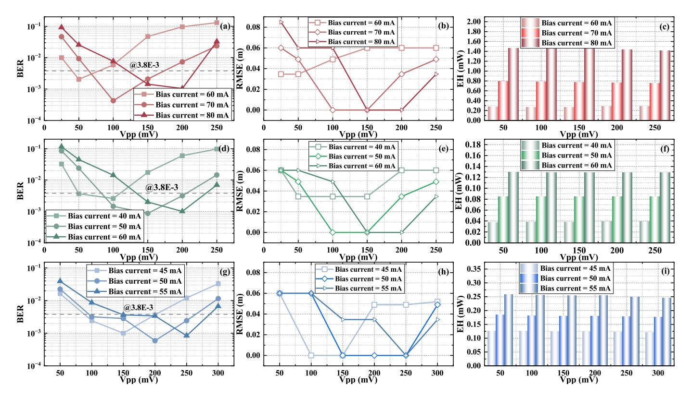

Fig. 10. BER, RMSE and EH performance versus different Vpps. (a)-(c) Red LD, (d)-(f) green LD, (g)-(i) blue LD.

of the PV. Therefore, the selection of the appropriate bias current is crucial for optimizing the overall performance of the O-ICSPT system. Different bias current values represent a trade-off between communication-sensing performance and EH performance.

Fig. 10 depicts the BER, RMSE, and EH performances of the O-ICSPT system for varying Vpp. Both BER and RMSE performances initially improve and then degrade as Vpp increases. For both communication and sensing, there exists an optimal Vpp that maximizes the respective performance. The value of the optimal Vpp is affected by the bias current. The modulation depth of the LD describes the relationship between the AC signal and the bias current, which is defined as the ratio between the difference between the peak current and the bias current to the bias current. For a given bias current, Vpp dictates the magnitude of the modulation depth. When Vpp is too small, the optical power associated with the AC signal becomes insufficient, resulting in insufficient received SNR. As Vpp increases, the optical power of the AC signal increases, which improves the received SNR. However, when Vpp becomes excessively large, nonlinear distortion in the LD is exacerbated, leading to degradation of the signal waveform and a consequent decline in communication and sensing performance. Furthermore, an increase in Vpp results in larger current fluctuations, which can elevate the heat generated within the LD. This increased thermal effect reduces the conversion efficiency of the LD, subsequently lowering the emitted optical power. In contrast to the effects on communication and sensing, EH is little affected by Vpp. When the bias current is small, the luminous intensity of

the LD is low, leading to a low total optical power received by the PV. In such conditions, the AC signal increases the instantaneous peak of the light intensity, potentially enhancing the EH performance. At high bias currents, the V-I characteristics of the PV approach the saturation region, and the light intensity fluctuations introduced by the AC signals may lead to a decrease in the conversion efficiency.

Fig. 11 shows the performance contours of each functional module of the O-ICSPT system. As previously discussed, both excessively high and low values of bias current or Vpp lead to a deterioration in the BER and RMSE performance. Specifically, low bias current and Vpp values can swamp the signal in noise, resulting in a low received SNR. However, excessively high bias current and Vpp values induce nonlinear effects. Therefore, for both communication and sensing, a practical dynamic range can be delineated, with an optimal operating point existing within this range. This optimal operating point can be identified by systematically varying the bias current and Vpp. The light source wavelength has a relatively minor effect on the communication and sensing performance, which is predominantly determined by the received SNR. The bias current directly influences the light intensity of the LD, with higher values resulting in increased output power from the PV. In contrast, the impact of Vpp on EH is minimal and almost negligible. Consequently, there is no distinct optimal operating point for EH. Instead, the maximum EH is contingent upon the maximum bias current that the LD can withstand within its operational range. The light source wavelength significantly affects EH performance, as PV exhibit varying degrees of responsiveness to light of different wavelengths. This highlights

{10}------------------------------------------------

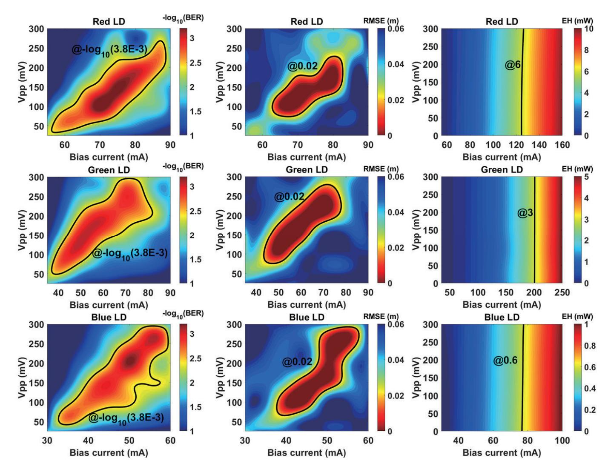

Fig. 11. Contour of system BER, RMSE and EH performance.

the critical role that wavelength selection plays in optimizing EH performance within the O-ICSPT system.

Finally, an O-ICSPT system with a priority on communication and sensing was experimentally demonstrated, as shown in Fig. 12 and Fig. 13. The optimal operating points for the three LD were determined based on the analysis in Fig. 11. Specifically, the optimal bias current for the red LD was found to be 70 mA, with an optimal Vpp of 100 mV. For the green LD, the optimal bias current was 50 mA, and the optimal Vpp was 150 mV. The optimal bias current and Vpp for the blue LD were determined to be 50 mA and 200 mV, respectively. In subsequent experiments, when the optical power splitting factor µ was non-zero, the O-ICSPT system was operated at these optimal operating points. In contrast, when the value of µ was set to zero, the operating points for the Vpp and bias currents were adjusted, with the red LD, green LD, and blue LD having Vpp values of 0 mV and bias currents of 160 mA, 250 mA, and 100 mA, respectively. Furthermore, to mitigate the low-pass frequency response and maximize the achievable data rate, a bit-loading strategy was employed. The data rates at all measured points are obtained under the condition that the BER is below the 7% FEC BER threshold, i.e., 3.8×10−3 . In other words, the achieved data rates include the 7% FEC overhead.

Fig. 12 illustrates the performance variations of each functional module with respect to the optical power splitting factor µ. When µ = 0, all optical power is directed to the PV module for EH. In this case, since there are no constraints imposed by communication or sensing requirements, the bias current can be set close to the maximum allowable level of the LD, resulting in excellent EH performance. When µ increases from 0 to a nonzero value, the system prioritizes communication and sensing by setting the bias current to a lower level optimized for communication, which leads to a sharp degradation in EH performance. At the same time, the communication and sensing functionalities benefit significantly from the increased allocation of optical power, leading to noticeable performance improvements. As µ continues to increase, a greater proportion of optical power is allocated to communication and sensing, while the power available for EH gradually decreases. Since optical power directly influences the SNR at the receiver and the output power of the PV module, increasing µ leads

{11}------------------------------------------------

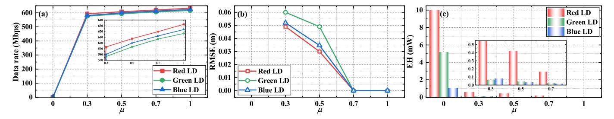

Fig. 12. The O-ICSPT system performance versus different  $\mu$ . (a) Data rate, (b) RMSE, and (c) EH.

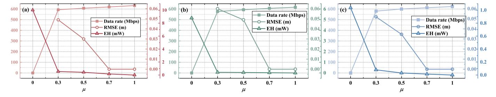

Fig. 13. The O-ICSPT system performance of different LDs. (a) Red LD, (b) green LD, and (c) blue LD.

TABLE IV EH Efficiency under Different LDs

|                    | Red LD | Green LD | Blue LD |
|--------------------|--------|----------|---------|
| Optical power (mW) | 92.3   | 103.8    | 74.4    |
| EH (mW)            | 10.019 | 5.1631   | 1.037   |
| η (%)              | 10.85  | 4.97     | 1.39    |

to higher data rates and lower RMSE, while EH capability progressively weakens. When  $\mu=1$ , all optical power is devoted to communication and sensing, achieving optimal data rate and RMSE performance. It is worth noting that this trend is not intrinsic to the system. By prioritizing EH through bias current adjustment, stable EH performance can be maintained across different  $\mu$  values, though at the cost of reduced communication and sensing. Alternatively, a moderate bias allows flexible balancing of all functions.

Fig. 13 depicts the performance of the O-ICSPT system with different LD light sources. A performance trade-off between communication-sensing and EH is achieved by splitting the optical power in the spatial domain. There is a constraint relationship between the communication-sensing performance and the EH performance. The experimental results show that when the light source is a red LD with a wavelength of 638 nm, the maximum data rate is approximately 632 Mbps, the minimum ranging RMSE is approaching 0 m, and the maximum EH is about 10.02 mW of the O-ICSPT system. The EH efficiencies of the PV with different wavelengths of the LD as the light source when  $\mu$  takes the value of 0 are given in Table IV. The GaAs PV has better absorption and higher photoelectric conversion efficiency of red light compared to green and blue light.

#### V. CONCLUSION

In this paper, we proposed a novel O-ICSPT system framework and presented the first experimental proof of concept. Based on a comprehensive experimental study, we draw the following conclusions:

- Communication and sensing performance are synergistic, both aimed at maximizing received SNR and mitigating nonlinear distortion. Communication-sensing performance and EH performance are in a trade-off relationship, where maximizing one often results in a loss of the other.
- Bias current significantly impacts communication, sensing, and EH performance. Enhancing tolerance to high bias currents is critical for optimizing overall performance.
- Vpp notably influences communication and sensing performance, while its effect on EH is minimal. A value of Vpp that satisfies the requirements for communication and sensing is sufficient.
- The light source wavelength has a minor effect on communication and sensing, but a substantial impact on EH.
  Red LDs, or even infrared LDs with longer wavelengths, are preferable for O-ICSPT systems.
- A larger optical power splitting factor boosts communication-sensing, while a smaller one benefits EH. Fine-grained control of this factor enables flexible trade-offs to meet diverse functional demands across different application scenarios.

The O-ICSPT system introduces a new technological paradigm, with experimental results highlighting its potential. These findings provide valuable insights into future O-ICSPT system design and highlight several key challenges. Infrared, near-infrared, and R/G/B LDs suit different scenarios, and multi-wavelength sources enable spectral separation and functional multiplexing, though integrating them into compact,

{12}------------------------------------------------

efficient transmitters remains difficult. Due to their low -3 dB bandwidth, PV modules cannot replace PDs, prompting interest in more lightweight hybrid receivers or PV-driven performance enhancement. Effective AC/DC power coupling is needed to meet communication and sensing requirements while maximizing DC output for EH, complicated by the nonlinearities of optical components at high power. Joint optimization of data rate, sensing accuracy, and EH further requires complex spatial, temporal, spectral, and power resource allocation. These open problems merit further research to fully unlock the potential of O-ICSPT systems.

### REFERENCES

- [1] Y. Xiao, Z. Ye, M. Wu, H. Li, M. Xiao, M.-S. Alouini, A. Al-Hourani, and S. Cioni, "Space-air-ground integrated wireless networks for 6G: Basics, key technologies, and future trends," *IEEE J. Sel. Areas Commun.*, vol. 42, no. 12, pp. 3327–3354, Dec. 2024.
- [2] F. Liu, Y. Cui, C. Masouros, J. Xu, T. X. Han, Y. C. Eldar, and S. Buzzi, "Integrated sensing and communications: Toward dual-functional wireless networks for 6G and beyond," *IEEE J. Sel. Areas Commun.*, vol. 40, no. 6, pp. 1728–1767, Jun. 2022.
- [3] T. D. Ponnimbaduge Perera, D. N. K. Jayakody, S. K. Sharma, S. Chatzinotas, and J. Li, "Simultaneous wireless information and power transfer (SWIPT): Recent advances and future challenges," *IEEE Commun. Surv. Tutorials*, vol. 20, no. 1, pp. 264–302, 1st Quart. 2018.
- [4] C.-X. Wang, X. You, X. Gao, X. Zhu, Z. Li, C. Zhang, H. Wang, Y. Huang, Y. Chen, H. Haas, J. S. Thompson, E. G. Larsson, M. D. Renzo, W. Tong, P. Zhu, X. Shen, H. V. Poor, and L. Hanzo, "On the road to 6G: Visions, requirements, key technologies, and testbeds," *IEEE Commun. Surv. Tutorials*, vol. 25, no. 2, pp. 905–974, 2nd Quart. 2023.
- [5] Z. Ji, X. Liu, and D. Tang, "Game-theoretic applications for decisionmaking behavior on the energy demand side: a systematic review," *Prot. Control Mod. Power Syst.*, vol. 9, no. 2, pp. 1–20, Mar. 2024.
- [6] A. Celik, I. Romdhane, G. Kaddoum, and A. M. Eltawil, "A top-down survey on optical wireless communications for the Internet of Things," *IEEE Commun. Surv. Tutorials*, vol. 25, no. 1, pp. 1–45, 1st Quart. 2023.
- [7] Y. Wen, F. Yang, J. Song, and Z. Han, "Optical integrated sensing and communication: Architectures, potentials and challenges," *IEEE Internet Things Mag.*, vol. 7, no. 4, pp. 68–74, Jul. 2024.
- [8] V. K. Papanikolaou, S. A. Tegos, K. W. S. Palitharathna, P. D. Diamantoulakis, H. A. Suraweera, M.-A. Khalighi, and G. K. Karagiannidis, "Simultaneous lightwave information and power transfer in 6G networks," *IEEE Commun. Mag.*, vol. 62, no. 3, pp. 16–22, Mar. 2024.
- [9] C. Liang, J. Li, S. Liu, F. Yang, Y. Dong, J. Song, X.-P. Zhang, and W. Ding, "Integrated sensing, lighting and communication based on visible light communication: A review," *Digital Signal Process.*, vol. 145, p. 104340, 2024.
- [10] C.-W. Chow, "Recent advances and future perspectives in optical wireless communication, free space optical communication and sensing for 6G," *J. Lightwave Technol.*, vol. 42, no. 11, pp. 3972–3980, Jun. 2024.
- [11] Y. Wen, F. Yang, J. Song, and Z. Han, "Pulse sequence sensing and pulse position modulation for optical integrated sensing and communication," *IEEE Commun. Lett.*, vol. 27, no. 6, pp. 1525–1529, Jun. 2023.
- [12] J. Wang, N. Huang, C. Gong, W. Wang, and X. Li, "PAM waveform design for joint communication and sensing based on visible light," *IEEE Internet Things J.*, vol. 11, no. 11, pp. 20 731–20 742, Jun. 2024.
- [13] Y. Wen, F. Yang, J. Song, and Z. Han, "Free space optical integrated sensing and communication based on LFM and CPM," *IEEE Commun. Lett.*, vol. 28, no. 1, pp. 43–47, Jan. 2024.
- [14] E. B. Muller, V. N. H. Silva, P. P. Monteiro, and M. C. R. Medeiros, "Joint optical wireless communication and localization using OFDM," *IEEE Photonics Technol. Lett.*, vol. 34, no. 14, pp. 757–760, Jul. 2022.
- [15] H. Wang, Z. Zeng, C. Chen, B. Zhu, S. Shao, and M. Liu, "Retroreflective optical ISAC supporting 3D positioning in indoor environments," in *Proc. IEEE Asia Commun. Photon. Conf.*, Beijing, China, 2024, pp. 1–5.
- [16] J.-Y. Wang, H.-N. Yang, J.-B. Wang, M. Lin, and P. Shi, "Joint optimization of slot selection and power allocation in integrated visible light communication and sensing systems," *IEEE Internet Things J.*, vol. 10, no. 24, pp. 22 415–22 426, Dec. 2023.

- [17] Y. Wen, F. Yang, J. Song, and Z. Han, "Free-space optical integrated sensing and communication based on DCO-OFDM: Performance metrics and resource allocation," *IEEE Internet Things J.*, vol. 12, no. 2, pp. 2158–2173, Jan. 2025.
- [18] R. Zhang, Y. Shao, M. Li, L. Lu, and Y. C. Eldar, "Optical integrated sensing and communication with light-emitting diode," in *Proc. IEEE Int. Conf. Commun. Workshops*, Denver, CO, USA, 2024, pp. 2059– 2064.
- [19] P. Zhang, J. Wu, Z. Wei, Y. Sun, R. Deng, and Y. Yang, "Channel modeling for NLoS visible light networks with integrated sensing and communication," *Opt. Lett.*, vol. 49, no. 11, pp. 2861–2864, Jun. 2024.
- [20] Y. Cui, C. Chen, Y. Cai, Z. Zeng, M. Liu, J. Ye, S. Shao, and H. Haas, "Retroreflective optical ISAC using OFDM: channel modeling and performance analysis," *Opt. Lett.*, vol. 49, no. 15, pp. 4214–4217, Aug 2024.
- [21] G. Pan, P. D. Diamantoulakis, Z. Ma, Z. Ding, and G. K. Karagiannidis, "Simultaneous lightwave information and power transfer: Policies, techniques, and future directions," *IEEE Access*, vol. 7, pp. 28 250–28 257, 2019.
- [22] D. Ma, G. Lan, M. Hassan, W. Hu, and S. K. Das, "Sensing, computing, and communications for energy harvesting IoTs: A survey," *IEEE Commun. Surv. Tutorials*, vol. 22, no. 2, pp. 1222–1250, 2nd Quart. 2020.
- [23] Z. Wang, D. Tsonev, S. Videv, and H. Haas, "On the design of a solarpanel receiver for optical wireless communications with simultaneous energy harvesting," *IEEE J. Sel. Areas Commun.*, vol. 33, no. 8, pp. 1612–1623, Aug. 2015.
- [24] P. D. Diamantoulakis, G. K. Karagiannidis, and Z. Ding, "Simultaneous lightwave information and power transfer (SLIPT)," *IEEE Trans. Green Commun. Networking*, vol. 2, no. 3, pp. 764–773, Sept. 2018.
- [25] S. Ma, F. Zhang, H. Li, F. Zhou, Y. Wang, and S. Li, "Simultaneous lightwave information and power transfer in visible light communication systems," *IEEE Trans. Wireless Commun.*, vol. 18, no. 12, pp. 5818– 5830, Dec. 2019.
- [26] M. Uysal, S. Ghasvarianjahromi, M. Karbalayghareh, P. D. Diamantoulakis, G. K. Karagiannidis, and S. M. Sait, "SLIPT for underwater visible light communications: Performance analysis and optimization," *IEEE Trans. Wireless Commun.*, vol. 20, no. 10, pp. 6715–6728, Oct. 2021.
- [27] C. Abou-Rjeily, G. Kaddoum, and G. K. Karagiannidis, "Ground-toair FSO communications: when high data rate communication meets efficient energy harvesting with simple designs," *Opt. Express*, vol. 27, no. 23, pp. 34 079–34 092, Nov. 2019.
- [28] M. Liu, H. Deng, Q. Liu, J. Zhou, M. Xiong, L. Yang, and G. B. Giannakis, "Simultaneous mobile information and power transfer by resonant beam," *IEEE Trans. Signal Process.*, vol. 69, pp. 2766–2778, May 2021.
- [29] M. Liu, S. Xia, M. Xiong, M. Xu, Q. Liu, and H. Deng, "NLOS transmission analysis for mobile SLIPT using resonant beam," *IEEE Trans. Wireless Commun.*, vol. 23, no. 1, pp. 334–346, Jan. 2024.
- [30] Q. Zhang, Z. Liu, F. Yang, J. Song, and Z. Han, "Simultaneous lightwave information and power transfer for OIRS-aided VLC system," *IEEE Wireless Commun. Lett.*, vol. 12, no. 12, pp. 2153–2157, Dec. 2023.
- [31] Z.-Y. Wu, Z.-S. Chen, and P.-C. Song, "Optimizing simultaneous lightwave information and power transfer under practical indoor mobility with reinforcement learning," *IEEE Photonics J.*, vol. 15, no. 5, pp. 1–7, Oct. 2023.
- [32] S. Zhang, D. Tsonev, S. Videv, S. Ghosh, G. A. Turnbull, I. D. W. Samuel, and H. Haas, "Organic solar cells as high-speed data detectors for visible light communication," *Optica*, vol. 2, no. 7, pp. 607–610, Jul 2015.
- [33] N. A. Mica, R. Bian, P. Manousiadis, L. K. Jagadamma, I. Tavakkolnia, H. Haas, G. A. Turnbull, and I. D. W. Samuel, "Triple-cation perovskite solar cells for visible light communications," *Photon. Res.*, vol. 8, no. 8, pp. A16–A24, Aug 2020.
- [34] I. Tavakkolnia, L. K. Jagadamma, R. Bian, P. P. Manousiadis, S. Videv, G. A. Turnbull, I. D. W. Samuel, and H. Haas, "Organic photovoltaics for simultaneous energy harvesting and high-speed MIMO optical wireless communications," *Light Sci. Appl.*, vol. 10, no. 1, 2021.
- [35] J. I. De Oliveira Filho, A. Trichili, O. Alkhazragi, M.-S. Alouini, B. S. Ooi, and K. N. Salama, "Reconfigurable MIMO-based self-powered battery-less light communication system," *Light Sci. Appl.*, vol. 13, no. 1, p. 218, 2024.
- [36] H. Lim, Y. Park, and Y. Song, "Underwater SLIPT prototype system with a combined solar panel-photodiode receiver: Design, implementation, and operation strategy," *IEEE Wireless Commun. Lett.*, vol. 13, no. 12, pp. 3673–3677, Dec 2024.

{13}------------------------------------------------

- [37] X. Li, Z. Han, G. Zhu, Y. Shi, J. Xu, Y. Gong, Q. Zhang, K. Huang, and K. B. Letaief, "Integrating sensing, communication, and power transfer: From theory to practice," *IEEE Commun. Mag.*, vol. 62, no. 9, pp. 122– 127, Sept. 2024.
- [38] S. He, K. Shi, C. Liu, B. Guo, J. Chen, and Z. Shi, "Collaborative sensing in Internet of Things: A comprehensive survey," *IEEE Commun. Surv. Tutorials*, vol. 24, no. 3, pp. 1435–1474, 3rd Quart. 2022.
- [39] J. I. d. O. Filho, A. Trichili, B. S. Ooi, M.-S. Alouini, and K. N. Salama, "Toward self-powered internet of underwater things devices," *IEEE Commun. Mag.*, vol. 58, no. 1, pp. 68–73, Jan. 2020.
- [40] X. Li, Z. Han, Z. Zhou, Q. Zhang, K. Huang, and Y. Gong, "Wirelessly powered integrated sensing and communication," in *Proc. 1st ACM MobiCom Workshop Integr. Sens. Commun. Syst.*, Sydney, NSW, Australia, Oct. 2022, pp. 1–6.
- [41] Z. Zhou, X. Li, G. Zhu, J. Xu, K. Huang, and S. Cui, "Integrating sensing, communication, and power transfer: Multiuser beamforming design," *IEEE J. Sel. Areas Commun.*, vol. 42, no. 9, pp. 2228–2242, Sept. 2024.
- [42] C. Xie, Y. Li, L. Chen, W. Shi, Z. Zhang, and Y. Xiu, "Power minimization for integrated sensing, communication, and power transmission systems," *IEEE Commun. Lett.*, vol. 28, no. 12, pp. 2779–2783, Dec. 2024.
- [43] Z. Hao, Y. Fang, X. Yu, J. Xu, L. Qiu, L. Xu, and S. Cui, "Energyefficient hybrid beamforming with dynamic on-off control for integrated sensing, communications, and powering," *IEEE Trans. Commun.*, vol. 73, no. 3, pp. 1709–1725, Mar. 2025.

- [44] Z. Zhu, K. Guo, Z. Chu, D. Mi, J. Mu, S. Muhaidat, and K.-K. Wong, "Unlocking integrated wireless powered sensing and communication networks using reconfigurable intelligent surface," *IEEE Trans. Wireless Commun.*, 2025, early access.
- [45] Z. Liang, H. Lu, D. Chen, Q. Wang, H. Kong, X. Liu, J. Jin, H. Chen, and J. Wang, "Optimal design of integrated visible light communication and positioning system with energy harvesting," *Appl. Opt.*, vol. 62, no. 30, pp. 7985–7993, Oct 2023.
- [46] Z. Liang, H. Lu, H. Kong, J. Zhou, X. Liu, D. Chen, J. Jin, J. Wang, and H. Zhang, "Rate optimization based on successive convex approximation algorithm in the self-powered visible light communication and positioning system," *IEEE Trans. Wireless Commun.*, vol. 23, no. 11, pp. 16 559–16 574, Nov. 2024.
- [47] T. Komine and M. Nakagawa, "Fundamental analysis for visible-light communication system using LED lights," *IEEE Trans. Consum. Electron.*, vol. 50, no. 1, pp. 100–107, Feb. 2004.
- [48] A. Lapidoth, S. M. Moser, and M. A. Wigger, "On the capacity of free-space optical intensity channels," *IEEE Trans. Inf. Theory*, vol. 55, no. 10, pp. 4449–4461, Oct. 2009.
- [49] W. Xiao, N. Ozog, and W. G. Dunford, "Topology study of photovoltaic interface for maximum power point tracking," *IEEE Trans. Ind. Electron.*, vol. 54, no. 3, pp. 1696–1704, Jun. 2007.
- [50] C. I. d. V. Morales, J. C. T. Zafra, M. M. Cespedes, I. Martinez-Sarriegui, ´ and J. M. Sanchez-Pena, "Exploring bandwidth capabilities of solar cells ´ for VLC applications," *IEEE Trans. Ind. Inf.*, vol. 21, no. 1, pp. 894–901, Jan. 2025.