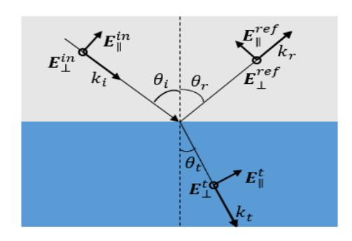
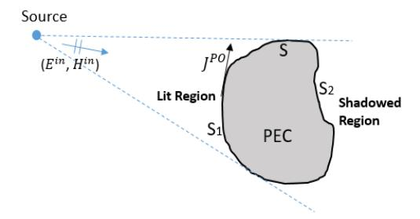
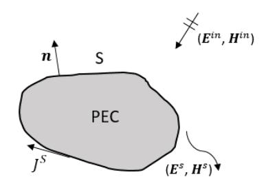
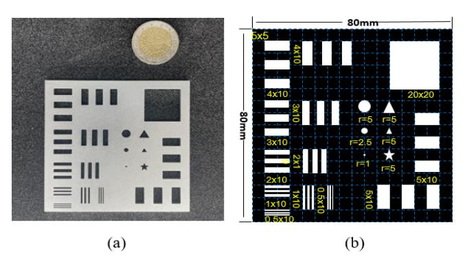
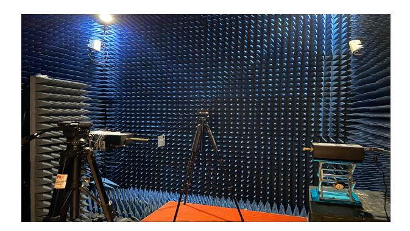
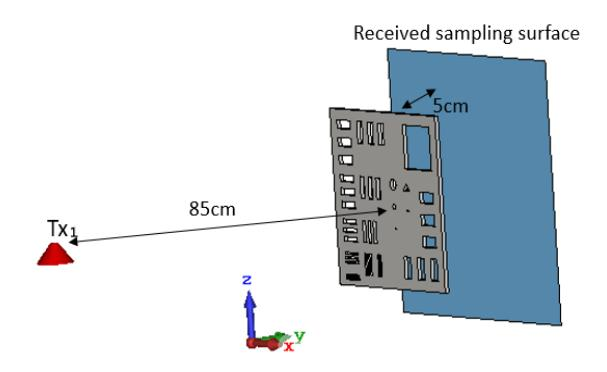
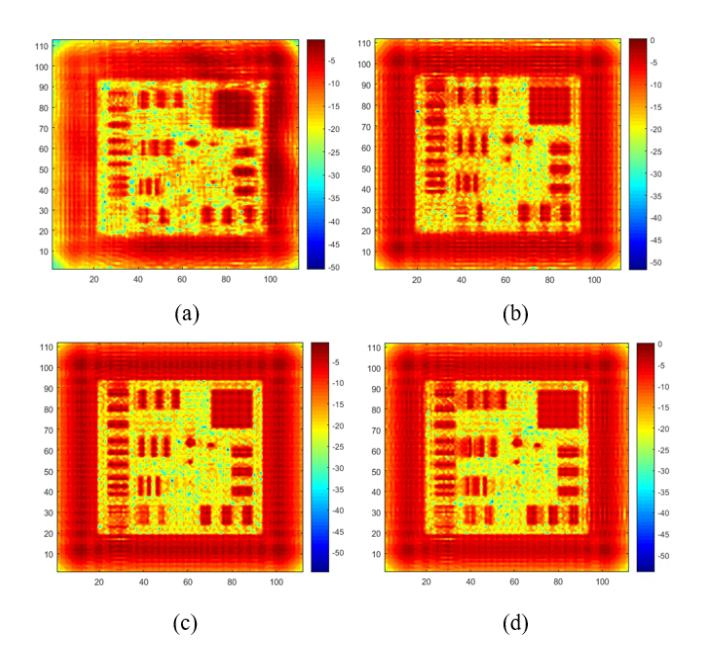
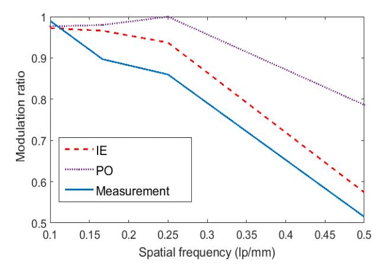

{0}------------------------------------------------

# Integrated Sensing and Communication in 6G: the Deterministic Channel Models for THz Imaging

Xianjin Li, Jia He, Ziming Yu, Guangjian Wang, Peiying Zhu *Huawei Technologies Co., Ltd* {lixianjin1; hejia83; yuziming; wangguangjian; peiying.zhu} @huawei.com

*Abstract*—In this paper, the channel modeling for integrated sensing and communication for 6G systems are studied. The channel modeling approaches, requirements, and challenges for communication cases and sensing cases are summarized and discussed. In particular, a 3-D metallic test chart is designed as a reference for studying electromagnetic imaging quality. The deterministic channel modeling approaches, i.e., geometrical optics method, physical optics method, and integral equation method, are introduced to simulate the imaging channel of the designed 3-D test chart. And the electromagnetic inverse scattering method is adopted as an imaging tool. The test is experimentally measured by 140 GHz signal with horn antennas in a chamber. The modulation transfer function (MTF) is applied to assess the imaging quality numerically, and the simulated and measured images are compared, which suggests that the imaging by integral equation is in agreement very well with that of measurement for 3-D test chart, and the geometric optics and physical optics methods can only show the characteristics of 2-D optical imaging.

*Index Terms*—Channel modeling, sensing imaging, integrated sensing and communication, computational electromagnetic methods

# I. INTRODUCTION

With the global roll-out of 5G wireless networks in 2020, services such as interactive augmented reality (AR), ubiquitous machine collaboration, real-time eHealth and advanced autonomous driving, which require accurate status sensing, will be promoted and applied on a wide range in next decade. As rapidly increasing demands for connecting environmental information through wireless network and devices, it could be envisioned that the system will integrate sensing and communication in the era of 6G [1]. Furthermore, sensing applications such as ultra-high resolution imaging and molecular level spectrogram analysis relying on higher frequencies are anticipated, thanks to the recent development in semiconductor technology has bridged the "THz band gap". Also future devices are allowed to extend current mmWave band to THz bands for supporting Tbps links based on that. New capabilities enabled by 6G communication system will enrich their functionality with integrated sensing and communication (ISAC). The wireless network can serve as a sensor as it explores the radio wave propagation to reconstruct environment and channel, which will help to facilitate reciprocity of communication and sensing.

Accurate and efficient channel models are the fundamental of the study of ISAC applications [2]. The channel models developed for conventional communications focus on the statistics of parameters like path loss, shadow fading, delay spread and angular spread to form a efficient model for system simulation. However, The algorithm design and performance evaluation of sensing strongly depend on the location of the target, transceiver and scatterers, which cannot be described by stochastic channel models. Therefore, we anticipate the arrival of accurate ISAC channel modeling methodologies that may lead to more precise evaluation. In this paper, we introduce geometrical optics (GO) [3], physical optics (PO) [4] and electromagnetic (EM) full-wave simulation methods [5] to modeling sensing channels. A 3-D test chart is designed as a benchmark for evaluating the sensing modeling quality. GO, PO and integral equation (IE) methods are used to simulate the EM fields and combine with EM inverse scattering method [6], [7] developing the image of the 3-D test chart. Besides, the image of the 3-D test chart is also experimentally measured by 140 GHz systems with horn antennas in a chamber and compared with the simulated images. The results shows that the imaging by IE agrees very well with that of measurement, and the GO and PO methods can only show the characteristics of 2-D optical imaging.

The remainder of this paper is organized as follows. In Sec. II, channel modeling methodologies and channel modeling challenges for ISAC applications are summarized and discussed. The GO, PO and IE methods are introduced in Sec. III. The experimental measurement and simulation as well as the sensing results are detailed and compared in Sec. IV. Finally, this paper is concluded in Sec. V.

# II. ISAC CHANNEL MODELING

In this section, we first introduce channel models for wireless communications. Then the channel modeling requirements for sensing use cases as well as the challenges of ISAC channel modeling are summarized and discussed.

## *A. Overview of Communication Channel Models*

The channel models for wireless communications can be roughly divided into three methodologies: stochastic, deterministic and hybrid channel models [8]. Stochastic channel models focus on the statistics of the key parameters of wireless channel including the distribution of the received signal, the number of multipath components (MPCs) or clusters, azimuth and elevation angles of arrival and/or departure. The reduced computational complexity of stochastic methodology enables fast simulations on the link-level and system-level evaluations 

{1}------------------------------------------------

of communications networks. In the past decades, the characteristics of MPCs draw much interest in stochastic channel models for high frequency bands whose bandwidth is large enough for resolving multipaths in the delay domain. Also the models are extended to spatial domain as the narrow beamwidth of directional antenna and MIMO technique provides the ability of resolving MPCs in the spatial domain. Though stochastic channel models can well capture the statistics of channel characteristics with feasible computation overhead, they fail to simulate the real-world physical wave propagation. This leads to inaccurate modeling of wireless channel in complicated propagation environment, e.g., with high mobility and rich scatterers.

Apart from the stochastic channel modeling, the deterministic approaches naturally solve the problems of modeling physical wave propagation. Deterministic channel methodologies mainly include full-wave electromagnetic algorithms, ray tracing and analytical wave analysis, which are locationspecific and requires the geometry and EM properties of the propagation environment. The full-wave electromagnetic algorithms is to calculate the EM fields through solving the Maxwell's equations, which discretize the propagation space and requires high computational complexity at high frequencies. The ray tracing method is the high-frequency approximation of the Maxwell's equations and regards the wave propagation as geometrical rays. The rays are traced and evaluated based on the geometric optics rules including but not limited to geometric optic, geometric theory of diffraction and uniform theory of diffraction.

Based on the preceding discussion, to take advantages of both deterministic and stochastic model, hybrid models are introduced as potential directions in recent decades. Quasideterministic models such as MiWEBA and 802.11ay are typical hybrid methods in which the dominate components are depicted by deterministic models and random components are statistically expressed. stochastic parameters and highprecision physical features of channel can be included in hybrid models.

## *B. Challenges of ISAC Channel Modeling*

Channel modeling for communication are different from those for sensing which generally requires high-resolution surrounding information. For example, localization requires the angle and delay of MPCs with high precision. The gesture and activity recognition requires the finger-level precision. To achieve the distance resolution of 1 cm, the measured bandwidth should be larger than 30 GHz. In order to achieve across-range resolution in 1 cm, the angular resolution need to be 0.01 rad for a sensing distance of 1 meter, which is enabled with large antenna aperture or massive antenna array. From the applications of ISAC, it relies on the real-world physical wave propagation with high precision and accuracy.

In addition to the above requirements for channel, communication and sensing are different in the modeling methodology. The communication channel modeling generally focus on point-to-point wave propagation. However, the stochastic channel models are not good at capturing the inter-connections and correlations among the one-to-multi-point channels, which are important to the sensing applications. Therefore, the concept of *spatial consistency* for characterizing the correlations among these channels is proposed and involved in the stochastic communication channel models in the recent years. Spatial consistency arised as typical feature which means the channel parameters for the receivers located in a local range are some what correlated. Therefore, the key large-scale channel parameters of different receivers including shadow fading, delay spread, and angular spread are generated under the consideration of correlation distance. The models for spatial consistency involved in the stochastic channel models are not adequate for sensing applications as they still rely on simple assumptions on the statistics of large-scale channel parameters and are not realistic enough.

Therefore, we conclude that the stochastic channel model are not suitable for the sensing applications while deterministic modeling approaches including GO, PO and EM full-wave electromagnetic algorithms are favored. However, a single channel modeling scheme may not meet the evaluation requirements of all ISAC applications. For sensing applications such as localization and tracking, ray tracing could be considered as a strong candidate for channel modeling since description of detailed contours and EM characteristics is not required. on the other hand, imaging and recognition, which is another typical application of sensing, needs to take EM algorithm into account when the scatterers approximate to wavelength and strongly correlated with the EM characteristics. In this regard, accurate channel modeling are required for air interface design and algorithms such as super-resolution, waveform, AI recognition evaluation. To address the issues, the EM full-wave methods, such as IE method [9], are introduced to imaging applications in this paper. Besides, the effect of the GO, PO and IE methods is analyzed and compared with that of measurement in the use case of imaging [10] which is the most stringent sensing example for channel accuracy. In addition to visual observation, the modulation transfer function (MTF) [11] is also used to evaluate numerically the imaging quality. Since real-word targets are 3-D and multi-scale, a typical 3-D test chart is designed as the imaging target, as shown in Fig. 4.

# III. THEORIES OF DETERMINISTIC CHANNEL MODELING AND THZ IMAGING

Due to the strict requirements of sensing imaging on channel accuracy, the deterministic channel models are extremely vital. As we all known, the GO method (also called as ray tracing) are widely used in communication channel modeling. In order to verify the baseline of sensing imaging in channel models, in addition to the GO, the PO and IE method are also considered in this paper. Next, their theories will be introduced briefly.

# *A. Deterministic Channel Model Methodologies*

*1) Geometrical Optics Method:* The GO is a ray field-based high-frequency approximate method, in which the Maxwell's equations are performed to a high-frequency approximation, 

{2}------------------------------------------------

namely ω −→ ∞. This theory assumes that the radiating energy propagation is along the optical ray directions, and the energy is diverged by propagation of ray tubes. Then, if the ray tubes imping upon the interfaces between different media, the reflection and refraction path satisfies the Fermat's principle [12], and the fields are formulated by the Snell's law and plane wave approximation. Besides, UTD method [13] can be combined with GO for diffraction of EM wave, once the rays illuminate on edges.

In this paper, only the GO for the plat objects are considered. As shown in Fig. 1, when the incoming plane wave Ein impinges upon the interface, the reflected field Eref can be solved by

$$\mathbf{E}^{ref}(\mathbf{r}) = R\mathbf{E}^{in}(\mathbf{r}) \tag{1}$$

where R denotes the reflection coefficient. Since the electromagnetic (EM) wave is divided into perpendicular and parallel polarizations, R consists of perpendicular polarization coefficient R⊥ and parallel polarization coefficient Rk, and they can be expressed as

$$R_{\perp} = \frac{\cos\theta_i - \sqrt{\varepsilon_2/\varepsilon_1 - \sin^2\theta_i}}{\cos\theta_i + \sqrt{\varepsilon_2/\varepsilon_1 - \sin^2\theta_i}}$$
 (2)

$$R_{\parallel} = \frac{(\varepsilon_2/\varepsilon_1)cos\theta_i - \sqrt{\varepsilon_2/\varepsilon_1 - sin^2\theta_i}}{(\varepsilon_2/\varepsilon_1)cos\theta_i + \sqrt{\varepsilon_2/\varepsilon_1 - sin^2\theta_i}}$$
(3)

where ε1/2 means the dielectric parameters of two adjacent media, and θi stands for EM wave incident angle. The refracted field Et can be described by

$$\mathbf{E}^{t}(\mathbf{r}) = T\mathbf{E}^{in}(\mathbf{r}) \tag{4}$$

in which T is transmission coefficient. similarity, T⊥ and Tk can be given by

$$T_{\perp} = \frac{2\cos\theta_i}{\cos\theta_i + \sqrt{\varepsilon_2/\varepsilon_1 - \sin^2\theta_i}} \tag{5}$$

$$T_{\parallel} = \frac{2\sqrt{\varepsilon_2/\varepsilon_1}cos\theta_i}{(\varepsilon_2/\varepsilon_1)cos\theta_i + \sqrt{\varepsilon_2/\varepsilon_1 - sin^2\theta_i}}$$
(6)

For perfect electric conductor (PEC) interface, there is no transmitted wave. Therefore, the reflection coefficients and transmission coefficients are

$$R_{\perp} = -R_{\parallel} = -1 \tag{7}$$

$$T_{\perp} = T_{\parallel} = 0 \tag{8}$$

For the field intensity calculation, if reflection and transmission orders of single ray respectively are U and V , the field intensity of receiving point can be formulated as

$$\mathbf{E}(\mathbf{r}) = \mathbf{E}^{in}(\mathbf{r}) \cdot \prod_{u=1}^{U} R_u e^{-jk_u s_u} \cdot \prod_{v=1}^{V} T_v e^{-jk_v s_v}$$
(9)

Fig. 1. Incidence, reflection and transmission of EM wave for GO.

Fig. 2. The physic optics schematic diagram for PEC objects.

where the diffraction phenomena are not considered for simplicity. Hence, for M different rays, the field intensity at the receiver are the vector sum of fields of all rays, namely

$$\mathbf{E}^{tol}(\mathbf{r}) = \sum_{m=1}^{M} \mathbf{E}_{m}(\mathbf{r})$$
 (10)

*2) Physical Optics Method:* Different from GO, the PO is a current-based high frequency approximation approach. Consider an arbitrary PEC object, which is illuminated by an incident source, as shown in Fig. 2. According to equivalence principle, equivalent current densities J P O on the PEC surfaces can be determined by

$$\mathbf{J}^{PO}(\mathbf{r}) = \hat{n} \times \mathbf{H}^{tol}(\mathbf{r}) = \hat{n} \times (\mathbf{H}^{in}(\mathbf{r}) + \mathbf{H}^{ref}(\mathbf{r})); \mathbf{r} \in S$$
 (11)

where Href means the scattered magnetic field of PEC, and nˆ is outward normal unit vector of PEC surface S. The PO assumes that the Hin and Href have the identical amplitude and are in phase at PEC surface S. Thus,

$$\mathbf{J}^{PO}(\mathbf{r}) \approx 2\hat{n} \times \mathbf{H}^{in}(\mathbf{r}); \mathbf{r} \in S$$
 (12)

Since the coupling effect is not considered in PO, the equivalent current density is zero at the regions not irradiated by the source, which is called as shadowed region, as shown in Fig. 2. Therefore, the PO currents can be formulated as

$$\mathbf{J}^{PO}(\mathbf{r}) = \begin{cases} 2\hat{n} \times \mathbf{H}^{in}(\mathbf{r}); \mathbf{r} \in S_1 \\ 0; \mathbf{r} \in S_2 \end{cases}$$
 (13)

{3}------------------------------------------------

Once the PO equivalent currents  $\mathbf{J}^{PO}$  are obtained, the radiated electric field  $\mathbf{E}^{rad}$  and magnetic field  $\mathbf{H}^{rad}$  can be respectively calculated by

$$\mathbf{E}^{rad}(\mathbf{r}) = \mathbf{E}^{in}(\mathbf{r}) - j\omega\mu \iint_{S_1} \left[1 + \frac{1}{k^2} \nabla \nabla \cdot \right] \mathbf{J}^{PO}(\mathbf{r}') G(\mathbf{r}, \mathbf{r}') dS_1$$
(14)

$$\mathbf{H}^{rad}(\mathbf{r}) = \mathbf{H}^{in}(\mathbf{r}) - \iint_{S_1} \mathbf{J}^{PO}(\mathbf{r}') \times \nabla G(\mathbf{r}, \mathbf{r}') dS_1 \quad (15)$$

in which  $G(\mathbf{r}, \mathbf{r}')$  denotes the free-space Green's function.

3) Integral Equation Method: The IE method is a full-wave method for rigorously solving Maxwell's equations. In this paper, we only consider the surface integral equation (SIE) based on the surface equivalent principle. Assuming an arbitrarily constructed PEC scatter is illuminated by incident electric and magnetic field in free space, as shown in Fig. 3. In accordance with the surface equivalent principle, the surface equivalent current  $\mathbf{J}^S$  will be induced on PEC surface S. If the  $\mathbf{J}^S$  is obtained, the free-space total electric and magnetic field can be solved by equations (14) and (15).

Following the boundary condition of PEC, the electric field tangential to the PEC surface is equal to zero:

$$\hat{n} \times \mathbf{E}^{in}(\mathbf{r}) = -\hat{n} \times \mathbf{E}^{s}(\mathbf{r}); \mathbf{r} \in S$$
 (16)

where  $\hat{n}$  is outward normal unit vector of S, and  $\mathbf{E}^s$  means scattering field of PEC, as shown in Fig. 3. According to the Stratton-Chu formula, the electric field integral equation (EFIE) can be written as

$$\hat{n} \times \mathbf{E}^{in}(\mathbf{r}) = \hat{n} \times j\omega\mu \iint_{S} \left[1 + \frac{1}{k^2} \nabla \nabla \cdot \right] \mathbf{J}^{S}(\mathbf{r}') G(\mathbf{r}, \mathbf{r}') dS$$
(17)

which can be abstracted as  $L(\mathbf{J}^S) = f$ . This equation is solved by method of moments (MoM) procedures [14]. Firstly, utilizing the basis function  $\mathbf{g}_n$  (e.g. RWG basis functions [15]) to expand the unknown  $\mathbf{J}^S$ ,

$$\mathbf{J}^{S}(\mathbf{r}') = \sum_{n=1}^{N} A_{n} \mathbf{g}_{n}(\mathbf{r}')$$
 (18)

where  $A_n$  is unknown coefficient. Therefore, original integral equation becomes

$$\sum_{n=1}^{N} A_n L(\mathbf{g}_n(\mathbf{r}')) = f$$
 (19)

Executing the Galerkin's testing program and selecting a set of testing function  $\mathbf{w}_m$ , and take the inner product to equation (19),

$$\sum_{m=1}^{M} \sum_{n=1}^{N} A_n \langle \omega_m, L(\mathbf{g}_n(\mathbf{r}')) \rangle = \sum_{m=1}^{M} \langle \omega_m, f \rangle$$
 (20)

which forms a matrix equation:

$$[Z]\{A\} = \{b\}$$
 (21)

where matrix Z and vector b are known, and vector A is unknown. Then the matrix equation needs to be solved for unknown coefficient, so that the currents  $\mathbf{J}^S$  can be obtained by equation (18).

Fig. 3. The integral equation schematic diagram for PEC scatters.

#### B. THz Imaging and Assessment Approach

To verify intuitively the difference between deterministic channel models and measurement, the THz sensing is carried out by the electromagnetic (EM) inverse scattering method [6], such as back projection (BP) [7], to reconstruct the image. These method can rebuild the geometrical and refractive characteristics of the scatterer based on the given incident wave and the measured or simulated scattered fields, which are viewed as the sensing channel.

Besides, the MTF [11] is introduced to assess numerically the image quality for three deterministic channel models and measurement in chamber. In MTF, the backscattering modulation  $M_{image}$  in the image can be formulated as

$$M_{image} = \frac{I_{max} - I_{min}}{I_{max} + I_{min}} \tag{22}$$

where  $I_{max}$  and  $I_{min}$  are respectively maximum and minimum backscattering intensities. The backscattering modulation  $M_{scene}$  of the real scene can be described by

$$M_{scene} = \frac{P_{max} - P_{min}}{P_{max} + P_{min}} \tag{23}$$

in which  $P_{max}$  and  $P_{min}$  mean respectively maximum and minimum backscattering intensities in the real scene. Therefore, in the imaging system, the modulation radio  $R_M$  is defined as

$$R_M = \frac{M_{image}}{M_{scene}} \tag{24}$$

#### IV. NUMERICAL EXAMPLES

## A. Measurement and Simulation Setup

To fully explain the THz sensing channel modeling accuracy, a typical 3-D test chart is designed as the imaging target, as shown in Fig. 4. We can observe that a 2 mm-thick PEC plate is hollowed out into slits of different widths and holes of different shapes. Imaging effect of these multi-scale structures can be as an evaluation criterion of sensing imaging channel accuracy.

A measurement setup in chamber was designed to be as a benchmark of the simulated sensing channel accuracy by deterministic channel modeling methods. The measurement scenario can be found in Fig. 5. It can be seen that the test chart is fixed between transmitter (Tx) and receiver (Rx) by tripods placed at both ends. In this imaging measurement process, the TX is a fixed position 140GHz horn antenna,

{4}------------------------------------------------

Fig. 4. The test chart's picture and its geometrical dimensions (Unit: mm), and its thickness is 2mm.

Fig. 5. The measurement in chamber for the 3-D test chart.

and the Rx probe scans samples along the established path to form a square virtual aperture, which is somehow equivalent to the real aperture. Then the received field matrices can be obtained as a EM imaging channel. The detailed measurement configuration parameters are listed in Table I.

TABLE I
THE MEASUREMENT CONFIGURATION PARAMETERS

| Parameters                         | Value                                              |
|------------------------------------|----------------------------------------------------|
| Frequency                          | 140 GHz                                            |
| Tx gain                            | 25 dBi                                             |
| Polarization                       | Along horizontal direction                         |
| Dimension of test chart            | $80\text{mm} \times 80\text{mm} \times 2\text{mm}$ |
| Distance between Tx and Rx         | 90 cm                                              |
| Distance between Rx and test chart | 5 cm                                               |
| Rx sweeping aperture area          | 12cm×12 cm                                         |
| Rx sweeping interval               | 1.07 mm                                            |
| Number of Rx scanning points       | 113                                                |

Besides, the simulation is done as well, in which two high-frequency approximating methods (GO and PO) and full-wave method (IE) are adopted. The simulation setup is as shown in Fig. 6. The dipole antenna is as the Tx, and transmitted field of the test chart in receiving sampling array is calculated as the sensing channel. The simulation configuration parameters can refer to the Table I. It should be noted that the hollow of the five-pointed star structure is replaced by small triangle because of geometrical modeling limitation.

Fig. 6. The simulation setup of the test chart sensing imaging channel.

Fig. 7. The imaging results from different channel models. (a) Measurement in chamber. (b) IE method. (c) GO method. (d) PO method

## B. Imaging Results

Based on the sensing channel obtained by measurement and three deterministic channel modeling methods, the imaging results of one side of the 3-D test chart are displayed at the Fig. 7. First of all, the outline of the test chart can basically be imaged by four channel models, except for the small-scale triangle and circular holes. Owing to the small wavelength in 140 GHz, the six slits in the lower left corner with widths of 0.5mm and 1mm can not be displayed in imaging of Figs. 7 (a) and 7 (b). The reasons are as follows. The slits cutting the surface currents can be views as a 2mm-long rectangular waveguide, which can propagate EM wave with  $TE_{10}$  mode, and has cutoff wavelength of  $\lambda_g = 2a$  (a means the length of the side that cuts off the current propagation). Therefore, the condition for EM waves passing through these slits is that wavelength is less than cutoff wavelength of rectangular waveguide ( $\lambda < 2a$ ), namely  $a > \frac{\lambda}{2}$ . The six slits (a=0.5) and 1mm) obviously does not meet this limitation. On the contrast, the images about the six slits can be shown in Figs. 7

{5}------------------------------------------------

Fig. 8. The MTF curves for three images from three different channel models.

(c) and 7 (d). This is because the GO and PO methods are optical approximation-based algorithms, and they cannot strictly characterize the physical process of electromagnetic wave resonance and propagation, but can only capture the 2- D surface characteristics (lit region), which is similar to optical imaging.

With the equation (24), MTF curves for three images obtained by measurement, IE and PO are shown in Fig. 8 as comparison. Since the image generated by GO is extremely similar to that of PO, it isn't drawn in this paper. It can be seen from Fig. 8 that the MTF curve of images obtained by IE method is closer to that of images from measurement in chamber. Therefore, we can conclude that the channel obtained by IE method is more similar to that of measurement in chamber, and can better characterize the physical phenomena of real-word 3-D electromagnetic sensing targets. The GO and PO methods can only show the characteristics of 2-D optical imaging.

# V. CONCLUSION

The algorithm and air interface design of sensing usually need specific-localization and high accuracy channel model which could not be achieved by conventional stochastic models. We therefore anticipate the adaptation of deterministic channel modeling methodologies that may lead to more precise evaluation. However, channel modeling for sensing are different from those for communications and generally requires high-resolution information of channel parameters. Therefore, the researches on the channel modeling for ISAC are concentrated on hybrid approaches depending on use cases. In sensing use cases such as the imaging and recognition, channel modelling is studied, which is the most challenging and with the most stringent requirements for channel accuracy. A 3-D multi-scale test chart is designed as electromagnetic imaging target, which is different from the 2-D test chart based on optical imaging. Three deterministic electromagnetic modeling methods (GO, PO and IE) are considered and compared with measurement in chamber. And the MTF is introduced and combined with electromagnetic imaging methods to assess the imaging quality. We found that no matter visual observation or MTF curve comparison, the channel modeling by IE (namely full-wave method) is more similar to that of measurement, and can better characterize the physical phenomena of multi-scale 3-D electromagnetic imaging targets compared with that of GO and PO methods.

## REFERENCES

- [1] W. Tong, P. Zhu, (Eds.). (2021). 6G: The Next Horizon: From Connected People and Things to Connected Intelligence. Cambridge: Cambridge University Press.
- [2] D. K. P. Tan, J. He, Y. Li, A. Bayesteh, Y. Chen, P. Zhu, and W. Tong, "Integrated sensing and communication in 6G: Motivations, use cases, requirements, challenges and future directions," *in Proc. 2021 1st IEEE Int. Online Symp. on Joint Commun. Sens.*, pp. 1C-6, Feb. 2021.
- [3] J. Lacik, Z. Lukes and Z. Raida, "On using ray-launching method for modeling rotational spectrometer," *in Radioengineering*, Vol.17, No.2, pp.98–107, June 2008.
- [4] C. Dong, L. Guo, X. Meng, "Application of CUDA-Accelerated GO/PO Method in Calculation of Electromagnetic Scattering From Coated Targets," *IEEE Access*, vol. 8, pp. 35420–35428,2020.
- [5] W. C. Chew, J. M. Jin, E. Michielssen, and J. Song, Fast and Efficient Algorithms in Computational Electromagnetics. Boston, MA: Artech House, 2001.
- [6] Gregson S, McCormick J, Parini C., Principles of planar near-field antenna measurements. IET, 2007.
- [7] G. L. Zeng, "Model-based filtered backprojection algorithm: A tutorial," *Biomed. Eng. Lett.*, vol. 4, no. 1, pp. 3–18, 2014.
- [8] C. Han and Y. Chen, "Propagation Modeling for Wireless Communications in the Terahertz Band," *IEEE Commun.Mag.*, vol. 56, no. 6, pp. 96C101, June 2018.
- [9] J. Hu, Z. Nie, L. Lei, and L. J. Tian, "Fast solution of scattering from conducting structures by local MLFMA based on improved electric field integral equation," *IEEE Trans. Electromagn. Compat.*, vol. 50, no. 4, pp. 940–945, Nov. 2008.
- [10] O. Li, J. He, K. Zeng, et al. "Integrated Sensing and Communication in 6G: A Prototype of High Resolution THz Sensing on Portable Device," *2021 European Conference on Networks and Communications* , 2021.
- [11] X. Lin, K. Wang, X. Liu, et al. "A new MTF-based image quality assessment for high-resolution SAR sensors," *2013 IEEE International Geoscience and Remote Sensing Symposium-IGARSS. IEEE*, pp. 1305– 1308, 2013.
- [12] P. Volker, Ray optics, Fermat's principle, and applications to general relativity. Springer Science and Business Media, Vol. 61, 2000.
- [13] G. Carluccio, F. Pug gelli, and M. Albani, "A UTD Triple Diffraction Coeffi cient for Straight Wedges in Arbitrary Confi guration," *IEEE Transactions on Antennas and Propagation*, AP-60, no. 12, pp. 5809- 5817, December 2012.
- [14] R F Harrington, Field Conptatioti by Moment Methods, New York, Macmillan, 1968.
- [15] S. M. Rao, D. R. Wilton, and A. W. Glisson, "Electromagnetic scattering by surfaces of arbitrary shape," *IEEE Trans. Antennas Propag.*, vol. AP30, no. 3, pp. 409–418, May 1982.