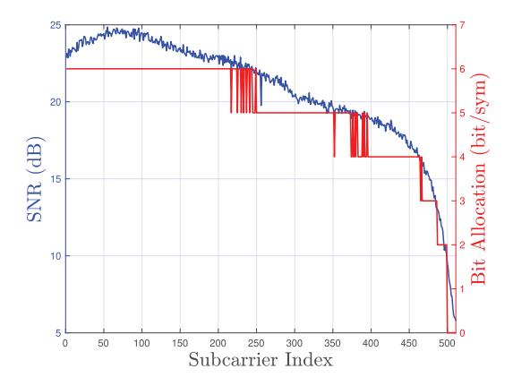
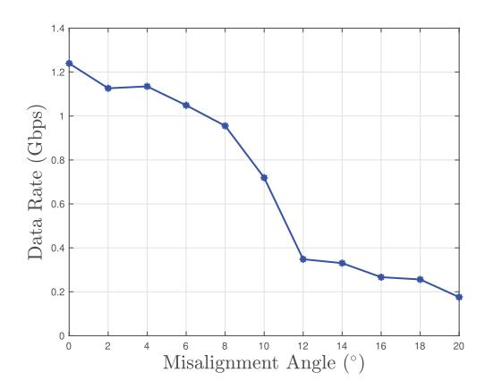
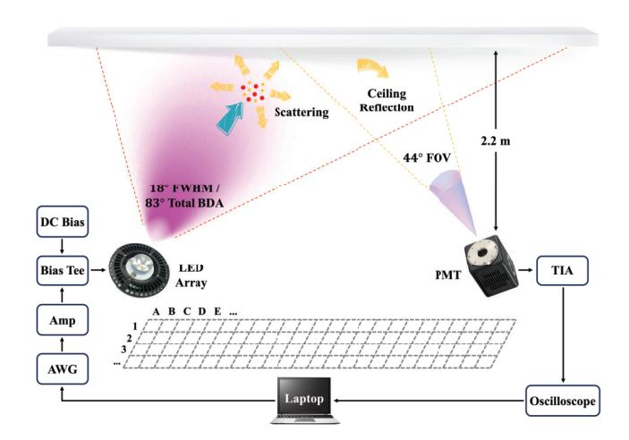
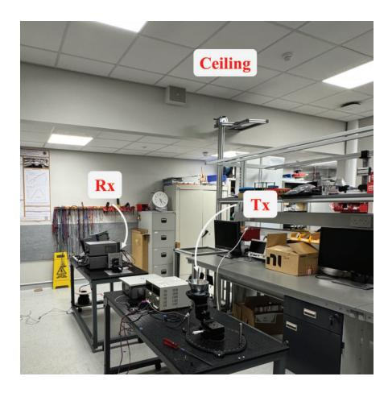
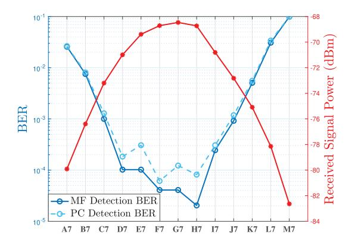
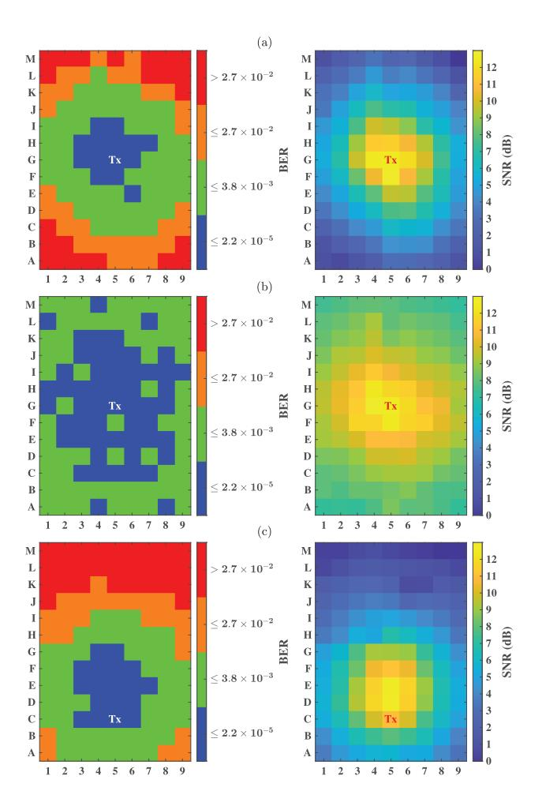
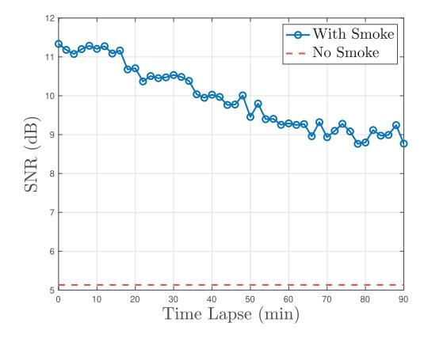

{0}------------------------------------------------

# Enhanced Room Coverage With Photon-Level NLOS Ultraviolet Optical Wireless Communication

Jian Sha[o](https://orcid.org/0009-0004-6050-8137) , Tilahun Zerihun Gutema [,](https://orcid.org/0000-0003-0119-1788) and Wasiu O. Popool[a](https://orcid.org/0000-0002-2954-7902)

*Abstract*—A robust indoor solar-blind ultraviolet (UV) communication system employing a non-line-of-sight (NLOS) scheme is presented. This approach achieves full-room coverage with a data rate of 2 Mbps, demonstrating resilience to transmitterreceiver misalignment compared to the line-of-sight (LOS) link. Additionally, the system's capabilities for joint wireless connectivity and particulate/aerosol sensing are demonstrated. The integrated communication and sensing functionality provides a promising solution for adaptable and secure operation in challenging environments.

*Index Terms*—Solar-blind UV communication, non-line-ofsight (NLOS), integrated sensing and communication (ISAC).

## I. INTRODUCTION

I N RECENT years, optical wireless communication (OWC) has achieved ultra-high-speed point-to-point links, reaching data rates of multiple terabits per second for collimated beam line-of-sight (LOS) channels [\[1\].](#page-3-0) In the ultraviolet (UV) range, data rates of up to 6.5 Gb/s have been demonstrated [\[2\].](#page-3-1) However, such set-ups impose stringent requirements on beam pointing/alignment, acquisition, and tracking (PAT). Strict alignment becomes even more challenging in practical scenarios, particularly with a non-fixed transmitter/receiver. To address this, there is a need to relax the beam PAT requirements for real-world applications. Moreover, visible light communication (VLC) and infrared communication (IRC) in free space are susceptible to ambient light interference, which degrades the signal-to-noise ratio (SNR) or even saturates the receiver [\[3\].](#page-3-2)

In this context, solar-blind UV ranging from 200 nm to 280 nm has gained significant attention because of its unique properties. Compared to visible light and IR, UV photons in this band undergo stronger scattering and absorption in the upper atmosphere before reaching the ground, and minimal artificial radiation occurs in this range [\[4\],](#page-3-3) [\[5\].](#page-3-4) As a result, background radiation in this spectrum is negligible, making photon-level UV wireless communication feasible with ultrasensitive photodetectors like photomultiplier tubes (PMTs). An overview of UV-based indoor OWC technology is given in [\[6\],](#page-3-5)

Received 14 January 2025; revised 7 March 2025; accepted 26 March 2025. Date of publication 9 April 2025; date of current version 21 October 2025. *(Corresponding author: Jian Shao.)*

The authors are with the Institute for Imaging, Data and Communications, School of Engineering, The University of Edinburgh, EH9 3FD Edinburgh, U.K. (e-mail: j.shao-7@sms.ed.ac.uk; t.gutema@ed.ac.uk; w.popoola@ed.ac.uk).

Color versions of one or more figures in this letter are available at https://doi.org/10.1109/LPT.2025.3559423.

Digital Object Identifier 10.1109/LPT.2025.3559423

including employing object reflection links. Although outdoor experiments utilising diffuse reflection from tree canopies, building facades, concrete grounds, etc. have been reported in [\[7\]](#page-3-6) and [\[8\],](#page-3-7) there is hardly a non-line-of-sigh (NLOS) UV communication system built indoor and demonstrating a wide coverage capability. Motivated by this, we have developed an indoor solar-blind UV communication system that establishes a robust link between moving transmitters and receivers by detecting ultra-weak UV signal scattered/reflected from the room ceiling. Moreover, we demonstrated the potential of integrated sensing and communication (ISAC) using our system.

In this letter, we first illustrate the limitation of commonly reported direct LOS UV systems with a 1.24 Gbps link whose performance is shown to rapidly fall off as misalignment is introduced. We then leverage air-scattering, reflections, and signal processing to achieve NLOS wireless communications with enhanced room coverage. The bit error rate (BER) and SNR maps are presented, demonstrating extended room coverage with low BER while transmitting a 2 Mbps on—off keying (OOK) signal. Additionally, we propose an optical particulate/aerosol detection system that enables simultaneous signal transmission and sensing. With inherent communication security, our solar-blind, reflection-assisted UV communication system is well suited for challenging environments, offering medium speed and wide coverage NLOS communications.

# II. LIMITATION OF LOS UV COMMUNICATION

The effect of misalignment is demonstrated to highlight a key limitation of commonly reported direct LOS OWC systems. For this, a commercial-off-the-shelf UV-C LED source (SUC ZHEF1VC-U1U2-LO-V2-250-R18), peak wavelength of about 265 nm is used. The experimental setup includes two 2-inch diameter lenses (Edmund Optics 84340), separated by a distance of 50 cm, which are used to collect and focus the emitted light onto a 400 MHz bandwidth avalanche photodiode (APD) (Thorlabs APD430A2/M). The transmitted data are generated using an arbitrary waveform generator (AWG). The optimal operating conditions used are 500 mV peak-to-peak signal voltage and 200 mA DC bias current, resulting in a modulation bandwidth of about 118 MHz.

Data transmission is at a symbol rate of 500 MBaud, using DC-biased optical orthogonal frequency division multiplexing (DCO-OFDM) modulation, 1024 subcarriers, with adaptive bit and power loading algorithm described in [\[9\].](#page-3-8) The maximum SNR measured is approximately 25 dB, allowing for up to 6 bit/symbol allocation (64-QAM), see Fig. [1.](#page-1-0) Thus, a

{1}------------------------------------------------

Fig. 1. Channel SNR response versus individual subcarriers (left) and bit allocation per data subcarriers (right) at optimum 200 mA DC bias and 500 mV modulation peak-to-peak voltage.

Fig. 2. Achieved data rate as a function of misalignment angle.

data rate of 1.24 Gbps is achieved at a BER of  $3.8 \times 10^{-3}$  representing 7% overhead hard-decision pre-forward error correction (FEC) limit and a 1.36 Gbps at  $1.0 \times 10^{-2}$  BER, less than a typical 20% soft-decision pre-FEC limit.

While this data rate is impressive, it is highly dependent on maintaining very stringent direct LOS with 0° offset angle between the transmitter (Tx) and the receiver (Rx). The combined effects of limited divergence angle and the Lambertian emission pattern of the LED will result in a sharp decrease in received intensity off-axis. So, considering the 7% FEC limit, slightly misaligning the transmitter from 0° to 20° offset azimuth angle degraded the link to below 200 Mbps (Fig. 2) - a significant drop in performance. Thus, such a LOS link has limited coverage and is not quite suitable for most practical applications. To address this stringent alignment requirement and the resulting limited coverage, a reflection-assisted diffused-beam NLOS UV link is proposed as a practical solution, thus making it suitable for reliable OWC in practical scenarios.

### III. ENHANCED COVERAGE WITH UV COMMUNICATION

Full-room coverage of the optical signal is achieved by detecting extremely weak scattered/reflected UV photons.

Fig. 3. Reflection-assisted NLOS UVC system block diagram.

Initially, a large part of the ceiling is illuminated by the UV LED array, which acts as a huge secondary light source. The reflected UV photons are then captured by an ultrasensitive optical detector, enabling a NLOS link that is free from signal blockage. This approach results in a pervasive coverage due to the extended area of the secondary light source.

## A. Experimental Set-up and Configurations

A block diagram of the ceiling-reflection NLOS UV communication system is shown in Fig. 3. On the transmitter side, the light source consists of an array of nine 265 nm UV LEDs (OSRAM SU CZHEF1.VC) with a combined rated output power of 0.45 W, which is kept consistent for all measurements. The beam is confined by an aluminium-coated spotlight reflector, resulting in a hot spot in the centre with full-width half-maximum (FWHM) of 18° and a diffused beam surrounding it with total beam divergence angle (BDA) of 83° (defined as 0.1% of its peak irradiance). A PMT (Hamamatsu H9305-09) with a 44° FOV is used to detect scattered/reflected photons. A UV bandpass filter (Newport 10BPF10-265) is mounted in front of the PMT to block background light. The weak photocurrent from PMT is then amplified using a transimpedance amplifier (TIA) and captured by an oscilloscope for off-line signal processing. According to the Directive 2006/25/EC regulation on optical radiation, the maximum permissible eye and skin exposure to UV-C radiation is 30 J/m2 over an 8-hour period, corresponding to an irradiance of 104.17 nW/cm2 [10]. However, at the receiver side, the UV irradiance is only 55 nW/cm2, well within the safety limits.

A photo of the experimental setup is shown in Fig. 4. The transmitter, receiver, and associated equipment are mounted on two movable optical benches. The vertical distance between each bench and the ceiling is 2.2 m. Corresponding to tiles, the ground is divided into grids of 31 cm  $\times$  31 cm, with rows and columns labeled 'A, B, ..., M' and '1, 2, ..., 9', respectively. This layout covers a rectangular area of 9 m² (2.46 m  $\times$  3.69 m) in total. Ambient lighting remains on throughout the experiment to evaluate the receiver's robustness to interference from background radiation. With a sensitive

{2}------------------------------------------------

Fig. 4. A photo of the experimental set-up and lab environment.

Fig. 5. BER for column 7 of Tx\_90°\_Rx\_90° using matched filter detection and photon counting detection with received signal power.

area of  $0.48 \text{ cm}^2$ , the background noise is measured to be -95.11 dBm.

To fully evaluate system performance, three different illustrative scenarios are considered. In the first scenario (Tx\_90°\_Rx\_90°), the LED array is placed in the room centre (grid G5) with 90° elevation angle, illuminating a circular area on the ceiling. The PMT, also oriented 90° upwards, is moved around the transmitter. In the second scenario (Tx\_90°\_Rx\_Varied), the PMT elevation angle is adjusted at each location so that it is looking towards the ceiling's hotspot above G5. For the third scenario (Tx\_75°\_Rx\_90°), the LED array is relocated to point C5, near the edge of the room edge, and angled at 75° towards the room centre, while the PMT is again oriented upward at 90° and moved around maintaining this angle. At each measurement point, a 2 Mbps data frame is sent and recorded, and its SNR and BER are calculated.

## B. Signal Transmission and Detection

Pulsed OOK-NRZ signalling is used to encode information. Although photon-counting (PC) detection is widely accepted for processing PMT outputs, we observed that matched filter (MF) detection outperforms PC detection when the PMT reaches saturation. Figure 5 presents the calculated BER for column 7 of Tx 90° Rx 90° in Subsection III-C, demon-

Fig. 6. BER and SNR mapping for considered configurations: (a)  $Tx\_90^\circ\_Rx\_90^\circ$ , (b)  $Tx\_90^\circ\_Rx\_Varied$ , and (c)  $Tx\_75^\circ\_Rx\_90^\circ$ .

strating lower BER for MF detection at signal powers above –71 dBm. Consequently, MF detection was adopted for all measurements taken in this study.

## C. Enhanced Coverage Results and Discussions

The BER and SNR maps for the three scenarios are shown in Fig. 6, with signal quality divided into four levels based on FEC thresholds. In the blue region, the BER is below  $2.18 \times 10^{-5}$ , meeting the 2.7% overhead FEC limit, while the green and orange regions correspond to the higher 7% and 20% overhead FEC limits, respectively. The red area indicates poor signal quality. The corresponding SNR maps are also provided to the right. In the first scenario (Fig. 6 (a)), omnidirectional coverage is achieved, but signal quality degrades towards the edges of the room due to limited 18° FWHM of the spotlight beam. In the second scenario (Fig. 6 (b)), orienting the receiver loosely toward the hotspot increases the blue and green regions, maintaining an SNR above 7.19 dB and BER below  $2.45 \times 10^{-4}$  throughout the area. In the third scenario (Fig. 6 (c)), the hotspot shifts and the illuminated area becomes elliptical, expanding the blue region and providing robust signal coverage even if the transmitter is placed at the edge of the room. The BER and SNR distributions align with the optical intensity patterns of ceiling reflection. As described,

{3}------------------------------------------------

Fig. 7. Received SNR with smoke-induced scattering.

this design significantly extends signal coverage and reduces strict beam pointing requirements.

#### IV. PROSPECT OF UV SENSING AND COMMUNICATION

The potential for simultaneous signal transmission and sensing is demonstrated by exploiting the increased scattering of UV photons due to presence of a higher aerosol/particle concentration in the channel. The dependency of the received signal power on the level of scattering has potential for sensing applications. One use-case scenario considered in this work is smoke detection in an enclosed environment while maintaining communication. The joint sensing and communication experiment is conducted in a controlled environment (acrylic enclosure  $50 \times 50 \times 50$  cm) using the same equipment as in the preceding. A smoke generator (BeamZ RANGE600I) is used to create long-lasting smoke in the box. The transmitter and receiver are individually positioned at elevation angles of 45° and 30° to minimise LOS and reflected signal components. The same 2 Mbps OOK-NRZ signal is transmitted through the smoke-filled scattering channel.

Under smoke-free conditions, the system initially achieved an average BER of  $2.64 \times 10^{-3}$  and 5.13 dB SNR, fulfilling high-reliability communication. Subsequently, artificial smoke is introduced into the enclosure for 10 s, and a hole is left on one side of the box to allow it to gradually dissipate. Data are transmitted and recorded at 2-minute intervals over a total duration of 1.5 hours. The SNR as a function of time lapse, used as an indicator of smoke density, is plotted in Fig. 7, along with the baseline SNR (red dotted line) in smoke-free conditions. It can be seen that SNR increases notably from 5.13 dB to 11.33 dB, while BER decreases from  $2.64 \times 10^{-3}$  to  $3.47 \times 10^{-4}$ , in the presence of dense smoke. The SNR gradually decreases as the smoke dissipates. After 1.5 hours, even when the smoke is no longer visible to the naked eye, the SNR and BER remain at 8.77 dB and  $1.22 \times 10^{-3}$ , respectively. These results indicate that the system maintains high sensitivity to smoke while ensuring low-error-rate communication at 2 Mbps. This dependency of received signal power on scattering levels suggests applications for ISAC, such as smoke detection in enclosed environments. A control mechanism could monitor variations in signal strength to trigger a fire alarm while maintaining

communication functionality. Although this showcases the reliability of the system under smokey conditions and its sensing potential, further characterisation is needed to fully develop it as a dedicated sensor.

#### V. CONCLUSION

This letter provides experimental demonstration of a solar-blind indoor UV communication system that offers highfidelity data transmission with relaxed beam PAT requirements. We first presented a 1.24 Gbps LOS link using collimated 265 nm UV light. However, such set-ups require strict alignment and suffer limited coverage. To address these limitations, we proposed an NLOS communication scheme which utilises diffused UV radiation that is scattered/reflected from the rough ceiling. With this approach, we demonstrated an enhanced room coverage with a 2 Mbps OOK signalling. This system exhibits robust performance even with substantial displacement between the transmitter and receiver. Furthermore, integration of sensing capabilities is explored using increased scattering of UV light in the presence of aerosol/particulate. The receiver successfully detects smoke while maintaining reliable communication. This dual functionality offers a promising solution for secure and adaptable communication in real-world challenging environments.

### ACKNOWLEDGMENT

For the purpose of open access, the authors have applied a Creative Commons Attribution (CC BY) licence to any Author Accepted Manuscript version arising from this submission.

## REFERENCES

- [1] M. A. Esmail, A. Ragheb, H. Fathallah, and M.-S. Alouini, "Investigation and demonstration of high speed full-optical hybrid FSO/fiber communication system under light sand storm condition," *IEEE Photon. J.*, vol. 9, no. 1, pp. 1–12, Feb. 2017.
- [2] D. M. Maclure et al., "Hundred-meter Gb/s deep ultraviolet wireless communications using AlGaN micro-LEDs," *Opt. Exp.*, vol. 30, no. 26, pp. 46811–46821, 2022.
- [3] I. Abdalla, M. B. Rahaim, and T. D. C. Little, "Interference in multiuser optical wireless communications systems," *Phil. Trans. Roy. Soc. A, Math., Phys. Eng. Sci.*, vol. 378, no. 2169, Apr. 2020, Art. no. 20190190.
- [4] L. Guo, Y. Guo, J. Wang, and T. Wei, "Ultraviolet communication technique and its application," *J. Semiconductors*, vol. 42, no. 8, Aug. 2021, Art. no. 081801.
- [5] G. A. Shaw, A. M. Siegel, and J. Model, "Extending the range and performance of non-line-of-sight ultraviolet communication links," *Proc.* SPIE, vol. 6231, pp. 93–104, May 2006.
- [6] T. Wu, T. Cao, F. Yang, J. Song, J. Cheng, and Z. Han, "Ultraviolet-based indoor wireless communications: Potentials, scenarios, and trends," *IEEE Commun. Mag.*, vol. 62, no. 3, pp. 82–88, Mar. 2024.
- [7] T. Cao, X. Gao, T. Wu, C. Pan, and J. Song, "Reflection-assisted non-line-of-sight ultraviolet communications," *J. Lightw. Technol.*, vol. 40, no. 7, pp. 1953–1961, Apr. 1, 2022.
- [8] S. Chen, T. Cao, M. Wang, and H. Zhang, "Reflection-assisted non-line-of-sigh t ultraviolet communication based on drone platform," in *Proc. Int. Conf. Electr. Eng. Photon. (EExPolytech)*, Oct. 2023, pp. 175–178.
- [9] T. Z. Gutema and W. O. Popoola, "Single LED Gbps visible light communication with probabilistic shaping," in *Proc. IEEE Global Commun. Conf.*, Jun. 2021, pp. 1–6.
- [10] O. J. European Union. (2006). Directive 2006/25/EC of the European Parliament and of the Council. Accessed: Mar. 6, 2025. [Online]. Available: https://eur-lex.europa.eu/legal-content/EN/ TXT/HTML/?uri=CELEX:32006L0025